# Introduction to Network

## What's the internet?

**Medium** 媒介

Optical fiber, metal …

Radio, light…

**Methods** 方法

Packet switches 分组交换

Protocols: TCP/IP, HTTP, 802.11

**Framework** 框架

Layered: from global to local

​	ISO/OSI - 7

​	IP stack - 5

### Protocol 协议

All communication activity in Internet governed by protocols 互联网上所有通信活动都由协议控制

Protocols define format, order of messages sent and received among network entities; and actions taken on message transmission, receipt

协议定义了网络实体之间发送和接收消息的格式、顺序;以及对消息传输、接收采取的行动

### Build Internet World 打造一个互联网世界

- **Infrastructure ** 网络基建
  - Communication Channel
  - Provided by ISP (ChinaTel, ChinaMobile, ChinaUnicom, 3, T-mobile)

- **Computing Service** 计算服务
  - Servers or Cloud
  - Provided by institutions or Could Service Provider (Aliyun, Amazon…)

- **Applications** 应用
  - A variety of applications with nice GUI
  - Provided by many companies and developers

## Network Edge and Core 网络边缘和核心

- **Network edge = Host:**

  Clients 客户端: PCs, Mobile phones, Smart Devices

  Servers 服务端: normally hosted in data centers

- **Physical media to access networks:**

  Wired or wireless communication links 有线或者无线交流服务

- **Network core:**

  Interconnected routers 互联网路由器

  Network of networks 网络

### Access network and physical media 访问网络和物理介质

- Residential access nets 住宅接入网

- Institutional access networks (school, company) 机构接入网络（学校、公司）

- Mobile access networks 移动接入网络

要熟记

- Bandwidth (bits per second) of access network? 访问网络的带宽（每秒位数）？

- Shared or dedicated? 共享还是专用？

## Different Ways to access internet 访问网络的不同方式

### Dial-up Internet access (PSTN) 拨号 Internet 访问 （PSTN）

Dial-up Internet access is a form of Internet access that uses the facilities of the public switched telephone network (PSTN) to establish a connection to an Internet service provider (ISP) by dialing a telephone number on a conventional telephone line. Dial-up connections use modems to decode audio signals into data to send to a router or computer, and to encode signals from the latter two devices to send to another modem.

拨号 Internet 访问是一种 Internet 访问形式，它使用公共交换电话网络 （PSTN） 的设施，通过拨打传统电话线上的电话号码来创建与 Internet 服务提供商 （ISP） 的连接。拨号连接使用调制解调器将音频信号解码为数据以发送到路由器或计算机，并将来自后两个设备的信号编码以发送到另一个调制解调器。

**Bandwidth: 56 Kbps ~ 10 min for a mp3 music；带宽：56 Kbps ~ 10 分钟（用于 mp3 音乐）**

### Digital subscriber line (DSL) 数字用户线 （DSL）

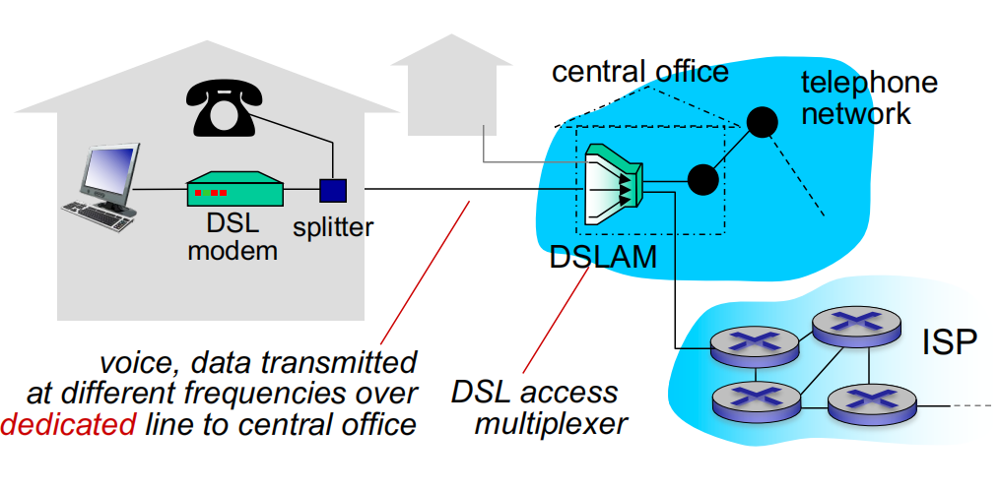

- **Telephone line based:** 电话线路为主

  - To central office DSL Access Multiplexer (DSLAM)

    到中心局 DSL 接入多路复用器 （DSLAM）

  - Data over DSL phone line goes to Internet

    通过 DSL 电话线的数据进入 Internet

  - Voice over DSL phone line goes to telephone net

    DSL 电话线语音进入电话网

- **Bandwidth  带宽**

  - Upstream transmission rate < 2.5 Mbps (typically < 1Mbps)

    上行传输速率 < 2.5 Mbps（通常< 1Mbps）

  - Downstream transmission rate < 24 Mbps (typically < 10Mbps)

    下行传输速率 < 24 Mbps（通常< 10Mbps）

  - ADSL = Asymmetric Digital Subscriber Line

     ADSL = 非对称数字用户线

### Access network: cable network (TV net based) 有线网络（基于 TV 网络）

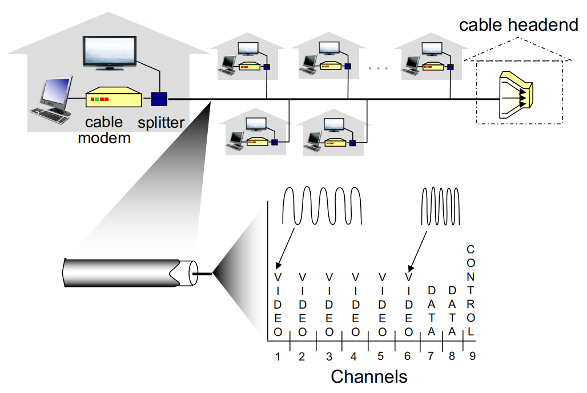

- Key technology: **Frequency division multiplexin**g (FDM) 关键技术：频分复用 （FDM）
  - Different channels transmitted in different frequency bands 在不同频段传输的不同频道

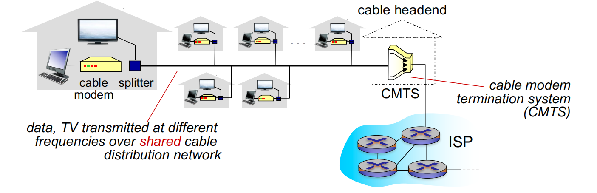

- **HFC: hybrid fiber coax  HFC混合光纤同轴电缆**

  - Asymmetric: 30Mbps downstream transmission rate, 2 Mbps upstream transmission rate

    非对称：30Mbps 下行传输速率，2 Mbps 上行传输速率

### **Access network: fiber to the home 光纤到户** 

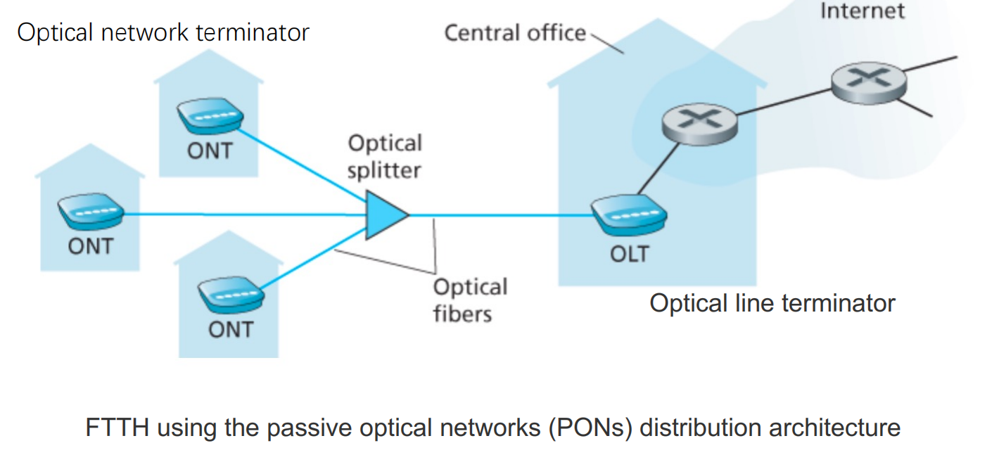

FTTH (Fiber To The Home光纤到户) 采用无源光网络分布架构

### Access network: home network 家庭网络

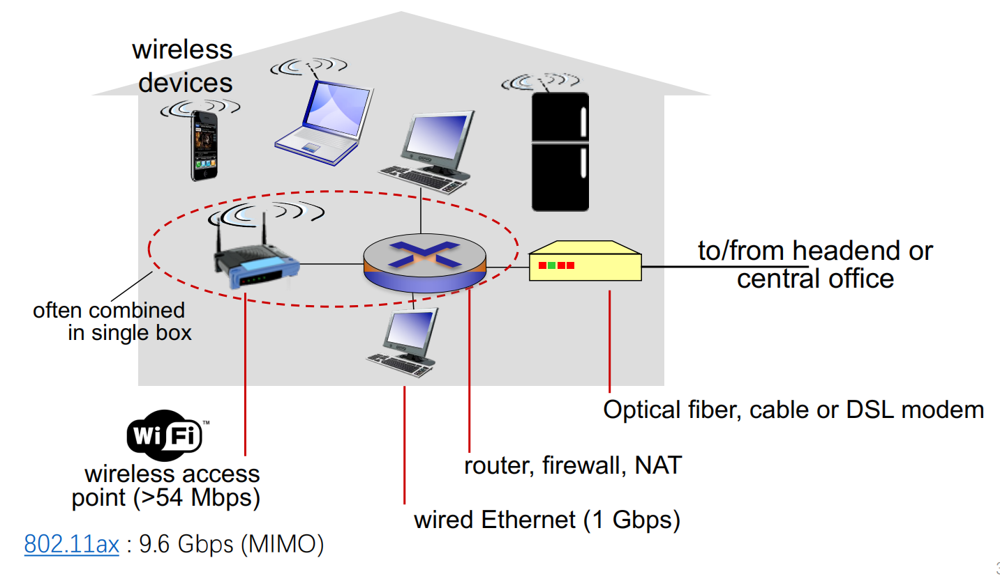

(Actually, home wireless router has no static routing function 其实家用无线路由器没有静态路由功能)

### Enterprise access networks (Ethernet) 企业接入网络（以太网）

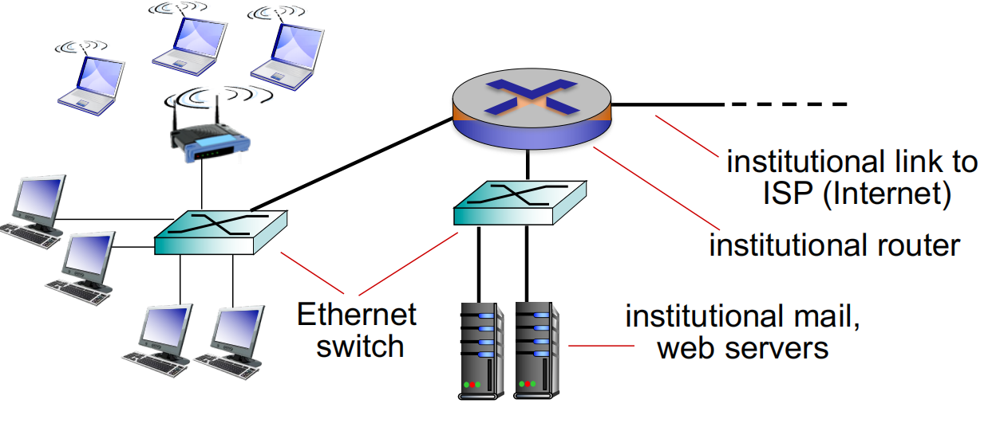

- Typically used in companies, universities, etc.

  通常用于公司、大学等。   -

- 10 Mbps, 100Mbps, 1Gbps, 10Gbps transmission rates

  10 Mbps、100Mbps、1Gbps、10Gbps 传输速率

- Today, end systems typically connect into Ethernet switch

  如今，终端系统通常连接到以太网交换机

### Wireless access networks 无线接入网络

- Shared wireless access network connects end system to router

  共享无线接入网络将终端系统连接到路由器

  - Via base station, aka “access point”

    通过基站，又名“接入点”

- Wireless LANs: 无线局域网

  - within building (100 ft.) 

    建筑物内 （100 英尺）

  - 802.11b/g/n (WiFi): 11, 54, 450 Mbps transmission rate

    802.11b/g/n （WiFi）：11、54、450 Mbps 传输速率

  - 802.11ax : 9.6 Gbps (MIMO)

- Li-Fi （in the future）

  - up to 10Gbps 

    高达 10Gbps

  - over the visible light, ultraviolet,  and infrared spectrums

    在可见光、紫外线和红外光谱上

- Wide-area wireless access 广域无线接入

  - provided by telco

    由 Telco 提供

  - Up to 1Gbps or More

    高达 1Gbps 或更高

  - 3G, 4G-LTE, 5G, Starlink

    3G、4G-LTE、5G、星链

## Different medium 不同的媒介

### Physical media 物理媒介

- **Guided media: 引导式媒体**

  - signals propagate in solid media: copper, fiber, coaxial cable

    信号在固体介质中传播：铜、光纤、同轴电缆

- **Unguided media: 非导向媒体** 

  - signals propagate freely, e.g.,  radio

    信号可以自由传播，例如无线电

#### Physical media: twisted pair, coax, fiber 物理介质：双绞线、同轴电缆、光纤

- Twisted pair (TP) 双绞线 （TP）

  - two insulated copper wires 两根绝缘铜线 

    - Category 5: 100 Mbps,  1 Gbps Ethernet. 第 5 类：100 Mbps、1 Gbps

    - Category 6: 10Gbps. 以太网第 6 类：10Gbps

- Coaxial cable: 同轴电缆：

  - two concentric copper conductors 两根同心铜导体
  - bidirectional 双向

  - broadband:
    - multiple channels on cable 电缆上的多个信道

- Fiber optic cable: 光缆：

  - glass fiber carrying light pulses, each pulse a bit 玻璃纤维携带光脉冲，每个脉冲有点

  - high-speed operation: v

    - high-speed point-to-point transmission (e.g., 10’ s-100’ s Gbps transmission rate)

      高速点对点传输（例如，10' S-100' S Gbps 传输速率）

  - low error rate:  错误率低：

    - repeaters spaced far apart  中继器间隔很远
    - immune to electromagnetic noise 不受电磁噪声影响

**INFERENCE!**

#### Physical media: radio 物理介质：无线电

- Signal carried in electromagnetic spectrum 电磁频谱中携带的信号

- No physical “wire” 没有物理“电线”

- bidirectional 双向

- Propagation environment effects: 传播环境影响：
  - Reflection, Obstruction by objects, Interference!
  - 反射、物体的阻碍、干扰！

**Radio link types:**

- Wireless LAN (e.g., WiFi)  局域网（例如 WiFi）-
  - 54 Mbps – 9.6Gbps

- Wide-area (e.g., cellular) 广域（例如蜂窝）

  - 4G cellular: ~ 100 Mbps

  - 5G cellular: ~ 1Gbps

- Satellite 卫星

  - Kbps to 45Mbps channel (or multiple smaller channels)

  - Starlink ~ 1440Mbps

  - 270 msec end-end delay

## How to link with others 如何与其他设备连接

### Network Core 网络核心

- **Mesh of interconnected routers **互连路由器的网状网络

- **Packet-switching 包交换**:

  - Hosts break application-layer messages into small packets

    主机将应用层消息分解为小数据包
  
  - Packages are forwarded from one router to the next, across links on path from source to destination
  
    包通过从源到目标的路径上的链接从一个路由器转发到下一个路由器

### Two key network-core functions 两个关键的网络核心功能

*Routing:* determines source destination route taken by packets

*路由选择：* 确定数据包采用的源目标路由

- routing algorithms 路由算法

*Forwarding:* move packets from router’s input to appropriate router output

*转发：* 将数据包从路由器的输入移动到适当的路由器输出

destination address in arriving packet’s header 到达数据包标头中的目标地址

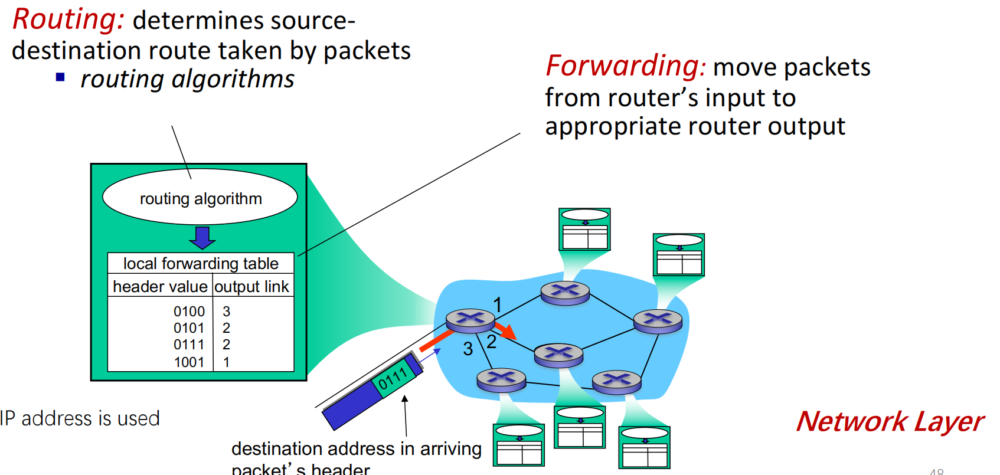

### Packet Switching: store-and-forward 分组交换：存储转发

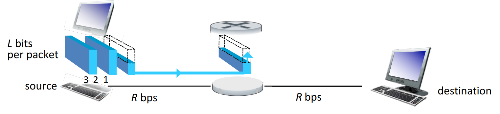

- Takes *L*/*R* seconds to transmit (push out) *L*-bit packet into link at *R* bps

  以 *R* bps 的速度将 *L* 位数据包传输（推出）到链路中需要 **L/R** 秒

- *Store and forward:* entire packet must arrive at router before it can be transmitted on next link

  *存储和转发：* 整个数据包必须先到达路由器，然后才能在下一个链路上传输

- End-end delay = 2*L*/*R* (assuming zero propagation delay)

  结束延迟 = 2*L*/*R*（假设传播延迟为零）

- *One-hop example:* 一个案例

  - *L* = 7.5 Mbits

  - *R* = 1.5 Mbps

  - one-hop transmission delay = 5 sec

### Packet Switching: queueing delay, loss 数据包交换：排队延迟、丢失

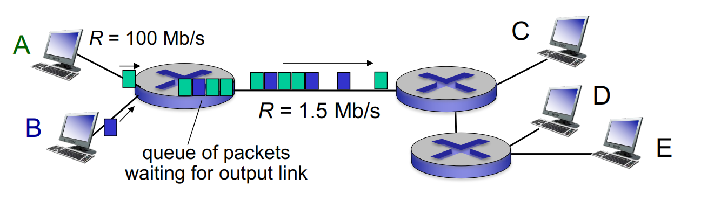

Queuing and loss:  排队和丢失

- If arrival rate (in bits) to link exceeds transmission rate of link for a period of time:

  如果链路的到达速率（以位为单位）在一段时间内超过链路的传输速率：

  - packets will queue, wait to be transmitted on link 

    数据包将排队，等待在 Link 上传输

  - packets can be dropped (lost) if memory (buffer) fills up

    如果内存（缓冲区）已满，则可以丢弃（丢失）数据包

### Circuit Switching 电路切换

- Dedicated resources: no sharing 专用资源：不共享

- circuit-like (guaranteed) performance 类似电路（保证）的性能

- Circuit segment is idle if not used by call *(no sharing)* 如果调用未使用，则电路段处于空闲状态 *（无共享）*

- Commonly used in traditional telephone networks 常用于传统电话网络

#### Circuit switching: FDM versus TDM 电路切换：FDM 与 TDM

FDM 频分多路复用

TDM 时分多路复用

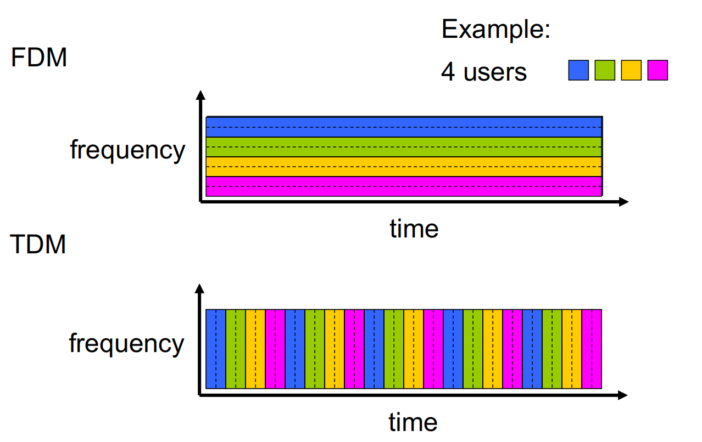

#### Packet switching VS circuit switching 分组交换 VS 电路交换

Packet switching allows more users to use network! 分组交换让更多用户使用网络！

Example:

- 1 Mb/s link

- each user: 
  - 100 kb/s when “active”
  - active 10% of time

- *Circuit-switching:* 电路切换

  - 10 users

- Packet switching:  分组切换

  - with 35 users, probability > 10 active at same time is less than 0.0004

    如果有 35 个用户，大于 10 个用户同时活跃的概率小于 0.0004

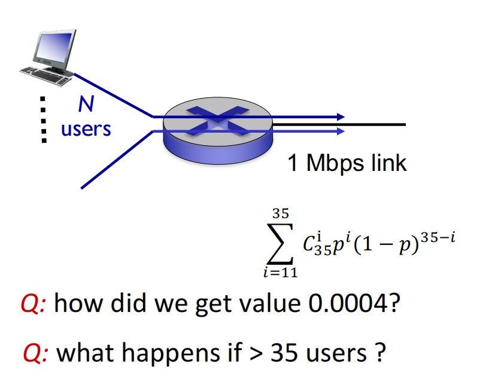

### Packet switching VS circuit switching 分组交换 VS 电路交换

- **Is packet switching (PS) a “winner?” 分组交换 （PS） 是“赢家”吗？**

  - PS advantages:
    - resource sharing 资源共享
    - simpler, no call setup 更简单，无需调用设置

  - PS drawbacks:
    - excessive congestion possible: delay and loss 可能出现过度拥塞：延迟和丢失
      - protocols needed for reliable data transfer, congestion control 可靠数据传输、拥塞控制所需的协议

  - How to provide circuit-like behavior PS? 如何提供类似电路的行为 PS？
    - Bandwidth guarantees 带宽保证
    - New methods should be developed 应开发新方法

### Internet: Network of networks Internet：网络的网络

- **End systems connect to Internet via access ISPs (Internet Service Providers)**

  终端系统通过接入 ISP（Internet 服务提供商）连接到 Internet

  - residential, company and university ISPs 住宅、公司和大学 ISP

- **Access ISPs in turn must be interconnected.**  反过来，接入 ISP 必须互连。

  - so that any two hosts can send packets to each other 这样任意两台主机就可以互相发送数据包

- **Resulting network of networks is very complex** 生成的网络非常复杂

  - evolution was driven by economics and national policies 进化是由经济和国家政策驱动的

- **Letʼs take a stepwise approach to describe current Internet structure:** 让我们逐步描述当前的 Internet 结构：

### Network of network 网络中的网络

- *Option:* *connect each access ISP to every other access ISP?*  *选项：* *将每个接入 ISP 连接到其他每个接入 ISP？*

  connecting each access ISP  to each other directly doesn’t  scale: O(N2) connections.

  将每个访问 ISP 直接相互连接无法扩展：O（N2） 连接。

- *Option:* *connect each access ISP to one global transit ISP?*  选项:每个接入ISP接入一个全局中转ISP

  Customer and provider ISPs have economic agreement

  客户和提供商 ISP 达成经济协议

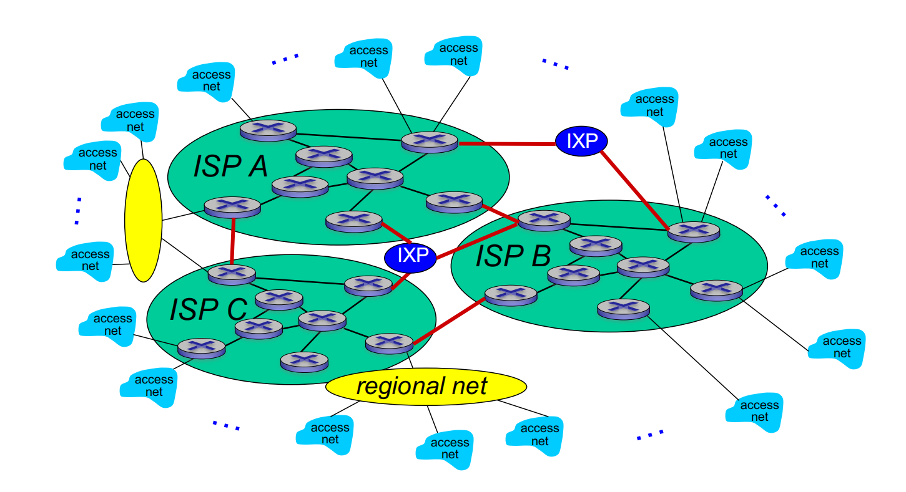

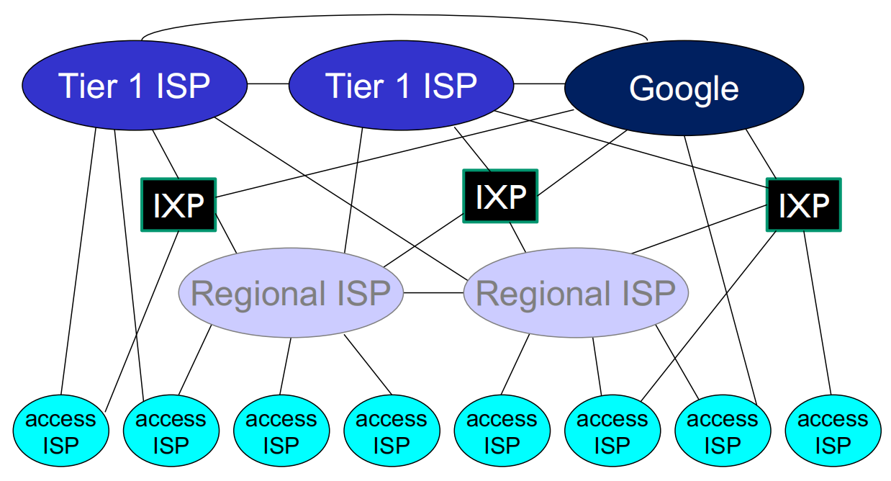

- Small view of well-connected large networks 对连接良好的大型网络的小视角

  - “tier-1” commercial ISPs (e.g., ChineTel, Sprint, AT&T, NTT), national & international coverage.

    “一级”商业ISP（例如，ChineTel、Sprint、AT&T、NTT），国内和国际覆盖。

  - content provider network (e.g., Google): private network that connects it data centers to Internet, often bypassing tier-1, regional ISPs

    内容提供商网络（例如 Google）：将其数据中心连接到互联网的专用网络，通常绕过一级区域 ISP

### Network Performance

**Package Loss**  丢包

**Delay** 延迟

**Bandwidth**  带宽

### How do loss and delay occur? 丢失和延迟是如何发生的？

- **Packages queue in router buffers**  包在路由器缓冲区中排队

  - packet arrival rate to link (temporarily) exceeds output link capacity

    数据包到达链路的速率（暂时）超过输出链路容量

  - then, packets queue, wait for turn

    然后，数据包排队，等待轮到

  - Free （available） buffers： 如果没有空闲缓冲区，则到达的数据包被丢弃（丢失）

### Four types of packet delay ！！！ 四种延迟的类型

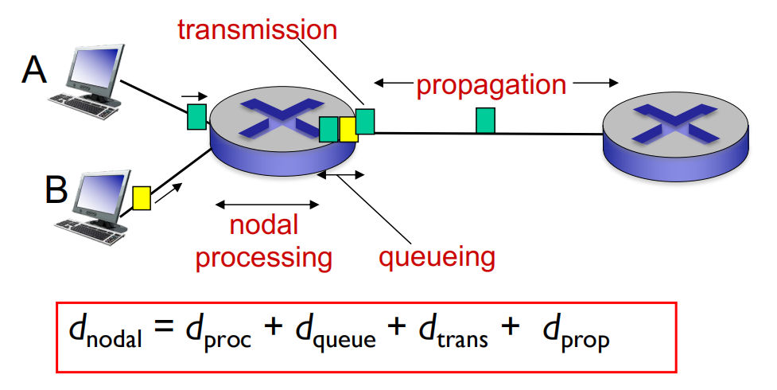

- dnodal = dproc + dqueue + dtrans + dprop

- dproc: **nodal processing**  节点处理

  - check bit errors

  - determine output link

  - typically < msec

- dqueue: **queueing delay 队列延迟**

  - time waiting at output link for transmission 

  - depends on congestion level of router

- *d*trans: **transmission delay 传输延迟**:
  - *L*: packet length (bits) 
  
  - *R*: link *bandwidth (bps)*
  
  - d*trans* *= L/R*
  
- *d*prop: **propagation delay 传播延迟**:
- *d*: length of physical link
  
- *s*: propagation speed (~2.9x108 m/sec)
  
- *d*prop = *d*/*s*

**dtrans and dprop very different**

### Queueing delay 队列延迟

- *R:* link bandwidth (bps)

- *L:* packet length (bits)

- a: average packet arrival rate

  

- *La/R* ~ 0: avg. queueing delay small

- *La/R* -> 1: avg. queueing delay large

- *La/R* > 1: more “work” arriving than can be serviced, average delay infinite!

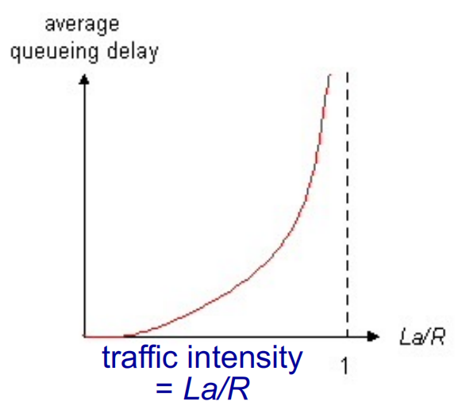

### Packet loss 丢包

- Queue (aka buffer) preceding link in buffer has finite capacity

  缓冲区中队列（又名缓冲区）前面的链接具有有限的容量

- Packet arriving to full queue dropped (aka lost)

  到达完整队列的数据包被丢弃（也称为丢失）

- Lost packet may be retransmitted by previous node, by source end system, or not at all

  丢失的数据包可能由前一个节点、源端系统重新传输，或者根本不重新传输

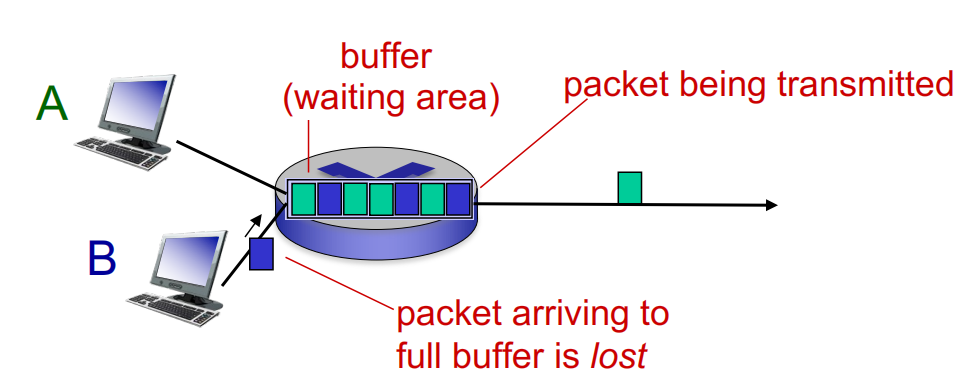

### Throughput 吞吐量

- **Throughput:** **rate (bits/time unit) at which bits transferred between sender/receiver**

  吞吐量：在发送方/接收方之间传输的比特数（比特/时间单位）

  - *instantaneous:* rate at given point in time

    *瞬时：* 给定时间点的速率 -

  - *average:* rate over longer period of time

    *平均：* 较长时间的比率

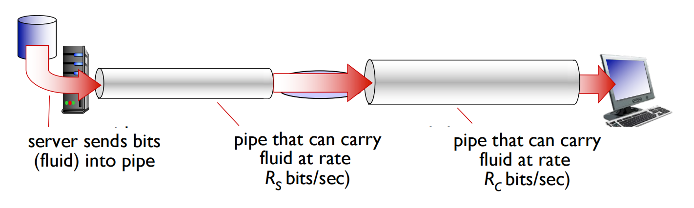

Bottleneck link  瓶颈环节

link on end-end path that constrains end-end throughput  限制端到端吞吐量的端到端路径上的链接

### Throughput: Internet scenario

- Per-connection end-end throughput: min{Rc , Rs *, R/10}*

  每个连接的端到端吞吐量：min{Rc ， Rs *， R/10}*

- In practice: Rc , Rs is often bottleneck

  在实践中：Rc 、 Rs 通常是瓶颈

## Protocol layers and service models 协议层和服务模型

- **application:** **supporting network applications  支持网络应用进程**
  - FTP, SMTP, HTTP

- **transport: process-process data transfer  流程-流程数据传输**
  - TCP, UDP

- **network:** **routing of datagrams from source to destination  从源到目标的数据报路由**
  - IP, routing protocols
- **link:** **data transfer between neighboring network elements  相邻网元之间的数据传输**
  - Ethernet, 802.11 (WiFi), PPP
- **physical: bits “on the wire”**

### ISO/OSI reference model ISO/OSI 参考模型

- **ISO/OSI = ISO/**Open System Interconnection 开放式系统互连

- **presentation:** **allow applications to interpret meaning of data, e.g., encryption, compression, machine-specific conventions  允许应用进程解释数据的含义，例如加密、压缩、特定于机器的约定**
- **session:** **synchronization, checkpointing, recovery of data exchange**

- **Internet stack “missing”these layers!**
  - these services, *if needed,* must be implemented in application

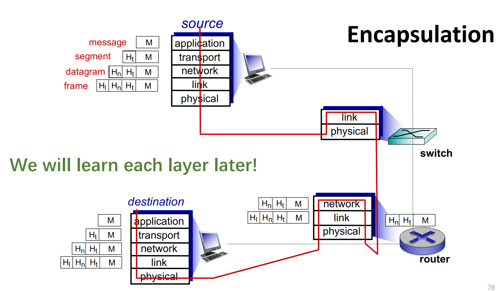

### Why layering?

- Divide complex systems to simple components

- Easy for maintenance

- Flexible for updating

## Network Security 网络安全

- **Field of network security:**

  - how bad guys can attack computer networks

  - how we can defend networks against attacks

  - how to design architectures that are immune to attacks

- **Internet not originally designed with (much) security in mind**

  - *Original vision:* “a group of mutually trusting users attached to a transparent network” J

  - Internet protocol designers playing “catch-up ”

  - Security considerations in all layers!

**Types**

- Malware: virus, worm, spyware 

- DDoS: Distributed denial of service attack

- Packet “sniffing”
