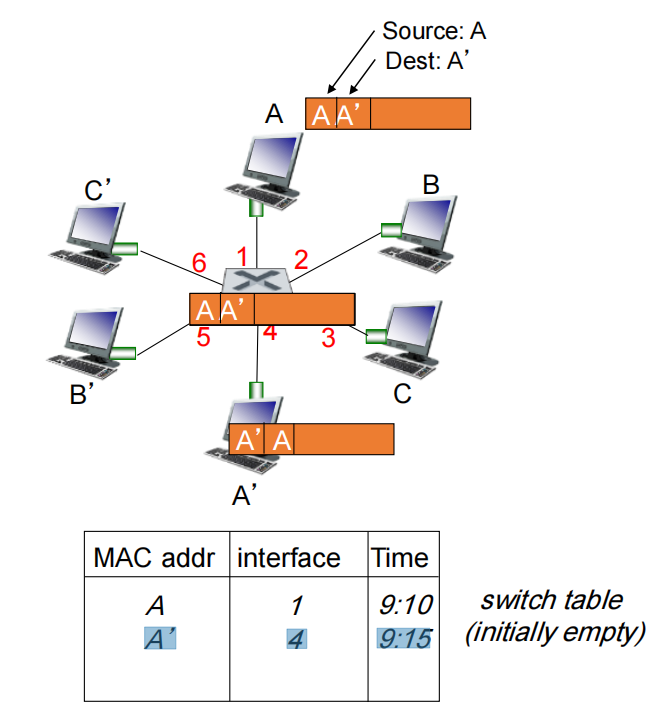
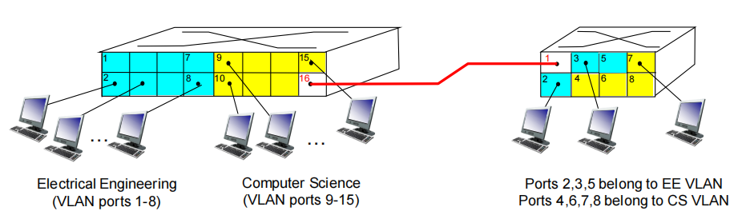
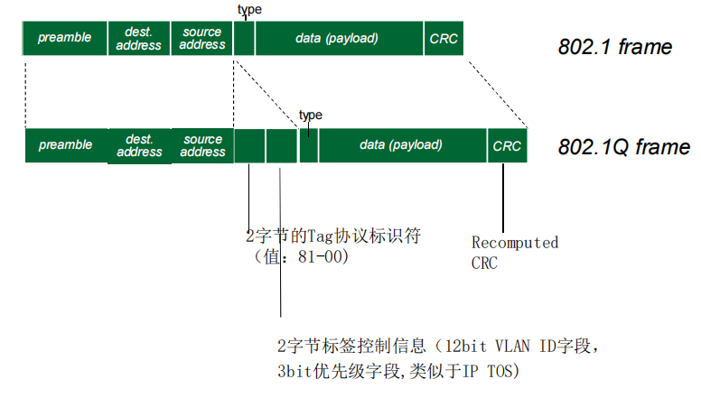

# Link Layer 2 链路层2

## Switches 交换机

### Ethernet switch  以太网交换机

- **Link-layer device (layer-2 device): takes an active role**

  **链路层设备(第 2 层设备):发挥积极作用**

  - Store, forward Ethernet frames

    存储发送的以太网帧

  - Examine incoming frame’s MAC address, selectively forward frame to one-or-more outgoing links when frame is to be forwarded on segment, uses CSMA/CD to access segment

    检查传入帧的 MAC 地址，当帧要在分段上转发时，有选择地将帧转发到一个或多个传出链路，使用 CSMA/CD 访问分段

- **Transparent**

  **透明**

  - Hosts are unaware of presence of switches

    主机不知道交换机的存在

- **Plug-and-play, self-learning**

  **即插即用, 自我学习**

  - Switches do not need to be configured

    交换机不需要配置

### Switch: multiple simultaneous transmissions  交换机:多路同时传输

- Hosts have dedicated, direct link to switch

  主机有一个**专用**和**直接**到交换机的连接 （点到点）

- Switches buffer packets

  交换机缓存到来的帧

- Ethernet protocol used on each incoming link, but no collisions; full duplex

  对每个帧进入的链路使用以太网协议，没有冲突；全双工

  - Each link is its own collision domain

    每个链接都是它自己的碰撞域

  - 实际上MAC协议在其中的作用弱化了

- **Switching, e.g.**,: A-to-A’ and B-to-B’ can transmit simultaneously, without collisions

  **交换，例如**：A-to-A' 和 B-to-B' 可以同时传输，无冲突

### Switch (forwarding) table 交换机表

- Q: how does switch know A’ reachable via interface 4, B’ reachable via interface 5?

  交换机如何知道通过接口1到达A，通过接口5到达 B’?

- *A:* each switch has a **switch table**, which contains entries, and each entry has:

  A: 每个交换机都有一个交换表 switch table, 每个表项:

  - (1) A MAC address, (2) the switch interface toward that MAC address, (3) the time stamp that the entry was placed.

    (主机的MAC地址,到达该MAC经过的接口，时戳)

  - looks like a routing table!

    比较像路由表

- Q: how are entries created, maintained in switch table? 

  每个表项是如何创建的？如何维护的？

  - something like a routing protocol?

    有点像路由协议

### Self-learning 自学习

- Switch **learn**s which hosts can be reached through which interfaces

  **Switch** 学习通过哪些接口可以访问哪些主机

  - When frame received, switch “learns” location of sender: incoming LAN segment/link

    收到帧后，交换机“学习”发送方的位置：传入的 LAN 段/链路

  - Records MAC/interface (sender/location) pair in switch table

    交换机表中的 MAC/接口 (发送方/位置) 对记录 

  - Entries get removed if no frames with that MAC received after timeout (which can be configured)

    如果在超时后未收到具有该 MAC 的帧（可以配置），则条目将被删除

如果找不到映射关系 =》冷漠

向所有端口进行转发

- frame destination, A’, location unknown: **flood**

  目的地,A',位置未知: **泛洪**

- destination A location known: **selectively send on just one link**

  已知目的地: **选择性发送一个链接**

### Switch: frame filtering/forwarding  帧过滤/转发

**When frame received at switch:**

1. record incoming link/interface, MAC address of sending host

   记录进入的链路，发送主机的MAC地址

2. index switch table using MAC destination address

   使用目标MAC地址对交换表进行索引

3. if entry found for destination

​	then {

​		if destination on LAN segment/link from which frame arrived  /*进来的端口 = 出去的端口*/

​			then drop frame  /*过滤*/

​		else forward frame on interface indicated by entry  /*转发*/

​	}

​	else flood /* forward on all interfaces except arriving interface（*泛洪：除了帧到达的网段，向所有网络接口*）  */

### Interconnecting switches  交换机级联

- **Self-learning switches can be connected together:**

  自学交换机可以连接在一起:

- Q: sending from A to G - how does S1 know to forward frame destined to G via S4 and S3 ?

  Q： 从 A 发送到 G，交换机S1 如何知道经过从S4 和S3最终达到F?？

- A: Self learning! (works exactly the same as in single-switch case!)

  A: 自我学习! (和在一个交换机联接所有站点一样!)

### Institutional network 机构网络格子

### Switches vs. routers  交换机 vs. 路由器

Both are store-and-forward: 

都是存储转发设备，但层次不同:

- Routers: network-layer devices (examine network-layer headers)

  路由器:网络层设备(检查网络层标头)

- Switches: link-layer devices (examinelink-layer headers)

  交换机:链路层设备(检查链路层头部)

Both have forwarding tables:

两者都有转发表:

- Routers: compute tables using routing algorithms, IP addresses

  路由器:使用路由算法计算表,IP地址

  - 路由算法能够避免环路，无需执行生成树算法，可以以各种拓扑构建网络

  - 对广播分组做限制

  - 不是即插即用的，配置网络地址（子网前缀）

  - 三层设备，速率低

- Switches: learn forwarding table using flooding, learning, MAC addresses

  交换机：使用泛洪学习转发表、学习、MAC 地址

  - 即插即用；二层设备，速率高
  - 执行生成树算法，限制广播帧的转发
  - ARP表项随着站点数量增多而增多

## VLANs

### Virtual Local Area Network - Motivation  虚拟局域网-动机

**consider:** 考虑

- Single broadcast domain:

  单一广播域:

  - all layer-2 broadcast traffic (ARP, DHCP, unknown location of destination MAC address) must cross entire LAN. 

    所有第 2 层广播流量（ARP、DHCP、目标 MAC 地址的未知位置）必须穿过整个 LAN。

  - security/privacy, efficiency issues.

    安全/隐私,效率问题。

  - This can be solved by replacing the center switch in the figure with a router. We’ll see another solution via using a switch

    这可以通过将图中的中心开关更换为路由器来解决。我们将看到另一种解决方案，即使用交换机

- CS user moves office to EE (in a different building), but wants connect to CS switch?

  CS 用户将办公室搬到 EE（在不同的建筑物中），但想要连接到 CS 交换机？

### Virtual Local Area Network - VLAN

- **Virtual Local Area Network**: Switch(es) supporting VLAN capabilities can be configured to define multiple *virtual* LANs over single physical LAN infrastructure.

  **虚拟局域网**：支持 VLAN 功能的交换机可以配置为在单个物理 LAN 基础设施上定义多个*虚拟*LAN。

- Switch(es) supporting VLAN capabilities can be configured to define multiple *virtual* LANs over single physical LAN infrastructure.

  支持 VLAN 功能的交换机可以配置为在单个物理 LAN 基础设施上定义多个 *虚拟* LAN。（物理上一个交换机，虚拟成多个局域网）

- **port-based VLAN**: switch ports grouped (by switch management software) so that *single* physical switch ……

  **基于端口的VLAN**: 交换机端口成组( 通过交换机管理软件)，以至于**单个的**交换机可以分成若干虚拟LANs

- … operates as **multiple** virtual switches

  就像是多个虚拟机

### Port-based VLAN - Properties  基于端口的 VLAN - 属性

- **traffic isolation**: frames to/from ports 1-8 can only reach ports 1-8

  *流量隔离:* 从/到1-8端口的流量只会涉及到1-8

  - can also define VLAN based on MAC addresses of endpoints, rather than switch port

    也可以基于MAC地址进行VLAN定义

- **dynamic membership**: ports can be dynamically assigned among VLANsrouter

  动态成员: 成员可以在VLANs之间动态分配，能够方便设计更有层次的和灵活的网络管理员配置

- **forwarding between VLANS**: done via routing (just as with separate switches)

  在VLANs间转发:通过路由器进行转发 (就像他们通过各自的交换机相联一样)

  - in practice vendors sell combined VLAN switches plus routers (so the external router shown in the figure is not needed).

    实际操作中，设备生产商可以提供：交换机和路由器的单一设备

### VLANS spanning multiple switches   VLANs 互联多个交换机

如果有多个交换机，希望它们相连并且共享VLANs信息

方法1：各交换机每个VLAN一个端口和另外交换机相应VLAN端口相连->扩展性问题

- **Trunk port**: carries frames between VLANS defined over multiple physical switches

  **trunk port 干线端口**: 多个交换机共享定义的VLAN，使用同一个物理链路来传输多个VLANs的数据帧。

  - Frames forwarded within VLAN between switches can’t be vanilla 802.1 frames (must carry VLAN ID info)

    交换机之间在VLAN内转发的帧不能是普通的802.1帧（必须携带VLAN ID信息）

  - 802.1q protocol adds/removed additional header fields for frames forwarded between trunk ports

    802.1q协议增加/移除附加的头部字段，用于在trunk端口上进行帧的转发
    
    - **VLAN标签的添加**：802.1Q协议规定，在以太网数据帧的目的MAC地址和源MAC地址字段之后、协议类型字段之前加入4个字节的VLAN标签（Tag），用于标识数据帧所属的VLAN。
    - **支持多个VLAN**：802.1Q协议允许最多支持4096个VLAN，通过12位的VLAN标识符（VID）来实现。
    - **帧的标记与解标记**：在VLAN交换网络中，以太网帧主要有有标记帧（Tagged帧）和无标记帧（Untagged帧）两种形式。接入链路（Access Link）上的帧通常是无标记的，而干道链路（Trunk Link）上的帧是有标记的。
    - **跨设备VLAN信息保留**：802.1Q协议使得帧在跨越不同设备时能够保留其VLAN信息，这对于在不同交换机上统一管理VLAN至关重要。

How does a switch know that a frame arriving on a trunk port belongs to a particular VLAN?

交换机如何知道到达中继端口的帧属于特定 VLAN？

### 802.1Q VLAN frame format   802.1Q VLAN 帧格式

### Data center networking  数据网络中心

- **Internet companies house thousands of hosts, closely coupled, supporting distinct cloud applications:**

  **互联网公司拥有数千台主机，紧密耦合，支持不同的云应用：**

  - Search engines, data mining (google, baidu)

  - E-Business (Alibaba, Amazon)

  - SNS (Tencent, Facebook)

  - Content-servers (Youtube, Apple, Microsoft)

- **Challenges:**

  **挑战:**

  - Multiple applications, each serving massive numbers of clients 

    多个应用进程,每个应用进程为大量客户提供服务

  - Managing/balancing load, avoiding processing, networking, data bottlenecks

    管理/平衡负载，避免处理、联网、数据瓶颈

**Load balancer: application-layer routing**

负载均衡器: 应用层路由

- Receives external client requests

  接受外部的客户端请求

- Directs workload within data center

  将请求导入到数据中心内部

- Returns results to external client (hiding data center internals from client)

  返回结果给外部客户端 (对于客户端隐藏数据中心的内部结构)

- Apache, Nginx or DIY using Python/nodejs…

- 在交换机之间，机器阵列之间有丰富的互连措施:

  - 在阵列之间增加吞吐 (多个可能的路由路径)

  - 通过冗余度增加可靠性

## A day in the life of web request  网页请求生活中的一天

**Synthesis**: a day in the life of a web request

**回顾**:网络请求生活中的一天

- **journey down protocol stack complete!**

  **下载协议栈之旅完成! **

  - application, transport, network, link

    应用,传输,网络,链接

- **putting-it-all-together: synthesis!**

  **把所有东西放在一起:合成!**

  - **goal**: identify, review, understand protocols (at all layers) involved in seemingly simple scenario: requesting www page

    **目标**： 识别、审查、理解看似简单的场景中涉及的协议（在所有层面）：请求 www 页面

  - **scenario**: student attaches laptop to campus network, requests/receives www.google.com

    **场景**：学生将笔记本电脑连接到校园网络，请求/接收 www.google.com

### scenario 日常场景

### connecting to the Internet 链接到互联网

- connecting laptop needs to get its own IP address, addr of first-hop router, addr of DNS server: use **DHCP**

  连接笔记本电脑需要获取自己的 IP 地址，第一跳路由器的地址，DNS 服务器的地址：使用 **DHCP**

- DHCP request encapsulated in **UDP**, encapsulated in **IP**, encapsulated in **802.3** Ethernet

  封装在 **UDP** 中的 DHCP 请求，封装在 **IP**中，封装在 **802.3** 以太网中

- Ethernet frame **broadcast** (dest: FFFFFFFFFFFF) on LAN, received at router running DHCP server

  LAN 上的以太网帧 **广播**（目标：FFFFFFFFFFFFFFFF），在运行 DHCP 服务器的路由器上接收

- Ethernet **demuxed** to IP demuxed, UDP demuxed to DHCP

  以太网解调到 IP 解调,UDP 解调到 DHCP

- DHCP server formulates **DHCP ACK** containing client’s IP address, IP address of first-hop router for client, name & IP address of DNS server

  DHCP 服务器生成 **DHCP ACK** 包括客户端IP地址，第一跳路由器IP地址和DNS名字服务器地址

- encapsulation at DHCP server, frame forwarded (**switch learning**) through LAN, demultiplexing at client 

  在DHCP服务器封装, 帧通过LAN转发 (交换机学习) 在客户端段解封装

- DHCP client receives **DHCP ACK** reply

  客户端接收**DHCP ACK**应答

Client now has IP address, knows name & addr of DNS server, IP address of its first-hop router

客户端有了IP地址，知道了DNS域名服务器的名字和IP地址第一跳路由器的IP地址

###  ARP (before DNS, before HTTP)  日常场景…… ARP (DNS之前, HTTP之前)

- before sending **HTTP** request, need IP address of www.google.com: **DNS**

  在发送 **HTTP request** 请求之前, 需要知道www.google.com的IP地址: **DNS**

- DNS query created, encapsulated in UDP, encapsulated in IP, encapsulated in Eth. To send frame to router, need MAC address of router interface: **ARP**

  DNS查询被创建，封装在UDP段中，封装在IP数据报中，封装在以太网的帧中. 将帧传递给路由器，但是需要知道路由器的接口：MAC地址：**ARP**

- **ARP query** broadcast, received by router, which replies with **ARP reply** giving MAC address of router interface

  ARP查询广播，被路由器接收，路由器用ARP应答，给出其IP地址某个端口的MAC地址

- client now knows MAC address of first hop router, so can now send frame containing DNS query

  客户端现在知道第一跳路由器MAC地址，所以可以发送DNS查询帧了

### using DNS  日常场景：使用DNS

- IP datagram containing DNS query forwarded via LAN switch from client to 1st hop router

  包含通过 LAN 交换机从客户端转发到第一跳路由器的 DNS 查询的 IP 数据报

IP datagram forwarded from campus network into Comcast network, routed (tables created  by **RIP, OSPF, IS-IS** and/or **BGP** routing protocols) to DNS server

从园区网络转发到 Comcast 网络的 IP 数据报，路由到 DNS 服务器（由 RIP、OSPF、IS-IS 和/或 **BGP** 路由协议创建的表）

- demuxed to DNS server

  DNS 服务器 DNS server

- DNS server replies to client with IP address of www.google.com

  DNS 服务器回复 IP 地址为 www.google.com 的用户端

### TCP connection carrying HTTP 日常场景： TCP连接携带HTTP报文

- to send HTTP request, client first opens **TCP socket** to web server

  要发送 HTTP 请求,客户端首先打开 **TCP 套接字** 到 Web 服务器

- TCP **SYN segment** (step 1 in 3- way handshake) inter-domain routed to web server

  TCP **SYN 段**（三次握手中的步骤 1）域间路由到 Web 服务器

- web server responds with **TCP SYNACK** (step 2 in 3-way handshake)

  Web 服务器响应 **TCP SYNACK**(三方握手中的步骤 2)

- client responds with **TCP ACK** (step 3)

  客户端响应 **TCP ACK**(第 3 步)

- TCP **connection established**

  **TCP 连接创建 **

### HTTP request/reply  日常场景： …HTTP请求和应答

- **HTTP request** sent into TCP socket

  HTTP 请求发送到TCP套接字中

- IP datagram containing HTTP request routed to www.google.com

  IP 数据报包含HTTP请求，最终路由到 www.google.com

- web server responds with **HTTP reply** (containing web page)

  web 服务器用HTTP应答回应(包括请求的页面)

- IP datagram containing HTTP reply routed back to client 

  IP 数据报包含HTTP应答最后被路由到客户端