# Network Security 1  网络安全

## What is Network Security  什么是网络安全

- **confidentiality**: only sender, intended receiver should “understand” message contents

  **保密性**：只有发送者、预期接收者才应“理解”消息内容

  - sender encrypts message

    发送方加密报文

  - receiver decrypts message

    接收方解密报文

- **authentication**:  sender, receiver want to confirm identity of each other 

  认证: 发送方和接收方需要确认对方的身份

- **message integrity**: sender, receiver want to ensure message not altered (in transit, or afterwards) without detection

  报文完整性: 发送方、接受方需要确认报文在传输的过程中或者事后没有被改变

- **access and availability** : services must be accessible and available to users

  访问控制和服务的可用性: 服务可以接入以及对用户而言是可用的

### Friends and enemies: Alice, Bob, Trudy  朋友和敌人: Alice, Bob, Trudy

- 网络安全世界比较著名的模型

- Bob, Alice (lovers!) 需要安全的通信

- Trudy (intruder) 可以截获，删除和增加报文

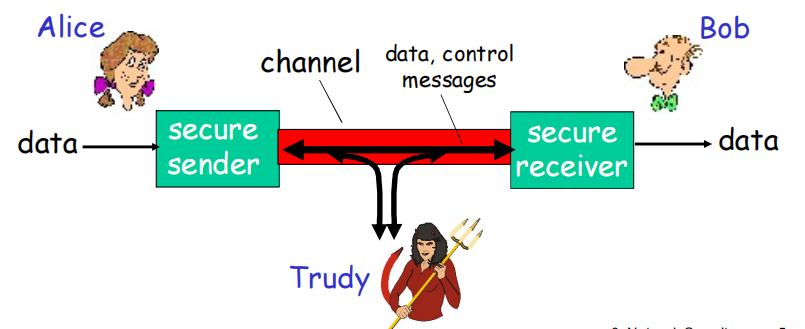

#### 网络中的坏蛋

Q: “bad guy”可以干什么?

A: 很多!

- 窃听 eavesdrop:: 截获报文
- 插入 insert：在连接上插入报文

- 伪装 impersonation: 可以在分组的源地址写上伪装的地址

- 劫持 hijacking: 将发送方或者接收方踢出，接管连接

- 拒绝服务  denial of service: 阻止服务被其他正常用户使用 (e.g.,通过对资源的过载使用)

#### 谁有可能是Bob, Alice?

- 首先肯定是现实世界中的叫Bobs和Alices的人 （开玩笑）

- 电子交易中的Web browser/server (e.g.,在线购买)

- 在线银行的client/server

- DNS servers

- 路由信息的交换

- 其它例子?

## Principles of cryptography  加密原理

### The language of cryptography  加密语言

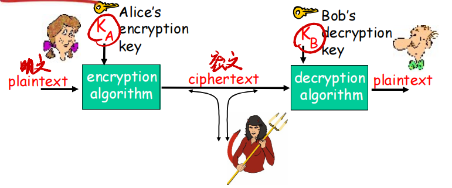

**m** plaintext message(明文)

**KA(m)** ciphertext, encrypted with key KA  (密文，通过kA进行加密)

**m** = KB (KA(m))

### Breaking an encryption scheme  破解加密方案

- **cipher-text only attack**: Trudy has ciphertext she can analyze

  **密文攻击**: Trudy拥有可以分析的密文

- **两种方法**:

  - **known-plaintext attack**: Trudy has plaintext corresponding to ciphertext

    **已知-明文攻击**：Trudy 具有与密文对应的明文；（是指攻击者掌握了某段明文和对应密文的情况，通过这些已知的明文和密文对，攻击者可以分析加密算法的规律，尝试破解出加密密钥或加密算法）

    - e.g., in monoalphabetic cipher, Trudy determines pairings for a,l,i,c,e,b,o,

      例如，在单字母密码中，Trudy 确定 a、l、i、c、e、b、o 的配对。

  - **chosen-plaintext attack**: Trudy  can **choose** the plaintext message and obtain its  corresponding ciphertext form

    **选择明文攻击**：Trudy 可以 **选择** 明文消息并获取其对应的密文形式；（是指攻击者除了知道加密算法外，还可以选定明文消息，并可以知道对应的加密得到的密文，也就是已经完全了解该加密机制。）

### Symmetric key cryptography  对称密钥密码学

对称密钥密码学: 发送方和接收方的密钥相同

公开密钥密码学: 发送方使用接收方的公钥进行加密，接收方使用自己的私钥进行解密

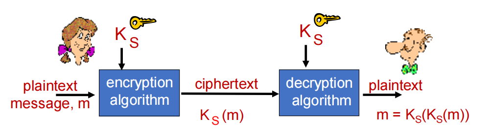

**symmetric key crypto** : Bob and Alice share same (symmetric) key: **KS**

对称密钥密码: Bob和Alice共享一个对称式的密钥: KS

- e.g., key is knowing substitution pattern in mono alphabetic substitution cipher

  密钥在单码替换加密方法中是替换模式

Q: how do Bob and Alice agree on key value?

问: 但是Bob和Alice如何就这个密钥达成一致呢?

#### 一种常见的加密方式：凯撒加密 Caesar Cipher

For English text, the Caesar cipher would work by taking each letter in the plaintext message and substituting the letter that is *k* letters later (allowing wraparound; that is, having the letter *z* followed by the letter *a*) in the alphabet. 

对于英语文本，Caesar 密码的工作原理是获取明文消息中的每个字母，然后替换字母表中的 *k* 字母（允许回绕;即字母 *z* 后跟字母 *a*）。

For example if k=3, then the letter *a* in plaintext becomes *d* in ciphertext; *b* in plaintext becomes *e* in ciphertext, and so on.

例如,如果k=3,则明文中的字母*a*在密文中变为*d*;明文中的*b*在密文中变为*e*等等。

#### Simple encryption scheme  简单的加密方案

**substitution cipher**: substituting one thing for another

置换密码: 用一种东西代替另一种东西

- monoalphabetic cipher: substitute one letter for another

  单字母密码:用一个字母替换另一个字母

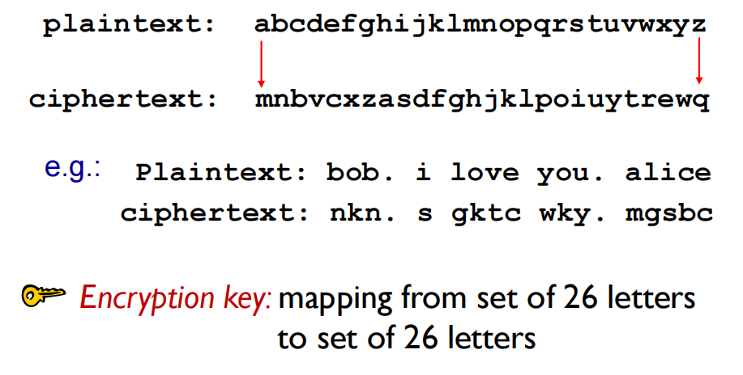

**Encryption key**: mapping from set of 26 letter to set of 26 letters

加密密钥: 从一组 26 个字母映射到一组 26 个字母

#### A more sophisticated encryption approach  更复杂的加密方法

- n substitution (**polyalphabetic**) ciphers, M1 ,M2 ,…,Mn

  n个替换(**多字母**)密码,M1,M2,...,Mn

- cycling pattern:

  循环模式:

  - e.g., n=4: M1 ,M3 ,M4 ,M3 ,M2 ; M1 ,M3 ,M4 ,M3 ,M2 ; ..

- for each new plaintext symbol, use subsequent substitution pattern in cyclic pattern

  对于每个新的纯文本符号，在循环模式中使用后续替换模式

  - dog: d from M1 , o from M3 , g from M4 

    狗:d来自M1,o来自M3,g来自M4

Encryption key: n substitution ciphers, and cyclic pattern (i.e., key need not be just n-bit pattern)

加密密钥：n 个替换密码和循环模式（即，密钥不必只是 n 位模式）

### Symmetric key crypto: DES   对称密钥加密学: DES

**DES: Data Encryption Standard**  数据加密标准

DES operation:

initial permutation 16 identical “rounds” of function application, each using different 48 bits of key final permutation

初始替换16 轮一样的函数应用，每一轮使用的不同的48bit密钥最终替换

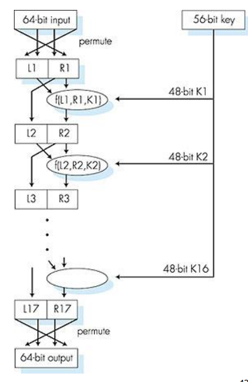

- US encryption standard [NIST 1993]

  US 加密标准[NIST 1993]

- 56-bit symmetric key, 64-bit plaintext input

  56-bit 对称密钥, 64-bit明文输入

- block cipher with cipher block chaining

  分组密码与密码块链

- how secure is DES?

  有多安全

  - DES Challenge: 56-bit-key-encrypted phrase decrypted (brute force) in less than a day

    DES挑战: 56-bit密钥加密的短语 (“Strong cryptography makes the world a safer place”) 被解密，用了4个月的时间

  - no known good analytic attack

    但是可能有未知的后门

- making DES more secure:

  使DES更安全

  - 3DES: encrypt 3 times with 3 different keys

    使用3个key， 3重DES 运算

  - 密文分组成串技术

### 块密码

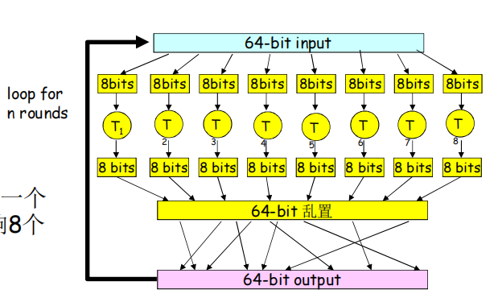

- 一个循环：一个输入bit影响8个输出bit

- 多重循环: 每个输入比特影响所有的输出bit
- 块密码：DES, 3DES, AES

### AES: Advanced Encryption Standard  高级加密标准

- symmetric-key NIST standard, replaced DES (Nov 2001)

  新的对称 密钥NIST标准(Nov. 2001) 用于替换 DES

- processes data in 128 bit blocks

  数据128bit成组加密

- 128, 192, or 256 bit keys

  （key 可以选择）

- a machine could brute force decryption (try each key) taking 1 sec on DES, takes 149 trillion years for AES

  穷尽法解密如果使用1秒钟破解 DES, 需要花149万亿年破解AES

### 密码块链

- 密码块：如果输入块重复，将会得到相同的密文块

- *密码块链：* 异或第i轮输入 m(i), 与前一轮的密文, c(i-1)

  - c(0) 明文传输到接收端

  - what happens in “HTTP/1.1” scenario from above?

### Public Key Cryptography  公开密钥密码学

symmetric key crypto:  对称密钥密码学

- requires sender, receiver know shared secret key

  需要发送方和接收方对共享式对称密钥达成一致

- **Q**: how to agree on key in first place (particularly if never  “met”)?

  Q: 但是他们如何第一次达成一致 (特别是他们永远不可能见面的情况下)?

public key crypto:  公开密钥密码学 (或许更好) （也是非对称加密法 ）

- radically different approach [DiffieHellman76, RSA78]

  完全不同的方法[Diffie-Hellman76, RSA78]

- sender, receiver do notshare secret key

  发送方和接收方无需共享密钥

- public encryption key known to all

  一个实体的公钥公诸于众

- private decryption key known only to receiver

  私钥只有自己知道

- 双方各自拥有一个属于自己的公钥和私钥，如果女孩想要像男孩发信息，他会使用男孩的公钥来加密，然后当信息传送到男孩手上之后，男孩会用自己的私钥来解密。这样即使信息被他人拦截，由于没有对应的私钥解密，依然无法被破解。

#### Public key encryption algorithms  公钥加密算法

公钥不能推断出私钥

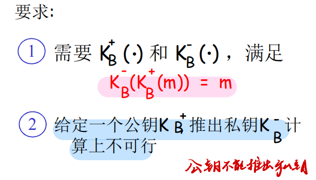

RSA: Rivest, Shamir, Adelson algorithm

#### Prerequisite: modular arithmetic  先决条件：模算术

- x mod n = remainder of x when divide by n

- facts:

  - [(a mod n) + (b mod n)] mod n = (a + b) mod n

    [(a mod n) - (b mod n)] mod n = (a - b) mod n

    [(a mod n) * (b mod n)] mod n = (a * b) mod n

- **thus**

  **(a mod n)d mod n = ad mod n**

  - example: x=14, n=10,d=2

    (x mod n)d mod n = 42 mod 10 = 6

    xd 142 = 196   xd mod 10 = 6

### RSA: getting ready  做好准备

RSA是一种广泛用于非对称加密的算法。

- message: just a bit pattern

  消息：只是bit形式

- bit pattern can be uniquely represented by an integer number 

  位模式可以唯一地由一个整数表示

- thus, encrypting a message is equivalent to encrypting a number

  因此,加密一条消息相当于加密一个数字

**example:**

- m= 10010001 . This message is uniquely represented by the decimal number 145. 

  m= 10010001 .此消息由十进制数 145 唯一表示。

- to encrypt m, we encrypt the corresponding number, which gives a new number (the ciphertext).

  为了加密 m，我们加密相应的数字，从而得到一个新数字（密文）。

#### RSA: Creating public/private key pair  创建公钥/私钥对

1. choose two large prime numbers p, q.

   选择两个大的质数（无法被整除），p和q

   (e.g., 1024 bits each)

2. compute n = pq, z = (p-1)(q-1)

3. choose e (with e<n) that has no common factors with z (e, z are  “relatively prime”（形容两个或多个整数之间没有除1以外的公因数，即它们的最大公约数为1）).

   选择一个小于n的数e，并且和z没有相同的因数。

4. choose d such that ed-1 is exactly divisible by z. (in other words: ed mod z = 1 ).

   选择一个d，让ed - 1正好能被z整除。或者 ed 除以 z 余数为1

5. 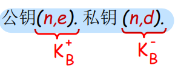

### RSA: encryption, decryption 加密，解密 

1. given (n,e) and (n,d) as computed above

2. to encrypt message m (<n), compute **c = me mod n**

3. to decrypt received bit pattern, c, compute m = **cd mod n**

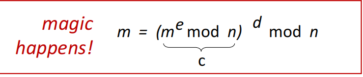

#### RSA example:

Bob 选择 p=5, q=7. 因此 n=35, z=24.

​		e=5 (so e, z 互素).

​		d=29 (so ed-1 能够被 z整除).

encrypting 8-bit messages.  加密8位消息。

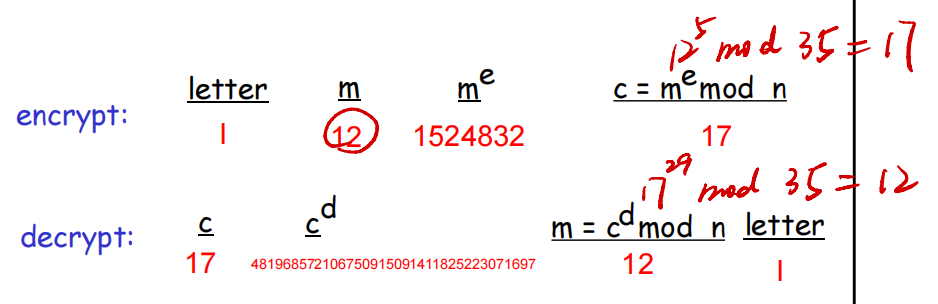

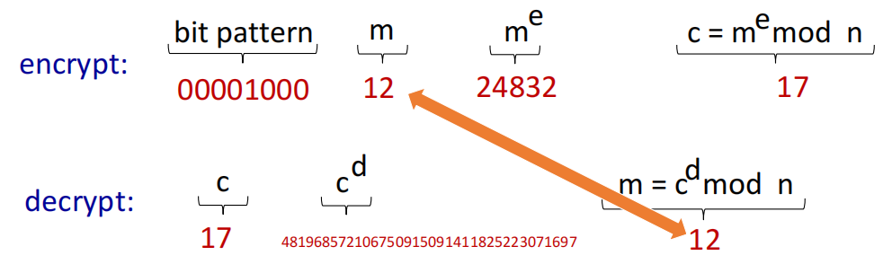

#### Why does RSA work?  为什么RSA能工作

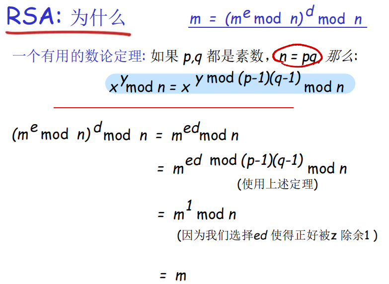

#### RSA: another important property 另外一个重要的特性

下面的特性将在后面**非常有用**

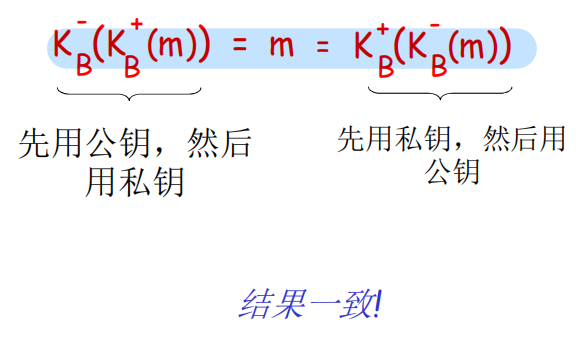

为什么这个等式成立？

follows directly from modular arithmetic:

直接从模块算术中得出:

(me mod n)d mod n = med mod n

​				= mde mod n

​				= (md mod n)e mod n

#### Why is RSA secure?  为什么RSA安全

- suppose you know Bob’s public key (n,e). How hard is it to determine d?

  假设您知道 Bob 的公钥 （n，e）。确定 d 有多难？

- essentially need to find factors of n without knowing the two factors p and q 

  本质上需要在不知道 p 和 q 两个因子的情况下找到 n 的因子

  - fact: factoring a big number is hard

    事实:分解一个大数字很难

#### RSA in practice: session keys  RSA实践:会话密钥

- exponentiation in RSA is computationally intensive

  RSA 中的指数化计算非常密集

- DES is at least 100 times faster than RSA

  DES 比 RSA 至少快 100 倍

- use public key crypto to establish secure connection, then establish second key – symmetric session key – for encrypting data

  使用公钥加密创建安全连接，然后创建第二个密钥 – 对称会话密钥 – 用于加密数据

**session key, KS**

- Bob and Alice use RSA to exchange a symmetric key KS

  Bob 和 Alice 使用 RSA 交换对称密钥 KS

- once both have KS , they use symmetric key cryptography

  一旦两者都具有 KS ，它们就会使用对称密钥加密