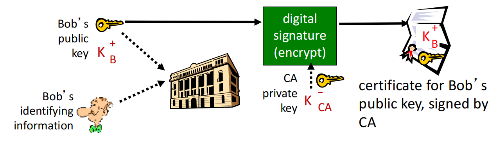

# Network Security 2

## Roadmap

- Message integrity, authentication

  消息完整性、身份验证

- Securing e-mail

  保护电子邮件安全

- Securing TCP connections: SSL

  保护 TCP 连接：SSL

## Message integrity, authentication   消息完整性、身份验证

### Authentication 认证

第一个目标：

**Goal**: Bob wants Alice to “ prove ” her identity to him

**当前目标**: Bob需要Alice证明她的身份

#### **Protocol ap1.0:** 

Alice says “I am Alice“

Alice 说 “I am Alice“

失败的场景:

in a network, Bob can not “ see ” Alice, so Trudy simply declares herself to be Alice

在网络中，Bob无法“看到”Alice，因此中间人Trudy简单地宣布自己是爱丽丝

#### **Protocol ap2.0**: 

Alice says “I am Alice” in an IP packet containing her source IP address

Alice 说 “I am Alice” ，在她发送的IP数据包中包括了她的IP地址

失败的场景：

Trudy can create a packet “spoofing” Alice’s address

Trudy可以生成一个分组，包括伪造的Alice的地址

#### Protocol ap3.0:

Alice says “I am Alice” and sends her secret password to “ prove ” it

Alice 说 “I am Alice” ，而且传送她的密码来证明.

失败的案例:

**playback attack:** Trudy records Alice’s packet and later plays it back to Bob

**重放攻击**: Trudy 记录Alice的分组，事后向 Bob 重放

#### Protocol ap3.1:

Alice says “I am Alice” and sends her encrypted secret password to “ prove ” it.

Alice 说 “I am Alice” ，而且传送她的加密之后的密码来证明

失败的场景:

record and playback **still** works!

记录，重放仍然有效

第二个目标：

**Goal**: avoid playback attack Failures, drawbacks?

**目标**：避免播放攻击失败、缺点？

**nonce**: number (R) used only once-in-a-lifetime

**nonce**：一生只使用一次的数字 （R）

#### Protocol ap4.0: 

to prove Alice “live”, Bob sends Alice *nonce*, R.  Alice must return R, encrypted with shared secret key

为了证明Alice的活跃性, Bob发送给Alice一个nonce, R. Alice 必须返回加密之后的R，使用双方约定好的key

#### Protocol ap5.0

**ap4.0** requires shared symmetric key 
ap4.0 需要双方共享一个对称式的密钥

- can we authenticate using public key techniques?

  是否可以通过公开密钥技术进行认证呢?

**ap5.0**: use nonce, public key cryptography

ap5.0: 使用nonce,公开密钥加密技术

**ap5.0: security hole  安全漏洞** 

man (or woman) in the middle attack: Trudy poses as Alice (to Bob) and as Bob (to Alice)

Trudy在中间，她会对Bob说我是Alice，对Alice说我是Bob。

Trudy 在 Alice (to Bob)和 Bob之间 (to Alice)

Trudy 在 Alice (to Bob) 和 Bob 在 Alice (to Alice)

难以检测:

- Bob收到了Alice发送的所有报文, 反之亦然. (e.g., so Bob, Alice一个星期以后相见，回忆起以前的会话)

- 问题时Trudy也接收到了所有的报文!

### Message integrity  消息完整性

#### Digital Signature  数字签名

cryptographic technique analogous to hand-written signatures:

类似于手写签名的加密技术：

- sender (Bob) digitally signs document, establishing he is document owner/creator. 

  发件人 （Bob） 对文档进行数字签名，确定他是文档所有者/创建者。

- **verifiable, nonforgeable**: recipient (Alice) can prove to someone that Bob, and no one else (including Alice), must have signed document.

  **可验证、不可伪造**：收件人 （Alice） 可以向某人证明 Bob 必须有签名文档，而其他任何人（包括 Alice）都不能有签名文档。

simple digital signature for message m:

简单的对ｍ的数字签名：

• Bob signs m by encrypting with his private key KB- , creating “signed” message, KB-(m)

Bob使用他自己的私钥对m进行了签署 ，创建数字签名, KB-(m)

- suppose Alice receives msg m, with signature: m, KB- (m)

  假设Alice收到报文m, 以及数字签名KB-(m)

- Alice verifies m signed by Bob by applying Bob’s public key KB+ to KB- (m) then checks KB+ (KB- (m) ) = m.

  Alice 使用Bob的公钥KB+ 对KB-(m)进行验证， 判断KB+(KB-(m) ) = m是否成立.

- If KB+ (KB- (m) ) = m, whoever signed m must have used Bob’ s private key

  如 KB+(KB-(m) ) = m成立, 那么签署这个文件的人一定拥有Bob的私钥.

Alice thus verifies that:

Alice 可以验证:

- Bob signed m

  Bob 签署了m

- no one else signed m

  不是其他人签署了m.

- Bob signed m and not m’

  Bob签署了m 而不是m’.

non-repudiation:

不可抵赖性:

- Alice can take m, and signature KB- (m) to court and prove that Bob signed m

  Alice可以拿着m,以及数字签名KB- (m)到法庭上，来证明是Bob签署了这个文件 m. (法庭用KB+对KB-(m）进行解密 )

#### Message digests  报文摘要

computationally expensive to public-key-encrypt long messages

公钥加密长消息的计算成本高昂

**goal**: fixed-length, easy to-compute digital “fingerprint"

Goal: 固定长度，容易计算的“fingerprint”

- apply hash function H to m, get fixed size message digest, H(m).

  对m使用散列函数H，获得固定长度的报文摘要H(m).

####  function properties 哈希函数特性

散列函数的特性：

- many-to-1

  多对一

- produces fixed-size msg digest (fingerprint)

  结果固定长度

- given message digest x, computationally infeasible to find m such that x = H(m)

  给定一个报文摘要x, 反向计算出原报文在计算上是不可行的x = H(m)

#### Digital signature = signed message digest 数字签名 = 对报文摘要进行数字签署

- 发送者使用哈希函数对原始数据进行哈希运算，生成消息摘要。
- 发送者用自己的私钥对消息摘要进行加密，生成数字签名。
- 发送者将数字签名和原始数据一起发送给接收者。
- 接收者用发送者的公钥解密数字签名得到消息摘要。
- 接收者对收到的原始数据进行哈希运算，生成新的消息摘要。
- 接收者比较两个消息摘要，如果一致，说明数据未被篡改且确实来自发送者。

#### Internet checksum: poor crypto hash function  Internet校验和: 弱的散列函数

Internet checksum has some properties of hash function:

网络校验和拥有一些散列函数的特性:

- produces fixed length digest (16-bit sum) of message

  产生报文m的固定长度的摘要 (16-bit sum) 

- is many-to-one

  多对1的

But given message with given hash value, it is easy to find another message with same hash value:

但是给定一个散列值，很容易计算出另外一个报文具有同样的散列值:

#### Hash function algorithms  哈希函数算法

用来保证信息是否是identical的

- MD5 hash function widely used (RFC 1321) 

  MD5 哈希函数 （RFC 1321）

  - computes 128-bit message digest in 4-step process. 

    在 4 步过程中计算 128 位消息摘要。

  - arbitrary 128-bit string x, appears difficult to construct msg m whose MD5 hash is equal to x

    任意 128 位字符串 x，似乎很难构造 MD5 哈希等于 x 的 msg m

- SHA-1 is also used

  SHA-1 也被使用

  - US standard [NIST, FIPS PUB 180-1]

    美国标准 [NIST、FIPS PUB 180-1]

  - 160-bit message digest

    160 位消息摘要

#### Recall: ap5.0 security hole  回忆：ap5.0 安全漏洞

man (or woman) in the middle attack: Trudy poses as Alice (to Bob) and as Bob (to Alice)

中间的男人（或女人）攻击：Trudy 冒充 Alice（对 Bob）和 Bob（对 Alice）

#### Public-key certification  公钥认证

- **motivation: Trudy plays pizza prank on Bob**

  **动机：Trudy 对 Bob 恶作剧**

  - Trudy creates e-mail order: *Dear Pizza Store, Please deliver to me four* *pepperoni pizzas. Thank you, Bob*

    Trudy 创建电子邮件订单：*亲爱的披萨店，请给我送四个* *意大利辣香肠披萨。谢谢你，鲍勃*

  - Trudy signs order with her private key

    Trudy 用她的私钥签署订单

  - Trudy sends order to Pizza Store

    Trudy 将订单发送到 Pizza Store

  - Trudy sends to Pizza Store her public key, but says it’s Bob’s public key

    Trudy 将她的公钥发送到 Pizza Store，但说这是 Bob 的公钥

  - Pizza Store verifies signature; then delivers four pepperoni pizzas to Bob

    Pizza Store 验证签名;然后给 Bob 送了四个意大利辣香肠披萨——

  - Bob doesn’t even like pepperoni

    鲍勃甚至不喜欢意大利辣香肠

#### Certification authorities  认证机构

- certification authority (CA): binds public key to particular entity, E.

  证书颁发机构 （CA）：将公钥绑定到特定实体 E。

- E (person, router) registers its public key with CA.

  E（person，router）向 CA 注册其公钥。

  - E provides “proof of identity” to CA. 

    E 向 CA 提供“身份证明”。

  - CA creates certificate binding E to its public key.

    CA 将证书绑定 E 创建到其公钥。

  - certificate containing E’s public key digitally signed by CA – CA says “this is E’s public key”

    包含 E 的公钥的证书，该公钥由 CA 进行数字签名 – CA 显示“这是 E 的公钥”

- when Alice wants Bob’s public key:

  当Alice想要Bob的公钥时:

  - gets Bob’s certificate (Bob or elsewhere).
  
    拿到Bob的证书(Bob或其他地方)。
  
  - apply CA’s public key to Bob’s certificate, get Bob’ s public key
  
    将 CA 的公钥应用于 Bob 的证书,获取 Bob 的公钥

there is a root of trust, meaning everyone need to trust the certificate issued by CA

有一个信任根，这意味着每个人都需要信任 CA 颁发的证书

### Revisit - Symmetric and Asymmetric Crypto  重新审视对称和非对称加密

- Q1：What is the main problem of symmetric cryptography

  Challenge to distinct the secret key

- Q2: How would we address this problem

  asymmetric (public key crypto)

- Q3: Any issues about asymmetric cryptography

  

- Q4: How would we solve this problem

## Securing e-mail  安全邮件

||代表concatenate，代表将两个信息结合在一起发送

Alice wants to send confidential e-mail, m, to Bob

Alice 需要发送机密的报文 m 给Bob.

Alice:

- generates random symmetric private key, KS

  产生随机的对称密钥, KS (代价小)

- encrypts message with KS (for efficiency)

  使用KS对报文加密(为了效率)

- also encrypts KS with Bob’s public key

  对 KS 使用 Bob的公钥进行加密  (KB+ (KS ))

- sends both KS (m) and KB+ (KS ) to Bob

  发送KS (m) 和KB+ (KS ) 给 Bob.

Bob:

- uses his private key to decrypt and recover KS

  使用他的私钥解密和恢复 KS 

- uses KS to decryptKS (m) to recover m

  使用KS解密KS (m)以恢复m

Alice wants to provide sender authentication message integrity

Alice 希望提供发件人身份验证消息完整性

- Alice digitally signs message

  Alice 对消息进行数字签名

- sends both message (in the clear) and digital signature

  发送消息（明文）和数字签名

Alice wants to provide secrecy, sender authentication, message integrity.

Alice 希望提供保密性、发件人身份验证和消息完整性。

Alice uses three keys: her private key, Bob’s public key, newly created symmetric key

Alice 使用三个密钥：她的私钥、Bob 的公钥、新创建的对称密钥

## Securing TCP connections: SSL  保护 TCP 连接：SSL

Secure sockets layer (SSL) 安全套接字层

- widely deployed security protocol

  广泛部署的安全协议

  - supported by almost all browsers, web servers

    几乎所有浏览器、Web 服务器都支持

  - https

  - billions $/year over SSL

- mechanisms: [Woo 1994], implementation: Netscape

  机制：[Woo 1994]，实现：Netscape

- variation -TLS: transport layer security, RFC 2246

  变体 - TLS：传输层安全性，RFC 2246

- provides

  提供

  - confidentiality

    保密性

  - integrity

    完整性

  - authentication

    权威性

- original goals:

  初始目标

  - Web e-commerce transactions 

    Web 电子商务交易

  - encryption (especially creditcard numbers)

    加密（尤其是信用卡号）

  - Web-server authentication

    Web 服务器身份验证

  - optional client authentication

    可选的客户端身份验证

  - minimum hassle in doing business with new merchant

    与新商家开展业务的麻烦最小

- available to all TCP applications

  适用于所有 TCP 应用进程

  - secure socket interface

    安全套接字接口

### SSL and TCP/IP

- SSL provides application programming interface (API) to applications

  SSL 为应用进程提供应用进程编程接口 （API）

- C and Java SSL libraries/classes readily available

  C 和 Java SSL 库/类随时可用

**为什么在SSL（TLS）中只对发送的message部分进行加密**

- **头部信息的必要性**: 在TCP/IP协议中，头部信息（如源IP地址、目标IP地址、端口号等）是路由和传输数据的必要部分。加密这些信息会导致设备无法路由数据包。
- **性能考虑**: 加密整个数据包（包括头部）会增加计算负担和延迟，因此通常只加密有效载荷（message部分）以提高性能。
- **安全保证**: 尽管头部信息没有加密，但使用TLS提供的其他机制（如MAC）可以确保消息的完整性与身份验证，从而降低潜在的安全风险。

**为什么在IPsec中会对所有的datagram进行加密**

- **全面保护**: IPsec设计的初衷是提供全面的安全保障，因此它会对整个IP数据包进行加密，包括头部和有效载荷。这有助于确保数据在网络中的所有传输都受到保护。
- **传输层无关**: IPsec不依赖于特定的传输层协议，因此它能够在不影响应用层和传输层协议的情况下，提供底层的安全保障。
- **隐私保护**: 加密整个数据包可以防止潜在的攻击者通过分析头部信息获取任何有用的信息，从而提供更高的隐私保护。

### Toy SSL: a simple secure channel  Toy SSL：一个简单的安全信道

**Four phases:**

**四个阶段：**

- **handshake**: Alice and Bob use their certificates, private keys to authenticate each other and exchange shared secret

  **握手**：Alice 和 Bob 使用他们的证书、私钥相互验证并交换共享密钥

- **key derivation**: Alice and Bob use shared secret to derive set of keys

  **密钥派生**：Alice 和 Bob 使用共享密钥来派生密钥集

- **data transfer**: data to be transferred is broken up into series of records

  **数据传输**：待传输的数据被分解为一系列记录

- **connection closure**: special messages to securely close connection

  **连接关闭**：用于安全关闭连接的特殊消息

### Toy

#### Toy: handshake  握手

Alice needs to:

Alice需要：

1. establish a TCP connection with Bob, 

   与 Bob 创建 TCP 连接，

2. verify that Bob is *really* Bob, 

   验证 Bob 是 *真的* Bob，

3. send Bob a master secret key

   向 Bob 发送一个主密钥

MS: master secret

MS：主密钥

EMS: encrypted master secret

EMS：加密的主密钥

#### Toy: key derivation  密钥派生

Readers should note that the **MAC** here (standing for “**message authentication code**”) is not the same MAC used in link-layer protocols (standing for “medium access control”)!

读者应该注意，这里的 MAC（代表“消息身份验证代码”）与链路层协议中使用的 MAC 不同（代表“介质访问控制”）！

- **considered bad to use same key (the master secret Key) for more than one cryptographic operation**

  **将同一密钥（主密钥）用于多个加密操作被视为错误**

  - use different keys for message authentication code (MAC) and encryption

    对消息身份验证代码 （MAC） 和加密使用不同的密钥

  - MAC = H(m+s), m:= message; s:= MAC key

    MAC = H（m+s）， m：= 消息;s：= MAC 密钥（digital signature）

- **four keys generated from the MS:**

  **从 MS 生成的四个密钥：**

  - Kc = encryption key for data sent from client to server

    Kc = 从客户端发送到服务器的数据的加密密钥

  - Mc = MAC key for data sent from client to server

    Mc = 从客户端发送到服务器的数据的 MAC 密钥

  - Ks = encryption key for data sent from server to client

    Ks = 从服务器发送到客户端的数据的加密密钥

  - Ms = MAC key for data sent from server to client

    Ms = 从服务器发送到客户端的数据的 MAC 密钥

- **keys derived from key derivation function (KDF)**

  从密钥派生函数 （KDF） 派生的密钥

  - takes master secret (MS) and (possibly) some additional random data and creates the keys

    获取主密钥 （MS） 和（可能）一些额外的随机数据并创建密钥

#### Toy: data transfer – in records  数据传输 – 记录中

- **why not encrypt data in constant stream as we write it to TCP?**

  **为什幺不在将数据写入 TCP 时以恒定流加密数据呢？**

  - where would we put the MAC? If at end, no message integrity until all data processed.

    我们应该把 MAC 放在哪里？如果 at end，则在处理所有数据之前不会保持消息完整性。

  - e.g., with instant messaging, how can we do integrity check over all bytes sent before displaying?

    例如，对于即时消息，我们如何在显示之前对发送的所有字节进行完整性检查？

- **instead, break stream in series of records**

  **相反，在 SEQUENCE OF RECORDS 中中断流**

  - each record carries a MAC

    每条记录都带有一个 MAC

  - receiver can act on each record as it arrives

    接收方可以在每条记录到达时对其进行操作

- **issue: in record, receiver needs to distinguish MAC from data**

  **问题：在记录中，接收器需要区分 MAC 和数据**

  - want to use variable-length records

    想要使用可变长度记录

#### Toy: data transfer - sequence numbers  数据传输串行号

- **problem**: attacker can capture and replay record or re-order records

  **问题**：攻击者可以捕获并重放记录或重新排序记录

- **solution**: put sequence number into MAC:

  **解决方案**：将串行号放入 MAC：

  - MAC = H(Mx , sequence ||data)

    MAC = H（Mx ， 串行 ||数据）

  - note: no sequence number field (in the record)

    注意：无串行号字段（在记录中）

- **problem**: attacker could replay all records

  **问题**：攻击者可以重放所有记录

- **solution**: use nonce

  解决方案：使用 NONCE

#### Toy: connection closure  连接关闭

- **problem**: truncation attack (MITM attacker): 

  **问题**： 截断攻击（MITM 攻击者）：

  - attacker forges TCP connection close segment (FIN)

    攻击者伪造 TCP 连接关闭段 （FIN）

  - one or both sides thinks there is less data than there actually is. 

    一方或双方认为数据比实际数据少。

- **solution**: record types, with one type for closure

  **解决方案**：记录类型，一种类型用于闭包

  - type 0 for data; type 1 for closure

    键入 0 表示数据;类型 1 用于闭合

- MAC = H(Mx , sequence||type||data)

  MAC = H（Mx ， 串行||类型 ||数据）

#### Toy SSL: summary  总结

#### Toy SSL isn’t complete  尚未完成

- **how long are the fields?**

  字段有多长？

- **which encryption protocols?**

  哪些加密协议？

- **client and server want negotiation?**

  客户端和服务器想要协商？

  - allow client and server to support different encryption algorithms

    允许 Client 端和 Server 支持不同的加密算法

  - allow client and server to choose together specific algorithm before data transfer

    允许客户端和服务器在数据传输前共同选择特定的算法

### SSL cipher suite   SSL 密码套件

- **cipher suite**

  **密码套件**

  - public-key algorithm

    公钥算法

  - symmetric encryption algorithm

    对称加密算法

  - MAC algorithm

    MAC 算法

- **SSL supports several cipher suites**

  **SSL 支持多种密码套件**

- **negotiation: client, server agree on cipher suite**

  **协商：客户端、服务器就密码套件达成一致**

  - client offers choice

    客户优惠选择

  - server picks one

    服务器选择一个

common SSL symmetric ciphers

常见的 SSL 对称密码

- DES – Data Encryption Standard: block

  DES – 数据加密标准：块

- 3DES – Triple strength: block

  3DES – 三倍强度：块

- RC2 – Rivest Cipher 2: block

  RC2 – Rivest Cipher 2：块

- RC4 – Rivest Cipher 4: stream

  RC4 – Rivest Cipher 4：流

SSL Public key encryption

SSL 公钥加密

- RSA

### Real SSL: 

#### Real SSL: handshake (1)  真实 SSL：握手 （1）

**Purpose**

1. server authentication

   服务器认证

2. negotiation: agree on crypto algorithms

   协商：就加密算法达成一致

3. establish keys

   创建密钥

4. client authentication (optional)

   客户端身份验证（可选）

#### Real SSL: handshake (2)

1. client sends list of algorithms it supports, along with client nonce

   客户端发送它支持的算法列表以及客户端随机数

2. server chooses algorithms from list; sends back: choice + certificate + server nonce

   服务器从 list 中选择算法;发回：选择 + 证书 + 服务器随机数

3. client verifies certificate, extracts server’s public key, generates pre_master_secret, encrypts with server’s public key, sends to server

   客户端验证证书，提取服务器的公钥，生成pre_master_secret，使用服务器的公钥加密，发送到服务器

4. client and server independently compute encryption and MAC keys from pre_master_secret and nonces

   客户端和服务器独立计算来自 pre_master_secret 和 NONCE 的加密和 MAC 密钥

5. client sends a MAC of all the handshake messages

   客户端发送所有握手消息的 MAC

6. server sends a MAC of all the handshake messages

   server 发送所有握手消息的 MAC

#### Real SSL: handshake (3)

**last 2 steps protect handshake from tampering** **最后 2 个步骤保护握手不被篡改**

- In step 1, client typically offers range of algorithms, in plain-text, some strong, some weak

  在第 1 步中，客户端通常以纯文本形式提供一系列算法，有些是强算法，有些是弱算法

- man-in-the middle could delete stronger algorithms from list

  中间人可以从列表中删除更强的算法

- last 2 steps (step 5 and 6) prevent this

  最后 2 个步骤（步骤 5 和 6）可以防止这种情况

  - last two messages are encrypted

    最后两条消息已加密

#### Real SSL: handshake (4)

- why two random nonces, in step 1 and 2 respectively? 

  为什幺在步骤 1 和 2 中分别有两个随机随机数？

- suppose Trudy sniffs all messages between Alice & Bob

  假设Trudy会嗅探Alice和Bob之间的所有消息

- next day, Trudy sets up TCP connection with Bob, sends exact same sequence of records

  第二天，Trudy 与 Bob 创建 TCP 连接，发送完全相同的记录串行

  - Bob (Amazon) thinks Alice made two separate orders for the same thing

    Bob （Amazon） 认为 Alice 为同一事物下了两个单独的订单

  - **solution**: Bob sends different random nonce for each connection. This causes encryption keys to be different on the two days

    **解决方案**： Bob 为每个连接发送不同的随机数。这会导致加密密钥在这两天有所不同

  - Trudy’s messages will fail Bob’s integrity check

    Trudy 的消息将无法通过 Bob 的完整性检查

### Real SSL connection

