# Network Security 3

## RoadMap

1. Network layer security: IPsec

   网络层安全:IPsec

2. Operational security: firewalls and IDS

   操作安全:防火墙和IDS

## What is network-layer confidentiality?  什幺是网络层保密性?

- **between two network entities:**

  **在两个网络实体之间:**

  - sending entity encrypts datagram payload, payload could be:

    发送实体加密数据报有效载荷,有效载荷可能是:

    - TCP or UDP segment, ICMP message, OSPF message ….

      TCP或UDP段,ICMP消息,OSPF消息......

  - all data sent from one entity to other would be hidden from any third party (that presumably is sniffing the network):

    从一个实体发送到另一个实体的所有数据都将对任何第三方(可能正在嗅探网络)隐藏:

    - web pages, e-mail, P2P file transfers, TCP SYN packets …

      网页,电子邮件,P2P文档传输,TCP SYN数据包......

- **“blanket coverage”**

  统括

### Virtual Private Networks (VPNs)

**motivation:**  动机

- **institutions often want private networks for security.** 

  **机构通常需要专用网络来确保安全。**

  - institution could actually deploy a stand-alone physical network that is completely separate from the public Internet.

    机构实际上可以部署一个与公共互联网完全分离的独立物理网络。

  - costly: separate routers, links, DNS infrastructure.

    成本高昂:单独的路由器、链路、DNS 基础设施。

- **VPN: institution’s inter-office traffic is sent over public Internet instead** 

  **VPN:机构的办公室间流量通过公共互联网发送**

  - encrypted before entering public Internet

    在进入公共互联网之前进行加密

  - logically separate from other traffic

    逻辑上与其他流量分开

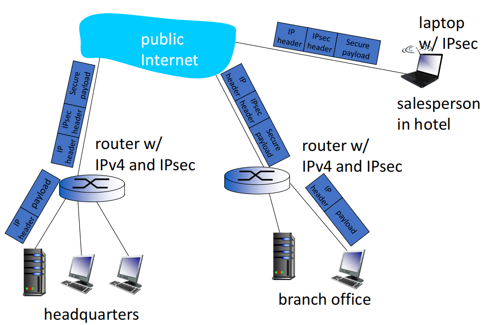

## IPsec

- data integrity

  数据完整性

- origin authentication

  原产地认证

- replay attack prevention

  防止重播攻击

- confidentiality 

  保密性

- **two protocols providing different service models:**

  **提供不同服务模式的两种协议:**

  - **Authentication Header (AH)**

    **身份验证标头 (AH) **

    - provides source authentication and data integrity but *no* confidentiality

      提供源身份验证和数据完整性,但*没有*保密性

  - **Encapsulation Security Payload (ESP)**

    **封装安全有效载荷(ESP)**

    - provides source authentication, data integrity, and confidentiality

      提供源身份验证、数据完整性和机密性

    - more widely used than AH

      比 AH 更广泛使用

### IPsec transport mode (host mode)  IPSec传输模式(主机模式)

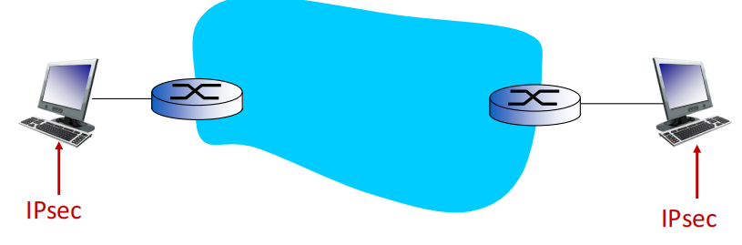

- IPsec datagram emitted and received by end-system

  终端系统发送和接收的 IPsec 数据报

- protects upper level protocols

  保护上层协议

### IPsec – tunneling mode  隧道模式

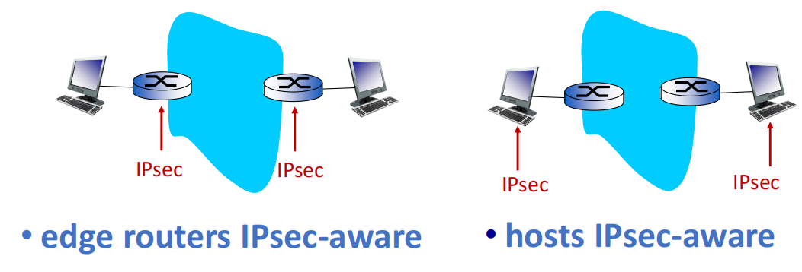

#### Four combinations are possible!  四种组合是可能的!

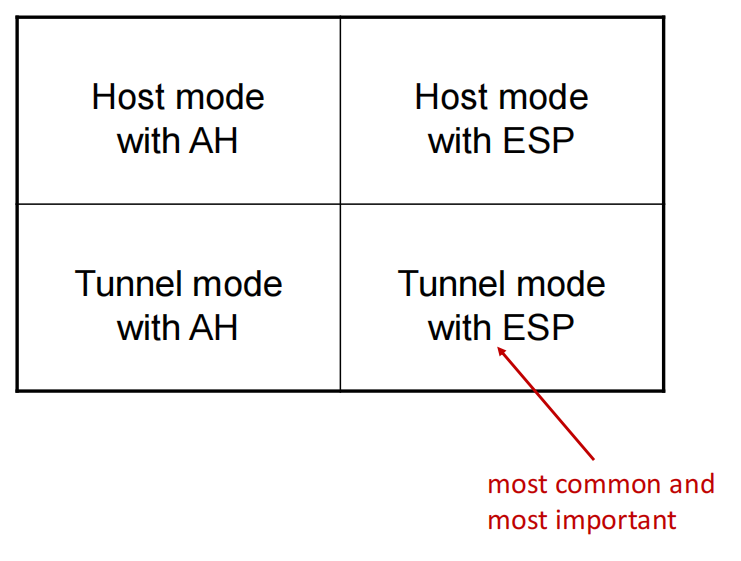

### Security associations (SAs)

- before sending data, **“security association (SA)”** established from sending to receiving entity

  在发送数据之前,从发送方到接收方实体之间创建 **"安全关联 (SA) "**

  - SAs are simplex: logical connection for only one direction

    SA是单向的:逻辑连接只有一个方向

- ending, receiving entitles maintain state information about SA

  结束,接收授权维护有关 SA 的状态信息

  - recall: TCP endpoints also maintain state info

    回想一下:TCP 端点也维护状态信息

  - IP is connectionless; IPsec is connection-oriented!

    IP 是无连接的;而 IPsec 是面向连接的!

- how many SAs in VPN w/ one headquarters office, one branch office, and n traveling salesperson?

  VPN有多少个SA,一个总部办公室,一个分公司,一个旅行销售员?

#### Example SA from R1 to R2

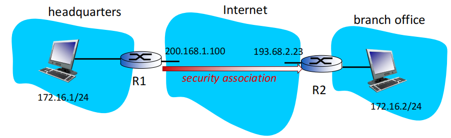

**R1 stores for SA:** 

- 32-bit SA identifier: **Security Parameter Index (SPI)**

  32 位 SA 标识符:**安全参数索引 (SPI) **

- origin SA interface (200.168.1.100)

  原点SA接口 (200.168.1.100)

- destination SA interface (193.68.2.23)

  目标 SA 接口 (193.68.2.23)

- type of encryption used (e.g., 3DES with CBC)

  使用的加密类型(例如,使用 CBC 的 3DES)

- encryption key

  加密密钥

- type of integrity check used (e.g., HMAC with MD5)

  使用的完整性检查类型(例如,HMAC与MD5)

- authentication key

  认证密钥

### Security Association Database (SAD)

- endpoint holds SA state in **security association database (SAD)**, where it can locate them during processing.

  端点将 SA 状态保存在 **安全关联数据库 (SAD) ** 中,可以在处理过程中找到它们。

- with n salespersons, **2 + 2n** SAs in R1’s SAD

  n 个销售人员,2 + 2n 个 SAs 在 R1 的 SAD 中

- when sending IPsec datagram, R1 accesses SAD to determine how to process datagram.

  当发送 IPsec 数据报时,R1 访问 SAD 以确定如何处理数据报。

- when IPsec datagram arrives to R2, R2 examines **SPI** in IPsec datagram, indexes SAD with SPI, and processes datagram accordingly

  当 IPsec 数据报到达 R2 时,R2 检查 IPsec 数据报中的 SPI,用 SPI 索引 SAD,并相应地处理数据报

### IPsec datagram  IPsec 数据报

**focus for now on tunnel mode with ESP**

现在专注于**ESP的隧道模式**

加密过程: R1: convert original datagram to IPsec datagram

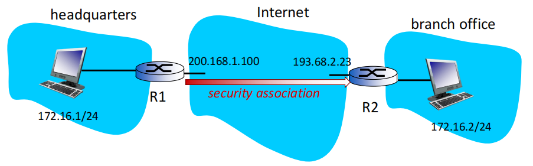

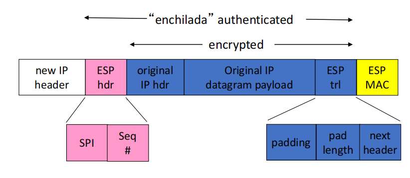

- appends to back of original datagram (that includes original header fields!) an “ESP trailer” field. 

  在原始数据报(包括原始报头字段!)后面附加一个"ESP trailer"字段。

- encrypts result using algorithm & key specified by SA.

  使用 SA 指定的算法和密钥加密结果。

- appends to front of this encrypted quantity the “ESP header, creating “enchilada”. 

  将"ESP 标头"附加到该加密数量的前面,创建"enchilada"。

- creates authentication MAC over the whole enchilada, using algorithm and key specified in SA. 

  使用 SA 中指定的算法和密钥,在整个 enchilada 上创建认证 MAC。

- appends MAC to back of enchilada, forming payload.

  将 MAC 连接到 Enchilada 的背面,形成有效载荷。

- creates brand new IP header, with all the classic IPv4 header fields, which it appends before payload.

  创建全新的 IP 标头,包含所有经典的 IPv4 标头字段,并将其附加在有效载荷之前。

#### Inside the enchilada:

- **ESP trailer: Padding for block ciphers**

- **ESP header:** 
  - SPI, so receiving entity knows what to do
  - Sequence number, to thwart replay attacks

- **MAC in ESP auth field is created with shared secret key**

### IPsec sequence numbers   IPsec 串行号

- **for new SA, sender initializes seq. # to 0**

  **对于新的 SA,发送方将 seq. # 初始化为 0**

- **each time datagram is sent on SA:**

  **每次在 SA 上发送数据报时:**

  - sender increments seq # counter

    s 增加 s 串行号 计数器

  - places value in seq # field

    在 seq # 字段中放置值

- **goal:**

  - prevent attacker from sniffing and replaying a packet

    防止攻击者嗅探和重播数据包

  - receipt of duplicate, authenticated IP packets may disrupt service

    收到重复的、经过身份验证的 IP 数据包可能会中断服务

- **method:** 

  - destination checks for duplicates

    目的地检查重复项

  - doesn’t keep track of *all* received packets; instead uses a window

    不会跟踪 *所有* 接收的数据包;而是使用一个窗口

### Security Policy Database (SPD)  安全策略数据库

- policy: For a given datagram, sending entity needs to know if it should use IPsec or vanilla IP

  策略:对于给定的数据报,发送实体需要知道它应该使用 IPsec 还是 vanilla IP

- needs also to know which SA to use

  还需要知道使用哪个SA

- may use: source and destination IP address; protocol number

  可能使用:源和目标 IP 地址;协议号

- info in SPD indicates “what” to do with arriving datagram 

  SPD 中的 info 指示如何处理到达的数据报文

- info in SAD indicates “how” to do it

  SAD 中的信息指出了"如何"做到这一点

### Summary: IPsec services  IPsec服务总结

suppose Trudy sits somewhere between R1 and R2. she doesn’t know the keys. 

假设特鲁迪坐在R1和R2之间,她不知道按键。

- will Trudy be able to see original contents of datagram? How about source, dest IP address, transport protocol, application port?

  Trudy 能看到数据报的原始内容吗?源地址、目标 IP 地址、传输协议、应用进程端口等信息呢?

- flip bits without detection?

  在没有检测的情况下翻转比特?

- masquerade as R1 using R1’s IP address?

  使用 R1 的 IP 地址伪装成 R1 吗?

- replay a datagram?

  重播数据报?

### IKE: Internet Key Exchange  互联网密钥交换

- **previous examples:** manual establishment of IPsec SAs in IPsec endpoints:

  **以前的示例:**在 IPsec 端点中手动创建 IPsec SA:

  *Example SA*

  ​	SPI: 12345

  ​	Source IP: 200.168.1.100

  ​	Dest IP: 193.68.2.23 

  ​	Protocol: ESP

  ​	Encryption algorithm: 3DES-cbc

  ​	HMAC algorithm: MD5

  ​	Encryption key: 0x7aeaca…

  ​	HMAC key:0xc0291f…

- manual keying is impractical for VPN with 100s of endpoints 

  对于具有 100 个端点的 VPN,手动键入是不切实际的

- instead use **IPsec IKE (Internet Key Exchange**) protocol, specified in RFC 5996.

  改为使用 RFC 5996 中规定的 IPSec IKE(互联网密钥交换)协议。

### IPsec summary  IPSec概述

- IKE message exchange for algorithms, secret keys, SPI numbers

  IKE 消息交换算法、密钥、SPI 数字

- either AH or ESP protocol (or both)

  AH 或 ESP 协议(或两者)

  - AH provides integrity, source authentication

    AH提供完整性,源身份验证

  - ESP protocol (with AH) additionally provides encryption

    ESP 协议(带 AH)另外提供加密

- IPsec peers can be two end systems, two routers/firewalls, or a router/firewall and an end system

  IPsec 对等体可以是两个终端系统、两个路由器/防火墙,或者一个路由器/防火墙和一个终端系统

## Operational Security: firewall and IDS  操作安全性:防火墙和IDS

Firewall: isolates organization’s internal net from larger Internet, allowing some packets to pass, blocking others

防火墙:将组织的内部网络与更大的互联网隔离,允许一些数据包通过,阻止其他数据包

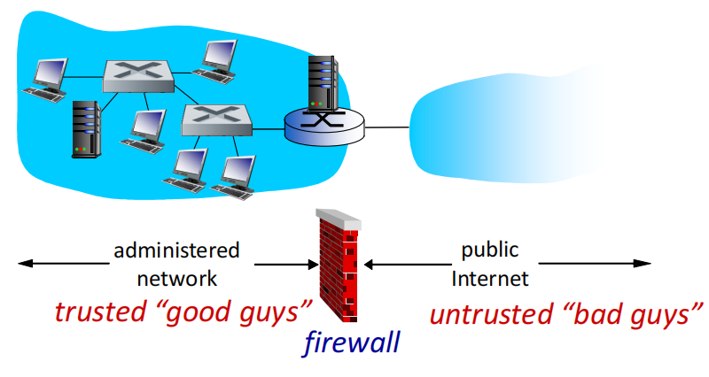

### 为什么要有防火墙

prevent denial of service attacks:

防止拒绝服务攻击:

- SYN flooding: attacker establishes many bogus TCP connections, no resources left for “real” connections 

  SYN 泛滥:攻击者创建了许多伪造的 TCP 连接,没有资源用于"真实"连接

prevent illegal modification/access of internal data

防止非法修改/访问内部数据

- e.g., attacker replaces CIA’s homepage with something else 

  例如,攻击者用别的东西替换了 CIA 的主页

allow only authorized access to inside network

只允许授权访问内部网络

- set of authenticated users/hosts 

  一组经过身份验证的用户/主机

three types of firewalls:

三种类型的防火墙:

- stateless packet filters

  无状态数据包过滤器

- stateful packet filters

  状态包过滤器

- application gateways

  应用网关 (Application Gateways)

### Stateless packet filtering  无状态数据包过滤

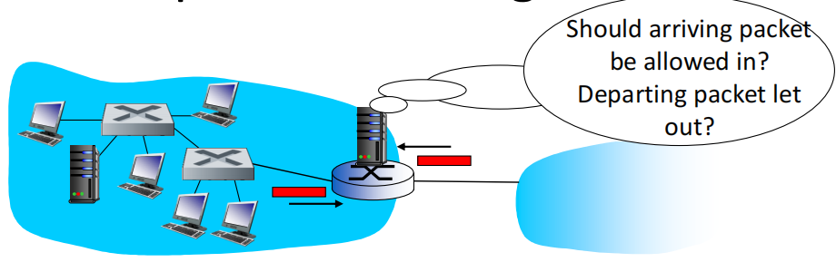

无状态：防火墙不维持内外网的状态

- internal network connected to Internet via **router firewall**

  内部网络通过**路由器防火墙**连接到互联网

- router f**ilters packet-by-packet**, decision to forward/drop packet based on:

  路由器逐包过滤,决定转发/丢弃数据包基于:

  - source IP address, destination IP address

    源 IP 地址、目标 IP 地址

  - TCP/UDP source and destination port numbers

    TCP/UDP 源端口和目的端口号

  - ICMP message type

    ICMP 消息类型

  - TCP SYN and ACK bits

    TCP SYN 和 ACK 位

**Example:**

- **example 1**: block incoming and outgoing datagrams with IP protocol field = 17 and with either source or dest port = 23

  **示例 1**:阻止 IP 协议字段 = 17 和源端口或目标端口 = 23 的传入和传出数据报

  - **result**: all incoming, outgoing UDP flows and telnet connections are blocked

    **结果**:所有传入、传出的 UDP 流和 Telnet 连接都被阻塞

- **example 2**: block inbound TCP segments with ACK=0.

  **示例2**:阻止ACK=0的入站TCP段。

  - **result**: prevents external clients from making TCP connections with internal clients, but allows internal clients to connect to outside.

    **result**:阻止外部客户端与内部客户端创建 TCP 连接,但允许内部客户端连接到外部。

**More examples:**

| Policy                                                       | Firewall Setting                                             |
| ------------------------------------------------------------ | ------------------------------------------------------------ |
| No outside Web access.                                       | Drop all outgoing packets to any IP address, port 80         |
| No incoming TCP connections,  except those for institution’s public Web server only. | Drop all incoming TCP SYN packets to any IP except 130.207.244.203, port 80 |
| Prevent Web-radios from eating up the available bandwidth.   | Drop all incoming UDP packets - except DNS and router broadcasts. |
| Prevent your network from being used for a smurf DoS attack. | Drop all ICMP packets going to a “broadcast” address (e.g. 130.207.255.255). |
| Prevent your network from being tracerouted                  | Drop all outgoing ICMP TTL expired traffic                   |

#### Access Control Lists  

**ACL**: table of rules, applied top to bottom to incoming packets: (action, condition) pairs: looks like OpenFlow forwarding table!

**ACL**:规则表,从上到下应用于传入数据包:(动作,条件)对:看起来像OpenFlow转发表!

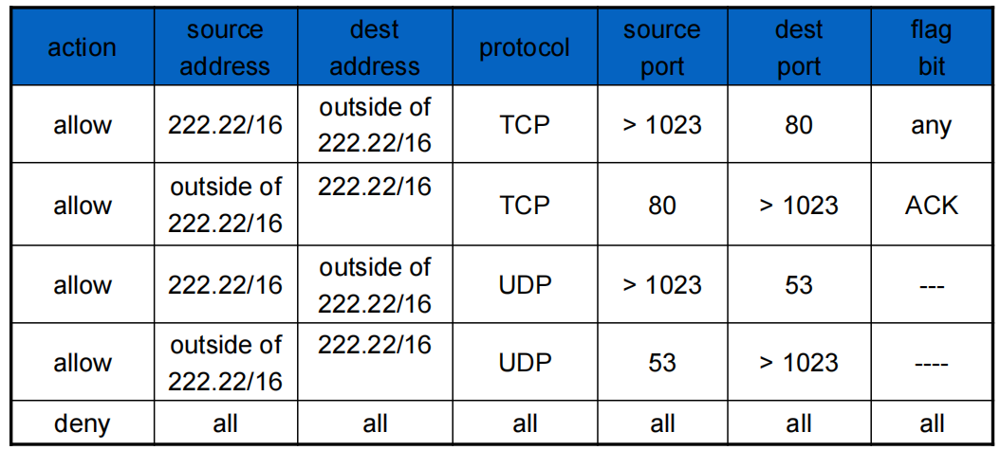

### Stateful packet filtering  有状态分组过滤

- **stateless packet filter**: heavy handed tool

  **无状态数据包过滤器**:重型工具

  - It may admit packets that “make no sense,” e.g., dest port = 80, ACK bit set, even though no TCP connection established:

    它可能会接受"没有意义"的数据包,例如,dest port = 80,ACK位设置,即使没有创建TCP连接:

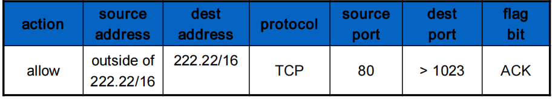

- **stateful packet filter**: track status of every TCP connection

  **状态数据包过滤器**:跟踪每个 TCP 连接的状态

  - track connection setup (SYN), teardown (FIN): determine whether incoming, outgoing packets “makes sense”

    跟踪连接设置(SYN),拆解(FIN):确定传入,传出数据包是否"有意义"

  - timeout inactive connections at firewall: no longer admit packets

    防火墙超时非活动连接:不再接受数据包

ACL augmented to indicate need to check connection state table before admitting packet

ACL 增强,以指示在接受数据包之前需要检查连接状态表 （需要连接建立起来才能发送流量）

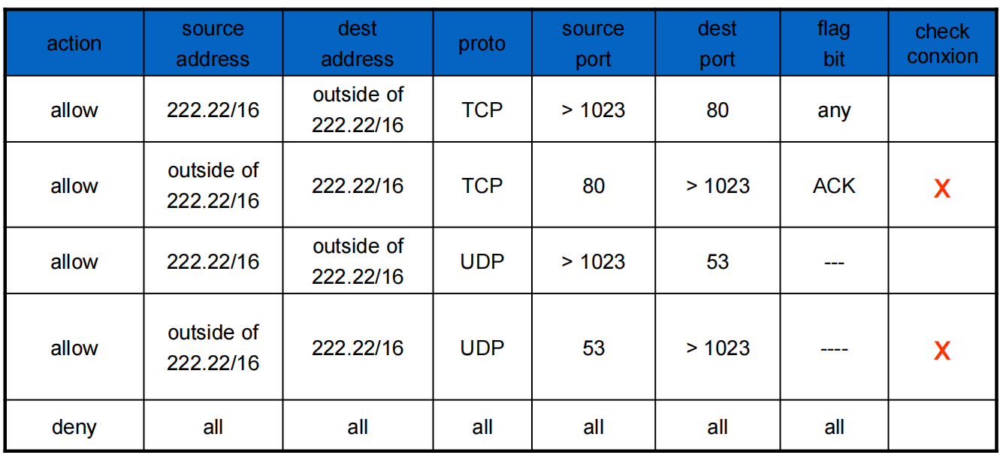

#### Application gateways  应用进程网关

- filter packets on application data as well as on IP/TCP/UDP fields.

  过滤应用进程数据包以及 IP/TCP/UDP 字段。 (在应用层做深入的应用数据流的剖析)

- **example**: allow select internal users to telnet outside

  **示例**:允许选定的内部用户在外部进行telnet

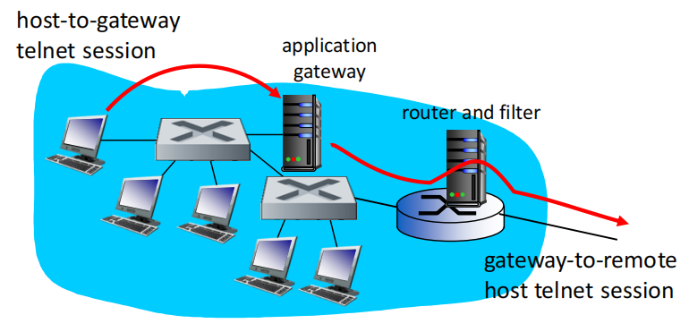

router and filter部分：设置内部除了application gateway，都不能和外界建立talenet session。（要想建立，只能通过application gateway）

1. . require all telnet users to telnet through gateway.

   要求所有telnet用户通过网关进行telnet。

2. for authorized users, gateway sets up telnet connection to dest host. Gateway relays data between 2 connections.

   对于认证的用户而言，网关建立和目标主机的telnet connection ，网关在2个连接上进行中继

3. router filter blocks all telnet connections not originating from gateway.

   路由器过滤器对所有不是来自网关的telnet的分组全部过滤掉

### Limitations of firewalls, gateways 防火墙和应用程序网关的局限性

- **IP spoofing**: router can’t know if data “really” comes from claimed source

  **IP欺骗**:路由器无法知道数据是否"真正"来自声称的来源

- if multiple app’s. need special treatment, each has own application gateway

  如果多个应用进程需要特殊处理,则每个应用进程都有自己的应用进程网关

- client software must know how to contact gateway.

  客户端软件必须知道如何联系网关。

  - e.g., must set IP address of proxy in Web browser

    例如,必须在 Web 浏览器中设置代理的 IP 地址

- filters often use all or nothing policy for UDP

  过滤器通常使用 UDP 的全有或全无策略

- tradeoff: degree of communication with outside world, level of security

  权衡:与外部世界的沟通程度,安全水平

- many highly protected sites still suffer from attacks

  许多高度保护的网站仍然遭受攻击

### Intrusion detection systems  IDS：入侵检测系统

- **packet filtering:**

  **数据包过滤:**

  - operates on TCP/IP headers only

    仅在 TCP/IP 标头上运行

  - no correlation check among sessions 

    没有会话之间的相关性检查

- **IDS: intrusion detection system**

  **IDS:入侵检测系统**

  - *deep packet inspection:* look at packet contents (e.g., check character strings in packet against database of known virus, attack strings)

    *深度数据包检查*:查看数据包内容(例如,检查数据包中的字符串与已知病毒数据库,攻击字符串)

  - examine correlation among multiple packets

    检查多个数据包之间的相关性

    - port scanning

      端口扫描

    - network mapping

      网络映射(Network Mapping)

    - DoS attack

      DoS攻击

multiple IDSs: different types of checking at different locations

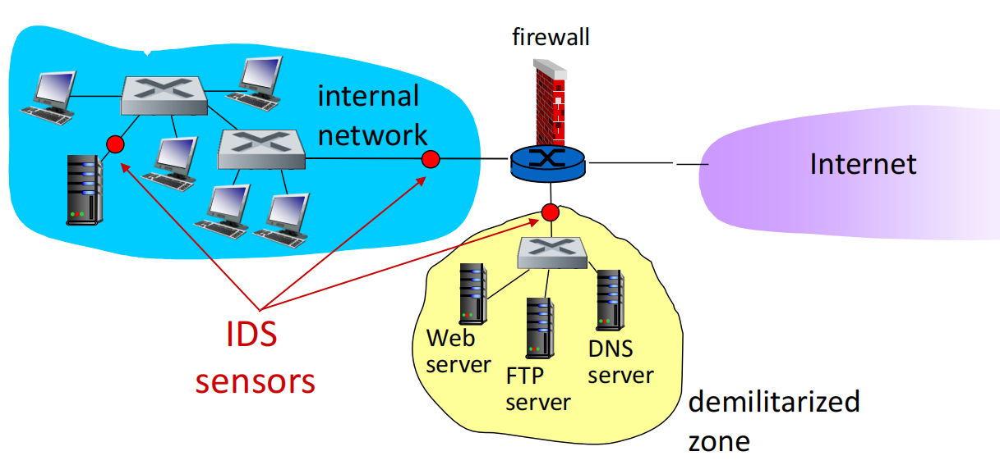

## Network Security Summary

**basic techniques…...**

- cryptography (symmetric and public)

- message integrity

- end-point authentication

**…. used in many different security scenarios**

- secure email

- secure transport (SSL)

- IP sec

- 802.11

**operational security: firewalls and IDS**
