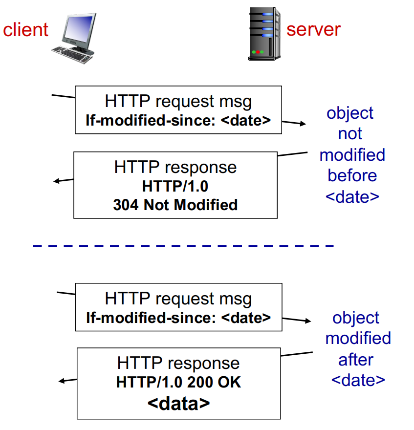

# Application Layers 1 应用层

## Principle of network application 网络应用原理

| Application            | App layer protocol         | Underlying Transport Protocol |
| ---------------------- | -------------------------- | ----------------------------- |
| E-mail                 | SMTP[RFC 2281], POP3, IMAP | TCP                           |
| Remote terminal Access | Telnet [RFC 854], SSH      | TCP                           |
| Web                    | HTTP [RFC 2616], HTTPS     | TCP                           |
| File Transfer          | FTP [959], SFTP            | TCP                           |
| Multimedia             | HTTP / RTP [RFC 1889]      | TCP or UDP                    |
| VolP                   | SIP, RTP  or proprietary   | TCP or UDP                    |

### Client-server architecture 主从式架构

- **Server** 服务端
  - Always-on host  始终在线的主机
  
  - Permanent IP address  永久 IP 地址
  
  - High performance / Distributed computing  高性能/分布式计算
  
  - Server process: waits to be contacted (Listen)  服务器进程：等待被联系 （Listen）
  
- **Clients** 客户端
  - Link to the server for service  链接到服务器以进行服务

  - May be intermittently connect to the internet  可能会间歇性地连接到 Internet

  - Dynamic IP address 动态 IP 地址

  - Do not communicate directly with each other  不要直接相互通信

  - Client process: initiates communication  客户端进程：启动通信

### P2P Architecture P2P 架构

- No always-on server is needed 不需要始终在线服务器

- End systems directly exchange data  终端系统直接交换数据

- Client process / server process on the same host  客户端进程/服务器进程在同一主机上

- Peers request service from other peers, provide service in return to other peers
  
  对等体向其他对等体请求服务，并向其他对等体提供服务
  
  - *Self scalability* – new peers bring new service capacity, as well as new service demands
  
    *自我扩展性* - 新的对等体带来新的服务能力,以及新的服务需求
  
- Peers are intermittently connected  对等体连接间歇

- Dynamic IP addresses  动态IP地址

- Q: Did you use Thunder Downloader(迅雷)? Why does it download so fast?

### Socket 套接字

- Process sends/receives messages to/from its socket

  进程向/从其套接字发送/接收消息

- Socket analogous to door  套接字类似于门

- Sending process shoves message out door 发送过程将消息推到门外

- Sending process relies on transport infrastructure on other side of door to deliver message to socket at receiving process

  发送过程依赖于门另一侧的传输基础设施,以便在接收过程中将消息传送到插座

### Addressing processes 寻址过程

- To receive messages, process must have identifier

  要接收消息,进程必须具有标识符

- Host device has unique 32-bit IPv4 and/or 128-bit IPv6

  主机设备具有唯一的 32 位 IPv4 和/或 128 位 IPv6

- Process network identifier： 进程网络标识符:

  - **IPv4**:port 192.168.1.100:80

  - **IPv6**:port [240e:3a1:4cb1:69d0:f40c:4269:74a2:7ea3]:80

### Application-layer protocol defines 应用层协议定义

- **Types of messages exchanged** 交换的消息类型
  - e.g., request, response 

- **Message syntax:**  消息语法
  - what fields in messages & how fields are delineated  消息中的字段和字段是如何划分的

- **Message semantics: **消息语义
  - meaning of information in fields  字段中信息的含义

- **Message timing:**   消息计时：
  - when and how  何时以及如何

区分接口类型：

- **Open protocols:** 公用端口

  - Defined in RFCs

  - Allows for interoperability

  - e.g., HTTP, SMTP, FTP

- **Proprietary protocols:**  专有端口

- e.g., Skype, Games, you own protocols…

### Internet transport protocols services 网络传输协议服务

**TCP service:**

- **Reliable transport** between sending and receiving process

  发送和接收过程之间的**可靠传输**

- **Flow control**: sender won’t overwhelm receiver 

  **流量控制**：发送方不会压倒接收方

- **Congestion control**: throttle sender when network overloaded

  **拥塞控制**：网络过载时限制发送方

- **Does not offer**: timing, minimum throughput guarantee, security

  **不提供**：计时、最小吞吐量保证、安全性

- **Connection-oriented**: setup required between client and server processes

  **面向连接**：客户端和服务器进程之间需要设置

**UDP service:**

- **Unreliable data transfer** between sending and receiving process

  发送和接收过程之间的 **不可靠的数据传输**

- **Does not offer**: reliability, flow control, congestion control, timing, throughput guarantee, security, or connection setup,

  **不提供**：可靠性、流量控制、拥塞控制、计时、吞吐量保证、安全性或连接设置，

- Online games, live streaming 

### Securing TCP - Secure Sockets Layer (SSL) 

#### TCP & UDP

- No encryption 无加密

- Cleartext psws -> Internet 明文密码-> Internet

#### SSL is at app layer

- Apps use SSL libraries, that "talk" to TCP

#### SSL

- Provides encrypted TCP connection 提供加密的 TCP 连接 -

- Data integrity 数据完整性

- End-point authentication 端点认证

#### SSL socket API

- Cleartext psw -> encrypted psw -> Internet

- Lecture 11/12 will talk more

## Web Application 网站应用

WWW: World Wide Web

HTTP: Hypertext Transfer Protocol

Web page consists of *base HTML-file* which includes *several referenced* *objects, addressable by a URL (uniform resource locator)*

网页由 *基本 HTML 文档* 组成，其中包括 *几个引用的* *对象，可通过 URL（统一资源定位器）寻址*

### HTTP

*HTTP is* *“**stateless**”* 无状态的

- server maintains no information about past client requests

  服务器不保留有关过去客户端请求的信息

- **Application layer protocol**  是应用层的协议

- **Client/server model ** cs模型

  - *Client:* browser that requests, receives,  (using HTTP protocol) and show Web objects （Render）

    客户端:请求、接收(使用HTTP协议)和显示Web对象(渲染)的浏览器

  - *Server:* Web server sends (using HTTP protocol) objects in response to requests

    服务器:Web服务器发送(使用HTTP协议)对象以响应请求

**Uses TCP:**

1. Client initiates TCP connection (creates socket) to server, port 80(443 for https)

   客户端启动与服务器的 TCP 连接（创建套接字），端口 80（https 为 443）

2. Server accepts TCP connection from client

   服务器接受来自客户端的 TCP 连接

3. HTTP messages (application-layer protocol messages) exchanged between browser (HTTP client) and Web server (HTTP server)

   在浏览器（HTTP 客户端）和 Web 服务器（HTTP 服务器）之间交换的 HTTP 消息（应用进程层协议消息）

4. TCP connection closed

   TCP 连接关闭

### HTTP connections

- **Non-persistent HTTP** 非持久性

  - At most one object sent over TCP connection

    最多 1 个通过 TCP 连接发送的对象

  - connection then closed

    连接然后关闭

  - Downloading multiple objects required multiple connections

    下载多个对象需要多个连接

- **Persistent HTTP** 持久性HTTP

  - Multiple objects can be sent over single TCP connection between client, server

    可以通过客户端、服务器之间的单个 TCP 连接发送多个对象

#### None-persistent HTTP: response time 非持久HTTP:响应时间

- **RTT** (Round Trip Time): 往返时间

  - time for a small packet to travel from client to server and back round trip time

    小数据包在客户端之间传输和返回往返的时间

+ HTTP response time: 响应时间

  - One RTT to initiate TCP connection

  - One RTT for HTTP request and first few bytes of HTTP response to return

  - File transmission time

  - Non-persistent HTTP response time = 2RTT+ file transmission time

#### Issues

- Non-persistent HTTP issues:

  - Requires 2 RTTs per object

    每个链接需要两次往返时间

  - OS overhead for each TCP connection

    每个 TCP 连接的 OS 开销

  - Browsers often open parallel TCP connections to fetch referenced objects

    浏览器通常会打开并行 TCP 连接来获取引用的对象

- Persistent HTTP issues:

  - Server leaves connection open after sending response

    服务器在发送响应后保持连接打开

  - Subsequent HTTP messages between same client/server sent over open connection

    同一客户端/服务器之间通过开放连接发送的后续 HTTP 消息
  
  - Client sends requests as soon as it encounters a referenced object
  
    客户端在遇到引用对象后立即发送请求
  
  - As little as one RTT for all the
  
    只需一个 RTT 即可获得所有

### HTTP Request Message Format

例如：

GET /domain/index.html HTTP/1.1

Host: www.example.com

Connection: close

User-agent: Mozilla/5.0

Accept-language: en

### General HTTP methods

GET, POST, PUT, DELETE, PATCH, HEAD, TRACE, OPTIONS, CONNECT

### HTTP response status codes 请求状态码

• **Some sample codes**:

• 200 OK

• 301 Move Permanently

• 400 Bad Request

• 404 Not Found

• 505 HTTP Version Not Supported

响应报文例如：

HTTP1.1 200 ok

Connection: close

Date: Tue, 18 Aug 2015 15:10:03 GMT

Server: Aphache/2.2.3 (CentOS)

Last-Modified: Tue, 18 Aug 2015 15:11:03 GMT

Content-Length: 6821

Content-Type: text/html

(Data)

## User-server State: Cookies

**Four components:**

1. cookie header line of HTTP response message

2. cookie header line in next HTTP request message

3. cookie file kept on user’s host, managed by user’s browser

4. back-end database at Web site

- **What cookies can be used for:**

  - Authorization 认证

  - Recommendations 建议

  - User session state 用户的session状态

## Web Caches (Proxy server) Web 缓存（代理服务器）

**Goal:** satisfy client request without involving origin server

**目标：**在不涉及源站的情况下满足客户端请求

- **User sets browser: Web accesses via cache** 用户设置浏览器：通过缓存进行 Web 访问

- **Browser sends all HTTP requests to cache** 浏览器将所有 HTTP 请求发送到缓存

  - object in cache: cache returns object 

  - else cache requests object from origin server, then returns object to client

    缓存中的对象：缓存返回对象，否则缓存从源服务器请求对象，然后将对象返回给客户端

- **Cache acts as both client and server** 缓存同时充当客户端和服务器

  - server for original requesting client  原始请求客户端的服务器

  - client to origin server  客户端到源服务器

- Typically cache is installed by ISP (university, company, residential ISP（Internet Service Provider服务供应商）)

  通常缓存由 ISP（大学、公司、住宅 ISP）安装

- Why Web Caching  为什幺选择 Web 缓存

  - reduce response time for client request  缩短客户请求的响应时间

  - reduce traffic on an institution’s access link  减少机构访问链接上的流量

  - Internet dense with caches: enables “ poor ” content providers to effectively deliver content (so too does P2P file sharing)
  
    互联网缓存密集：使“穷”内容提供商能够有效地交付内容（P2P 文档共享也是如此）

### Cache Examples

- Assumptions:

  - avg object size: 100K bits

  - avg request rate from browsers to origin servers:15/sec

  - avg data rate to browsers: 1.50 Mbps

  - RTT from institutional router to any origin server: 2 sec

  - access link rate: 1.54 Mbps

- Consequences:

  - LAN utilization: 1.50 / 1000 = 0.15%

  - access link utilization = 1.50/1.54 = 97.4%

  - total delay = Internet delay + access delay + LAN delay = 2 sec + minutes + usecs

#### Caching example: install local cache

Assumptions:

- avg object size: 100K bits

- avg request rate from browsers to origin servers:15/sec

- avg data rate to browsers: 1.50 Mbps

- RTT from institutional router to any origin server: 2 sec

- access link rate: 1.54 Mbps

**Calculating access link utilization, delay with cache:** 计算访问链路利用率，缓存延迟：

- **Suppose cache hit rate is 0.4**
  - 40% requests satisfied at cache, 60% requests satisfied at origin 

- **Access link utilization:** 
  - 60% of requests use access link 

- **Data rate to browsers over access link = 0.6\*1.50 Mbps = 0.9 Mbps** 
  - utilization = 0.9/1.54 = 0.58

- **Total delay**

  - = 0.6 * (delay from origin servers) +0.4 * (delay when satisfied at cache)
  - = 0.6 (2.01) + 0.4 (~msecs) = ~ 1.2 secs

  - less than with 154 Mbps link (and cheaper too!) 低于 154 Mbps 链接（而且也更便宜!)

上图展示了一个公司的局域网和公共互联网之间通过两个路由以及一根15Mb的网络链路连接，如果直接让该公司访问远程服务器，假设每条信息的长度为1Mb，那么每秒发送15个请求就会达到这个链路的请求极限。这个时候有两个方法改善。首先，直接花大价钱增加本公司接入互联网的网络链路的贷款；更经济的做法是在公司局域网中增设一个CDN（Content Distribution Network, 内容分发网络），充当Web缓存器，这样当公司内的员工访问之前已经访问过并且在Web缓存器中保存的网络数据是，可以直接从中调用而不需要重新请求，这样的大概的命中率在0.2~0.7之间。

### Conditional GET  条件 GET

- Goal: don’t send object if cache has up-to-date cached version

  目标：如果缓存具有最新的缓存版本，则不发送对象

  - no object transmission delay

    无对象传输延迟

  - lower link utilization

    链路利用率较低

- cache: specify date of cached copy in HTTP request
  
  缓存：指定 HTTP 请求中缓存副本的日期
  
  - If-modified-since: <date>
  
- server: response contains no object if cached copy is up-to-date: 
  
  服务器： 如果缓存的副本是最新的，则响应不包含任何对象：
  
  - HTTP/1.0 304 Not Modified

Web缓存器引入一个新问题，即存放在缓存器中的对象副本可能是陈旧的。换句话来说，保存在服务器中的对象可能会被修改，与保存在缓存器早上的内容造差异。HTTP协议有一种机制，允许缓存器证明它的对象是最新的。这种机制就是条件GET。即如果请求保本使用GET方法，并且请求报文中包含一个“if-Modified-Since:”的首部行。那么这个HTTP请求报文就是一个条件GET请求报文。

Example：

- 一个代理缓存器（proxy cache）代表一个客户请求浏览器，向远程Web服务器发送一个请求报文：

  GET /example/gif HTTP1.1

  Host: www.school.edu

- 其次，该Web服务器向缓存器发送具有被请求的对象的响应报文：

  HTTP/1.1 200 OK

  Date: Sat, 3 Oct 2015 15:38:38

  Server: Apache/1.3.0 (Unix)

  Last-Modified: Wed , 9 Sep 2015 09:09:09

  Content-Type: imgae/gif

  (Data)

- 该缓存器在将对象转发到请求的浏览器的同时，也在本地缓存了该对象。重要的是，缓存器在存储该对象时也存储了最后的修改日期。最后，一个星期后，另一个用户经过该缓存器请求同一个对象，该对象仍在这个缓存其中。但是过去的一个星期中卫浴Web服务器上的内容已经被修改，该服务器发送一个条件GET执行最新检查。该缓存器发送

  GET /example.gif

  Host: www.school.edu

  If-Modified-Since: Wed, 9, Sep, 2015 09:09:09

- 值得注意的是这个里的IF-Modified-Since中的时间正好等于一个星期前服务器发送的响应报文中的Last-Modified。服务器会检查该日期之后的是否加入了新内容，然后才会发送对象，加入在此之后没有被修改过，那么进行下一步，Web服务器向该缓存器发送一个响应报文：

  HTTP/1.1 304 Not Modified

  Date: Sat, 10 Oct 2015 15:15:15

  Server: Apache/1.3.0 (Unix)

  (Empty Entity Body) 返回空的内容

## Question

- Does HTTP == Webpages?

