# Application Layers 2

## Domain Name System (DNS) 域名解析系统 （DNS）

- **Application-layer protocol:  应用层协议**

  - C/S architecture

  - UDP (port 53)

  - hosts, name servers communicate to resolve names (name / address translation)

    主机、名称服务器通信以解析名称（名称/地址转换）

- **Distributed database implemented in <u>hierarchy</u> of many name servers**

  分布式数据库在 <u>hierarchy</u> 中实现许多域名服务器

### DNS Service, Structure

- **DNS services**

  - Hostname to IP address translation(A) 主机名到 IP 地址的转换 （A）

  - Host aliasing (cname) 主机别名（cname） 

  - canonical, alias names 规范， 别名 

  - Mail server aliasing(mx) 邮件服务器别名 （mx）

  - Load distribution  负载分配 

  - Replicated Web servers: many IP addresses correspond to one name 复制的 Web 服务器：多个 IP 地址对应一个名称

- **Why not centralize DNS?**  为什幺不集中 DNS？

  - Single point of failure  单点故障

  - Traffic volume  流量

  - Distant centralized database  远程集中式数据库

  - Maintenance  维护

### DNS: a distributed, hierarchical database  DNS是分布式分层数据库

**Client wants IP for www.amazon.com:** 如果用户想要访问亚马逊

- Client queries **root server** to find com DNS server 访问根域名服务器，可以返回顶级域服务器ip

- Client queries .com DNS server to get amazon.com DNS server 

- Client queries amazon.com DNS server to get IP address for www.amazon.com

- com -> amazon.com -> www.amazon.com

### TLD, authoritative servers 权威域名服务器，可以返回IP

- **Top-level domain (TLD) servers:**  顶级域 （TLD） 服务器

  - Responsible for com, org, net, edu, aero, jobs, museums, and all Top-level country domains, e.g.: cn, uk, fr, ca, jp

  - *Eg.:*

    - *Network Solutions* maintains servers for .com TLD

    - *Educause* for .edu TLD (https://net.educause.edu/) 例如edu对应的是教育机构

- **Authoritative DNS servers:**   权威 DNS 服务器

  - Organization’s own DNS server(s), providing authoritative hostname to IP mappings for organization’s named hosts 

    组织自己的 DNS 服务器，为组织的domain主机提供权威主机名到 IP 映射

  - Can be maintained by organization or service provider

    可由组织或服务提供商维护

### Local DNS name server  本地 DNS 域名服务器

- Does not strictly belong to hierarchy   严格说来不属于等级制度

- Each ISP (residential ISP, company, university) has one  每个 ISP（住宅 ISP、公司、大学）都有一个
  - Also called “default name server”  也称为 “默认名称服务器”

- When host makes DNS query, query is sent to its local DNS server

  当主机进行 DNS 查询时，查询将发送到其本地 DNS 服务器

  - Has local cache of recent name-to-address translation pairs (but may be out of date!)

    本地缓存有最近的名称到地址翻译对（但可能已经超时！）。

  - Acts as proxy, forwards query into hierarchy

    充当代理，将查询转发到层次结构中

### DNS name resolution example DNS域名解析案例

查询方式：
左：**Iterated query**（local DNS疯狂问人，迭代），右：**Recursive query**（好心人一路送到底，递归）

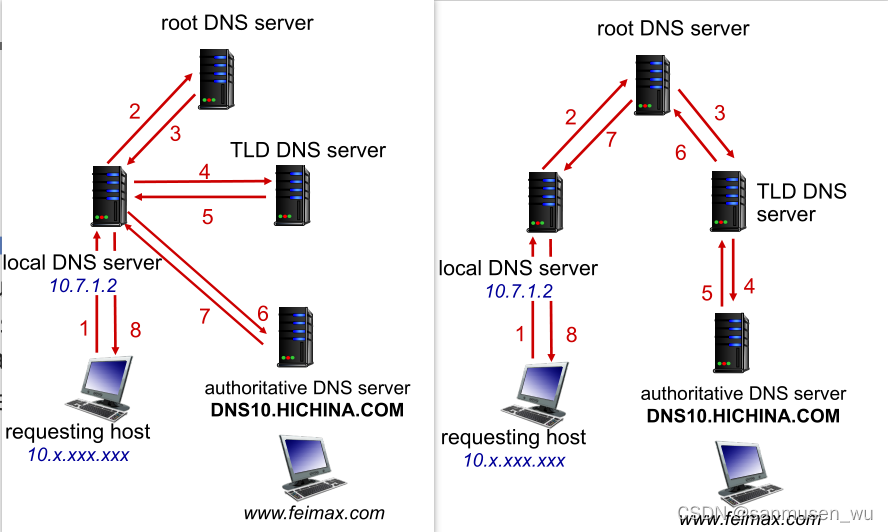

### DNS: caching, updating, records  DNS：缓存、更新、记录

**TTL time-to-live 一个封包在网络上可以存活的时间；** TTL是一个ip协议的值，它告诉网络，数据包在网络中的时间是否太长而应被丢弃，ttl是该记录的生存时间，决定了资源资源记录应当在多久之后被删除。

- **Once (any) name server learns mapping, it caches mapping**

  一旦（任何）域名服务器学习到映射，它就会缓存映射

  - Cache entries timeout (disappear) after some time (TTL)  缓存条目在一段时间后超时 （消失）（TTL）

  - TLD servers typically cached in local name servers.  TLD 服务器通常缓存在本地域名服务器中
    - thus root name servers not often visited  因此不经常访问根域名服务器

- **Cached entries may be out-of-date**  缓存的条目或许已经过期

  - If name host changes IP address, may not b e known Internet-wide until all TTLs expire

    如果主机域名更换了IP地址，也许在所有的TTL失效之前都不会知道internet-wide

- **Update/notify mechanisms proposed IETF standard**

  更新/通知机制提议的 IETF 标准

  - RFC 2136

### DNS Records DNS 记录

**DNS**: distributed database storing resource records **(RR)**

**DNS**：存储资源记录的分布式数据库 **（RR）**

RR format: **(name, value, type, ttl)**

通常name和value的值取决于Type，假设下面的例子中都先不考虑TTL

- **type=A**

  - **name** is hostname 主机名

  - **value** is IP address 主机名对应的IP地址

  - 一条类型为A的资源记录提供了标准的主机名到IP地址的映射。例如（relay1.com, 145,37,95,166）

- **type=NS**

  - **name** is domain (e.g.,  foo.com)

    name是一个域，如（foo.com）

  - **value** is hostname of authoritative name server for this domain

    而value是一个知道该如何获取该域中主机IP地址的权威DNS服务器的主机名。

  - 例如：（foo.com, dns.foo.com, NS）

- **type=CNAME**

  - **name** is alias name for some “canonical” (the real) name

  - **www.taobao.com** is really www.taobao.com.danuoyi.tbcache.com

  - **value** is canonical name  value是name的规范名称

  - 例如：（www.taobao.com，www.taobao.com.danuoyi.tbcache.com，CNAME）

- **type=MX**

  - **value** is name of mailserver associated with **name**

    value是别名为 name 的邮件服务器的规范化主机名

  - 举例来说(foo.com, mail.bar.foo.com, MX)就是一个MX记录。MX记录循序邮件服务器主机名具有简单的别名。值得注意的是，使用MX记录，一个公司的邮件服务器和其他服务器（如它的Web服务器）可以使用相同的别名。为了获取邮件服务器的规范化主机名，DNS客户应当请求一条MX记录；为了获得其他服务器的规范化主机名，DNS客户应当请求CNAME记录。

When the internet access point changes, the IP address from DNS may change

当 Internet 接入点更改时，来自 DNS 的 IP 地址可能会更改

### DNS protocol, messages  DNS 协议、消息

- **Query** and **reply** messages, both with same message format

  **查询** 和 **回答** 消息，两者具有相同的消息格式

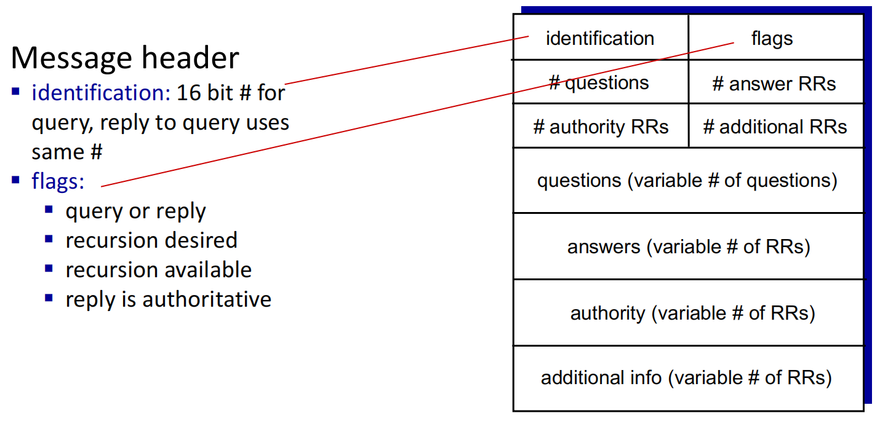

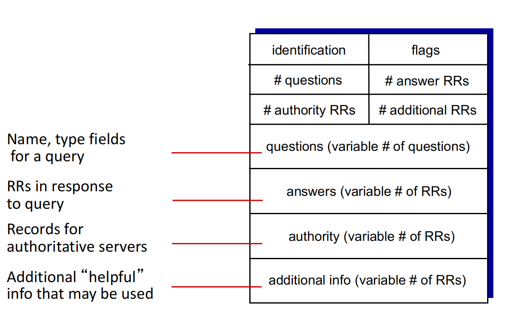

## P2P Applications

### Pure P2P architecture

- No always-on server

  没有始终在线的服务器

- Arbitrary end systems directly communicate

  任意终端系统直接通信

- Peers change IP addresses

  对端修改IP地址

**Examples:**

- file distribution (BitTorrent)

  文档分发 （BitTorrent）

- Streaming (KanKan)

  流式处理 （KanKan）

- VoIP (Skype) 

  网络电话 （Skype）

### File Distribution: client-server vs P2P  文档分发：客户端-服务器与 P2P

*Question:* how much time to distribute file (size *F*) from one server to *N peers*?

需要多少时间将文档（大小*F*）从一个服务器分发到*N个对等点*？

#### client-server

- peer upload/download capacity is limited resource 对端上传下载容量有限
- Us: 服务器上传容量
- Ui: peer i的上传能力
- di: peer i的下载能力

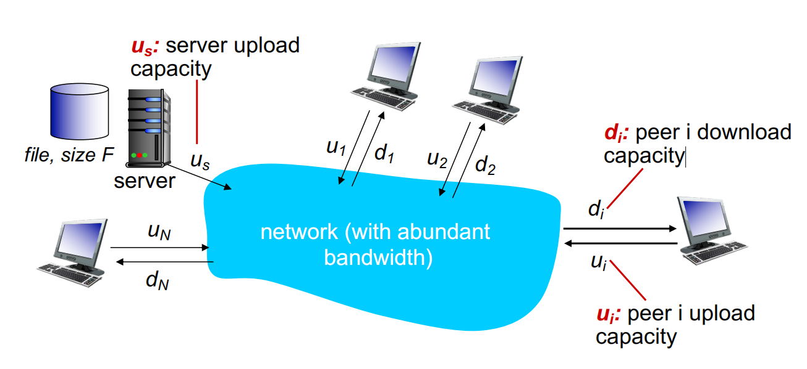

- **server transmission: must sequentially send (upload) N file copies:**

  服务器传输：必须按顺序发送（上传）N 个文档副本

  - time to send one copy: ***F/us*** 

  - time to send *N* copies: ***NF/us***

- **client: each client must download file copy** 每个客户端都必须下载文件副本

  - *dmin* = min client download rate

    *dmin* = 最低客户端下载速率

  - max client download time: *F/dmin*

    最大客户端下载时间：*F/dmin*

time to distribute F to N clients using client-server approach：Dc-s > max{NF/us,,F/dmin}

其中NF increase lineatrly in N

#### P2P

目的：提升整个网络的上载下载量

- **server transmission**: must sequentially send (upload) at least one file copies:
  
  服务器传输：必须依次发送（上传）至少一个文档副本
  
  - time to send one copy: *F/us* 
  
- **client: each client must download file copy**  
  
  客户端：每个客户端都必须下载文档副本
  
  - min client download time: *F/dmin*
  
- **clients: as total must download NF bits**
  
  客户端：作为 Total 必须下载 NF bits
  
  - max upload rate (limiting max download rate) is us + ∑ui

time to distribute F to N clients using P2P approach： DP2P > max{F/us,,F/dmin,,NF/(us + Σui )}

其中NF increase lineatrly in N（线性增加）

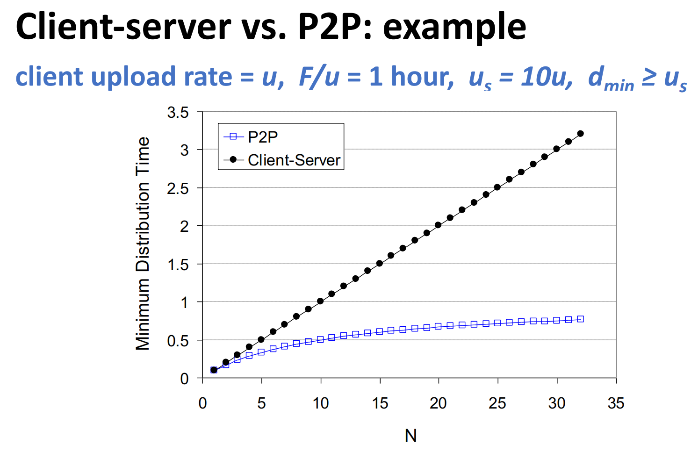

### BitTorrent 比特洪流

**Seeder** = a peer that provides the complete file.

种子器=提供完整文件的对等体。

**Initial seeder** = a peer that provides the initial copy

初始种子=提供初始副本的对等体

BitTorrent通常将文件被分为**256kb**的chunks:

请求块：稀有优先(rarest first)，优先请求torrent内稀少的块。这样就能帮助这些在整个集群中比较稀少的块能够更快速地传播。目的是均衡每个块的副本数量。

发送块tit-for-tat：谁给我的块速度快，我就给谁发送块(选出前几个），每30s随机选择一位幸运儿满足ta的块请求

- To share a file or group of files, the initiator first creates a .torrent file, a small file that contains:

  - **Metadata** about the files to be shared information about the **tracker**, the computer that coordinates the file distribution

    有关要共享的文档的 **元数据** 有关**跟踪器**（协调文档分发的计算机）的信息

Downloaders first obtain a .torrent file, and then connect to the specified tracker, which tells them from which other peers to download the pieces of the file.

下载者首先获取一个 .torrent 文档即种子文件（种子文件是下载文件的“索引”，包含了下载所需的所有必要信息。），然后连接到指定的跟踪链接，该跟踪链接告诉他们从哪些其他对等节点下载文档片段。

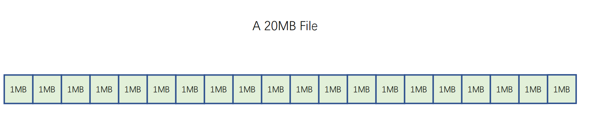

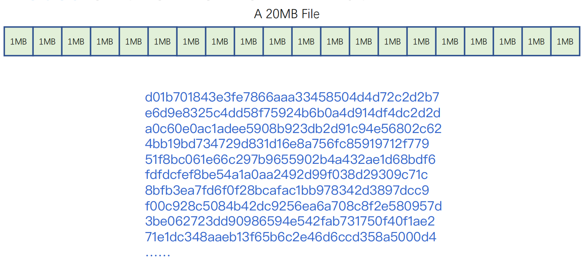

- **Peer joining torrent:**   

  - has no pieces, but will accumulate them over time from other peers

    没有pieces，但会随着时间的推移从其他 Peer 节点积累它们

  - registers with tracker to get list of peers, connects to subset of peers (“neighbors”)

    向 Tracker 注册以获取perrs列表，连接到 Peer 节点的子集（“邻居”）

  - 用户下载文件时，并不是直接从服务器下载整个文件，而是从其他已经下载了文件部分内容的用户那里下载。

  - 同时，用户也在上传自己已经下载完成的部分给其他用户，形成了一个“互相帮助”的下载环境。

  - 这种模式大大减轻了服务器的负担，并且由于参与下载的用户数量越多，下载速度也越快。

- **While downloading, peer uploads pieces to other peers**

  在下载时，peers会将pieces上传到其他的peer

- **Peer may change peers with whom it exchanges pieces**

  Peer 可能会更换与之交换pieces的 Peer 节点

- **Peers may come and go**

- **Once peer has entire file, it may (selfishly) leave or remain in torrent**

### Leeder to Seeder

- As soon as a leecher has a complete piece, it can potentially share it with other downloaders. 

  一旦一个 leecher 有一个完整的piece，它就有可能与其他下载者分享它。

- Eventually each leecher becomes a seeder by obtaining all the pieces, and assembles the file. Verifies the “checksum” of the file.

  最终，每个leeder通过获得所有pieces成为seeder，并组装文档。验证文档的 “checksum”。

### Piece Selection Policy

- The order in which pieces are selected by different peers is critical for good performance.

  不同peer选择pieces的顺序对于良好的性能至关重要

- If an inefficient policy is used, then peers may end up in a situation where each has all identical set of easily available pieces, and none of the missing ones. 

  如果使用了低效的策略，那幺 Peer 节点最终可能会遇到这样一种情况：每个 Peer 节点都有所有相同的容易获得的pieces集，而没有缺少的pieces。

- If the original seed is prematurely taken down, then the file cannot be completely downloaded! 

  如果原始种子被过早删除，那么文档就无法完全下载！

#### Piece selection - Macro View宏观

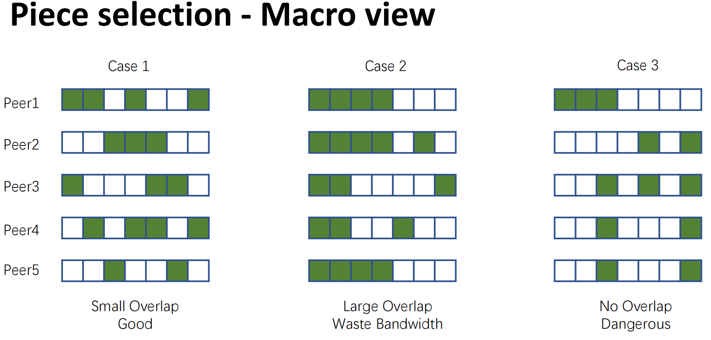

#### Piece Selection - Micro view 微观

- **Rarest First** (General rule)

  - Determine the pieces that are most rare among your peers, and download those first.

    确定同行中最稀有的piece，然后首先下载这些作品。

  - This ensures that the most commonly available pieces are left till the end to download.

    这确保了最常用的部分留到最后供下载。

- **Random First Piece** (Special case, at the beginning)
  - Initially, a peer has nothing to trade
  - Important to get a complete piece ASAP
  - Select a random piece of the file and download it

- **Endgame Mode**  (Special case)

  - Near the end, missing pieces are requested from every peer containing them. 

    在接近结尾时，向包含它们的每个 peer 请求缺失的 Pieces。

  - This ensures that a download is not prevented from completion due to a single peer with a slow transfer rate.

    这可确保不会由于单个Peer传输速率较慢而阻止下载完成。

  - Some bandwidth is wasted, but in practice, this is not too much.

    一些带宽被浪费了，但在实践中，这并不过分。

### BitTorrent – Internal Mechanism 内部机制

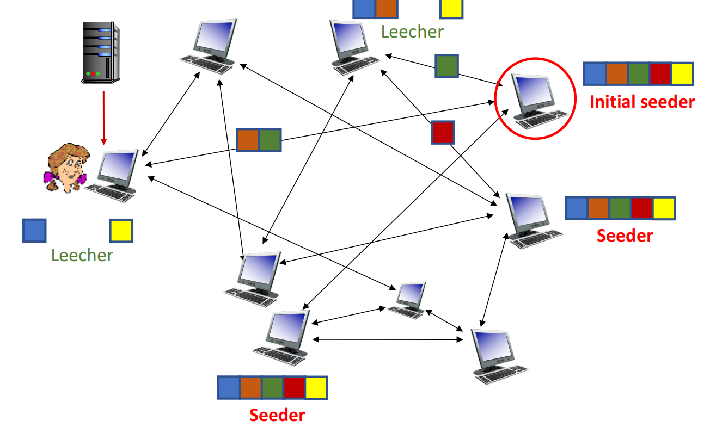

- **Built-in incentive mechanism (where all the magic happens):**

  内置激励机制（所有奇迹发生的地方）：

  - Choking Algorithm

    - Choking is a temporary refusal to upload. It is one of BT’s most powerful idea to deal with free riders (those who only download but never upload).

      Chocking是一种暂时的拒绝上传。这是比特洪流对付免费搭车者（只下载不上传的用户）最有力的办法之一。

      - For avoiding free riders and avoiding network congestion

        避免搭便车和避免网络拥塞

    - Tit-for-tat strategy is based on game-theoretic concepts. 以牙还牙的策略基于博弈论的概念

  - Optimistic Unchoking 最优的疏通

    - A peer sends pieces to those four peers currently sending her chunks at highest rate

      一个 Peer 节点向当前<u>以最高速率发送 chunk 的四个 Peer 节点</u>发送 chunk

      - other peers are **choked** by Alice (do not receive chunks from her)

        其他 Peer 节点被 Alice 堵塞（没有从她那里收到 chunks）

      - re-evaluate top 4 every10 secs

        每 10 秒重新评估前 4 个

    - Every 30 secs: randomly select another peer, starts sending chunks

      每 30 秒：随机选择另一个 Peer 节点，开始发送 chunk

      - “optimistically unchoke” this peer

        “乐观地解开”这个同伴

      - newly chosen peer may join top 4

        新选择的Peer可能会进入前 4 名

    - **Reasons:**

      - To discover currently unused connections that are better than the ones being used

        发现当前未使用的连接，这些连接比正在使用的连接更好

      - To provide minimal service to new peers

        为新 Peer 节点提供最少的服务

### Upload-Only mode

- Once download is complete, a peer can only upload. The question is, which nodes to upload to?

  下载完成后，Peers只能上传。问题是，要上传到哪些节点？

- Policy: Upload to those with the best upload rate. This ensures that pieces get replicated faster, and new seeders are created fast

  策略：上传到上传速率最高的用户。这确保了片段被更快地复制，并快速创建新的播种机

## Socket Programming  套接字编程

当在不同的机器上的进程彼此之间通过向套接字发送报文来进行通信。我们说过每个进程好比是一座房子，该进城的套接字则好比是一扇门。应用进程位于房子中在门的一侧；运输层则是在其另一侧。

- Goal: learn how to build client/server applications that communicate using sockets

  目标：了解如何构建使用套接字进行通信的客户端/服务器应用进程

- Socket: door between application process and end-end transport protocol 

  套接字：应用进程和终端传输协议之间的门

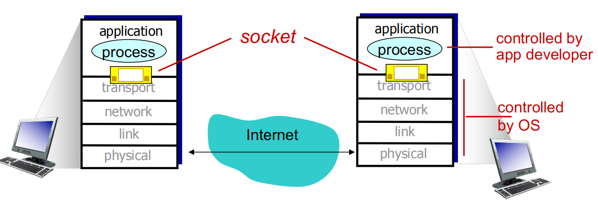

- **Two socket types for two transport services:**  两种套接字类型，两种传输服务

  - UDP: unreliable datagram

  - TCP: reliable, byte stream-oriented 

- **Application Example:** 案例

  1. client reads a line of characters (data) from its keyboard and sends data to server

     客户端从其键盘上读取一行字符（数据）并将数据发送到服务器

  2. server receives the data and converts characters to uppercase

     服务器接收数据并将字符转换为大写

  3. server sends modified data to client

     服务器将修改后的数据发送到客户端

  4. client receives modified data and displays line on its screen

     客户端接收修改后的数据并在屏幕上显示 line

### Socket Programming with UDP

- **UDP: no “connection” between client & server** UDP：客户端和服务器之间没有"连接"

  - No handshaking before sending data 

    发送数据前不握手

  - Sender explicitly attaches IP destination address and port # to each packet

    发送方将 IP 目标地址和端口 # 显式附加到每个数据包

  - Receiver extracts sender IP address and port# from received packet

    接收方从收到的数据包中提取发送方 IP 地址和端口 #

- **UDP: transmitted data may be lost or received out-of-order** UDP：传输的数据可能会丢失或无序接收

- **Application viewpoint:**

  - UDP provides unreliable transfer of groups of bytes (“datagrams”) between client and server

    UDP 在客户端和服务器之间提供不可靠的字节组（“数据报”）传输

#### Client/server socket interaction: UDP

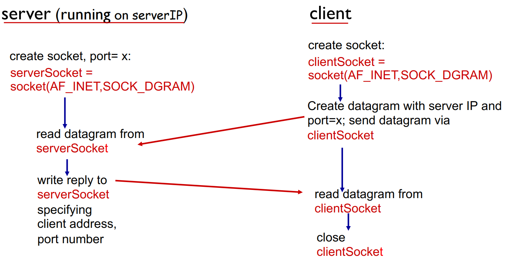

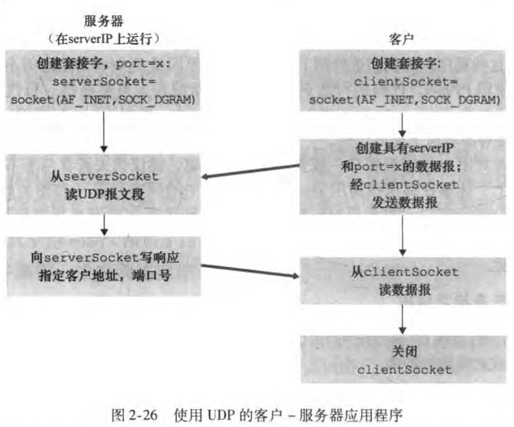

### Socket Programming with TCP

- **Client must contact server** 客户端必须与服务端建立联系

  - Server process must first be running

    服务器进程必须首先运行

  - Server must have created socket (door) that welcomes client’ s contact

    服务器必须创建欢迎客户联系的套接字 （door）

- **client contacts server by:**

  - Creating TCP socket, specifying IP address, port number of server process

    创建 TCP 套接字、指定 IP 地址、服务器进程的端口号

- **When client creates socket: client**   当客户端创建 socket时：client

  - TCP establishes connection to server TCP

    TCP 创建与服务器 TCP 的连接

- When contacted by client, server TCP creates new socket for server process to communicate with that particular client  

  当客户端联系时，服务器 TCP 会为服务器进程创建新的套接字，以便与该特定客户端进行通信

  - Allows server to talk with multiple clients

    允许服务器与多个客户端通信

  - Source port numbers used to distinguish clients (more in Chap 3)

    用于区分客户端的源端口号（第 3 章中将有更多内容）

- **Application Viewpoint**

  - TCP provides reliable, in-order byte-stream transfer (“pipe”) between client and server

    TCP 在 Client 端和服务器之间提供可靠的、有序的字节流传输（“管道”）

#### Client/server socket interaction: TCP

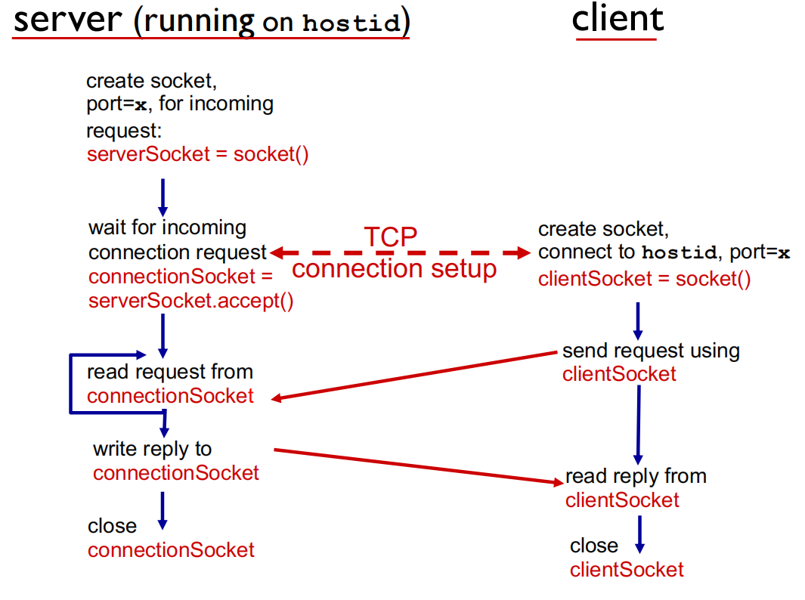

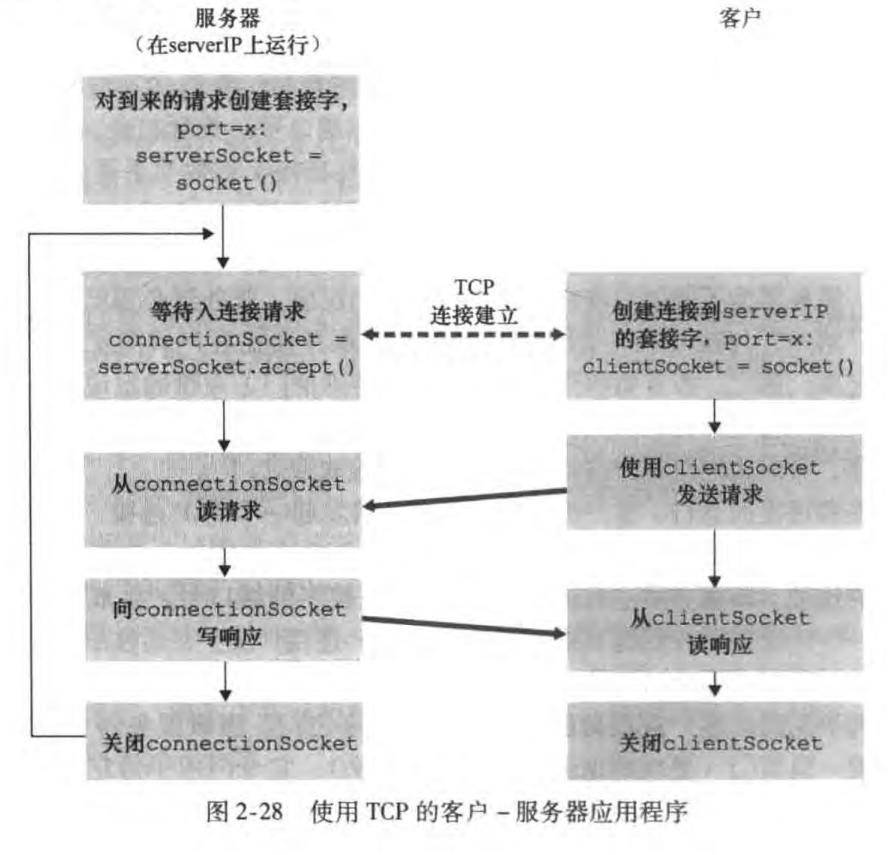

## Summary

- **Application architectures**  应用进程架构

  - client-server 客户端-服务端

  - P2P Peer-to-Peer

- **Application service requirements**  应用进程服务要求

  - reliability, bandwidth, delay

    可靠性、带宽、延迟

- **Internet transport service model**  互联网传输服务模式

  - connection-oriented, reliable: TCP

  - unreliable, datagrams: UDP

- **Specific protocols:**  特定协议
  - HTTP
  - SMTP, POP, IMAP
  - DNS
  - P2P: BitTorrent

- **Socket programming:**  套接字编程
  - TCP, UDP sockets
