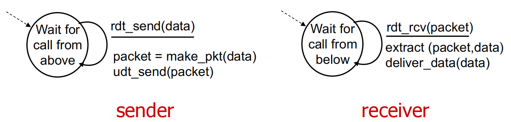
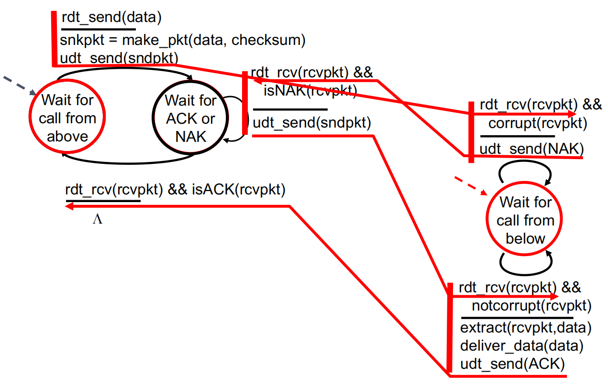

# Transport Layer 1

## Transport-layer services  传输层服务

### Transport services and protocols 传输服务和协议

- **Provide logical communication between app processes running on different hosts**

  在不同主机上运行的应用进程进程之间提供逻辑通信；或者通俗一点就是运输层负责从套接字中获取到当前主机应用层中多个进程想要发送的报文，然后统一交给网络层来进行传输。逻辑通信就是相当于忽略掉接下来该如何发送信息的繁琐步骤，而是对于主机来说仿佛两者都是即时连接的。

  应用层报文 = 信封上的字符

  进程 = 写信和收信的人

  运输层协议 = 两个地址的邮差分别收取和分发信件

  网络层协议 = 邮政服务（包括邮车）

- **Transport protocols run in end systems**

  传输协议在**终端系统**中运行

  - Send side: breaks app msg into segments, passes to network layer

    发送端：将 应用递交的信息分成一个或者多个segment，并**向下**传递到网络层

  - Rcv side: reassembles segments into messages, passes to app layer

    接收端：将接收到的 segment（报文段） 重新组装成消息，并**向上**交给传递给应用层

- **Transport-layer protocols for Internet:**  网络的传输层协议
  
  - TCP and UDP

### Transport vs. Network layer 传输层与网络层

- **Network layer: logical communication between hosts**

  网络层：不同**主机**之间的逻辑通信

- **Transport layer: logical  communication between  processes**
  
  传输层：应用进程之间的逻辑通信
  
  - Relies on, enhances, network layer services
  
    依赖和增强网络层服务
  
  - 位于网络层之上

### Internet transport-layer protocols  网络传输层协议

- **Reliable, in-order delivery (TCP)  可靠的有序交付 （TCP）**

  - Congestion control   拥塞控制

  - Flow control  流控制

  - Connection setup 连接设置

- **Unreliable, unordered delivery: UDP  不可靠、无序的传输：UDP**
  - No-frills extension of “best-effort” IP  “尽力而为”IP 的简洁扩展

- **Services not available  不可用的服务:** 

  - Delay guarantees  延迟保证

  - Bandwidth guarantees  带宽保证

## Multiplexing/demultiplexing  多路复用/分用

如果网络中某层的一个协议对应直接上层的多个协议/实体，则需要复用/分用

接收端进行多路分用：传输层依据头部信息将收到的Segment交给正确的Socket，即不同的进程

发送端进行多路复用：从多个Socket中接收数据，位每块数据封装上头部的消息，生成Segment，交给网络层

分用：主机1的p3进程向服务器的p1进程发送信息，主机2的p4进程向服务器的p2进程发送信息。此时传输层需要分用，把从网络层收到的报文段正确地分给对应的套接字。

复用：网络层是统一发送信息，因此传输层需要将从不同套接字收取到的内容结合在一起，然后提交给下层的网络层进行传输

### How demultiplexing works  分用的工作原理

- **Host receives IP datagrams  主机接收 IP 数据报**

  - Each datagram has source IP address, destination IP address

    每个数据报都有源 IP 地址、目标 IP 地址

  - Each datagram carries one transport-layer segment

    每个数据报都携带一个传输层段

  - Each segment has source, destination port number 

    每个报文段都有源端口号、目标端口号

- Host uses **IP addresses** & **port numbers** to direct segment to suitable socket

  主机使用**IP地址**和**端口号**将segment（报文段）定向到合适的套接字，这一过程就是**多路分用**。

- 网络层并不关心报文段当中的端口号信息

  一个进程有一个或者多个套接字，它相当于从网络中向进程传输数据和从进程向网络传递数据的门户。因此，如上图所示，在接收主机中的运输层实际上并没有直接将数据交付给进程，而是将数据交给了一个中间的套接字。由于在任一时刻，在接收主机上可能有不止一个套接字，所以每个套接字都有唯一的标识符。标识符的格式取决于它是UDP还是TCP套接字。

payload 负载

### Connectionless demultiplexing (UDP)  无连接的多路复用和多路分解

从主机不同的套接字中收集数据块，并为每个数据块封装上首部信息从而生成报文段，然后将报文段传递到网络层，所有这个工作称为**多路复用**。

- Created socket has host-local port number:

  利用端口号创建Socket

  - Socket = socket(AF_INET, SOCK_DGRAM)

    Socket.bind(('' , 12345))

- When creating datagram to send into UDP socket, must specify:

  创建要发送到 UDP 套接字的数据报时，必须指定：UDP的Socket是**二元组表示**

  - **Destination IP address  目标IP地址**

  - **Destination port number  目标端口号**

  - clientSocket.sendto(msg, (server_name, server_port))

- When host receives UDP segment:

  - Checks destination port # in segment

    检查分段中的目标端口号

  - Directs UDP segment to socket with that port #

    将 UDP 段定向到具有该端口号的套接字

  - IP datagrams with same dest. port #, but different source IP addresses and/or source port numbers will be directed to same socket at dest

    具有相同目标端口号，但源 IP 地址和/或源端口号不同的 IP 数据报依然会被定向到同一套接字
    
    如果两个UDP报文段有不同的源IP地址和/或源端口好，但具有相同的目的IP地址和目的端口号，那么这两个报文段将通过相同的目的地套接字去定向到相同目的地的进程。
    
    假设主机B需要发一个报文给A，B到A的报文段中的目的端口号便从A到B的报文段中的源端口好中取值。发送和回答的数据是反过来的。

#### Example:

### Connection-oriented demux(TCP)  面向连接的多路复用和多路分解

- TCP socket identified by **4-tuple**:

  由 **4 元组标识**的 TCP 套接字：

  - source IP address

    源 IP 地址

  - source port number

    源端口号

  - dest IP address

    目标 IP 地址

  - dest port number

    目标端口号

- Demux: receiver uses all four values to direct segment to appropriate socket

  Demux：receiver 使用所有四个值将 segment 定向到适当的 socket

- Server host may support many simultaneous TCP sockets:

  **服务器主机可能支持多个同步 TCP 套接字：**

  - each socket identified by its own 4-tuple

    每个套接字都由其自己的 4 元组标识

- Web servers have different sockets for each connecting client

  **Web 服务器对于每个连接的客户端都有不同的套接字**

  - non-persistent HTTP will have different socket for each request

    非持久性 HTTP 将为每个请求提供不同的套接字

#### Example

三个segments（均发往 IP 地址：B、目标端口：80）被分解到不同的套接字

下面可以观察到同一个主机C中两个不同的进程都向服务器B的80端口发送了个请求，TCP连接时每个发送方的进程都只会对应一个接收方的进程

P4 is threaded server P4是流程服务器

假设主机C向服务器B发送了两个HTTP请求，主机A向服务器B发起了一个HTTP会话。主机A和主机C及服务器B都有自己唯一的IP地址，他们分别是A, C, B. 主机C为其两个HTTP请求分配了两个不同的源端口号（5775，9157）。因为主机A在选择源端口时与主机C没有关联，因此也可以选择9157作为自己的发送源端口。服务器B仍然能正确地分解这两个具有相同的源端口的连接，因为这两条连接有不同的源IP地址。

进程是耗费资源比较多的任务，随着技术的进步，可以让一个进程创建多个线程，然后再由进程中的多个线程来分别连接来自不同主机端对于相同的服务器相同进程的TCP请求。下面就是P4创建个3个线程

## Connectionless transport: UDP  无连接传输：UDP

### UDP: User Datagram Protocol  用户数据报协议

- **Features: 特征**

  - Simple and straightforward

    简单明了

  - Best effort

    尽力而为

  - Lost

    **失去**

- **Connectionless  连接**

  - No handshaking

    无握手

  - Each UDP segment handled independently of others

    每个 UDP 分段都独立于其他分段处理

  - Out-of-order to APP

    对 APP **无序**

- **UDP use:**

  - Streaming multimedia apps 

    流式传输多媒体应用进程

  - DNS

- **Reliable transfer over UDP 通过 UDP 进行可靠传输 （主要是程序员在应用层实现）:** 
  
  - Add reliability at application layer
  
    在应用进程层增加可靠性
  
  - Application-specific error recovery!
  
    特定于应用进程的错误恢复！

### UDP: segment header  段标题 （UDP报文段）

length, in bytes of UDP segment, including header   length，以 UDP 段的字节为单位，包括标头

**Why is there a UDP: 为什么有 UDP**：

- No connection establishment (which can add delay)

  无需创建连接（这可能会增加延迟）-

- Simple: no connection state at sender, receiver

  简单：发送方、接收方无连接状态

- Small header size

  分组首部开销小

- No congestion control: UDP can blast away as fast as desired

  无拥塞控制：UDP 可以根据需要以最快的速度

### UDP Checksum  UDP 校验和

对接收的UDP内容进行错误校验

**Sender:**

- Treat segment contents, including  header fields, as sequence of 16-bit integers

  将段的内容（包括标头字段）视为 16 位整数串行

- Checksum: addition (one’s complement sum) of pseudo header, UDP header and UDP data

  校验和：伪报头、UDP 报头和 UDP 数据的相加（1 的补码和）

- Sender puts checksum value into UDP checksum field

  发送方将校验和值放入 UDP 校验和字段

**Receiver**

- Compute checksum of received segment

  计算接收的 segment 的校验和

- Check if computed checksum equals checksum field value:

  检查计算的校验和是否等于校验和字段内的值：

  - NO - error detected
  
    不相等：检测出错误
  
  - YES - no error detected. But maybe errors nonetheless?
  
    相等，未检测出错误，但不能保证每次都一定能检查出来错误

Note: when adding numbers, a carryout from the most significant bit needs to be added to the result

请注意：在进行加法运算时，需要将最重要位的进位加到结果中得到sum，然后对sum取反就得到校验和

## Principles of reliable data transfer  可靠数据传输的原则

**Important in application, transport, link layers 在应用、传输、链路层中很重要**

- Top-10 list of important networking topics!  前 10 名重要网络中可靠数据传输问题名列榜首的候选者！

- characteristics of unreliable channel will determine complexity of reliable data transfer protocol (rdt)

  不可靠信道的特性将决定可靠数据传输协议 （RDT） 的复杂性
  
  rdt_send():被上次应用调用，将数据交给rdt以发送给对方
  
  udt_send(): 被rdt调用，在不可靠信道上向接收方传输数据
  
  rdt_rcv(): 当数据包到达接收方信道时被调用
  
  deliver_data(): 被rdt调用，向上层应用交付数据

### Reliable data transfer: getting started  可靠的数据传输：入门

- Incrementally develop sender, receiver sides of **r**eliable **d**ata **t**ransfer protocol (rdt)

  逐步开发 **r**eliable **d**ata **t**ransfer 协议 （rdt） 的发送方、接收方

- **Consider only unidirectional data transfer**
  
  **仅考虑单向数据传输**
  
  - But control info will flow on both directions!
  
    但是控制信息将双向流动！
  
- Use finite state machines (FSM) to specify sender, receiver

  使用有限状态机 （FSM） 指定发送方、接收方

state: when in this “state” next state uniquely determined by next eventstate：

**当处于此 “state” 状态时，下一个状态由 next 事件唯一确定**

state：当处于此 “state” 状态时，下一个状态由 next 事件唯一确定

### rdt1.0: reliable transfer over a reliable channel  通过可靠信道实现可靠传输

**Finite-State-Machine 有限状态机**

- **Underlying channel perfectly reliable  假设底层信道完全可靠**
  - No bit errors  无位错误
  
  - No loss of packets  数据包不会丢失
  
- **Separate FSMs for sender, receiver:  发送方、接收方的单独 FSM(Finite-State-Machine 有限状态机)**
- Sender sends data into underlying channel  发送方将数据发送到底层信道
  
- Receiver reads data from underlying channel  接收方从底层信道读取数据

**由于图中发送方和接收方的FSM每个都只有一个状态。FSM中的箭头知识了协议从一个状态变迁到另一个状态。（RDT1中每次变迁都会回到自己本身的状态）<u>引起事件变迁的动作是在横线的上方，事件发生时所采取的动作显示在横线的下方。</u>**

### rdt2.0

#### channel with bit errors   具有位错误的信道

- **Underlying channel may flip bits in packet  底层信道可能会翻转数据包中的位**
  - Checksum to detect bit errors  校验和检测位错误

- **Question:** how to recover from errors:

  **问题：** 如何从错误中恢复：

- Underlying channel may flip bits in packet

  底层信道可能会翻转数据包中的位

  - Checksum to detect bit errors

    校验和检测位错误

- **Question:** how to recover from errors: rdt2.0的特性

  **问题：** 如何从错误中恢复：

  - **Acknowledgements (ACKs):** receiver tells sender that pkt received OK

    **确认 （ACK）:** 接收方告诉发送方 pkt 接收正常

  - **Negative acknowledgements (NAKs)**:receiver tells sender that pkt had errors

    **否定确认 （NAK）**：接收方告诉发件人 pkt 有错误

  - sender retransmits pkt on receipt of NAK

    发送方在收到 NAK 时**重新传输** PKT

- New mechanisms in rdt2.0 (beyond rdt1.0):

  rdt2.0 中的新机制（rdt1.0 之后）：

  - Error detection
  
    错误检测
  
  - Receiver feedback: control msgs (ACK,NAK) rcvr->sender
  
    接收者反馈：控制消息 （ACK，NAK） 接收者->发送者

- 每次发送完需要等接收方发送回ACK或者NAK后才能继续发送，这种模式叫做停等模式（stop-and-wait））

#### FSM specification  FSM 规范

Waiting for call freom above/below 等待上/下层的调用

发送方最开始等待上层应用层的调用，如果已经发送过信息之后进入等待接收方回复ACK或者NAK的状态，两个状态之间相互转换

rcvpkt是接收方返回的数据，其中包含是否是ACK或者NAK

在左边的状态中，发送端协议正在等待来自上层传下来的数据。当rdt_send事件出现时，发送方将产生一个包含待发送数据的分组(sndpkt)，带有校验和，然后经由udt_send(sndpkt)操作发送到该分组。在最右边的状态中，发送方协议等待来自于接收方的ACK或者NAK分组。

#### operation with no errors

如果收到的是ACK分组（rdt_rcv(rcvpkt）&& (isACK(rcvpkt)对应的事件)，则发送方知道最近发送的分组已经被正确接受，因此协议返回到等待上层数据的状态。

#### Error scenario

如果收到的是一个NAK分组，该协议重新上传上一个分组并等待接收方为响应重传分组而会送的ACK或者NAK。当发送发处于等待ACK或者NAK的状态时，它不能从上层获得更多的数据。

#### has a fatal flaw!  有一个致命的缺陷！

What happens if ACK/NAK corrupted?

如果 ACK/NAK 损坏会怎样？

- Sender doesn't know what happened at receiver!

  发件人不知道收件人发生了什幺！

- Can't just retransmit: possible duplicate

  发件人不知道收件人发生了什幺！

Handling duplicates: 

处理重复项：

- Sender retransmits current pkt if ACK/NAK corrupted

  如果 ACK/NAK 损坏，发送方会重新传输当前 pkt

- Sender adds **sequence number** to each pkt

  发件人将 **序号** 添加到每个 pkt

- Receiver discards (doesn't deliver up) duplicate pkt

  接收方丢弃 （不传递） 重复的 pkt

### rdt2.1

#### sender, handles garbled ACK/NAKs   sender， 处理乱码 ACK/NAK

添加了从接受方到发送方的肯定确认和否定确认。当接收到失序的分组时，接收方对所接收的分组发送一个肯定确认。如果收到受损的分组，则接收方将发送一个否定确认。如果不发送NAK，而是对上次正确接受的分组发送一个ACK，我们也能实现与NAK一样的效果。因为当发送方接收到对同一个分组的两个ACK（冗余dupulicate ACK）之后。就知道接收方没有正确接受到跟在被确认两次的分组后面的分组。 

相比于rdt2.0多携带了序号机制：

- 发送方在发送每个数据包时会附加序号。

- 接收方可以通过数据包中的序号判断是新的数据包还是已经重传过的旧数据包。

组序号机制

发送方

接受方

#### sender vs receiver: no error  发送方与接收方：无错误

#### sender vs receiver: ACK corrept  发送者 vs 接收者：ACK 正确

#### Discussion

**Sender:**

- seq # added to pkt

  序号已添加到 PKT

- Two seq. #’s (0,1) will suffice. 

  两个序号 （0,1） 就足够了。

**Why?**

- Must check if received ACK/NAK corrupted 

  必须检查收到的 ACK/NAK 是否损坏

- Twice as many states
  
  两倍的状态
  
  - State must “remember” whether "expected" pkt should have seq \# of 0 or 1
  
    状态必须“记住”“预期”pkt 的 序号是否应为 0 或 1 

**Receiver:**

- Must check if received packet is duplicate
  
  必须检查收到的数据包是否重复
  
  - state indicates whether 0 or 1 is expected pkt seq #
  
    state 指示 0 还是 1 是预期的 PKT 的序号
  
- Note: receiver can not know if its last ACK/NAK received OK at sender

  注意：接收方无法知道其最后一个 ACK/NAK 是否在发送方收到 OK

### rdt2.2

#### a NAK-free protocol  无 NAK 协议

- **Same functionality as rdt2.1, using ACKs only  **
  
  **与 rdt2.1 功能相同，但是仅使用 ACK**

  - instead of NAK, receiver sends ACK for last pkt received OK
    
    接收方发送的 ACK 不是 NAK，取消NAK，改为发送上一次成功的ACK和序号
    
    - receiver must explicitly include seq # of pkt being ACKed
    
      接收方必须显式包含正在确认的 PKT 的序号
  
- **Duplicate ACK at sender results in same action as NAK: retransmit current pkt**

  **在发送方处重复 ACK 会导致与 NAK 相同的操作：重新传输当前数据包**

#### Sender, receiver fragments  发送方、接收方 fragment

### rdt3.0

#### Channels with errors and loss  有错误和丢失的信道

**New assumption 新的假设:** 

- **Underlying channel can also lose packets (data, ACKs)**
  
  底层信道也可能丢失数据包（数据、ACK）
  
  - Checksum, seq. #, ACKs, retransmissions will be of help … but not enough
  
    校验和、seq. #、ACK、重传将有所帮助......但还不够

**Approach  方法**

Sender waits “reasonable” amount of time for ACK

发件人等待 ACK 的“合理”时间

- Retransmits if no ACK received in this time

  如果此时未收到 ACK，则重新传输

- **If pkt (or ACK) just delayed (not lost):**

  **如果 pkt（或 ACK）只是延迟（未丢失）:**

  - Retransmission will be duplicate, but seq. #’s already handles this

    重传将是重复的，但 seq. # 已经处理了这个问题

  - Receiver must specify seq # of pkt being ACKed

    接收方必须指定要确认的 pkt 的序号

- Requires countdown timer

  需要倒数计时器

- 回退N步（Go-Back N，GBN）：N为发送方窗口长度（window-size），因此也叫滑动窗口协议（sliding window protocol）

- 选择重传机制（Selective Repeat，SR）：有选择性的重新传输超时的组

#### sender

#### in action

#### Performance of rdt3.0

- rdt3.0 is correct, but performance stinks

  RDT3.0 是功能正确的协议，但性能很差并非人人都满意，核心是因为它是一个停等协议

- e.g.: 1 Gbps link, 15 ms prop. delay, 8000 bit packet:
  
  例如:1gbps链路，15ms prop。延迟，8000位数据包
  
  - Dtrans = L/R = 8000bits/109 bits/sec = 8 microsecs
  - Usender: utilizqation-fraction of time sender busy sending
  - Usender (L/R)/RTT + (L/R) = .008/30.008 = 0.00027
  - if RTT=30ms, 1KB pkt every 30 msec: 33kB/sec throughput over 1 Gbps link
  
- **Network protocol limits use of physical resources!**

  **网络协议限制物理资源的使用！**

#### stop-and-wait operation 停止和等待操作

