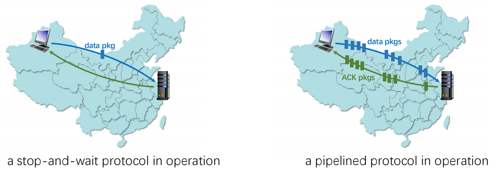
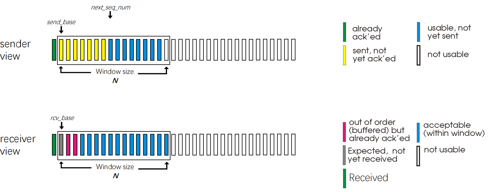
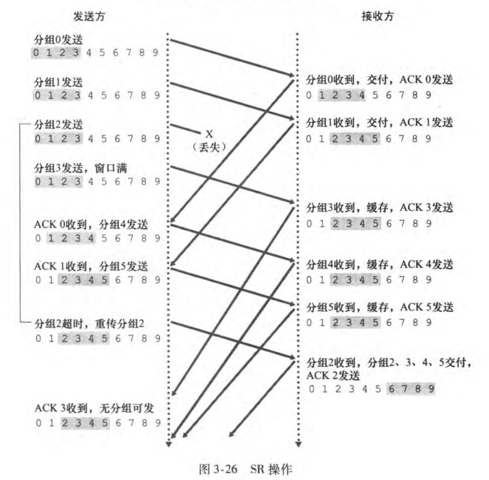
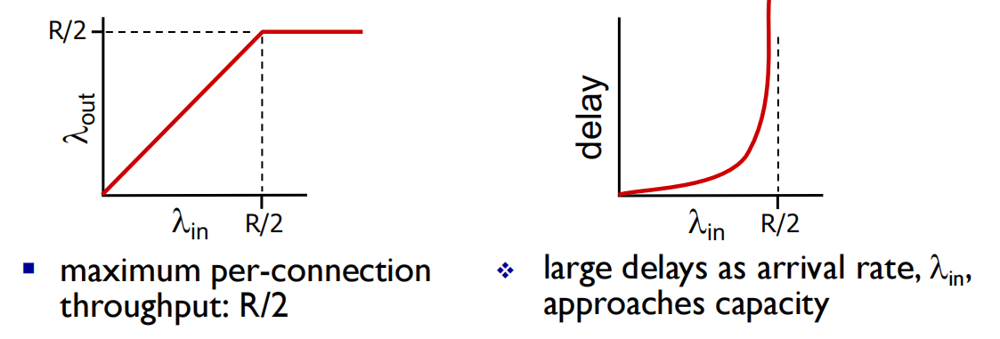

# Transport Layer 2

seq #: sequence number 序号

尽管到rdt3.0已经大致实现了可靠数据传输，但是停等模式的性能堪忧，于是进一步探究流水线模式（pipelining）

## pipeline Communication

### Pipeline protocols

- **Pipelining: sender allows multiple, “in-flight”, yet-to-be acknowledged pkts**

  **流水线：发送方允许多个“正在传输”的、尚未确认的数据包**

  - Range of sequence numbers must be increased

    序号的范围必须增加

  - Buffering at sender and/or receiver

    在发送方和/或接收方缓冲

Pipeline - 基本上完成TCP雏形，但一次发送一个包效率有点低，真实的TCP改进了一个发送周期内包的发送数量因此引出pipeline模式

### increased utilization  提高利用率

### Two forms: Go-Back-N and Selective repeat  两种形式：回退N步和选择重传

#### GBN

- Sender can have up to **N** unacked packets in pipeline

  发送方最多可以有 **N** 个未确认的数据包在管道中

- Receiver only sends **cumulative ack**
  
  接收方仅发送 **累积确认**
  
  - Doesn’t ack packet if there’ s a gap
  
    如果有间隙，则不确认数据包
  
- Sender has timer for oldest unacked packet
  
  发送方具有最早的未确认数据包的计时器
  
  - When timer expires, retransmit all unacked packets
  
    当计时器到期时，重新传输所有未确认的数据包

##### Sender 发送方

- k-bit seq # in pkt header

- “window” of up to N, consecutive unacked pkts allowed

  最多 N 个“窗口”，允许连续的未确认包

- ACK(n): ACKs all pkts up to, including seq # n - “cumulative ACK”
  
  对序号n的包的确认采取 “cumulative ACK”累计确认，表明接收方已经已经正确接收到序号为n的之前且包含n在内的所有的分组。
  
  - may receive duplicate ACKs (see receiver)
  
    可能会收到重复的 ACK（参考 receiver）
  
- Timer for oldest in-flight pkt

  

- Timeout(n): retransmit packet n and all higher seq # pkts in window

  Timeout（n）：在窗口中重新传输数据包 n 和所有更高数字的的序号包

##### sender extended FSM

##### receiver extended FSM

ACK-only: always send ACK for correctly-received pkt with highest in-order seq #

仅限 ACK：始终为正确接收的 pkt 发送 ACK，按照顺序最高的序号

- may generate duplicate ACKs

  可能会生成重复的 ACK

- need only remember **expectedseqnum**

  只需记住 **expected seq num**

- out-of-order pkt: 

  无序 PKT：

  - discard (don’t buffer): **no receiver buffering**!
  
    丢弃（不要缓存下来）**接收方没有缓冲**！
  
  - re-ACK pkt with highest in-order seq #
  
    具有最高顺序序号的 re-ACK包

##### GBN in Action

- 工作原理：发送方可以连续发送多个数据包，直到到达窗口大小（N）。每个数据包都有一个序列号。接收方按序接收数据包，并对最后按序接收的数据包发送ACK。如果一个数据包丢失或出错，接收方会丢弃后续所有数据包，直到丢失的数据包被重传
- 优点：比Stop-and-Wait协议更高效
- 缺点：如果一个数据包丢失，发送方必须重传该数据包及其后的所有数据包，即使后续数据包是正确的，这会导致不必要的重传

#### Selective Repeat 选择重传:

- Sender can have up to **N** unacked packets in  pipeline

  发送方最多可以有 **N** 个未确认的数据包在管道中

- Rcvr sends **individual  ack** for each packet

  Rcvr 为每个数据包发送 **单独的 ack**

Sender maintains timer for each unacked packet

发送方为每个未确认的数据包维护计时器

- When timer expires, retransmit only that unacked packet

  当计时器到期时，仅重新传输该未确认的数据包

- **Receiver individually acknowledges all correctly received pkts**
  
  **接收方单独确认所有正确接收的数据包**
  
  - buffers pkts, as needed, for eventual in-order delivery to upper layer
  
    根据需要缓冲 PKT，以便最终按顺序交付到上层
  
- **Sender only resends pkts for which ACK not received**
  
  **发件人仅重新发送未收到 ACK 的数据包**
  
  - sender timer for each unACKed pkt
  
    每个未确认的 PKT 的发件人计时器
  
- **Sender window**

  **发件人窗口**

  - **N** consecutive seq #’ s
  
    **N** 个连续序号
  
  - limits seq #s of sent, unACKed pkts
  
    限制已发送、未确认的包的序号

##### sender, receiver windows

1

2

3

4

5

6

7

8

9

10

11

12

##### Sender: 发送方

##### data from above:

- If next available seq # in window, send pkt 

  如果 window 中有下一个可用的序号，则发送对应的包

**timeout(n):**

- Resend pkt n, restart timer

  重新发送包n，重启计时器

**ACK(n) in [sendbase, sendbase+N]:**

- Mark pkt n as received

  将包n 标记为已接收

- If n smallest unACKed pkt, advance window base to next unACKed seq # 

  如果有n 个最小的 unACKed 包，则将窗口基推进到下一个unACKed序号

##### Receiver：接收方

**pkt n in [rcvbase, rcvbase+N-1]**

- Send ACK(n)

  发送 ACK（n）

- Out-of-order: buffer

  乱序：buffer

- In-order: deliver (also deliver buffered, in-order pkts), advance window to next not-yet-received pkt

  按顺序：交付（也交付缓冲的按顺序包装），提前窗口到下一个尚未接收的包装

**pkt n in [rcvbase-N,rcvbase-1]**

- ACK(n)  otherwise:

- Ignore 

SR也就是sender会一直发送，然后如果中途收到了已经传送过去数字返回的对应的ACK(n)，那就就像前进一步，如果一直没收到则停止前进，直到把窗口中的内容都发送完毕如果此时还没收到则标记为超时，并且重传当前窗口中最小的数字。Receiver如果中间漏掉了某个n，那么窗口也会停止前进，但是会一直接收后面的数字，直到整个缓存到窗口中的最大的数字为止停止接收。

- 工作原理：发送方可以连续发送多个数据包直到到达窗口大小，接收方可以接收接收窗口内的数据包并发送对应的ACK。即使中间有数据包丢失，发送方只需重传丢失的数据包，而不必重传后续所有数据包

- 优点：减少了不必要的重传，提高了传输效率

- 缺点：实现复杂，接收方需要缓存乱序到达的数据包，并维护一个接收窗口

##### dilemma 进退两难

Example:

- Seq #’s: 0, 1, 2, 3

  序号0， 1， 2， 3

- Window size=3

  窗口大小3

- Receiver sees no difference in two scenarios!

  Receiver 在两种情况下看不到差异！

- Duplicate data accepted as new in (b)

  在 （b） 中接受为新数据的重复数据

Q: what relationship between seq # size and window size to avoid problem in (b)? 需要6个数字

sequence number最大值应当大于窗口的两倍以避免同一个窗口内出现两个一模一样的seq，不知道改把数据包放哪。

## TCP: connection-oriented transport  面向连接的传输

- **Point-to-point: 点对点**

  - one sender, one receiver

    一个发送者对应一个接受者

- **Reliable, in-order byte stream :  可靠、有序的字节流：**

  - no  “**message boundaries**”

- **Pipelined:  管道通信**

  - TCP congestion and flow control set window size29

    TCP 拥塞和流控制设置窗口大小29

- **Full duplex data:  全双工数据：**

  - bi-directional data flow in same connection

    同一连接中的双向数据流

- **Connection-oriented:  面向连接** 

  - handshaking (exchange of control msgs) inits sender, receiver state before data exchange

    handshaking（控制权交换消息）in其发送方、接收方在数据交换之前的状态

- **Flow controlled:  流量控制**

  - sender will not overwhelm receiver

    发送方不会压倒接收方

### TCP segment structure  报文段结构

- 源端口(16位)：标识发送方应用程序的端口号
- 目标端口(16位)：标识接收方的应用程序的端口号
- 序列号(32位)：标识该报文段中第一个字节的数据在整个数据流中的位置。用于保证数据按序传输和重组
- 确认号(32位)：当ACK标志被设置时，这个字段表示期望收到的下一个字节的序列号。用于确认已收到的数据
- 数据偏移(4位)：表示TCP报文段头部的长度，。用于指示数据部分的起始位置
- 保留(6位)：保留为将来使用，目前应设置为0
- 控制标志(6位)：包括六个单独的标志位，用于控制TCP连接的状态：
  - URG(紧急指针有效)：表示紧急指针字段有效
  - ACK(确认号有效)：表示确认号字段有效
  - PSH(推动数据)：提示接收方尽快将数据推送给应用程序
  - RST(重置连接)：用于重置连接
  - STN(同步序列号)：用于建立连接
  - FIN(结束连接)：用于关闭连接
- 窗口大小(16位)：表示滑动窗口的大小
- 校验和(16位)：对整个TCP报文段进行校验，用于检测传输过程中是否出现错误
- 紧急指针(16位)：当URG标志被设置时，该字段表示紧急数据的结束位置。用于指示有紧急数据需要立即处理
- 选项(可变长度)：用于扩展TCP的功能，例如最大报文段大小(MSS)、时间戳等。
- 填充(可变长度)：用于确保TCP头部的长度是4字节的整数倍

### seq. numbers, ACKs

**Sequence numbers:** 序列号

- Byte stream “number” of first byte in segment’s data

  Segment 数据中第一个字节的字节流 “number”

TCP把数据看成一个无结构的，有序的字节流。我们从TCP对序号的使用上可以看出这一点，因为序号是建立在传送的字节流上，而不是建立在传送的报文段的序列之上。一个报文段的序号因此是该报文段首字节的字节流编号。

举例：主机A的一个进程想通过一条TCP连接向主机B上的一个进程发送一个数据流。主机A中的TCP将隐式地对数据流中的每一个字节编号。假定数据流有一个包含500000字节的文件组成，**MSS（Maximum Segment Size 段大小）**为1000字节。那么，第一个报文段分配序号0，第二个报文段分配1000，第三个分配2000.

**Acknowledgements:** 确认号

例如主机A已经收到了来自主机B的编号为0~535的所有字节，同时它打算发送一个报文段给主机B：主机A等待主机B的数据流中字节536及之后的所有字节，那么主机A就会在它发往主机B的报文段的确认号字段中填上536.

- Seq # of next byte expected from other side

- Cumulative ACK

**Q:** How receiver handles out-of-order segments

- A: TCP spec doesn’t say, up to implementor. (Buffer…)

##### TCP round trip time, timeout   TCP的往返时间估计和超时

- Timeout interval: **EstimatedRTT** plus “safety margin”
  
  超时间隔：**EstimatedRTT** 加上“安全限度”
  
  - large variation in **EstimatedRTT ->** larger safety margin
  
    更大的EstimatedRTT代表更安全的空间
  
- Estimate SampleRTT deviation from EstimatedRTT: 
  
  估计 SampleRTT 与 EstimatedRTT 的偏差：
  
  - DevRTT = (1-b)\*DevRTT + β *|SampleRTT-EstimatedRTT| (typically, β = 0.25)

Dev = Deviation 偏差

##### TCP reliable data transfer 可靠数据传输

- **TCP creates rdt service on top of IP’s unreliable service** 网络层服务是不可靠的

  - pipelined segments

    管道化段

  - cumulative acks

    累积 ACK

  - single retransmission timer

    单个重传计时器

- **Retransmissions triggered by:**

  **由以下因素触发的重新传输：**

  - timeout events
  
    超时事件
  
  - duplicate acks
  
    重复的 ACK

**最终计算时间间隔的公式：**

let’s initially consider simplified TCP sender:

让我们首先考虑简化的 TCP 发送者：

- ignore duplicate acks

  忽略重复的 ACK

- ignore flow control, congestion control

  忽略流量控制、拥塞控制

##### TCP sender events:  TCP 发送方事件：

**Data rcvd from app: 从应用层接收到的数据**

- Create segment with sequence number

  使用序号创建细分

- Sequence number is byte-stream number of first data byte in segment

  序号是报文段中第一个数据字节的字节流号

- Start timer if not already running 

  启动计时器（如果尚未运行）

  - Think of timer as for oldest unacked segment
  
    将 timer 视为最旧的未确认段
  
  - Expiration interval: **TimeOutInterval**
  
    过期间隔：**TimeOutInterval**

**Timeout:** 超时

- Retransmit segment that caused timeout

  重新传输导致超时的段

- Restart timer

  重启定时器

**Ack rcvd: 接收**

- If ack acknowledges previously unacked segments

  如果 ack 确认以前未确认的 segment

- Update what is known to be ACKed

  更新已知已确认的内容

- Start timer if there are still unackedsegments

  如果仍有 unackedsegments，则启动 timer

##### retransmission scenarios  重新传输场景

##### TCP ACK generation

| *Event at receiver*                                          | *TCP receiver action*                                        |
| ------------------------------------------------------------ | ------------------------------------------------------------ |
| arrival of in-order segment with expected seq #. All data up to expected seq # already ACKed  具有预期序号的有序区段到达。所有数据均已确认至预期序号 | delayed ACK. Wait up to 500ms for next segment. If no next segment, send ACK 延迟 ACK。等待最多 500 毫秒以等待下一段。如果没有下一个分段，则发送 ACK |
| arrival of in-order segment with expected seq #. One delayed segment has ACK pending  具有预期序号的有序区段到达。一个延迟的 Segment 有待处理的 ACK | immediately send single cumulative ACK, ACKing both in-order segments 立即发送单个累积 ACK，确认两个连续的报文段 |
| arrival of out-of-order segment higher-than-expect seq. # . Gap detected 无序段的到达高于预期序号检测到间隙 | immediately send *duplicate ACK*, indicating seq. # of next expected byte 立即发送 *重复 ACK*，指示下一个预期字节的序号 |
| arrival of segment that partially or completely fills gap 部分或全部填充间隙的区段到达 | immediate send ACK, provided that segment starts at lower end of gap 立即发送 ACK，前提是该段从间隙的下端开始 |

##### TCP fast retransmit 快速重传

- **Time-out period often relatively long: 超时时间通常相对较长**
  
  - Long delay before resending lost packet
  
    重新发送丢失数据包之前的长时间延迟
  
- **Detect lost segments via duplicate ACKs. 通过重复的 ACK 检测丢失的句段。**

  - Sender often sends many segments back-to-back

    发件人通常会背靠背发送许多区段
  
  - If segment is lost, there will likely be many duplicate ACKs.
  
    如果 segment 丢失，则可能会有许多重复的 ACK。

if sender receives 3 ACKs for same data(“triple duplicate ACKs”),resend unacked segment with smallest seq #

如果发送者收到相同数据的 3 个 ACK（“三重重复 ACK”），则以最小的 SEQ 重新发送未确认的报文段

- likely that unackedsegment lost, so don’ t wait for timeout

  很可能 unackedsegment 丢失了，所以不要等待超时

##### TCP flow control  TCP流控制

Receiver controls sender, so sender won’t overflow Receiver’s buffer by transmitting too much, too fast

**Receiver 控制 sender**，因此 sender 不会因为传输太多、太快而溢出 Receiver 的缓冲区

- Receiver “advertises” free buffer space by including **rwnd** value in TCP header of receiver-to-sender segments

  接收方通过在接收方到发送方分段的 TCP 标头中包含 **rwnd** 值来“通告”可用缓冲区空间

  - RcvBuffer size set via socket options (typical default is 4096 bytes)

    通过 socket 选项设置的 RcvBuffer 大小（通常默认为 4096 字节）

  - many operating systems auto-adjust RcvBuffer

    许多操作系统会自动调整 RcvBuffer

- Sender limits amount of unacked (“inflight”) data to receiver’ s rwnd value 

  发送方将未确认（“传输中”）的数据量限制为≤接收方的 rwnd 值

- Guarantees receive buffer will not overflow

  保证接收缓冲区不会溢出

### Connection Management  连接管理

Before exchanging data, sender/receiver “handshake” :

在交换数据之前，发送方/接收方 “handshake” ：

- Agree to establish connection (each knowing the other willing to establish connection) Agree on connection parameters

  同意创建连接 （双方都知道对方愿意创建连接） 同意连接参数

#### Agreeing to establish a connection  同意创建连接

2-way handshake:  同意创建连接

**Q:** Will 2-way handshake always work in network?  2 次握手在网络中是否始终有效？

- Variable delays  可变延迟

- Retransmitted messages (e.g.req_conn(x)) due to message loss  由于消息丢失而重新传输的消息 （e.g.req_conn（x））

- Message reordering  消息重新排序

- Can’t “ see ” other side  无法 “ 看到 ” 另一侧

2-way handshake failure scenarios:  2 次握手失败场景：

### TCP 3-way handshake 三次握手

FSM:

#### TCP closing a connection 关闭连接

- **Client, server each close their side of connection  客户端、服务器各自关闭各自的连接端**
  
  - Send TCP segment with FIN bit = 1
  
    发送 FIN 位 = 1 的 TCP 段
  
- **Respond to received FIN with ACK  使用 ACK 响应收到的 FIN**
  
  - On receiving FIN, ACK can be combined with own FIN
  
    收到 FIN 时，ACK 可以与自己的 FIN 结合使用
  
- **Simultaneous FIN exchanges can be handled  可以同时进行 FIN 交换**

## Principles of congestion control  拥塞控制原则

### Principal

**Congestion: 拥塞：**

- Informally: “too many sources sending too much data too fast for **network** to handle”

  非正式地说：“太多的来源发送太多数据，太快了，**网络**无法处理”

- Different from flow control!

  与流量控制不同！

- Manifestations:

  表现：

  - lost packets (buffer overflow at routers)

    丢失数据包（路由器的缓冲区溢出）

  - long delays (queueing in router buffers)

    长延迟（在路由器缓冲区中排队）

- A top-10 problem!

### Causes/costs of congestion: scenario 1   拥塞的原因/成本：情景 1

- Two senders, two receivers

  两个发送方，两个接收方

- One router, infinite buffers 

  一个路由器带有无限缓冲区

- Output link capacity: R

  输出链路容量：R

- no retransmission

  无重传

左吞吐量速率，右延迟

左边代表着接收方每秒接收的字节数，与该连接发生速率之间的函数关系。当发送速率在0~R/2之间时，接收方的吞吐量等于发送方的发送速率，发送速率超过R/2时，吞吐量也不会增加了，因为共享链路不能超过R/2的稳定状态。右边显示了如果按照接近链路容量的速率运行时发，当发送速率接近R/2的时候，平均时延就会越来越大。当发送速率超过R/2之后，路由器中的平均排队分组就会无限延长，源于目的地之间的平均时延也会变得无穷大。当分组的到达速率接近链路容量的时候，分组经历巨大的排队时延。

### Causes/costs of congestion: scenario 2  拥塞的原因/成本：情景 2

- **One router, finite buffers** 

  **一个路由器，有限缓冲区**

- **Sender retransmission of timed-out packet**

  **超时数据包的发送方重传**

  - application-layer input = application-layer output: λin = λout
  
    应用层输入 = 应用层输出：λin = λout
  
  - transport-layer input includes *retransmissions* : λ'in >= λ'in
  
    传输层输入包括 *重传* ： λ'in >= λ'in

情况1：Idealization: perfect knowledge  理想化：完美情况

- Sender sends only when router buffers available 

  发送方仅在路由器缓冲区可用时发送

情况2：Idealization: known loss packets can be lost, dropped at router due to full buffers

理想化：由于缓冲区已满，已知丢失的数据包可能会丢失，并在路由器上丢弃

- Sender only resends if packet known to be lost

  发送方仅在已知数据包丢失时重新发送

发送方必须执行重传以补偿因为缓存溢出而丢弃的分组

因为超时重传，所以如果想要继续维持很高的输出速率，那么就只能不断提高输入的速率，用来弥补因为重传而造成的损失

拥塞的代价：

1. 为了达到一个有效的输出，网络需要做更多的工作
2. 没有必要的重传，链路中包含了多个分组的拷贝
   - 是那些没有丢失，经历的时间比较长（拥塞状态）但是超时的分组
   - 降低了goodput

情况3：Realistic: duplicates  现实：重复

- Packets can be lost, dropped at router due to full buffers

  由于缓冲区已满，数据包可能会丢失、在路由器上丢弃

- Sender times out prematurely, sending two copies, both of which are delivered

  发送方提前超时，发送两个副本，两个副本都已传送

- Packets can be lost, dropped at router due to full buffers

  由于缓冲区已满，数据包可能会丢失、在路由器上丢弃

- Sender times out prematurely, sending **two** copies, both of which are delivered

  发件人提前超时，发送 **两个** 副本，这两个副本都已传送

**“costs” of congestion:** 成本

- More work (retrans) for given “goodput”

  为给定的 “goodput” 做更多任务作 （retrans）

- Unneeded retransmissions: link carries multiple copies of pkt

  不需要的重传：链接携带多个 pkt 副本

- decreasing goodput

  减少 Goodput

发送方遇到大时延时所进行的不必要重传会引起路由器利用起链路带宽来转发不必要的分组剧本。由于每个分组被转发两次，当其供给载荷接近R/2时，其吞吐量将接近R/4

### Causes/costs of congestion: scenario 3  拥塞的原因/成本：情景 3

- Four senders

  4 个发件人

- Multi-hop paths

  多跳路径

- Timeout/retransmit

  超时/重传

Q: what happens as λin and λin' increase ?

当 λin 和 λin' 增加时会发生什幺？

A: as red λin’ increases, all arriving blue pkts at upper queue are dropped, blue throughput -> 0

答：随着红色 λin' 的增加，所有到达上层队列的蓝色数据包都将被丢弃，蓝色吞吐量 -> 0

Another “cost” of congestion:  拥堵的另一个“成本”：

- When packet dropped, any “upstream transmission capacity used for that packet was wasted!

  当数据包被丢弃时，任何“用于该数据包的上游传输容量都被浪费了！

### **网络拥堵的主要原因：（总结）**

- 带宽不足：

  - 链路带宽限制：网络链路的带宽有限，当数据流量超过链路的带宽时，数据包会在链路的两端积压

  - 突发流量：短时间内的大量数据流量涌入网络，超过了带宽的瞬时处理能力

- 网络流量不均衡：

  - 流量集中：部分网络节点或链路承担了过多的流量，而其他部分则较为空闲，导致局部拥塞
  - 热点现象：某些热门服务或服务器在短时间内吸引大量访问， 导致这些节点或链路拥塞

- 网络拓扑变化：

  - 链路或节点故障：某条链路或节点发生故障，导致数据流量被重路由到其他链路或节点，造成这些路径的拥塞

  - 网络配置变化：例如路由算法的更新或配置错误，导致流量集中在某些路径上

- 缓冲区限制：

  - 路由器/交换机缓冲区满：网络设备的缓冲区有限，当流量过大时，缓冲区会被填满，导致数据包丢失或延迟
    协议机制缺陷：
  - TCP流量控制不当：某些TCP实现中的流量控制算法未能有效适应当前网络状况，导致发送方持续发送数据，进一步加剧拥塞

### **拥堵的代价（总结）：**

- 数据包丢失：网络设备中的缓冲区溢出导致数据包丢失，迫使发送方重传数据，增加了网络负载
- 延迟增加：
  - 排队延迟：数据包在路由器或交换机的队列中等待处理的时间增加
  - 传输延迟：网络拥塞导致数据包在网络中传输的时间增阿吉
- 吞吐量下降：由于重传和延迟增加，网络的有效吞吐量下降， 即单位时间内成功传输的数据量减少
- 网络效率降低：拥塞导致大量数据包重传，浪费了网络带宽和计算资源

### Approaches to Congestion Control   拥塞控制方法

- **End-to-end congestion control  端到端拥塞控制** 

  - Network layer does not provide support for congestion control

    网络层不支持拥塞控制

  - Trans layer has to infer from network behavior

    Trans layer 必须从网络行为中推断

  - TCP will control the size of window 

    TCP 将控制窗口的大小

- **Network-assisted congestion control  网络辅助拥塞控制** 
  
  - Routers provide feedback to sender and/or receiver (a single one bit)
  
    路由器向发送方和/或接收方提供反馈（单个 1 位）