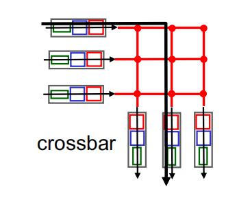
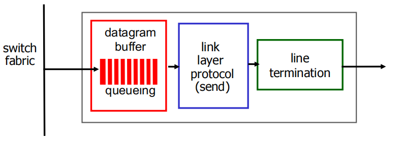

# Network Layer 1

| Layers            | Data Type |
| ----------------- | --------- |
| Application Layer | Message   |
| Transport Layer   | Segment   |
| Network Layer     | Datagram  |
| Link Layer        | Frame     |
| Physical Layer    | Bit       |

## Overview of Network Layer

1. Overview of Network layer
2. Router
3. Internet Protocol

**Goal:**

- Understand principles behind network layer services, focusing on data plane:

  - Network layer service models

  - Forwarding versus routing

  - How a router works

  - Generalized forwarding

- Instantiation, implementation in the Internet

Introduction:

- Transport segment from sending to receiving host 

  从发送主机到接收主机的传输segment

- On sending side encapsulates segments into datagrams

  在发送端将 Segment 封装到datagram中

- On receiving side, delivers segments to transport layer

  在接收端，将 Segment 传送到传输层

- Network layer protocols in every host, router

  网络层协议存在于**每一个**主机和路由器中

- Router examines header fields in all IP datagrams passing through it

  路由器检查通过它的所有 IP datagram的报头字段

### Two key network-layer functions  两个关键的网络层功能

**Network-layer functions:**

网络层功能

- Forwarding: move packets from router’s input to appropriate router output

  **转发**：将数据包从路由器的输入移动到适当的路由器输出。当一个分组到达某个路由器的一条输入链路时，该路由器必须将该分组移动到适合的输出链路 （局部）

- Routing : determine route taken by packets from source to destination

  **路由选择** ：确定数据包从源到目标的路由。

  - Routing algorithms

    路由算法：当分组从发送方流向接收方时，网络层必须决定这些分组所采用的路由或路径计算这些路径的算法被称为路由选择算法。

Analogy: taking a trip  类比：去旅行

- forwarding: process of getting through single interchange

  转发：通过单一路口的过程。

- routing: process of planning trip from source to destination

  路由：从源头到目的地的行程规划过程。

### Network layer: data plane, control plane  网络层：数据平面、控制平面

**路由选择算法的目标是生成路由表，为路由器转发IP分组找出适当的下一跳路由器；路由选择协议的目标是实现路由表中路由信息的动态更新。**

数据平面与控制平面紧耦合

**Data plane 数据平面**

数据平面负责实际的数据转发，它使用从控制平面生成的**转发表**（Forwarding Table）来转发数据包。数据平面中的转发表是一个查找表，包含了每个目的地地址的转发路径。

- 数据包到达路由器后，数据平面根据**目标IP地址**查找转发表，决定将数据包转发到哪个接口，或是否需要将数据包转发到下一个路由器。
- 转发表通常由控制平面计算并传递给数据平面，并且在数据平面中按需查询。

- Local, per-router function

  本地、每个路由器的功能

- Determines how datagram arriving on router input port is forwarded to router output port

  确定如何将到达路由器输入端口的数据报表转发到路由器输出端口

- Forwarding function

  转发功能

  - **传统方式**：基于目标地址+转发表（路由表）

  - **SDN方式**：基于多个字段+段表

**Control plane 控制平面**

控制平面负责处理网络的路由决策，它包含了网络中路由器的路由协议和算法，主要任务是根据各种路由协议（如RIP、OSPF、BGP等）学习并维护路由表。

- Network-wide logic

  网络范围的逻辑

- Determines how datagram is routed among routers along end-end path from source host to destination host

  确定如何沿从源主机到目标主机的终端路径在路由器之间路由数据报

- Two control-plane approaches:

  两种控制平面方法：

  - **traditional routing algorithms**: implemented in routers

    在路由器中实现的 *传统路由* 算法

    

    路由选择算法决定了插入该路由器转发表的内容。在上图中，路由选择算法运行在每台路由器中，并且在每台路由器中都包含转发和路由选择两种功能。在一台路由器中的路由选择算法与在其他路由器中的路由选择算法通信，以计算出它的转发表的值。这种通信是根据路由选择协议交换包含路由选择信息的路由选择报文进行通信的。
  
  - **software-defined networking (SDN)**: implemented in (remote) servers
  
    *软件定义网络* *（SDN）*：在（远程）服务器中实现
  
    
  
    
  
    上图显示了将控制平面从路由器物理上分离的一种方法，远程控制器计算和分发转发表以供每台路由器所使用。注意到上图和传统方法的控制平面图的数据平面组件是相同的。而在上图中，控制平面路由选择功能与物理的路由器是分离的，即路由选择设备仅执行转发，而远程控制器计算并分发转发表。远程控制器可能实现在具有高可靠性和冗余的远程数据中心中，并可能由 ISP 或某些第三方管理。路由器和远程控制器是通过交换包含转发表和其他路由选择信息的报文进行通信的。

### Per-router control plane  每台路由器控制平面

A distinct (typically remote) controller interacts with local control agents (CAs)

不同的（通常是远程的）控制器与本地控制代理 （CA） 交互

### Network service model  网络服务模型

Q: What service model for “channel ” transporting datagrams  from sender to receiver?

将datagram从发送方传输到接收方的 “信道 ” 是什幺服务模型？

example services for individual datagrams:

单个数据报的示例服务：

- Guaranteed delivery

  确保交付

- Guaranteed delivery with less than 40 msec delay

  保证延迟小于 40 毫秒的传输

example services for a flow of datagrams:

数据报流的示例服务：

- In-order datagram delivery

  按顺序数据报交付

- Guaranteed minimum bandwidth to flow

  保证最小流带宽

- Restrictions on changes in inter packet spacing

  对数据包间间距变化的限制

### Network layer service models:  网络层服务模型

在一些网络架构中“**连接建立**”是除了转发和路由之外第三个重要的功能。例如ATM，frame relay， X.25

在分组传输之前，在两个主机之间，再通过一些路由器所构成的路径上建立一个网络层连接 （会涉及到路由器）

网络层与传输层连接服务区别：

- 网络层：在两个主机之间，涉及到路径上的一些路由器
- 传输层：在2两个进程之间，很可能只体现在端系统上 （TCP连接）

## Router  路由器

### Router architecture overview  路由器架构概述

- **High-level view of generic router architecture:**

  通用路由器体系结构的高级视图：

  - *routing, management control plane* (software)operates in millisecond time frame

    *路由、管理控制平面*（软件）以毫秒为单位运行 (图像虚线上半部分)

    - 路由：运行路由选择算法 / 协议 （RIP，OSPF，BGP）- 生成路由表

  -  *forwarding data plane* (hardware) operates in nanosecond timeframe
  
    *转发数据平面*（硬件）以纳秒级时间帧运行(图像虚线下半部分)
    
    - 转发：从输入到输出链路交换数据报-根据路由表进行转发

### Input port functions  输入端口功能

- physical layer: bit-level reception

  物理层：比特级接收

- data link layer: e.g., Ethernetsee chapter 6

  数据链路层：解封装

- Decentralized switching:  分布式交换

  - using header field values, lookup output port using forwarding table in input port memory *(“match plus action”)*

    根据datagram头部的信息：目的地址，在输入端口内存中的转发表中查找合适的输出端口。（匹配+行动）

  - goal: complete input port processing at ‘line speed’

    目标：以“线性速”完成输入端口处理

  - queuing: if datagrams arrive faster than forwarding rate into switch fabric

    排队：如果数据报到达的速度比转发到交换机结构的速率更快

  - *destination-based forwarding:* forward based only on destination IP address (traditional)

    基于目的地的转发： 仅基于目的地 IP 地址的转发（传统）

  - *generalized forwarding:* forward based on any set of header field values

    广义转发: 基于任何一组 Header 字段值进行转发（SDN）

下图为基于目标的转发

*Q:* but what happens if ranges don’t divide up so nicely? 

但是，如果范围没有很好地划分呢？

### Longest prefix matching  最长前缀匹配

When looking for forwarding table entry for given destination address, use longest address prefix that matches destination address.

在查找给定目标地址的转发表条目时，请使用与目标地址匹配的最长地址前缀。

Examples:

- DA: 11001000 00010111 00010110 10100001 which interface? 0
- DA: 11001000 00010111 00011000 10101010 which interface? 1

We’ll see why longest prefix matching is used shortly, when we study addressing.

当我们研究寻址时，我们将看到为什幺很快就会使用最长前缀匹配

Longest prefix matching: often performed using ternary content addressable memories (TCAMs)

最长前缀匹配：通常使用**三元内容可寻址存储器 （TCAM）** 执行

- *Content addressable:* present address to TCAM: retrieve address in one clock cycle, regardless of table size

  *内容可寻址：* 将地址呈现给 TCAM：在一个时钟周期内检索地址，无论表大小如何

- Cisco Catalyst: can up ~1M routing table entries in TCAM

  Cisco Catalyst：可以在 TCAM 中可以存储多大约为1百万条路由表项

### Switching fabrics 交换结构

- Transfer packet from input buffer to appropriate output buffer

  将数据包从输入缓冲区传输到适当的输出缓冲区

- Switching rate: rate at which packets can be transfer from inputs to outputs

  交换速率：数据包从输入传输到输出的速率

  - Often measured as multiple of input/output line rate

    通常以输入/输出线路速率的倍数来衡量

  - N inputs: switching rate N times line rate desirable

    **N 个输入：交换机的交换速率通常需要是输入速率的N倍以上才不会形成瓶颈**

- Three types of switching fabrics:

  三种类型的交换结构：

### Switching via memory 通过内存切换

**First generation routers:**

第一代路由器：

- Traditional computers with switching under direct control of CPU

  在 CPU 直接控制下进行切换的传统计算机

- Packet copied to system’ s memory

  数据包已复制到系统内存

- Speed limited by memory bandwidth (2 bus crossings per datagram)

  速度受内存带宽限制（每个数据报 2 个总线交叉）在运行的时候数据会先从输入端口被保存到内存中，然后再从内存中被调用发送至输出端口，对bus（总线）产生两次占用

### Switching via a bus  

第二代路由器

- Datagrams from input port memory to output memory via a shared bus

  通过共享总线从输入端口内存到输出内存的数据报

- Bus contention: switching speed limited by bus bandwidth

  总线争用：开关速度受总线带宽限制

- Cisco 5600: 32 Gbps bus

  Cisco 5600：32 Gbps 总线 （对于介入或企业级别路由器，速度足够，但是不适合区域或者骨干网络）

### Switching via interconnection network 通过互连网络进行交换

第三种路由器

- Overcome bus bandwidth limitations

  克服总线带宽限制，同事并发转发多个分组

- Banyan networks, crossbar, other interconnection nets initially developed to connect processors in multiprocessor

  Banyan networks、crossbar、其他互连网络最初开发用于连接多处理器中的处理器

- Advanced design: fragmenting datagram into fixed length cells, switch cells through the fabric. 

  高级设计：将数据报碎片化为固定长度的单元，通过结构切换单元。

- Cisco 12000: switches 60 Gbps through the interconnection network

  Cisco 12000：通过互连网络进行 60 Gbps 的交换机

### Input port queuing  输入端口排队

- Fabric slower than input ports combined -> queueing may occur at input queues 

  结构速度慢于输入端口组合 - > 排队可能发生在输入队列中

  - queueing delay and loss due to input buffer overflow!

    由于输入缓冲区溢出而导致的排队延迟和丢失！

- Head-of-the-Line (HOL) blocking: queued datagram at front of queue prevents others in queue from moving forward

  队头 （HOL） 阻塞：队列前面的排队数据报会阻止队列中的其他人向前移动

### Output ports  输出端口

- *Buffering* required when datagrams arrive from fabric faster than the transmission rate

  当数据报从结构到达的速度比传输速率快时，需要缓冲

  - Datagram (packets) can be lost due to congestion, lack of buffers

    数据报（数据包）可能会因拥塞、缺少缓冲区而丢失

- *Scheduling discipline* chooses among queued datagrams for transmission

  *调度规则* 在排队的数据报中进行选择以进行传输

  - Priority Scheduling - who gets best performance, network neutrality

    优先调度谁获得最佳性能，网络中立性

### Output port queueing  输出端口排队

- Buffering when arrival rate via switch exceeds output line speed

  当通过交换机的到达速率超过输出线路速度时进行缓冲

- *Queueing (delay) and loss due to output port buffer overflow!*

  由于输出端口缓冲区溢出而导致的排队（延迟）和丢失！

#### How much buffering? 需要缓存多少

- RFC 3439 rule of thumb: average buffering equal to “typical” RTT (say 250 msec) times link capacity C

  RFC 3439 经验法则：平均缓冲等于“典型”RTT（比如 250 毫秒）乘以链路容量 C

  - e.g., C = 10 Gpbs link: 2.5 Gbit buffer

- More recent recommendation: with N TCP flows, buffering equal to

  最近的建议：对于 N 个 TCP 流，缓冲等于

  - (RTT * C) / √N

### Scheduling mechanisms  调度机制

- **Scheduling**: choose next packet to send on link

  **调度**：选择下一个数据包在链接上发送

- **FIFO (first in first out) scheduling**: send in order of arrival to queue

  **FIFO （先进先出） 调度**：按到达顺序发送到队列

  - Real-world example?  真是世界的例子

  - *Discard policy:* if packet arrives to full queue: who to discard?

    *丢弃策略：* 如果数据包到达完整队列：丢弃谁？

    - *Tail drop:* drop arriving packet

      *尾部投递：* 投递到达数据包

    - *Priority:* drop/remove on priority basis

      *优先级：* 按优先级删除

    - *Random:* drop/remove randomly

      *随机：* 随机放置/删除

### Scheduling policies: priority  调度策略：优先

**Priority scheduling:** send highest priority queued packet 

优先级调度：发送优先级最高的排队数据包

- Multiple classes, with different priorities

  多个类，具有不同的优先级

  - Class may depend on marking or other header info, e.g. IP source/dest, port numbers, etc.

    类可能取决于标记或其他标头信息，例如 IP 源/目标、端口号等。

  - real world example?

**Round Robin (RR) scheduling:**

- Multiple classes

  多个类

- Cyclically scan class queues, sending one complete packet from each class (if available)

  循环扫描不同类型的队列, 发送完一类的一个分组，再发送下一个类的一个分组，循环所有类

- Real world example?

**Weighted Fair Queuing (WFQ):** 

- Generalized Round Robin

  广义轮询

- Each class gets weighted amount of service in each cycle

  在一段时间内，每个队列得到的服务时间是Wi / (XIGMA(Wi)) * t

  每个类在每一个循环中获得不同的权重的服务量。

- Real-world example?

  真实世界的例子？

## Internet Protocol  网际协议

### The Internet network layer  互联网网络层

Host, router network layer functions:

主机、路由器网络层功能：

IP datagram format

### IP fragmentation, reassembly  IP 分段、重组

- Network links have MTU (max.transfer size) - largest possible link-level frame

  网络链路具有 MTU （max.transfer size） 最大可能的链路级帧

  - Different link types, different MTUs

    不同的链路类型，不同的 MTU

- Large IP datagram divided (“fragmented”) within net

  大的IP datagram在网络上被分片(fragmented)

  - One datagram becomes several datagrams

    一个数据报变成多个数据报

  - “Reassembled” only at final destination

    仅在最终目的地“重新组装”

  - IP header bits used to identify, order related fragments

    用于识别、排序相关片段的 IP 报头位

