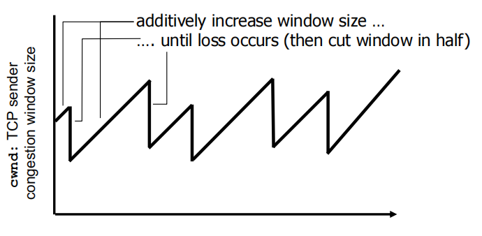
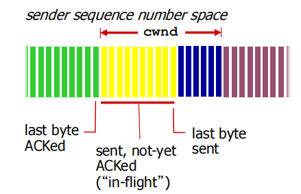
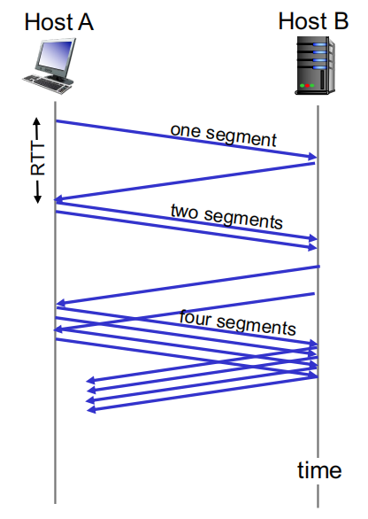
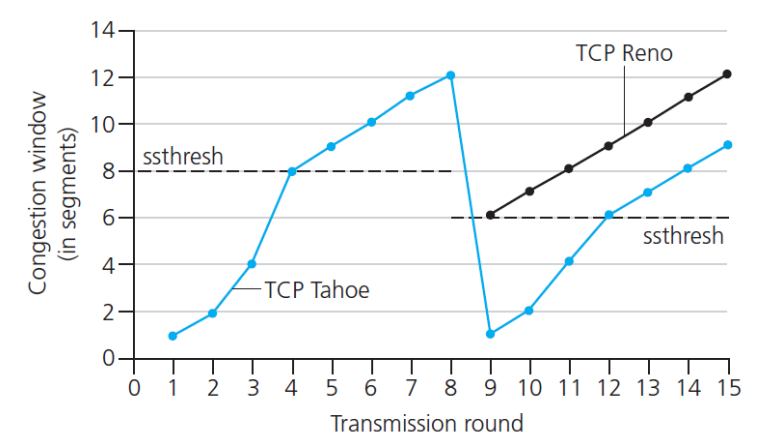
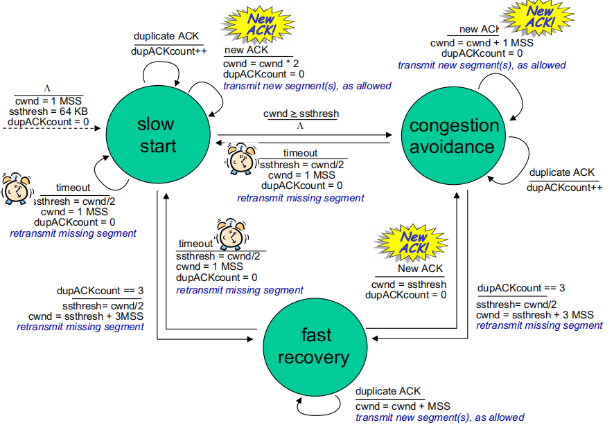
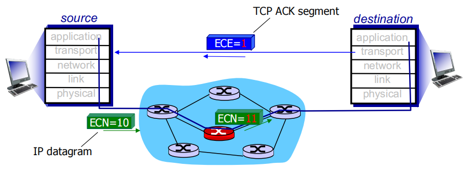
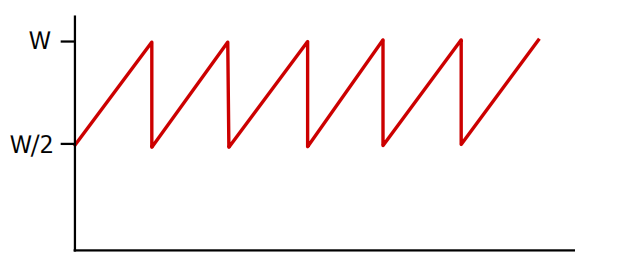

# Transport Layer 3

## TCP congestion control

cwnd：congestion window，既发送者的窗口
AIMD (additive increase multiplicative decrease)加增乘减:

- **Strategy: additive increase multiplicative decrease (AIMD)**

  策略:加性增减(AIMD)

- **Approach**: sender increases transmission rate (window size), probing for usable bandwidth, until loss occurs

  **方法**：发送方提高传输速率（窗口大小），探测可用带宽，直到发生丢失

  - **Additive increase**: increase **congestion window（cwnd，对一个TCP发送方能向网络中发送流量的速率进行了限制）** by 1 MSS（ Maximum Segment Size） every RTT until loss detected

    **加增**：每次RTT增加1个cwnd的MSS(Maximum Segment Size 段大小)

  - **Multiplicative decrease**: cut congestion window in half after loss 

    **乘减**：丢失后将拥塞窗口减半, 发生loss时，cwnd *= 0.5

additively increase window size …  加法增加窗口大小 ...

…. until loss occurs (then cut window in half)  ….直到损失发生（然后将窗口切成两半）

**cwnd:** TCP sender congestion window size  **拥堵窗口** TCP 发送方拥塞窗口大小

AIMD saw tooth behavior: probing for bandwidth

AIMD 锯齿行为：探测带宽

### Details

- Sender limits transmission:

  **LastByteSent – LastByteAcked <= min(cwnd, rwnd)**

- cwnd is dynamic, function of perceived network congestion

- **TCP sending rate:**

  - Roughly: send cwnd bytes, wait RTT for ACKS, then send more bytes

    rate ≈ cwnd/RTT (bytes/sec)

### TCP Slow Start 慢启动

- When connection begins, increase rate exponentially until first loss event:

  当连接开始时，以指数方式增加速率，直到第一次丢失事件：

  - Initially **cwnd** = 1 MSS (maximumsegment size)

    最初 **cwnd** = 1 MSS（最大分段大小）

  - Double **cwnd** every RTT

    每个 RTT 加倍 **cwnd**

  - Done by incrementing **cwnd** for every ACK received

    通过为每个收到的 ACK 递增 **cwnd** 来完成

- **Summar**y: initial rate is slow but ramps up exponentially fast

  摘要：初始速率缓慢，但呈指数级增长

### TCP: detecting, reacting to loss  检测、应对损失

- **Loss indicated by timeout:**

  超时表示损失

  - cwnd set to 1 MSS; 

  - window then grows exponentially (as in slow start) to threshold, then grows linearly

    然后，window 呈指数增长（如慢速启动）到 threshold，然后线性增长

- **Loss indicated by 3 duplicate ACKs: TCP RENO**

  由 3 个重复的 ACK 指示丢失：TCP RENO

  - Dup ACKs indicate network capable of delivering some segments 

    重复确认指示网络能够提供某些分段

  - cwnd is cut in half window then grows linearly

    CWND 被切成两半窗口，然后线性增长

- **TCP Tahoe always sets cwnd to 1 (timeout or 3 duplicate acks)**

  检测到3个重复ACK类型loss，开始TCP RENO，cwnd * = 0.5，随后以线性增长

### TCP: from slow start to Congestion Avoidance 从慢启动到拥塞避免

Q: When should the exponential increase switch to linear? 

指数增长何时应转换为线性增长？

A: When cwnd gets to 1/2 of its value before timeout.

当 cwnd 在超时前达到其值的 1/2 时。

**Implementation  实现:**

- variable **ssthresh**

  变量 **ssthresh**

- on loss event, **ssthresh**is set to 1/2 of **cwnd** just before loss event

  实际应用中，ssthresh被设置为loss时cwnd的一半，cwnd再次达到ssthresh后开始线性增长

慢启动流程：

1. 开始传输时，cwnd = 1 MSS，每个RTT过后，cwnd *= 2
2. 检测到timeout类型loss，cwnd=1MSS，重新慢启动
3. 检测到3个重复ACK类型loss，开始TCP RENO，cwnd * = 0.5，随后以线性增长
4. 实际应用时，ssthresh被设置为loss时cwnd的一半，cwnd再次达到ssthresh后开始线性增长

### Explicit Congestion Notification (ECN)  显式拥塞通知

**Network-assisted congestion control:**

网络辅助拥塞控制

- Two bits in IP header (ToS field) marked **by network router** to indicate congestion

  IP 报头（ToS 字段）中的两bits标记为 **由网络路由器** 标记，以指示拥塞

- Congestion indication carried to receiving host

  传送到接收主机的拥塞指示

- Receiver (seeing congestion indication in IP datagram) ) sets ECE bit on receiver-to sender ACK segment to notify sender of congestion

  接收方（在 IP 数据报中看到拥塞指示）在接收方到发送方的 ACK 网段上设置 ECE 位，以通知发送方拥塞

### TCP throughput 吞吐量

- **avg. TCP throughput as function of window size, RTT?**

  平均 TCP 吞吐量与窗口大小 RTT 的函数关系？

  - ignore slow start, assume always data to send

    忽略慢启动，假设始终发送数据

- **W: window size (measured in bytes) where loss occurs**

  W：发生丢失的窗口大小（以字节为单位）

  - avg. window size (# in-flight bytes) is ¾ W

  - avg. thruput is 3/4W per RTT

- **avg TCP thruput = 3/4 * W/RTT bytes/sec**

### Summary

- **Principles behind transport layer services:**

  传输层服务背后的原则：

  - Multiplexing, demultiplexing

    多路复用、解复用

  - Reliable data transfer

    可靠的数据传输

  - Flow control

    流控制

  - Congestion control

    拥塞控制

- **Instantiation, implementation in the Internet**

  在 Internet 中实例化、实施

  - UDP
  - TCP

