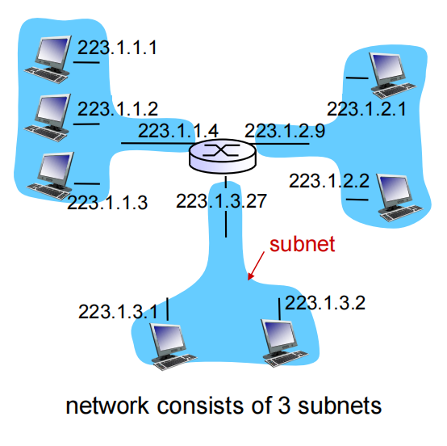
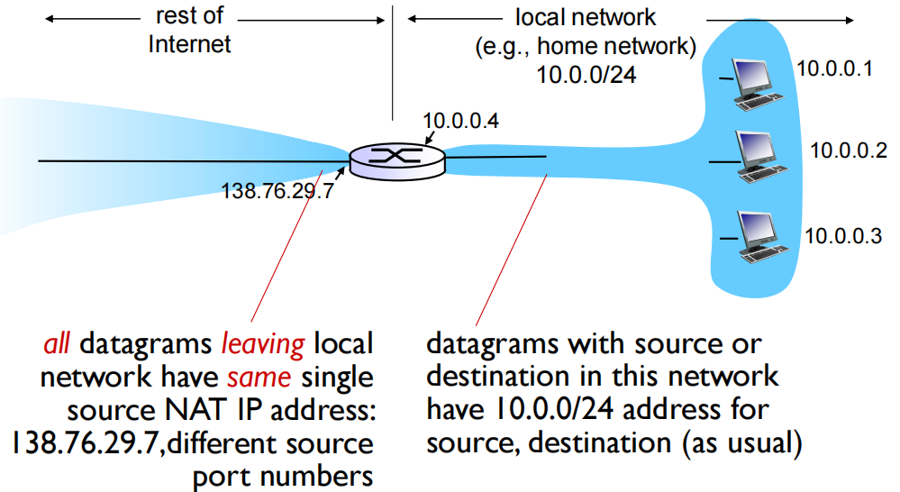

# Network Layer 2

## Roadmap

1. IPv4 addressing
2. NAT
3. IPv6
4. Generalized Forward and SDN

## IPv4 addressing

### introduction  IP 寻址：简介

- **Interface**: connection between host/router and physical link

  接口：主机/路由器与物理链路之间的连接

  - Host typically has one or two interfaces (e.g., wired Ethernet, wireless 802.11)

    主机通常有一个或两个接口（例如，有线以太网、无线 802.11）

  - Router typically has multiple interfaces

    路由器通常具有多个接口

- **IP addresses associated with each interface** (rather than with the host or router containing that interface).

  与每个接口关联的 IP 地址（而不是与包含该接口的主机或路由器关联的 IP 地址）。

- **Q**: if a router has 3 interfaces, how many IP addresses it has?

  如果路由器有 3 个接口，它有多少个 IP 地址？3个

  - IP address: 32-bit identifier for host and router interface

    IP 地址：主机和路由器接口的 32 位标识符

- Q: how are interfaces actually connected?
  
  接口实际上是如何连接的？
  
  - A: by switch, we’ll learn it in the future lecture.
  
    通过交换机

**Does switch contain IP addresses? Why?**

**交换机是否包含 IP 地址？为什幺？**

交换机包含ip地址，但是switcher不包含，通常switcher代表网络层以下的链路层和物理层，也叫做layer2

### Subnets  子网

- **IP address, two parts:** 

  IP 地址，两部分：

  - Subnet part - high order bits

    子网部分高阶位

  - Host part - low order bits 

    主机部件低阶位

- **What’s a subnet ?**

  什幺是子网 ？

  - Device interfaces with same subnet part of IP address

    一个子网内的节点（主机或者路由器）它们的IP地址的高位部分相同，这些节点构成的网络的一部分叫做子网

  - Can physically reach each other **without intervening router**

    可以在没有路由器干预的情况下物理上相互访问

- **Recipe**

  - To determine the subnets, detach each interface from its host or router to create isolated networks.

    要确定子网，请将每个接口与其主机或路由器分离，以创建隔离网络。

  - Each isolated network is called a **subnet**.

    每个孤岛的网络称为一个子网。
    
    /24代表255.255.255.0，也就是每个网络地址的前三个数字代表网络信息，最后一位数字代表主机信息，也就是可以在0~254个主机之间发送信息。255作为范围播报，不会被分配给任何的主机。

- Questions:

  - How many subnets?

    有多少个子网？

    一共有6个子网（通过第三位数字判断在网络连接中不同的个体）
  
  - What subnets are they? Assuming /24 for all subnet masks.
  
    它们是什幺子网？假设所有子网掩码均为 /24。
  
    subset1 includes the interfaces of h1, h2, h3, and r1

### Network Classes  网络类

**Classful addressing**  分类寻址

- The network portion of an IP address were constrained to be 8, 16, or 24 bits in length.

  IP 地址的网络部分的长度限制为 8 位、16 位或 24 位。

- Subnets with 8-, 16-, and 24-bit subnet addresses were known as class A, B and C networks.

  具有 8 位、16 位和 24 位子网地址的子网称为 A、B 和 C 类网络。

- It became problematic 

  它变得有问题

  - Class C (/24) subnet could accommodate only up to 2^8 − 2 = 254 hosts, but 2 million networks

    C 类 （/24） 子网最多只能容纳 2^8 − 2 = 254 个主机

  - Class B (/16) subnet supporting 2^16 – 2 = 65,534 hosts, which is too large, and 16382 networks (2^14 - 2)

    支持 2^16 – 2 = 65,534 个主机的 B 类 （/16） 子网，这太大了

  - Class A (/8): 124 networks (2^7 - 2), 16 million hosts (2^24 - 2) 

- Under classful addressing, an organization with 2,000 hosts,  which subnet class should be allocated? What is the problem?

  在分类寻址下，一个拥有 2,000 个主机的组织，应该分配哪个子网类？问题是什幺？

**特殊的IP地址：**

**内网专用IP地址**

- 专用地址：地址空间的一部分供专用地址使用
- 永远不会被当做公用地址来分配，不会与公用地址重复
  - 只会在局部网络中有意义，区分不同的设备
- 路由器不对目标地址是专用地址的分组进行转发
- 专用地址范围：
  - Class A: 10.0.0.0---10.255.255.255 MASK 255.0.0.0
  - Class B: 172.16.0.0---172.31.255.255 MASK 255.255.0.0
  - Class C: 192.168.0.0---192.168.255.255 MASK 255.255.255.0

### CIDR  无类别域际路由

**CIDR**: **C**lassless **I**nter **D**omain **R**outing 无类域间路由

- Subnet portion of address can have arbitrary length

  地址的子网部分可以具有任意长度，取消传统的A, B, C级地址界限划分。

- Address format: a.b.c.d/x, where x is # bits in subnet portion of address

  地址格式：a.b.c.d/x，其中 x 是地址子网部分的 # 位

子网掩码：11111111 11111111 11111110 00000000

- Network name with address format: a.b.c.0/x Subnet mask: /x **Network prefix: x**

  地址格式为：a.b.c.0/x 的网络名称 子网掩码：/x **网络前缀：x** （也就是前x位的bit用来表示子网）

- **CIDR产生的意义：**

  - 提高IPv4地址空间分配效率。

    - 因为在传统的有类IP地址划分中，每个有类IP地址的网络号都是固定的，一个比较大的网络可能就分配一个A类地址，一个比较小的网络可能就分配一个C类地址，但是这两个网络可能都无法将主机号分配完，造成IP资源的浪费。

    - 有了CIDR之后，就可以跳脱固定有类IP地址的网络号范围，将任意bit位作为网络号，划分成任意大小的子网。这样就可以根据具体的子网规模来划分网络大小，提高IP资源的利用率。

  - 提高路由效率

    - CIDR可以将多个子网聚合为一个较大的子网。此时，路由器的转发表里就可以面向更大的子网来记录转发信息，而不是对于每一个小的子网。这样就减轻了路由表的存储、检索性能，提高路由效率。

事实上CIRD这种方式也叫路由聚集

#### 子网掩码 （Subnet mask）

- 32bits , 0 or 1 in each bit

  - 1: bit位置表示子网部分

  - 0: bit位置表示主机部分

- 原始的A、B、C类网络的子网掩码分别是

  - A：255.0.0.0 ：11111111 00000000 0000000 00000000

  - B：255.255.0.0：11111111 11111111 0000000 00000000

  - C：255.255.255.0：11111111 11111111 11111111 00000000

- 另外的一种表示子网掩码的表达方式

  - /#

  - 例：/22：表示前面22个bit为子网部分

#### 计算子网和主机的例题

C类子网：也就是根据第四字节的二进制中的1和0的数量来分别判断子网数量和主机数量。

- 255.255.255.224/27
- 这次我们将使用子网掩码255.255.255.224对网络192.168.10.0进行子网划分
- 网络地址 = 192.168.10.0
- 子网掩码 = 255.255.255.224

- 有多少个子网：224的二进制位11100000，因此答案位2^3 = 8个子网

- 有多少台主机：2^5 - 2 = 30

- 有哪些合法的子网：256 - 224 = 32。我们需要从0开始不断增加块大小32，知道到达子网掩码值；也就是0、32、64、96、128、160、193、224

- 每个子网的广播地址是下一个子网的数字 - 1

- 每个子网包含的合法的主机地址为：合法的主机地址位子网地址和广播地址之间的数字

B类子网：也就是根据第三和第四字节的二进制中的1和0的数量来分别判断子网数量和主机数量。

- 255.255.192.0/18
- 子网掩码： 255.255.192.0
- 有多少个子网： 192的二进制是11000000，2^2 = 4 (第三个字节中有两位是1，第四个字节中没有1)
- 每个子网中有多少个主机: 2^14 - 2 = 16382 （第三个字节中有6bit的0， 第四个字节中8个bit都是0）
- 合法的子网有：256 - 192 = 64， 因此从0开始累加，子网位0, 64, 128和192。鉴于子网划分是在第三个字节中进行的，因此子网号实际上是0.0, 64.0, 128.0, 192.0

A类子网同样，就是根据子网掩码中第二字节，第三字节和第四字节中的1和0的数量来判断子网数量和主机数量。

#### 转发表和转发算法

- 获得IP数据报的目标地址

  - 于转发表中的每一个表项

  -  (IP Des addr) & (mask) == destination, 则按照表项对应的接口转发该数据报

  - 如果都没有找到,则使用默认表项转发数据报

#### How to get one? 如何获得一个IP地址

Q: How does a host interface get an IP address?  主机接口如何获取 IP 地址？

- **Hard-coded by system admin in a file**

  **系统管理员将地址配置在一个文件中**

  - Windows: control-panel -> network -> configuration-> tcp/ip -> properties

    Windows：控制面板 - > 网络 - > 配置> tcp/ip -> 属性

  - UNIX: /etc/rc.config

- **DHCP**: Dynamic Host Configuration Protocol: dynamically get address from as server

  动态主机配置协议：从服务器动态获得一个IP地址

  - “plug-and-play”

## DHCP: Dynamic Host Configuration Protocol  动态主机配置协议

**Goal:** allow host to dynamically obtain its IP address from network server when it joins network

允许主机在加入网络时从网络服务器动态获取其 IP 地址

- Can renew its lease on address in use

  可以在正在使用的地址上续订其租约，更新主对主机在用IP地址的租用期

- Allows reuse of addresses (only hold address while connected/“ on ”)

  允许重复使用地址（仅在连接时保留地址/“ 打开”）

- Support for mobile users who want to join network (more shortly)

  为想要加入网络的移动用户提供支持（稍后会提供）

**DHCP（动态主机配置协议）overview描述:** 

- host broadcasts “DHCP discover” msg [optional]

  主机广播 “DHCP discover” msg [可选]

- DHCP server responds with “DHCP offer” msg [optional]

  DHCP 服务器使用“DHCP offer”消息进行响应 [可选]

- host requests IP address: “DHCP request” msg

  主机请求 IP 地址：“DHCP request” msg

- DHCP server sends address: “DHCP ack” msg

  DHCP 服务器发送地址：“DHCP ack” msg

### client-server scenario  客户端-服务器方案

新入网的客户端先询问有没有DHCP 服务器，如果收到回复的话，再发送请求一个ip地址

因为DHCP服务器需要告知客户端自己到底有没有；客户端需要从提供的多个ip地址中选择其中一个并且告诉DHCP自己选的是哪一个

### more than IP addresses  不仅仅是IP地址

DHCP can return more than just allocated IP address on subnet:

DHCP 可以返回的不仅仅是子网上分配的 IP 地址：

- Address of first-hop router for client

  客户端的第一跳路由器地址 （默认网关）

- Name and IP address of DNS sever

  DNS 服务器的名称和 IP 地址

- Network mask (indicating network versus host portion of address)

  子网掩码（指示地址的网络部分与主机部分）

#### How to get one?

Q: how does network get subnet part of IP addr?

如何获得一个网络的子网部分

A: gets allocated portion of its provider ISP’s address space

获取其提供商 ISP 地址空间的分配部分，从ISP获得地址块中分配一个小地址块

###  route aggregation  路由聚集

- Hierarchical addressing allows efficient advertisement of routing information:

  分层寻址允许路由信息的高效通告：

  - The ability to use a single prefix to advertise multiple networks is often referred to as **address aggregation** or **route aggregation**.

    使用单个前缀通告多个网络的能力通常称为 **地址聚合** 或 **路由聚合**。

- 下图给出了一个路由聚集的示意图

如上图所示，右侧的网络包含了3个小的子网，这三个小的子网再通过左侧的路由器与Internet相连。此时，针对这三个小的子网，按照原先存储子网和子网掩码的方式，路由器的转发表里存储这这样的信息：

但是现在有了路由聚集和，我们可以将这个三个小的子网聚集成一个更大的子网来存储。由于这三个子网中最大的子网范围为223.1.0.0/23，因此用一个更大的子网来表示就是：223.1.0.0/22。这三个小的子网就相当于子网内部的继续划分，此时对内部的3个小的子网的路由，由内部的路由器再进行进一步区分。

- 层级编址使得路由信息通告更高效，下图是一个路由通告的示意图

图中的ISP（网络服务提供商），可能与多个子网/组织相连，为它们提供网络服务。当ISP向互联网上的更高层的路由器发布路由信息的时候，并不需要将每个子网一个一个发布，而是同样可以利用路由聚合，聚合成一个更大的子网， 比如图中的：200.23.16.0/20，来进行发布。

作为更高层的互联网中的路由器，只需要去判断如果一个IP数据报所要到达的地址满足200.23.16.0/20，就可以向这个子网中进行发送了。其他的一些ISP也可以同样进行路由聚合后，再进行发布。

详细的判断过程：

1. **200.23.16.0/20**:
   - **网络地址**: 200.23.16.0
   - **子网掩码**: 255.255.240.0
   - **可用主机地址范围**: 200.23.16.1 到 200.23.31.254
   - **可用主机数量**: 2^(32-20) - 2 = 4096 - 2 = 4094 个主机
2. **200.23.16.0/23**:
   - **网络地址**: 200.23.16.0
   - **子网掩码**: 255.255.254.0
   - **可用主机地址范围**: 200.23.16.1 到 200.23.17.254
   - **可用主机数量**: 2^(32-23) - 2 = 512 - 2 = 510 个主机

在路由聚合中，较大的网络（如`/20`）可以包含较小的网络（如`/23`）。这意味着在一个路由器中可以通过聚合路由来减少路由表的条目。因此：

1. 如果你有多个`/23`网络，比如 `200.23.16.0/23` 和 `200.23.18.0/23`，这些网络可以通过一个`/20`路由条目来聚合。
2. 在路由器中，你可以仅使用一个条目 `200.23.16.0/20` 来代表所有的 `200.23.16.0/23` 和 `200.23.18.0/23` 网络，从而简化路由表。

- **ISPs-R-Us has a more specific route to Organization 1**

  **ISPs-R-Us 有一条更具体的路线到组织 1**

  - What happens when addresses are not allocated in such a hierarchical manner? See this example.

    当地址没有以这种分层方式分配时会发生什幺情况？换而言之**需要注意**的是，上述ISP能够进行路由聚合的前提是，**这些子网/组织的IP地址是连续的**，不然如果中间的某一些IP被划分到了另一个ISP的子网中，就可能出现传输错误了。比如下面这种情况：

- 下面的/23进行下一层，因为23匹配的更多，使用最长前缀匹配

- 在右侧 internet 部分：When other routers in the Internet see the address blocks 200.23.16.0/20 and 200.23.18.0/23 and want to route to an address in the block 200.23.18.0/23, they use **longest prefix matching**

  当互联网上的其他路由器看到地址块 `200.23.16.0/20` 和 `200.23.18.0/23` 并希望路由到地址块 `200.23.18.0/23` 中的地址时，它们使用**最长前缀匹配**，因此下方的ISP区块中的`200.23.18.0/23`更符合要求所以信息只会发送给第二个ISP。

#### IP addressing IP编址：如何获得一个地址

Q：一个ISP如何获得一个地址块?

A：ICANN: Internet Corporation for Assigned Names and Numbers  互联网名称和数字地址分配机构

- Allocates addresses

  分配地址

- Manages DNS

  管理DNS

- Assigns domain names, resolves disputes

  分配域名，解决冲突

## NAT network address translation 网络地址转换

Why NAT? If the subnet grows bigger, what if the ISP had already allocated the contiguous portions of address range? And what typical network admin wants to know how to manage IP addresses in the first place?

为什幺选择 NAT？如果子网变大，如果 ISP 已经分配了地址范围的连续部分，该怎幺办？首先，哪个典型的网络管理员想知道如何管理 IP 地址呢？

### Motivation 动机

local network uses just one IP address as far as outside world is concerned:

动机：就外部世界而言，本地网络只使用一个 IP 地址：

- Range of addresses not needed from ISP: just one IP address for all devices

  不需要从ISP分配一块地址，可用一个IP地址用于所有的（局域网）设备--省钱

- Can change addresses of devices in local network without notifying outside world

  可以在局域网改变设备的地址情况下而无须通知外界（外网地址变，内网地址不变）

- Can change ISP without changing addresses of devices in local network

  可以改变ISP（地址变化）而不需要改变内部的设备地址

- Devices inside local net not explicitly addressable, visible by outside world (a security plus)

  局域网内部的设备没有明确的地址，对外是不可见的--安全

### Implementation 实现

**NAT router** must:

**实现**: NAT 路由器必须:

- Remember (in **NAT translation table**) every (source IP address, port #) to (NAT IP address, new port #) translation pair

  记住（在 **NAT 转换表中**中）每个`（源 IP 地址、端口号）`到`（NAT IP 地址、新端口号）`转换对

- **Outgoing datagrams: replace** (source IP address, port #) of every outgoing datagram to (NAT IP address, new port #)

  **传出数据报：将每个传出数据报的**`（源 IP 地址、端口号）`替换为`（NAT IP 地址、新端口号）`

  . . . remote clients/servers will respond using (NAT IP address, new port #) as destination addr

  . . .远程客户端/服务器将使用 `（NAT IP 地址、新端口号）` 作为目标地址进行响应

- **Incoming datagrams: replace** (NAT IP address, new port #) in dest fields of every incoming datagram with corresponding (source IP address, port #) stored in NAT table

  **传入数据报：将每个传入数据报的 dest 字段中的**`（NAT IP 地址、新端口号）`替换为存储在 NAT 表中的相应`（源 IP 地址、端口号）`

- **16-bit port-number field:**   16 位端口号字段

  - 60,000 simultaneous connections with a single LAN-side address!

    60,000 个同时连接，一个 LAN 端地址！

- **NAT is controversial:**  NAT 存在争议：

  - Routers should only process up to layer 3  路由器最多只能处理layer3

  - Address shortage should be solved by IPv6  地址短缺应通过 IPv6 来解决

  - Violates end-to-end argument  违反端到端参数

  - NAT possibility must be taken into account by app designers, e.g., P2P applications

    应用进程设计人员必须考虑 NAT 的可能性，例如 P2P 应用进程

  - NAT traversal: what if client wants to connect to server behind NAT?

    NAT 遍历：如果客户端想要连接到 NAT 后面的服务器怎幺办？

### 私有IP地址和公有IP地址的区别

1.  **私有IP地址（子网地址）**

- 在**局域网（LAN）**中，DHCP服务器通常分配的是私有IP地址，比如`192.168.x.x`、`10.x.x.x`、`172.16.x.x`等地址。
- 这些地址只能在内部网络中使用，设备在局域网内相互通信。访问外部网络时，私有IP地址会通过**NAT（网络地址转换）**转换为公有IP地址。

2. **公有IP地址**

- 在某些特殊情况下，ISP（互联网服务提供商）提供的DHCP服务器可以直接分配公有IP地址，适用于**家庭宽带**或**直连互联网的网络**。
- 这种情况下，设备直接与公网通信，无

## IPv6

### motivation  动机

- **Initial motivation: 32-bit address space soon to be completely allocated.**

  最初的动机：32 位地址空间即将完全分配。 

- **Additional motivation:  额外的动力**

  - Header format helps speed processing/forwarding

    报头格式有助于加快处理转发，ipv4的报头包含12个字段，而ipv6只包含8个字段

  - Header changes to facilitate QoS 

    标头更改以促进 QoS

**IPv6 datagram format:** 

IPv6 数据报格式

- Fixed-length 40 byte header

  固定长度的 40 字节报头

- No fragmentation allowed (at intermediate routers, see “packet too big” new ICMP message type)

  不允许分段（在中间路由器上，请参阅“数据包太大”新 ICMP 消息类型）

### IPv6 datagram format  数据报格式

- **Priority (Traffic Class)**: identify priority among datagrams in flow

  标示流中数据报的优先级

- **Flow Label**: identify datagrams in same “flow.”(concept of “flow” not well defined).

  标示数据报在一个“flow.”  ( “flow”的概念没有被严格的定义)

- **Next header**: identify upper layer protocol for data 

  标示上层协议

### Other changes from IPv4 与IPv4的差异

- **Checksum**: removed entirely to reduce processing time at each hop

  被移除掉，降低在每一段中的处理速度

- **Options**: allowed, but outside of header, can be indicated by the “Next Header” field

  允许，但是在头部之外, 被 “Next Header” 字段标示

- **ICMPv6**: new version of ICMP

  ICMP的新版本

  - Additional message types, e.g. **“Packet Too Big”**

    附加了报文类型

  - Multicast group management functions

    多播组管理功能

### Transition from IPv4 to IPv6   IPv4转换IPv6

- **Not all routers can be upgraded simultaneously**

  并非所有路由器都可以同时升级

  - No “flag days”

    没有一个标记日 “flag days”

  - How will network operate with mixed IPv4 and IPv6 routers?

    网络如何与 IPv4 和 IPv6 混合路由器一起运行？

- **Tunneling:** IPv6 datagram carried as payload in IPv4 datagram among IPv4 routers (set the protocol number field in IPv4 datagram at 41)

  隧道: 在IPv4路由器之间传输的IPv4数据报中携带IPv6数据报

### adoption  IPv6任重而道远

- Google: 8% of clients access services via IPv6

  Google：8% 的客户通过 IPv6 访问服务

- NIST: 1/3 of all US government domains are IPv6 capable

  NIST：1/3 的美国政府域支持 IPv6

- **Long (long!) time for deployment, use**

  部署时间长（很长！），使用

  - 20 years and counting!

    20 年，还在继续！

  - Think of application-level changes in last 20 years: WWW, Facebook, streaming media (Youtube), Skype, Twitter…

    想想过去 20 年应用进程级的变化：WWW、Facebook、流媒体 （Youtube）、Skype、Twitter......

  - Why?

## Generalized Forward and SDN  广义前向和 SDN以及OpenFlow

**什么是OpenFlow**: OpenFlow 是一种网络协议，主要用于软件定义网络（SDN，Software Defined Networking）中。它提供了一种标准化的方式来控制网络设备的行为，允许网络管理员通过编程的方式管理网络流量。

**流量控制**: OpenFlow 允许网络管理员定义流表（flow table），通过这些流表来控制数据包的转发行为。这意味着可以根据数据包的属性（如 IP 地址、MAC 地址、端口等）来决定如何处理这些数据包。

Q: How does destination-based forwarding work?

基于目的地的转发如何运作？

A: lookup a destination (match), send the pkt (action).That leads to a more general “match-plus-action” paradigm. 

查找目标 （匹配项），发送 PKT （操作）。这导致了一个更通用的 “**match + action**” 范式。

- **Flow**: defined by header fields

  **流**：由标头字段定义

- **Generalized forwarding: simple packet-handling rules**

  通用转发：简单的数据包处理规则

  - **Pattern**: match values in packet header fields

    **模式**：匹配数据包标头字段中的值

  - **Actions:** for matched packet: drop, forward, modify, matched packet or send matched packet to controller 

    **操作：** 对于匹配的数据包：丢弃、转发、修改、匹配的数据包或将匹配的数据包发送到控制器

  - **Priority**: disambiguate overlapping patterns

    **优先级**：消除重叠模式的歧义

  - **Counters**: #bytes and #packets

    **计数器**：#bytes 和 #packets

Flow table in a router (computed and distributed by controller) define router’s match + action rules

路由器中的**流表**（由控制器计算和分发）定义路由器的匹配 + 操作规则

- src = 1.2.*.*, dest = 3.4.5.* --> drop 
- src = *.*.*.*, dest = 3.4.*.* --> forward(2)
- src = 10.1.2.3, dest =*.*.*.* --> send to controller

### Flow Table Entries  流表条目

#### Example

### OpenFlow abstraction OpenFlow抽象

**match+action**: unifies different kinds of devices

**统一化各种网络设备提供的功能**

几乎目前所有的网络设备都可以在这个match + action的模式框架内进行描述，具体化为各种网络设备包括未来的网络设备。

- **Router 路由器**

  - *match:* longest destination IP prefix

    最长目标 IP 前缀

  - *action:* forward out a link

    转发链接

- **Switch 转发**

  - *match:* destination MAC address

    目标 MAC 地址

  - *action:* forward or flood

    转发或泛洪

- **Firewall 防火墙**

  - *match*: IP addresses and TCP/UDP port numbers

    IP 地址和 TCP/UDP 端口号

  - *action:* permit or deny 

    允许或拒绝

- **NAT**

  - *match:* IP address and port

    IP 地址和端口

  - *action:* rewrite address and port

    重写地址和端口

#### OpenFlow example

*Example:* datagrams from hosts h5 and h6 should be sent to h3 or h4, via s1 and from there to s2

*示例：* 来自主机 h5 和 h6 的datagram应通过 s1 发送到 h3 或 h4，然后从那里发送到 s2

# Network Layer Control Plane (1) 网络层数据平面

## Roadmap

1. Overview

2. Routing protocol (1) - Dijkstra’s algorithm

## Network-layer functions  网络层功能

Recall: two network-layer functions:

回想一下：两个网络层功能：

- Data plane

  数据平面

  - forwarding: move packets from router’s input port to appropriate output port

    转发： 将数据包从路由器的输入端口移动到适当的输出端口

- Control plane

  控制平面

  - routing: determine route taken by packets from source to destination

    路由 （routing）：确定数据包从源到目的地的路由

Two approaches to structuring network control plane:

构建网络控制平面的两种方法：

- per-router control (traditional)

  按路由器控制（传统）

- logically centralized control (software defined networking)

  逻辑集中控制（软件定义网络）

### Per-router control plane  每个路由器的控制平面

- Individual routing algorithm components in each and every router interact with each other in control plane to compute  forwarding tables

  每个路由器上都有实现路由算法元件（它们之间需要相互交互）- 形成传统IP实现方式的控制平面

1. 每台设备上既实现控制功能、又实现数据平面
2. 控制功能分布式实现
3. 路由表-粘连

### Logically centralized control plane  逻辑集中的控制平面

A distinct (typically remote) controller interacts with local control agents (CAs) in routers to compute forwarding tables

不同的（通常是远程的）控制器与路由器中的本地控制代理 （CA） 交互，以计算转发表

(虚线是控制平面和数据平面分离)

## Routing protocol (1) - Dijkstra’s algorithm  路由协议 Dijkstra 算法

### 路由的原则

**路由选择算法的原则**：

- **正确性(correctness)**:算法必须是正确的和完整的,使分组一站一站接力，正确发向目标站；完整：目标所有的站地址，在路由表中都能找到相应的表项；没有处理不了的目标站地址；

- **简单性(simplicity)**:算法在计算机上应简单：最优但复杂的算法，时间上延迟很大，不实用，不应为了获取路由信息增加很多的通信量；

- **健壮性(robustness)**:算法应能适应通信量和网络拓扑的变化：通信量变化，网络拓扑的变化算法能很快适应；不向很拥挤的链路发数据，不向断了的链路发送数据；
- **稳定性(stability)**：产生的路由不应该摇摆
- **公平性(fairness)**：对每一个站点都公平
- **最优性(optimality)**：某一个指标的最优，时间上，费用上，等指标，或综合指标；实际上，获取最优的结果代价较高，可以是次优的

### Routing protocols 路由协议

**Routing protocol goal**: determine “good” paths (equivalently, routes), from sending host to receiving host, through network of routers

路由协议目标：通过路由器网络确定从发送主机到接收主机的“良好”路径（相当于路由）

- Path: sequence of routers packets will traverse in going from given initial source host to given final destination host

  Path：路由器数据包将从给定的初始源主机遍历到给定的最终目标主机的串行

- “good”: least “cost”, “fastest”, “least congested”

  “good”： 最低 “cost”， “fastest” ， “least congest”

- **Routing: a “top-10” networking challenge!**

  路由：“前 10 名”网络挑战！

### Graph abstraction of the network  网络的抽象图

A graph is often used to formulate routing problems.  图形通常用于构建路由问题。

graph: G = (N,E)

N = set of nodes (routers) = { u, v, w, x, y, z }

N = 路由器集合 = { u, v, w, x, y, z }

E = set of edges (links) = { (u,v), (u,x), (v,x), (v,w), (x,w), (x,y), (w,y), (w,z), (y,z) }

E = 链路集合 = { (u,v), (u,x), (v,x), (v,w), (x,w), (x,y), (w,y), (w,z), (y,z) }

*aside:* graph abstraction is useful in other network contexts, e.g., P2P, where *N* is set of peers and *E* is set of TCP connections

### Graph abstraction: costs 花费

c(x,x ’) = cost of link (x,x ’) e.g., c(w,z) = 5

cost could always be 1, or inversely related to bandwidth,or directly related to congestion.

成本可能始终为 1，或者与带宽成反比，或者与拥塞直接相关。

**cost of path** (x1 , x2 , x3 ,…, xp ) = c(x1 ,x2 ) + c(x2 ,x3 ) + … + c(xp-1 ,xp )

 key question: what is the least-cost path between u and z ?

关键问题：U 和 Z 之间的最小成本路径是什幺？

routing algorithm: algorithm that finds that least cost path

路由算法：查找最低成本路径的算法

### Routing algorithm classification  路由算法分类

**Q: global or decentralized information? Global/centralized:**

全球信息还是分散信息？全局/集中式

- All routers have complete topology, link cost info

  所有路由器都有完整的拓扑、链路成本信息

- "link state” algorithms (e.g., Dijkstra)

  “链接状态”算法（例如 Dijkstra）

**Decentralized: 分散** 

- Router knows physically-connected neighbors, link costs to neighbors

  路由器知道物理连接的邻居，以及邻居的链路开销

- Iterative process of computation, exchange of info with neighbors

  迭代计算过程，与邻居交换信息

- “Distance vector” algorithms

  “距离矢量” 算法

**Q: static or dynamic?**

- **static:** 

  - Routes change slowly 

    路线变化缓慢

- **dynamic:** 

  - Routes change more quickly

    路线变化更快

    - Periodic update

      定期更新

    - In response to link cost changes

      响应链接成本变化

#### A link-state routing algorithm - Dijkstra  一种链路状态路由算法 Dijkstra

**Notation:**

- c(x,y): link cost from node x to y; = ♾️ if not direct neighbors

  从节点 X 到 Y 的链路成本;= ♾️ 如果不是直接邻居

- D(v): current value of cost of path from source to dest. v

  从源到目标 V 的路径成本的当前值

- p(v): predecessor node along path from source to dest. v

  沿从源到目标 V 的路径的前置节点

- N': set of nodes whose least cost path definitively known

  其最低成本路径明确已知的节点集

**Dijkstra’s algorithm**

- Net topology and link costs known to all nodes

  所有节点都知道的净拓扑和链路成本

  - Accomplished via “link state broadcast”

    通过 “link state broadcast” 完成

  - All nodes have same info

    所有节点都有相同的信息

- Computes least cost paths from one node (“source”) to all other nodes

  计算从一个节点（“源”）到所有其他节点的最低成本路径

  - Gives *forwarding table* for that node

    给出该节点的 *转发表*

- Iterative: after k iterations, know least cost path to k dest’ s

  迭代：在 k 次迭代之后，知道到 k 目标 s 的最低成本路径

#### Dijkstra’s algorithm: example 1

*notes:*

- construct shortest path tree by tracing predecessor nodes

  通过跟踪前置节点构建最短路径树

- ties can exist (can be broken arbitrarily)

  可以存在 TIES （可以任意打破）

#### Dijkstra’s algorithm: example 2

#### **Dijkstra’s algorithm: example 2 - result**

resulting shortest-path tree from u:

resulting forwarding table in u:

