# Control Plane 2

## Roadmap

1. Routing (2) - Distance vector algorithm 
2. Intra-AS routing in the Internet: OSPF
3. Routing among the ISPs: BGP
4. The SDN control plane
5. ICMP
6. SNMP

## 路由的概念

- 路由:按照某种指标 (传输延迟,所经过的站点数目等) 找到一条从源节点到目标节点的较好路径 （子网到子网的路由）

  - 较好路径: 按照某种指标较小的路径

  - 指标:站数, 延迟,费用,队列长度等, 或者是一些单纯指标的加权平均

  - 采用什么样的指标,表示网络使用者希望网络在什么方面表现突出,什么指标网络使用者比较重视

- 以**网络**为单位进行路由（路由信息通告+路由计算）

  - 网络为单位进行路由，路由信息传输、计算和匹配的代价低

  - 前提条件是：一个网络所有节点地址前缀相同，且物理上聚集

  - 路由就是：计算网络 到其他网络如何走的问题

- 网络到网络的路由 = 路由器 - 路由器之间路由

  - 网络对应的路由器到其他网络对应的路由器的路由

  - 在一个网络中：路由器-主机之间的通信，链路层解决

  - 到了这个路由器就是到了这个网络

- 路由选择算法(routing algorithm):网络层软件的一部分,完成路由功能

## Distance vector algorithm  距离矢量算法

- **Bellman-Ford equation (dynamic programming)**

  let

  ​	dx(y) := cost of least-cost path from x to y

  ​	从x到y的最小花费的路径
  
  then

​		dx (y) = minv{c(x, y) + dv(y)}

**具体每组的含义:**

- minv is taken over all neighbors v of x

  x花费最少能够到达的相邻节点

- c(x, y) = cost to neighbor v

  到达邻居节点的花费

- dv(y) = cost from neighbor v to destination y

  从源节点v到终点y的总花费

### Bellman-Ford Example Bellman-Ford 示例

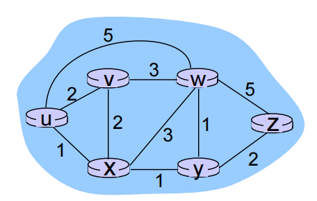

**From u’s perspective estimated:  从 u 的角度来看估计**

clearly, dv (z) = 5, dx (z) = 3, dw (z) = 3

B-F equation says:

du (z) = min { c(u,v) + dv (z),

​			c(u,x) + dx (z),

​			c(u,w) + dw (z) }

​	  = min {2 + 5,

​			1 + 3,

​			5 + 3} = 4

Node achieving minimum is the next hop in shortest path, used in forwarding table

Node achieving minimum 是最短路径中的下一跃点，用于转发表

### Distance vector algorithm  距**D x （y） = 从 x 到 y 的最小成本估算**离矢量算法

- **D x (y) = estimate of least cost from x to y**

  **D x (y) = 从 x 到 y 的最小成本估算**

  - x maintains estimate of distance vector Dx = [Dx (y): y ∈ N ]

- **Node x:**

  - Knows cost to each neighbor v: c(x,v)

    知道每个邻居的成本 v： c（x，v）

  - Maintains its neighbors’ distance vectors. For each neighbor v, x maintains Dv = [Dv (y): y ∈ N ]

    保持其相邻点的距离矢量。对于每个相邻域 v，x 保持 Dv = [Dv （y）： y ∈ N ]

  - **Dx(y) ← minv{c(x,v) + Dv(y)}  for each node y ∈ N**

#### Distance vector algorithm  距离矢量算法

Key idea 核心思路:

- From time-to-time, each node sends its own distance vector estimate to neighbors

  有时，每个节点都会向邻居发送自己的距离矢量估计值

- When x receives new Distance Vector estimate from neighbor, it updates its own DV using B-F equation:

  当 x 从邻居那里收到**新的 DV** 估计值时，它使用 B-F 方程更新自己的 DV：

  - **Dx(y) ← minv{c(x,v) + Dv(y)}  for each node y ∈ N**

  - Under minor, natural conditions, the estimate Dx(y) converge to the actual least cost dx(y)

    在次要的自然条件下，估计值 Dx（y） 收敛于实际最低成本 dx（y）

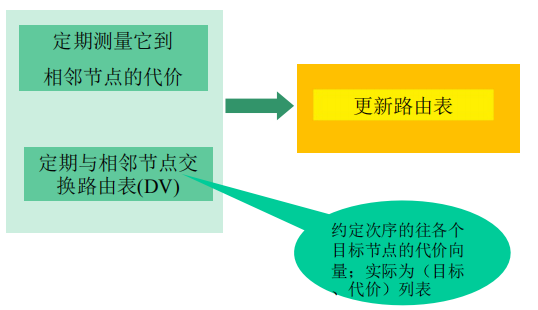

**Iterative, asynchronous: each local iteration caused by:** 

**迭代、异步：每个本地迭代由以下原因引起，并导致cost变化：**

- Local link cost change 

  本地链路成本更改

- Distance Vector update message from neighbor

  来自邻居的 DV 更新消息

**Distributed:**  

**分布式**

- Each node notifies neighbors only when its Distance Vector changes

  每个节点仅在其 DV(距离矢量) 发生变化时通知邻居

  - Its neighbors then further notify their neighbors if necessary

    然后，如有必要，其邻居会进一步通知其邻居

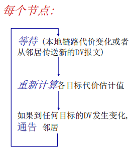

- Examples:

  

  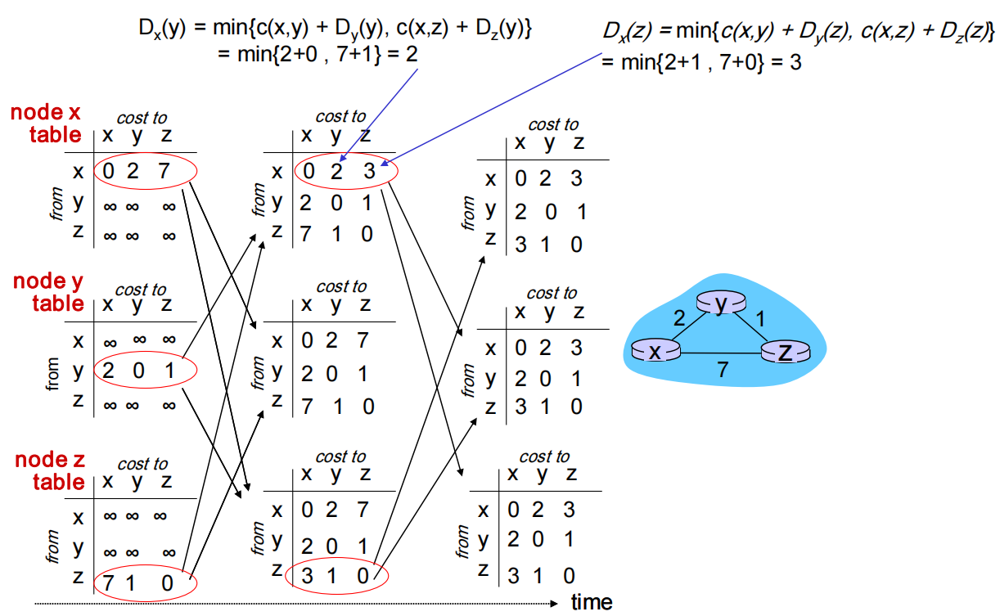

#### Link cost changes  链接成本更改

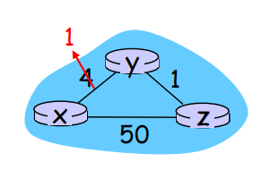

- Node detects local link cost change 

  节点检测到本地链路开销变化

- Updates routing info, recalculates distance vector

  更新路由信息，重新计算距离矢量

- If Distance Vector changes, notify neighbors

  如果 DV(距离矢量)  发生变化，请通知邻居

- Good news: "travels fast"

  好消息：“传送速度快”

- t0 : y detects link-cost change, updates its Distance Vector, informs its neighbors.

  t0 ： y 检测链路成本变化，更新其 Distance Vector，通知其邻居。

- t1 : z receives update from y, updates its table, computes new least cost to x , sends its neighbors its Distance Vector.

  t1 ： z 从 y 接收更新，更新其表，计算 x 的新最低成本，向其邻居发送其 DV(距离矢量) 。

- t2 : y receives z’s update, updates its distance table. Y’s least costs do not change, so y does not send a message to z. 

  t2 ： Y 接收 Z 的更新，更新其距离表。y 的最小成本不会改变，因此 y 不会向 z 发送消息。

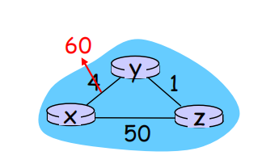

- Node detects local link cost change 

  节点检测到本地链路成本变化

- **Bad news travels slow** – “count to infinity” problem!

  坏消息传得慢数到无穷问题

- How many iterations before algorithm stabilizes?

  算法稳定之前需要多少次迭代？

  - **44 iterations before algorithm stabilizes**

    **算法稳定前 44 次迭代**

**Poisoned reverse:**

**中毒反转：**

- If Z routes through Y to get to X :

  如果 Z 通过 Y 路由以到达 X ：

  - Z tells Y its (Z’s) distance to X is infinite (so Y won’t route to X via Z)

    Z 告诉 Y 它 （Z） 到 X 的距离是无限的（所以 Y 不会通过 Z 路由到 X）

- Q: Will this completely solve count to infinity problem?

  这会完全解决计数到无穷大的问题吗？

## Intra-AS routing in the Internet: OSPF  互联网中自治系统内部的路由选择

Our routing study thus far - idealized 

到目前为止，我们的路线研究理想化了

- All routers identical

  所有路由器都是一样的

- Network “flat”

  网络“平坦”

… not true in practice because of the two reasons below

由于以下**两个原因**，在实践中并非如此。可以选择**层次路由**

- **Scale:** with billions of destinations:

  **规模：** 拥有数十亿个目的地：

  - Can’t store all destinations in routing tables!

    无法将所有目的地存储在路由表中！

  - Routing table exchange would swamp links!

    路由表交换会淹没链接！

- **Administrative autonomy**

  **自主权限管理问题**

  - Internet = network of networks/ISPs

    网络 = 网络/ISP 的网络

  - Each network/ISP admin may want to control routing in its own network

    每个网络/ISP 管理员都希望控制自己网络中的路由

  - 希望对外隐藏自己的网络细节； 当然，还希望和其它网络互联

### Internet approach to scalable routing  可扩展路由的网络方法

**层次路由**：将互联网分成一个个AS(路由器聚集区域)；intra和inter分别是应用于AS中的两种不同的路由管理协议

Aggregate routers into regions known as **“autonomous systems” (AS) (a.k.a. “domains”)**

将路由器聚合到称为“**自治系统**”（AS）（又名“域”）的区域（某个区域内的路由器集合）

#### Intra-AS routing  AS内部路由

- Routing among hosts, routers in same AS (“network”)

  主机之间的路由，路由器在相同的AS（“网络”）中

- All routers in AS must run same intradomain protocol

  AS 中的所有路由器都必须运行相同的域内协议

- Routers in different AS can run different intra-domain routing protocol

  不同 AS 中的路由器可以运行不同的域内路由协议

-  Gateway router: at “edge” of its own AS, has link(s) to router(s) in other AS’es

  网关路由器：位于其自身 AS 的“边缘”，具有与其他 AS 中的路由器的链路

#### Inter-AS routing AS间路由协议

- Routing among AS’es  AS间运行

- Gateways perform interdomain routing (as well as intra-domain routing)

  网关执行域间路由(以及域内路由)

### Interconnected ASes  互连的 AS

- Forwarding table configured by both intra- and inter-AS routing algorithm

  由as内路由算法和as间路由算法配置的转发表

  - Intra-AS routing determine entries for destinations within AS

    AS 内部路由确定 AS 中目标的条目

  - Inter-AS & intra-AS determine entries for external destinations

    AS 间和 AS 内部确定外部目的地的条目

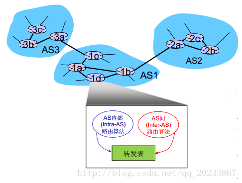

#### Inter-AS tasks

- Suppose router in AS1 receives datagram destined outside of AS1:

  假设AS1中的路由器接收到从AS1发送的数据报

  - Router should forward packet to gateway router, but which one?

    路由器应该将数据包转发到网关路由器，但哪一个呢？

AS1 must: AS1必须要：

1. Learn which dests are reachable through AS2, which through AS3

   了解哪些目的地可以通过 AS2 到达，哪些可以通过 AS3 到达

2. Propagate this reachability info to all routers in AS1

   将此可达性信息传播到AS1中的所有路由器

*job of inter-AS routing!*

*AS间路由的工作*

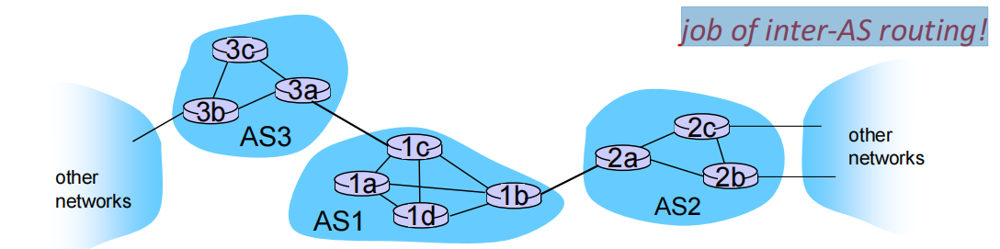

#### Intra-AS Routing

- Also known as **interior gateway protocols (IGP)**

  也称为 **内部网关协议 （IGP）**

- Most common intra-AS routing protocols:

  最常见的 AS 内部路由协议：

  - RIP: Routing Information Protocol

    RIP：路由信息协议

  - OSPF: Open Shortest Path First (IS-IS* protocol essentially same as OSPF)

    OSPF：开放最短路径优先（IS-IS* 协议与 OSPF 基本相同）

  - IGRP: Interior Gateway Routing Protocol (Cisco proprietary for decades, until 2016)

    IGRP：内部网关路由协议（思科数十年来一直专有，直到 2016 年）

### 层次路由的优点

- 解决了**规模问题**

  - 内部网关协议解决：AS内部数量有限的路由器相互到达的问题, AS内部规模可控
    - 如AS节点太多，可分割AS，使得AS内部的节点数量有限

  - AS之间的路由的规模问题

    - 增加一个AS，对于AS之间的路由从**总体**上来说，只是增加了一个节点=子网（每个AS可以用一个点来表示）

    - 对于其他AS来说只是增加了一个表项，就是这个新增的AS如何走的问题

    - 扩展性强：规模增大，性能不会减得太多

- 解决了**管理问题**

  - 各个AS可以运行不同的内部网关协议

  - 可以使自己网络的细节不向外透露

## Routing among the ISPs: BGP  互联网: BGP

- **BGP (Border Gateway Protocol)**: the de facto inter-domain routing protocol

  BGP (Border Gateway Protocol)：事实上的域间路由协议

  - “glue that holds the Internet together”

    “将 Internet 维系在一起的**胶水**”

- **BGP provides each AS router a means to:**

  **BGP 为每个 AS 路由器提供了一种方法：**

  - **eBGP**: obtain subnet prefix reachability information from neighboring ASes. Allows subnet to advertise its existence to rest of Internet: *“**I am here.**”*

    eBGP：从相邻 ASes 获取子网前缀可访问性信息。允许子网向 Internet 的其余部分通告其存在：我在这里。

  - **iBGP**: propagate reachability information to all AS-internal routers,and determine “best” routes to other networks based on reachability information and *policy*

    iBGP：将可访问性信息传播到所有 AS 内部路由器，并根据可访问性信息和 *策略* 确定到其他网络的 “最佳” 路由

### eBGP, iBGP connections

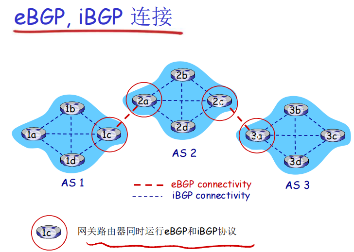

### BGP基础

- **BGP session**: two BGP routers (“peers”) exchange BGP messages over semi permanent TCP connection (using port 179):

  BGP 会话: 2个BGP路由器(“peers”)在一个半永久的TCP连接上交换BGP报文:

  - advertising *paths* to different destination network prefixes (BGP is a “path vector” protocol)

    通告向不同目标子网前缀的“路径”（BGP是一个“路径矢量”协议）

- **When AS3 gateway router 3a advertises path** **AS3,X** **to AS2 gateway router 2c:** AS3, X

  当AS3网关路由器3a向AS2的网关路由器2c通告路径：

  - AS3 *promises* to AS2 it will forward datagrams towards X

    3a参与AS内路由运算，知道本AS所有子网X信息; 语义上：AS3向AS2承诺，它可以向子网X转发数据报; 3a是2c关于X的下一跳（next hop）

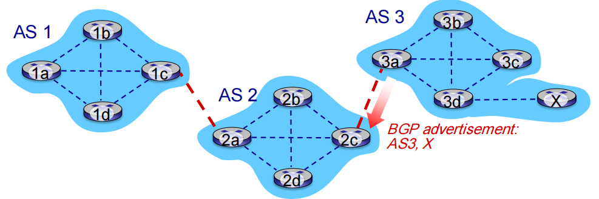

### Path attributes and BGP routes 路径的属性&BGP路由

- **Advertised prefix includes BGP attributes** 

  当通告一个子网的前缀时，通告包含BGP属性

  - prefix + attributes = “route”

- **Two important attributes:**

  2个重要的属性

  - **AS-PATH**:  list of ASes through which prefix advertisement has passed.

    前缀通告所经过的 AS 列表：AS 67 AS 17

  - NEXT-HOP: indicates the IP address of the router interface that begins the AS-PATH.

    表示开始 AS-PATH 的路由器接口的 IP 地址。

- **Policy-based routing:**

  基于策略的路由

  - Gateway receiving route advertisement uses *import policy* to accept/decline path (e.g., never route through AS Y).

    接收路由通告的网关使用*导入策略*来接受/拒绝路径（例如，从不通过 AS Y 路由）。

    - 过滤原因例1：不想经过某个AS，转发某些前缀的分组
    - 过滤原因例2：已经有了一条往某前缀的偏好路径

  - AS policy also determines whether to *advertise* path to other neighboring ASes.

    AS政策还决定是否向其他邻近的AS"宣传"路径。

### BGP path advertisement  BGP路径通告

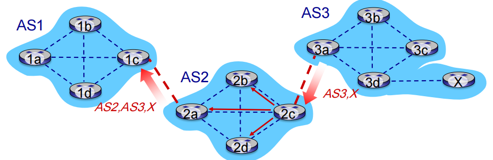

- AS2 router 2c receives path advertisement AS3,X (via eBGP) from AS3 router 3a

  AS2 路由器 2c 从 AS3 路由器 3a 接收路径通告 AS3,X（通过 eBGP）

- Based on AS2 policy, AS2 router 2c accepts path AS3,X, propagates (via iBGP) to all AS2 routers

  基于AS2的输入策略，AS2.2c决定接收AS3,X的通告，而且通过iBGP）向AS2的所有路由器进行通告

- Based on AS2 policy, AS2 router 2a advertises (via eBGP) path AS2, AS3, X to AS1 router 1c

  基于AS2的策略，AS2路由器2a通过eBGP向AS1.1c路由器通告AS2,AS3,X 路由信息

  - 路径上加上了 AS2自己作为AS序列的一跳

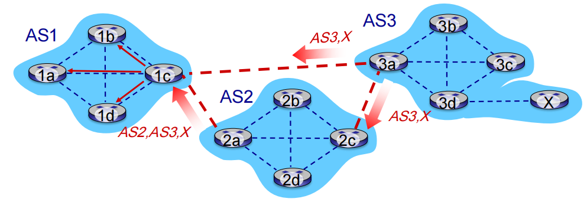

Gateway router may learn about multiple paths to destination:

网关路由器可能获取有关一个子网X的多条路径，从多个eBGP会话上：

- AS1 gateway router 1c learns path AS2,AS3,X from 2a

  AS1 网关路由器1c从2a学习到路径：AS2,AS3,X

- AS1 gateway router 1c learns path AS3,X from 3a

  AS1网关路由器1c从3a处学习到路径AS3,X

- Based on policy, AS1 gateway router 1c chooses path AS3,X, and advertises path within AS1 via iBGP

  基于策略，AS1路由器1c选择了路径：AS3,X，而且通过iBGP告诉所有AS1内部的路由器

### BGP messages  BGP报文

- **BGP messages exchanged between peers over TCP connection**

  **通过 TCP 连接在节点之间交换的 BGP 消息**

- **BGP messages:**

  - **OPEN**: opens TCP connection to remote BGP peer and authenticates sending BGP peer

    **OPEN**:打开到远程BGP对等的TCP连接,并验证发送BGP对等

  - **UPDATE**: advertises new path (or withdraws old)

    **更新**: 宣布新的道路(或撤回旧的)

  - **KEEPALIVE**: keeps connection alive in absence of UPDATES; also ACKs OPEN request

    **KEEPALIVE**：在没有 UPDATES 的情况下保持连接活动；同时确认 OPEN 请求

  - **NOTIFICATION**: reports errors in previous msg; also used to close connection

    **通知**:报告先前消息中的错误;也用于关闭连接

### BGP, OSPF, forwarding table entries    BGP, OSPF, 转发表表项

Q: how does router set forwarding table entry to distant prefix?

问：路由器如何将转发表入口设置为远端前缀?

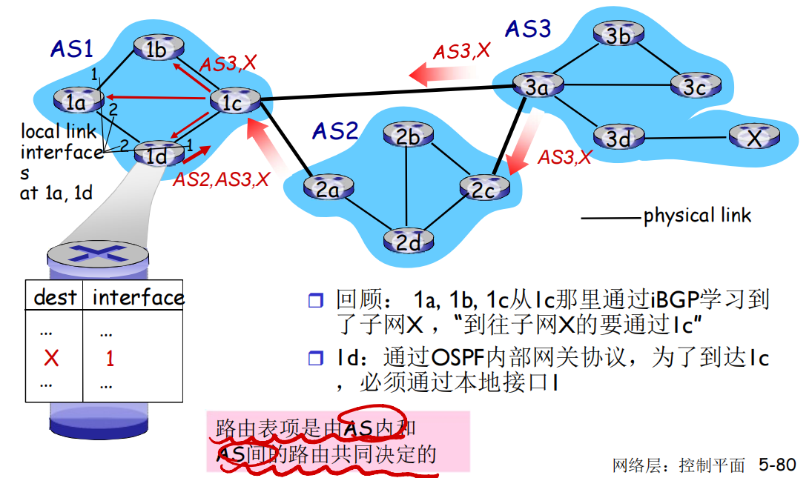

- recall: 1a, 1b, 1c learn about dest X via iBGP from 1c: "path to X goes through 1c"

  回想一下：1a、1b、1c 通过 iBGP 从 1c 了解目标 X：“到 X 的路径经过 1c”

- 1d: OSPF intra-domain routing: get to 1c, forward over outgoing local interface 1

  1d：OSPF 域内路由：到达 1c，通过传出本地接口 1 转发

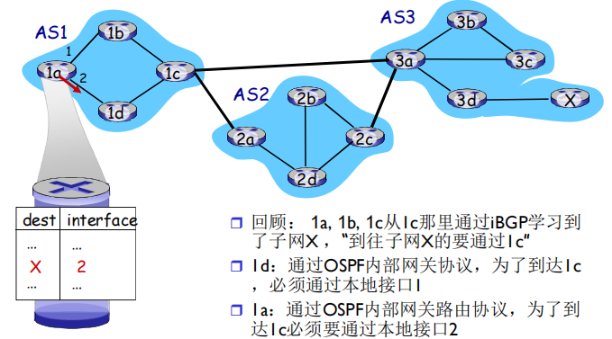

- 1a: OSPF intra-domain routing: to get to 1c, forward over outgoing local interface 2

  1a:OSPF域内路由:要到达1c,通过传出本地接口2转发

### BGP Routine Selection  路径选择

- **Router may learn about more than one route to destination AS, selects route based on:**

  路由器可能了解多于一条到达目的地 AS 的路线,根据以下情况选择路线:

1. local preference value attribute: policy decision

   本地偏好值属性：偏好策略决定

2. shortest AS-PATH 

   最短AS-PATH: AS的跳数

3. closest NEXT-HOP router: hot potato routing

   最近的NEXT-HOP路由器：热土豆路由

4. additional criteria

   附加的判断：使用BGP标识

- 一个前缀对应着多种路径，采用消除规则直到留下一条路径

#### Hot-potato routing 热土豆路由

- 2d learns (via iBGP) it can route to X via 2a or 2c

  2d通过iBGP获知，它可以通过2a或者2c到达X

- Hot potato routing: choose local gateway that has least intra-domain cost (e.g., 2d chooses 2a, even though more AS hops to X): don’t worry about inter-domain cost!

  **热土豆策略**：选择具备最小内部区域代价的网关作为往X的出口，这里选择2c（如：2d选择2a，即使往X可能有比较多的AS跳数）：不要操心域间的代价！

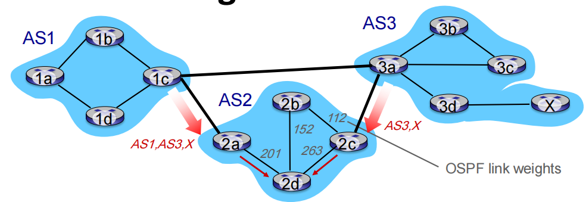

### BGP: achieving policy via advertisements  通过路径通告执行策略

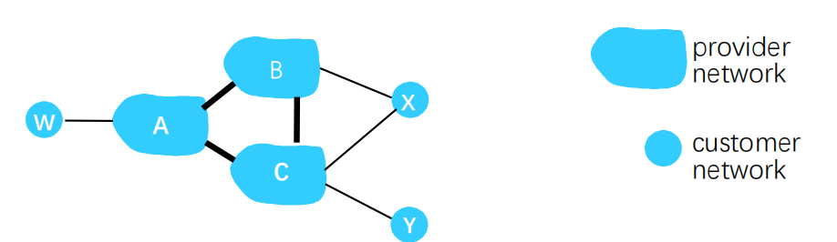

Suppose an ISP only wants to route traffic to/from its customer networks (does not want to carry transit traffic between other ISPs)

假设一个ISP只想 路由流量 到/去往它的客户网络 (不想承载其他ISPs之间的流量，即不通告：不是去往我的客户，也不是来自我的客户)

- A,B,C are **provider networks**

  A、B、C是**提供商网络**

- X,W,Y are customer (of provider networks)

  X、W、Y 是（提供商网络的）客户，也叫做桩网络

- X is **dual-homed**: attached to two networks

  X是**双重接入的，多宿桩网络**: 连接到两个网络

- **policy to enforce**: 

  **政策执行**: 强制让X

  - X does not want to route from B to C via X 

    X不想路由从B通过X到C

  - .. so X will not advertise to B a route to C

    因而X就不通告给B，它实际上可以路由到C

### BGP: achieving policy via advertisements 通过通告实现政策

Suppose an ISP only wants to route traffic to/from its customer networks (does not want to carry transit traffic between other ISPs)

假设一个ISP只想 路由流量 到/去往它的客户网络 (不想承载其他ISPs之间的流量，即不通告：不是去往我的客户，也不是来自我的客户)

- A advertises path Aw to B and to C

  A 向B和C通告路径Aw

- B **chooses not to advertise** BAw to C: 

  B选择不向C通告BAw：

  - B gets no “ revenue ” for routing CBAw, since none of C, A, w are B’s customers

    B从CBAw的路由上无法获得收益，因为C,A,w都不是B的客户

  - C does not learn about CBAw path

    C从而无法获知 CBAw路径的存在：每个ISP感知到的网络和真实不一致

- C will route through CAw (not using B) to get to w

  C可能会通过 CAw (而不是使用B)最终路由到w

### Why different Intra-, Inter-AS routing  为什么内部网关协议和外部网关协议如此不同?

- **Policy:**

  策略

  - inter-AS: admin wants control over how its traffic routed, who routes through its net. 

    Inter-AS: 管理员需要控制通信路径，谁在使用它的网络进行数据传输；

  - intra-AS: single admin, so no policy decisions needed

    Intra-AS: 一个管理者，所以无需策略;

    - AS内部的各子网的主机尽可能地利用资源进行快速路由

- **Scale:**

  范围

  - hierarchical routing saves table size, reduced update traffic

    分层路由可节省表大小，减少更新流量。

  - 如果AS 太大，可将此AS分成小的AS；规模可控
    - AS之间只不过多了一个点而已
    - 或者AS内部路由支持层次性，层次性路由节约了表空间, 降低了更新的数据流量

- **Performance:** 

  表现

  - intra-AS: can focus on performance

    AS 内部：可以专注于性能

  - inter-AS: policy may dominate over performance

    AS 间：策略可能优先于性能

## The SDN control plane   SDN控制平面

### Software defined networking (SDN)    软件定义网络

- **Internet network layer: historically has been implemented via distributed, per-router approach**

  互联网络网络层：历史上都是通过分布式、每个路由器的实现

  - **Monolithic** router contains switching hardware, runs proprietary implementation of Internet standard protocols (IP, RIP, IS-IS, OSPF, BGP) in proprietary router OS (e.g., Cisco IOS)

    **整体式**路由器包含交换硬件，在专有路由器操作系统（例如 Cisco IOS）中运行互联网标准协议（IP、RIP、IS-IS、OSPF、BGP）的专有实施

  - Different “middleboxes” for different network layer functions: firewalls, load balancers, NAT boxes, ..

    不同的“中间设备”用于不同的网络层功能：防火墙、负载均衡器、NAT 盒等。

- ~2005: Renewed interest in rethinking network control plane

  ~2005: 点燃重新思考互联网控制平面的兴趣

#### Per-router control plane  传统方式：每一个路由器(pre-router)一个控制平面

- Individual routing algorithm components in each and every router interact with each other in control plane to compute forwarding tables

  每个路由器中的各个路由算法组件在控制平面中相互交互以计算转发表

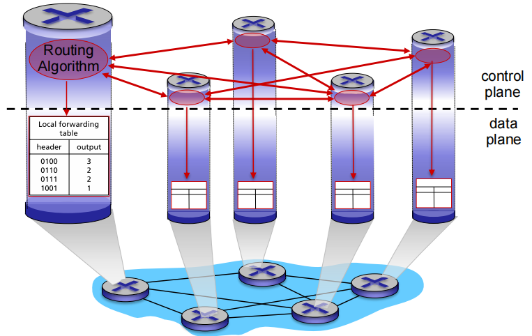

#### Logically centralized control plane  SDN方式：逻辑上集中的控制平面

- A distinct (typically remote) controller interacts with local control agents (CAs) in routers to compute forwarding tables

  不同的（通常是远程的）控制器与路由器中的本地控制代理 （CA） 交互，以计算转发表

  

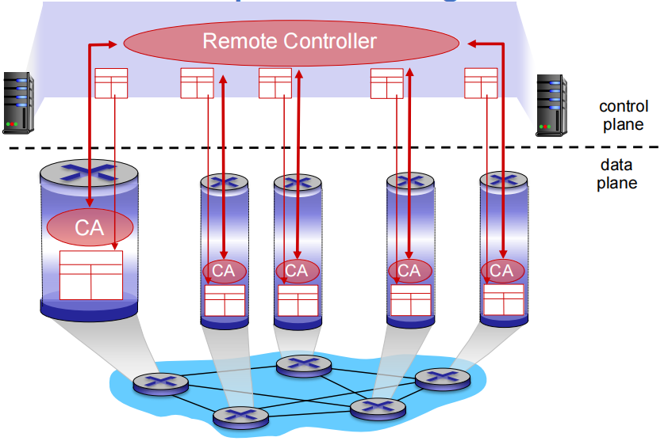

### Software defined networking (SDN)  continued

**Why** a **logically centralized** control plane?

为什么**需要一个**逻辑上集中的控制平面?

- Easier network management: avoid router misconfigurations, greater flexibility of traffic flows

  网络**管理更加容易**：避免路由器的错误配置，对于通信流的弹性更好

- Table-based forwarding (recall OpenFlow API) allows “programming” routers

  基于流表的转发（回顾一下OpenFlow API)，允许“**可编程**”的路由器

  - Centralized “programming” easier: compute tables centrally and distribute

    集中式“编程”更加容易：集中计算流表然后分发

  - Distributed “programming more difficult: compute tables as result of distributed algorithm (protocol) implemented in each and every router 

    传统方式分布式“编程”困难：在每个单独的路由器上分别运行分布式的算法，得到转发表（部署和升级代价低）

    - 而且要求各分布式计算出的转发表都得基本正确

- Open (non-proprietary) implementation of control plane

  控制平面的开放实现（非私有）

  - 新的竞争生态

### Traffic engineering: difficult traditional routing  流量工程：传统路由比较困难

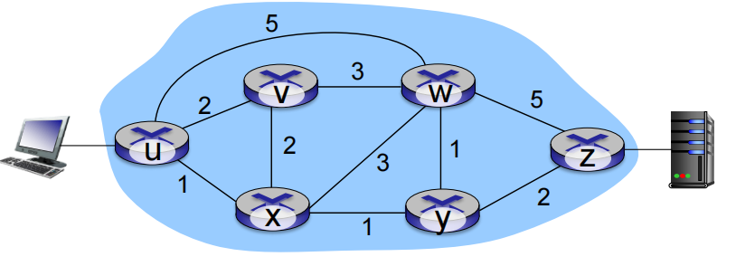

- **Q**: what if network operator wants u-to-z traffic to flow along uvwz, x-to-z traffic to flow xwyz?

  网管如果需要u到z的流量走uvwz，x到z的流量走xwyz，怎么办？

- A: 需要定义链路的代价，流量路由算法以此运算（IP路由面向目标，无法操作）（或者需要新的路由算法）

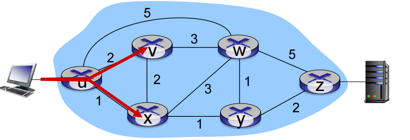

- **Q:** what if network operator wants to split u-to-z traffic along uvwz and uxyz (load balancing)?

  如果网管需要将u到z的流量分成两路：uvwz和uxyz（负载均衡），怎么办？（IP路径面向目标）

- A: 无法完成（在原有体系下只有使用心得路由选择算法，而在全网部署新的路由算法是个非常庞大的事情）

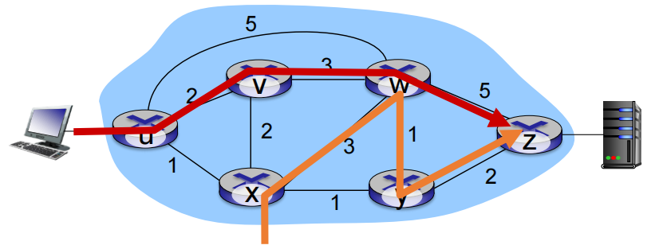

- **Q:** what if w wants to route red and orange traffic differently?

  如果 W 想要以不同的方式路由 RED 和 ORANGE 流量，该怎幺办？

- A: 无法实现（基于目标的转发，采用LS, DV路由）

### Key characteristics of SDN Architecture  SDN 架构的主要特征

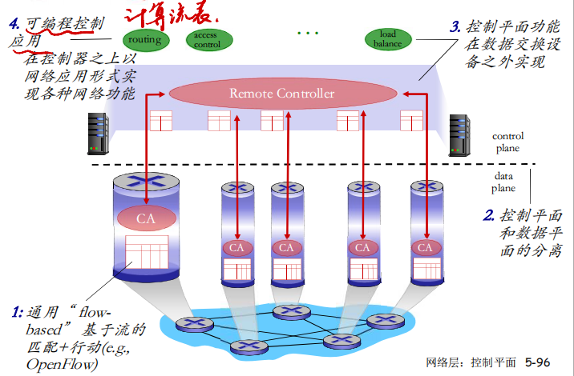

### SDN perspective: data plane switches  SDN架构：数据平面交换机

**Data plane switches**

数据平面交换机

- Fast, simple, commodity switches implementing generalized data-plane forwarding in hardware

  快速、简单的商用交换机，在硬件中实现通用数据平面转发

- Switch flow table computed, installed by controller

  交换机流表计算，由控制器安装

- API for table-based switch control (e.g., OpenFlow)

  用于基于表的开关控制的 API（例如 OpenFlow）

  - defines what is controllable and what is not

    定义什幺是可控的，什幺是不可控的

- Protocol for communicating with controller (e.g., OpenFlow)

  与控制器通信的协议（例如 OpenFlow）

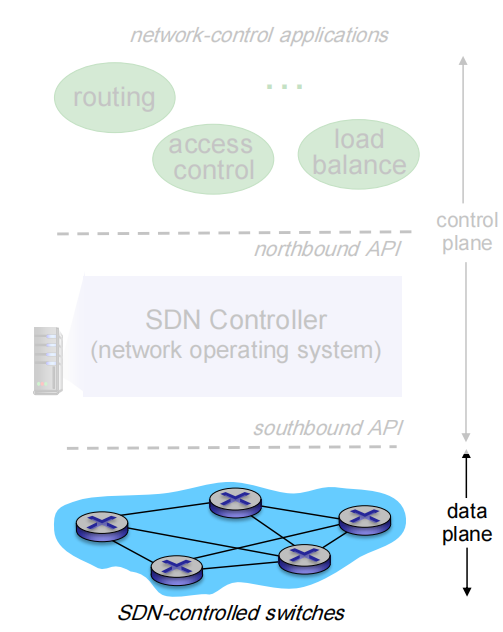

### SDN perspective: SDN controller  SDN架构：控制器

**SDN controller (network OS):** 

SDN控制器（网络OS）

- Maintains network state information

  维护网络状态信息

- Interacts with network control applications “above” via northbound API

  通过北向 API 与“上述”网络控制应用进程交互

- Interacts with network switches “below” via southbound API

  通过南向 API 与“下方”的网络交换机交互

- Implemented as distributed system for performance, scalability, fault-tolerance, robustness

  作为分布式系统实现，以实现性能、可扩展性、容错性、健壮性

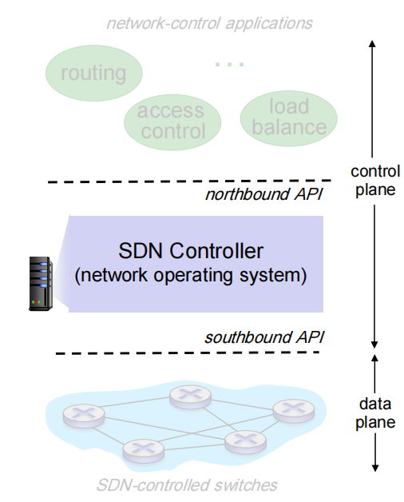

### SDN perspective: control applications SDN架构：控制应用

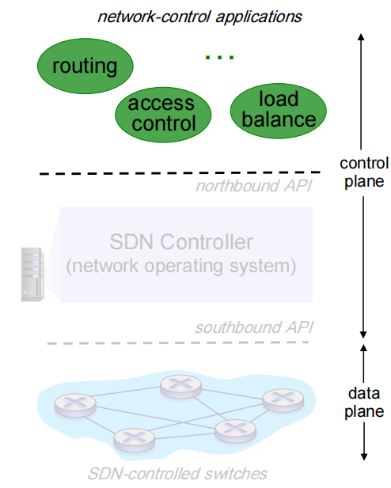

**Network-control apps:**

网络控制应用

- “**brains**” of control: implement control functions using lower-level services, API provided by SND controller

  控制的“大脑”：使用较低级别的服务实现控制功能，API 由 SND 控制器提供

  - 路由器，交换机
  - 接入控制，防火墙
  - 负载均衡

- **Open**: can be provided by 3rd party: distinct from routing vendor, or SDN controller

  非绑定：可由第三方提供：不同于路由供应商或 SDN 控制

### Components of SDN controller  SDN控制器里面的元件

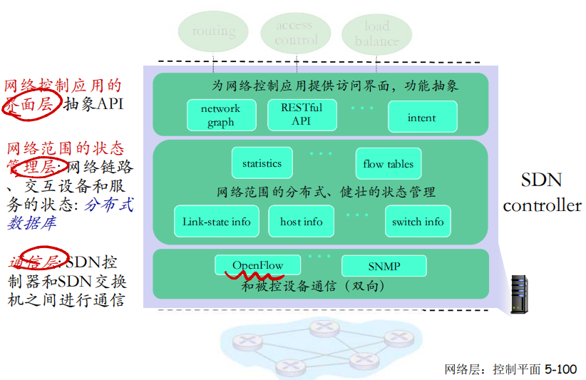

### OpenFlow 协议

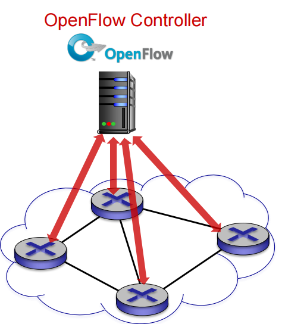

- Operates between controller, switch

  控制器和SDN交换机交互协议

- TCP used to exchange messages

  采用TCP来交换报文

  - optional encryption

    加密可选

- Three classes of OpenFlow messages:

  3种OpenFlow报文类型

  - controller-to-switch

    控制器 ＞ 交换机

  - asynchronous (switch to controller)

    异步（交换机 ＞ 控制器）

  - symmetric (misc)

    对称 

#### OpenFlow: controller-to-switch messages 控制器-交换机报文

**Key controller-to-switch messages**

一些关键的控制器到交换机的报文

- **Features:** controller queries switch features, switch replies

  特性：控制器查询交换机特性，交换机应答

- **Configure**: controller queries/sets switch configuration parameters

  配置：交换机查询、设置交换机的配置参数

- **Modify-state**: add, delete, modify flow entries in the OpenFlow tables

  修改状态：增加删除修改OpenFlow表中的流表

- **Packet-out**: controller can send this packet out of specific switch port

  控制器可以将分组通过特定的端口发出

#### **OpenFlow:** switch-to-controller messages  交换机-控制器报文

**Key switch-to-controller messages**

一些关键的交换机到控制器的报文

- **Packet-in**: transfer packet (and its control) to controller. See packet-out message from controller

  分组进入：将分组（和它的控制）传给控制器，见来自控制器的packet-out报文

- **Flow-removed**: flow table entry deleted at switch

  流移除：在交换机上删除流表项

- **Port status**: inform controller of a change on a port.

  端口状态：通告控制器端口的变化

幸运的是，网络管理员不需要直接通过创建、发送刘表来变成交换机，而是采用在控制器上app自动运算和配置

### SDN: control/data plane interaction example  SDN: 控制/数据平面交互的例子

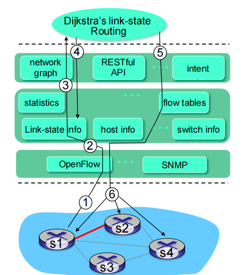

1. S1, experiencing link failure using OpenFlow port status message to notify controller

   S1 遇到链路故障，使用 OpenFlow 端口状态消息通知控制器

2. SDN controller receives OpenFlow message, updates link status info

   SDN 控制器接收 OpenFlow 消息，更新链路状态信息

3. Dijkstra’s routing algorithm application has previously registered to be called when ever link status changes. It is called.

   Dijkstra 的路由算法应用进程以前已注册为在链接状态发生变化时调用。它被称为。

4. Dijkstra’s routing algorithm access network graph info, link state info in controller, computes new routes

   Dijkstra 的路由算法访问网络图信息、控制器中的链路状态信息、计算新路由

5. link state routing app interacts with flow-table-computation component in SDN controller, which computes new flow tables needed

   链路状态路由应用进程与 SDN 控制器中的 flow-table-computation 组件交互，该组件计算所需的新流表

6. Controller uses OpenFlow to install new tables in switches that need updating

   控制器 使用 OpenFlow 在需要更新的交换机中安装新表

###  OpenDaylight (ODL) controller  ODL控制器

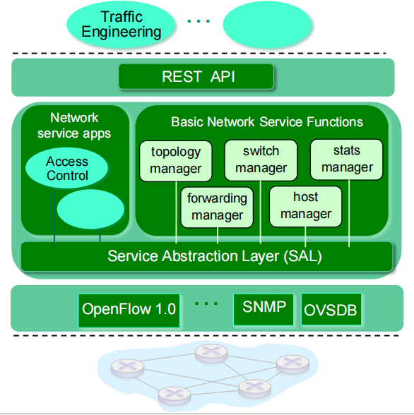

- ODL Lithium controller

  ODL 锂控制器

- Network apps may be contained within, or be external to SDN controller

  网络应用进程可能包含在 SDN 控制器内部或外部

- Service Abstraction Layer: interconnects internal, external applications and services

  服务抽象层：互连内部、外部应用进程和服务

### ONOS controller

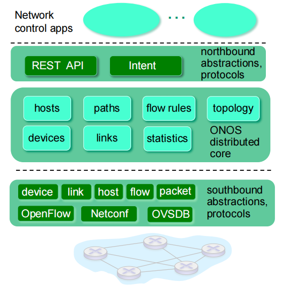

- Control apps separate from controller

  控制应用进程与控制器分开

- Intent framework: high-level specification of service: what rather than how

  意图框架：高级服务规范：什幺而不是如何

- Considerable emphasis on distributed core: service reliability, replication performance scaling

  相当重视分布式核心：用于提高服务可靠性、性能的可拓展性

### SDN面临的挑战

- 强化控制平面：可信、可靠、性能可拓展性、安全的分布式系统
  - 对于失效的鲁棒性：利用为控制平面可靠分布式系统的强大理论
  - 可信任，安全：从开始就进行铸造
- 网络、协议满足特殊任务的需求
  - c.g. 实时性、超高可靠性、超高安全性
- 互联网网络范围内的拓展性
  - 而不是仅仅在一个AS的内部部署，在全网部署

## ICMP: Internet control message protocol 网络控制信息协议

- **Used by hosts & routers to communicate network-level information**

  由主机、路由器、网关用于传送网络层控制信息

  - error reporting: unreachable host, network, port, protocol

    错误报告：主机不可到达、网络、端口、协议

  - echo request/reply (used by ping)

    Echo请求和回复（ping）

- **Network-layer “above” IP:**

  ICMP在网络层，但是是在IP协议上面的

  - ICMP msgs carried in IP datagrams

    ICMP消息由IP数据报承载

- **ICMP message**: type, code plus first 8 bytes of IP datagram causing error

  **ICMP 消息**：类型、代码加上 IP 数据报的前 8 字节导致错误

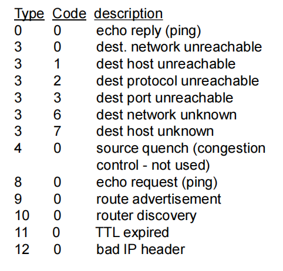

### Traceroute and ICMP  

- Source sends series of UDP segments to destination

  源将一系列 UDP 分段发送到目标

  - first set has TTL =1

    第一个：TTL=1

  - second set has TTL=2, etc.

    第二个：TTL=2, etc

  - with an unlikely dest. port number

    一个不可达的端口号

- When datagram in nth set arrives to nth router:

  当第 n 个集合中的数据报到达第 n 个路由器时：

  - router discards datagram and sends source ICMP “TTL expired” message (type 11, code 0)

    路由器抛弃数据报，然后发送一个给源的ICMP报文（type11, code0）

  - ICMP message include name of router & IP address

    报文包括了路由器的名字和IP地址

- When ICMP message arrives, source records RTTs 

  当 ICMP 消息到达时，源记录 RTT

**Stopping criteria:**  停止的判断依据

- UDP segment eventually arrives at destination host

  UDP 段最终到达目标主机

- destination returns ICMP “port unreachable” message (type 3, code 3)

  目标主机返回给源主机ICMP“端口不可达”报文

- source stops

  当源主机获得这个保温的时候，停止

## SNMP: Network Management 网络管理

自治系统（autonomous systems, aka “network”): 1000多个相互的软件和硬件部件

其他复杂系统也需要被监视和控制:

- 喷气飞机

- 核电站

“网络管理”包括了硬件、软件和人类元素的设置，综合和协调，以便监测，测试，轮询，配置，分析，评价和控制网络和网元资源，用合理的成本满足实时性，运行能和服务质量的要求；

### 网络管理的5大功能

- 性能管理：

  - 性能(利用率、吞吐量)量化、测量、报告、分析和控制不同网络部件的性能

  - 涉及到的部件：单独部件（网卡，协议实体），端到端的路径

- 故障管理：记录、检测和响应故障；

  - 性能管理为长期监测设备性能

  - 故障管理：突然发生的强度大的性能降低，强调对故障的响应

- 配置管理：跟踪设备的配置，管理设备配置信息

- 账户管理：定义、记录和控制用户和设备访问网络资源
  - 限额使用、给予使用的收费，以及分配资源访问权限

- 安全管理：定义安全策略，控制对网络资源的使用

### 网络管理结构

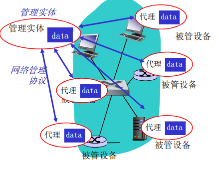

被管设备包含若干被管对象它们的数据被收集在Management Information Base (MIB)

### SNMP协议

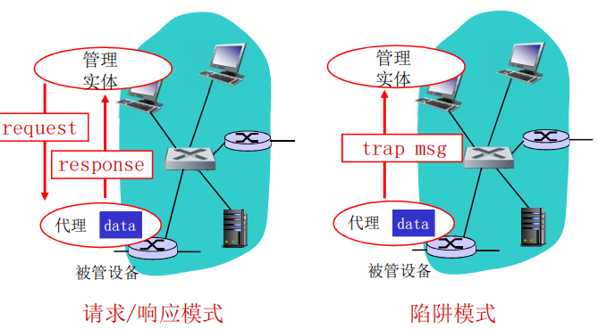

#### SNMP协议：报文类型

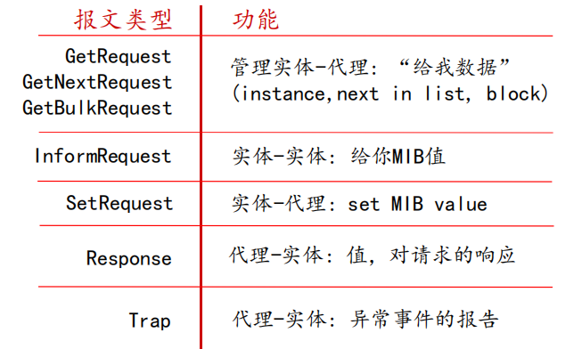

#### SNMP协议：报文协议

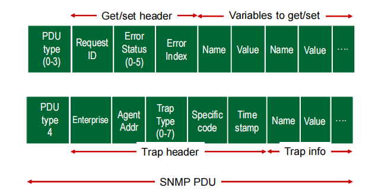

#### 总结

- 网络层控制平面的方法
  - 每个路由器控制（传统方法）
  - 逻辑上集中的控制 (software defined networking)

- 传统路由选择算法
  - 在互联网上的实现：RIP , OSPF, BGP

- SDN控制器
  - 实际中的实现：ODL, ONOS

- Internet Control Message Protocol

- 网络管理和SNMP协议
