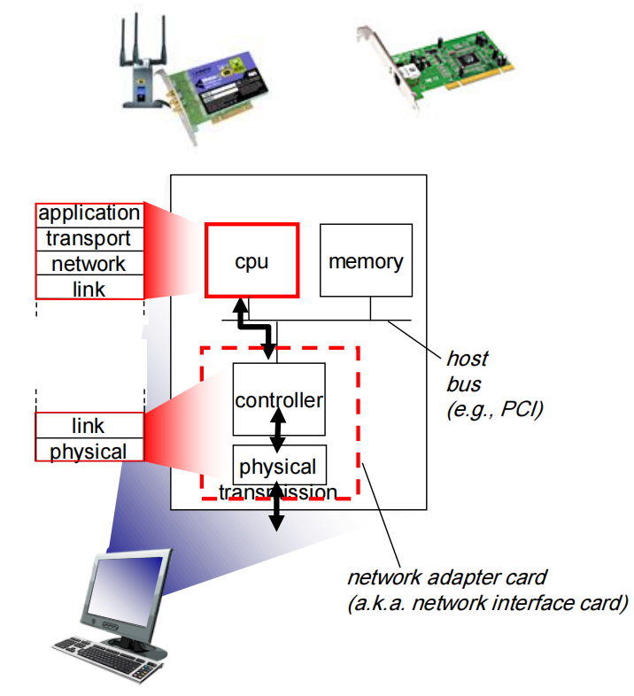
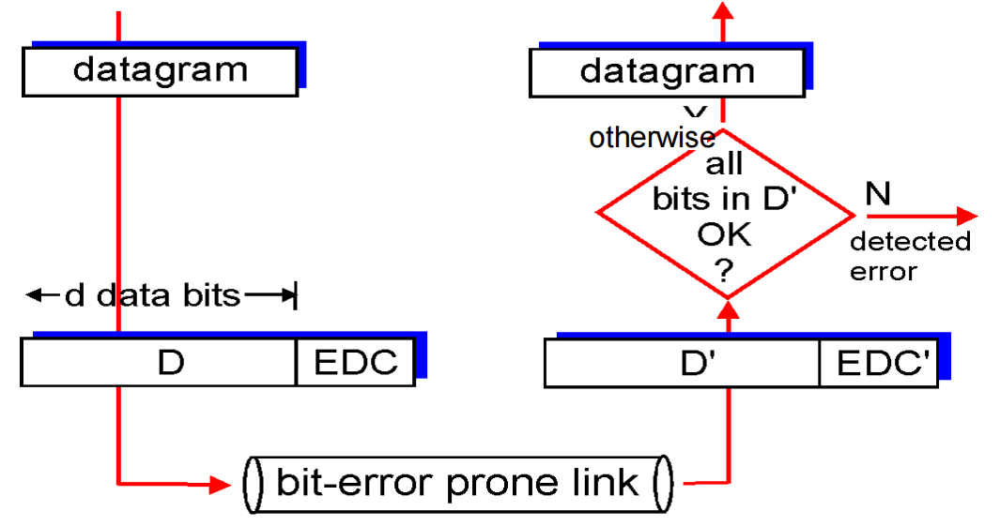
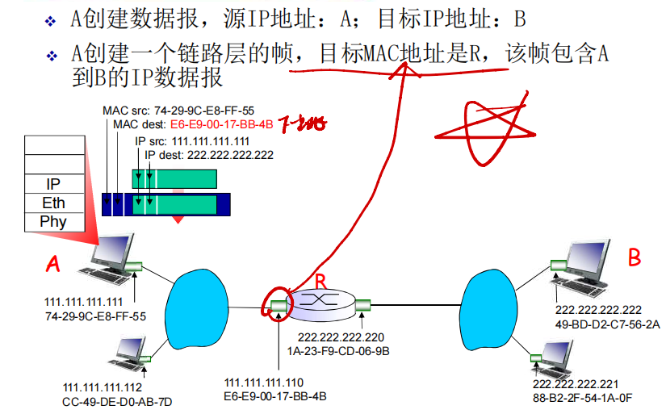
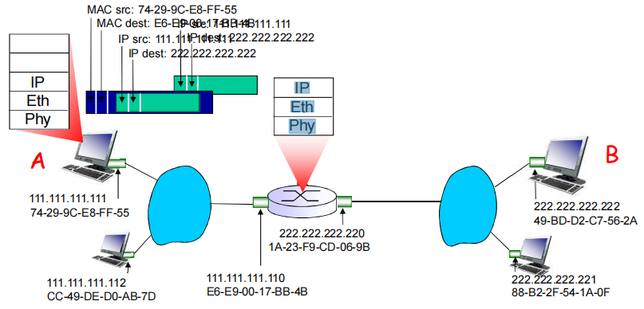

# Link Layer1 链路层

| Layers            | Data Type |
| ----------------- | --------- |
| Application Layer | Message   |
| Transport Layer   | Segment   |
| Network Layer     | Datagram  |
| Link Layer        | Frame     |
| Physical Layer    | Bit       |

## Roadmap

1. Services of link layer
2. Error detection and correction
3. Multiple access protocols
4. Addressing and ARP
5. Ethernet

## What is Link Layer 什么是链路层

### 导论

- 主机和路由器是节点（网桥和交换机也是）：**nodes**

- 沿着通信路径,连接个相邻节点通信信道的是链路：**links**

  - 有线链路

  - 无线链路

  - 局域网，共享性链路

- 第二层协议数据单元帧，封装数据报  **frame**

**数据链路层** 负责从一个节点通过链路将（帧中的）数据报发送到相邻的物理节点（一个子网内部的2节点）

- **Data-Link Layer has responsibility of**

  **数据链路层负责**

  - transferring **datagram**

    传输数据报

  - from one node to **physically adjacent** node

    从一个节点到物理上相邻的节点

  - over a link

    通过链接

- **Node:** 

  节点

  - Hosts and routers

    主机和路由器

- **Link:**

  链接

  - communication channel

    沟通渠道

  - connection adjacent nodes

    连接相邻节点

- **Layer-2 packet:** **frame**

  **第二层数据包名字：** **帧**

  - Encapsulates datagram

    封装数据报

- 数据报（分组）在不同的链路上以不同的链路协议传送：
  - 第一跳链路：以太网
  - 中间链路：帧中继链路
  - 最后一跳802.11 :
- 不同的链路协议提供不同的服务
  - e.g.,比如在链路层上提供（或没有）可靠数据传送

传输类比

- 从Princeton到Lausanne

  - 轿车: Princeton to JFK

  - 飞机: JFK to Geneva

  - 火车: Geneva to Lausanne

- 旅行者=数据报datagram

- 交通段=通信链路 communication link

- 交通模式=链路层协议 : 数据链路层和局域网 protocol

- 票务代理=路由算法 routing algorithm

## Link Layer Service 链路层服务

- **Framing**

  成帧，链路接入

  - Encapsulate datagram into frame: adding header, trailer

    将数据报封装到帧中：添加帧头和帧尾

  - Different formats for different protocols

    不同方案的不同规格

- **Link access**

  **链接访问**

  - Medium Access Control (MAC) protocol is used to transmit a frame

    介质访问控制 （MAC） 协议用于传输帧

  - Point to point link or broadcast link

    点对点链路或广播链路

  - MAC addresses used in frame to identify source and destination

    帧中用于标识源和目标的 MAC 地址

    - MAC address vs. IP address

      MAC 地址与 IP 地址并不相同

- **Reliable delivery (RD)**

  **可靠交付 （RD）**

  - Low bit-error link (fiber, coax, some twisted pair): RD seldom used

    低误码链路（光纤、同轴电缆、某些双绞线）：RD 很少使用

    - 出错率低，没有必要在每一个帧中做差错控制的工作，协议复杂

      - 发送端对每一帧进行差错控制编码，根据反馈做相应的动作

      - 接收端进行差错控制解码，反馈给发送端（ACK，NAK）

  - High error rates wireless links: RD often used

    高错误率无线链路：经常使用 RD

    - Q: 为什么要在采用无线链路的网络上，链路层做可靠数据传输工作；还要在传输层做端到端的可靠性工作？
    - A: 原因：出错率高，如果在链路层不做差错控制工作，漏出去的错误比较高；到了上层如果需要可靠控制的数据传输代价会很大
      - 如不做local recovery 工作，总体代价大

  - Recall which protocol on which layer also provides reliability?

    回想一下哪个层上的哪个协议也提供可靠性？

    - 传输层

- **Error detection and correction**

  **错误检测和纠正**

  - Error caused by signal attenuation, noise…

    信号衰减、噪声等引起的误差

    - 接收方检测出的错误: 
      - 通知发送端进行重传或丢弃帧

  - Receiver detects error: retransmission or correction

    接收方检测到错误：重传或更正

  - Correction: corrects the bit error without retransmission

    纠错：纠正比特错误而不重传

- 流量控制：
  - 使得相邻的发送和接收方节点的速度匹配
- 半双工和全双工:
  - 半双工：链路可以双向传输，但一次只有一个方向

### Where is the link layer implemented?  链路层在哪里实现？

- **In each and every host**

  - 在每一个主机上

  - 也在每个路由器上
  - 交换机的每个端口上

- **Link layer implemented in “Adapter” or on a chip**

  链路层功能在“**适配器”**上实现 (aka network interface card NIC) 或者在一个芯片组上

  - Ethernet card, Wifi 802.11 card, orchipset

    以太网卡，802.11 网卡; 以太网芯片组

  - For link and physical layers

    实现链路层和相应的物理层功能

- **Attached into host’s system (motherboard) buses**

  接到主机的系统总线上

  - USB / PCI / Thunderbolt …

- **Hardware / software / firmware**

  硬件、软件和固件的综合体

### Adaptors communicating  适配器通信

- Sending side:

  发送方:

  - Encapsulates datagram in frame

    在帧中封装数据报

  - Adds error checking bits, rdt, flow control, etc.

    加上差错控制编码，实现RDT和流量控制功能等

- Receiving side

  接收方

  - Looks for errors, rdt, flow control, etc.

    检查有无出错，执行rdt和流量控制功能等

  - Extracts datagram, passes to upper layer at receiving side

    解封装数据报，将至交给上层

## Error detection and correction 错误检测与纠正

### Error detection 错误检测

**D = Data protected by error checking, including header fields**

D =数据由差错检测保护，可以包含头部字段

**EDC= Error Detection and Correction bits (redundancy)**

EDC=差错检测和纠正位（冗余位）

- **Error detection not 100% reliable!**

  错误检测不是100%可靠的!

  - protocol may miss some errors, but rarely

    协议会漏检一些错误，但是很少

  - larger EDC field (more sophisticated) yields better detection and correction (but any problem?)

    更长的EDC字段可以得到更好的检测和纠正效果

### Three techniques for detecting errors 检测错误的三种技术

- **Parity Checks** 

  **奇偶校验**

  - basic ideas

    基本思路

- **Checksum** 

  **校验和**

  - used in transport layer

    用于传输层

- **Cyclic Redundancy Checks (CRC)** 

  **循环冗余校验 （CRC）**

  - used in link layer in an adapter

    用于适配器中的链路层

### Parity checking 奇偶校验

#### Single bit parity 单比特校验

- **Even/Odd parity scheme:**

  **偶数/奇数平价方案：**

  - Add an additional bit 

    添加其他位

  - Total number of 1 (D+1) is even/odd

    总数 1 （D+1） 为偶数/奇数

  - 奇校验（Odd Parity）
    奇校验要求数据中的“1”的总数为奇数。如果原始数据中的“1”个数是偶数，校验位就设为1，以保证总数变为奇数；如果原始数据中的“1”个数是奇数，校验位设为0，表示已经满足条件，不需要额外调整。

    - **奇校验**：
      1. 数据 `1010` 中有两个“1”。
      2. 奇校验要求“1”的个数为奇数，而这里的“1”个数为2（偶数），所以需要将校验位设置为**1**，使总“1”的个数变为奇数。
      3. 添加校验位后，数据变为 `10101`。

  - 偶校验（Even Parity）
    偶校验要求数据中的“1”的总数为偶数。如果原始数据中的“1”个数是奇数，校验位就设为1，以使总数变为偶数；如果原始数据中的“1”个数是偶数，校验位设为0。

    - **偶校验**：
      1. 数据 `1010` 中有两个“1”。
      2. 偶校验要求“1”的个数为偶数，这里的“1”个数已经是偶数，因此校验位设置为**0**。
      3. 添加校验位后，数据变为 `10100`。

- **Detect single bit errors**

  **检测单位错误**

  (图像左侧是一维的)

通过交叉判断结果是否满足parity bit

#### 2D parity 二维比特校验

- Detect and correct  single bit errors

  检测并纠正单位错误

- Two-dimensional  even parity

  二维偶校验

### Checksum 校验和

- **Goal: detect “errors” in transmitted segment** 

  目标：检测传输的区段中的“错误”

- Sender:

  - Treat segment contents, including header fields, as sequence of 16-bit integers

    将区段内容（包括标头字段）视为 16-bit 整数串行

  - Checksum: addition (one’s complement sum) of segment contents

    校验和：句段内容的添加（1 的补码和）

  - Sender puts checksum value into (e.g., UDP) checksum field 

    发件人将校验和值放入（例如 UDP）校验和字段

- Receiver

  - Compute checksum of received segment

    计算接收的 segment 的校验和

  - Check if computed checksum  equals checksum field value:

    检查计算的校验和是否等于校验和字段值：

    - NO - error detected

      未检测到错误

    - YES - no error detected. But maybe errors nonetheless?

      是，未检测到错误。但也许还是有错误？

In the TCP and UDP protocols, the Internet checksum is computed over all fields (header and data fields included). In IP, the checksum is computed over the IP header (since the UDP or TCP segment has its own checksum).

在 TCP 和 UDP 协议中，Internet 校验和是针对所有字段（包括 header 和 data 字段）计算的。在 IP 中，校验和是通过 IP 标头计算的（因为 UDP 或 TCP 分段有自己的校验和）。

#### Internet checksum: 1s complement  网络校验和：1 的补码

**Example: add two 16-bit integers**

**示例：添加两个 16 位整数**

### Cyclic redundancy check (CRC)   循环冗余校验

- more powerful error-detection coding

  更强大的错误检测编码

- widely used in practice (Ethernet, 802.11 WiFi, ATM)

  在实践中得到广泛应用（以太网、802.11 WiFi、ATM）

- all CRC calculations are done in modulo-2 arithmetic (without carries in addition or borrows in subtraction).

  所有 CRC 计算均以模 2(也就是求余数) 算术完成（没有进位加法或借款减法）。

- modulo-2 Arithmetic

  modulo-2 算术

  - Bitwise exclusive-or (XOR) 异或

- **view Data bits, D, as a binary number**

  将数据比特 D, 看成是二进制的数据

- **choose an r+1 bit pattern (generator), G,**

   生成多项式G：双方协商r+1位模式（r次方）

  - both sender and receiver agree on that

    生成和检查所使用的位模式

- **goal: find r CRC bits, (remainder), R, such that**

  目标:选择r位 CRC附加位R，使得

  - a d+r bit pattern <D, R> exactly divisible by G (modulo-2)

    d+r 位模式  能被 G 整除（模数 2）（发送方的<D, R>）

- **receiver knows G, divides <D, R> by G.** 

  接收者知道 G，将  除以 G。

  - if non-zero remainder: error detected!

    如果余数不是0：检测到错误！

  - can detect all burst errors less than r + 1 bits

    可以检测小于 R + 1 位的所有突发错误

NOTE: 

**G** is given for both sender and receiver. The most significant (leftmost) bit of *G* must be 1

**G** 用于发送方和接收方。*G* 的最高有效（最左侧）位必须为 1

**R** needs to be computed by the sender.

**R** 需要由发送方计算。

### CRC例子

**Want:**

D * 2^r XOR R = nG

**Equivalently:**

D * 2^r = nG XOR R 

**Equivalently:**

if we divide D * 2^r by G, want remainder R to satisfy:

D * 2^r XOR R => D * 2^r = nG XOR R

## Multiple access protocols  多种访问协议

### Multiple access links, protocols    多路访问链路和协议

多路访问的方式多应用于局域网LAN，而不是广域网WAN。

- **Two types of links:**

  **两种链接方式：**

  - Point to point

    点对点

    - PPP for dial-up access

      用于拨号访问的 PPP

    - PPPOE: Point to point protocol over Ethernet

      PPPOE：以太网上的点对点协议

  - Broadcast: shared wire or medium

    广播：共享有线或介质

    - Old-fashioned Ethernet

      老式以太网

    - Uptream HFC

      HFC上行链路

    - WLAN – 802.11

      802.11无线局域网

### Multiple access protocols  多路访问协议

- **One single shared broadcast channel** 

  单个共享的广播型链路

- **Two or more simultaneous transmissions by nodes: interference干扰** 

  2个或更多站点同时传送: interference干扰

  - *collision* if node receives two or more signals at the same time

    *冲突*： 如果节点同时接收到两个或多个信号

    - in a sense, the signals of the colliding frames become inextricably tangled together.all the frames involved in the collision are lost, and the broadcast channel is wasted during the collision interval.

      从某种意义上说，冲突帧的信号变得密不可分地纠缠在一起，冲突中涉及的帧全部丢失，广播频道在冲突间隔期间被浪费。

**Multiple access protocol**

多路访问协议（介质访问控制协议：**MAC**）

- **Distributed algorithm that determines how nodes share channel, i.e., determine when node can transmit**

  **决定节点如何共享信道的分布式算法，即决定节点何时可以传输**

- **Communication about channel sharing must use channel itself!** 

  **关于信道分享的沟通必须使用信道本身**

  - No out-of-band channel for coordination

    没有用于协调的带外信道

### An ideal multiple access protocol  理想的多路访问协议

- **given: broadcast channel of rate R bps**

  给定：Rbps的广播信道

  Desiderata (desirable characteristics) 理想的特性:

  1. when one node wants to transmit, it can send at rate R.

     当一个节点想要传输时，它可以以 R 速率发送。

  2. when M nodes want to transmit, each can send at average (and instantaneous) rate R/M.

     当 M 个节点想要传输时，每个节点都可以以平均（和瞬时）速率 R/M 发送。

  3. fully decentralized:

     完全去中心化：

     - no special node to coordinate transmissions

       没有专门的节点来协调传输

     - no synchronization of clocks, slots

       没有 clocks、slots 的同步

  4. Simple, inexpensive to implement.

     实施简单、成本低廉。

### MAC protocols: taxonomy  MAC（媒体访问控制）协议：分类

**Three broad classes:**

**三大类：**

- **Channel partitioning**

  **通道分区**

  - divide channel into smaller “pieces” (time slots, frequency, code)

    将频道分成更小的 “块” （时隙、频率、代码）

  - allcate piece to node for exclusive use

    分配片给每个节点专用

- **Random access**

  **随机访问**

  - channel not divided, allow collisions

    信道不划分，允许冲突

  - “ recover ” from collision

    从碰撞中 “ 恢复 ”

- **“ Taking turns”**

  **“轮流”**

  - nodes take turns, but nodes with more to send can take longer turns

    节点轮流发送，但要发送更多节点的节点可能需要更长的轮次

### Channel partitioning MAC protocols  信道划分MAC协议

#### TDMA

**TDMA: time division multiple access**

TDMA：时分多址

- Access to channel in "rounds" 

  轮流使用信道，信道的时间分为周期

- Each station/node gets fixed length slot (length = packet transmission time) in each round 

  每个站点使用每周期中固定的时隙(长度=帧传输时间)传输帧

- Unused slots go idle 

  如果站点无帧传输，时隙空闲 ---> 浪费

- Example: 6-station LAN, 1,3,4 have packets to send, slots 2,5,6 idle

  如：6站LAN，1、3、4有数据报，时隙2、5、6空闲

#### FDMA

**FDMA: frequency division multiple access**

FDMA：频分多址

- Channel spectrum divided into frequency bands

  信道的有效频率范围被分成一个个小的频段

- Each station/node assigned fixed frequency band

  每个站点被分配一个固定的频段

- Unused transmission time in frequency bands go idle 

  分配给站点的频段如果没有被使用，则空闲

- Example: 6-station LAN, 1,3,4 have packet to send, frequency bands 2,5,6 idle

  例如：6站LAN，1、3、4有数据报，频段2、5、6空闲

### Random access protocols   随机访问协议

- **When node has packet to send**

  **当节点有要发送的数据包时**

  - transmit at full channel data rate R.

    以全信道数据速率 R 传输。

  - no *a priori* coordination among nodes

    节点之间没有先验协调

- **Two or more transmitting nodes ➜ “collision” ,**

  **两个或多个传输节点 ➜ “碰撞” ，**

- **Random access MAC protocol** specifies: 

  随机访问 MAC 协议指定：

  - how to detect collisions

    如何检测冲突

  - how to recover from collisions (e.g., via delayed retransmissions)

    如何从冲突中恢复（例如，通过延迟重传）

- **Examples of random access MAC protocols:**

  **随机访问 MAC 协议示例：**

  - slotted ALOHA

    时隙 ALOHA

  - ALOHA

  - CSMA, CSMA/CD, CSMA/CA

#### 时隙ALOHA

- 假设

  - 所有帧是等长的

  - 时间被划分成相等的**时隙**，每个时隙可发送一帧

  - 节点只在时隙开始时发送帧

  - 节点在时钟上是同步的

  - 如果两个或多个节点在一个时隙传输，所有的站点都能检测到冲突

- 运行

  - 当节点获取新的帧，在下一个时隙传输

  - 传输时没有检测到冲突，成功

  - 节点能够在下一时隙发送新帧

  - 检测时如果检测到冲突，失败

  - 节点在每一个随后的时隙以概率p重传帧直到成功

- 优点

  - 节点可以以信道带宽全速连续传输

  - 高度分布：仅需要节点之间在时隙上的同步

  - 简单

- 缺点

  - 存在冲突，浪费时隙

  - 即使有帧要发送，仍然有可能存在空闲的时隙

  - 节点检测冲突的时间<帧传输的时间

  - 必须传完

  - 需要时钟上同步

#### 纯ALOHA的效率

P(指定节点成功) = P(节点传输) * P(其它节点在[t0-1, t0]不传) * P(其它节点在[t0, t0+1不传]  = p * (1-p)N-1 * (1-p)N-1 = p * (1-p)2(N-1)

选择最佳的p、N趋向无穷大...

= 1/(2e) = 17.5% 

效率比时隙ALOHA更差了!

#### CSMA (carrier sense multiple access)  运营商侦听多址

CSMA: listen before transmit: if channel sensed idle: transmit entire frame

先听后传输： 如果信道感应到 Idle： 传输整帧

- if channel sensed busy, defer transmission

  如果 channel 感应到信道中正在传输别人的信息，则延迟传输

- Human analogy: don’t interrupt others!

  人类的类比：不要打断别人！

### “Taking turns” MAC protocols

- **Polling:**

  - Master node “invites” slave nodes to transmit in turn

    主节点 “邀请” 从节点依次传输

  - Typically used with “dumb” slave devices

    通常与 “dumb” 从设备一起使用

  - Drawbacks:

    缺点：

    - Polling overhead 

      轮询开销

    - Single point of failure (master)

      单点故障 （主）

- **Token passing:**

  token传递

  Control **token** passed from one node to next sequentially.

  控制 **token** 按顺序从一个节点传递到下一个节点。

  - Token message

  - Drawbacks:

    - Token overhead 

      token开销

    - Node crashes/fails to release token

      节点崩溃/无法释放 Token

### **Summary of** **MAC** protocols 总结

多点接入问题：对于一个共享型介质，各个节点如何协调对它的访问和使用?

- **Channel partitioning, by time, frequency or code**

  **频道分区，按时间、频率或代码**

  - Time Division, Frequency Division

- **Random access (dynamic),** 

  **随机访问（动态）**

  - ALOHA, S-ALOHA, CSMA, CSMA/CD

  - Carrier sensing: easy in some technologies (wire), hard in others (wireless)

  - CSMA/CD used in Ethernet

  - CSMA/CA used in 802.11

- **Taking turns**

  **轮流**

  - Polling from central site, token passing

  - Bluetooth, FDDI, token ring 

## Addressing and ARP  

### MAC addresses and ARP MAC地址和ARP

- **IP address**

  - IPv4 (32 bits) and IPv6 (128 bits)

  - Network-layer address

  - Layer-3 forwarding

- **MAC (LAN) address**

  LAN（MAC/物理/以太网）地址:

  - 48 bits (e.g., 12-34-56-78-90-AB)

    - hexadecimal (base 16) notation (each “numeral” represents 4 bits)

      十六进制（以 16 为基数）表示法（每个“数字”代表 4 位）48bit MAC地址固化在适配器的ROM，有时也可以通过软件设定

  - Burned in NIC ROM

  - Used “locally” get frame from one interface to another physically-connected interface (same network, in IP-addressing sense)

    使用从一个接口到另一个物理连接接口的“本地”获取帧（同一网络，在 IP 寻址意义上）

  - 理论上全球任何2个网卡的MAC地址都不相同

IP地址和MAC地址的作用不同

1. IP地址是分层的

   - **一个子网所有站点网络号一致**，路由聚集，减少路由表

   - 需要一个网络中的站点地址网络号一致，如果捆绑需要定制网卡非常麻烦

   - 希望网络层地址是配置的；**IP地址完成网络到网络的交付**

2. mac地址是一个平面的
   - 网卡在生产时不知道被用于哪个网络，因此给网卡一个唯一的标示，**用于区分一个网络内部不同的网卡即可**
   - 可以完成一个物理网络内部的节点到节点的数据交付

3. 分离好处

   - **网卡坏了，ip不变，可以捆绑到另外一个网卡的mac上**

   - **物理网络还可以除IP之外支持其他网络层协议**，链路协议为任意 上层网络协议， 如IPX等

4. 捆绑的问题

   - 如果仅仅使用IP地址，不用mac地址，那么它仅支持IP协议

   - 每次上电都要重新写入网卡 IP地址；

   - 另外一个选择就是不使用任何地址；不用MAC地址，则每到来一个帧都要上传到IP层次，由它判断是不是需要接受，干扰一次

Each adapter on LAN has unique **LAN** address  LAN 上的每个适配器都有唯一的**LAN**地址

Broadcast address广播地址 = FF-FF-FF-FF-FF-FF

- **MAC address allocation administered by IEEE**

  **由 IEEE 管理的 MAC 地址分配**

- Manufacturer buys portion of MAC address space (to assure uniqueness)

  制造商购买部分 MAC 地址空间（以确保唯一性）

- MAC flat address ➜ portability 

  MAC 平面地址 ➜ 支持移动

  - Can move LAN card from one LAN to another

    可以将 LAN 卡从一个 LAN 移动到另一个 LAN

  - IP hierarchical address not portable

    IP 分层地址不可移植

    - IP Address depends on IP subnet to which node is attached

      IP 地址 取决于节点连接到的 IP 子网

- **Analogy for understanding:**

  **类比理解：**

  - MAC address: like ID card or passport Number

    MAC 地址：如身份证或护照号码

  - IP address: like postal address

    IP 地址：如邮政地址

### ARP: address resolution protocol  地址解析协议

**How to determine interface’s MAC address, if knowing its IP address?**

如果知道接口的 IP 地址，如何确定接口的 MAC 地址？

- ARP table: each IP node (host, router) on LAN has the table

  ARP 表：LAN 上的每个 IP 节点（主机、路由器）都有APR表

  - An IP-to-MAC address mappings for LAN nodes: 

    LAN 节点的 IP 到 MAC 地址映射:

    - < IP address; MAC address; TTL>

      < IP 地址;MAC地址;TTL格式>

  - A TTL (Time To Live): time after which address mapping will be forgotten (typically 20 min)

    A TTL （Time To Live）：忘记地址映射的时间（通常为 20 分钟）

Notice that an ARP table is not necessary to contain an entry for every host and router on the subnet; some may have neverbeen entered into the table, and others may have expired.

请注意，ARP 表不必包含子网上每个主机和路由器的条目;有些可能从未输入到表中，而另一些可能已过期。

### ARP protocol: forwarding in the same LAN   ARP 协议：在同一LAN中转发

- A wants to send datagram to B

  A 想向 B 发送数据报

  - B’s MAC address not in A’s ARP table.

    B 的 MAC 地址不在 A 的 ARP 表中。

- A **broadcasts** ARP query packet, containing B's IP address 

  A **广播** ARP 查询报文，包含 B 的 IP 地址

  - Destination MAC address = FF-FF-FF-FF-FF-FF

    广播 MAC 地址 = FF-FF-FF-FF-FF-FF

  - All nodes on LAN receive ARP query 

    LAN 上的所有节点都会收到 ARP 查询

- B receives ARP packet, replies to A with its (B's) MAC address

  B 接收 ARP 数据包,用其(B 的) MAC 地址回复 A

  - Frame sent to A’s MAC address (unicast)

    发送到 A 的 MAC 地址的帧（单通告）

- A caches (saves) IP-to-MAC address pair in its ARP table (until information becomes old or times out) 

  在其 ARP 表中缓存（保存）IP 到 MAC 地址对（直到信息变旧或超时）

  - Soft state: information that times out (goes away) unless refreshed

    Soft state：除非刷新，否则超时 （消失） 的信息

- ARP is “plug-and-play” :

  ARP 是“即插即用”的：

  - Nodes create their ARP tables automatically without intervention from net administrator

    节点会自动创建其 ARP 表，而无需 net 管理员的干预

### Addressing: routing to another LAN  编址：路由到其他LAN

Walkthrough :发送数据报：由A通过R到B，假设A知道B的IP地址

- Focus on addressing – at IP (datagram) and MAC layer (frame)

  专注于寻址 - 在IP(数据报)和MAC层(帧)

  - Assume A knows IP address of first hop router, R (how?)

    假设 A 知道第一跳路由器 R 的 IP 地址（如何？）DHCP（动态主机配置协议）

  - Assume A knows R’s MAC address (how?)

    假设 A 知道 R 的 MAC 地址（如何？）ARP

  - And how does R obtain B’s MAC address?

    而 R 是如何获取 B 的 MAC 地址的呢？ARP

- 在R上有两个ARP表，分别对应两个LAN
- 在源主机的**路由表**中，发现到目标主机的下一跳是111.111.111.110 （IP）
- 在源主机的**ARP表**中，发现其MAC地址是E6-E9-00-17-BB-4B, etc （MAC）

- 帧从A发送到R

- 帧被R接收到，从中提取出IP分组，交给上层IP协议实体

  - 提取出来的是

    - IP src: 111.111.111.111

      IP dest: 222.222.222.222

  - 发送的帧中

    - MAC src: 74-29-9C-E8-FF-55
    - MAC dest: E6-E9-00-17-BB-4B
    - IP src: 111.111.111.111
    - IP dest: 222.222.222.222

- R转发数据报，数据报源IP地址为A，目标IP地址为B

- R创建一个链路层的帧，目标MAC地址为B，帧中包含 A到B的IP 数据报

- 源IP地址，目标IP地址始终不变

## Ethernet  以太网

- 目前最主流的LAN技术：98%占有率
- 廉价：30元RMB 100Mbps！
- 最早广泛应用的LAN技术
- 比令牌网和ATM网络简单、廉价
  - 带宽不断提升：10M, 100M, 1G, 10G

### physical topology  物理拓扑

- **Bus:** **popular through mid 90s**

  总线：在上个世纪90年代中期很流行

  - All nodes in same collision domain (can collide with each other)

    所有节点在一个碰撞域内，一次只允许一个节点发送

  - 可靠性差，如果介质破损，截面形成信号的反射，发送节点误认为是冲突，总是冲突

- **Star:** **prevails today**

  星型：目前最主流

  - Active *switch* in center

    现在一般是交换机在中心

  - 连接选择: hub 或者 switch

  - Each “spoke” runs a (separate) Ethernet protocol (nodes do not collide with each other)

    每个节点以及相连的交换机端口使用（独立的）以太网协议（不会和其他节点的发送产生碰撞）

### Ethernet frame structure  以太网结构

- Sending adapter encapsulates IP datagram (or other network layer protocol packet) in **Ethernet frame**

- preamble: 8-byte

  前导码：8 字节

  - 7 bytes with pattern 10101010 followed by one byte with pattern 10101011

    7 个字节，带模式 10101010，后跟 1 个字节，带 10101011

  - used to synchronize receiver, sender clock rates

    用于同步接收器、发送器时钟速率

    - 使得接收方将自己的时钟调到发送端的时钟
    - 从而可以按照发送端的时钟来接收所发送的帧

- **Addresses**: 6 byte source, destination MAC addresses

  地址：6字节源MAC地址，目标MAC地址

  - If adapter receives frame with matching destination address, or with broadcast address (e.g. ARP packet), it passes data in frame to network layer protocol

    如：帧目标地址=本站MAC地址，或是广播地址，接收，递交帧中的数据到网络层

  - Otherwise, adapter discards frame

    否则，适配器忽略该帧

- **Type**: indicates higher layer protocol (mostly IP but others possible, e.g., Novell IPX, AppleTalk)

  类型：指出高层协议(大多情况下是IP，但也支持其它网络层协议Novell IPX和AppleTalk)

- **CRC**: cyclic redundancy check at receiver

  CRC：在接收方校验

  - Error detected: frame is dropped

    如果没有通过校验，丢弃错误帧

### Ethernet: unreliable, connectionless  以太网：无连接、不可靠的服务

- **Connectionless**: no handshaking between sending and receiving NICs 

  无连接：帧传输前，发送方和接收方之间没有握手

- **Unreliable**: receiving NIC doesn't send acks or nacks to sending NIC

  不可靠：接收方适配器不发送ACKs或NAKs给发送方

  - Data in dropped frames recovered only if initial sender uses higher layer rdt (e.g., TCP), otherwise dropped data lost

    仅当初始发送方使用更高层 rdt（例如 TCP）时，才会恢复丢弃帧中的数据，否则丢弃的数据会丢失

    - 递交给网络层的数据报流可能有gap

    - 如上层使用像传输层TCP协议这样的rdt，gap会被补上(源主机，TCP实体)

    - 否则，应用层就会看到gap

- Ethernet’s MAC protocol: unslotted **CSMA/CD with binary backoff (using with sensing channel idle)**

  以太网的MAC协议：采用**二进制退避的CSMA/CD介质访问控制形式**

### 802.3 Ethernet standards: link & physical layers  802.3 以太网标准：链路和物理层

- **Many different Ethernet standards**

  **许多不同的以太网标准**

  - Common MAC protocol and frame format

    常见的 MAC 协议和帧格式

  - Different speeds: 2 Mbps, 10 Mbps, 100 Mbps, 1Gbps, 10 Gbps, 40 Gbps

    不同的速度：2 Mbps、10 Mbps、100 Mbps、1Gbps、10 Gbps、40 Gbps

  - Different physical layer media: fiber, cable

    不同的物理层介质：光纤、光缆

## MAC和IP区别

1. **发送方局域网内（交换机发挥作用）**：
   - **步骤1**：发送方设备（比如一台电脑）准备发送数据。
   - **步骤2**：发送方设备将数据封装成帧（Frame），并在帧中包含接收方设备的MAC地址（如果在同一局域网内）。
   - **步骤3**：发送方设备将帧发送到本地网络中的交换机。
   - **步骤4**：交换机查看帧的目的地MAC地址，并使用其MAC地址表来确定应该将帧转发到哪个端口。如果接收方设备在同一局域网内，交换机会将帧直接转发到接收方设备。
2. **发送方局域网到接收方局域网的传输（路由器发挥作用）**：
   - **步骤5**：如果接收方设备不在发送方的局域网内，交换机会将帧转发到发送方局域网的默认网关，即路由器的一个接口。
   - **步骤6**：路由器接收到帧后，解封装查看IP数据包的目的地IP地址。
   - **步骤7**：路由器使用其路由表来确定下一跳地址，即如何将数据包发送到接收方所在的局域网。
   - **步骤8**：路由器将IP数据包封装成帧，并发送到下一个路由器或直接发送到接收方所在的局域网。
3. **接收方局域网内（交换机发挥作用）**：
   - **步骤9**：当数据包到达接收方所在的局域网时，如果路由器直接连接到接收方局域网，路由器会将数据包解封装成帧。
   - **步骤10**：路由器查看帧的目的地MAC地址，并使用ARP（如果需要）来解析最终目的地设备的MAC地址。
   - **步骤11**：路由器将帧转发到接收方设备所在的端口。
   - **步骤12**：接收方设备检查帧的目的地MAC地址，如果匹配，就接收该帧，并处理帧内的数据包
