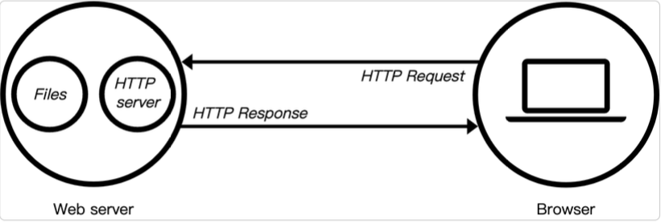
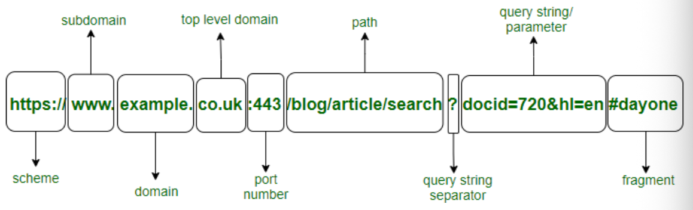
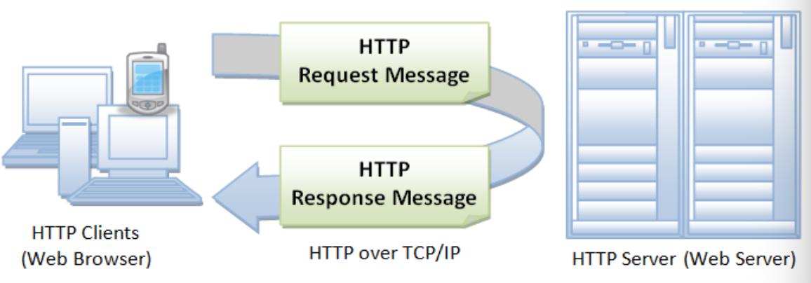
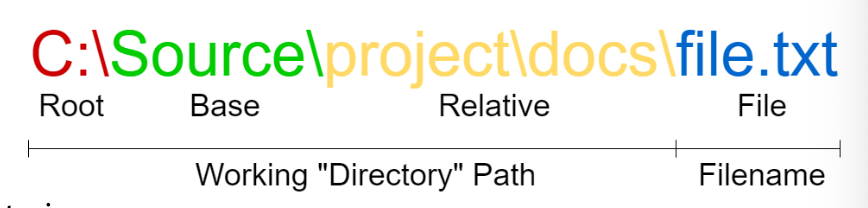
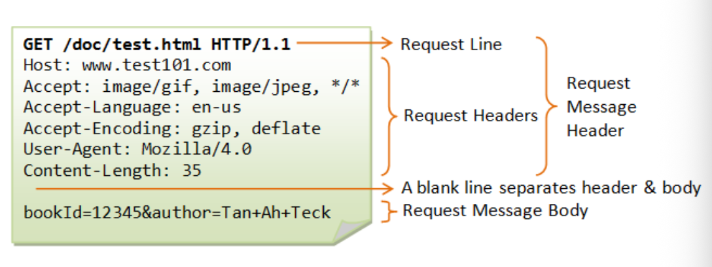
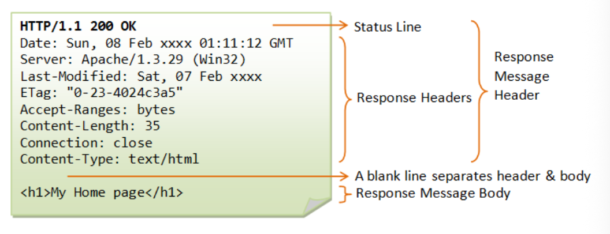
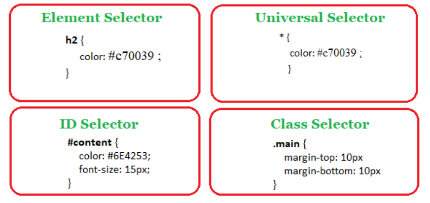
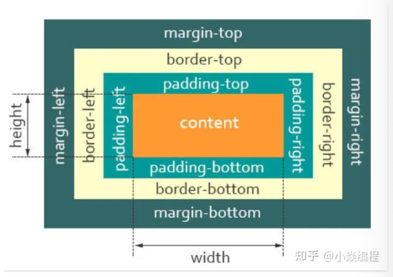

# 1 Introduction to Web Technology

## 知识图谱

```plaintext
Lec01 Introduction to Web Technology
├── 1. Web 与 E-commerce 的关系
│   ├── E-commerce = online buying / selling
│   ├── 常见入口
│   │   ├── Mobile APP
│   │   └── Web page on PC
│   └── Web 技术是电商系统的基础
│
├── 2. Client-Server 模式
│   ├── Client 客户端
│   │   ├── 通常是 Web Browser
│   │   ├── 发送 request
│   │   └── 接收 response 并渲染网页
│   │
│   └── Server 服务器端
│       ├── 接收 request
│       ├── 找到或生成对应资源
│       └── 返回 response
│
├── 3. HTTP 协议
│   ├── HyperText Transfer Protocol
│   ├── 用于获取 HTML 等 Web 资源
│   ├── 是 Web 应用数据交换的基础
│   ├── 不是所有网络应用都使用 HTTP
│   ├── HTTP Request
│   │   ├── Request URL
│   │   ├── Request Method
│   │   ├── Request Headers
│   │   └── Request Body
│   ├── HTTP Response
│   │   ├── Status Code
│   │   ├── Response Headers
│   │   └── Response Body
│   └── HTTP Response Code
│       ├── 100–199 Informational
│       ├── 200–299 Successful
│       ├── 300–399 Redirection
│       ├── 400–499 Client Error
│       └── 500–599 Server Error
│
├── 4. Web Address / URL
│   ├── URL 是互联网上唯一资源的地址
│   ├── Domain Name
│   ├── DNS
│   │   └── 将 domain name 转换为 IP address
│   ├── IP Address
│   │   └── 定位网络中的设备
│   ├── Port Number
│   │   ├── 定位设备上的具体应用或服务
│   │   ├── HTTP 常用 80
│   │   └── HTTPS 常用 443
│   ├── Path
│   │   └── 对应服务器文件目录中的资源
│   ├── Query String
│   │   └── 用 key-value 形式传递动态参数
│   └── Document Fragment #
│       └── 自动跳转到页面中的特定部分
│
├── 5. Web Browser 工作机制
│   ├── 作为 Client
│   ├── 向 Server 请求资源
│   ├── 获取 HTML / CSS / JS
│   ├── Render 渲染页面
│   └── 将内容展示给用户
│
├── 6. Front-end 前端
│   ├── HTML
│   │   ├── Markup Language
│   │   ├── Elements
│   │   ├── Tags
│   │   ├── Attributes
│   │   ├── id
│   │   ├── class
│   │   ├── Nesting
│   │   └── Empty Elements
│   │
│   ├── CSS
│   │   ├── 用于控制页面样式
│   │   ├── Selector
│   │   │   ├── Tag selector
│   │   │   ├── Class selector .
│   │   │   └── ID selector #
│   │   ├── Property
│   │   ├── Value
│   │   └── Box Model
│   │
│   └── JavaScript
│       ├── Script language
│       ├── 让网页具有交互性
│       ├── 浏览器内置 JS Engine
│       ├── JS 不是 Java
│       ├── TypeScript 是前端新选择
│       └── APIs
│           ├── Browser APIs
│           └── Third-party APIs
│
├── 7. Back-end 后端
│   ├── Server side
│   ├── 给 Front-end 提供数据
│   ├── 至少需要一种后端语言
│   └── 通常需要 SQL / Database
│
├── 8. Web Server
│   ├── 可以指硬件
│   │   └── 一台服务器计算机
│   ├── 可以指软件
│   │   └── 理解 URL 和 HTTP 的 HTTP Server
│   ├── 把服务器上的文件通过 HTTP response 发给客户端
│   ├── Apache / XAMPP
│   ├── XAMPP
│   │   ├── Apache
│   │   ├── MariaDB / MySQL
│   │   ├── PHP
│   │   └── Perl
│   └── 文件夹列表功能
│       └── 通常应该关闭，避免信息泄露
│
├── 9. Static Website 静态网站
│   ├── 每个页面对应一个 HTML 文件
│   ├── 把 HTML / CSS / JS 文件复制到服务器
│   └── 问题
│       └── 如果每个商品都手动维护一个 HTML 页面，会非常麻烦
│
├── 10. Dynamic Website 动态网站
│   ├── Frame + Data
│   ├── 同一个页面框架可以展示不同数据
│   ├── 不同时间访问可能显示不同内容
│   ├── 适合电商商品页面
│   └── 通常需要后端语言和数据库
│
├── 11. PHP
│   ├── Hypertext Preprocessor
│   ├── 适合 Web development 的脚本语言
│   ├── PHP 脚本可以嵌入 HTML
│   ├── Web Server 解释 PHP
│   └── PHP 输出动态 HTML 返回给 Client
│
├── 12. Database
│   ├── 数据库也是软件
│   ├── 存储结构化数据
│   ├── 通常由 DBMS 管理
│   └── Data + DBMS + Applications = Database System
│
├── 13. Software Framework
│   ├── 框架提供已有的“轮子”
│   ├── 减少底层重复工作
│   └── 让开发者专注于业务需求
│
└── 14. Bootstrap
    ├── 前端开源工具包
    ├── Mobile-first
    ├── Responsive design
    ├── Grid system
    ├── Prebuilt components
    ├── JavaScript plugins
    └── 帮助更快开发前端页面
```

Webpage works in a **Client-Server mode**, requested by the Client and response the request by the Sever.

网页以**客户端-服务器模式**运行，客户端发起请求，服务器响应请求。

- HTTP (hypertext transport protocol) is a protocol for fetching resources such as HTML documents.

  HTTP（超文本传输协议）是一种用于获取HTML文档等资源的协议。

- HTTP is the foundation of any data exchange of the Web applications (but NOT all network applications！).

  HTTP是Web应用程序（但非所有网络应用程序！）任何数据交换的基础。HTTP是非加密的。如果想要使用更安全的请求需要使用通过ssl-tls加密的HTTPS

### Typical Appliation Protocols

- **Hyper Text Transfer Protocol (HTTP)**

  

  - Allows you to display graphics, text, and links correctly. manages communication between web browers and web servers.

    确保图形、文本和链接的准确显示。管理网络浏览器与服务器之间的通信。

  - World Wide Web was invented by Tim Berners-Lee in 1989 while working at CERN. The original purpose was to support automated information sharing.

    万维网 WWW 由 Tim Berners-Lee 于 1989 年在 CERN 工作时发明。它最初的目的是为了满足自动化信息共享的需求。

  - Web server can refer to hardware or software, or both of them working together.

    Web服务器可以指硬件、软件，或是两者协同工作。

  - On the hardware side, a web server is JUST a computer

    在硬件方面，网络服务器仅仅是一台计算机。

  - On the software side, a web server includes several parts that control how web users access hosted files. At a minimum, this is an HTTP server.

    在软件层面，Web服务器包含多个组成部分，用于控制用户如何访问托管文件。最基本的要素是HTTP服务器。

  - An HTTP server is software that understands URL (Uniform Resource is the address of a unique resource on the internet) and HTTP (the protocol your browser uses to view webpages).

    HTTP 服务器是一种能够理解 URL（统一资源定位符，即互联网上唯一资源的地址）和 HTTP（浏览器用于查看网页的协议）的软件。

  - Web Browsers are local applications acing as “client”

    网页浏览器是充当“客户端”的本地应用程序。

  - They fetch data from web server, then render and show the contents to users.

    它们从网络服务器获取数据，然后进行解析渲染并将内容展示给用户。

    ```plaintext
    Browser 工作流程
    ├── 用户输入 URL
    ├── 浏览器解析 URL
    ├── 通过 DNS 找到 IP address
    ├── 通过 IP + port 连接 server
    ├── 发送 HTTP request
    ├── 接收 HTTP response
    ├── 解析 HTML
    ├── 加载 CSS 和 JS
    ├── 构建页面结构和样式
    └── Render 成用户看到的网页
    ```

- **Hyper Text Transfer Protocol Secure (HTTPS)**

  - Allows you to display graphics, text, and links correctly. manages communication between web browers and web servers.This version make sure your web communication is secure using SSL.
  - 确保图形、文本及链接得以正确显示，并管理网络浏览器与网络服务器之间的通信。此版本通过采用SSL协议，保障您的网络通信安全。

### Web Address





**URL 具体的构成：**

```plaintext
URL
├── Protocol / Scheme
│   └── e.g. http, https
├── Domain Name
│   └── e.g. www.example.com
├── Port
│   └── e.g. 80, 443
├── Path
│   └── 对应服务器上的文件路径
├── Query String
│   └── ?key=value&key2=value2
└── Fragment
    └── #section，用于跳转到页面中特定位置
```

### Domian Name Service

主要通过DNS的方式来解析域名。域名分为很多个等级，查询的时候是从最高级向下查询。

- Root Domain: 
- Top level Domains: org, cn, com, net...
- Second Level Domans: google, ace...
- Third level Domains: mail, doc...

- ...

- www

### IP Address and ports

| Feature            | Port Number                                              | IP Address                                                   |
| ------------------ | -------------------------------------------------------- | ------------------------------------------------------------ |
| Purpose            | Identifies a specific application or service on a device | Identifies a specific device on a network                    |
| Format             | A number between 0 and 65535                             | A unique numerical label assigned to each device on a network |
| Example            | Port 80 for http, port 443 for https                     | 192.168.1.1, 255.255.255.0                                   |
| Role in Networking | Directs incoming data to correct application             | Identifies the destination device for data packets           |



- Computer files are stored in multi-level directories.

  计算机文件存储在多级目录中。

- Windows uses disk + path and Linux starts everything from “/” (root)

  Windows 使用盘符加路径结构，而 Linux 一切从 "/"（根目录）开始

- Web server is a software running on the server computer. So it has their files on the server computer.

  网络服务器是运行在服务器电脑上的软件，因此其文件也存放在服务器电脑中。

- For a simple web server, it has a default folder mapping with the root of URL. The path and file name map to the corresponding resources on the server computer.

  对于一个简单的网页服务器而言，其拥有与网址根目录对应的默认文件夹映射关系。路径和文件名会映射到服务器电脑上相应的资源。

#### Query string

为了 Dynamic web，通常我们需要在请求 url 的时候携带上一些动态参数（parameters）。最直接的方式就是通过 get 请求方法在请求链接的后面加上键值对形势的请求参数和对应的参数值。

uri 和 url 的区别：

- **URI（统一资源标识符）**是一个资源的唯一“名字”或“身份证号”，用于标识它是谁；而 **URL（统一资源定位符）** 是这个资源的具体“地址”，告诉你它在哪里以及如何找到它。简单来说，URL 是 URI 的一种，所有 URL 都是 URI，但并非所有 URI 都是 URL。

#### Document Fragment

```plaintext
带 # 符号
https://developer.mozilla.org/en-US/docs/Web/API/DocumentFragment/DocumentFragment#browser_compatibility

不带 # 符号
https://developer.mozilla.org/en-US/docs/Web/API/DocumentFragment/DocumentFragment
```

The straightforward effect is auto-located to the corresponding part.

直接效果自动定位到相应部分。

URL 中 # 后面的部分用于定位到网页中的某个具体位置。

用上面的案例得到的效果就是，在打开DocumentFragment文件之后会自动定位到 # 之后 id 为 browser_compatibility 部分的内容

### HTTP Request Methods

- GET：查询/读取
  - 用于从服务器获取资源，**不应该**引起服务器数据的改变（只读操作）。
  - 参数通过 URL 的查询字符串（Query String）传递。
  - 结果可以被浏览器缓存，且多次请求同一 URL 结果一致。
  - **注意**：数据暴露在 URL 中，不适合传敏感或大量数据。
- POST：创建/提交
  - 通常用于向服务器提交数据以**创建**新的资源（如用户注册、提交订单）。
  - 数据放在请求体（Request Body）中，无大小限制，适合传输复杂结构（JSON/XML）或敏感信息。
  - 多次相同的 POST 请求通常会创建多个不同的资源（例如重复下单），因此不幂等。
- PUT：全量更新/替换
  - 用于**替换**指定资源的全部内容。如果资源不存在，可能会创建新资源；如果存在，则完全覆盖。
  - 必须提供资源的完整数据（所有字段），即使某些字段未改变。
  - 多次执行相同的 PUT 请求，最终结果一致（资源被替换为相同的内容），因此是幂等的。
- PATCH：部分更新
  - 用于对资源进行**部分修改**。只需发送需要更改的字段（如仅修改邮箱）。
  - 相比 PUT 更灵活，节省带宽。
  - 幂等性取决于具体实现，但通常认为不幂等（例如多次“增加积分”的 PATCH 操作会产生不同结果）。
- OPTION：查询服务器支持的请求方法
  - 用于获取目标资源所支持的通信选项（如服务器允许哪些请求方法）。
  - 在浏览器的跨域资源共享（CORS）机制中扮演关键角色，作为“预检请求”询问服务器是否允许实际的跨域请求。
- TRACE：诊断
  - 用于回显服务器收到的请求，主要用于**诊断**和测试。客户端发送一个 TRACE 请求，服务器会原样返回该请求的内容，以查看请求在经过代理或网关时是否被修改。
- DELETE：删除
  - 用于删除指定的资源。多次执行相同的 DELETE 请求效果相同：第一次删除成功，后续请求通常返回“资源已不存在”，但不会产生副作用。

### The Format of HTTP Request



```plaintext
HTTP Request
├── Request Line
│   ├── Method
│   ├── URL / Path
│   └── HTTP Version
├── Request Headers
│   └── 描述请求的附加信息
├── Empty Line
└── Request Body
    └── POST / PUT 等方法可能携带数据
```

### The Format of HTTP Response



```plaintext
HTTP Response
├── Status Line
│   ├── HTTP Version
│   ├── Status Code
│   └── Status Message
├── Response Headers
├── Empty Line
└── Response Body
    └── 返回的 HTML / JSON / Image 等内容
```

### HTTP Response Code

- Informational responses (100 - 999)
- Sucessful Responses (200 - 299)
- Redirection messages (300 - 399)
- Client error responses (400 - 499)
- Server error responses (500 - 599)

### Client and Server

Server: Back end refer to the server side. It feed the required data to front-end.

服务端：后端指的是服务器端。它为前端提供所需数据。

Client: Front-end refer to the web browsers. It requests the data from back-end and show them as a “web page” to end-user.

客户端：前端指网络浏览器。它从后端请求数据，并以“网页”形式呈现给终端用户。

- A web project involves at least **FIVE languages**:

  一个网络项目至少涉及五种语言：

  - Front-end: HTML, CSS, JS
  - Back-end: one backend language and SQL

```plaintext
HTML / CSS / JS
├── HTML
│   └── 负责网页结构和内容 responsible for webpage structure and content
├── CSS
│   └── 负责网页样式和布局 Responsible for web page styling and layout
└── JavaScript
    └── 负责网页交互和动态行为 Responsible for web interaction and dynamic behavior
```

### HTML Basis

HTML 是一个标记语言（**markup language**）

- Element（元素）是构成HTML的主体
- Tag（标签）是用来标记当前元素的具体类型，并且tag一般都是成对出现
- 每个元素都可以被单独调整style（样式）
- class 可以涵盖一组相同类的元素
- id 可以只能被单独用于一个元素

- 元素之间可以是**nested**（嵌套）的
- **可以包含空**的元素块

### CSS Basis



property ad value:

- Property: These are human-readable identifiers that indicate which stylistic features you want to modify. For example, font-size, width, background-color.
- Values: Each property is assigned a value. This value indicates how to style the property.



```plaintext
CSS Selector
├── Tag selector
│   └── p { }
├── Class selector
│   └── .className { }
├── ID selector
│   └── #idName { }
└── More complex selectors

CSS Box Model
├── Content
├── Padding
├── Border
└── Margin
```


### Javascript Basis

- Browser has JS engine which marry the best of an interpreter and a compiler.

  浏览器配备的JS引擎融合了解释器与编译器双方的优势。

- JS is a **script language** and TypeScript is a new choice for front-end.

  JS是一种脚本语言，而TypeScript则是前端开发的全新选择。

- JS make the web interactive without server included.

  JS让网络交互无需服务器参与。

- JavaScript is not the same as Java.  Although their names are similar, they are different languages and behave differently.

  JavaScript与Java并不相同。尽管它们的名称相似，实则为两种不同的编程语言，运作方式上也存在差异。

#### JS APIs (Application Programming Interfaces)

**APIs** provide you with extra superpowers to use in your JavaScript code.

API赋予您在JavaScript代码中直接调用其他已经实现的服务。

- APIs are ready-made sets of code building blocks that allow a developer to implement programs that would otherwise be hard or impossible to implement.

  API是现成的代码构建块集合，使开发者能够实现原本难以或无法实现的程序。

- They do the same thing for programming that ready-made furniture kits do for home building — it is much easier to take ready-cut panels and screw them together to make a bookshelf.

  它们为编程带来的便利，正如预制家具套件为家居建造提供的便利——直接拿起预裁好的板子拧螺丝组装成书架，显然省力多了。

- Browser natively support APIs and there are 3rd party APIs.

  浏览器原生支持的API，以及第三方API。

### IDE Integrated development environment 集成开发环境

```plaintext
Web development tools and file organization
├── 可以用 Notepad 写代码，但效率低
├── IDE 可以提高开发效率
│   ├── VS Code
│   ├── Sublime Text
│   └── WebStorm
├── HTML / CSS / JS 可以写在一个文件中
├── 也可以分成不同文件
└── 分离 CSS 和 JS 的好处
    ├── 多个页面可以共享同一份 CSS / JS
    ├── 代码更清晰
    └── 更容易维护
```

### Web servers 网络服务器

A basic HTTP server is a software that understands URLs (web addresses) and send the corresponding file stored on the server computer to client through HTTP response.

基本的HTTP服务器是一种能够理解网址的软件，它从服务器计算机上获取对应的文件，并通过HTTP响应将其发送给客户端。

- here are many different web servers.

- Normally it would be optimized for a certain purpose and/or for a specific language.

  通常会针对特定的目的和/或特定语言进行优化。

- XAMPP is an easy to install Apache server distribution containing MariaDB(MySQL), PHP, and Perl. Which has a relatively low overall barrier for beginner.

- It used PHP, a language similar to Python.

**Dynamic web**: A dynamic website is the webpage on the server side where different contents are shown when assessed at different timings.

**动态网站**：动态网站指的是服务器端的网页，在不同时间访问时会显示不同的内容。

需要动态网站的原因：

- Static Website
  - 每一个页面一个 HTML 文件
  - 每个商品一个 HTML 页面
  - 手动更新非常麻烦
- Dynamic Website 的好处
  - 采用页面框架 frame
  - 数据 data
  - 网站的主题框架可以只采用一个框架，但是中间的内容可以根据用户的选择展示不同的内容
  - 网页的内容可以从数据库中动态读取，实现动态变化。

Servers like **Apache** can allow showing all folders. Normally we want to disable this function since many hidden info will be leakage.

Apache 等服务器可能允许用户查看文件夹列表。通常应该关闭这个功能，因为它可能暴露隐藏文件或敏感信息，造成信息泄露。

### PHP - Hypertext preprocessor

- PHP is a popular **general-purpose scripting language** that is especially suited to web development.

  PHP是一种流行的 通用脚本语言，尤其 Web 开发。

- The PHP scripts are embedded in html codes with opening tag \<?php and closing tag ?>

  PHP 脚本通过起始标签 \<?php and closing tag ?>  嵌入在 HTML 代码中。

- When a PHP page is requested by the client, Web server (like Apache) will interpret the PHP scripts and use the output to replace the PHP scripts, the dynamic generated HTML content will be returned to the client.

  当客户端请求一个PHP页面时，Web服务器（如Apache）会解释PHP脚本，并用输出内容替换PHP脚本，最终将动态生成的HTML内容返回给客户端。

### Database Basis

- Similar to web server, **database is a software**.

- A database is an **organized collection of structured information, or data**, typically stored electronically in a computer system.

  • 数据库是结构化信息或数据的有组织集合，通常以电子方式存储在计算机系统中。

- A database is usually controlled by a **database management system (DBMS)**. Together, the data and the DBMS, along with the applications that are associated with them, are referred to as a database system.

  数据库通常由数据库管理系统（DBMS）进行控制。数据、DBMS以及与它们相关联的应用程序共同被称为数据库系统。

- We often call a certain database which is actually the name of DBMS.

  我们常说的某个数据库通常指的其实就是数据库管理系统（DBMS）的名称。

### Software Framework 软件框架

- Python was very popular because it got so many “wheels” already

  Python因为其非常方便的“轮子”所以在现在成为非常流行且易上手的语言。

- The designers of **software frameworks** aim to facilitate software developments by allowing designers and programmers to devote their time to meeting **software requirements** rather than dealing with the more **standard low-level details** of providing a working system, thereby reducing overall development time.

  软件框架的设计者旨在通过让设计者和程序员将时间专注于满足软件需求，而非处理构建可运行系统时更为标准的底层细节，从而降低整体开发时间，以此促进软件开发。

### Bootstrap

- Quickly design and customize responsive mobile-first sites with Bootstrap, the world’s most popular front-end open source toolkit, **featuring Sass variables and mixins**, **responsive grid system**, **extensive prebuilt components**, and **powerful JavaScript plugins**.

  借助全球最流行的前端开源工具包Bootstrap，快速设计与定制响应式移动优先网站，其特性包括Sass变量与混合宏、响应式网格系统、丰富的预制组件以及强大的JavaScript插件。

- Many pre-defined classes in Bootstrap includes CSS, fonts ad JS (earlier version use jQuery).

- With Bootstrap, develop the front-end project can be much easier.

- We will explore more details in next Lecture!

## Summary

- Understand the client/server

- Understand HTTP

- Understand the mechanism of web browser

- Understand the mechanism of web server

## 复习总结

Webpage works in a **Client-Server mode**. The client, usually a web browser, sends an HTTP request to the server. The server receives the request, finds or generates the required resource, and sends back an HTTP response. Then the browser renders the content and displays the webpage to the user.

HTTP stands for **HyperText Transfer Protocol**. It is used to fetch web resources such as HTML documents. HTTP is the foundation of data exchange in Web applications, but not all network applications use HTTP.

A web server can mean hardware, software, or both. As hardware, it is just a computer. As software, it is a program that understands URLs and HTTP. It stores or generates resources and sends them back to clients through HTTP responses.

A web browser acts as the client. It requests data from the web server, receives HTML, CSS, JavaScript, images or other resources, and renders them into a webpage.

A URL is the address of a resource on the Internet. It can include protocol, domain name, port number, path, query string, and fragment. DNS translates a domain name into an IP address. An IP address identifies a device on a network, while a port number identifies a specific application or service on that device. For example, HTTP commonly uses port 80, and HTTPS commonly uses port 443.

Query strings are used to pass parameters to the server. They usually appear after `?` in the URL, using key-value pairs. Document fragments appear after `#` and are used to jump to a specific part of a webpage.

HTTP request methods describe what the client wants to do. Common methods include GET, POST, PUT, PATCH, DELETE, OPTIONS, and TRACE. GET is used to request resources, while POST is often used to submit data. HTTP response status codes show whether a request was successful. They are grouped into 100–199 informational, 200–299 successful, 300–399 redirection, 400–499 client error, and 500–599 server error.

A web project normally involves at least five languages. The front-end uses HTML, CSS, and JavaScript. The back-end uses at least one server-side language and SQL.

HTML structures the webpage. It is a markup language made of elements, tags, attributes, id, class, nested elements, and empty elements. CSS controls the style of the webpage. CSS uses selectors, properties, and values. The CSS box model includes content, padding, border, and margin. JavaScript makes webpages interactive. Browsers have built-in JavaScript engines. JavaScript is not the same as Java. TypeScript is also a newer choice for front-end development.

Web developers usually use IDEs such as VS Code, Sublime Text, or WebStorm to write code more efficiently. HTML, CSS, and JavaScript can be written together in one file, but in real websites they are often saved in separate files so that CSS and JS can be reused by multiple pages.

A static website uses fixed HTML files. If each product in an e-commerce website needs one manually written HTML page, maintenance becomes very difficult. Therefore, dynamic websites are needed. A dynamic website combines a page frame with data, so different content can be displayed at different times or for different requests.

PHP is a server-side scripting language suitable for web development. PHP code can be embedded inside HTML. When a PHP page is requested, the web server interprets the PHP script, replaces it with generated output, and sends dynamic HTML back to the client.

A database is an organized collection of structured data. It is usually managed by a DBMS. Data, DBMS, and related applications together form a database system. Databases are important for dynamic websites because product, user, and order data need to be stored and retrieved.

A software framework helps developers by providing ready-made structures and tools. It reduces low-level repetitive work and allows developers to focus more on software requirements. Bootstrap is a popular front-end framework. It supports responsive, mobile-first design and provides a grid system, prebuilt components, and JavaScript plugins.

------

## 可能考试提问与参考答案

## Question 1: What is the Client-Server model in web technology?

**Answer:**

The Client-Server model means that the client sends a request and the server sends back a response. In web technology, the client is usually a web browser. It requests resources such as HTML pages, CSS files, JavaScript files, or images. The server receives the request, finds or generates the required resource, and returns it through an HTTP response. After that, the browser renders the content and shows the webpage to the user.

------

## Question 2: What is HTTP and why is it important?

**Answer:**

HTTP stands for HyperText Transfer Protocol. It is a protocol used to fetch web resources, such as HTML documents. HTTP is important because it is the foundation of data exchange in Web applications. When a browser wants to load a webpage, it sends an HTTP request to the server. The server then sends back an HTTP response containing the requested resource or other information.

------

## Question 3: Is HTTP used by all network applications?

**Answer:**

No. HTTP is the foundation of data exchange for Web applications, but it is not used by all network applications. Other network applications may use other protocols, such as FTP, SMTP, or DNS. So HTTP is very important for the Web, but it is not the only network protocol.

------

## Question 4: What is the difference between a web browser and a web server?

**Answer:**

A web browser is a local application that acts as the client. It sends requests to the web server, receives data, renders the webpage, and displays it to the user. A web server can refer to hardware, software, or both. As software, a web server understands URLs and HTTP. It stores or generates web resources and sends them back to the browser through HTTP responses.

------

## Question 5: What is DNS?

**Answer:**

DNS stands for Domain Name Service. Its main function is to translate a domain name into an IP address. Humans usually use domain names because they are easier to remember, such as `www.example.com`. However, computers use IP addresses to locate devices on the network. DNS connects these two together.

------

## Question 6: What is the difference between an IP address and a port number?

**Answer:**

An IP address identifies a specific device on a network. A port number identifies a specific application or service running on that device. For example, `192.168.1.1` may identify a computer, while port 80 may identify the HTTP service on that computer. So IP address tells us which device to reach, and port number tells us which service on that device to communicate with.

------

## Question 7: What are common HTTP response status code groups?

**Answer:**

HTTP response status codes are grouped into five classes. Codes from 100 to 199 are informational responses. Codes from 200 to 299 mean successful responses. Codes from 300 to 399 are redirection messages. Codes from 400 to 499 mean client errors. Codes from 500 to 599 mean server errors.

------

## Question 8: What is a query string?

**Answer:**

A query string is a part of a URL used to pass parameters to the server. It usually appears after a question mark `?` in the URL. The parameters are often written as key-value pairs, such as `?id=10&name=book`. Query strings are important for dynamic web pages because they allow the client to send extra information to the server.

------

## Question 9: What is a document fragment in a URL?

**Answer:**

A document fragment is the part after `#` in a URL. It is used to locate a specific part of a webpage. For example, if a URL ends with `#section1`, the browser may automatically scroll to the part of the page with the corresponding id. It is mainly handled by the browser.

------

## Question 10: What are the roles of HTML, CSS, and JavaScript?

**Answer:**

HTML, CSS, and JavaScript are the three main front-end technologies. HTML is used to structure the webpage and define its content. CSS is used to control the style, layout, colors, fonts, and spacing. JavaScript is used to make the webpage interactive, such as responding to user clicks or changing page content dynamically.

------

## Question 11: What is HTML?

**Answer:**

HTML is a markup language used to structure webpages. HTML is made of elements. Elements are usually marked by tags, and many tags come in pairs, such as `<p>` and `</p>`. HTML elements can also have attributes, such as `id`, `class`, or `src`. Elements can be nested inside other elements, and some elements are empty elements without inner content.

------

## Question 12: What is the difference between id and class in HTML?

**Answer:**

In HTML, `id` is used to identify one unique element. It should be unique in a page. `class` is used to group multiple elements with the same style or behavior. In CSS, an id selector uses `#`, while a class selector uses `.`.

------

## Question 13: What is a CSS selector?

**Answer:**

A CSS selector is used to target HTML elements and apply styles to them. For example, a tag selector can target all `<p>` elements. A class selector starts with `.`, such as `.title`. An id selector starts with `#`, such as `#main`. Selectors allow CSS to decide which elements should receive specific styles.

------

## Question 14: What is the CSS box model?

**Answer:**

The CSS box model describes how each HTML element is treated as a box. It includes content, padding, border, and margin. Content is the actual text or image. Padding is the space between content and border. Border surrounds the padding and content. Margin is the space outside the border, separating the element from other elements.

------

## Question 15: What is JavaScript used for?

**Answer:**

JavaScript is used to make webpages interactive. It can respond to user actions, change webpage content, validate forms, call APIs, and update the page without involving the server every time. Browsers have built-in JavaScript engines to run JavaScript code. JavaScript is a scripting language and is different from Java.

------

## Question 16: What are APIs in JavaScript?

**Answer:**

APIs are ready-made sets of code building blocks. They allow developers to use functions that would otherwise be difficult or impossible to implement from scratch. In JavaScript, browsers provide native APIs, such as DOM APIs. There are also third-party APIs that provide extra services or data.

------

## Question 17: What is a static website?

**Answer:**

A static website is a website where each page is usually a fixed HTML file. The content does not change unless the developer manually changes the file. Static websites are simple, but they are hard to maintain when there are many pages, such as one page for each product in an e-commerce website.

------

## Question 18: Why do we need dynamic websites?

**Answer:**

We need dynamic websites because manually updating many static HTML pages is inefficient. In an e-commerce website, there may be many products, and each product has different information. A dynamic website can use a common page frame and fill it with different data from the server or database. This makes the website easier to update and maintain.

------

## Question 19: What is PHP and how does it work?

**Answer:**

PHP stands for Hypertext Preprocessor. It is a popular scripting language especially suited to web development. PHP code can be embedded inside HTML. When a client requests a PHP page, the web server interprets the PHP code, generates output, replaces the PHP script with that output, and returns the generated HTML content to the client.

------

## Question 20: What is a database?

**Answer:**

A database is an organized collection of structured information or data. It is usually stored electronically in a computer system. A database is normally controlled by a database management system, or DBMS. Together, the data, DBMS, and related applications are called a database system.

------

## Question 21: Why are databases important for dynamic websites?

**Answer:**

Databases are important because dynamic websites need to store and retrieve data. For example, an e-commerce website needs product data, user data, order data, and payment information. Instead of writing all information manually into HTML files, the website can read data from the database and generate pages dynamically.

------

## Question 22: What is a software framework?

**Answer:**

A software framework provides ready-made structures, tools, and reusable code for developers. It helps developers avoid dealing with many low-level details and allows them to focus more on meeting software requirements. Frameworks can reduce development time and improve efficiency.

------

## Question 23: What is Bootstrap?

**Answer:**

Bootstrap is a popular front-end open-source toolkit. It helps developers quickly design responsive and mobile-first websites. Bootstrap provides a responsive grid system, prebuilt components, CSS classes, fonts, and JavaScript plugins. With Bootstrap, front-end development becomes easier and faster.

------

## Question 24: Why should Apache folder listing usually be disabled?

**Answer:**

Apache and some other web servers may allow users to see the list of files and folders on the server. This function should usually be disabled because it may expose hidden files or sensitive information. If attackers can see the file structure, it may create security risks.

------

## Question 25: Explain the whole process after a user enters a URL in the browser.

**Answer:**

After a user enters a URL, the browser first parses the URL. Then DNS translates the domain name into an IP address. The browser connects to the server using the IP address and port number. After that, it sends an HTTP request to the server. The server processes the request and returns an HTTP response. The browser receives the response, loads HTML, CSS, JavaScript, and other resources, and finally renders the webpage for the user.