# 11 Advanced Web Architectures

## 知识图谱

```plaintext
Lec 11 Advanced Web Architectures
│
├── 1. Architecture Principles
│   ├── Don’t reinvent the wheel
│   ├── Code reuse
│   ├── C Library
│   └── Java Class / JVM
│
├── 2. Web Project Split
│   ├── Early PHP problem
│   ├── UI mixed with logic
│   ├── Logic mixed with SQL
│   └── Need architecture split
│
├── 3. Three Layers
│   ├── Presentation Layer
│   ├── Business Logic Layer
│   ├── Data Access Layer
│   └── Benefits
│       ├── Reusability
│       ├── Flexibility
│       ├── Manageability
│       ├── Maintainability
│       └── Scalability
│
├── 4. MVC
│   ├── Model
│   ├── View
│   ├── Controller
│   ├── MVC is not only for Web
│   └── MVC is a theory, not fixed rule
│
├── 5. Three Layers vs MVC
│   ├── Three Layers = system-level split
│   ├── MVC = responsibility-level split
│   └── Not one-to-one mapping
│
├── 6. Zend Framework / Laminas
│   ├── Router
│   ├── Controller
│   ├── Action Method
│   ├── Model
│   ├── View
│   ├── ViewModel
│   ├── Service
│   ├── Factory
│   └── TableGateway
│
├── 7. ORM
│   ├── Object Relational Mapping
│   ├── Table → Class
│   ├── Row → Object
│   ├── Column → Attribute
│   ├── DAO
│   ├── DataMapper
│   ├── ActiveRecord
│   └── TableGateway
│
├── 8. Front-end & Back-end Split
│   ├── Front-end handles UI
│   ├── Back-end handles data
│   ├── Multiple front-ends
│   │   ├── PC Web
│   │   ├── Mobile Web
│   │   ├── Native App
│   │   └── Mini Program
│   └── JSON connects front-end and back-end
│
├── 9. AJAX / JSON / API
│   ├── AJAX
│   ├── XML
│   ├── JSON
│   └── Web API
│
├── 10. RESTful API
│   ├── Resource-based design
│   ├── GET
│   ├── POST
│   ├── PUT
│   └── DELETE
│
├── 11. SPA
│   ├── Single Page Application
│   ├── index.html
│   ├── Front-end Router
│   ├── Component switching
│   └── No full page reload
│
├── 12. Vue
│   ├── MVVM
│   ├── Two-way binding
│   ├── Component
│   └── Vue Router
│
├── 13. React
│   ├── Component-based
│   ├── JSX
│   ├── Router module
│   └── Redux
│
├── 14. Angular
│   ├── Complete front-end framework
│   ├── Component
│   ├── Routing
│   └── Dependency Injection
│
└── 15. Node.js
    ├── JavaScript Runtime
    ├── Web Server
    ├── Development Server
    ├── Build Tool Support
    └── Vue / React deployment support
```


## 高级 Web 框架知识点思维导图

1. **架构的思想起点 (Architecture Principles)**

   - 避免重复造轮子 (Reinvent the wheel)

   - 代码封装与复用 (如 C语言的Library，Java的Class)

2. **经典的Web架构模式 (Classic Web Architectures)**

   - **三层架构 (Three Layers)**
     - 表现层 (Presentation Layer / UI)
     - 业务逻辑层 (Business Logic Layer / BLL)
     - 数据访问层 (Data Access Layer / DAL)

   - **MVC模式 (Model-View-Controller)**
     - Model (模型)：代表数据实体，负责内部数据一致性与业务逻辑
     - View (视图)：展示图形化用户界面 (UI)
     - Controller (控制器)：连接视图与模型，处理用户输入与响应

3. **PHP MVC框架实践 (以 Zend Framework/Laminas 为例)**

   - 模块化项目结构 (Module System)

   - 路由机制 (Router) 的作用

   - Controller、View 与 Model 的具体交互流程

   4. **对象关系映射 (ORM - Object Relational Mapping)**

   - 核心概念：将关系型数据库(Table)映射为面向对象语言中的对象(Object)

   - 相关模式设计：DAO, DataMapper, ActiveRecord, TableGateway

   - 各语言主流框架对比：Hibernate/MyBatis (Java), Doctrine (PHP), Django ORM/SQLAlchemy (Python)

5. **前后端分离与 Web API (Front-end & Back-end Split)**

   - 前后端分离理念：后端提供数据，前端负责渲染

   - 多端适配 (PC, Mobile Web, 原生App, 小程序等)

   - 数据交换技术：AJAX (异步交互) 与 JSON (数据格式)

   - API架构风格：RESTful API

6. **现代前端技术演进 (Front-end Evolution)**

   - 单页应用 (SPA - Single Page Application) 与前端路由

   - 三大主流前端框架：React (JSX/组件化), Vue (MVVM/双向绑定), Angular (完整MVC)

   - Node.js 的崛起与应用前端化

## Architecture Principles 架构初览

### Reinvent the wheel 重复造轮子

在软件开发中，经常会出现开发者耗费大量精力去从零编写底层代码，却不知道其实已经有现成的成熟方案可以使用 。  

- 在课件中明确指出，既然已经有轮子被制造出来并且能完美滚动，我们在造车时就不应该再从头去雕刻一个轮子。 现代软件架构的第一原则，就是学会站在巨人的肩膀上，利用已有的成熟工具来解决通用问题。

### Code Encapsulation and Reuse 代码封装与复用

为了实现“不重复造轮子”，不同的编程语言在底层都设计了强大的代码封装与复用机制。本节课分别以 C 语言和 Java 为例进行了图解说明：

- **C语言中的 Library (库)**：在 C 语言的语境下，现成的“轮子”体现为**库 (Library)** 。  

  - 课件里包含了两张关于 C 语言的图表。第一张图演示了代码层的物理复用：当我们在 `main.c` 顶部写入 `#include "sub.h"` 时，预处理器实际上就是把 `sub.h` 里的定义和结构体直接“复制粘贴”到了主文件里。
  - 第二张图是完整的编译流程图（从 Initial File 到 .exe）。其中在 step-4 中，链接器 (Linker) 会将我们编写生成的目标文件 (Object File) 与系统现成的 **Library Files (库文件)** 拼接打包，最终生成可执行文件 。 这种机制让我们无需关心底层实现（比如屏幕打印函数的底层逻辑），直接调用库即可。  

  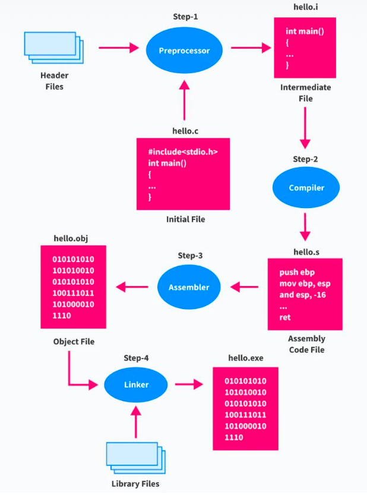

  

- **Java语言中的 Class (类)**：到了面向对象的 Java 时代，复用机制进阶成了**类 (Class)** 。  

  - 课件中给出了 Java 虚拟机 (JVM) 的底层工作原理图。图中清晰地标明了无论使我们自己写的 Java Source 还是现成的 Libraries，最终都会变成 Java Bytecodes（字节码）。在运行时，JVM 内部庞大的**类加载子系统 (Class Loader Subsystem)** 会将各种 Class 动态加载进入 Runtime Data Area（比如方法区和堆内存）交由执行引擎运行 。 面向对象的封装进一步提升了代码的安全性与模块化，极大地提高了大型工程的组装效率。  


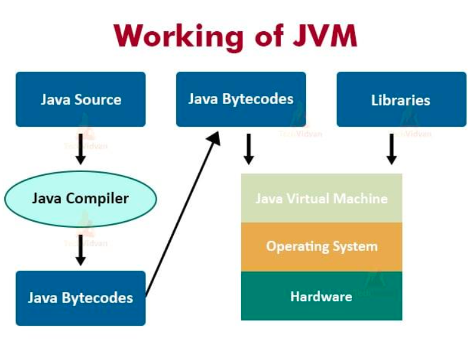

### Three Layer Structure and MVC Structure

在早期的Web开发中（就像我们最初接触的PHP那样），一个PHP文件里面通常混合了 UI（界面代码）、业务逻辑（计算与判断）和数据库操作（SQL语句） 。这种“大杂烩”代码在项目变大时会变成一场灾难。为了解决这个问题，架构师们引入了“分层（Layering）”的理念。  

Three Layers 和 MVC 都是拆分系统的方法，但它们关注点不同。**Three Layers 关注系统层次**，包括 UI、BLL 和 DAL。**MVC 关注交互职责**，包括 Model、View 和 Controller。它们不是完全一一对应的关系，不能简单理解为 UI = View，BLL = Controller，DAL = Model。

### Three Layer

- In our labs, the PHP file contains UI, business logic and database operation

  在我们的实验室中，PHP 文件同时包含了界面、业务逻辑以及数据库操作。

- It can be split into different layers

  可拆分为不同层级

- Microsoft had an architecture dividing them as: UI, BL and DA

  微软的架构将系统划分为：UI（用户界面）、BL（业务逻辑层）和DA（数据访问层）

微软提出了一种非常经典的架构模式，将应用程序清晰地切分为三个主要层次：  

- **表现层 (Presentation Layer / UI)**：直接面向用户的界面（比如 ASP.NET 页面或 HTML 网页）。**这一层绝不允许直接包含任何数据库访问代码**，它只负责展示 。  
- **业务逻辑层 (Business Logic Layer / BLL)**：位于 UI 和 数据层之间，作为沟通的桥梁。它主要负责**强制执行业务规则** 。  
  - *细节补充*：BLL 中通常包含大量的 `if/else` 判断 。课件中的代码示例展示了这一点：比如在保存产品数据前，BLL 会判断产品的价格（UnitPrice）是否小于0，如果小于0则抛出一个 `ArgumentException` 错误，阻止非法数据进入数据库 。  
- **数据访问层 (Data Access Layer / DAL)**：将所有与底层数据源交互的代码隔离在此 。  
  - *细节补充*：比如创建数据库连接，以及执行 `SELECT, INSERT, UPDATE, DELETE` 等 SQL 指令，统统都被封装在 DAL 这一层中 。

#### DAL

- Separate the data access logic from the presentation layer, which is referred to as the Data Access Layer, DAL for short, and is typically implemented as a separate Class Library project.

  将数据访问逻辑与表示层分离，这部分被称为数据访问层（**Data Access Layer，简称DAL**），通常作为一个独立的类库项目来实现。

- All code that is specific to the underlying data source such as creating a connection to the database, issuing **SELECT, INSERT, UPDATE, and DELETE** commands, and so on should be located in the DAL.

  所有特定于底层数据源的代码，例如创建数据库连接、执行 **SELECT、INSERT、UPDATE 和 DELETE** 命令等，都应位于数据访问层（DAL）中。

- The presentation layer should not contain any references to such data access code, but should instead make calls into the DAL for any and all data requests.

  表示层不应该包含任何访问数据代码的引用，而应当向数据访问层（DAL）发起所有数据请求的调用。

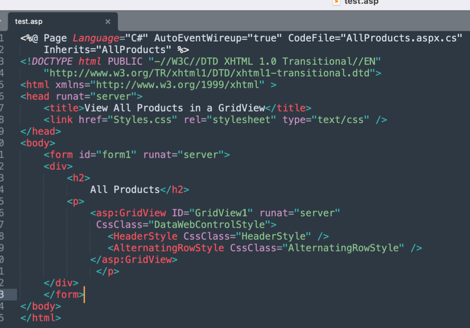

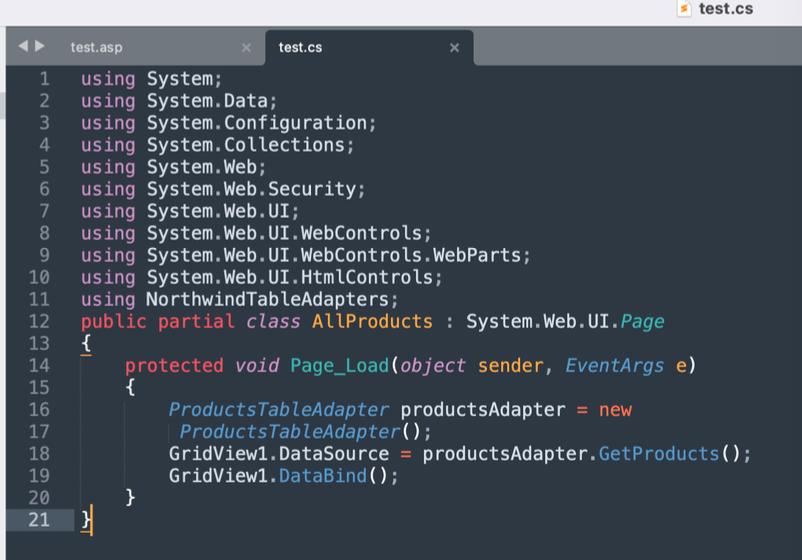

- New a instant of class **ProductsTableAdapeter**.

  实例化 ProductsTableAdapeter 类。

- Then call the **GetProductus** function to get the data and bind the data to grid.

  然后调用 GetProductus 函数获取数据，并将数据绑定到网格中。

- .cs means C#, the language by MicroSoft.

#### BLL

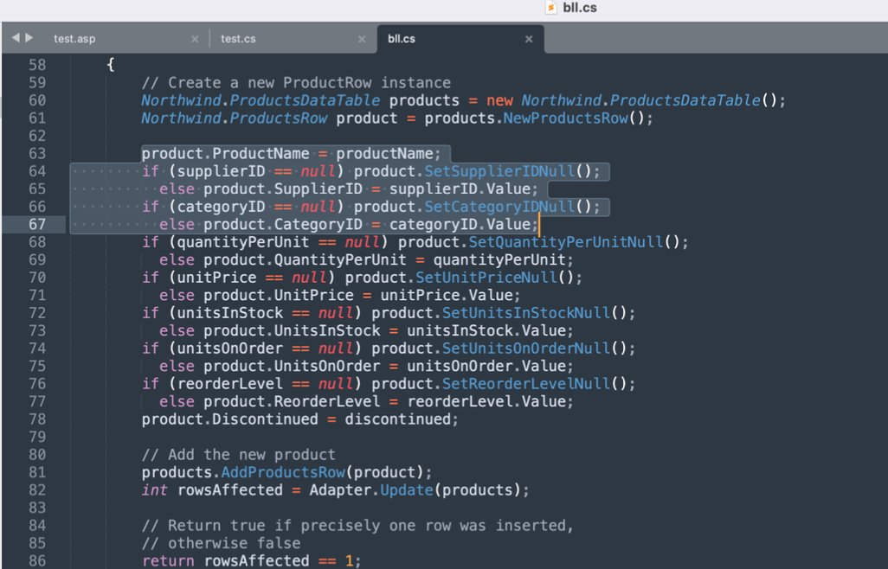

- BLL means lots of business rules (actually many if else.......)

  BLL 表示大量业务规则（实际上很多 if else.......）

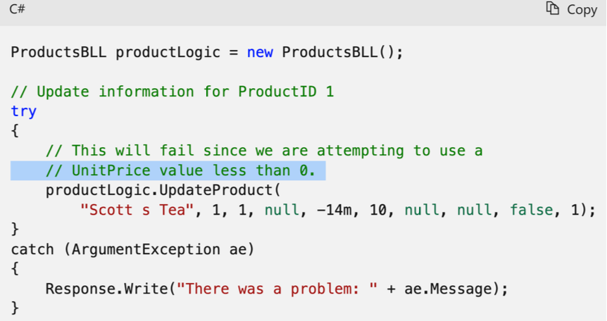

- 在这里会捕获异常。

虽然这种分层看起来需要写更多的额外代码，但它为应用程序带来了极大的好处：**可重用性、灵活性、可管理性、可维护性和可扩展性** 。此外，它允许将庞大复杂的项目拆分成简单的子项目，分发给不同的程序员或团队并行开发。

- It seems we need more additional codes to achieve the same result!

- During an application's life cycle, the three-tier approach provides benefits such as reusability, flexibility, manageability, maintainability, and scalability.

- You can divide large and complex projects into simpler projects and assign them to different programmers or programming teams.

### MVC Structure

MVC 是另一种帮助将应用程序分割为逻辑单元的架构理论 。事实上，MVC 的历史比 Web 技术本身还要悠久 。

MVC is only a theory guiding the split. 拆分系统可以提高可维护性，但也会增加复杂度和开发成本。因此是否严格使用 MVC，需要根据项目规模、团队协作和维护需求决定。  

它将系统分为三个紧密协作的组件：

- **Model (模型)**：代表一个独特的数据实体或结构 。数据的处理仅仅在 Model 中发生，这确保了内部数据的一致性 。  
- **View (视图)**：用于呈现图形化的用户界面 。为了展示应用程序对象的状态，View 会通过 Controller 来查询 Model 的数据 。  
- **Controller (控制器)**：提供用户界面 (View) 和应用程序处理逻辑 (Model) 之间的“链接” 。简单来说，Controller 让用户能够做出修改并看到结果 。  

- MVC is an architecture helps to **split** applications into logical units. Actually MVC is older than web technology.
- The **model** represents a **unique entity**- it could be a single object or more likely a structure. In this way, the processing of data takes place only in the model, which ensures internal data consistency.

- The **view** is used to present the **graphical visualization** of the user interface. **To see the status of the application objects**, the view queries the model through the controller.

- The **controller** provides the **link** between the user interface (view) and the application processing logic (model). In a sense the controller enables a user to make changes and see results.

- **MVC is only a theory guiding the split**. While split means complex and cost. Follow it exactly or **NOT** depends on many factors.

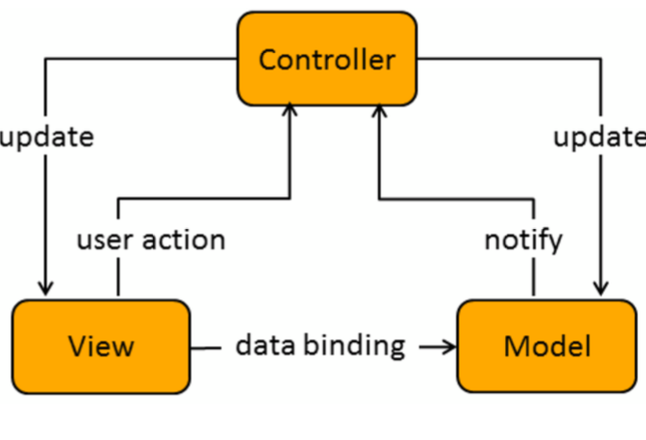

**重点误区纠正：MVC 不仅仅用于 Web！** 很多人以为 MVC 是专门为 Web 开发设计的。课件特别强调：**MVC 仅仅是一种指导拆分的理论 (Theory Guiding)**，无论应用是基于 Web 的，还是基于客户端的（例如 iOS 手机 App 的开发），都可以采用 MVC 架构风格。 

#### MVC Sample

首先需要区分一下 Zend Framework 和 Zend Engine 之间的区别。在 PHP 的世界里，"Zend" 这个词通常会出现在两个完全不同的层面，它们都是由 **Zend Technologies** 这家公司开发的，但职责完全不同：

- **Zend Engine (Zend 引擎)**：这是 PHP 语言的**心脏和底层运行引擎**。当你写下一段 PHP 代码并运行时，Zend Engine 负责在后台将你的 PHP 源代码解析、编译成机器能理解的字节码（Opcodes），然后再执行这些字节码。它还负责内存管理和垃圾回收。可以理解为，**没有 Zend Engine，就没有现代的 PHP**。
- **Zend Framework (现名 Laminas)**：这是本节课课件中重点介绍的。它是一个基于 PHP 语言编写的 **Web MVC 框架**，是运行在 Zend Engine 之上的“应用层工具” 。它的作用是提供一整套规范和脚手架，帮助开发者快速搭建结构清晰的 Web 应用。 

总结来说，Zend Engine 是 PHP 的执行环境，而 Zend Framework 是用 PHP 写的开发框架。

- **Zend framework** is a framework for PHP with MVC model support.

  Zend框架是一个支持MVC模型的PHP框架。

- It has a **router**, it replaces the default path mapping.

  它带有一个路由器，用于替换默认的路径映射。

- The **corresponding controller** will be created by the router and corresponding method will be called.

  路由会创建对应的控制器，并调用相应的方法。

- **Classes** implementing **business logic (including DAL)** are called models .

  实现业务逻辑（包括DAL）的类被称为模型（models） 。

- **Code** snippets **rendering HTML** pages are called views .

  代码片段渲染 HTML 页面被称为 View。

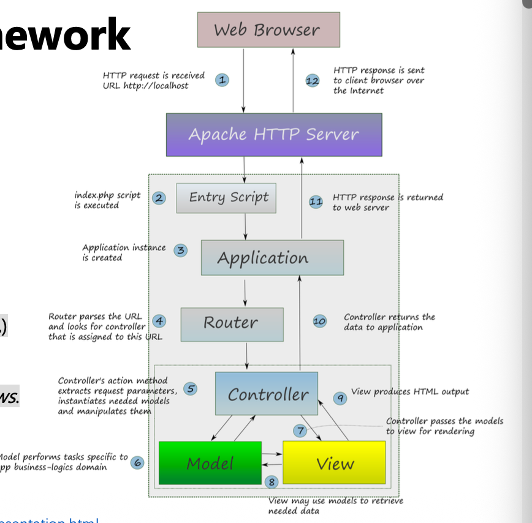

#### Zend Framework Skeleton

通过 Zend Skeleton（Zend 框架的骨架/模板）来展示一个真实的 MVC 框架是如何运转的。以下是这一部分的详细总结

Zend Framework 的请求流程可以理解为：**Browser request → Web Server → Zend Application → Router → Controller → Model → View → Response**。Router 会分析 URL，创建对应 Controller，并调用对应 action method。

- **什么是 Skeleton**：它是一个预先配置好的基础项目模板。当你完成安装配置后，可以直接在浏览器中看到一个 Welcome 页面，这有点类似于 XAMPP 的控制面板首页 。  
- **项目演进**：课件特别提到，Zend Framework 现在已经更名并演进为 **Laminas Project**，但课件中依然使用它作为演示 MVC 原理的绝佳例子 。
- Zend-MVC 使用**模块化系统 (Module System)** 来组织应用程序特定的代码 。  
- Skeleton 默认提供了一个 **Application 模块**。这个主模块不仅用于提供应用程序首页级别的控制器 (Controllers)，还负责为整个应用提供基础的引导 (Bootstrapping)、错误处理和路由 (Routing) 配置 。

##### Zend Framework

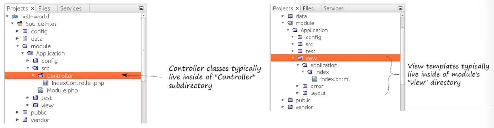

- A typical file structure of a Zend framework project.

  Zend 框架项目的典型文件结构。

- You cannot visit /helloword/module/application/src/controller/IndexController.php by the URL path.

- Url path will be used by the **router** to create the **corresponding controller** and call the corresponding method.

  router 将通过 URL 路径创建相应的控制器并调用对应的方法。

- The controller may interact with **Model** and return the rendered HTML code by the **View**.

  控制器可与模型进行交互，并通过视图返回渲染后的HTML代码。

- A sample will be shown how it works.

  将展示一个示例来说明其工作原理。

##### Zend framework skeleton Example

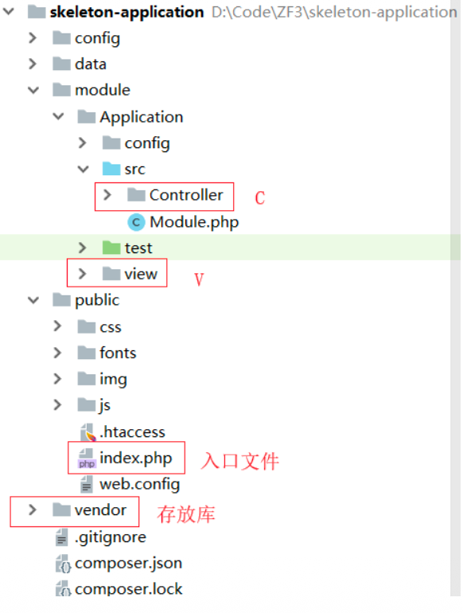

- Zend Framework is now the Laminas Project. We just use it for the demo purpose.

- Zend-MVC uses a module system to organize your main application-specific code within each module.

  Zend-MVC 使用模块系统将每个模块中特定于应用程序的主要代码组织起来。

- The Application module provided by the skeleton is used to provide bootstrapping, error, and routing configuration to the whole application. It is usually used to provide application level controllers for the home page of an application.

  骨架所提供的module，用于为整个程序进行初始配置、错误处理以及路由管理。通常情况下，该模块负责搭建应用首页级别的程序控制器。

- Public folder holds the file for public visiting.

  public文件夹存放可供公众访问的文件。

- Vendor folder holds the libraries.

  Vendor文件夹存放着相关库文件。

##### Zend framework - Module

- This demo set up a new module – Album.

- Start by creating a directory called Album under module with the corresponding subdirectories to hold the module’s files.

  首先在模块（module）下创建一个名为Album的目录，并在其中建立相应的子目录以存放模块文件。

- Controller and Model are under scr folder and view is a folder at the same level of src.

  Controller 和 Model 位于 scr 文件夹内，而 View 是与 src 同级的文件夹。

- Many configuration files need to be edited to include the Album module. Details can refer to the official documents.

  许多配置文件需要编辑以包含专辑模块。具体操作可参阅官方文档。

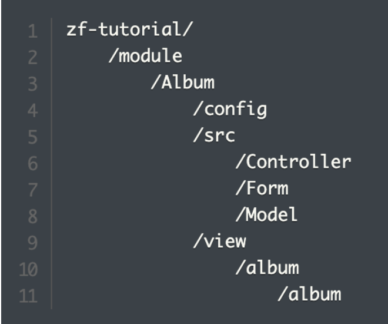

##### Zend framework - Routing

- The **mapping** of a URL to a particular action is done using **routes** that are defined in the module’s module.config.php file.

  将URL映射到特定操作是通过在模块的 module.config.php 文件中定义的路由实现的。

- The name of the route is ‘album’ and has a type of ‘segment’.

  该路由的名称为 'album'，类型为 'segment'。

- The segment route allows us to specify placeholders in the URL pattern (route) that will be mapped to named parameters in the matched route.

  路由段允许我们在URL模式（路由）中指定占位符，这些占位符将被映射到匹配路由中的命名参数。

- In this case, the route is /album[/:action[/:id]] which will match any URL that starts with /album. The next segment will be an optional action name, and then finally the next segment will be mapped to an optional id. The square brackets indicate that a segment is optional.

  在这种情况下，路由为 /album[/:action[/:id]]，它将匹配任何以 /album 开头的 URL。下一个段是可选的 action 名称，最后再下一个段会映射到可选的 id。方括号表示该段是可选的。

- The constraints section allows us to ensure that the characters within a segment are as expected, so we have limited actions to starting with a letter and then subsequent characters only being alphanumeric, underscore, or hyphen. We also limit the id to digits.

  约束部分允许我们确保分段内的字符符合预期，因此我们限制了操作：必须以字母开头，后续字符仅限字母数字、下划线或连字符。同时，我们将ID限制为仅包含数字。

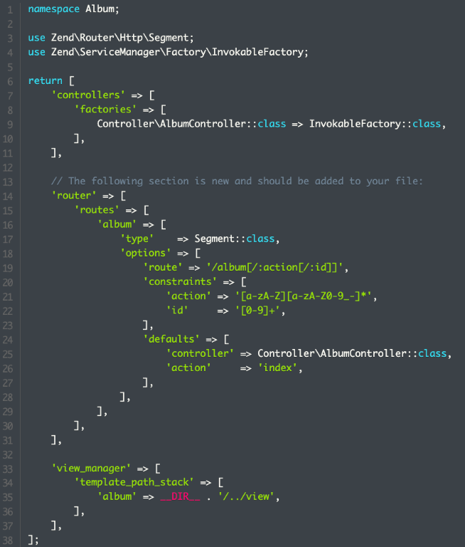

##### Zend framework - Controller

| URL           | Page                       | Action |
| ------------- | -------------------------- | ------ |
| /album        | Home (list of albums)      | index  |
| /album/add    | Add new album              | add    |
| /album/edit/2 | Edit album with an id of 2 | edit   |

- For zend-mvc, the controller is a class that is generally called {Controller name}Controller; In our case, it is AlbumController.php within the Controller subdirectory for the module.

  对于 zend-mvc，控制器是一个通常被称为 {Controller name}Controller 的类；在我们的例子中，它是位于模块 Controller 子目录下的 AlbumController.php 文件。

- Each action is a public method within the controller class that is named {action name}Action, where {action name} should start with a lower case letter.

  每个操作都是控制器类中的一个公共方法，命名为{动作名}Action，其中{动作名}必须以小写字母开头。

- You may see the mapping relationship for each URL with the Album controller and public methods.

  您可以看到每个URL与Album控制器及其公共方法之间的映射关系。

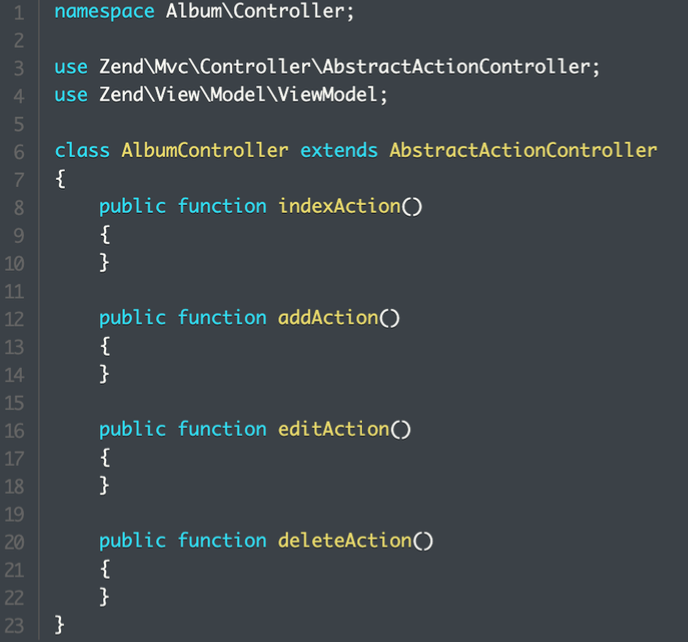

##### Zend framework - View

- By all defaults, the controller will let the corresponding View render the html code.

  默认情况下，控制器会让对应的视图渲染HTML代码。

- By defaults, the header and footer are same for all pages.

  默认情况下，所有页面的页眉和页脚都是相同的。

##### Zend framework - Model

- Zend Framework does not provide a zend-model component because the model is our business logic, and it's up to us to decide how you want it to work.

  Zend Framework 之所以没有提供 zend-model 组件,是因为模型代表我们的业务逻辑,具体实现方式应由开发者自行决定。

  - 在 Zend Framework 中，Model 不只是数据库表对象，也可以包含业务逻辑和 DAL。课件中提到，classes implementing business logic，包括 DAL，都可以称为 models。

- To build the model part, we need to prepare a database with several rows at first.

  要构建模型部分，首先需要准备一个包含若干行数据的数据库。

##### Zend framework – Database

```bash
data % sqlite3 demo.db < db.sql
```

```php
return [
  'db'=> [
    'driver' => 'Pdo',
    'dsn' => sprintf('sqlite:%s/data/demo.db', realpath(getcwd())),
  ],
];
```

- We can create a sqlite3 type database with the demo data with command line tool.

  我们可以使用命令行工具创建一个包含演示数据的 sqlite3 类型数据库。

- Modify config/autoload/global.php to add the db’s information.

  修改 config/autoload/global.php 文件以添加数据库信息。

##### Zend framework – Module

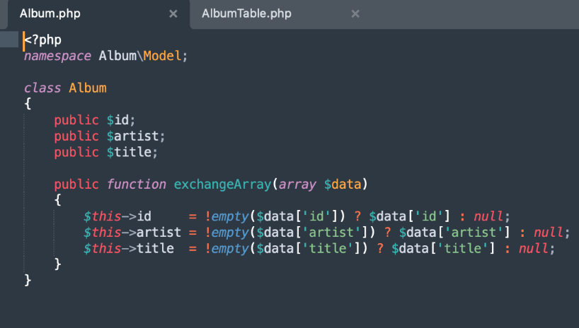

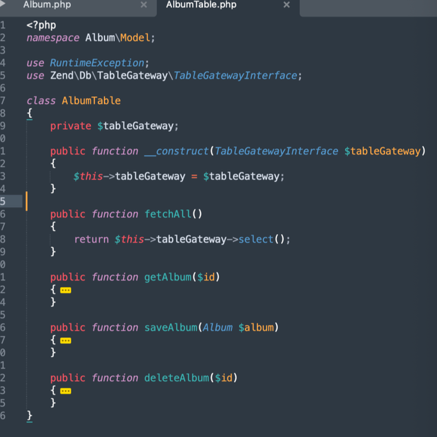

- We treat each Album item as an object can then have the class Album.

  我们将每个 Album  model 视为一个对象，随后可以为该对象定义 Album 类。

- Class AlbumTable is the mapping with Database through `TableGatewayInterface`.

  可以直接使用 AlbumTable 类来映射数据库中存放的 Album table。

##### Zend framework – Table gateway

- The Table Gateway subcomponent provides an object-oriented representation of a database table; its methods mirror the most common table operations.

  表网关子组件提供数据库表的面向对象表示；其方法反映了最常见的表操作。

- Table Gateway will use the DB information we have prepared in global configuration.

  表网关将使用我们在全局配置中准备好的数据库信息。

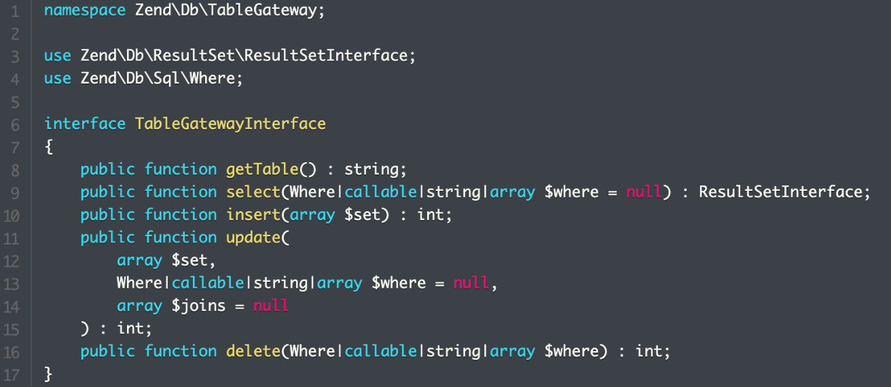

##### Zend framework – modify controller

- Then we can use the model in controller.

  可以在 controller 中使用 model 来接收对应的数据库查询结果。

- You may notice in we did not **new** a model instance.

- If you use magic word **new** , then later on the switch to another language will be a tough job.

- A factory is abstract for new all objects instead.

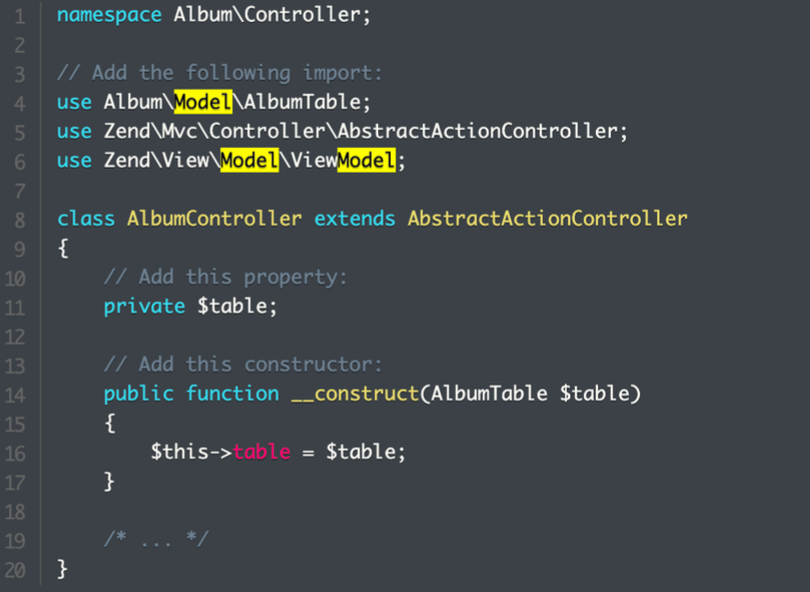

##### Zend framework – factory

- We should register the class in the factory, so the factory can new the instance.

- Controller class registers as Controller config.

- Model class should register as Service.

- This part is very trick in MVC and this is only a simple sample. Factory can many different modes, it beyond our model.

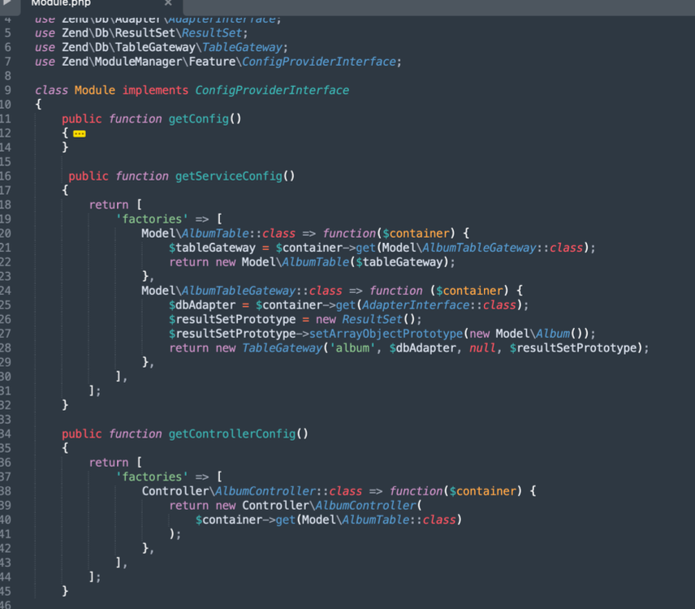

##### Zend framework – modify method

- Zend Framework uses the ViewModel to pass data from the Controller to the View. A ViewModel is created and populated within the Controller’s action method, then returned.

  Zend Framework 使用 ViewModel 将数据从控制器传递到视图。ViewModel 在控制器的操作方法中创建并填充数据，然后返回。

- This sample will pass all album data in database to view for rendering.

  此示例会将数据库中的所有 Album 数据传输至视图进行渲染。

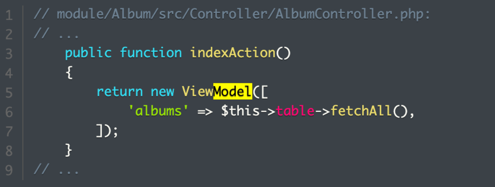

##### Zend framework – modify the view

- The first thing we do is to set the title for the page (used in the layout) and also set the title for the <head> section using the headTitle() view helper which will display in the browser's title bar. We then create a link to add a new album.

  我们首先要设置页面的标题（在布局中使用），并通过 headTitle() 视图助手为\<head>部分设置标题，该标题将显示在浏览器的标题栏中。接着我们创建用于添加新专辑的链接。

- A table to show all album are output by foreach.

  一个使用foreach输出所有专辑的表格

- We always use the escapeHtml() view helper to help protect ourselves from Cross Site Scripting (XSS) vulnerabilities.

  我们始终使用 escapeHtml() 视图助手来保护自己免受跨站脚本攻击（XSS）的威胁。

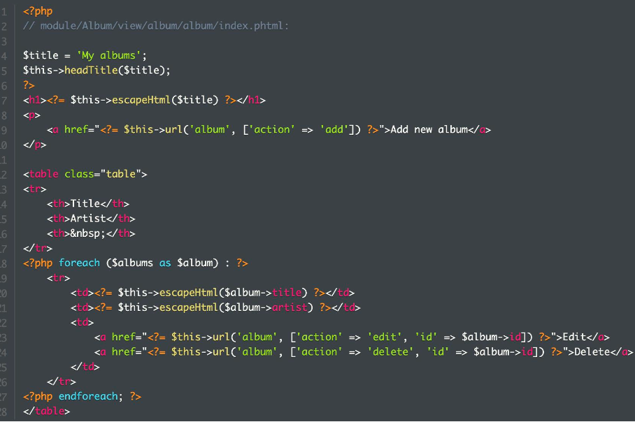

##### Zend framework - Review

- Actually, whatever the URL you input, Zend framework will always run the /public/index.php

  实际上，无论你输入什么URL，Zend框架都会始终运行/public/index.php文件。

- If the path is static resources, index.php will decline static file requests.

  如果路径指向静态资源，index.php 将会拒绝静态文件请求。

- Otherwise, index.php will match the URL to the corresponding module and use the router

  information of that module to initial the application.

  否则，index.php会将URL匹配到对应的模块，并使用该模块的路由信息来初始化应用程序。

- Then, the controller take the parameters from URL can prepare the data through the Model, render the data through View and finally return the results.

  然后，控制器从URL获取参数，通过模型准备数据、通过视图渲染数据，最后返回结果。

##### Zend framework – bad sample

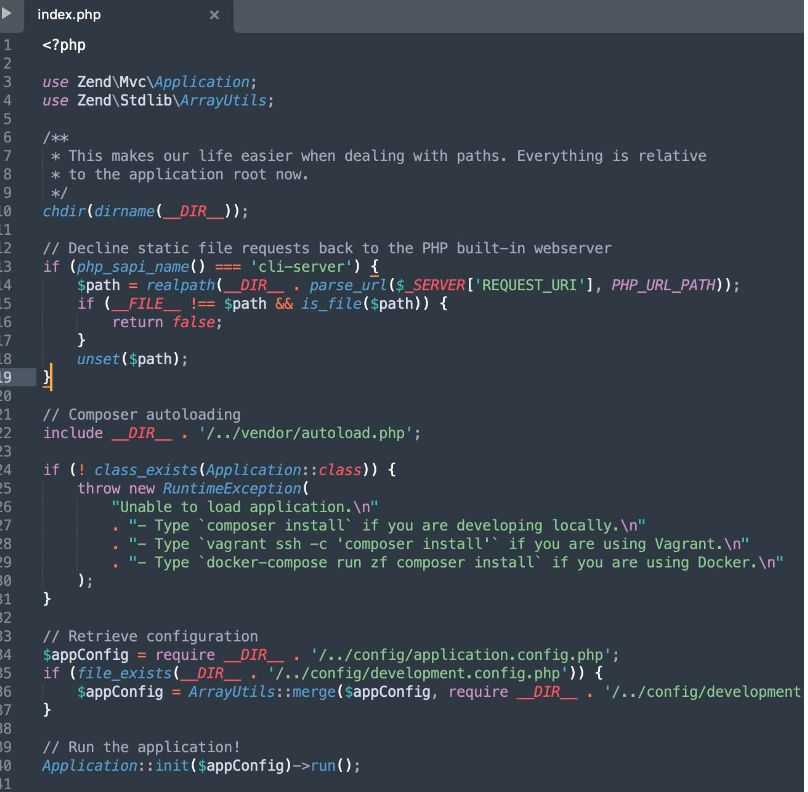

##### Zend framework – bad sample

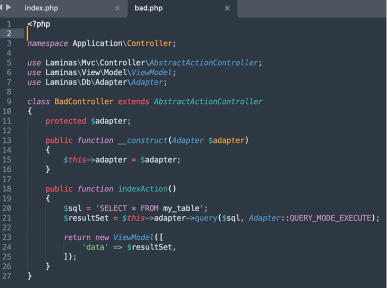

- MVC is ONLY an **architecture** helps to **split** applications into logical units.

  MVC仅仅是一种帮助将应用程序拆分为逻辑单元的架构。

- Frameworks makes the scaffolding ready.

  框架把脚手架搭好了。

- There is no restriction to write the database interaction in any framework. You may see the bad

  sample as shown.

  无任何限制规定必须使用特定框架编写数据库交互代码，示例属于典型反面案例。

- Such code violate the principle of MVC and make the project difficult to maintain in the future.

  这类代码违反了MVC原则，使得项目在未来难以维护。因为它把所有的操作都融合在了一起。

##### Zend framework – More Model

- A modelis a PHP class which contains the business logic of your application.

  模型是一个包含您应用程序业务逻辑的 PHP 类。

- By convention (OO paradigm), models can be further subdivided into the above principal types

  按照惯例（面向对象范式），模型可进一步细分为上述主要类型

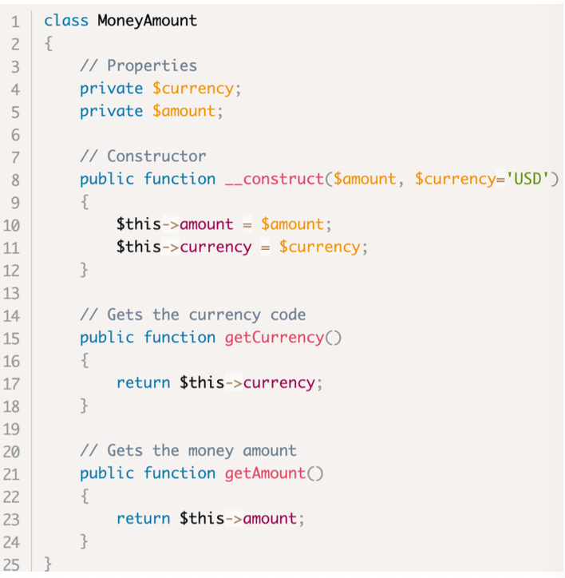

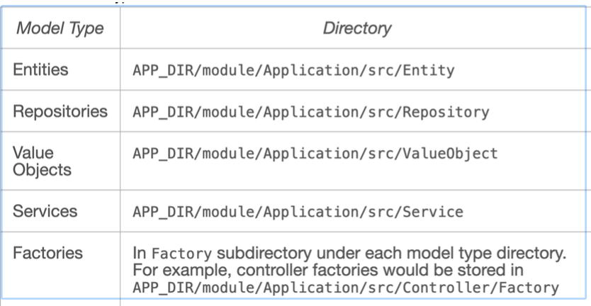

##### Zend Framework 总结

1. 路由配置 (Routing) —— 流量的十字路口

   在没有框架的时代，用户在浏览器输入 `www.test.com/album.php`，服务器就去找硬盘上的 `album.php` 文件。但在 MVC 框架中，这种物理对应关系被打破了。

   - **它的实现机制**：所有的请求都会统一发给 `public/index.php`，然后由**路由 (Router)** 接管。路由会查看我们在 `module.config.php` 中写的配置规则。

   - **举个例子**：当用户访问 `/album/add` 时，Router 发现匹配到了规则，就会把它翻译成：“去实例化 `Album` 模块里的 `AlbumController`，并执行里面的 `addAction` 方法”。

2. 控制器 (Controller) —— 核心调度员

   Controller 就像是餐厅里的服务员，它不亲自炒菜（不管数据），也不亲自摆盘（不管页面），它只负责“接单”和“上菜”。

   - **Action 方法**：在一个 Controller 类中，针对不同的页面会有不同的方法，通常以 `Action` 结尾。例如 `indexAction()` 负责列表页，`addAction()` 负责添加页。

   - **装载数据**：当 `indexAction()` 需要展示所有相册时，它会向 Model 要数据，拿到数据后，它**不会直接输出 HTML**，而是把数据打包塞进一个叫 `ViewModel` 的对象中，然后 `return` 交还给框架。

3. 模型 (Model) 与 TableGateway —— 幕后的数据大厨

   Controller 怎么向 Model 要数据呢？课件中提到了一个非常重要的设计模式：**TableGateway (数据表网关)**。

   - **它的实现方式**：在 Model 层，我们会创建一个专门的类（比如 `AlbumTable.php`）来代表数据库中的 `album` 表。所有关于这张表的增删改查（SQL语句）全部被锁在这个类里面。

   - **解耦的优势**：Controller 只需要写一行 `$this->table->fetchAll()` 就可以拿到所有相册数据。如果哪天底层的数据库从 MySQL 换成了 Oracle，你只需要修改 `AlbumTable.php`，Controller 层的代码连一个标点符号都不用改！

4. 视图 (View) 与 XSS 安全防护 —— 最终的摆盘

   当框架拿到了 Controller 返回的 `ViewModel` 后，就会去寻找对应的视图模板（通常是 `.phtml` 文件），把数据渲染成最终的网页。在这部分，课件特别强调了一个**极为重要的安全实践**。

   - **XSS 攻击防范**：假设用户在添加相册时，恶意在标题里填入了一段 JavaScript 脚本（比如 `<script>偷走你的密码</script>`）。如果我们在 View 中直接输出这个标题，其他用户的浏览器就会执行这段恶意代码。

   - **具体实现**：在 Zend 的 View 中，输出从数据库拿出来的用户生成内容时，**绝对不能**直接用 `echo $album->title`。必须套上一层防护装甲：

     ```php
     <?= $this->escapeHtml($album->title) ?>
     ```

     这个 `escapeHtml()` 方法会将危险的符号（如 `<` 和 `>`）转换成安全的 HTML 实体，从而彻底封死 XSS (跨站脚本攻击) 的路径。

5. 🌟 进阶概念：工厂模式与依赖注入 (Dependency Injection)

   课件在代码结构中还透露了一个高级的架构思想。在传统的代码中，如果 Controller 需要用到 Model，我们通常会直接在里面写 `$table = new AlbumTable();`。但在 Zend 框架中，我们非常不鼓励到处使用 `new` 关键字。

   - 框架会使用 **Factory（工厂）** 来帮我们创建对象。当框架需要实例化 `AlbumController` 时，工厂会提前把配置好的 `AlbumTable` 对象准备好，并作为参数“塞进” Controller 的构造函数里。这就是**依赖注入**。这使得每个组件都变成了可以独立测试的乐高积木，极大降低了代码的耦合度。

## ORM - Object Relational Mapping

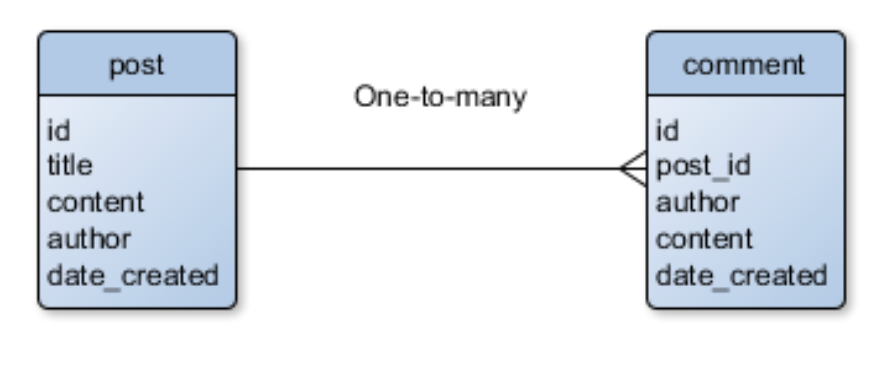

- Objects have different kinds of relational with each other.

  对象之间有多种不同类型的关系。

- There relational also need to be represented as objects.

  而在关系型数据库中，数据通常是以二维表的形式存储的。我们需要一种机制，将这些关系也表示为代码中的对象，这就是 ORM 的核心任务。

### ORM - Object Relational Mapping

你在接触数据库操作时，可能会听到很多名词。课件中列举了几个常见的术语：

- **ORM, DAO, DataMapper, ActiveRecord, TableGateway**：这些术语实际上都是从不同的视角或侧重点，来描述“如何处理数据映射”这一件事情。  
- 如果没有具体的代码示例，要彻底解释清楚它们之间的区别是很困难的，而且这通常超出了这门课的范围。在当前阶段，你只需要知道它们的核心目的都是为了实现数据的持久化和逻辑解耦。 

### Mainstream Languages's ORM Framework

不同语言有着自己独特的 ORM 生态体系，课件中重点提到了以下几种：

- **Java 生态 (Hibernate vs MyBatis)**：Java 是经典的面向对象语言，这也是它在 Web 开发中如此受欢迎的原因。它拥有强大的 ORM 框架，如 Hibernate 和 MyBatis。它们通常具备以下强大功能：  
  - 提供通用的 CRUD（创建、读取、更新、删除）功能。  
  - 整个环境由对象模型驱动，能够自动生成 SQL 语句，并提供 Session（会话）管理。  
  - 支持复杂的动态搜索查询（查询条件是动态变化的）以及结果的分页处理。  
  - 支持分析型的抓取查询以及存储过程。  
- **Python 生态**：Python 同样拥有成熟的 Web MVC 和 ORM 生态体系（例如 Django ORM 和 SQLAlchemy）。

### 学习 ORM 的“最佳实践”与架构哲学

面对如此多的编程语言和框架，我们该如何选择和学习？课件在这里给出了非常有价值的工程哲学：

- **真正的挑战在于生态**：其实每一门编程语言本身并没有那么复杂，对于初学者来说，真正的挑战在于庞大的“生态系统和框架”。因为有太多的框架选择，如果每个都要去熟悉，会耗费巨大的编码时间。  
- **框架的共性**：所有的框架在底层原理上都是相似的，只是各有其优缺点。  
- **最佳实践 (Best Practice)**：学习所有的**核心原理**（Principles），而绝对不是去死记硬背某一个特定框架的代码片段（Code segment）。  
- **如何选择？** 这是一个没有标准答案的开放性问题，每一个框架都有其成功的案例。真正的答案是：**在真实的工程项目中去付出代价（时间和精力），去实践，最终你就会成为这方面的大师**。 

## Front-end & Back-end Split 前后端分离

这是现代 Web 架构演进中**最重要的一道分水岭**。在前面的经典 MVC 架构中，后端的 Controller 拿到数据后，还要亲自负责把数据塞进 HTML 模板（View）里渲染出来。但随着移动互联网的爆发，这种模式走不通了。

### The Concept of Split & Multi-device 为什么要分离

- **多端适配的挑战**：现在的用户不仅用电脑看网页 (PC Web)，还会用手机浏览器 (Mobile Web)、苹果/安卓原生 App (iOS/Android) 以及微信小程序。它们的界面长得完全不一样，但背后的业务逻辑（比如“加入购物车”）是一模一样的。

- **分离的本质**：如果为每一种设备都写一套完整的后端代码，那简直是灾难。因此，架构师们做了一个大胆的决定：**把前端（展示层）和后端（数据/逻辑层）彻底劈开，变成两套完全独立的系统。**

- **后端的退让**：后端不再负责生成任何 HTML 页面。它变成了一个纯粹的“数据提供商”，只负责处理逻辑和吐出裸数据。前端拿到数据后，自己决定怎么画在屏幕上。

- Since the technology stacks are very different from each other, the web project can be split into Front-end system and Back-end system.

  由于技术栈差异很大，Web项目可拆分为前端系统和后端系统。

- The view is used to present the graphical visualization of the “user” interface.

  视图用于呈现“用户”界面的图形可视化。

- JSON results can be regarded as the View of back-end (if MVC) AND Model of front-end.

  JSON 结果可被视为后端的视图（若采用MVC架构），同时也是前端的模型。

### Web - AJAX (Asynchronous JavaScript And XML)

**AJAX (异步交互)**：在传统的网页中，点一个按钮整个页面就会白屏刷新一下。而 AJAX 技术（Asynchronous JavaScript And XML）允许前端在**不刷新整个页面的情况下，偷偷在后台向服务器发送请求并接收数据**，然后只把页面上需要改变的地方（比如点赞数）悄悄更新掉。

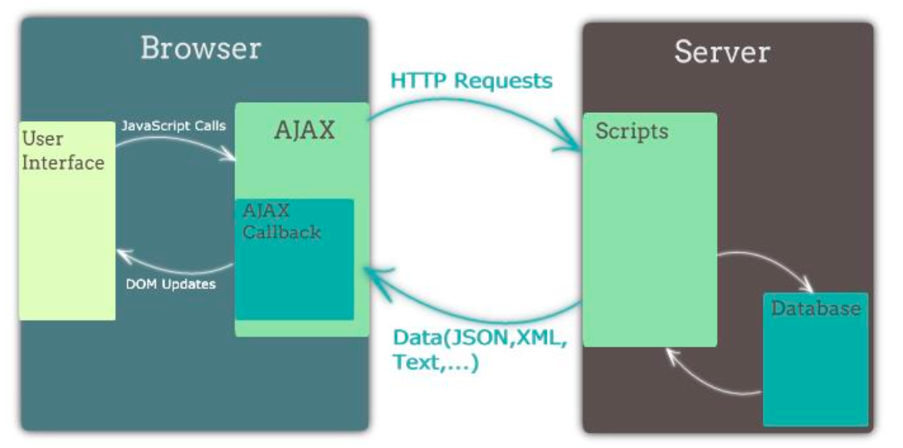

- Ajax enable browser (front-end) to interact with web server (back-end) within the same webpage.

  Ajax（异步JavaScript和XML）使得浏览器（前端）能够在同一网页内与网络服务器（后端）进行交互。

- Ajax can be applied to make dynamic front-end developing.

  Ajax 可应用于进行动态前端开发。

#### A sample page with jQuery

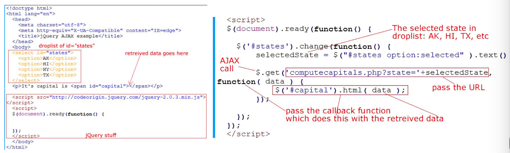


- jQuery is a JS project.

- It likes an SDK which has more functions than Ajax.

- Bootstrap includes jQuery

### XML - Extensible Markup Language

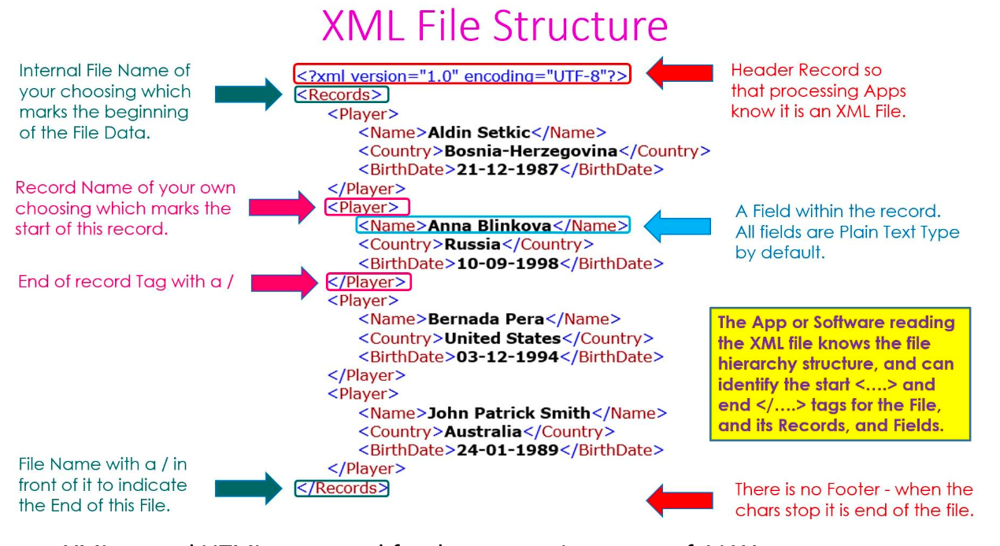

XML extend HTML tags, used for the request/response of AJAX

XML 扩展了 HTML 标签，用于 AJAX 的请求/响应。

### XML → JSON (JavaScript Object Notation)

**JSON (数据格式演进)**：前端和后端聊天需要一种“通用语言”。早年间大家用 XML，但它太臃肿了。现在几乎全部统一成了 **JSON (JavaScript Object Notation)**。它是一种极其轻量、清晰的纯文本格式，看起来就像键值对（Key-Value），几乎所有的编程语言都能轻松解析它。

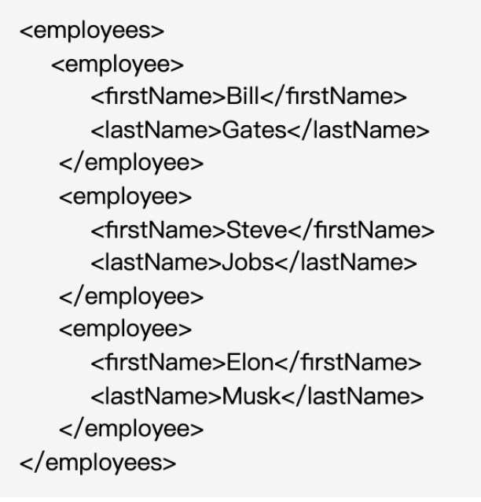

- JSON is more popular.
- Most language support json translation
- 在前后端分离中，后端返回的 JSON 对后端来说可以看作 View，因为它是后端输出结果；但对前端来说，JSON 又可以看作 Model，因为前端会根据这些数据渲染页面。

### API(Application Programming Interface) 与 RESTful 架构风格 (Web API & RESTful)

#### API

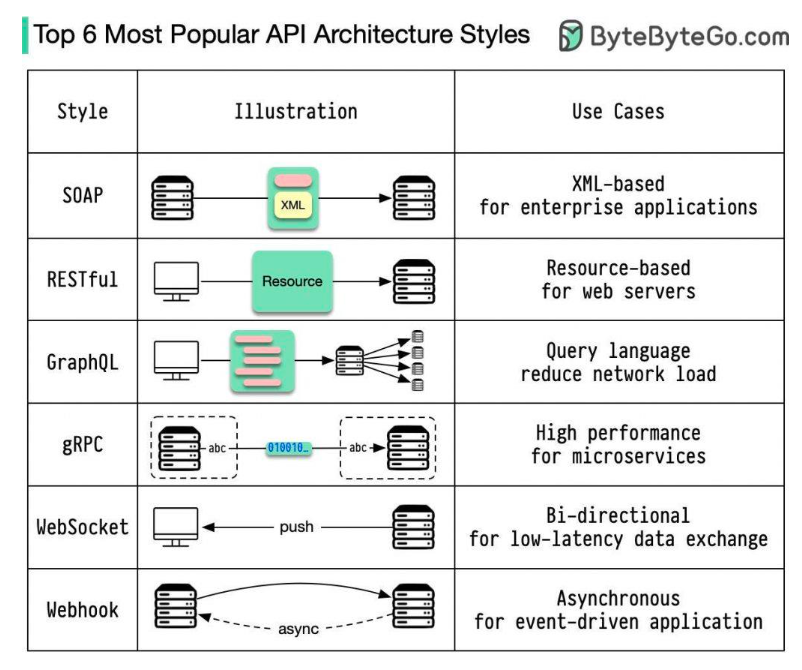

API architectural styles define how different components of an application interact with each other through APIs

API架构风格定义了应用程序中不同组件如何通过APIs进行交互

Two systems exchange information over HTTP protocol

两个系统通过HTTP协议交换信息

#### REST (Representational State Transfer) API

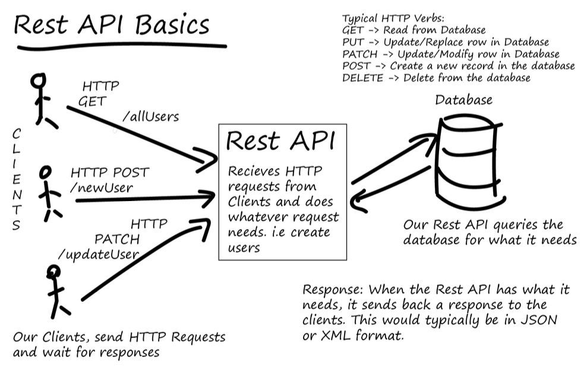

- REST APIs add NO new capability to HTTP APIs.

  REST API 并未给 HTTP API 增加任何新功能。

- But it is an architectural style that was created in tandem with HTTP

  但它是一种与HTTP相伴而生共同发展的架构风格

- RESTful API does not add new capability to HTTP. 它不是一种新的协议，而是一种 API 设计风格，用 HTTP method 表达对资源的不同操作。

后端怎么把 JSON 数据暴露给前端呢？答案是通过 **Web API (应用程序编程接口)**。你可以把 API 想象成餐厅的“菜单”，前端照着菜单点菜，后端就把做好的数据端上来。

- **RESTful 风格**：这是目前最流行的一种 API 设计规范（表述性状态转移）。它的核心思想是把网上的所有东西都看作**资源 (Resources)**。
- **巧用 HTTP 动词**：RESTful API 巧妙地利用了 HTTP 协议自带的四个动作来管理这些资源，这让 API 的设计变得极其优雅和易懂：
  - **GET**：读取/查询数据（如获取商品列表）
  - **POST**：创建新数据（如发布一条新评论）
  - **PUT**：更新现有数据（如修改个人资料）
  - **DELETE**：删除数据（如删除一张照片）

#### API 测试利器：Postman

- 在前后端分离的团队里，后端工程师写完 API 后，可能前端还没把界面画出来。
- 这时候后端怎么知道自己的接口写对了没有？课件中提到了 **Postman**。这是一个极其强大的行业级 API 测试工具，它能模拟前端向服务器发送各种 GET/POST 请求，并直观地查看服务器返回的 JSON 数据和状态码。

## Front-end Evolution 前端技术演进

- We can generate all webpages as static resources.

  我们可以将所有网页生成为静态资源。

- Each page for an individual file.

  每个文件单独的页面。

- It can get dynamic data with jQuery.

  可以使用jQuery获取动态数据。

- But compare with MVC, let router to manage the URL mapping, which one is better?

  但与MVC相比，让路由器管理URL映射，哪一种更好？

### SPA - Single Page Application

在传统的 Web 时代（Classic Website），用户每点击一个链接，浏览器就会向服务器请求一个新的 HTML 页面，屏幕会经历短暂的“白屏”刷新。

现代前端打破了这个规则，引入了 **SPA (单页应用)**：

- **只有一个页面**：整个前端项目，不管是淘宝还是掘金，物理上其实只有一个 `index.html` 文件。
- **前端路由 (Front-end Router)**：当用户在页面上点击链接时，前端的 Router 会拦截这个操作。它**不会**向后端请求新的网页，而是直接在浏览器内部，通过 JavaScript 把旧的界面组件“卸载”，把新的组件“挂载”上去。
- **体验飞跃**：这使得网页的切换无比丝滑，彻底告别白屏，体验几乎和手机上的原生 App 一模一样。

### 三大主流前端框架

为了支撑庞大的 SPA 项目，前端诞生了三大“巨头”框架，课件中对它们进行了对比：

- **Vue (MVVM 架构)**：课件中重点提到了 Vue 的核心魔法——**双向数据绑定 (Two-way binding)**。
  - 在以前，如果数据变了，你需要手动写代码去更新页面（比如 `document.getElementById('xx').innerText = newText`）。
  - 在 Vue 中，数据模型 (Model) 和视图界面 (View) 是**自动绑定的**。你用键盘在输入框打字，底层的变量自动跟着变；反过来，底层的变量一变，页面上的文字瞬间自动更新。
  - 在 Vue 的 router 设置中，通过浏览器路由捕获路径，并在不加载新网页的情况下切换对应组件。
- **React (Facebook出品)**：采用组件化开发，首创了 JSX 语法（把 HTML 写在 JavaScript 里）。配合 Redux 等状态管理工具，可以实现非常严谨的架构。
- **Angular (Google出品)**：这是一个非常重型、大而全的纯正前端 MVC 框架，内置了路由、动画等所有你需要的东西。

### Node.js 的崛起 (前端工程化)

最后，课件提到了一个非常关键的技术：**Node.js**。

- **打破浏览器限制**：JavaScript 以前只能活在浏览器里，Node.js 给它提供了一个运行环境，让 JavaScript 也能像 Python、Java 一样直接运行在操作系统上。
- **前端的基石**：课件强调，开发 React 和 Vue 项目**需要一个 Web 服务器**。Node.js 就是这个由 JavaScript 驱动的服务器环境。它不仅让前端有了自己的打包工具（如 Webpack/Vite），还能在本地启动开发服务器，是所有现代前端技术的底层引擎。
- Node.js 在本节课中主要被理解为 JavaScript-powered web server 和前端开发环境。React 和 Vue 开发过程通常需要 Node.js，但最终项目可以被打包成静态文件，部署到任何 Web server。

# 潜在考试题与参考答案

## Q1. What does “Don’t reinvent the wheel” mean?

它的意思是不要重复实现已经成熟的功能。如果已有现成的库、类、框架或工具，就应该优先复用它们。这样可以减少重复劳动，提高开发效率和系统稳定性。

------

## Q2. How does C language use Library for code reuse?

C 语言通过 Library 实现代码复用。开发者可以使用 `#include` 引入头文件，在编译和链接过程中，链接器会把程序生成的 object file 和 library files 组合起来，最终生成可执行文件。

------

## Q3. What are the three layers in three-tier architecture?

Three-tier architecture 包括 Presentation Layer、Business Logic Layer 和 Data Access Layer。Presentation Layer 负责界面展示，BLL 负责业务规则，DAL 负责数据库访问。

------

## Q4. Why should data access code be placed in DAL?

因为 DAL 可以把数据库访问逻辑从 UI 层中分离出来。这样 UI 层不需要直接写 SQL 或创建数据库连接，代码更清晰，也更容易维护和复用。

------

## Q5. What is the role of BLL?

BLL 负责业务规则。比如在保存商品信息前检查价格是否合法，如果价格小于 0，就抛出异常，避免错误数据进入数据库。

------

## Q6. What benefits does three-tier architecture provide?

三层架构可以提高 reusability、flexibility、manageability、maintainability 和 scalability。它也方便把大型项目拆分成小模块，交给不同团队开发。

------

## Q7. What are Model, View and Controller in MVC?

Model 负责数据和业务逻辑，View 负责展示用户界面，Controller 负责接收用户输入，并连接 View 和 Model。

------

## Q8. Is MVC only used in Web applications?

不是。MVC 是一种架构拆分理论，不只用于 Web 应用。客户端应用，例如 iOS app，也可以使用 MVC。

------

## Q9. Are Three Layers and MVC the same?

不是。Three Layers 是按系统层次拆分，MVC 是按交互职责拆分。它们有相似点，但不能完全一一对应。

------

## Q10. What is the role of Router in Zend Framework?

Router 用来分析 URL，并决定创建哪个 Controller、调用哪个 action method。它替代了传统的文件路径映射。

------

## Q11. What is Model in Zend Framework?

在 Zend Framework 中，Model 可以表示业务逻辑类，也可以包含 DAL。它不只是数据库表对象，而是负责处理应用数据和业务规则的部分。

------

## Q12. What is ORM?

ORM 是 Object Relational Mapping，也就是对象关系映射。它把数据库中的 table 和 row 映射成程序中的 class 和 object，让程序员可以用对象方式操作数据库。

------

## Q13. Why do we need front-end and back-end separation?

因为现代应用有多种前端，例如 PC Web、Mobile Web、App 和小程序。它们界面不同，但后端业务逻辑类似。因此后端可以统一提供 API，前端负责各自的展示。

------

## Q14. What is AJAX?

AJAX 允许网页在不刷新整个页面的情况下与服务器通信。它可以让网页局部更新，提高用户体验。

------

## Q15. Why is JSON widely used?

JSON 比 XML 更轻量，结构更清晰，也更容易被 JavaScript 和其他语言解析。因此它常用于前后端数据交换。

------

## Q16. What is RESTful API?

RESTful API 是一种 API 设计风格。它使用 HTTP method 操作资源，例如 GET 查询资源，POST 创建资源，PUT 更新资源，DELETE 删除资源。

------

## Q17. What is SPA?

SPA 是 Single Page Application。它通常只有一个 `index.html`，页面切换由前端 Router 完成，不需要每次重新加载完整 HTML 页面。

------

## Q18. What is the key feature of Vue?

Vue 的核心特点是 MVVM 和 two-way binding。数据变化会自动更新页面，页面输入也可以自动影响底层数据。

------

## Q19. What is React mainly known for?

React 主要特点是组件化开发和 JSX。React 本身不包含 Router，需要额外安装 router module。

------

## Q20. What is the role of Node.js in front-end development?

Node.js 是 JavaScript 驱动的 Web server 和前端开发环境。开发 React 和 Vue 时通常需要 Node.js，但最终项目可以打包成静态文件，部署到任何 Web server。