# 12 Billion level traffic architecture

## 知识图谱

``` plaintext
Week12 - 亿级流量架构
│
├── 1. 高并发问题背景
│   ├── 单机无法承受巨大流量
│   ├── 每个请求都会消耗 CPU / 内存 / I/O / 网络资源
│   ├── 典型服务器并发能力差异
│   └── 核心思想：不是依赖一台“英雄机器”，而是让大量服务器协同工作
│
├── 2. 代理与负载均衡
│   ├── Proxy 代理
│   │   ├── Forward Proxy 正向代理
│   │   └── Reverse Proxy 反向代理
│   │
│   ├── Load Balance 负载均衡
│   │   ├── 将请求分发到多台服务器
│   │   ├── 提高可用性
│   │   ├── 提高资源利用率
│   │   └── 提升整体性能
│   │
│   ├── Layer 7 HTTP Proxy
│   │   ├── 基于 HTTP 请求/响应工作
│   │   ├── 能理解 URL / Header / HTTP 信息
│   │   ├── Apache Proxy
│   │   └── Nginx
│   │
│   ├── Layer 4 TCP/UDP Proxy
│   │   ├── 基于 IP + Port 转发
│   │   ├── 不关心 HTTP 具体内容
│   │   └── LVS
│   │
│   └── Nginx vs LVS
│       ├── Nginx：应用层，功能灵活
│       ├── LVS：传输层，更快
│       └── 最佳实践：LVS + Nginx 组合使用
│
├── 3. Nginx 与 Web 层扩展
│   ├── Nginx 的作用
│   │   ├── 反向代理
│   │   ├── 静态资源服务
│   │   ├── 基于 URL path 设置代理规则
│   │   └── 聚合多个动态内容服务器
│   │
│   ├── 负载均衡算法
│   │   ├── Weight 权重
│   │   ├── Round Robin 轮询
│   │   ├── Hash
│   │   ├── IP Hash
│   │   ├── Least Connections 最少连接
│   │   └── Least Time 最短响应时间
│   │
│   ├── Health Check 健康检查
│   │   └── 检查后端服务器是否正常工作
│   │
│   └── Nginx 上限
│       ├── 受硬件、配置、业务复杂度影响
│       ├── 课件中提到可达到约 30000 并发
│       └── 更高性能需要下沉到网络层处理
│
├── 4. 网络基础：理解 LVS 的前置知识
│   ├── OSI 与 TCP/IP 模型
│   │   ├── 应用层：HTTP / DNS / FTP 等
│   │   ├── 传输层：TCP / UDP
│   │   ├── 网络层：IP
│   │   ├── 链路层：MAC
│   │   └── 物理层：网线、光纤等
│   │
│   ├── MAC 地址与 IP 地址
│   │   ├── MAC：二层地址，物理地址
│   │   └── IP：三层地址，逻辑地址
│   │
│   ├── DNS
│   │   └── 将域名解析为 IP 地址
│   │
│   ├── IPv4 与 IPv6
│   │   ├── IPv4：32-bit
│   │   └── IPv6：128-bit
│   │
│   ├── Switch / Hub / Router
│   │   ├── Switch / Hub：创建网络
│   │   └── Router：连接网络
│   │
│   └── HTTP 与 TCP
│       ├── HTTP 请求/响应会被放入 TCP 包中传输
│       ├── 一次 HTTP 请求可能拆分成多个 TCP 包
│       └── 每一层封装与解析都会消耗资源
│
├── 5. LVS：四层负载均衡
│   ├── LVS 基本概念
│   │   ├── Linux Virtual Server
│   │   ├── Linux 内核服务
│   │   ├── 使用 VIP 虚拟 IP
│   │   ├── 将 TCP/UDP 请求转发到真实服务器
│   │   └── 规则基于 IP + Port
│   │
│   ├── LVS 模式
│   │   ├── NAT Mode
│   │   │   ├── Network Address Translation
│   │   │   ├── 请求和响应都经过 LVS
│   │   │   └── Real Server 需要把 LVS 设置为网关
│   │   │
│   │   ├── DR Mode
│   │   │   ├── Direct Route
│   │   │   ├── LVS 只处理请求包
│   │   │   ├── Real Server 直接响应用户
│   │   │   ├── 性能更高
│   │   │   └── 需要处理 ARP / MAC / Loopback 问题
│   │   │
│   │   └── TUN Mode
│   │       └── 课件图中出现，但讲解重点较少
│   │
│   ├── ARP 与 Switch
│   │   ├── Switch 通过 MAC 地址表转发数据
│   │   └── DR 模式需要理解 MAC 转换
│   │
│   └── Loopback / Localhost
│       ├── Loopback 是虚拟网卡
│       └── 发送到 loopback 的流量会返回本机
│
├── 6. 高可用机制
│   ├── Host Standby 主备
│   │   ├── 两台服务器功能相同
│   │   └── 主服务器故障后切换到备用服务器
│   │
│   ├── VRRP
│   │   ├── Virtual Routing Redundancy Protocol
│   │   ├── 主备服务器配置相同
│   │   ├── 备用节点检查主节点健康状态
│   │   ├── 主节点失效后备用节点接管流量
│   │   └── 典型软件：keepalived
│   │
│   └── Keepalive
│       ├── 负载均衡器自身也需要高可用
│       └── 避免代理服务器成为单点故障
│
├── 7. 数据库层扩展
│   ├── 数据库成为新瓶颈
│   │   ├── Web 层扩展后，DB 可能成为系统瓶颈
│   │   └── 数据库也需要负载均衡
│   │
│   ├── Dual Master MySQL
│   │   ├── 使用 Binlog 进行复制
│   │   ├── 用于数据同步
│   │   ├── 不直接提升并发性能
│   │   └── 切换时可能出现数据不一致问题
│   │
│   ├── Master / Slave MySQL
│   │   ├── 电商场景中读请求很多
│   │   ├── Master 处理写
│   │   ├── Slave 处理读
│   │   ├── 提高读并发能力
│   │   └── 应用层需要区分读写
│   │
│   └── DB Proxy
│       ├── 代理自动选择 Master 或 Slave
│       ├── 简化应用层代码
│       └── DB Proxy 本身也需要 keepalive
│
├── 8. 系统架构演进
│   ├── Mini-Web
│   │   ├── Web server 与 DB server 在同一台机器
│   │   └── 适合实验或低流量场景
│   │
│   ├── Monolithic Architecture 单体架构
│   │   ├── 所有功能部署在一个应用中
│   │   ├── 适合低流量
│   │   ├── ORM 简化 CRUD
│   │   └── 可通过增加应用实例进行初步扩展
│   │
│   ├── Vertical Separation 垂直拆分
│   │   ├── 按业务功能拆分应用
│   │   ├── 不同功能部署为不同集群
│   │   └── 例如 user / order / account / course 等
│   │
│   ├── RPC
│   │   ├── Remote Procedure Call
│   │   ├── 远程调用其他机器上的过程/函数
│   │   ├── 可基于 TCP 或 HTTP
│   │   └── HTTP API 也是 RPC 的一种
│   │
│   ├── SOA
│   │   ├── Service-Oriented Architecture
│   │   ├── 服务可以跨平台、跨语言通信
│   │   ├── 服务是自包含的软件单元
│   │   └── 强调松耦合
│   │
│   ├── ESB
│   │   ├── Enterprise Service Bus
│   │   ├── 企业级服务总线
│   │   ├── 通常与 SOA 配合
│   │   └── 偏 top-down 设计
│   │
│   └── Microservice Architecture 微服务架构
│       ├── 使用 API Gateway 替代 ESB
│       ├── 基础功能也作为服务
│       ├── 服务发现
│       ├── 配置管理
│       ├── 日志、监控、追踪
│       ├── 自动扩展与自愈
│       └── 安全与容错
│
├── 9. 微服务技术栈
│   ├── Apache Dubbo
│   │   ├── 使用 Zookeeper 做注册与发现
│   │   └── 使用 Gateway 对外提供服务
│   │
│   ├── Spring Cloud
│   │   ├── Spring Boot 打包每个服务
│   │   ├── 内置很多基础服务能力
│   │   └── 社区成熟
│   │
│   ├── Eureka
│   │   └── 服务注册与发现
│   │
│   ├── Zuul
│   │   ├── API Gateway
│   │   └── 过滤外部请求
│   │
│   ├── Ribbon
│   │   └── 客户端负载均衡
│   │
│   └── Feign
│       └── 服务调用
│
├── 10. 云计算与容器化
│   ├── Cloud Computing
│   │   ├── 应用与硬件解耦
│   │   └── 硬件成为资源池
│   │
│   ├── Virtualization 虚拟化
│   ├── Containerization 容器化
│   ├── Kubernetes
│   │   ├── 与 Spring Cloud 有部分功能重叠
│   │   ├── 自动扩展
│   │   ├── 健康检查
│   │   ├── 服务发现
│   │   ├── 配置管理
│   │   └── 资源管理
│   │
│   └── 技术选型原则
│       └── 没有最好的技术，只有最合适的组合
│
├── 11. 全球化流量分发
│   ├── DNS Balance
│   │   ├── 一个站点拆成多个站点
│   │   ├── 给不同用户返回不同 IP
│   │   ├── 适合全球化应用
│   │   └── 让用户访问最近站点以降低延迟
│   │
│   └── CDN
│       ├── Content Delivery Network
│       ├── 主要用于静态资源
│       ├── 需要在各地部署服务器资源
│       └── 降低远距离访问延迟
│
└── 12. 分布式系统理论
    └── CAP Theorem
        ├── Consistency 一致性
        ├── Availability 可用性
        ├── Partition Tolerance 分区容错性
        └── 分布式数据系统最多只能同时很好满足其中两个


流量入口 (Internet)
            │
            ▼
     ┌──────────────┐
     │     LVS      │  <-- 四层负载均衡：扛住海量流量，只做粗粒度分发
     └──────┬───────┘
            │ (分流到不同的 Nginx 节点)
     ┌──────┴──────┐
     ▼             ▼
┌─────────┐   ┌─────────┐
│  Nginx  │   │  Nginx  │  <-- 七层负载均衡：做 SSL 卸载、按动静分离/URL 路由
└────┬────┘   └────┬────┘
     │             │
     ▼             ▼
┌─────────┐   ┌─────────┐
│ Web服务 │   │ Web服务 │  <-- 真实的业务服务器 (Tomcat / FastAPI / Go等)
└─────────┘   └─────────┘
```

本节课复习思路：

为什么需要亿级流量架构 → 如何扩展 Web 层 → 如何扩展网络层 → 如何扩展数据库层 → 如何拆分系统 → 如何做微服务 → 如何做全球流量分发 → CAP 理论。

## 高并发问题背景

面对同一时间承受大量访问请求的场景（例如极限的亿级并发请求的情况），单台服务器是无法处理这么高的流量的。

| 知识点                  | 复习重点                     |
| ----------------------- | ---------------------------- |
| 高并发 high concurrency | 很多用户同时访问系统         |
| PV                      | Page View, 页面访问量        |
| 单机瓶颈                | CPU、内存、磁盘I/O、网络带宽 |
| 集群思想 （Cluster）    | 用很多服务器共同处理请求     |

## Proxy and Load balance

### Proxy

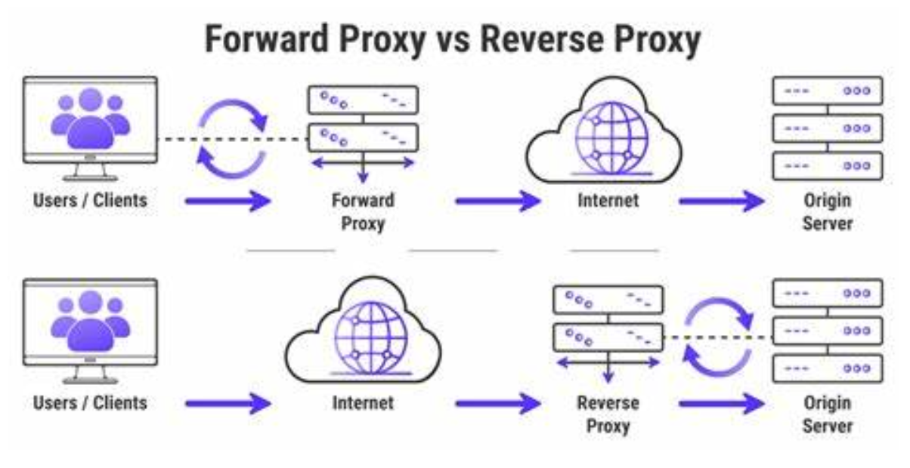

1. 正向代理 (Forward Proxy) —— 替客户端跑腿的“代购”
   - 正向代理是一个位于**客户端**和**原始服务器**之间的服务器。为了从原始服务器取得内容，客户端向代理发送一个请求并指定目标（原始服务器），然后代理向原始服务器转交请求并将获得的内容返回给客户端。
     - 💡 **生活比喻：** > 你想买一家海外商店（服务器）的商品，但因为某些原因你没法直接过去买。于是你找了一个**海外代购（正向代理）**。代购帮你去店里把东西买回来，然后再寄给你。对于商店（服务器）来说，它只知道是代购来买的东西，并不知道背后真正的买家是你。
   - 核心特点：
     - **客户端知道代理的存在**：客户端必须进行明确的配置（比如在浏览器里设置代理服务器的 IP 和端口）才能使用它。
     - **服务端不知道真实的客户端**：服务器只看到请求是从正向代理服务器发来的，从而**隐藏了客户端的真实 IP**。
   - 常见应用场景
     - **突破访问限制**：也就是俗称的“科学上网”或翻墙。
     - **访问控制与审计**：很多公司企业内部网络会设置正向代理，员工所有上网请求都必须经过它。公司可以通过它阻止员工访问某些钓鱼网站或娱乐网站，并记录上网日志。
     - **缓存加速**：如果多个员工都访问同一个公开网页，正向代理可以把网页缓存下来，后面的人再访问时直接返回缓存，节省公司带宽。
2. 反向代理 (Reverse Proxy) —— 替服务端迎客的“前台/接待员”
   - 反向代理正好相反，它位于**Internet**和**后端服务器集群**之间。对于客户端来说，反向代理服务器就像是原始服务器一样，客户端不需要进行任何特殊配置，直接向反向代理的地址发送请求即可。
     - 💡 **生活比喻：** > 你拨打 10086 客服电话（反向代理）。接通后，10086 系统会自动把你的电话分配给某一个具体的客服专员（后端服务器）来接听。作为用户的你，不需要知道、也无法得知具体是哪一个客服专员为你服务的，你只知道你找的是 10086。
   - 核心特点
     - **客户端不知道背后有多少台服务器**：客户端以为反向代理就是最终的目标服务器，直接给它发请求。
     - **隐藏了真实的后端服务器**：外网无法直接访问到真正的业务服务器，只能访问到反向代理，从而**保护了后端服务器的安全**。
   - 常见应用场景
     - **负载均衡 (Load Balancing)**：当网站流量巨大时，一台服务器扛不住。反向代理（如 Nginx）可以把海量请求均匀地分发到后端的几百台服务器上。
     - **安全防护 (WAF)**：反向代理作为网站的第一道防线，可以拦截恶意攻击（如 DDoS 攻击、SQL 注入），保护核心数据服务器。
     - **SSL 加密卸载**：把繁重的 HTTPS 证书加密/解密工作交给反向代理处理，后端的业务服务器只需要处理纯文本的 HTTP 请求，从而减轻后端服务器的 CPU 压力。
     - **动静分离**：图片、CSS、JS 等静态文件直接由反向代理服务器返回，而动态的业务请求才转发给后端的应用服务器（如 Tomcat、FastAPI 等）。

### Load Balance 负载均衡

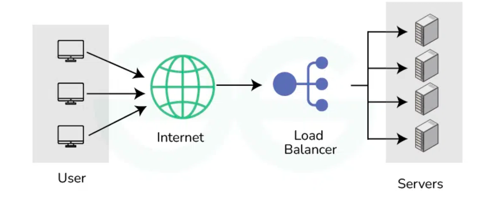

- Load balance is similar to reverse proxy but have different emphasizes.

  负载均衡与反向代理相似，但侧重点有所不同。

- A load balancer is a networking device or software application that distributes and balances the incoming traffic among the servers to provide **high availability, efficient utilization of servers, and high performance**.

  负载均衡器是一种网络设备或软件应用程序，用于在服务器之间分发和平衡传入流量，以提供高可用性、高效的服务器利用率和高性能。

- 与反向代理的侧重点并不相同。反向代理位于网络最前端，所有的外部请求都必须先经过反向代理。反向代理注重于如何隐藏后端真实服务器？如何统一入口？如何做安全防护和协议转换（比如把 HTTPS 解密成 HTTP）
- 负载均衡则主要负责把流量合理地分摊到多台服务器上。负载均衡主要关注的问题是后端哪台服务器现在比较闲？哪台服务器挂了（健康检查）？应该用什么策略（轮询、权重、IP Hash）把这个请求发过去。

### OSI and TCP/IP Model

OSI 模型是 ISO 组织设计的网络传输模型。完整的OSI模型是7层的。TCP/IP模型是4层

- OSI Model:
  - Application
  - Presentation
  - Session
  - Transport
  - Network
  - Link
  - Physical
- TCP/IP Model
  - Application
  - Transport
  - Internet
  - Network Access

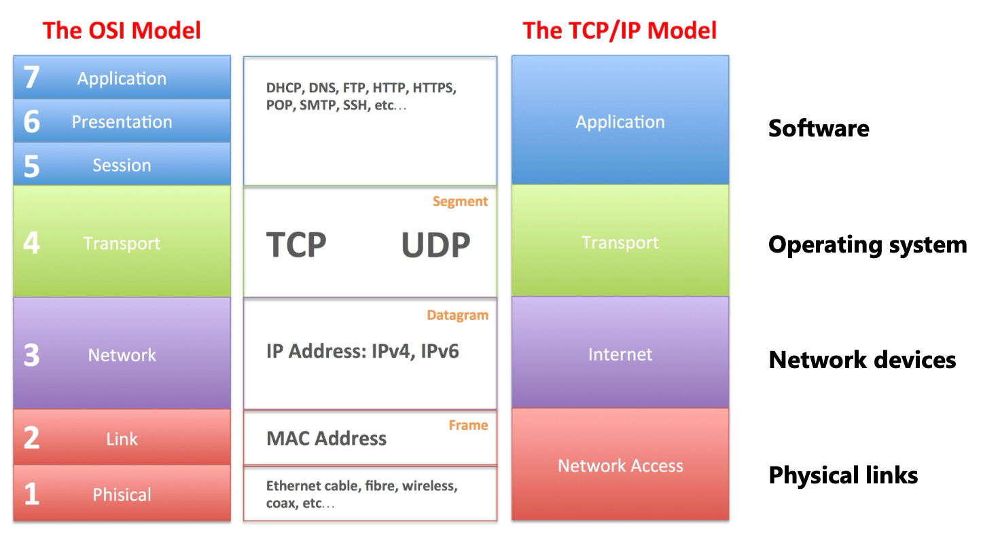

#### Layer 7 HTTP Proxy 

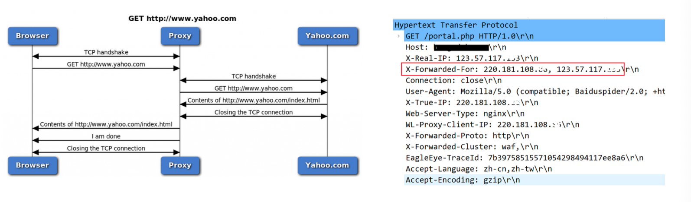

**Layer 7 HTTP Proxy** 指的是工作在 **OSI 第 7 层，也就是应用层 Application Layer** 的代理服务器。Layer 7 Proxy 处理的是 **HTTP/HTTPS 请求本身的内容**，不是单纯处理 IP 或端口。

在这一层，他能看懂 HTTP 请求内容的代理服务器。所以它比 Layer 4 Proxy 更“聪明”，但也因为要解析 HTTP 内容，所以开销会更大

```plaintex
- URL
- HTTP Method
- HTTP Header
- HTTP Request Body
- HTTP Response
- Cookie
- Path
- Host
```

Layer 7 HTTP Proxy 同时和客户端、后端服务器使用 **HTTP request / response** 进行通信。它自己本身也必须是一个 HTTP Server。

- Proxy talks with both client and back server with **HTTP** request/response
- Http proxy server itself must be a HTTP server! It is also called layer 7 proxy

```plaintex
Browser  →  HTTP Request  →  HTTP Proxy  →  HTTP Request  →  Backend Server

Browser  ← HTTP Response  ← HTTP Proxy  ← HTTP Response ← Backend Server
```

先接收 HTTP 请求，理解请求内容，然后再决定把请求转发到哪一个后端服务器。

##### Example:

一个浏览器、Proxy 和 Yahoo.com 之间的通信流程。图中有几个重要步骤：

```
Browser → Proxy：TCP handshake
Browser → Proxy：GET http://www.yahoo.com
Proxy → Yahoo.com：TCP handshake
Proxy → Yahoo.com：GET http://www.yahoo.com
Yahoo.com → Proxy：Content of Yahoo page
Proxy → Browser：Content of Yahoo page
```

这张图说明了一个重点：

**Layer 7 Proxy 不是只转发 TCP 包，而是会重新发起 HTTP 请求。**

也就是说，客户端并不是直接和后端服务器通信，而是先和 Proxy 通信。Proxy 收到请求后，再作为“新的客户端”去访问后端服务器。然后 Proxy 再把后端返回的 HTTP Response 交给原来的浏览器。

##### HTTP Header 的信息

HTTP 请求头的例子，里面可以看到类似：

```
GET /portal.php HTTP/1.1
Host: ...
Connection: ...
User-Agent: ...
Accept-Language: ...
Accept-Encoding: gzip
```

这些内容说明 Layer 7 Proxy 可以看到并处理 HTTP 层的信息。比如：

| HTTP 信息       | Layer 7 Proxy 可以做什么   |
| --------------- | -------------------------- |
| Host            | 根据域名转发到不同服务     |
| URL Path        | 根据路径转发到不同后端     |
| User-Agent      | 判断用户设备或浏览器       |
| Accept-Language | 判断语言偏好               |
| Cookie          | 做会话保持或用户识别       |
| Header          | 做权限、过滤、安全检查     |
| Body            | 对 POST 数据进行检查或转发 |

这也是 Layer 7 Proxy 和 Layer 4 Proxy 的最大区别：
 **Layer 7 能理解 HTTP 内容，Layer 4 通常只看 IP + Port。**

##### 为什么需要Layer 7

Layer 7 HTTP Proxy 的核心目的有三个：

- 第一，**让多台 Web Server 一起工作**。单台服务器处理能力有限，所以需要代理服务器把流量分配给多台服务器。

- 第二，**对外只暴露一个入口**。用户只需要访问一个域名，不需要知道后面到底有几台服务器。

- 第三，**根据 HTTP 内容做更细的转发**。比如 `/user/*` 转发到用户服务，`/order/*` 转发到订单服务，`/static/*` 由 Nginx 直接返回静态资源。

##### Apache 中的 Layer 7 Proxy

```plaintext
Apache has the proxy function
ProxyPass /ServerTest http://localhost:8080/
ProxyPassReverse /ServerTest http://localhost:8080/
Proxy rules are based on URL matching

当用户访问 /ServerTest 时
Apache 把请求转发到 http://localhost:8080/
```

| 配置             | 作用                                                     |
| ---------------- | -------------------------------------------------------- |
| ProxyPass        | 把某个 URL 路径代理到后端服务器                          |
| ProxyPassReverse | 修改后端返回中的跳转地址，让客户端仍然看到代理服务器地址 |
| URL matching     | 根据 URL 匹配规则进行转发                                |

关于 Apache 和 Apache Tomcat，常见结构是：

```
Browser → Apache HTTP Server → Tomcat
```

Apache 可以处理静态资源和代理转发，Tomcat 负责运行 Java Web 应用。

##### Nginx \- the King of soft HTTP Proxy

- Nginx is most efficient proxy server (software version).

  Nginx 是最高效的代理服务器（软件版本）。

- Nginx can server static contents.

  Nginx 可以服务静态内容。

- Nginx use multi-thread to gain the high performance.

  Nginx 使用多线程来获得高性能。

#### Layer 4 TCP/UDP Proxy

Layer 4 指的是网络模型中的 **第四层：传输层**。在课件的 OSI / TCP-IP 模型图中，第四层对应的是 **Transport layer**，主要协议是 **TCP 和 UDP**。所以 Layer 4 Proxy 也可以理解为 **TCP/UDP proxy**

##### IP + Port 转发

Layer 4 Proxy 的转发规则是基于 **IP + Port**。这说明 Layer 4 代理在转发请求时，主要根据目标 IP 地址和端口号来决定请求应该被转发到哪一台真实服务器。

因为Layer 4 Proxy 处理的是 TCP 或 UDP 包，而不是 HTTP request / response 的具体内容。

所以它不会关心：

```
URL
HTTP Header
Cookie
Request Body
```

它只关心：

```
IP 地址
端口号
TCP / UDP 包
```

##### LVS

- LVS (Linux virtual server) is a kernel service of Linux system

  LVS（Linux虚拟服务器）是Linux系统的一个内核服务。

- LVS share the VIP (virtual IP) with real severs

  LVS 与真实服务器共享 VIP（虚拟 IP）。

- LVS re-direct the request (TCP or UDP) packages to real servers

  LVS 将请求（TCP 或 UDP）数据包重定向到真实服务器

- Proxy rules based on ip+ports

  基于 IP+端口的代理规则

- Bandwidth of network card would be the bottle neck

  网卡的带宽将成为瓶颈。

## Nginx and Webservers

### Nginx

多个 Clients 先访问一个 Nginx Proxy Server，然后 Nginx 再把请求转发到后面的多个 Origin Servers。

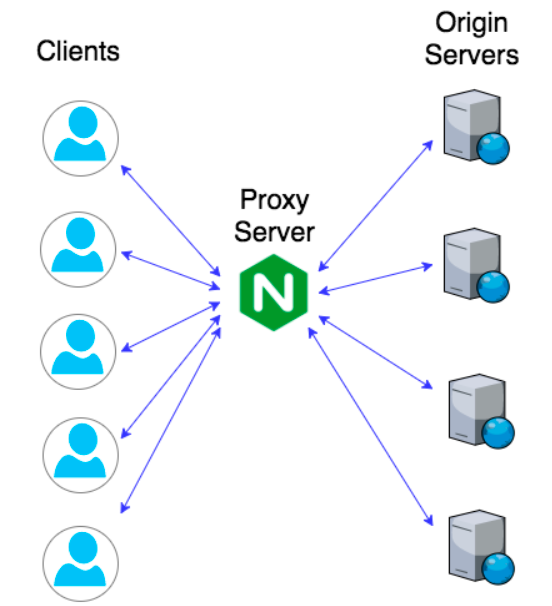

- The web should only publish one domain name to end user.

  网站对于终端用户只需发布一个域名。用户不需要知道后面有多少台真实服务器。Nginx 站在用户和真实服务器之间，负责把请求转发到后端服务器。

- Nginx is a strong web server.

  Nginx 是一款强大的 Web 服务器。

- Nginx can server the static contents.

  Nginx 可以服务器静态内容。

- Nginx set the proxy rules based on URL path.

  根据URL路径设置代理规则的Nginx配置

- There are 4 (can be any number) servers for dynamic contents proxying together by nginx.

  有4个（可以是任意数量）服务器通过nginx共同代理动态内容。

所以在 Web 层扩展中，Nginx 的第一个作用就是作为 **反向代理入口**，把用户请求转发到后端 Web Server。

##### 静态资源服务

Nginx 不只是转发请求，它还可以直接处理静态资源。

静态资源可以理解为不需要后端程序动态生成的文件，例如：

```
HTML
CSS
JavaScript
图片
```

在 Web 层扩展中，这样做的好处是：静态资源由 Nginx 直接返回，动态请求再交给后端服务器处理

这样可以减少后端 Web Server 的压力。

##### 基于 URL path 设置代理规则

```json
location /some/path {
  proxy_pass http://www.example/com/link/;
}
```

这说明 Nginx 可以根据用户请求的 URL 路径决定转发目标。

这里需要关注的一个点是 proxy_pass 中的链接最后是否携带 / 符号

- 携带 / 的案例：
  - 当一个用户访问你的服务器，请求地址为：`http://your_domain.com/some/path/index.html`
    1. Nginx 匹配到了 `location /some/path`。
    2. Nginx 拿掉匹配到的 `/some/path`，剩下 `/index.html`。
    3. Nginx 把剩下的部分拼接到 `proxy_pass` 的目标路由后面。
    4. **最终转发给后端的真实路由是：** `http://www.example.com/link/index.html`

- 不携带 / 时，Nginx 就不会做路径替换，而是直接把**整个客户端请求的路径**原封不动地拼接到域名后面。
  - 同样访问：`http://your_domain.com/some/path/index.html`
  - **最终转发的路由是：** `http://www.example.com/some/path/index.html`

##### 聚合多个动态内容服务器

Nginx 可以把多个动态内容服务器组织在一起，由 Nginx 统一代理。

也就是说，后端不再只是一台服务器，而可以是多台服务器共同工作：

```
Nginx
 ├── Dynamic Server 1
 ├── Dynamic Server 2
 ├── Dynamic Server 3
 └── Dynamic Server 4
```

这就是 Web 层扩展的核心思想之用多台服务器一起处理动态请求。

### Balancing Techniques 负载均衡算法

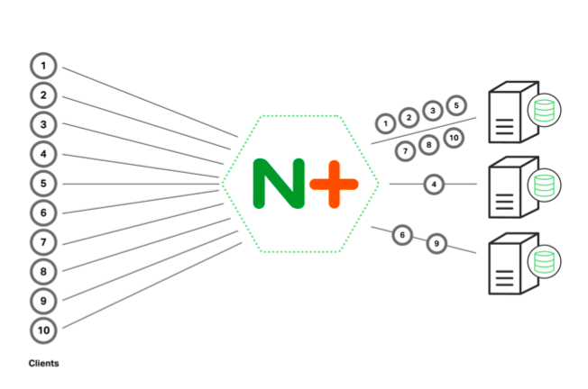

- Setting weight

  - Different server many have different capability

    不同的服务器通常性能也不同

  - A/B test

通过 weight 来给不同的服务器设置权重

```Nginx
upstream backend {
    server web1 weight=6;
    server web2 weight=3;
    server web3;
}
```

#### Round Robin 轮询

Round Robin (the default method): the load balancer runs through the list of upstream servers in sequence

轮询（默认方法）：负载均衡器按照上游服务器列表的顺序依次处理请求。

#### Hash 哈希

HASH: calculates a hash that is based on the combination of text and NGINX variables you specify

Hash 会根据指定的文本和 Nginx 变量计算一个 hash 值，然后根据这个结果选择后端服务器。

#### IP Hash

IP Hash 是根据客户端 IP 地址计算 hash，然后决定请求转发到哪台服务器。

在这种情况下，同一个客户端 IP 会被分配到同一台服务器，以 Client IP address 作为 Hash 的依据

#### Least Connections 最少连接

Least connections: compares the current number of active connections and sends the request to the server with the fewest connections.

Least Connections 会比较每台服务器当前的活跃连接数，然后把新请求发给连接数最少的服务器

#### Least Time 最短响应时间

Least time: combines two metrics for each server – the current number of active connections and a weighted average response time for past requests

Least Time 会结合两个指标：

- 当前活跃连接数
- 过去请求的加权平均响应时间

然后选择更合适的服务器。

它比 Least Connections 多考虑了响应时间，所以不是只看连接数，还会考虑服务器之前处理请求的速度。

### Health Check 健康检查

Use health_check to make sure all backend can work properly.

使用health_check确保所有后端都能正常工作。

在图片中，左边展示了 Frontend pod 和多个 Backend pods。Nginx 会对后端进行 health check。如果某个 backend 不正常，就不应该继续把请求发给它。

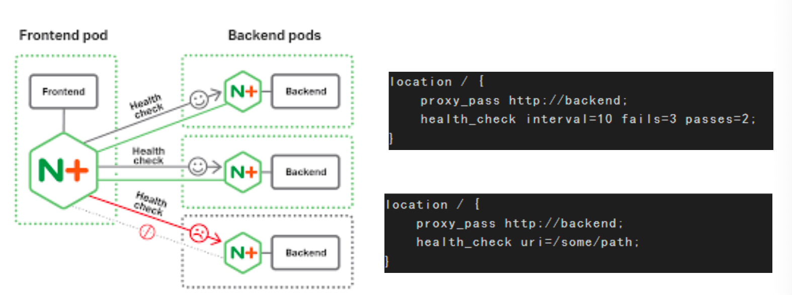

#### Up limiation for Nginx

- Up limitation depends on the many factors

  上限取决于多种因素

  - 服务器硬件资源
  - Nginx 配置
  - 请求处理复杂度
  - 后端响应情况

- Some report say it can support **30,000** con-concurrence with **sufficient** hardware resources

  在足够硬件资源下，有报告说 Nginx 可以支持大约 30000 并发。

- Nginx processes the request/response in HTTP Level

- To improve the load balance further, process the flow in network layer

  Nginx 是在 HTTP 层处理 request / response 的。如果还想进一步提升负载均衡性能，就需要在网络层处理流量。

## 网络基础：理解 LVS 的前置知识

### OSI 与 TCP/IP 模型

#### HTTP / DNS / FTP

HTTP、DNS、FTP 这类协议属于应用层。

应用层 = 用户或应用程序直接使用的协议层

- 浏览器访问网页 → HTTP / HTTPS
- 域名解析 → DNS
- 文件传输 → FTP

#### 传输层：TCP / UDP

TCP 和 UDP 属于传输层 

传输层 = 负责在两台主机之间传输数据

#### 网络层：IP

OSI 第 3 层是 **Network layer**，对应内容包括：

- IP address: IPv4, IPv6

这说明 IP 地址属于网络层

网络层 = 负责找到目标主机在哪里

IP 地址主要用来定位网络中的设备

#### 链路层：MAC

OSI 第 2 层是 **Link layer**，对应内容是：MAC Address

这说明 MAC 地址属于链路层

链路层 = 负责同一个局域网内设备之间的数据传递

#### 物理层：网线、光纤等

OSI 第 1 层是 **Physical layer**，对应内容包括：

- Ethernet cable, 
- fibre, wireless, 
- coax

这说明网线、光纤、无线信号等属于物理层。

简单理解：

物理层 = 真正传输电信号、光信号或无线信号的底层

### MAC 地址与 IP 地址

#### MAC：二层地址，物理地址

- 48 bit address
- Works at OSI layer 2 (link layer)
- Physical address
- Fixed, assigned by manufacturer

MAC 地址是二层地址，属于链路层，是设备的物理地址，通常由制造商分配。

MAC = 物理地址 = Layer 2

#### IP：三层地址，逻辑地址

- 32 bit address
- Works at OSI layer 3 (network layer)
- Logical address
- Can change depending on the network environment

IP 地址是三层地址，属于网络层，是逻辑地址，并且会随着网络环境改变。

IP = 逻辑地址 = Layer 3

#### MAC 与 IP 的区别总结

| 对比项   | MAC 地址               | IP 地址            |
| -------- | ---------------------- | ------------------ |
| 所属层级 | OSI Layer 2            | OSI Layer 3        |
| 地址类型 | Physical address       | Logical Address    |
| 是否固定 | 通常固定，由制造商分配 | 可根据网络环境改变 |
| 位数     | 48 bits                | 32 bits            |

### DNS

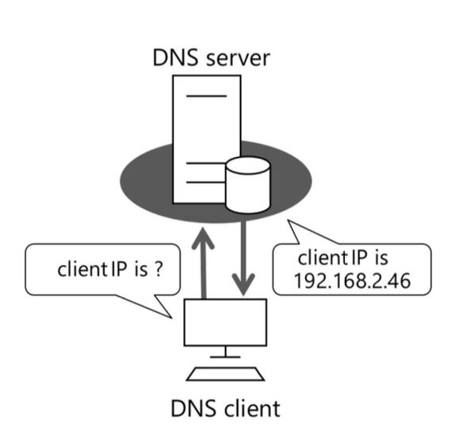

#### DNS：将域名解析为 IP 地址

Do you prefer remember 221.229.203.214 or www.taobao.com?

相比记住一串 IP 地址，人们更容易记住域名。

DNS = 把域名转换成 IP 地址，因为人类更容易记忆有规律的字母，但是机器只能通过 IP 地址来寻址。

这样用户只需要输入域名，系统通过 DNS 找到对应的 IP 地址。

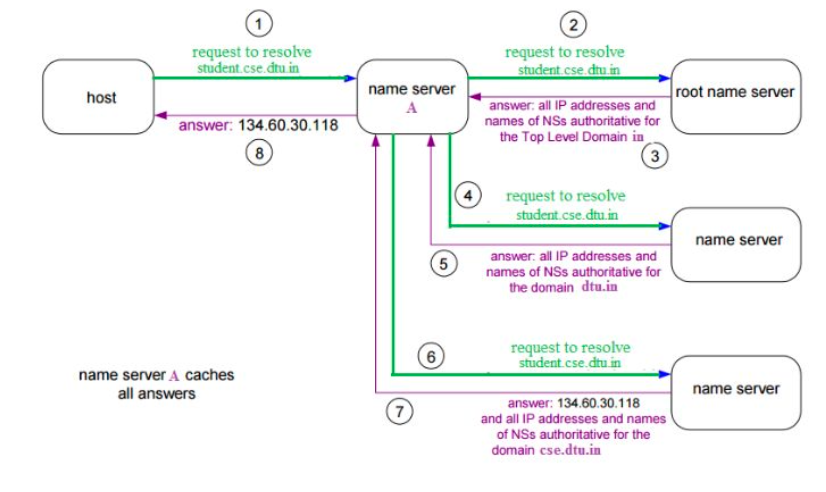

**递归查询（Recursive Query）**：发生在 **客户端（你的电脑） $\rightarrow$ 本地/递归 DNS 服务器** 之间。

- **特点**：客户端当“甩手掌柜”。客户端发一个请求，本地 DNS 服务器就必须负责到底，不管跑多少条街、问多少人，最终必须把结果（或者报错）反馈给客户端。

**迭代查询（Iterative Query）**：发生在 **本地/递归 DNS 服务器 $\rightarrow$ 根 / TLD / 权威 DNS 服务器** 之间。

- **特点**：被询问的服务器当“指路人”。根或 TLD 服务器不直接帮你去找，而是每次都告诉你“我不知道，但你可以去问下一级谁谁谁”，由本地 DNS 服务器自己亲自跑腿完成后续的询问。

### IPv4 与 IPv6

#### IPv4：32 bits

IPv4 Address Size: 32-bit number

IPv4 地址格式示例：

```
192.149.252.76
```

所以 IPv4 是 32 位地址，常见格式是点分十进制。

#### IPv6：128-bit

IPv6 Address Size: 128-bit number

IPv6 地址格式示例：

```
3FFE:F200:0234:AB00:0123:4567:8901:ABCD
```

所以 IPv6 是 128 位地址，地址空间比 IPv4 大很多

#### IPv4 与 IPv6 对比总结

| 对比项   | IPv4           | IPv6            |
| -------- | -------------- | --------------- |
| 部署时间 | 1981           | 1999            |
| 地址大小 | 32-bit         | 128-bit         |
| 地址格式 | 点分十进制     | 十六进制表示    |
| 示例     | 192.149.252.76 | 3FFE:F200:..... |

### Switch / Hub / Router

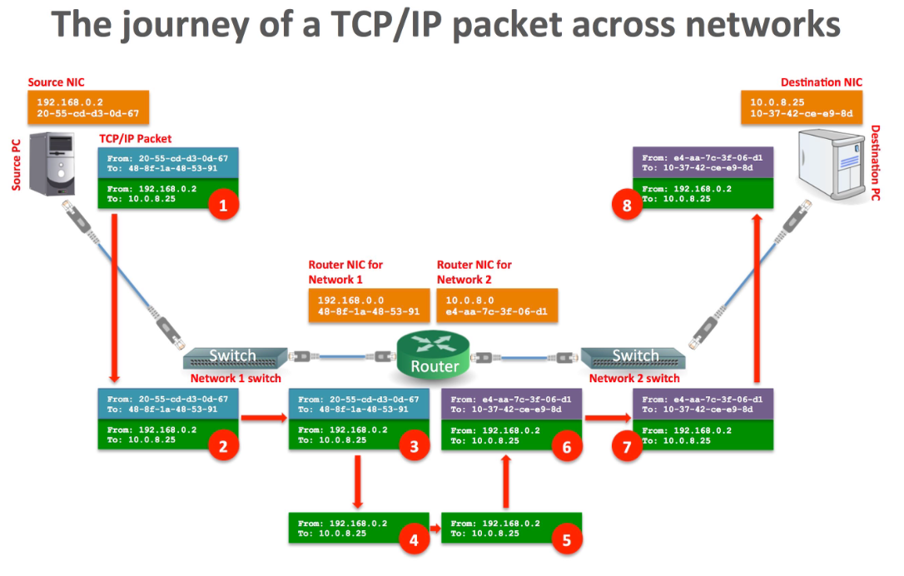

#### Switch / Hub：create network 创建网络

Switch 和 Hub 的作用是创建网络，也就是把多台设备连接到同一个网络中

Switch / Hub = 把多台设备连在一起，形成一个网络

#### Router：connect network 连接网络

Router 的作用是连接不同网络。

Router = 把不同网络连接起来

一个局域网想访问另一个网络，就需要 Router 来连接。

#### Switch / Hub / Router 对比总结

| 设备         | 作用             |
| ------------ | ---------------- |
| Switch / Hub | Create networks  |
| Router       | Connect networks |

### HTTP 与 TCP

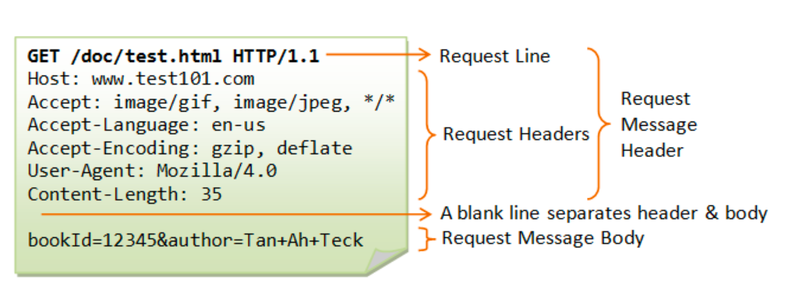

Http request/response will be transferred in TCP packages

HTTP请求/响应将以TCP数据包的形式传输

#### 一次 HTTP 请求可能拆分成多个 TCP 包

One http request/response may split to several TCP packages

HTTP 数据太大时可能不能一次全部传完所以会被拆成多个 TCP 包

#### 每一层封装与解析都会消耗资源

Every layer has a translation, it consumes resources

网络中每一层都需要进行转换或封装解析，这个过程会消耗资源。

应用层 HTTP
  ↓
传输层 TCP
  ↓
网络层 IP
  ↓
链路层 MAC
  ↓
物理层传输

## LVS：四层负载均衡

LVS 是 Linux 内核中的四层负载均衡服务，基于 IP + Port 转发 TCP/UDP 包；NAT 模式中请求和响应都经过 LVS，DR 模式中 LVS 主要处理请求包，Real Server 直接响应用户，因此性能更高，但需要处理 MAC、ARP 和 Loopback 问题。

### LVS 基本概念

#### Linux Virtual Server

LVS 的全称是 **Linux Virtual Server**，它是课件中 Layer 4 四层负载均衡的代表技术。

LVS = Linux 系统中的四层负载均衡技术

#### Linux 内核服务

LVS (Linux virtual server) is a kernel service of Linux system

LVS 是 Linux 系统的 **kernel service**，也就是 Linux 内核服务。

LVS 工作位置更底层

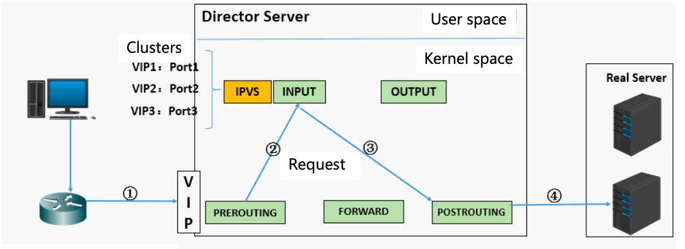

LVS 位于更靠近内核的位置，所以它处理的是更底层的 TCP/UDP 包。

#### 使用 VIP 虚拟 IP

LVS share the VIP (virtual IP) with real severs

VIP = Virtual IP 

可以这样理解:用户访问的是 VIP，但是真正处理请求的是后面的 Real Server

例如：

```
Client → VIP → LVS → Real Server
```

对用户来说，他只看到一个入口 IP；但在系统内部，请求会被分发到不同的真实服务器。

#### 将 TCP/UDP 请求转发到真实服务器

LVS re-direct the request (TCP or UDP) packages to real servers

LVS 会把 TCP 或 UDP 请求包重新定向到真实服务器。

LVS 转发的是 TCP/UDP packages

#### 规则基于 IP + Port

Proxy rules based on ip+ports

LVS 的代理规则基于 **IP + Port**。

LVS 会根据这些 IP 和端口信息决定把请求转发到哪台 Real Server。

### LVS 模式

LVS can work at three different modes.

LVS 可以工作在三种模式下：

- NAT Mode
- DR Mode
- TUN Mode

#### NAT Mode

Network Address Translation 网络地址转换

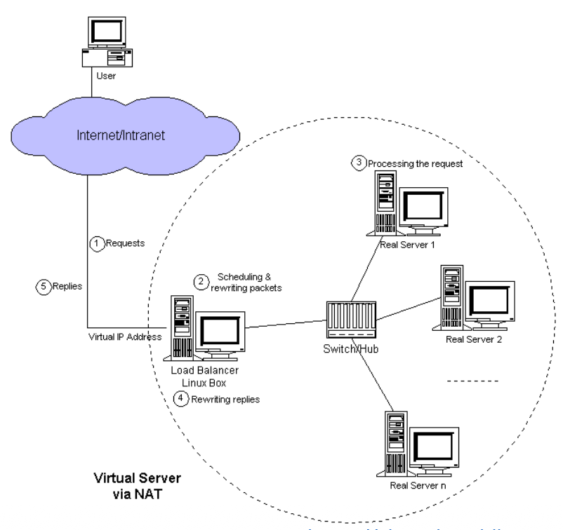

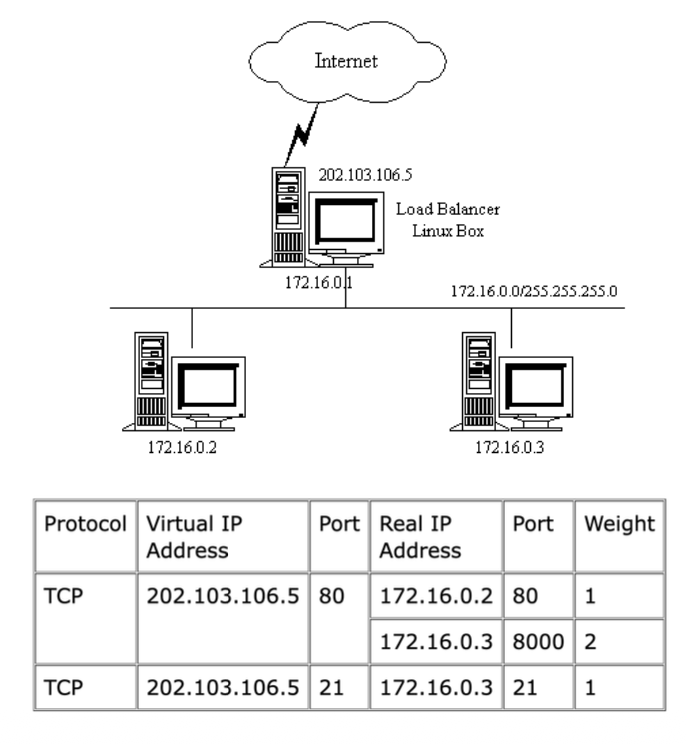

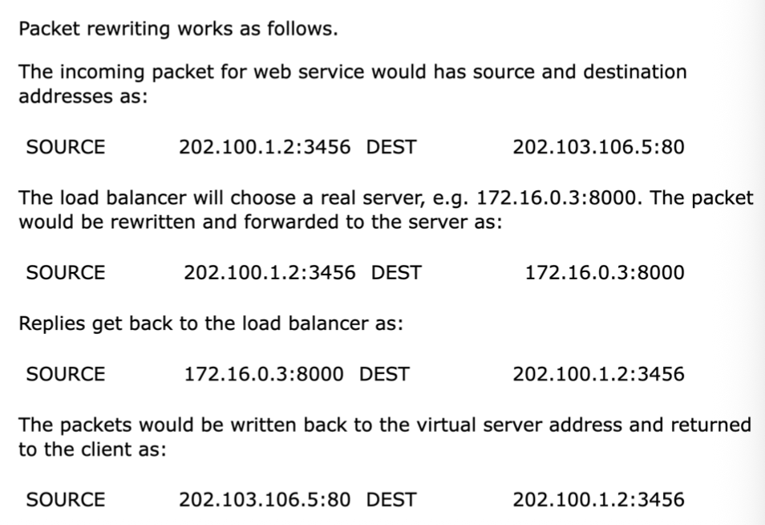

#### 请求和响应都经过 LVS

Both request and response pass LVS server

在 NAT 模式下，请求和响应都会经过 LVS 服务器。

```plaintext
Client
  ↓ request
LVS
  ↓ request
Real Server
  ↓ response
LVS
  ↓ response
Client
```

#### Real Server 需要把 LVS 设置为网关

RS (real server) need to set LVS server as gateway

因为响应也要通过 LVS 返回给用户，所以 Real Server 的出口需要经过 LVS。

### DR Mode

Direct Route 路由模式

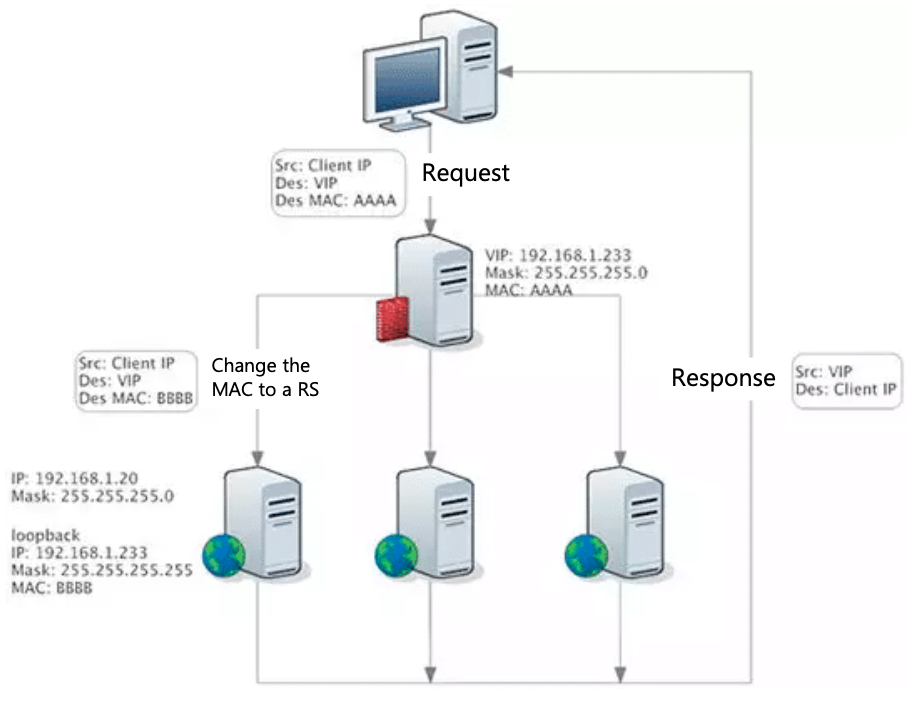

#### LVS 只处理请求包

LVS computer only “play” the request packages

LVS 只参与处理请求包

```plaintext
Client
  ↓ request
LVS
  ↓ request
Real Server
```

#### Real Server 直接响应用户

RS directly reply end-user

相应不再经过 LVS

DR Mode 的路径是:

```plaintext
Client
  ↓ request
LVS
  ↓ request
Real Server
  ↓ response
Client
```

#### 性能更高

- Normally, the request packages are small, the response packages are big
- This configuration can further improve the performance

通常请求包比较小，响应包比较大。DR 模式让 Real Server 直接回复用户，所以可以进一步提升性能。

所以 DR Mode 的性能通常更高

### TUN Mode

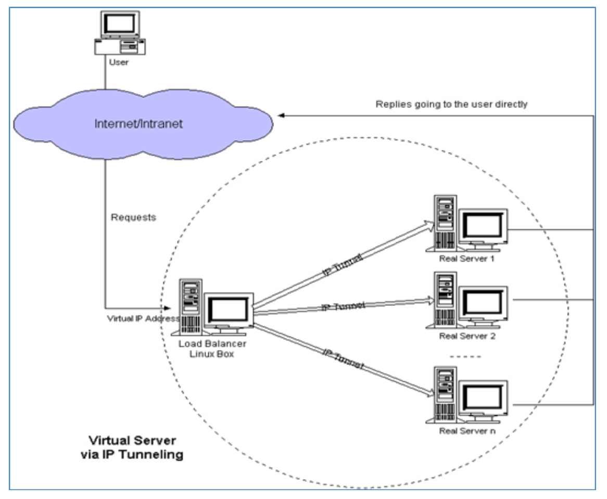

### ARP 与 Switch

#### Switch 通过 MAC 地址表转发数据

How does Switch build up the MAC address table?

Switch 如何建立 MAC 地址表？

Switch 根据 MAC 地址表决定数据发往哪个端口

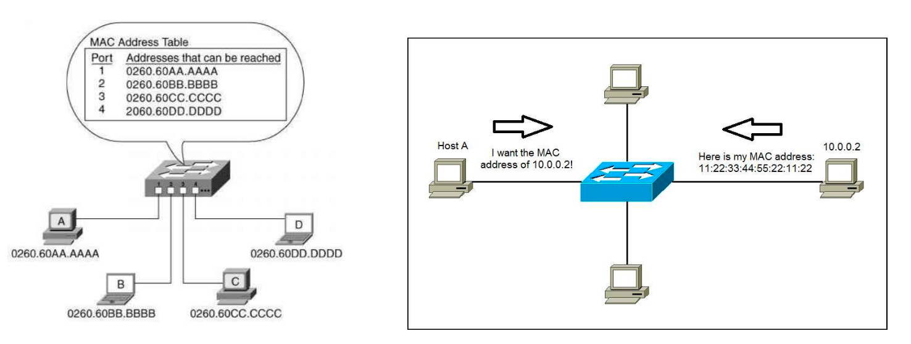

所以在 LVS DR 模式中，MAC 地址很重要，因为数据包到底被交换机送到哪台机器，和 MAC 地址有关。

#### DR 模式需要理解 MAC 转换

Change the MAC to a RS

在 DR 模式中，LVS 会把请求包的 MAC 地址改成某台 Real Server 的 MAC 地址。

需要注意的是：DR Mode 中，LVS 主要改变 MAC，而不是像 NAT 那样强调地址转换。

大概的流程如下：请求来到 LVS → LVS 选择一个 Real Server → LVS 把 MAC 改成该 Real Server 的 MAC → 请求被送到这个 Real Server

### Loopback / Localhost

#### Loopback 是虚拟网卡

The normal network card is called an Ethernet device；Loopback is an "virtual” network card type device.

普通网卡叫 Ethernet device，而 Loopback 是一种虚拟网卡类型的设备。

Loopback = virtual network card

#### 发送到 loopback 的流量会返回本机

Every traffic that you send to loopback will come back.

发送到 loopback 的所有流量都会回到本机。

发给 loopback 的流量不会真正发到外部网络而是回到本机

### DR 模式中的 ARP 处理

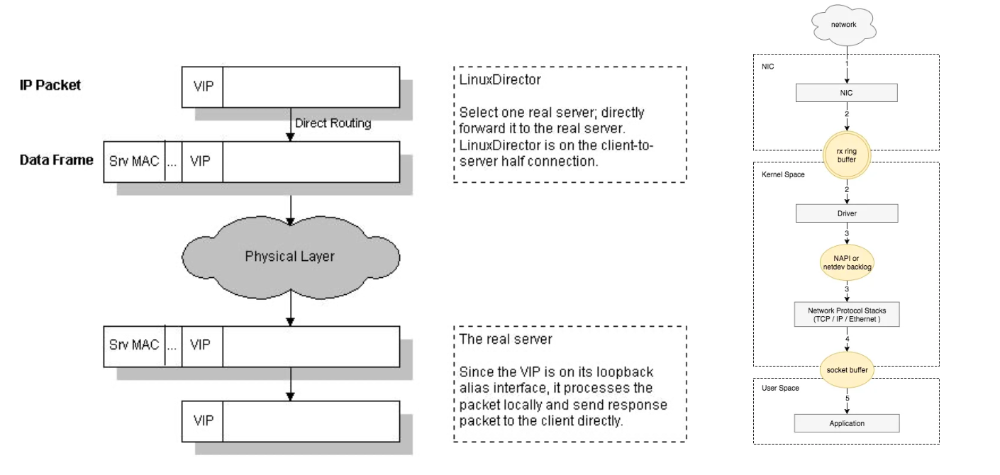

LVS – DR is a kind of “cheating”

Real server need to turn off ARP functions

Real Server 需要关闭 ARP 功能。

结合前面的 DR Mode 来看，原因是 DR 模式中 LVS 和 Real Server 会涉及 VIP、MAC 和 ARP 的配合。如果 Real Server 直接响应 ARP，可能会影响 LVS 对请求的调度。

## Nginx vs. LVS

### 两者关注的层级不同

They focus on different level: HTTP vs. TCP

也就是说，Nginx 和 LVS 主要区别在于它们处理的网络层级不同。

| 对比项   | Nginx                   | LVS        |
| -------- | ----------------------- | ---------- |
| 关注层级 | HTTP 层                 | TCP 层     |
| 对应类型 | Layer 7                 | Layer 4    |
| 处理对象 | HTTP request / response | TCP/UDP 包 |

Nginx 更关注 HTTP 请求内容；LVS 更关注 TCP 层的数据转发

#### Nginx 可以处理 URL / HTTP 请求信息

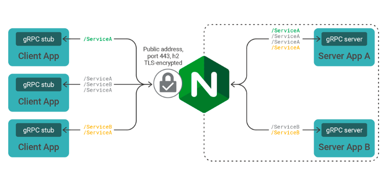

Nginx can handle the URL/HTTP request information

Nginx 可以根据 HTTP 层的信息做判断，包括 URL path, HTTP request, HTTP header.

所以 Nginx 更灵活，因为它能看懂 HTTP 请求内容

#### LVS 只处理 TCP 部分，所以速度更快

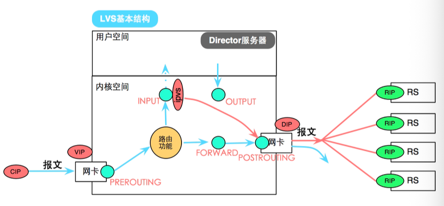

LVS is much fast since its only process the TCP part

LVS 更快，因为它只处理 TCP 部分，这样更底层更简单。

LVS 不需要理解 URL，也不需要解析 HTTP request / response。

#### Nginx 的上限与 LVS 的关系

Nginx processes the request/response in HTTP Level

To improve the load balance further, process the flow in network layer

Nginx 在 HTTP 层处理 request / response。如果想进一步提升负载均衡性能，就需要在更底层的网络层处理流量。

Nginx：功能更灵活，但处理 HTTP 会消耗更多资源

LVS：功能没那么灵活，但处理 TCP 层，所以性能更高

#### 最佳实践：LVS + Nginx

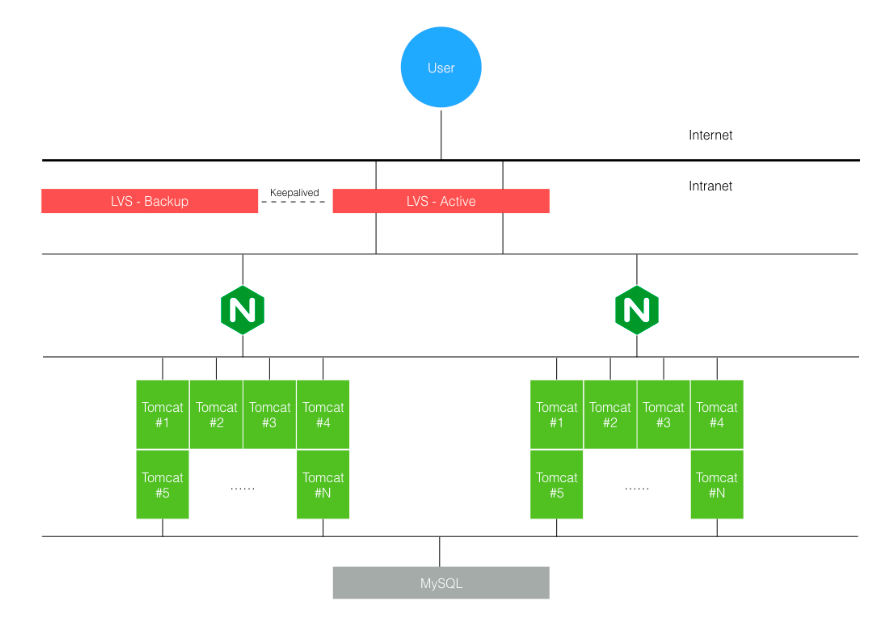

Normally, the LVS and Nginx are used together at different levels

实际架构中，LVS 和 Nginx 通常会在不同层级一起使用。

```plaintext
Internet
   ↓
LVS
   ↓
Nginx Cluster
   ↓
Web Servers
```

| 组件  | 主要作用                                   |
| ----- | ------------------------------------------ |
| LVS   | 在 Layer 4 做高性能流量分发                |
| Nginx | 在 Layer 7 处理 HTTP、URL path、反向代理等 |

## 高可用机制

当某一台关键服务器出现故障时，系统不能直接停止服务。

- Host Standby 主机预备
- VRRP (Virtual Routing Redundancy Protocol) 虚拟路由冗余协议
- keepalived

### Host Standby 主备

#### 两台服务器功能相同

Two “servers” has the same function.

- Server A：主服务器
- Server B：备用服务器

它们都可以完成同样的工作，只是正常情况下主要由主服务器对外提供服务。

#### 主服务器故障后切换到备用服务器

If the primary one is gone, switch to the secondary one by the client.

如果主服务器不可用了，就切换到备用服务器

```plaintext
正常情况：

Client
  ↓
Primary Server


故障后：

Client
  ↓
Secondary Server
```

#### VRRP (Virtual Routing Redundancy Protocol)

虚拟路由冗余协议

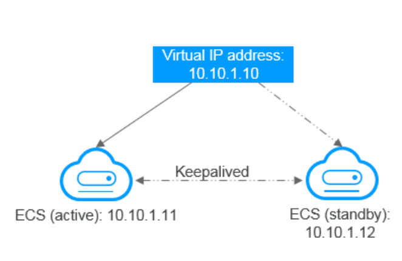

#### 主备服务器配置相同

Two “servers” has the same configuration.

- Active Server：当前工作的服务器
- Standby Server：备用服务器

它们配置相同，所以当主节点出现问题时，备用节点可以接替它的工作。

#### 备用节点检查主节点健康状态

Standby one would check the health of active one.

备用节点不是完全“什么都不做”，它会持续观察主节点是否还正常。

#### 主节点失效后备用节点接管流量

Once the active one is gone, the standby one would take over the network traffic.

一旦活动服务器失效，备用服务器就会接管网络流量。

```plaintext
正常情况：

Client
  ↓
Active Server


Active Server 故障后：

Client
  ↓
Standby Server
```

VRRP 的作用是让备用节点在主节点故障后接管流量。

负载均衡不只用于 Web Server，Nginx也可能需要负载均衡

#### 典型软件：keepalived

A typical software for this function: **keepalived**

### Keepalive / Keepalived

用于实现主备健康检查和流量接管的软件。

#### 负载均衡器自身也需要高可用

Load balance also need “keepalive”

前面我们讲过，LVS 和 Nginx 可以作为负载均衡入口。如果负载均衡器自己坏了，那么后面的服务器即使正常，也可能无法被用户访问。

#### 避免代理服务器成为单点故障

如果只有一台负载均衡器，它就可能成为系统的单点故障。

因为整个系统如果都依赖一台机器的话，如果它坏了，系统入口就失效了

所以需要一台主负载均衡器，一台备用负载均衡器。当主负载均衡器故障时，备用负载均衡器接管流量

```plaintext
正常情况：

Client
  ↓
Primary Load Balancer
  ↓
Backend Servers


故障后：

Client
  ↓
Standby Load Balancer
  ↓
Backend Servers
```

## 数据库拓展

### 数据库成为新的瓶颈

#### Web 层扩展后，DB 可能成为系统瓶颈

The database may become the bottleneck for the whole system.

当 Web 层通过 Nginx、LVS 等方式扩展之后，系统前端接收请求的能力提高了，但后面的数据库可能承受不了这么多请求，于是数据库就会成为新的瓶颈。

```plaintext
Web 层变强了
  ↓
更多请求进入系统
  ↓
数据库压力变大
  ↓
DB 可能成为新瓶颈
```

#### 数据库也需要负载均衡

Database also needs load balance.

数据库也需要负载均衡。

负载均衡不只用于 Web Server，数据库层也可能需要负载均衡

因为如果所有读写请求都压到一台数据库服务器上，当访问量变大时，这台数据库就可能撑不住。

### Dual Master MySQL

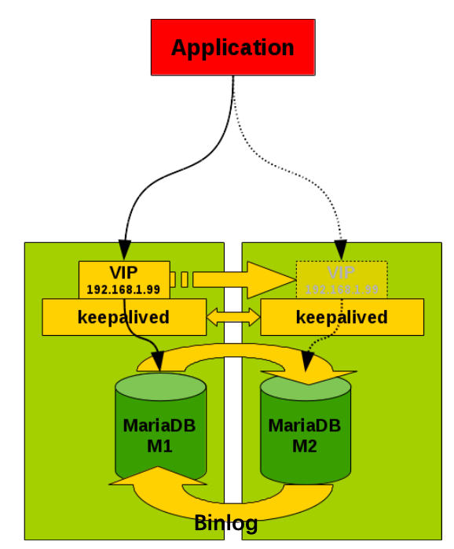

Binlog is the original commands applied to DB.

Binlog was used to replicate the data.

Binlog 记录的是应用到数据库上的原始命令，并且可以用来复制数据

```plaintext
数据库操作
  ↓
记录到 Binlog
  ↓
通过 Binlog 进行数据复制
```

#### 用于数据同步

因为 Binlog 被用来复制数据，所以在 Dual Master MySQL 中，它的主要作用是帮助两个数据库之间进行数据同步。

Binlog = 用于数据库之间的数据复制 / 同步

#### 不直接提升并发性能

No contribution to the con-currency performance.

Dual Master MySQL 中的 Binlog 复制并不会直接提升并发性能

它主要解决的是：数据复制 / 数据同步，而不是直接让数据库可以同时处理更多的请求。

#### 切换时可能出现数据不一致问题

During the switching, it would face the data inconsistency problem.

在主库切换过程中，可能会面对数据不一致问题。

两个 Master 之间需要同步数据，如果切换发生时数据还没有完全同步，就可能出现数据不一致。

### Master / Slave MySQL

#### 电商场景中读请求很多

For e-commerce application, “read” (i.e. search) takes a very large part of all requests.

#### Master 处理写

Only write would apply to master DB

只有写操作会应用到 Master DB

Master = 负责写

具体的写操作比如：新增订单，修改用户信息，更新库存

#### Slave 处理读

The slave DB only support “read”.

Slave DB 只支持读操作。

Slave = 负责读

具体的读操作包含：搜索商品，查看商品详情，查看用户信息

#### 提高读并发能力

more than one server to support the read. The “con-currency” capability would be extended.

可以使用多台服务器来支持读请求，从而扩展并发能力。

```plaintext
一个 Master 负责写
多个 Slave 负责读
  ↓
读请求被分散到多台数据库
  ↓
读并发能力提高
```

#### 应用层需要区分读写

The application need to distinguish the write and read in their code. It is not very friendly.

应用程序需要在代码中区分读请求和写请求，这样对开发并不是很友好。

- 这是读操作 → 发给 Slave
- 这是写操作 → 发给 Master

但是这种方式会增加应用层代码的复杂度。

### DB Proxy

#### 代理自动选择 Master 或 Slave

Proxy the DB cluster

Let the proxy smart choose the master or slave.

让代理智能地选择 Master 或 Slave

```plaintext
Application
   ↓
DB Proxy
   ↓
Master / Slave
```

应用程序不直接决定访问 Master 还是 Slave，而是交给 DB Proxy 判断。

#### 简化应用层代码

把读写选择逻辑从应用层移到代理层，这样应用层代码就不需要自己处理太多读写分发逻辑。

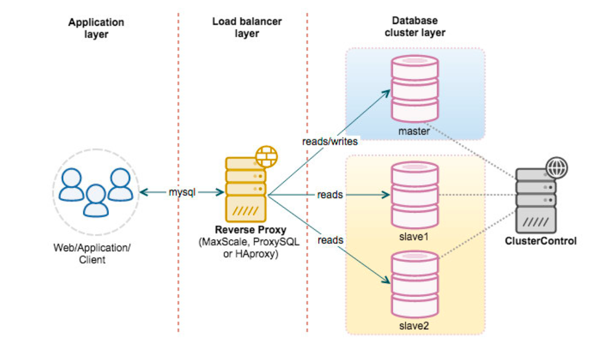

#### DB Proxy 本身也需要 keepalive

If the proxy server is broken…. We need to have a “keepalive” proxy server.

如果 proxy server 坏了，就需要有一个 keepalive 的 proxy server。

也就是说，DB Proxy 自己也可能成为关键节点。如果 DB Proxy 故障，应用可能无法正常访问数据库集群。

DB Proxy 也要有高可用机制

避免 DB Proxy 自己成为单点故障

## 系统架构演进

```plaintext
Mini-Web
  ↓
Monolithic Architecture
  ↓
Vertical Separation
  ↓
RPC / SOA / ESB
  ↓
Microservice Architecture
```

随着访问量和系统复杂度增加，系统会从简单的一台机器，逐渐演进到拆分服务、服务通信和微服务架构。

### Mini-Web

#### Web server 与 DB server 在同一台机器

In our labs, web server and DB server are running on the same computer.

在实验环境中，Web server 和 DB server 是运行在同一台电脑上的。

用户浏览器访问一台机器，这台机器上同时运行 **Apache** 和 **MySQL**。不过他们肯定是运行在相同机器但是不同的端口上

#### 适合实验或低流量场景

Both Web server and DB software (i.e. MySQL) cost hardware resources.
Once many users visiting the web concurrently ……

Web server 和数据库软件都会消耗硬件资源；如果很多用户同时访问，压力就会变大。

所以 min-web 更适合：实验环境，学习环境，低流量网站

它不适合高并发场景，因为 Web 和 DB 都在同一台机器上，会共同抢占 CPU、内存、磁盘和网络资源

### Monolithic Architecture 单体架构

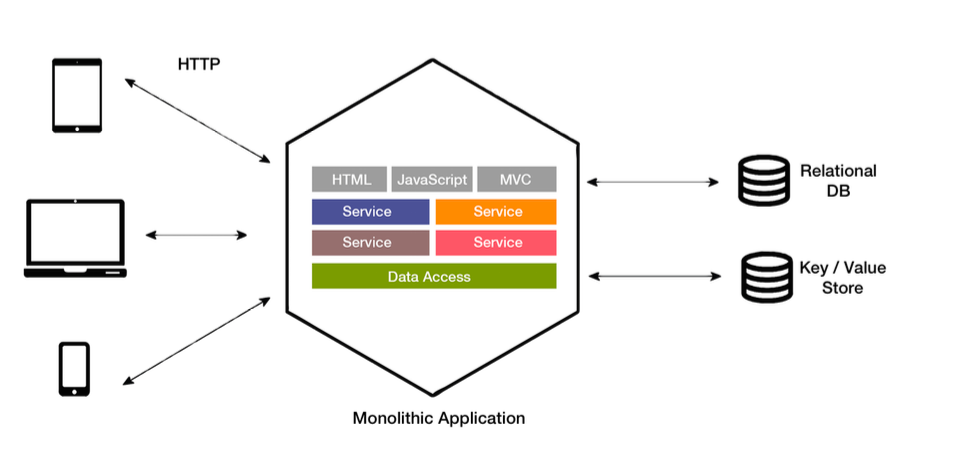

When the traffic is very low, there is only one application, all the features are deployed together to reduce the deployment node and cost.

当流量很低时，可以只有一个应用，把所有功能部署在一起，从而减少部署节点和成本。

```plaintext
One Application
├── User
├── Order
├── Product
├── Payment
└── Other functions
```

#### 适合低流量

Only in the situation when the traffic is very low

原因是这一类的应用部署简单，成本较低，系统结构不复杂

#### ORM 简化 CRUD

At this point, the data access framework (ORM) is the key to simplifying the workload of the CRUD.

在单体架构阶段，ORM 这类数据访问框架可以简化 CRUD 的工作量

ORM = 帮助简化数据库操作

#### 可通过增加应用实例进行初步扩展

Load balancing can be used for scaling application instances to cope with the growth of user request volume.

当用户请求量增长时，可以通过负载均衡扩展应用实例。

也就是说，虽然还是单体应用，但可以部署多个相同实例：

```plaintext
Load Balancer
├── Monolithic App 1
├── Monolithic App 2
└── Monolithic App 3
```

这样可以初步提高系统处理请求的能力。

### Vertical Separation 垂直拆分

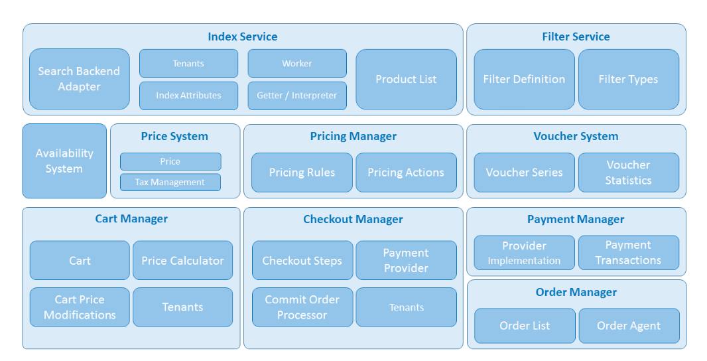

#### 按业务功能拆分应用

When the traffic gets heavier, add monolithic application instances can not accelerate the access very well, one way to improve efficiency is to split the monolithic into discrete applications.

当流量变得更重时，只增加单体应用实例已经不能很好地提升访问效率，这时可以把单体应用拆成多个独立应用。

简单来说就是讲一个大应用按照业务拆分成多个小应用

#### 不同功能部署为不同集群

Different functions can be encapsulated in the different components. Each components can be deployed as an individual cluster.

不同功能可以封装到不同组件中，每个组件都可以作为独立集群部署。

每个业务模块可以单独部署和扩展。

#### user / order / account / course 等

这些都可以理解为不同业务功能。它们可以被拆分成不同组件，并分别部署为独立集群。

```plaintext'
/user/*    → User Application Cluster
/order/*   → Order Application Cluster
/account/* → Account Application Cluster
/course/*  → Course Application Cluster
```

### RPC

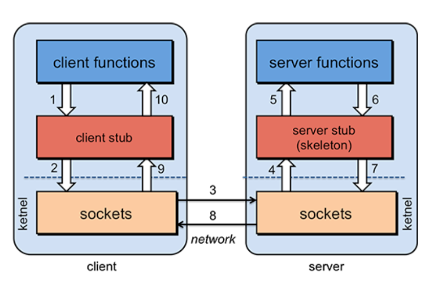

#### Remote Procedure Call

所以 RPC 的全称是 **Remote Procedure Call**，即远程过程调用

#### 远程调用其他机器上的过程 / 函数

In 1984, Birrell and Nelson devised a mechanism to allow programs to call procedures on other machines.

RPC 是一种机制，允许程序调用其他机器上的过程。RPC 解决的是：拆分后的不同应用之间如何互相调用

#### 可基于 TCP 或 HTTP

RPC can over TCP or HTTP layer.

RPC 可以基于 TCP 层，也可以基于 HTTP 层。所以 RPC 不是只绑定某一种协议，它可以通过不同网络层方式实现远程调用。

#### HTTP API 也是 RPC 的一种

HTTP API is one kind of RPC.

通过 HTTP 请求调用另一个服务的接口，也可以看成一种远程过程调用

### SOA

#### Service-Oriented Architecture

所以 SOA 的全称是 **Service-Oriented Architecture**，即面向服务架构

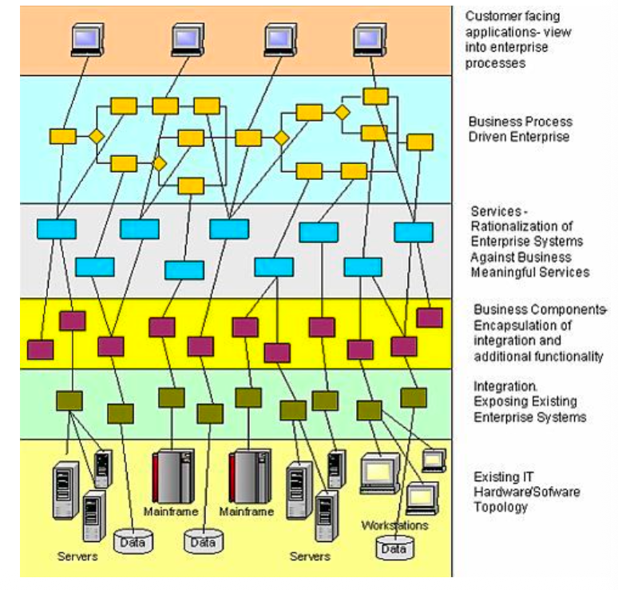

#### 服务可以跨平台、跨语言通信

Service-oriented architecture (SOA) is a software development model that allows services to communicate across different platforms and languages to form applications.

SOA 是一种软件开发模型，允许服务跨不同平台和语言进行通信，从而组成应用。

重点是：不同平台，不同语言，服务之间仍然可以通信

#### 服务是自包含的软件单元

In SOA, a service is a self-contained unit of software designed to complete a specific task.

在 SOA 中，服务是一个自包含的软件单元，用来完成一个特定任务。

一个服务 = 完成一个明确任务的软件单元

#### 强调松耦合

Service-oriented architecture allows various services to communicate using a loose coupling system

SOA 允许不同服务通过松耦合系统进行通信

服务之间不要过度依赖，一个服务变化时，尽量减少对其他服务的影响

### ESB

#### Enterprise Service Bus

其中 ESB 指的是 **Enterprise Service Bus**，也就是企业服务总线。

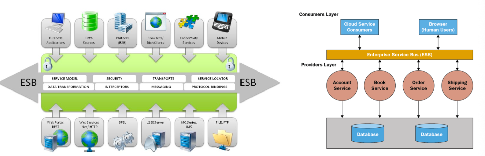

#### 企业级服务总线

ESB is an implementation architecture.

It is a set of rules and principles for integrating numerous applications together over a bus-like infrastructure

ESB 是一种实现架构，它通过类似总线的基础设施，把大量应用集成在一起

ESB = 用一条“总线”把很多企业应用连接起来

#### 通常与 SOA 配合

Normally, the enterprise project used ESB solutions with the SOA design

通常企业项目会使用 ESB 方案配合 SOA 设计

SOA 是架构思想，ESB 是常见实现方式之一

#### 偏 top-down 设计

Normally, ESB is top-down design

ESB 通常是自上而下的设计。

ESB = top-down design

### Microservice Architecture 微服务架构

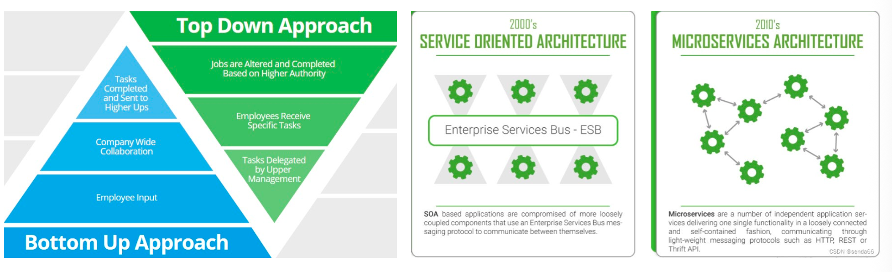

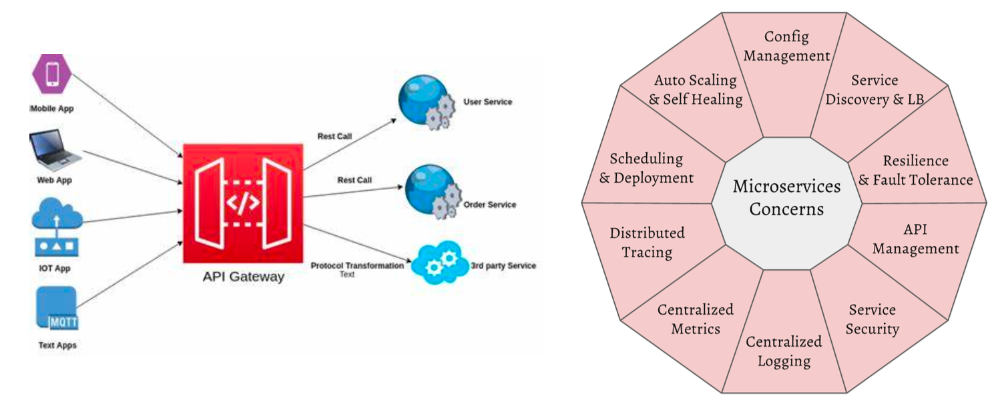

#### 使用 API Gateway 替代 ESB

Using API gateway to replace ESB

意思是：微服务架构使用 API Gateway 替代 ESB。

可以简单理解为：

```
SOA + ESB
  ↓
Microservice + API Gateway
```

#### 基础功能也作为服务

Build the necessary fundamental functions also as services

意思是：把必要的基础功能也构建为服务。

也就是说，在微服务架构中，不只是业务功能可以拆成服务，一些基础能力也可以做成服务。

#### 服务发现

你给出的 **服务发现** 和课件第 **57 页** 的 “fundamental functions also as services” 相关，也和第 **59 页** 的标题 **Service Registry and Discovery** 对应。第 59 页写到：

Dynamic register the providers in Eureka service

意思是：服务提供者可以动态注册到 Eureka 服务中。

这里先按你的知识点范围简单理解为：

```
服务发现 = 找到某个服务在哪里
```

#### 配置管理

属于“necessary fundamental functions”这一类基础功能。

可以简单理解为：

```
配置管理 = 对多个服务的配置进行统一管理
```

#### 日志、监控、追踪

日志、监控、追踪 可以归入微服务中需要建设的基础功能。

简单理解：

```
日志 = 记录服务运行信息
监控 = 观察服务是否正常
追踪 = 查看一次请求经过了哪些服务
```

#### 自动扩展与自愈

自动扩展与自愈细节可以归入微服务架构中的基础支撑能力。

简单理解：

```
自动扩展 = 请求变多时增加服务实例
自愈 = 服务异常时自动恢复或替换
```

#### 安全与容错

属于微服务架构中需要配套的基础能力。

简单理解：

```
安全 = 控制谁可以访问服务
容错 = 某个服务出问题时，系统尽量不要整体崩溃
```

## 微服务技术栈

这一部分主要讲微服务架构中一些常见技术组件，包括：

- Apache Dubbo
- Spring Cloud
- Eureka
- Zuul
- Ribbon
- Feign

它们的共同作用是：帮助多个微服务之间完成 **注册、发现、调用、网关转发和负载均衡**。

### Apache Dubbo

#### 使用 Zookeeper 做注册与发现

Dubbo use zookeeper for registry and discovery

Dubbo 使用 **Zookeeper** 来做服务注册与服务发现。

可以简单理解为：

```
服务提供者启动后
  ↓
注册到 Zookeeper

服务消费者需要调用服务时
  ↓
从 Zookeeper 找到服务位置
```

所以这里的重点是：

```
Zookeeper 在 Dubbo 中负责 registry and discovery
```

也就是记录服务在哪里，并帮助其他服务找到它。

#### 使用 Gateway 对外提供服务

It uses a gateway to provide the service to outside world.

意思是：Dubbo 使用 Gateway 向外部世界提供服务。

可以理解为：

```
Outside World
      ↓
Gateway
      ↓
Dubbo Services
```

也就是说，外部用户或外部系统不一定直接访问内部服务，而是通过 Gateway 进入系统。

### Spring Cloud

#### Spring Boot 打包每个服务

Spring boot is a new way to pack each service with a web server

意思是：Spring Boot 是一种把每个服务和 Web Server 打包在一起的新方式。

可以简单理解为：

```
一个微服务
  =
业务代码
  +
内置 Web Server
```

这样每个服务可以比较独立地运行。

#### 内置很多基础服务能力

Build-in services for fundamental functions

意思是：Spring Cloud 内置了一些用于基础功能的服务能力。

这里按你给出的知识点范围，只需要记住：

```
Spring Cloud 提供微服务所需的一些基础功能支持
```

比如后面课件中出现的 Eureka、Zuul、Ribbon、Feign，就属于 Spring Cloud 微服务体系中常见的组件。

#### 社区成熟

Spring cloud is from Netflix and be famous “Spring” with mature community

意思是：Spring Cloud 来自 Netflix，并依托著名的 Spring 生态，有成熟社区。

所以这里重点是：

```
Spring Cloud 有成熟的 Spring 社区支持
```

### Eureka

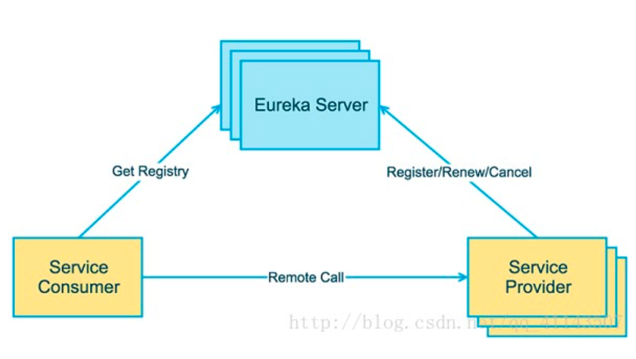

#### 服务注册与发现

Spring cloud – Service Registry and Discovery

并且写到：

```
Dynamic register the providers in Eureka service
```

意思是：服务提供者可以动态注册到 Eureka 服务中。

所以 Eureka 的作用可以记为：

```
Eureka = 服务注册与发现
```

可以简单画成：

```
Service Provider
      ↓ register
Eureka
      ↑ discover
Service Consumer
```

也就是说，服务提供者把自己注册进去，服务调用方通过 Eureka 找到可用服务。

### Zuul

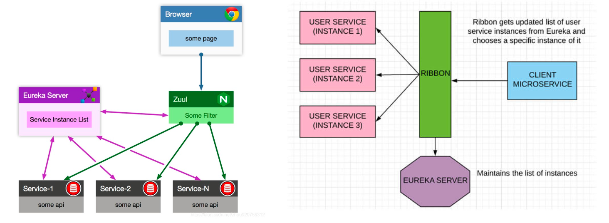

#### API Gateway

这里说明 Zuul 的角色是 **Gateway**。

可以理解为：

```
External Requests
      ↓
Zuul Gateway
      ↓
Internal Services
```

也就是说，外部请求先进入 Zuul，然后再进入内部服务。

#### 过滤外部请求

filter the external requests

意思是：Zuul 可以过滤外部请求。

所以 Zuul 的两个重点是：

```
Zuul = Gateway
Zuul = filter external requests
```

简单理解：它站在系统入口处，对外部来的请求做统一处理和过滤。

### Ribbon

#### 客户端负载均衡

Ribbon is responsible for load balance

意思是：Ribbon 负责负载均衡。

这里你给出的知识点是：

```
客户端负载均衡
```

可以简单理解为：服务调用方在调用其他服务时，通过 Ribbon 选择具体调用哪一个服务实例。

例如：

```
Order Service 想调用 User Service
User Service 有多个实例
Ribbon 帮忙选择其中一个实例
```

重点记忆：

```
Ribbon = 负责 load balance
```

## Feign

#### 服务调用

Call the services through Zuul or Feign

意思是：可以通过 Zuul 或 Feign 调用服务。

所以 Feign 的作用可以记为：

```
Feign = 服务调用
```

简单理解：

```
一个服务需要调用另一个服务
  ↓
可以通过 Feign 来完成调用
```

## 云计算与容器化

### Cloud Computing

#### 应用与硬件解耦

De-couple the application with hardware

意思是：云计算的一个重要思想是让应用程序和具体硬件解耦。

简单理解：

```
传统方式：
应用运行在某一台固定服务器上

云计算方式：
应用不强绑定某一台具体机器
```

也就是说，应用不再必须依赖某一台固定物理服务器，而是可以运行在云平台提供的资源之上。

#### 硬件成为资源池

Hardware are resources pools

意思是：硬件会被抽象成资源池。

可以理解为：

```
很多台物理服务器
  ↓
被统一管理
  ↓
形成 CPU / 内存 / 存储 / 网络资源池
```

应用需要资源时，不需要关心具体是哪一台机器提供，只需要从资源池中分配资源。

### Virtualization 虚拟化

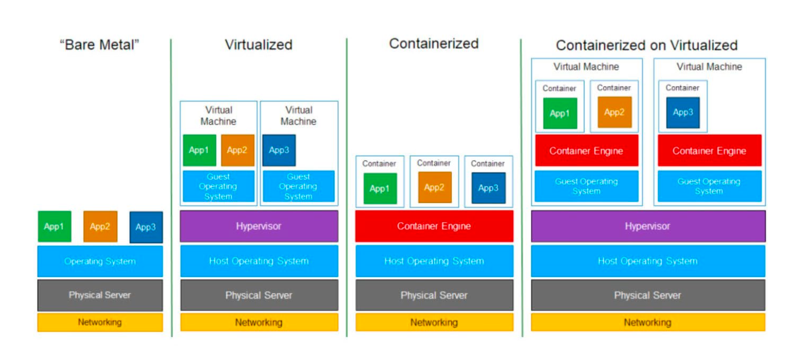

云计算图片中展示了从底层硬件到上层应用的结构，其中包含虚拟化相关概念。

在这里按你的知识点范围，可以简单理解为：

```
Virtualization = 把物理硬件抽象成多个虚拟运行环境
```

例如，一台物理服务器可以被划分成多个虚拟服务器，每个虚拟服务器都像一台独立机器一样运行应用。

它和前面的云计算思想有关：

```
虚拟化帮助实现硬件资源池化
```

### Containerization 容器化

Spring Cloud 与 Kubernetes 的关系，而 Kubernetes 通常和容器化部署有关。

可以简单理解为：

```
Containerization = 把应用和它需要的运行环境打包在一起
```

也就是说，一个服务可以被打包成容器，然后更方便地部署、迁移和运行。

这里先记住：

```
容器化是为了让应用部署更加统一和方便
```

### Kubernetes

#### 与 Spring Cloud 有部分功能重叠

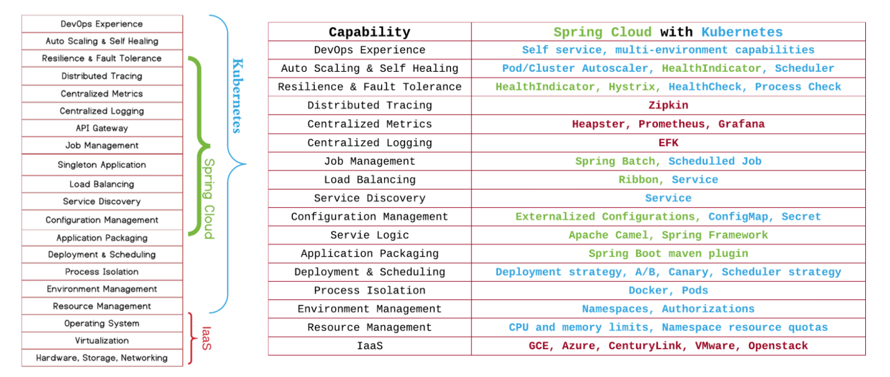

Spring cloud vs. Kubernetes

并且写到：

```
Different frameworks may supply the duplicates functions.
```

意思是：不同框架可能会提供重复的功能。

所以 Kubernetes 和 Spring Cloud 之间可能存在部分功能重叠。

简单理解：

```
Spring Cloud 提供一些微服务治理能力
Kubernetes 也提供一些应用部署和管理能力
两者在某些功能上可能重复
```

#### 自动扩展

结合 “frameworks may supply duplicate functions” 的意思，自动扩展可以理解为 Kubernetes 可能提供的一类基础能力。

简单理解：

```
自动扩展 = 当访问压力变大时，自动增加服务实例
```

#### 健康检查

健康检查也是 Kubernetes 和微服务框架可能重复提供的基础能力之一。对应“功能可能重复”这一点。

简单理解：

```
健康检查 = 检查服务实例是否正常运行
```

如果某个实例异常，系统可以发现它。

#### 服务发现

服务发现也属于 Kubernetes 和 Spring Cloud 可能共同涉及的能力。强调不同框架可能提供重复功能。

简单理解：

```
服务发现 = 找到某个服务当前运行在哪里
```

#### 配置管理

配置管理也可以理解为应用部署和运行中的基础管理能力。它与课件第 **62 页** 所说的框架功能重叠有关。

简单理解：

```
配置管理 = 管理服务运行需要的配置内容
```

#### 资源管理

资源管理与 “Hardware are resources pools” 关系最直接。云计算把硬件变成资源池，而 Kubernetes 可以用于管理这些应用运行所需资源。

简单理解：

```
资源管理 = 管理 CPU、内存、存储、网络等资源的分配和使用
```

### 技术选型原则

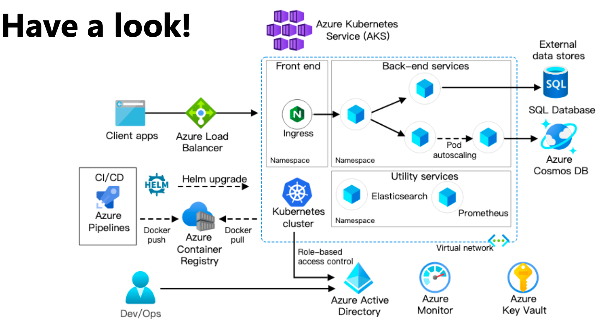

#### 没有最好的技术，只有最合适的组合

It is a challenge job to choose the RIGHT combinations.

意思是：选择正确的技术组合是一件有挑战的事情。

并且进一步强调：

There is no best technologies, choosing the SUITABLE one!

意思是：没有最好的技术，只有选择合适的技术。

所以这部分最重要的结论是：

```
技术选型不是堆越多越好
而是根据系统需求选择合适组合
```

## 全球化流量分发

### DNS Balance

#### 一个站点拆成多个站点

Split one site to many sites

意思是：可以把一个站点拆成多个站点。

简单理解：

```
原来：
一个网站只对应一个中心站点

后来：
同一个网站可以在多个地区部署多个站点
```

#### 给不同用户返回不同 IP

Response different IP address to different clients

意思是：DNS 可以给不同客户端返回不同的 IP 地址。

例如：

```
中国用户 → 返回中国站点 IP
欧洲用户 → 返回欧洲站点 IP
美国用户 → 返回美国站点 IP
```

这样不同用户访问的其实是不同地区的服务器。

#### 适合全球化应用

Widely used for global applications

意思是：DNS Balance 被广泛用于全球化应用。

因为全球用户分布在不同地区，如果都访问同一个远距离服务器，访问延迟会比较高。

#### 让用户访问最近站点以降低延迟

Serve the customer with the local/nearest site

意思是：让用户访问本地或最近的站点。

课件也说明：

long distance net means long delay

意思是：网络距离越远，延迟越高。

所以 DNS Balance 的核心作用是：

```
把用户导向更近的站点
从而降低访问延迟
```

## CDN

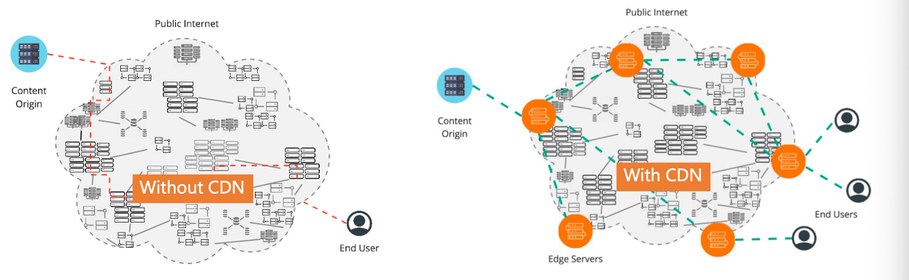

### Content Delivery Network

CDN – Content Delivery Network

所以 CDN 的全称是：

```
Content Delivery Network
```

即内容分发网络。

### 主要用于静态资源

CDN means content delivery network, mainly for static resources

意思是：CDN 主要用于静态资源。

静态资源可以简单理解为：

```
图片
CSS
JavaScript
视频
静态文件
```

### 需要在各地部署服务器资源

CDN means you need to have server resources everywhere

意思是：CDN 需要在很多地方拥有服务器资源。

也就是说，CDN 的基本思想是：

```
把静态资源放到离用户更近的服务器节点上
```

### 降低远距离访问延迟

- Without CDN
- With CDN

没有 CDN 时，用户需要访问较远的源站；有 CDN 时，用户可以访问更近的 CDN 节点。

所以 CDN 的作用可以总结为：

```
通过分布在各地的服务器节点
让用户从更近的位置获取静态资源
从而降低访问延迟
```

## 分布式系统理论：CAP Theorem

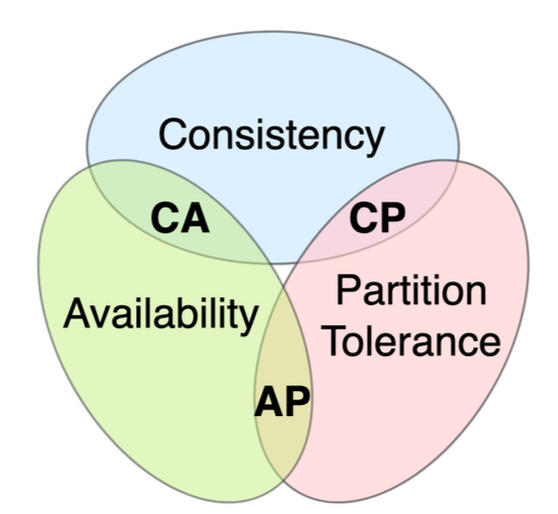

CAP theorem

它是分布式系统中的一个基础理论。

### Consistency 一致性

Every read receives the most recent write or an error.

意思是：每一次读取都能读到最近一次写入的数据，或者返回错误。

简单理解：

```
Consistency = 读到的数据必须是最新的
```

### Availability 可用性

Every request receives a (non-error) response, without the guarantee that it contains the most recent write.

意思是：每个请求都能收到一个非错误响应，但不保证这个响应一定包含最新写入的数据。

简单理解：

```
Availability = 每个请求都能得到响应
```

但是这个响应不一定是最新数据。

### Partition Tolerance 分区容错性

The system continues to operate despite an arbitrary number of messages being dropped or delayed by the network between nodes.

意思是：即使节点之间的网络消息丢失或延迟，系统仍然继续运行。

简单理解：

```
Partition Tolerance = 网络出问题时系统仍然能继续工作
```

### 分布式数据系统最多只能同时很好满足其中两个

any distributed data store can provide only two of the following three guarantees

意思是：任何分布式数据存储系统最多只能同时提供 CAP 三者中的两个保证。

也就是说：

```
Consistency
Availability
Partition Tolerance
```

这三者不能在分布式系统中同时被完美满足。
