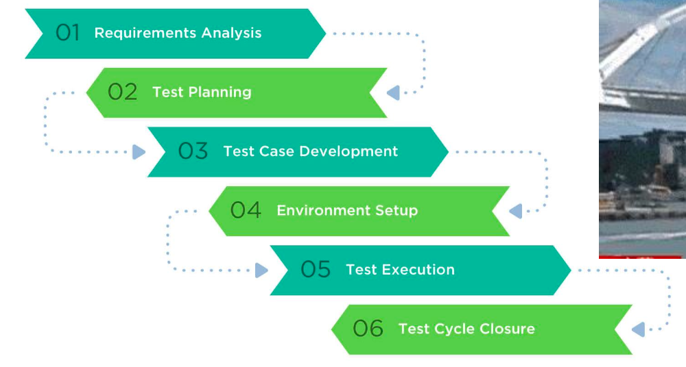
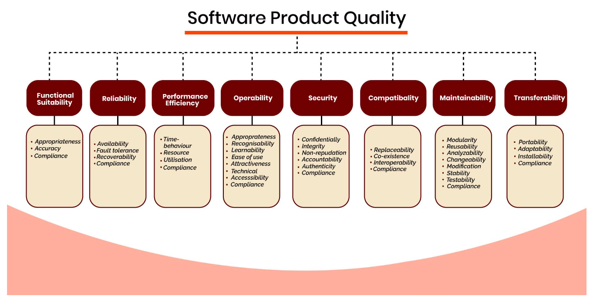
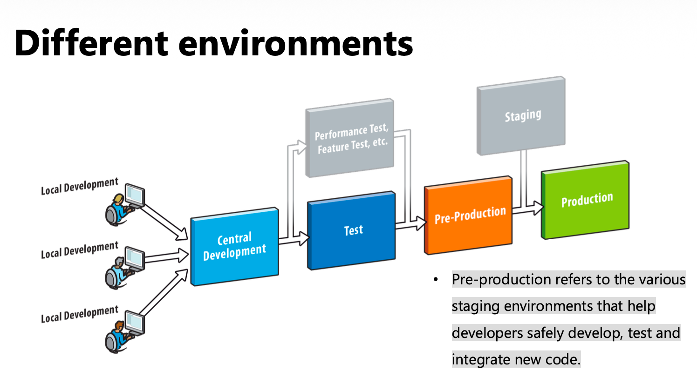
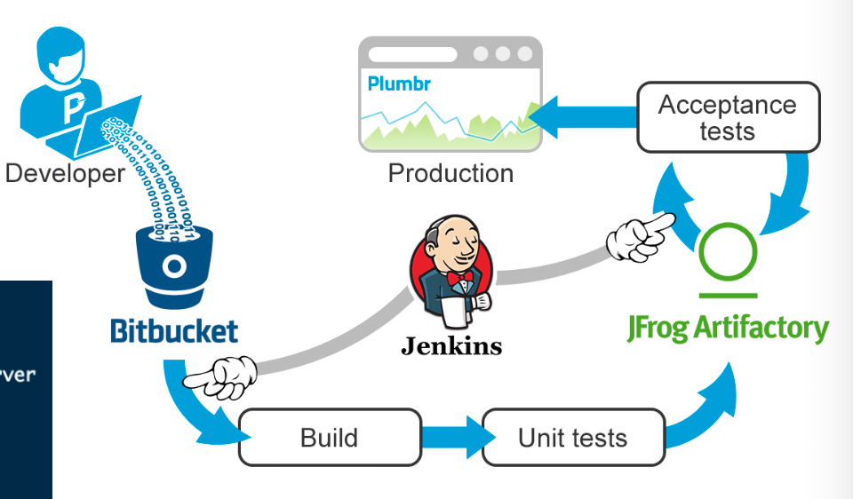

# 13 Create an e-commerce solution

## 知识图谱

```plaintext
Create an e-commerce solution
├── 1. Vision and Innovation
│   ├── Vision
│   ├── Innovation
│   ├── Innovation cycles
│   ├── Copycat
│   ├── Dream
│   └── Users’ potential energy
│       ├── Difference from old solution
│       ├── Potential
│       └── Barriers
│
├── 2. Research and Analysis
│   ├── Importance of research
│   ├── Data source
│   │   └── Public company reports
│   ├── Analysis before design
│   └── Outcome: Business Plan
│       ├── Executive Summary
│       ├── Business Overview
│       ├── Competitive Market Analysis
│       ├── Products and Offers
│       ├── Marketing Plan and Operations
│       └── Financial Plan
│
├── 3. Design
│   ├── UI
│   ├── IxD
│   ├── IA
│   ├── UX
│   │   ├── Value
│   │   ├── Function
│   │   ├── Usability
│   │   └── General impression
│   ├── Design tools
│   ├── PRD
│   │   ├── Business Requirements
│   │   ├── Market Requirements
│   │   ├── Functional Requirements
│   │   ├── Non-Functional Requirements
│   │   └── UI/UX Requirements
│   ├── HLD
│   └── LLD
│
├── 4. Development
│   ├── Write code according to design documents
│   ├── Outcome of develop
│   ├── Bug creation and fixing
│   └── 996.ICU
│
├── 5. Testing
│   ├── Test should start early
│   ├── Test stages
│   │   ├── System test cases
│   │   ├── Unit test cases
│   │   ├── Integration test cases
│   │   └── Requirement change updates
│   ├── Fake / Stub / Mock
│   ├── Test types
│   │   ├── Functional test
│   │   ├── Usability test
│   │   ├── Compatibility test
│   │   ├── Reliability test
│   │   ├── Security test
│   │   └── Performance test
│   ├── Test case
│   │   ├── Pass
│   │   └── Fail
│   ├── Browser compatibility
│   ├── Selenium
│   ├── Selenium Grid
│   ├── Bug and defect
│   ├── Bug life cycle
│   └── ISO/IEC 25010 Software Quality Model
│
├── 6. Implementation / Deployment
│   ├── Different environments
│   │   ├── Local development
│   │   ├── Central development
│   │   ├── Test
│   │   ├── Pre-production
│   │   ├── Staging
│   │   └── Production
│   ├── Copy code to web server
│   ├── Different versions / branches
│   ├── A/B test
│   └── Jenkins auto publish
│
└── 7. Operation / Maintenance
    ├── Website is only the beginning
    ├── E-commerce business operation
    ├── Business Intelligence
    │   ├── Data warehouse
    │   ├── Data sources
    │   ├── Master data
    │   ├── Data mining
    │   ├── ETL
    │   ├── OLAP
    │   ├── Real-time reporting
    │   ├── Decision making
    │   └── Predictive analytics
    ├── Product life cycle
    │   ├── Development
    │   ├── Growth
    │   ├── Maturity
    │   └── Decline
    ├── Product ≠ Project
    ├── In-house team
    ├── Outsourcing team
    └── 7 perpendicular red lines
```

创建电商解决方案不是只写代码，而是一个从 **Vision → Analysis → Design → Development → Testing → Deployment → Maintenance → Innovation** 的完整过程。

### 项目生命周期

- **Vision 愿景**
  - 提出未来想实现的目标
  - 是创新的起点
- **Analysis 分析**
  - Product Owner
  - Project Manager
  - Business Analyst
  - CTO
- **Design 设计**
  - System Architect
  - UI/UX Designer
- **Development 开发**
  - Front-end Developer
  - Back-end Engineer
- **Testing 测试**
  - Solution Architect
  - QA Engineer
  - Tester
  - DevOps
- **Deployment 部署**
  - Data Administrator
  - DevOps
- **Maintenance 维护**
  - Users
  - Tester
  - Support Managers

## Vision and Innovation

### Vision

### Vision 愿景

Vision is the act of power of imagination that creates a mental picture of the future.

- Vision 是一种想象未来的能力
- 它帮助团队形成一个未来目标
- 在电商项目中，Vision 可以理解为：我们想做一个什么样的产品，以及它将来要解决什么问题

### Innovation

Innovation is the introduction of something new!

- Innovation 指引入新的东西

- 创新不一定马上成功，它通常有周期

- **Innovation has cycles**
  - 创新会经历不同阶段
  - 可能一开始不成熟，但随着技术、市场和用户接受度变化，会慢慢发展

### Copycat vs Dream

- **Copycat 模式**
  - 参考已有成功案例
  - 这样风险较低，因为往往只会借鉴已经成功的经验
  - 比较适合有成熟市场样本的项目
- **Dream 模式**
  - 更像是“following your heart”
  - 没有太多现成案例可以参考
  - 例如：first internet、first webpage、first web store、first smart phone

### Users’ potential energy 用户潜在能量

- 需要思考：新产品和旧产品相比到底有什么不同？

- 用户是否愿意从旧方案切换到新方案，取决于：

  - 新方案带来的价值
  - 用户切换成本
  - 使用环境
  - 市场障碍

- Different environments would lead to very different potential and barriers

  不同环境会产生不同的 potential 和 barriers

  - 比如在信用卡发展比较成熟的国家，计程车往往会采用 POS 机来刷卡支付。而在移动支付比较发达的国家，人们会通过线上支付的方式支付车费。

## Research and Analysis：研究与分析

### 为什么需要 Research and Analysis

- Launching a business plan without research and analysis is like steering a ship without a compass.

  没有调研和分析就启动商业计划，好比航船没有罗盘。

-  researching industry trends and relevant markets, you’re enabling your business to predict changes instead of simply responding to them.

  通过研究行业趋势与相关市场，你便能让企业预测变化，而不仅仅是被动应对。

- Professional research and analysis are important components in any **business plan**.

  专业研究与分析是任何商业计划中的重要组成部分。

### Data source 数据来源（财报）

- Reports by the public companies are important sources

  Public companies 的 reports 是重要数据来源

- 原因：

  - Every public company would publish the reports

    regularly.

    上市公司会定期发布报告

  - Reliable 数据相对可靠

  - You can try to make an plan based on such numbers

    to judge the potential of your plan.

    可以用来判断商业计划的潜力

  - You need to know them clearly before me too!

    可以为市场规模、用户数量、收入、成本等提供参考

### Analysis 和 Design 的关系

- Analysis always comes before design
- 也就是说：
  - 先分析市场、用户、业务需求
  - 再进行产品和系统设计
- 如果没有分析就直接设计，设计可能会偏离真实需求

### Research 的产出：Business Plan

A business plan is a formal written document containing the goals of a business, the methods for attaining those goals, and the time-frame for the achievement of the goals. It also describes the nature of the business, background information on the organization, the organization‘s financial projections, and the strategies it intends to implement to achieve the stated targets. In its entirety, this document serves as a **road-map** (a plan) that provides direction to the business.

商业计划书是一份正式的书面文件，其中包含企业目标、实现这些目标的方法以及达成目标的时间框架。它还描述了企业的性质、组织的背景信息、财务预测，以及为实现既定目标而拟实施的战略。整体而言，这份文件如同一张路线图（一份计划），为企业指明方向。

Business Plan 是 research 阶段的重要输出。

它包含：

- Business goals
- Methods to achieve goals
- Time-frame
- Nature of the business
- Background information
- Financial projections
- Strategies

它的作用是作为 business 的 roadmap。

### E-commerce Business Plan 的组成

- Executive Summary
- Business Overview
- Competitive Market Analysis
- Products and Offers
- Marketing Plan and Operations
- Financial Plan

## Design：设计阶段

Design 不只是 UI/UX，而是包括产品需求、用户体验、系统架构和功能细节设计。

### UI: User Interface 用户页面

The user interface (UI) is the point of human-computer interaction and communication in a device.

用户界面（UI）是设备中人与计算机交互与沟通的接点。

This can include display screens, keyboards, a mouse and the appearance of a desktop.

这可以包括显示屏、键盘、鼠标以及桌面的外观。

- UI 是人和计算机交互的界面
- 包括：
  - Display screens
  - Keyboard
  - Mouse
  - Desktop appearance
  - App / website 页面外观

### IxD：Interaction Design 交互设计

Interaction Design (IxD) defines the structure and behavior of interactive systems. Interaction Designers strive to create meaningful relationships between people and the products and services that they use, from computers to mobile devices to appliances and beyond.

交互设计（IxD）定义了交互系统的结构与行为。交互设计师致力于在用户与其使用的产品和服务之间建立有意义的关系——从计算机到移动设备，再到家用电器乃至更广泛的领域。

- IxD 关注 interactive systems 的 structure and behavior
- 简单说，它关注用户如何和产品互动
- 例如：
  - 点击按钮后发生什么
  - 页面如何跳转
  - 用户完成一个任务需要几步

### IA: information architecture 信息架构

- IA 关注信息如何被组织

- 它帮助用户更容易找到内容

- 例如：

  - 页面分类

  - 菜单结构

  - 导航

  - 搜索

  - 内容层级

### UX：User Experience

UX 指用户和 digital product 互动时的整体体验。

用户通常会从这些角度评价产品：

- **Value**
  - 产品是否给我带来价值？
- **Function**
  - 产品功能是否正常？
- **Usability**
  - 产品是否容易使用？
- **General impression**
  - 使用过程是否令人满意？

课件强调：UX 不是单独存在的，它更像 lighthouse，用来指导 UI、IA 和 IxD。

### Design tools

常见设计工具包括：

- Sketch
- Adobe XD
- 墨刀
- Mockplus
- Axure RP
- Figma
- Framer
- Invision

Design isn’t all about learning to use design software — although that’s certainly important.

但课件也强调：**Tools are only tools**。设计不是只学会软件，还要理解设计本身。

## PRD：Product Requirements Document 产品需求文档

However, UI/UX is only a part of Design

### PRD 的定义

A product requirements document (PRD) defines the requirements of a particular product, including the product’s purpose, features, functionality, and behavior.

产品需求文档（PRD）定义了特定产品的需求，包括产品的目标、特性、功能以及行为表现。

It serves as a guide for business and technical teams to help build, launch, or market the product.

它为业务和技术团队提供了一个指南，帮助他们构建、发布或营销产品。

PRD 是产品需求文档，用来定义一个产品的 requirements，包括：

- Product purpose
- Features
- Functionality
- Behavior

### PRD is not only the UI/UX

it should address 5 types of requirements:

- Business Requirements

- Market Requirements

- Functional Requirements

- Non-Functional Requirements

- UI/UX Requirements

You may not have best answers to all questions during the begging stage, but try to answer all of them.

在起步阶段，你可能没有所有问题的最佳答案，但请尝试回答每一个问题。

PRD 应该覆盖 5 类需求：

- **Business Requirements**
  - 商业目标和商业价值
- **Market Requirements**
  - 市场环境、目标用户、竞争情况
- **Functional Requirements**
  - 系统应该提供什么功能
- **Non-Functional Requirements**
  - 性能、安全、可靠性、兼容性等
- **UI/UX Requirements**
  - 页面、交互、用户体验要求

### Non-functional requirements 示例：12306

课件用 12306 说明非功能需求的重要性：

- Initial investment：¥300,000,000
- PV：150,000,000,000
- Tickets per day：12,000,000

这里重点不是具体数字本身，而是说明大规模电商或在线平台必须考虑性能、并发、稳定性等非功能需求。

## System Architecture Design：系统架构设计

### HLD：High Level Design

- HLD 是高层设计
- 类似房子的 blueprint
- 关注系统整体结构
- 例如：
  - 前端有哪些入口
  - 后端有哪些服务
  - 数据库如何连接
  - API 如何通信
  - 系统模块之间如何协作

### LLD：Low Level Design

- LLD 是低层设计
- 比 HLD 更详细
- 关注每个具体功能如何实现
- 常见表达方式：
  - Flow Chart
  - UML
  - Sequence Diagram

## Development：开发阶段

### 开发的基本任务

Write the code according to the design documents

- 根据 design documents 写代码
- 不是随便写，而是按照前面的需求和设计实现系统

### 开发产出 Outome of develop

- 最终会得到可以运行的系统或程序
- 课件用 “Hello World” 作为开发产出的简单象征

### 开发中的现实问题

- 找 bug
- 改 bug
- 写出新的 bug
- 最后系统往往是在不断修 bug 中逐渐变得可用

### 996.ICU

- 课件提到 996.ICU，主要是用来说明软件开发工作压力和现实开发环境
- 这不是技术点，但和开发阶段的实际工作状态有关

## Testing：测试阶段

测试是保证软件质量的关键。课件明确强调：test should be included in the design stage，并且 should start at the beginning of coding。

### 为什么测试重要

- Test plays key role for quality
- 测试不应该等开发完成后才开始
- 测试应该从设计阶段和编码初期就开始准备



### Test in different stage

- After the survey
  - write system test cases
- After design
  - write unit test cases
- After the module is submitted
  - execute the unit test case
  - revise it
- Unit test in progress
  - write integration test cases
- After module assembly
  - execute integration test cases
  - revise them
- Requirements change during development
  - modify all above test cases
- Before release
  - execute system test cases

### Fake, Stub and Mock

- Each unit needs input/outputs
- For the unit test, you need to “cheat it” with the simulated data as inputs
- Fake, stub and mock are similar terms for such simulation.

- 每个 unit 都需要 input 和 output
- 在 unit test 中，有时需要用 simulated data 来“欺骗”这个 unit
- Fake、Stub、Mock 都是类似的 simulation 方法

### Test what：测试类型

- Functional test: pay attention to whether the function is correct.
- Usability test: pay attention to whether the product is easy to use.
- Compatibility test: focus on whether the product is applicable to multiple platforms.
- Reliability test: pay attention to whether the product is stable and reliable.
- Security test: pay attention to whether the product has vulnerabilities.

- Performance test: focus on whether the product can run efficiently.

- **Functional test**
  - 检查功能是否正确
- **Usability test**
  - 检查产品是否容易使用
- **Compatibility test**
  - 检查产品是否适用于多个平台
- **Reliability test**
  - 检查产品是否稳定可靠
- **Security test**
  - 检查产品是否有安全漏洞
- **Performance test**
  - 检查产品是否能高效运行

### Test case

- Test case 的结果只能是：
  - Pass
  - Fail

## Browser Compatibility：浏览器兼容性

### 为什么同一个网站在不同浏览器显示不同

- 不同浏览器有不同 rendering engines
- Chromium-based browsers，例如 Chrome 和 Microsoft Edge，使用 Blink
- Safari 使用 WebKit
- 不同 engine 会用自己的方式解析 HTML 和 CSS
- 所以同一个网站在不同浏览器上可能：
  - look different
  - feel different
  - function differently

### OS 的影响

- 用户的操作系统也会影响网页显示效果
- 所以兼容性测试不仅要考虑浏览器，也要考虑 OS

### 手动测试的问题

- 手动测试不同浏览器和不同系统组合会非常麻烦
- 课件说 manually test would be a nightmare

## Selenium and Selenium Grid

### Selenium

- Selenium 是一个 driver
- 可以通过代码操作 DOM
- 用于 web test automation

### Selenium Grid

- Selenium Grid 可以自动测试不同 OS / Browser 组合
- 例如：
  - Firefox on Ubuntu
  - IE on Windows
  - Safari on Mac
  - Android browser

## Bug and Defect

### Bug and defect

- 不可能覆盖所有可能情况
- 不是所有的 bug 都会被修改，不过知道你知道 bug 什么时候会造成问题
- 测试环境中发现的问题可能叫 bug
- 生产环境中影响用户的问题可能被看作 defect

### Bug life cycle



Bug 可能经历：

- New
- Assign
- Open
- Fixed
- Re-testing
- Closed
- Reopened
- Rejected
- Duplicate
- Deferred

课件强调：

- Not all bugs will be fixed
- 但至少你需要知道它会发生 

## ISO/IEC 25010:2011 Software Quality Model

课件展示了 ISO/IEC 25010:2011 的 Software Product Quality 模型。

**它不教你如何写代码，而是为你提供一套**行业公认的、全方位的尺度，用来衡量和评估一个软件产品到底“好不好”。

ISO/IEC 25010 将软件质量分为了两个互相补充的模型：

### 模型一：产品质量模型 (Product Quality Model)

这是最核心、也是研发人员接触最多模型。它从**内部和外部**评估软件本身的属性，共划分为 **8 大质量特性（Characteristics）** 以及 31 个子特性：

1. **功能适用性 (Functional Suitability)**：功能全不全？算得准不准？是不是用户真正需要的？
2. **性能效率 (Performance Efficiency)**：系统响应快不快（时间特性）？吞吐量大不大？占不占内存（资源利用率）？
3. **兼容性 (Compatibility)**：能不能和别的软件和平共处（共存性）？数据能不能无缝交换（互操作性）？
4. **易用性 (Usability)**：界面好不好看？好不好学？容不容易误操作（用户差错防御）？
5. **可靠性 (Reliability)**：系统是不是经常崩溃（成熟度）？挂了能不能自动恢复（容错性、恢复性）？
6. **安全性 (Security)**：数据会不会泄露（保密性）？权限控制严不严（抗抵赖性、可核查性）？
7. **可维护性 (Maintainability)**：代码是不是写得像“屎山”？好不好模块化？容易排查问题吗（可分析性）？好不好改（可修改性）？
8. **可移植性 (Portability)**：软件好不好安装（易安装性）？从 Windows 换到 Linux 方不方便（适应性、易替换性）？

### 模型二：使用质量模型 (Quality in Use Model)

这个模型站在**最终用户（User）在真实业务场景中**的使用体验角度。它关注的是软件在真实世界运行后带来的**实际效果**，包含 5 个特性：

- **有效性 (Effectiveness)**：用户使用软件时，能否准确、完整地达成他们的业务目标。
- **效率 (Efficiency)**：用户达成目标需要消耗多少资源（时间、心智成本）。
- **满意度 (Satisfaction)**：用户用得爽不爽（信任感、舒适度）。
- **免于风险 (Freedom from Risk)**：软件在使用过程中，会不会对用户的财务、生命安全或环境带来风险。
- **上下文覆盖 (Context Coverage)**：软件在不同的环境、不同的业务灵活度下是否依然好用。

### Software Product Quality 包含

- **Functional Suitability**
  - Appropriateness
  - Accuracy
  - Compliance
- **Reliability**
  - Availability
  - Fault tolerance
  - Recoverability
  - Compliance
- **Performance Efficiency**
  - Time-behaviour
  - Resource utilization
  - Compliance
- **Operability**
  - Appropriateness recognizability
  - Learnability
  - Ease of use
  - Attractiveness
  - Technical accessibility
  - Compliance
- **Security**
  - Confidentiality
  - Integrity
  - Non-repudiation
  - Accountability
  - Authenticity
  - Compliance
- **Compatibility**
  - Replaceability
  - Co-existence
  - Interoperability
  - Compliance
- **Maintainability**
  - Modularity
  - Reusability
  - Analyzability
  - Changeability
  - Modification stability
  - Testability
  - Compliance
- **Transferability**
  - Portability
  - Adaptability
  - Installability
  - Compliance

### 在日常开发中的使用

在实际的项目生命周期中，你可以这样落地 ISO/IEC 25010：

1. **需求阶段**：对照 8 大特性，向业务方追问非功能性需求（例如：“我们不仅要支持交易功能，还要明确 QPS 要达到多少、数据加密级别是什么”）。
2. **架构阶段**：根据模型中的“可维护性”和“可移植性”，决定是否采用微服务架构、Docker 容器化或是引入 OpenTelemetry 链路追踪。
3. **交付阶段**：作为验收测试（Acceptance Testing）的最高指导纲领，对照条款逐一出具质量报告。

## Implementation / Operation：实施与运营

### Implement or Operation

- 网站上线不是结束
- Build a website is only the beginning
- Run the business is the core for e-commerce

### Different environments



Pre-production refers to the various staging environments that help developers safely develop, test and integrate new code.

预生产环境指的是帮助开发者安全开发、测试和集成新代码的各类临时环境。

项目通常有多个环境：

- Local development
- Central development
- Test
- Pre-production
- Staging
- Production

其中 **Pre-production** 是一种 staging environment，用来帮助开发者安全地 develop、test 和 integrate new code。

### Implementation：Copy code to web server

- Implementation 可以理解为把代码部署到 web server
- 也就是让用户可以真正访问系统

### Different versions

- 实际项目会有很多 versions / branches
- 例如：
  - master
  - hotfix
  - release
  - develop
  - feature branches

### A/B test

A/B test 的特点：

- Both are in production
- 不同用户会看到不同内容
- 通过比较数据来决定哪个版本更好

### 12.6 Auto publish by Jenkins

- Manually publish project is not a good idea.
- Jenkins is a widely used tool for auto-publish.
- Semi-auto may be a compromise between manual and full-auto.

- 手动发布项目不是好方法
- Jenkins 是常用的 auto-publish 工具
- Semi-auto 可以作为 manual 和 full-auto 之间的折中方案



## Operation：运营阶段

### Operation 的核心

- Build a website is only the begging.
- Run the business is the core for e-commerce.

- 网站建好只是开始
- 电商的核心是长期运营业务
- 运营关注的内容包括：
  - Users
  - ROI
  - GMV
  - PV
  - 用户访问时长
  - 用户留存
  - 活跃用户
  - 渠道转化率

### 13.2 Business Intelligence

Business Intelligence 用来支持业务分析和决策。

它包含或关联：

- Data warehouse
- Data sources
- Master data
- Data mining
- ETL
- OLAP
- Real-time reporting
- Decision making
- Predictive analytics

课件中还区分了：

- **Business Analysis**
  - 更关注 processes、techniques、functions
  - 用来解决复杂商业问题
  - 帮助组织产生积极变化
- **Business Analytics**
  - 更关注 data 和 statistical analysis
  - 用来预测未来状态
  - 支持 business decisions

## Product Life Cycle：产品生命周期

### Product ≠ Project

课件强调：

- Product 不等于 Project

### Product life cycle 包含

- Development
- Growth
- Maturity
- Decline

### 产品生命周期中的选择

- 当产品到达成熟或衰退阶段时，可能需要：
  - Expand to new markets
  - Expand product capabilities

------

## In-house or Outsourcing 内部管理或外包

### 选择依据

- 是否选择 in-house 或 outsourcing，depends on resources

### In-house team

优点：

- On-site availability
- Awareness of the business
- In-depth knowledge of the systems and staff
- Deep understanding of the users

缺点：

- Greater expense
- Absence issues
- Low retention rates
- Lack of necessary skills

### Outsourcing team

优点：

- Access to the talent pool
- Focus on core business functions
- Cost-effectiveness
- Flexibility
- Faster project delivery

缺点：

- Management risks
- Communication issues
- Problems with quality

------

## A miserable story：7 perpendicular red lines

### 课件最后的案例

- 标题是 **A miserable story: 7 perpendicular red lines**
- 这个案例主要用来说明项目沟通、需求理解和实际执行之间可能出现巨大偏差
- 在软件项目中，如果需求表达不清楚，或者不同角色对同一需求理解不同，最后结果可能会非常荒谬