# 2 HTML and CSS

## 知识图谱

```plaintext
├── HTML：负责结构 Structure
│   ├── DOM Tree
│   ├── HTML 基本结构
│   ├── DOCTYPE 与 HTML5
│   ├── HTML 发展历史
│   ├── HTML attributes
│   ├── head 区域
│   └── body 中常用标签
│
└── CSS：负责样式 Design / Presentation
    ├── CSS3
    ├── Box Model
    ├── CSS Syntax
    ├── 设置 CSS 的方式
    ├── CSS Selector
    ├── CSS Units
    ├── Responsive Design
    ├── Font / Text / Link
    ├── Display
    └── Position
```

## HTML – Hyper Text Markup Language

- HTML **structures the web page**.

  HTML构建了网页的结构。

- HTML organizes all element as a tree called **Document Object Model (DOM) Tree**

  HTML将所有元素组织成一棵树，称为文档对象模型**（DOM）树**。

### A HTML Sample

```plaintext
HTML Sample
├── <!DOCTYPE html>
│   ├── 声明 HTML5 文档
│   └── 不是 HTML tag
├── <html>
│   └── HTML 页面的根元素
├── <head>
│   └── 存放页面元信息
├── <title>
│   └── 浏览器标签页标题
├── <body>
│   └── 可见内容容器
├── <h1>
│   └── 大标题
└── <p>
    └── 段落
```

- The \<!DOCTYPE html> declaration defines that this document is an HTML5 document, itself is not a HTML tag

  定义了该文档为 HTML5 文档，其本身并非 HTML 标签

- The \<html> element is the root element of an HTML page

  Html元素是HTML页面的根元素

- The \<head> element contains meta information about the HTML page

  包含关于HTML页面的元信息

- The \<title> element specifies a title for the HTML page (which is shown in the browser's title bar or in the page' s tab.

  指定HTML页面的标题（显示在浏览器的标题栏或页面标签中）。

- The \<body> element defines the document's body, and is a container for all the visible contents, such as headings, paragraphs, images, hyperlinks, tables, lists, etc.

  定义了文档的主体，是所有可见内容的容器，如标题、段落、图像、超链接、表格、列表等。

- The \<h1> element defines a large heading

  定义一个大标题

- The \<p> element defines a paragraph

  定义一个段落

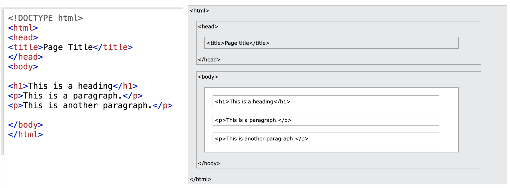

HTML 嵌套

```plaintext
HTML Structure
└── tags are nested together
    ├── html 包含 head 和 body
    ├── head 包含 title / meta / link 等
    └── body 包含网页可见元素
```

### Doc Type

- Different version has different capabilities.

  不同版本具备不同功能。

- New features of HTML5 (or H5):

  - **Video/Audio** support: \<video> \<audio> tag can directly refer to multimedia. Previous web need to install Browser plugin i.e. Flash

  - **Canvas**: \<canvas> tag can create a place to draw things. Many web game using this feature.

  - **WebSocket**: upgrade the communication to **dual-direction**

  - **Access to local devices**: Camera, location information, sensors…

### HTML revolution 迭代

- GML is the 1st generation – General markup language.

- SGML try to make it to be Standard GML.

- **HTML** or Hyper Text Markup Language is relatively loose and **XML** or Extensible Markup Language is strict. The difference is DTD or Document Type Definition

- XML is widely used in communication

- XHTML is a conjunction of HTML and XML

- HTML5 is no longer a member of GML

### HTML attributes

- xmlns is XMTL namespace, for XHTML version

- Nowdays, by default, **html uses the HTML5 version**

- **lang** used to set the language of the whole web page. It can be language only or with the country code, i.e.:

  lang用于设置整个网页的语言。它可以仅指定语言，也可以包含国家代码，例如：

  - zh, en
  - zh-CN, en-US

- You can also set different language from the whole page for a specific zone (tags)

  您也可以为特定区域（标签）设置与整个页面不同的语言。

一个需要注意的地方，HTTP 与 HTML 是两个东西。HTTP是网络请求，HTML是超文本语言。

- HTTP head is the information of HTTP request/response, or the communication between C/S.

  HTTP头部是HTTP请求/响应的信息，或客户端与服务器之间的通信信息。

- The whole HTML file is a part of the HTTP response!

  整个HTML文件都是HTTP响应的一部分！

- HTML head is a part of the HTML file.

  HTML头部是HTML文件的一部分。

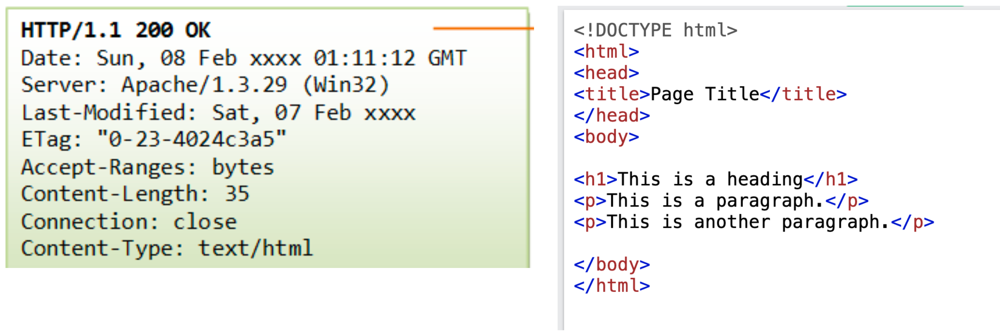

### HTML – within the head

- \<title>

- \<meta>

- \<style>

- \<link>

- \<script>

- \<base>

All elements in head is **NOT visible** on webpage…

头部中的所有元素在网页上均不可见……

- **title** is shown in browser tab, bookmark and search result

  **标题**显示在浏览器标签页、书签和搜索结果中

- **meta** or Metadata is data that describes data, and HTML has an "official" way of adding metadata to a document. There are many different metadata, such as \<meta charset="utf-8" /> for characters encoding.

  元数据（Metadata）是描述数据的数据，HTML提供了一种“官方”方式为文档添加元数据。元数据种类繁多，例如用于字符编码的

- **style** is used to refer to the css files

  style 用于指代 CSS 文件

- **link** is used to have an icon

  链接 用于显示图标

- **script** is used to refer to the JavaScript need to be loaded, as:

  script 用于指代需要加载的JavaScript脚本，例如：

  <script src="my-js-file.js" defer></script>

  - It can refer to the JS source on any accessible web source.

    可以引用任何可访问的网络资源上的JS源代码。

  - The attribute “**defer**” should be used that load the webpage first, then load the JS at last. Otherwise the JS may block the webpage loading.

    应使用“defer”属性，先加载网页，最后加载JS。否则JS可能会阻塞网页加载。

  - But not every browser support the “defer”, so it is better to put all **\<script> tag at the bottom of \<body> to guarantee the JS was loaded at last**.

    但并非所有浏览器都支持“defer”属性，因此最好将所有\<script>标签置于\<body>底部，以确保JavaScript最后加载。

- **base** specifies the base URL to use for all relative URLs in a document.

  base 指定文档中所有相对URL的基本地址。

### HTML - tags in body

- HTML is very easy to learn

- HTML is difficult to be a master

- You may get the webpage with similar visual effect by using different tags

- But you are strongly recommended to use the “**correct**” tags according to the purpose of such tags.

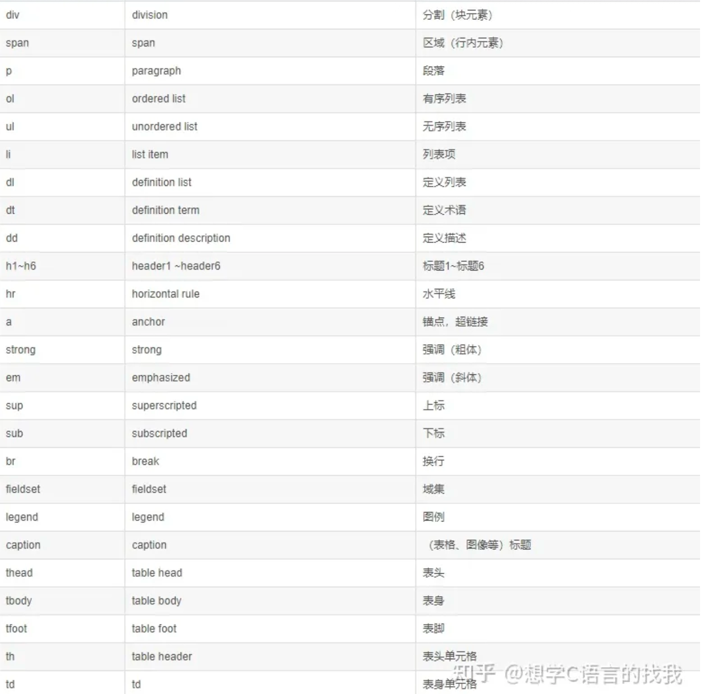

为什么要正确使用 HTML tag：

- 虽然使用 \<div> 加不同 CSS 也可以做出标题、段落、列表等视觉效果，但是 HTML tag 不只是给人看的，也是给浏览器、搜索引擎、爬虫、屏幕阅读器和程序读取的。因此应该根据内容的语义使用正确标签。
- 例如：
  - \<h1> 表示最高级标题；
  - \<p> 表示段落；
  - \<ul>/\<ol> 表示列表；
  - \<table> 表示表格数据；
  - \<form> 表示用户提交信息的区域。
- Correct tags improve semantic meaning, accessibility, search engine understanding, and machine readability.

### HTML - Paragraph

- Header again? This head is not the one for whole page but the one shown on the webpage. Head for human beings to look.

  这个header不是整个页面的header，而是网页上显示的页眉。供人观看的页眉。

- Use \<div> with different style, we can fulfill both header and paragraph.

  使用不同样式的标签，我们可以同时实现标题和段落的布局。

- While many “users” is not human but computer! They need to read such tags.

  虽然许多“用户”并非人类而是计算机！它们需要读取这类标签。

- NLP may can read the webpage more like human beings.

  自然语言处理或许能像人类一样更自然地阅读网页。

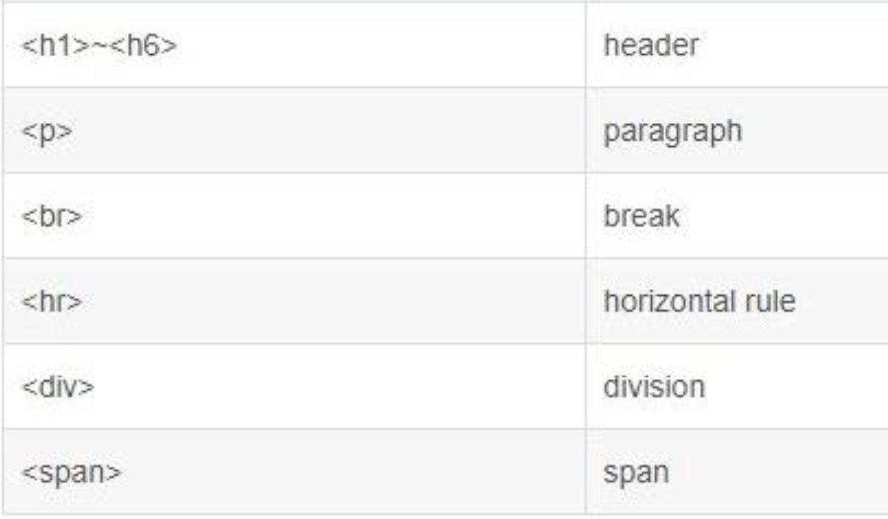

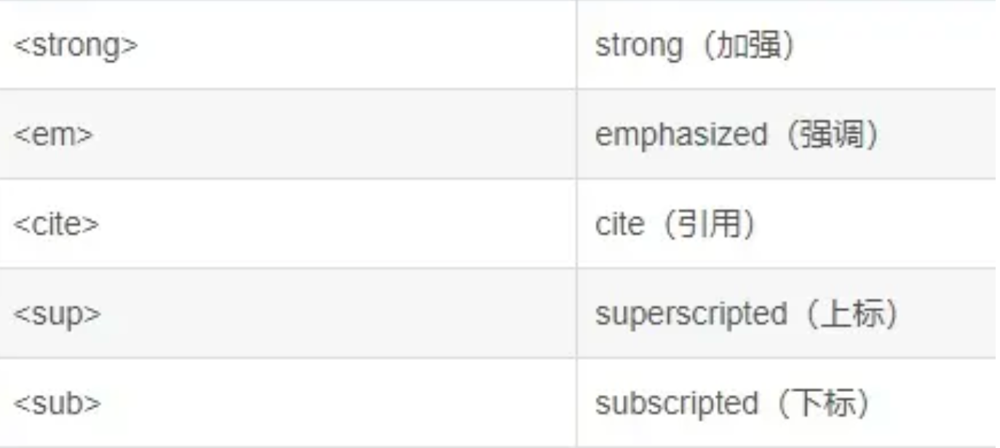

```html
<p>
  this is a <strong>strong</strong> word.
</p>
```


### HTML - list

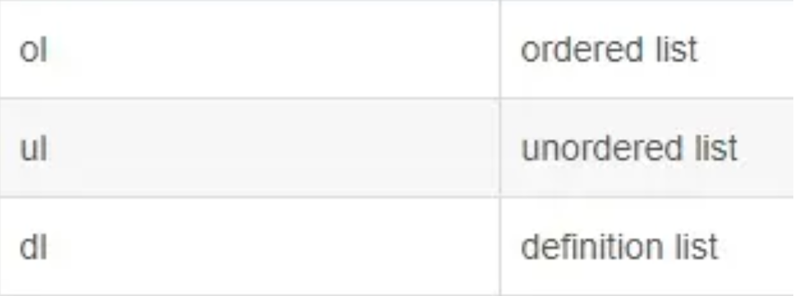

```html
<ul>
  <li>first</li>
  <li>second</li>
  ...
</ul>
```

```html
<ol>
  <li></li>
  ...
</ol>
```


### HTML – table

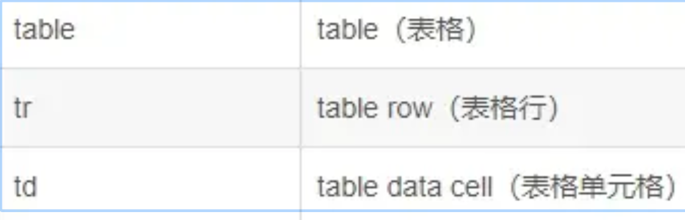

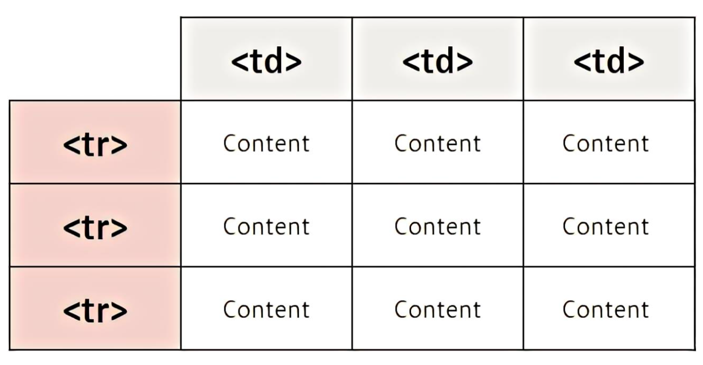

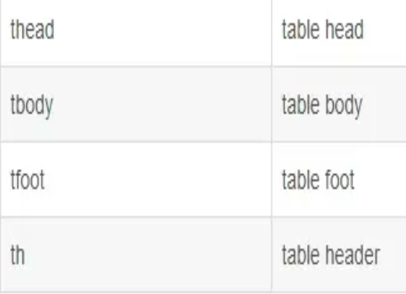

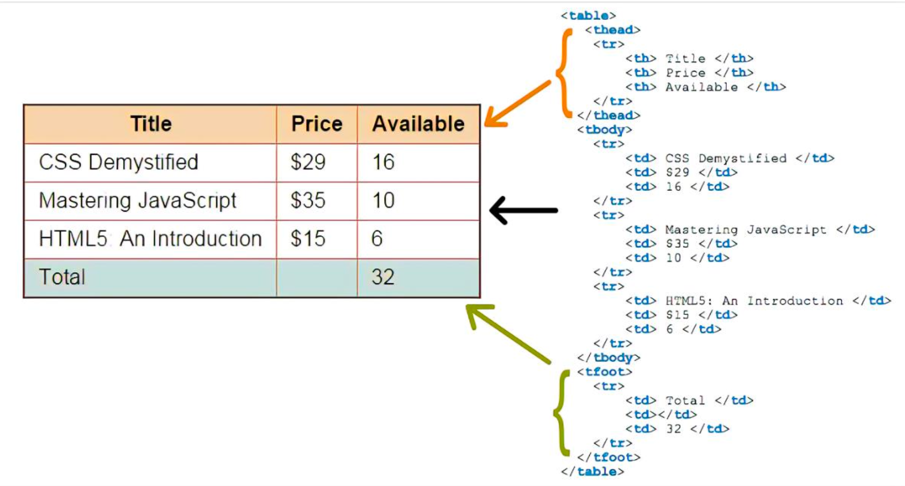

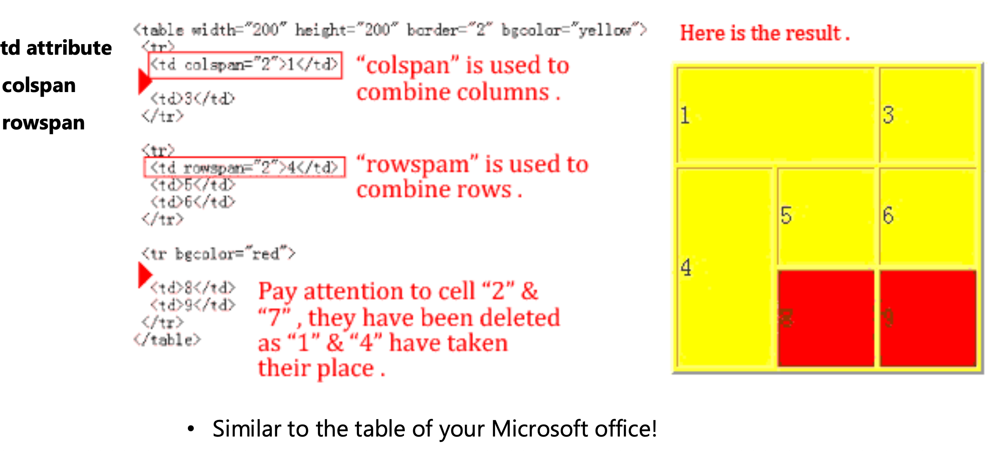

### HTML - image

```html

```

- **src** to specify the image’s path

  图片保存的路径

- **alt** used to show the text if the img cannot be loaded by the browser

  图片无法加载时显示的文字描述

### HTML - hyperlink

```html
<p>
  you can reach Micheal at:
</p>

<ul>
  <li><a href="https://example.come">Website</a></li>
  <li><a href="mailto:m.bluth@email.cm">Email</a></li>
  <li><a hreg="tel:1111">Phone</a></li>
</ul>
```

### HTML - form

- \<form> represents a document section containing interactive controls for submitting information.

  表示包含用于提交信息的交互式控件的文档部分。

- There are four types of tags:

  - \<label> 

  - \<input> 输入框

  - \<textarea> 长文本框

  - \<select> + \<option> 选择框（可以设置单选或者多选）

- **action** defined an target URL to submit the data in the form

  action 定义了表单数据提交的目标 URL

- **method** defined the http request method, it could be GET or POST

  method 定义了HTTP请求方法，可以是GET或POST

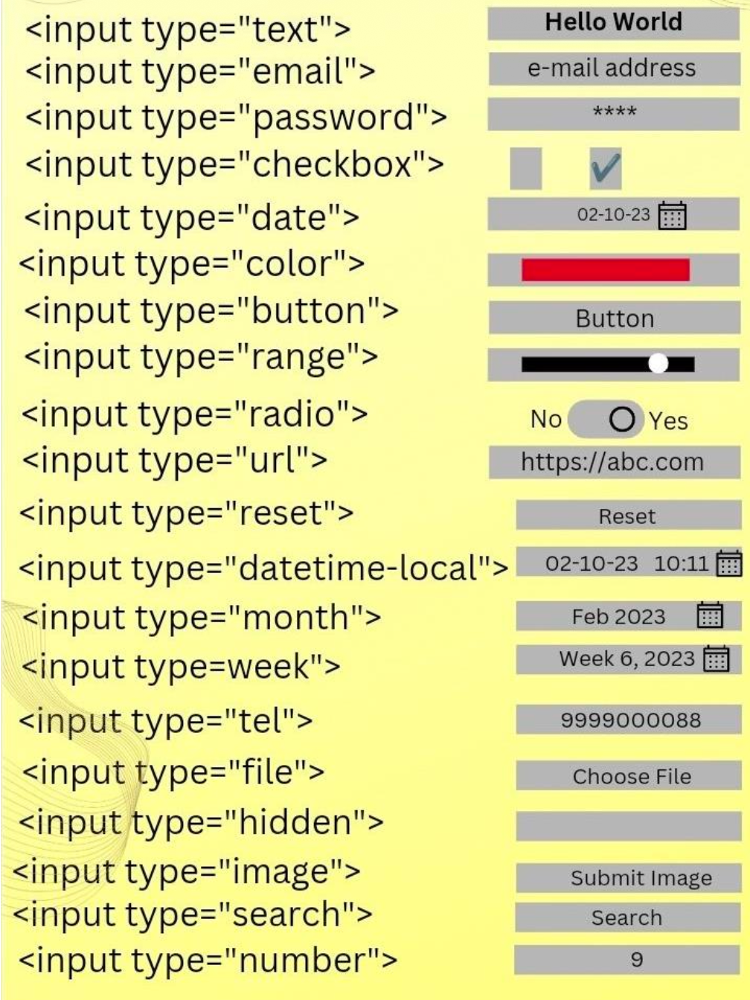

#### HTML - form - label

- **\<label>** associates with a form control, such as <input> or <textarea> offers some major advantages:
  - The label text is not only visually associated with its corresponding text input; it is programmatically associated with it too
- When a user clicks or touches/taps a label, the browser passes the focus to its associated input

用户点击 `<label>` 中的文字时，浏览器会自动聚焦或选中对应的表单控件。这对于小的复选框或单选按钮尤其重要，扩大了用户的可点击区域。它建立了**文本与控件之间的关联**

最标准且推荐的方式是使用 `for` 属性。`<label>` 的 `for` 属性值必须与目标表单控件的 `id` 属性值完全一致。

下面的案例中，如果用户点击Username标签会直接将鼠标的关注移动到对应的输入框中。

```html
<body>
  <form action="">
   	<label for="user">Username</label>
    <input type="text" name="user">
  </form>
</body>
```

#### HTML - form - textera

```html
<textarea
          name="TA1"
          cols="40"
          row="8"
          maxLength="100"
          placeholder="type only  100 characters required">
</textarea>
```

\<textarea> is for mutil-lines input 多行输入文本框

#### HTML - form - select + options

用户可以选择p re-defined选项

```html
<select>
  <option value="">--Please choose one option---</option>
  <option value="dog">Dog</option>
  <option value="cat">Cat</option>
</select>
```

Options can be organized in groups by \<optgroup>

```html
<select>
  <optgroup label="Theropods">
    <option value="Velociraptor">Velociraptor</option>
  	<option value="Deinonychus">Deinonychus</option>
  </optgroup>
    <optgroup label="Sauropods">
    <option value="Diplodocus">Diplodocus</option>
  </optgroup>
</select>
```

#### HTML - iframe

内嵌页面。

```html
<body>
  <iframe src="https://www.baidu.com" frameborder="3" width="1024" height="400">
  </iframe>
</body>
```

## CSS

- HTML is a **markup language** used to format/structure a web page,

  HTML是一种用于格式化/构建网页的标记语言，

- CSS is a **DESIGN language** that you use to make your web page look nice and presentable.

  • CSS是一种设计语言，用于让你的网页看起来美观且具有吸引力。

### CSS - Cascading Style Sheets

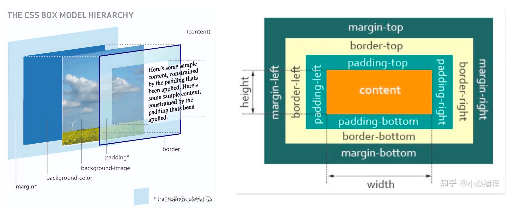

CSS 3 目前是主流使用的版本，相较于 CSS 2：

- CSS3
  - better styling
  - transitions & animations
  - shadows
  - responsive layouts
  - embedded fonts

### CSS - Box model

- Background color and image can be set for each element

  可为每个元素设置背景颜色和背景图像

- Background image should match the size of content. If mismatch, there are several ways to fit them:

  背景图片应与内容尺寸相匹配。若尺寸不符，可通过多种方式进行适配。

  - If box > picture : repeat-x and repeat-y

  - If box < picture: only show part of the picture

- Repeat or not and position can be adjusted

  是否重复及位置均可调整

- Every HTML element can be considered as a box. The box model contains:
  - content：元素真实内容，例如文字或图片；
  - padding：内容和边框之间的内边距；
  - border：元素边框；
  - margin：元素与其他元素之间的外边距。
- 从内到外：
  content → padding → border → margin
- The CSS box model explains how the size and space of an element are calculated and displayed on a web page.

### CSS syntac

下面的两种格式都是正确的。

多行格式便于人类阅读，尤其适用于多属性场景。

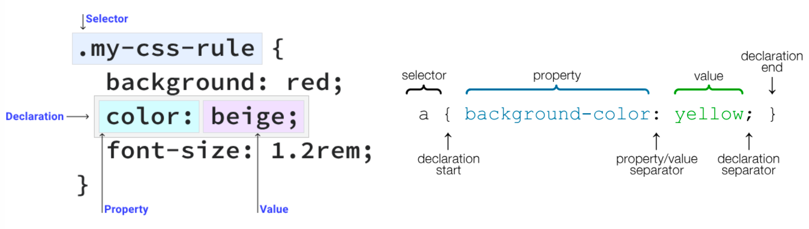

CSS rule 通常由 selector 和 declaration block 组成：

```css
selector {
  property: value;
}
```

- selector：选择 HTML 元素；
- property：想修改的样式属性；
- value：属性对应的值；
- declaration：property + value 的组合。

例如：
p {
  color: red;
  font-size: 16px;
}

### CSS– four different ways to set style for a page

- Style is the attribute for HTML elements

  样式是HTML元素的属性

- Inline means write the style directly with a specific HTML element.

  内联样式指的是直接为特定的HTML元素编写样式。

- Internal means the style code is within the HTML code (in the <head> part), these style only effect for this webpage

  内部样式指样式代码位于HTML代码内（在部分），这些样式仅作用于当前网页。

- External means the style code is in a sperate .css file, it can be referred by different webpages

  外部样式指的是样式代码存放在独立的.css文件中，可供不同网页引用。

- Broswer Default Styles


```plaintext
CSS Style Sources
├── Inline CSS
│   └── 写在具体 HTML 元素 style 属性中
├── Internal CSS
│   └── 写在 HTML 文件 head 的 <style> 中
├── External CSS
│   └── 写在独立 .css 文件中
└── Browser default styles
    └── 浏览器默认样式
```

### CSS selector – link the style to HTML element

**Important**: Override Order: **Inline style > Internal CSS > External CSS > Browser default styles**.

重要提示：覆盖顺序：内联样式 > 内部CSS > 外部CSS > 浏览器默认样式。

- HTML organizes all element as a tree called Document Object Model (DOM) Tree

  HTML将所有元素组织成一棵树，称为文档对象模型（DOM）树。

- Style should be applied to each element of the DOM tree

  HTML将所有元素组织成一棵树，称为文档对象模型（DOM）树。

- Selector is the link between DOM element and style

  选择器是连接DOM元素与样式的桥梁

- Multi-style may applied to one DOM element

  单个DOM元素可应用多种样式

### CSS - Selector

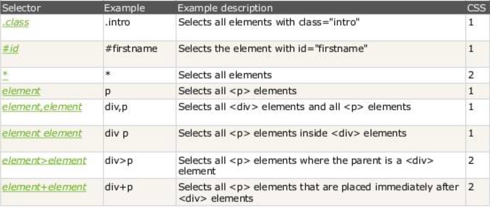

- \*              universal selector，选择所有元素
- p              element selector，选择所有 <p>
- .intro         class selector，选择 class="intro" 的元素
- \#firstname     id selector，选择 id="firstname" 的元素
- div p          descendant selector，选择 div 内部所有 p
- div > p        child selector，只选择 div 的直接子元素 p
- div + p        adjacent sibling selector，选择紧跟在 div 后面的第一个 p
- div ~ p        general sibling selector，选择 div 后面的所有同级 p
- 注意：
  - class 用 . 开头，可以重复使用；
  - id 用 # 开头，理论上一个页面中应该唯一。

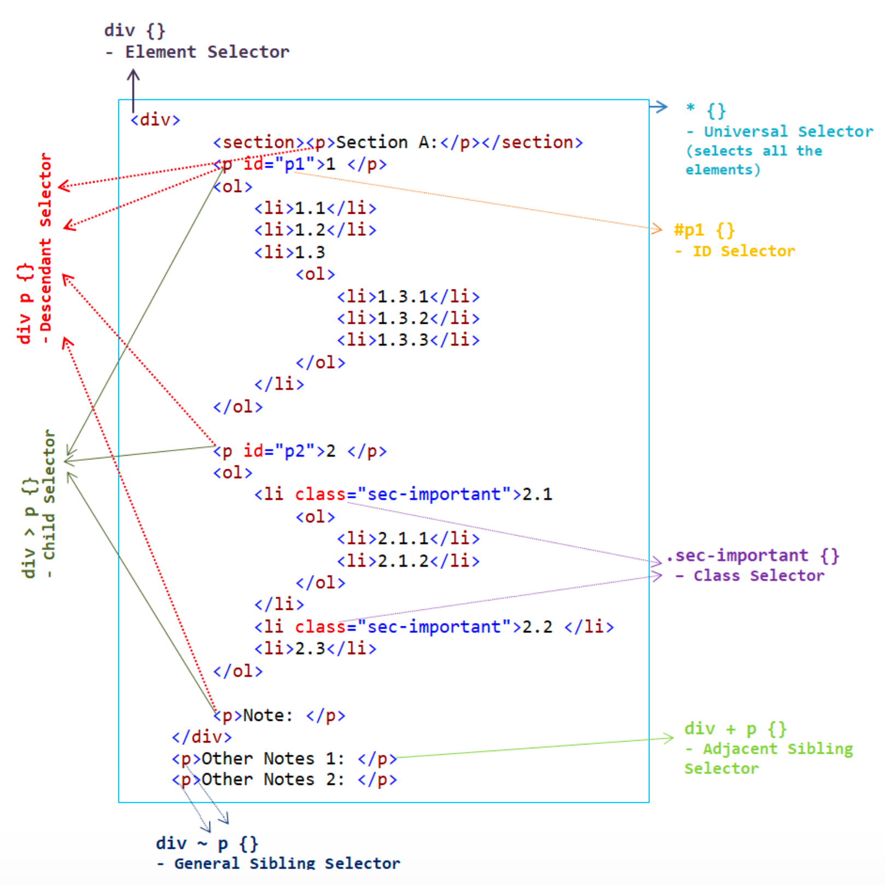

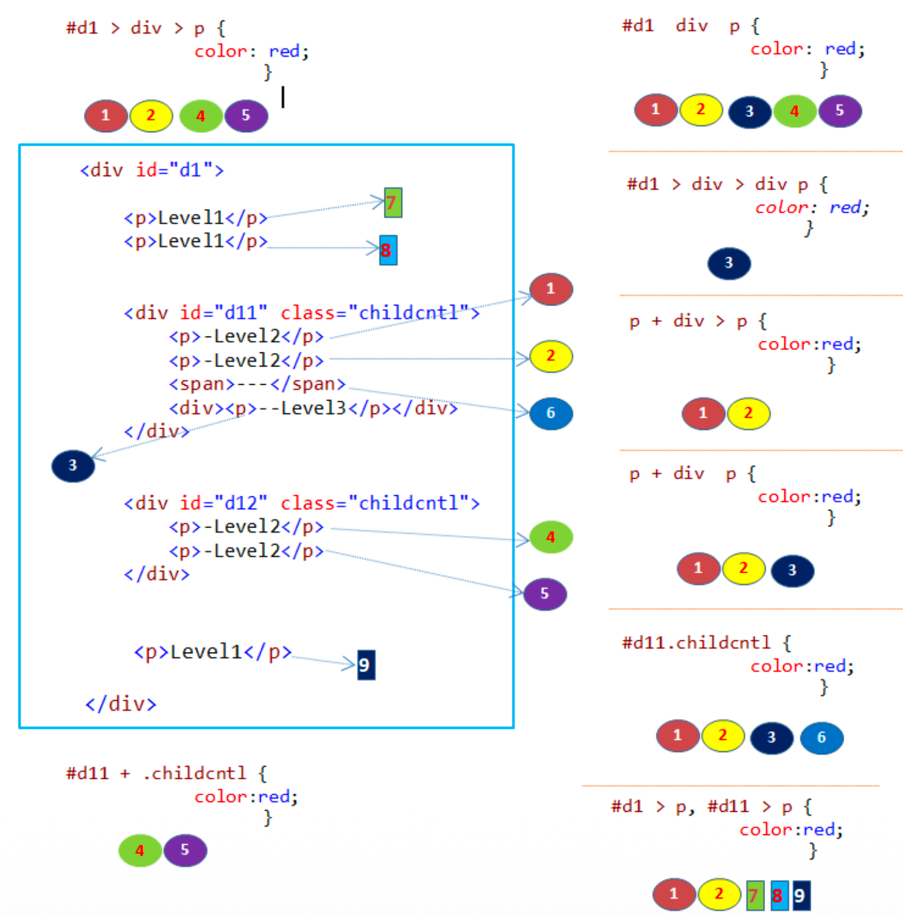

### CSS Display

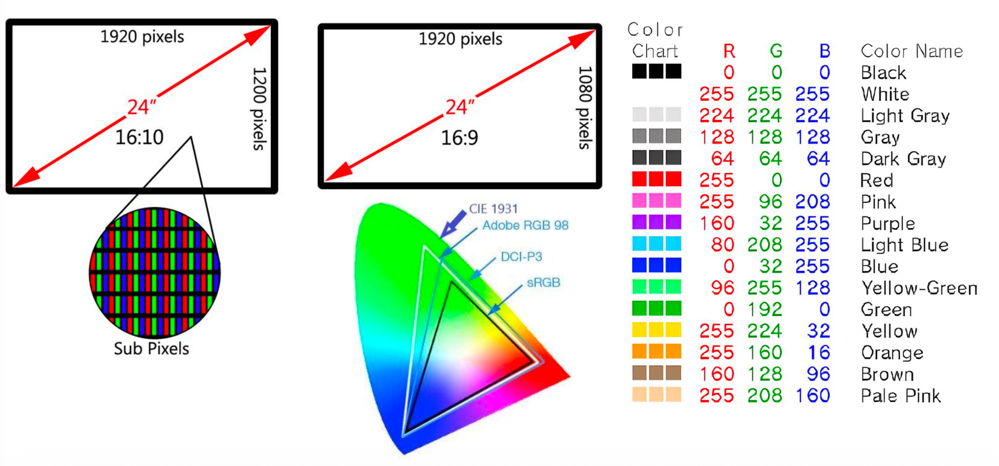

### CSS units

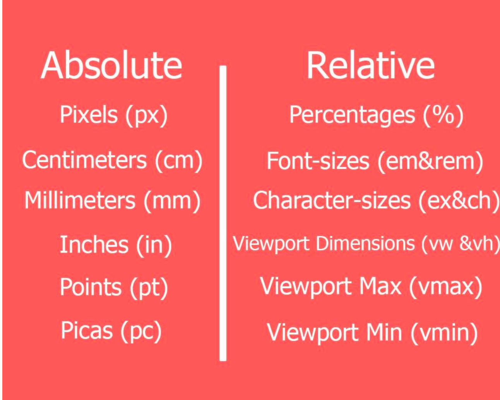

- px (such as font-size: 12px) is the unit for pixels.

  px（例如 font-size: 12px）是像素的单位。

- pt (such as font-size: 12pt) is the unit for points, for measurements typically inprinted media.

  pt（例如 font-size: 12pt）是点数的单位，通常用于印刷媒体的测量。

- % (such as width: 80%) is the unit for percentages.

  %（例如 width: 80%）是百分比单位。

- em (such as font-size: 2em) is the unit for the calculated size of a font. So “2em”, for example, is two times the current font size.

  em（例如 font-size: 2em）是用于计算字体大小的单位。例如，“2em”表示当前字体尺寸的两倍。

### Different Display

- Mobile phone is vertical display

  手机是竖屏

- Desktop is horizonal display

  显示器是横屏

#### Responsive web design

Use different styles to fit different displays for the same contents

考虑到竖屏和横屏之间的现实差异，需要为页面展示元素的大小进行调整，基于显示的分辨率做出合适的修改。

### CSS font

| **`font-family`**  | 字体族       | `"Arial", sans-serif`   |
| ------------------ | ------------ | ----------------------- |
| **`font-size`**    | 字号         | `16px`, `1.2rem`        |
| **`font-weight`**  | 粗细         | `bold`, `700`, `normal` |
| **`line-height`**  | 行高         | `1.5`, `24px`           |
| **`font-style`**   | 样式(斜体)   | `italic`, `normal`      |
| **`font`**         | **简写**     | `bold 16px/1.5 Arial`   |
| **`font-variant`** | 变体(小大写) | `small-caps`            |
| **`font-stretch`** | 宽窄         | `condensed`             |

#### CSS FONT alignment

```css
text-align: start;
text-align: end;
text-align: left;
text-align: right;
text-align: center;
text-align: justify;
text-align: justify-all;
text-align: match-parent;
```

### CSS styling of Link (URL)

```css
a:link {
  color: red;
}

a:visited {
  color: green;
}

a:hover {
  color: blue;
}

a:active {
  color: orange;
}
```


### CSS Display

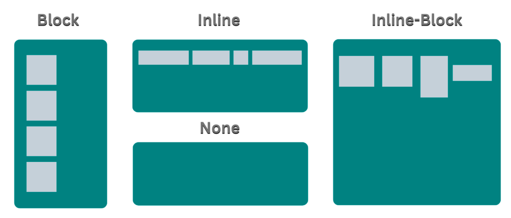

| 属性值         | 类型       | 是否独占一行 | 宽高设置是否有效 | 核心特点                                                     | 典型应用场景                             |
| -------------- | ---------- | ------------ | ---------------- | ------------------------------------------------------------ | ---------------------------------------- |
| `block`        | 块级       | ✅ 是         | ✅ 有效           | 默认宽度填满父容器，垂直堆叠。                               | `<div>`, `<p>`, `<h1>` 等结构元素。      |
| `inline`       | 行内       | ❌ 否         | ❌ 无效           | 与其他行内元素并排，宽高由内容决定，上下边距不影响布局。     | `<span>`, `<a>`, `<strong>` 等文本修饰。 |
| `inline-block` | 行内块     | ❌ 否         | ✅ 有效           | 结合了前两者的优点：可并排排列，且能设置宽高和边距。         | 导航菜单项、按钮、图标列表。             |
| `none`         | 无         | -            | -                | 完全移除元素，不占据任何空间，页面其他元素会填补其位置。     | 配合 JS 实现显示/隐藏切换。              |
| `flex`         | 弹性盒     | ✅ 是*        | ✅ 有效           | 启用 Flexbox 布局模型，子元素可灵活排列、对齐和分配空间（一维布局）。 | 居中布局、响应式导航、卡片排列。         |
| `grid`         | 网格       | ✅ 是*        | ✅ 有效           | 启用 Grid 布局模型，强大的二维布局系统（行 + 列）。          | 页面整体骨架、复杂画廊、仪表盘。         |
| `inline-flex`  | 行内弹性盒 | ❌ 否         | ✅ 有效           | 容器本身表现为行内元素，内部子元素使用 Flex 布局。           | 需要在文本流中嵌入弹性布局时。           |
| `inline-grid`  | 行内网格   | ❌ 否         | ✅ 有效           | 容器本身表现为行内元素，内部子元素使用 Grid 布局。           | 需要在文本流中嵌入网格布局时。           |
| `table` 系列   | 表格模拟   | 视具体值     | ✅ 有效           | 让非表格元素（如 div）表现出 table, tr, td 的行为。          | 特殊布局需求（现多被 Flex/Grid 替代）。  |

**注**：

1. `flex` 和 `grid` 容器本身默认表现为块级行为（独占一行），除非使用 `inline-flex` 或 `inline-grid`。
2. `inline` 元素的 `width` 和 `height` 属性会被浏览器忽略。
3. `display: none` 与 `visibility: hidden` 不同，后者隐藏但保留占位空间。

- display: none：
  元素完全从页面布局中移除，不显示，也不占空间。
- visibility: hidden：
  元素不可见，但是仍然保留原来的占位空间。

### CSS Position

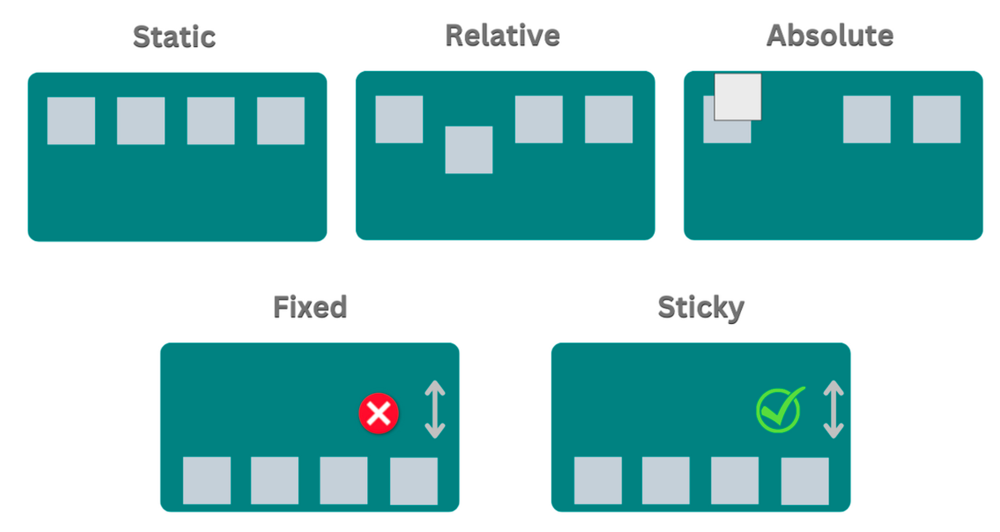

| 属性值     | 中文含义 | 定位基准 (参考物)                                            | 是否脱离文档流                | 典型应用场景                                                 |
| ---------- | -------- | ------------------------------------------------------------ | ----------------------------- | ------------------------------------------------------------ |
| `static`   | 静态定位 | 无（默认值）。元素按照正常文档流排列。                       | 否                            | 绝大多数元素的默认状态；重置定位时使用。                     |
| `relative` | 相对定位 | 相对于元素自身原本的位置进行偏移。                           | 否 (保留原占位空间)           | 1. 微调元素位置。 2. 作为绝对定位子元素的父级容器 (最重要用途)。 |
| `absolute` | 绝对定位 | 相对于最近的非 static 定位的祖先元素。若没有，则相对于初始包含块（通常是 `<body>`/视口）。 | 是 (完全脱离文档流，不占空间) | 模态框、下拉菜单、角标、在卡片内部固定某个图标位置。         |
| `fixed`    | 固定定位 | 相对于浏览器视口 (Viewport)。即使滚动页面，元素位置也不变。  | 是                            | 顶部导航栏、回到顶部按钮、悬浮客服图标、广告横幅。           |
| `sticky`   | 粘性定位 | 混合了 `relative` 和 `fixed`。在跨越特定阈值前是 `relative`，之后变为 `fixed`。 | 否 (在相对阶段占位)           | 滚动时吸顶的表头、侧边栏导航、长列表的分组标题。             |

这是 CSS 布局中最经典的组合：

1. 给**父元素**设置 `position: relative;`（通常不需要设置 top/left，只是为了建立定位上下文）。
2. 给**子元素**设置 `position: absolute;`。
3. **结果**：子元素会相对于父元素进行定位，而不会跑到页面其他地方去。

relative + absolute 经典组合

最常见的定位组合：

- 父元素：

  position: relative;

- 子元素： 

  position: absolute;
  top: 0;
  right: 0;

作用：
父元素建立定位上下文，子元素会相对于这个父元素定位，而不是相对于整个页面乱跑。

考试中可以写：
A relatively positioned parent is often used as the positioning context for an absolutely positioned child.

## 可能考试题与参考答案

## Q1. What is HTML and what is its main function?

**Answer：**

HTML stands for Hyper Text Markup Language. Its main function is to structure a web page. It defines the content and organization of a page, such as headings, paragraphs, images, hyperlinks, tables, lists and forms. HTML elements are organized as a tree called the Document Object Model, or DOM Tree.

------

## Q2. What is the DOM Tree?

**Answer：**

The DOM Tree is a tree-like structure created from HTML elements. In this structure, elements are nested inside other elements, forming parent-child relationships. For example, the `html` element contains `head` and `body`, and the `body` may contain headings, paragraphs, images and forms. CSS and JavaScript can use the DOM Tree to find and operate webpage elements.

------

## Q3. Is `<!DOCTYPE html>` an HTML tag?

**Answer：**

No. `<!DOCTYPE html>` is not an HTML tag. It is a declaration that tells the browser the document is an HTML5 document. It helps the browser render the page correctly.

------

## Q4. What are the new features of HTML5?

**Answer：**

HTML5 provides several important new features. First, it supports video and audio directly through `<video>` and `<audio>` tags, so older plugins like Flash are no longer necessary. Second, it supports `<canvas>`, which can be used to draw graphics and develop web games. Third, WebSocket supports two-way communication. Finally, HTML5 can access local devices such as camera, location information and sensors.

------

## Q5. What is the difference between HTTP Head and HTML Head?

**Answer：**

HTTP Head and HTML Head are totally different. HTTP Head is part of the HTTP request or response and is used for communication between client and server. HTML Head is part of the HTML file and contains metadata of the webpage, such as title, meta information, CSS links and scripts. The whole HTML file is part of the HTTP response.

------

## Q6. What elements can be placed inside the HTML `<head>`?

**Answer：**

Common elements inside `<head>` include `<title>`, `<meta>`, `<style>`, `<link>`, `<script>` and `<base>`. The `<title>` is shown in the browser tab. `<meta>` provides metadata such as character encoding. `<style>` can define internal CSS. `<link>` can link external CSS or icons. `<script>` loads JavaScript. `<base>` defines the base URL for relative URLs.

------

## Q7. Why should we use correct HTML tags instead of only using `<div>`?

**Answer：**

Although `<div>` with CSS can create similar visual effects, correct HTML tags provide semantic meaning. For example, `<h1>` means a main heading and `<p>` means a paragraph. These meanings are useful not only for humans, but also for browsers, search engines, screen readers and programs. Therefore, correct tags improve readability, accessibility and machine understanding.

------

## Q8. What is the difference between HTML and CSS?

**Answer：**

HTML is a markup language used to structure a web page. It defines the content, such as headings, paragraphs, images and forms. CSS is a design language used to style the web page. It controls the appearance of the content, such as color, font, layout, margin and position. In simple words, HTML is structure, while CSS is style.

------

## Q9. What is the CSS Box Model?

**Answer：**

The CSS Box Model describes how every HTML element is displayed as a box. It contains four parts: content, padding, border and margin. Content is the real text or image. Padding is the space between content and border. Border surrounds the padding and content. Margin is the space outside the border and separates the element from other elements.

------

## Q10. What is the basic syntax of CSS?

**Answer：**

A CSS rule usually contains a selector and a declaration block. The selector chooses the HTML element to style. The declaration block contains property-value pairs.

Example:

```
p {
  color: red;
  font-size: 16px;
}
```

Here, `p` is the selector, `color` and `font-size` are properties, and `red` and `16px` are values.

------

## Q11. What are the four ways/styles sources to set CSS for a page?

**Answer：**

There are four sources of CSS styles: inline CSS, internal CSS, external CSS and browser default styles. Inline CSS is written directly in the `style` attribute of an HTML element. Internal CSS is written inside the `<style>` tag in the HTML file. External CSS is written in a separate `.css` file and linked by the HTML page. Browser default styles are provided by the browser automatically.

The override order is:

```
Inline style > Internal CSS > External CSS > Browser default styles
```

------

## Q12. What is a CSS selector?

**Answer：**

A CSS selector is used to select HTML elements and apply styles to them. It works as a link between DOM elements and CSS styles. Common selectors include element selector, class selector, ID selector, universal selector, child selector, descendant selector, adjacent sibling selector and general sibling selector.

------

## Q13. What is the difference between class selector and ID selector?

**Answer：**

A class selector starts with a dot, such as `.intro`, and it selects elements with the corresponding class. A class can be reused by many elements. An ID selector starts with a hash sign, such as `#main`, and it selects the element with that ID. In one HTML page, an ID should be unique.

------

## Q14. What is the difference between `div p` and `div > p`?

**Answer：**

`div p` is a descendant selector. It selects all `<p>` elements inside a `<div>`, no matter how deeply nested they are. `div > p` is a child selector. It only selects `<p>` elements that are direct children of the `<div>`.

------

## Q15. What are absolute and relative CSS units?

**Answer：**

Absolute units have fixed sizes, such as `px`, `pt`, `cm`, `mm` and `in`. Relative units depend on another value or context, such as `%`, `em`, `rem`, `vw` and `vh`. Relative units are often useful in responsive web design because they can adapt to different screen sizes.

------

## Q16. What is responsive web design?

**Answer：**

Responsive web design means using different styles to make the same webpage fit different displays. For example, mobile phones are usually vertical, while desktop screens are usually horizontal. A responsive page adjusts layout, size and spacing according to the screen size and device type, so users can have a better experience on different devices.

------

## Q17. What is the difference between `block`, `inline`, and `inline-block`?

**Answer：**

`block` elements take a full line and their width and height can be set. Examples include `<div>`, `<p>` and `<h1>`. `inline` elements do not take a full line and their width and height usually do not work. Examples include `<span>`, `<a>` and `<strong>`. `inline-block` combines both features: it can stay in the same line with other elements, but width and height can still be set.

------

## Q18. What is the difference between `display: none` and `visibility: hidden`?

**Answer：**

`display: none` completely removes the element from the page layout. The element is not visible and does not take any space. `visibility: hidden` hides the element, but the element still keeps its original space in the layout.

------

## Q19. What is the difference between `relative`, `absolute`, `fixed`, and `sticky` positioning?

**Answer：**

`relative` positions an element relative to its original position and keeps its original space. `absolute` positions an element relative to the nearest non-static ancestor and removes it from the normal document flow. `fixed` positions an element relative to the browser viewport, so it stays in the same place when scrolling. `sticky` behaves like relative at first, but becomes fixed after reaching a certain scroll position.

------

## Q20. Why do we often use `position: relative` on the parent and `position: absolute` on the child?

**Answer：**

This is a common positioning pattern. The parent with `position: relative` creates a positioning context. Then the child with `position: absolute` will be positioned relative to that parent instead of the whole page. This is useful for placing icons, badges, dropdown menus or buttons inside a specific container.