# 3 Insight into JS & Bootstrap

## 知识图谱

```plaintext
Lec03 Insight into JS & Bootstrap
├── 1. JavaScript 的作用
│   ├── 为网页增加 interactivity
│   ├── HTML = 内容结构
│   ├── CSS = 页面样式
│   └── JS = 控制与修改 HTML / 页面行为
│
├── 2. JavaScript 的能力示例
│   ├── HTML5 canvas 动态绘图
│   │   └── H5 clock：JS 在 canvas 上动态画时钟
│   ├── 复杂图形绘制
│   │   └── Fourier Transform 绘图示例
│   └── 浏览器挖矿示例
│       └── 课件强调：NOT legal and NEVER do it
│
├── 3. JavaScript 基础定义与历史
│   ├── 高级语言 High-level
│   ├── 解释型语言 Interpretive
│   ├── 拥有 types / operators / objects / methods
│   ├── 命名演变
│   │   └── Mocha → LiveScript → JavaScript
│   └── 标准化
│       ├── ECMAScript 1997
│       ├── ES5 2009
│       └── ES6 2015 及后续版本
│
├── 4. 现代浏览器与 JS 执行环境
│   ├── Browser 是安装在用户设备上的 compiled binary
│   ├── 浏览器负责连接多个来源
│   │   ├── 文件系统：history / favorites / preferences
│   │   ├── 网络：加载远程数据
│   │   ├── OS input events：click / typing
│   │   ├── GPU & display：显示像素
│   │   └── Web application code：HTML / CSS / JS
│   ├── Blink Rendering Engine
│   │   ├── 实现 HTML / DOM / CSS / Web IDL
│   │   ├── 嵌入 V8 并运行 JS
│   │   ├── 请求网络资源
│   │   ├── 构建 DOM tree
│   │   ├── 计算 style 和 layout
│   │   └── 绘制 graphics
│   └── 浏览器整体结构
│       ├── JS Engine
│       ├── Render Engine
│       └── Browser 产品
│
├── 5. V8 Engine 与 JIT
│   ├── V8 history
│   │   ├── 2008 Full-Codegen
│   │   ├── 2010 Crankshaft
│   │   └── 2015 TurboFan
│   ├── Bytecode vs Machine Code
│   │   ├── Bytecode：中间层、需虚拟机/解释器、跨平台
│   │   └── Machine Code：CPU 可直接执行、平台相关
│   ├── V8 workflow
│   │   ├── Source code
│   │   ├── Parser
│   │   ├── AST
│   │   ├── Ignition → Bytecode
│   │   ├── Feedback / Hot Function
│   │   ├── TurboFan
│   │   ├── Optimized Machine Code
│   │   └── Deoptimization
│   ├── AST vs Parse Tree
│   └── JIT
│       ├── runtime compilation
│       ├── hot spots
│       └── combines interpretation and AOT advantages
│
├── 6. 不同浏览器 JS Engine
│   ├── Chrome / Edge / Node.js
│   │   └── V8
│   ├── Firefox
│   │   └── SpiderMonkey
│   │       ├── Interpreter
│   │       ├── Baseline
│   │       └── IonMonkey
│   └── Safari
│       └── JavaScriptCore
│           ├── LLInt
│           ├── Baseline
│           ├── DFG
│           └── FTL
│
├── 7. JavaScript 语法与语言特性
│   ├── ES5 vs ES6
│   │   ├── Generator
│   │   ├── Class
│   │   ├── Module
│   │   ├── Arrow Function
│   │   ├── Template String
│   │   ├── Destructuring
│   │   ├── Set / Map
│   │   └── Promise
│   ├── ES7 ~ ES10
│   │   ├── ES7：includes / exponentiation
│   │   ├── ES8：async / await / Object.values / Object.entries
│   │   ├── ES9：Promise.finally / object spread
│   │   └── ES10：flat / BigInt
│   ├── Paradigm styles
│   │   ├── Imperative
│   │   ├── Procedural
│   │   ├── Object-oriented
│   │   ├── Functional
│   │   └── Prototypal inheritance
│   ├── Data Types
│   │   ├── Primitive
│   │   │   ├── Boolean
│   │   │   ├── Null
│   │   │   ├── Undefined
│   │   │   ├── Number
│   │   │   ├── String
│   │   │   └── Symbol
│   │   └── Object
│   │       ├── Array
│   │       ├── Object
│   │       ├── Function
│   │       ├── Date
│   │       └── RegExp
│   ├── Variables
│   │   ├── var
│   │   │   ├── function scope
│   │   │   ├── global scope
│   │   │   ├── no block scope
│   │   │   └── hoisting
│   │   ├── let
│   │   │   ├── block scope
│   │   │   └── can be reassigned
│   │   └── const
│   │       ├── block scope
│   │       └── cannot be reassigned
│   └── Class
│       ├── constructor
│       ├── method
│       └── new object
│
├── 8. DOM API
│   ├── DOM = HTML document as tree
│   ├── Node types
│   │   ├── Element Node
│   │   ├── Text Node
│   │   └── Attribute Node
│   ├── Select nodes
│   │   ├── getElementById()
│   │   ├── getElementsByClassName()
│   │   ├── getElementsByTagName()
│   │   ├── querySelector()
│   │   └── querySelectorAll()
│   ├── Neighbor nodes
│   │   ├── childNodes
│   │   ├── firstChild
│   │   ├── lastChild
│   │   ├── previousSibling
│   │   ├── nextSibling
│   │   └── parentNode
│   ├── Change attributes
│   │   ├── style
│   │   ├── className
│   │   └── backgroundColor / color
│   ├── Change contents
│   │   ├── textContent
│   │   └── innerHTML
│   ├── Insert node
│   │   ├── createElement()
│   │   ├── createTextNode()
│   │   └── appendChild()
│   ├── Delete node
│   │   └── parentNode.removeChild(node)
│   └── Events
│       ├── inline handler
│       ├── handler property
│       └── addEventListener()
│
├── 9. DOM Render Process
│   ├── HTML → DOM
│   ├── CSS → CSSOM
│   ├── DOM + CSSOM → Render Tree
│   ├── Layout
│   └── Paint
│
├── 10. BOM API
│   ├── Window
│   ├── Location
│   ├── Navigator
│   ├── Screen
│   ├── History
│   ├── Event
│   └── Browser interaction
│       ├── alert()
│       ├── confirm()
│       └── prompt()
│
├── 11. JS More than Web
│   ├── V8 performance 很强
│   ├── Node.js 使用 JS 作为服务器端语言
│   └── Node.js 不支持浏览器中的 BOM / DOM
│
└── 12. Bootstrap
    ├── Origin from Twitter
    ├── Front-end open-source toolkit
    ├── 包含 HTML / CSS / JS
    ├── 预定义 classes
    ├── 早期版本使用 jQuery
    ├── Bootstrap files
    │   ├── 1 CSS file
    │   └── 1 JS file
    ├── min 文件
    │   └── 删除空格，减小体积，不方便阅读
    ├── 引入方式
    │   ├── 下载到本地服务器
    │   └── 使用在线 CDN
    ├── Grid System
    │   ├── container
    │   ├── container-fluid
    │   ├── row
    │   ├── 12 columns
    │   └── 超过 12 列会换行
    ├── Breakpoints
    │   ├── responsive layout
    │   ├── CSS3 media queries
    │   ├── viewport meta tag
    │   └── sm / md / lg / xl
    └── Components
        ├── Carousel
        └── Buttons
```

## JavaScript

- JavaScript is a powerful programming language that can add interactivity to a website.

  JavaScript是一种功能强大的编程语言，能够为网站增添交互性。

- JavaScript 的能力示例：
  1. JS 可以配合 HTML5 \<canvas> 动态绘图，例如课件中的 H5 clock。
  2. JS 可以完成复杂图形绘制，例如 Fourier Transform 绘图。
  3. JS 也可能被滥用，例如浏览器挖矿。课件强调这种行为 NOT legal and NEVER do it。

### What is Javascript?

- JavaScript is a high level and **interpretive programming language**.

  JavaScript是一种高级解释型编程语言。更接近人类的语言，开发者无需手动管理内存。

- JavaScript has types, operators, standard built-in objects and methods.

  包含数据类型 (Types)、运算符 (Operators)、内置对象 (Objects) 和方法 (Methods) 。

- **解释型 (Interpreted)**：代码通常由浏览器实时解释执行，而不是像 C++ 或者 Java 那样需要预先编译成二进制文件 

  - 注意：JavaScript 通常被称为解释型语言，但在现代浏览器中，JS 引擎会使用 JIT。也就是说，代码一开始可能被解释执行，但运行频繁的 hot functions 会被编译成优化后的 machine code。因此 JS 的执行方式是解释执行和运行时编译结合。


**Iteration Process：Mocha → LiveScript → JavaScript: JS**

**演变过程**：JS 最初叫 **Mocha**，后更名为 **LiveScript**，最终定名为 **JavaScript** 

**标准化**：为了统一标准，JS 遵循 **ECMAScript** 规范（1997年发布首版） 。

**重要里程碑**：2009 年发布了影响深远的 **ES5**，而 2015 年起的 **ES6 (ES2015)** 及其后续版本（ES2016-2018）引入了大量现代编程特性 。

### The Modern Browser 现代浏览器

- A Web Browser is a compiled binary (i.e. chrome.exe) that is installed on and launched from a user's device.

  网络浏览器是一种编译后的二进制文件（例如chrome.exe），它安装在用户设备上并从该设备启动。

- It's responsible for interfacing with a variety of sources. Some examples include:

  其职责是与多种数据源或者底层硬件进行对接。示例包括：

  - The device's filesystem, for loading user preferences, history, favorites, etc.

    该设备的文件系统，用于加载用户偏好设置、历史记录、收藏夹等。

  - The network, to load and deliver remote data

    该网络旨在加载并传输远程数据。

  - The OS's input events, such as clicking and typing

    操作系统的输入事件，例如点击和键入

  - The GPU and display, to present pixels on-screen

    GPU与显示器，用于在屏幕上呈现像素。

- Remote code loaded for a web application, such as HTML, JavaScript, and CSS files defined by a web application

  Web应用程序加载的远程代码，例如由Web应用程序定义的HTML、JavaScript和CSS文件。

### The structure of Browser

- Blink is a rendering engine of the web platform. Roughly speaking, Blink implements everything that renders content inside a browser tab:

  Blink是Web平台的一个渲染引擎。简而言之，Blink实现了浏览器标签页内所有内容的渲染功能。

  - Implement the specs of the web platform (e.g., HTML standard), including DOM, CSS and Web IDL

    实现Web平台规范（如HTML标准），包括DOM、CSS及Web IDL。

  - Embed **V8** and run JavaScript

    嵌入**V8**，这是执行 JS 代码的关键组件 

  - Request resources from the underlying network stack

    从底层网络栈请求资源。

  - Build DOM trees

    构建 DOM 树

  - Calculate style and layout

    计算样式以及布局，决定元素在屏幕上的呈现方式以及位置

  - Embed Chrome Compositor and draw graphics

    嵌入Chrome合成器并绘制图形

- Blink is embedded by many customers such as Chromium, Android WebView and Opera via content public APIs.

  Blink引擎通过内容公共API被众多客户嵌入使用，例如Chromium、Android WebView及Opera浏览器。

### V8 engine history

- V8 was the first really fast JavaScript Virtual Machine

  V8是首个真正高速的JavaScript虚拟机。

  - Launched with Chrome in 2008

  - 10x faster than competition at release

    使 JS 的执行速度提升了 10 倍以上。

  - 10x faster today than in 2008

    现在的版本又比08年快了10倍

- 2008 - Full-Codegen
  
  - Fast AST-walking JIT compiler with inline caching
  
    **2008 (Full-Codegen)**：快速的初级编译器 。
  
- 2010 - Crankshaft
  
  - Optimizing JIT compiler with type feedback and deoptimization
  
    **2010 (Crankshaft)**：引入了优化的 **JIT (Just-In-Time)** 编译和类型反馈 。
  
- 2015 - TurboFan
  
  - Optimizing JIT compiler with type and range analysis, sea of nodes
  
    **2015 (TurboFan)**：现代优化的核心，使用“节点海”(Sea of nodes) 技术进行高级优化 。
  
  - **Deoptimization** 负优化：TurboFan 优化代码时会基于一些假设，例如变量类型比较稳定。如果运行过程中这些假设不再成立，例如变量类型突然改变，优化后的 machine code 可能不再适合执行，这时 V8 会退回到 bytecode / lower-level execution。

### Bytecode and Machine code

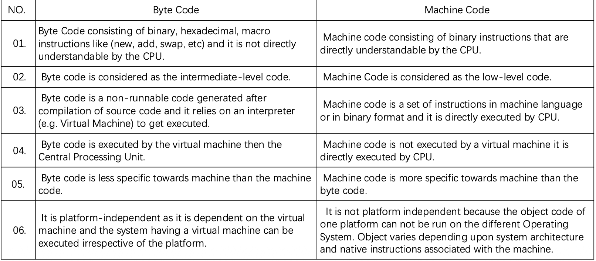

| **特性**     | **字节码 (Bytecode)**             | **机器码 (Machine Code)**     |
| ------------ | --------------------------------- | ----------------------------- |
| **可理解性** | CPU 无法直接理解，需解释器/虚拟机 | CPU 可直接执行的二进制指令    |
| **级别**     | 中间层代码 (Intermediate-level)   | 低级代码 (Low-level)          |
| **跨平台**   | 平台无关（依赖虚拟机）            | 依赖特定系统架构（Intel/ARM） |

### V8 workflow (with Turbofan)

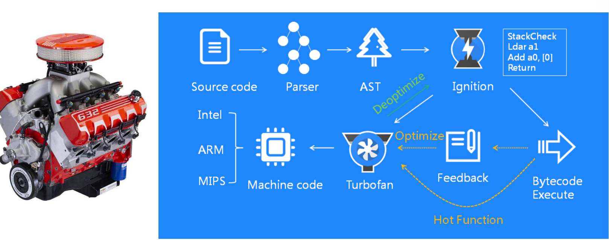

代码运行的流程：

1. **解析器 (Parser)**：将源代码解析为 **抽象语法树 (AST)** 。
2. **Ignition 解释器**：将 AST 转为字节码并执行 。
3. **热点分析 (Feedback/Hot Function)**：V8 会监控代码，如果某段代码运行频繁（Hot），就会交给 **TurboFan** 。
4. **TurboFan 编译器**：将热点字节码编译为高度优化的**机器码**（针对 Intel, ARM 等） 。
5. **去优化 (Deoptimize)**：如果假设失败（例如变量类型改变），代码会退回到字节码状态 

### Abstract Syntax Tree and Parse Tree

通过树状结构，编译器能明确**运算优先级**（先算乘法 `term * factor`，再算加法 `expr + term`） 。

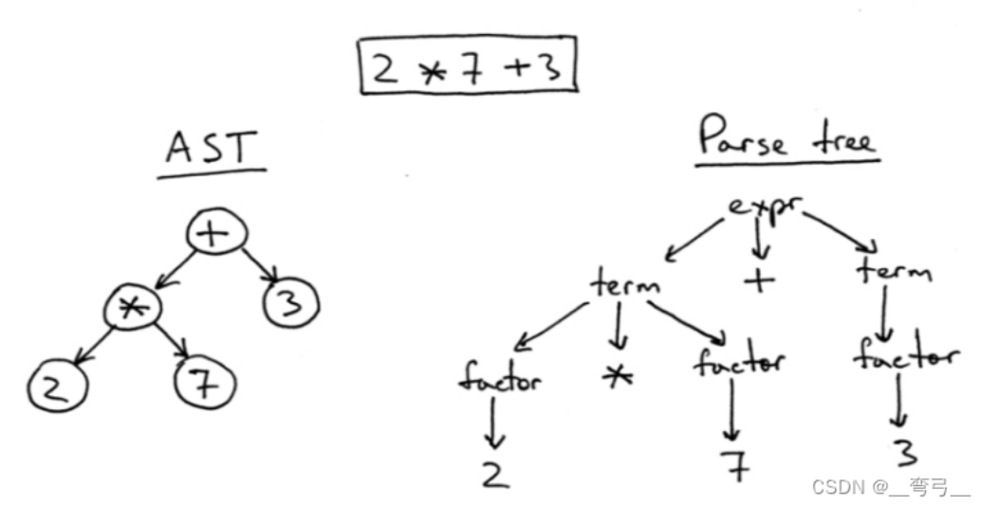

### Just in Time - JIT

- **JIT (Just-In-Time Compilation)** is a compilation process in which code is translated from an intermediate representation or a higher-level language (e.g., JavaScript or Java bytecode) into machine code at runtime, rather than prior to execution. This approach combines the benefits of both interpretation and ahead-of-time (AOT) compilation.

  **定义**：JIT 是一种在**运行时**将中间代码（如字节码）翻译成机器码的过程，而不是在运行前预编译 。**优势**：它结合了**解释执行**（启动快）和**AOT 编译**（运行快）的优点 。

- JIT compilers typically continuously analyze the code as it is executed, identifying parts of the code that are executed frequently (hot spots). If the speedup gains outweigh the compilation overhead, then the JIT compilers will compile those parts into machine code. The compiled code is then executed directly by the processor, which can result in significant performance improvements.

  **热点分析**：JIT 编译器会持续分析正在运行的代码，识别出执行频率高的“热点 (Hot spots)” 。**动态编译**：如果编译带来的速度提升大于编译本身的开销，JIT 就会将这些部分编译为机器码直接由 CPU 执行 。

### JS engine of Firefox and Safari

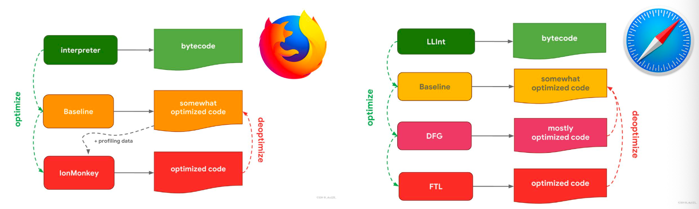

不同浏览器实现 JIT 的层级不同：

- **Firefox (Gecko/SpiderMonkey)**：
  - **Baseline**：初级优化，生成部分优化的代码 。
  - **IonMonkey**：高级优化，根据分析数据生成最终优化代码 。
- **Safari (JavaScriptCore)**：
  - 拥有更复杂的四级流水线：从 **LLInt** (低级解释器) 到 **Baseline**，再到 **DFG** (数据流图) 和最高的 **FTL** (第四代 LLVM 编译器) 。
- **共同点**：它们都支持“去优化 (Deoptimize)”，即如果代码运行情况发生变化，会退回低级状态执行 

### Overall of browsers

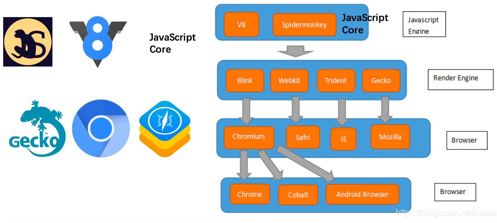

**JS 引擎层**：V8 (Chrome/Edge/Node.js)、SpiderMonkey (Firefox)、JavaScriptCore (Safari) 。

**渲染引擎层**：Blink (Chrome/Opera)、WebKit (Safari)、Gecko (Firefox)、Trident (旧版 IE) 。

**最终产品**：如 Chrome、Android Browser、Safari 和 IE 

### JS Syntax - ES5 vs. ES6

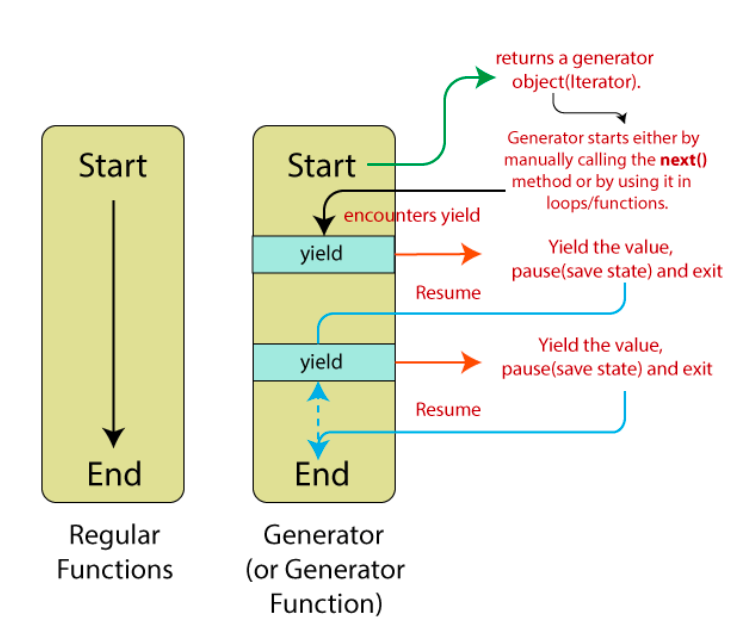

ES6 (ES2015) 是 JS 历史上最大的更新。主要特性包括：

- **Generator (生成器)**：允许函数在执行过程中暂停并恢复（使用 `yield` 关键字） 。
- **类与模块**：引入了 `Class` 语法和 `Import/Export` 模块化 。
- **新语法糖**：箭头函数 (`Arrow Function`)、模板字符串 (`Template`)、解构赋值 (`Destructure`) 。
- **新数据结构**：`Set`、`Map`、`Promise` (处理异步) 。

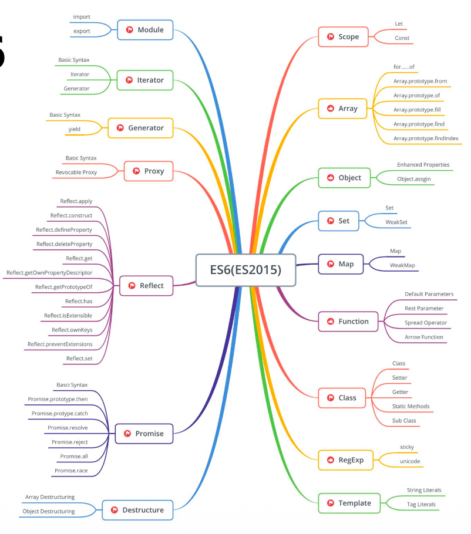

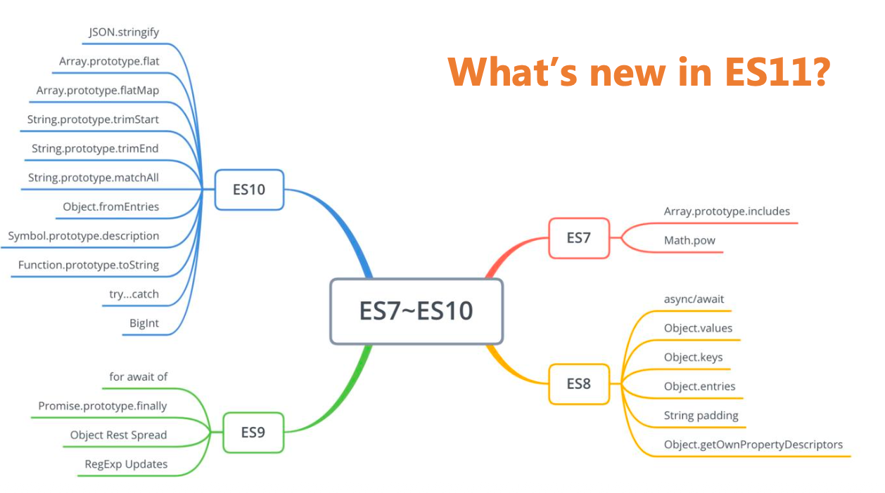

- **ES7 (2016)**：增加了 `Array.prototype.includes` 和幂运算符 `Math.pow` 。

- **ES8 (2017)**：最重要的更新是 **`async/await`**，让异步代码写起来像同步一样；还有 `Object.values/keys/entries` 。

- **ES9 (2018)**：引入了 `Promise.prototype.finally` 和对象展开运算符 。

- **ES10 (2019)**：增加了 `Array.prototype.flat` (数组扁平化) 和 `BigInt` 。

- **ES11 (2020)**：课件标题问道“What's new in ES11?”，通常指可选链 (`?.`) 和空值合并运算符 (`??`) 等（图中虽未详列具体条目，但标注了该阶段） 。

### Paradigm styles 多范式支持

JavaScript 是一门极其灵活的语言，它支持多种编程风格（范式）：

- **命令式 (Imperative)** 与 **过程式 (Procedural)**：按步骤编写指令。
- **面向对象 (Object-oriented)**：基于原型（Prototypal inheritance）的继承机制 。
- **函数式 (Functional)**：将计算视为函数的求值。
- **注意**：课件提醒，混合使用这些范式有时会引起混淆 。

### JS data types

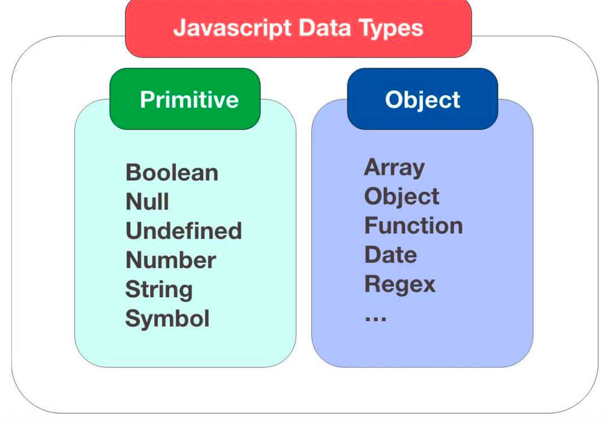

JS 的数据类型分为两大类 ：

- **原始类型 (Primitive)**：包括 `Boolean`、`Null`、`Undefined`、`Number`、`String` 和 ES6 引入的 `Symbol` 。
- **对象类型 (Object)**：包括数组 (`Array`)、对象 (`Object`)、函数 (`Function`)、日期 (`Date`) 和正则 (`Regex`) 。

### Vairables in JS

- ES5 only has **var**
- ES6 support **let** and **const**
- **`var` (ES5)**：具有**全局作用域**或**函数作用域**，但**没有块级作用域** 。
- **`let` & `const` (ES6)**：引入了**块级作用域**（Block Scope，即 `{}` 内部）。

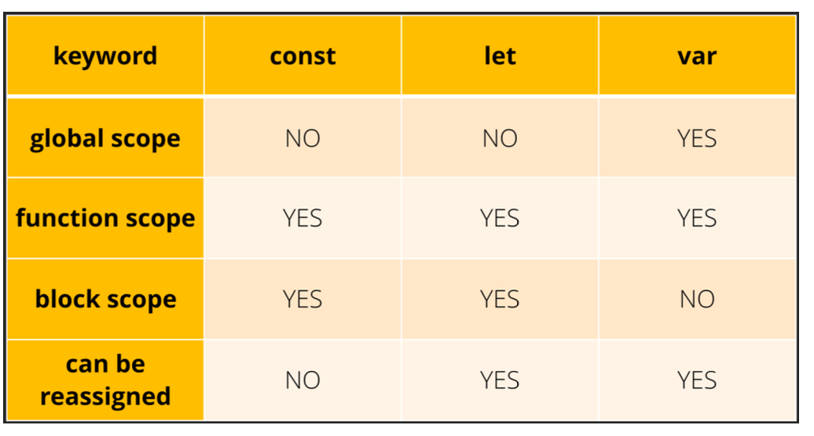

#### Variables in JS - const 常量

- name6 is const, the value cannot be changed.

- This can avoid changing the value by a mistake.

- **常量约束**：`const` 声明的变量在初始化后**不能被重新赋值**，这可以有效避免由于意外修改变量值而导致的错误 。

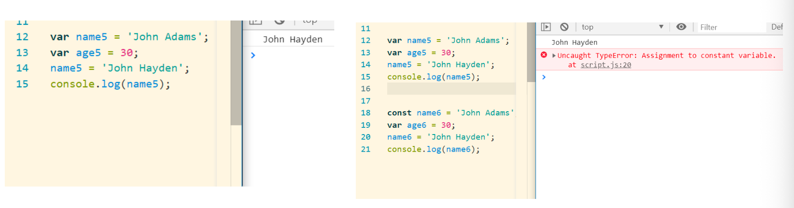

#### Variables in JS – scope 作用域

- let/const is block scope

- Block means codes in {}

- 在 `test5` 中使用 `var`，由于没有块级作用域，`if` 块内定义的变量在块外依然能被访问 。

- 在 `test6` 中使用 `let/const`，如果在块外访问块内定义的变量，会抛出 `ReferenceError` 错误，因为它们被锁定在 `{}` 块中 。

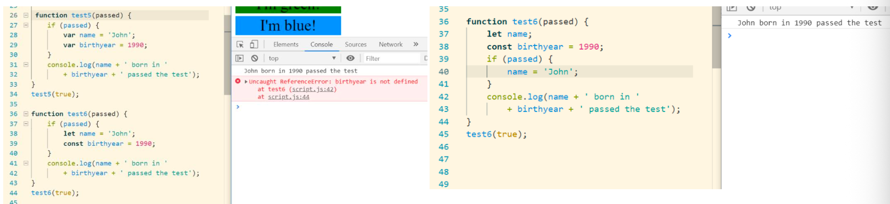

#### Variables in JS - Find the Mistake Reason

- **定义**：`var` 声明的变量可以在声明之前就被使用 。

- **表现**：如果你在 `var name = 'Jay'` 之前 `console.log(name)`，结果会是 `undefined` 而不是报错 。

- **对比**：`let` 和 `const` 不支持这种行为，在声明前访问会直接报错（Temporal Dead Zone）。

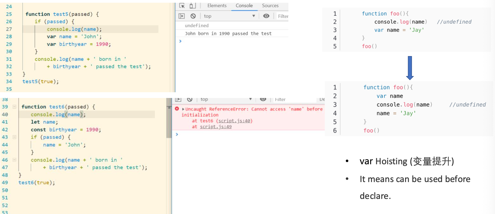

- 使用 `var i` 在循环中声明时，循环结束后 `i` 依然存在于外部作用域，且值变为循环结束后的状态 。

- 使用 `let i`，循环变量 `i` 仅在循环块内有效，外部无法干扰 。

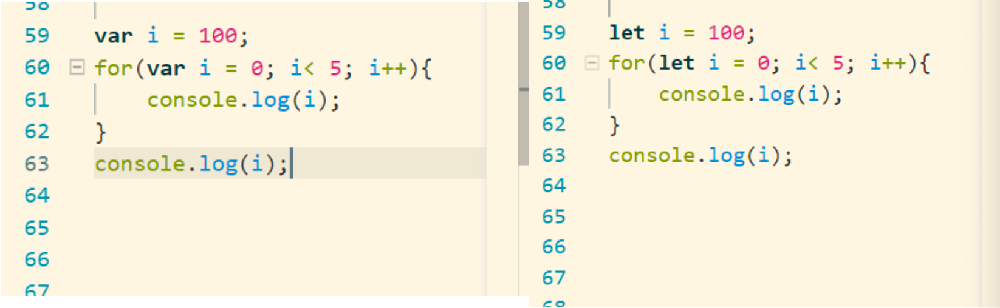

左侧答案：5

右侧答案：100

- 解释 for loop 中 var 和 let 的区别：
  - var i 是 function/global scope，所以 for 循环结束后 i 仍然存在，值通常变成循环结束后的值，例如 5。
  - let i 是 block scope，只在 for 的 {} 中有效，所以循环外访问 i 会产生 ReferenceError。如果外部本来有 let i = 100，那么循环内部的 let i 和外部 i 是两个不同变量，循环结束后外部 i 仍然是 100。

### JS Class

虽然 JS 本质是基于原型的，但 ES6 引入了 `Class` 语法，使其看起来更像 Java 等语言 ：

- **构造函数**：使用 `constructor` 定义初始化逻辑 。
- **方法声明**：直接在类块中定义方法（如 `nameRef()`）。
- **实例化**：使用 `new` 关键字创建对象 

### JS DOM

JS 可以通过 HTML 中的标签层级提取对应标签中的元素。

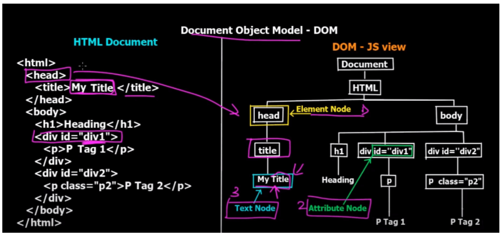

#### DOM API - select nodes

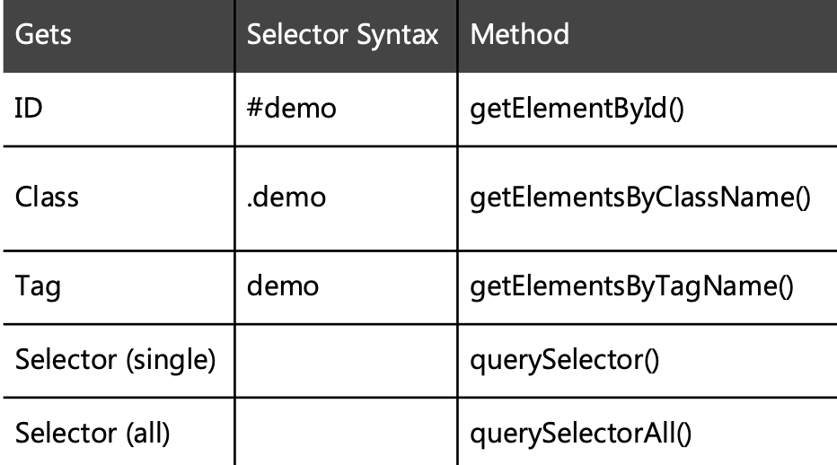

- **元素节点 (Element Node)**：如 `<html>`、`<body>`、`<div>` 。

- **文本节点 (Text Node)**：标签内的实际文字内容 。

- **属性节点 (Attribute Node)**：如 `id="div1"` 或 `class="p2"` 

```html
<h2>ID (#demo)</h2>
<div id="demo">Access me by ID</div>
const demoId = document.getElementById('demo');
<!--A sample to access the div nodeId is “demo”-->
```

#### DOM API – select neighbor nodes

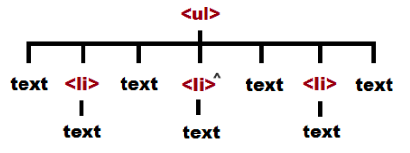

```html
<ul>
  <li>A</li>
  <li>B</li>
  <li>C</li>
</ul>
```


```javascript
• document.querySelector("ul").childNodes[xx]
• document.querySelector("ul").firstChild
• document.querySelector("ul").lastChild
• document.querySelector("ul").childNodes[3].previousSibling
• document.querySelector("ul").childNodes[3].nextSibling
• document.querySelector("ul").parentNode
```

#### DOM API – get attributes

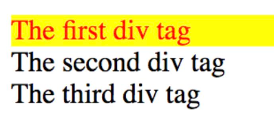

```html
<html>
    <head>
        <title>DOM Practice</title>
    </head>
    <body>
        <div id="first">
            The first dev tag
        </div>
        <div class="myclass">
            The second div tag
        </div>
        <div class="myclass">
            The third div tag
        </div>
        <script type="text/javascript" src=chap7.js></script>
    </body>
</html>
```

- style is also an attribute
- You can change font, className…

```js
document.getElementById("first").style.color= "Red";
document.getElementById("first").style.backgroundColor = "Yellow";
```

#### DOM API – change contents

```html
<html>
    <head>
        <title>DOM Practice</title>
    </head>
    <body>
        <div id="first">
            The first dev tag
        </div>
        <div class="myclass">
            The second div tag
        </div>
        <div class="myclass">
            The third div tag
        </div>
        <script type="text/javascript" src=chap7.js></script>
    </body>
</html>
```

- textContent will treat \<em> as the content to be shown

  `textContent`：将所有输入视为纯文本（即使包含 HTML 标签也会原样显示） 。

- innerHTML will treat \<em> as a HTML tag

  `innerHTML`：会将字符串中的 HTML 标签解析为真实的页面元素 。

```js
var firstDiv = document.getElementById("first");
firstDiv.textContent = "<em>I've changed</em>"
firstDiv.innerHTML = "<em>I've changed</em>"
```

接下来就是改变style:

可以通过 `style` 属性直接修改 CSS，例如：`element.style.color = "Red"` 。

```js
document.getElementById("first").style.color="Red"
document.getElementById("first").style.backgroundColor="Yellow";
```

#### DOM API – insert a node

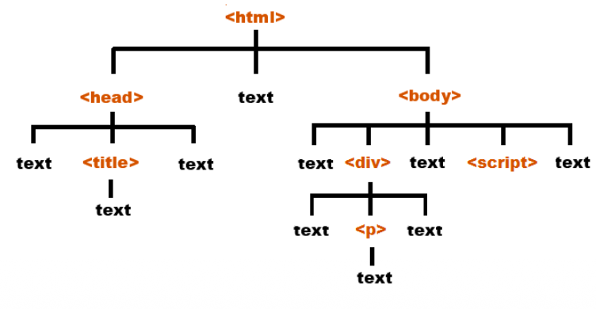

```html
<html>
    <head>
        <title>Nodes Practice</title>
    </head>
    <body>
        <div id="original">
            <p>
                Just a simple paragraph
            </p>
        </div>
        <script type="text/javascript" src=chap9.js></script>
    </body>
</html>
```

创建元素：`document.createElement("p")` 。

创建内容：`document.createTextNode(...)` 。

挂载：使用 `appendChild()` 将其添加为父元素的子节点 。

```js
var para = document.createElement("p");
var text = document.createtextNode("New Paragraph Added");
para.appendChile(text);
document.querySelector("#original").appendChild(para);
```

#### DOM API – delete a node


```html
<html>
    <head>
        <title>Nodes Practice</title>
    </head>
    <body>
        <div id="original">
            <p>
                Just a simple paragraph
            </p>
        </div>
        <script type="text/javascript" src=chap9.js></script>
    </body>
</html>
```

- You must operate everything based on an element

- Only can remove a node from its parent

  必须通过父元素来删除子元素。常用语法为：`node.parentNode.removeChild(node)` 。

```js
var nodeToRemove = document.getElementsByTagName("p")[0];
removeChild(nodeToRemove);
nodeToRename.parentNode.removeChild(nodeToRemove);

DOM 中一个节点不能自己直接删除自己，而是由它的 parent node 调用 removeChild() 删除它。
```

#### DOM API – event

| 方式             | 写法                                    | 优点                   | 缺点                                                 |
| ---------------- | --------------------------------------- | ---------------------- | ---------------------------------------------------- |
| Inline Handler   | `<button onclick="fn()">`               | 简单直接               | HTML 和 JS 混在一起，不推荐                          |
| Handler Property | `element.onclick = fn`                  | 比 inline 清晰         | 一个元素同一事件通常只能保留一个函数，后面会覆盖前面 |
| Event Listener   | `element.addEventListener("click", fn)` | 可绑定多个函数，可移除 | 写法稍微复杂                                         |

- Event means something happen. Monitor it and make an action

  **什么是事件**：指页面上发生的“动作”，如点击、鼠标移动或键盘输入 。

- **三种绑定方式**：

  1. **内联处理 (Inline Handler)**：直接在 HTML 标签写 `onclick="..."`（不推荐，逻辑与结构混杂） 。
  2. **属性处理 (Property)**：在 JS 中设置 `onclick` 属性。缺点是一个元素只能绑定一个函数 。
  3. **监听器 (EventListener)**：使用 `addEventListener('click', ...)`。**优点**是可以为同一个元素绑定多个处理函数，并能随时通过 `removeEventListener()` 移除 。

##### DOM API – event → inline handler 内联处理

- You can write the “onclick” as one attribute with the element

```html
<input type = "button" name = "button1" value = "Inline Handler Demo" onclick = "eventHandlerInlineDemo();">
```

```js
function eventHandlerInlineDemo(){
	alert("Inline Event Handler");
}
```

##### DOM API – event → handler attribute 属性处理

- You can set/change the “onclick” attribute through the target element

- But one element can only bind one function

  最后输出的结果是：Event Handler Property 2

```html
<input type = "button" id = "propdemo" name = "button2" value = "Event Handler Property Demo"><br><br>
```

```js
document.getElementById("propdemo").onclick = eventHandlerPropDemo;
document.getElementById("propdemo").onclick = eventHandlerPropDemo2;

function eventHandlerPropDemo(){
	alert("Event Handler Property");
}
function eventHandlerPropDemo2(){
	alert("Event Handler Property 2");
}
```

##### DOM API – event → listener 监听器

- Multiple event handlers can be added to a single HTML element.
- Event listeners can be easily removed using the removeEventListener() method

```html
<input type = "button" id = "listenerdemo" name = "button3" value = "Event Listener Demo">
```

```js
document.getElementById("listenerdemo").addEventListener('click', eventListenerDemo);
document.getElementById("listenerdemo").addEventListener('click', eventListenerDemo2);

function eventListenerDemo(){
	alert("Event Listener");
}
function eventListenerDemo2(){
	alert("Event Listener 2");
}
```

#### DOM render process

浏览器把代码变成图像的过程：

1. **构建 DOM**：解析 HTML 文件 。
2. **构建 CSSOM**：解析 CSS 样式 。
3. **合并 Render Tree**：将 DOM 和 CSSOM 合并，仅保留可见元素 。
   - Render Tree = DOM Tree + CSSOM Tree 的合并结果，但它主要包含需要显示在页面上的可见节点。之后浏览器才会进行 Layout 和 Paint。
4. **布局 Layout**：计算每个元素的确切位置和大小 。
5. **绘制 Paint**：根据计算结果在屏幕上填充像素 。

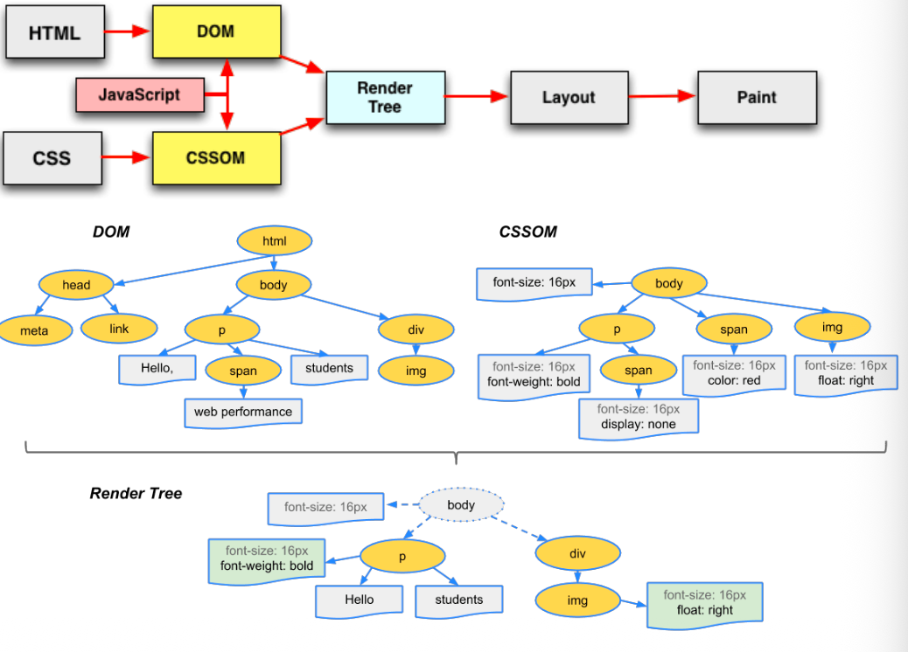

### BOM & DOM

- **Browser object model (BOM)** is a JS interface that allows developers to drive the browser

  **浏览器对象模型（BOM）**是一种JavaScript接口，使开发者能够驱动浏览器。

  - BOM 主要用于操作浏览器窗口和浏览器环境，例如 window、location、history、navigator、screen，以及 alert / confirm / prompt。

- **Document object model (DOM)** is an interface that allows developers to manipulate the content, structure and style of a website

  **文档对象模型（DOM）**是一种允许开发者操作网站内容、结构和样式的接口。
  
  - DOM 主要用于操作 HTML document 中的元素，例如选择、修改、插入和删除节点。

#### BOM API

- **Window Object**

  它是整个 BOM 的顶层节点，代表了浏览器窗口 。所有的全局变量和函数实际上都是 `window` 的属性 。

  - **Location**：控制当前页面的 URL 。
  - **Navigator**：获取浏览器信息（如版本、名称） 。
  - **Screen**：获取用户屏幕的分辨率、宽高 。
  - **History**：管理浏览器的前进、后退记录 。
  - **Event**：处理窗口级别的事件 。


#### 常用 BOM 对象 API

1. Window 对象功能 

   - **窗口控制**：可以打开新窗口 (`open`)、关闭窗口 (`close`)，或者调整窗口大小 (`resizeTo/By`) 。

   - **滚动控制**：将页面滚动到指定位置 (`scrollTo`) 。

   - **打印**：直接调用系统打印对话框 (`print`) 。

2. Location 对象 (URL 操作) 

   - **获取信息**：可以分别提取主机名 (`hostname`)、完整 URL (`href`)、路径名 (`pathname`) 和协议 (`protocol`) 。

   - **页面跳转**：加载新文档 (`assign`) 或替换当前文档 (`replace`) 。

3. Screen 对象 (屏幕参数) 
   - 可以检测用户的屏幕宽度 (`width`)、高度 (`height`)、可用宽高以及色彩深度 (`colorDepth`) 。这对于制作响应式布局非常有参考价值。

三种最基础的浏览器交互方式 ：

- **Alert (警告框)**：仅显示信息，用户点击 OK 后消失 。
- **Confirm (确认框)**：提供“确定”和“取消”两个选项，常用于二次确认操作 。
- **Prompt (提示输入框)**：弹出一个对话框让用户输入数据 。
  - **代码示例**：课件中展示了 `prompt("Please enter your age:");`，并将获取的值存入 `input` 变量，随后通过 `alert` 反馈给用户 。

### JS More than WEB

- Since V8 has an excellent performance, it has been implemented in many fields

  由于V8引擎性能卓越，其已在多个领域得到广泛应用。

- NodeJS is an web server that using JS as program language

  NodeJS是一种以JavaScript作为编程语言的Web服务器。

- For sure, NodeJS does not support BOM/DOM

  可以肯定的是，NodeJS不支持BOM/DOM。

## Bootstrap

- Original from Twitter (now X).

  Bootstrap 最初由 Twitter 开发，是一个包含 HTML、CSS 和 JS 的前端框架 。

- Quickly design and customize responsive mobile-first sites with Bootstrap, the world’s most popular front-end open source toolkit, featuring Sass variables and mixins, responsive grid system, extensive prebuilt components, and powerful JavaScript plugins.

  借助全球最受欢迎的前端开源工具包Bootstrap，快速设计并定制响应式移动优先网站。其特性包括Sass变量与混入、响应式网格系统、丰富的预置组件以及强大的JavaScript插件。

- Many pre-defined classes in Bootstrap includes CSS, fonts ad JS (earlier version use jQuery).

  Bootstrap中的许多预定义类包含CSS、字体和JS（早期版本使用jQuery）。

- With Bootstrap, develop the front-end project can be much easier.

  使用Bootstrap开发前端项目会变得更加简便。

### Bootstrap – basic templet to include it

- Bootstrap is actually 1 CSS file + 1 JS file

  Bootstrap本质上是一个CSS文件加一个JS文件。

- “min” means remove all space to make the file as small as possible. It is not friendly for reading.

  “min”意为移除所有空格以使文件尽可能小，这对阅读并不友好。

- You can download them to your web server and use \<link> and \<script> to include them to the HTML

  您可将其下载至网络服务器，并通过link与script标签将其引入HTML文档。

- You can also use the online version (Browser will download them from the specified server).

  您亦可使用在线版本（浏览器将从指定服务器下载这些文件）。

### Bootstrap – grid system

- Bootstrap uses a grid system for layout

  Bootstrap采用网格系统进行布局

- Each row has 12 columns

  这是 Bootstrap 布局的精髓，它将页面横向分为 **12 个等宽的列** 。

- Each div can take 1-12 columns to achieve the desired layout

  每一行 (`row`) 总计有 12 列 。你可以通过定义 `div` 占据 1 到 12 个列的宽度来实现各种布局（例如 4+8, 6+6 等）。

### Bootstrap – a typical code

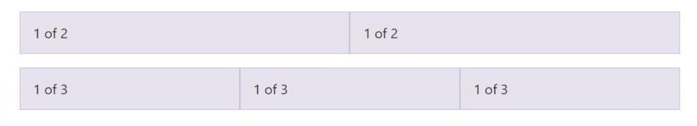

```html
<div class="container">
  <div class="row">
    <div class="col">
      1 of 2
    </div>
    <div class="col">
      1 of 2
    </div>
  </div>
  
  <div class="row">
    <div class="col">
      1 of 3
    </div>
    <div class="col">
      1 of 3
    </div>
    <div class="col">
      1 of 3
    </div>
  </div>
</div>
```

#### Bootstrap – grid system

Bootstrap Grid 的基本结构：

- container / container-fluid → row → col

- .container：固定最大宽度，不同屏幕下有不同 px 宽度。
- .container-fluid：流式宽度，默认占满 100% viewport。
- row：表示一行。
- col：表示列，一行最多 12 columns。

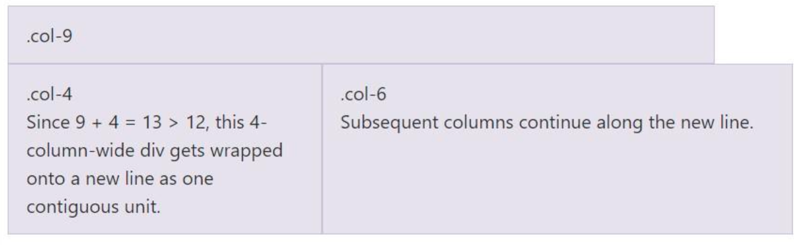

- Since 9 + 4 = 13 > 12, this 4-column-wide div gets wrapped onto a new line as one contiguous unit.

- Subsequent columns continue along the new line.

  如果一行内所有 `div` 占据的列数总和超过 12，多出的部分会自动换行显示 。例如 9 + 4 = 13，那么 4-column-wide div 会整体换到下一行。

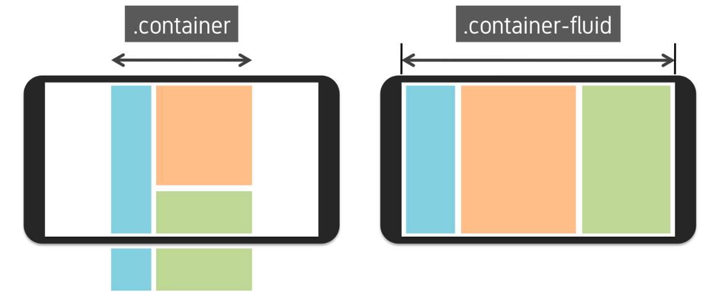

- All elements should within a container.
- Class .container means the absolute width (px).
- Class .container-fluid means the relative width (100% by default)
- `.container`：固定宽度，在不同屏幕尺寸下有不同的像素最大值 。
- `.container-fluid`：流式宽度，始终占据 100% 的视口宽度 。

#### Bootstrap – breakpoint

Bootstrap 利用 CSS3 的 **媒体查询 (@media)** 技术，根据屏幕宽度自动切换布局 。

- To active the responsive function, \<meta> viewport should be specified within the \<head>

  **启用前提**：必须在 `<head>` 中添加 `viewport` 的元标签 (`meta`) 才能激活响应式功能 。

```html
<head>
    <meta charset="UTF-8">
    <meta name="description" content="Free Web tutorials">
    <meta name="keywords" content="HTML, CSS, Javascript">
    <meta name="author" content="John Doe">
    <meta name="viewport" content="width=device-width, initial-scale=1.0">
</head>
```

- Breakpoints are customizable widths that determine how your responsive layout behaves across device or viewport sizes in Bootstrap.

  断点是可自定义的宽度值，用于确定Bootstrap响应式布局在不同设备或视口尺寸下的行为表现。

- Bootstrap uses media queries (@media) of CSS3

  Bootstrap采用CSS3的媒体查询（@media）功能。

- Max container width:

  - .col-sm (small): 540px
  - .col-md (medium): 768px
  - .col-lg (large): 960px
  - .col-xl (extra large): 1140px


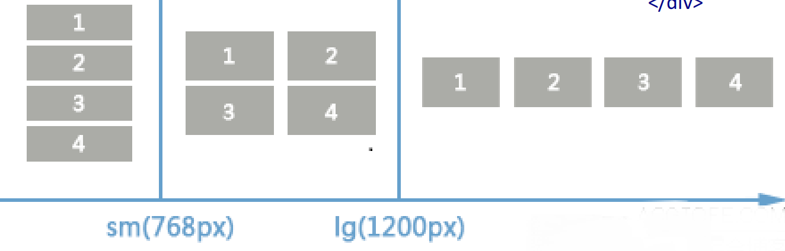

```html
<div class="container">
  <div class="row">
    <div class="col-sm-6 col-lg-3">1</div>
    <div class="col-sm-6 col-lg-3">2</div>
    <div class="col-sm-6 col-lg-3">3</div>
    <div class="col-sm-6 col-lg-3">4</div>
  </div>
</div>
```

- More than one class can be assigned to one element

  一个元素可被分配多个类。

- Multiple class priorities won’t be discussed here

  此处将不讨论多类别优先级问题。

#### Bootstrap – still a lot …

- Carousel
- Buttons
- ...

## 潜在考题

## Q1. What is JavaScript and what is its role in a webpage?

**Answer:**
 JavaScript is a high-level and interpretive programming language. It can add interactivity to a website. In a webpage, HTML mainly defines the structure and content, CSS controls the appearance and style, while JavaScript controls behavior. For example, JavaScript can respond to user clicks, change HTML elements, modify CSS styles, validate forms, draw graphics on canvas, and update page contents dynamically. In the lecture, JavaScript is also shown as the part that can “control and edit HTML.” 

------

## Q2. Is JavaScript only an interpreted language?

**Answer:**
 Not completely. JavaScript is usually described as an interpretive language because it can be executed by the browser without being manually compiled by the programmer. However, modern JavaScript engines such as V8 use JIT compilation. JIT means Just-In-Time compilation. It translates frequently executed code, also called hot spots or hot functions, into machine code at runtime. Therefore, modern JavaScript execution combines interpretation and runtime compilation. 

------

## Q3. Explain the workflow of V8 with TurboFan.

**Answer:**
 The V8 workflow starts from source code. First, the parser reads the source code and converts it into an AST, or Abstract Syntax Tree. Then Ignition turns the AST into bytecode and executes it. During execution, V8 collects feedback and detects hot functions. If some code runs frequently, TurboFan compiles the bytecode into optimized machine code for better performance. If the assumptions used in optimization become invalid, V8 may deoptimize the code and fall back to bytecode execution. 

------

## Q4. What is the difference between bytecode and machine code?

**Answer:**
 Bytecode is intermediate-level code. The CPU cannot directly understand it, so it needs an interpreter or virtual machine to execute it. It is less machine-specific and more platform-independent. Machine code is low-level binary instruction code that the CPU can directly execute. It is faster to execute but depends on the specific CPU architecture and operating system. In V8, JavaScript may first become bytecode and later hot code can be compiled into machine code. 

------

## Q5. What is JIT and why is it useful?

**Answer:**
 JIT means Just-In-Time compilation. It compiles code during runtime instead of compiling everything before execution. JIT continuously analyzes the running code and finds frequently executed parts called hot spots. If compiling these parts can bring more speed improvement than the compilation cost, the JIT compiler converts them into machine code. This improves performance while still keeping the flexibility of interpreted execution. 

------

## Q6. Compare var, let and const in JavaScript.

**Answer:**
 `var` is from ES5. It has function scope or global scope, but it does not have block scope. It also supports hoisting, which means it can be accessed before declaration, although its value is usually `undefined`. `let` and `const` were introduced in ES6. They have block scope, so they only work inside `{}`. `let` can be reassigned, but `const` cannot be reassigned after initialization. Therefore, `const` is useful when we want to avoid changing a value by mistake. 

------

## Q7. What is variable hoisting in JavaScript?

**Answer:**
 Variable hoisting means a variable declaration is moved to the top of its scope during execution. For example, if we use `console.log(name)` before `var name = "Jay"`, it will not produce a reference error. Instead, it prints `undefined`, because the declaration is hoisted but the assignment is not. However, `let` and `const` do not behave like this in the same way. Accessing them before declaration will cause an error because of the temporal dead zone. 

------

## Q8. What is the DOM?

**Answer:**
 DOM means Document Object Model. It represents an HTML document as a tree structure. In this tree, HTML tags become element nodes, text inside tags becomes text nodes, and attributes such as `id` or `class` become attribute nodes. JavaScript can use DOM APIs to select, modify, insert, or delete HTML elements. So DOM is the bridge between JavaScript and the HTML page. 

------

## Q9. List common DOM APIs for selecting nodes.

**Answer:**
 Common DOM selection APIs include `getElementById()`, `getElementsByClassName()`, `getElementsByTagName()`, `querySelector()`, and `querySelectorAll()`. `getElementById()` selects one element by ID. `getElementsByClassName()` selects elements by class name. `getElementsByTagName()` selects elements by tag name. `querySelector()` selects the first matching element using CSS selector syntax, while `querySelectorAll()` selects all matching elements. 

------

## Q10. What is the difference between textContent and innerHTML?

**Answer:**
 `textContent` treats the assigned value as plain text. If we set `textContent` to `"<em>I've changed</em>"`, the browser will display the `<em>` tags as normal text. `innerHTML` treats the assigned value as HTML. If we set `innerHTML` to the same string, the browser will parse `<em>` as an HTML tag and display the text with emphasis. Therefore, `innerHTML` can create HTML structure, while `textContent` is safer for plain text. 

------

## Q11. Why must a node be deleted from its parent node?

**Answer:**
 In the DOM tree, a node is a child of another node. To remove it correctly, we need to ask its parent node to remove that child. The common syntax is `node.parentNode.removeChild(node)`. Calling `removeChild()` without the correct parent is wrong because the method belongs to the parent element that contains the child node. 

------

## Q12. Compare three ways of binding events in JavaScript.

**Answer:**
 There are three common ways. The first is inline handler, such as writing `onclick` directly inside an HTML tag. It is simple but mixes HTML and JavaScript, so it is not recommended. The second is handler property, such as `element.onclick = functionName`. It is clearer, but one element usually only keeps one handler for the same property, so later assignments can overwrite earlier ones. The third is `addEventListener()`. It is better because multiple handlers can be added to the same element, and they can also be removed by `removeEventListener()`. 

------

## Q13. Explain the DOM render process.

**Answer:**
 The DOM render process is how the browser turns HTML, CSS and JavaScript effects into pixels on the screen. First, the browser parses HTML and builds the DOM tree. Second, it parses CSS and builds the CSSOM tree. Third, it combines DOM and CSSOM into the Render Tree. Then it performs Layout to calculate the exact position and size of each visible element. Finally, it Paints pixels on the screen. 

------

## Q14. What is BOM and how is it different from DOM?

**Answer:**
 BOM means Browser Object Model. It represents browser-related objects such as `window`, `location`, `navigator`, `screen`, and `history`. DOM is mainly used to operate the HTML document, such as selecting and changing elements. BOM is mainly used to operate the browser environment, such as getting URL information, moving through browser history, checking screen size, or showing alert, confirm and prompt dialogs. 

------

## Q15. Why does Node.js not support BOM and DOM?

**Answer:**
 Node.js uses JavaScript as a server-side programming language and is based on the V8 engine. However, BOM and DOM are browser-specific APIs. DOM depends on an HTML document, and BOM depends on browser windows and browser environment. Since Node.js runs on the server side instead of inside a browser tab, it does not naturally support BOM or DOM. 

------

## Q16. What is Bootstrap?

**Answer:**
 Bootstrap is a front-end open-source toolkit originally from Twitter. It helps developers quickly design responsive, mobile-first websites. It provides many predefined classes, CSS styles, fonts, JavaScript plugins, a responsive grid system, and ready-made components. With Bootstrap, front-end development becomes easier because many common layouts and UI components are already prepared. 

------

## Q17. How can Bootstrap be included in an HTML page?

**Answer:**
 Bootstrap is basically one CSS file and one JavaScript file. Developers can download these files to their own web server and include them with `<link>` and `<script>` tags. They can also use the online version, where the browser downloads Bootstrap files from a specified server. The `min` version means spaces and unnecessary characters are removed to make the file smaller, but it is less friendly for humans to read. 

------

## Q18. Explain Bootstrap Grid System.

**Answer:**
 Bootstrap uses a grid system for page layout. The basic structure is `container → row → columns`. A page section should usually be inside `.container` or `.container-fluid`. Each row is divided into 12 columns. A div can take 1 to 12 columns, such as `col-6`, `col-4`, or `col-lg-3`. If the total column width in one row is more than 12, the extra column will move to the next line as a whole unit. 

------

## Q19. What is the difference between container and container-fluid?

**Answer:**
 `.container` has a fixed maximum width in pixels, and the exact width changes at different screen sizes. It does not always take the full screen width. `.container-fluid` uses relative width and normally takes 100% of the viewport width. So `.container` is better for centered fixed-width layouts, while `.container-fluid` is better for full-width layouts. 

------

## Q20. What are Bootstrap breakpoints?

**Answer:**
 Bootstrap breakpoints are customizable width values that decide how responsive layout behaves on different devices or viewport sizes. Bootstrap uses CSS3 media queries, such as `@media`, to apply different styles at different screen widths. For Bootstrap responsive behavior to work correctly on mobile devices, the HTML page should include the viewport meta tag in the `<head>`, such as `<meta name="viewport" content="width=device-width, initial-scale=1.0">`