# 4 PHP and SQL

## 知识图谱

```plaintext
Lec04: Insight into PHP & SQL
├── 1. 动态网页产生的背景
│   ├── Web server 存储远程内容
│   ├── 静态网页：一个 URL 对应一个 HTML 文件
│   ├── 电商场景：商品页面不能手动维护
│   └── 动态网页 = frame + data
│       ├── 页面框架相对固定
│       └── 数据从数据库中动态读取
│
├── 2. CGI 与服务器端页面
│   ├── CGI: Common Gateway Interface
│   │   ├── 是标准，不是具体程序
│   │   ├── Web server 可执行外部程序处理请求
│   │   └── CGI 程序可以访问数据库
│   │
│   ├── Server Page
│   │   ├── ASP
│   │   │   ├── VBScript / JavaScript 嵌入 HTML
│   │   │   ├── 可访问数据库
│   │   │   └── 缺点：前后端代码混合
│   │   ├── JSP
│   │   │   ├── Java Server Page
│   │   │   ├── Java，不是 JavaScript
│   │   │   ├── JSP 会转换为 Java Servlet
│   │   │   └── Tomcat 是运行 JSP/Servlet 的服务器软件
│   │   └── PHP
│   │       ├── 1994 Personal Home Page Tools
│   │       ├── PHP Hypertext Preprocessor
│   │       └── 适合 Web 开发
│
├── 3. PHP 核心机制
│   ├── PHP 嵌入 HTML
│   │   ├── <?php ... ?>
│   │   └── Web server 解释 PHP，输出 HTML/CSS/JS
│   │
│   ├── PHP 架构
│   │   ├── Application
│   │   ├── SAPI
│   │   ├── PHP core
│   │   ├── Extensions
│   │   ├── Zend API
│   │   └── Zend Engine
│   │
│   ├── SAPI
│   │   ├── CLI
│   │   ├── phpdbg
│   │   ├── CGI
│   │   ├── FPM
│   │   ├── Litespeed
│   │   └── Apache2Handler
│   │
│   ├── PHP CGI
│   │   ├── 浏览器请求 .php
│   │   ├── Web server 调用 PHP 引擎
│   │   ├── PHP 可能查询数据库
│   │   └── 返回动态生成的 HTML/CSS/JS
│   │
│   ├── CGI 生命周期
│   │   ├── PHP start
│   │   ├── PHP does job
│   │   └── PHP dies
│   │
│   ├── FastCGI
│   │   ├── CGI 的性能优化
│   │   ├── 进程可复用
│   │   └── 减少每次请求初始化成本
│   │
│   └── PHP-FPM
│       ├── FastCGI Process Manager
│       ├── Supervisor 管理 worker pool
│       ├── worker 执行代码后回到进程池
│       └── pool size 可动态调整
│
├── 4. PHP 语法与执行
│   ├── PHP paradigm
│   │   ├── 面向过程
│   │   └── 面向对象
│   ├── PHP basic syntax
│   │   ├── PHP 可放在 HTML 任意位置
│   │   ├── <?php ... ?>
│   │   └── echo 是 language construct
│   ├── Language construct
│   │   ├── 属于语言语法本身
│   │   └── 由 parser 直接识别
│   ├── PHP keywords
│   ├── echo
│   │   ├── 关键字大小写不敏感
│   │   ├── 单引号不解析变量
│   │   └── 双引号可解析变量
│   ├── PHP extensions
│   │   ├── PHP core + external components
│   │   ├── PDO 用于连接多种数据库
│   │   └── 扩展需在 php.ini 中配置
│   ├── Zend Engine
│   │   ├── 解释 PHP
│   │   ├── token
│   │   ├── AST
│   │   ├── opcode
│   │   ├── Zend executor
│   │   └── opcode cache
│   ├── Zend Extensions
│   │   ├── 增强 PHP 核心功能
│   │   └── 例如 OpCache / OpcacheGUI
│   └── PHP JIT
│       ├── 热点代码转为机器码
│       └── 提高执行效率
│
├── 5. Database 基础
│   ├── Database 是软件
│   ├── Database = structured information collection
│   ├── DBMS 控制数据库
│   ├── Database system = data + DBMS + applications
│   ├── Spreadsheet vs Database
│   │   ├── 数据量
│   │   ├── 用户数
│   │   ├── 控制方式
│   │   ├── 计算方式
│   │   └── 数据输入规则
│   ├── Transaction
│   │   ├── ACID
│   │   │   ├── Atomicity
│   │   │   ├── Consistency
│   │   │   ├── Isolation
│   │   │   └── Durability
│   │   ├── commit
│   │   └── rollback
│   ├── Database design
│   │   ├── ER diagram
│   │   ├── Entity
│   │   ├── Relationship
│   │   ├── Schema
│   │   ├── Table
│   │   ├── Column
│   │   ├── Primary Key
│   │   └── Foreign Key
│   └── Index and search
│       ├── B-Tree
│       ├── 提升查询效率
│       └── 类似把扑克牌分组后再查找
│
├── 6. SQL
│   ├── SQL = Structured Query Language
│   ├── 作用
│   │   ├── query data
│   │   ├── manipulate data
│   │   ├── define data
│   │   └── access control
│   ├── SQL types
│   │   ├── DDL
│   │   │   ├── CREATE
│   │   │   ├── ALTER
│   │   │   └── DROP
│   │   ├── DML
│   │   │   ├── SELECT
│   │   │   ├── INSERT
│   │   │   ├── UPDATE
│   │   │   └── DELETE
│   │   ├── DCL
│   │   │   ├── GRANT
│   │   │   └── REVOKE
│   │   └── TCL
│   │       ├── COMMIT
│   │       └── ROLLBACK
│   └── PHPMyAdmin
│       ├── 图形化操作数据库
│       └── 所有选择最终都会翻译为 SQL command
│
├── 7. PHP 操作数据库
│   ├── Web server / PHP / DB 关系
│   │   ├── Browser ↔ Apache: HTTP
│   │   ├── Apache ↔ PHP: CGI / SAPI
│   │   └── PHP ↔ MySQL: DB protocol
│   ├── MySQLi
│   │   ├── 只操作 MySQL
│   │   ├── 支持过程式
│   │   └── 支持面向对象
│   └── PDO
│       ├── 可操作多种数据库
│       ├── 只支持面向对象
│       ├── DSN
│       ├── query
│       ├── foreach 读取结果
│       └── prepare 防止 SQL Injection
│
├── 8. HTTP 参数与状态保持
│   ├── GET
│   │   ├── 参数在 URL 中可见
│   │   ├── 可缓存 / 可书签
│   │   └── 适合简单查询
│   ├── POST
│   │   ├── 参数在 HTTP body 中
│   │   ├── 不适合书签
│   │   └── 可传更多类型数据
│   ├── PHP 获取参数
│   │   ├── $_GET[]
│   │   └── $_POST[]
│   ├── HTTP stateless
│   │   └── 请求之间服务器默认不保存状态
│   ├── Cookie
│   │   ├── 存储在客户端
│   │   ├── 通过 HTTP header 传递
│   │   └── 不安全，可能被读取或篡改
│   └── Session
│       ├── 存储在服务器端
│       ├── session id 通常存在 cookie 中
│       ├── session_start()
│       └── $_SESSION[]
│
└── 9. Web 安全
    └── SQL Injection
        ├── 攻击者通过用户输入插入恶意 SQL
        ├── 可绕过登录、读取或修改数据库
        └── 防御：PDO prepare + execute
```

## Web server - atore the content remotely

A basic HTTP server is a software that understands URLs (web addresses) and send the corresponding file stored on the server computer to client through HTTP response

基础HTTP服务器是一种能识别URL（网址）并通过HTTP响应将服务器计算机上存储的相应文件发送给客户端的软件。

### Dynamic webpage: frame + data 动态网页：框架 + 数据

在早期的 Web 中，服务器只是简单地存储 HTML 文件 。当用户请求某个 URL 时，服务器就把对应的静态文件发回给浏览器 。

- Like a supermarket, we need to put products on the shelf in e-market.

- Manually update the products is not a possible way.

  想象一个像亚马逊（Amazon）这样的电商网站，拥有数万件商品 。如果每一件商品都要人工手动创建一个 HTML 页面，那将是一场“噩梦” 。

- It’s time for dynamic web:

  - A **dynamic website** is the webpage on the server side where different contents are shown when assessed at different timings.

    动态网站在服务器端运行，能够根据不同的访问时间或条件显示不同的内容 。它就像超市的货架，内容（商品）可以自动更新，而不是死板的固定页面 。
  
  - 静态网页是一种“一个 URL 对应一个固定 HTML 文件”的方式，适合内容不经常变化的页面。但电商网站中的商品、库存、订单和用户信息会频繁变化，如果每个商品都手动维护一个 HTML 文件，会非常低效。因此动态网页采用 frame + data 的方式：页面框架相对固定，具体数据从数据库中读取，然后由服务器端程序动态生成 HTML 返回给浏览器。

### CGI - Common Gateway Interface 早期的通用解决方案

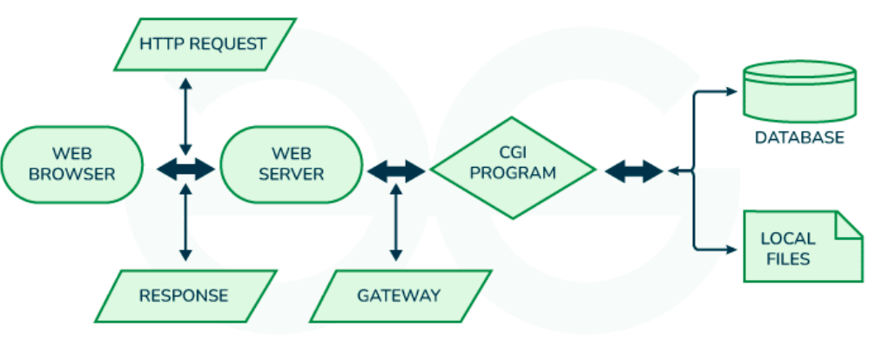

- CGI is an interface that enables the web server to process a user's HTTPS request by executing a program.

  通用网关接口（Common Gateway Interface）是一种标准，允许 Web 服务器通过执行外部程序来处理用户的请求 。

- CGI is only a standard (like HTTP) but not a program implementation.

  CGI 只是一个**标准**，而不是具体的程序 。

- Sever language can be C/C++, Perl, JAVA …, the CGI program resides on the server to process data to produce the relevant dynamic content.

  它可以调用多种语言编写的程序，如 C/C++、Perl、Java 等 。

- CGI program can access the data stored in database

  **关键突破**：CGI 程序可以访问**数据库**中的数据，从而生成实时更新的动态内容 。

- **CGI 的本质**：CGI 是一种标准，而不是某一个具体程序。它规定 Web server 如何调用外部程序来处理用户请求。外部程序可以由 C/C++、Perl、Java、PHP 等语言编写。CGI 的关键作用是让服务器端程序可以访问数据库或本地文件，从而生成动态内容。

### Server Page 三大主流服务器页面

- ASP (Active Sever Page), 1996 by Microsoft.

  - Using VBScript/JavaScript to generate the dynamic html content

    在 HTML 文件中嵌入 VBScript 或 JavaScript 代码 。

  - Calling the com components to extend its ability.

    服务器运行代码（如从数据库提取订单信息），生成实时 HTML 代码，最后将静态和动态内容合并发给浏览器 。

  - ASP.NET supports .NET languages, such as: C#，J#

    后端逻辑代码和前端界面代码混杂在一起，难以维护 。

- JSP (Java Server Page), 1998 by SUN.

  - It is JAVA but NOT JavaScript.

    使用 Java 语言（注意不是 JavaScript）

  - Html + JAVA code in one jsp file.

    JSP 文件会被服务器自动转换为 Java 代码（Servlet），然后编译成 `.class` 文件执行

- PHP

  - 1.0 in 1994 by Rasmus Lerdorf, as Personal Home Page Tools, a CGI with Perl like and shell language.

    1994 年由 Rasmus Lerdorf 创建，最初名为 "Personal Home Page Tools" ，它最初是一种类似 Perl 的 CGI 工具 。

### Glance at ASP 

- Embedded VB or JS code in html file.

  嵌入在HTML文件中的VB或JS代码。

- The dynamic info (such as products, customers, orders…) can be stored in database.

  动态信息（如产品、客户、订单等）可存储于数据库中。

- On request, the web server will run Vb or JS code (such as trace info from database) and generate the corresponding real-time html codes.

  根据请求，网络服务器将运行Vb或JS代码（例如来自数据库的跟踪信息）并生成相应的实时HTML代码。

- Then, web server will merge the static codes and dynamic generated codes as a whole html and sent it back to the browser.

  随后，网络服务器会将静态代码与动态生成的代码合并成一个完整的HTML文档，并将其发送回浏览器。

- Benefit: No need so much print…

  优点：不需要很多的打印

- Drawback: The backend code and front-end code are mixing together

  缺点：后端代码和前端代码混在一起了

### JSP, more programmer friendly than JAVA 

- Embed the java code in html code.

  将Java代码嵌入HTML代码中。

- Auto transfer it to Java code for compiling.

  自动转换为Java代码以进行编译。

### Tomcat - Web server for JAVA

- The Apache Tomcat server is Java-based, open source reference implementation (RI) web application and servlet container created to run servlets and Java Server Pages (JSP) based web applications.

  Apache Tomcat服务器是一款基于Java的开源参考实现（RI）Web应用和Servlet容器，专为运行基于Servlet和Java服务器页面（JSP）的Web应用程序而创建。

- Again, **Tomcat server is a software**.

  再次强调，Tomcat 服务器是一种软件。

- It can work together with Apache server.

  它可以与Apache服务器协同工作。

**Tomcat** 和 **Servlet** 是 Java Web 开发中不可分割的“黄金搭档”。如果把开发一个动态网站比作**开一家餐馆**：

- **Tomcat** 就是“餐馆的实体店（门面、厨房基础设施）”：它负责开门迎客、维持秩序、提供场地。
- **Servlet** 就是“餐馆里的厨师（业务逻辑执行者）”：它负责根据客人的具体点单（请求），真正去炒菜（处理业务、查数据库），并把菜品端给客人。

**Tomcat 的作用是什么？**

Tomcat 严格来说是一个 **Web 服务器（Web Server）** 和 **Servlet 容器（Servlet Container）**。

在没有 Tomcat 之前，如果你用 Java 写了一段处理网页请求的代码，它是没办法直接在网络上运行的。因为你得自己写代码去监听端口、处理复杂的 TCP 连接、解析 HTTP 协议……这极其痛苦。Tomcat 就是为了把解脱出来而诞生的，它的核心作用包括：

- **建立网络连接与监听**：它像一个保安一样，死死守住服务器的某个端口（默认是 8080），等待浏览器的连接。
- **封装 HTTP 协议（做脏活累活）**：当浏览器发来一个 HTTP 请求时，Tomcat 会把这个复杂的底层文本请求解析出来，封装成 Java 开发人员非常熟悉的 `HttpServletRequest` 对象；同时创建一个临时的 `HttpServletResponse` 对象用来准备装载返回的数据。
- **管理 Servlet 的生命周期**：Tomcat 负责 Servlet 的创建、初始化、调用以及销毁。如果没有 Tomcat 这个“容器”在背后默默管理，Servlet 代码就只是一堆没有灵魂的 `.class` 文件。
- **处理高并发（线程池管理）**：当一万个用户同时访问你的网站时，Tomcat 负责在后台调度线程池，让不同的线程去伺候不同的用户，保证服务器不崩溃。

**Servlet 的作用是什么？**

Servlet 翻译过来叫“服务器小程序”**（Server Applet），它本质上就是 Java 官方定义的一个**接口（Interface）。

Tomcat 虽然强大，但它是一个通用的软件，**它根本不知道你的网站是用来卖衣服的、还是用来做教务系统的**。具体的业务逻辑（比如：登录校验、商品加入购物车、扣减余额）必须由你来写。而 **Servlet 就是你写业务逻辑的标准规范**。

它的核心作用可以总结为三步：

1. **接收数据**：通过 Tomcat 传过来的 `HttpServletRequest`，拿到用户在浏览器输入的账号、密码或请求参数。
2. **处理业务**：写你自己的 Java 代码（比如调用 DAO 层查数据库，验证密码是否正确）。
3. **返回响应**：把处理好的结果（比如一个 HTML 页面，或者一段 JSON 数据）写进 `HttpServletResponse` 对象里。

**如何协同工作的？（一次完整的请求旅程）**

当你打开浏览器，访问一个由 Java 后端驱动的网页（例如 `http://localhost:8080/user/login`）时，幕后发生的过程如下：

1. **浏览器发车**：浏览器打包一个 HTTP 请求，顺着网络发送给你的服务器。
2. **Tomcat 接待**：守护在 8080 端口的 **Tomcat** 拦截到了这个请求。
3. **Tomcat 拆包**：Tomcat 把 HTTP 文本拆开，包装成 Java 对象，并根据 URL（`/user/login`）去自己的映射表里查找：“这个路径归哪个厨师管？”
4. **Servlet 炒菜**：Tomcat 找到了对应的 **LoginServlet**，把请求对象交给他。**Servlet** 开始执行里面的 `doPost()` 或 `doGet()` 方法，验证账号密码。
5. **打包带走**：Servlet 把“登录成功”的信息写回响应对象。
6. **Tomcat 送客**：**Tomcat** 把响应对象重新翻译成标准的 HTTP 响应文本，通过网络吐回给浏览器。浏览器渲染页面，用户看到登录成功。

## PHP

### PHP - Hypertext Preprocessor 超文本预处理器

- In 1997, Andi Gutmans and Zeev Suraski rewrote Rasmus Lerdorf's PHP-FI, which was released as PHP Hypertext Preprocessor 3.

  1997年，安迪·古特曼斯和泽夫·苏拉斯基重写了拉斯姆斯·勒多夫开发的PHP-FI，并将其发布为PHP超文本预处理器3。

- In 1998, they completely redesigned the PHP syntax parser and named it the **Zend** Engine. PHP 4 was the first product based on the Zend engine, which also achieved great success.

  1998年，他们对PHP语法解析器进行了彻底重写，并命名为**Zend**引擎。PHP 4是基于Zend引擎开发的首个产品，同样取得了巨大成功。

- In 1999, they co-founded Zend Corporation.

- The PHP scripts are embedded in html codes with opening tag \<?php and closing tag ?>

  PHP脚本嵌入在HTML代码中，使用起始标签**\<?php** and closing tag **?>**。

- When a PHP page is requested by the client, Web server (like Apache) will interpret the PHP scripts and use the output to replace the PHP scripts, the dynamic generated HTML content will be returned to the client.

  当客户端请求一个PHP页面时，Web服务器（如Apache）会解析PHP脚本，并用其输出替换原有的PHP代码，最终将动态生成的HTML内容返回给客户端。

### PHP - Architecture

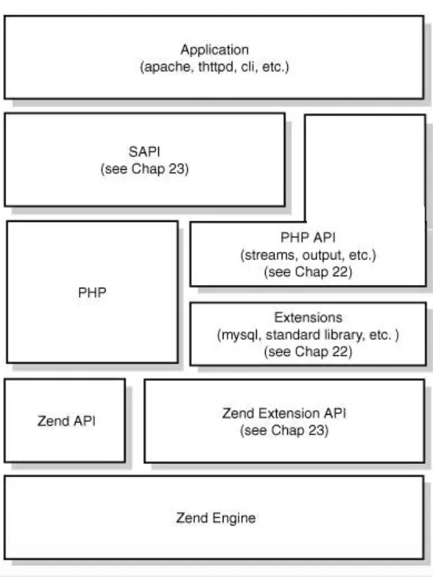

- PHP supports to embedded the scripts in html codes.

  PHP支持在HTML代码中嵌入脚本。

- PHP is optimized for Web development and can be used for general-purpose (However few people use it beyond web).

  PHP专为Web开发优化，也可用于通用编程（但除Web之外使用者甚少）。

- PHP is the widely-used, free, and still active.

  PHP是一种广泛使用、免费且持续活跃的编程语言。

- Nginx, Apache have extension that support PHP through SAPI of PHP.

  Nginx和Apache拥有通过PHP的SAPI支持PHP的扩展模块。

### SAPI of PHP PHP 与外界的桥梁

- CLI - command line interface

  命令行

  - Using PHP in command line interface.

    在命令行界面中使用PHP。

- phpdbg - interactive PHP debugger

  phpdbg 交互式 PHP 调试器

  - PHP includes an interactive debugger called phpdbg implemented as a SAPI module.

    PHP内置了一个名为phpdbg的交互式调试器，它作为SAPI模块实现。

- CGI - common gateway interface 通用网关接口

  Web 服务器通过这些协议调用 PHP 解释器 

  - Embed
  - FPM
  - Litespeed
  - Apache2Handler

- Server Application Programming Interface - SAPI helps interacting between the outside world and the PHP/Zend engine.

  服务器应用程序编程接口 SAPI 有助于外部世界与 PHP/Zend 引擎之间的交互。

- PHP comes with multiple SAPI modules for using it in command line, with web servers or even embedding it in other applications.

  PHP 内置了多种 SAPI 模块，可在命令行、Web 服务器中使用，甚至可嵌入其他应用程序。

### PHP CLI

- PHP can run the code in command line, similar to most other program language.

  PHP能够在命令行中运行代码，这与大多数其他编程语言类似。

```shell
php -r "echo \"\nHello World!\n\";"

Hello World!
```

虽然 PHP 主要用于 Web，但它也可以像 C++ 或 Java 一样在控制台中运行 。

- 可以使用 `php -f 文件名` 来执行脚本文件 。
- 可以使用 `php -r "代码"` 直接在命令行执行单行 PHP 代码 。

### PHP CGI for dynamic web 动态响应的工作原理

Environment Variables Used in CGI

CGI中使用的环境变量

- **CONTENT_LENGTH**: It specifies the length of URL encoded data in bytes.

  它指定URL编码数据的字节长度。

- **REMOTE_HOST**: resolved host name of the client.

  客户端的解析主机名。

- **CONTENT_TYPE**: It specifies the type of data as a MIME header.

  它指定了数据的类型作为MIME头部。

- **QUERY_STRING**: Gives information at the end of the URL after?

  在URL末尾的问号后提供信息

- **REMOTE_ADDR**: IP address of the client making the request.

  发出请求的客户端IP地址。

- **REQUEST_METHOD**: It gives the HTTP request method.

  它返回HTTP请求方法。

- **SCRIPT_NAME**: Name of the CGI script (i.e. PHP file path/name) which is being run.

  正在运行的CGI脚本名称（即PHP文件路径/名称）。

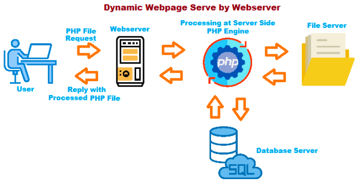

当用户请求一个 `.php` 文件时，过程如下 ：

1. **请求**：浏览器发送 HTTP 请求给 Web 服务器 。
2. **处理**：服务器发现是 PHP 请求，将其交给 **PHP 引擎** 处理 。
3. **数据交互**：PHP 引擎可能会连接 **SQL 数据库** 提取数据 。
4. **渲染输出**：PHP 将结果渲染为标准的 **HTML/CSS/JS** 发回给用户 。**注意：** 无论后端逻辑多复杂，用户最终收到的依然是浏览器能理解的静态前端代码 。

### PHP -CGI lifecycle 生命周期：随用随死

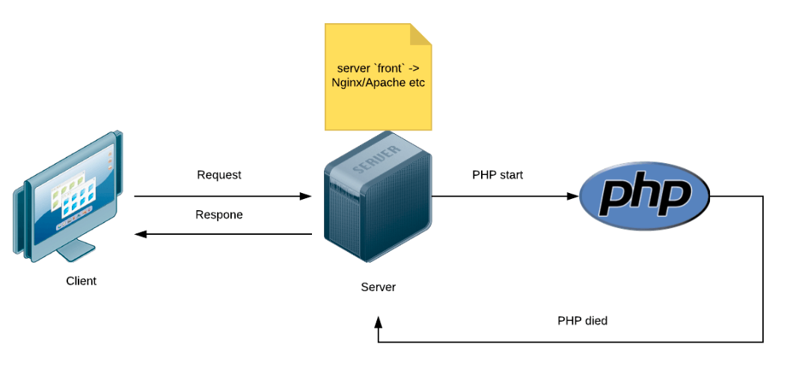

讲义中强调了一个很形象的概念：**CGI 生命周期** 。

**PHP 启动 -> 执行任务 -> PHP 死亡** 

- CGI is the SAPI of PHP to support the CGI standard.

  对于每一个通过 CGI 协议进来的请求，PHP 都会经历“启动、工作、关闭”的过程 。

- For each request, PHP does its job, then simply dies.

  **评价**：这种模式简单但也带来了性能开销，因为每个请求都要重新初始化环境 。

#### CGI and FastCGI 从 CGI 到 FastCGI 的进化

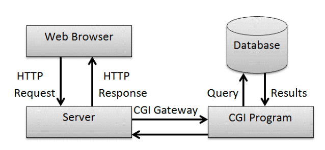

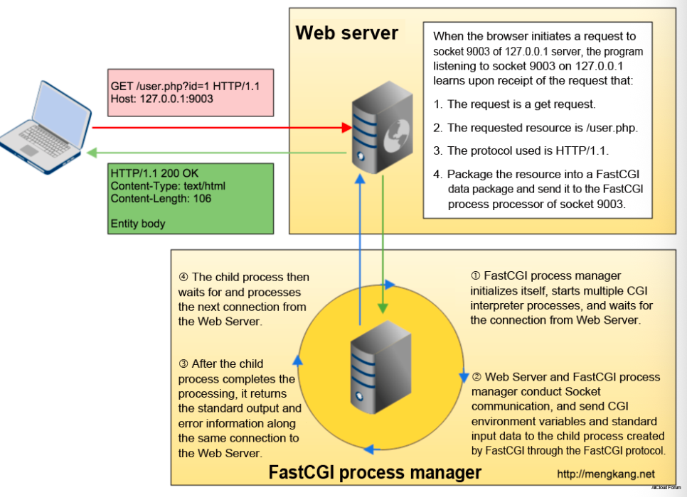

- FastCGI is an **open extension** to CGI that improve the performance.

  FastCGI 是 CGI 的一个开放扩展，能够提升性能。

- It saves the initial cost for each visiting.

  节省了每次访问的初始成本。

早期的 CGI 模式存在“每个请求都要启动和销毁进程”的问题，开销巨大 。**FastCGI** 则是对其的优化方案：

- **持久化进程**：FastCGI 管理器会预先初始化，启动多个 CGI 解释器进程并等待连接，而不是等请求来了再启动 。
- **重复利用**：子进程处理完一个请求后，不会立即“死掉”，而是回到等待状态，准备处理来自 Web 服务器的下一个连接 。
- **通信方式**：Web 服务器与 FastCGI 管理器通过 **Socket** 进行通信，发送环境变量和标准输入数据 。
- **优势**：极大地节省了每个请求的初始化成本，提升了服务器性能 。
- FastCGI 是 CGI 的性能优化版本。它不会让 PHP 进程在每次请求后直接死亡，而是让进程保留下来继续等待下一个请求。PHP-FPM 是 FastCGI 的进程管理器，它通过 supervisor process 管理 worker pool。worker 执行完代码后回到进程池等待下一次任务，因此可以减少重复启动和销毁进程的成本。

### PHP - FPM 现代 PHP 的“管理者”

**PHP-FPM (FastCGI Process Manager)** 是 FastCGI 的具体实现和管理器

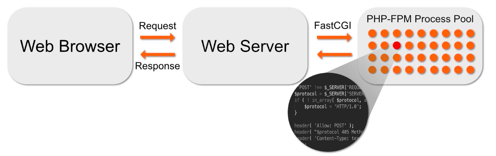

- A supervisor process chooses a worker process from the pool and gives it the code.

  **进程池 (Process Pool)**：它维护着一个工作进程池 。

- The worker executes the code, and the result is sent back to Apache, which sends it to the web browser.

  **主从架构**：一个主进程（Supervisor）负责接收请求，并从中选择一个空闲的工作进程（Worker）来执行代码 。

- Once the worker is done, it returns to the pool to await another chunk of code to execute.

  **任务循环**：工作进程执行完代码并将结果传回给 Apache/Nginx 后，会重新回到进程池等待下一个任务 。

- The pool size can be dynamically adjusted.

  **动态调节**：进程池的大小可以根据负载情况进行动态调整 。

### PHP paradigm PHP 的编程范式

- PHP supports both paradigms

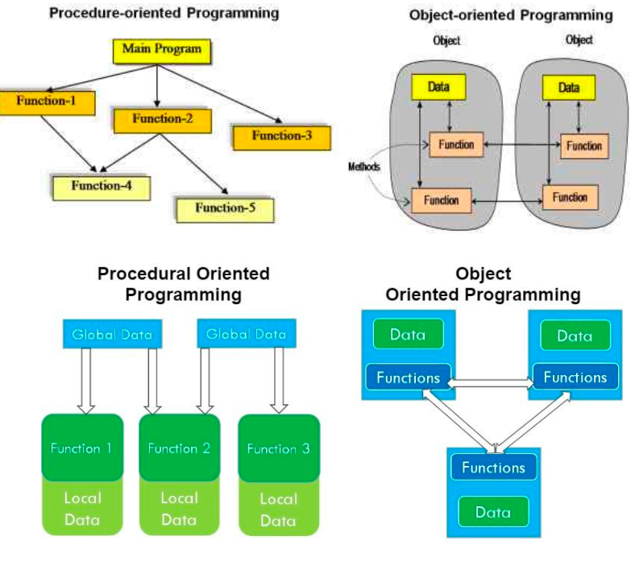

### PHP basic syntax

```php
<?php
  // PHP code goes here
?>
```

```php+HTML
<! DOCTYPE html>
<html>
  <body>
    <h1>
      My first PHP page
    </h1>
    
    <?php echo "Hello world!"; ?>
  </body>
</html>
```

- PHP script can be placed anywhere in the document.

- A PHP script starts with \<?php and ends with ?>

- “echo” is a **language construct** to output data.

PHP 是一门非常灵活的语言，它同时支持两种主要的编程模式（Paradigm）：

- **面向过程编程 (Procedure-oriented Programming)**：
  - 以“函数”为中心 。
  - 数据通常是全局或局部变量，通过调用一系列函数来完成任务 。
- **面向对象编程 (Object-oriented Programming, OOP)**：
  - 以“对象”为中心，将数据和操作数据的方法（Method）封装在一起 。
  - **高级特性**：PHP 支持类（Class）、接口（Interface）、抽象类（Abstract Class）以及继承（Extends）等现代 OOP 特性 。

#### Language construct 语言结构 vs. 内置函数

- In programming, language constructs and built-in functions are often misinterpreted with one another due to the fact that both have more or less alike behavior.

  在编程中，语言结构和内置函数常被相互混淆，因为两者的行为多少有些相似。

- But they differ from each other in the way the PHP interpreter interprets them.

  但它们之间的区别在于PHP解释器对它们的解释方式不同。

- Every programming language consists of tokens and structures which the respective language parser can recognize.

  每种编程语言都由其对应语言解析器能够识别的标记和结构组成。

- So whenever a file is parsed, the parser understands their usage and knows well what to do with them without having the need to examine them further.

  因此每当解析一个文件时，解析器就能理解它们的用途，并清楚知道如何处理它们，无需进一步检查。

- These tokens and structures are known as language construct. They are basically keywords that are a part of the programming language.

  这些标记和结构被称为语言构造。它们本质上是编程语言组成部分的关键字。

- In other words, they form the syntax of the language.

  换句话说，它们构成了语言的语法。

### php key words 关键字

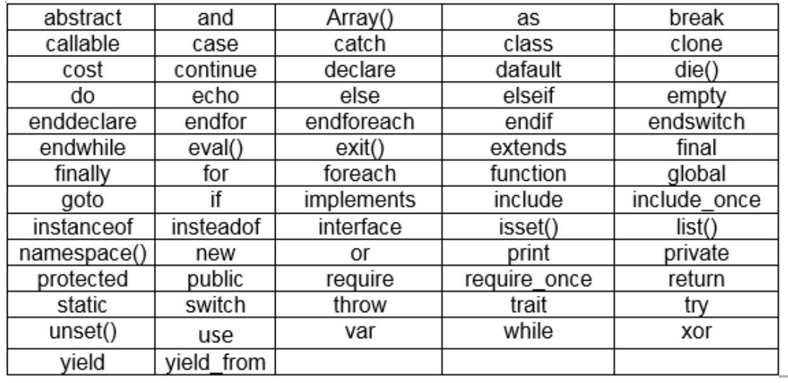

- Most of keywords function like its name.
- Similar to many other computer language.
- Not possible to explain all of them in the lecture.

PHP 拥有大量的关键字，用于控制程序的流程和结构 ：

- **常见类别**：
  - **流程控制**：`if`, `else`, `while`, `for`, `break`, `switch` 。
  - **面向对象**：`class`, `interface`, `public`, `private`, `protected`, `extends`, `implements` 。
  - **错误处理**：`try`, `catch`, `throw`, `finally` 。
- **特性**：大多数关键字的功能与其名称一致，且**不区分大小写**（例如 `ECHO` 和 `echo` 是一样的） 

### About echo

syntax 1：单引号

```php
$txt1 = "Learn PHP";
$txt2 = "W3SChools.com";

echo '<h2>' . $txt1 . '</h2>';
echo '<p>Study PHP at ' . $txt2 . '</p>';
```

syntax 2：双引号

```php
$txt1 = "Learn PHP";
$txt2 = "W3School.com";

echo "<h2>$txt1</h2>";
echo "<p>Study PHP at $txt2 </p>"
```

- All keywords are case non-sensitive including echo.

  所有关键字包括echo都不区分大小写。

- Single quote and double quote are obviously different in PHP as above.

  单引号和双引号在PHP中显然是不同的，如上所述。

- You can use either one.

### PHP extensions

- PHP has basic internal functions or PHP core.

  PHP具有基础内部函数或PHP核心。

- Many functions are achieved through external components.

  许多功能都是通过外部组件实现的。

- Such as extension PDO (PHP Data Objects) let PHP can interact with most of the relational as well as NOSQL databases.

  例如扩展PDO（PHP数据对象）可让PHP与大多数关系型及非关系型（NOSQL）数据库进行交互。

在 PHP 中，单引号 `' '` 和双引号 `" "` 有着本质的区别 ：

- **双引号**：会解析其中的变量 。例如 `echo "<h2>$txt1</h2>";` 会直接打印出变量 `$txt1` 的内容 。
- **单引号**：通常被视为纯字符串。如果要在单引号中连接变量，需要使用点号 `.` 进行拼接 。

#### Configure extensions 拓展配置

- Each PHP extension is a runnable program (.dll on Win and .so on Linux/Mac)

  每个 PHP 扩展都是一个可执行的程序（在 Windows 上是 .dll，在 Linux/Mac 上是 .so）。

- PHP need to claim the specified extension in php.ini to load the corresponding extension.

  PHP 需要在 php.ini 中加载指定的扩展，以启用对应的扩展功能。

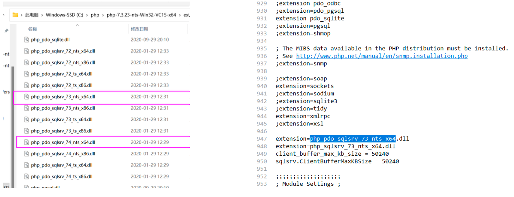

PHP 的强大之处在于它高度模块化的架构 ：

- **核心与组件**：PHP 拥有基础的内置功能（核心），但许多高级功能（如连接数据库）是通过**外部组件（扩展）**实现的 。
- **PDO (PHP Data Objects)**：这是一个非常重要的外部扩展，它允许 PHP 与各种关系型数据库（如 MySQL, SQLite, PostgreSQL）甚至一些 NoSQL 数据库进行交互 。
- **文件形式**：在 Windows 系统上，每个扩展通常是一个 `.dll` 文件；在 Linux/Mac 上则是 `.so` 文件 。
- **配置方式**：开发者需要在 `php.ini` 配置文件中通过 `extension=...` 来声明并加载指定的扩展 。例如，要使用 SQLite，需要确保 `extension=pdo_sqlite` 没有被注释掉 。

## Zend Engine

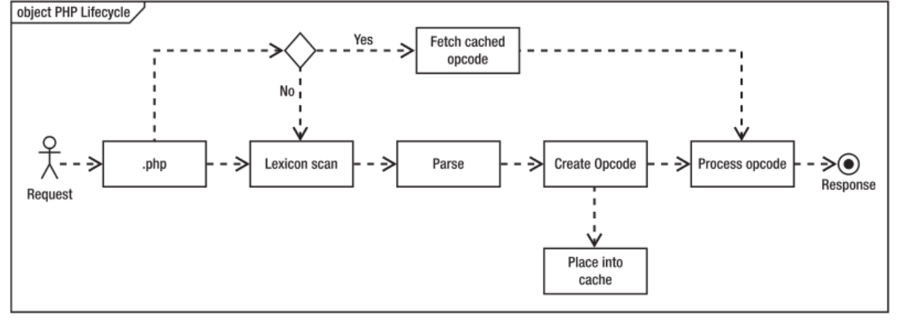

- The Zend Engine is the open source scripting engine that interprets the PHP programming language.

  Zend 引擎是解释 PHP 语言的开源脚本引擎 。PHP 脚本的执行并不是直接运行文本，而是经过以下生命周期

- Zend Engine generates a series of operation codes, commonly known as "opcodes", representing the function of the code. Opcode is similar to bytecode in JS.

  Zend 引擎会生成一系列操作码（通常称为"opcodes"），用于表示代码的功能。操作码类似于JS中的字节码。

- It needs parse to abstract tree again before compile (similar to JS)!

  在编译之前需要再次解析为抽象树（类似 JS！）

- Opcodes can be executed by Zend executor.

  操作码可由Zend执行器执行

- Cache is used to improve the efficiency.


**执行流程：**

- **词法扫描 (Lexicon scan)**：将源代码分解为 token 。

- **解析 (Parse)**：将 token 转换为抽象语法树（AST） 。

- **创建操作码 (Create Opcode)**：生成一系列代表代码功能的中间指令，称为 **Opcode** 。这类似于 JavaScript 的字节码 。（JIT）

- **执行 (Process opcode)**：由 Zend 执行器运行这些 Opcode 并返回响应 。

- **缓存机制**：为了提高效率，生成的 Opcode 可以被**放入缓存 (Place into cache)**，下次请求时直接提取，跳过解析和编译步骤 。

### Zend Extensions

- **Zend Extensions** are a set of libraries that provide additional functionality to the PHP programming language.

  **Zend 扩展 (Zend Extensions)** 是一组库，旨在增强 PHP 的核心功能，优化代码执行并提高安全性

- They are designed to extend the core features of PHP and provide developers with advanced tools for building dynamic and high-performance web applications.

  **典型应用**：例如 **OpcacheGUI**，它提供了一个图形用户界面，让开发者可以直观地查看缓存状态、内存占用（如已用内存 161.89MB）以及缓存命中率（Hits）等统计数据 。

- By using Zend Extensions, developers can optimize their code, improve security, and enhance the overall user experience of their applications. i.e. OpcacheGUI can check cache status at graphic user interface.

  **目的**：通过这些高级工具，开发者可以优化性能并提升应用的用户体验 。

#### Just in time

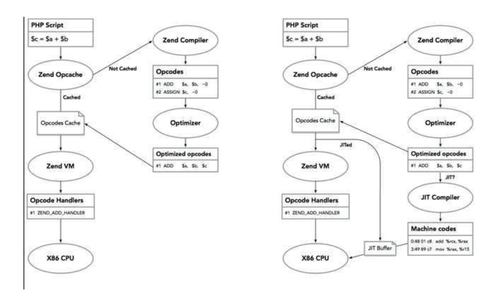

PHP also support JIT now!

PHP 现在也支持 **JIT (Just In Time)** 编译技术，这是对传统 Opcode 执行模式的一次重大升级 ：

- **传统模式**：Zend 虚拟机（Zend VM）通过操作码处理程序（Opcode Handlers）逐条解释执行指令 。
- **JIT 模式**：
  - JIT 编译器会将高频使用的“热点”代码（Optimized opcodes）直接转换为 **机器码 (Machine codes)** 。
  - 这些机器码存储在 **JIT 缓存 (JIT Buffer)** 中，直接由 **X86 CPU** 执行 。
- **优势**：跳过了虚拟机的解释环节，让代码运行速度接近于原生编译语言 。

## Database Basics 数据库基础

- Similar to web server, **database** is a software.

  与 Web 服务器类似，数据库本质上也是一种**软件** 

- A database is an organized collection of structured information, or data, typically stored electronically in a computer system.

  数据库是以电子方式存储在计算机系统中的结构化信息的有组织的集合 。

- A database is usually controlled by a **database management system (DBMS)**. Together, the data and the DBMS, along with the applications that are associated with them, are referred to as a database system.

  数据库通常由**数据库管理系统 (DBMS)** 控制。数据、DBMS 以及与之关联的应用软件统称为“数据库系统” 。

- We often call a certain database which is actually the name of DBMS.

  网站代码（如 PHP, Ruby, Python）通过 DBMS（如 MySQL）与存储数据的数据库进行交互 。

- Database 是结构化数据的集合，通常由 DBMS 管理。更完整地说，一个 database system 包含 data、DBMS，以及和数据库相关的 applications。数据库和电子表格不同，数据库更适合大量数据、多用户访问、严格数据输入和由 DBMS 控制的数据管理。

### Database vs Spreadsheet

- no “style” for any data in database

为什么要用数据库而不是 Excel？讲义对比了它们的关键差异：

| **特性**     | **电子表格 (Spreadsheets)** | **数据库 (Databases)** |
| ------------ | --------------------------- | ---------------------- |
| **数据量**   | 访问有限的数据量            | 访问海量数据           |
| **用户数**   | 一次仅限一名用户            | 支持多用户同时访问     |
| **控制力**   | 由用户控制                  | 由 **DBMS** 控制       |
| **计算方式** | 单元格可包含公式            | 检索数据后进行计算     |
| **数据输入** | 手动输入                    | 严格且一致的数据输入   |

### Transaction and ACID 实物与ACID原则

- **Atomicity**− ensures that all operations within the work unit are completed successfully. Otherwise, the transaction is aborted at the point of failure and all the previous operations are rolled back to their former state.

  **原子性 (Atomicity)**：确保工作单元内的所有操作全部成功，否则任何操作都不会执行并回滚到初始状态 。

- **Consistency**− ensures that the database properly changes states upon a successfully committed transaction.

  **一致性 (Consistency)**：确保数据库在事务成功提交后正确地改变状态 。

- **Isolation**− enables transactions to operate independently of and transparent to each other.

  **隔离性 (Isolation)**：使各个事务能够彼此独立且透明地运行 。

- **Durability**− ensures that the result or effect of a committed transaction persists in case of a system failure.

  **持久性 (Durability)**：确保已提交事务的结果在系统故障时依然存在 。

commit or rollback

### Design database 数据库设计

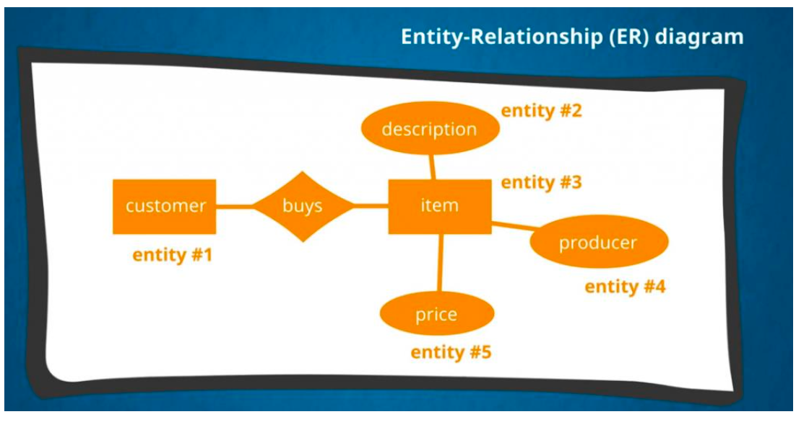

- The different figures represent different data entities and the specific relationships we have between entities.

  **ER 图 (实体-关系图)**：使用不同的图形代表数据实体（如客户、商品）以及它们之间的特定关系（如购买） 

**主键 (Primary Key)**：确保每条数据都是**唯一**的 。

**外键 (Foreign Key)**：确保不同表之间的**引用关系** 。

**数据库模式 (Schema)**：描述表的名称、列名以及表与表之间是如何关联的布局 

### Database design

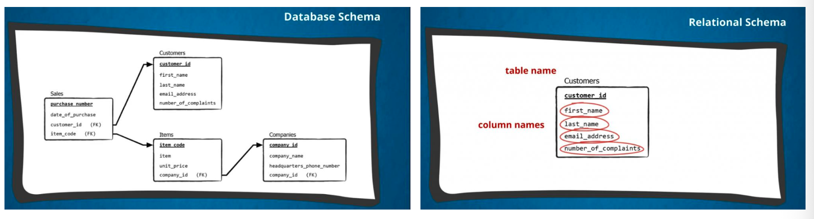

- A table has table name and column names.
- You can also see lines indicating how tables are related in the database.

### Index and search

**B-树 (B-Tree)**：数据库常用的数据结构，用于快速查找数据 。

**索引的作用**：讲义举了一个找扑克牌的例子。

- 在乱序的 52 张牌中找一张牌，平均需要翻 26 次 。
- 如果按花色分堆（建立索引），寻找次数可以减少到平均 9 次 。

**结论**：创建索引能显著提高搜索效率 

### Operate database - SQL language 结构化查询语言

- SQL or Structured Query Language is a programming language used by nearly all relational databases to **query, manipulate, and define** data, and to provide access control.

**定义**：SQL 是一种用于查询、操纵和定义数据，以及提供访问控制的编程语言 。

**普及性**：几乎所有的关系型数据库（如 MySQL, Oracle, SQL Server）都使用 SQL 。

**实际操作**：讲义展示了一个复杂的查询示例，通过 `SELECT`、`JOIN` 和 `GROUP BY` 等子句计算交通事故的比例 。

#### SQL types

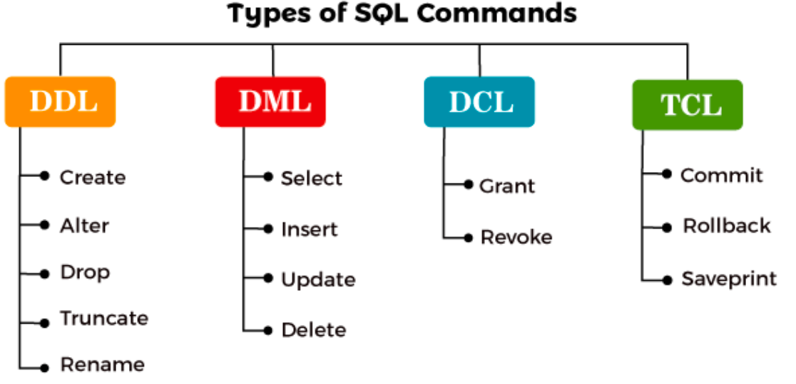

#### SQL types - DDL 数据定义语言 (Data Definition Language)

- DDL stands for data definition language. DDL Commands deal with the schema, i.e., the table in which our data is stored.

  DDL代表数据定义语言。DDL命令处理的是模式（schema），即我们存储数据的表格结构。

- All the structural changes such as creation, deletion and alteration on the table can be carried with the DDL commands in SQL.

  在SQL中，所有对表的结构性变化（如创建、删除和修改）都可以通过DDL命令来实现。

DDL 命令处理数据库的**模式（Schema）**，即数据的结构 。
```sql
CREATE table t_school(
  ID INT PRIMARY KEY, 
  School_Name VARCHAR(40), 
  Number_Of_School INT, 
  Number_Of_Teachers INT, 
  NUmber_Of_Classrooms INT, 
  Emailed VARCHAR(40)
);
```

- **Create**: 创建数据库或表 。
- **Alter**: 修改现有的数据库结构 。
- **Drop**: 删除整个表或数据库 。
- **Truncate**: 清空表中的所有记录，但保留表结构 。
- **Rename**: 重命名数据库对象 

#### SQL types - DML 数据操纵语言 (Data Manipulation Language)

- DML stands for **Data Manipulation Language**. Using DML commands in SQL, we can make changes in the data present in tables.

- Whenever we wish to manipulate the data or fetch the data present in SQL tables, we can use DML commands in SQL.

- It is important to set the **CORRET** where condition

```sql
SELECT * FROM table_name WHERE condition;
UPDATE table_name SET column_name = value WHERE condition;
DELETE FROM t_School WHERE ID=6;
INSERT INTO table_name(column_name1, column_name2) VALUES (value1, value2), (value1, value2);
```

DML 命令用于对表中的**具体数据**进行操作 。

- **Select**: 检索（查询）数据 。
- **Insert**: 向表中插入新数据 。
- **Update**: 修改表中的现有数据 。
- **Delete**: 删除表中的特定记录 。
- **注意**：在使用 `UPDATE` 或 `DELETE` 时，设置正确的 `WHERE` 条件至关重要，否则可能误删或误改全表数据 。

#### SQL types - DCL 数据控制语言 (Data Control Language)

- Many DBMS like MySQL is a stand alone system with its own users.

- DCL stands for **Data Control Language**.
- Whenever we want to control the **access to the data** present in SQL tables, we will use DCL commands in SQL.

- Only the authorized database users can access the data stored in the tables.

DCL 用于控制对数据的**访问权限**，确保只有授权用户才能操作 。

- **Grant**: 授予用户访问数据库的权限 。
- **Revoke**: 撤销已授予的权限 。
- **独立性**：像 MySQL 这样的系统拥有独立的权限管理体系 。

#### SQL types - TCL 事务控制语言 (Transaction Control Language)

- TCL stands for Transaction Control Language. TCL commands are generally used in transactions.
- Using TCL commands in SQL, we can save our transactions to the database and roll them back to a specific point in our transaction.

TCL 用于管理数据库中的**事务**，允许保存或撤销更改 。

- **Commit**: 永久保存事务中的更改 。
- **Rollback**: 将数据库恢复到特定的保存点或起始状态 。
- **Savepoint**: 在事务中设置一个点，以便后续可以回滚到该位置 

### SQl 与 NoSQL 数据库对比

数据库主要分为两大阵营，它们在数据组织方式上有很大不同 ：

- **SQL 数据库 (关系型)** ：
  - **Relational（关系型）**：数据以表格形式存储 。
  - **Analytical (OLAP)**：用于联机分析处理 。
- **Non-SQL (NoSQL) 数据库** ：
  - **Key-Value（键值对）**：如 **Redis**，通过唯一的键获取对应的值 。
  - **Column-Family（列族）**：如 **Cassandra** 。
  - **Graph（图形）**：用于处理复杂的关系网络 。
  - **Document（文档型）**：如 **MongoDB** 和 **CouchDB**，存储类似 JSON 的文档 。
- **特别提醒**：NoSQL 的含义是 "**Not Only SQL**"（不仅是 SQL），而不是 "No SQL"（没有 SQL） 。

### 市场主流 DBMS 产品

讲义展示了目前市场上活跃的各种数据库管理系统 ：

- **国际主流**：Oracle (市场份额大), MySQL (开源流行), Microsoft SQL Server, PostgreSQL, DB2, MongoDB, Redis 。
- **国产力量**：提到了腾讯的 **TDSQL**、华为的 **GaussDB**、阿里巴巴的 **POLARDB**、蚂蚁集团的 **OceanBase** 以及中兴的 **GoldenDB** 等 。

### Connect DB 个人数据库系统与连接架构

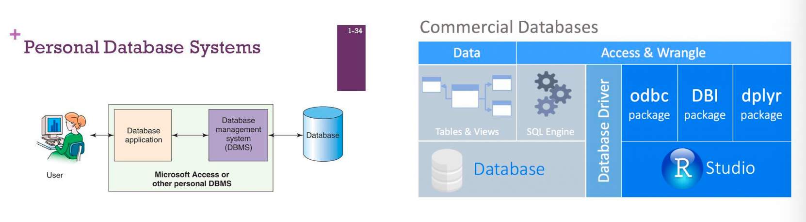

这部分解释了用户如何与数据库进行交互 ：

- **访问流程**：用户通过 **数据库应用程序 (Database application)** 发送指令，该程序与 **DBMS** 交互，最后由 DBMS 操作物理 **数据库 (Database)** 文件 。
- **数据库驱动 (Database Driver)**：为了让不同的开发环境（如 R Studio）能访问数据库，需要使用特定的包或驱动，例如 `odbc`、`DBI` 或 `dplyr` 。

#### Connect MySQL

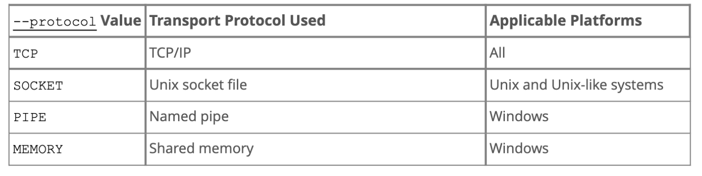

- DB is a **client/server style software**.
- DBMS works as the server.
- Different DB supports different way to connect, the above shows four transport protocols supported by MySQL.

数据库通常采用 **客户端/服务器 (C/S)** 架构，DBMS 作为服务端运行 。MySQL 支持多种传输协议来建立连接 ：

| **协议值 (--protocol)** | **传输协议**     | **适用平台**        |
| ----------------------- | ---------------- | ------------------- |
| **TCP**                 | TCP/IP           | 所有平台            |
| **SOCKET**              | Unix socket 文件 | Unix 及类 Unix 系统 |
| **PIPE**                | 命名管道         | Windows             |
| **MEMORY**              | 共享内存         | Windows             |

### Tools for DB

- Navicat is a efficient database management application

- MySQL Workbench
- PhPMyAdmin (Web Tool)

讲义介绍了三种主流的数据库管理工具，帮助开发者摆脱枯燥的命令行：

- **Navicat (第 49 页)**：
  - 这是一个功能强大的**数据库设计工具** 。
  - 它可以加载现有的数据库结构并创建新的 **ER 图** 。
  - 支持多种连接，如 MariaDB、MySQL、Oracle 和 PostgreSQL 。
- **MySQL Workbench**：
  - MySQL 官方提供的工具 。
  - 支持可视化的表设计、SQL 开发以及服务器配置 。
- **phpMyAdmin**：
  - 这是一个基于 **Web 的工具**，通常运行在 `http://localhost/phpmyadmin/` 。
  - 它非常直观，适合通过浏览器直接创建表、执行 SQL 查询和管理权限 。

### B/S vs. C/S B/S 与 C/S 架构的区别

- C/S means the application would have its own client software.

- For example, you can install ”Navicat” to manage your database (through network).

- Web Browsers are also “clients”.

- While you can create systems to use the existed web browsers then NOneed to create your own clients. This architecture is called Browser/Server structure.

在使用工具时，需要理解两种不同的软件架构：

- **C/S (Client/Server)**：应用程序拥有自己的**专用客户端软件** 。例如，你需要安装 "Navicat" 才能管理数据库 。
- **B/S (Browser/Server)**：用户直接使用现有的 **Web 浏览器** 作为客户端 。例如 phpMyAdmin 就是这种架构，无需安装专门的客户端软件 。

### 使用 phpMyAdmin 的实操建议

- **流程**：创建一个名为 `can302` 的数据库，并建立包含 4 列的 `user` 表 。

- **关键设置**：将 `id` 设置为主键（Primary）并勾选**自动递增（AUTO_INCREMENT）** 。

- **底层原理**：虽然你在页面上点击按钮，但 phpMyAdmin 会将这些操作**翻译成 SQL 命令**（如 `CREATE TABLE...`）来执行 。

### Manipulate DB by PHP PHP操作数据库：PDO vs. MySQLi 

```php
$pdo = new PDO("mysql:host=localhost;dbname=database", 'username', 'password');

$mysqli = mysqli_connect('localhost', 'username', 'password', 'database');

$mysqli = new mysqli('localhost', 'username', 'password', 'database');
```

在 PHP 代码中操作数据库，有两种主要的 API 接口 ：

| **特性**       | **PDO (PHP Data Objects)**                            | **MySQLi**              |
| -------------- | ----------------------------------------------------- | ----------------------- |
| **数据库支持** | 支持 **12 种不同驱动**（如 MySQL, SQLite, Oracle 等） | **仅限 MySQL**          |
| **编程范式**   | **仅限面向对象 (OOP)**                                | 支持 **OOP 和面向过程** |
| **安全性**     | 支持**命名参数**和**预处理语句**，能有效防御 SQL 注入 | 支持预处理语句          |
| **性能**       | 运行快速                                              | 运行快速                |

- **浏览器**通过 **HTTP 协议** 与 **Apache 服务器** 通信 。

- **Apache** 通过 **CGI (SAPI)** 调用 **PHP 引擎** 处理逻辑 。

- **PHP** 通过特定的 **数据库协议 (DB protocol)** 与 **MySQL 数据库** 交换数据 

- MySQLi 是 PHP 操作 MySQL 的扩展，只适用于 MySQL，但它支持过程式和面向对象两种写法。PDO 是 PHP Data Objects，可以连接多种数据库，如 MySQL、SQLite、PostgreSQL 等，但 PDO 只支持面向对象写法。考试中如果问哪个更通用，答案通常是 PDO。

### Manipulate DB by mysqli

- mysqli is a PHP extension to operate MySQL database ONLY.

  mysqli是PHP专门用于操作MySQL数据库的扩展。

- It supports both procedure and object oriented paradigm.

  它同时支持过程式和面向对象的编程范式。

```php
<?php
$servername = "localhost"; // 数据库服务器地址
$username = "username";    // 数据库用户名
$password = "password";    // 数据库密码
$dbname = "myDB";          // 要连接的数据库名称

// 1. 创建连接实例
$conn = new mysqli($servername, $username, $password, $dbname);

// 2. 检查连接是否成功
if ($conn->connect_error) {
    // 如果连接失败，输出错误并终止脚本
    die("Connection failed: " . $conn->connect_error);
}

echo "连接成功";

// 3. 执行查询并处理结果 (示例)
$sql = "SELECT id, firstname, lastname FROM MyGuests";
$result = $conn->query($sql);

// 4. 关闭连接
$conn->close();
?>
```

### Manipulate DB by PDO 

- PDO is a PHP extension to operate many different type database.

  PDO 是一种 PHP 扩展，用于操作多种不同类型的数据库。

- It ONLY supports object oriented paradigm

  它仅支持面向对象范式。

```php
<?php
// 1. 配置数据库参数
$dbms = 'mysql';       // 数据库类型 (讲义示例中也使用了 'sqlite')
$host = 'localhost';   // 主机名
$dbName = 'myDB';      // 数据库名
$user = 'username';    // 用户名
$pass = 'password';    // 密码

// 2. 构建 DSN (数据源名称)
$dsn = "$dbms:host=$host;dbname=$dbName"; 

try {
    // 3. 创建 PDO 实例并建立连接
    $con = new PDO($dsn, $user, $pass);
    echo "PDO 连接成功";
    
    // 4. 执行查询 (示例)
    $sql = "SELECT * FROM product_category ORDER BY priority";
    $query = $con->query($sql);
    
    // 5. 遍历结果集
    foreach($query as $row) {
        echo $row["name"]; // 访问字段数据
    }

} catch (PDOException $e) {
    // 6. 异常处理：如果连接出错，捕获错误信息并终止
    die("Error!: " . $e->getMessage() . "<br/>");
}
?>
```

### HTTP - GET vs. POST

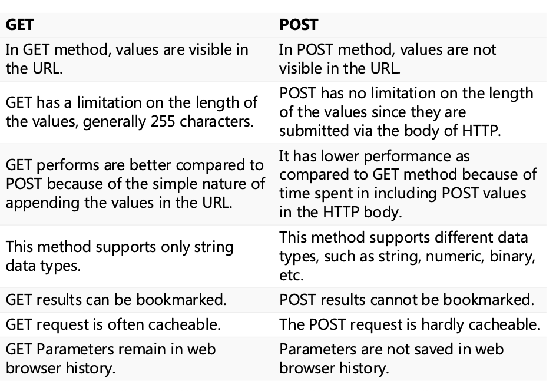

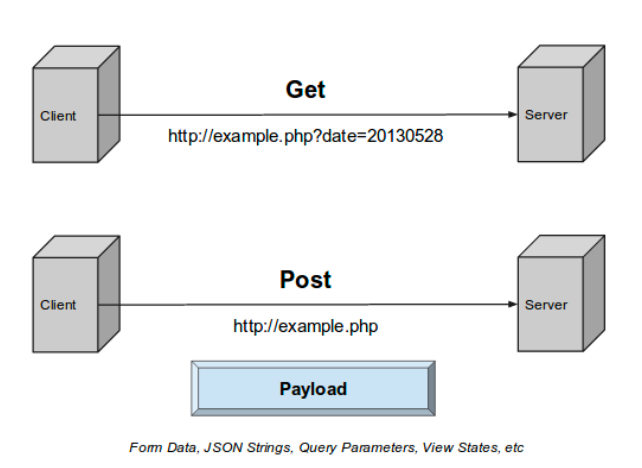

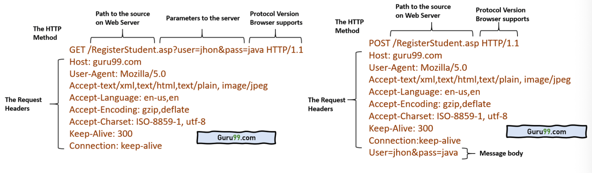

- You can generated the URL with GET parameter directly
- \<form> can generate both GET and POST request

- PHP use GET and POST to fetch the HTTP request parameters

- Can one http request contain both GET and POST parameters? NO

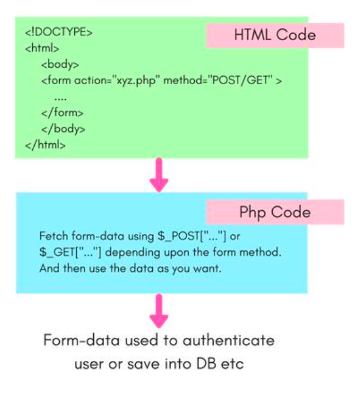

#### 1. HTTP 请求方法：GET vs. POST

这是 Web 开发中最基础的两种数据传输方式 ：

| **特性**      | **GET**                        | **POST**                          |
| ------------- | ------------------------------ | --------------------------------- |
| **可见性**    | 参数显示在 URL 中              | 参数隐藏在 HTTP 正文（Payload）中 |
| **数据长度**  | 有限制（通常约 255 字符）      | 理论上无限制                      |
| **安全性**    | 较低（参数会留在浏览器历史中） | 较高（参数不被保存）              |
| **缓存/书签** | 可以被缓存或收藏为书签         | 不可被缓存或收藏                  |
| **数据类型**  | 仅限字符串                     | 支持字符串、二进制、图像等        |

- **PHP 处理**：PHP 使用超全局变量 `$_GET[]` 和 `$_POST[]` 来获取这些请求参数 。
- **HTML 表单**：通过 `<form>` 标签的 `method` 属性来指定使用哪种请求方式 。

### HTTP 是无状态的 (Stateless)

- **定义**：HTTP 设计为无状态，意味着服务器不会在两个请求之间保留任何数据 。
- **挑战**：这导致服务器无法“记住”用户是否已经登录。
- **解决方案**：引入 **Cookie** 和 **Session** 来追踪状态 。

### HTTP - Cookie Session

- HTTP is designed to be stateless to be simple, scalable and reliable.

  HTTP协议被设计为无状态，以实现简洁性、可扩展性和可靠性。

- Stateless meaning that the server does not keep any data (state) bet ween two requests.

  无状态意味着服务器在两个请求之间不保留任何数据（状态）。

- We need to use Cookie and Session to track the status.

  我们需要使用Cookie和Session来追踪状态。

- A cookie is a small text file that is stored on the user's computer (Due to the security reason, the browsers only allow interaction with cookie but not other files).

  Cookie是一种存储在用户计算机上的小型文本文件（出于安全原因，浏览器仅允许与Cookie交互，不允许操作其他文件）。

- Cookies are created and shared between the server and browser with the help of an HTTP header.

  Cookie 是通过 HTTP 头部在服务器与浏览器之间创建和共享的。

- Session is a global variable stored on the server. Each session is assigned a unique id which is used to retrieve stored values and the session id is stored as a cookie on the user’s computer.

  Session是存储在服务器上的全局变量。每个会话都会被分配一个唯一的ID，用于检索存储的值，而该会话ID会作为cookie存储在用户的计算机上。

- But the information stored within cookies is NOT secure because this information is stored in text-format on the client-side, which can be read even tamped by malicious code.

  然而，存储在Cookie中的信息并不安全，因为这些信息以文本格式存储在客户端，即使被恶意代码篡改也能被读取。

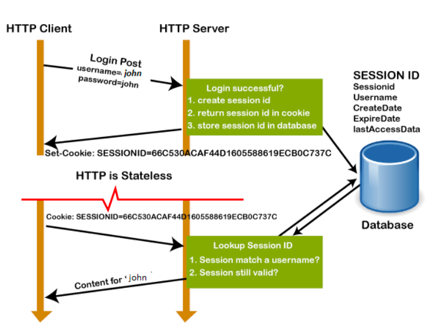

- **Cookie**：
  - 存储在**用户计算机（客户端）**上的小文本文件 。
  - 通过 HTTP 头部在服务器和浏览器之间共享 。
  - **缺点**：不安全，容易被篡改 。
  - **PHP 操作**：使用 `setcookie()` 设置，使用 `$_COOKIE[]` 读取 。
- **Session**：
  - 存储在**服务器端**的全局变量 。
  - 每个 Session 分配一个唯一的 ID，该 ID 通常以 Cookie 的形式存放在客户端 。
  - **PHP 操作**：必须先调用 `session_start()` 启动 ，使用 `$_SESSION[]` 存取数据 。

### SQl Injection SQL 注入安全漏洞

- SQL Injection is a security flaw in web applications where attackers insert harmful SQL code through user inputs. This can allow them to access sensitive data, change database contents or even take control of the system.

  SQL注入是Web应用程序中的一种安全漏洞，攻击者通过用户输入插入恶意SQL代码。这可能导致他们访问敏感数据、修改数据库内容，甚至控制系统。

- Using PDO with proper “prepare”, SQL injection can be avoided.

  使用PDO并正确“准备”语句，可以有效防止SQL注入攻击。

- SQL Injection 的根本问题是把用户输入直接拼接进 SQL 字符串中。防御方法是不要直接拼接 SQL，而要使用 PDO prepare statement，把 SQL 结构和用户输入参数分开。例如先 prepare，再 execute(array(...))，这样可以有效降低注入风险。

这是讲义重点强调的安全问题：

- **原理**：攻击者在输入框中注入恶意的 SQL 代码（例如输入 `' or '1'='1`），从而绕过登录验证或控制数据库 。

- **防御手段**：

  - **不要**直接拼接字符串来构造 SQL 语句 。

  - **必须**使用 PDO 的**预处理语句 (Prepare)** 。

  - **代码示例**：

    ```php
    $sql = "SELECT * FROM user WHERE username = ? AND password = ?";
    $query = $con->prepare($sql); // 预处理
    $query->execute(array($username, $password)); // 安全绑定参数
    ```

## 考试提问与参考答案

### Q1. What is a dynamic webpage? Why is it important for e-commerce websites?

**Answer:**
 A dynamic webpage is generated on the server side. It combines a fixed page frame with data that may come from a database. It is important for e-commerce because product information, stock, orders and user data change frequently. If every product needs one manually updated HTML page, it will be inefficient and hard to maintain. Dynamic webpages allow the server to generate different content at different times or for different users.

------

### Q2. What is CGI? Is CGI a programming language?

**Answer:**
 CGI stands for Common Gateway Interface. It is not a programming language and not a specific program. It is a standard interface that allows a web server to execute an external program to process a user request. The CGI program can be written in many languages, such as C/C++, Perl, Java or PHP. It can also access databases and generate dynamic content.

------

### Q3. Explain the lifecycle of PHP under traditional CGI.

**Answer:**
 Under traditional CGI, each request causes PHP to start, execute the required task, generate the result, and then terminate. This can be described as: PHP starts → PHP does its job → PHP dies. This model is simple, but it has performance overhead because PHP needs to initialize again for every request.

------

### Q4. What is FastCGI and how does it improve CGI?

**Answer:**
 FastCGI is an open extension to CGI that improves performance. In traditional CGI, each request starts and stops a new process. FastCGI keeps processes alive and reuses them for later requests. This saves the initialization cost for each visit and improves server performance.

------

### Q5. What is PHP-FPM?

**Answer:**
 PHP-FPM means FastCGI Process Manager. It manages a pool of PHP worker processes. A supervisor process chooses an available worker process to execute PHP code. After the worker finishes the task, it returns to the pool and waits for another request. The pool size can also be adjusted dynamically.

------

### Q6. What does SAPI mean in PHP?

**Answer:**
 SAPI means Server Application Programming Interface. It is the interface between the outside world and the PHP/Zend engine. PHP provides different SAPI modules, such as CLI, CGI, FPM, Litespeed and Apache2Handler. These allow PHP to run in command line, web servers or embedded environments.

------

### Q7. What happens when a browser requests a PHP page?

**Answer:**
 First, the browser sends an HTTP request to the web server. Then the web server recognizes that the requested file is a PHP file and sends it to the PHP engine. PHP may access a database and process data. Finally, PHP generates HTML/CSS/JS output and sends it back to the browser. The browser does not receive PHP source code; it receives front-end code.

------

### Q8. What is the difference between ASP, JSP and PHP?

**Answer:**
 ASP was developed by Microsoft and can embed VBScript or JavaScript in HTML. JSP means Java Server Page and uses Java, not JavaScript. JSP can be converted into Java Servlet and run on a Java web server such as Tomcat. PHP is a scripting language designed for web development and can be embedded into HTML using `<?php ... ?>`.

------

### Q9. What is Zend Engine?

**Answer:**
 Zend Engine is the open-source scripting engine that interprets PHP. It processes PHP source code by scanning tokens, parsing them into an AST, generating opcodes, and executing the opcodes through the Zend executor. Opcode cache can be used to improve efficiency.

------

### Q10. What is the difference between a PHP language construct and a built-in function?

**Answer:**
 A language construct is part of the syntax of PHP and can be directly recognized by the parser. It is more like a keyword. A built-in function is a function provided by PHP. For example, `echo` is a language construct, not a normal function.

------

### Q11. What is the difference between single quotes and double quotes in PHP?

**Answer:**
 In PHP, double quotes can parse variables inside the string, while single quotes usually treat the content as a plain string. For example, if `$name = "Tom"`, then `"Hello $name"` can output `Hello Tom`, but `'Hello $name'` will output the variable name as text.

------

### Q12. What is a PHP extension? Give one example.

**Answer:**
 A PHP extension is an external component used to provide extra functions beyond the PHP core. On Windows, extensions are usually `.dll` files, while on Linux/Mac they are usually `.so` files. For example, PDO is an extension that allows PHP to interact with different databases.

------

### Q13. What is a database?

**Answer:**
 A database is an organized collection of structured information or data, usually stored electronically in a computer system. It is normally controlled by a DBMS, which manages data storage, access and operations.

------

### Q14. What is the difference between a database and a spreadsheet?

**Answer:**
 A spreadsheet is usually better for small amounts of data and manual operations. It is often controlled by one user. A database can handle large amounts of structured data, supports multiple users, has strict data input rules, and is managed by a DBMS.

------

### Q15. Explain ACID in database transactions.

**Answer:**
 ACID means Atomicity, Consistency, Isolation and Durability. Atomicity means all operations in a transaction succeed or all fail. Consistency means the database moves from one valid state to another. Isolation means transactions do not interfere with each other. Durability means committed results remain even after system failure.

------

### Q16. What are primary key and foreign key?

**Answer:**
 A primary key uniquely identifies each row in a table. A foreign key is used to create a relationship between tables. It usually refers to the primary key of another table, helping maintain data consistency between related tables.

------

### Q17. What is an index in a database? Why is it useful?

**Answer:**
 An index is a data structure used to speed up data search. The lecture uses the example of finding a playing card. If cards are unordered, searching is slow. If cards are grouped or indexed, searching becomes faster. Databases often use structures such as B-Tree for indexing.

------

### Q18. What is SQL?

**Answer:**
 SQL stands for Structured Query Language. It is used by most relational databases to query, manipulate and define data. It can also be used for access control. Common SQL operations include SELECT, INSERT, UPDATE, DELETE, CREATE and DROP.

------

### Q19. What are DDL, DML, DCL and TCL?

**Answer:**
 DDL means Data Definition Language, used for schema and table structure, such as CREATE, ALTER and DROP. DML means Data Manipulation Language, used for data operations, such as SELECT, INSERT, UPDATE and DELETE. DCL means Data Control Language, used for permissions, such as GRANT and REVOKE. TCL means Transaction Control Language, used for transactions, such as COMMIT and ROLLBACK.

------

### Q20. What is the difference between MySQLi and PDO?

**Answer:**
 MySQLi is a PHP extension for operating MySQL databases only. It supports both procedural and object-oriented programming styles. PDO can operate many different types of databases, such as MySQL, SQLite and PostgreSQL, but it only supports the object-oriented style.

------

### Q21. What is the difference between GET and POST?

**Answer:**
 GET sends parameters in the URL, so the values are visible and can be bookmarked or cached. It is suitable for simple queries. POST sends data in the HTTP request body, so the data is not shown in the URL. POST can support larger data and different data types, such as binary data or images. PHP uses `$_GET[]` and `$_POST[]` to fetch these parameters.

------

### Q22. Why does HTTP need Cookie and Session?

**Answer:**
 HTTP is stateless, meaning the server does not keep data between two requests. Because of this, the server cannot naturally remember whether a user has logged in. Cookie and Session are used to track user status. Cookie is stored on the client side, while Session data is stored on the server side.

------

### Q23. What is the difference between Cookie and Session?

**Answer:**
 Cookie is a small text file stored on the user’s computer. It is shared between browser and server using HTTP headers, but it is not very secure because it is stored on the client side. Session is stored on the server side. Each session has a unique session id, and this id is usually stored in a cookie on the user’s computer.

------

### Q24. What is SQL Injection?

**Answer:**
 SQL Injection is a security vulnerability where attackers insert malicious SQL code through user input. It may allow attackers to access sensitive data, modify database content, bypass login, or even control the system. A common defense is to use PDO prepared statements instead of directly joining user input into SQL strings.