# 5 The history of e-commerce

## 知识图谱

```plaintext
Lecture 5: The history of e-commerce
├── 1. Commerce, Business and Trade
│   ├── Commerce 商贸
│   │   ├── 大规模商品交换/买卖
│   │   ├── 涉及跨地域运输
│   │   └── 范围比 trade 更广
│   │
│   ├── Business 商业
│   │   ├── 制造、购买、销售商品
│   │   └── 提供有偿服务
│   │
│   ├── Trade 贸易
│   │   ├── 商品买卖
│   │   └── 易货交易
│   │
│   └── Commerce vs Trade
│       ├── Trade 是 Commerce 的一部分
│       ├── Trade 可分为 Home trade 和 International trade
│       └── Commerce 还包括 services to trade
│           ├── Banking
│           ├── Finance
│           ├── Insurance
│           ├── Transport
│           └── Communication
│
├── 2. Commerce and E-commerce
│   ├── Three flows in commerce
│   │   ├── Material flow / Product flow 货物流
│   │   ├── Information flow 信息流
│   │   └── Financial flow / Cash flow 资金流
│   │
│   ├── Typical commerce session
│   │   ├── Search for goods
│   │   ├── Put the order
│   │   ├── Pay the order
│   │   ├── Receive the goods
│   │   └── Customer services
│   │
│   └── Core idea
│       └── Commerce changes the ownership of goods
│
├── 3. Historical forms of commerce
│   ├── Ancient market format
│   │   ├── Nearby people gathering together
│   │   ├── Service provider wandering around
│   │   └── Fixed market for specific goods in different regions
│   │
│   ├── Long-distance trade
│   │   ├── Silk Road
│   │   └── Age of Exploration
│   │
│   ├── Department store
│   │   ├── Large establishment
│   │   ├── Wide range of products
│   │   ├── Products organized into departments
│   │   └── One roof satisfies many customer needs
│   │
│   ├── Supermarket
│   │   └── Part of daily life
│   │
│   ├── Advertisement
│   │   ├── Paper-based advertisement
│   │   ├── TV-based advertisement
│   │   └── Push information to potential customers
│   │
│   └── TV shopping
│       ├── Advanced advertisement
│       ├── Order through telephone
│       └── Can be considered a form of e-commerce in a broad sense
│
├── 4. Definition of E-commerce
│   ├── Electronic commerce / EC
│   │   └── Electronic enabled commercial transactions between and among organizations and individuals
│   │
│   ├── Internet commerce / Web commerce
│   │   └── Buying, selling, or exchanging products, services, or information via Internet
│   │
│   ├── OECD definition
│   │   ├── Sale or purchase of goods/services
│   │   ├── Conducted over computer networks
│   │   ├── Methods designed for receiving or placing orders
│   │   ├── Payment and delivery do not have to be online
│   │   └── Can happen between enterprises, households, individuals, governments, public/private organizations
│   │
│   └── OECD interpretation
│       ├── Include
│       │   ├── Orders via webpages
│       │   ├── Apps
│       │   ├── Extranets
│       │   └── EDI
│       └── Exclude
│           ├── Telephone calls
│           ├── Facsimiles / fax
│           ├── On-premise mechanisms, e.g. kiosks or QR codes
│           └── Manually typed messages, e.g. e-mails
│
├── 5. E-commerce evolution timeline
│   ├── 1969: Compuserve launched
│   ├── 1979: Michael Aldrich invented electronic shopping
│   ├── 1982: Boston Computer Exchange started
│   ├── 1991: World Wide Web invented
│   ├── 1992: Book Stacks Unlimited launched
│   ├── 1994: Netscape Navigator launched
│   ├── 1995: eBay and Amazon launched
│   └── 1998: PayPal launched
│
├── 6. Underlying technologies behind e-commerce
│   ├── Communication technologies
│   │   ├── Ancient communication system
│   │   ├── Optical Telegraph in France
│   │   ├── Electronic telegraphy
│   │   ├── Morse code
│   │   ├── Telegraphy money order
│   │   ├── Telephone
│   │   ├── Optical fiber communication
│   │   └── B*L improvement
│   │       ├── B*L = Bitrate × Distance
│   │       ├── Higher bandwidth
│   │       ├── Longer distance
│   │       └── Application revolution
│   │
│   ├── Terminal devices
│   │   └── E-commerce development also depends on user-side devices
│   │
│   └── Payment revolution
│       ├── Check / Cheque
│       ├── EFT
│       ├── SWIFT
│       └── EDI
│
├── 7. EDI: Electronic Data Interchange
│   ├── Meaning
│   │   ├── Standard electronic format
│   │   ├── Replaces paper documents
│   │   ├── Used for purchase orders and invoices
│   │   └── Extends e-commerce beyond e-payment
│   │
│   ├── Key point
│   │   └── Standardization
│   │       ├── Different ERP systems can still connect
│   │       ├── UN/EDIFACT
│   │       └── ANSI X12
│   │
│   ├── Position
│   │   └── Old but still mainstream technology in B2B
│   │
│   └── EDI types
│       ├── Direct EDI / Point-to-Point
│       ├── EDI via VAN
│       ├── Web EDI
│       ├── AS2 EDI
│       ├── API EDI
│       ├── Mobile EDI
│       └── VAN and AS2 are popular methods
│
├── 8. Platforms and new e-commerce formats
│   ├── Mainstream platforms
│   │   ├── Amazon
│   │   ├── eBay
│   │   ├── Taobao
│   │   ├── JD
│   │   ├── Pinduoduo
│   │   └── Shopify
│   │
│   ├── Marketplace and platforms
│   │   └── Platform-based e-commerce connects sellers and buyers
│   │
│   ├── Website traffic
│   │   └── Traffic always means money
│   │
│   └── New format of e-commerce
│       ├── Livestreaming / content-driven selling
│       ├── Chinese marketplaces serving global markets
│       └── Global platform competition
│
├── 9. E-commerce types
│   ├── Commerce
│   │   ├── Physical / traditional commerce
│   │   └── Electronic commerce
│   │       ├── Internet commerce
│   │       │   ├── Business-focused e-commerce
│   │       │   └── Consumer-focused e-commerce
│   │       └── Other classification terms
│   │           ├── O2O
│   │           ├── Mobile Business / M-B
│   │           ├── B2G
│   │           ├── SoLoMo
│   │           ├── Sharing Economy
│   │           ├── P2P
│   │           └── B2P
│
├── 10. Eight unique features of e-commerce technology
│   ├── Ubiquity
│   ├── Global reach
│   ├── Universal standards
│   ├── Richness
│   ├── Interactivity
│   ├── Personalization / Customization
│   ├── Information density
│   └── Social technologies
│
└── 11. Final principle
    └── Commerce is based on real products
        └── Click a mouse won’t generate a car
```

## Part1: Commerce, Business and Trade

在理解 e-commerce 之前，需要注意：电子商务不是一个固定不变的概念。因为过去几十年数字技术发展非常快，所以 e-commerce 的定义也变化很快。不同教材、报告或组织可能会给出不同定义。因此，学习本节课时不能只背一个定义，而要理解它背后的核心：商业交易如何被电子技术、互联网、支付系统、通信技术和平台模式改变。

### Commerce vs. Business

- Commerce:

  商贸

  - The **exchange** or buying and selling of commodities on a large scale **involving** transportation from place to place.

    大规模商品交换或买卖，涉及跨地域运输。

  - https://www.merriam-webster.com/dictionary/commerce

- Business:

  商业

  - The activity of **making**, buying, or selling goods or providing services in exchange for money

    制造、购买或销售商品以及提供有偿服务的活动

  - https://www.merriam-webster.com/dictionary/business

### Commerce vs. Trade

- Trade:

  贸易

  - The business of buying and selling or bartering commodities

    商品买卖或易货贸易的业务

  - https://www.merriam-webster.com/dictionary/trade

- Commerce:

  商贸

  - The activity of buying and selling goods or providing services between organizations and/or individuals and **the activities of banks, insurers and other organizations**

    组织与/或个人之间买卖商品或提供服务的活动，以及银行、保险公司和其他机构的活动

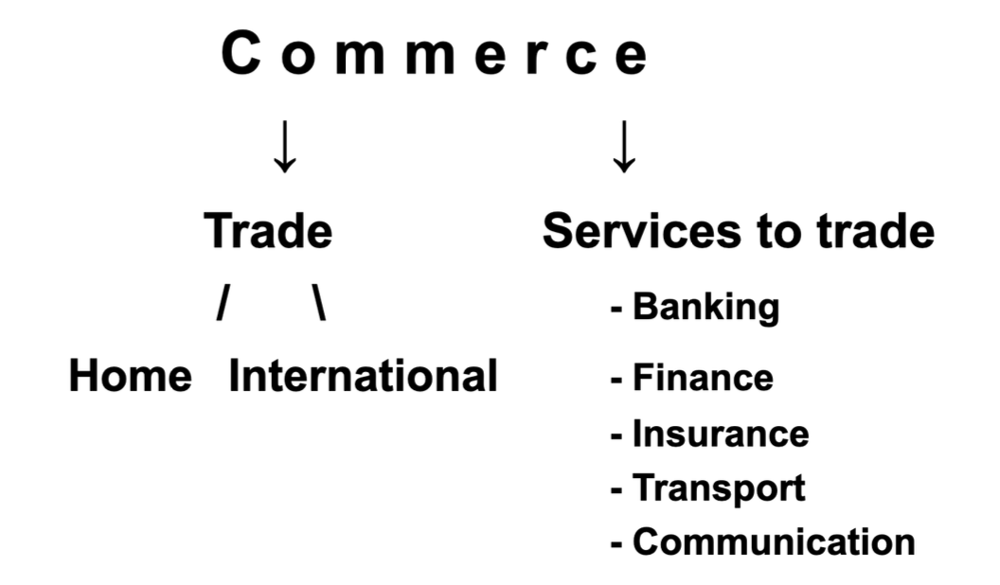

课件还通过政府部门名称说明这些概念在现实中也会被不同国家不同地使用。例如中国使用 Ministry of Commerce，美国使用 Department of Commerce，而英国使用 Department for Business & Trade。这说明 Commerce、Business 和 Trade 在实际语境中有交叉，但从本课角度看，Commerce 的范围通常更广。

## Part2: Commerce and E-commerce 商贸和电商

### Three flows in commerce ！！！

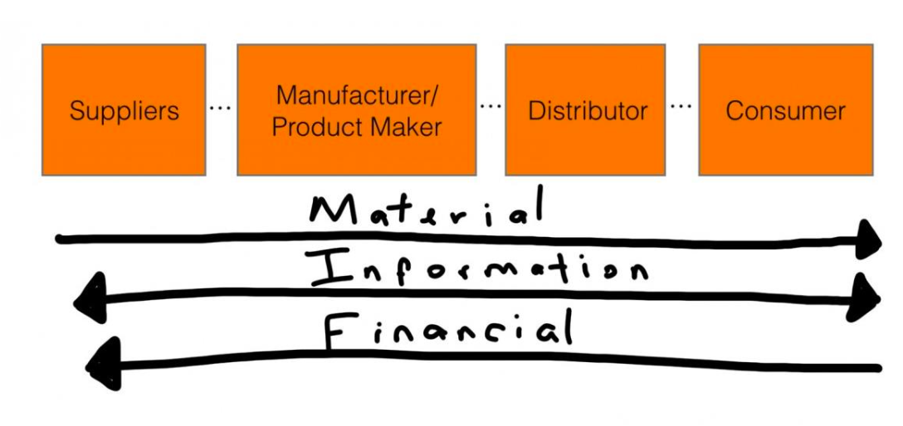

### A Typical Commerce Session

Change the Goods **OWNERSHIP**

- Information 

  信息

- Cash/Money

  钱 

- Product/Transport

  货物

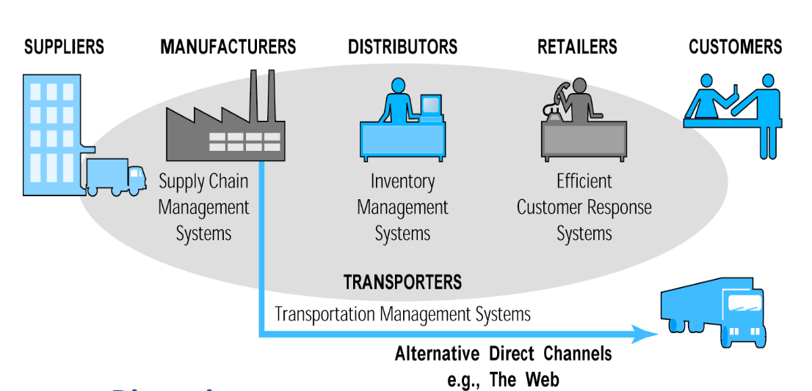

- Search for goods

  寻找货物

- Put the order

  生成订单

- Pay the order

  支付订单

- Receive the goods

  接收货物

- Customer services

  员工服务

### The ancient marker format 古代的市场模式

- Nearby people gathering together or service provider wandering around

  靠近居民聚集区，附近的人聚集在一起或服务提供者四处游走

- Fixed market for specific goods in different regions

  固定特定商品在不同地区的市场

- Example:

  - The Silk Road

    丝绸之路

  - The age of Exploration 

    大航海时代

### Department of Store 商店的形式

- A departmental store is a large establishment that sells a wide range of products organized into distinct departments in order to satisfy nearly every customers’ requirements under one roof.

  百货商店是一种大型零售场所，销售种类繁多的商品，这些商品按不同部门划分，旨在满足顾客在单一地点内的几乎所有需求。

- It is divided into several departments, each of which focuses on a specific type of product, including clothing, electronics, furniture, and more

  该机构下设多个部门，每个部门专注于特定类型的产品，涵盖服装、电子产品、家具等多个领域。

### Supermarket

Super Market 是现代商业的一种重要线下形式，它已经成为日常生活的一部分。相比 ancient market 和 department store，supermarket 更强调**大规模、日常化、标准化**的商品销售。它可以看作传统 commerce 继续发展的一个阶段。

- Large-scale
- Daily
- Standarized

### Advertisement 广告

- Paper and TV based advertisement

  纸质媒介或者电视广告

- Push the information to potential customers

  投递给潜在的客户

### TV Shopping 电视购物

- A kind of advanced advisement

- Put the order over a telephone directly

  直接通过电话下订单

- It is also **a form of e-commerce**

- TV shopping 并不是已经完全过时的商业模式。课件中指出，它在美国更受欢迎，并且现在仍然活跃。这说明 e-commerce 不一定只等于网页购物或 app 购物，广义上只要电子媒介参与商业交易，就可能与 e-commerce 有关。

### A Definition of e-Commerce 电商的定义

- **Electronic commerce (EC)**

  电子商务

  - **Electronic** enabled commercial transactions between and among organizations and individuals

    电子化促进了组织与个人之间及内部的商业交易。

- **Internet commerce (Web commerce)**

  网络商务（互联网商务）

  - The process of buying, selling, or exchanging products, services, or information via **Internet**

    通过互联网购买、销售或交换产品、服务或信息的过程。

### FAX or facsimile

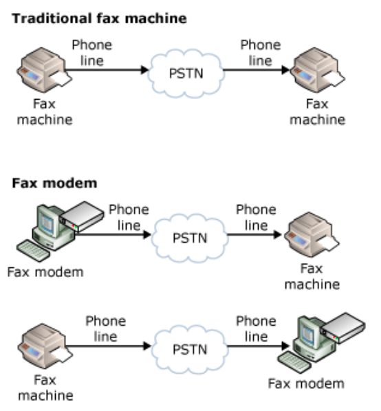

- Fax is also an electronic enabled communication method.

  传真也是一种电子化的通信方式。

- While you may see it is not mentioned in e-Commerce. Why?

  但是你可能注意到电子商务中并未提及这一点。这是为什么呢？传真主要还是用于交换信息。

| **维度**     | **Email / 线上系统**                                  | **Fax (传真)**                                   |
| ------------ | ----------------------------------------------------- | ------------------------------------------------ |
| **设备投入** | 云服务器（可弹性伸缩）                                | 传真机、固定电话线、专用传真纸、墨盒             |
| **边际成本** | 发送 1 封邮件和发送 10 万封邮件的**边际成本趋近于零** | 每多发一张纸，就实打实地消耗纸张、墨水和电话话费 |
| **人力成本** | 全自动化处理，无需人工干预                            | 需要人工维护设备、排卡纸、手动录入数据           |

### OECD Definition of e-commerce 

- The **Organisation for Economic Co-operation and Development (OECD)** is an international organisation that works to build better policies for better lives.Electronic enabled commercial transactions between and among organizations and individuals.

  经济合作与发展组织（OECD）是一个致力于为更美好的生活制定更优政策的国际组织。该组织促进组织与个人之间以及个人与个人之间的电子化商业交易。

- An **e-commerce transaction** is the sale or purchase of goods or services, conducted over computer netwoeks by methods specifically designed for the purpose of receiving or placing of orders. The goods or services are ordered by those methods, but the payment and the ultimate delivery of the goods or services do not have to be conducted online. An e-commerce transaction can be between enterprises, housrholds, individuals, governments, and other public or private organizations.

  电子商务交易是指通过计算机网络并以专门为接收或下订单而设计的方式进行的商品或服务买卖行为。商品或服务通过此类方式订购，但付款及最终交付不一定在线完成。电子商务交易可在企业、家庭、个人、政府及其他公共或私营组织之间进行。

- Guidelines for interpretation 

  解释指南

  - Include: Orders made via webpages, apps, extranetrs, and Electronic Data Interchange(EDI). The type is defined by the method of making the order.

    包含：通过网页、应用程序、外联网和电子数据交换（EDI）下达的订单。此类型由订单下达方式所定义。

  - Exclude: Orders made by telephone calls, facsimiles, on-premise mechanisms(including but not limited to kiosks or QR codes), manually typed messages (including but not limited to e-mails) 

    排除范围：通过电话、传真、现场设备（包括但不限于自助终端机或二维码）、手动输入信息（包括但不限于电子邮件）所下达的订单

- 现代 e-commerce 的发展不只是单个网站卖货，还包括 marketplace 和 platform 模式。Marketplace/platform 的核心是连接 sellers 和 buyers，例如 Amazon、eBay、Taobao、JD、Pinduoduo 等。Shopify 则代表另一类 e-commerce solution，帮助商家快速建立自己的在线商店。课件还强调 website traffic 的重要性，因为在电商环境中，流量通常意味着潜在客户、订单和收入，所以 “traffic always means money”。

### E-Commerce Evolution

- 1969: Compuserve (a company) – first online service provider – is launched.
- 1979: Michael Aldrich invents electronic shopping and makes the first electronic transaction.
- 1982: World’s first eCommerce company, Boston Computer Exchange, is started.
- 1991: The world wide web is invented.

- 1992: First eCommerce website – an online bookstore – Book Stacks Unlimited is launched.

- 1994: Netscape Navigator – an online web browser – is launched.

- 1995: eBay and Amazon are launched.

- 1998: Paypal is launched, and it revolutionizes online payment processes.

电商的发展得益于其他一些领域的进步

- the evolution of **communication technologies**

  通信技术

  - E-commerce 的发展依赖通信技术的进步。通信技术从 ancient communication system 发展到 optical telegraph，再到 electronic telegraphy 和 Morse code。电报不只是传递消息，也可以用于 money order，因此它已经和商业交易产生联系。之后 telephone 提高了实时沟通能力，optical fiber communication 则进一步提升了长距离、高带宽的信息传输能力。课件中的 B*L 指 Bitrate × Distance，它说明通信系统的发展同时追求更高带宽和更远距离，而 B*L 的提升通常会带来新的应用革命。

- Telegraph, from the Greek “tele”, distant, and “graphos”, writing

  电报，源自希腊语“tele”（遥远）和“graphos”（书写）。

- Morse code

  摩斯密码

- Telegraphy money order

  电汇汇票

  - Telegraphy is not only for message but for money order.

    电报不仅用于传递信息，还用于汇款。

  - Post office operated the money transfer for a very long time.

    邮局经营汇款业务已有很长时间。

- Telephone

  电话

- Optical Fiber Communication

  光纤通讯

- The B*L Improvement

  B*L 改进

  - The increase of B*L always results in application revolutions

  - We are chasing both of the high bandwidth and long distanc

    我们正致力于同时追求高带宽和长距离传输。

  - Sometime, we need to make a compromise of them

    有时，我们需要在其中做出妥协。

### The revolution of patment

Payment revolution 是 e-commerce 发展的另一个基础。商业交易不只是信息传递，还必须解决 money flow。Check 可以被看作早期非现金支付方式；EFT 让资金可以通过电子系统转移；SWIFT 则成为国际资金和证券转移的重要基础设施。没有电子化支付系统，e-commerce 很难真正完成交易闭环。

#### Check (Cheque) 支票

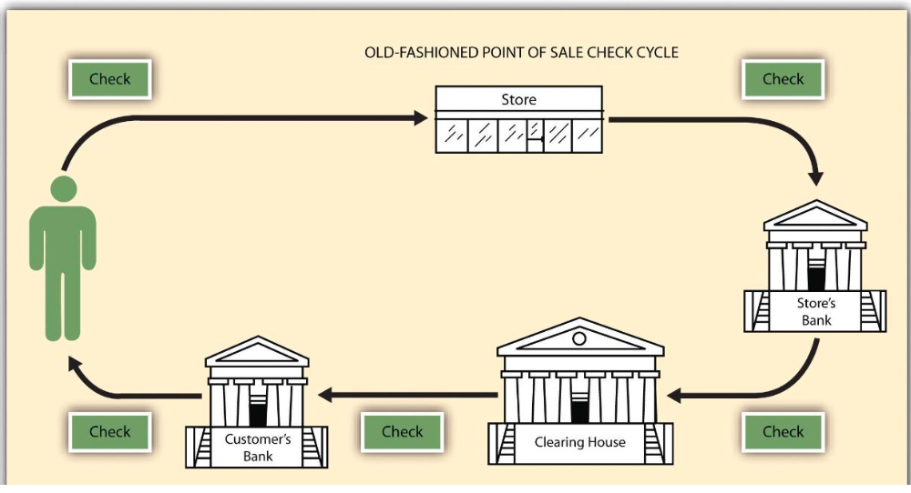

#### EFT: Electronic Fund Tranfer 电子转账

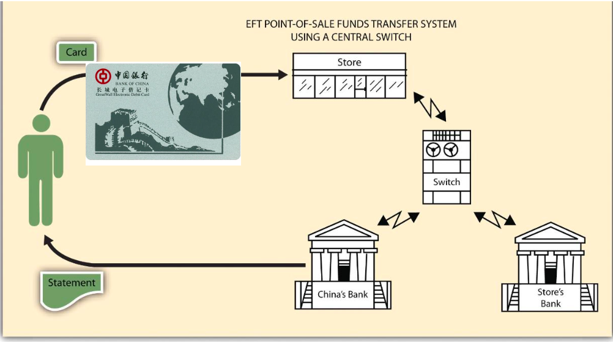

#### SWIFT: 

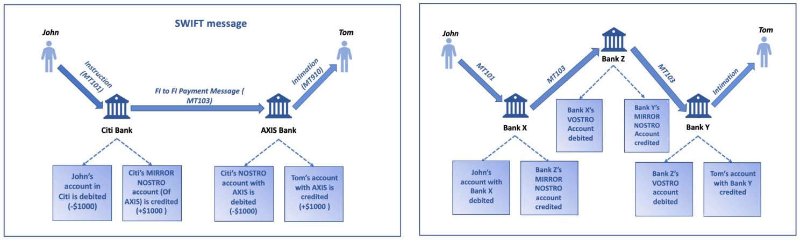

- **The Society for Worldwide Interbank Financial Telecommunications (SWIFT)** system powers most international money and security transfers

  环球银行金融电信协会（SWIFT）系统支撑着全球大部分跨境资金与证券交易。

- It is also very powerful like an financial nuclear bomb

  它同样威力巨大，犹如一枚金融核弹。

#### EDI: Electronic Data Interchange 电子数据交换

EDI 的关键在于**标准化**。不同公司的内部 ERP 或管理系统可能完全不同，但只要大家都将数据转换为统一的国际标准（如 UN/EDIFACT 或 ANSI X12），系统就能无缝对接。

- EDI extend the e-commerce **beyond** e-payment.

  EDI将电子商务的范畴扩展至电子支付之外。

- EDI is the intercompany communication of **business document**s in a standard format.

  电子数据交换（EDI）是以标准格式在公司间传递业务文件的一种通信方式。

- The simple definition of EDI is a standard electronic format that replaces paper-based documents such as **purchase orders** or **invoices**.

  EDI的简单定义是一种标准化的电子格式，用于取代诸如采购订单或发票等纸质文件。

- EDI is an old but **still mainstream technology in B2B**

  EDI是一项古老但在B2B领域仍为主流的技术。

- EDI 仍然是 B2B 场景中的主流技术的原因是企业之间的订单、发票、物流等业务文件需要稳定、标准化、自动化地交换，而 EDI 正好满足这一需求。

##### A EDI Sample

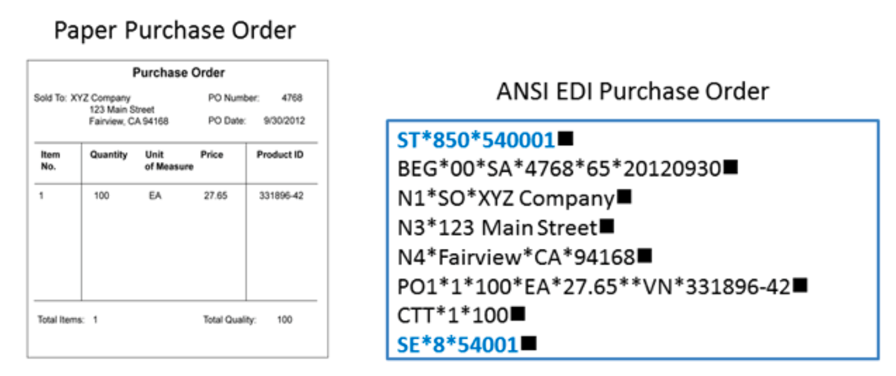

- Similar to ETF, exchange the key data with a fixed standard format.

  类似于ETF，以固定标准格式交换关键数据。

- But extend to **purchase orders** and **invoices**.

  但扩展至采购订单和发票。

##### EDI Types EDI类型

1. 直接 EDI / 点对点 EDI (Direct EDI / Point-to-Point)

   这是最原始的模式。两家公司通过互联网直接建立连接，通常使用相同的通信协议（如 AS2）。

   - **优点：** 无需中间商，速度快，长远来看成本较低。

   - **缺点：** 扩展性差。如果你有 1000 个供应商，你就需要管理 1000 个不同的直接连接。

2. 增值网 EDI (EDI via VAN)

   **VAN (Value-Added Network)** 就像是一个私有的“数字邮局”。企业将数据发给 VAN，VAN 再负责分发给对应的业务伙伴。

   - **优点：** 简化了连接管理，你只需要对接一个 VAN 服务商。

   - **缺点：** 按照传输量收费，费用相对较高。

3. Web EDI

   通过浏览器进行的 EDI 交换。大型企业（买方）会建立一个门户网站，小型供应商只需登录网页，手动输入信息或上传表单，系统会自动将其转换为 EDI 格式。

   - **优点：** 成本极低，适合没有技术实力的小型企业。

   - **缺点：** 自动化程度较低，需要人工干预。

4. AS2 EDI (Applicability Statement 2)

   这是一种基于 HTTP/S 的安全通信协议。它通过加密和数字签名确保数据在互联网传输过程中的安全性。

   - **核心特性：** 支持“回执确认”（MDN），发送方可以即时知道对方是否成功接收并解密了文件。

5. API EDI

   随着云计算的发展，许多企业开始将传统的 EDI 标准与 RESTful API 结合。

   - **优点：** 实时性极强，能够与现代的云原生应用（如 Shopify, Salesforce）完美集成。

   - **趋势：** 它是目前供应链数字化转型的重要方向。

6. 移动 EDI (Mobile EDI)

   通过智能手机或平板电脑查看和审批 EDI 单据。它通常是 Web EDI 或 API EDI 的移动延伸，主要用于物流跟踪和紧急订单审批。

7. VAN and AS2 are the most popular methods.

  VAN和AS2是最常用的方法。

### E-Commerce Types

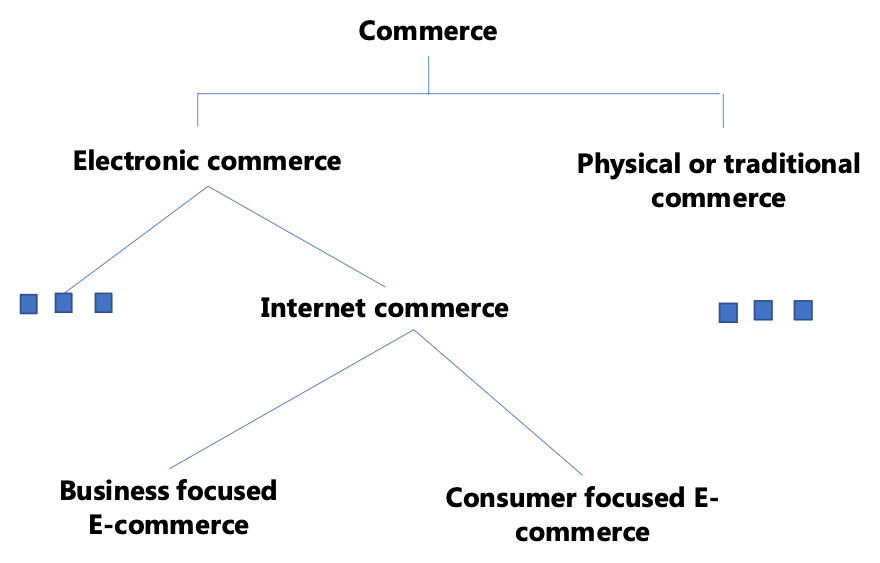

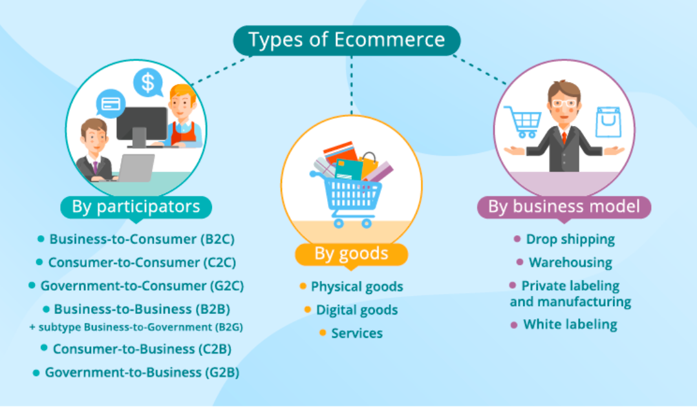

- Commerce can be divided into **traditional** and **electronic types**.

  商业可分为传统型和电子型两种。

  - E-commerce 可以从不同角度分类。除了 traditional commerce 和 electronic commerce 的划分，还可以看到很多基于不同视角的术语：
    - O2O 指 online + offline，
    - M-B 指 mobile business，
    - B2G 指 business to government，
    - SoLoMo 指 social + local + mobile。
  - Sharing Economy 中还包括 P2P、B2P 等形式。这说明 e-commerce 的分类不是唯一的，而是取决于分析角度。

- There is a number of criteria to classify types of ecommerce.

  有多种标准来划分电子商务的类型。

- 关于 new format of e-commerce，例如内容驱动、直播带货、社交平台导流等新形式。现代电商已经不仅是搜索商品再下单，也可以通过视频、直播、社交媒体和推荐算法来刺激消费。此外，中国 marketplaces 也在服务全球市场，例如 Temu、TikTok 等平台体现了中国电商平台的全球化扩展。

### 8 Unique features of e-commerce technology

| Feature                       | Selected Impactes on Business Environment                    |
| ----------------------------- | ------------------------------------------------------------ |
| Uniquity                      | Alters industry structure by creating new marketing channels and expanding size of overall market. Creats new efficiencies in industry operations and lowers costs of firms' sales operations. Enables new differntiation strategies. 通过创建新的营销渠道并扩大整体市场规模来改变行业结构。提高行业运营效率，降低企业的销售运营成本。支持实施新的差异化战略。 |
| Global reach                  | Changes industry structure by lowering barriers to entry, but greetly expands market at same time. Lwers cost of industry and firm operations through production and sales efficiencies. Enables competition on a global scale. 降低行业进入壁垒，改变产业结构，同时大幅扩展市场。通过提升生产和销售效率，降低行业及企业运营成本。推动全球化竞争。 |
| Universal Standards           | Changes industry structure by lowering barriers to entry and intensifying competition within an industry. Lowers costs of industry and firm operations by lowering computing and communications costs. Enables broad scope strategies. 通过降低进入门槛和加剧行业内竞争，改变行业结构。通过降低计算和通信成本，降低行业和企业运营成本。使广泛范围战略成为可能。 |
| Richness                      | Alters industry structure by reducing strength of powerful distribution channels. Changes industry and firm operations costs by reducing reliance on sales forces. Enhances post-sales support strategies. 通过削弱强大分销渠道的力量来改变行业结构。通过减少对销售团队的依赖来改变行业及企业的运营成本。强化售后支持策略。 |
| Interactivity                 | Alters industry structure by reducing threat of substitutes through enhanced customization. Reduces industry and firm costs by reducing reliance on sales forces. Enable personalized marketing strategies. 通过增强定制化降低替代品威胁，从而改变行业结构。通过减少对销售团队的依赖，降低行业和企业成本。支持个性化营销策略的实施。 |
| Personalization/Customization | Alters industry structure by reducing threats of substitutes, raiding barriers to entry. Reduces value chain costs in industry and firms by lessening reliance on sales forces. Enables personalized marketing strategies. 通过减少替代品的威胁和突破进入壁垒来改变行业结构。通过降低对销售团队的依赖来削减行业和企业的价值链成本。实现个性化营销策略。 |
| Information density           | Changes industry structure by weakening powerful sales channels, shifting bargaining power to consumers. Reduces industry and firm operations costs by lowering costs of obtaining, processing, and distributing information about suppliers and consumers. 通过弱化强势销售渠道的结构，将议价能力转向消费者，从而改变行业结构。通过降低获取、处理和分发供应商与消费者信息的成本，减少行业及企业的运营成本。 |
| Social technologies           | Changes industry structure by shifting programming and editorial decisions to consumers. Creates substitute entertainment products. Energizes a large group of new suppliers. 通过将编程和编辑决策权转移给消费者，改变了行业结构。创造了替代性娱乐产品。激发了大量新供应商的活力。 |

### How E-Commerce influences industry structure

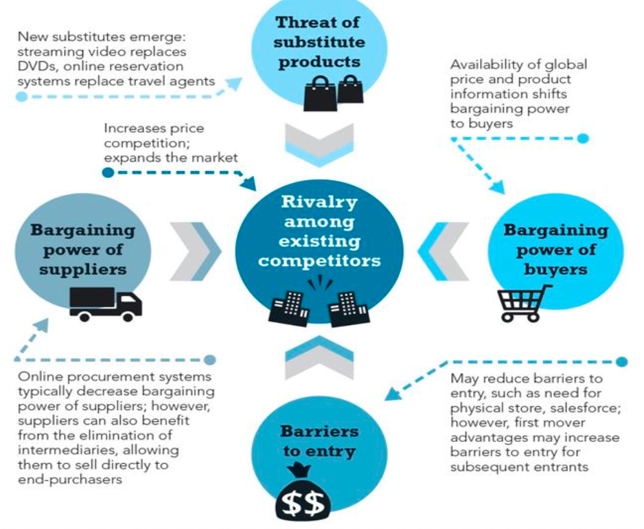

- E-commerce technology 会改变产业结构。它可以降低进入门槛，让小企业也能进入市场；

- 扩大市场规模，使企业面向全球客户；
- 降低信息获取、处理和传播成本；
- 削弱传统销售渠道的控制力；
- 增强消费者议价能力；
- 同时也让企业通过个性化推荐、互动营销和社交技术形成新的竞争方式。
- 因此，e-commerce 不只是一个销售渠道变化，而是会影响整个行业的竞争结构。

**Conclusion**: E-commerce 不能脱离真实商品和真实服务。点击鼠标不会凭空生成一辆汽车。电子商务可以优化 information flow、money flow 和 ordering process，但最终仍然需要真实产品、供应链、物流和服务支撑。因此，e-commerce 的本质仍然是 commerce，只是交易过程被电子技术和互联网重新组织了。

# 考试提问与参考答案

## Q1. What is the difference between Commerce, Business and Trade?

**Answer:**
 **Business refers to the activity of making, buying, selling goods or providing services for money. Trade mainly refers to buying, selling or bartering commodities. Commerce is broader than trade. It includes trade, but also includes services that support trade, such as banking, finance, insurance, transport and communication. So, trade is only one part of commerce.**

------

## Q2. What are the three flows in commerce?

**Answer:**
 The three flows in commerce are material flow, information flow and financial flow. Material flow means the movement of products or goods. Information flow means information about products, orders and services. Financial flow means money or payment. A typical commerce session includes searching for goods, placing an order, paying the order, receiving the goods and customer service.

------

## Q3. Why can TV shopping be considered a form of e-commerce in a broad sense?

**Answer:**
 TV shopping uses television to push product information to potential customers, and customers can place orders directly by telephone. In a broad sense, it uses electronic media to support commercial transactions, so it can be considered a form of e-commerce. However, according to the stricter OECD interpretation, orders made only by telephone are excluded from e-commerce because the order is not placed through computer networks designed for order receiving or placing.

------

## Q4. What is the OECD definition of e-commerce?

**Answer:**
 According to the OECD definition, an e-commerce transaction is the sale or purchase of goods or services conducted over computer networks by methods specifically designed for receiving or placing orders. The goods or services are ordered through these methods, but payment and final delivery do not have to be online. The transaction can happen between enterprises, households, individuals, governments and other public or private organizations.

------

## Q5. According to OECD, which orders are included and excluded from e-commerce?

**Answer:**
 Included orders are orders made through webpages, apps, extranets and EDI. The type is defined by the method used to place the order. Excluded orders include telephone calls, facsimiles, on-premise mechanisms such as kiosks or QR codes, and manually typed messages such as e-mails.

------

## Q6. Why is fax usually not treated as e-commerce?

**Answer:**
 Fax is an electronic communication method, but it is mainly used to exchange information or documents. In the OECD interpretation, orders made by facsimiles are excluded from e-commerce. Therefore, even though fax uses electronic communication, it is usually not treated as e-commerce under the stricter definition.

------

## Q7. List important milestones in the evolution of e-commerce.

**Answer:**
 Important milestones include: Compuserve launched in 1969 as an online service provider; Michael Aldrich invented electronic shopping in 1979; Boston Computer Exchange started in 1982; the World Wide Web was invented in 1991; Book Stacks Unlimited launched as an early online bookstore in 1992; Netscape Navigator launched in 1994; eBay and Amazon launched in 1995; PayPal launched in 1998 and changed online payment processes.

------

## Q8. What was the first product sold online according to the lecture?

**Answer:**
 According to the lecture, the first product sold online was a CD sold through [www.netmarket.com](http://www.netmarket.com) on 11 August 1994. The price was $12.48 plus shipping, and the credit card number was encrypted during the purchasing process.

------

## Q9. Why did communication technologies support the development of e-commerce?

**Answer:**
 E-commerce depends on the fast and reliable exchange of information. Communication technologies such as telegraph, Morse code, telephone and optical fiber communication improved the speed, distance and capacity of information transmission. The lecture also uses B*L, meaning Bitrate × Distance, to show that higher bandwidth and longer distance can lead to application revolutions.

------

## Q10. What is EFT?

**Answer:**
 EFT means Electronic Fund Transfer. It refers to electronic transfer of money through financial systems. Compared with traditional check-based payment, EFT supports faster and more electronic money flow, which is important for completing e-commerce transactions.

------

## Q11. What is SWIFT and why is it important?

**Answer:**
 SWIFT stands for the Society for Worldwide Interbank Financial Telecommunications. It supports most international money and securities transfers. It is important because it provides a global financial communication foundation for cross-border money movement. In the lecture, SWIFT is described as very powerful, like a “financial nuclear bomb”.

------

## Q12. What is EDI?

**Answer:**
 EDI means Electronic Data Interchange. It is the intercompany communication of business documents in a standard format. A simple definition is that EDI is a standard electronic format that replaces paper-based documents such as purchase orders or invoices. It extends e-commerce beyond e-payment because it supports business document exchange, not only money transfer.

------

## Q13. Why is standardization important in EDI?

**Answer:**
 Standardization is the key of EDI. Different companies may use different ERP or management systems, but if they convert data into a common standard format such as UN/EDIFACT or ANSI X12, their systems can communicate with each other. This makes business document exchange more automatic and reliable.

------

## Q14. What are the main types of EDI?

**Answer:**
 Main types of EDI include Direct EDI or Point-to-Point EDI, EDI via VAN, Web EDI, AS2 EDI, API EDI and Mobile EDI. Direct EDI connects companies directly but has poor scalability. VAN works like a digital post office and simplifies connection management. Web EDI is suitable for small suppliers. AS2 uses HTTP/S with encryption and digital signature. API EDI connects traditional EDI with modern RESTful APIs. Mobile EDI supports checking and approving EDI documents on mobile devices.

------

## Q15. Why is EDI still important in B2B?

**Answer:**
 EDI is old, but it is still mainstream in B2B because companies need stable, standardized and automated exchange of business documents such as purchase orders and invoices. B2B transactions often require accuracy, reliability and system-to-system integration, so EDI is still useful.

------

## Q16. What is the relationship between marketplace, platform and e-commerce?

**Answer:**
 A marketplace or platform connects sellers and buyers. Instead of one company only selling its own goods, the platform provides infrastructure for many sellers and many customers. Examples include Amazon, eBay, Taobao, JD and Pinduoduo. Shopify is another type of e-commerce solution that helps merchants build online stores. In platform-based e-commerce, traffic is very important because traffic can be converted into orders and money.

------

## Q17. What does “traffic always means money” mean in e-commerce?

**Answer:**
 It means website or app traffic represents potential customers. More traffic usually means more opportunities for product exposure, orders, advertising income and platform value. Therefore, in e-commerce, attracting and managing traffic is a core business issue, not only a technical issue.

------

## Q18. What are some new formats of e-commerce?

**Answer:**
 New formats of e-commerce include livestreaming commerce, content-driven selling, social commerce and global marketplace expansion. These formats do not only rely on users searching for products. They use video, social media, influencers, recommendation algorithms and entertainment content to create demand and guide purchases.

------

## Q19. How can e-commerce be classified?

**Answer:**
 Commerce can be divided into physical or traditional commerce and electronic commerce. Electronic commerce can include internet commerce, business-focused e-commerce and consumer-focused e-commerce. There are also many other classification terms from different points of view, such as O2O, Mobile Business, B2G, SoLoMo, Sharing Economy, P2P and B2P.

------

## Q20. What are the eight unique features of e-commerce technology?

**Answer:**
 The eight unique features are ubiquity, global reach, universal standards, richness, interactivity, personalization/customization, information density and social technologies. These features help e-commerce change market channels, expand market size, reduce costs, improve interaction with customers, support personalized marketing and shift more power to consumers.

------

## Q21. How does e-commerce influence industry structure?

**Answer:**
 E-commerce influences industry structure by lowering entry barriers, expanding market size, reducing information and communication costs, weakening traditional distribution channels, increasing competition and shifting bargaining power toward consumers. It also enables global competition, personalized marketing and new social-technology-based business models.

------

## Q22. Why does the lecture say “Click a mouse won’t generate a car”?

**Answer:**
 This sentence means e-commerce cannot exist without real products and real services. Digital technologies can improve ordering, payment, information exchange and customer service, but they cannot replace production, supply chains and logistics. The essence of e-commerce is still commerce, and commerce is based on real products.