# 6 Marketing and SEO

## 知识图谱

```plaintext
Lec06 Marketing and SEO
├── 1. Marketing Funnels 营销漏斗
│   ├── 1.1 Awareness 认知阶段
│   │   ├── 核心目标：让新的受众知道品牌
│   │   ├── 主要作用：generate awareness and education
│   │   ├── 影响对象：new audiences who may not be familiar with your brand
│   │   ├── 在漏斗中的位置：Top of Funnel，上层入口
│   │   ├── 重点任务：先让用户“看见你、知道你、认识你”
│   │   └── 衡量指标：impressions、reach
│   │
│   ├── 1.2 Consideration 考虑阶段
│   │   ├── 核心目标：让用户在竞争品牌中优先考虑你的品牌
│   │   ├── 主要作用：enticing people to think about your brand over your competition
│   │   ├── 用户状态：用户正在比较 specific solutions and alternatives
│   │   ├── 在漏斗中的位置：Middle of Funnel，中间阶段
│   │   ├── 重点任务：让用户觉得“这个品牌值得进一步了解”
│   │   └── 衡量指标：clicks to website、click-through rate
│   │
│   └── 1.3 Conversion 转化阶段
│       ├── 核心目标：推动用户采取最终行动
│       ├── 主要作用：encourage a call to action
│       ├── 用户行为：购买、注册、下单、提交表单、咨询等
│       ├── 在漏斗中的位置：Bottom of Funnel，底部阶段
│       ├── 重点任务：让用户从“考虑”变成“行动”
│       └── 衡量指标：total conversions、cost per conversion、ROI
│
├── 2. Marketing vs. Advertisement
│   ├── 2.1 Marketing 营销
│   │   ├── 定位：比 advertisement 更大的概念
│   │   ├── 核心关注：建立品牌价值
│   │   ├── 核心关注：连接正确的目标市场
│   │   ├── 作用：让公司和目标用户建立长期联系
│   │   ├── 涉及内容：Product、Price、Place、Promotion、Conversion、Metrics
│   │   └── 理解方式：Marketing 是完整的市场策略和用户转化体系
│   │
│   └── 2.2 Advertisement 广告
│       ├── 定位：Marketing 的一部分
│       ├── 核心关注：影响用户或说服用户购买
│       ├── 作用：快速提高 awareness
│       ├── 特点：更偏向短期曝光和购买刺激
│       └── 注意：Advertising is NOT equal to Marketing
│
├── 3. Leaking is a waste 漏斗泄漏
│   ├── 3.1 Advertisement 的作用
│   │   ├── 广告可以快速带来曝光
│   │   ├── 广告可以让更多 leads 进入漏斗
│   │   └── 广告是提高 Awareness 的即时方式
│   │
│   ├── 3.2 Leads leak 的问题
│   │   ├── 用户进入漏斗后中途流失
│   │   ├── 用户没有进入下一阶段
│   │   ├── 用户没有最终购买或行动
│   │   ├── 广告带来的流量被浪费
│   │   └── 营销成本被浪费
│   │
│   ├── 3.3 Fix #1：More Leads
│   │   ├── 增加进入漏斗的潜在客户数量
│   │   ├── 扩大流量入口
│   │   └── 提高 Awareness 阶段的用户规模
│   │
│   └── 3.4 Fix #2：Better Conversion
│       ├── 提高用户从 leads 到 buyers 的转化率
│       ├── 减少用户在漏斗中流失
│       ├── 优化内容、页面、体验和购买路径
│       └── 核心思想：Marketing is not only traffic
│
├── 4. Marketing 4P
│   ├── 4.1 Product 产品
│   │   ├── 营销前要理解产品是什么
│   │   ├── 理解产品如何从 competitors 中脱颖而出
│   │   ├── 判断产品是否可以和 secondary product 搭配销售
│   │   ├── 判断市场中是否存在 substitute products
│   │   ├── 关注产品本身的价值
│   │   ├── 关注产品的差异化优势
│   │   └── 作用：决定营销活动应该突出什么卖点
│   │
│   ├── 4.2 Price 价格
│   │   ├── 需要考虑 unit cost price
│   │   ├── 需要考虑 marketing costs
│   │   ├── 需要考虑 distribution expenses
│   │   ├── 需要考虑 competing products 的价格
│   │   ├── 需要判断 proposed price point 是否合理
│   │   ├── 需要判断价格是否能成为消费者眼中的 reasonable alternative
│   │   └── 作用：决定产品能否在市场中有竞争力
│   │
│   ├── 4.3 Place 渠道 / 分销
│   │   ├── Place 指产品的 distribution
│   │   ├── 决定产品通过 physical storefront 销售
│   │   ├── 决定产品通过 online 渠道销售
│   │   ├── 决定产品是否线上线下同时销售
│   │   ├── 线下销售时要考虑 physical product placement
│   │   ├── 线上销售时要考虑 digital product placement
│   │   └── 作用：决定用户在哪里、如何接触到产品
│   │
│   └── 4.4 Promotion 推广
│       ├── 定义：integrated marketing communications campaign
│       ├── 包括 advertising
│       ├── 包括 selling
│       ├── 包括 sales promotions
│       ├── 包括 public relations
│       ├── 包括 direct marketing
│       ├── 包括 sponsorship
│       ├── 包括 guerrilla marketing
│       └── 作用：把产品信息传递给目标用户并推动用户行动
│
├── 5. Promotion 与 Funnel 的结合
│   ├── 5.1 TOFU：Top of Funnel
│   │   ├── 对应阶段：Awareness
│   │   ├── 目标：generate informative content
│   │   ├── 作用：make new prospects aware of products and services
│   │   ├── 内容形式：Blog posts
│   │   ├── 内容形式：Webinars
│   │   ├── 内容形式：Social media
│   │   ├── 内容形式：Infographics
│   │   ├── 内容形式：Videos
│   │   ├── 内容形式：Podcasts
│   │   ├── 内容形式：Search Engine Optimization
│   │   └── 内容形式：Research reports / eBooks
│   │
│   ├── 5.2 MOFU：Middle of Funnel
│   │   ├── 对应阶段：Consideration / Evaluation
│   │   ├── 目标：create and share content
│   │   ├── 作用：give warm prospects the ability to evaluate products and services
│   │   ├── 内容形式：Paid advertising
│   │   ├── 内容形式：Case studies
│   │   ├── 内容形式：Social media
│   │   ├── 内容形式：Email marketing
│   │   ├── 内容形式：Offers and discounts
│   │   └── 内容形式：White papers and downloads
│   │
│   └── 5.3 BOFU：Bottom of Funnel
│       ├── 对应阶段：Conversion
│       ├── 目标：provide content and tools
│       ├── 作用：lead hot prospects to convert
│       ├── 内容形式：Demos
│       ├── 内容形式：Sales collateral
│       ├── 内容形式：Shopping carts
│       ├── 内容形式：Customer testimonials
│       ├── 内容形式：Product and service spec sheets
│       └── 内容形式：Product reviews and competitive analysis
│
├── 6. Traffic Sources 流量来源
│   ├── 6.1 Search Engine 搜索引擎
│   │   ├── 是重要的流量来源
│   │   ├── 用户通过关键词找到网页
│   │   ├── 搜索引擎会匹配 web search 和 web pages
│   │   └── 对电商网站来说，搜索入口可以带来自然流量和购买意图强的用户
│   │
│   └── 6.2 AI 新流量入口
│       ├── AI is the new traffic source
│       ├── 用户可能通过 AI 获取答案
│       ├── 用户可能通过 AI 获得推荐
│       ├── 用户可能通过 AI 间接进入网站
│       └── 意义：未来流量入口不只依赖传统搜索引擎
│
├── 7. SEO and SEM
│   ├── 7.1 SEO：Search Engine Optimization
│   │   ├── 定义：搜索引擎优化
│   │   ├── 属于 digital marketing strategy 的一部分
│   │   ├── 目标：organically driving traffic to your site
│   │   ├── 方式：优化网站内容
│   │   ├── 方式：优化关键词
│   │   ├── 方式：优化网页结构
│   │   ├── 方式：优化页面标题和描述
│   │   ├── 方式：优化用户体验
│   │   ├── 结果：提高 organic list 中的 ranking
│   │   ├── 特点：不直接购买排名
│   │   ├── 特点：长期效果较强
│   │   └── 特点：见效可能较慢
│   │
│   ├── 7.2 SEM：Search Engine Marketing
│   │   ├── 定义：搜索引擎营销
│   │   ├── 属于 digital marketing strategies
│   │   ├── 目标：drive traffic to your site
│   │   ├── 主要方式：optimizing paid ads
│   │   ├── 核心行为：purchasing paid listings
│   │   ├── 特点：通过付费获得搜索结果曝光
│   │   ├── 特点：见效较快
│   │   ├── 特点：需要持续投入广告成本
│   │   └── 结果：获得 paid traffic
│   │
│   └── 7.3 SEO vs. SEM
│       ├── SEO：organic
│       ├── SEM：paid
│       ├── SEO：lasting effect
│       ├── SEM：immediate effect
│       ├── SEO：improve brand quality
│       ├── SEM：sales / leads focused
│       ├── SEO：informs strategy
│       └── SEM：paid placement brings quick visibility
│
├── 8. Search Engine 搜索引擎原理
│   ├── 8.1 Search Engine 定义
│   │   ├── A search engine is a software system
│   │   ├── 功能：finds web pages
│   │   └── 条件：web pages match a web search
│   │
│   ├── 8.2 为什么需要 Search Engine
│   │   ├── 网站数量非常大
│   │   ├── 用户不一定知道准确网址
│   │   ├── 用户通常只知道关键词
│   │   ├── 用户可能只知道部分信息
│   │   ├── 人工分类无法处理海量网页
│   │   └── 需要自动化搜索和排序机制
│   │
│   ├── 8.3 类比：Find a book in library
│   │   ├── 图书馆中的书会被分类
│   │   ├── 如果知道 category，查找比较容易
│   │   ├── 选择 category 后，该类书会显示出来
│   │   └── 这是传统分类式查找
│   │
│   ├── 8.4 类比：Find a RED book in library
│   │   ├── 如果只知道书是红色封面
│   │   ├── 但不知道标题和分类
│   │   ├── 通过传统图书馆分类很难找到
│   │   └── 引出关键词和特征搜索问题
│   │
│   ├── 8.5 类比：Yellow Page
│   │   ├── Yellow Page 是查找电话号码的字典
│   │   ├── 通过名字找号码比较容易
│   │   ├── 通过号码反查 owner 比较难
│   │   └── 引出反向查找需求
│   │
│   ├── 8.6 类比：Find your favorite song by its lyrics
│   │   ├── 用户可能只记得歌词
│   │   ├── 用户不记得歌曲名称
│   │   ├── 多首歌可能包含相同短语
│   │   ├── 需要通过歌词关键词找到歌曲
│   │   └── 引出 inverted search
│   │
│   ├── 8.7 Contents vs. Index
│   │   ├── Contents：目录
│   │   ├── Contents 通常按章节或结构组织
│   │   ├── Index：索引
│   │   ├── Index 按 names、places、things、terms 等关键词组织
│   │   ├── Index 通常 alphabetically sorted
│   │   ├── Index 提供 page numbers
│   │   ├── Index 提供 cross-reference
│   │   └── Index 使 specific topics 更容易被找到
│   │
│   └── 8.8 Inverted Index 倒排索引
│       ├── 需求：We need an Inverted Index for inverted search
│       ├── 普通索引方向：Document → Words
│       ├── 倒排索引方向：Word → Documents
│       ├── 组成：Terms / Dictionary
│       ├── 组成：Documents / Posting Lists
│       ├── 预处理：Filtering
│       ├── 预处理：Tokenization
│       ├── 可能去除：Stop Words
│       ├── 作用：根据关键词快速定位文档
│       └── 搜索引擎依赖倒排索引提高查询效率
│
├── 9. Search Engine 发展与 Ranking
│   ├── 9.1 Yahoo!
│   │   ├── Web based dictionary pioneer
│   │   ├── 早期网站目录代表
│   │   ├── 通过分类组织网页
│   │   └── 局限：面对海量网站时分类方式不够
│   │
│   ├── 9.2 ChinaPages
│   │   ├── Chinese version of web based dictionary
│   │   └── 可以理解为中文网站目录形式
│   │
│   ├── 9.3 Alibaba vs. HC360
│   │   ├── Alibaba started from B2B
│   │   ├── Alibaba 一开始不是 B2C
│   │   └── 和早期网站目录、B2B 平台发展有关
│   │
│   ├── 9.4 Web Crawler / Spider
│   │   ├── 从一组 known pages 开始 crawling
│   │   ├── 跟随 hyperlinks 到 new pages
│   │   ├── 理论上可以 collect all open webs
│   │   ├── 解决人工分类无法处理海量网页的问题
│   │   └── 为搜索引擎建立索引提供数据来源
│   │
│   ├── 9.5 BackRub
│   │   ├── 作用：rank the page
│   │   ├── 开始于 1996
│   │   ├── 与 Larry Page 相关
│   │   ├── 与 Stanford Digital Library Project 相关
│   │   ├── 目标：开发数字图书馆相关技术
│   │   └── 意义：搜索引擎不仅要找到网页，还要对网页排序
│   │
│   └── 9.6 Elasticsearch
│       ├── 是 scalable data store
│       ├── 是 vector database
│       ├── 使用 Apache Lucene
│       ├── 支持 near real-time search
│       ├── 支持 indexing
│       ├── 支持 storing
│       ├── 支持 analysis
│       └── 可作为现代搜索系统的技术例子
│
├── 10. Search Engine Workflow
│   ├── 10.1 Crawling
│   │   ├── 搜索引擎爬虫发现网页
│   │   ├── 从已知网页开始
│   │   ├── 通过链接继续发现新网页
│   │   └── 抓取网页内容
│   │
│   ├── 10.2 Indexing
│   │   ├── 将网页内容整理
│   │   ├── 对内容进行分类
│   │   ├── 提取关键词
│   │   ├── 建立索引
│   │   └── 存入搜索系统
│   │
│   └── 10.3 Ranking
│       ├── 根据算法评估网页
│       ├── 判断网页和搜索词的相关性
│       ├── 判断网页质量
│       ├── 决定 SERP 中的显示顺序
│       └── SEO 的目标是影响 organic ranking
│
├── 11. SEO Optimization 详细优化方向
│   ├── 11.1 Keywords 关键词优化
│   │   ├── 目标：找到潜在客户搜索的 words 和 phrases
│   │   ├── 分析 search volume
│   │   ├── 分析 competition
│   │   ├── 自然加入 long-tail keywords
│   │   ├── 理解 customer purpose
│   │   ├── 理解 informational needs
│   │   ├── 理解 navigational needs
│   │   ├── 理解 transactional needs
│   │   ├── 分析 competitors' keyword strategies
│   │   ├── 找出 competitors 排名高的 keywords
│   │   ├── 将 keywords 分组
│   │   ├── grouping into themes
│   │   ├── 使用 Google Analytics
│   │   ├── 使用 Search Console
│   │   └── 持续 monitor content and keyword performance
│   │
│   ├── 11.2 Contents 内容优化
│   │   ├── 核心原则：Content is always king for ranking
│   │   ├── 内容需要和目标关键词相关
│   │   ├── 内容需要满足用户搜索意图
│   │   ├── 自然加入 relevant keywords
│   │   ├── 避免 keyword stuffing
│   │   ├── 使用 high-quality images
│   │   ├── 使用 infographics
│   │   ├── 使用 videos
│   │   ├── 使用 animations
│   │   ├── 使用 engaging titles
│   │   ├── 使用 subheadings
│   │   ├── 降低 bounce rate
│   │   ├── 使用 short paragraphs
│   │   ├── 使用 short sentences
│   │   ├── 使用 bullet points
│   │   ├── 使用 white space
│   │   └── 提高 readability
│   │
│   ├── 11.3 Location based results / Local SEO
│   │   ├── 适用场景：restaurant 等本地搜索
│   │   ├── 创建 location-specific pages
│   │   ├── 从 local websites 获得 high-quality backlinks
│   │   ├── 从 local blogs 获得 backlinks
│   │   ├── 从 directories 获得 backlinks
│   │   ├── 在 social media 上保持活跃
│   │   ├── 与 local customers 互动
│   │   ├── 在 titles 中加入 location-specific information
│   │   ├── 在 headings 中加入 location-specific information
│   │   ├── 在 content 中加入 location-specific information
│   │   ├── 使用 schema markup
│   │   ├── 帮助 search engines 理解 business location
│   │   ├── 帮助 search engines 理解 contact information
│   │   └── 在 local blogs 或 websites 发布 guest posts
│   │
│   ├── 11.4 Title Tags and Meta Descriptions
│   │   ├── 作用：帮助 Google 理解页面内容
│   │   ├── 作用：帮助 users 理解页面内容
│   │   ├── 作用：提高 SERPs 中的 click-through rate
│   │   ├── 作用：带来 more website traffic
│   │   ├── 作用：可能带来 more sales
│   │   ├── Title Tags 要 attractive
│   │   ├── Title Tags 要 unique
│   │   ├── Meta Descriptions 要 attractive
│   │   ├── Meta Descriptions 要 unique
│   │   ├── Title Tags 长度建议：50–60 characters
│   │   ├── Meta Description 长度建议：around 160 characters
│   │   ├── 要 match search intent
│   │   ├── 要 add targeted keywords
│   │   └── 不要写得太泛或和页面内容无关
│   │
│   ├── 11.5 Multi-factors driving SEO
│   │   ├── SEO 不是单因素决定
│   │   ├── Search engine ranking 受很多因素影响
│   │   ├── 课件提到 more than 200 factors
│   │   ├── 内容质量是重要因素
│   │   ├── 关键词是重要因素
│   │   ├── 页面结构是重要因素
│   │   ├── 用户体验是重要因素
│   │   ├── 页面可读性是重要因素
│   │   └── 技术错误也会影响 SEO
│   │
│   └── 11.6 SEO 不推荐做法
│       ├── Flash and Shockwave
│       │   ├── spiders do not pick up these files
│       │   └── 不利于搜索引擎抓取
│       ├── Image only sites
│       │   ├── spiders do not pick up images
│       │   └── 图片中的内容无法被普通 spider 直接读取
│       ├── Image site maps
│       │   ├── spiders cannot read image maps
│       │   └── 不利于索引
│       ├── Frames
│       │   ├── only one page can be titled
│       │   ├── spider 可能无法完整读取页面
│       │   └── 页面可能无法被正确 indexed
│       └── Code errors
│           ├── Misspellings
│           ├── JavaScript errors
│           ├── HTML errors
│           ├── 需要 validate your code
│           └── 错误代码会影响搜索引擎理解页面
│
├── 12. SEM 付费搜索营销结构
│   ├── 12.1 SEM 基本定义
│   │   ├── Search Engine Marketing
│   │   ├── marketing a website via search engines
│   │   ├── 方式：purchasing paid listings
│   │   ├── 目标：bring traffic to website
│   │   └── 适合快速获得曝光和流量
│   │
│   ├── 12.2 Paid Listings
│   │   ├── 搜索引擎卖给 advertisers 的结果位置
│   │   ├── 可以是 paid placement
│   │   ├── 可以是 paid inclusion
│   │   └── 本质是 paid search visibility
│   │
│   ├── 12.3 Paid Inclusions
│   │   ├── 付费保证页面被 included in search engine index
│   │   ├── 不保证 specific placement
│   │   ├── 不保证 ranking
│   │   ├── 付费方式可以是 CPC basis
│   │   ├── 付费方式可以是 per-url fee basis
│   │   └── 重点：保证收录，不保证排位
│   │
│   └── 12.4 Paid Placements
│       ├── 付费保证 listings 出现在 search results 中
│       ├── 通常费用越高 ranking 越高
│       ├── 例子：sponsored links
│       ├── 例子：Google AdWords
│       ├── 可以从 portal 购买
│       ├── 可以从 search network 购买
│       ├── 很多广告网络使用 auction environment
│       ├── keywords / phrases 与 CPC fee 相关
│       └── 重点：保证展示位置，通常更直接影响流量
│
├── 13. Marketing Metrics 营销指标
│   ├── 13.1 Marketing is not only traffic
│   │   ├── 营销不仅仅是增加访问量
│   │   ├── 要增加进入 funnel 的 leads
│   │   ├── 要提高 leads-to-buyers conversion rate
│   │   └── 要同时关注 traffic、engagement、conversion、overall performance
│   │
│   ├── 13.2 Web Traffic Metrics
│   │   ├── PC Web 指标
│   │   │   ├── User
│   │   │   ├── Session
│   │   │   ├── PV：Page View
│   │   │   └── UV：Unique Pageview
│   │   └── Mobile App 指标
│   │       ├── DAU：Daily Active User
│   │       ├── WAU：Weekly Active User
│   │       └── MAU：Monthly Active User
│   │
│   ├── 13.3 SEO Metrics
│   │   ├── SEO checker
│   │   ├── 输入 domain
│   │   ├── 扫描 entire website
│   │   ├── 给出 SEO score
│   │   ├── 分析网站表现
│   │   └── 提供 personalized tips 来 improve search traffic
│   │
│   ├── 13.4 Engagement Metrics
│   │   ├── Bounce rate / Bouncing rate
│   │   ├── 定义：访问者只浏览一个页面就离开网站的比例
│   │   ├── 高 bounce rate 可能表示页面不符合用户期望
│   │   ├── 高 bounce rate 可能表示内容吸引力不足
│   │   ├── 高 bounce rate 可能表示用户体验不好
│   │   └── 需要了解自己细分市场的 average bounce rate
│   │
│   ├── 13.5 Conversion Metrics
│   │   ├── Abandoned carts
│   │   ├── 含义：用户已经来过
│   │   ├── 含义：用户已经选择商品
│   │   ├── 但最后没有完成购买
│   │   ├── 原因可能是被打断
│   │   ├── 原因可能是改变主意
│   │   ├── 原因可能是等待优惠券
│   │   └── 反映购买路径中的转化问题
│   │
│   ├── 13.6 Overall Metrics
│   │   ├── ROI：Return on Investment
│   │   ├── 公式：ROI = profits / costs
│   │   ├── 用来衡量营销投入是否值得
│   │   ├── profits 越高越好
│   │   ├── costs 越低越好
│   │   └── ROI 能反映整体营销效率
│   │
│   └── 13.7 GMV
│       ├── GMV：Gross Merchandise Value
│       ├── 含义：某段时间内的总销售价值
│       ├── 衡量电商平台交易规模
│       ├── 公式：GMV = sales + cancel order + reject order + return order
│       ├── 注意：GMV 不等于最终净销售额
│       ├── 因为 GMV 中可能包含取消订单
│       ├── 因为 GMV 中可能包含拒收订单
│       ├── 因为 GMV 中可能包含退货订单
│       └── 作用：衡量平台整体交易体量
```

## Marketing Funnels 营销漏斗

- **Awareness** – generate awareness and education to influence consideration amongst new audiences who may not be familiar with your brand. End game– **impressions** and **reach**.

  认知 – 在尚不熟悉您品牌的新受众中建立认知与教育，以影响其考虑度。最终目标——曝光量与触达率。

- **Consideration**– enticing people to think about your brand over your competition. This middle funnel stage is considered the “deal-breaker”, where a customer is choosing between specific solutions and their alternatives. End game– **clicks to website** and **click-through rates**.

  考虑 – 吸引人们优先考虑你的品牌而非竞争对手。这一中漏斗阶段被视为“一锤定音”的关键时刻，客户正在特定解决方案与替代选择之间权衡取舍。最终目标——网站点击量与点击率。

- **Conversion**– The ultimate goal you want consumers to take when they visit your content is to encourage a call to action. End game– **total conversions**, **cost per conversion** and **return on investment**.

  转化 - 是指您希望消费者在访问您的内容后最终采取的行动，目的是推动他们进行互动的号召行动。最终目标包括：总转化数、每次转化成本以及投资回报率。

## Marketing vs. Advertisement

- **Marketing**
  
  - Concentrate s on etablishing a brand's value and ensuring company connects with the right target market.
  
    专注于建立品牌价值，确保公司与正确的目标市场建立联系。
  
- **Advertisement**
  
  - Focuses on influencing or persuading customers to purchase a product or service.
  
    专注于影响或说服顾客购买产品或服务。

### Leaking is a waste

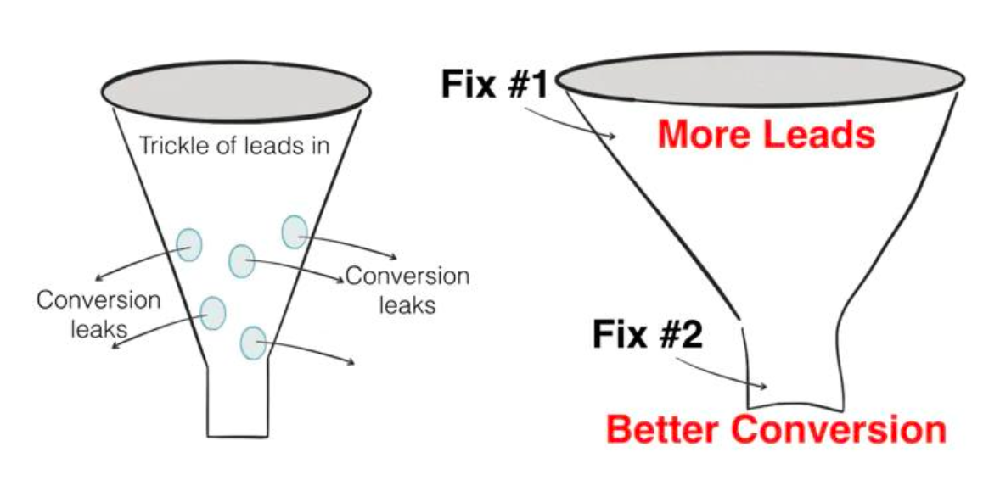

营销不只是把更多用户吸引进网站，还要提高转化率。如果用户进入漏斗后大量流失，那么广告带来的流量就被浪费了。因此营销有两个目标：

- Increasing the number of leads coming into the funnel

  增加进入漏斗的潜在客户数量

- Increasing the conversion rate of leads-to-buyers

  提高潜在客户转化为购买者的转化率

## Marketing

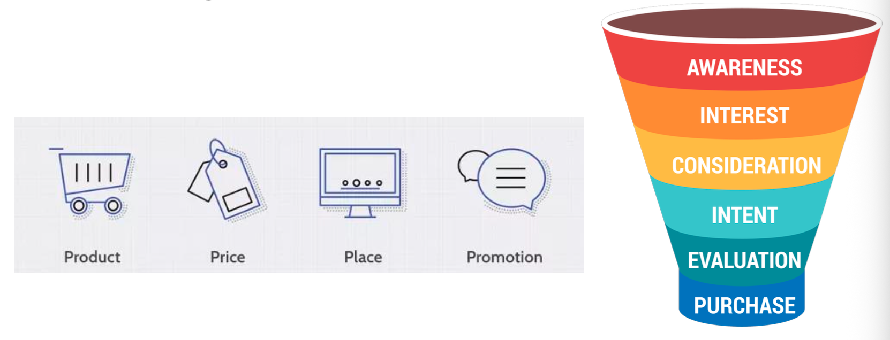

### Product and Prices

- **Product**

  Before they can prepare an appropriate campaign, marketers need to understand what product is being sold, how it stands out from its competitors, whether the product can also be paired with a secondary product, and whether there are substitute products in the market.

  在策划得当的营销活动之前，营销人员需明晰所售产品的属性、与竞品的差异化优势、是否可搭配辅助产品进行销售，以及市场中是否存在替代性产品。

- **Price**

  When establishing a price, companies must consider the unit cost price, marketing costs, and distribution expenses. Companies must also consider the price of competing products in the marketplace and whether their proposed price point is sufficient to represent a reasonable alternative for consumers.
  
  在确定价格时，企业必须考虑单位成本、营销成本和分销费用。同时还需考量市场上同类产品的定价，以及设定的价位是否能成为消费者的合理替代选择。

### Place

Place refers to the distribution of the product. Key considerations include whether the company will sell the product through a physical storefront, online, or through both distribution channels. When it's sold in a storefront, what kind of physical product placement does it get? When it's sold online, what kind of digital product placement does it get?

地点指的是产品的分销方式。关键考量因素包括：公司是否会通过实体店面、线上渠道或两者兼顾的方式进行销售？若在实体店销售，产品将获得怎样的货架陈列位置？若在线上销售，产品会获得怎样的数字展示位？

### Promption

**Promotion** It is the integrated marketing communications campaign. Promotion includes a variety of activities such as **advertising**, selling, sales promotions, public relations, direct marketing, sponsorship, and guerrilla marketing.

推广 即整合营销传播活动。推广包含多种活动，例如广告、销售、促销、公共关系、直效营销、赞助活动以及游击营销。

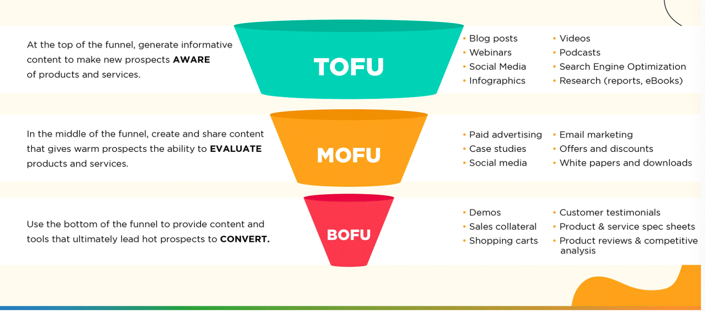

- TOFU（Top of Funnel）：目标是让新用户 aware，常见内容有 blog posts、webinars、social media、infographics、videos、podcasts、SEO、research reports。
- MOFU（Middle of Funnel）：目标是让用户 evaluate，常见内容有 paid advertising、case studies、social media、email marketing、offers and discounts、white papers and downloads。
- BOFU（Bottom of Funnel）：目标是让用户 convert，常见内容有 demos、sales collateral、shopping carts、customer testimonials、product and service spec sheets、product reviews and competitive analysis。

### Traffic Source

- **Search Engine** is an important source
  - A search engine is a software system that finds web pages that match a web search.

- **AI** is the new traffic source

## SEO and SEM

- **SEO stands for Search Engine Optimization.** This is part of your digital marketing strategy that focuses on driving traffic to your site organically.

  SEO 是搜索引擎优化的缩写。 您数字营销战略的一部分，侧重于通过自然方式为您的网站吸引流量。

- **SEM stands for Search Engine Marketing**. SEM refers to a set of digital marketing strategies that exist to drive traffic to your site. This is mainly accomplished through **optimizing paid ads**.

  SEM代表搜索引擎营销。SEM指的是一系列数字营销策略，旨在为您的网站引流，主要通过优化付费广告来实现。

### We need a Inverted Index for Inverted Search

为什么需要 inverted index？

如果我们知道书的类别，可以直接在图书馆分类中找。但是如果只记得一本书是红色封面，或者只记得一首歌中的几句歌词，却不知道标题，那么普通分类查找会很困难。搜索引擎面对的是用户输入的关键词，因此需要从“词 → 文档”的方向进行查找，这就是 inverted search，需要 inverted index 支持。

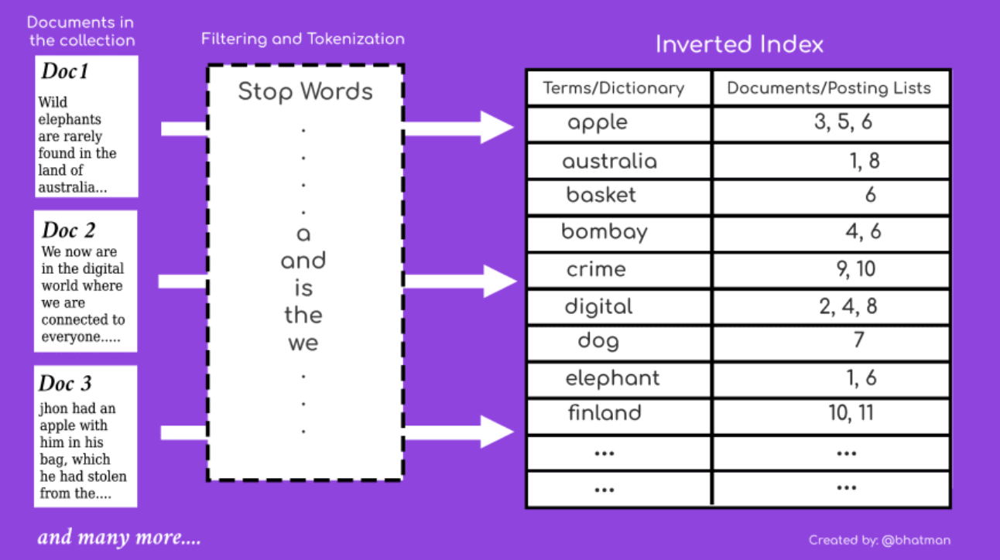

- 例如如果想要找一首歌，你可能只记得歌里面比较流行的歌词，但是不记得歌曲的名字。

### Contents vs. Index

- **Indexing** is a systematic arrangement to present a concise list to readers so that they may find specific topics are terms presented in a book and makes them more accessible. The terms are sorted alphabetically listing names, places, things, and page numbers, which provides related terms a cross- reference and is an integral part of a book.

  索引是一种系统化的编排方式，旨在为读者提供一份简洁的列表，以便他们能迅速找到书中特定主题或术语的对应内容，从而提升书籍的可查阅性。这些术语按字母顺序排列，罗列人名、地名、事物名称及对应的页码，并通过交叉引用关联相关术语，是书籍不可或缺的组成部分。

### BackRub – rank the page BackRub – 为网页排名

- Work on the BackRub search engine began in 1996.

  BackRub搜索引擎的开发工作始于1996年。

- This project had set itself the goal of developing technologies which could create a universal digital library.

- It was a research project of Larry Page, who studied at Stanford University at the time and was part of the team that worked on the Stanford Digital Library Project (SDLP).

- Larry have tried to be sold it to Yahoo for $1M ONLY!

### SE (Search Engine) means

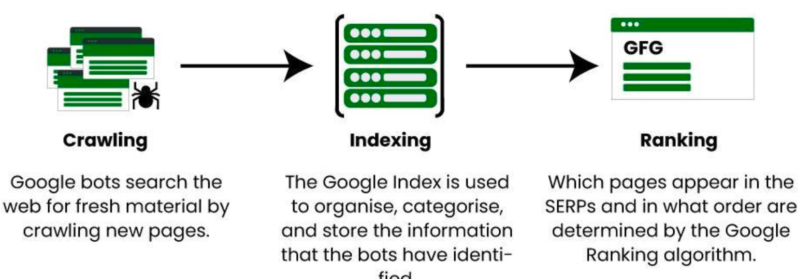

**Search Engine 的基本流程：**！！！

1. Crawling：搜索引擎爬虫抓取新的网页内容；
2. Indexing：将抓取到的网页内容整理、分类并存入索引；
3. Ranking：根据排名算法决定哪些页面显示在 SERP 中，以及它们的显示顺序。

### Revised index by terms 按条款修订的索引

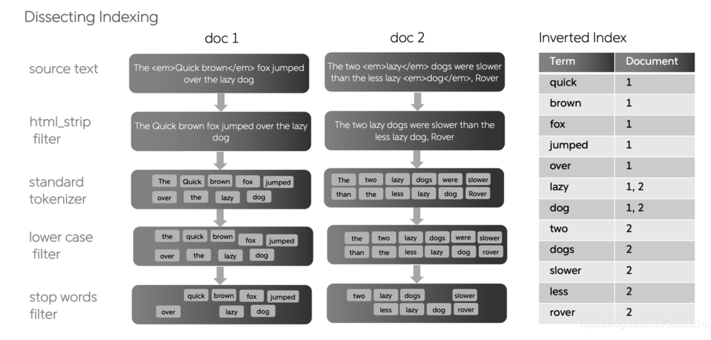

### Elastic Search

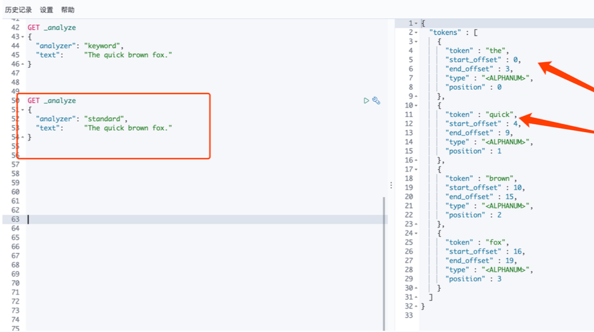

- Elasticsearch is a scalable data store and vector database that uses Apache Lucene to search, index, store, and analyze data of all shapes and sizes in near real time.

  Elasticsearch是一种可扩展的数据存储与向量数据库，利用Apache Lucene进行近实时搜索、索引、存储及分析各种形态与规模的数据。

### Many Algorithm for Ranking

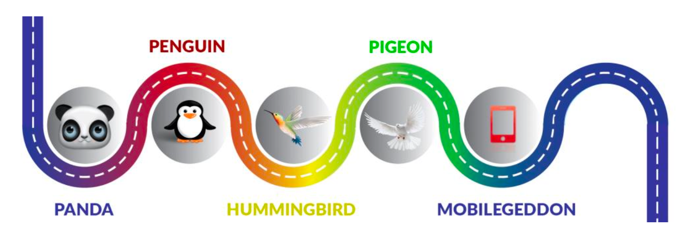

## Search Engine Optimization (SEO)

- Search engine generates a set of results with ranking for each search.

  搜索引擎为每次搜索生成一组带排序的结果。

- This result set is named organic list.

  该结果集合名为自然列表。

- Search Engine Optimization or SEO is the act of modifying a website to increase its ranking in organic (vs paid), crawler-based listings of search engines.

  搜索引擎优化（SEO）是指修改网站以提升其在搜索引擎自然（非付费）结果及基于爬虫的索引中的排名。

- The higher rank can bring you more web traffic.
  - Usually treaffic means 

- 搜索引擎会为每一次搜索生成一组带有排名的结果，这个自然搜索结果集合叫 organic list。SEO 的目标就是通过修改和优化网站，让网页在 organic list 中获得更高排名。

### Tips on SEO 针对搜索引擎优化的建议

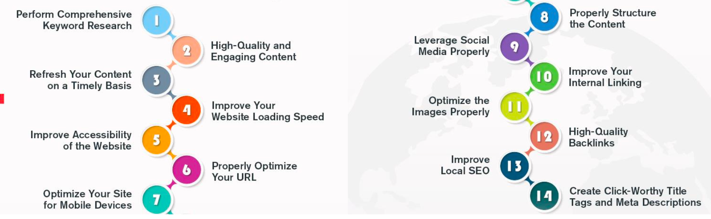

#### Tips for SEO - Keywords

The main purpose of performing keyword research is to find words or phrases that your potential clients or customers are searching for on Search Engine, some tips:

关键词研究要首先理解用户搜索意图：

1. Informational need：用户想获取信息；
2. Navigational need：用户想找到某个具体网站或页面；
3. Transactional need：用户已经有购买或行动意图。

理解搜索意图后，才能选择更适合的关键词和页面内容。

执行关键词研究的主要目的是找出潜在客户或用户在搜索引擎上搜索的字词或短语。以下是一些技巧：

- Determine the search volume and competitiveness level for each keyword.

  确定每个关键词的搜索量和竞争度级别。

- Include long-tail keywords organically in the blog.

  在博客中自然地融入长尾关键词。

- Understand the Customer's Purpose, like informational, navigational, and transactional needs of customers, to find the best ones.

  了解客户的意图，即了解信息类、导航类和交易类需求，以找到最佳客户。

- Find your competitors' keyword planning techniques, analyze them, and use the best ones based on their results. Tools like SEMrush or SpyFu can help you find effective keywords that are more helpful for ranking up.

  找出竞争对手的关键词规划技巧，分析并借鉴其中效果最佳的方案。借助 SEMrush 或 SpyFu 等工具，你能够找出对提升排名更为有益的有效关键词。

- Sort your selected keywords into suitable groups or themes.

  将选定的关键词归类到合适的组或主题中。

- Make sure to monitor your content and keywords continuously. You can use tools like Google Analytics and Search Console to monitor the performance of your content and keywords. Based on the analysis, you can make improvements to improve the SEO rankings further.

  务必持续监控你的内容和关键词。你可以利用Google Analytics和Search Console等工具来追踪内容与关键词的效果，并根据分析结果进行优化，以进一步提升SEO排名。

#### Tips for SEO - Contents

Content is always king for the the ranking. Without quality content, you can’t even think about ranking a website. Google’s Panda and Penguin notified that content could primarily affect your SEO strategy. Some tips:

内容是排名的王道。没有优质的内容，你甚至无法想象为一个网站获得靠前的排名。谷歌的熊猫和企鹅算法表明，内容会显著影响你的搜索引擎优化策略。以下是一些建议：

- Make sure to add all the relevant keywords in the content naturally.

  请确保在内容中自然地加入所有相关的关键词。

- Use high-quality images, infographics, videos, and animations to increase your content’s visual appeal and boost user interactions.

  使用高质量图片、信息图表、视频和动画来提升内容的视觉吸引力，增强用户互动。

- The content of your pages should be related to the keyword you are trying to rank for!

  你页面的内容需要与你想排名的关键词相关！

- Maintain the required keyword density to boost rankings,

  维持所需的关键词密度以提升排名

- Create eye-catching headings and sub-headings to reduce bounce rate.

  创建吸睛的标题和副标题，降低跳出率。

- Use short paragraphs, short sentences, bullet points, subheadings, and white space to increase readability and drive desired results.

  使用短段落、短句、要点标志、副标题和空白空间，以提高可读性并驱动理想效果。

- Include relevant internal links to other pages on your website and external links to boost the credibility of your content.

  在内容中加入相关内部链接（指向网站其他页面）和外部链接，以增强可信度。

- Ensure your content is flexible so it can be adjusted in every screen size.

  确保你的内容具有灵活性，以便在任何屏幕尺寸下进行调整。

#### Tips for SEO - Keep website fresh

You don’t want your users to click your content, but it probably bounces because your website has outdated content. Timely refreshing and updating the content is crucial.

您并不希望用户点击内容后离开，但很可能是因为网站内容过时导致跳出率偏高。及时刷新和更新内容至关重要。

Some tips:

- Update your website's statistics and data with the latest information.

  用最新信息更新你网站的统计数据与资料。

- Present fresh ideas, expands, or trends related to the topic.

  呈现与主题相关的新理念、延伸内容或流行趋势。

- Find new keywords that have gained popularity recently related to the topic.

  找到与主题相关且在最近期间内关注度攀升的新兴关键词。

- Add new images, graphics videos, or other multimedia elements to enhance visual impact.

  添加新的图像、图形视频或其他多媒体元素以增强视觉冲击力。

- Showcase the updated date, time, and day when you have updated the content to show the relevancy of the content.

  在您更新内容时，展示更新后的日期、时间和星期几，以体现相关时效性。

#### Tips for SEO - Instant Loading 即时加载

The slow speed of your website will also have a more significant impact on your rankings and on user experience. Some tips:

你的网站加载速度较慢会对排名和用户体验产生更大的影响。一些建议：

- Make sure to optimize your image to boost your website speed.

  确保优化图片以提升网站加载速度。

- Compress JavaScript and CSS files to increase the speed.

  压缩JavaScript和CSS文件以提高速度。

- Delete unnecessary render-blocking Scripts.

  删除不必要的阻塞渲染脚本。

- Implement lazy loading / dynamic loading.

  实现懒加载/动态加载。

- Upgrade the performance of servers to ensure rapid response times.

  升级服务器性能，确保快速响应时间。

- Optimize your website fonts and content.

  优化您的网站字体和内容。

- Make sure that your website is mobile-responsive and that it adapts quickly to multiple screen sizes and gadgets

  确保您的网站支持移动端自适应，并能快速适应多种屏幕尺寸和设备。

#### Tips for SEO – Accessibility for all users

Website accessibility fundamentally implies that the website should be primed to offer an enjoyable and engaging experience to all users, irrespective of whatever disability or limitation they might have. Some tips:

网站无障碍访问本质上意味着，网站应做好准备，为所有用户（无论其是否残疾或存在何种限制）提供愉悦且富有吸引力的体验。一些实用技巧：

- Use header tags in your text to help visually impaired users understand when they reach important points.

  在文本中使用标题标签，帮助视觉障碍用户掌握重要内容的节点位置。

- Make use of colors with strong contrast to make it easier for readers to differentiate text from background.

  使用强烈对比的颜色，让读者更容易区分文字和背景。

- Use a font size that is easily readable on different screens and devices.

  在不同屏幕和设备上使用易于阅读的字体大小。

- Make your website's keyboard accessible.

  让您的网站键盘可访问。

- Use photos with illustrative Alt text for improved accessibility.

  使用具有描述性替代文本（Alt text）的照片，以提升可访问性。

- Add a transcript or enable captions for videos and even content.

  为视频甚至一般内容添加文字稿或启用字幕功能。

#### Tips for SEO – Optimize URLs

Keeping URLs as transparently visible, pertinent, attractive, and updated as possible is vital to make it convenient for your users and search engines. Some tips:

使用户和搜索引擎能够尽可能便捷地查看与使用清晰可见、相关性强、有吸引力且持续更新的网址至关重要。以下提示可供参考：

- Make the URL focused on the page's fundamental topic.

  让 URL 集中体现页面的核心主题。

- Use short URLs that represent the website's concept.

  使用能代表网站概念的短链接。

- Design human-readable URLs that can give users an overview of website content.

  设计可读性强的URL，让用户一眼看懂网站内容结构。

- Add appropriate keywords in the URL that are related to the content.

  在URL中添加与内容相关的适当关键词。

- To separate the keywords in the URL, use hyphens (-).

  在URL中使用连字符（-）来分隔关键词。

- Avoid the use of underscore (_) or space because they can create issues in readability.

  避免使用下划线(_)或空格，因为它们会影响可读性。

- Compose your URLs properly by categorizing content with folders.

  通过使用文件夹对内容进行分类，正确构建你的URL。

#### Tips for SEO – Mobile first

The use of mobile phones and tablets has over pressed the PC in today's generation. Some tips:

如今这一代，手机和平板的使用已经逐渐超越了个人电脑（PC）。一些小建议：

- Your website design should be responsive to adapt to any screen size.

  您的网站设计应具备响应式功能，以适应各种屏幕尺寸。

- Use fonts that are properly visible and easy to read on mobile screens.

  在移动屏幕上，使用清晰易读的字体。

- Optimize loading speed.

  优化加载速度

- Make your content easy to read and navigate on small displays.

  让您的内容在小屏幕上易于阅读和导航。

- Use images with accurate sizes and can load instantly on all devices.

  使用尺寸精准且能在所有设备上即时加载的图片。

- Maintain enough space around buttons and links to avoid mistaken clicks.

  在按钮和链接周围保持足够的间距，避免误点击。

- Make your meta titles and descriptions as brief and exciting as possible.

  让你的元标题和描述尽可能简短而引人入胜。

#### Tips for SEO – Properly Structure the Content

A well-structured website not only improves user experience but also makes it easier for search engines to crawl and index your site. Some tips:

结构清晰的网站不仅能提升用户体验，还能让搜索引擎更轻松地抓取和索引您的网站。一些小贴士：

- Find the appropriate phrases and keywords your target audience may use to find your content.

  找到目标受众可能用来查找您内容的恰当短语和关键词。

- Use header tags (H1, H2, H3…) to create an organized structure for your content.

  使用标题标签（H1、H2、H3…）为你的内容创建有条理的结构。

- Create easy navigation URLs.

  创建简洁易用的导航网址。

- Write unique, valuable, and informative content with proper heading and sub-headings that answers your target audience's requirements and queries.

  撰写独特、有价值且内容丰富的文章，配合恰当的标题与副标题，以满足目标受众的需求与疑问。

- Use essential keywords where necessary to make it easily accessible.

  使用必要的关键词进行过渡，确保信息易于搜索和获取。

- Add internal links on your website so that search engines can recognize your website content easily.

  在网站上添加内部链接，以便搜索引擎轻松识别网站内容

#### Tips for SEO – Social Media

The resulting social signals, like likes, shares, and comments, can also indirectly enhance your SEO. Some tips:

由此产生的社交信号，如点赞、分享和评论，也能间接提升你的搜索引擎优化（SEO）。一些小贴士：

- Match keyword research with posting concepts.

  将关键词研究与发布概念相匹配。

- When a customer visits a social media profile, ensure that they get all the needed information about the company.

  当客户访问社交媒体主页时，请确保他们能获取有关公司的所有必要信息。

- Include all the sharing icons on your website and even blogs.

  在你的网站甚至博客中包含所有分享图标。

- Whenever content appears on your customer’s timeline, make sure they can share on social media in just one click.

  每当内容出现在客户的动态时间线上，确保他们能一键分享到社交媒体。

- Generate high-quality content to publish on social media platforms.

  生成高质量内容以发布在社交媒体平台上。

#### Tips for SEO – Internal Linking

Internal links also help search engines easily and quickly find, search, and understand all of the pages on the website. Some tips:

站内链接还有助于搜索引擎轻松、快速地发现、检索和理解网站上的所有页面。一些小提示：

- When creating internal links, use informative and appropriate anchor text.

  创建内部链接时，应使用信息明确且合适的锚文字。

- Use all the relevant internal links to the content.

  使用所有相关内容的内部链接。

- Do keyword research to figure out the most important and best keywords for all the pages of your website.

  进行关键词研究，找出网站所有页面最重要、最优质的关键词。

- Important pages should be easy to find and should be linked from the top navigation menu or footer.

  重要页面应易于查找，并应从顶部导航菜单或页脚链接。

- Your website should be deep linking, which means links are not only mentioned on the homepage but also on internal pages.

  你的网站应当设置深度链接，即不仅应在首页提及链接，还应在内部页面进行链接。

- Check your website for broken or outdated links regularly.

  定期检查网站是否有损坏或过时的链接。

- Use breadcrumb navigation.

  使用面包屑导航。

- Determine your website's most important pages and prioritize linking to them more regularly.

  确定网站中最关键的页面，并优先将其设为常规链接目标。

#### Tips for SEO – Optimize the Images

Optimized images require less storage space on the system, enabling the website to load rapidly while offering an interactive customer experience. Some tips:

优化后的图片占用更少的系统存储空间，使网站能够快速加载，同时提供互动式的客户体验。一些小贴士：

- Avoid using large images. Reduce your image sizes without sacrificing quality.

  避免使用大尺寸图片。在不影响画质的前提下，压缩图片体积。

- Use a suitable format for images like JPEG, PNG, and WebP.

  使用适合的图片格式，如JPEG、PNG和WebP。

- Apply relevant alt text for images.

  为图片添加相关替代文本。

- Provide captions and titles to provide additional information and keywords.

  提供字幕和标题，以增加额外信息和关键词。

- Images should be responsive and should appear appropriate on various screen sizes.

  图片应当具备响应式特性，并能在不同屏幕尺寸下呈现合适的效果。

- Add a few relevant images, but don't add too many images.

  添加几张相关的图片，但不要太多。

#### Tips for SEO – High-Quality Backlinks

Backlinks are your website links that are listed on another website, it works like an reference letter. Some tips:

反向链接是指你的网站链接被列在其他网站上，它像一封推荐信一样起作用。一些建议：

- To attract high-quality backlinks, focus on creating engaging and valuable content that other websites will find worthy of linking to. It includes blog posts, articles, infographics, videos, or any other type of material that provides value to your target audience.

  要吸引高质量的站外链接，重点在于创作其他网站认为值得引用的、既吸引人又有价值的内容。这些内容可以是博客文章、专题报道、信息图、视频，或是任何能为目标受众提供价值的材料。

- Start publishing press releases through reputable distribution companies for important announcements, events, or successes linked to your business.

  通过信誉良好的发行公司开始发布新闻稿，用于重要的公告、活动或与贵企业相关的成就。

#### Tips for SEO – Location based results

Some information are very related to the location, for example: restaurants. Some tips:

有些信息与地点密切相关，例如：餐厅。一些小贴士：

- Implement location-specific pages for your website.

  为您的网站实现特定位置页面。

- Get high-quality backlinks from local websites, blogs, and directories.

  从本地网站、博客和目录获取高质量的反向链接。

- Keep an active presence on social media channels and engage with local customers.

  在社交媒体渠道保持活跃发布，并与本地客户积极互动。 

- Include location-specific information throughout your website, including titles, headings, and content.

  在整个网站中融入特定位置的信息，包括标题、各级标题和内容。

- Apply schema markup on your website to help search engines learn about your company's location, contact information, and other relevant details.

  在你的网站上应用结构化数据标记，帮助搜索引擎了解你公司的位置、联系信息及其他相关详细信息。

- Add Guest posts on local blogs or websites.

  在本地博客或网站上添加客座文章。

#### Tips for SEO – Location based results
有些搜索结果和地理位置强相关，例如 restaurants。优化方法包括：

1. 为不同地区建立 location-specific pages；
2. 从本地网站、博客、目录获得 high-quality backlinks；
3. 在 social media 上保持活跃，并和本地客户互动；
4. 在 titles、headings 和 content 中加入 location-specific information；
5. 使用 schema markup 帮助搜索引擎理解公司位置、联系方式等信息；
6. 在本地博客或网站发布 guest posts。

#### Tips for SEO – Title Tags and Meta Descriptions 标题标签与Meta描述

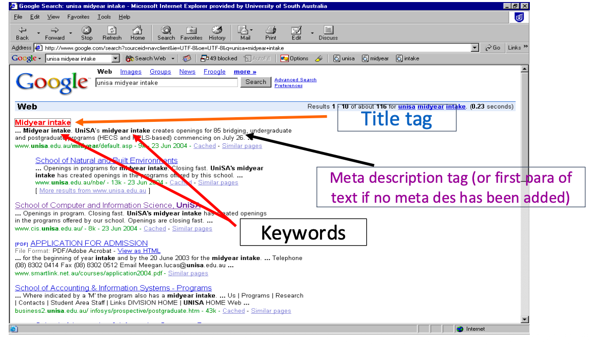

Meta title and description help Google and users to understand the content of a specific webpage. Writing the useful meta title and meta descriptions can dramatically boost click- through rates from SERPs. It will help you to drive more traffic from Google and generate more sales. Some tips:

元标题和描述能够帮助谷歌及用户理解特定网页的内容。撰写出有价值的元标题与元描述可以显著提升搜索结果的点击率，有利于从谷歌获取更多流量并促成更多订单。几点建议：

- Your website's Title Tags and Meta Descriptions should be attractive and unique as compared to other websites in your industry.

  您网站的标题标签和元描述应区别于同行业其他网站，具备吸引力与独特性。

- Title Tags' length should be 50 to 60 characters, and meta description’s length should be around 160 characters.

  标题标签的长度应控制在50到60个字符之间，元描述的长度应保持在160个字符左右。

- Title Tags and Meta Descriptions should match search intent.

  标题标签和元描述应与搜索意图匹配。

- Add targeted keywords in the Title Tags and Meta Descriptions.

  在标题标签和元描述中添加针对性关键词。

- 有关标题和介绍的文字长度建议
  - Title Tag：50–60 characters
  - Meta Description：around 160 characters

#### SEO - Multi-factors driving

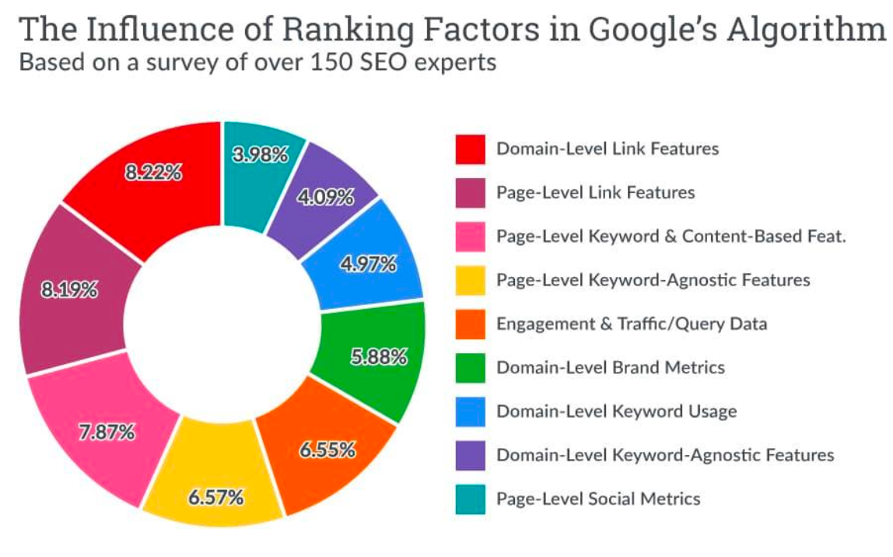

#### SEO - what is NOT recommended

- **Flash and shockwave** (actually not used in HTML5)- spiders do not pick up these file

  Flash 与 Shockwave（实际上在 HTML5 中已不再使用）**爬虫不会抓取这些文件**

- **Image only sites** - spiders do not pick up images

  Image-only sites：搜索引擎 spider 不能直接读取图片内容；

- **Image site maps** - spiders cannot read image maps. Do not use them on your home page or critical pages

  Image site maps：spiders 不能读取 image maps；

- **Frames** - only one page can be titled (titling is critical in search rankings)

  - If the spider cannot read the complete page (because of the frames), it will not be indexed properly.
  - Some spiders may not even read a frames web site
  - Frames：只有一个页面可以被 title，而且 spider 可能不能完整读取页面，导致索引不正确；

- **Misspellings, JavaScript or HTML errors** (validate your code)

  Misspellings、JavaScript errors、HTML errors：需要检查你的代码是否正确。

### SEM

- What is search engine marketing (SEM)?
  - SEM is the act of marketing a website via search engines by purchasing paid listings

    SEM是指通过搜索引擎购买付费列表来推广网站的行为。
  
- What are paid listings?
  
  什么是付费列表？
  
  - These are listings that search engines sell to advertisers, usually through paid placementor paid inclusionprograms. In contrast, organic listings are not sold.
  
    这些是搜索引擎出售给广告商的列表，通常通过付费排名或付费收录计划实现。相比之下，自然搜索结果列表是不出售的。

1. Paid inclusions 付费包含

   - Advertising programs where pages are guaranteed to be included in a search engine‘s index in exchange for payment

     付费保证页面被搜索引擎收录的广告计划

   - no guaranteed ranking

     无法保证排名

   - payment made on a Cost Per Click(CPC) basis

     按每次点击成本(CPC)支付的款项◦

   - Advertisers pay to be included in the directory on a CPC basis or per-url fee basis with no guarantee of specific placement

     广告主按照每次点击费用或每条网址费用支付费用以被列入目录，不保证具体的排名位置。

2. Paid placements 付费推广位

   - Advertising programs where listings are guaranteed to appear in organic listings

     保证在自然搜索结果中显示的广告计划。

   - the higher the fee, the higher the ranking

     费用越高，排名越高

   - eg sponsored links and Google’s Ad words
   
     例如赞助商链接，以及带有广告关键字的链接
   
   - can be purchased from a portal or a search network
   
     可从门户网站或搜索网络购买
   
   - search networks are often set up in an auction environment where keywords and phrases are associated with a cost-per-click (CPC) fee.
   
     在广告拍卖环境中，搜索网络通常采用按点击付费（CPC）机制，关键词和短语与单次点击费用挂钩。

### Marketing is not only traffic

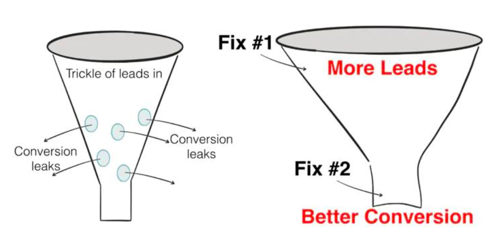

- Increasing the number of leads coming into the funnel and

  增加进入漏斗的潜在客户数量

- Increasing the conversion rate of leads-to-buyers

  提高潜在客户到购买者的转化率。

#### Do not waste the traffic

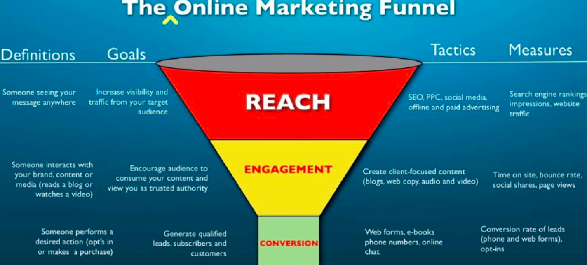

### Metric for web traffic 衡量网站流量的指标

-  For pc web

  - User

  - Session

  - PV (page view)

  - UV (unique Pageview)

- For mobile app

  - DAU: daily active user

  - WAU: weekly active user

  - MAU: monthly active user

### Metric for SEO 

- The SEO checker can check your site’s SEO score based on different factors.

  SEO检查器可以根据不同因素检查您网站的SEO评分。

- To use it, simply plug in your domain and click the button.

  要使用它，只需插入您的域并单击按钮。

- The engine will scan your entire website, give you a score based on your performance and offer you personalized tips on how to improve your website for search traffic.

  该引擎将扫描您的整个网站，根据您的表现给您一个分数，并为您提供个性化的提示，如何提高您的网站的搜索流量。

### Metric for engagement 

**Bouncing rate** is the percentage of visitors that left the site after viewing only one page.

跳出率是仅浏览一个页面后就离开网站的访客所占的百分比。

You should know the average bouncing rate for your segment.

你应该了解你所在细分领域的平均跳出率。

### Metric for conversion

**Abandoned carts** means you engage your customers, they come, pick goods and… something distracts them or they just change their minds or wait for a coupon – a ton of reasons.

**弃购购物车**指的是您吸引了顾客，他们前来选购商品，却被某些事情打扰、或是改变了主意、或是在等待优惠券等——原因五花八门。

### Metric for overall

- Put simply, **return-on-investment (ROI)** is the ratio between the money you’ve made (profits) and the money you’ve spent (costs).

  简单来说，**投资回报率**就是你赚到的钱（利润）与花出去的钱（成本）之间的比率。

- There are many different models. You may refer to the post: 7 Popular Marketing ROI Formulas

### Metric of GMV

- GMV : **Gross Merchandise Value** is a metric that measures your total value of sales over a certain period of time.

  GMV（商品交易总额）：这是一项用于衡量特定时期内总销售额的指标。

- GMV=**sales + cancel order + reject order + return order**

  GMV= 销售额+取消订单+拒绝订单+退货订单 

### GMV vs. Net sales

Many terms for different point of view:

许多术语代表不同的观点：

1. CAC (Customer Acquisition Cost) - 获客成本

   **定义：** 获取一名新客户平均需要投入的营销费用。

   - **公式：** $CAC = \frac{\text{Marketing Total Spend}}{\text{Number of New Customers Acquired}}$

   - **理解：** 如果你花了 1000 元广告费，带来了 10 个新客人，你的 CAC 就是 100 元。

2. LTV (Lifetime Value) - 用户终身价值

   **定义：** 一个客户在其整个生命周期内，预计能为你的公司创造的总利润。

   - **核心逻辑：** 它不是看单次购买，而是看长期。例如，你用 100 元获客（CAC），如果这个客户每年在你这里花 50 元并持续 5 年，LTV 就是 250 元。

   - **黄金法则：** 在健康的商业模式中，**LTV 应大于 3 倍的 CAC**。

3. GMV vs. NMV (Gross/Net Merchandise Value) - 交易额

   - **GMV (Gross Merchandise Value)：** 只要用户下了单就算，包含取消的订单、退货的订单以及运费。它代表了平台的流水规模。

   - **NMV (Net Merchandise Value)：** 扣除退货、折扣和取消后的**净交易额**。这才是公司真正“落袋”的营业额。

4. Churn Rate - 流失率

   **定义：** 在特定时间内停止使用你产品或服务的客户百分比。

   - **公式：** $Churn Rate = \frac{\text{Lost Customers during period}}{\text{Total Customers at start of period}}$

   - **理解：** 流失率是漏斗底部的“漏洞”。如果流失率过高，说明产品粘性差，你获客再多也只是在给一个漏水的桶加水。

5. Conversion Rate - 转化率

   **定义：** 访问者中最终完成目标动作（如购买、注册）的比例。

   - **公式：** $Conversion Rate = \frac{\text{Total Conversions}}{\text{Total Visitors}}$

   - **理解：** 这是衡量营销漏斗每一层效率的关键。1% 的转化率和 2% 的转化率，意味着同样的广告费，收益翻倍。

6. Average Order Value (AOV) - 平均订单价

   **定义：** 客户每次下单的平均金额。

   - **公式：** $AOV = \frac{\text{Total Revenue}}{\text{Number of Orders}}$

   - **策略：** 通过“满减”、“凑单免邮”等手段，目的就是为了拉高这个指标。

### How deep can you search

- You can simply say NO to web spiders to keep your web not be indexed by search engine.

  你可以简单地对网络爬虫说“不”，从而让你的网页不被搜索引擎索引。

- Actually, most web resources are not covered by Search Engine.

  实际上，多数网络资源并不在搜索引擎的覆盖范围内。

### Robots.txt

- Use the robots.txt file to restrict search engine crawlers from indexing.
- It is not a technology to against the crawlers but an declaration.
- Ignoring it violates ethical norms and maybe the laws.
- Aggressive scraping can overwhelm servers, causing service degradation.

- Unauthorized commercial scraping may also breach terms of service and intellectual property rights.

# 潜在考试题与参考答案

## Question 1：What are the three stages of a marketing funnel?

**Answer：**
 The three stages are Awareness, Consideration and Conversion. Awareness aims to make new audiences know the brand, and its main metrics are impressions and reach. Consideration aims to make customers compare the brand with competitors, and its metrics include website clicks and click-through rate. Conversion aims to encourage users to take actions, such as buying or registering, and its metrics include total conversions, cost per conversion and ROI.

------

## Question 2：What is the difference between marketing and advertisement?

**Answer：**
 Marketing focuses on building brand value and connecting the company with the right target market. Advertisement is only one part of marketing. It focuses more on influencing or persuading customers to purchase a product or service. So advertising can increase awareness quickly, but marketing also includes product, price, place, promotion and conversion improvement.

------

## Question 3：Why does the lecture say “Leaking is a waste”?

**Answer：**
 It means that traffic is wasted if many users enter the marketing funnel but leave before conversion. Advertisement may bring more leads, but if the conversion rate is low, the business still cannot get good results. Therefore, marketing should not only increase traffic, but also reduce leaks and improve the conversion rate from leads to buyers.

------

## Question 4：Explain the 4P model in marketing.

**Answer：**
 The 4P model includes **Product, Price, Place and Promotion**. Product means understanding what is sold, how it differs from competitors and whether there are substitute products. Price means setting a price based on cost, marketing cost, distribution cost and competitors’ prices. Place means deciding the distribution channel, such as offline, online or both. Promotion means integrated marketing communication, including advertising, sales promotion, public relations, direct marketing, sponsorship and guerrilla marketing.

------

## Question 5：What is SEO?

**Answer：**
 SEO stands for Search Engine Optimization. It is a part of digital marketing that focuses on driving traffic to a website organically. More specifically, SEO modifies and improves a website so that it can rank higher in organic, crawler-based search engine results. A higher ranking can bring more web traffic without directly buying paid listings.

------

## Question 6：What is SEM?

**Answer：**
 SEM stands for Search Engine Marketing. It means marketing a website through search engines by purchasing paid listings. SEM mainly drives traffic by optimizing paid ads. Compared with SEO, SEM can bring traffic faster, but it requires payment. Common SEM forms include paid inclusions and paid placements.

------

## Question 7：What is the difference between SEO and SEM?

**Answer：**
 SEO focuses on organic traffic. It improves the website’s ranking in natural search results by optimizing content, keywords, website structure and user experience. SEM focuses on paid traffic. It uses paid listings, paid inclusions or paid placements to make the website appear in search results. SEO is usually slower but more long-term, while SEM is faster but depends on continuous advertising spending.

------

## Question 8：What is a search engine?

**Answer：**
 A search engine is a software system that finds web pages matching a web search. It helps users find relevant web pages based on the keywords they enter. Search engines usually work through crawling, indexing and ranking.

------

## Question 9：Why do search engines need an inverted index?

**Answer：**
 Search engines need an inverted index because users usually search by keywords, not by document names. A normal index may store “document to words”, but an inverted index stores “word to documents”. For example, if the word “SEO” appears in page 1, page 3 and page 5, the inverted index records “SEO → page 1, page 3, page 5”. This allows the search engine to quickly find relevant pages.

------

## Question 10：Explain crawling, indexing and ranking.

**Answer：**
 Crawling means search engine bots discover and collect web pages. Indexing means the search engine organizes, categorizes and stores the information found by bots. Ranking means the search engine uses algorithms to decide which pages should appear in the search results and in what order. These three steps are the basic workflow of a search engine.

------

## Question 11：What is an organic list?

**Answer：**
 An organic list is the natural result set generated by a search engine for a search query. These results are ranked by the search engine algorithm, not directly bought by advertisers. SEO aims to improve a website’s ranking in this organic list.

------

## Question 12：What are some SEO keyword tips?

**Answer：**
 SEO keyword tips include finding the search volume and competitiveness of each keyword, using long-tail keywords naturally, understanding customer purposes such as informational, navigational and transactional needs, analyzing competitors’ keyword strategies, grouping selected keywords into themes, and continuously monitoring keyword performance with tools like Google Analytics and Search Console.

------

## Question 13：Why is content important for SEO?

**Answer：**
 Content is important because content is always king for ranking. Without high-quality content, a website is unlikely to rank well. Good content should include relevant keywords naturally, match the target keyword, use attractive headings and subheadings, improve readability, and provide real value to the target audience.

------

## Question 14：What are title tags and meta descriptions used for in SEO?

**Answer：**
 Title tags and meta descriptions help search engines and users understand the content of a webpage. Good title tags and meta descriptions can increase click-through rates from SERPs and bring more traffic. Title tags should usually be 50 to 60 characters, and meta descriptions should be around 160 characters. They should also match search intent and include targeted keywords.

------

## Question 15：What SEO practices are not recommended?

**Answer：**
 Not recommended SEO practices include using Flash or Shockwave, building image-only websites, using image site maps, using frames on important pages, and having misspellings, JavaScript errors or HTML errors. These problems make it harder for search engine spiders to read, index and rank the website correctly.

------

## Question 16：What is paid inclusion in SEM?

**Answer：**
 Paid inclusion is an advertising program where pages are guaranteed to be included in a search engine’s index in exchange for payment. However, it does not guarantee ranking. Payment may be made on a CPC basis or per-url fee basis.

------

## Question 17：What is paid placement in SEM?

**Answer：**
 Paid placement is an advertising program where paid listings are guaranteed to appear in search results. Usually, the higher the fee, the higher the ranking. Examples include sponsored links and Google AdWords. Search networks often use an auction model where keywords are associated with CPC fees.

------

## Question 18：What are common web traffic metrics?

**Answer：**
 For PC web, common traffic metrics include User, Session, PV and UV. PV means page view, and UV means unique pageview. For mobile apps, common metrics include DAU, WAU and MAU, which mean daily active users, weekly active users and monthly active users.

------

## Question 19：What is bounce rate?

**Answer：**
 Bounce rate is the percentage of visitors who leave the website after viewing only one page. A high bounce rate may mean that users are not interested, the page does not match their search intent, or the user experience is poor.

------

## Question 20：What are ROI and GMV?

**Answer：**
 ROI means return on investment. It is the ratio between profits and costs, so it measures whether the marketing spending is worthwhile. GMV means Gross Merchandise Value. It measures the total value of sales over a certain period of time.