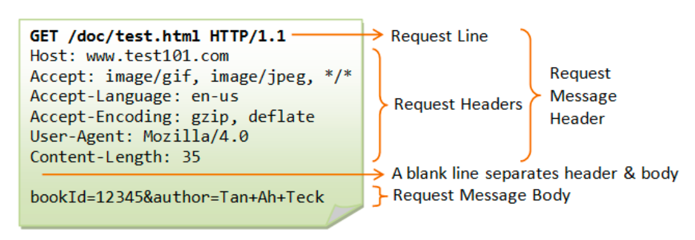
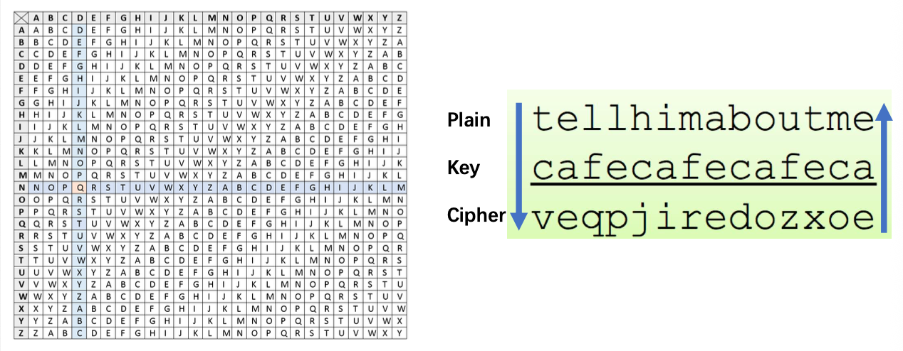
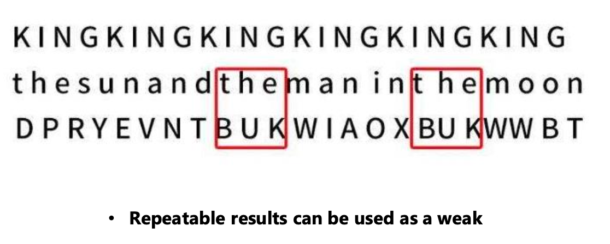
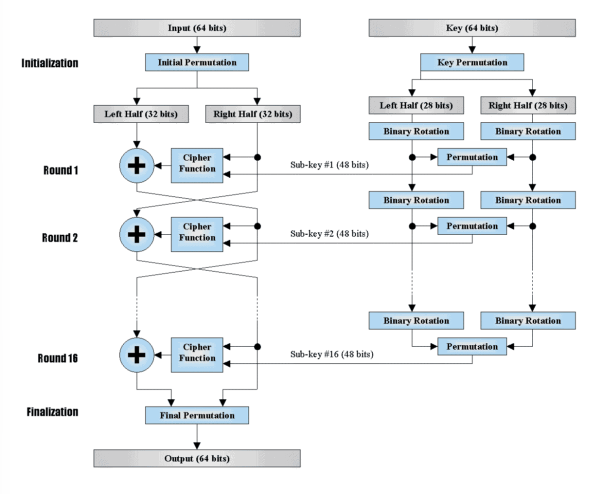
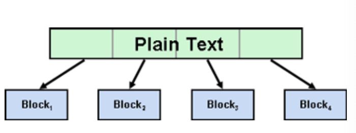
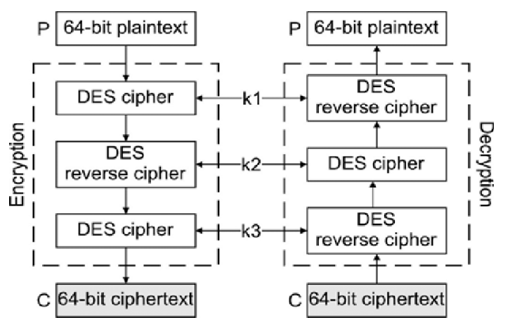
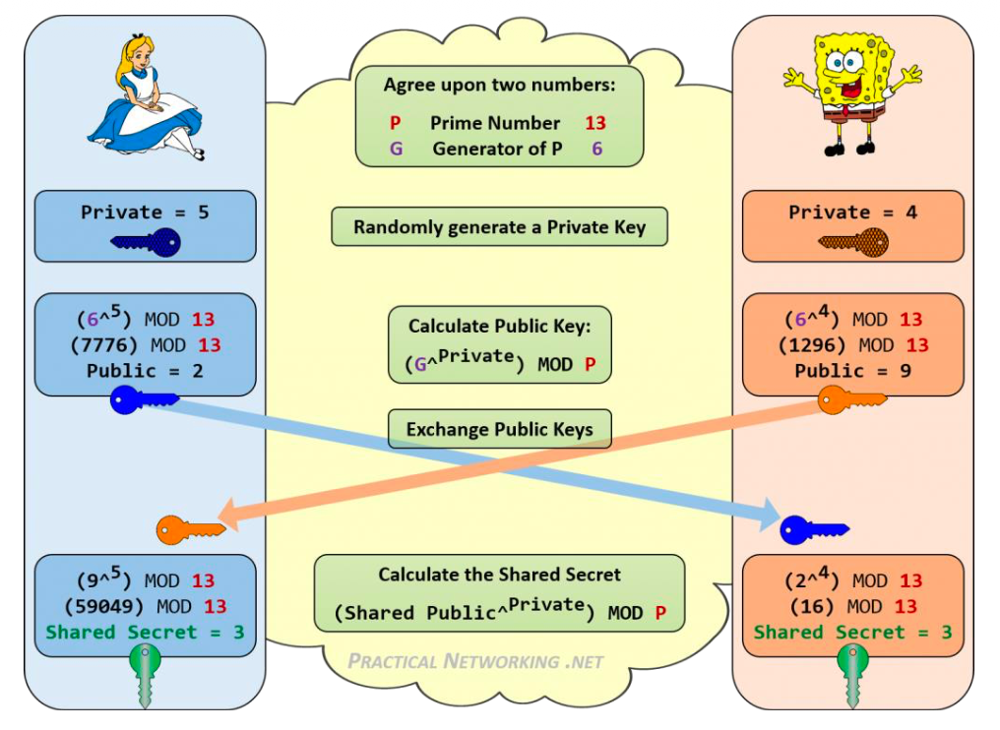
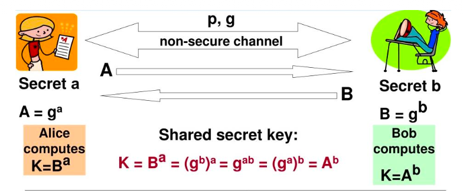

# 8 Introduction to Cryptography 介绍加密

## 知识图谱

```plaintext
Lec08 Introduction to Cryptography
├── 1. 为什么需要密码学
│ ├── 典型网络攻击 Typical Cyber Attacks
│ │ ├── SQL Injection
│ │ ├── Business Email Compromise
│ │ ├── Cross Site Scripting，XSS
│ │ ├── Zero-Day Exploit
│ │ ├── Malware
│ │ ├── Phishing
│ │ ├── Man in the Middle Attack
│ │ └── DoS / DDoS
│ ├── HTTP 的核心问题
│ │ ├── HTTP 本身没有加密功能
│ │ ├── HTTP request / response 中的信息是明文
│ │ ├── TCP/IP packets 会经过多个中间节点
│ │ ├── 每个中间节点理论上都可能看到原始报文
│ │ └── 所以 HTTP protocol itself 是一个重要 vulnerability
│ ├── Encryption with a Key
│ │ ├── 通常算法本身可以公开
│ │ ├── 真正需要保密的是 key / secret
│ │ └── 没有 key，就无法从 ciphertext 解密出 plaintext
│ └── HTTPS
│ ├── HTTPS 可以理解为给 HTTP “加锁”
│ ├── 通过 TLS Record Layer Protocol 保护 HTTP
│ ├── 目标是避免中间节点直接读取明文内容
│ └── 对现代 e-commerce 非常关键，因为交易、支付、账户信息都需要保护
│
├── 2. Cryptography 的主要组成
│ ├── Encryption / Decryption
│ ├── Hash Function
│ ├── Key Exchange
│ └── Digital Signature
│
├── 3. 通信模型：Bob, Alice and Eve
│ ├── Alice 和 Bob 是通信双方
│ ├── Eve 是窃听者 / 攻击者
│ ├── Eve 想知道 secret
│ └── 密码学的目标是让 Alice 和 Bob 能在 Eve 存在的情况下安全通信
│
├── 4. 古典加密 Ancient Encryption / Decryption
│ ├── Scytale Cipher
│ │ ├── 古希腊斯巴达人使用
│ │ ├── 把皮革条缠绕在木棍上写信息
│ │ ├── 解开后文字顺序混乱
│ │ └── 只有相同直径的木棍才能重新读出内容
│ ├── Dialect as Cipher
│ │ ├── 方言也可以作为一种“密码”
│ │ ├── 不是数学加密，但对不了解方言的人来说难以理解
│ │ └── 课件用 Wind Talkers 作为例子
│ └── 破解古典加密
│ ├── 可以通过尝试不同 key
│ ├── 可以通过频率分析
│ └── 如果结果具有重复性，就可能被攻击者利用
│
├── 5. Caesar Cipher
│ ├── 基本思想
│ │ ├── 字母按照固定偏移量 k 移动
│ │ ├── 明文字母 x 加密后变成 x+k
│ │ └── 使用 mod 26 保证仍在 26 个字母范围内
│ ├── 加密公式
│ │ └── E(x) = (x + k) mod 26
│ ├── 解密公式
│ │ └── D(x) = (x - k) mod 26
│ └── 缺点
│ ├── key 空间非常小
│ ├── 可以暴力尝试所有 k
│ └── 可以通过字母频率分析破解
│
├── 6. Vigenère Cipher
│ ├── 基本思想
│ │ ├── 使用 key 字符串进行多字母替换
│ │ ├── 每个明文字母根据对应 key 字母移动不同距离
│ │ └── 通过 Vigenère table 查找密文
│ ├── 优点
│ │ ├── 比 Caesar Cipher 更复杂
│ │ └── 不再只是单一固定偏移
│ ├── 破解方式
│ │ ├── 如果 key 重复使用，密文中会出现 repeatable results
│ │ ├── 攻击者可以通过重复模式推测 key 长度
│ │ └── 再结合频率分析推测明文
│ └── 多轮 Vigenère
│ ├── 可以增强复杂度
│ ├── 加密和解密时间更长
│ └── 多个 key 很难管理
│
├── 7. Enigma Machine
│ ├── 使用 rotating wheels / vector of wheels
│ ├── 自动生成大量 key
│ ├── 目的是提高加密复杂度
│ └── 课件强调 security is always “the code”
│
├── 8. DES：Data Encryption Standard
│ ├── 背景
│ │ ├── 20 世纪 70 年代 IBM 客户需要数据加密
│ │ ├── Horst Feistel 领导 crypto group
│ │ ├── IBM 设计 Lucifer cipher
│ │ └── 1973 年 NBS/NIST 征集国家标准级 block cipher
│ ├── DES 架构
│ │ ├── DES 是一种 block cipher
│ │ ├── 输入数据块为 64 bits
│ │ ├── 输出数据块为 64 bits
│ │ ├── 包含 Initial Permutation
│ │ ├── 包含 Final Permutation
│ │ ├── 核心是 16 rounds
│ │ ├── 每轮使用 48-bit sub-key
│ │ └── 采用 Feistel structure，将数据分为 left half 和 right half
│ ├── Block Cipher
│ │ ├── 实际数据通常比 key 更长
│ │ ├── 数据需要切成固定大小的 blocks
│ │ └── 每个 block 按照加密算法处理
│ ├── Block Cipher Modes
│ │ ├── ECB 是最简单的模式
│ │ ├── ECB 有时不够安全
│ │ ├── 其他模式包括 CBC、PCBC、CFB、OFB、CTR
│ │ └── 不同 mode 没有绝对好坏，要看 application
│ ├── DES 的安全问题
│ │ ├── 可以通过 brute force 尝试所有 key
│ │ ├── 现代计算能力下 DES 已经不安全
│ │ └── 主要问题是有效 key length 太短
│ └── DES 的替代
│ ├── 3DES
│ │ ├── DES 过渡方案
│ │ ├── 执行三次 DES
│ │ ├── 常见流程：Encrypt → Decrypt → Encrypt
│ │ ├── 使用 k1、k2、k3
│ │ └── 提高安全性但效率不如 AES
│ └── AES
│ ├── Advanced Encryption Standard
│ ├── NIST 选择 Rijndael 作为 AES
│ ├── 支持 128 / 192 / 256-bit key
│ └── 成为 DES 的主要替代者
│
├── 9. 对称加密 Symmetric Encryption
│ ├── 加密和解密使用同一个 key
│ ├── 优点
│ │ ├── 速度快
│ │ ├── 适合大量数据加密
│ │ └── 相同 key length 下通常比非对称加密更难暴力破解
│ ├── 缺点
│ │ └── Alice 和 Bob 如何安全共享 key 是最大问题
│ └── 代表算法
│ ├── DES
│ ├── 3DES
│ └── AES
│
├── 10. RSA：非对称加密
│ ├── 背景
│ │ ├── Rivest、Shamir、Adleman 在 1977 年提出
│ │ └── 是典型 asymmetric algorithm
│ ├── 密钥结构
│ │ ├── Public Key 可以公开
│ │ ├── Private Key 必须保密
│ │ └── 公钥和私钥成对出现
│ ├── 数学基础
│ │ ├── 大数分解困难性
│ │ ├── 指数运算 ^
│ │ ├── 取模运算 %
│ │ ├── Euler’s totient function
│ │ └── Fermat’s little theorem
│ ├── RSA 加密应用：Process C
│ │ ├── 其他人用 receiver 的 public key 加密
│ │ ├── 只有 receiver 用 private key 解密
│ │ └── 用于保护机密性
│ ├── RSA 数字签名应用：Process S
│ │ ├── 发送者用 private key 生成 signature
│ │ ├── 接收者用发送者 public key 验证
│ │ └── 用于证明消息确实来自发送者，并且没有被篡改
│ ├── RSA 破解
│ │ ├── 如果 N 可以被分解成两个大质数，private key 就可能被推导
│ │ ├── 数字越大，分解越困难
│ │ ├── 1024-bit 已经不够安全
│ │ ├── 至少需要 2048-bit
│ │ └── Quantum computing 会对 RSA 造成严重威胁
│ └── RSA 的性能问题
│ ├── 计算量大
│ ├── CPU 开销重
│ └── 不适合直接加密大量数据
│
├── 11. Diffie-Hellman Key Exchange
│ ├── 目标
│ │ ├── 在不安全信道中协商 shared secret key
│ │ ├── 不直接传递 secret key
│ │ └── 解决对称加密 key sharing 问题
│ ├── 公开参数
│ │ ├── p：prime number
│ │ └── g：primitive root of p
│ ├── 私钥
│ │ ├── Alice 选择 private key a
│ │ └── Bob 选择 private key b
│ ├── 公钥交换
│ │ ├── Alice 计算 A = gᵃ mod p
│ │ ├── Bob 计算 B = gᵇ mod p
│ │ └── 双方交换 A 和 B
│ ├── Session Key
│ │ ├── Alice 计算 Bᵃ mod p
│ │ ├── Bob 计算 Aᵇ mod p
│ │ └── 两者结果相同：gᵃᵇ mod p
│ └── 破解难点
│ ├── Eve 可以看到 p、g、A、B
│ ├── 但难以反推出 a 或 b
│ └── 本质难点是离散对数问题
│
├── 12. Hash Function
│ ├── 定义
│ │ ├── Hash 也叫 Message Digest
│ │ ├── 将任意长度输入转化为固定长度输出
│ │ └── 输出结果称为 hash value / digest
│ ├── 主要特性
│ │ ├── Fixed length output
│ │ ├── One-way / irreversible
│ │ ├── Avalanche effect
│ │ ├── Collision resistance
│ │ └── 输入极小变化会导致输出巨大变化
│ ├── 常见算法
│ │ ├── MD5：128-bit digest
│ │ ├── SHA1
│ │ ├── SHA256
│ │ ├── SHA384
│ │ ├── SHA512
│ │ └── CRC32
│ ├── 应用 1：Integrity Check
│ │ ├── 发布者给出文件 hash
│ │ ├── 用户下载后重新计算 hash
│ │ ├── 两者一致说明文件没有被修改
│ │ └── 两者不同说明文件可能被篡改或损坏
│ └── 应用 2：Digital Signature
│ ├── 不直接签名全文
│ ├── 先对 message 做 hash
│ ├── 用 private key 对 hash 进行签名
│ └── 验证时重新计算 hash 并和签名解出的 hash 比较
│
├── 13. Digital Signature
│ ├── 目的
│ │ ├── Authentication：证明发送者身份
│ │ ├── Integrity：证明内容没有被修改
│ │ └── Non-repudiation：发送者之后不能轻易否认
│ ├── RSA 直接签名的问题
│ │ ├── 如果用 private key 加密原文，原文不能直接明文阅读
│ │ ├── RSA 计算对 CPU 压力大
│ │ └── 不适合对长文本整体签名
│ └── 实际做法
│ ├── 对原文生成 hash
│ ├── 用 private key 签名 hash
│ ├── 接收者用 public key 验证签名
│ └── 再比较自己计算的 hash 是否一致
│
├── 14. ECC：Elliptic Curve Cryptography
│ ├── 定义
│ │ ├── 基于椭圆曲线的非对称加密技术
│ │ └── 数学理论比 RSA 更复杂
│ ├── 数学基础
│ │ ├── 椭圆曲线运算
│ │ ├── 类似 Diffie-Hellman 的离散对数问题
│ │ └── 正向计算容易，反向推导困难
│ ├── 相比 RSA 的优势
│ │ ├── 更短 key length 达到类似安全性
│ │ ├── 计算开销更低
│ │ ├── 签名效率更高
│ │ └── 更适合移动设备、区块链等场景
│ └── 应用
│ ├── 主流系统越来越倾向使用 ECC
│ └── Bitcoin 等区块链系统广泛使用 ECC
│
└── 15. 密码学安全性的总结
├── 不同算法的安全性不能简单直接比较
├── 比较通常基于 brute force cracking 所需的 computing resource / MIPS years
├── 所有 key 理论上都可以被破解
├── 关键问题是破解需要多少计算资源、是否值得破解
├── 对称加密适合大量数据加密
├── 非对称加密适合 key exchange、identity verification、digital signature
└── 现代 HTTPS 通常结合使用对称加密、非对称加密、key exchange、hash 和 digital signature
```

## Typical Cyber Atack

- SQL Injection
- Business Email Compromise
- Cross Site Scripting
- Zero-Day Exploit
- Malware
- ushing
- Man in the Middle Attack
- Dos/DDos

## HTTP is NOT a protocol with encryption HTTP不是一个具有加密特性的协议。



- All message in plain text.

  所有的信息都是明文

- The biggest Vulnerability is HTTP protocol itself!

  HTTP协议本身就是最大的弱点

### All Middle nodes can SEE your hrrp packs 所有的中间节点都可以看到原始报文信息

- TCP/IP packets pass through many nodes, and each node can see the entire content of the packets

  数据包会经过多个“Hop”（跳数），任何一个节点都能捕获并读取你的原始报文。

### Encryption with a Key (Secret) 通过密钥加密

- Normally the algorithm is open and pubic.

  通常情况下，该算法是公开且透明的。

- Without the key, the ciphered text cannot be decrypt.

  没有密钥，密文便无法解密。

- HTTPs - add a lock for the HTTP Protocol

  为 HTTP 协议引入 **TLS 记录层协议（TLS Record Layer Protocol）**，为 HTTP 套上了一层坚固的盔甲。如果没有这把“锁”，现代电子商务将彻底崩溃。

## Cryptography 密码学

- Encryption/Decryption
- Hash Function
- Key Exchange
- Digital Signature

### Ancient Encryption/Decryption 古代的加密和解密

- The Scytale Cipher was used in ancient Greece by the Spartans in which a band was wrapped around a rod, and a message was written.

  **斯巴达人的木棍（Scytale）：** 古希腊的斯巴达人利用特定直径的木棍来解密。他们将皮革长条缠绕在木棍上书写信息，解开后只剩一串乱码。只有当你拥有相同直径的“钥匙”（木棍）重新缠绕，文字才会再次对齐。

  - You may try different rods to make it readable.

    你可以尝试不同宽度或长度的木棍来加密

- **Dialect** is an excellent cipher

  方言也是一种非常合适的“密码”

### Encryption

Encryption is the process that scrambles readable text so it can only be read by the person who has the secret code, or decryption key. While the man in the middle always want to know the secret!

加密是将可读文本打乱的过程，因此只有拥有密码或解密密钥的人才能阅读。而中间的人总是想知道秘密！

#### Caesar Cipher 凯撒密码

- **Encryption**: E(x) = (x + k) (mod 26)
- **Decryption**: E(x) = (x – k) (mod 26)
- Caesar Cipher 的 key space 很小，因为 k 只是在 26 个字母范围内移动，所以攻击者可以直接尝试所有可能的 k。此外，英文中字母出现频率不平均，例如 e、t、a 等字母更常见，因此攻击者也可以通过 frequency analysis 推测原文。这说明简单替换密码即使算法正确，也会因为统计特征明显而容易被破解。

#### The Vigenère cipher

可以通过横轴和纵轴交叉的位置作为加密过后的密文。



**Crack Vigenère**

但是可以通过观察频繁出现的词组推测出原本的原文对应的信息。

Vigenère Cipher 虽然比 Caesar Cipher 更复杂，但如果 key 被重复使用，密文中可能出现重复模式。课件中强调 repeatable results can be used as a weakness。攻击者可以通过观察重复片段来推测 key 的长度，再结合频率分析进一步破解。因此，重复使用 key 是 Vigenère 的主要安全风险之一。



**Run Vigenère for many rounds**

对维吉尼亚密码执行多轮加密

- You may need to do the encryption/decryption with longer time.

  加密/解密可能需要更长时间。

- It is difficult to manage so many keys.

  管理这么多钥匙实在困难。

#### Enigma Machine 恩尼格码密码机

Using vector of wheels to generate many keys automatically

利用车轮矢量自动生成多个关键点

**Security is always: ”The code”**

## DES (Data Encryption Standard) 

### DES的起源与核心架构



- In the early 1970's, IBM realized that their customers were demanding some form of encryption, so they formed a "crypto group" headed by Horst-Feistel. They designed a cipher called Lucifer.
- In 1973, the Nation Bureau of Standards (now called NIST) in the US put out a request for proposals for a block cipher which would become a national standard.

- **研发背景**：20世纪70年代初，IBM公司察觉到客户对数据加密的需求日益增长，于是成立了由Horst-Feistel领导的“密码学小组”，并率先设计出了一种名为“Lucifer”的密码算法。随后在1973年，美国国家标准局（NBS，即现在的NIST）公开征集分组密码方案以制定国家标准，DES由此应运而生。
- **算法架构（Feistel结构）**：DES是一种典型的分组密码。根据其流程图，DES的输入和输出数据块均为64位（bits），整体包含初始置换（Initial Permutation）和最终置换（Final Permutation）。其核心加密过程由16轮（Rounds）迭代组成，每一轮都会结合一个48位的子密钥（Sub-key）对分为左右两半的数据进行复杂的替换与置换运算
- 完整流程：DES 是典型的 Feistel structure。输入数据块是 64 bits，经过 Initial Permutation 后分成 Left Half 32 bits 和 Right Half 32 bits。DES 的核心加密过程包含 16 rounds，每一轮都使用一个 48-bit sub-key，并通过 cipher function、替换和置换操作改变数据。最后经过 Final Permutation 输出 64-bit ciphertext。这个结构说明 DES 是 block cipher，而不是对整个长文本一次性加密。

### Block Cipher 分块密码



- Normally the data length is long than the key.
- The data need to be put in blocks

#### Block Cipher Modes 分组密码的运行模式

- **ECB** is most simple one but sometime it is not good enough.
  - ECB 的问题是相同 plaintext block 会产生相同 ciphertext block，因此它可能保留原始数据中的重复模式。对于图片、表格或结构化数据，这会泄露明文结构。因此 ECB 虽然简单，但安全性通常不够好。CBC、CFB、OFB、CTR 等模式通过引入前后块关系或计数器，减少重复模式泄露。不同模式没有绝对好坏，要根据应用场景选择。

- There are many other modes like **CBC、PCBC、CFB、OFB、CTR**
- No simply good or bad between different modes, it depends on applications.

**明文分块处理**：DES属于“分组密码”。在实际的数据传输中，明文数据的长度通常远远大于加密密钥的长度。

**工作机制**：为了能够加密长段数据，算法必须将完整的明文切割成固定长度的多个“数据块（Blocks）”（例如Block 1, Block 2, Block 3等），然后对这些数据块逐一进行加密操作。

#### Crack the DES by Brute Force DES的安全危机与暴力破解

- Try all possibility of the key
- DES is not safe in current world

**安全性失效**：在当今的计算能力下，传统的DES加密已经被证实是“不安全”的。

**破解原理**：攻击者能够通过“暴力破解法（Brute Force）”攻破DES的防线。由于DES的实际有效密钥长度较短，现代计算机完全有能力穷举并尝试密钥的所有可能组合，从而硬行解开密文。

### Replace DES with 3DES DES的时代演进——3DES与AES的接替



**过渡方案（3DES）**：到了1997年，业界公认DES因密钥过短而不再安全。作为一种过渡与加强方案，3DES（三重DES）被提出。它将原本的DES加密过程重复执行了三次（加密 -> 解密 -> 加密，并使用了独立的密钥k1, k2, k3），使加密轮数增加到48轮，密钥长度提升至112或118位，从而恢复了足够的安全性。

**终极替代方案（AES）**：为了彻底取代DES，NIST最终选择了由比利时密码学家Vincent Rijmen和Joen Daemen开发的Rijndael分组密码家族，将其确立为高级加密标准（AES）。AES支持128、192或256位等更长的密钥，在提供卓越安全性的同时，成为了DES的完美替代者。

## AES (Advanced Encryption Standard)

- **起源与背景**：RSA算法由Rivest、Shamir和Adleman于1977年提出，是一种典型的“非对称加密算法”（Asymmetric algorithm）。

- **非对称架构**：与需要共享单一密钥的对称加密不同，RSA使用一对密钥：**公钥（Public Key）**和**私钥（Private Key）**。其中，公钥可以公开给任何人访问，而私钥必须由所有者严格保密。

- **数学基础（原理）**：RSA的安全性建立在数学上的“大数分解难题”之上。其核心运算高度依赖于**指数（^）和取模（%）**运算，并结合了**欧拉函数（Euler’s totient function）费马小定理**的特性。根据理论设计，即使攻击者掌握了公开的公钥和密文，在没有私钥的情况下，也极难通过数学反推得出原始机密信息。
  - **Modular + Exponentiation algorithm**

### Diffie-Hellman algorithm

**应用场景**：在没有安全通信信道的情况下，Diffie-Hellman（简称D-H）算法允许通信双方（如Alice和Bob）在公开的网络中安全地协商并生成一个**共享的会话密钥（Shared secret key）**，而无需直接传递密钥本身。**颜料混合比喻**：资料中用“混合颜料”生动地解释了这一过程。假设有一种公共颜料（公开信息），双方各自拥有一种秘密颜料（私钥）。双方将自己的秘密颜料与公共颜料混合后发送给对方（公钥传输），由于分离混合颜料非常困难，即使混合物被截获，窃听者也无法还原出秘密颜料。最后，双方再将收到的混合颜料与自己的秘密颜料混合，即可得到完全一致的“共同秘密颜色”（共享密钥）。



- p must be a primitive number
- gmust be the primitive root of 𝑝
- Public agree a pair of (p, g). Both parties choose their own private keys as a and b.
- Exchange Public A (gᵃ mod p) and Public B (gᵇ mod p)
- Session Key = (Public A)ᵇ mod p = (Public B)ᵃ mod p = gᵃᵇ mod p



该算法的底层逻辑依赖于模幂运算（^ 和 %），具体步骤如下：

1. **确定公开参数**：通信双方首先在公开频道上协商好两个数字：一个是素数（Prime Number）*p*，另一个是 *p* 的原根（primitive root）*g*。
2. **生成私钥**：Alice 和 Bob 各自随机选择一个只有自己知道的数字作为私钥，分别记为 *a* 和 *b*。
3. **计算并交换公钥**：Alice 计算出自己的公钥 *A*=*g<sup>a</sup>* mod *p*，并发送给 Bob。Bob 计算出自己的公钥 *B*=*g<sup>b</sup>*mod *p*，并发送给 Alice。
4. **生成最终共享密钥**：
   - Alice 收到 Bob 的公钥 *B* 后，结合自己的私钥 *a*，计算 *K*=*B<sup>a</sup>*mod *p*。
   - Bob 收到 Alice 的公钥 *A* 后，结合自己的私钥 *b*，计算 *K*=*A<sup>b</sup>*mod *p*。
   - 根据数学定律，*B<sup>a</sup>*=(*g<sup>b</sup>*)*a*=*g<sup>ab</sup>*=(*g<sup>a</sup>*)*b*=*A<sup>b</sup>*，因此双方最终计算出的 *K* 是完全一致的，这就是他们后续用于对称加密的共享密钥。

#### Diffie 安全性

**破解难度**：D-H算法的安全基石被称为**“离散对数问题”（Discrete Logarithm Problem）**。

**防破解原理**：对于窃听者（如Eve）而言，即使她截获了所有公开的参数（*p*, *g*, *A*, *B*），想要反推出 Alice 或 Bob 的私钥 *a*（即求解 *g<sup>a</sup>*≡*A*mod*p* 中的 *a*）在数学上极其困难。虽然理论上可以通过“暴力破解（Brute force）”穷举所有可能性来找到秘密 *a*，但这将带来极其沉重的计算负荷，在实际操作中极难实现。

**身份验证的缺失**：虽然 D-H 算法解决了密钥的安全协商问题，但它本身**无法确认公钥到底来自谁**（即无法验证 Alice 和 Bob 的真实身份）。

**攻击实现**：这就导致了算法极易遭受**“中间人攻击”**。攻击者可以在中间截获 Alice 发给 Bob 的公钥，并将其替换为攻击者自己生成的公钥发送给 Bob；同理也替换 Bob 发给 Alice 的公钥。这样一来，Alice 和 Bob 实际上是在分别与“中间人”建立共享密钥，而中间人可以解密、查看甚至篡改他们所有的通信内容，而双方却误以为是在安全地与彼此通信

### RSA

#### 数学原理

RSA算法是一种非对称加密算法，其核心运作完全依赖于**指数（^）和取模（%）运算**。它通过生成一对密钥——**公钥** (*e*,*N*) 和**私钥** (*d*,*N*) 来实现安全机制。其中私钥中的d是不能泄漏的。

算法的数学基础结合了**欧拉函数（Euler’s totient function）费马小定理**：

- **计算模数** *N*：选取两个质数 *m* 和 *n*，计算它们的乘积 *N*=*m*×*n*。
- **计算欧拉函数**：根据定理，质数乘积的欧拉函数 *ϕ*(*m*×*n*)=(*m*−1)×(*n*−1)。

- **生成密钥指数** *e* **和** *d*：选择一个较小的公开指数 *e*（如5、17、257等），并通过公式 *d*×*e*=*k*×*ϕ*(*m*×*n*)+1 （其中 *k* 为任意整数）推导出私钥指数 *d*。

#### 具体案例

1. **第一步（选定质数）**：选择 *m*=29, *n*=83。

2. **第二步（计算参数）**：计算得出 *N*=29×83=2407；欧拉函数 *ϕ*(*N*)=(29−1)×(83−1)=2296。
3. **第三步（生成密钥）**：选择公钥指数 *e*=5；设定 *k*=4，则私钥指数 *d*=(4×2296+1)/5=1837。至此，得出**公钥为 {5, 2407}，私钥为 {1837, 2407}**。
4. **第四步（加解密测试）**：假设原始信息为 `199`。
   - **加密**：199<sup>5</sup> mod 2407=1557（得出密文 `1557`）。
   - **解密**：1557<sup>1837</sup> mod 2407=199（成功还原原始信息）。

#### RSA 的两大应用场景

RSA在实际应用中采用**“私钥自己保留，公钥对外公开”**的原则，主要分为以下两种模式：

- **数据保密通信（加密/Process C）**： 发送方使用接收方的公钥对数据进行加密（*g<sup>e</sup>*mod*N*=*C*）。因为只有接收方持有对应的私钥，所以**只有掌握私钥的人才能解密**（*C<sup>d</sup>*mod*N*=*g*）。
- **数字签名（Digital signature/Process S）**： 这是一个逆向的过程。发送方使用自己的私钥对信息进行签名（*g<sup>d</sup>*mod*N*=*S*）。其他人可以通过发送方的公钥来验证这个签名（*S<sup>e</sup>*mod*N*=*g*）。如果验证成功，就能**确保该信息确实是由持有私钥的本人发出，且未被篡改**。

#### RSA的漏洞与安全威胁

尽管RSA设计精巧，但在实际应用与未来技术面前，依然存在显著的漏洞与挑战：

- **大数分解漏洞（暴力破解）**：在RSA的公钥 {*e*,*N*} 中，*e* 和 *N* 都是公开的。由于 *N*=*m*×*n*，且私钥的推导完全依赖于 *m* 和 *n*，
- 一旦攻击者能够将公开的 *N* 成功因式分解出 *m* 和 *n*，就能轻易计算出私钥 *d*。
- **密钥长度危机**：随着现代计算机算力的不断增强，数字越小越容易被暴力破解。**如今1024位的密钥长度已经被认为不再安全，业界要求至少需要使用2048位的密钥**。
- **性能消耗瓶颈**：RSA复杂的数学计算会给CPU带来沉重的运算负担（heavy for CPU）。
- **量子计算的降维打击**：面对未来的技术，**量子计算（Quantum computing）将会使RSA变得完全不安全**，量子计算机能够轻易攻破RSA赖以生存的数学难题。

## Hash 哈希

### Hash 的定义与基本概念

- **字面含义**：Hash 原意是指将食物（如肉类）切碎并混合烹饪的菜肴。
- **技术定义**：在信息技术中，Hash 被称为**消息摘要（Message Digest）**。它是一种数学函数，能够将任意长度的输入转换为固定长度的输出。
- **不可逆性**：Hash 函数被设计为“单向”的，这意味着无法通过生成的 Hash 值反向推导出原始输入数据。
- **雪崩效应**：输入数据中哪怕只有极小的变化（例如图片中少了一根胡须），生成的 Hash 值也会变得截然不同。

### Hash 的主要特性

- **输出固定长度**：无论输入文件多大（如 1.21 MB 的图片），输出的 Hash 值长度是固定的（如 32 字节）。
- **唯一性/碰撞抵抗**：Hash 函数应提供足够的空间，以确保不同的数据产生不同的 Hash 值。

### 常见的 Hash 算法

课件中提到了几种广泛使用的 Hash 算法：

- **MD5**：一种常用的 Hash 算法，产生 128 位的摘要。
- **SHA 系列**：包括 SHA1、SHA256、SHA384 和 SHA512 等。
- **CRC32**：常用于校验数据传输中的错误。

### Hash 的实际应用

- **完整性验证（Integrity）**：Hash 广泛用于验证文件在下载或传输过程中是否被篡改。用户可以使用相同的 Hash 函数计算文件的 Hash 值，并将其与发布者提供的官方 Hash 值进行比对。
- **数字签名（Digital Signature）**：
  - 在数字签名过程中，通常不需要对全文进行签名，而是**仅对文本的 Hash 值进行签名**。
  - **签名过程**：使用签名者的私钥对 Hash 值进行加密。
  - **验证过程**：接收者使用签名者的公钥解密签名得到 Hash 值，并与自己对原始数据计算出的 Hash 值进行比对。如果两个 Hash 值相等，则证明签名有效且数据未被更改。
  - Digital Signature 通常不会直接对全文进行 RSA 签名。原因有两个：
    - 第一，RSA 计算对 CPU 负担很重，直接处理长文本效率低；
    - 第二，如果直接用 private key 加密原文，文本本身不能直接以 plain text 方式阅读。因此实际应用通常先对 message 计算 Hash，然后只对 Hash 值进行签名。验证时，接收者重新计算 message 的 Hash，并与签名中恢复出的 Hash 进行比较。

## ECC vs. RSA

### RSA 算法 (Rivest, Shamir and Adleman)

RSA 是 1977 年提出的最早的非对称加密算法之一。

- **数学基础**：
  - 利用了**大数分解的困难性**。
  - 基于 **指数（^）** 和 **取模（%）** 运算。
  - 涉及数学概念：**欧拉函数 $\varphi(n)$** 和 **费马小定理**。
- **密钥对生成逻辑**：
  1. 选择两个大质数 $m$ 和 $n$。
  2. 计算 $N = m \times n$。
  3. 根据 $\varphi(N) = (m-1) \times (n-1)$ 选取公钥指数 $e$ 和私钥指数 $d$。
  4. **公钥**为 $(e, N)$，**私钥**为 $(d, N)$。
- **应用场景**：
  - **加密 (Process C)**：他人用公钥加密（$g^e \mod N = C$），只有持有私钥的人能解密。
  - **数字签名 (Process S)**：持有私钥的人生成签名（$g^d \mod N = S$），他人用公钥验证。
- **安全性与性能**：
  - 由于计算能力提升，1024 位密钥已不再安全，目前至少需要 **2048 位**。
  - RSA 的计算对 CPU 负担较重，且随着密钥长度增加，计算开销显著增长。

### ECC 算法 (Elliptic Curve Cryptography，椭圆曲线加密)

ECC 是比 RSA 更现代的非对称加密技术。

- **数学基础**：
  - 基于**椭圆曲线算术**（公式形式如 $y^2 = x^3 + ax + b$）。
  - 数学挑战类似于 Diffie-Hellman（离散对数问题）：在曲线上做加法、减法非常容易，但做“除法”极难。
- **优势（对比 RSA）**：
  - **更短的密钥实现同等安全性**：例如，160 位的 ECC 密钥安全性约等于 1024 位的 RSA 密钥。
  - **速度快**：在相同的安全级别下，ECC 的签名生成和验证速度通常优于 RSA。
  - **计算资源节省**：更适合移动设备或带宽受限的环境。
- **应用**：
  - 目前主流的应用更倾向于选择 ECC。
  - **区块链**（如比特币）广泛使用 ECC 加密。

### RSA 与 ECC 的综合对比

| **特性**     | **RSA**                  | **ECC**                    |
| ------------ | ------------------------ | -------------------------- |
| **主要挑战** | 大数因子分解             | 椭圆曲线离散对数问题       |
| **密钥长度** | 较长（通常 2048 位以上） | 较短（通常 256 位即可）    |
| **计算开销** | 随密钥长度增加而剧增     | 相对较低，效率更高         |
| **硬件优化** | 现代 CPU 虽有优化但仍重  | 性能优势明显，尤其在签名上 |

### Short summary of Symmetric and Asymmetric 

- The security of different algorithms **CANNOT** be compared directly.

  不同算法的安全性不能直接进行比较。

- The comparison is based on the similar MIPS years for brute force cracking.

  这种比较基于暴力破解所需的近似MIPS年数。

- Maybe surprise, symmetric encryption **is** more **difficult** to break than asymmetric one for same key length.

  或许令人意外的是，在相同密钥长度下，对称加密比非对称加密更难以破解。

- The disadvantage of symmetric encryption is how to **SHARE** the keys between Alice and Bob safely.

  对称加密的缺点在于爱丽丝和鲍勃之间如何安全地共享密钥。

- All keys **CAN** be broken. The main issue is about “computing resource”, does is worth to be broken?

  所有密钥都可能被破解。核心问题在于“计算资源”——是否值得去破解？

- New technology may make certain algorithm no longer secure.

  新的技术可能使某些算法不再安全。

- One good application always **combines** the advantages of different algorithms.

  优秀的应用常常会结合不同算法的优势。

### 加密算法的未来与挑战

- **量子威胁**：Shor 算法通过量子计算机可以快速破解 RSA（目前已实现对数字 21 的分解）。量子计算将使目前的 RSA 和 ECC 变得不再安全。
- **应对方案**：课件提到了 **Lattice Encryption（格密码）** 等后量子加密算法，以及利用量子密钥（Quantum Key）来对抗量子计算的攻击。

### 中国自主加密算法

- **SM2**：基于 ECC 椭圆曲线的一种特定参数集。
- **SM4**：对称加密算法，类似于 AES。

# 潜在考试提问与参考答案

## Q1. Why is HTTP not secure by itself?

HTTP is not secure because it does not provide encryption. The request and response messages are transmitted in plain text. Since TCP/IP packets pass through many middle nodes, these nodes may be able to capture and read the original HTTP content. Therefore, the HTTP protocol itself becomes a major vulnerability. HTTPS solves this by adding TLS protection to HTTP.

------

## Q2. What is the role of a key in encryption?

In encryption, the algorithm can usually be public, but the key must be secret. The key controls how plaintext is transformed into ciphertext and how ciphertext is decrypted back into plaintext. Without the correct key, even if the attacker knows the algorithm, they should not be able to recover the original message.

------

## Q3. What are the four main parts of cryptography covered in this lecture?

The four main parts are encryption/decryption, hash functions, key exchange, and digital signature. Encryption/decryption protects confidentiality. Hash functions are used for message digest and integrity checking. Key exchange allows two parties to agree on a shared secret. Digital signature is used to verify identity and message integrity.

------

## Q4. Explain Caesar Cipher and give its encryption and decryption formulas.

Caesar Cipher is a simple substitution cipher. Each letter is shifted by a fixed number k in the alphabet. The encryption formula is E(x) = (x + k) mod 26, and the decryption formula is D(x) = (x - k) mod 26. Its weakness is that the key space is very small, so attackers can try all possible shifts or use frequency analysis.

------

## Q5. Why can Vigenère Cipher still be cracked?

Vigenère Cipher uses a repeated key to encrypt plaintext, so it is stronger than Caesar Cipher. However, if the key repeats, the ciphertext may contain repeated patterns. Attackers can use these repeated results to guess the key length and then apply frequency analysis. Therefore, repeatable results are a weakness.

------

## Q6. What is DES and why is it no longer considered secure?

DES, Data Encryption Standard, is a symmetric block cipher. It uses 64-bit blocks and 16 rounds of processing. However, DES has a short effective key length, so modern computers can brute-force all possible keys. Because of this, DES is no longer safe in the current world.

------

## Q7. What is a block cipher and why do we need block cipher modes?

A block cipher encrypts data in fixed-size blocks. Since real data is often much longer than the key or one block, the plaintext must be divided into multiple blocks. Block cipher modes define how each block is encrypted. ECB is the simplest mode but can reveal repeated patterns, while CBC, CFB, OFB, and CTR provide different ways to process blocks depending on the application.

------

## Q8. What is the difference between DES, 3DES, and AES?

DES is the original Data Encryption Standard, but it is no longer secure because its key is too short. 3DES improves DES by applying DES three times, usually using different keys, which increases security but also increases computation cost. AES is the modern replacement selected by NIST. It supports 128, 192, and 256-bit keys and is widely used today.

------

## Q9. What is the difference between symmetric and asymmetric encryption?

Symmetric encryption uses the same key for encryption and decryption. It is fast and suitable for encrypting large amounts of data, but the key sharing problem is difficult. Asymmetric encryption uses a public key and a private key. The public key can be shared openly, while the private key must be kept secret. It is useful for key exchange, encryption of small data, and digital signatures, but it is computationally heavier.

------

## Q10. Explain how Diffie-Hellman key exchange works.

Diffie-Hellman allows two parties to generate a shared session key over an insecure channel. Alice and Bob publicly agree on p and g. Alice chooses private key a and sends A = gᵃ mod p. Bob chooses private key b and sends B = gᵇ mod p. Alice computes Bᵃ mod p, and Bob computes Aᵇ mod p. Both results equal gᵃᵇ mod p, so they get the same shared secret without directly sending it.

------

## Q11. Why is Diffie-Hellman difficult to crack?

An attacker can see p, g, A, and B, but needs to find the private values a or b to calculate the session key. This requires solving the discrete logarithm problem, which is computationally very difficult when large numbers are used. Brute force is theoretically possible, but the workload is too heavy in practical cases.

------

## Q12. What is RSA based on?

RSA is based on the difficulty of factoring a very large number into its prime factors. It uses modular exponentiation and mathematical ideas such as Euler’s totient function and Fermat’s little theorem. The public key can be shared, but the private key must be protected. If the large number N can be factorized, the private key may be derived.

------

## Q13. Explain the two main applications of RSA.

RSA can be used for encryption and digital signature. In encryption, others use the receiver’s public key to encrypt, and only the receiver can decrypt using the private key. In digital signature, the sender uses the private key to sign, and others use the sender’s public key to verify the signature. These two uses have opposite key directions.

------

## Q14. Why is 1024-bit RSA not safe enough today?

1024-bit RSA is not safe enough because computing power has increased. If attackers can factorize the large number used in RSA, they can derive the private key. Modern security practice requires at least 2048-bit RSA. The lecture also notes that quantum computing may make RSA totally unsafe in the future.

------

## Q15. What is a Hash Function?

A Hash Function is a mathematical function that converts input data of any length into a fixed-length output called a hash value or message digest. It is designed to be one-way, meaning the original input cannot be recovered from the hash. A small change in the input should create a very different hash value.

------

## Q16. What are the main properties of a good hash function?

A good hash function should have fixed-length output, one-way property, avalanche effect, and collision resistance. Fixed-length output means the hash length stays the same regardless of input size. One-way means it is difficult to reverse. Avalanche effect means small input changes cause large output changes. Collision resistance means different inputs should not easily produce the same hash.

------

## Q17. How is Hash used for file integrity checking?

The publisher provides an official hash value of a file. After downloading the file, the user calculates the hash value locally using the same hash function. If the two hash values are the same, the file is likely unchanged. If they are different, the file may have been modified, damaged, or replaced.

------

## Q18. Why do digital signatures usually sign the hash instead of the whole message?

Digital signatures usually sign the hash because RSA calculation is heavy for CPU and inefficient for long messages. Also, directly signing the whole message may make the text not readable as plain text. By signing only the hash, the system can verify integrity and identity more efficiently.

------

## Q19. What is ECC and why is it often preferred over RSA?

ECC, Elliptic Curve Cryptography, is an asymmetric cryptography method based on elliptic curve mathematics. Compared with RSA, ECC can achieve similar security with a much shorter key. This reduces computation cost and improves efficiency, especially for mobile devices, limited-resource systems, and blockchain applications such as Bitcoin.

------

## Q20. Can different encryption algorithms be compared only by key length?

No. Different algorithms cannot be compared only by key length because they are based on different mathematical problems. The lecture explains that comparison should be based on the computing resources required for brute force cracking, such as MIPS years. In general, all keys can theoretically be broken, but the real question is whether the cost is practical or worthwhile.


