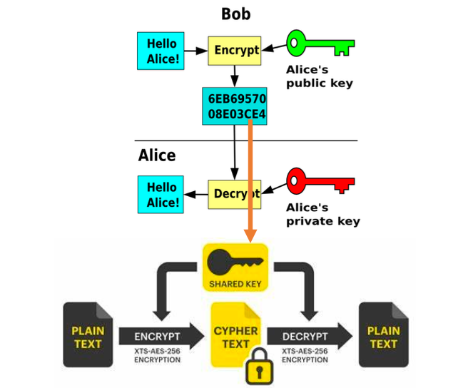
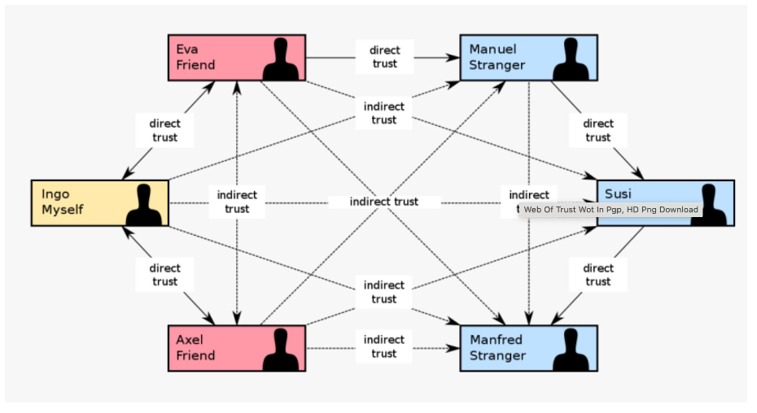
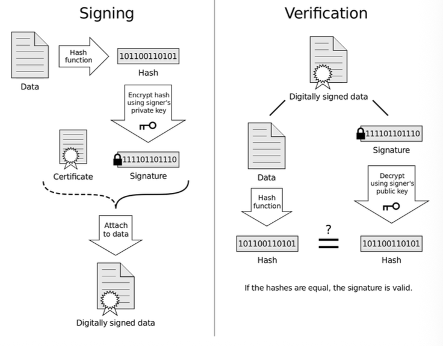
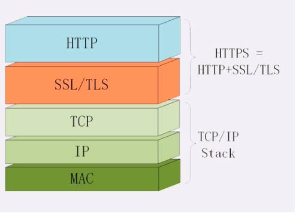
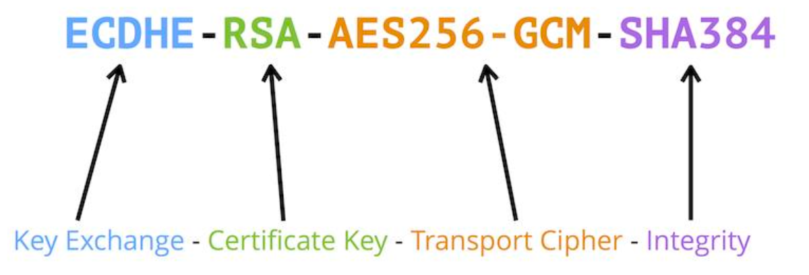
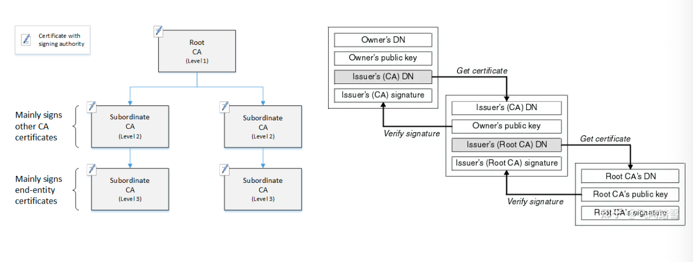
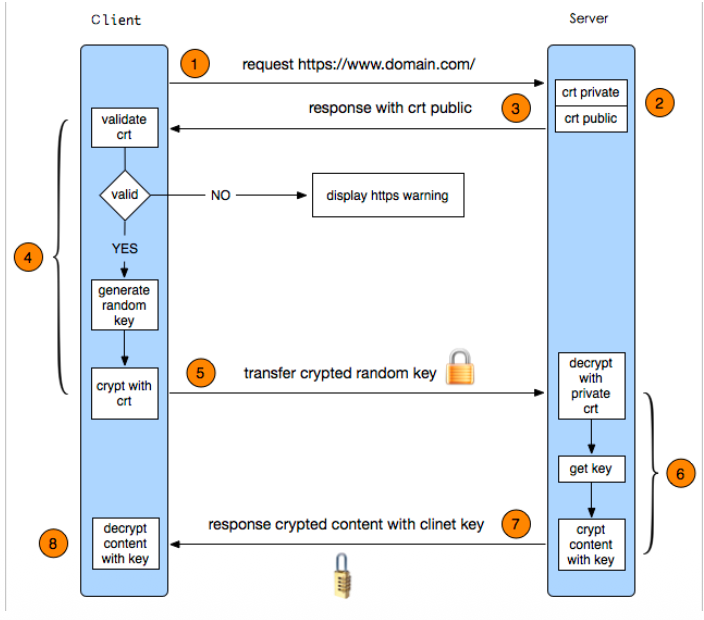
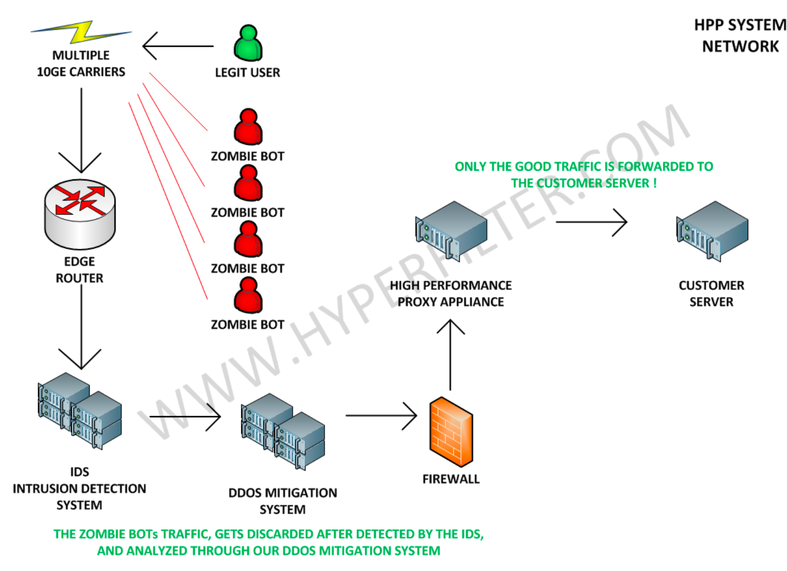

# 9 Secure the Web

## 知识图谱

```plaintext
Lec09 Secure the Web
├── 1. 数字表示基础：Encoding vs Encryption
│ ├── 所有数字数据本质上都是 0 和 1
│ ├── Encoding 编码
│ │ ├── 将数据从一种形式转换为另一种形式
│ │ ├── 目的是兼容、传输、存储或显示
│ │ ├── 是确定性的：同样输入总是得到同样输出
│ │ ├── 不需要密钥
│ │ └── 不提供保密性
│ ├── Decoding 解码
│ │ └── 编码的反向过程
│ ├── HEX 十六进制表示
│ │ └── 用于展示二进制数据
│ ├── Base64 Encoding
│ │ ├── 用于让二进制数据能通过文本通道传输
│ │ ├── 不是加密
│ │ ├── 没有密钥
│ │ └── 任何人都可以用标准解码器还原
│ └── Encryption 加密
│ ├── 目的是保密性
│ ├── 依赖密钥
│ ├── 算法通常可以公开
│ └── 安全性来自密钥而不是算法隐藏

├── 2. 对称加密与非对称加密
│ ├── Symmetric Encryption 对称加密
│ │ ├── 加密和解密使用同一个 shared key
│ │ ├── 速度快
│ │ ├── 适合大量数据传输和存储数据加密
│ │ ├── 问题：如何安全分发 shared key
│ │ └── 如果密钥在传输时被截获，系统就会被攻破
│ ├── Asymmetric Encryption 非对称加密
│ │ ├── 使用 public key 和 private key
│ │ ├── 公钥可以公开
│ │ ├── 私钥必须由拥有者保存
│ │ ├── 用公钥加密，用私钥解密
│ │ ├── 用于解决安全交换问题
│ │ └── RSA 依赖从公开信息推导私密信息的理论困难
│ ├── Diffie-Hellman / D-H
│ │ ├── 可用于密钥协商
│ │ ├── 课件强调：只靠 D-H 不能确认公钥到底是不是 Alice 或 Bob 的
│ │ └── 容易受到中间人攻击
│ └── RSA
│ ├── 1977 年 Rivest, Shamir, Adleman
│ ├── 典型使用密钥对
│ ├── 大部分信息可公开，如公钥和密文
│ └── 安全性基于从公开信息推出私钥的计算困难

├── 3. HTTPS 的混合加密架构
│ ├── 非对称算法
│ │ └── 用来安全生成或交换 session key
│ ├── 对称算法
│ │ └── 用 session key 加密真实会话数据
│ ├── 为什么混合使用
│ │ ├── 非对称加密安全但计算开销大
│ │ ├── 对称加密速度快但密钥分发困难
│ │ └── HTTPS 结合两者优点
│ └── Session Key
│ ├── 由 client random、server random 和 pre-master secret 生成
│ ├── 后续通信使用 session key 进行对称加密
│ └── D-H 可进一步加强 pre-master 的安全性

├── 4. 公钥管理问题：身份验证与信任体系
│ ├── 公钥管理的核心挑战
│ │ ├── 如何验证 key 的真实拥有者
│ │ └── 如何管理大量 public keys
│ ├── 中间人攻击 MitM
│ │ ├── 攻击者替换公钥
│ │ ├── 用户以为自己在和 Bob 通信
│ │ └── 实际上消息被 Eve 截获
│ ├── PGP
│ │ ├── Pretty Good Privacy
│ │ ├── 1991 年免费发布在互联网上
│ │ ├── 作者 Philip Zimmermann 曾因密码软件出口限制被调查
│ │ ├── 甚至通过出版源代码书籍规避限制
│ │ └── 可用于 email 加密
│ ├── WOT Web of Trust
│ │ ├── 信任网
│ │ ├── 不是中心化 CA 模型
│ │ ├── 通过直接信任扩展为间接信任
│ │ └── 依赖其他用户对 key 进行数字签名
│ ├── PGP Trust Levels
│ │ ├── Unknown：默认状态，不知道是否可信
│ │ ├── Never：明确不信任
│ │ ├── Marginal：部分可信，需要多个 marginal 签名
│ │ ├── Full：完全可信，一个 full trust 签名即可
│ │ └── Ultimate：只用于自己的 key
│ └── Digital Signature / DSA
│ ├── 发送方对数据做 hash
│ ├── 用发送方 private key 对 hash 签名
│ ├── 接收方用发送方 public key 验证签名
│ ├── 可验证数据完整性和发送者身份
│ └── 签名可靠性依赖 hash 算法安全性

├── 5. CA、X.509 与证书链
│ ├── CA Certificate Authority
│ │ ├── 中心化权威机构
│ │ ├── 用于解决全球商业环境下 WOT 不易扩展的问题
│ │ └── public key 的信任建立在通向 root CA 的信任链上
│ ├── Certificate Lifecycle
│ │ ├── Webmaster 本地生成 key pair
│ │ ├── 只把包含 public key 的 CSR 发给 CA
│ │ ├── CA 验证申请者身份
│ │ └── CA 用自己的 private key 签发证书
│ ├── X.509 Certificate
│ │ ├── Serial Number
│ │ ├── Signature Algorithm OID
│ │ ├── Validity Period
│ │ ├── Subject Public Key Info
│ │ └── Extensions
│ ├── Certificate Chain
│ │ ├── Root CA
│ │ ├── Intermediate CA
│ │ └── End-user / Server Certificate
│ ├── 浏览器中的 CA
│ │ ├── 主要由欧美公司主导
│ │ └── 上海 CA 已被多数浏览器接受
│ └── CA 失效案例
│ └── DigiNotar 被黑并签发假 Google 证书，说明 CA 本身也可能成为风险点

├── 6. SSL/TLS 与 HTTPS 协议实现
│ ├── SSL
│ │ └── Secure Sockets Layer
│ ├── TLS
│ │ └── Transport Layer Security
│ ├── SSL/TLS 的作用
│ │ ├── 整合 key exchange
│ │ ├── 整合 digital signature
│ │ ├── 整合 symmetric encryption
│ │ └── 形成工业标准
│ ├── SSL/TLS 漏洞
│ │ ├── SSL 3.0 不能抵抗 POODLE attack
│ │ └── 旧 TLS 版本存在 legacy vulnerabilities
│ ├── TLS 1.3
│ │ ├── 移除 RSA key exchange
│ │ ├── 减少握手步骤
│ │ ├── 提高速度
│ │ └── 降低攻击面
│ ├── TLS 不只用于 HTTP
│ │ ├── HTTPS = HTTP over TLS
│ │ ├── TLS 也可用于 FTP
│ │ └── TLS 也可用于 SMTP
│ ├── Cipher Suites
│ │ ├── 由多个算法组合构成
│ │ ├── key exchange algorithm
│ │ ├── authentication / signature algorithm
│ │ ├── symmetric encryption algorithm
│ │ └── MAC / hash algorithm
│ ├── MAC Message Authentication Code
│ │ ├── 用于检查消息完整性
│ │ ├── 通常使用 hash 或 HMAC
│ │ ├── 双方共享密钥
│ │ ├── 速度快
│ │ └── 不具备数字签名那种抗抵赖性
│ └── 私钥泄露风险
│ ├── server private key 通常是服务器上的文件
│ ├── 如果被黑客获得，风险很大
│ ├── 攻击者可能先记录所有加密通信
│ └── 等私钥泄露后再解密历史通信

├── 7. HTTP 状态管理：Cookie 与 Session
│ ├── HTTP 是 stateless
│ │ ├── 简单
│ │ ├── 可扩展
│ │ └── 可靠
│ ├── Stateless 的含义
│ │ └── 服务器在两个请求之间默认不保存用户状态
│ ├── Cookie
│ │ ├── 存储在用户电脑上的小文本文件
│ │ ├── 通过 HTTP header 在浏览器和服务器之间传递
│ │ ├── 客户端可见
│ │ ├── 可被读取或篡改
│ │ └── 不应该存储明文密码或敏感信息
│ ├── Session
│ │ ├── 存储在服务器端
│ │ ├── 每个 session 有唯一 ID
│ │ ├── session id 通常存储在用户 cookie 中
│ │ └── session id 本身应视为高价值秘密
│ └── Cookie vs Session
│ ├── Cookie：client-side，风险是篡改、劫持、窃取
│ └── Session：server-side，主要风险是 session ID 暴露

├── 8. 密码、认证与账户安全
│ ├── Password 用于 authorization / authentication
│ ├── 不应明文存储密码
│ │ ├── 密码只用于比较
│ │ ├── 设计上 admin 也不应该看到用户明文密码
│ │ └── 应存储 hash 值
│ ├── Hash
│ │ ├── 不是加密算法
│ │ ├── 不用于解密
│ │ └── 例如 SHA256("123456") 得到固定 hash
│ ├── Salt
│ │ ├── 在密码 hash 中加入随机数据
│ │ └── 用于抵抗 rainbow table
│ ├── Rainbow Table
│ │ └── 预先计算常见密码 hash，用于反查密码
│ ├── Hash Collision
│ │ ├── 王小云证明 MD5、SHA-1 可找到碰撞
│ │ └── 她参与设计 SM-3
│ ├── Credential Stuffing 撞库
│ │ ├── 利用其他网站泄露的账号密码尝试登录目标网站
│ │ ├── 利用用户多平台复用密码的习惯
│ │ └── 防御方式包括 MFA、不同网站不同密码、泄露密码检测
│ ├── Weak Password
│ │ └── 弱密码是重要风险因素
│ ├── MFA / 2FA
│ │ ├── Multi-Factor Authentication
│ │ ├── 需要多个认证因素
│ │ └── 2FA 是 MFA 的子集
│ └── 用户建议
│ ├── 不安装危险软件
│ ├── 必须安装时可放在 VM 中
│ ├── 不同网站不要使用同一密码
│ ├── 不在不安全网站注册
│ └── 不分享密码

├── 9. PKI 在关键应用中的使用
│ ├── PKI 也可用于 client side
│ ├── 私钥通常由芯片保护
│ ├── USB stick / U-key 中 CA 扮演重要角色
│ ├── Tencent Soter
│ │ ├── 需要移动设备厂商支持
│ │ ├── 厂商将 root certificates 给 Tencent
│ │ └── Tencent TAM server 类似 root CA server
│ └── 关键应用依赖硬件、证书、CA 和终端安全共同保护

├── 10. 典型网络攻击与真实案例
│ ├── More cyber attacks
│ ├── Data leakage
│ ├── Credential stuffing
│ ├── WannaCry
│ │ ├── 勒索软件
│ │ └── EternalBlue 漏洞相关
│ ├── Phishing
│ │ ├── Phone + Fishing → Phishing
│ │ └── 社会工程攻击
│ ├── Unauthorized live camera visitors
│ ├── DDoS
│ │ ├── Distributed Denial of Service
│ │ ├── 通过大量分布式流量耗尽目标资源
│ │ └── DeepSeek DDoS 案例中峰值超过 3Tbps
│ ├── Matrix is another real world
│ │ ├── 银行卡安全提醒
│ │ └── NFC cards can be easily faked
│ ├── Tesla attack
│ │ └── Bluetooth hack 可攻击汽车访问控制
│ ├── Sony PS3
│ │ ├── 使用固定 random number
│ │ ├── 导致签名安全失效
│ │ └── 说明工具不能保证安全，人的实现和流程也关键
│ └── Accidents
│ └── 安全事件也可能来自意外和人为失误

├── 11. 风险、安全评估与 CIA
│ ├── Risk
│ │ ├── Risk = Threat Probability × Vulnerability Impact
│ │ ├── 风险是威胁成功利用漏洞的概率和影响的组合
│ │ └── 安全不是绝对的
│ ├── Threat
│ │ ├── 能造成破坏、数据窃取、中断或伤害的危险
│ │ ├── malware
│ │ ├── phishing
│ │ ├── data breach
│ │ └── rogue employees
│ ├── Vulnerability
│ │ ├── 硬件、软件、人员或流程中的弱点
│ │ ├── 可被威胁行为者利用
│ │ ├── 可用 CVSS 评分
│ │ ├── Log4j 是典型例子
│ │ └── 未有补丁的漏洞叫 zero-day vulnerability
│ ├── CIA Triad
│ │ ├── Confidentiality 机密性
│ │ ├── Integrity 完整性
│ │ └── Availability 可用性
│ ├── Risk is also about people
│ │ └── 风险不仅是技术问题，也是人员和制度问题
│ └── 最高风险
│ └── “You believe you are safe!!!”

├── 12. 防护层次与安全治理
│ ├── Reliable Infrastructure
│ │ ├── UPS
│ │ └── data center tiers
│ ├── Infrastructure Level
│ │ └── 基础设施可靠性
│ ├── DDoS Filtering
│ │ └── 通过过滤和清洗流量缓解 DDoS
│ ├── Application Level
│ │ └── 常见 Web 应用安全威胁
│ ├── Network Security Level Protection
│ │ ├── L1：损害个人、法人或组织权益，但不危害国家安全、社会秩序和公共利益
│ │ ├── L2：严重损害个人或组织权益，或威胁社会秩序和公共利益
│ │ ├── L3：严重危害社会秩序和公共利益，或通过重要网络威胁国家安全
│ │ ├── L4：严重威胁国家安全，涉及特别重要网络
│ │ └── L5：一旦破坏会对国家安全造成特别严重危害
│ ├── ISO27000
│ │ ├── Integrity
│ │ ├── Confidentiality
│ │ ├── Physical and Environmental Security
│ │ ├── Human Resource Security
│ │ └── Access Control
│ ├── Vulnerability Assessment Scanning
│ ├── Apply proper products and regulations
│ ├── Penetration Testing
│ └── Test them regularly

├── 13. 国家级与战略级安全视角
│ ├── Get session key within telecom operators
│ ├── Nation-level interception
│ ├── ECHELON program
│ │ ├── NSA 拦截 Airbus 与 Saudi Arabian national airline 通信
│ │ ├── Airbus 失去 60 亿美元合同
│ │ └── Raytheon 与 Brazil Amazon monitoring contract 案例
│ └── 结论
│ ├── 网络空间也是现实世界
│ ├── 安全与国家、企业、个人利益相关
│ └── 不能只依赖单一技术工具
```

## Foundations of Digital Representation: Encoding vs. Encryption

Security architecture begins with the fundamental realization that all digital data is represented as binary sequences. While **a computer perceives only 0s and 1s**, the method we use to transform these sequences determines the security posture of the system. We must distinguish between transformations designed for accessibility and those designed for confidentiality.

安全架构始于一个根本认识：所有数字数据都以二进制序列表示。**虽然计算机仅能感知 0 和 1**，但我们对这些序列的转换方式，决定了系统的安全态势。我们必须区分旨在实现可访问性的转换与旨在实现机密性的转换。

### Encoding Mechanics: The Deterministic Transformation 编码机制：确定性变换

Encoding is a deterministic process of **converting data from one form to another** to ensure it remains compatible across diverse systems. For instance, in Python, a string must be encoded into bytes to be processed at the network layer; visualization of this binary data often relies on hexadecimal (HEX) representations. Because the transformation logic is public and predictable, it provides zero confidentiality.

编码是一种确定性的过程，它**将数据从一种形式转换为另一种形式**，以确保跨不同系统兼容。例如，在Python中，字符串必须被编码为字节才能在网络层进行处理；对二进制数据的可视化通常依赖于十六进制（HEX）表示。由于变换逻辑公开且可预测，因此它不提供任何保密性。

### The Base64 Case Study

Base64 is a frequent point of confusion for junior engineers. To answer the fundamental architectural question: **Is Base64 a kind of encryption? No.** It is a functional transformation used for data portability (moving binary data through text-only channels). It lacks a secret key, meaning any actor with a standard decoder can revert the data.

Base64 是初级工程师常感困惑的一个概念。针对基础架构层面的核心问题：**Base64 属于加密形式吗?**。

**当然不是**，它是一种用于数据可移植性（将二进制数据通过纯文本通道传输）的功能性转换。由于缺乏密钥，任何使用标准解码器的人都能还原原始数据。

### Analytical Layer: Deterministic vs. Probabilistic Security 分析层：确定性安全与概率性安全

The critical failure in many legacy architectures is relying on "secrecy of the system" (obfuscation) rather than "secrecy of the key."

许多传统架构的致命缺陷在于依赖"系统保密性"（混淆机制）而非"密钥保密性"。

- **Encoding** is deterministic: Input A always produces Output B.

  编码是确定性的：输入A始终产生输出B。

- **Encryption** is probabilistic: Input A, combined with a secret key, produces a unique ciphertext that cannot be reversed without that specific key. Architectural security is not found in the complexity of the transformation, but in the **mathematical robustness and secrecy** of the key.

  加密具有概率性：输入A与密钥结合后，生成唯一的密文，没有该特定密钥就无法逆向还原。安全架构并非取决于转换过程的复杂性，而是基于密钥的数学稳健性与保密性。

\--------------------------------------------------------------------------------

## Cryptographic Paradigms: Symmetric and Asymmetric Systems 密码学范式：对称与非对称系统

Modern web infrastructure has evolved from physical tokens, like the ancient "tiger tally," to complex mathematical models. The primary architectural challenge remains the trade-off between computational speed and the security of key distribution.

从古代的"虎符"等实体令牌到复杂的数学模型，现代网络基础设施经历了深刻的演变。其主要架构挑战始终在于计算速度与密钥分发安全之间如何进行权衡。

### Symmetric Encryption Analysis 对称加密分析

Symmetric encryption utilizes a single "Shared Key" for both operations. While highly efficient for bulk data, it suffers from the "Key Exchange" problem: if the key is intercepted during distribution, the entire system is compromised.

对称加密在加解密两个操作中使用同一个“共享密钥”。尽管对称加密在处理大批量数据时很高效，但它存在“密钥交换”问题：如果密钥在分发过程中被截获，整个系统就会被攻破。

| Feature                 | Symmetric Encryption (e.g., XTS-AES-256)     |
| ----------------------- | -------------------------------------------- |
| **Key Type**            | Single Shared Key                            |
| **Performance**         | High-speed; optimized for large data volumes |
| **Security Bottleneck** | Secure distribution of the shared secret     |
| **Primary Use**         | Data-at-rest and bulk transport encryption   |

### Asymmetric Encryption (Public Key Infrastructure)

Asymmetric systems (RSA, 1977) utilize mathematically linked Public/Private key pairs to solve the "safe exchange" problem. The Public key is used for encryption which could be seen by everyone, while only the Private key can perform decryption and can only be kept by owner.

非对称体系（RSA，1977年）通过数学关联的公钥/私钥对来解决“安全交换”问题。公钥用于加密，只有私钥能执行解密操作。

### The RSA Deep Dive (PKCS #1)

Architectural precision requires understanding the underlying ASN.1 structure of an RSA Public Key. Based on the PKCS #1 standard, a typical 76-byte RSA public key is structured as follows:

结构精度要求理解RSA公钥底层ASN.1结构。根据PKCS#1标准，一个典型的76字节RSA公钥构成如下：

- **Algorithm Identifier (OID):** `1.2.840.113549.1.1.1` (rsaEncryption)
- **Public Key Bit String (59 Bytes):** Contains the key components.
- **Modulus (n):** 49 bytes (the product of two large primes).
- **Public Exponent (e):** 3 bytes (typically 65537).
- **Null Parameters:** 5 bytes (optional placeholders).

The security of this structure rests on the "**integer factorization**" problem; it is computationally infeasible to deduce the private factors from the **public modulus n**.

此结构的安全性建立在“整数分解”难题之上，从公开模数 n 推导出私有因子在计算上是不可行的。

#### HTTPS -symmetric + asymmetric algorithm

- Using asymmetric algorithm to generate a safe session key

  使用非对称算法生成安全的会话密钥

- Session is encrypted by the symmetric algorithm

  会话已通过对称算法加密



### Analytical Layer: The Hybrid Optimization

Asymmetric encryption is computationally expensive. Therefore, HTTPS employs a hybrid approach: Asymmetric algorithms are used to negotiate a secure environment, while Symmetric encryption handles the actual high-volume data throughput.

非对称加密计算开销较大。因此，**HTTPS采用混合模式：使用非对称算法协商安全环境，而对称加密则负责处理实际的高容量数据吞吐。**

\--------------------------------------------------------------------------------

## The Architecture of Trust: PGP, WOT, and Digital Signatures

Mathematical strength is useless if the identity of the communicator is forged. Without identity verification, a "Man-in-the-Middle" (MitM) can substitute their own public key and intercept all communications.

如果通信者的身份是伪造的，那么数学上的力量就毫无用处。没有身份验证，“中间人”可以替换自己的公钥并拦截所有通信。

### Challenges for public key management 公钥管理的挑战

- How to verify the key’s real owner?

  - 在非对称加密中，最致命的攻击是**中间人攻击 (MITM)**。如果攻击者用自己的公钥替换了部长的公钥，作者就会用错误的公钥加密文档，导致泄露。

    为了验证所有权，我们引入 **数字证书 (Digital Certificate)** 和 **证书颁发机构 (CA)** 的概念。

    - **数字证书（身份证明）**：证书就像是公钥的“身份证”，它将公钥与用户的身份信息（如姓名、工号、邮箱）绑定在一起。
    - **数字签名验证**：
      1. 第三方权威机构（CA）使用其**私钥**对“用户身份 + 用户公钥”的哈希值进行签名。
      2. 任何想要验证的人，只要使用 CA 的**公钥**对证书进行验签。
      3. 如果验签成功，说明该公钥确实经过了权威机构的审核，未被篡改。
    - **信任链**：这种机制基于 **公开密钥基础设施 (PKI)**。通过层层背书，最终追溯到一个受信任的根证书。

- How to manage so many public keys?

  - A. 目录服务集成 (LDAP/Active Directory)

    企业通常将公钥存储在现有的目录服务中（如 Windows AD）。

    - **自动化查询**：当作者（Author）在 ECM 系统中选择“部门主管”作为审批人时，系统会自动从 LDAP 目录中实时调取该主管的最新公钥。
    - **实时同步**：当有新员工入职（如你入职 Gusu Lab 担任实习生时）或员工离职时，系统会自动更新或注销其公钥。

  - B. 证书吊销列表 (CRL) 与 OCSP

    密钥管理不仅是“增加”，更重要的是“作废”。

    - **CRL**：这是一个黑名单，记录了所有已损坏、过期或因员工离职而失效的证书。
    - **OCSP (在线证书状态协议)**：系统在加密前，会实时向服务器询问该公钥是否依然有效，防止使用已作废的密钥。

  - C. 密钥管理系统 (KMS)

    对于高安全需求的文档（如你提到的秘密文件），使用专门的 **KMS**。

    - **生命周期管理**：KMS 负责密钥的生成、分发、存储、轮换和销毁。
    - **透明化操作**：用户不需要感知公钥的存在。加密和解密过程在后台通过 API 调用 KMS 完成。


### The Web of Trust (WOT) and PGP 信任网（WOT）与PGP

Pretty Good Privacy (PGP) introduced the "Web of Trust" model to manage public keys. PGP's history is rooted in political necessity; its creator, Philip R. Zimmermann, famously published the source code as a book to bypass US export restrictions on "munitions." The WOT relies on **Indirect Trust**, where a user’s identity is validated by a chain of other users who have digitally signed their key.

良好隐私（PGP）引入了"信任网络"模型来管理公钥。PGP的历史根植于政治需求；其创作者菲利普·R·齐默尔曼曾以出版源代码书籍的方式规避美国对"军用品"的出口限制。信任网络依赖间接信任原则，即用户身份需通过其他用户的签名链进行验证，这些用户已用数字方式签署其密钥。



**PGP Trust Levels PGP信任等级:**

- **Ultimate:** Reserved for your own keys

  终极技能： 其力量仅限为己所用。

- **Full:** Only one signature from a trusted source is required to validate.

  完整内容： 只需一个来自可信来源的签名即可完成验证。

- **Marginal:** Requires three signatures from "marginal" sources to validate.

  边缘化验证：需由三位"边缘化"来源签字确认。

- **Never:** Explicitly marks a key as compromised or untrustworthy.

  从不: 显式地将密钥标记为受破坏或不可信。

- **Unknown:** The default state for unverified keys.

  未知： 未经验证密钥的默认状态。

PGP can be used for emails. In email communication, PGP can protect confidentiality and identity by encrypting the message and using digital signatures. This shows that public key trust is not only theoretical, but can be applied to real communication systems.

中文理解：PGP 可以用于邮件安全。它既可以加密邮件内容，也可以通过数字签名证明发送者身份。因此，PGP/WOT 不是单纯的概念，而是可以直接应用在真实通信场景中的公钥信任方案。

### Digital Signature Algorithm (DSA) Mechanics 数字签名算法（DSA）机制

1. **Signing:** The sender generates a hash of the data (using algorithms like MD5, SHA-1, or SM-3). The hash is encrypted with the sender's **private key**.

   **签名**： 发送方计算数据的哈希值（采用MD5、SHA-1或SM-3等算法），并使用发送方的私钥对哈希值进行加密。

2. **Verification:** The receiver decrypts the signature with the sender’s **public key** and compares it to a fresh hash of the data.

   验证：接收方使用发送方的公钥解密签名，并与数据的新哈希值进行比较。

**Architectural Warning:** The reliability of signatures depends on hash integrity. Dr. Wang Xiaoyun’s work on collisions in MD5 and SHA-1 significantly undermined these standards. Consequently, she led the design of the **SM-3** algorithm to provide a more robust hashing foundation.

架构性警示： 签名可靠性依赖于哈希完整性。王小云博士在MD5与SHA-1碰撞性研究上的突破性工作，极大削弱了这两类标准的安全性。为此，她领导设计了SM-3算法，旨在构建更强的哈希基础。



\--------------------------------------------------------------------------------

## Public Key Management: Certificate Authorities (CA) and X.509 公钥管理：证书颁发机构（CA）与X.509

The decentralized WOT model fails to scale for global commerce. Instead, the industry relies on a centralized "Chain of Trust" managed by Certificate Authorities.

去中心化的信任网络(WOT)模型无法在全球化商业中扩展。相反，行业依赖由证书授权机构管理的集中式"信任链"。

### The Certificate Lifecycle 验证的生命周期

The webmaster generates a key pair locally and sends only a Certificate Signing Request (CSR) containing the public key to a CA. The CA verifies the webmaster's identity (via email or face-to-face) before signing the certificate with the CA's own private key.

网站管理员在本地生成密钥对，仅将包含公钥的证书签名请求（CSR）发送给CA。CA在验证管理员身份后（通过电子邮件或面对面方式），才使用CA自己的私钥对证书进行签名。

### X.509 Standard Deconstruction

The ITU-T X.509 standard governs the structure of digital certificates:

ITU-T X.509 标准规定了数字证书的结构：

- **Serial Number:** Unique identifier for the certificate.

  证书编号： 证书的唯一标识符。

- **Signature Algorithm OID:** (e.g., RSA with SHA-256).

  签名算法OID：（例如，带SHA-256的RSA）。

- **Validity Period:** "Not Before" and "Not After" timestamps.

  有效期：“不早于”和“不晚于”时间戳。

- **Subject Public Key Info:** The owner's public key and algorithm OID.

  主体公钥信息：所有者公钥及其算法OID标识。

- **Extensions:** Usage constraints (e.g., Server Auth, Digital Signature).

  扩展： 使用限制（例如，服务器认证、数字签名）。

### The Hierarchy of Trust 信任的层级结构

Trust is managed through levels: **Root CA** (pre-installed in browsers), **Intermediate CA**, and the **End-User Certificate**. While Western entities dominate the landscape, regional players like **Shanghai CA (SHECA)** have been integrated into global browser root stores, reflecting a shift toward diverse regional trust hubs.

信任通过层级进行管理：**根证书颁发机构（预置于浏览器中）**、**中间证书颁发机构**以及**终端用户证书**。尽管西方机构在证书体系中占主导地位，但诸如上海CA认证中心（SHECA）等区域性玩家已融入全球浏览器的根证书库，这体现了信任来源向多元化区域中心的转变。

**CA is not automatically safe**. A famous case is DigiNotar, which was hacked in 2011 and fake Google certificates were issued. This means if a trusted CA is compromised, users may still see a “trusted” certificate even though the communication is controlled by attackers. Therefore, the certificate system depends not only on cryptography, but also on the security and governance of CA organizations.

CA 不是绝对安全的。如果 CA 被黑，攻击者可能签发假的可信证书。用户浏览器可能仍然认为证书可信，所以 CA 的安全治理本身也是 HTTPS 安全的一部分。

### Analytical Layer: "Record Now, Decrypt Later" 分析层：“先记录，再解密”

The most significant strategic risk of a private key leakage is the vulnerability of historical data. Attackers can record encrypted traffic today and wait for a key compromise or the emergence of sufficient computing power to decrypt it in the future. **Private key protection is a matter of both current and historical national security.**

私钥泄露的历史数据脆弱性是最大的战略风险。攻击者可先加密拦截今天的网络通讯，待密钥泄露或具备足够算力后历史解密。私钥保护既关系当前国家安全，更关乎国家历久年深的安全根基。

\--------------------------------------------------------------------------------

## Protocol Implementation: The Evolution of SSL/TLS and HTTPS 协议实现：SSL/TLS与HTTPS的演进

SSL: Secure Sockets Layer

TLS: Transport Layer Securit

SSL/TLS protocols integrate key exchange, signatures, and symmetric encryption into a unified industrial standard.

SSL/TLS协议将密钥交换、数字签名及对称加密技术整合为统一的工业标准。

TLS is a general security layer, not a protocol only designed for HTTP. HTTPS means HTTP over TLS, but TLS can also be used to protect other application protocols, such as FTP and SMTP. So when explaining HTTPS, we should understand that HTTP is the application protocol, while TLS provides encryption, integrity and authentication below it.

HTTPS 不是一个完全独立的新协议，而是 HTTP + TLS。TLS 是通用安全层，也可以保护 FTP、SMTP 等其他协议。



### Protocol History and Deprecation 协议历史与弃用

- **SSL 2.0/3.0:** Deprecated. SSL 3.0 is famously vulnerable to the **POODLE** attack.

  SSL 2.0/3.0： 已弃用。SSL 3.0 因存在著名的 POODLE 攻击漏洞而声名狼藉。

- **TLS 1.0 - 1.2:** Wide adoption but contains legacy vulnerabilities.

  TLS 1.0/1.2： 广泛部署，仍含旧版漏洞。

- **TLS 1.3 (2018):** The modern mandate. It optimizes speed and drastically reduces the attack surface by removing vulnerable cipher suites.

  TLS 1.3 (2018年)： 现代标准。它优化了速度，并通过移除脆弱加密套件大幅降低了攻击面。
  
  - From TLS 1.2 to TLS 1.3, the protocol removes RSA key exchange and reduces the handshake process. The purpose is to improve speed and reduce the attack surface. This also avoids some problems of old RSA-based key exchange, especially the risk that recorded past traffic may be decrypted later if the server private key is leaked.
  
    TLS 1.3 不再使用旧式 RSA 密钥交换，并减少握手步骤，这样既能提升连接速度，也能减少旧算法带来的安全风险。

### The TLS Handshake (8-Step Principle) TLS 握手（8步原理）

1. **Client Hello:** Client sends supported cipher suites and a "Client Random."

   Client Hello： 客户端发送支持的密码套件和“客户端随机数”。

2. **Server Hello:** Server sends its certificate and a "Server Random."

   服务器问候：服务器发送其证书和“服务器随机数”。

3. **Validation:** Client validates the server certificate against built-in Root CAs.

   验证： 客户端使用内置根证书颁发机构验证服务器证书。

4. **Pre-master Secret:** Client generates a random "Pre-master secret," encrypts it with the server's public key, and sends it.

   预主密钥： 客户端生成一个随机的“预主密钥”，使用服务器的公钥对其加密后发送。

5. **Decryption:** Server decrypts the Pre-master secret with its private key.

   解密： 服务器使用其私钥解密预主密钥。

6. **Key Generation:** Both parties use the Client Random, Server Random, and Pre-master secret to generate the **Session Key**.

   密钥生成： 双方使用客户端随机数、服务器随机数及预主密钥生成会话密钥。

7. **Finished:** Both parties confirm they have established a secure session.

   完成：双方确认已建立安全会话。

8. **Encrypted Data:** Symmetric encryption begins using the shared Session Key.

   加密数据： 开始使用共享会话密钥进行对称加密。

### Cipher Suite



- There are four parts in the cipher suites

  密码套件包含四个部分

  - Key exchange algorithm：决定双方如何协商 session key，例如 D-H / ECDH。
  - Authentication / signature algorithm：用于身份验证，例如 RSA / DSA / ECDSA。
  - Symmetric encryption algorithm：用于加密真实传输数据。
  - MAC / hash algorithm：用于检查消息完整性，例如 HMAC 或 hash-based MAC

- Each part has many algorithm choices

  每一个部分都可以被替换成其他可以选择的算法。

### Certificate Chain



### A principle process



### MAC - Message Authentication Code

- In TLS, MAC algorithm of symmetric encryption is also a part of cipher suite.

  在TLS中，对称加密的MAC算法也是密码套件的一部分。

- MAC means how to check the integrate of a message, normally a HASH function or HMAC.

  MAC 表示如何检查消息的完整性，通常使用哈希函数或HMAC。

MAC 的核心在于通信双方共享一个**密钥 (Secret Key)**。其基本流程如下：

1. **生成阶段**：发送方使用特定的算法 $C$ 和共享密钥 $K$，对原始消息 $M$ 进行计算，得到一个固定长度的小数据块，即 MAC 值：

   $$MAC = C_K(M)$$

2. **传输阶段**：发送方将原始消息 $M$ 和生成的 $MAC$ 一起发送给接收方。

3. **验证阶段**：接收方收到后，使用同样的共享密钥 $K$ 和算法对收到的消息再次计算。如果计算出的结果与收到的 MAC 值完全一致，则证明：

   - **消息未被篡改**（完整性）。
   - **消息确实由持有该密钥的人发送**（真实性）。

MAC 和 Digital Signature 之间的区别

### MAC 与 数字签名 (Digital Signature) 的区别

既然你刚才问到了公钥管理，理解 MAC 与数字签名的区别非常重要：

| **特性**     | **MAC (消息认证码)**                                         | **数字签名**                                         |
| ------------ | ------------------------------------------------------------ | ---------------------------------------------------- |
| **密钥类型** | **对称密钥**（双方共享同一个密钥）                           | **非对称密钥**（发送方用私钥，接收方用公钥）         |
| **性能**     | 速度非常快，适合高频数据传输                                 | 速度较慢，计算开销大                                 |
| **抗抵赖性** | **不具备**。因为双方都有密钥，接收方也可以伪造一条消息说是由发送方发的。 | **具备**。只有发送方拥有私钥，签名具有唯一法律效力。 |

\--------------------------------------------------------------------------------

## 6. Application Security: Cookies, Sessions, and State Management

Because HTTP is **inherently stateless**, identity must be maintained through side-channels.

因为HTTP本质上是**无状态的**，因此身份必须通过辅助渠道来维持。

HTTP is designed to be stateless because this makes the protocol simple, scalable and reliable. However, e-commerce systems need to remember user identity, shopping carts and login status, so Cookie and Session are used to track state.

HTTP 无状态有好处，简单、可扩展、可靠；但电商必须保存用户登录状态和购物车状态，所以需要 Cookie 和 Session。

| Feature      | Cookies                     | Sessions                   |
| ------------ | --------------------------- | -------------------------- |
| **Location** | Client-side (vulnerable)    | Server-side (controlled)   |
| **Format**   | Plaintext files             | Global variables/databases |
| **Risk**     | Tampering, hijacking, theft | Session ID exposure        |

### Credential Stuffing 撞库攻击

**Credential Stuffing（撞库攻击）** 是一种网络攻击手段，攻击者利用从 A 网站泄露的**用户名和密码组合**（通常来自黑客窃取的数据库），去尝试登录 B、C 或 D 等其他网站。

这种攻击的核心逻辑建立在一个普遍的心理惯性上：**用户倾向于在不同的平台使用完全相同的密码。**

撞库攻击通常是高度自动化的，其过程如下：

1. **获取泄露数据（The "Stuff"）**：攻击者从暗网获取之前发生过数据泄露的账户列表（即“社工库”）。
2. **自动化批量尝试**：攻击者使用专门的僵尸网络（Botnet）或自动化脚本，将成千上万组用户名和密码快速输入到目标网站（如银行、社交媒体或电商平台）的登录接口。
3. **成功匹配**：如果用户在不同网站使用了相同密码，攻击者就会成功进入账户。
4. **后续侵害**：一旦登录成功，攻击者会窃取个人信息、盗取资金，或者将这些经过验证的“活号”加价转售。

**撞库与暴力破解之间存在区别**，虽然两者都涉及尝试登录，但策略完全不同：

- **暴力破解**：像是一个拿着大锤的工匠。它锁定一个特定账户，尝试所有可能的字符组合（如 `123456`, `password`, `abc...`），直到猜对为止。
- **撞库攻击**：像是一个拿着大串钥匙的窃贼。他已经有了真实的钥匙（泄露的密码），只是在挨个试哪把钥匙能打开这个小区的其他门。**它的成功率远高于暴力破解。**

针对撞库攻击的防御手段：

- **多因素认证（MFA/2FA）**：这是最有效的防线。即使密码泄露，攻击者没有你的手机验证码或硬件令牌也无法进入。
- **强制性密码检查**：许多大厂（如 Google、GitHub）会将用户的密码与已知的泄露库比对，如果匹配则强制用户修改密码。
- **行为生物识别**：通过分析用户的打字速度、鼠标移动轨迹等特征来分辨是人类还是脚本。

Some suggestions on password and credential security: weak password is the No.1 factor; do not install dangerous apps or software; if necessary, use dangerous software inside a VM; do not reuse the same password across websites or apps; do not register accounts on unsafe websites; do not share passwords.

密码安全不仅是服务器端问题，也和用户行为有关。弱密码、重复使用密码、安装危险软件、在不安全网站注册都会增加风险。

### Architectural Mandates for State Management 状态管理的架构规范

- **Cookies as Compromised Medium:** Never store plaintext credentials or sensitive data in client-side cookies.

  Cookie作为受损媒介：绝不要在客户端Cookie中存储明文凭据或敏感数据。

- **Salt Requirement:** Applications must add a "salt" (random data) to password hashes to prevent rainbow table attacks.

  盐值要求： 应用程序必须在密码哈希中添加“盐”（随机数据），以防止彩虹表攻击。

- **Session IDs:** Treat the Session ID as a high-value secret; it is the "key" to the user's identity on the server.

  会话ID：将会话ID视为高价值机密；它是用户在服务器上身份的"密钥"。

\--------------------------------------------------------------------------------

## 7. Strategic Risk Management and Regulatory Frameworks

Security is not a static technology but a dynamic management of Risk. **Risk = Threat (Probability) × Vulnerability (Impact)**

安全并非静态技术，而是对风险的动态管理。 **风险=威胁（可能性）×脆弱性（影响）**

### Threat

- A threat is any type of danger, which can damage or steal data, create a disruption or cause a harm in general.

  威胁是指任何类型的危险，可能损坏或窃取数据、造成中断或引发损害。

- Common examples of threats include malware, phishing, data breaches and even rogue

  employees.

  威胁的常见例子包括恶意软件、钓鱼攻击、数据泄露甚至内鬼员工。

- Or a set of potential incidents in which a threat agent causes a threat event to an asset using a specific entry point into the system

  或者一系列潜在事件，其中威胁因素利用系统的特定接入点对资产造成威胁事件。

### Vulnerability

- A vulnerability is a weakness in hardware, software, personnel or procedures, which may be exploited by threat actors in order to achieve their goals.

  漏洞是硬件、软件、人员或流程中的薄弱环节，可能被威胁行为者利用以达到其目的。

- Many famous vulnerabilities, such as Log4j in 2020.

  许多著名漏洞，例如2020年的Log4j。

- Vulnerabilities can be marked by Common Vulnerability Scoring System or CVSS.

  漏洞可依据通用漏洞评分系统（CVSS）进行标记。

- It is not only hardware and software, but human being.

  不仅是硬件和软件，更是人本身。

- A vulnerability, to which fix is not yet available, is called a zero-day vulnerability.

  尚未修复的漏洞称为零日漏洞。

### CIA

- Confidentiality 机密性

- Integrity 完整性

- Availability 可访问性

### National Security Standards: Level Protection

Governments categorize infrastructure based on the potential for catastrophic harm:

政府根据基础设施可能造成的灾难性损害程度对其进行分类。

- **L1-L2:** Damage limited to individual rights or local social order.

  L1-L2: 损害限于个人权利或局部社会秩序。

- **L3:** Serious harm to social order or public interest via important networks.

  L3：通过重要网络对社会秩序或公共利益造成严重危害。

- **L4:** Serious threat to national security via particularly important networks.

  L4: 通过极为重要的网络对国家安全造成严重威胁。

- **L5:** Catastrophic harm to national security (Extremely important networks).

  L5： 对国家安全的灾难性损害（极其重要的网络）

### Dos 和 DDos 攻击

**DoS** 全称是**拒绝服务攻击**。它通常指攻击者利用单台计算机或单一连接，向目标服务器发送大量的伪造请求或恶意数据包。

- **原理**：攻击者寻找服务器的处理瓶颈（如 CPU、内存或带宽），并发送超过服务器处理能力的流量。
- **常见手法**：
  - **SYN Flood**：利用 TCP 三次握手的漏洞，发送大量半连接请求，占用服务器的队列资源。
  - **死亡之 Ping (Ping of Death)**：发送异常巨大的 ICMP 数据包导致系统崩溃。
- **特点**：由于攻击源单一，这种攻击相对容易通过 IP 封禁或配置防火墙来防御。

**DDoS** 是 **分布式拒绝服务攻击**。这是 DoS 的“加强版”，也是目前互联网面临的最严重威胁之一。

- **原理**：攻击者并不直接动手，而是先控制成千上万台感染了恶意软件的设备（这些设备被称为“肉鸡”或“僵尸”），组成一个**僵尸网络 (Botnet)**。
- **执行**：攻击者通过控制中心（C&C 服务器）发出指令，让全球各地的僵尸网络同时向同一个目标发起进攻。
- **为什么更难防**：
  - **流量巨大**：动辄达到数 Tbps 的流量，足以冲垮任何单机防火墙。
  - **来源分散**：攻击流量来自世界各地、成千上万个不同的真实 IP，很难简单地通过封禁 IP 来解决。
  - **真假难辨**：攻击数据包往往被伪装得和正常访问流量一模一样。

DDos防御流程



### The Human Factor: The PS3 Case Study 人的因素：PS3案例分析

The **Sony PS3 case** serves as a stark architectural warning. Sony utilized complex cryptography but failed at the implementation level by using a **fixed "random" number** for their signatures. This deterministic failure meant the "Pre-master secret" logic was predictable, effectively opening the door for any attacker.

Sony PS3案例作为一个严苛的架构警告。索尼采用了复杂的加密技术，但在实施层面却因使用固定的“随机”数字进行签名而失败。这种确定性的缺陷使得“预主密钥”逻辑变得可预测，从而为任何攻击者敞开大门。

### How to know the security is good enough?

- There is NO absolute security.

- Do the enough and appropriate evaluation and investment.

- Good enough lock for the asset.

- The highest risk is: “You believe you are safe!!!”. NNever be careless about danger.

为了规避危险，建议执行如下操作：

- **Vulnerability Assessment Scanning**
- **Apply proper products and regulations**
- **Test your system regularly.**

Security management is not only buying products such as firewalls or anti-virus software. ISO27000 emphasizes systematic management, including physical and environmental security, human resource security and access control. Therefore, security should combine technology, people and regulations. Systems should also be checked through vulnerability assessment scanning and penetration testing regularly.

安全不是买防火墙就结束了，还包括物理环境、人员管理、访问控制、制度流程和定期测试。

### Final Synthesis: The Complacency Trap 最终结论：自满陷阱

Investment in security must match the value of the asset—you do not put a $10 lock on a $1,000,000 vault. However, the most sophisticated firewalls and CAs are useless against poor regulations and human error.

在安全方面的投入必须与资产价值相匹配——你不能在价值百万美元的保险库上只装一把十美元的锁。然而，最先进的防火墙和证书认证机构在面对糟糕的规章制度和人为失误时也毫无用处。

**The ultimate architectural warning: "The highest risk is: 'You believe you are safe!!!'"** Continuous evaluation is the only true defense.

终极架构警示：「最高风险在于：『你自以为安然无恙！！！』」 持续评估才是唯一的真正防线。

Security also has a national and strategic dimension. The lecture mentions cases such as obtaining session keys through telecom operators, nation-level interception and the ECHELON program. This means web security is not only about personal privacy or company assets, but also about national security and international competition.

网络安全不只是个人账号或企业网站的问题，也可能涉及电信运营商、国家级监听、商业竞争和国家安全。

## 潜在考试问题与参考答案

### Q1. Is Base64 a kind of encryption? Why?

**Answer:**
 No. Base64 is encoding, not encryption. Encoding converts data from one form to another for compatibility or transmission. It does not use a secret key, and anyone with a Base64 decoder can recover the original data. Encryption is different because it uses a key to protect confidentiality.

------

### Q2. What is the main difference between encoding and encryption?

**Answer:**
 Encoding is used for data representation and compatibility. It is deterministic and reversible by public rules. Encryption is used for confidentiality. It requires a secret key, and without the correct key, the ciphertext should not be recoverable.

------

### Q3. Why does HTTPS use both asymmetric and symmetric encryption?

**Answer:**
 Asymmetric encryption is useful for safe key exchange and identity verification, but it is slow. Symmetric encryption is much faster and suitable for large data transmission, but the shared key must be exchanged safely. HTTPS uses asymmetric algorithms to establish a safe session key, then uses symmetric encryption to protect the actual communication.

------

### Q4. What is the key exchange problem in symmetric encryption?

**Answer:**
 In symmetric encryption, both sides use the same shared key. The problem is how to send this key to the other party safely. If the key is intercepted during distribution, the attacker can decrypt all communication.

------

### Q5. Why can Diffie-Hellman alone not prevent man-in-the-middle attacks?

**Answer:**
 Diffie-Hellman can help two parties generate a shared secret, but it does not prove the real identity of the public key owner. A man-in-the-middle can replace public values and establish separate keys with both sides. Therefore, identity verification such as digital certificates or signatures is needed.

------

### Q6. What is the role of digital signature?

**Answer:**
 A digital signature proves data integrity and sender identity. The sender hashes the data and signs the hash with their private key. The receiver uses the sender’s public key to verify the signature and compares it with a newly calculated hash. If they match, the data has not been changed and the signature is valid.

------

### Q7. What is PGP and what is WOT?

**Answer:**
 PGP means Pretty Good Privacy. It is used to protect communication such as email. WOT means Web of Trust. Instead of relying on one central CA, users sign each other’s public keys. Trust can be extended from direct trust to indirect trust through a chain of signatures.

------

### Q8. What are the PGP trust levels?

**Answer:**
 PGP trust levels include Unknown, Never, Marginal, Full and Ultimate. Unknown means there is not enough information. Never means the key is explicitly not trusted. Marginal means partly trusted. Full means trusted enough that one signature can validate another key. Ultimate is only used for your own keys.

------

### Q9. Why is CA needed in global e-commerce?

**Answer:**
 In global e-commerce, WOT is hard to scale because users cannot manually verify every public key. CA provides a centralized trust model. A CA verifies the website owner’s identity and signs the certificate. Browsers trust built-in root CAs, so they can verify whether a server certificate is valid.

------

### Q10. What is a certificate chain?

**Answer:**
 A certificate chain is a chain of trust from the website certificate to an intermediate CA and finally to a trusted root CA. The browser checks this chain using its built-in root CA list. If the chain is valid, the browser can trust the server certificate.

------

### Q11. What is CSR in certificate application?

**Answer:**
 CSR means Certificate Signing Request. The webmaster generates a key pair locally and sends a CSR containing the public key to the CA. The private key is not sent. After the CA verifies the owner’s identity, it signs and issues the certificate.

------

### Q12. What is the risk if a CA is hacked?

**Answer:**
 If a CA is hacked, attackers may issue fake certificates for real domains. Users’ browsers may trust these certificates because they are signed by a trusted CA. The DigiNotar case showed that CA compromise can break the trust model of HTTPS.

------

### Q13. What is TLS and how is it related to HTTPS?

**Answer:**
 TLS means Transport Layer Security. It provides encryption, integrity and authentication. HTTPS is HTTP protected by TLS. TLS is not limited to HTTP; it can also protect other protocols such as FTP and SMTP.

------

### Q14. What is a cipher suite?

**Answer:**
 A cipher suite is a combination of algorithms used in TLS. It usually includes a key exchange algorithm, an authentication or signature algorithm, a symmetric encryption algorithm and a MAC or hash algorithm. Different cipher suites use different algorithm combinations.

------

### Q15. What is MAC in TLS?

**Answer:**
 MAC means Message Authentication Code. It is used to check message integrity and authenticity. Both sides share a secret key and use it to calculate a MAC for the message. If the receiver calculates the same MAC, the message is considered unchanged and authentic.

------

### Q16. What is the difference between MAC and digital signature?

**Answer:**
 MAC uses a shared symmetric key, so both sides can generate the MAC. It is fast but does not provide non-repudiation. A digital signature uses asymmetric keys. Only the sender has the private key, so the signature can prove the sender’s identity more strongly.

------

### Q17. Why is server private key leakage dangerous?

**Answer:**
 The server private key is often stored as a file on the server. If hackers get it, they may decrypt communication or impersonate the server. They may also record encrypted traffic first and decrypt it later after the key is leaked, which creates a “record now, decrypt later” risk.

------

### Q18. Why was TLS 1.3 introduced?

**Answer:**
 TLS 1.3 improves speed and security. It removes old vulnerable cipher suites and removes RSA key exchange. It also reduces the handshake process, so connections can be established faster with a smaller attack surface.

------

### Q19. Why does HTTP need Cookie and Session?

**Answer:**
 HTTP is stateless, meaning the server does not keep state between two requests. This makes HTTP simple and scalable, but websites need to remember login state, shopping carts and user identity. Cookies and sessions are used to track this state.

------

### Q20. Why should sensitive information not be stored in cookies?

**Answer:**
 Cookies are stored on the client side as text files. They can be read, stolen or modified by malicious code. Therefore, plaintext passwords or sensitive data should not be stored in cookies.

------

### Q21. What is the relationship between Session and Session ID?

**Answer:**
 Session data is stored on the server. Each session has a unique session ID, and this ID is usually stored in the user’s cookie. The session ID works like a key to the user’s identity, so it must be protected carefully.

------

### Q22. Why should passwords not be stored in plaintext?

**Answer:**
 Passwords are only needed for comparison. Even administrators should not be able to see users’ plaintext passwords. A safer design is to store password hashes. When the user logs in, the system hashes the input and compares it with the stored hash.

------

### Q23. Why is hash not encryption?

**Answer:**
 Hash is one-way. It maps input data to a fixed-length output and is not designed to be decrypted. Encryption is reversible with the correct key, but hash should not be reversible.

------

### Q24. What is a rainbow table and how can salt defend against it?

**Answer:**
 A rainbow table is a precomputed table of password hashes. Attackers use it to reverse common password hashes quickly. Salt adds random data to passwords before hashing, so the same password produces different hashes and rainbow tables become much less useful.

------

### Q25. What is credential stuffing?

**Answer:**
 Credential stuffing is an attack where attackers use leaked usernames and passwords from one website to try logging into other websites. It works because many users reuse the same password across different services.

------

### Q26. How can credential stuffing be defended?

**Answer:**
 Users should not reuse passwords. Systems can use MFA or 2FA, check passwords against known leaked password databases, detect abnormal login behavior, and limit automated login attempts.

------

### Q27. What is MFA? What is the relationship between MFA and 2FA?

**Answer:**
 MFA means Multi-Factor Authentication. It requires more than one method to verify identity. 2FA means Two-Factor Authentication and is a subset of MFA, usually using exactly two factors.

------

### Q28. What is DDoS?

**Answer:**
 DDoS means Distributed Denial of Service. Attackers control many devices in a botnet and make them send huge traffic to a target. The goal is to exhaust the target’s bandwidth, CPU, memory or service capacity, making the system unavailable.

------

### Q29. Which CIA property does DDoS mainly attack?

**Answer:**
 DDoS mainly attacks Availability. It prevents legitimate users from accessing the service. It may not directly steal data, but it makes the system unavailable.

------

### Q30. What is the CIA triad?

**Answer:**
 CIA means Confidentiality, Integrity and Availability. Confidentiality means only authorized users can access data. Integrity means data should not be changed without authorization. Availability means systems and data should be accessible when needed.

------

### Q31. What is the difference between threat, vulnerability and risk?

**Answer:**
 A threat is a possible danger, such as malware or phishing. A vulnerability is a weakness in hardware, software, people or procedures. Risk is the probability and impact of a threat successfully exploiting a vulnerability.

------

### Q32. What is a zero-day vulnerability?

**Answer:**
 A zero-day vulnerability is a vulnerability for which no fix or patch is currently available. It is dangerous because defenders may not have an immediate way to repair the weakness.

------

### Q33. Why is risk not only about technology?

**Answer:**
 Security also depends on people, procedures and regulations. A system may use strong cryptography, but weak passwords, poor management, phishing, implementation mistakes or careless users can still cause security failures.

------

### Q34. What does the Sony PS3 case show?

**Answer:**
 The Sony PS3 case shows that strong cryptographic tools are not enough if implementation is wrong. Sony used a fixed “random” number, which made the signature system predictable. This opened the door for attackers and shows that implementation details are critical.

------

### Q35. What is network security level protection?

**Answer:**
 Network security level protection classifies systems according to the damage caused if they are attacked. L1 and L2 mainly affect individuals or local order. L3 may seriously affect social order or public interest. L4 threatens national security through important networks. L5 causes extremely serious harm to national security.

------

### Q36. How can we know whether security is good enough?

**Answer:**
 There is no absolute security. We need appropriate evaluation and investment based on asset value. We should use suitable security products and regulations, perform vulnerability assessment scanning, and test systems regularly through methods such as penetration testing.

------

### Q37. Why does the lecture say “The highest risk is: You believe you are safe”?

**Answer:**
 Because overconfidence makes people stop checking, updating and improving security. Attackers, vulnerabilities and human mistakes always change. Believing a system is completely safe may lead to careless management and serious security incidents.

------

### Q38. Why are regulations and standards important in security?

**Answer:**
 Security products alone cannot guarantee safety. Regulations and standards such as ISO27000 help manage physical security, human resources, access control and operational procedures. They make security more systematic.

------

### Q39. Why is PKI useful for critical applications?

**Answer:**
 PKI can manage identities and keys in critical applications. Private keys can be protected by hardware chips or USB sticks. CA plays an important role in proving identity and managing trust, especially in high-security PC or mobile applications.

------

### Q40. What is the final lesson of Lec09?

**Answer:**
 The final lesson is that web security is a complete system. It includes cryptography, certificates, TLS, passwords, sessions, infrastructure, people, regulations and continuous testing. No single tool can guarantee safety. Security must be managed continuously according to risk.
