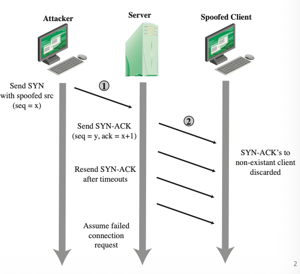
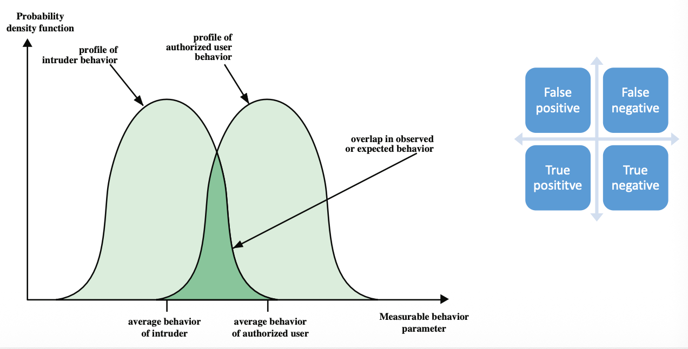
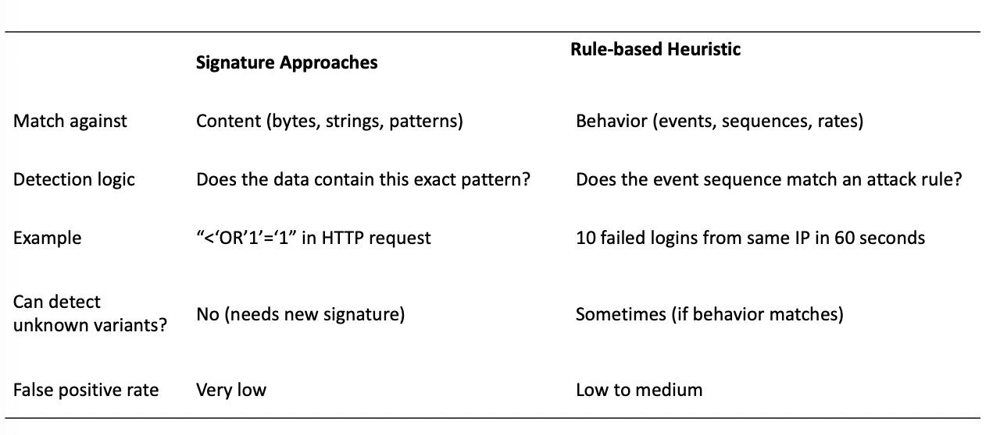
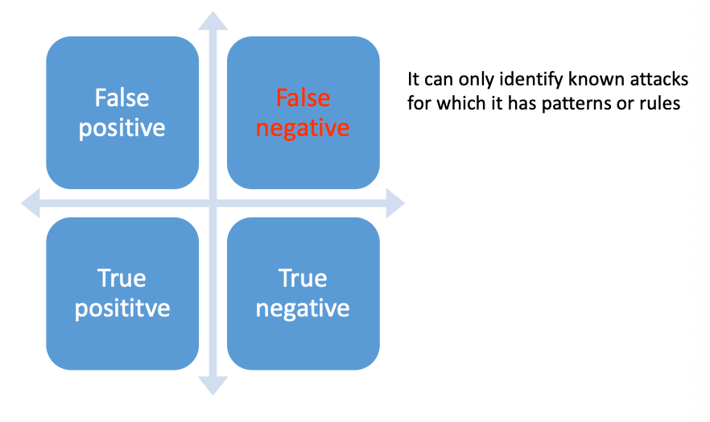
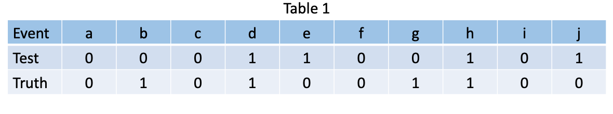
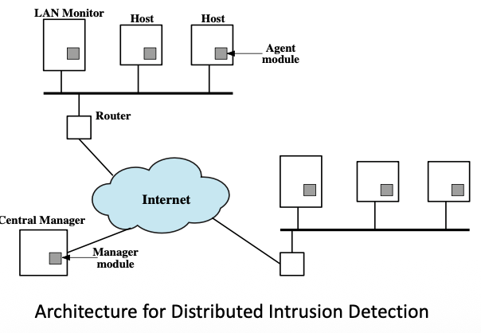
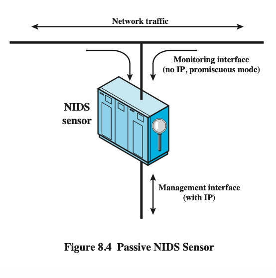
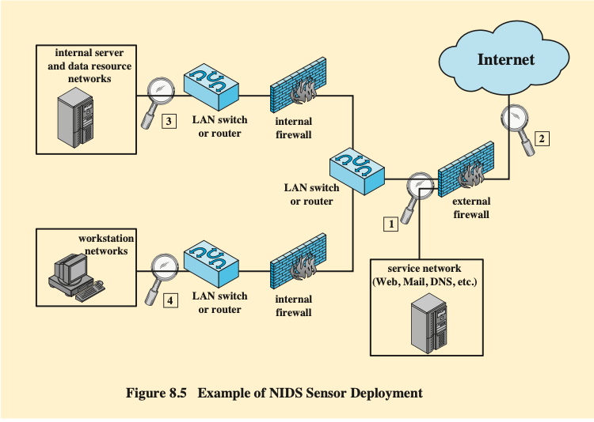
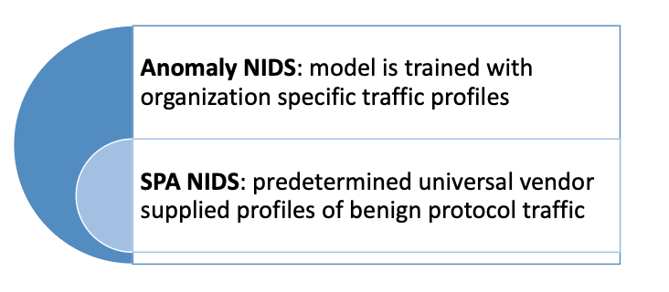
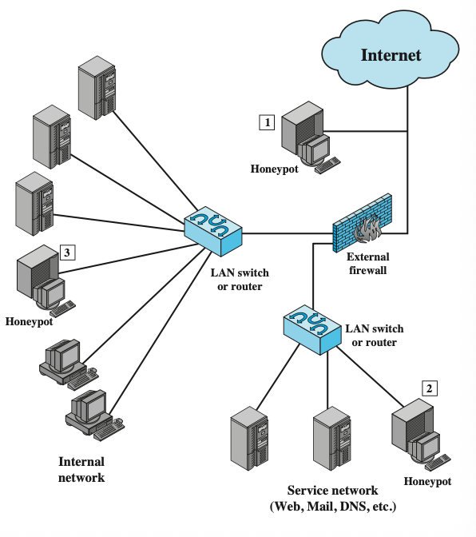

# 10 Defenses: Intrusion Detection

## Review of Last Time

- Malware

- DoS attacks

- Propagation

  - Infected Content: Viruses

  - Vulnerability Exploit: Worms

  - Social Engineering: Spam E-Mail, Trojans

- Payload

  - System Corruption

  - Attack Agent: Zombie, Bots

  - Information Theft: Keyloggers, Phishing, Spyware

  - Stealthing: Backdoors, Rootkits

## Outline

- Overview of intrusion and intrusion detection

- IDS analysis approaches

- IDS data sources

## Learning objectives

- Understand anomaly and signature/heuristic approaches for intrusion detection.

  理解异常与特征/启发式入侵检测的方法。

- Understand false positive and false negative of an IDS.

- Learn about IDS classification based on the source of data.

## Overview

The intruder usually can be divided into four types:

- Cyber criminals
  - Individuals or members of an organized crime group
  - Goal: financial reward
  - Activities: identity theft, theft of financial credentials, data theft, or data ransoming
  - **网络罪犯 (Cyber criminals)**：通常是个人或有组织犯罪集团成员。其目标是**经济回报**，活动包括身份盗窃、窃取金融凭证或数据勒索。
  
- Activists

  - Individuals (normally insiders), or members of a larger group of outsider attackers

  - Motivated by social or political causes

  - Activities: website defacement, DoS attacks, or the theft and distribution of data that results in negative publicity

  - **激进分子 (Activists)**：受社会或政治原因驱动。活动通常包括网站篡改（defacement）、拒绝服务攻击（DoS），或通过窃取和分发数据制造负面舆论。  

- State-sponsored organizations
  - Groups of hackers sponsored by governments
  - **国家支持的组织 (State-sponsored organizations)**：由政府赞助的黑客团体，通常针对特定国家或组织进行高精度的攻击。
  
- Others
  - Hackers with motivations other than those listed above
  - **其他 (Others)**：包括那些动机不属于上述类别的黑客，例如内部人员（insiders）或是出于其他个人目的的外部攻击者。 

### Intrusion Detection

Definitions from RFC 2828 (Internet Security Glossary)

- Security Intrusion: A security event, or a combination of multiple security events, that constitutes a security incident in which **an intruder gains, or attempts to gain, access to a system (or system resource) without having authorization to do so**.

  **安全入侵 (Security Intrusion)**：指一个或一组安全事件，其中入侵者**获得或试图获得**对系统（或资源）的未经授权访问。  

- Intrusion Detection: A security service that **monitors** and **analyzes** system events for the purpose of finding, and providing real-time or near real-time warning of, attempts to access system resources in an unauthorized manner.

  **入侵检测 (Intrusion Detection)**：这是一种安全服务，通过**监控和分析系统事件**，旨在寻找并提供实时（或近实时）的警告，提醒系统资源正遭受未经授权的访问尝试。  

### Intrusion Detection System (IDS)

An IDS comprises three logical components:

- Sensors
  - collect data (network packets, log files, and system call traces)

- Analyzers
  - determine if intrusion has occurred

- User interface
  - view output or control system behavior

一个完整的入侵检测系统（IDS）由三个逻辑组件构成：

- **传感器 (Sensors)**：负责**收集数据**，来源包括网络数据包、日志文件和系统调用跟踪。  
- **分析器 (Analyzers)**：负责处理传感器收集的数据，并**判定入侵是否发生**。  
- **用户界面 (User interface)**：用于让管理员**查看输出结果**或控制系统行为。

### Profiles of Behavior of Intruders and Authorized Users 行为概貌与判定模型

IDS 通过观察“可测量行为参数”来区分合法用户和入侵者。课件展示了一个概率密度分布图，说明了 IDS 在判定过程中面临的挑战：

- **理想状态**：授权用户和入侵者的行为模式完全分离。
- **现实状态**：两者在观察到的行为中通常存在**重叠（Overlap）**。这导致了四种判定结果：  
  - **真阳性 (True Positive)**：正确检测到入侵。
  - **真阴性 (True Negative)**：正确判定为合法行为。
  - **假阳性 (False Positive)**：错误地将合法用户识别为入侵者（也叫虚报）。
  - **假阴性 (False Negative)**：未能检测到实际发生的入侵（也叫漏报）。

### IDS Requirements

- Run continually
- Be fault tolerant

- Resist subversion

- Impose a minimal overhead on a system

- Configured according to system security policies

- Adapt to changes in systems and users

- Scale to monitor large number of systems

- Provide graceful degradation of services

- Allow dynamic reconfiguration

为了保证防护效果，一个优秀的 IDS 需要满足以下要求：  

- **持续性与容错**：能够持续运行且具备容错能力（Fault tolerant）。
- **抗破坏性**：能够抵御自身的被颠覆或被攻击。
- **低开销**：对受保护系统的性能影响最小化。
- **自适应与扩展**：能够适应系统和用户的变化，并能扩展到监控大量系统。
- **灵活性**：允许动态重新配置，并根据安全策略进行调整。

## IDS Analysis Approaches

### Analysis Approaches

- Anomaly detection (**Model normal behavior**)
  - Involves the collection of data relating to the behavior of legitimate users over a period of time
  - Current observed behavior is analyzed to determine whether this behavior is that of a legitimate user or that of an intruder

- Signature/Heuristic detection (**Model malicious pattern or behavior**)
  - Uses a set of known malicious data patterns (signature) or attack rules (heuristics)
  - Compares current behavior with the signatures or rules to decide if is that of an intruder
  - Also known as misuse detection
  - Can only identify known attacks for which it has patterns or rules

IDS 识别入侵行为主要依靠两种建模思路：  

- **异常检测 (Anomaly Detection)**：建立**正常行为**的模型。它收集合法用户在一段时间内的行为数据，并判断当前观察到的行为是属于合法用户还是入侵者。  
- **特征/启发式检测 (Signature/Heuristic Detection)**：建立**恶意模式**的模型。它利用已知恶意数据模式（特征）或攻击规则（启发式）进行对比。这种方法也称为**误用检测 (Misuse Detection)**。  

### Anomaly Detection 异常检测

- Two steps
  - from "Developing a model of legitimate user behavior"
  - to "Current observed behavior is compared with the model in order to classify it as either legitimate or anomalous activity"
- A variety of classification approaches are used:
  - Statistical
    - Analyze the observed behavior using univariate, multivariate, or time-series models of observed metrics
  - Knowledge based
    - Approaches use an expert system that classifies observed behavior according to a set of rules that model legitimate behavior
  - Machine-learning
    - Approaches automatically determine a suitable classification model from the training data using data mining techniques.

异常检测通常分为两个步骤：首先为合法用户建立模型，然后将当前行为与该模型对比，分类为合法或异常。

三种主要的分类手段：  

1. **统计法 (Statistical)**：使用单变量、多变量或时间序列模型分析观察到的指标。  
2. **基于知识的方法 (Knowledge based)**：使用专家系统，根据一套模拟合法行为的规则进行分类。  
3. **机器学习 (Machine-learning)**：通过数据挖掘技术，从训练数据中自动确定合适的分类模型。 

#### Anomaly Detection: False Positive

- A **loose** interpretation of intruder behavior, which will catch more intruders, will also lead to a number of **false positives**, where legitimate users are identified as intruders. 

  对入侵者行为的宽松解释，虽能捕获更多入侵者，但也会导致大量误报，使得合法用户被识别为入侵者。

### Challenge of Anomaly Detection: Baseline Drift

- Normal user and system behavior changes over time

  正常用户和系统行为会随时间而变化

  - Employee promotion → new resource access

    员工晋升 → 新资源访问

  - Project change → new servers/ports

    项目变化 → 新的服务或者端口

  - Work hour shift → different login times

    工作时间调整 → 不同的登录时间

- Consequence: static baseline increase false positives

  后果：静态基线导致假阳性增加

- Solutions for adaptive baseline:
  - Sliding Window: train only on last certain numbers of days
  - Weighted Aging: older data is given less weight over time
  - Periodic Retraining: retrain weekly/monthly
  - **滑动窗口 (Sliding Window)**：仅根据最近几天的数据进行训练。  
  - **加权老化 (Weighted Aging)**：旧数据的权重随时间降低。  
  - **定期重训 (Periodic Retraining)**：每周或每月更新模型。  

### Signature or Heuristic Detection 特征或启发式检测

Detects intrusion by observing events in the system and applying a set of signature patterns to the data, or a set of rules that characterize the data, leading to a decision regarding whether the observed data indicates normal or anomalous behavior.

通过观察系统中的事件并应用一组特征模式或规则来检测入侵，根据这些规则对数据的定性，判断观测数据是否指示正常或异常行为。

- Signature approaches 特征方法
  - Match a large collection of known patterns of malicious data against data stored on a system or in transit over a network
  - Widely used in anti-virus products, network traffic scanning proxies, and in NIDS
  - **特征方法 (Signature approaches)**：将大量已知的恶意模式与系统存储或网络传输的数据进行匹配。广泛应用于杀毒软件和网络入侵检测系统 (NIDS)。
- Rule-based heuristic identification
  - Involves the use of rules for identifying known penetrations or penetrations that would exploit known weaknesses
  - **基于规则的启发式识别 (Rule-based heuristic identification)**：利用规则来识别已知的渗透行为或利用已知弱点的尝试。

### Signature vs. Rule-based Heuristic 深度对比：特征 vs. 启发式

| **维度**         | **特征方法 (Signature)**       | **启发式规则 (Rule-based Heuristic)** |
| ---------------- | ------------------------------ | ------------------------------------- |
| **匹配对象**     | 具体内容（字节、字符串、模式） | 行为（事件、序列、速率）              |
| **检测逻辑**     | 数据中是否存在该精确模式？     | 事件序列是否匹配攻击规则？            |
| **示例**         | HTTP 请求中包含 `'OR '1'='1'`  | 同一 IP 在 60 秒内有 10 次登录失败    |
| **检测未知变种** | 否（需要新特征码）             | 有时可以（如果行为符合规则）          |
| **假阳性率**     | 极低                           | 低到中等                              |

#### Signature or Heuristic Detection: False Negative

这种方法的主要局限性在于它**只能识别已知攻击**。对于系统中没有模式或规则的新攻击，它会产生**假阴性 (False Negative)**，即漏报。

### Exercie

Table 1 shows a testing result of an intrusion detection system. The test includes 10 events (a-j). The “Test” row shows the testing result for each event, where “1” denotes a malicious activity detected and “0” indicates no malicious activity detected. The “Truth” row shows the ground truth if the corresponding event includes a malicious activity or not, “0” means no while “1” means yes. Please count the number of false negative, false positive, true negative, and true positive respectively in terms of Table 1.

**真阳性 (TP)**：Test=1 且 Truth=1。事件：**d, h** (共 2 个)。  

**假阳性 (FP)**：Test=1 且 Truth=0。事件：**e, j** (共 2 个)。  

**真阴性 (TN)**：Test=0 且 Truth=0。事件：**a, c, f, i** (共 4 个)。  

**假阴性 (FN)**：Test=0 且 Truth=1。事件：**b, g** (共 2 个)。  

## IDS Data Source IDS 数据源

### Data Source 数据源

Based on the source and type of data analyzed, IDSs are classified as:
IDS 根据其监控的数据来源和类型，主要分为三类：**基于主机的 IDS (HIDS)**、**基于网络的 IDS (NIDS)** 以及 **分布式或混合式 IDS**。 

- **Host-based IDS (HIDS) 基于主机的 IDS**
  
  - Monitors the characteristics of a single host for suspicious activity
  
    监控单个主机的特征以发现可疑活动
  
- **Network-based IDS (NIDS) 基于网络的 IDS**
  
  - Monitors network traffic and analyzes network, transport, and application protocols to identify suspicious activity
  
    监控网络流量，分析网络、传输和应用层协议，以识别可疑活动。
  
- **Distributed or hybrid IDS 分布式或混合式 IDS**
  
  - Combines information from a number of sensors, often both host and network based, in a central analyzer that is able to better identify and respond to intrusion activity
  
    从多个传感器（通常包括基于主机和基于网络的传感器）协同信息，通过中央分析器更有效地识别并响应入侵活动。

### Host-Based Intrusion Detection (HIDS) 基于主机的 IDS

- Adds a specialized layer of security software to vulnerable or sensitive systems

  为脆弱或敏感系统增加专业层级的安全防护软件

  - e.g., database servers and administrative systems

- Can use either anomaly or signature/heuristic approaches

- Monitors activity to detect suspicious behavior

  - Primary purpose is to detect intrusions, log suspicious events, and send alerts

  - Can detect both external and internal intrusions

HIDS 通过在易受攻击或敏感的系统（如数据库服务器）上添加专门的安全性软件层来工作。  

- **监控对象**：监视单个主机的特征和活动，以检测可疑行为。 
- **主要功能**：检测入侵、记录可疑事件并发送警报。 
- **防护范围**：既能检测**外部**入侵，也能检测**内部**（授权用户）的违规行为。  
- **分析方法**：可以使用异常检测或特征/启发式方法。

### HIDS: Data Sources and Sensors

A fundamental component of intrusion detection is the sensor that collects data

- Common data sources include:

  - System call traces

  - Audit (log file) records

  - File integrity checksums

  - Registry access

传感器是 HIDS 的核心组件，常见的数据来源包括：  

- **系统调用跟踪 (System call traces)**。  
- **审计/日志记录 (Audit/log records)**。  
- **文件完整性校验码 (File integrity checksums)**。  
- **注册表访问 (Registry access)**：例如 Windows 注册表，它存储了软件设置、硬件配置和用户偏好。  

### HIDS

- Anomaly HIDS 异常HIDS

- Signature or Heuristic HIDS • 基于签名或启发式的主机入侵检测系统

- Distributed HIDS • 分布式主机入侵检测系统

- Typical organizations which need to defend a distributed collection of hosts supported by a LAN or internetwork.

  需要保护由局域网或互联网络支持的一组分布式主机的典型组织

- Host agent module:

  主机代理模块：

  - Collect data on security-related events on the host

    收集主机上安全相关事件的数据。

  - Transmit these to the central manager.

    将这些传送给中央管理器。

- LAN monitor agent module:
  
  LAN监控代理模块：

  - A host agent module
  
    主机Agent模块
  
  - Analyzes LAN traffic and reports the results to the central manager
  
    分析局域网流量并将结果报告给中央管理器
  
- Central manager module:
  
  中央管理器模块：
  
  - Receives reports from LAN monitor and host agents
  
    从局域网监控主机代理处接收报告并向上级汇报
  
  - Processes and correlates these reports to detect intrusion.
  
    对这些报告进行处理和关联，以检测入侵行为。

### Network-Based IDS (NIDS) 基于网络的入侵检测

- Monitors traffic at **a selected points** on the network
- Examines traffic **packet by packet** in real (or close to real) time
- May examine network, transport, and/or application-level protocol activity
- Includes a number of sensors, one or more servers for NIDS management, and one or more management consoles for the human interface
- Analysis of traffic can be done at sensor, the management server, or the combination of the two.

- Can not function well as the increasing use of encryption.

NIDS 部署在网络的特定点上，实时或近实时地监控经过的流量。  

- **工作方式**：逐个数据包（packet by packet）进行检查，分析网络、传输和应用层协议。  
- **系统组成**：包括多个传感器、NIDS 管理服务器和人工交互的管理控制台。  
- **局限性**：随着**加密通信**（Encryption）的增加，NIDS 难以直接查看载荷内容，导致功能受限。

### Types of Network Sensors

Sensors can be deployed in one of two modes: inline and passive.

- Inline sensor
  - is inserted into a network segment so that the traffic that it is monitoring must pass through the sensor.

- Passive sensor
  - monitors a copy of network traffic; the actual traffic does not pass through the device.

网络传感器的部署模式：

- **内联传感器 (Inline sensor)**：插入网络网段中，所有监控流量必须直接通过传感器。  
- **被动传感器 (Passive sensor)**：传感器监控的是网络流量的**副本**，实际流量不经过设备。  

### NIDS Sensor Deployment

- Example of NIDS Sensor Deployment

#### 位置 ①：外部防火墙与服务网络之间

- **部署位置**：位于外部防火墙（External Firewall）之后，面向服务网络（Service Network，通常指 DMZ，包含 Web、Mail、DNS 等服务器）。  
- **作用**：
  - **监控针对公开服务的攻击**：该传感器可以捕获所有试图进入公司公开服务的流量。  
  - **验证防火墙效力**：由于它位于外部防火墙之后，它可以检测到那些成功穿透（或绕过）第一道防线的攻击行为。  

#### 位置 ②：外部防火墙与互联网之间（边界处）

- **部署位置**：直接位于互联网接入点和外部防火墙之间。  
- **作用**：
  - **捕捉原始攻击数据**：它可以记录所有针对该网络的未经审计的原始流量，包括大量的扫描和探测行为。  
  - **高风险区域**：虽然这里能收集到最全面的攻击情报，但由于流量巨大且未经过滤，传感器的压力会非常大。  

#### 位置 ③：内部防火墙与核心数据网络之间

- **部署位置**：位于内部防火墙之后，紧邻内部服务器和数据资源网络（Internal Server and Data Resource Networks）。  
- **作用**：
  - **保护核心资产**：这是安全级别最高的地方。该传感器专门用于检测针对公司机密数据库或敏感信息的入侵尝试。  
  - **检测纵向移动**：如果攻击者已经攻破了 DMZ 区（位置 ①），试图向内网核心渗透时，该传感器是最后一道预警线。  

#### 位置 ④：内部防火墙与工作站网络之间

- **部署位置**：位于连接员工办公电脑的工作站网络（Workstation Networks）入口处。  
- **作用**：
  - **防御内部威胁**：主要用于监控是否有内部员工发起的异常活动。  
  - **检测横向移动**：如果某台员工电脑感染了蠕虫或木马，该传感器可以及时发现病毒在内网不同主机间的扩散尝试。  

### Intrusion Detection Techniques for NIDS

- Signature Detection
- Anomaly Detection Techniques
- Stateful Protocol analysis (SPA)

除了之前提到的特征和异常检测，NIDS 还有一种特有的技术：

- **状态协议分析 (Stateful Protocol Analysis, SPA)**：
  - **异常 NIDS**：使用针对特定组织的流量配置文件进行训练。  
  - **SPA NIDS**：使用由厂商提供的预定义通用**良性协议流量配置文件**。

### Honeypots 诱饵系统：蜜罐

- Decoy systems designed to:

  诱饵系统设计用来

  - Divert an attacker from accessing critical systems

    将攻击者引离关键系统

  - Collect information about the attacker’s activity

    收集攻击者活动的相关信息

  - Encourage the attacker to stay on the system long enough for administrators to respond

    诱使攻击者在系统中停留足够长的时间，以便管理员能够进行应对

- These systems are filled with fabricated information that a legitimate user of the system wouldn’t access

  这些系统中充斥着合法用户不会接触到的虚构信息。

  - Resources that have no production value

    没有生产价值的生产性资源

  - Therefore, incoming communication is most likely a probe, scan, or attack

    因此，传入的通信很可能是探测、扫描或攻击

  - Initiated outbound communication suggests that the system has probably been compromised

    发起对外通信表明，系统可能已被入侵。

蜜罐之所以在入侵检测中非常有效，是因为它们基于一个简单的逻辑：**资源的非生产价值**。  

- **流量判定**：蜜罐充满了虚构信息，正常用户不会访问这些资源。因此，任何进入（Inbound）蜜罐的通信极有可能是探测、扫描或攻击行为。 
- **失陷预警**：一旦蜜罐发起了出去（Outbound）的通信，通常意味着该系统已经大概率被攻击者攻陷并作为跳板使用。  

#### Honeypot Classifications 蜜罐的分类

Low interaction honeypot 低交互蜜罐

- Consists of a software package that emulates particular IT services or systems well enough to provide a realistic initial interaction, but does not execute a full version of those services or systems
- Provides a less realistic target
- Often sufficient for use as a component of a distributed IDS to warn of imminent attack
- **技术实现**：由软件模拟特定的 IT 服务或系统（例如模拟一个 FTP 或 Telnet 服务），但并不运行这些服务的完整版本。  
- **特点**：提供的目标不够真实，容易被经验丰富的黑客识破。  
- **用途**：通常作为分布式 IDS 的组件，用于预警即将来临的攻击尝试。 

High interaction honeypot 高交互蜜罐

- A real system, with a full operating system, services and applications, which are instrumented and deployed where they can be accessed by attackers
- Is a more realistic target that may occupy an attacker for an extended period
- However, it requires significantly more resources
- If compromised could be used to initiate attacks on other systems.
- **技术实现**：是一个真实的系统，拥有完整的操作系统、真实的服务和应用程序，并部署在攻击者可以访问的位置。  
- **特点**：目标极其真实，能够吸引攻击者进行长时间的深入交互。  
- **风险与挑战**：消耗资源显著增加。最大的风险是，一旦该蜜罐被彻底攻陷，攻击者可能会利用它对网络内的其他系统发起攻击。

#### Example of Honeypot Deployment 蜜罐的部署策略

- The location depends on a number of factors, such as

  - the type of information the organization is interested in gathering

  - the level of risk that organizations can tolerate to obtain the maximum amount of data.

蜜罐的部署位置取决于组织的具体需求和风险偏好：  

- **因素一：信息需求**：组织想要收集哪种类型的数据（例如针对外网的攻击还是内网的渗透）。  
- **因素二：风险承受度**：为了获得最大量的数据，组织愿意承担多大的系统风险。  

典型的部署位置示例：  

1. **外部（靠近 Internet）**：捕捉来自外部的初步探测和大规模扫描。  
2. **服务网络（DMZ）**：模拟 Web 或 Mail 服务器，观察针对公开服务的攻击细节。  
3. **内部网络**：检测已经突破防线的外部黑客或恶意的内部人员行为。  