# 11 Defenses: Firewall & Intrusion Prevention

## Outline

- Overview of firewall

- Types of firewall

- Firewall basing and location

- Intrusion prevention

## Learning objectives

- Understand the principle of firewall and its capabilities and limits

- Learn about various types of firewall.

- Learn about different basing and deployment of firewall

- Learn about intrusion prevention system.

## Overview

| 类型                         | 工作层次               | 核心特点                            | 优点                     | 缺点                     |
| ---------------------------- | ---------------------- | ----------------------------------- | ------------------------ | ------------------------ |
| Packet Filtering Firewall    | 网络层 / 传输层        | 根据 IP、端口、协议、方向过滤       | 快、简单                 | 不理解连接状态和应用内容 |
| Stateful Inspection Firewall | 网络层 / 传输层 + 状态 | 维护连接状态表                      | 比 packet filter 更安全  | 仍然不深入理解应用语义   |
| Application-Level Gateway    | 应用层                 | 作为应用代理，检查应用层内容        | 能看 FTP/HTTP 等 payload | 性能开销更大             |
| Circuit-Level Gateway        | 会话 / 传输连接层      | 建立内外两个 TCP 连接，但不检查内容 | 适合信任内部用户的场景   | 不能检查应用 payload     |

### Firewalls

- What is a firewall
- A firewall is a network security system that monitors and controls incoming and outgoing network traffic based on predetermined security rules.
- Typically establishes a barrier between a trusted network and an untrusted network, such as the Internet.
- 防火墙被定义为一种**网络安全系统**，其核心功能是：
  - **监控与控制**：基于预先设定的安全规则，监控并控制进出网络的流量。  
  - **建立边界**：它通常在**可信网络**（如企业内部网）与**不可信网络**（如互联网）之间建立一道屏障。

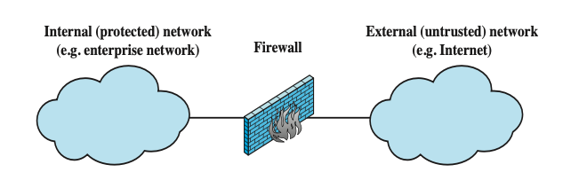

### Firewall Design Goals

- All traffic from inside to outside, and vice versa, must pass through the firewall

- Only authorized traffic as defined by the local security policy will be allowed to pass

- The firewall itself is immune to penetration


为了发挥有效的保护作用，防火墙在设计上必须满足三个基本目标：  

1. **强制通行**：所有从内到外或从外到内的流量，都**必须**经过防火墙。  
2. **授权准入**：只有符合本地安全策略定义的**授权流量**才允许通过。  
3. **自身免疫**：防火墙设备**自身必须是免疫的**，即它不容易被渗透或攻破。  

### Firewall Filter Characteristics 防火墙的过滤特征

Characteristics that a firewall access policy could use to filter traffic include:

- IP address and protocol values

  - Based on the source or destination addresses and port numbers, direction of flow (inbound or outbound), and other network and transport layer characteristics

  - Used by packet filter and stateful inspection firewalls

  - Typically used to limit access to specific services

- Application protocol

  - Controls access on the basis of authorized application protocol

    data.

  - Used by application- level gateways that relay and monitor the exchange of information for specific application protocols

- User Identity
  - Based on the identity of inside users

- Network activity

  - Controls access based on considerations such as the time of request, rate of requests, or other activity patterns


防火墙通过不同的特征来筛选流量，常见的过滤依据包括：  

- **IP 地址和协议值**：基于源/目的 IP、端口号、流量方向（进/出）以及传输层特征（如 TCP/UDP）。这是包过滤和状态检测防火墙的主要手段，常用于限制对特定服务的访问。  
- **应用协议**：基于授权的应用层协议数据进行控制。这由**应用级网关 (Application-level gateways)** 执行，用于监控特定的应用层交换。  
- **用户身份**：基于内部用户的身份信息进行过滤。  
- **网络活动**：基于请求的时间、请求速率或其他活动模式进行控制

### Firewall Capabilities and Limits 防火墙的能力与局限性

Capabilities:

- Defines a single choke point

- Provides a location for monitoring security events (e.g., audits, alarms)

- Convenient platform for several Internet functions that are not security related, e.g., network address translator

Limitations:

- Cannot protect against attacks bypassing firewall

- May not protect fully against internal threats

- Laptop or portable storage device may be infected outside the corporate network then used internally


了解防火墙“能做什么”和“不能做什么”对于构建整体安全架构至关重要：

**防火墙的能力 (Capabilities)：**

- **定义单一咽喉点 (Choke Point)**：强制所有流量经过一点，便于统一管理。  
- **安全事件监控**：提供审计、报警等监控安全事件的绝佳位置。  
- **集成非安全功能**：可以作为网络地址转换 (NAT) 等互联网功能的平台。  

**防火墙的局限性 (Limitations)：**

- **无法防御绕过防火墙的攻击**：例如通过拨号连接或其他外部接口进行的攻击。  
- **对内部威胁保护有限**：可能无法完全防御来自内部人员的攻击。  
- **“移动渗透”风险**：笔记本电脑或便携式存储设备（如 U 盘）在公司外部感染后带入内网使用，防火墙无法拦截这种物理携带的威胁。

## Types of firewalls 防火墙的类型 

- A firewall can monitor network traffic at a number of levels
- Based on the levels of network traffics, firewalls can be categorized into the following types:
- 防火墙可以根据其监控网络流量的层次进行分类。主要包括以下四种类型：**包过滤防火墙**、**状态检测防火墙**、**应用层网关（应用代理）以及电路级网关（电路级代理）**。  

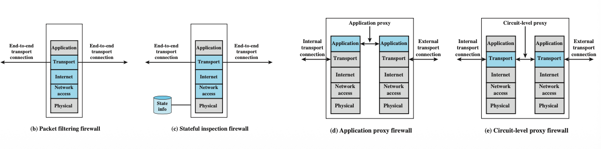

### Packet Filtering Firewall 包过滤防火墙

- Applies rules to each incoming and outgoing IP packet

  - Is typically set up as a list of rules based on matches in the IP or TCP header

  - Forwards or discards the packet based on rules match

  - 对每一个进出的 IP 数据包应用一组规则。它根据数据包头部的匹配结果决定**转发**还是**丢弃**。 

- Two default policies:

  - Discard - prohibit unless expressly permitted
    - More secure but can reduce availability

  - Forward - permit unless expressly prohibited
    - Easier to manage and use but less secure
  - **丢弃 (Discard)**：除非明确允许，否则禁止通行。安全性更高。  
  - **转发 (Forward)**：除非明确禁止，否则允许通行。更易管理但安全性较低。  

- Filtering rules are based on information contained in a network packet
  - Source IP address
  - Destination IP address
  - Source and destination transport-level address (e.g., TCP or UDP port number)
  - IP protocol field (e.g., 6 for TCP, 17 for UDP)
  - Interface
- **过滤依据**：
  - 源/目的 IP 地址。  
  - 源/目的传输层端口号（如 TCP/UDP 端口）。  
  - IP 协议字段（如 TCP 为 6，UDP 为 17）。  
  - 进出的接口。

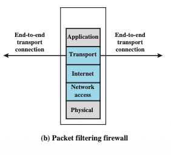

### Packet-Filtering Firewall Example 

- Simplified rule set for SMTP traffic.

- The goal is to allow inbound and outbound email traffic but to block all other traffic.

  目标是允许进出的邮件流量，但阻止所有其他流量。

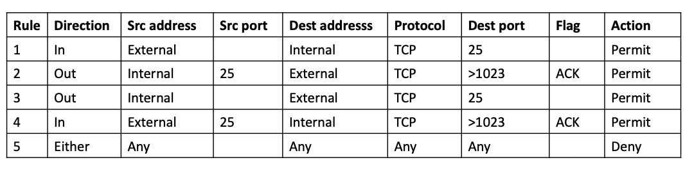

### Stateful Inspection Firewall 状态检测防火墙

- Tightens rules for TCP traffic by creating a directory of **outbound TCP connections**

  - There is an entry for each currently established connection

  - Allow incoming traffic to high numbered ports only for those packets that fit the profile of one of the entries in this directory


状态检测防火墙比简单的包过滤更进了一步，能够理解“连接”的概念。  

- **工作原理**：通过创建一个 **连接状态表 (Connection State Table)** 来跟踪所有当前的 TCP 连接。  
- **优势**：只有当进入的数据包符合状态表中已记录的、由内向外发起的连接配置时，才允许其通过高位端口进入。  
- **示例逻辑**：如果内网主机 `192.168.1.100` 访问外部 Web 服务器，防火墙会记录这一状态。只有来自该 Web 服务器的回包才会被允许通过，这有效防止了未经请求的外部连接尝试。

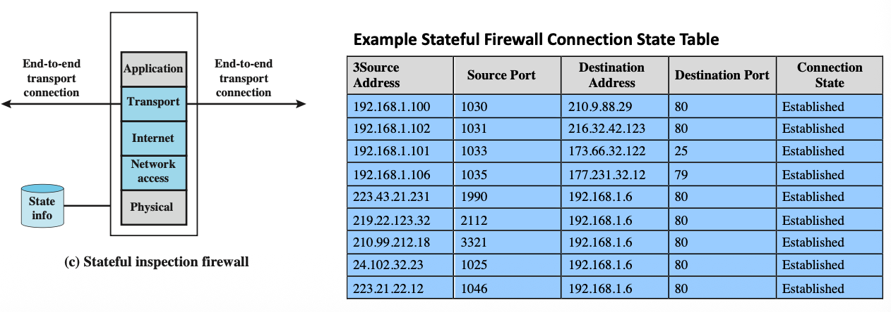

### Application-Level Gateway 应用层网关

- Also called an application proxy

- Acts as a relay of application-level traffic

  - E.g., Telnet, FTP

  - How it works:
    1. Client connects to the proxy gateway
    2. Gateway establishes a separate connection to the destination server
    3. Gateway inspects and filters application-layer payload (e.g., FTP commands, HTTP requests)

这种类型通常被称为**应用代理**，工作在应用层。  

- **工作原理**：它充当应用流量的**中继（Relay）**。客户端不直接连接目标服务器，而是先连接代理网关。  
- **操作步骤**：  
  1. 用户使用 TCP/IP 应用（如 FTP、Telnet）联系网关。
  2. 用户进行身份验证。
  3. 网关代表用户联系远程主机，并在两者之间转发数据。
- **核心优势**：它可以**检查并过滤应用层载荷**（例如检查 FTP 命令或 HTTP 请求的具体内容），安全性最高，但处理开销也最大。 

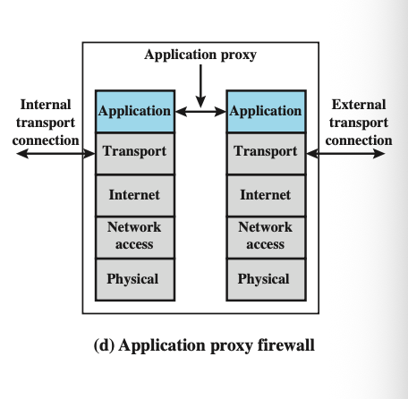

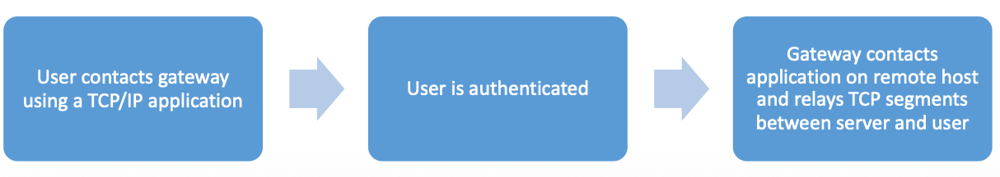

### Circuit-Level Gateway 电路级网关

- Also called circuit level proxy
- Sets up two TCP connections, one between itself and a TCP user on an inner host and one on an outside host
- Relays TCP segments from one connection to the other without examining contents
- Typically used when inside users are trusted
  - May use application-level gateway inbound and circuit-level gateway outbound

这是一种特殊的代理，主要工作在传输层。  

- **工作原理**：它在内部主机和外部主机之间建立两条独立的 TCP 连接。  
- **特点**：它只是简单地将 TCP 段从一条连接转发到另一条连接，**不检查数据包的内容**。  
- **典型用途**：通常用于内部用户是可信的环境。在实际部署中，常采取“入站使用应用级网关，出站使用电路级网关”的策略。

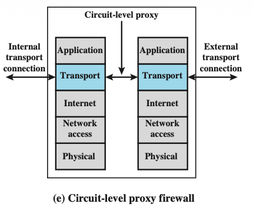

## Firewall basing and location 

### Firewall Basing 防火墙基准

- It is common to base a firewall on a stand-alone machine running a common operating system, such as UNIX or Linux.
- Firewall functionality can also be implemented as a software module in a router or LAN switch.
- Some additional firewall basing considerations.

防火墙可以通过不同的硬件和软件形式实现：  

- **独立设备 (Stand-alone machine)**：最常见的方式是运行在通用操作系统（如 UNIX 或 Linux）上的专用机器。  
- **模块化实现**：防火墙功能也可以作为软件模块实现在**路由器**或 **LAN 交换机**中。  
- **堡垒主机 (Bastion Hosts)**：这是一种经过加固的计算机，专门作为应用级或电路级网关的平台，直接暴露在外部威胁之下。  
- **基于主机的防火墙 (Host-Based Firewalls)**：安装在单个主机（通常是服务器）上的软件模块，用于保护该特定设备。  
- **个人防火墙 (Personal Firewall)**：安装在个人电脑上的软件，例如家庭环境中的防火墙。

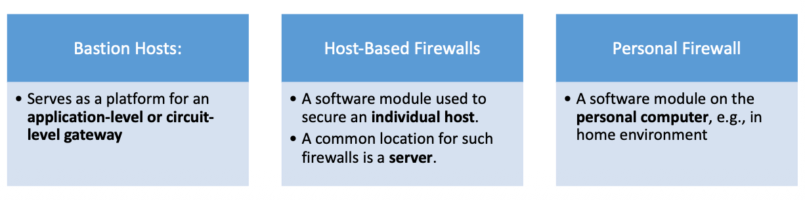

### Firewall Location and Configurations 防火墙位置与配置

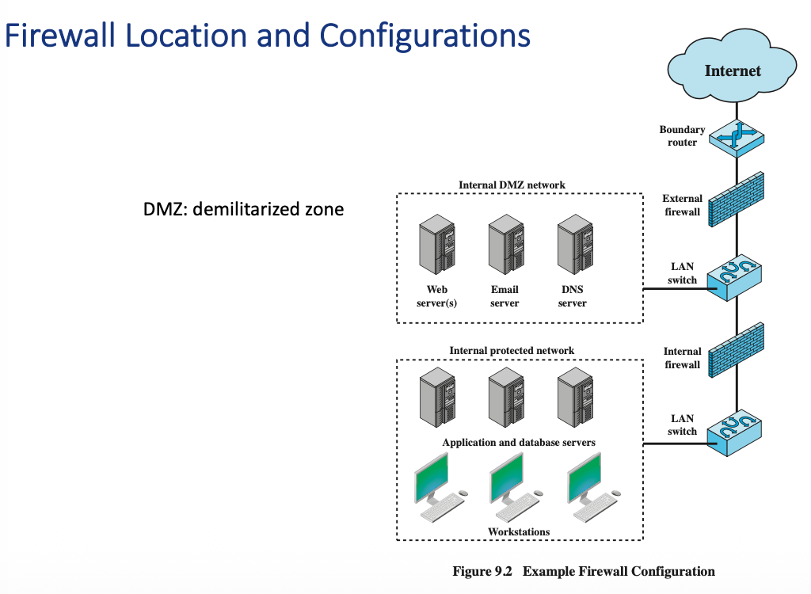

防火墙在网络中的位置决定了它能提供何种级别的保护。课件重点介绍了一个核心概念：**DMZ（隔离区/非军事区）**。  

#### **DMZ (Demilitarized Zone)**

DMZ 是介于外部网络（互联网）和内部受保护网络之间的一个中立网段。

- **外部防火墙 (External Firewall)**：位于边界路由器之后，保护 DMZ 免受互联网的直接攻击。  
- **内部防火墙 (Internal Firewall)**：位于 DMZ 和内部网络之间。它提供了更严格的保护，防止来自互联网或 DMZ 的攻击渗透到公司核心网络。  
- **DMZ 部署的服务器**：通常放置那些需要对外提供服务但又存在安全风险的设备，如 **Web 服务器、邮件服务器和 DNS 服务器**。 

### Distributed Firewalls 分布式防火墙

- A distributed firewall configuration involves stand-alone firewall devices plus host-based firewalls working together under a central administrative control.

- Host-based firewalls

  - On hundreds of servers and workstation as well as personal firewalls on local and remote user systems.

  - Protect against internal attacks and provide protection specialized to specific machines and applications.

- Stand-alone firewalls provide global protection.


这种配置结合了多种防火墙技术，形成一个协同防御体系：  

- **组成部分**：包括独立防火墙设备（如边界防火墙）和大量安装在服务器及工作站上的**驻留主机防火墙 (Host-resident firewall)**。  
- **统一管理**：所有这些防火墙都在**中央行政控制 (Central administrative control)** 下工作。  
- **优势**：
  - **深度防护**：主机防火墙可以针对特定机器和应用提供定制化保护。  
  - **防御内鬼**：如果内部网络某处被攻破，主机防火墙可以防止攻击在内网横向移动。  
  - **全局与局部结合**：独立防火墙提供全局保护，主机防火墙提供局部深度保护。

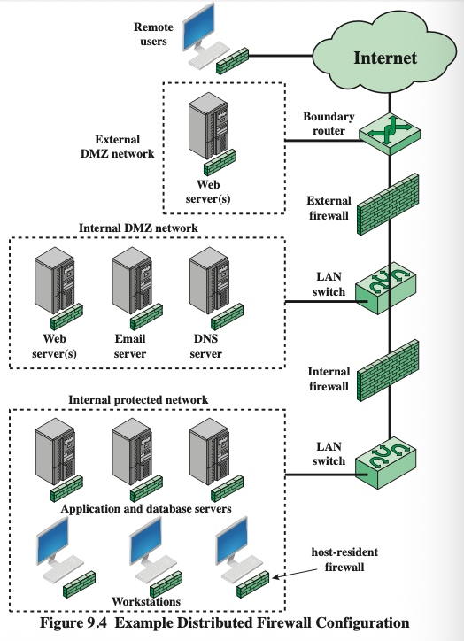

#### 典型部署案例解析

复杂的分布式架构示例：  

- **边界路由器**连接互联网。
- **外部 DMZ 网络**放置外部 Web 服务器。
- **内部 DMZ 网络**通过 LAN 交换机连接 Web、邮件和 DNS 服务器。
- **内部受保护网络**部署了内部防火墙，后方连接应用/数据库服务器以及受**驻留主机防火墙**保护的工作站。

## Intrusion Prevention

IPS，也叫 IDPS，是 IDS 的扩展。IDS 主要负责检测和报警，而 IPS 在检测到恶意行为后还可以尝试阻止或拦截。它可以是 host-based、network-based 或 distributed/hybrid，也可以使用 anomaly detection 或 signature/heuristic detection。最重要的一句话是：**IPS 像防火墙一样可以 block traffic，但它使用的是 IDS 的检测算法来决定什么时候阻止。**

### Intrusion Prevention Systems (IPS)

- Also known as Intrusion Detection and Prevention System (IDPS)

- Is an extension of an IDS that includes the capability to attempt to block or prevent detected malicious activity

- Can be host-based, network-based, or distributed/hybrid

- Can use anomaly detection to identify behavior that is not that of legitimate users, or signature/heuristic detection to identify known malicious behavior.

- Can block traffic as a firewall does but make use of the types of algorithms developed for IDSs to determine when to do so.

#### 1. 入侵防御系统的定义 (What is an IPS)

**入侵防御系统 (IPS)**，有时也被称为 **入侵检测与防御系统 (IDPS)**。  

- **核心功能**：它是 IDS 的扩展，除了监控功能外，还具备**尝试阻断或防止**检测到的恶意活动的能力。  
- **部署形式**：与 IDS 类似，IPS 可以是基于主机的（HIPS）、基于网络的（NIDS）或分布式/混合式的。  

#### 2. IPS 的检测技术

IPS 沿用了 IDS 已经成熟的算法来识别威胁：  

- **异常检测 (Anomaly detection)**：用于识别那些不属于合法用户行为的活动。  
- **特征/启发式检测 (Signature/heuristic detection)**：用于识别已知的恶意行为模式。  

#### 3. IPS 与防火墙的区别

虽然 IPS 像防火墙一样可以阻断流量，但它们的决策逻辑不同：

- **防火墙**：主要基于传统的过滤规则（如 IP 地址、端口、协议）来决定放行或阻止。  
- **IPS**：利用 IDS 的复杂算法，能够深入分析数据包的载荷、行为序列和上下文逻辑，从而在更复杂的攻击场景下决定是否阻断流量。  

### 总结：防御体系的闭环

通过这章的学习，我们可以看到现代网络防御是一个多层次的体系：

1. **防火墙**：在边界建立规则，过滤不符合安全策略的基础流量。  
2. **IDS**：像雷达一样监控网络内部和主机的可疑活动，并发出预警。  
3. **IPS**：结合了 IDS 的情报和防火墙的阻断能力，实现自动化防御。  
4. **蜜罐**：作为诱饵吸引攻击者，为整个系统收集威胁情报。  

| 系统       | 主要作用             | 是否主动阻断 | 判断依据                         | 适合记忆方式     |
| ---------- | -------------------- | ------------ | -------------------------------- | ---------------- |
| Firewall   | 根据规则控制进出流量 | 是           | IP、端口、协议、方向、应用规则等 | 门卫             |
| IDS        | 发现可疑行为并报警   | 通常不是     | 异常检测、签名、启发式规则       | 监控摄像头       |
| IPS / IDPS | 检测并阻止攻击       | 是           | IDS 检测算法 + 阻断能力          | 会主动关门的 IDS |

# 考试可能提问与参考答案

## Question 1

**What are the three logical components of an IDS? Explain their roles.**

**Answer:**
 An IDS has three logical components: sensors, analyzers, and user interface. Sensors collect data such as network packets, log files, and system call traces. Analyzers process the collected data and decide whether an intrusion has occurred. The user interface allows the administrator to view alerts, outputs, or control system behavior. Therefore, the IDS works by collecting data, analyzing it, and reporting or displaying suspicious activity.

------

## Question 2

**Compare anomaly detection and signature / heuristic detection in IDS.**

**Answer:**
 Anomaly detection builds a model of legitimate or normal user behavior and compares current behavior against that model. If current behavior deviates significantly, it may be treated as an intrusion. It can potentially detect unknown attacks, but it often has a higher false positive rate because normal behavior changes over time.

Signature / heuristic detection uses known malicious patterns or attack rules. Signature detection matches exact malicious content, while heuristic detection uses behavior rules, such as repeated failed logins. It usually has lower false positives, but it may miss new or unknown attacks because it depends on known patterns or rules.

------

## Question 3

**Explain false positive and false negative in IDS. Which one is more dangerous?**

**Answer:**
 A false positive means the IDS reports an intrusion when the activity is actually legitimate. For example, a normal user is wrongly treated as an attacker. A false negative means the IDS fails to detect a real attack. In security, false negative is usually more dangerous because the attacker can continue their malicious activity without being noticed. However, too many false positives are also problematic because administrators may ignore alerts and normal users may be affected.

------

## Question 4

**Given the following IDS test result, calculate TP, TN, FP, FN.**

```
Event: a b c d e f g h i j
Test:  0 0 0 1 1 0 0 1 0 1
Truth: 0 1 0 1 0 0 1 1 0 0
```

**Answer:**

| Event | Test | Truth | Result |
| ----- | ---- | ----- | ------ |
| a     | 0    | 0     | TN     |
| b     | 0    | 1     | FN     |
| c     | 0    | 0     | TN     |
| d     | 1    | 1     | TP     |
| e     | 1    | 0     | FP     |
| f     | 0    | 0     | TN     |
| g     | 0    | 1     | FN     |
| h     | 1    | 1     | TP     |
| i     | 0    | 0     | TN     |
| j     | 1    | 0     | FP     |

So:

```
TP = 2
TN = 4
FP = 2
FN = 2
```

------

## Question 5

**Compare HIDS and NIDS.**

**Answer:**
 HIDS monitors the characteristics of a single host, such as system call traces, log files, file integrity checksums, and registry access. It is suitable for protecting important servers or administrative systems. It can detect both external and internal intrusions.

NIDS monitors network traffic at selected network points. It examines packets in real time or near real time and may analyze network, transport, and application-level protocols. NIDS is useful for detecting suspicious traffic patterns, but its effectiveness can be reduced when traffic is encrypted.

------

## Question 6

**What is a honeypot? Why is it useful?**

**Answer:**
 A honeypot is a decoy system designed to attract attackers. It usually has no real production value and contains fabricated information. Its purpose is to divert attackers from critical systems, collect information about attacker behavior, and keep attackers engaged long enough for administrators to respond. If there is inbound communication to a honeypot, it is likely to be a scan, probe, or attack. If the honeypot initiates outbound communication, it may have been compromised.

------

## Question 7

**What are the three firewall design goals?**

**Answer:**
 The three firewall design goals are:

```
1. All traffic from inside to outside and from outside to inside must pass through the firewall.
2. Only authorized traffic defined by local security policy is allowed to pass.
3. The firewall itself should be immune to penetration.
```

These goals ensure that the firewall becomes a controlled checkpoint between trusted and untrusted networks.

------

## Question 8

**Compare packet filtering firewall and stateful inspection firewall.**

**Answer:**
 A packet filtering firewall checks each IP packet independently. It uses information such as source IP, destination IP, protocol, source port, destination port, and interface. It is simple and fast, but it does not understand the connection state.

A stateful inspection firewall improves this by maintaining a table of active connections. It allows incoming packets only if they match an existing valid connection state. Therefore, it is more secure than simple packet filtering because it understands whether a packet belongs to an established connection.

------

## Question 9

**Compare application-level gateway and circuit-level gateway.**

**Answer:**
 An application-level gateway, also called an application proxy, relays application-level traffic. The client connects to the proxy, the proxy connects to the destination server, and the proxy inspects application-layer payloads such as HTTP requests or FTP commands. It provides strong application-level control but has higher overhead.

A circuit-level gateway sets up two TCP connections: one between the internal host and the gateway, and another between the gateway and the outside host. It relays TCP segments without examining the content. It is usually used when inside users are trusted.

------

## Question 10

**What are the capabilities and limitations of firewalls?**

**Answer:**
 A firewall provides a single choke point for controlling traffic. It is also a useful location for monitoring security events, audits, and alarms. It can also support non-security functions such as NAT.

However, a firewall cannot protect against attacks that bypass it. It may not fully protect against internal threats. It also cannot prevent a laptop or portable device from being infected outside the corporate network and then brought inside. Therefore, firewalls should be combined with IDS, IPS, host protection, access control, and security policies.

------

## Question 11

**What is a DMZ and why is it used?**

**Answer:**
 A DMZ, or demilitarized zone, is a separate network area between the external untrusted network and the internal protected network. Public-facing servers such as web servers, email servers, and DNS servers are often placed in the DMZ. The purpose is to allow external users to access public services without directly reaching the internal network. Even if a DMZ server is compromised, the attacker still needs to pass through another firewall to access internal protected systems.

------

## Question 12

**What is an IPS? How is it different from IDS and firewall?**

**Answer:**
 An IPS, also called IDPS, is an extension of IDS. IDS mainly detects suspicious behavior and sends alerts, while IPS can also block or prevent detected malicious activity. A firewall blocks or allows traffic mainly based on predefined rules such as IP address, port, and protocol. IPS can also block traffic, but it uses IDS-like detection algorithms, such as anomaly detection and signature / heuristic detection, to decide whether traffic is malicious.

