# 2.1 Fundamentals of cryptography (1)

## 知识图谱

```plaintext
L-02 Fundamentals of Cryptography (1): Symmetric Encryption
│
├── 1. Classical and Modern Cryptography
│   │
│   ├── 1.1 Historical cryptography
│   │   ├── “writing or solving codes”
│   │   ├── 主要目标：secret communication
│   │   ├── 依赖双方提前共享 secret key
│   │   ├── 主要实现 CIA 中的 Confidentiality
│   │   └── 应用：military / governments
│   │
│   ├── 1.2 Modern cryptography
│   │   ├── 1970s-1980s 后变成 science
│   │   ├── 不再只是保密
│   │   ├── Data integrity
│   │   ├── User authentication
│   │   ├── Electronic auction and voting
│   │   ├── Digital cash
│   │   └── 基于严谨数学分析和安全证明
│   │
│   └── 1.3 Classical vs Modern
│       ├── Classical: art, heuristic, ad hoc
│       ├── Modern: science, rigorous analysis
│       └── 应用范围：military → everywhere
│
├── 2. Private-key / Symmetric-key Encryption
│   │
│   ├── 2.1 基本思想
│   │   ├── 加密和解密使用同一把 key
│   │   ├── Secure communication
│   │   └── Secure storage
│   │
│   ├── 2.2 Formal definition
│   │   ├── Message space M
│   │   ├── Gen: 生成密钥 k
│   │   ├── Enc(k,m): 明文 m → 密文 c
│   │   ├── Dec(k,c): 密文 c → 明文 m 或 error
│   │   └── Correctness: Dec(k, Enc(k,m)) = m
│   │
│   └── 2.3 Security intuition
│       ├── 没有 key 的攻击者只能看到 ciphertext
│       └── 目标主要是保护 confidentiality
│
├── 3. Classical Ciphers
│   │
│   ├── 3.1 Shift cipher / Caesar cipher
│   │   ├── a=0, b=1, ..., z=25
│   │   ├── key k ∈ {0,...,25}
│   │   ├── Enc: ci = mi + k mod 26
│   │   ├── Dec: mi = ci - k mod 26
│   │   └── 不安全：key space 只有 26
│   │
│   ├── 3.2 Attacks on shift cipher
│   │   ├── Brute-force exhaustive search
│   │   ├── 逐个尝试 26 个 key
│   │   └── 正常英语明文通常可以被识别出来
│   │
│   ├── 3.3 Frequency analysis
│   │   ├── 利用自然语言中字母出现频率不均衡
│   │   ├── 高频密文字母可能对应高频明文字母
│   │   └── 古典密码容易被统计规律攻击
│   │
│   ├── 3.4 Sufficient key space principle
│   │   ├── key space 必须足够大
│   │   ├── 防止穷举搜索
│   │   └── Caesar cipher 因 key space=26 而不安全
│   │
│   └── 3.5 Vigenère cipher
│       ├── key 是字符串，不是单个数字
│       ├── 每个字符根据 key 对应字符进行 shift
│       ├── key 不够长时循环使用
│       ├── key space 大，暴力破解困难
│       └── 仍可被周期性 + 频率分析攻击
│
├── 4. Symmetric Encryption Types
│   │
│   ├── 4.1 Stream ciphers
│   │   ├── 使用 PRG G(k) 生成伪随机密钥流
│   │   ├── c = G(k) XOR m
│   │   ├── m = G(k) XOR c
│   │   └── 适合按 bit / byte 连续处理数据
│   │
│   └── 4.2 Block ciphers
│       ├── 固定 block size
│       ├── 固定 key length
│       ├── 一次处理一个数据块
│       ├── 优点：diffusion 好、抗插入、互联网常用
│       └── 缺点：较慢、需要等待完整 block、错误传播影响整个 block
│
├── 5. Block Cipher Examples
│   │
│   ├── 5.1 DES
│   │   ├── 1977 年提出
│   │   ├── 使用 substitution / permutation / table lookup
│   │   ├── 多轮操作
│   │   └── 主要问题：key 太短，不适合严肃安全场景
│   │
│   └── 5.2 AES
│       ├── 用于替代 DES
│       ├── NIST 公开竞赛选出
│       ├── 原名 Rijndael
│       ├── 使用 substitution + permutation
│       ├── block size = 128 bits
│       ├── key length = 128 / 192 / 256 bits
│       ├── 内部 state 是 4×4 byte array
│       └── 128/192/256-bit key 分别对应 10/12/14 rounds
│
├── 6. Cryptographic Modes
│   │
│   ├── 6.1 Mode 的含义
│   │   ├── 同一个 cipher 可以用不同 mode
│   │   ├── mode 决定如何处理多个 block
│   │   └── 错误 mode 会泄露 pattern
│   │
│   ├── 6.2 ECB Mode
│   │   ├── 每个 block 独立加密
│   │   ├── 同样 plaintext block + same key → same ciphertext block
│   │   ├── 泄露重复模式
│   │   ├── 容易被 frequency / pattern / correlation analysis 利用
│   │   └── 实际安全场景中通常不应使用
│   │
│   ├── 6.3 CBC Mode
│   │   ├── 加入 feedback
│   │   ├── 当前 block 加密前先 XOR 前一个 ciphertext block
│   │   ├── C_i = Enc_k(P_i XOR C_{i-1})
│   │   ├── 相同 plaintext block 也可能得到不同 ciphertext
│   │   └── 隐藏重复数据模式
│   │
│   └── 6.4 Initialization Vector, IV
│       ├── 解决 CBC 第一块没有前序 ciphertext 的问题
│       ├── IV 与第一个 plaintext block XOR
│       ├── IV 通常和 ciphertext 一起发送
│       ├── IV 不需要保密，但需要随机/唯一
│       └── 使相同 message + same key 每次也产生不同 ciphertext
│
└── 7. Uses and Limitations of Symmetric Cryptography
    │
    ├── 7.1 Secrecy / Confidentiality
    │   └── 只有知道 key 的人才能解密
    │
    ├── 7.2 Authentication
    │   ├── 共享 key 加密可证明“可能来自共享 key 的某一方”
    │   └── 但不能严格证明到底是哪一方生成
    │
    ├── 7.3 Integrity / Non-alterability
    │   ├── 密文被改动后解密结果可能变乱码
    │   └── 但 encryption 本身不是完整性保护的最好工具
    │
    └── 7.4 Key management problem
        ├── 每两个人通信都需要共享 key
        ├── N 个用户时每人管理 N-1 把 key
        └── 大规模开放系统中难以扩展
```


## Outline

- Classical and modern cryptography

- Symmetric encryption

## Learning objetives

- Learn about classical cyphers.

  学习传统的加密方法

- Understand the basic operation of symmetric block encryption.

  理解基础的对称加密的运行逻辑

- Understand why CBC mode is needed.

  理解为什么 CBC 模型是必须的

- Apply symmetric encryption.

  应用对称加密

## Classical and modern cryptography

### Cryptography (historically)

- “...the art of writing or solving codes...” 
  - Concise Oxford English Dictionary 字典上的解释

- Historically, cryptography focused exclusively on ensuring secret communication between two parties sharing secret information in advance (aka, codes or private-key encryption)

  历史上，密码学仅专注于确保事先共享秘密信息的双方之间进行秘密通信（即代码或私钥加密）。

- Which one of CIA is achieved?

  **Confidentiality**

- Application

  - Military organization and governments

    军事组织或者政府通信

### Modern cryptography 现代密码学

从 20 世纪 70 年代末到 80 年代初开始，密码学逐渐演变成一门真正的**“科学”** 

- Much broader scope!

  更广泛的范畴

  - Data integrity

    数据完整性

  - User authentication

    身份认证

  - Electronic auction and voting

    线上投票

  - Digital cash

    电子支付

  - …

- “Design, analysis, and implementation of mathematical techniques for securing information, systems, and computation against adversarial attack”

  “设计、分析和实施数学技术，以保护信息、系统和计算免受对抗性攻击”

### Classical and modern cryptography

- “...the art of writing or solving codes...”

- Historically, cryptography was an art

  传统的密码学被认为是“艺术”

  - Heuristic, ad hoc design and analysis

    启发式、临时设计与分析

  - Schemes proposed, broken, repeat...

    提出一个方案，破解，然后再换一个方案，如此循环。

- Application
  - Military organization and governments

- Cryptography is now a science
  
  现在的密码学则变成了一种“科学”
  
  - Rigorous analysis, firm foundations, deeper understanding, rich theory
  
    严格的分析，稳固的基础，深入的理解以及丰富的理论
  
- Application
  - Everywhere

### Classical cryptography

- From at least 4000 year ago, ancient Egyptians

  至少从4000年前起，古埃及人

- Until the 1970s,

- Exclusively concerned with ensuring secrecy of communication

  专门致力于确保通信的保密性

  - Encryption

- Relied exclusively on secret information (a key) shared between the communicating parties

  完全依赖于通信双方之间共享的秘密信息（密钥）。

  - Private-key cryptography

    私钥加密

  - AKA secret-key / shared-key / symmetric-key cryptography

    对称加密

## Private-key encryption 私钥加密

- **Secure communication**

  **安全通话**

  - Two parties share a key that they use to communicate securely

  两个加密对话的人共享一组只有两个人之间知道的密钥。这样即使信息在中间被截断，但是由于没有对应的密钥，那么截取信息的人也没有办法获取其中具体的信息。

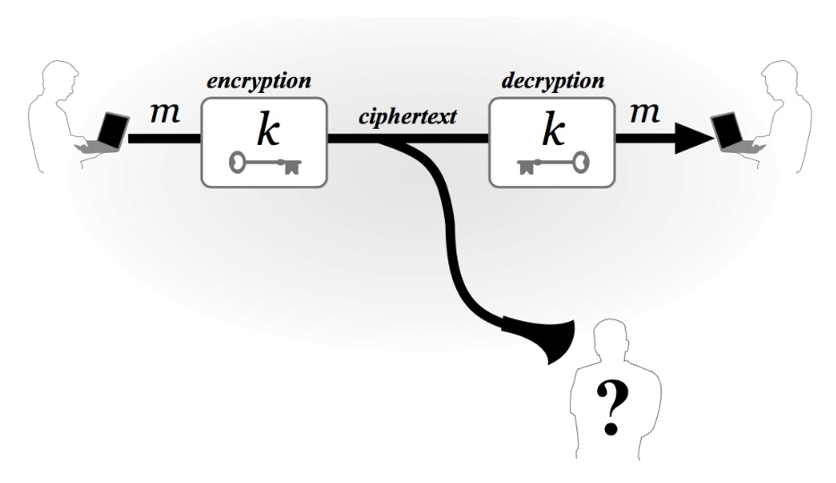

- **Secure Storage** 

  **安全存储**

  - A single user stores data securely over time

    单个用户长期安全地存储数据

    用户在时间 $t_1$ 加密数据并存储，在时间 $t_2$ 使用相同的密钥解密读取 。用户在时间 $t_1$ 加密数据并存储，在时间 $t_2$ 使用相同的密钥解密读取 。

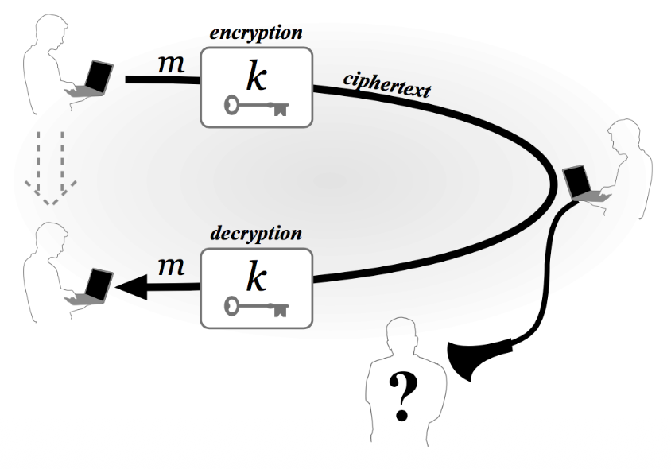

- A private-key encryption scheme is defined by a message space 𝑀 and algorithms (𝐺𝑒𝑛, 𝐸𝑛𝑐, 𝐷𝑒𝑐):

  在密码学作为一门“科学”的框架下，一个私钥加密方案由**消息空间 $M$** 和**三个核心算法**（Gen, Enc, Dec）组成 

  - 𝐺𝑒𝑛 (key-generation algorithm): generates 𝑘 

    密钥生成算法，用于生成一个随机的密钥k

  - 𝐸𝑛𝑐 (encryption algorithm) 加密算法: takes key 𝑘 and message 𝑚 ∈ 𝑀 as input; outputs ciphertext 𝑐

    - 输入：密钥 $k$ 和消息 $m$ ($m \in M$) 。
    - 输出：密文 $c$。写作：$c \leftarrow Enc_{k}(m)$ 。

    - 𝑐 ← 𝐸𝑛𝑐~k~ (𝑚)

  - 𝐷𝑒𝑐 (decryption algorithm) 解密算法: takes key 𝑘 and ciphertext 𝑐 as input; outputs 𝑚 or “error”

    - 输入：密钥 $k$ 和密文 $c$ 。
    - 输出：原始消息 $m$ 或者一个“错误”标记（如果密文无效） 。

    - 𝐷𝑒𝑐~k~ (𝑐) = 𝑚

  - For all 𝑚 ∈ 𝑀 and 𝑘 output by 𝐺𝑒𝑛,

    一个有效的加密方案必须满足：对于任何生成的密钥 $k$ 和任何消息 $m$，解密算法必须能还原加密后的内容 。

    - 𝐷𝑒𝑐~k~ (k, 𝐸𝑛𝑐~k~ (𝑚)) = 𝑚

简单来说，对称加密就像是一个带有唯一钥匙的保险箱：你用这把钥匙锁上（加密），也必须用这把同样的钥匙才能打开（解密）。

### The shift cipher 移位密码

- Caesar cipher, used by Julius Caesar

  移位密码最著名的例子就是**凯撒密码（Caesar cipher）**

- Consider encrypting English text

  通常基于英语字母来进行移位

- Associate a with 0; b with 1; ...; z with 25

  将英文字母表与数字 0-25 对应（a=0, b=1, ..., z=25）

  - 𝑘 ∈ {0, … , 25}

    密钥k是一个 0 到 25 之间的整数 

- To encrypt using key 𝑘, shift every letter of the plaintext by 𝑘 positions to the right (with wraparound)

  **加密 (Enc)**：将明文中的每个字母向右移动 $k$ 个位置。如果超过了 'z'，则从 'a' 开始循环（即取模 26） 

- Decryption just reverses the process

  **解密 (Dec)**：将密文中的每个字母向左移动 $k$ 个位置

example, takes the k=23

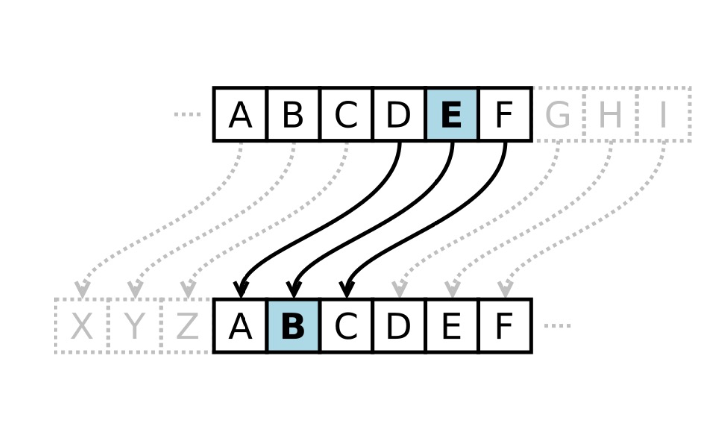

### The shift cipher, formally 公式表达

- 𝑀 = {strings over lowercase English alphabet}

  **原文 (M)**：M是一串英文字母组成的字符串

- 𝐺𝑒𝑛: choose uniform 𝑘 ∈ {0, … , 25}

  **密钥 ($k$)**：密钥是一个 0 到 25 之间的整数 

- 𝐸𝑛𝑐~k~ (𝑚~1~… 𝑚~t~ ): output 𝑐~1~… 𝑐~t~ , where
  - c~i~ $: =$ [m~i~ + 𝑘 mod 26]

- 𝐷𝑒𝑐~k~ (𝑐~1~… 𝑐~t~ ): output 𝑚~1~… 𝑚~t~ , where
  - m~i~ $: =$ [c~i~ − 𝑘 mod 26]

### Is the shift cipher secure? 移位密码安全吗？

- **No**, only 26 possible keys!

  移位密码非常不安全，就比如普通的凯撒密码就只有26种密钥

- Given a ciphertext, try decrypting with every possible key

  因为一共也只有26种偏移方式，所以可以很简单地通过暴力破解的方式破解掉。

- If ciphertext is long enough (and plaintext is normal English), only one possibility will “make sense”

  在暴力破解之后，实际上只需要查看最后破译的结果中读的通顺的结果就是原文。

- Example

  - Ciphertext: uryybjbeyq

  - Try every possible key...

    - 𝑘 = 1: tqxxaiadxp

    - 𝑘 = 2: spwwzhzcwo

    - …

    - 𝑘 = 13: helloworld

### Frequency analysis 频率分析

- Match up the frequency distribution of the letters.

  除了穷举法，古典密码还容易受到**频率分析**的攻击。例如正常的英语中d出现的次数很高，而x的出现次数很低。然后d被替换成了x，那么加密的信息中x的出现频率会明显高于其他的字母，可以倒推x替换了字母d。

### Sufficient key space principle 足够的密钥空间

- The key space should be large enough to prevent “brute-force” exhaustive-search attack

  密钥空间应足够大，以防“暴力破解”穷举搜索攻击

- If an encryption scheme has a key space that is too small, then it will be vulnerable to exhaustive-search attacks

  如果加密方案的密钥空间太小，那么它将容易受到穷举搜索攻击

- Exmaple: Caesar cipher is insecure
  - The key space is 26

## The Vigenère cipher 维吉尼亚密码

维吉尼亚密码是对移位密码的一种改进，它引入了“多表代换”的概念

- The key is now a string, not just a character

  **密钥是一个字符串**：不再只是一个数字，而是一个单词或字符串（例如 $k=$ 'cafe'）

- To encrypt, shift each character in the plaintext by the amount dictated by the next character of the key

  明文中的每个字符根据密钥中对应字符的数值进行移位 。（a=1, b=1, c=2, ..., z=25) 

  - Wrap around in the key as needed

    如果密钥比明文短，则循环使用密钥 

- Decryption just reverses the process

  解密的方式就是将加密的逆向操作

- Example
  - 𝑘=‘cafe’ 

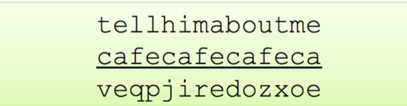

### 维吉尼亚密码的密钥空间与安全性

- Size of key space?

  如果密钥长度固定为 14 个字符，那么密钥空间的大小约为 $26^{14} \approx 2^{66}$ 。这个数值非常巨大，使得单纯的“穷举攻击”变得极其困难或几乎不可能实现 。

  - If keys are 14-character strings; then key space has size 
    - 26^14^ ≈ 2^66^ 

- Brute-force search expensive/impossible

- Is the Vigenère cipher secure?

  - (Believed secure for many years...)

    由于密钥空间巨大，它在很多年里一直被认为是安全的

### Attacking the Vigenère cipher 破解维吉尼亚密码

尽管密钥空间很大，但维吉尼亚密码存在一个致命的弱点：**周期性**
The Vigenère cipher has a large key space, so brute-force attack is hard. However, it is still insecure because the key is reused periodically. Once the key length is known or guessed, characters encrypted by the same key position can be separated and attacked like independent shift ciphers using frequency analysis.

- (Assume a 14-character key)

- Observation: every 14th character is “encrypted” using the same shift

  如果我们假设密钥长度为 $L$，那么密文中每隔 $L$ 个字符就是由同一个密钥字母加密的 

- Exmaple: Looking at every 14th character is almost like looking at ciphertext encrypted with the shift cipher

  观察每第14个字符，几乎就像是在查看使用移位密码加密的密文。

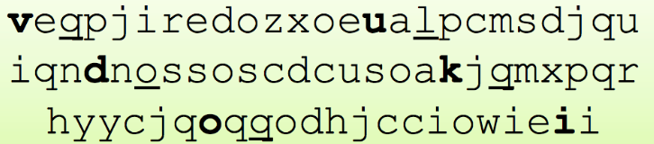

- Look at every 14th character of the ciphertext, starting with the first
- Let 𝛼 be the most common character appearing in this portion of the ciphertext
- Most likely, this character corresponds to the most common plaintext character (‘e’)
- Guess the first character of the key is 𝛼 − e
- Repeat for all other positions

破解步骤：

1. **分组**：将密文按密钥长度分成若干组（例如每第 14 个字母为一组）。

2. **频率分析**：对每一组单独进行频率分析。这就像是在处理多个互不相关的移位密码。

3. **猜测密钥**：寻找每一组中最常出现的字符 $\alpha$，并假设它对应明文中最常见的字母 'e'。那么该位置对应的密钥字符大概率就是 $\alpha - e$。

4. **重复**：对密钥的所有位置重复此操作。

### Historically...

- Cryptography was an art
  - Heuristic, ad hoc design and analysis

- In the late 1970s and early 1980s, cryptography began to develop into more of a science

## Symmetric (Private-Key) encryption

- Block ciphers
- Cryptographic modes
- Uses of symmetric cryptography

### Symmetric Encryption 对称加密

- A private-key (or symmetric) encryption scheme is a tuple of probabilistic polynomial-time algorithms **(Gen, Enc, Dec)** such that

  - **𝑘 ← Gen(1^n^)** is the key-generation algorithm which takes as input 1^n^ (i.e., the security parameter written in unary) and outputs a key 𝑘;

    **Gen (密钥生成算法)**：输入一个安全参数 $1^n$，输出一个密钥 $k$ 。

  - **𝑐 ← Enc(𝑘, 𝑚)** is the encryption algorithm which takes as input a key 𝑘 and a plaintext message 𝑚 ∈ {0,1}^*^, and outputs a ciphertext 𝑐;

    **Enc (加密算法)**：输入密钥 $k$ 和一段二进制明文消息 $m \in \{0, 1\}^*$，输出密文 $c$ 。

  - **𝑚/⊥$:=$ Dec(𝑘, 𝑐)** is the decryption algorithm which takes as input a key 𝑘 and ciphertext 𝑐, and outputs a message 𝑚 or an error.

    **Dec (解密算法)**：输入密钥 $k$ 和密文 $c$，输出原始消息 $m$。如果密文无效，则输出错误符号 $\perp$ 。

- Correctness

  - For every 𝑛, every 𝑘 ← Gen(𝑛), and every 𝑚 ∈ {0,1}^*^, it holds that

    对于任何生成的密钥和消息，必须满足

    - **Dec(k, Enc(k,m)) = m**

| 对比点   | Stream Cipher                   | Block Cipher                       |
| -------- | ------------------------------- | ---------------------------------- |
| 处理单位 | bit / byte / continuous stream  | fixed-size block                   |
| 核心思想 | PRG 生成 keystream，再 XOR 明文 | 用 key 对固定大小 block 做复杂变换 |
| 公式     | c = G(k) ⊕ m                    | C = Enc(k, P)                      |
| 优点     | 可以连续处理，适合流式数据      | diffusion 好，互联网中常见         |
| 缺点     | keystream 不能重复使用          | 较慢，需要等待完整 block           |

### Stream ciphers 流加密

**基于伪随机生成器（PRG）构造的流密码（Stream Cipher）**

- Let G be a pseudorandom generator with expansion factor 𝑙, the stream cipher for message of length 𝑙 is defined as:

  将较短的随机密钥 $k$ 输入生成器 $G$，得到一段长度为 $l$ 的伪随机序列 $G(k)$ 。

  - Gen: on input 1^n^, choose a uniform 𝑘 ∈ {0,1}^n^ and output it as the key

  - Enc: on input a key 𝑘 ∈ {0,1}^n^ and a message 𝑚 ∈ {0,1}^l(n)^, output the ciphertext

    **加密**：将明文 $m$ 与密钥流 $G(k)$ 进行按位异或，得到密文 $c := G(k) \oplus m$ 。

    - 𝑐 $:=$ 𝐺(𝑘)⨁𝑚

  - Dec: on input a key 𝑘 ∈ {0,1}^n^ and a ciphertext 𝑐 ∈ {0,1}^l(n)^ output the message

    **解密**：由于异或运算的特性，将密文 $c$ 再次与相同的密钥流 $G(k)$ 异或，就能还原出明文 $m := G(k) \oplus c$ 。

    - 𝑚 $:=$ 𝐺(𝑘)⨁𝑐

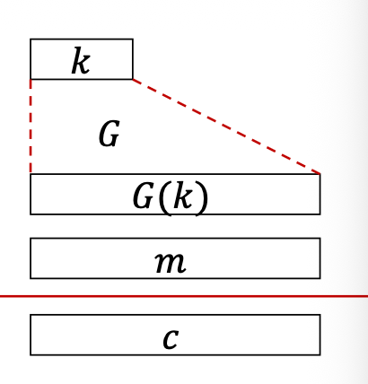

流加密的特点 ：

- **速度快**：异或运算在硬件和软件上都极其高效。
- **一位对一位**：它通常逐位或逐字节地处理数据。
- **安全性依赖于 $G$**：如果生成器 $G$ 产生的序列看起来足够随机，且密钥 $k$ 不泄露，则通信是安全的。

### Block ciphers 

在加密过程中，每一块明文（Plaintext）通过加密算法和密钥的作用，转换为对应的密文（Ciphertext） 

- Fixed block size

  **固定块大小 (Fixed block size)**：明文被分成大小相等的块进行加密 。

- Fixed key length

  **固定密钥长度 (Fixed key length)**：使用固定长度的密钥对每个块进行变换 。

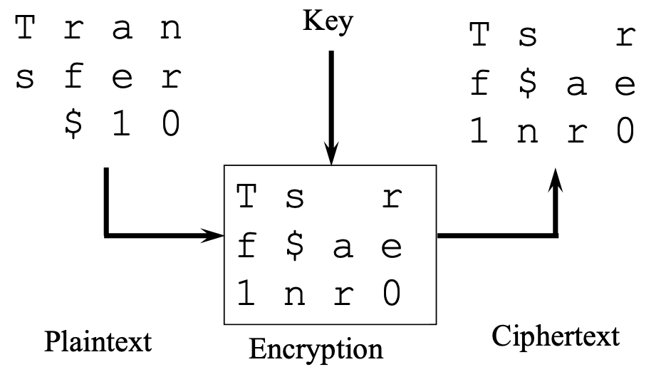

#### Advantages & disadvantages of block ciphers

Advantages：

- Good diffusion

  - Easier to make a set of encrypted characters depend on each other

    **良好的扩散性 (Good diffusion)**：更容易让加密后的字符集相互依赖，提高安全性 。

- Immunity to insertions

  - Encrypted text arrives in known lengths

    **抗插入性 (Immunity to insertions)**：加密文本以已知长度到达，不容易被随意插入伪造数据

- Most common Internet crypto are done with block ciphers

  **应用广泛**：目前大多数互联网加密方案都是基于块加密实现的 。

Disadvantages：

- Slower

  - Need to wait for block of data before encryption/decryption starts

    **速度较慢 (Slower)**：必须等凑够一整块数据后才能开始加密或解密操作 。

- Worse error propagation

  - Errors affect entire blocks

    **错误传播更严重 (Worse error propagation)**：如果某一块在传输中出现错误，可能会影响整块数据的解密结果 。

#### Sample block ciphers

- The Data Encryption Standard

- The Advanced Encryption Standard

- There are many others

##### The Data Encryption Standard 数据加密标准 (DES)

- Well known symmetric cipher

  DES 是一个非常有名的对称加密算法，诞生于 **1977 年** 

- Developed in 1977
  - Shouldn’t be, for anything serious

- Block encryption, using **substitutions, permutations**, table lookups

  **工作机制**：它通过重复应用**替换 (Substitutions)**、**置换 (Permutations)** 和**查表 (Table lookups)** 等操作来进行块加密 。

  - With multiple rounds

    进行很多轮加密

  - Each round is repeated application of operations

    每一轮都是这些操作的重复应用 。

- Only serious problem based on short key

  目前**不应该**再将 DES 用于任何严肃的安全业务中 。**主要缺陷**：它的唯一严重问题是**密钥过短**，容易受到攻击 。

##### The Advanced Encryption Standard 高级加密标准(AES)

- Intended to be the replacement for DES

  为了取代已经不再安全的 DES，美国国家标准与技术研究院 (NIST) 通过公开竞争选出了替代方案

- Chosen by NIST
  - Through an open competition

- Chosen cipher was originally called Rijndael

  **由来**：被选中的算法最初被称为 **Rijndael**，由荷兰研究人员开发 。

  - Developed by Dutch researchers

    **核心逻辑**：它结合使用了**置换**和**替换**技术 

  - Uses combination of **permutation** and **substitution**

    **现状**：它是目前全球最流行、最安全的块加密算法标准。

##### AES Internals 内部状态与轮廓

不需要会解释，只需要知道如何使用就可以。不需要完全了解其中执行的原理。Used to address the conformity.

- Process blocks of 128 bits using a secret key of 128, 192, or 256 bits

  使用128、192或256位的密钥对128位的数据块进行处理。

- View 16-byte plaintext as a two-dimensional array of bytes: s

  拿128 bits做案例，将16字节明文视为字节的二维数组:

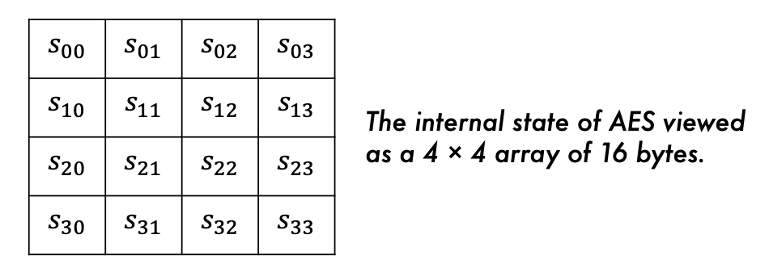

- This array is called the internal state

  数组被称为内部状态

- AES transforms the bytes, columns, and rows of this array to produce a final value that is the ciphertext.

  AES通过转换该数组的字节、列和行，生成最终的密文值。

**矩阵排列**：字节按列排列，从 $s_{00}$ 到 $s_{33}$ 。

##### Substitution–permutation network (SPN) 替代-置换网络

In order to transform its state, AES uses an SPN structure, with 10 rounds for 128-bit keys, 12 for 192-bit keys, and 14 for 256-bit keys.

为改变其状态，AES采用了SPN结构，其中128位密钥需进行10轮加密，192位密钥为12轮，256位密钥则为14轮。

Four building blocks:

- AddRoundKey 轮密钥加
- SubBytes 字节代替

- ShiftRows 行位移

- MixColumns 行混淆

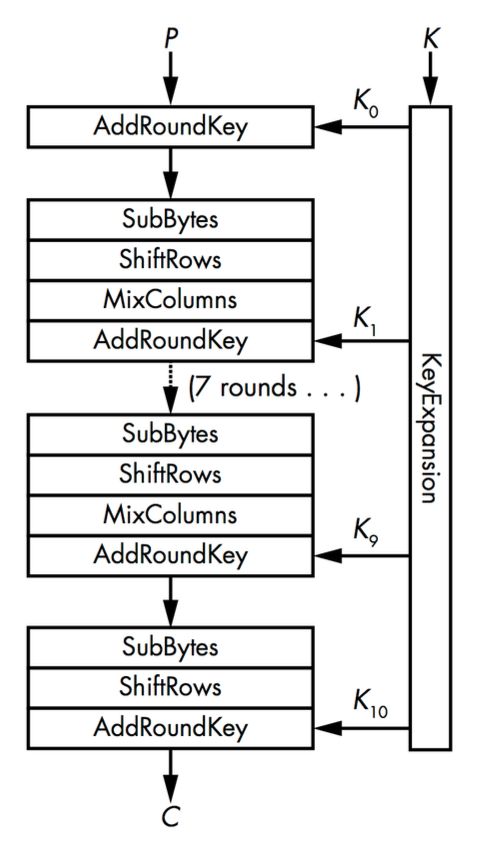

- AddRoundKey 轮密钥加
  - XORs a round key to the internal state
  - **动作**：将当前状态矩阵与从原始密钥扩展出的“轮密钥”进行 **XOR (异或)** 运算 。
  - **目的**：这是唯一引入密钥的步骤，确保密文与密钥挂钩 。

- SubBytes 字节代替
  - Replaces each byte (𝑠~00~, 𝑠~01~, . . . , 𝑠~33~) with another byte according to an **S-box** (下面的图片).
  - **动作**：通过一个固定的 **S-box** 表，将矩阵中的每个字节替换为另一个字节 。
  - **形象理解**：这是一种**非线性变换**。你可以把它想象成“暗号对照表”，打乱字节的数值特征 。

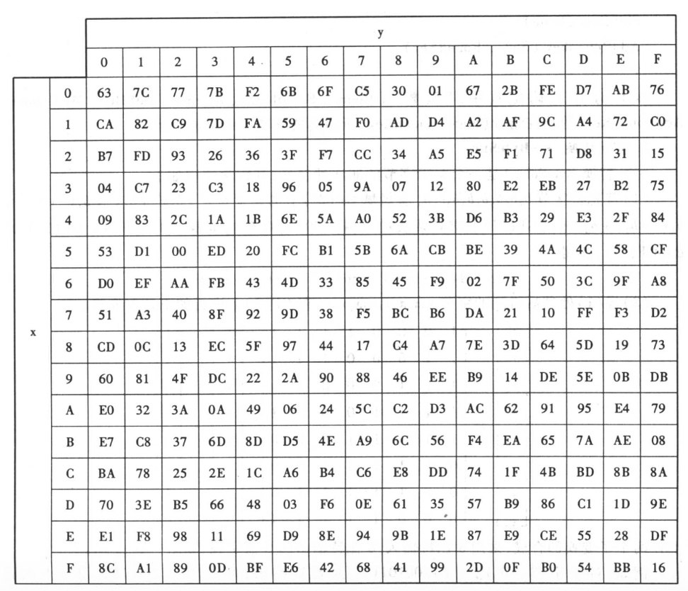

- ShiftRows 行位移
  - Shifts the 𝑖th row of 𝑖 positions to the left, for 𝑖 ranging from 0 to 3
  - **动作**：如下图所示，第 0 行不动，第 1 行左移 1 字节，第 2 行左移 2 字节，第 3 行左移 3 字节 。
  - **作用**：打破列的结构，实现**扩散 (Diffusion)**，让原本在一列的字节分散到不同列 。

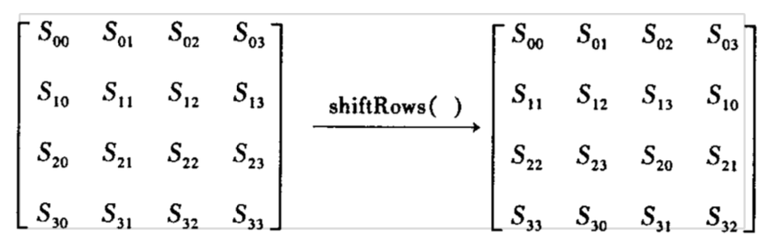

- MixColumns 行混淆

  - Each column of four bytes is now transformed using a special mathematical function.

  - This function takes as input the four bytes of one column and outputs four completely new bytes, which replace the original column.

    此函数以四字节列作为输入，并输出四个全新的字节，用以替换原始列。

  - The result is another new matrix consisting of 16 new bytes.
  - **动作**：下图展示了复杂的数学矩阵运算 。它把每一列的四个字节混合，生成四个全新的字节 。
  - **作用**：让每一个输出字节都受到输入列中所有字节的影响。

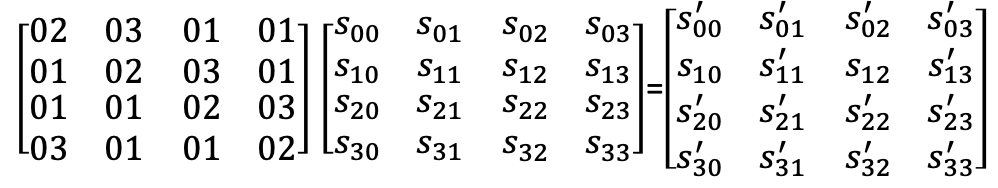

##### Key schedule function

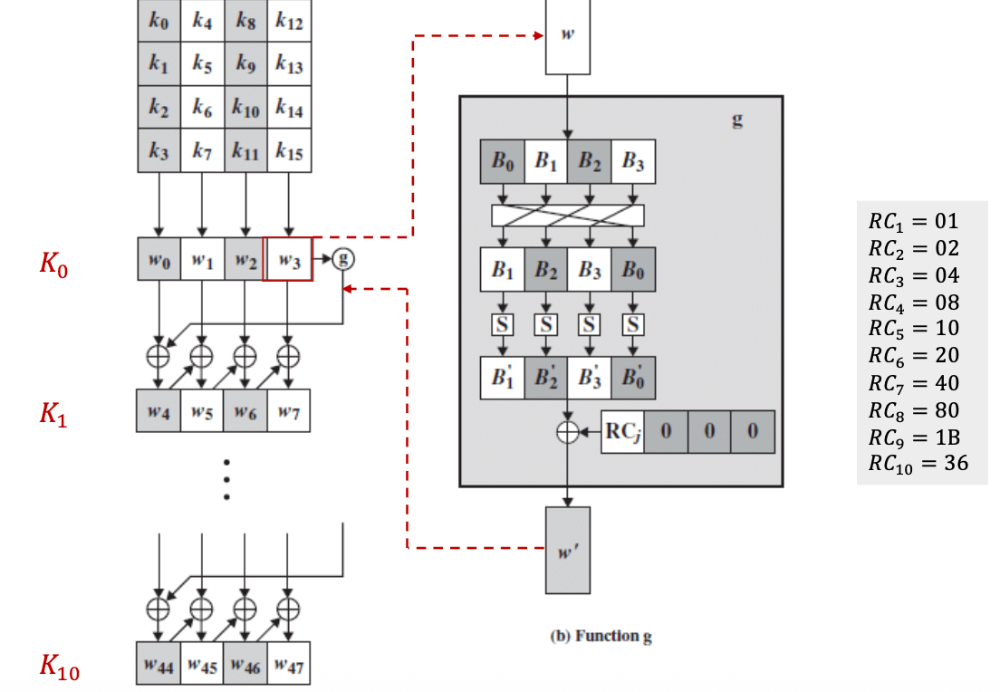

AES 每一轮都在做：加盐（密钥）、改名（S-box）、换座位（行移位）和搅拌（列混淆）。经过 10 轮这样的折腾，原始信息已经被彻底“绞碎”了。

##### Is AES secure? AES结构安全吗

- AES is as secure as a block cipher can be

  - All output bits depend on all input bits in some complex, pseudorandom way.

    **高度安全**：所有的输出位都以复杂的伪随机方式依赖于所有输入位 。

- But there’s no proof that AES is immune to all possible attacks.

  - e.g., the new side-channel attacks

    **并非无敌**：虽然没有证据表明它会被数学破解，但它可能受到**侧信道攻击 (Side-channel attacks)**（通过物理功耗、耗时等信息破解） 。

#### Cryptographic modes 加密模式

##### The basic situation of Electronic Codebook Mode 电子密码本基础情况 

- Let’s say our block cipher has a block size of 7 characters and we use the same key for all

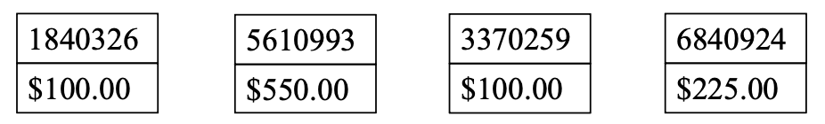

- Now let’s encrypt 加密之后

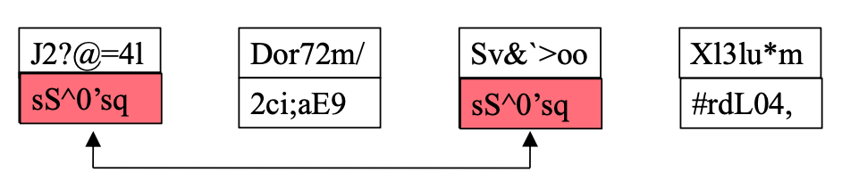

- There’s something odd here . . .

  虽然我们看不懂加密后的内容，但是可以发现如果原文相同的话，那么加密之后的结果也是相同的，这样我们就可以变相知道哪些原文信息是相同的了。

##### Problem with this approach 存在的问题

- What if these are transmissions representing deposits into bank accounts?

  实际上如果相同的信息每次加密之后的密文都是相同的，那么就实际上是去了保密的作用。例如黑客可以先存入500元，然后查看传输的密文获取500这个数字加密之后的密文，之后黑客可以再存入100元，但是这次他会截取传输的信息，然后将金额修改成500元加密之后的密文，这样银行的系统最后就会存入500而非100。

##### What caused the problem?

- Each block of data was independently encrypted
  - With the same key

- So two blocks with identical plaintext encrypt to the same ciphertext

- Not usually a good thing

- We used the wrong cryptographic mode

  - Electronic Codebook (ECB) Mode

  **独立加密**：在 ECB 模式下，每一个数据块都是**独立地**使用相同的密钥进行加密的 。

  **缺乏关联**：块与块之间没有任何联系。只要输入（明文块）和密钥相同，输出（密文块）就必然相同 。

  **模式错误**：这并不是加密算法（如 AES）坏了，而是我们使用了错误的“排列组合方式” 。

**结论是：不可接受。** 

- **模式不安全**：ECB 模式泄露了数据的**模式 (Pattern)**。在实际应用中，这可能导致身份被识别、金融交易被分析，甚至通过密文对比直接推测出敏感信息 。
- **现代标准**：在现代密码学中，除非加密极其随机且短小的数据，否则 ECB 模式是被严格禁止在生产环境中使用的。

##### Cryptographic modes

**ECB** 是“独立作业”，容易暴露规律 。

**CBC** 是“环环相扣”，通过 IV 保证了起始的随机性，通过密文反馈保证了过程的混淆性 。

- A cryptographic mode is a way of applying a particular cipher

  加密模式是应用特定密码的一种方式

  - Block or stream

- The same cipher can be used in different modes

  相同的加密方式可以用于不同的模式。

- So, what mode should we have used?

  关于加密模式的选择

  - Cipher Block Chaining (CBC) mode might be better

    密码块链接模式会更合适

  - Ties together a group of related encrypted blocks

    将一组相关的加密块连接起来

  - Hides that two blocks are identical

    隐藏两个区块相同的事实

##### Cipher block chaining mode

- Adds feedback into encryption process

  在加密的过程中引入“反馈”机制

- The encrypted version of the previous block is used to encrypt this block

  前一个区块的加密版本用于加密此区块

- For block X+1, XOR the plaintext with the ciphertext of block X

  在加密当前明文块之前，先将它与前一个块的**密文**进行异或 (XOR) 运算，然后再进行加密 。

  - Then encrypt the result （P = Plaintext)

    **数学表示**：对于第 $i$ 个块，$C_i = Enc_k(P_i \oplus C_{i-1})$ 

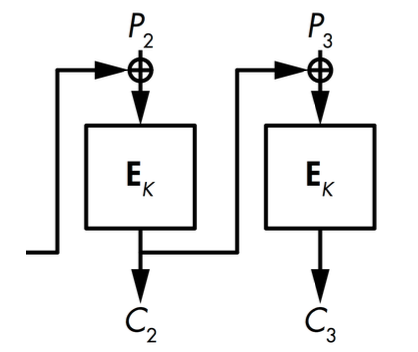

- Each block's encryption depends on all previous block's content.

  **隐藏重复性**：即使两个明文块完全相同，由于它们链接的前一个密文块不同，最终生成的密文也会完全不同 。

  **依赖性**：每个块的加密都取决于之前所有块的内容 。

- Decryption is similar.

  解密的方式类似

##### What about the first block?

- CBC as described would encrypt the first block of the same message sent twice the same way both times

CBC 模式有一个逻辑漏洞：第一个块 $P_1$ 前面没有密文可以链接 。

- **风险**：如果发送两条开头相同的消息（例如都有相同的标准文件头），使用相同的密钥时，$P_1$ 依然会加密成相同的 $C_1$ 。

**Initialization vectors** 初始化向量

- A technique used with CBC

  - And other crypto modes

  - Abbreviated IV 缩写为IV

- Ensures that encryption results are always unique

  确保加密结果始终保持唯一性

  - Even for duplicate message using the same key

    即使重复消息使用相同密钥

  - XOR a random string with the first block

    将随机字符串与第一个区块进行异或运算

  - P~1~⨁IV

  - Then do CBC for subsequent blocks

    之后的块依然按照正常的CBC流程加密。

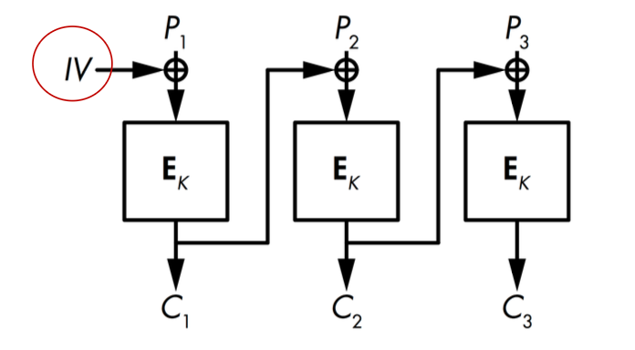

为了解决这个问题，引入了 **初始化向量 (Initialization Vector, IV)** ：

- **随机性**：IV 是一个随机生成的字符串 。
- **唯一性**：它确保即使明文和密钥完全相同，每次加密的结果也是唯一的 。
- **操作**：将 IV 与第一个明文块 $P_1$ 进行异或，然后再送入加密机 。

**Encrypting with an IV**

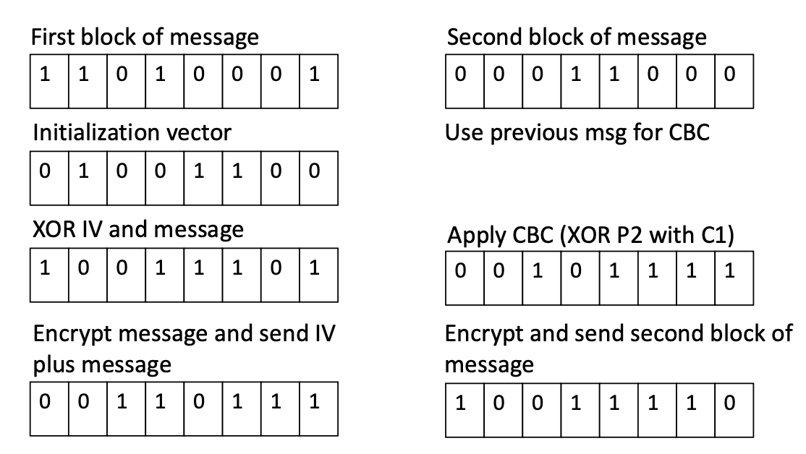

**加密过程：**

1. **准备**：生成随机 IV 。
2. **第一步**：$P_1 \oplus IV$，结果送入算法加密，产生 $C_1$ 。
3. **后续步**：$P_2 \oplus C_1$，结果送入算法加密，产生 $C_2$，以此类推 。
4. **传输**：发送方将 **IV + 密文** 一起传给接收方 。

##### How to decrypt with initialization vectors? 解密

- First block received decrypts to

  首个接收的数据块解密为

  - P = Dec(k, message C~1~)
  - plaintext = P ⨁ IV

- No problem if receiver knows IV

  - Typically, IV is sent in the message

- Subsequent blocks use standard CBC

  - So can be decrypted that way

解密是加密的逆过程：

1. **第一步**：接收方先用密钥解密第一个密文块得到中间值，再将其与 **IV** 进行异或，还原出 $P_1$ 。
2. **后续步**：解密 $C_2$ 得到中间值 Des(k, message C~2~)，再将其与**前一个密文块 $C_1$** 进行异或，还原出 $P_2$ 。

**An example of IV decryption**

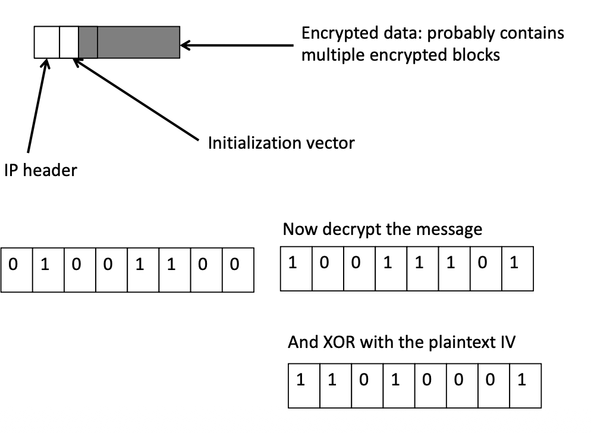

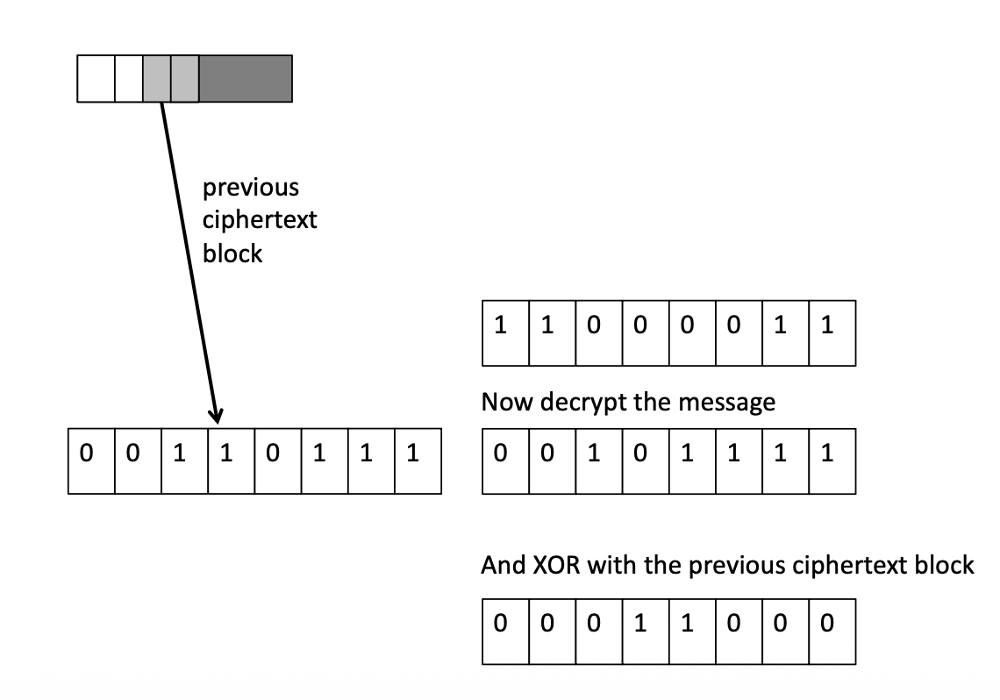

#### Uses of symmetric cryptography 对称加密的应用

##### Uses of symmetric cryptography

- What can we use symmetric cryptography for?

- Lots of things

  对称加密不仅仅是为了“保密”，它在信息安全中扮演着多重角色

  - Secrecy (confidentiality) 机密性

  - Authentication 身份认证

  - Prevention of alteration (integrity) 防止篡改

##### Symmetric cryptography and secrecy 机密性

- Pretty obvious
- Only those knowing the proper keys can decrypt the message
- Thus preserving secrecy

最直观的用途，确保只有持有正确密钥的人才能解密并阅读信息 。

##### Symmetric cryptography and authentication

- How can I prove to you that I created a piece of data?

  我该如何向你证明是我创造了某条数据？

- I give you the data in encrypted form?

  - Using a key only you and I know

    使用只有你我之间知晓的密钥加密这个信息

- Then only you or I could have created it
  - Unless one of us told someone else the key . . .

- Problems with **non-repudiation**

  但是需要注意的是，对称加密存在一个不可否认性方面的问题

  - e.g., I create a data and encrypt it using a secret key known only by you and me; later, I deny that the data is created by me.

    由于密钥是共享的，如果我发了一段话后又反悔赖账，我可以说：“这把钥匙你也有，是你自己加密了这段话来栽赃我的” 。

- What if three parties want to share a key?

  - No longer certain who created anything

    如果三个或更多人共享同一个密钥，就更无法确定某条信息到底是谁发出的了

  - **Public key cryptography** can solve this problem

    这种问题通常需要通过**公钥密码学 (Public Key Cryptography)** 来解决 。

- What if I want to prove authenticity without secrecy?

  如果想在不保密的情况下证明真实性呢？

  - Encryption is not necessary.

    那么加密并非必需。

如果你收到一份用只有你和我才知道的密钥加密的数据，那么这份数据只能是由我（或你）创建的 。

这证明了发送者的身份，除非密钥泄露给了第三方 。

##### Symmetric cryptography and non-alterability

- Changing one bit of an encrypted message completely garbles it

  - For many forms of cryptography

  - ciphertext -> plaintext (meaningless, unreadable)

在许多加密形式中，如果攻击者修改了密文中的哪怕一个比特，解密出的明文也会变得完全杂乱无章、无法阅读 。

这种“牵一发而动全身”的特性可以让人立刻发现信息被动过 。

##### Key management problem 密钥管理难题

**密钥数量爆炸**：如果互联网上的每两个人通信都需要一个独立的对称密钥，那么密钥的总数将呈指数级增长 。

**传输风险**：如何安全地把密钥交给对方而不被截获？这被称为“先有鸡还是先有蛋”的难题 。

- How many keys am I going to need to handle the entire internet?

  如果有**N**个人加入了互联网，那么对于每个人就需要**N-1**个对称密钥去和其他人建立加密通话。

## Summary

- Classical and modern cryptography

- Symmetric encryption

  - Block ciphers

  - Cryptographic modes

  - Uses of symmetric cryptography


## Exercise

- As an engineer of TechCom, you are tasked to design a secure payroll database. The company has 1,000 employees with salaries ranging from 30K to 200K. Competitors are trying to poach your top talent, and salary confidentiality is crucial for retention.
- **Objectives:** your solution should
  - Prevent identical salaries from being identified
  - Defend against statistical attacks

| Security Issues            | ECB's Problem                              | CBC's Solution                      |
| -------------------------- | ------------------------------------------ | ----------------------------------- |
| Identical Data Recognition | Same salary -> Same ciphertext             | Same salary -> Different ciphertext |
| Frequent Analysis          | Can identify common salaries               | No statistical analysis possible    |
| Pattern Matching           | Can see organzational hierarchy patterns   | All records appear randomly         |
| Data Correlation           | Can correlate employees with same salaries | Each record appears indenpendent    |

1. 核心加密模式：选择 CBC 而非 ECB

在存储 1000 名员工的薪资时，由于薪资范围（$30k - $200k）相对固定，必然会出现大量重复数值（例如多名初级员工薪资相同） 。

- **严禁使用 ECB 模式**：如果使用 ECB 模式，相同的薪资（如两个 $50k）会产生完全相同的密文块 。攻击者即使无法解密，也能通过密文的重复规律推断出哪些员工拿同样的工资，甚至结合职位信息猜出具体的薪资档位 。
- **必须使用 CBC 模式**：CBC 模式通过反馈机制，让每一个块的加密都依赖于前一个块的密文 。这样即使两个人的工资都是 $50k，生成的密文也会截然不同 。

2. 引入初始化向量 (IV)

为了彻底预防统计攻击，仅有 CBC 链接是不够的，必须为每一条记录引入 **IV** 。

- **操作方法**：在加密每位员工的薪资数据时，生成一个**随机且唯一**的 IV 。
- **防御逻辑**：IV 确保了即使是同一条消息、同样的密钥，每次加密的结果都是唯一的 。
- **效果**：这使得数据库中的 1000 条薪资记录在密文状态下看起来完全随机，没有任何规律可循，从根本上防止了攻击者通过对比密文频率进行的统计分析 。


具体的实现方式是为每一个员工的公司都单独生成一个IV码，然后分割成规定大小的块之后进行单独加密：

- **独立的 IV** ：为**每一位**员工的工资数据生成一个独立的随机 IV 。
- **独立的 CBC 链**：
  - **员工 A**：$IV_A \oplus \text{工资}_A \rightarrow \text{AES （多轮）加密} \rightarrow \text{密文}_A$。
  - **员工 B**：$IV_B \oplus \text{工资}_B \rightarrow \text{AES 多轮加密} \rightarrow \text{密文}_B$。
- **安全性保证**：由于每个员工的 IV 都是随机且唯一的，即使两个人的工资都是 $50k，生成的密文也绝对不同 。这已经足够防御你担心的**统计攻击**了。