# 3 Message Authen and Hash Functions

## 知识图谱

```plaintext
L-03 Message Authentication and Hash Functions
├── 1. Message Authentication Code, MAC
│   ├── 1.1 Message Integrity
│   │   ├── Confidentiality vs Integrity
│   │   ├── Integrity 的目标
│   │   │   ├── 消息是否来自预期发送者
│   │   │   └── 消息是否未被修改
│   │   └── 加密不等于完整性保护
│   │
│   ├── 1.2 MAC 的基本定义
│   │   ├── Gen(1^n): 生成随机密钥 k
│   │   ├── Mac(k, m): 根据密钥和消息生成 tag
│   │   ├── Vrfy(k, m, t): 验证消息和 tag 是否匹配
│   │   └── Correctness: Vrfy(k, m, Mac(k,m)) = 1
│   │
│   ├── 1.3 Fixed-length MAC
│   │   ├── 安全直觉：没有 k 时不能预测新消息的 tag
│   │   ├── 用 block cipher 构造 MAC
│   │   ├── t = F(k, m)
│   │   └── 缺点：只能认证短的固定长度消息
│   │
│   ├── 1.4 CBC-MAC
│   │   ├── 复习 CBC mode
│   │   │   ├── 当前明文块 XOR 前一个密文块
│   │   │   └── 每个块依赖之前所有块
│   │   ├── CBC-MAC 基本思想
│   │   │   ├── 只输出最后一个 block 作为 tag
│   │   │   └── 中间值不输出
│   │   ├── CBC-MAC vs CBC Encryption
│   │   │   ├── CBC-MAC: deterministic, no IV
│   │   │   ├── CBC-MAC: only final value output
│   │   │   ├── CBC Encryption: uses IV
│   │   │   └── CBC Encryption: outputs all ciphertext blocks
│   │   └── Variable-length message 处理
│   │       ├── 基础 CBC-MAC 处理变长消息有风险
│   │       ├── prepend message length
│   │       └── padding
│   │
│   ├── 1.5 Secure Communication
│   │   ├── 目标：Confidentiality + Integrity
│   │   ├── Encrypt-and-MAC, E&M
│   │   │   ├── c = Enc(k1, m)
│   │   │   ├── t = Mac(k2, m)
│   │   │   └── 问题：tag 可能泄露 m 的信息
│   │   ├── Encrypt-then-MAC, EtM
│   │   │   ├── c = Enc(k1, m)
│   │   │   ├── t = Mac(k2, c)
│   │   │   ├── 接收方先 verify 后 decrypt
│   │   │   └── 推荐方式
│   │   └── Secure Session
│   │       ├── Replay Attack
│   │       ├── Re-ordering Attack
│   │       ├── Counter
│   │       └── Identity
│   │
├── 2. Hash Functions and Applications
│   ├── 2.1 Hash Function 基本定义
│   │   ├── H: {0,1}* → {0,1}^n
│   │   ├── 任意长度输入
│   │   ├── 固定长度 digest
│   │   ├── keyed hash function
│   │   └── unkeyed hash function
│   │
│   ├── 2.2 三个安全属性
│   │   ├── Preimage Resistance
│   │   │   ├── 给定 h，难以找到 M 使 H(M)=h
│   │   │   └── one-way
│   │   ├── Second Preimage Resistance
│   │   │   ├── 给定 x，难以找到 x'≠x 使 H(x)=H(x')
│   │   │   └── weak collision resistance
│   │   └── Collision Resistance
│   │       ├── 难以找到任意 x≠x' 使 H(x)=H(x')
│   │       └── strong collision resistance
│   │
│   ├── 2.3 Generic Hash-function Attacks
│   │   ├── Pigeonhole principle
│   │   ├── Birthday Attack
│   │   ├── O(2^n) vs O(2^(n/2))
│   │   └── 输出长度越短，碰撞越容易
│   │
│   ├── 2.4 Hash Functions in Practice
│   │   ├── MD5
│   │   │   ├── 128-bit output
│   │   │   └── collision found, should not be used
│   │   ├── SHA-1
│   │   │   ├── 160-bit output
│   │   │   └── 有弱点，迁移到 SHA-2
│   │   ├── SHA-2
│   │   │   ├── 224/256/384/512-bit output
│   │   │   └── no known significant weaknesses
│   │   └── SHA-3 / Keccak
│   │       ├── public competition result
│   │       └── different design from SHA family
│   │
│   ├── 2.5 HMAC
│   │   ├── 完全基于 hash function 构造
│   │   ├── 不需要额外 block cipher
│   │   ├── HMAC(k,m)=H(k⊕opad || H(k⊕ipad || m))
│   │   ├── ipad = 00110110
│   │   └── opad = 01011100
│   │
│   ├── 2.6 Merkle Tree
│   │   ├── 用 hash 构造树
│   │   ├── leaf hash
│   │   ├── internal node hash
│   │   ├── root hash
│   │   └── Merkle proof
│   │
│   └── 2.7 Bitcoin
│       ├── First widely recognized cryptocurrency
│       ├── Blockchain = ledger of past transactions
│       ├── Mining adds transaction records
│       ├── Mining introduces Bitcoins
│       └── block_header = version + previous_block_hash + merkle_root + time + target_bits + nonce
```


## Review of last week

- Classical and modern cryptography

  传统与现代的加密

- Symmetric encryption

  对称加密

  - Block ciphers

    块加密
  
  - Cryptographic modes
  
    加密模式
  
  - Uses of symmetric encryption
  
    对称加密的应用

## Learning objectives

- Understand message authentication

  信息认证

- Compare CBC-MAC and CBC mode encryption

- Apply message authentication code in security design and implementations

  消息认证的安全设计和应用

- Analyze other applications of secure hash functions.

  哈希的应用与安全性

## Outline

- Message authentication code

- Hash functions and applications

## Message authentication code

- Message integrity

- Fixed-length MAC

- CBC-MAC

- Secure communications

### Message integrity 消息完整性的重要性

#### Confidentiality vs. integrity 机密性与完整性

- So far, we have been concerned with ensuring confidentiality of communication

  之前的课程主要关注**机密性（Confidentiality）**，而这一部分关注的是**完整性（Integrity）** 。

- What about integrity?
  
  - I.e., ensuring that a received message originated from the intended party, and was not modified, even if an attacker controls the channel!
  
    **定义**：确保接收到的消息确实源自预期的发送者，并且在传输过程中没有被篡改，即使攻击者控制了通信信道 。

**实际场景**：例如 Alice 发出“向 Bob 转账 $100”的请求，系统需要确认：

- 该请求是否由 Alice 发出？
- 请求内容是否与 Alice 的本意完全一致？

#### How MAC works? 

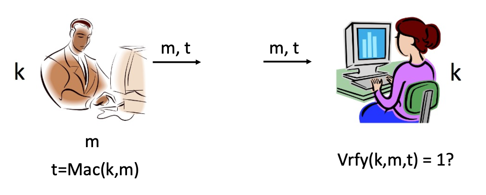

- Confidentiality and integrity are **orthogonal concerns**

  保密性与完整性是两个**相互独立**的问题。

  - Possible to have either one without the other

    可以只实现其中一种而不实现另一种 

- Encryption can help to discover alteration.

  加密有助于发现篡改行为。

  - If the decrypted message is meaningless, unreadable (recall Lab1)

    加密的局限性：虽然通过解密出的消息是否“乱码”可以辅助发现篡改

  - But is not the purpose of encryption.

    加密本身并不保证完整性

#### Message authentication code (MAC) 消息认证码

A message authentication code (MAC) is defined by three algorithms (Gen, Mac, Vrfy):

- k ← Gen(1^n^): generates a random key k.

  生成一个随机的密钥 k

- t $:=$ Mac(k, m): takes as input key k and message m ∈ {0, 1}^*^; outputs tag t
  
  **发送方**：使用密钥 $k$ 和消息 $m$ 通过 Mac 算法生成一个标签（Tag） $t$：$t = Mac(k, m)$ 。
  
  - t $:=$ Mac(k, m)
  
- b ∈ {0,1} = Vrfy(k, m, t): takes key k, message m, and tag t as input; outputs 1 (“accept”) or 0 (“reject”)

  **传输**：将消息 $m$ 和标签 $t$ 一起发送给接收方，Vrfy b 的结果可以是1或者0，1代表接受，0代表拒绝。

Correctness

- For every n, every k ← Gen(1^n^), and every m ∈ {0, 1}^*^, it holds that Vrfy(k, m, Mac(k, m)) = 1

  **接收方**：使用相同的密钥 $k$ 对收到的 $m$ 和 $t$ 进行验证：$Vrfy(k, m, t) = 1?$ 。如果是1则接受，如果是0则证明接收到的消息不是想要的。

### Fixed-length MAC 固定长度 MAC

#### Intuition 设计直觉和核心要求

- We need a keyed function Mac such that

  为了构建一个安全的 MAC，我们需要一个带密钥的函数 `Mac`，并满足以下安全性：

  - Given Mac(k, m~1~), Mac(k, m~2~), … ,

  - ...it is infeasible to predict the value Mac(k, m) for any m ∉ {m~1~, … , } without k

    **不可预测性**：即使攻击者获得了多个消息及其对应的标签（如 $Mac(k, m_1), Mac(k, m_2), \dots$），在没有密钥 $k$ 的情况下，要预测任何新消息 $m$ 的标签 $Mac(k, m)$ 在计算上也是不可行的 。

- Let Mac be a **block cipher**

  **基础方案**：课件建议可以使用**分组密码（Block Cipher）**作为 `Mac` 函数的基础 。

#### Construction 具体的构造方法

- Let F be a **block cipher**

  设 $F$ 为一个分组密码，我们可以构造如下的 MAC 方案（记为 $\Pi$）：

- Construct the following MAC Π:

  - Gen: choose a uniform key 𝑘 for F

    **密钥生成 (Gen)**：为 $F$ 统一选择一个密钥 $k$ 。

  - Mac(𝑘, 𝑚): output 𝑡 = F(𝑘, 𝑚)
  
    **标签生成 (Mac)**：输入密钥 $k$ 和消息 $m$，输出标签 $t = F(k, m)$ 。
  
  - Vrfy(𝑘, 𝑚, 𝑡): output 1 iff F(𝑘, 𝑚) = 𝑡
  
    **验证过程 (Vrfy)**：当且仅当 $F(k, m) = t$ 时，输出 1（接受）。

#### Drawbacks? 局限性

- In practice, block ciphers have short, fixed-length block size

  **长度受限**：分组密码通常具有短且固定的数据块大小 。

  - E.g., AES has a 128-bit block size

    例如：**AES** 的分组大小仅为 **128 位** 。

  - So the previous construction is limited to authenticating short, fixed-length messages

    **应用范围窄**：因此，上述构造仅限于认证**短且固定长度**的消息 。

- Next few parts: authenticating long, variable length messages

  **后续改进**：为了处理长消息和可变长度的消息，需要引入更复杂的机制（如课件后续提到的 CBC-MAC） 。

### CBC-MAC

#### Recall CBC mode

- For block X+1, XOR the plaintext with the ciphertext of block X
  - Then encrypt the result

    在 CBC（密码分组链接）加密模式中，每个明文分组 $P_{i+1}$ 在加密前会先与前一个分组的密文 $C_i$ 进行异或（XOR）运算 。
  
- Each block’s encryption depends on all previous blocks’ contents

  **依赖性**：这种链式结构使得每一个密文分组都依赖于之前所有明文分组的内容 。

- What if we only output the last ciphertext block?
  - we will get a basic CBC-MAC model
  
    如果我们**只输出最后一个密文分组**，而不输出中间的加密结果，这个最后的块就可以作为整个消息的“指纹”或标签（Tag） 

#### (Basic) CBC-MAC

m=m~1~m~2~…m~l~

在中间的加密过程中不输出加密内容C~n~，我们只在最后输出C~l~。因此这样可以确保integrity，因为如果其中有一块收到了篡改，那么最后输出的加密内容就是错误的，因为最后的加密信息依赖于前面所有的块加密。

CBC-MAC 运作流程 

1. 将长消息 $m$ 划分为多个固定长度的分组 $m_1, m_2, \dots, m_l$ 。
2. 第一块 $m_1$ 进入分组密码 $F_k$ 进行加密 。
3. 之后每一块 $m_i$ 都先与前一阶段的输出进行异或，再进入 $F_k$ 加密 。
4. **最终输出**：最后一个块的结果即为标签 $t$。

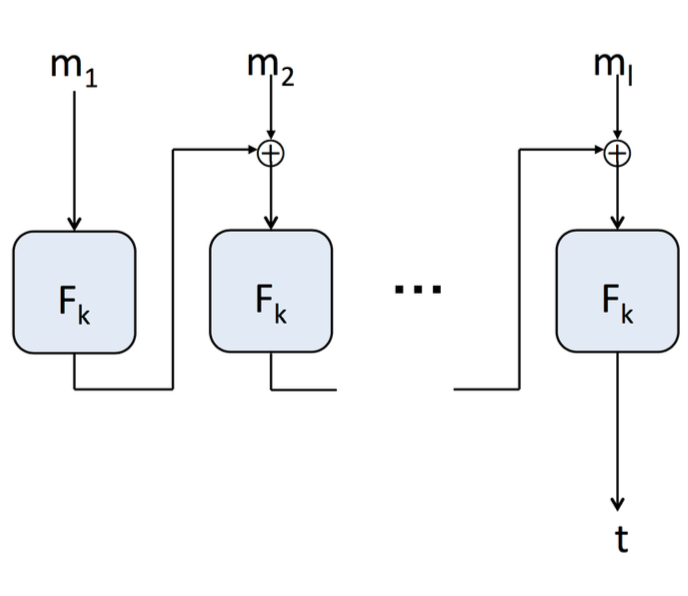

#### CBC-MAC vs. CBC-mode encryption

-  CBC-MAC is **deterministic** (no IV)
- In CBC-MAC, only the final value is output
  - Verification is done by re-computing the result
- Both of these are essential for security

| **特性**          | **CBC 加密模式 (Encryption)**            | **CBC-MAC (Authentication)**                  |
| ----------------- | ---------------------------------------- | --------------------------------------------- |
| **目的**          | 保证数据的**机密性**（Confidentiality）  | 保证数据的**完整性**（Integrity）             |
| **初始向量 (IV)** | 必须使用 **随机 IV** 以保证语义安全      | **确定性算法**，不使用 IV（或 IV 固定为 0）   |
| **输出内容**      | 输出**所有**密文块 $C_1, C_2, C_3 \dots$ | **仅输出最后一个**块作为标签 $t$              |
| **可逆性**        | **可逆**：可以通过解密恢复原始明文       | **不可逆**：无法从标签 $t$ 恢复原始数据       |
| **验证方式**      | 通过解密算法直接还原                     | 通过**重新计算**消息的 MAC 并对比结果是否一致 |

#### Can I recover the original data from its MAC tag?

NO

CBC 加密和 CBC-MAC 虽然在“运算过程”上非常相似，但它们的**输出结果**决定了它们的本质区别：**CBC 是全量信息的映射（等长），而 CBC-MAC 是信息的压缩（多对一）。**

- CBC 加密：保留了“解密线索”

  - 在 CBC 模式加密中，每一个明文块 $m_i$ 加密后生成的密文块 $c_i$ 都会被保留并发送给接收方。

  - **数学公式：** $c_i = E_k(m_i \oplus c_{i-1})$

  - **解密过程：** $m_i = D_k(c_i) \oplus c_{i-1}$

  - **关键点：** 要解开第 $i$ 块，你需要第 $i$ 块的密文和第 $i-1$ 块的密文。因为 CBC 发送了**所有的**密文块，所以每一块都有它的“前任”作为解密线索，信息没有丢失。

- CBC-MAC：扔掉了“解密线索”

  - CBC-MAC 的计算过程和 CBC 加密完全一样，但它**只输出最后一个块** $c_n$ 作为 Tag $t$，中间的所有结果 $c_1, c_2, \dots, c_{n-1}$ 全部被丢弃了。

  - **数学公式：** $t = c_n$

  - **不可逆的原因：** 当你只有一个 $t$（即 $c_n$）时，你或许可以通过 $D_k(t)$ 得到 $m_n \oplus c_{n-1}$，但因为 **$c_{n-1}$ 已经被丢弃了**，你无法确定 $m_n$ 和 $c_{n-1}$ 各自是多少。这就像知道 $x + y = 10$，在不知道 $y$ 的情况下，你永远无法反推 $x$。

#### CBC-MAC extensions

- Several ways to handle variable length messages
  
  **必要性**：IV 的缺失和仅输出末块对 MAC 的安全性至关重要 。
  
  - Whose length is not a multiple of the block length
  
    基础的 CBC-MAC 在处理可变长度的消息时可能存在安全漏洞；在应用 CBC-MAC 之前，先在消息头部**预加（Prepend）消息的长度** 。
  
- One of the simplest: prepend the message length before applying (basic) CBC-MAC

  如果消息长度不是分组长度的整数倍，则需要进行填充（Padding） 。

#### CBC-MAC

- m=m~1~m~2~…m~l~

- Suppose length(m1) < block size

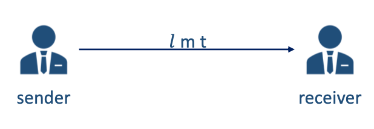

### Secure communication 安全通信

#### Confidentiality + integrity? 

- We have shown primitives for achieving confidentiality and integrity in the private-key setting

- What if we want to achieve both?

  当我们希望同时达成机密性和完整性时，通常有两种组合方式：

#### Encrypt and authenticate 1 （Encrypt-and-MAC (E&M)）加密且认证

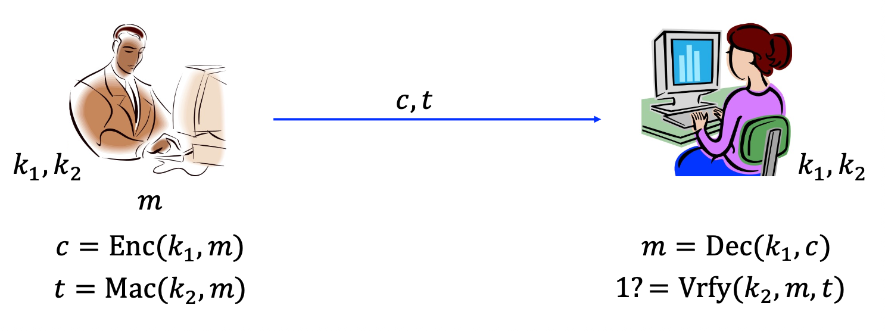

在这种模式下，加密和生成消息认证码（MAC）是**并行**进行的。

- **发送方：**
  - 使用密钥 $k_1$ 对明文 $m$ 进行加密，得到密文 $c$。
  - **关键点：** 使用密钥 $k_2$ **直接对明文 $m$** 计算 MAC，得到标签 $t$。
  - 最后发送 $(c, t)$。
- **接收方：**
  - 先使用 $k_1$ 解密 $c$ 得到明文 $m$。
  - 然后再用 $k_2$ 和 $m$ 来校验标签 $t$ 是否正确。

##### Problem

- The tag t might leak information about m!
  - Nothing in the definition of security for a MAC implies that it hides information about m
- If the MAC is deterministic (as is CBC-MAC), it leaks whether the same message is encrypted twice

这种方式曾在 SSH 中使用，但现在被认为存在**安全隐患**。因为 MAC 是基于明文生成的，如果 MAC 算法本身泄露了关于明文的任何统计特征，那么即使密文 $c$ 是安全的，攻击者也可能通过标签 $t$ 获取部分明文信息。

如果 MAC 是确定性的（如 CBC-MAC），它会泄露两次发送的消息是否相同 。

#### Encrypt then authenticate 2 （Encrypt-then-MAC (EtM)）

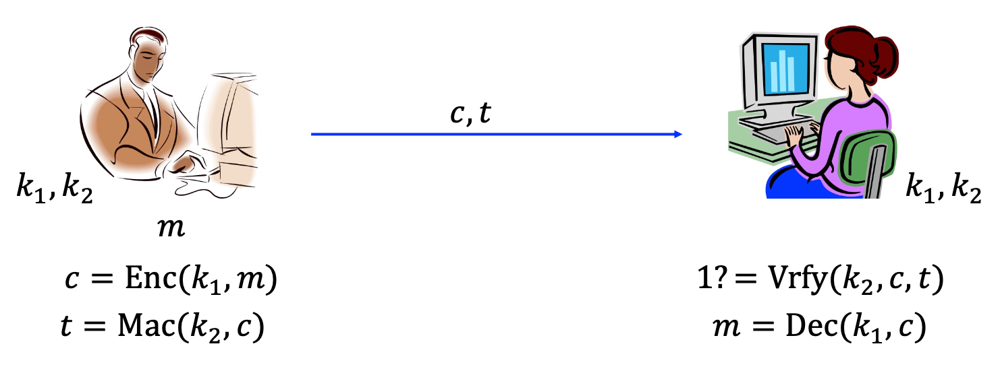

在这种模式下，加密和生成 MAC 是**串行**进行的。

- **发送方：**
  - 首先使用密钥 $k_1$ 对明文 $m$ 进行加密，得到密文 $c$。
  - **关键点：** 使用密钥 $k_2$ **对加密后的密文 $c$** 计算 MAC，得到标签 $t$。
  - 最后发送 $(c, t)$。
- **接收方：**
  - **先验证，后解密：** 接收方先校验 $t$ 是否与密文 $c$ 匹配。
  - 只有验证通过（证明密文未被篡改），才会动用密钥解密得到 $m$。

#### Secure sessions

- Consider parties who wish to communicate securely over the course of a session

  这种方式是目前**最推荐、最安全**的组合方式（如在 IPsec 和 TLS 1.2 中使用）。它的优点是：

  - “Securely” = confidentiality and integrity

    可以同时确保机密性和完整性

  - “Session” = period of time over which parties are willing to maintain state

    各方愿意维持状态的时长

- Can use authenticated encryption...

  因为错误的数据在验证密文阶段就被拦下了，解密器Dec不会报错，从而不给攻击者留下试探的机会。

#### Any Attacks?

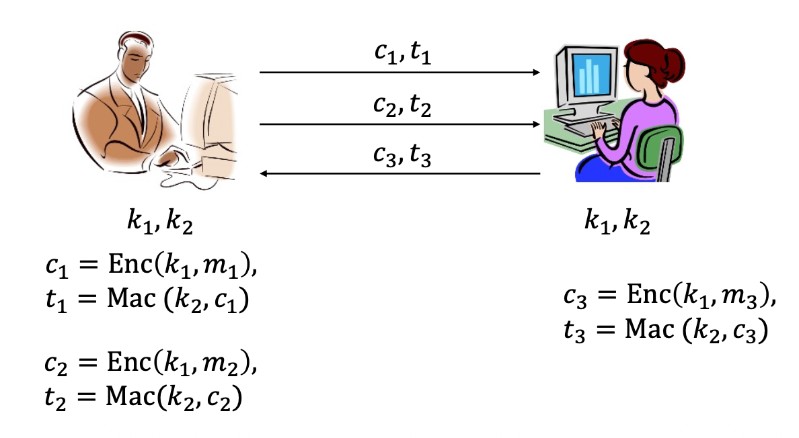

在持续一段时间的“会话（Session）”中，仅仅对单个数据包进行加密和认证是不够的，攻击者可能发动以下攻击 

#### Replay Attack 重放攻击

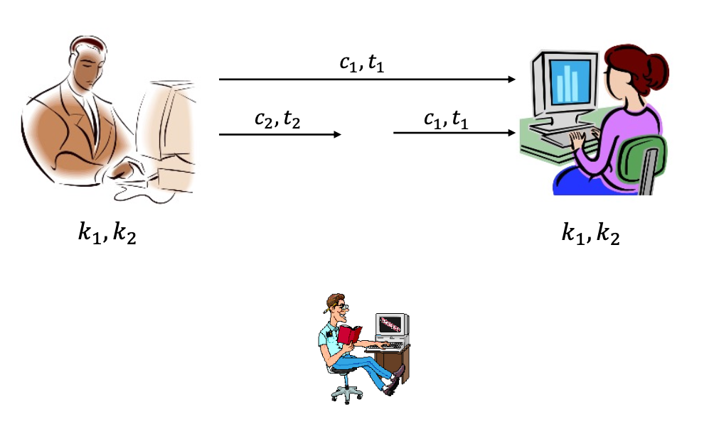

**现象**：攻击者截获 Alice 发给 Bob 的合法数据包 $(c_1, t_1)$，然后在稍后的时间点再次发送给 Bob 。

**结果**：Bob 会认为这是 Alice 再次发出的指令（例如重复转账）。

#### Re-ordering attack 重排序攻击

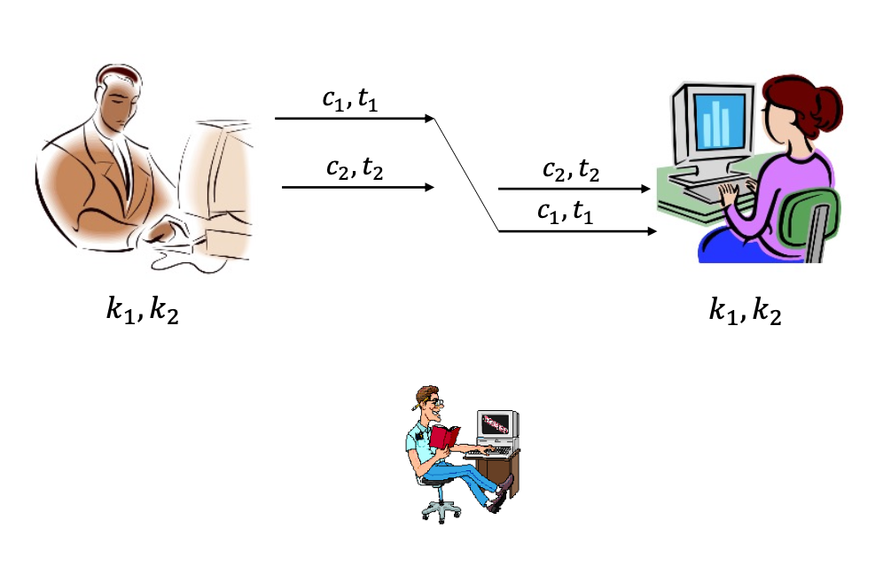

**现象**：攻击者拦截多个数据包，并改变它们的发送顺序（例如先发数据包 2，再发数据包 1）。

#### 防御方案：计数器与身份标识

为了防止上述攻击，我们需要在认证过程中加入**状态信息** ：

- **计数器（Counters）**：在每个消息中加入递增的序列号。如果接收方收到的序列号小于等于之前的，则判定为无效 。
- **身份标识（Identities）**：在消息中包含发送者或接收者的身份（如 "Bob" 或 "Alice"），防止消息被重定向到错误的对象 。
- **综合构造示例**：
  - $c_1 = Enc(k_1, \text{"Bob"} \mid m_1 \mid 1)$
  - $t_1 = Mac(k_2, c_1)$ 这样就确保了消息是发给 Bob 的，内容是 $m_1$，且序列号为 1 。

## Hash functions and applications 哈希函数

- Hash functions

- HMAC

- Merkle tree

- Bitcoin

### Hash Functions

(Cryptographic) hash function: maps arbitrary length inputs to a short, fixed-length digest

将任意长度的输入映射为短且固定长度的“摘要（Digest）” 。在实际应用中，通常为 **256 位**或 **512 位** 。

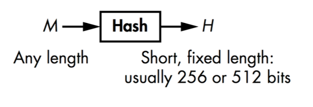

Can define keyed or unkeyed hash functions

通常可以定义需要密钥的哈希函数，或者不需要密钥的哈希函数

- Formally, keyed hash functions are needed

  形式化定义中需要带密钥的哈希函数

- In practice, hash functions are unkeyed

  但是在实践中，哈希函数通常是不需要带密钥的

- (We will work with unkeyed hash functions, and be less formal)

  在本系列的课程中，主要学习的都是不带密钥的哈希函数，以及少量的需要密钥的哈希函数

#### Properties of cryptographic hash functions 哈希函数的3大安全属性

- Let 𝐻: {0,1}^*^ → {0,1}^n^ be a hash function
- Preimage resistance 抗原像性
  - one-way 单向性
- Second preimage resistance 抗原二原像性
  - weak collision resistant 弱抗碰撞性
- Collision resistance 抗碰撞性
  - strong collision resistance 强刚碰撞性

#### Preimage resistance 抗原像性

- Let 𝐻: {0,1}^*^ → {0,1}^n^ be a hash function

- A preimage of a given hash value, ℎ, is any message, 𝑀, such that
  
  - 𝐻(𝑀) = ℎ
  
- Preimage resistance
  - Given a random hash value, it is computationally infeasible to find a preimage of that hash value
  
    给定一个哈希值 $h$，在计算上无法找到任何消息 $M$ 使得 $H(M) = h$ 。
  
- One-way function

#### Second preimage resistance 抗原二原像性

- Let 𝐻: {0,1}^*^ → {0,1}^n^ be a hash function

- Given 𝑥, it is computationally infeasible to find 𝑥′ ≠ 𝑥 such that 𝐻 𝑥 = 𝐻(𝑥′)

  给定输入 $x$，在计算上无法找到另一个不同的输入 $x'$ 使得 $H(x) = H(x')$ 。

- Aka. weak collision resistant

#### Collision resistance 抗碰撞性

- Let 𝐻: {0,1}^*^ → {0,1}^n^ be a hash function

- A collision is a pair of distinct inputs 𝑥, 𝑥′ such that 𝐻(𝑥) = 𝐻(𝑥′)

- 𝐻 is collision-resistant if it is computationally infeasible to find a collision in 𝐻.

  在计算上无法找到**任何**一对不同的输入 $(x, x')$ 使得 $H(x) = H(x')$ 。

- Aka. strong collision resistance.

#### Generic hash-function attacks 通用攻击

- What is the best “generic” collision attack on a hash function 𝐻: {0,1}^*^ -> {0,1}^n^

  - size of {0,1}^*^: arbitrarily large

  - size of {0,1}^n^: 2^n^ = 2×2× ⋯×2

- If we compute 𝐻(𝑥~1~), … , 𝐻(x<sub>2<sup>n</sup>+1</sub>), we are guaranteed to find a collision

  **穷举法**：对于输出长度为 $n$ 的哈希函数，如果我们计算 $2^n + 1$ 个哈希值，根据鸽巢原理，必定能找到一个碰撞 。

  - Is it possible to do better?
  
  - guaranteed: 100%

#### “Birthday” attacks 生日攻击

- How many hashes do we need to compute to find a collision with a large probability, such as 50%?

  如果想要碰撞的几率达到一个很高的水平，那么我们应该计算多少哈希呢？

- Related to the so-called birthday paradox

  源自“生日悖论”，即只需 23 人就有 50% 的概率存在两人生日相同 。

- How many people are needed to have a 50% chance that some two people share a birthday?

  在哈希函数中，只需计算 $O(2^{n/2})$ 次哈希，就有 50% 的概率找到碰撞 。这比 $2^n$ 要快得多 。

##### Theorem

- When the number is 𝑂(N^1/2^), the probability of a collision is 50%
  - Birthdays: 23 people suffice!

  - Hash functions: **𝑂(2^n/2^)** hash function-evaluations
    - much better than 2^n^ + 1

- For an n-bit hash output:
  - Preimage attack ≈ O(2^n)
  - Generic collision attack using birthday attack ≈ O(2^(n/2))
  - **So a 128-bit hash only gives about 64-bit collision security.**
  

#### Hash functions in practice 哈希函数应用

- MD5

  - Developed in 1991

  - 128-bit output length

    输出长度 128 位 

  - Collisions found in 2004, should no longer be used

    2004年已发现碰撞，**不应再使用** 

- SHA-1

  - Introduced in 1995

  - 160-bit output length

    输出长度 160 位 

  - Theoretical analyses indicate some weaknesses

  - Very common; current trend to migrate to SHA-2

    存在理论上的弱点，目前趋势是迁移到 SHA-2 

- SHA-2

  - 224-bit, 256-bit, 384-bit or 512-bit output lengths

    支持 224、256、384 或 512 位输出 

  - No known significant weaknesses

    目前**无已知显著弱点** 

- SHA-3/Keccak

  - Result of a public competition from 2008-2012

  - 64 submissions

  - 51 entered the first round

  - Very different design than SHA family

    设计理念与 SHA 家族完全不同 
  
  - Supports 224, 256, 384, and 512-bit outputs
  
    支持与 SHA-2 相同的输出长度 

### HMAC

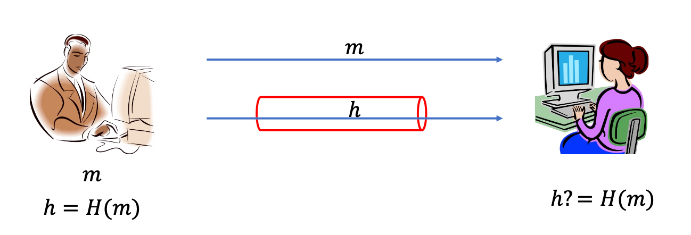

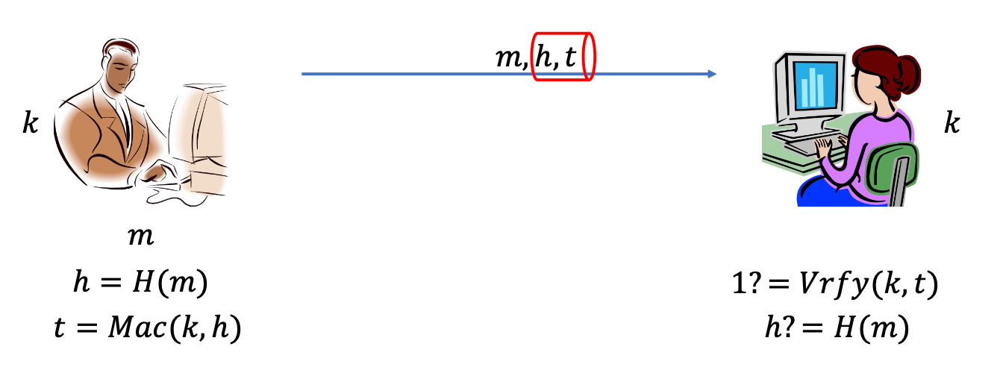

#### Instantiation 设计动机 Hash-and-MAC

**在处理长消息时，直接使用分组密码（如 AES）效率较低。一个直观的想法是先通过哈希函数将长消息压缩，再进行认证 。**

**基本流程**：

1. 计算消息 $m$ 的哈希值 $h = H(m)$ 。
2. 对哈希值 $h$ 使用密钥 $k$ 进行 MAC 计算，得到标签 $t = Mac(k, h)$ 。
3. 发送 $(m, h, t)$ 。

**局限性**：这种“实例化”方法需要同时实现哈希函数和分组密码两种加密原语 。

- Hash function + block cipher-based MAC?
  - Need to implement two crypto primitives

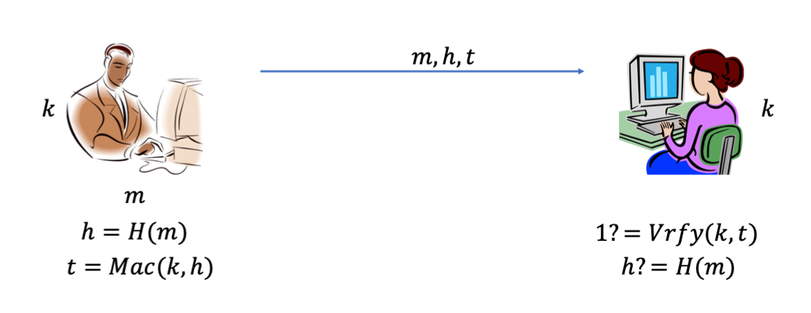

#### HMAC 定义与构造

- Constructed entirely from (certain type of) hash functions
  
  HMAC的核心优势在于它完全基于哈希函数（如 MD5, SHA-1, SHA-2 等）构建，不需要额外的分组密码 。
  
  - MD5, SHA-1, SHA-2, SHA-3
  
- Construction
  - **HMAC: 𝑆(𝑘, 𝑚) = 𝐻(𝑘 ⨁ 𝑜𝑝𝑎𝑑 ||𝐻(𝑘⨁ ipad || 𝑚))**
  - **$H$**：嵌套使用的密码学哈希函数 。
  - **$k$**：共享密钥 。
  - **$\oplus$**：异或运算 。
  - **$\parallel$**：连接运算（Concatenation） 。
  
- ipad （Inner pad）: 00110110：内部填充常数，二进制为 `00110110` 

- opad（Outer pad）: 01011100：外部填充常数，二进制为 `01011100` 

HMAC的运作逻辑

1. **第一步（内层）**：将密钥与 `ipad` 异或后，拼接到消息 $m$ 的头部，计算一次哈希 。
2. **第二步（外层）**：将密钥与 `opad` 异或后，拼接到第一步的结果头部，再计算一次哈希，最终得到 MAC 标签 。

这种嵌套结构可以有效防止某些针对简单哈希组合方式（如直接将密钥拼接在消息后的 $H(k \parallel m)$）的攻击（如长度扩展攻击）。

### Merkle tree 默克尔树

#### Merkle tree

- Merkel tree
- h = 𝑀𝐻𝑇(𝑥~1~, 𝑥~2~, … , 𝑥~n~)
- Merkle proof

#### Construction of Merkle tree 默克尔树的构造过程

- Suppose we have 8 files (𝑓~1~, … , 𝑓~8~), 𝐻 is collision resistant hash function

假设我们有 8 个文件（$f_1$ 到 $f_8$），构造过程如下 ：

- **叶子节点**：对每个文件分别计算哈希值，得到 $h_1 = H(f_1), h_2 = H(f_2), \dots, h_8 = H(f_8)$ 。

- **中间节点**：将相邻的两个哈希值成对拼接并再次哈希。例如，$h_{1,2} = H(h_1 \parallel h_2)$ 。

- **层层向上**：重复此过程，直到最后只剩下一个哈希值 。

- **根哈希 (Merkle Root)**：最终生成的顶部哈希值（如 $h_{1,8}$）被称为默克尔根 。

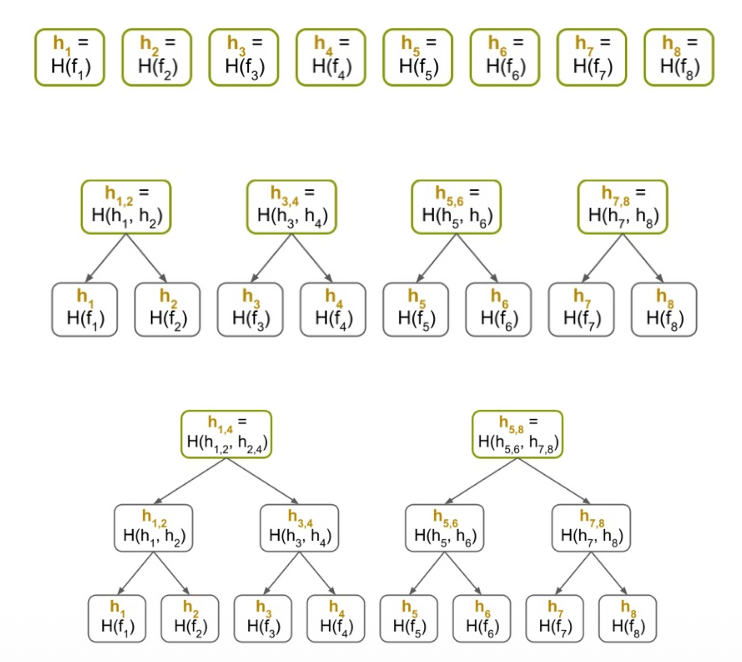

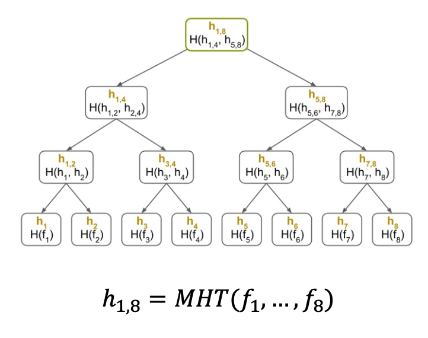

#### Merkle proof 默克尔证明

- Suppose we have 8 files (𝑓~1~, … , 𝑓~8~), 𝐻 is collision resistant hash function
- Merkle tree: h~8~,> = 𝑀𝐻𝑇(𝑓~1~, … , 𝑓~8~)

默克尔树最大的优势在于：如果你想证明某个特定的文件（如 $f_3$）是否存储在云端且未被篡改，你**不需要**下载所有文件 。

**证明路径**：为了验证 $f_3$，你只需要获取与之相关的少数几个节点哈希值：$h_4$、$h_{1,2}$ 和 $h_{5,8}$ 。

**验证逻辑**：

1. 你自行计算 $H(f_3)$ 得到 $h_3$ 。
2. 结合收到的 $h_4$ 计算出 $h_{3,4} = H(h_3 \parallel h_4)$ 。
3. 结合收到的 $h_{1,2}$ 计算出 $h_{1,4}$。
4. 最后结合 $h_{5,8}$ 计算出根哈希 。

**对比结果**：如果计算出的根哈希与预存的 $h_{1,8}$ 一致，则证明 $f_3$ 是完整的 。

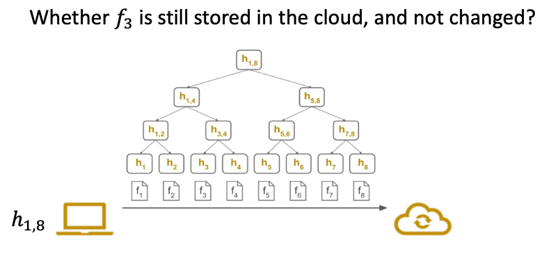

- Integrity of f~3~?

- download f~3~, h~4~, h~1,2~, h~5,8~

只需要考虑保存 root value

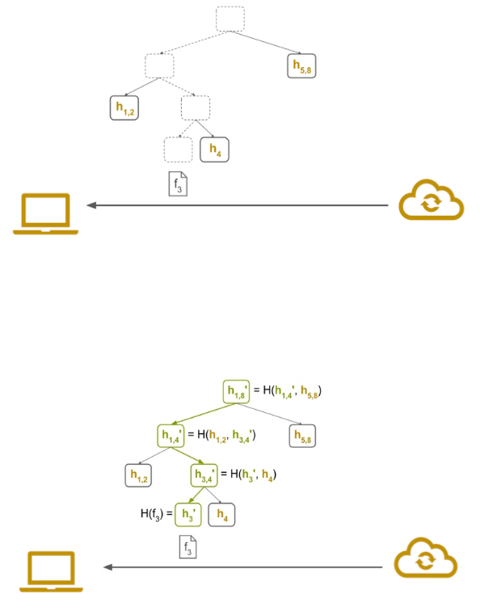

#### 为什么使用默克尔树？

- **效率极高**：对于包含 $n$ 个文件的系统，**验证一个文件只需要 $O(\log n)$ 个哈希值，而不是 $O(n)$** 。
- **抗碰撞性**：只要底层的哈希函数是抗碰撞的，任何对原始文件的微小修改都会导致根哈希发生剧烈变化 。

### Bitcoin 比特币

- Bitcoin is the first and most widely recognized cryptocurrency.

  比特币是首个且最广为人知的加密货币 

- Bitcoin is based on the ideas laid out in a 2008 whitepaper titled Bitcoin: A Peer-to-Peer Electronic Cash System.
  
  基于中本聪（Satoshi Nakamoto）在2008年发表的白皮书《比特币：一种点对点的电子现金系统》 。
  
  - Satoshi Nakamoto

#### Blockchain

- Blockchain
  - Ledger of past transactions
  
    区块链是记录所有过去交易的账本 

- **链式结构**：每个区块的头部都包含前一个区块头部的哈希值（`prevBlockHeaderHash`），从而将所有区块连接成链 。

- **区块头内容**：包含版本号（version）、时间戳（time）、难度目标（nBits）、随机数（nonce）以及**默克尔根哈希**（merkleRootHash） 。

- **交易存储**：所有的交易通过**默克尔树**结构进行组织，最终生成的根哈希值存储在区块头中 。

#### Mining 挖矿

- Mining is the process of adding transaction records to Bitcoin's public ledger of past transactions.

  挖矿是将交易记录添加到比特币公共账本的过程，同时也是引入新比特币的机制 。

- Mining is also the mechanism used to introduce Bitcoins into the system.

  矿工需要构造一个区块头，并通过不断改变**随机数（nonce）**的值来计算哈希，直到满足特定的难度条件：

  - $$SHA256(SHA256(block\_header)) < target\_bits$$

- a example

  - ```plain
    block_header = version + previous_block_hash + merkle_root + time + target_bits + nonce
    for i in range(0, 2**32):
    	if sha256(sha256(block_header)) < target_bits:
    		break
      else:
      	continue
    ```

挖矿的简化逻辑：

- 拼接区块头的所有字段（版本、前块哈希、默克尔根、时间、难度目标、随机数） 。

- 循环尝试不同的随机数（通常范围是 $0$ 到 $2^{32}$） 。

- 进行双重 SHA-256 哈希运算 。

- 如果计算结果小于目标值（`target_bits`），则挖矿成功并退出循环 。

## Summary

- Message authentication code

  - Message integrity

  - Fixed-length MAC

  - CBC-MAC

  - Secure communications

- Hash functions and applications

  - Hash functions

  - HMAC

  - Merkle tree

  - Bitcoin

# 潜在考试题与参考答案

## Question 1: Explain the difference between confidentiality and integrity.

**Answer:**
 Confidentiality means that unauthorized parties cannot read the content of a message. It is usually achieved by encryption. Integrity means that the receiver can verify that the message has not been modified and comes from the intended sender. Encryption alone does not guarantee integrity because an attacker may still modify ciphertext. MAC is used to protect message integrity and message authenticity.

------

## Question 2: Define a Message Authentication Code, MAC.

**Answer:**
 A MAC consists of three algorithms: Gen, Mac and Vrfy. Gen generates a secret key k. Mac(k,m) takes a key and a message and outputs a tag t. Vrfy(k,m,t) checks whether the tag is valid for the message under the same key and outputs 1 for accept or 0 for reject. Correctness means Vrfy(k,m,Mac(k,m)) should always output 1 for a valid message and key.

------

## Question 3: Why is encryption alone not enough to provide integrity?

**Answer:**
 Encryption mainly protects confidentiality, not integrity. Although a modified ciphertext may sometimes decrypt into meaningless data, detecting modification is not the main purpose of encryption. An attacker may still alter ciphertext, replay old ciphertext, or reorder messages. Therefore, we need MAC or authenticated encryption to verify that the message has not been changed.

------

## Question 4: How can a block cipher be used to construct a fixed-length MAC? What is its limitation?

**Answer:**
 Let F be a block cipher. We can construct a MAC as follows: Gen chooses a random key k; Mac(k,m) outputs t = F(k,m); Vrfy(k,m,t) accepts if F(k,m)=t. The limitation is that block ciphers have fixed and short block sizes, for example AES has a 128-bit block size. Therefore, this construction can only authenticate short fixed-length messages.

------

## Question 5: Explain how CBC-MAC works.

**Answer:**
 CBC-MAC divides a message into blocks m1, m2, ..., ml. It processes the blocks using a CBC-like chaining method. Each block is combined with the previous output and then encrypted using the block cipher. Unlike CBC encryption, CBC-MAC does not output all ciphertext blocks. It only outputs the final block as the tag. If any message block is changed, the final tag will also change, so the receiver can detect modification by recomputing the tag.

------

## Question 6: Compare CBC-MAC and CBC mode encryption.

**Answer:**

| Item         | CBC Encryption        | CBC-MAC                             |
| ------------ | --------------------- | ----------------------------------- |
| Purpose      | Confidentiality       | Integrity/authentication            |
| IV           | Usually random IV     | No random IV / fixed IV             |
| Output       | All ciphertext blocks | Only final block                    |
| Reversible   | Yes, can decrypt      | No, cannot recover message from tag |
| Verification | Decryption            | Recompute MAC and compare           |

CBC-MAC must be deterministic and only output the final value. These features are important for security.

------

## Question 7: Can we recover the original message from a MAC tag?

**Answer:**
 No. A MAC tag is not ciphertext. It is only an authentication value. In CBC-MAC, only the final block is output, while all intermediate values are discarded. Therefore, the receiver cannot reconstruct the original message from the tag. MAC provides integrity, not confidentiality or recoverability.

------

## Question 8: Why is basic CBC-MAC not suitable for variable-length messages?

**Answer:**
 Basic CBC-MAC is mainly secure for fixed-length messages. If messages have variable length, attackers may exploit the chaining structure to create forged messages with valid tags. A simple defense is to prepend the message length before applying CBC-MAC. Padding is also needed if the message length is not a multiple of the block size.

------

## Question 9: Compare Encrypt-and-MAC and Encrypt-then-MAC.

**Answer:**
 Encrypt-and-MAC computes c = Enc(k1,m) and t = Mac(k2,m). The tag is computed over the plaintext. The problem is that the tag may leak information about the plaintext, especially if the MAC is deterministic. Encrypt-then-MAC computes c = Enc(k1,m) and t = Mac(k2,c). The receiver verifies the tag before decrypting. This is safer because modified ciphertext is rejected before decryption.

------

## Question 10: What is a replay attack and how can it be prevented?

**Answer:**
 A replay attack happens when an attacker records a valid message and tag, then sends the same pair again later. The receiver may believe it is a new valid message. This can be prevented by using counters, sequence numbers, timestamps, or nonces. If the receiver sees an old or repeated counter value, the message is rejected.

------

## Question 11: What is a re-ordering attack and how can it be prevented?

**Answer:**
 A re-ordering attack happens when an attacker changes the order of valid messages. For example, message 2 is delivered before message 1. This may cause incorrect application behavior. It can be prevented by including counters or sequence numbers in the authenticated data, so the receiver can check whether messages arrive in the expected order.

------

## Question 12: Define a cryptographic hash function.

**Answer:**
 A cryptographic hash function maps an arbitrary-length input to a short fixed-length digest. Formally, it can be written as H:{0,1}* → {0,1}^n. Hash functions are usually unkeyed in practice. A secure hash function should satisfy preimage resistance, second preimage resistance and collision resistance.

------

## Question 13: Explain preimage resistance, second preimage resistance and collision resistance.

**Answer:**
 Preimage resistance means that given a hash value h, it is hard to find any message x such that H(x)=h. Second preimage resistance means that given a message x, it is hard to find another message x'≠x such that H(x)=H(x'). Collision resistance means that it is hard to find any two different messages x and x' such that H(x)=H(x').

------

## Question 14: What is a birthday attack against hash functions?

**Answer:**
 A birthday attack is a generic collision attack based on the birthday paradox. For an n-bit hash output, an attacker does not need 2^n attempts to find a collision with high probability. Around O(2^(n/2)) hash evaluations are enough. This means that the collision security of an n-bit hash is only about n/2 bits.

------

## Question 15: Why should MD5 no longer be used?

**Answer:**
 MD5 has a 128-bit output, but collisions were found in 2004. This means attackers can find two different inputs with the same MD5 hash. Therefore, MD5 no longer provides strong collision resistance and should not be used for security-sensitive applications.

------

## Question 16: What is HMAC and why is it useful?

**Answer:**
 HMAC is a MAC construction based entirely on cryptographic hash functions. It uses a shared secret key and a hash function to authenticate a message. The formula is **HMAC(k,m)=H(k⊕opad || H(k⊕ipad || m))**. It is useful because it provides message integrity and authentication without requiring a separate block cipher-based MAC.

------

## Question 17: What is a Merkle Tree?

**Answer:**
 A Merkle Tree is a tree structure built using hash functions. Each leaf node is the hash of a data block or transaction. Each internal node is the hash of its child nodes. The root hash summarizes all data in the tree. If any data changes, the root hash will also change.

------

## Question 18: What is a Merkle proof?

**Answer:**
 A Merkle proof proves that a certain file or transaction is included in a Merkle Tree. The verifier does not need to download all data. They only need the target hash, several sibling hashes on the path, and the trusted root hash. If the recomputed root equals the trusted root, the data is verified.

------

## Question 19: How are hash functions used in Bitcoin?

**Answer:**
 Bitcoin uses hash functions in blockchain and mining. A block contains a Merkle root that summarizes transactions. During mining, miners repeatedly change the nonce in the block header and compute double SHA-256. If the hash value is smaller than the target_bits value, the block is valid.

------

## Question 20: Explain the role of nonce in Bitcoin mining.

**Answer:**
 The nonce is a value that miners repeatedly change in the block header. Each different nonce produces a different hash output. Miners search for a nonce such that S
