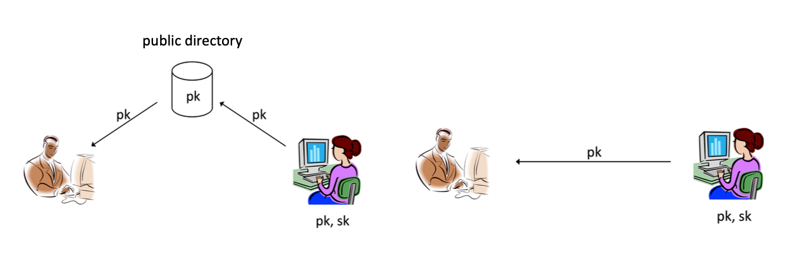
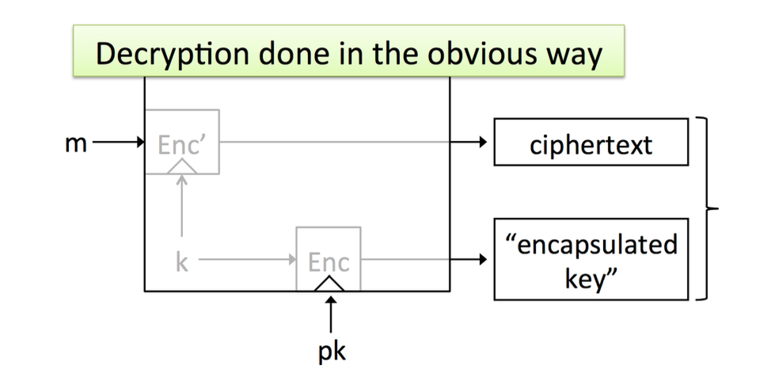
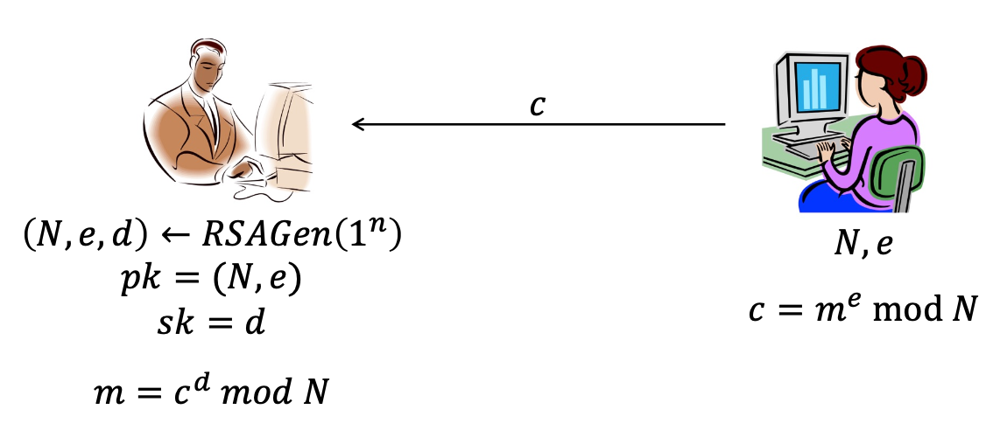
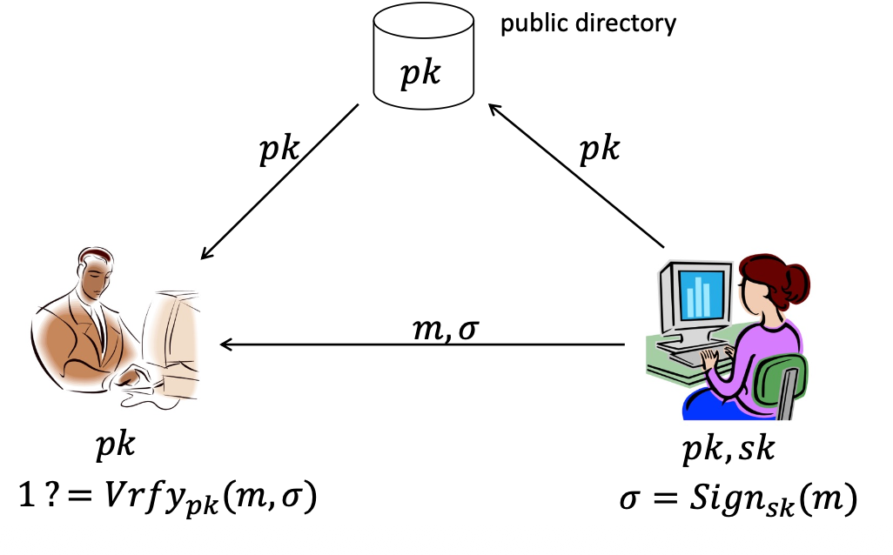
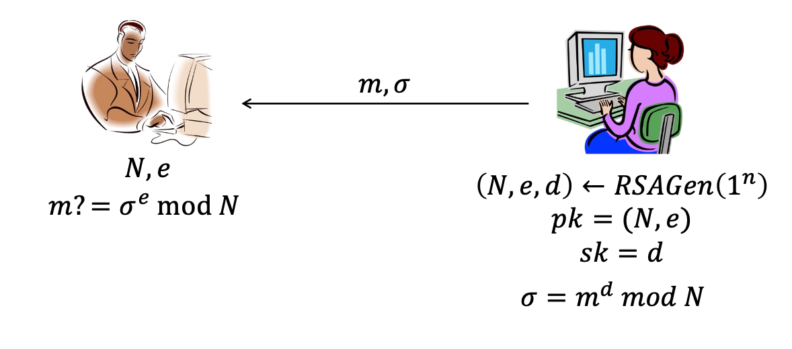
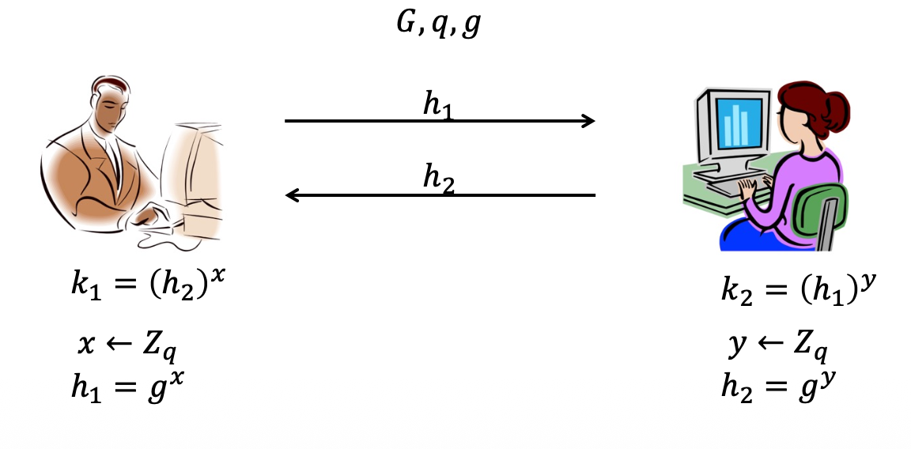
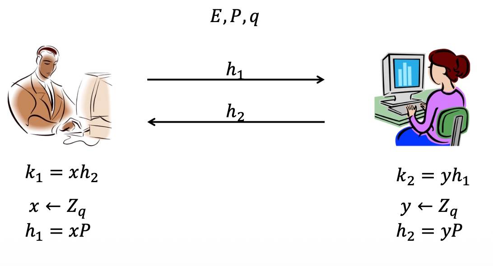
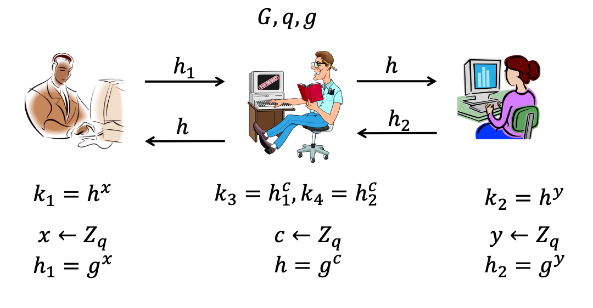

# 4 Public-Key Cryptography

## 知识图谱

```plaintext
L-04 Public-Key Cryptography 公钥密码学
├── 1. Review 复习
│   ├── Symmetric Encryption 对称加密
│   └── Message Authentication Code, MAC 消息认证码
│
├── 2. The Public-Key Revolution 公钥密码学革命
│   ├── 2.1 对称/私钥密码学的问题
│   │   ├── Key-distribution problem 密钥分发问题
│   │   │   ├── 通信前需要先共享密钥
│   │   │   ├── 但第一次共享密钥时还没有安全信道
│   │   │   └── 可通过面对面、可信信差解决，但不方便且昂贵
│   │   │
│   │   ├── Key-management problem 密钥管理问题
│   │   │   ├── N 个用户两两通信
│   │   │   ├── 每个用户需要保存 N-1 个密钥
│   │   │   └── 系统规模越大，密钥管理越困难
│   │   │
│   │   └── Lack of support for open systems 不支持开放系统
│   │       ├── 两个陌生用户没有机会预先共享密钥
│   │       ├── 例如给外校教授发邮件
│   │       └── 例如向大学提交申请表
│   │
│   ├── 2.2 New Direction 新方向
│   │   ├── 使用数学上的 asymmetry 非对称性
│   │   ├── Easy to compute 容易计算
│   │   ├── Hard to invert 难以反推
│   │   └── 通过公开讨论建立共享密钥
│   │
│   └── 2.3 Public-key setting 公钥密码学设置
│       ├── 每个用户生成一对密钥
│       │   ├── pk: public key 公钥，可公开传播
│       │   └── sk: private key 私钥，必须保密
│       ├── 自己使用私钥
│       ├── 其他人使用自己的公钥
│       └── 也称 asymmetric cryptography 非对称密码学
│
├── 3. Mathematical Hard Problems 数学困难问题
│   ├── 3.1 Easy and Hard
│   │   ├── Easy: 有高效算法，例如加法、乘法
│   │   └── Hard: 目前没有高效算法
│   │
│   ├── 3.2 Factoring Problem 大数分解问题
│   │   ├── 给定 x, y，计算 xy 很容易
│   │   ├── 给定 xy，找回 x 和 y 很难
│   │   └── 最难分解的是两个长度接近的大素数乘积
│   │
│   ├── 3.3 Discrete Logarithm Problem 离散对数问题
│   │   ├── 群 G、阶 m、生成元 g
│   │   ├── 已知 g 和 h
│   │   ├── 找 x，使得 g^x = h
│   │   └── 在合适群中求 x 很困难
│   │
│   └── 3.4 Diffie-Hellman Problems
│       ├── CDH: 已知 g, g^x, g^y，计算 g^(xy)
│       └── DDH: 已知 g, g^x, g^y，判断某元素是否为 g^(xy)
│
├── 4. Public-Key Encryption 公钥加密
│   ├── 4.1 PKE 基本结构
│   │   ├── Gen(1^n) → pk, sk
│   │   ├── Enc_pk(m) → c
│   │   ├── Dec_sk(c) → m 或 ⊥
│   │   └── 正确性: Dec_sk(Enc_pk(m)) = m
│   │
│   ├── 4.2 Hybrid Encryption 混合加密
│   │   ├── 随机生成对称密钥 k
│   │   ├── 用接收者公钥加密 k
│   │   ├── 用 k 加密长消息 m
│   │   └── 结合公钥加密的便利性和对称加密的效率
│   │
│   ├── 4.3 ElGamal Encryption
│   │   ├── 基于 Dlog/DDH
│   │   ├── Gen: sk = x, pk = h = g^x
│   │   ├── Enc: 选择随机 y，输出 (g^y, h^y · m)
│   │   └── Dec: c2 / c1^x = m
│   │
│   └── 4.4 RSA Encryption
│       ├── 基于 factoring problem
│       ├── 生成大素数 p, q
│       ├── N = pq
│       ├── pk = (N, e)
│       ├── sk = d
│       ├── Enc: c = m^e mod N
│       ├── Dec: m = c^d mod N
│       ├── Plain RSA 不具备 CPA security
│       └── 实践中需要 padding，例如 RSA-OAEP
│
├── 5. Digital Signature 数字签名
│   ├── 5.1 作用
│   │   ├── 在公钥环境下提供 integrity
│   │   ├── 提供 authentication/proof of origin
│   │   └── 支持 non-repudiation 不可否认性
│   │
│   ├── 5.2 Signature Scheme
│   │   ├── Gen(1^n) → pk, sk
│   │   ├── Sign_sk(m) → σ
│   │   ├── Vrfy_pk(m, σ) → 1/0
│   │   └── 只有私钥持有者能签名，任何人可用公钥验证
│   │
│   ├── 5.3 Signature vs MAC
│   │   ├── MAC: 共享密钥，只有持有密钥的人能验证
│   │   ├── Signature: 公钥验证，任何人都能验证
│   │   ├── Signature 具有 transferability
│   │   └── Signature 支持 non-repudiation，MAC 不支持
│   │
│   ├── 5.4 Hash-and-Sign
│   │   ├── 对长消息先计算 H(m)
│   │   ├── 再签名 H(m)
│   │   └── Sign'(m) = Sign(H(m))
│   │
│   ├── 5.5 RSA-based Signature
│   │   ├── Plain RSA signature 不安全
│   │   ├── 可以构造伪造签名
│   │   └── RSA-FDH 使用 hash 后再签名
│   │
│   └── 5.6 Dlog-based Signature
│       ├── Schnorr Signature
│       ├── DSA
│       └── ECDSA
│
└── 6. Diffie-Hellman Key Agreement
    ├── 6.1 DH Key Agreement
    │   ├── 公共参数: G, q, g
    │   ├── Alice 选择 x，发送 h1 = g^x
    │   ├── Bob 选择 y，发送 h2 = g^y
    │   ├── Alice 计算 k = h2^x = g^(xy)
    │   ├── Bob 计算 k = h1^y = g^(xy)
    │   └── 双方得到相同共享密钥
    │
    ├── 6.2 ECDH
    │   ├── 使用椭圆曲线群
    │   ├── 指数运算变为点乘
    │   ├── Alice 发送 xP
    │   ├── Bob 发送 yP
    │   └── 双方计算 xyP
    │
    └── 6.3 MITM Attack on DH/ECDH
        ├── 未认证的 DH 容易被中间人攻击
        ├── Mallory 替换双方交换的公钥
        ├── Alice 和 Mallory 建立一个密钥
        ├── Bob 和 Mallory 建立另一个密钥
        └── 解决方向: 加入身份认证，例如数字签名
```

## Review

- Symmetric encryption

- Message authentication code

## Outline

- The public-key revolution

- Public-key encryption

- Digital signature

- Diffie-Hellman key agreement

## Learning Objective

- Understand and be able to apply the public-key primitives.
- Understand how the shared key is established in DH/ECDH key agreement

## The public-key revolution

- Private-key cryptography allows two users who share a secret key to establish a “secure channel”

  私钥加密要求通信双方在建立“安全信道”之前，必须**预先共享一个秘密密钥** 

- The need to share a secret key incurs several drawbacks...

  共享密钥的需求带来了若干弊端...

### The key-distribution problem 密钥分发问题

- How do users share a key in the first place? 

  在第一次分享密钥的时候，此时安全的加密通道还没有建立，这个时候需要怎么传递密钥呢？

  - Need to share the key using a secure channel...

    此时需要设计一个安全通道。

- This problem can be solved in some settings...

  - E.g., physical proximity, trusted courier

    通过物理接触（如面对面）或受信任的信差（如机要交通员）来分发

  - inconvenient, expensive

    不方便，太昂贵

### The key-management problem 密钥管理问题

- Imagine an organization with N employees, where each pair of employees might need to communicate securely

  想象一个拥有N名员工的组织，其中任意两名员工之间可能需要安全通信。

- Solution using private-key cryptography:

  • 采用私钥加密技术的解决方案：

  - Each user shares a key with all other users

    每个用户与其他所有用户共享一个密钥

  - ⇒ Each user must store/manage N-1 secret keys!

    每个用户需要保存 N-1 个密钥

### Lack of support for “open systems” 缺乏对“开放系统”的支持

- Say two users who have no prior relationship want to communicate securely
  
  假设两位互不相识的用户想要进行安全通信
  
  - When would they ever have shared a key?
  
    在这种情况下，双方根本没有机会预先共享密钥 。
  
- This is not at all far-fetched! 实际上这是一个非常常见的场景

  - Sending an email to a professor in another university

    给另一所大学的教授发送邮件
  
  - Submitting application form to a university
  
    向另一所大学提交申请表

Symmetric cryptography offers **NO solution** to these problems!

**对称加密（Symmetric cryptography）无法解决上述这些挑战** 

### New Direction

- Key ideas:

  - Some problems exhibit asymmetry
    
    很多问题表现出来的是非对称性的
    
    - Easy to compute, but hard to invert
    
      公钥加密利用了数学上的“不对称性”，即某些函数**易于计算但难以求逆** 。
    
  - Use this asymmetry to enable two parties to agree on a shared secret key using public discussion
  
    利用这种不对称性，通过公开讨论让双方就共享密钥达成一致。

### The public-key setting

- A party generates a pair of keys: a **public key pk** and a **private key sk**

  每个用户生成一对密钥：**公钥 (pk)** 和 **私钥 (sk)** 

  - Public key is widely disseminated

    公钥被广泛传播

  - Private key is kept secret, and shared with no one

    私钥需严格保密，不得与任何人共享。

- Private key used by this party; public key used by everyone else

  本方的私钥；他方所用的公钥

- Also called **asymmetric cryptography**

  亦称**非对称加密**

### Public key distribution 公钥分发

- Assume parties are able to obtain correct copies of each others’ public keys
  
  假定各方能够获取彼此公钥的正确副本。
  
  - i.e., the attacker is passive, at least during key distribution
  
    即攻击者在密钥分发阶段是消极的
  
- We will revisit this assumption later.

  至于公钥分发的安全会在之后讨论



### Easy and hard 数学上的“易”与“难”

- Some problems exhibit asymmetry

  某些问题表现出非对称性

  - Easy to compute, but hard to invert

    函数**易于计算但难以求逆**

- Easy: 简单

  - Can be computed efficiently

    **易**：将两个大素数 $x$ 和 $y$ 相乘得到 $xy$ 非常简单 。

  - There exist efficient algorithms

    存在高效的算法

  - E.g., integer addition, integer multiplication

    整数加法、整数乘法

- Hard 困难

  - There doesn’t exist efficient algorithm by now.
  
    不存在一个非常有效的算法

### Factoring problem 大数分解问题

- Multiplying two numbers is easy; factoring a number is hard in some settings.

  乘法运算轻而易举；因数分解在某些情境下却困难重重。

  - Given 𝑥, 𝑦, easy to compute $x · y$

    **易**：将两个大素数 $x$ 和 $y$ 相乘得到 $xy$ 非常简单 。

  - Given 𝑥𝑦, hard to find 𝑥 and 𝑦

    **难**：给定一个巨大的合数，尝试找回它的原始素数因子极其困难 。

- Compare:

  - Multiply 10101023 and 29100257
  - Find the factors of 293942365262911
  
- It’s not hard to factor all numbers

  - 50% of the time, random number is even

  - 1/3 of the time, random number is divisible by 3...

  - 对所有数字进行因式分解并不困难，50%的情况下，随机数为偶数，1/3的情况下，随机数能被3整除...

- The hardest numbers to factor are those that are the product of two long equal-length primes

### Discrete-logarithm problem 离散对数问题

离散对数问题建立在**循环群（Cyclic Group）**的数学概念之上

- Fix cyclic group 𝐺 of order 𝑚, and generator 𝑔

  固定一个阶为 $m$ 的循环群 $G$，以及它的生成元 $g$

- Dlog problem in 𝐺:
  
  G中的Dlog问题：
  
  - Given 𝑔 and an element $h$ in 𝐺, find 𝑥 such that $g^x = h$
  
    ◦ 给定 𝑔 和 𝐺 中的一个元素 h，寻找 𝑥 使得 $g^x = h$
  
- Dlog assumption in 𝐺:
  
  𝐺中的Dlog假设：
  
  - Solving the discrete log problem in 𝐺 is hard
  
    在群𝐺中求解离散对数问题是困难的
  
- Group

  - In mathematical context, a group is a set of elements (typically, numbers) that are related to each other according to certain well-defined rules.

    **群 (Group)**：在数学语境下，是指一组按照特定规则相互关联的元素（通常是数字）。

  - Example: Z^*^~p~ = the set of nonzero integers (between 1 and p – 1) modulo some prime number p

    模质数 $p$ 的非零整数集 $Z_p^* = \{1, 2, \dots, p-1\}$ 。例如 $Z_5^* = \{1, 2, 3, 4\}$ 。

  - Z^*^~5~ = {1, 2, 3, 4}

- When 𝐺 has a finite number of elements, we say 𝐺 is **finite**

  当 𝐺 的元素数量有限时，我们称 𝐺 为有限群

- The **order** of a finite group 𝐺 is the number of elements in 𝐺

  有限群 𝐺 的**阶**是指 𝐺 中元素的数目

- Cyclic group

  - G = {g^0^, g^1^, ..., g^m-1^}

  - 𝑔 is a generator of 𝐺
  
    **循环群 (Cyclic Group)**：意味着群中的所有元素都可以表示为生成元 $g$ 的幂次，即 $G = \{g^0, g^1, \dots, g^{m-1}\}$ 。

**核心难题**：

- **给定条件**：已知生成元 $g$ 和群中的一个元素 $h$ 。
- **求解目标**：找到一个整数 $x$，使得 $g^x = h$ 。

**安全性假设 (Dlog Assumption)**：在特定的群中，求解这个 $x$ 在计算上是非常困难的（逆向计算不可行）

### Diffie-Hellman problem

基于离散对数的难解性，研究者提出了两种与之相关的计算难题，它们直接决定了加密协议的强度：

- Fix group 𝐺 with generator 𝑔

- Computational Diffie-Hellman (CDH) problem:
  
  计算 Diffie-Hellman (CDH) 问题
  
  - Given g, g^x^, g^y^ compute 𝑔^xy^
  
    **场景**：给定 $g, g^x, g^y$ 。
  
    **目标**：计算出 $g^{xy}$ 。
  
    **应用**：这对应于攻击者试图通过截获的公开信息（即 $g^x$ 和 $g^y$）来直接推导出双方交换的共享密钥 。
  
- Decisional Diffie-Hellman (DDH) problem:
  
  判定 Diffie-Hellman (DDH) 问题
  
  - Given g, g^x^, g^y^ distinguish the correct g^xy^ from a uniform element of G
  
    **场景**：给定 $g, g^x, g^y$ 。
  
    **目标**：区分出正确的 $g^{xy}$ 与群 $G$ 中的一个完全随机（均匀分布）的元素 。
  
    **重要性**：DDH 比 CDH 具有更强的安全要求。如果 DDH 是难解的，意味着攻击者不仅无法计算出密钥，甚至无法将真实的密钥与随机噪音区分开来，这保证了加密系统的语义安全。

## Public-key encryption 公钥加密

- A public-key encryption scheme is composed of three algorithms:
  
  一个完整的公钥加密方案由三个核心算法组成 ：
  
  - **Gen**: key-generation algorithm that on input 1^n^ outputs pk, sk
    
    输入安全参数 $1^n$，输出一对密钥
    
    - $(pk, sk) \leftarrow Gen(1^n)$
    
      公钥 $pk$ 和私钥 $sk$ 
    
  - **Enc:** encryption algorithm that on input pk and a message m outputs a ciphertext c
    
    输入公钥 $pk$ 和明文 $m$，输出密文 $c$ 
    
    - $c \leftarrow Enc(pk, m)$
    
  - **Dec**: decryption algorithm that on inpout sk and a ciphertext c outputs message m or ⊥
    
    输入私钥 $sk$ 和密文 $c$，输出明文 $m$ 或错误符号 $\perp$ 。
    
    - $m/⊥ \space \leftarrow Dec(sk, c)$
  
- For all m and pk, sk output by Gen, $Dec_sk(Enc_pk(m)) = m$

  对于合法的密钥对，使用私钥解密公钥加密的密文必须能还原回原始明文，即 $Dec_{sk}(Enc_{pk}(m)) = m$ 。

### Hybrid Encryption



- The functionality of public-key encryption at the (asymptotic) efficiency of private-key encryption!

  由于公钥加密（如 RSA）涉及复杂的数学运算，处理大数据块时效率较低，因此实践中通常使用混合加密 。

1. **生成对称密钥 ($k$)**：系统首先随机生成一个临时的对称密钥 $k$。
2. **封装密钥 (Key Encapsulation)**：使用接收者的**公钥 ($pk$)** 对这个对称密钥 $k$ 进行加密，生成“封装密钥” 。
3. **加密数据 (Data Encryption)**：使用高效的**对称加密算法 ($Enc'$)**（如 AES）和密钥 $k$ 对实际的长消息 $m$ 进行加密，生成密文 。
4. **最终产物**：发送给接收者的是 **[封装后的密钥 + 密文数据]**。

- **优势**：它既拥有公钥加密的便捷性（无需预共享密钥），又拥有私钥加密的（渐进）高效率 。

### Dlog-based PKE: ElGamal encryption 基于离散对数

- Gen
  - Initialize group parameters G, q, g. Choose uniform $x \in Z_p$, compute $h = g^x$
  - Public key is $h$, private key is $x$
  - 初始化群参数 $G, q, g$。
  - 随机选择私钥 $x \in Z_q$。
  - 计算公钥 $h = g^x$。
- $Enc_{pk}(m)$, where $m \in G$
  - Choose uniform $y \in Z_q$
  - The ciphertext is $(c_1, c_2) = (g^y, h^y · m)$
  - 选择随机数 $y \in Z_q$。
  - 计算密文对 $(c_1, c_2) = (g^y, h^y \cdot m)$。
  
- $Dec_{sk}(c_1, c_2)$
  - Output $\frac{c_2}{c_1^x}$
  - 输入密文 $(c_1, c_2)$ 和私钥 $x$。
  - 计算并输出 $m = \frac{c_2}{c_1^x}$。
  - *原理：$c_1^x = (g^y)^x = g^{xy} = (g^x)^y = h^y$，相除即可抵消掉 $h^y$ 提取出 $m$。*

### RSA encryption（Review）h

RSA 的安全性源于**大数分解难题** 。其具体流程如下：

- $RSAGen(1^n)$

  - Generate uniform $n-bit$ primes $p, q$

  - Set $N = pq$

  - Choose arbitrary $e$ with $gcd(e, \phi(𝑁)) = 1$

  - Compute $d = e^{-1} \text{ mod } φ(N)$

  - Output the public key $(N, e)$ and the private key $d$

- $Enc_{pk}(m)$

  - Output $c=m^e\ mod\ N$

- $Dec_{sk}(c)$

  - Output $m=c^d\ mod\ N$

- **Gen (密钥生成)** ：

  - 生成两个大的 $n$ 位质数 $p$ 和 $q$ 。
  - 计算 $N = pq$ 。
  - 计算欧拉函数 $\phi(N) = (p-1)(q-1)$ 。
  - 选择一个整数 $e$，使得 $e$ 与 $\phi(N)$ 互质 。
  - 计算 $d$，满足 $d = e^{-1} \pmod{\phi(N)}$ 。
  - **公钥**为 $(N, e)$，**私钥**为 $d$ 。

- **Enc (加密)**：输出密文 $c = m^e \pmod{N}$ 。

- **Dec (解密)**：输出明文 $m = c^d \pmod{N}$ 。

### RSA-based PKE: RAS encryption 

- "plain" RSA excryption



#### Security?

- Chosen-ciphertext attack

- Chosen-plaintext attack

- Known-plaintext attack

- Ciphertext-only attack


#### 1. 唯密文攻击 (Ciphertext-only attack)

- **攻击者掌握的信息**：仅能获取一个或多个已加密的**密文** 。
- **面临的挑战**：这是最困难的攻击模式，因为攻击者对明文内容一无所知，只能尝试通过统计分析或穷举搜索来破解 。

#### 2. 已知明文攻击 (Known-plaintext attack)

- **攻击者掌握的信息**：掌握了一些**明文及其对应的密文对** 。
- **目标**：利用这些已知的配对关系，试图推导出加密密钥，从而解密其他使用相同密钥加密的密文 。

#### 3. 选择明文攻击 (Chosen-plaintext attack, CPA)

- **攻击能力**：攻击者可以**自主选择任何明文**，并获取其对应的密文 。
- **公钥加密的特殊性**：在公钥加密（如 RSA）中，由于公钥 $pk$ 是公开的，**攻击者天然具备执行 CPA 的能力**，因为他们可以随时用公钥加密任何信息 。
- **攻击目标**：通过观察特定明文产生的密文特征，推导出关于其他未知密文的明文信息 。
  - **注意**：**Plain RSA 不是 CPA 安全的**，因为它具有确定性且存在乘法同态特性 。

#### 4. 选择密文攻击 (Chosen-ciphertext attack, CCA)

- **攻击能力**：这是最强大的攻击模型。攻击者除了能进行 CPA 攻击外，还可以**选择特定的密文**并获得其解密后的明文（通常假设攻击者拥有一个解密“黑盒”，但不允许解密目标挑战密文） 。
- **现实意义**：这种攻击模拟了攻击者可以影响解密过程并观察系统反应的场景（例如通过错误反馈信息进行推断） 

- In plain RSA

- What if c~1~ · c~2~ = c~3~?

  - m~3~ = m~1~ · m~2~
  - **确定性问题**：在 Plain RSA 中，相同的明文永远对应相同的密文 。

- Note: we are not showing the real CPA attacks to plain RSA; we are just illustrating that plain RSA doesn’t have CPA security!

  **缺乏 CPA 安全性**：由于攻击者拥有公钥 $pk$，他们可以针对任何明文自行生成密文并进行对比 。

- Plain RSA is not CPA-secure! RAS should never be used.
- **可乘法性攻击 (Homomorphic Property)**：
  - 如果攻击者截获了 $c_1 = m_1^e$ 和 $c_2 = m_2^e$，他们可以轻易构造出 $c_3 = c_1 \cdot c_2 = (m_1 \cdot m_2)^e \pmod{N}$ 。
  - 这意味着攻击者可以在不知道明文的情况下，操纵密文使其解密为特定的结果（例如 $m_1 \cdot m_2$） 

### PKCS #1 v1.5

- Idea: add random padding
  
  为了修复上述漏洞，必须在加密前对明文进行**随机化填充** 。

  - To encrypt 𝑚, choose random 𝑟
  
  - $c = [ (r|m)^e mod 𝑁]$
  
    通过引入随机数 $r$ 构造 $c = (r | m)^e \pmod{N}$ 。
  
- PKCS: Public-Key Cryptography Standard (PKCS)

  PKCS：公钥加密标准（PKCS）

- Issues:

  - No proof of CPA-security (unless 𝑚 is very short)

    无CPA安全性证明（除非𝑚非常短）

  - Chosen-plaintext attacks known if 𝑟 is too short

    若𝑟过短，则已知选择明文攻击的风险仍然存在。

  - Chosen-ciphertext attacks known

    已知选择密文攻击

- RSA-OAEP
  
  - More complex padding
  
    采用更复杂的填充模式 。它是目前实践中更推荐的标准，提供了更强的安全性。

## Digital Signature 数字签名

Provide **integrity** in the public-key setting

虽然加密解决了“机密性”问题，但在法律和商务场景中，我们还需要解决：

- **完整性 (Integrity)**：信息在传输过程中没有被篡改。
- **不可否认性 (Non-repudiation)**：发送者事后不能抵赖自己发送过该信息。



### Comparison to MACs

在对称加密语境下，MAC 主要用于保证消息的完整性，但它存在以下问题：

- **私密验证性**：只有持有密钥的人才能验证 MAC 标签 。
- **无法区分来源**：由于发送方和接收方共享同一个密钥，如果接收方将密钥泄露给法官，法官无法判断该标签是由发送方生成的，还是由接收方伪造的 。
- **不可转发性**：由于只有特定双方持有密钥，第三方（如银行或法院）无法直接验证消息的真实性。

- Public verifiability

  公开可验证性

  - “Anyone” can verify a signature

    所有人都可以验证签名

  - (Only a holder of the key can verify a MAC tag)

    但是只有密钥的持有者才能验证MAC tag

- ⇒ Transferability

  - Can forward a signature to someone else...

- ⇒ Non-repudiation

数字签名 vs. MAC的三大区别

| **特性**     | **消息认证码 (MAC)**        | **数字签名 (Digital Signature)**              |
| ------------ | --------------------------- | --------------------------------------------- |
| **验证权限** | **仅密钥持有者**可以验证 。 | **任何人**都可以通过公钥进行验证 。           |
| **可转移性** | 无法直接转发给第三方验证。  | 可以将签名连同消息**转发给其他人**进行验证 。 |
| **法律效力** | 较低，容易产生抵赖。        | 具备**不可否认性 (Non-repudiation)** 。       |

### Non-repudiation

- Signer cannot (easily) deny issuing a signature

  签署者无法（轻易）否认签名行为

  - Crucial for legal applications

    对法律应用至关重要

  - Judge can verify signature using public copy of pk

    法官可使用公钥副本验证签名

  - 这是数字签名在法律应用中至关重要的特性 ：

    - **定义**：签名者事后不能（轻易）否认自己曾发出过该签名 。
    - **法律判定逻辑**：
      - 法官可以使用发送者的**公钥 (pk)** 副本直接验证签名 。
      - 由于私钥 (sk) 理论上仅由签名者本人持有，只要验证通过，在法律上就认定是其本人所为。
    - **对比 MAC**：即使接收者向法官提供了密钥，法官也无法确定该密钥是否正确，更无法排除是接收者自己利用该密钥生成了标签的可能性 。因此，MAC 无法提供不可否认性 。

- MACs cannot provide this functionality!

  MAC无法提供此功能！

  - Without access to the key, no way to verify a tag

    没有密钥，无法验证标签。

  - Even if receiver leaks key to judge, how can the judge verify that the key is correct?

    即使接收方将密钥泄露给法官，法官又如何验证密钥的正确性呢？

    - Even if key is correct, receiver could have generated the tag also!

为了确保签名既安全又高效，通常采用 **PPT（概率多项式时间）算法** 和**散列-签名范式 (Hash-and-sign paradigm)** ：

1. **哈希处理**：将任意长度的消息 $m$ 通过哈希函数 $H$ 转化为固定长度的摘要 。
2. **私钥签名**：使用私钥 $sk$ 对摘要进行签名：$\sigma = Sign_{sk}(H(m))$ 。
3. **公钥验证**：接收方使用公钥 $pk$ 检查 $Vrfy_{pk}(H(m), \sigma)$ 是否等于 $1$ 。

这种方式确保了即使是长文档，其签名也具有极高的计算效率，并且由于哈希函数的抗碰撞性，消息的任何微小改动都会导致验证失败 。

### Signature Schemas

- A signature scheme is defined by three PPT algorithms (Gen, Sign, Vrfy):

  一个完整的签名方案由三个概率多项式时间（PPT）算法定义 ：

  - Gen: takes as input 1^n^; outputs 𝑝𝑘, 𝑠𝑘
    
    - $pk, sk \leftarrow Gen(1^{n})$
    - **输入**：安全参数 $1^n$ 。
    
    - **输出**：一对密钥：公钥 $pk$ 和私钥 $sk$ 。
    
  - Sign: takes as input a private key 𝑠𝑘 and a message 𝑚 ∈ {0, 1}^*^; outputs signature 𝜎
    - $\sigma \leftarrow Sign_{sk}(m)$
    - **输入**：私钥 $sk$ 和消息 $m$ 。
    - **输出**：签名 $\sigma$（即 $\sigma \leftarrow Sign_{sk}(m)$）
    
  - Vrfy: takes public key 𝑝𝑘, message 𝑚, and signature 𝜎 as input; outputs 1 or 0
    - $b \in {0,1} \leftarrow Vrfy_{pk} (m, \sigma)$
    
    - **输入**：公钥 $pk$、消息 $m$ 和签名 $\sigma$ 。
    - **输出**：布尔值（1 表示有效，0 表示无效）。

- For all m and all pk, sk, output by Gen, $Verify(m, Sign_{sk}(m))$ = 1

  **正确性要求**：对于所有生成的密钥对，使用私钥签名的结果必须能通过对应公钥的验证，即 $Vrfy_{pk}(m, Sign_{sk}(m)) = 1$ 。

### Hash-and-sign paradigm

- Given
  - A signature scheme (Gen, Sign, Vrfy) for "short" messages of length n
  - Hash function H: {1, 0}^*^ $\rightarrow$ {0, 1}^n^
- Construct a signature scheme (Gen, Sign’, Vrfy’) for arbitrary-length messages:
  - $Sign'_{sk}(m) = Sign_{sk}(H(m))$
  - $Vrfy'_{pk}(m, \sigma) = Vrfy_{pk}(H(m), \sigma)$
- Used extensively in practice
- 在设计实践中，为了处理任意长度的消息并提高安全性，通常不直接对原始消息进行数学运算 ：
  - **设计逻辑**：引入一个哈希函数 $H: \{0,1\}^* \rightarrow \{0,1\}^n$ 。
  - **签名过程**：对消息的哈希值进行签名，即 $Sign'_{sk}(m) = Sign_{sk}(H(m))$ 。
  - **验证过程**：验证哈希值的签名，即 $Vrfy'_{pk}(m, \sigma) = Vrfy_{pk}(H(m), \sigma)$ 。
  - **优势**：这种方式在实践中被广泛使用，因为它能高效处理长消息并增强抗篡改能力 。

### RSA-based signature



**“原始” RSA 签名**：

- 利用 $pk=(N, e)$ 和 $sk=d$ 。
- 签名公式：$\sigma = m^d \pmod N$ 。
- 验证公式：检查 $\sigma^e \pmod N \stackrel{?}{=} m$ 。

**安全性挑战**：原始 RSA 签名容易遭受攻击，例如攻击者可以伪造特定消息（如 $m=1$）的签名，或通过数学组合两个签名生成第三个签名 。

**RSA-FDH (全域哈希)**：为了修复漏洞，设计了 RSA-FDH，即 $Sign_{sk}(m) = H(m)^d \pmod N$ 

### Attacks 对“原始” RSA 签名的攻击 

- Can sign specific messages 可以签名特殊的消息
  
  攻击者可以直接签署一些特殊的消息，例如当 $m=1$ 时，由于 $1^d \equiv 1 \pmod N$，其签名 $\sigma$ 始终为 1 
  
  - Eg., $m = 1$, $\sigma = m^d\ mod \ N$
  
- Can sign "random" messages 可以随机签名任意消息
  
  攻击者可以先选择一个随机的 $\sigma$，然后计算 $m = \sigma^e \pmod N$ 。由于 $(\sigma^e)^d \equiv \sigma \pmod N$，攻击者成功为这个随机生成的 $m$ 构造了一个合法的签名对 。
  
  - Choose arbitrary $\sigma$; set $m = \sigma^{e}\ mod\ N$
  
- Can combine two signatures to obtain a third
  - Say $\sigma_1, \sigma_2$ are valid signature on $m_1, m_2$ with respect to public key $N, e$
    - Then $\sigma' = \sigma_1\sigma_2$ is a valid signature on the message $m' = m_1m_2\ mod\ N$
    
      **同态攻击（结合签名）**：如果攻击者拥有消息 $m_1$ 和 $m_2$ 的合法签名 $\sigma_1, \sigma_2$，他们可以构造出第三个合法的签名 $\sigma' = \sigma_1 \sigma_2 \pmod N$，该签名对应于消息 $m' = m_1 m_2 \pmod N$ 。
  
-  $(\sigma_1\sigma_2)^e = \sigma^e_1\sigma^e_2 = m_1m_2\ mod\ N$

### RAS-FDH 全域哈希（RSA Full-Domain Hash, RSA-FDH）

- RSA-FDH: RSA full-domain hash
- public key: (N, e); private key: d
- $Sign_{sk}(m) = H(m)^d\ mod\ N$
- $Vrfy_{pk}(m, \sigma): output 1 iff$
  - $\sigma^e = H(m)\ mod\ N$


- **设计原理**：在签名之前，先将消息 $m$ 通过哈希函数 $H$ 处理 。
- **签名公式**：$\sigma = H(m)^d \pmod N$ 。
- **验证过程**：检查 $\sigma^e \pmod N$ 是否等于 $H(m) \pmod N$ 。
- **优点**：这种方式打破了数学上的乘法同态关系，并能安全地处理任意长度的长消息 。

### Signatures from the discrete-logarithm problem

- Schnorr signature scheme

- DSA and ECDSA
  - included in the current Digital Signature Standard (DSS) issued by NIST

###  基于离散对数的签名方案

除了 RSA，工业界也广泛使用基于离散对数（Dlog）难题的签名方案，如 **DSA、ECDSA**（已包含在 NIST 的数字签名标准 DSS 中）和 **Schnorr 签名** 。

#### **Schnorr 签名方案详解 (Construction 12.12)**

- **Gen (密钥生成)**：
  - 运行算法获得循环群参数 $(G, q, g)$ 。
  - 随机选择私钥 $x \in \mathbb{Z}_q$，计算公钥 $y := g^x$ 。
- **Sign (签名过程)**：
  1. 选择随机数 $k \in \mathbb{Z}_q$，计算承诺值 $I := g^k$ 。
  2. 计算挑战值 $r := H(I, m)$ 。
  3. 计算 $s := [rx + k \pmod q]$，输出签名对 $(r, s)$ 。
- **Vrfy (验证过程)**：
  1. 接收方根据签名计算 $I := g^s \cdot y^{-r}$ 。
  2. 检查 $H(I, m)$ 是否等于收到的 $r$。如果相等，则输出 1（验证通过）。

## Diffie-Hellman key agreement

### Diffie-Hellman (DH) 密钥交换



这张图展示了两个用户如何在不安全的信道上协商出一个共享密钥 。

- **公共参数**：双方首先确认循环群 $G$、阶 $q$ 和生成元 $g$ 。
- **本地计算与交换**：
  - **左侧用户**：随机选择私钥 $x$，计算并发送公钥 $h_1 = g^x$ 。
  - **右侧用户**：随机选择私钥 $y$，计算并发送公钥 $h_2 = g^y$ 。
- **生成共享密钥**：
  - 左侧计算 $k_1 = (h_2)^x = (g^y)^x = g^{yx}$ 。
  - 右侧计算 $k_2 = (h_1)^y = (g^x)^y = g^{xy}$ 。
- **结论**：由于 $g^{xy} = g^{yx}$，双方得到了相同的密钥 $k$，而仅截获 $h_1, h_2$ 的攻击者因离散对数难题（DDH）无法计算出结果 。

### Elliptic curve Diffie-Hellman key agreement



这张图展示了 DH 协议在**椭圆曲线 (Elliptic Curve)** 环境下的变体。

- **符号变化**：在椭圆曲线中，运算从“乘方”变为“点乘”。
- **公共参数**：曲线 $E$、生成点 $P$ 和阶 $q$ 。
- **过程**：
  - 左侧选择 $x$，发送点 $h_1 = xP$ 。
  - 右侧选择 $y$，发送点 $h_2 = yP$ 。
- **共享密钥**：
  - 左侧计算 $k_1 = xh_2 = x(yP)$ 。
  - 右侧计算 $k_2 = yh_1 = y(xP)$ 。
- **优势**：ECDH（ECDDH 问题）在提供同等安全强度时，所需的密钥长度比传统 DH 短得多，效率更高 。

### Man-in-the-middle to (EC)DH



这张图揭示了上述两个协议在**未经身份验证**时的致命漏洞 。

- **攻击逻辑**：攻击者（中间的小人）拦截了双方的通信 。
- **欺骗过程**：
  - 攻击者生成自己的私钥 $c$ 和公钥 $h = g^c$ 。
  - 当左侧发送 $h_1$ 时，攻击者将其截获，并把**自己的公钥 $h$** 发送给右侧 。
  - 同理，攻击者把自己的 $h$ 发送给左侧，伪装成是右侧发的 。
- **结果**：
  - 左侧以为自己在和右侧通信，实际建立的密钥是 $k_1 = h^x$（与攻击者共享） 。
  - 右侧以为自己在和左侧通信，实际建立的密钥是 $k_2 = h^y$（与攻击者共享） 。
- **危害**：攻击者现在可以解密、阅读并重新加密双方的所有通信，而双方毫无察觉 。
- **解决方案**：必须在协议中引入**身份验证（Authentication）**（例如使用数字签名来签署交换的公钥） 。

需要引入 authentication in protocol（下节课会讲）

# 潜在考试问题与参考答案

## Q1. Why does symmetric cryptography suffer from the key-distribution problem?

**Answer:**
 Symmetric cryptography requires two parties to share the same secret key before secure communication starts. However, before they share the key, they do not yet have a secure channel. Therefore, sending the key itself becomes a problem. It can be solved by physical meeting or trusted courier, but these methods are inconvenient and expensive. Public-key cryptography solves this by allowing users to communicate using public keys without pre-sharing a secret key.

------

## Q2. Explain the key-management problem in symmetric cryptography with N users.

**Answer:**
 If an organization has N users and every pair of users may need secure communication, then each user needs to share a different secret key with every other user. Therefore, each user needs to store and manage N-1 keys. In the whole system, the number of pairwise keys grows very quickly as the number of users increases. This makes symmetric-key management difficult in large systems.

------

## Q3. What is the basic idea of public-key cryptography?

**Answer:**
 The basic idea of public-key cryptography is to use mathematical asymmetry. Some operations are easy to compute but hard to invert. Each user generates a public key and a private key. The public key can be distributed openly, while the private key must be kept secret. Others can use the public key to encrypt messages or verify signatures, but only the private key holder can decrypt messages or create signatures.

------

## Q4. What is the factoring problem, and how is it related to RSA?

**Answer:**
 The factoring problem means that multiplying two large primes p and q to get N = pq is easy, but given only N, finding p and q is computationally hard. RSA uses this asymmetry. In RSA, the public modulus N is known, but if an attacker cannot factor N into p and q, they cannot easily compute the private key d. Therefore, RSA security is based on the hardness of factoring large composite numbers.

------

## Q5. What is the discrete logarithm problem?

**Answer:**
 In a cyclic group G with generator g, the discrete logarithm problem is: given g and h, find x such that g^x = h. Computing h = g^x is easy if x is known, but finding x from g and h is hard in suitable groups. This problem is the foundation of many public-key schemes, including Diffie-Hellman, ElGamal, Schnorr signature, DSA, and ECDSA.

------

## Q6. Compare CDH and DDH.

**Answer:**
 CDH stands for Computational Diffie-Hellman. Given g, g^x, and g^y, the goal is to compute g^(xy). It focuses on whether the attacker can calculate the shared secret.

DDH stands for Decisional Diffie-Hellman. Given g, g^x, g^y, and a candidate value T, the goal is to decide whether T = g^(xy) or whether T is just random. DDH is a stronger-looking requirement because the attacker should not even distinguish the real shared key from a random group element.

------

## Q7. Define a public-key encryption scheme.

**Answer:**
 A public-key encryption scheme consists of three algorithms. Gen generates a public key pk and a private key sk. Enc uses the public key pk and message m to produce ciphertext c. Dec uses the private key sk and ciphertext c to recover the message m or output an error symbol. The correctness requirement is that for every valid key pair, Dec_sk(Enc_pk(m)) = m.

------

## Q8. Why is hybrid encryption used in practice?

**Answer:**
 Public-key encryption is convenient because it does not require a pre-shared secret key, but it is inefficient for encrypting large messages. Symmetric encryption is much faster but requires a shared key. Hybrid encryption combines both advantages. It uses public-key encryption to encrypt a short random symmetric key, and then uses that symmetric key to encrypt the actual long message. This gives both convenience and efficiency.

------

## Q9. Explain ElGamal encryption.

**Answer:**
 ElGamal encryption is based on the discrete logarithm problem. First, the system chooses group parameters G, q, and g. The receiver chooses a private key x and computes the public key h = g^x. To encrypt a message m, the sender chooses random y and computes the ciphertext (c1, c2) = (g^y, h^y · m). To decrypt, the receiver computes c2 / c1^x. Since c1^x = (g^y)^x = g^(xy) = h^y, the masking value is removed and m is recovered.

------

## Q10. Why should plain RSA encryption not be used directly?

**Answer:**
 Plain RSA encryption should not be used directly because it is not CPA-secure. It is deterministic, meaning the same plaintext encrypted with the same public key always gives the same ciphertext. Also, RSA has algebraic structure, so relationships between ciphertexts can reveal relationships between plaintexts. Therefore, practical RSA encryption must use secure padding, such as RSA-OAEP.

------

## Q11. What is a digital signature scheme?

**Answer:**
 A digital signature scheme consists of three algorithms: Gen, Sign, and Vrfy. Gen generates a public key and private key. Sign uses the private key to sign a message and outputs a signature σ. Vrfy uses the public key, the message, and the signature to output 1 for accept or 0 for reject. Digital signatures provide integrity, public verifiability, and non-repudiation in the public-key setting.

------

## Q12. Why can digital signatures provide non-repudiation but MACs cannot?

**Answer:**
 Digital signatures use asymmetric keys. Only the signer has the private key, but everyone can verify the signature using the public key. Therefore, if a valid signature exists, the signer cannot easily deny creating it.

MACs use a shared secret key. Both sender and receiver know the same key, so either party could have generated the MAC tag. A third party, such as a judge, cannot know who actually created the tag. Therefore, MACs do not provide non-repudiation.

------

## Q13. What is the hash-and-sign paradigm?

**Answer:**
 The hash-and-sign paradigm means that instead of signing a long message directly, the signer first computes a fixed-length hash value H(m), and then signs H(m). Verification also hashes the message first and then verifies the signature on the hash. This allows signature schemes for short messages to be used for arbitrary-length messages and is widely used in practice.

------

## Q14. Explain Diffie-Hellman key agreement.

**Answer:**
 In Diffie-Hellman key agreement, Alice and Bob agree on public parameters G, q, and g. Alice chooses a secret x and sends h1 = g^x to Bob. Bob chooses a secret y and sends h2 = g^y to Alice. Alice computes k = h2^x = g^(xy), and Bob computes k = h1^y = g^(xy). Since both results are equal, Alice and Bob obtain the same shared key without directly sending the key over the network.

------

## Q15. Why is unauthenticated DH vulnerable to man-in-the-middle attacks?

**Answer:**
 Unauthenticated DH only allows two parties to establish a shared key, but it does not prove the identity of the other party. An attacker can intercept Alice’s g^x and Bob’s g^y, replace them with the attacker’s own public value, and establish two separate keys: one with Alice and one with Bob. Alice and Bob think they are talking to each other, but both are actually communicating through the attacker. The fix is to add authentication, such as digital signatures or certificates.

------

## Q16. What is the difference between DH and ECDH?

**Answer:**
 DH usually works in a traditional finite cyclic group and uses exponentiation, such as g^x and g^y. ECDH works on an elliptic curve group and uses point multiplication, such as xP and yP. Both aim to establish a shared secret. The main advantage of ECDH is that it can provide similar security with shorter key lengths, so it is usually more efficient in practice.

------

# 最终复习重点排序

如果按考试重要性排序，我建议你优先掌握：

1. **为什么需要公钥密码学**：key distribution、key management、open systems。
2. **pk/sk 的角色**：公钥公开，私钥保密。
3. **Factoring vs Dlog**：RSA 基于 factoring；DH/ElGamal/Schnorr/ECDSA 基于 Dlog。
4. **PKE 三算法**：Gen、Enc、Dec。
5. **Hybrid encryption**：公钥加密密钥，对称加密数据。
6. **Plain RSA 不安全**：not CPA-secure，需要 padding/OAEP。
7. **Digital signature vs MAC**：public verifiability、transferability、non-repudiation。
8. **Hash-and-sign**：先 H(m)，再签名。
9. **DH/ECDH 计算过程**：双方如何得到 g^(xy) 或 xyP。
10. **DH 的 MITM 问题**：DH 需要 authentication。
