# 5 Security Protocols 安全协议

## 知识图谱

```plaintext
L-05 Security Protocols 安全协议
├── 1. Security Protocols Overview 安全协议概述
│   ├── 1.1 定义
│   │   ├── 两个或多个参与方按照特定步骤完成安全任务
│   │   ├── 步骤顺序很重要
│   │   └── 不同协议基于不同信任假设
│   │
│   ├── 1.2 参与者
│   │   ├── Alice：发送方 / 协议参与者
│   │   ├── Bob：接收方 / 协议参与者
│   │   ├── Eve：被动窃听者，只监听
│   │   ├── Mallory：主动攻击者，可拦截、修改、替换消息
│   │   └── Trent：可信第三方 / 仲裁者
│   │
│   ├── 1.3 Trusted Arbitrator 可信仲裁者
│   │   ├── 被合法参与者共同信任
│   │   ├── 优点：简化协议设计
│   │   └── 缺点：增加开销，可能限制协议适用性
│   │
│   └── 1.4 协议目标
│       ├── 每个协议服务于特定安全目标
│       ├── 例如：建立会话密钥
│       └── Minimalism 极简性
│           ├── 消息数量尽量少
│           ├── 传输数据尽量少
│           └── 计算开销尽量少
│
├── 2. Key Establishment Protocols 密钥建立协议
│   ├── 2.1 目标
│   │   ├── 为每次会话建立不同的密钥
│   │   ├── 安全地分发或协商密钥
│   │   ├── 快速完成
│   │   └── 即使双方从未通信过也可建立密钥
│   │
│   ├── 2.2 两大类别
│   │   ├── Key Transport 密钥传输
│   │   │   └── 一方生成密钥，再安全发送给另一方
│   │   └── Key Agreement / Exchange 密钥协商
│   │       └── 双方共同贡献信息，推导共享密钥
│   │
│   ├── 2.3 安全属性
│   │   ├── Implicit Key Authentication 隐式密钥认证
│   │   │   └── 确认除指定对象外无人能获得该密钥
│   │   ├── Key Confirmation 密钥确认
│   │   │   └── 确认对方确实拥有同一个密钥
│   │   ├── Explicit Key Authentication 显式密钥认证
│   │   │   └── 隐式密钥认证 + 密钥确认
│   │   └── AKE 认证密钥建立
│   │
│   └── 2.4 Session Key 会话密钥
│       ├── 用于当前会话的共享秘密
│       ├── 通常是短期的
│       └── 最好具有 ephemeral 临时性
│
├── 3. Key Transport Protocols 密钥传输协议
│   ├── 3.1 Private-key Key Transport 对称密钥传输
│   │   ├── Alice 与 Trent 共享 KA
│   │   ├── Bob 与 Trent 共享 KB
│   │   ├── Trent 生成 KAB
│   │   ├── Trent 将 KAB 分别加密给 Alice 和 Bob
│   │   └── Alice 转发 Bob 的密钥部分
│   │
│   ├── 3.2 对称密钥传输中的 MITM 攻击
│   │   ├── Mallory 篡改 Alice 的初始请求
│   │   ├── Trent 误以为 Alice 要与 Mallory 通信
│   │   ├── Mallory 再与 Bob 建立另一个密钥
│   │   └── 根本原因：初始请求缺少认证
│   │
│   ├── 3.3 修复对称密钥传输协议
│   │   ├── 使用 MAC 做消息认证
│   │   ├── 在消息中包含身份信息
│   │   ├── 加入 timestamp / counter / nonce 防重放
│   │   └── 让 Trent 能确认请求未被篡改
│   │
│   ├── 3.4 Public-key Key Transport 公钥密钥传输
│   │   ├── Alice 和 Bob 交换公钥
│   │   ├── Alice 生成 session key
│   │   ├── Alice 用 Bob 公钥加密 session key
│   │   ├── Alice 用自己私钥签名
│   │   └── Bob 用私钥解密并用 Alice 公钥验证签名
│   │
│   └── 3.5 公钥密钥传输中的 MITM 攻击
│       ├── Mallory 替换双方公钥
│       ├── Alice 误把 Mallory 公钥当成 Bob 公钥
│       ├── Bob 误把 Mallory 公钥当成 Alice 公钥
│       ├── Mallory 可解密、重加密、转发
│       └── 修复方法
│           ├── PKI
│           ├── CA 证书
│           └── Identity-based Cryptography
│
├── 4. Key Exchange / Agreement Protocols 密钥协商协议
│   ├── 4.1 Diffie-Hellman Key Agreement
│   │   ├── 共享参数：G, q, g
│   │   ├── Alice 选择 x，发送 gx
│   │   ├── Bob 选择 y，发送 gy
│   │   ├── Alice 计算 (gy)x
│   │   ├── Bob 计算 (gx)y
│   │   └── 双方得到相同密钥 gxy
│   │
│   ├── 4.2 DH 的安全基础
│   │   ├── 离散对数难题
│   │   └── DDH / CDH 假设
│   │
│   ├── 4.3 DH / ECDH 的 MITM 攻击
│   │   ├── DH 本身不认证身份
│   │   ├── Mallory 分别与 Alice 和 Bob 建立两个密钥
│   │   └── 需要加入认证机制
│   │
│   └── 4.4 ECDH-based AKE
│       ├── 使用临时密钥对
│       ├── 使用 password / shared secret 辅助认证
│       ├── 使用 nonce 防重放
│       ├── 使用 MAC 做 key confirmation
│       └── 最终实现 authenticated key establishment
│
├── 5. More Protocols 更多安全协议
│   ├── 5.1 Zero-Knowledge Proof 零知识证明
│   │   ├── Prover 证明自己知道秘密
│   │   ├── Verifier 被说服
│   │   ├── 不泄露秘密本身
│   │   ├── 三个性质
│   │   │   ├── Completeness 完备性
│   │   │   ├── Soundness 可靠性
│   │   │   └── Zero-knowledge 零知识性
│   │   └── Schnorr Protocol
│   │
│   ├── 5.2 Oblivious Transfer 不经意传输
│   │   ├── Sender 有 M0, M1
│   │   ├── Receiver 选择 b
│   │   ├── Receiver 只获得 Mb
│   │   └── Sender 不知道 Receiver 选择了哪一个
│   │
│   └── 5.3 Signal Protocol
│       ├── 安全异步通信协议
│       ├── 支持端到端加密 E2EE
│       ├── 支持 Forward Secrecy
│       ├── 支持 Post-Compromise Security
│       └── 使用 DH ratchet / ratcheted key exchange
│
└── 6. Security Protocol Evaluation 协议评估
    ├── Mathematical proof 数学证明
    ├── Formal methods 形式化方法
    │   ├── BAN logic
    │   └── GNY logic
    └── Tools 工具
        ├── Casper
        ├── SPIN
        └── ProVerif
```


## Review

- Encryption

- Message authentication code

- Digital signature

- DH key agreement

- Symmetric/Private-key/Secret-key/Shared-key cryptography

- Asymmetric/Public-key cryptography

## Outline

- Overview of security protocols

- Key establishment protocols

- More protocols

## Learning Objective

- Understand key establishment protocols.
  - Be able to identify and illustrate obvious attacks to a given protocol, and fix the protocol
- Be able to design security protocols for given scenarios.

## Overview of Security Protocols

### Security Protocol Introduction 安全协议简介

- Understand key establishment protocols.

  理解关键建立协议。

- Be able to identify and illustrate obvious attacks to a given protocol, and fix the protocol

  能够识别并说明针对给定协议的明显攻击，并修复该协议。

- Be able to design security protocols for given scenarios.

  能够为特定场景设计安全协议。

### Participants in Security Protocols 协议的参与者

正常情况下是有一堆正在通话的两个用户，发送者和接收者。但是在复杂的网络环境中，在这两个人通信的时候，可能还有一些潜伏在中间的监听者（cheater）等待窃取这两个人的对话信息。

潜在的**“坏人” (The bad guys)**：

- **Eve (窃听者)**：仅进行**被动**监听，试图获取秘密信息 。
- **Mallory (攻击者)**：具有**主动**恶意，可能会拦截、修改或删除消息 。
- **内部作弊**：有时 Alice 或 Bob 本身也可能试图违反协议规则 。

#### Trust Arbitrator 信任仲裁员

当 Alice 和 Bob 彼此不完全信任或没有预共享密钥时，通常需要第三方。

**Trent**：一个被所有合法参与者共同信任的、无利害关系的第三方 。

**作用与优缺点**：

- **优点**：仲裁者的存在往往能简化协议的设计 。
- **缺点**：会增加系统的额外开销（Overhead），并且可能会限制协议的适用范围（例如，如果 Trent 宕机，整个协议就无法进行）

- A disinterested third party trusted by all legitimate participants

  所有合法参与者都信任的无利益第三方

- Arbitrators often simplify protocols, but add overhead and may limit applicability

  仲裁者通常简化协议，但会增加开销并可能限制其适用范围。

### Goals of Security Protocols 安全协议的目标

- Each protocol is intended to achieve some very particular goal

  每种协议的设计都旨在实现特定的目标。

  - Like setting up a key between two parties

    例如为通信双方创建一个安全的密钥

- Protocols may only be suitable for that **particular** purpose

  协议可能仅适用于特定目的。

- Important **secondary** goal is minimalism

  **次要目标（极简主义 Minimalism）**：一个好的协议应尽可能高效，包括：

  - Fewest possible messages

    发送最少的消息数量

  - Least possible data

    传输最少的数据量

  - Least possible computation

    进行最少的计算工作

## Key Estabilishment Protocols 密钥建立协议

### Key Establishment Protocols

- Often, we want a different encryption key for each communication session

  我们通常希望每次通信（即一个“会话”）都使用不同的加密密钥 。

- How do we get those keys to the participants?

  如何在双方可能从未通信过的情况下，安全且快速地分发这些密钥？ 

  - Securely

  - Quickly

  - Even if they’ve never communicated before

(**Session**: period of time over which parties are willing to maintain state 指双方愿意维持通信状态的一段时间)

- Key establishment is a cryptographic mechanism that provides two or more parties communicating over an open network with a shared secret key.

  密钥建立是一种加密机制，它为两个或多个在开放网络上通信的参与方提供共享的秘密密钥。

- There are **TWO** Categorys:

  - **Key transport protocols**: In a key transport protocol, the shared secret key is created by one party and securely transmitted to the second party. (更推荐)

    **密钥传输协议**：由**其中一方**创建秘密密钥，并将其安全地发送给另一方 。

  - **Key agreement (or exchange) protocols**: In a key exchange protocol, both parties contribute information which is used to derive the shared secret key. (DH)

    **密钥协商/交换协议 ：**双方都贡献一部分信息，共同推导出一个共享的秘密密钥 。

#### Properties of key establishment protocols 密钥建立协议的属性

- **(implicit) Key authentication**

  （隐式）密钥认证

  - One party is assured that no other party aside from a specifically identified second party (and possibly additional identified trusted parties) may gain access to a particular secret key.

    一方确信，除特定指明的第二方（可能还包括其他指定的可信方）外，任何其他方都无法获取特定的密钥。

  - Confidientiality + Integrity

    保密性 + 完整性

  - Authenticated Key Establishment (AKE) protocol

    认证密钥建立（AKE）协议

- Key confirmation

  密钥确认

  - One party is assured that a second party actually has possession of a particular secret key

    一方确信另一方实际以及持有了该密钥

- **Explicit key authentication**

  显式密钥认证

  - (implicit) Key authentication + key confirmation

    即“隐式密钥认证” + “密钥确认”

#### Session Key 会话密钥的特性

- Key establishment protocols result in shared secrets which are typically called, or used to derive, session keys.

  **派生性**：密钥建立协议产生的共享秘密通常被直接称为会话密钥，或者用来进一步推导出具体使用的会话密钥 

- Ideally, a session key is an ephemeral secret restricted to a short time period.

  **临时性 (Ephemeral)**：理想情况下，会话密钥应该是临时的，仅在很短的时间内有效，过期即作废 。

### Key Transport Protocol 密钥传输协议

#### Key transport with private-key cryptography 对称加密下的密钥传输

在这个场景中，Alice 和 Bob 不认识，但他们都信任第三方 **Trent**，并分别与 Trent 预共享了密钥 $K_A$ 和 $K_B$ 

- Alice and Bob want to talk securely with a new key

- They both trust Trent
  - Assume Alice & Bob each share a key with Trent

- How do Alice and Bob get a shared key?

#### Protocol

**协议流程**：Trent 生成一个会话密钥 $K_{AB}$，分别用 $K_A$ 和 $K_B$ 加密后发给 Alice，Alice 再把给 Bob 的那部分转发过去 。

- Initially, Alice and Trent share $K_A$, Bob and Trent share $K_B$
- Key Estabilishment
  1. Alice - > Trent: Alice requests for a session key with Bob
  2. Trent - > Alice: $\{K_{AB}\}_{K_A}, \{K_{AB}\}_{K_B}$
  3. Alice: $K_{AB} \leftarrow \{K_{AB}\}_{K_A}$
     - Alice - > Bob: $\{K_{AB}\}_{K_B}$
  4. Bob: $K_{AB} \leftarrow \{K_{AB}\}_{K_B}$

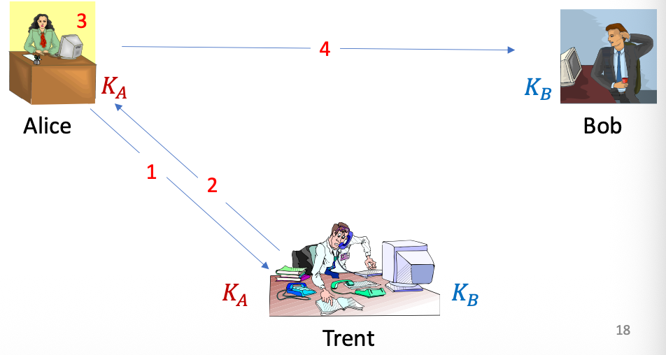

##### What has the protocol achieved?

- Alice and Bob both have a new session key
- The session key was transmitted using keys known only to Alice and Bob
- Both Alice and Bob know that Trent participated
- But there are vulnerabilities
- What if the initial request was grabbed by Mallory? Suppose Mallory is also a user of the system and share $K_M$ with Trent.

##### The man -in-the-middle attack

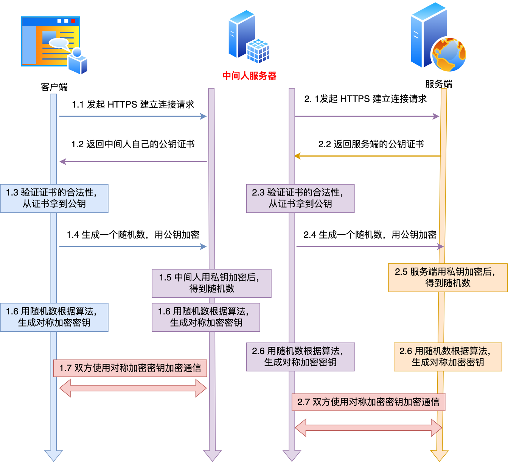

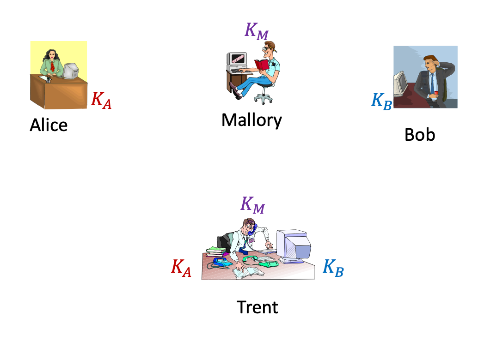

- **对称加密**中间人攻击流程：攻击重点是篡改原始请求消息
  - **手法**：攻击者 Mallory 拦截 Alice 的请求，将其篡改为“Alice 想跟 **Mallory** 通话” 。
  
  - **后果**：Trent 误以为是合法请求，生成了 Alice 和 Mallory 之间的密钥。Mallory 随后再伪造身份与 Bob 建立另一个密钥 。
  
  - **核心原因**：最初的请求缺乏**身份认证**，Trent 无法确认请求是否真的来自 Alice 且未被篡改 。
  
- Initially, Alice and Trent share 𝐾 ", Bob and Trent share 𝐾# , Mallory and Trent share $K_M$

  1. Alice - > Trent: Alice requests for a session key with Bob

  2. Malory replaces the message as following
     - Malory - > Trent: Alice requests for a session key with Malory

  3. Trent - > Alice: $\{K_{AM}\}_{K_A}, \{K_{AM}\}_{K_M}$
  4. Alice: $K_{AM} \leftarrow \{K_{AM}\}_{K_A}$
     - Alice - > Bob: $\{K_{AM}\}_{K_M}$

  5. Malory: $K_{AM} \leftarrow \{K_{AM}\}_{K_M}$
  6. Malory -> Trent: Mallory requests for a session key with Bob
  7. Trent - > Malory: $\{K_{MB}\}_{K_M}, \{K_{MB}\}_{K_B}$
  8. Malory: $K_{MB} \leftarrow \{K_{MB}\}_{L_M}$ and replace message instep 4 with $\{K_{MB}\}_{K_B}$
  9. Bob: $K_{MB} \leftarrow \{K_{MB}\}_{K_B}$

##### Defeating the man-in-the-middle attack 击败中间人攻击

- Problems:

  - Lacking authentication

    缺少合理的认证手段

- Minor changes can fix that problem

  或许只需要一些微小的改动就可以解决上面的问题

  - using MAC

    使用 Message Authentication Code，证明消息没有被篡改。

  - including timestamps/counter and identity in the messages

    包括消息中的时间戳/计数器和身份信息

#### Key transport with public key cryptography 公钥加密下的密钥传输 

这个场景不需要 Trent，Alice 和 Bob 直接交换公钥 ($PK$) 。

- With no trusted arbitrator

- Alice sends Bob her public key

  Alice 直接发送给 Bob 她的公钥

- Bob sends Alice his public key

  Bob 直接发送给 Alice 他的公钥

- Alice generates a session key and sends it to Bob encrypted with his public key, signed with her private key

  爱丽丝生成一个会话密钥，并用鲍勃的公钥加密后发送给他，同时使用自己的私钥进行签名。

- Bob decrypts Alice’s message with his private key

  鲍勃用他的私钥解密了爱丽丝的消息。并且可以使用之前接收到的 Alice 的公钥来验证 Alice 用私钥加密的信息。

- Encrypt session with shared session key

  使用共享会话密钥加密会话

##### Basic key transport using PKC

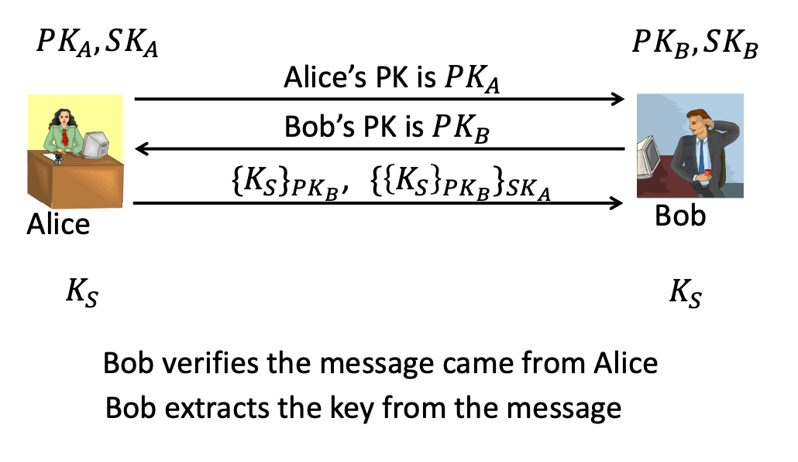

##### Protocol

1. Alice → Bob: $PK_A$
2. Bob → Alice: $PK_B$
3. Alice → Bob: $c=\{K_S\}_{PK_B}$, $\sigma_A = \{c\}_{SK_A}$
4. Bob: verifies $\sigma_A$ and $c$; extract $K_S$ from $c$.

##### Man-in-the-middle attack

1. Alice → Bob: $PK_A$
2. Mallory → Bob: $PK_M$
3. Bob → Alice: $PK_B$
4. Mallory → Alice: $PK_M$
5. Alice → Bob: $c =\{K_S\}_{PK_M}$, $\sigma_A' = \{c\}_{SK_A}$
6. Mallory extract extract $K_S$ from $c$
   - Mallory → Bob: $c' = \{K_S\}_PK_B$, $\sigma_A' = \{c'\}_{SK_M}$
7. Bob: verifies $\sigma'_A$ and $c'$; extract $K_S$ from $c'$ 

- **公钥加密**中间人攻击的手法：攻击重点是拦截并替换公钥（identity substitution）
- **手法**：Mallory 拦截双方交换的公钥。他把自己的公钥 $PK_M$ 发给 Alice（假装是 Bob 的），同时把 $PK_M$ 发给 Bob（假装是 Alice 的） 。
  
- **后果**：Alice 用 Mallory 的公钥加密了密钥 $K_S$，Mallory 拦截后可以用自己的私钥解密提取密钥，然后再用 Bob 的公钥加密发给 Bob 。
  
- **核心原因**：虽然使用了加密和签名，但**公钥本身没有绑定身份**。Alice 无法确认手里的“Bob 的公钥”到底是不是真的属于 Bob 。

##### Solution

PKI 的核心作用不是加密消息，而是解决“这个公钥到底属于谁”的问题。
CA 会为用户身份和公钥之间的绑定关系签发证书。
如果 Alice 能验证 Bob 的证书，她就可以确认手中的 PK_B 真的是 Bob 的公钥，而不是 Mallory 替换后的公钥。
因此 PKI 可以防止 public-key substitution attack / identity substitution attack。

- PKI: public-key infrastructure

  - CA (certificate authority) issues public-key certificates

    CA（证书颁发机构）签发公钥证书。

- Identity-based cryptography

  基于身份加密技术

  - the identity is (or can be used to derive) the public-key

    身份是（或可用于推导出）公钥。

### Key Exchange Protocols 

#### Diffie-Hellman key agreement 密钥协商

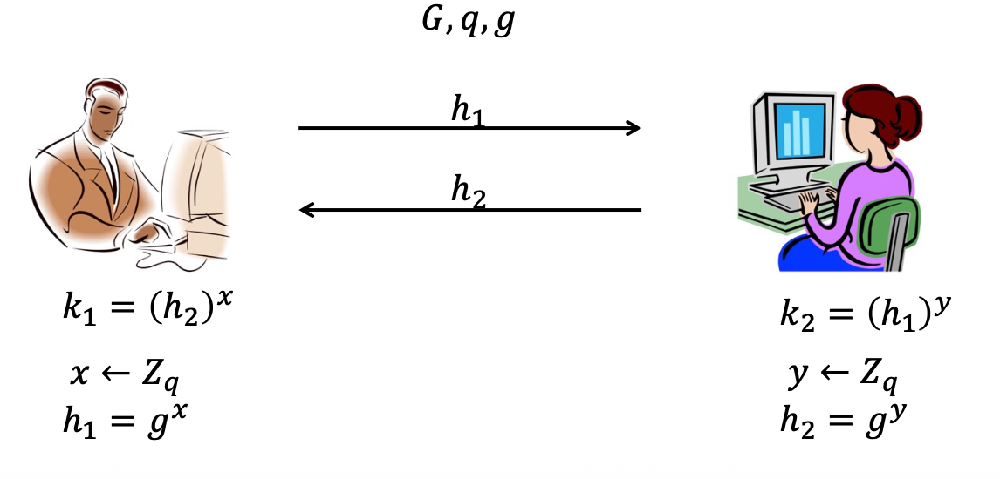

$G$: cyclic group

$q$: prime, order of G

$g$: generator of G

这是最经典的密钥交换协议，其安全性基于**离散对数难题** 。

- **参数准备**：双方共享循环群 $G$、阶 $q$ 和生成元 $g$ 。
- **交互过程**：
  1. **Alice** 选择随机数 $x$，计算并发送 $h_1 = g^x$ 。
  2. **Bob** 选择随机数 $y$，计算并发送 $h_2 = g^y$ 。
- **计算密钥**：Alice 计算 $(h_2)^x$，Bob 计算 $(h_1)^y$。由于 $(g^y)^x = (g^x)^y = g^{xy}$，双方得到了相同的共享密钥 。
- **DDH 问题**：协议的安全性依赖于攻击者无法从 $g^x$ 和 $g^y$ 中分辨出真实的 $g^{xy}$ 。

#### Man-in-the-middle to (EC)DH DH 协议的中间人攻击 

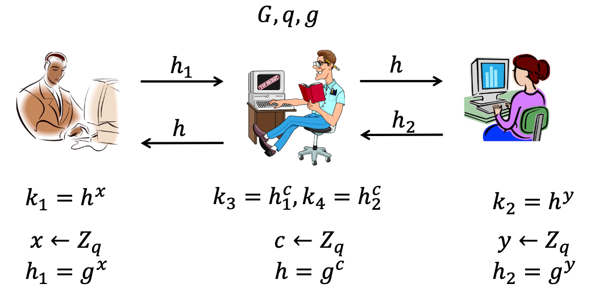

- Reason:
  - Solution:
- Lack of authentication
  - Introduce authentication in the protocol

就像之前的协议一样，基础版的 DH 协议也面临严重的中间人攻击 。

- **原因**：**缺乏身份认证** 。Alice 无法确认收到的 $h=g^c$ 是来自 Bob 还是来自攻击者 Mallory 。
- **攻击过程**：Mallory 拦截 Alice 和 Bob 的消息，分别与他们建立两个独立的密钥（$k_1$ 和 $k_2$），从而可以解密、修改并转发两人的通信，而当事人毫无察觉 。
- **对策**：必须在协议中引入**身份认证机制** 。

#### ECDH-based AKE 认证密钥建立 (AKE) 实例

为了解决上述攻击，实际应用中会使用增强版协议，如 **ECDH-based AKE** 

**IEEE 802.15.6 密码认证关联**

这是一个复杂的工业标准实例，通过密码（Password）来增强安全性 。

- 它使用了 **Nonce (随机值)** 来防止重放攻击 。
- 通过多次“安全关联帧” (Security Association frame) 的交互来确认身份并激活密钥 。

Simplified Version 简化版流程

- Initialization:

  - A, B share group parameters and password $PW, Q:\{0,1\}^* \rightarrow G$

  - Key exchange:

    1. A: generates $SK_A, PK_A, \text{computes } PK'_A - Q(PW), \text{generates } N_A$
       - $A \rightarrow B: B, A, N_A, PK'_A$

    2. B: generates $SK_B, PK_B, \text{generates } N_B$
       - $B \rightarrow A: A, B, N_B, PK_B$
    3. computes $PK_A = PK'_A +Q(PW)$, computes shared secret $K = SK_B · ·PK_A， t_B= MAC(K_x, A, B, N_A, N_B)$

    4. A: computes shared secret $K = SK_A · PK_B$, verifies $t_B$, computes $t_A = MAC(K_x, B, A, N_B, N_A)$
       - $A \rightarrow B: B, A, N_A, PK_A, t_A$

    5. B: verify $t_A$

- **初始化**：双方共享参数和密码 $PW$ 。

- **掩码处理**：Alice 生成临时公钥 $PK_A$，但发送的是经过密码打乱的 $PK_A' = PK_A - Q(PW)$ 。这样只有知道密码的 Bob 才能还原真实的公钥 。

- **确认 (MAC)**：双方在计算出共享秘密 $K$ 后，会交换 **MAC (消息认证码)** 。
  - Bob 发送 $t_B = MAC(K_x, \dots)$ 给 Alice 。
  - Alice 验证 $t_B$ 后发送 $t_A$ 给 Bob 。
  
- **结果**：这种“密钥确认”步骤确保了双方不仅算出了密钥，而且确信对方也算出了正确的密钥 。


##### Lab 5中的ECDH任务：

**预先存在**：在协议开始之前，A 和 B 已经通过物理接触或其他安全渠道（如用户手动输入、设备出厂设置）共享了一个共同的密码 $PW$ 。

**混淆与还原**：

- **A 端（发送方）**：利用一个映射函数 $Q$ 将密码转换为椭圆曲线上的一个点 $Q(PW)$ 。A 发送的不是原始公钥 $PK_A$，而是计算 $PK_A' = PK_A - Q(PW)$ 。
- **B 端（接收方）**：B 收到 $PK_A'$ 后，利用手中持有的相同密码计算出相同的 $Q(PW)$，然后通过加法运算 $PK_A = PK_A' + Q(PW)$ 还原出 A 的真实临时公钥 。

- **认证逻辑**：如果 B 手中的密码不正确，还原出的 $PK_A$ 就是错误的，后续计算出的共享密钥 $K$ 也无法通过 MAC（消息认证码）的校验，从而确保了只有合法持有密码的双方才能解密和使用该公钥 。

## More Protocols

### Zero-Knowledge Proof (ZKP) 不必理解技术，只用了解概念

- Encryption provides secrecy in a very all-or-nothing sense:

  加密在某种意义上提供了一种非此即彼的保密性：

  - a certain party (with the key) could either completely decrypt the message, learning the message contents, or cannot do anything with the message at all.

    持有密钥的一方要么能够完全解密信息，了解信息内容，要么就完全无法处理该信息。

- ZKPs allow one party (called a prover) to convince another party (called a verifier) that the prover “**knows**” some secret, **without revealing** anything else about the secret.

  零知识证明允许一方（称为证明者）说服另一方（称为验证者）自己"知道"某个秘密，而无需透露关于该秘密的任何其他信息。

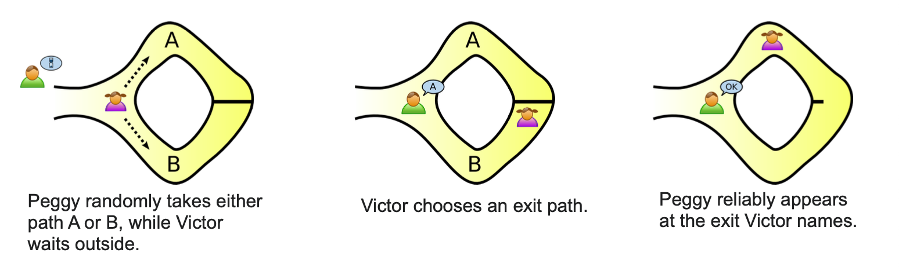

- More formally, say that both parties hold a function 𝑓, and a value $y = f(x)$. The prover may want to convince the verifier that it “knows” an 𝑥 such that 𝑦 = 𝑓(𝑥) without revealing anything else about 𝑥.

Three Properties:

- **Completeness**: If the prover “knows” 𝑥, it will always convince an honest verifier to accept.

- **Soundness**: If the verifier accepts the proof, then prover must really “know” 𝑥.

- **Zero-knowledge**: The verifier “learns nothing” about 𝑥, apart from the fact that 𝑦 = 𝑓(𝑥), as a result of interacting with the prover.

#### Schnorr's protocol 施诺尔协议

Schnorr’s protocol 用来证明：
$$
y = g^x
$$
这里：

| 符号      | 含义                                     |
| --------- | ---------------------------------------- |
| $G$       | 一个群                                   |
| $g$       | 群中的生成元 generator                   |
| $q$       | 群的阶，计算通常在 $\mathbb{Z}_q$ 中进行 |
| $x$       | Prover 知道的秘密值                      |
| $y = g^x$ | Verifier 知道的公开值                    |

Prover 想证明：

> 我知道 $x$，并且这个 $x$ 满足 $y = g^x$。

但是 Prover 不想直接告诉 Verifier：
$$
x = ?
$$
所以 Schnorr’s protocol 的核心就是：

> 证明我知道 discrete log $x$，但不泄露 $x$。

课件中也明确写到：Schnorr’s protocol 是用来证明 “knowledge of discrete logs” 的协议。

------

##### 2. 协议流程

课件中的 Schnorr’s protocol 可以分成 4 步：commitment、challenge、response、verification。

##### Step 1：Prover 随机选择 $r$，发送 commitment

Prover 随机选择：
$$
r \in \mathbb{Z}_q
$$
然后计算：
$$
R = g^r
$$
并把 $R$ 发送给 Verifier。

这里的 $R$ 可以理解成一个“临时承诺”。它暂时把 Prover 的随机数 $r$ 隐藏起来。

------

##### Step 2：Verifier 随机发送 challenge

Verifier 随机选择一个 challenge bit：
$$
c \in \{0,1\}
$$
然后把 $c$ 发给 Prover。

这个 $c$ 的作用是防止 Prover 事先准备固定答案。因为 Prover 不知道 Verifier 会问 $c=0$ 还是 $c=1$。

------

##### Step 3：Prover 根据 challenge 返回 response

如果：
$$
c = 0
$$
Prover 返回：
$$
z = r
$$
如果：
$$
c = 1
$$
Prover 返回：
$$
z = r + x \pmod q
$$
也就是说，Prover 根据 Verifier 的挑战，返回不同的回答。

------

##### Step 4：Verifier 验证

更通用的验证公式是：
$$
g^z \stackrel{?}{=} R \cdot y^c
$$
这个公式很重要。

因为：

当 $c = 0$ 时
$$
z = r
$$
所以：
$$
g^z = g^r = R
$$
而右边：
$$
R \cdot y^0 = R \cdot 1 = R
$$
所以验证通过。

------

当 $c = 1$ 时
$$
z = r + x
$$
所以：
$$
g^z = g^{r+x}
$$
根据指数运算规则：
$$
g^{r+x} = g^r \cdot g^x
$$
因为：
$$
R = g^r
$$
并且：
$$
y = g^x
$$
所以：
$$
g^z = R \cdot y
$$
右边：
$$
R \cdot y^1 = R \cdot y
$$
所以也验证通过。

课件中给出的简化版本是：如果 $c=1$，Verifier 检查 $g^z ?= R \cdot y$，并且重复这个过程来降低 soundness error。

------

##### 3. 为什么它能证明 Prover 知道 $x$？

关键点是：

如果 Prover 真的知道 $x$，他就可以正确回答两种 challenge：
$$
c=0: z=r
$$
但是如果 Prover 不知道 $x$，他很难同时准备好两种答案。

例如，假设一个作弊者不知道 $x$。他可能可以提前伪造一种情况：

- 只准备好 $c=0$ 的答案；
- 或者只准备好 $c=1$ 的答案。

但是 Verifier 的 $c$ 是随机选的，所以作弊者只有大约一半概率蒙对。

如果协议重复很多轮，比如重复 20 次，那么作弊者每一轮都蒙对的概率是：
$$
\left(\frac{1}{2}\right)^{20}
$$
这个概率就非常小。

所以课件说要：

> Repeat the process to reduce soundness error.

意思是：重复多次，可以降低作弊者骗过 Verifier 的概率。

#### Oblivious Transfer (OT)

1-out-of-2 OT 的核心目标：

- Sender 输入两个消息 M0, M1；
- Receiver 输入选择位 b ∈ {0,1}；
- Receiver 最终只能得到 Mb；
- Sender 不知道 Receiver 选择的是 M0 还是 M1；
- Receiver 也不能同时获得两个消息。

- An oblivious transfer (OT) protocol is a type of protocol in which a sender transfers one of potentially many pieces of information to a receiver, but remains oblivious as to what piece (if any) has been transferred.

  不经意传输（OT）协议是一种协议类型，其中发送方将多条潜在信息中的一条传送给接收方，但对具体传送了哪条信息（如果有的话）一无所知。

- Simplest 1-out-of-2 OT

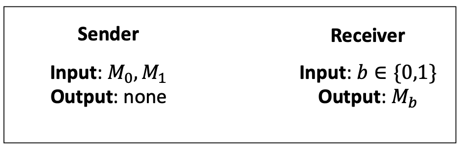

##### 1-out-of-2 OT

- Bellare-Micali Construction
- Parameters
  - 𝐺, 𝑞, 𝑔

CDH Assumption

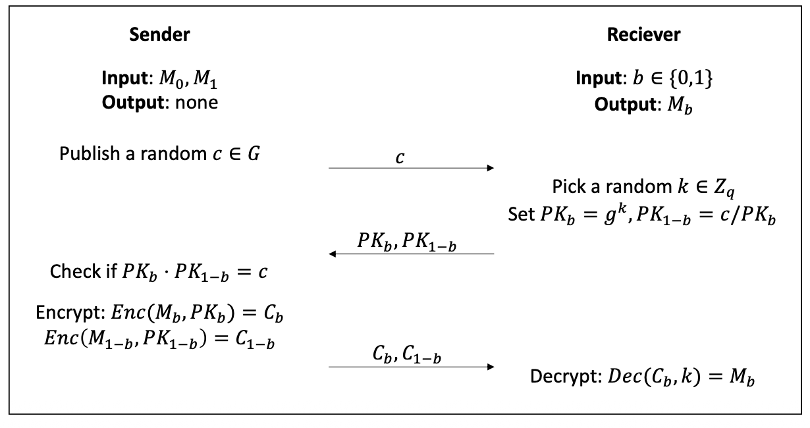

#### Signal Protocol

- Developed in 2013 by Open Whisper Systems to provide a secure, asynchronous messaging protocol.
- Powers end-to-end encryption for Signal Messenger . Also adopted by major - platforms like WhatsApp, Google Messages (RCS), and Facebook Messenger

- Core Security Properties

  - **End-to-End Encryption (E2EE)**: Only sender and recipient can read messages.

  - **Forward Secrecy**: Past messages remain secure if long-term keys are compromised.

  - **Post-Compromise Security**: The protocol automatically heals itself, securing future messages after a key compromise
  
  - **端到端加密（E2EE）**：只有发送方和接收方能读取消息内容。
  
  - **前向保密**：即使长期密钥泄露，过往消息仍保持安全。
  - **后向威胁安全**：协议具备自动修复能力，在密钥泄露后仍能确保未来消息的安全。

#### Rat che d Key Exchange

- DH ratchet on protocol level

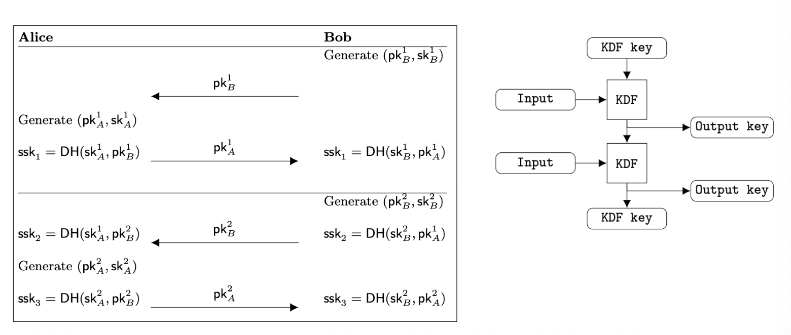

- DH ratchet from Alice’s perpective

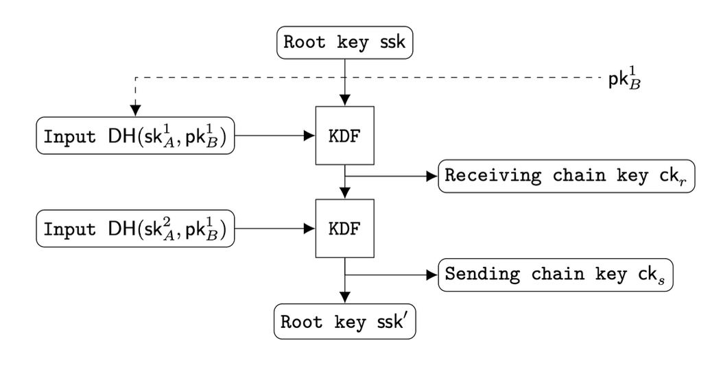

#### The root ssk

- X3DH protocol

#### How to evaluate a security protocol

- Matheticatics proof

- Formal methods: BAN, GNY logics

  - Further reading paper

- Tools

  - Casper: https://www.cs.ox.ac.uk/gavin.lowe/Security/Casper/

  - SPIN: https://spinroot.com/spin/whatispin.html
  - ProVerif: https://bblanche.gitlabpages.inria.fr/proverif/

**Security protocol evaluation:**

1. Mathematical proof：用数学方式证明协议满足安全性质。
2. Formal methods：用形式化逻辑分析协议，例如 BAN logic、GNY logic。
3. Tools：使用工具检查协议是否存在攻击路径，例如 Casper、SPIN、ProVerif。

考试中如果要求分析协议是否安全，不能只说“用了加密所以安全”。
应该检查：

- 是否认证了身份；
- 是否绑定了身份信息；
- 是否防止 replay attack；
- 是否有 key confirmation；
- 是否存在 public key substitution / MITM；
- 是否满足协议原本目标。

# 潜在考试提问与参考答案

## Question 1: What is a security protocol?

**Answer:**
 A security protocol is a sequence of steps involving two or more parties, designed to achieve a specific task with suitable security. The order of steps is important because changing the sequence or message content may introduce attacks. Different protocols also assume different trust relationships between participants. For example, a key establishment protocol may assume a trusted third party Trent, while a public-key protocol may assume that public keys can be correctly verified. A good security protocol should also be minimal, meaning it uses as few messages, as little data, and as little computation as possible.

------

## Question 2: Explain the difference between Eve and Mallory.

**Answer:**
 Eve is a passive attacker. She only listens to the communication and tries to learn secret information, but she does not modify messages. Mallory is an active attacker. He may intercept, modify, replace, delete, or inject messages. Therefore, protocols only protecting confidentiality may stop Eve, but they may still fail against Mallory if they do not provide authentication and integrity protection.

------

## Question 3: What is the difference between key transport and key agreement?

**Answer:**
 In a key transport protocol, one party creates the shared secret key and securely sends it to the other party. For example, Trent may generate a session key and encrypt it separately for Alice and Bob. In a key agreement protocol, both parties contribute information to derive the shared secret key. Diffie-Hellman is a typical example, where Alice and Bob each choose a random secret and exchange public values to compute the same shared key.

------

## Question 4: What is implicit key authentication?

**Answer:**
 Implicit key authentication means one party is assured that no other party except the specifically identified party can gain access to a particular secret key. It does not necessarily prove that the other party actually has computed the key. If we also want to confirm that the other party really possesses the key, we need key confirmation. Explicit key authentication combines implicit key authentication and key confirmation.

------

## Question 5: Explain the MITM attack on the private-key key transport protocol.

**Answer:**
 In the private-key key transport protocol, Alice and Bob both trust Trent. Alice shares a key with Trent, and Bob shares another key with Trent. The problem is that Alice’s initial request to Trent is not authenticated. Mallory can intercept Alice’s request and change “Alice wants to communicate with Bob” into “Alice wants to communicate with Mallory.” Trent then creates a key between Alice and Mallory. Mallory can later request another key with Bob and sit between Alice and Bob. Therefore, Alice and Bob think they are communicating securely, but Mallory can decrypt and re-encrypt messages between them. The root cause is lack of authentication and identity binding in the original request.

------

## Question 6: How can the private-key key transport protocol be fixed?

**Answer:**
 The protocol can be fixed by adding authentication and freshness protection. For example, Alice’s request to Trent should be protected using a Message Authentication Code, not a MAC address. The authenticated data should include Alice’s identity, Bob’s identity, and a timestamp, counter, or nonce. This allows Trent to verify that the request really came from Alice, that the target identity was not modified, and that the message is fresh rather than replayed.

------

## Question 7: Explain the MITM attack on public-key key transport.

**Answer:**
 In public-key key transport, Alice and Bob first exchange public keys. Alice then encrypts a session key using Bob’s public key and signs it with her private key. However, if public keys are not authenticated, Mallory can replace the public keys during transmission. Alice may receive Mallory’s public key and believe it is Bob’s public key. Bob may also receive Mallory’s public key and believe it is Alice’s. As a result, Mallory can decrypt Alice’s session key, re-encrypt it for Bob, and secretly relay messages between them. The root problem is that public keys are not bound to identities.

------

## Question 8: How does PKI help prevent public-key substitution attacks?

**Answer:**
 PKI prevents public-key substitution attacks by binding identities to public keys through certificates. A Certificate Authority signs a certificate stating that a particular public key belongs to a particular identity. When Alice receives Bob’s certificate, she can verify the CA’s signature and confirm that the public key really belongs to Bob. Therefore, Mallory cannot simply replace Bob’s public key with his own public key unless he can also forge a valid certificate.

------

## Question 9: Why is basic Diffie-Hellman vulnerable to MITM attacks?

**Answer:**
 Basic Diffie-Hellman allows two parties to derive a shared key over an open channel, but it does not authenticate who the parties are. Mallory can intercept Alice’s DH value and send his own value to Bob. He can also intercept Bob’s value and send his own value to Alice. As a result, Mallory establishes one shared key with Alice and another shared key with Bob. Alice and Bob believe they share a key with each other, but both are actually communicating through Mallory. The solution is to add authentication, such as certificates, digital signatures, passwords, or MAC-based key confirmation.

------

## Question 10: What is key confirmation?

**Answer:**
 Key confirmation means one party is assured that the other party actually possesses the same secret key. For example, after Alice and Bob derive a shared key, Bob can send a MAC computed using that key. If Alice verifies the MAC successfully, she knows Bob has the same key. Alice can then send another MAC back to Bob, so Bob also confirms Alice has the key. This is important because merely deriving a key is not always enough; both sides should confirm that the same key was established.

------

## Question 11: What is Zero-Knowledge Proof?

**Answer:**
 Zero-Knowledge Proof allows a prover to convince a verifier that the prover knows a secret without revealing the secret itself. For example, if both parties know $y = f(x)$, the prover wants to prove knowledge of $x$ without revealing $x$. A ZKP should satisfy three properties: completeness, soundness, and zero-knowledge. Completeness means an honest prover can convince an honest verifier. Soundness means a cheating prover should not be able to convince the verifier without really knowing the secret. Zero-knowledge means the verifier learns nothing about the secret except the fact that the prover knows it.

------

## Question 12: What is Oblivious Transfer?

**Answer:**
 Oblivious Transfer is a protocol where a sender transfers one of several possible pieces of information to a receiver, but the sender does not know which piece the receiver obtained. In 1-out-of-2 OT, the sender has two messages $M_0$ and $M_1$. The receiver chooses a bit $b$, and receives only $M_b$. The sender does not learn whether the receiver chose $M_0$ or $M_1$, and the receiver should not learn both messages.

------

## Question 13: What are the main security properties of Signal Protocol?

**Answer:**
 Signal Protocol is a secure asynchronous messaging protocol. Its main properties are end-to-end encryption, forward secrecy, and post-compromise security. End-to-end encryption means only the sender and recipient can read the messages. Forward secrecy means past messages remain secure even if long-term keys are later compromised. Post-compromise security means the protocol can recover future security after a temporary key compromise, usually through ratcheting key updates.

------

## Question 14: How should we evaluate whether a security protocol is secure?

**Answer:**
 We should not simply say a protocol is secure because it uses encryption. Instead, we should check whether it achieves its intended goal and whether it resists obvious attacks. Important questions include: Are identities authenticated? Are messages protected against modification? Are public keys bound to identities? Does the protocol prevent replay attacks using nonce, timestamp, or counter? Is there key confirmation? The protocol can also be evaluated using mathematical proof, formal methods such as BAN or GNY logic, and tools such as Casper, SPIN, or ProVerif.