# 6 User Authentication

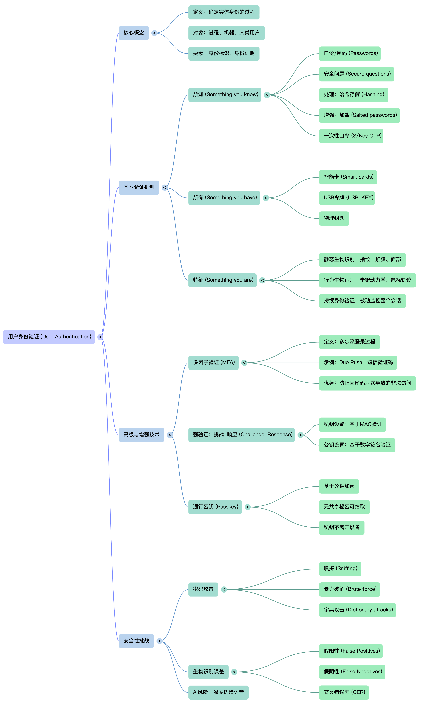

## 知识图谱

```plaintext
L-06 User Authentication 用户身份验证
├── 1. 课程目标与背景
│   ├── 理解用户身份验证的基本方法
│   ├── 理解哈希密码如何用于身份验证
│   └── 能够为给定场景设计身份验证方案
│
├── 2. 身份验证 Introduction
│   ├── Authentication 定义
│   │   ├── 确定某个实体的身份
│   │   ├── 实体可以是 Process
│   │   ├── 实体可以是 Machine
│   │   └── 实体可以是 Human user
│   │
│   ├── 身份验证需要两个条件
│   │   ├── Notion of identity 身份概念
│   │   └── Proof of identity 身份证明
│   │
│   ├── 现实世界中的身份识别
│   │   ├── Physical recognition：脸、声音
│   │   ├── Recommendation：别人介绍
│   │   ├── Credentials：学生卡、证件
│   │   └── Knowledge：只有本人知道的信息
│   │
│   └── Cyber identification 的特殊性
│       ├── 验证者通常不是人
│       ├── 被验证者也可能不是人
│       ├── 不要求物理在场
│       ├── 步骤必须清晰定义
│       ├── 适合使用数学方法
│       └── 必须面对网络窃听和数字信号复制
│
├── 3. Basic Authentication Mechanisms 基础认证机制
│   ├── Something you know
│   │   ├── Password
│   │   ├── Secure questions
│   │   ├── Hashed password
│   │   ├── Dictionary attack
│   │   ├── Salted password
│   │   └── S/Key One-Time Password
│   │
│   ├── Something you have
│   │   ├── Smart card
│   │   ├── USB-KEY
│   │   ├── Electronic keycard
│   │   ├── Physical key
│   │   └── 缺点：丢失、被盗、需要硬件
│   │
│   ├── Something you are
│   │   ├── Static biometrics
│   │   │   ├── Face
│   │   │   ├── Fingerprint
│   │   │   ├── Retina
│   │   │   ├── Iris
│   │   │   ├── Voice
│   │   │   └── Signature
│   │   │
│   │   ├── Biometric system
│   │   │   ├── Enrollment 注册
│   │   │   ├── Verification 一对一验证
│   │   │   └── Identification 一对多识别
│   │   │
│   │   └── Biometric errors
│   │       ├── False positive
│   │       ├── False negative
│   │       └── Crossover Error Rate, CER
│   │
│   └── Behavioral biometrics
│       ├── Keystroke dynamics
│       ├── Mouse dynamics
│       ├── Touch gestures
│       └── Continuous authentication
│
├── 4. Multi-Factor Authentication, MFA
│   ├── 多步骤登录过程
│   ├── 不只依赖 password
│   ├── 可能包括 email/phone code
│   ├── 可能包括 secure question
│   ├── 可能包括 fingerprint
│   ├── 例子：Cisco Duo Push
│   └── 作用：密码泄露后仍可阻止未授权访问
│
└── 5. Strong Authentication via Challenge-Response
    ├── 目的：防止重放攻击
    ├── 核心：服务器发送随机数 r / challenge
    ├── Private-key setting
    │   ├── 客户端和服务器共享密钥 k
    │   ├── Server → Client: r
    │   ├── Client → Server: m, t = Mac(m || r, k)
    │   └── Server 验证 Vrfy(m || r, k, t)
    │
    ├── Public-key setting
    │   ├── 客户端保留私钥 sk
    │   ├── 服务器保存公钥 pk
    │   ├── Server → Client: r
    │   ├── Client → Server: m, s = Sign(m || r, sk)
    │   └── Server 用 pk 验证签名
    │
    └── Passkey application
        ├── Registration：设备生成密钥对并上传公钥
        ├── Challenge：服务器发送随机挑战
        ├── Response：设备用私钥签名挑战
        └── Verification：服务器用公钥验证
```

## Review of Last Week

- Overview of Security Protocols
- Key establishment protocols
- More protocols

## Outline

- Introduction to user authentication

- Basic authentication mechanisms

- Strong authentication via challenge-response

## Learning Objective

- Understand general means of user authentication.
- Understand the mechanism by which hashed passwords are used for user authentication.
- Be able to design an authentication scheme for a given scenario.

## Introduction

What is user authentication?

身份验证是**确定某个实体身份**的过程

### Authentication

- Determining the identity of some entity

  **验证对象**：可以是进程（Process）、机器（Machine）或人类用户（Human user） 

  - Process

  - Machine

  - Human user

- Requires notion of identity

  **必要条件**：需要具备**身份概念**（Notion of identity）以及某种程度的**身份证明**（Proof of identity） 。

  - And some degree of proof of identity

### Providing Identity in the physical world 给定一个现实世界中的身份

- Most frequently done by **physical recognition**

  最常见的是通过物理识别来完成。

  - I recognize your face, your voice

    我认得你的脸，你的声音

- What about identifying those we don’t already know?

  但是如果是去验证哪些我们本来就知道的事物呢？

### Other physical identification methods 其他物理识别方法

- Identification by recommendation
  - You introduce me to someone

- Identification by credentials
  - You show me your student ID card

- Identification by knowledge
  - You tell me something only you know

- These all have cyber analogs

### Difference in Cyber Identification 网络空间身份验证的差异

- Usually the identifying entity isn’t human

  通常识别实体并非人类

- Often the identified entity isn’t human, either

  通常被识别的实体也并非人类。

- Often no physical presence required

  通常无需实体到场

网络空间的身份识别具有其特殊性，这些方法大多都有其对应的“数字模拟”版本 ：

- **非人类交互**：验证者和被验证者往往都不是人类 。
- **无须物理存在**：验证过程通常不需要当事人在场 。
- **明确的步骤要求**：计算机不如人类聪明，因此证明身份的步骤必须经过**严格且清晰的定义** 。
- **计算优势**：虽然不够灵活，但计算机在数学计算上速度极快且不易出错，因此**数学方法**在网络验证中非常适用 。

### Identifying with a computer

- Not as smart as a human
  - Steps to prove identity must be well defined
- But lightning fast on computations and less prone to simple errors
  - Mathematical methods are acceptable

### Identifying computers and programs

-  No physical characteristics

  没有物理特征

  - Faces, fingerprints, voices, etc.

    面部，指纹，声音等

- Generally easy to duplicate programs

  程序通常比较容易复制

- Not smart enough to be flexible

  不够聪明，所以不够灵活

  - Must use methods they will understand

    必须使用他们能够理解的方法

- Again, good at computations

  但是非常易于计算

### Physical Response Optional 物理反应可选

- Often authentication required over a network or cable

  通常需要通过网络或电缆进行身份验证。

- Even if the party to be identified is human

  即使待识别方为人类

- So authentication mechanism must work in face of network characteristics

  因此，身份验证机制必须能够在网络特性面前有效运作。

  - Active wiretapping

    主动窃听

  - Everything is converted to digital signal

    所有内容都转换为数字信号

## Basic Authentication Mechanisms 基础身份验证机制

### Authentication Mechaisms 验证机制分类

- Something you know

  你所知道的

  - Passwords, secure questions

    例如密码、安全问题 。

- Something you have (token)

  你所拥有的

  - Smart cards, electronic keycard, physical key

    物理令牌，如智能卡、电子钥匙卡或实体钥匙 。

- Something you are (static biometrics)

  你所表现的/静态生物识别

  - Fingerprint, retina, face

    指纹、视网膜、面部识别等

- Behavioral Biometrics

  行为生物识别

  - Keystroke dynamics, mouse dynamics, touch gestures, etc.

  - Analyzes how users interact, not just who they are

  - Enabling passive, continuous authentication throughout the entire session, not just at login
  - 分析用户的交互方式，如按键动态、鼠标操作动态和触摸手势 。

### Continuous Authentication 持续身份验证

- Traditional:

  传统方式

  - Authenticate once at login

    用户仅在登录时进行一次身份验证

  - Session continues regardless of who is at the keyboard

    随后会话将持续进行，而不考虑键盘前的实际使用者是谁 。

- Modern:

  现代验证

  - Continuous authentication passively monitors behavioral patterns throughout the entire session

    在整个会话过程中被动地监测用户的行为模式 。

- Key Benefit: Even if credentials are stolen, an attacker cannot replicate the user’s unique behavioral signature (typing rhythm, mouse movements)

  **核心优势**：即使攻击者窃取了登录凭据，也难以复制用户独特的**行为签名**（如打字节律或鼠标移动轨迹），从而增强了安全性 。

## 2.1 Authentication mechanisms based on something you know

### Password

- One of the oldest and most commonly used security mechanisms

  最古老且最常用的安全机制之一

- Authenticate the user by requiring him to produce a secret

  通过要求用户提供秘密来验证其身份

  - Usually known only to him and to the authenticator

    通常仅由他和验证者所知

#### Problems with passwords

- They have to be unguessable

  它们必须无法被猜中。

  - Yet easy for people to remember

    然而人们却容易记住

- If networks connect remote devices to computers, susceptible to password sniffers

  若网络将远程设备连接至计算机，易受密码嗅探器攻击

- Unless quite long, brute force attacks often work on them

  除非耗时过长，否则暴力破解通常能对其奏效。

#### Proper use of passwords

- Passwords should be sufficiently **long**
- Passwords should contain **non-alphabetic characters**
- Passwords should be **unguessable**
- Passwords should be **changed often**
- Passwords should **never be written down**
- Passwords should **never be shared**

#### Handling Password

- The OS must be able to check passwords when users log in

  操作系统必须能够在用户登录时验证密码。

- So must the OS store passwords?

  那么操作系统是否必须存储密码呢？

- Not really

  - It can store a hashed version

    它可以存储哈希版本

- Hash the offered password

  对提供的密码进行哈希处理

  - e.g., MD5

- And compare it to the stored version

  并与存储的版本进行对比

#### Standard Password Handling

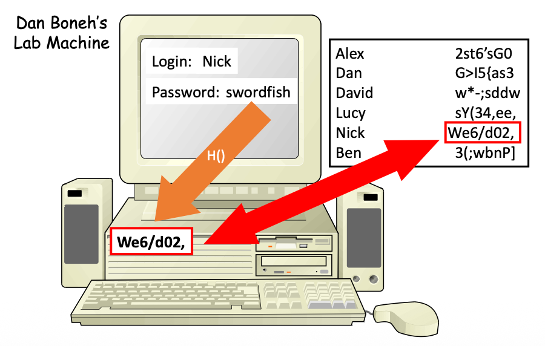

#### Is hashing the password file enough?

- What if an attacker gets a copy of your password file?

  若攻击者获取了你的密码文件副本会怎样？

- Dictionary attacks

  那么实际上就能形成原文和密码的对照

### Dictionaries

- Dictionary based on probability of words being used as passwords

  基于单词被用作密码的概率词典

- Partly set up as procedures

  - E.g., try user name backwards

- Checks common names, proper nouns, etc.

  检查常用名称、专有名词等。

- Famous dictionaries

  著名词典

  - RockYou.txt

  - CrackStation

  - Weak Passwords List of NIST

- **攻击原理**：字典攻击并非盲目随机尝试，而是基于单词被用作密码的**概率**进行尝试 。
- **攻击程序**：攻击者会使用特定程序，例如尝试将用户名倒写作为密码 。
- **常用字典**：字典通常包含常见名字、专有名词等 。
- **著名字典库**：课件提到了 **RockYou.txt**、**CrackStation** 以及 NIST 的弱密码列表 。

### Illustrating the problem 问题的核心是

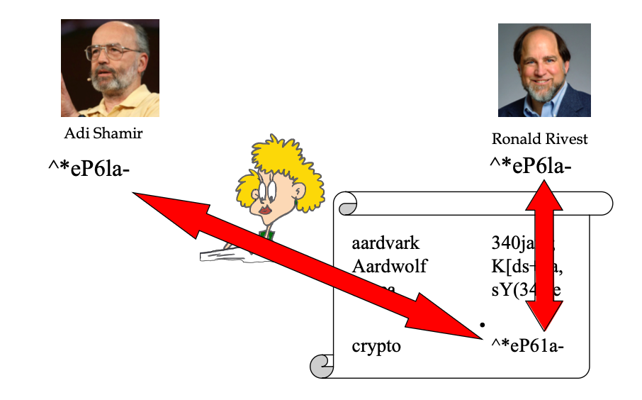

- Not just that Shamir and Rivest chose the same password

- But that anyone who chose that password got the same hashed result

- So the attacker need only hash every possible password once

- And then she has a complete dictionary usable against anyone

- **相同结果**：如果两个用户（如图中的密码专家 Shamir 和 Rivest）选择了相同的密码，他们的**哈希结果也是完全相同**的 。
- **攻击优势**：这意味着攻击者只需将字典中的每个可能密码**计算一次哈希**，就可以生成一个通用的哈希字典 。
- **大规模破解**：一旦攻击者拿到了数据库，她可以一次性比对所有用户的哈希值，瞬间识别出所有使用常见密码的用户 。

### Salted passwords 加盐密码

- Combine the plaintext password with a random number
- Then run it through the one-way function
- The random number need not be secret
- It just has to be different for different users
- **定义**：将明文密码与一个**随机数（Salt）**结合 。
- **处理流程**：将“密码 + 随机数”组合后，再通过单向哈希函数处理 。
- **非秘密性**：随机数（盐）**不需要保密**，它可以直接存储在数据库中 。
- **关键点**：重要的是每个用户的“盐”必须是**不同**的 。

### 加盐是否解决了问题？

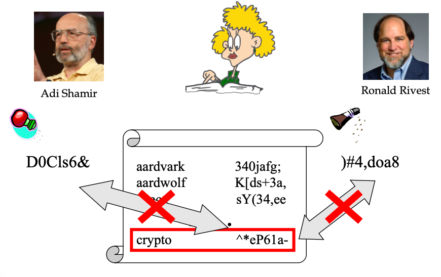

本页通过图示回答了“加盐是否解决了问题”：

- **差异化**：即使 Shamir 和 Rivest 仍然使用相同的原始密码（例如 "crypto"），但因为系统为他们分配了不同的盐（如 `D0Cls6&` 和 `)#4,doa8`），最终生成的**哈希值会完全不同** 。
- **破坏通用字典**：现在，攻击者无法再使用单一的预计算字典来破解所有用户了 。她必须针对每一个用户、每一个独特的“盐”，重新计算一遍字典哈希，这使得攻击成本呈指数级上升 。

### UNIX Password Scheme

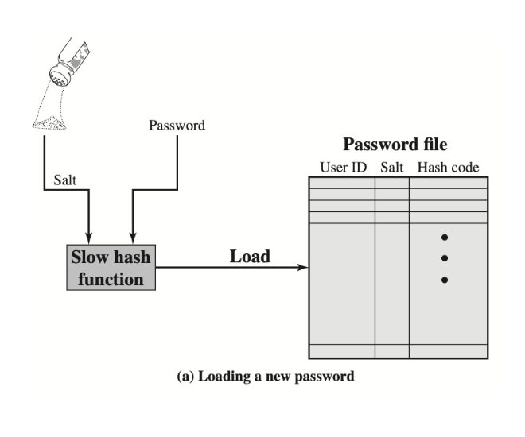

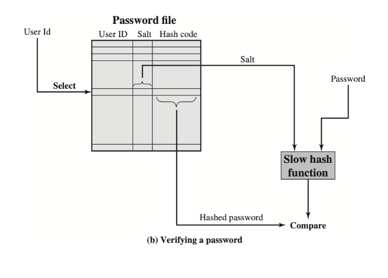

- **加载新口令(第一张图)**：当用户设置密码时，系统生成一个**盐（Salt）** 。盐与明文口令一起输入进一个**慢速哈希函数（Slow hash function）** 。最终，用户名、盐和哈希结果被存入口令文件 。使用“慢速”函数是为了增加攻击者暴力破解的时间成本。
- **验证口令（第二张图）**：用户登录时，系统根据用户名从文件中提取对应的**盐** 。系统将用户输入的口令与这个盐再次进行哈希计算 。如果计算出的哈希值与文件中存储的哈希值一致，则验证通过 。

### S/Key: One-Time Password

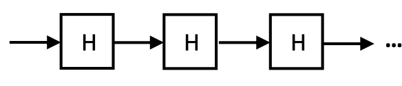

- Server (verifier) generates $x, H(x), H^2(x), ..., H^{n+1}(x)$
  - **哈希链生成**：服务器（验证者）首先基于一个初始值 *x*，通过连续计算哈希函数生成一系列的值：*H*(*x*),*H*2(*x*),…,*Hn*+1(*x*)。
- User (prover) is given n one-time passwords: $H(x), H^2(x), H^n(x)$
  - **密码分配与服务器存储**：用户（证明者）会被分配 *n* 个一次性密码，序列为：*H*(*x*),*H*2(*x*),…,*Hn*(*x*)。服务器只保留哈希链末尾的那个值，即 *Hn*+1(*x*)，并将之前生成的其他值全部丢弃。

- Server (verifier) only stores Hn+1(x) and **discards** others $H^{n+1}(x)$
  - $H(H^n(x))?=H^{n+1}(x)$
- User (prover) uses in the reverse order: $H^n(x), ..., H^2(x), H(x)$
  - **逆序使用规则**：用户在使用这些一次性密码进行验证时，**必须以与生成序列相反的顺序进行提交**。例如，第一次使用 *Hn*(*x*)，下一次使用 *Hn*−1(*x*)，依次类推直到 *H*(*x*)

- Server (verifier) **updates** to $H^n(x)$
- User (prover) uses in the reverse order: $H^{n-1}(x), …, H^2(x), H(x)$
  - **服务器验证与更新机制**：
    - 当用户提交一个密码时（例如提交了 *Hn*(*x*)），服务器会对接收到的密码进行一次哈希运算，即计算 *H*(*Hn*(*x*))，然后比对这个结果是否与服务器当前存储的值（此时为 *Hn*+1(*x*)）相等。
    - 如果验证通过，**服务器会将当前存储的密码更新为用户刚刚提交的密码** *Hn*(*x*)，用于下一次的登录比对

通俗解释：

S/Key 巧妙地利用了**“单向计算”（哈希函数）**的特点：正向计算很容易，但想要逆向还原却几乎不可能（就像把肉绞成肉馅容易，但把肉馅变回肉块是不可能的）。

我们可以用“撕日历”来通俗地理解它们的配合过程：

**1. 准备阶段：制作并分配“密码日历”**

服务器通过“单向计算”连续生成一长串密码，你可以理解为服务器印制了一本有 *n* 页的“密码日历”，每一页的密码都是根据前一页的密码“单向计算”出来的。**用户**拿到了这本包含 *n* 个密码的完整日历（序列为 *H*(*x*) 到 *Hn*(*x*)）。**服务器**为了安全，把日历全扔了，**只留下这串密码的最后一个值**（*Hn*+1(*x*)）作为“对照原件”锁进保险柜。

**2. 用户登录：从后往前“撕日历”**

用户每次登录时，必须**从后往前**撕日历（也就是逆序使用密码）。第一次登录时，用户把日历的最后一页（*Hn*(*x*)）提交给服务器。

**3. 服务器验证：加工比对**

服务器收到用户提交的密码后，怎么确认它是真的呢？服务器会把收到的密码扔进“单向计算”的机器里算一次（计算 *H*(*Hn*(*x*))）。如果算出来的结果，正好等于服务器保险柜里存的那个“对照原件”（*Hn*+1(*x*)），就说明密码是对的，允许用户登录。

**4. 密码更新：替换对照原件**

验证通过后，旧的“对照原件”就作废了。服务器会把用户刚才提交的密码（*Hn*(*x*)）当作**新的“对照原件”**存起来，用于下一次的登录比对。下一次登录时，用户再往前撕一页（提交 *Hn*−1(*x*)），服务器再次进行单向计算比对，以此类推。

**为什么黑客偷走了也没用？** 因为用户是**倒着**使用密码的。就算黑客今天在网络上偷看到了你提交的密码（比如 *Hn*(*x*)），明天你需要用的是日历的前一页（*Hn*−1(*x*)）。黑客手里只有今天的密码，由于“单向计算”无法逆推的特性，黑客绝对算不出明天的密码是什么，因此只能干瞪眼

### PassKey 通行密钥

作为**传统密码的替代方案**，及其基于**公钥密码学**和**“质询-响应”机制**的工作原理。以下是详细的解释：

**1. 什么是 Passkey？** Passkey 是一种用来替代传统密码、一次性密码（OTP）以及魔法链接的新型认证方式。它的主要特点是**安全、能够抵抗网络钓鱼攻击，并且非常易于使用**。

**2. 核心技术：公钥密码学** 与我们刚才讨论的需要在服务器和用户之间比对哈希值的方案不同，Passkey 是**基于公钥密码学（Public-key cryptography）**建立的。它包含一对密钥：

**私钥（Private Key,** sk）：保存在用户的设备（如手机、电脑）中。**公钥（Public Key, **pk）：存放在需要登录的互联网 IT 系统（服务器）或数据库中。

**3. 最大的安全优势：没有共享密钥** Passkey 的革命性在于**它不存在可以被黑客窃取的“共享秘密”**。你的**私钥永远不会离开你的设备**。因为服务器上只保存公开的“公钥”，即使服务器遭到黑客攻击导致数据泄露，黑客也无法拿到你的私钥，从而彻底杜绝了密码被大规模盗用的风险。

**4. 它是如何工作的？（质询-响应机制）** Passkey 的运行依赖于一种叫做**“质询/响应”（Challenge/Response）**的流程，配合指纹或面部识别等生物特征即可完成验证。具体步骤如下：

**注册阶段（Registration）**：用户设备生成密钥对后，将公钥发送并保存在服务器上。**质询阶段（Challenge）**：当用户尝试登录时，服务器会生成一段随机的字符串（即“质询”，例如 `eb9695b23`），并发送给用户的设备。**响应阶段（Response）**：用户在设备上（通常通过验证指纹或刷脸授权）使用自己的**私钥**对这段“质询”进行加密处理，生成一段唯一的“响应”代码（例如 `48d6a0f48`），并发回给服务器。**验证通过**：服务器收到响应后，用之前保存的**公钥**进行验证。如果验证通过，就证明该用户确实持有对应的私钥，从而允许登录。黑客如果没有你的设备和私钥，是绝对无法伪造出正确响应的。

## 2.2 Authentication mechanisms based on something you have (token)

### Identification Device

- Authentication by what you have

  这种机制的核心在于验证用户是否实际持有一个特定的物理对象

- A smart card or other hardware device that is readable by the computer

  常见的硬件设备包括能被计算机读取的**智能卡**、数字银行广泛使用的 **USB-KEY（U盾）**、以及可以生成验证码的电子硬件令牌等。

- Authenticate by providing the device to the computer

  用户在登录时，必须将这些物理设备连接或提供给计算机系统才能完成认证

  - e.g. USB-KEY used by digital bank

### Authentication with smart cards

- How can the server be sure of the remote user’s identity?

  服务器为了确认远程用户的身份，通常会配合使用“质询-响应”（Challenge-response）机制。服务器向设备发送一个“质询”（Challenge），设备内部处理后（例如计算该质询的哈希值 *H*(challenge)）将结果发回，以此向服务器自证身份

- Often user must enter password to activate card

  为了防止设备被他人直接拿来用，系统通常会要求用户**先输入一个密码来激活设备**，然后设备才会开始执行身份验证的计算

### Problems with identification devices

- If lost or stolen, you can’t authenticate yourself

  **遗失与被盗风险**：这是该方案最大的痛点。如果用户弄丢了设备，自己就无法登录系统了。更严重的是，如果设备被盗，其他人就有可能冒充该用户进行身份验证

  - And maybe someone else can

  - Often combined with passwords to avoid this problem

- Requires special hardware

  **多因素结合**：为了弥补一旦设备丢失带来的安全隐患，这种物理硬件通常会**与密码结合使用**（即所谓的“你拥有的东西”+“你知道的东西”）。这样即使黑客拿到了硬件，如果不知道激活密码，依然无法得逞。

  **依赖专用硬件**：这种机制要求用户随身携带额外的物品，并且通常需要专门的硬件接口（如USB插口、非接触式读卡器等）来配合，使用成本较高且不够便利

## 2.3 Biometric Authentication

### Biometric authentication

- Attempts to authenticate an individual based on unique physical characteristics

  这种验证机制依赖于**模式识别（Pattern recognition）**技术，通过比对个人独特的生理或行为特征来确认身份

- Based on pattern recognition

### Biometric Characteristics

常见的生物特征包括：面部特征、指纹、手部几何形状、视网膜图案、虹膜、签名以及声音。

**关于声音识别的安全隐患**：由于近年来 AI 语音合成技术（Deepfakes）的快速发展，声音识别变得极易受到攻击。因此，现在的企业级系统正在逐渐淘汰将声音作为单一身份验证因素的做法

- Physical characteristics used include:

  - Facial characteristics

  - Fingerprints

  - Hand geometry

  - Retinal pattern

  - Iris

  - Signature
  - Voice
    - Voice recognition is now highly vulnerable to AI voice synthesis (deepfakes). Enterprise systems are moving away from voice as a sole factor.

### Biometric System

- **注册（Enrollment）**：这是初始阶段，系统采集用户的生物特征并建立其与用户身份之间的关联，存储在数据库中。
- **验证（Verification）**：属于“一对一”的比对。系统采集当前用户的特征，用来核实该用户是否真的是其所声明的那个身份。
- **识别（Identification）**：属于“一对多”的比对。系统采集未知用户的生物特征，并在数据库中进行全面检索，以确定这个人的具体身份

### Problems with biometric authentication 面临的挑战与致命缺陷

尽管生物识别看起来很高级，但它在实际应用中面临诸多问题

- Usually requires very special hardware

- May not be as foolproof as you think

- Many physical characteristics vary too much for practical use

- Generally not helpful for authenticating programs or roles

- What happens when it’s cracked?
  - You only have two retinas, after all

**需要专用硬件**：通常必须配备非常特殊的传感器硬件才能完成特征提取。

**特征不稳定**：许多身体特征在现实生活中可能会发生变化（如受伤、衰老等），导致其并没有人们想象中那么绝对可靠。

**数据泄露后无法重置**：这是生物识别**最致命的弱点**。如果你的密码被盗了，你可以随时更换；但如果你的视网膜或指纹数据被黑客攻破并窃取，你是无法“更换”自己的视网膜的。不适用于对计算机程序或后台系统角色进行身份验证

### Usability vs. security

- False positives
  - Match made when it shouldn’t have been
- False negatives
  - Match not made when it should have been

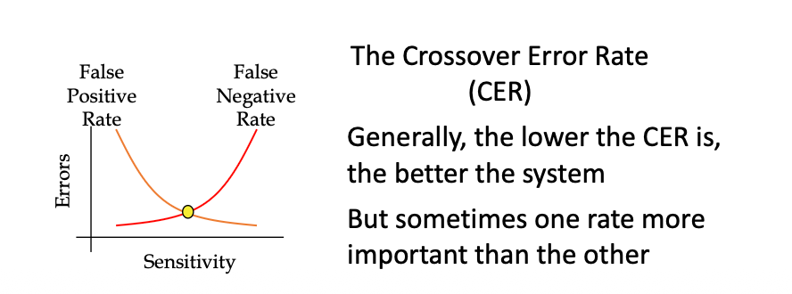

## 2.4 Multi-factor authentication

### Multi-factor authentication (MFA)

- A multi-step account login process that requires users to enter more information than just a password.

  **什么是多因素身份验证（MFA）？** 多因素身份验证是一种**多步骤的账户登录过程**。它打破了仅依靠单一密码登录的传统模式，要求用户必须**提供除密码之外的更多信息**才能完成身份确认

- For example, along with the password, users might be asked to

  **常见的辅助验证形式** 在输入常规密码之后，系统通常会要求用户提供第二种（或更多）验证形式，课件中列举的例子包括

  - enter a code sent to their email/phone,

    输入发送到用户电子邮件或手机上的**验证码**

  - answer a secret question, or

    回答事先设置的**安全加密问题**

  - scan a fingerprint.

    扫描**指纹**等生物特征

- A second form of authentication can help prevent unauthorized account access if a system password has been compromised.

  如果系统密码遭到泄露，第二种身份验证方式有助于防止未经授权的账户访问。

**MFA的核心安全作用** MFA 的最大价值在于**提供双重（或多重）保护防线**。如果系统只依靠密码，一旦密码被黑客窃取（妥协），账户就会彻底沦陷。而引入第二种身份验证形式后，即使黑客拿到了你的密码，由于他们无法提供第二因素（例如拿不到你的手机验证码或没有你的指纹），就能**有效防止账户被未经授权的人员访问**。

**实际应用案例**

**企业级平台**：课件中展示了 **Cisco（思科）的 Duo 平台**作为 MFA 的典型代表。用户在使用密码登录后，系统会通过手机上的 Duo Mobile 应用程序发送“推送通知（Duo Push）”或要求输入动态通行码（Passcode）来进行二次确认。**校园系统升级**：课件开头也提到，为了加强校园信息安全，西浦（XJTLU）的统一身份管理系统（UIM）也被升级成为了包含多因素身份验证的平台

## Strong authentication via challenge-response

### Authentication to a server

**基础验证机制的隐患** 在引入“质询”之前，如果客户端仅仅是向服务器发送登录请求（m=′login′）以及基于密钥生成的认证标签（如消息认证码 *t* 或数字签名 *s*），这种方式存在被攻击的风险（例如黑客可以截获并重复发送这段数据来伪造登录）

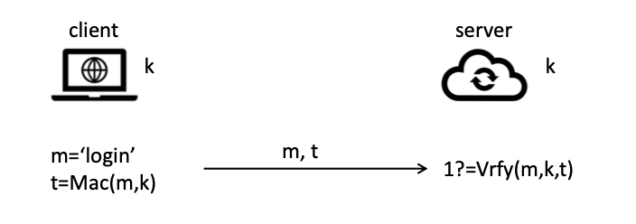

**质询-响应机制（Challenge-response）的核心** 为了解决上述安全问题，服务器会在验证过程中加入一个**随机生成的数r（即“质询”）**。客户端在回复时，必须将这个随机数包含在加密计算中。这就保证了每一次的身份验证过程产生的数据都是全新且独一无二的。

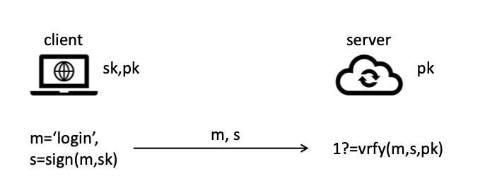

### Challenge-response with private-key setting

1. server -> client: r
2. client -> server: m, t=Mac(m || r,k)
3. server: 1?=Vrfy(m||r,k)

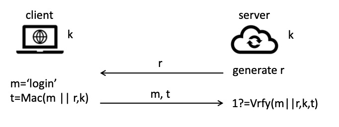

**环境一：基于私钥/对称密钥（Private-key setting）** 在这种环境下，服务器和客户端双方共享同一个密钥 *k*。

**步骤 1**：服务器生成一个随机数 *r*，并发送给客户端。

**步骤 2**：客户端收到后，将登录消息 *m* 与随机数 *r* 拼接（*m* ||*r*），并使用共享密钥 *k* 计算出一个消息认证码 *t*（即 *t* = *Mac*(*m* || *r*,*k*)），然后将 *m* 和 *t* 发给服务器。

**步骤 3**：服务器使用相同的密钥 *k*，结合自己刚才发送的 *r*，验证这个 *t* 值是否正确（1?=*Vrfy*(*m* || *r*,*k*,*t*)）

<hr>

1. server -> client: r
2. client -> server: m, t=Sign(m||r,sk)
3. server: 1?=Vrfy(m||r,pk)

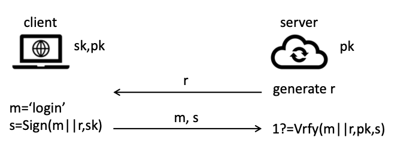

**环境二：基于公钥/非对称密钥（Public-key setting）** 在这种环境下，客户端保存着私密不公开的私钥（*sk*），而服务器端仅保存公开的公钥（*pk*）。

**步骤 1**：服务器同样生成一个随机数 *r* 发送给客户端。

**步骤 2**：客户端将消息 *m* 与随机数 *r* 拼接，并使用自己的**私钥** *sk* 对其进行数字签名，生成签名值 *s*（即 *s*=*Sign*(*m* || *r*,*sk*)），并发给服务器。

**步骤 3**：服务器使用之前保存的**公钥** *pk* 来验证这个签名是否合法（1?=*Vrfy*(*m* || *r*,*pk*,*s*)）

### PassKey Application

**实际应用案例：Passkey（通行密钥）** 课件最后通过图解详细说明了 Passkey 正是“基于公钥环境的质询-响应机制”的典型应用：

**注册（Registration）**：用户设备将公钥发送并存储在互联网的 IT 系统中。

**质询（Challenge）**：系统在用户登录时，发送一段随机字符串作为质询（例如图中的 `eb9695b23`）。

**响应（Response）**：用户设备使用保管在本地的私钥对这段质询代码进行签名处理，生成一段唯一的响应代码（例如 `48d6a0f48`）并传回系统。系统使用公钥验证该响应代码，通过后即允许登录。

# 潜在考试问题与参考答案

## Question 1：What is user authentication? Why is it different in cyberspace?

**Answer：**
 User authentication is the process of determining the identity of an entity. The entity can be a human user, a machine, or a process. Authentication requires a notion of identity and some proof of identity. In the physical world, identity can be proved by face, voice, ID card, recommendation, or knowledge. However, in cyberspace, the identifying party is usually not human, and the identified entity may also be a program or machine. Physical presence is often not required, and all information is converted into digital signals. Therefore, authentication steps must be clearly defined and usually rely on mathematical methods.

------

## Question 2：Explain the three main categories of authentication mechanisms and give examples.

**Answer：**
 The three main categories are **something you know**, **something you have**, and **something you are**. Something you know includes passwords and security questions. Something you have means a physical or digital token, such as smart cards, USB-KEY, electronic keycards, or physical keys. Something you are refers to biometric characteristics, such as fingerprints, retina, face, iris, voice, or signature. The course also discusses behavioral biometrics, such as keystroke dynamics and mouse dynamics, which can support continuous authentication during a session.

------

## Question 3：Why is storing hashed passwords better than storing plaintext passwords? Is hashing alone enough?

**Answer：**
 Storing hashed passwords is better because the system does not store the original plaintext password. During login, the system hashes the password entered by the user and compares it with the stored hash. However, hashing alone is not enough. If an attacker obtains the password file, they can use dictionary attacks by hashing common passwords and comparing them with stored hash values. If two users use the same password, they will have the same hash result, so one precomputed dictionary can be used against many users.

------

## Question 4：What is a salted password? How does it defend against dictionary attacks?

**Answer：**
 A salted password combines the plaintext password with a random number called salt before applying a one-way hash function. The salt does not need to be secret, but it must be different for different users. With salt, even if two users choose the same password, their final hash values will be different because their salts are different. This prevents attackers from using one universal precomputed dictionary against all users. Instead, the attacker must recompute hashes for each user’s unique salt, which greatly increases the attack cost.

------

## Question 5：Explain how S/Key one-time password works.

**Answer：**
 S/Key uses a hash chain to generate one-time passwords. The server first generates `H(x), H²(x), ..., Hⁿ⁺¹(x)`. The user receives the values from `H(x)` to `Hⁿ(x)`, while the server only stores `Hⁿ⁺¹(x)`. The user uses the passwords in reverse order. For example, in the first login, the user submits `Hⁿ(x)`. The server computes `H(Hⁿ(x))` and checks whether it equals the stored `Hⁿ⁺¹(x)`. If it matches, authentication succeeds and the server updates its stored value to `Hⁿ(x)`. Because hash functions are one-way, an attacker who captures one used password cannot derive the next valid password.

------

## Question 6：What are the advantages and disadvantages of authentication based on something you have?

**Answer：**
 Authentication based on something you have requires the user to possess a physical device, such as a smart card, USB-KEY, electronic keycard, or physical key. Its advantage is that an attacker cannot authenticate by only knowing a password; they also need the device. However, it has several disadvantages. If the device is lost, the legitimate user cannot authenticate. If it is stolen, someone else may use it. It also requires special hardware, which increases cost and inconvenience. Therefore, it is often combined with passwords, so the user must both possess the device and know the activation password.

------

## Question 7：What is the difference between biometric verification and biometric identification?

**Answer：**
 Biometric verification is a one-to-one comparison. The user first claims an identity, such as by entering a username or PIN, and the system compares the current biometric sample with that user’s stored template. The output is usually true or false. Biometric identification is a one-to-many comparison. The user may not claim an identity, and the system compares the current biometric sample with many templates in the database to determine who the user is or whether the user is unidentified.

------

## Question 8：Explain false positive, false negative, and CER in biometric authentication.

**Answer：**
 A false positive happens when the system makes a match when it should not. For example, an attacker is incorrectly accepted as a legitimate user. A false negative happens when the system fails to make a match when it should. For example, a legitimate user is rejected. CER, or **Crossover Error Rate,** is the point where the false positive rate and false negative rate are equal. In general, a lower CER means a better biometric system. However, in high-security systems, false positives may be more dangerous, while in user-friendly consumer systems, false negatives may be more annoying.

------

## Question 9：Why is multi-factor authentication more secure than password-only authentication?

**Answer：**
 Multi-factor authentication requires users to provide more than one authentication factor. For example, a user may first enter a password and then confirm a Duo Push notification, enter a phone code, answer a security question, or scan a fingerprint. It is more secure than password-only authentication because even if the password is stolen, the attacker still needs the second factor. This reduces the risk of unauthorized access caused by compromised passwords.

------

## Question 10：Explain challenge-response authentication in the private-key setting.

**Answer：**
 In the private-key setting, the client and server share a secret key `k`. First, the server generates a random challenge `r` and sends it to the client. Then the client computes a MAC over the message and challenge, such as `t = Mac(m || r, k)`, and sends `m` and `t` back to the server. Finally, the server uses the same key `k` to verify whether the MAC is correct. Because `r` is fresh every time, an old response cannot be reused, so the scheme helps prevent replay attacks.

------

## Question 11：Explain challenge-response authentication in the public-key setting.

**Answer：**
 In the public-key setting, the client keeps a private key `sk`, while the server stores the corresponding public key `pk`. First, the server sends a random challenge `r` to the client. The client signs the message and challenge using its private key, producing `s = Sign(m || r, sk)`. The client sends the message and signature to the server. The server verifies the signature using the public key `pk`. If verification succeeds, the server knows that the client owns the private key. This method does not require the server to store a shared secret.

------

## Question 12：How does Passkey apply challenge-response authentication?

**Answer：**
 Passkey is an application of public-key challenge-response authentication. During registration, the user’s device generates a key pair and sends the public key to the server. The private key stays on the user’s device. During login, the server sends a random challenge to the device. The user authorizes the device, often through fingerprint or face recognition, and the device signs the challenge using the private key. The server verifies the signature using the stored public key. If verification succeeds, the user is authenticated. Since the server does not store passwords or private keys, Passkey reduces the risk of password database leakage and phishing.
