# 8 Access Control 访问控制

## 知识图谱

```plaintext
L-07 Access Control 访问控制
├── 1. 访问控制基础概念
│   ├── 1.1 访问控制定义
│   │   ├── 根据安全策略控制系统资源使用
│   │   ├── 只允许 authorized entities 访问
│   │   └── 决定 who/what 能访问什么资源，以及允许什么操作
│   │
│   ├── 1.2 访问控制与其他安全功能的关系
│   │   ├── Authentication：先确认用户身份
│   │   ├── Authorization Database：保存权限规则
│   │   ├── Access Control Function：执行访问决策
│   │   ├── System Resources：被保护资源
│   │   └── Auditing：记录访问行为
│   │
│   └── 1.3 三个基本元素
│       ├── Subject 主体
│       │   └── 能访问对象的实体，例如用户、进程、程序
│       ├── Object 客体
│       │   └── 被保护的资源，例如文件、模块、数据库记录
│       └── Access Right 访问权限
│           └── Read / Write / Execute / Delete / Create / Search
│
├── 2. Access Control Policies 访问控制策略
│   ├── 2.1 DAC 自主访问控制
│   │   ├── 基于请求者身份和授权规则
│   │   ├── 资源拥有者可自主授权给其他实体
│   │   ├── 常用 Access Matrix 表示
│   │   ├── Access Control List：按对象/资源组织权限
│   │   ├── Capability List：按主体/用户组织权限
│   │   └── Authorization Table：用三元组保存权限
│   │
│   ├── 2.2 MAC 强制访问控制
│   │   ├── 基于 security labels 和 security clearances
│   │   ├── 集中控制
│   │   ├── 用户不能自行转授权
│   │   └── 常见于军事级或高安全场景
│   │
│   ├── 2.3 RBAC 基于角色的访问控制
│   │   ├── 用户不直接绑定权限
│   │   ├── 用户 → 角色 → 权限/资源
│   │   ├── 适合组织结构清晰的系统
│   │   ├── User-Role Matrix
│   │   ├── Role-Object Matrix
│   │   └── RBAC 参考模型
│   │       ├── RBAC0：基础模型
│   │       ├── RBAC1：角色层级
│   │       ├── RBAC2：约束
│   │       └── RBAC3：RBAC1 + RBAC2
│   │
│   └── 2.4 ABAC 基于属性的访问控制
│       ├── 基于主体属性、资源属性、环境属性
│       ├── 表达能力强、灵活
│       ├── 适合动态、多条件访问场景
│       ├── Subject Attributes
│       ├── Object Attributes
│       ├── Environment Attributes
│       └── 可避免 RBAC 的角色爆炸问题
│
├── 3. UNIX 文件访问控制
│   ├── 3.1 传统 UNIX 权限
│   │   ├── 9-bit 权限模型
│   │   ├── Owner / Group / Other
│   │   ├── r / w / x
│   │   └── 例如 640 = rw-r-----
│   │
│   ├── 3.2 UNIX 权限判断流程
│   │   ├── 用户登录后，内核记录 UID 和组列表
│   │   ├── 文件 Inode 保存 owner UID、group GID、mode
│   │   ├── 先检查是否 owner
│   │   ├── 再检查是否属于 group
│   │   ├── 最后检查 other 权限
│   │   └── 根据请求操作决定 allow / deny
│   │
│   └── 3.3 Extended ACL
│       ├── 解决传统 UNIX 一个文件只能属于一个 group 的限制
│       ├── 可为多个用户/组单独指定权限
│       └── setfacl 命令
│           ├── setfacl -m u:jie:r can304.txt
│           ├── setfacl -m g:student:w can304/
│           └── setfacl -m u:jie:rw,g:student:r can304.txt
│
├── 4. RBAC 深入
│   ├── 4.1 RBAC 基本思想
│   │   ├── Role 表示组织内的 job function
│   │   ├── 用户和角色是多对多
│   │   ├── 角色和权限也是多对多
│   │   └── 角色分配可以是动态的
│   │
│   ├── 4.2 RBAC0 基础模型
│   │   ├── User
│   │   ├── Role
│   │   ├── Permission
│   │   └── Session
│   │
│   ├── 4.3 RBAC1 角色层级
│   │   ├── 上层角色继承下层角色权限
│   │   └── 适合反映组织层级结构
│   │
│   └── 4.4 RBAC2 约束
│       ├── Mutually exclusive roles 互斥角色
│       ├── Cardinality 基数限制
│       └── Prerequisite roles 先决角色
│
├── 5. ABAC 深入
│   ├── 5.1 ABAC 三类属性
│   │   ├── Subject attributes：用户身份、部门、职位
│   │   ├── Object attributes：资源类型、作者、创建日期、等级
│   │   └── Environment attributes：时间、地点、网络安全级别
│   │
│   ├── 5.2 ABAC 策略规则
│   │   └── 如果属性条件判断为 true，则允许访问，否则拒绝
│   │
│   └── 5.3 RBAC vs ABAC
│       ├── RBAC 适合静态角色体系
│       ├── ABAC 适合动态、多条件策略
│       └── ABAC 能减少角色爆炸
│
└── 6. 真实系统中的运行时访问控制
    ├── 6.1 图书管理系统案例
    │   ├── reader
    │   ├── librarian
    │   └── admin
    │
    ├── 6.2 角色与权限映射
    │   ├── reader：search / borrow / return / view own records
    │   ├── librarian：add / delete / borrow / return / view all records
    │   └── admin：all permissions
    │
    └── 6.3 Runtime Access Control 流程
        ├── Authentication
        ├── Permission check
        ├── Execution
        ├── Audit logging
        └── Response
```


## Review of last time

- Introduction

- Basic authentication mechanisms

- Something you know

- Something you have

- Biometric authentication

- Multi factor authentication

- Strong authentication via challenge-response

## Outline

- Overview of concepts
- Access control policies and implementations

- Runtime access control execution in real systems

## Learning Objectives

- Understand the three major categories of access control policies.

  理解访问控制策略的三大类别。

- Understand UNIX file access control and be able to use simple setfacl command

- Be able to design an access control scheme for a given scenario.

## Overview of Concepts

### Introduction 访问控制的官方定义

- Users can access Coursework activity in learning mall core: 在管理系统中，会有很多不同身份的用户，不同身份的用户看到的系统内容应该也是不一样的。
  - module leader; assessors; students

- RFC 4949 defines access control as:
  
  RFC 4949标准中对访问控制的权威定义
  
  - “A process by which use of system resources is regulated according to a security policy and is permitted only by authorized entities (users, programs, process, or other systems) according to that policy”
  
    **访问控制的核心是执行安全策略**，它明确规定了“谁（如具体用户）”或者“什么（如特定的系统进程）”可以被允许访问哪些特定的系统资源。同时，它也严格界定了在每一种具体情况下，主体被允许进行的“访问类型”（例如只能读取，或者可以修改）。
  
- Access control implements a security policy that specifies who or what (e.g., in the case of a process) may have access to each specific system resource and the type of access that is permitted in each instance.

  当用户尝试操作系统资源时，首先需要通过**“身份验证（Authentication）”**来确认其身份是否合法。身份验证通过后，**访问控制（Access control）模块会查询“授权数据库（Authorization database）”**，根据预设的安全规则决定是否允许该用户访问目标系统资源。此外，整个访问和授权的过程都会受到“审计（Auditing）”功能的监控和记录，并由安全管理员进行统筹管理。

### Basic Elements of Access Control 访问控制的三个基本元素

- Subject
  - An entity capable of accessing objects
  - E.g., a user of learning mall
  - **主体（Subject）**：指**有能力访问对象的实体**，通常是系统的使用者，例如Learning Mall（学习平台）上的一个登录用户。
- Object
  - A resource to which access is controlled
  - E.g., a file, a coursework module, etc. on the module page in learning mall
  - Object is an entity used to contain and/or receive information
  - **客体/对象（Object）**：指**访问受到控制的资源**，它是包含或接收信息的实体，例如Learning Mall上的某个具体文件或课程模块。
- Access Right
  - Describes the way in which a subject may access an object
  - Could include: Read, Write, Execute, Delete, Create, and Search
  - **访问权限（Access right）**：描述了**主体可以对客体执行的操作方式**，常见的权限包括读（Read）、写（Write）、执行（Execute）、删除（Delete）、创建（Create）以及搜索（Search）。

### Access Control Policies 访问控制策略的基础概念

An access control policy dictates what types of access are permitted, under what circumstances, and by whom.

访问控制策略规定了在何种情况下、由何人允许何种类型的访问。

**访问控制策略规定了系统允许何种类型的访问、在什么具体情况下允许访问，以及由谁来进行访问**。系统通常会基于请求者的身份以及授权规则来进行访问控制。同时，幻灯片指出，在某些策略下，一个实体如果拥有访问权限，它可以凭借自己的意愿（by its own volition），将访问某些资源的权限进一步授予给其他实体（这其实是后续提到的自主访问控制的核心特征）。

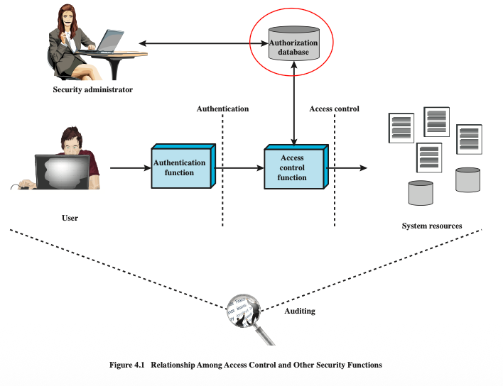

- **Discretionary access control (DAC)**
  - Controls access based on the identity of the requestor and on access rules (authorizations) stating what requestors are (or are not) allowed to do.
  - An entity might have access rights that permit the entity, by its own volition, to enable another entity to access some resource.
  - **自主访问控制 (DAC - Discretionary access control)**：系统根据请求者的身份和授权规则来控制访问。它的最大特点是权限的下放是“自主”的，即资源的拥有者可以自行决定将权限赋予其他用户。

- **Mandatory access control (MAC)**
  - Controls access based on comparing security labels with security clearances

  - Centrally controlled, e.g., user cannot grant access

  - For military information security 

  - **强制访问控制 (MAC - Mandatory access control)**：系统通过对比**“安全标签（security labels）”和用户的“安全许可（security clearances）”**来控制访问。它是集中控制的，普通用户无权自行授予或转移权限，这种极其严格的模型通常用于军事级别的信息安全领域。

- **Role-based access control (RBAC)**
  - Controls access based on the roles that users have within the system and on rules stating what accesses are allowed to users in given roles. 
  - **基于角色的访问控制 (RBAC - Role-based access control)**：这种策略不直接将权限赋予单个用户，而是**基于用户在系统中所扮演的“角色（roles）”来控制访问**。系统会预先设定好哪些角色可以执行哪些操作，用户只要被分配到对应角色，就拥有了该角色的所有权限。

- **Attribute-based access control (ABAC)**
  - Controls access based on attributes of the user, the resource to be accessed, and current environmental conditions
  - **基于属性的访问控制 (ABAC)** 这一页介绍了第四种更为灵活的现代访问控制策略——**基于属性的访问控制 (Attribute-based access control)**。不同于单纯依赖身份或角色，**ABAC 通过评估多种“属性”来进行更细粒度的访问控制**。这些属性不仅包括用户的属性（例如部门、职位），还包括要访问的资源属性（例如文件机密等级），以及当前的环境条件属性（例如访问发生的时间、地点或网络安全级别）。这种策略极大地提升了访问控制的动态适应性和表达能力。

## Access Control Policies and Implementations

## Discretionary Access Control 自主访问控制

DAC的最大特点是，系统允许拥有访问权限的实体（通常是资源的拥有者）根据自己的意愿，将资源的访问权限授予其他实体。

- Scheme in which an entity may enable another entity to access some resource

  某一实体可授权另一实体访问特定资源的方案

- Often provided using an access matrix

  通常通过访问矩阵提供

  - One dimension consists of identified subjects that may attempt data access to the resources

    一维由试图访问资源数据的已识别主体构成

- The other dimension lists the objects that may be accessed

  另一个维度列出了可以访问的对象。

- Each entry in the matrix indicates the access rights of a particular subject for a particular object

  矩阵中的每个条目指示特定主体对特定对象的访问权限。

#### Access Matrix 访问矩阵（核心数据结构）

- **行（一维）代表主体（Subjects）**：即尝试访问资源的用户，例如图中的 User A, User B, User C。
- **列（另一维）代表客体（Objects）**：即被访问的资源，例如图中的 File 1, File 2, File 3, File 4。
- **交叉点（矩阵条目）代表访问权限**：说明特定主体对特定客体拥有的权限。例如，在矩阵中，User A与File 1的交叉点包含“Own（拥有）, Read（读）, Write（写）”，而User B与File 1的交叉点只有“Read”

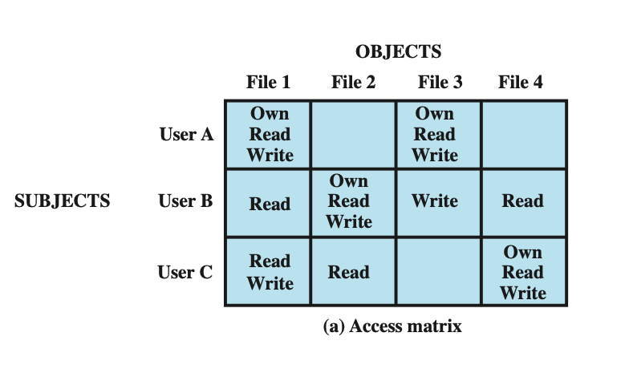

#### Access Matrix and Other Access Control Data Structure

**授权表（Authorization table）**不是这节课主要讨论的形式，它类似于关系型数据库中的一张表，每一行记录一个三元组：主体、访问模式、客体（例如：User A | Own | File 1），这提供了另一种数据格式的选择

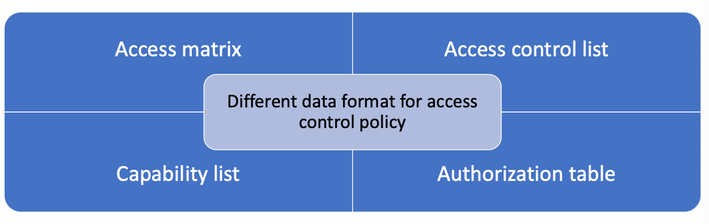

#### Access Control List & Capability List

**ACL 与 权限凭证列表** 在实际的计算机系统中，直接存储一个庞大且包含大量空白（稀疏）的完整二维矩阵是非常浪费空间的。因此，系统通常会按“行”或按“列”将矩阵拆解为两种更实用的数据结构

- To determine the access rights available to a specific user.

  确定特定用户可用的访问权限。

- To determine which subjects have which access rights to a particular resource.

  确定哪些主体对特定资源拥有哪些访问权限。

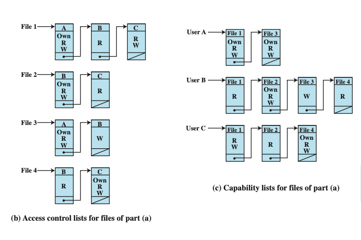

- **按列划分：访问控制列表 (Access Control Lists, 简称 ACLs)**。这种方式以**资源（客体）为中心**。每个文件都会附带一个列表，记录哪些用户对它有什么权限。例如左图中，File 1的列表记录了：User A可以读/写/拥有，User B只能读，User C可以读/写。**这种方式可以很方便地查明“谁对这个特定的资源有什么权限”**。
- **按行划分：权限凭证列表 (Capability Lists)**。这种方式以**用户（主体）为中心**。每个用户都会持有一张类似“门禁卡”的列表，记录了该用户可以访问哪些资源以及对应的权限。例如右图中，User A的列表记录了TA拥有并可读写File 1和File 3。**这种方式主要用于查明“这个特定的用户能访问系统里的哪些资源”**。

#### Example: UNIX file access control **UNIX 文件访问控制** 

- Traditional UNIX permissions model uses a 9-bit representation for each file or directory:

  **传统的UNIX权限模型：** 采用极其紧凑的**9位（9-bit）表示法**来控制文件或目录的权限。这9位被分为三组，分别代表**所有者（owner）**、**所属组（group）**和**其他人（other）**的读（r）、写（w）、执行（x）权限。例如 `rw- r-- ---` 表示所有者可读写，同组用户可读，其他人无权限。

- Each set of three bits can be a combination of read (r), write (w), and execute (x) permissions.

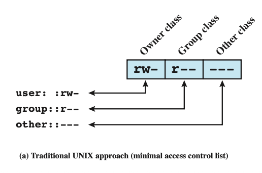

- Suppose a user wants to give read access for file X to users A and B and read access for file Y to users B and C, how many groups do we needed?

  假设用户想将文件 X 的读访问权授予用户 A 和 B，并将文件 Y 的读访问权授予用户 B 和 C，那么我们需要多少组？

  - At least two groups: {A,B}, {B,C} In traditional UNIX access control, each file can belong to exactly one group. You cannot use a single group to satisfy both permission requirements simultaneously. You need two separate groups to represent two different user sets.

    如果想让User A和User B对File X有读权限，同时让User B和User C对File Y有读权限，该怎么办？在传统UNIX中，一个文件只能属于**一个组**。为了满足这个需求，管理员被迫至少创建两个单独的组（如组AB和组BC），这在权限分配极其复杂时会变得非常僵化和难以管理。

#### Illustrate the process

- Suppose the user U’s UID is 2000, and the authorization has completed

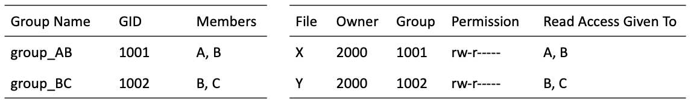

- When User B logged in, the kernel read /etc/passwd and /etc/group, then stored his identity in the process structure, where
  - Supplementary group list: [1001, 1002]
- B requests read X, the kernel will check X’s Inode

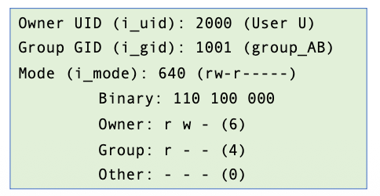

假设系统中有用户U（其用户身份标识UID为2000），他是文件X和文件Y的所有者。按照之前的需求，为了让用户A和B能读取文件X，系统创建了一个名为`group_AB`的组（组标识GID为1001），成员包含A和B；为了让B和C能读取文件Y，创建了`group_BC`（GID为1002），成员包含B和C。 因此，文件X的所有者UID是2000，所属组GID被设定为1001，其权限被设定为`rw-r-----`（即所有者可读写，所属组成员可读，其他人无权限）。

**具体底层运行流程（以用户B尝试读取文件X为例）：**

- **第一步：用户登录与身份信息加载** 当用户B登录系统并通过授权（authorization）后，操作系统内核（Kernel）会读取系统的用户信息文件（`/etc/passwd` 和 `/etc/group`），并将B的身份信息存储在当前的进程结构中。在这个步骤中，最关键的是内核加载了B的**附加组列表（Supplementary group list）**，由于B同时属于两个组，所以该列表包含了 `AB`和`BC`。
- **第二步：发起读取请求** 用户B通过某个应用程序或命令行，正式向系统发出了**“读取（read）文件X”**的请求。
- **第三步：内核读取目标文件属性（Inode）** 内核拦截到该请求后，会去检查文件X的 **Inode（索引节点，即存储文件元数据的数据结构）**。内核从文件X的Inode中提取出以下关键信息：
  - **所有者ID (i_uid)**: 2000（属于用户U）
  - **所属组ID (i_gid)**: 1001（属于 `group_AB`）**权限模式 (i_mode)**: 值为 640。将其转换为二进制即为 `110 100 000`，拆解对应为：
    - Owner（所有者）权限: `rw-` (读和写，对应的八进制数字是6)
    - Group（所属组）权限: `r--` (只读，对应的八进制数字是4)
    - Other（其他人）权限: `---` (无任何权限，对应的八进制数字是0)
- **第四步：权限比对与执行决策** 最后，内核将用户B的进程身份信息与文件X的Inode权限信息进行严格比对:
  1. 内核发现B的UID不是2000，所以B不是所有者。
  2. 接着内核检查组权限。它对比文件X的GID（1001）和用户B的附加组列表，发现B的列表中**确实包含1001**。
  3. 既然确认为同组成员，内核就查看Inode中针对组的权限设定，发现组拥有 `r--`（读取） 权限。
  4. 由于用户B发起的请求恰好是“读取”，与组权限完全吻合，因此**内核最终允许放行，用户B成功读取文件X**。

#### Access Control Lists (ACLs) in UNIX

**现代UNIX的解决方案 (ACLs)：** 为了克服传统组权限的僵化，现代UNIX系统（如Linux, Solaris等）引入了扩展的ACL支持。您可以使用 `setfacl` 命令为单一文件直接指定多个特定用户或组的权限。例如，指令 `setfacl -m u:jie:r can304.txt` 可以直接单独赋予用户 "jie" 读取该文件的权限，而 `setfacl -m g:student:w can304/` 则赋予 "student" 组写入目录的权限。

- Modern UNIX systems support ACLs
  - FreeBSD, OpenBSD, Linux, Solaris
  - ACLs extend the basic permission model by allowing you to specify permissions for multiple users and groups.

- setfacl command
  - To add read permissions for a <u>user</u> named **jie** to a <u>file</u> named **can304.txt**
    - `setfacl -m u:jie:r can304.txt`
  - To add write permissions for a <u>group</u> named student to a <u>directory</u> named **can304**
    - `setfacl -m g:student:w can304/`
  - To set multiple permissions for a user and a group
    - `setfacl -m u:jie:rw,g:student:r can304.txt`

#### Authentication Table 授权表

- **基本结构**：正如幻灯片中展示的，授权表将复杂的二维矩阵扁平化，转换成了一个包含三列的简单表格，每一行就是一个**“三元组”**：**主体 (Subject) | 访问模式 (Access Mode) | 客体 (Object)**。
- **具体实例**：例如表中的记录 `A Own File 1`、`A Read File 1`、`B Read File 2` 等。每一行都明确代表了一条单独的授权规则。
- **核心优势**：如果您熟悉数据库，会发现这实际上就是关系型数据库中最标准的表结构。相比于包含大量空白（无权限状态）的二维访问控制矩阵，授权表不会浪费空间去存储“没有权限”的信息，它只记录系统中实际存在的授权关系。

#### A general model for DAC DAC 的通用模型

The model assumes a set of subjects, a set of objects, and a set of rules that govern the access of subjects to objects.

该模型假设存在一组主体、一组客体以及一组控制主体访问客体的规则。

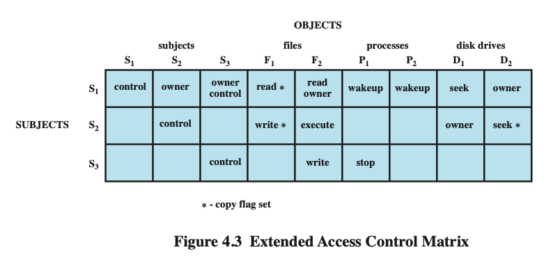

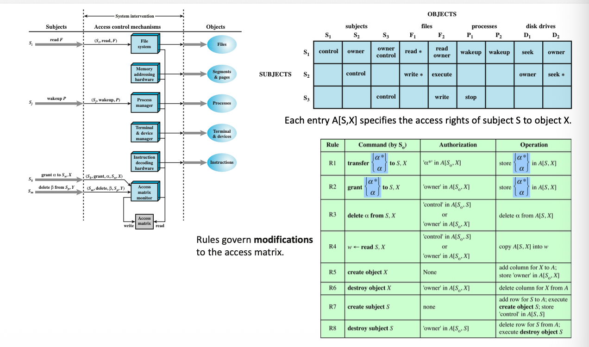

这一部分提出了一个更严谨、更全面的 DAC 理论框架。这个通用模型主要由三个核心部分组成：**主体集合、客体集合，以及一组用来管理主体访问客体的规则（Rules）**。

这个通用模型有以下几个关键的进阶概念：

- **扩展的访问控制矩阵 (Figure 4.3 Extended Access Control Matrix)**：
  - 在这个扩展矩阵中，**主体（例如进程 S1, S2, S3）既是发起请求的“行”，也同时作为被访问的“列”出现**。这意味着一个主体可以对另一个主体拥有权限，例如进程 S1 可以对进程 S2 执行 `control`（控制）、`wakeup`（唤醒）或 `stop`（停止）等操作。
  - 客体的范围也更广泛，除了文件（Files），还包括了内存段（Segments & pages）、设备终端（Terminal & devices）以及磁盘驱动器（Disk drives）等系统底层资源。
- **带有拷贝标记的权限 (Copy Flag** )**：**
  - 在图 4.3 的矩阵中，您会注意到某些权限带有星号，例如 `read *`、`write *`。**这个** ***** **号被称为“拷贝标记（copy flag）”**。
  - 这是 DAC 能够实现“自主”转移权限的关键所在。如果一个主体拥有某个带有 `*` 号的权限，它就有资格将这个权限复制/下放给系统中的其他主体。
  - **矩阵的动态修改规则 (Rules Table)**：
    - 幻灯片20页的规则表（Rules Table）详细定义了系统如何安全地修改这个访问矩阵。这回答了“权限是如何被授予或撤销的”这个问题。
    - **转移与授予 (transfer & grant)**：如果主体 *So*​ 想要向其他主体 `transfer`（转移）某个权限，前提是 *So*​ 自己在矩阵中必须拥有该权限的拷贝标记（`*`）；如果想要 `grant`（授予）新权限，前提是 *So*​ 必须是该资源的 `owner`（所有者）。
    - **创建与销毁 (create & destroy)**：当主体创建（create）一个新客体时，系统会自动在矩阵中增加一列，并将该主体设为新客体的

### Role-based access control 基于角色的访问控制

- Controls access based on the roles that users have within the system and on rules stating what accesses are allowed to users in given roles

  **核心控制逻辑**：RBAC 不再根据用户的“个人身份”来分配权限，而是根据用户在系统或组织中所拥有的**“角色（Roles）”**（例如：具体的职位或工作职能）来控制访问。

  - E.g., Job function within an organization

    例如，组织内的工作职能

- In contrast, DAC is based on user’s identity

  相比之下，DAC基于用户身份。

- Users are assigned to roles

  用户被分配至角色

- The relationship of users to roles is many to many, as is roles to resources/objects

  在 RBAC 中，用户与角色的关系是“多对多”的（一个用户可以有多个角色，一个角色可以包含多个用户）；同时，角色与资源/权限的关系也是“多对多”的。

- The user-to-role assignment can be dynamic

  **矩阵的解耦 (Figure 4.7)**：为了实现这种灵活的映射，RBAC 将传统 DAC 中单一的访问控制矩阵拆分成了两个独立的矩阵：

  - **用户-角色矩阵 (User-Role Matrix)**：记录哪个用户被分配了哪些角色。
  - **角色-对象矩阵 (Role-Object Matrix)**：记录哪个角色对哪些资源拥有何种访问权限。

  

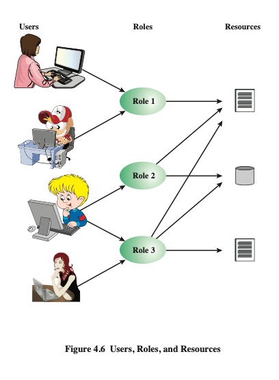

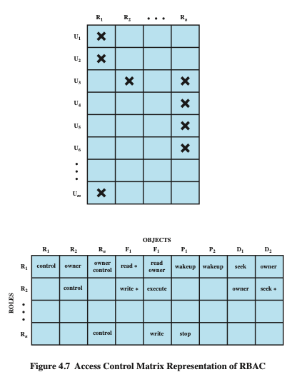

#### RBAC Reference Models

- RBAC0 **基础模型 Base Model**
  - Contains the minimum functionality for an RBAC system
  
    只包含 RBAC 运行所需的最低限度功能（即上述的用户、角色、权限和会话这四个基本元素的直接映射）
  
- RBAC1 **角色层级 Role Hierarchies**
  - RBAC0 + role hierarchies
  
    在 RBAC0 的基础上，增加了**“层级（Hierarchies）”**功能。
  
- RBAC2 **约束机制 Constraints**
  - RBAC0 + constraints
  
    在 RBAC0 的基础上，增加了**“约束（Constraints）”**功能。
  
- RBAC3 **综合模型 Consolidated Model**
  - RBAC1 + RBAC2
  
    最完善的模型，同时包含了 RBAC1 的层级功能和 RBAC2 的约束功能。

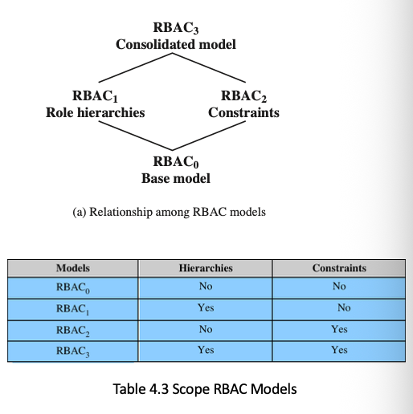

##### Base Model - RBAC0

A session is used to define a temporary one-to-many relationship between a user and one or more of the roles to which the user has been assigned.

会话用于定义一个用户与一个或多个已分配角色之间的临时一对多关系。

- User 用户:
  - An individual that has access to this computer system
  
    可以访问该计算机系统的独立个体。
  
- Role 角色：
  - A named job function within the organization that controls this computer system.
  
    组织内部控制计算机系统的一个命名的工作职能（Job function）。
  
- Permission 权限:
  - An approval of a particular mode of access to one or more objects
  
    对一个或多个对象（资源）执行特定访问模式的批准或许可。
  
- Session 会话:
  - A mapping between a user and an activated subset of the set of roles to which the user is assigned.
  
    这是 RBAC 动态运行的关键。会话用于定义用户与其被分配的某个（或某些）**激活角色**之间的临时的一对多关系。例如，一个用户拥有普通员工和管理员两个角色，但他平时登录系统时，通过“会话”只激活普通员工角色以防误操作。

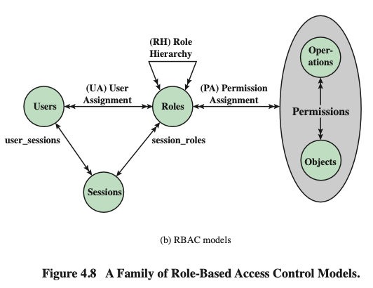

##### Role Hierarchies - RBAC1 **角色层级**

Role hierarchies provide a means of reflecting the hierarchical structure of roles in an organization.

顶端是主管（Director），下设工程师（Engineer），再下设项目负责人（Project Lead）等。

- A line between two roles implies that the upper role includes all of the access rights of the lower role, as well as other access rights not available to the lower role.

  **权限继承机制**：角色层级提供了一种反映组织内部上下级结构的手段。这里的核心规则是：**图中两个角色之间的连线意味着，上层角色自动囊括（继承）下层角色的所有访问权限，并且还可以拥有下层角色所没有的额外权限**。这大大简化了高层管理人员的权限配置工作。

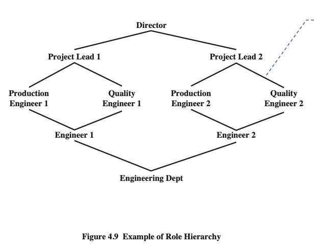

##### RBAC Constraints - RBAC2  **访问控制约束**

- Provide a means of adapting RBAC to the specifics of administrative and security policies of an organization

  约束机制是为了让 RBAC 能够适应特定组织中更严格的安全或行政策略。幻灯片列举了三种最常见的约束类型：

- Types:
  - Mutually exclusive roles **互斥角色**
    - A user can only be assigned to one role in the set (either during a session or statically)
    - Any permission (access right) can be granted to only one role in the set
    - 一个用户只能被分配到互斥角色集中的**一个**角色。例如，“财务做账”和“财务审计”这两个角色是互斥的，同一个用户不能同时拥有，以此防范内部欺诈（这在安全领域称为“职责分离”）。这不仅适用于静态分配，也适用于动态会话。
  - Cardinality 基数约束
    - Setting a maximum number with respect to roles
    - 设定与角色相关的**最大数量限制**。例如，系统规定“系统总管理员”这个角色最多只能分配给2个人。
  - Prerequisite roles 先决条件角色
    - Dictates that a user can only be assigned to a particular role if it is already assigned to some other specified role
    - 规定一个用户只有在**已经拥有了某个特定的基础角色**的前提下，才能被分配另一个高级角色。例如，某用户必须先拥有“正式员工”角色，才有资格被进一步分配“项目经理”角色。

### Attribute-based Access Control 基于属性的访问控制

- Can define authorizations that express conditions on properties of both the resource and the subject.

  ABAC 则**通过评估主体和资源的多种“属性（Properties/Attributes）”条件来定义授权**

- Strength is its flexibility and expressive power.

  这种机制的最大优势在于其极高的**灵活性和强大的表达能力（flexibility and expressive power）**

- There are three key elements to an ABAC model:

  三个关键元素

  - Attributes: defined for entities in a configuration

    **属性（Attributes）**：为系统中的实体定义的各种特征集。
  
  - Policy model: defines the ABAC policies
  
    **策略模型（Policy model）**：定义 ABAC 授权规则的模型。
  
  - Architecture model: applies to policies that enforce access control
  
    **架构模型（Architecture model）**：用于强制执行访问控制策略的底层架构。

#### ABAC Model: Attributes 构成 ABAC 的三大类核心属性

- Subject attributes **主体属性**

  - A subject, e.g., a user, an application, a process, or a device.
  - Each subject has associated attributes that define the identity and characteristics of the subject, e.g., identifier, name, organization, job title
  - 描述发起访问请求的实体（如用户、应用程序、进程或设备）的身份和特征。常见的属性包括：用户的唯一标识符、姓名、所属组织机构以及具体职位（job title）等。
- Object attributes **客体/资源属性**

  - An object (i.e., resource), e.g., devices, files, records, tables, processes, programs, networks, domains
  - Objects have attributes that can be leveraged to make access control decisions, e.g., title, subject, date, and author for a MS word file
- 描述被访问的资源（如设备、文件、数据库表、网络等）的特征。例如，对于一个Word文档，其客体属性可以包括：文档标题、所属主题、创建日期以及作者信息等。系统可以利用这些信息来制定访问决策。
- Environment attributes **环境属性**

  - Have so far been largely ignored in most access control policies.

  - Examples: current date and time, the current virus/hacker activities, and the network’s security level (e.g., Internet vs. intranet)
  
  - 这是以往大多数访问控制策略中经常被忽略，但在 ABAC 中极其重要的一环。它描述了访问发生时的客观环境条件，例如：**当前的日期和时间、当前网络的安全级别（例如是处于内部网还是公共互联网）、甚至当前系统中病毒或黑客的活动状态（威胁级别）**。

#### ABAC Logical Architecture ABAC 的逻辑架构

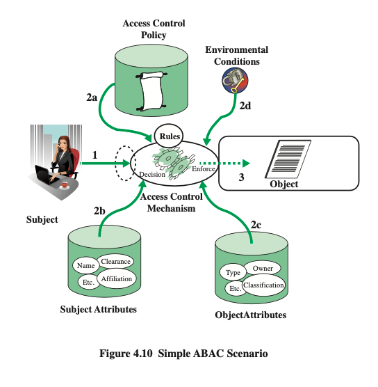

- 当一个**主体（Subject）**尝试访问**客体（Object）**时，系统的“访问控制机制（Access Control Mechanism）”会介入拦截。
- 该机制会同时收集三方面的数据：**主体属性（如权限许可、所属部门）、客体属性（如文件机密等级、所有者）以及当前的环境条件**。
- 随后，系统会将这些收集到的属性值送入**访问控制策略（Access Control Policy/Rules）**中进行运算和比对，最终做出“允许”或“拒绝”的决策（Decision Enforce）。这通常是从需要保护的客体视角出发来编写的规则。

#### ABAC Policies 

- A policy is **a set of rules and relationships** that govern allowable behavior within an organization, based on the **privileges** of subjects and how resources or objects are to be protected under which environment **conditions**.

  一组规则和关系，基于主体的权限以及在何种环境条件下资源或对象应如何保护，来管理组织内部允许的行为。

- Typically written from the perspective of the object that needs protecting and the privileges available to subjects

  通常从需要保护的客体以及主体可享有的特权角度出发

#### An ABAC policy model ABAC 策略模型

- $S, O, E$ stand for subjects, objects, and environments respectively

  公式中的 *S*,*O*,*E* 分别代表主体（subjects）、客体（objects）和环境（environments）。

- $SA_k(1 \le k \le K)$, $(1 \le m \le M)$, $EA_n(1 \le n \le N)$ are pre-defined attributes for subjects, objects, and environments, respectively

  每个集合都有一系列预先定义的属性。例如 *S**A* 代表主体的属性集合。

- $ATTR(s)$ , $ATTR(o)$ , $ATTR(e)$ are attribute assignment relations for subject $s$, object $o$, and environment $e$, respectively.

  *ATTR*(*s*),*ATTR*(*o*),*ATTR*(*e*) 分别代表为特定的主体、客体和环境**分配的具体属性值**

  - Also used for the value assignment of individual attributes. For example,
  
  - 𝑅𝑜𝑙𝑒(𝑗𝑖𝑒) = “𝑀𝑜𝑑𝑢𝑙𝑒 𝐿𝑒𝑎𝑑𝑒𝑟”
  - 𝑆𝑒𝑟𝑣𝑖𝑐𝑒𝑂𝑤𝑛𝑒𝑟(𝑓𝑖𝑙𝑒1) = “𝑥𝑗𝑡𝑙𝑢”
  - 𝐶𝑢𝑟𝑟𝑒𝑛𝑡𝐷𝑎𝑡𝑒(𝑒) = “04 − 22 − 2026”
  - *举例：* 系统可能会为主体分配属性值 `Role(jie) = "Module Leader"`；为客体分配属性值 `ServiceOwner(file1) = "xjtlu"`；或者记录当前的环境属性 `CurrentDate(e) = "04-22-2026"`。

- A Policy rule **核心访问控制规则**

  - decides on whether a subject 𝑠 can access an object 𝑜 in a particular environment 𝑒

  - is a Boolean function of the attributes of 𝑠, 𝑜, and 𝑒:
    - Rule: can_access (s, o, e) <- f(ATTR(s), ATTR(o), ATTR(e))
  - Given all the attribute assignments of s,o, and e, if the function's evaluation is true, then the access to the resource is granted; otherwise the access is denied
  - ABAC 的核心是一个**布尔函数（Boolean function）**。它的基本公式是： `Rule: can_access (s, o, e) <- f(ATTR(s), ATTR(o), ATTR(e))`
  - **运行逻辑：** 这条规则决定了主体 *s* 在环境 *e* 下能否访问客体 *o*。当发生访问请求时，系统会将 *s*,*o*,*e* 对应的所有具体属性值代入这个函数中进行计算。**如果计算结果为真（true），则允许访问；如果为假（false），则拒绝访问**。这与传统模型查表（如访问控制矩阵）的静态方式不同，ABAC 是**动态计算**出来的。

#### Example: ABAC for an online entertainment store **在线娱乐商店**

- The store streams movies to users for a flat monthly fee

  这家商店以固定月费向用户流媒体播放电影

- The store must enforce the following access control policy based on the user’s age and the movie’s content rating

  商店必须根据用户年龄和影片内容分级执行以下访问控制政策。

| Movie Rating | Users Allowed Access |
| ------------ | -------------------- |
| R            | Age 17 and older     |
| PG-13        | Age 13 and older     |
| G            | Everyone             |

**基于年龄的电影分级控制** 商店采用固定月费制，但必须根据用户的年龄和电影的评级来控制访问权限：R级（需17岁及以上）、PG-13级（需13岁及以上）、G级（所有人可看）。

##### RBAC Approach 传统 RBAC 的做法

- Roles 
  - Adult, Juvenile, or Child 
- Permissions 
  - Can view R-rated movies, Can view PG-13-rated movies, and Can view G-rated movies. 
- 为了实现这个需求，管理员被迫“人为”创造出三个角色：成人 (Adult)、青少年 (Juvenile) 和儿童 (Child)，并定义三种权限：看R级、看PG-13级、看G级。然后，管理员必须手动去配置矩阵表，比如设定“青少年”只能看PG-13和G级电影，最后还要手动把用户分配到这三个角色里。这增加了大量额外的管理负担。

|          | R    | PG-13 | G    |
| -------- | ---- | ----- | ---- |
| Adult    | view | view  | view |
| Juvenile | no   | view  | view |
| Child    | no   | no    | view |

##### ABAC Approach ABAC 的优雅做法

- The ABAC approach to this application does not need to explicitly define roles. Instead, whether a user $u$ can access or view a movie $m$ would be resolved by evaluating a policy rule such as the following:

  在 ABAC 中，我们**根本不需要定义角色**。我们只需要写出一条基于用户年龄 `Age(u)` 和电影评级 `Rating(m)` 的逻辑规则（对应幻灯片上的 R1 规则）

  - 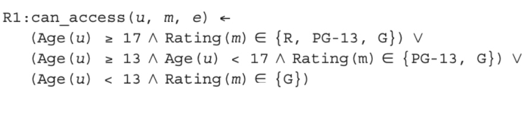
  - 如果用户年龄 ≥17，且电影评级属于 {R, PG-13, G}，则允许访问；
  - 或者，如果用户 13≤年龄<17，且电影评级属于 {PG-13, G}，则允许访问；
  - 或者，如果用户年龄 <13，且电影评级属于 {G}，则允许访问。 系统直接读取数据库里的用户年龄和电影属性进行比对，一步到位。

#### Example 2: Compare RBAC & ABAC 引入会员等级和新老电影限制 (ABAC 的碾压优势)

- Suppose movies are classified as either New Release or Old Release, based on release date compared to the current date, and users are classified as Premium User and Regular User, based on the fee they pay. We would like to enforce a policy that only premium users can view new movies.

  现在业务升级了，电影分为“新上映 (New Release)”和“老电影 (Old Release)”，用户分为“高级会员 (Premium)”和“普通会员 (Regular)”。新的商业策略是：**只有高级会员才能看新上映的电影**。

##### With ABAC

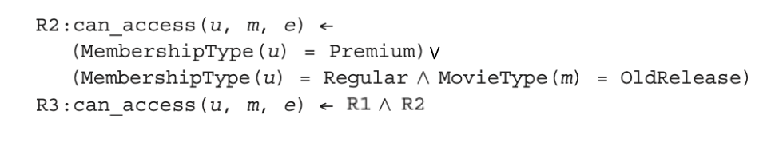

 ABAC 应对这种变化非常轻松，只需增加一条关于会员的规则（R2）：

- 如果用户会员类型 = Premium，允许访问；
- 或者，如果用户会员类型 = Regular，并且电影类型 = OldRelease，才允许访问。 最终的访问决策仅仅是把年龄规则和会员规则组合起来即可：`R3: can_access(u, m, e) <- R1 AND R2`。

##### With RBAC “角色爆炸”危机

在幻灯片的最后部分展示了如果用传统的 RBAC 来处理这个新需求会发生什么。因为增加了两个维度的属性（会员类型、电影新旧），RBAC 的角色和权限数量会发生**乘法级爆炸（从 3 个变成了 3\*2 = 6 个）**。 你需要建立极其繁琐的角色列表，比如：“成人高级会员”、“成人普通会员”、“青少年高级会员”等等，同时还要建立“看新R级”、“看老R级”等6种权限。这导致底层的权限分配矩阵变得极其庞大且难以维护（就像幻灯片展示的那个复杂的表格一样）。

## Runtime Access Control Execution in Real Systems 真实系统中的运行时访问控制执行

### The library management system 图书管理系统

#### 静态配置：策略与权限映射 

在系统真正运行之前，需要先在数据库或缓存（如Redis）中配置好访问控制规则，这里展示了一个典型的基于角色（RBAC）结合细粒度权限的实现方式：

1. **定义系统策略 (System policies)：** 系统首先用自然语言规定了8条策略（P1-P8），明确划分了三种角色的权限界限：

   - **读者 (Reader)**：只能搜索图书、借阅（最多5本）、归还，并且**只能查看自己的借阅历史**。
   - **图书管理员 (Librarian)**：可以管理图书（搜索、添加、删除），可以代任何读者借还书，并且**可以查看所有人的借阅记录**。
   - **管理员 (Admin)**：拥有系统的所有权限。

2. **角色与权限代码映射 (Role and Permission Mapping)：** 系统将上述自然语言策略翻译成了后端代码能够识别的**“权限代码（Permission Codes）”**并与角色绑定：

   读者被赋予 `book:search`, `book:borrow`, `book:return`, `record:view:own`。管理员被赋予通配符 `*:*` 代表所有权限。

3. **记录系统状态 (System State)：** 数据库中维护着当前系统的状态表，包括用户表（例如Alice是reader，Bob是librarian）、图书状态表（在馆或已借出）以及具体的借阅记录表。

#### 动态执行：真实的后端运行流水线

幻灯片最后设定了一个具体的运行场景：**读者Alice登录系统，搜索了一本《现代密码学导论》（Introduction to Modern Cryptography），并点击了“借阅”按钮**。

当这个请求发送到后端服务器时，系统会严格按照以下**五个标准步骤**的流水线进行处理，这就是真实的“运行时访问控制执行（Runtime access control execution）”：

1. **身份验证 (Authentication)**：系统首先确认“你是谁”。Alice在登录时，系统已经验证了她的身份，并知道她的用户ID是1001，角色是“读者 (reader)”。
2. **权限校验 (Permission check)**：这是最核心的一步。系统拦截“借阅”请求，去核对Alice的“读者”角色是否包含 `book:borrow` 这个权限代码。同时，系统还会检查约束条件（例如，去数据库查询Alice当前是否已经借满了5本书）。
3. **执行操作 (Execution)**：权限校验全部通过后，系统才会真正操作数据库，将这本《现代密码学导论》的状态从“available（可借）”修改为“borrowed（已借出）”，并在借阅记录表中插入一条Alice的借阅数据。
4. **审计日志 (Audit logging)**：系统会在后台的安全日志中记录“Alice在某时某刻成功借阅了某本书”，以便日后追溯（对应了我们最开始讲的访问控制关系图中的 Auditing 功能）。
5. **系统响应 (Response)**：最后，后端服务器向Alice的浏览器或APP返回“借阅成功”的提示信息。

# 潜在考试题与参考答案

## Question 1

**Define access control and explain its relationship with authentication and auditing.**

**Answer:**
 Access control is a process that regulates the use of system resources according to a security policy. It only permits authorized entities, such as users, programs, processes, or other systems, to access resources. Authentication happens before access control and verifies the identity of the user. After authentication, the access control function checks the authorization database to decide whether the user can access the requested resource. Auditing records the access attempt and result for accountability. Therefore, authentication answers “who are you?”, access control answers “what are you allowed to do?”, and auditing records “what did you do?”.

------

## Question 2

**What are the three basic elements of access control? Give examples.**

**Answer:**
 The three basic elements are subject, object, and access right. A subject is an entity capable of accessing objects, such as a user or process. An object is a protected resource, such as a file, database record, or coursework module. An access right describes the operation that the subject can perform on the object, such as read, write, execute, delete, create, or search.

------

## Question 3

**Compare DAC, MAC, RBAC, and ABAC.**

**Answer:**

| Model | Basis                                      | Main Feature                                   | Example                                                      |
| ----- | ------------------------------------------ | ---------------------------------------------- | ------------------------------------------------------------ |
| DAC   | User identity and authorization rules      | Owner can grant permissions                    | File owner shares a file                                     |
| MAC   | Security labels and clearances             | Centrally controlled; user cannot grant access | Military classified documents                                |
| RBAC  | Roles                                      | Permissions assigned to roles                  | Student, assessor, admin                                     |
| ABAC  | Attributes of subject, object, environment | Flexible and fine-grained                      | Access allowed only during working hours from campus network |

DAC is flexible but may cause permission spreading. MAC is strict and suitable for high-security systems. RBAC is easier to manage in organizations. ABAC is more flexible for dynamic conditions.

------

## Question 4

**Explain the difference between Access Control List and Capability List.**

**Answer:**
 An Access Control List is object-centered. It is attached to a resource and records which subjects have which rights to that resource. For example, File 1 may record that User A can read and write, while User B can only read. A Capability List is subject-centered. It records which objects a user can access and what rights the user has. ACL is convenient for asking “who can access this file?”, while capability list is convenient for asking “what can this user access?”.

------

## Question 5

**In traditional UNIX access control, what does permission 640 mean?**

**Answer:**
 Permission 640 means:

```
6 = rw- for owner
4 = r-- for group
0 = --- for others
```

So the owner can read and write the file, users in the file’s group can only read it, and other users have no permission.

------

## Question 6

**Suppose file X should be readable by users A and B, and file Y should be readable by users B and C. How many UNIX groups are needed in the traditional UNIX model? Why?**

**Answer:**
 At least two groups are needed: `{A, B}` and `{B, C}`. In traditional UNIX access control, each file can belong to exactly one group. Since file X and file Y require different user sets, one group cannot satisfy both requirements. Therefore, two groups must be created.

------

## Question 7

**What problem do UNIX ACLs solve? Give one setfacl example.**

**Answer:**
 UNIX ACLs solve the limitation of the traditional owner/group/other permission model. Traditional UNIX permissions are not flexible enough when a file needs to grant permissions to multiple specific users or groups. ACLs allow the administrator to specify permissions for individual users or groups.

Example:

```
setfacl -m u:jie:r can304.txt
```

This command gives user `jie` read permission on `can304.txt`.

------

## Question 8

**Explain RBAC0, RBAC1, RBAC2, and RBAC3.**

**Answer:**
 RBAC0 is the base RBAC model. It contains users, roles, permissions, and sessions. RBAC1 extends RBAC0 by adding role hierarchies, so higher roles can inherit permissions from lower roles. RBAC2 extends RBAC0 by adding constraints, such as mutually exclusive roles, cardinality, and prerequisite roles. RBAC3 combines RBAC1 and RBAC2, so it includes both role hierarchies and constraints.

------

## Question 9

**What are mutually exclusive roles in RBAC? Why are they useful?**

**Answer:**
 Mutually exclusive roles mean that a user cannot be assigned to two conflicting roles at the same time. For example, the same user should not be both a finance operator and a finance auditor. This is useful because it supports separation of duty and reduces the risk of fraud or abuse of privilege.

------

## Question 10

**Why can RBAC suffer from role explosion? How does ABAC solve this problem?**

**Answer:**
 RBAC can suffer from role explosion when access decisions depend on many different dimensions, such as age, membership type, resource category, and time. Each combination may require a new role. For example, adult premium user, adult regular user, juvenile premium user, and juvenile regular user may all become separate roles. ABAC solves this by using attributes directly in policy rules. Instead of creating many roles, ABAC checks conditions such as user age, membership type, movie rating, and release status.

------

## Question 11

**Design an ABAC policy for a movie platform. New movies can only be watched by premium users, and R-rated movies can only be watched by adults.**

**Answer:**

```
Allow access if:
1. If movie.release_type = new, then user.membership = premium.
2. If movie.rating = R, then user.age >= 18.
3. Otherwise deny access.
```

In ABAC form:

```
can_access(user, movie, environment) = true if
    (movie.release_type != "new" OR user.membership = "premium")
AND
    (movie.rating != "R" OR user.age >= 18)
```

This policy is better than RBAC because it avoids creating many combined roles such as adult premium, adult regular, juvenile premium, and so on.

------

## Question 12

**Describe the runtime access control process in a library management system when Alice borrows a book.**

**Answer:**
 First, Alice logs in, and the system authenticates her identity. Then the backend obtains her role, such as reader. Next, the system checks whether the reader role has the `book:borrow` permission. After that, it checks business rules, such as whether the book is available and whether Alice has already borrowed the maximum number of books. If all checks pass, the system updates the book status and borrowing record. Finally, the system writes an audit log and returns a success response to Alice.
