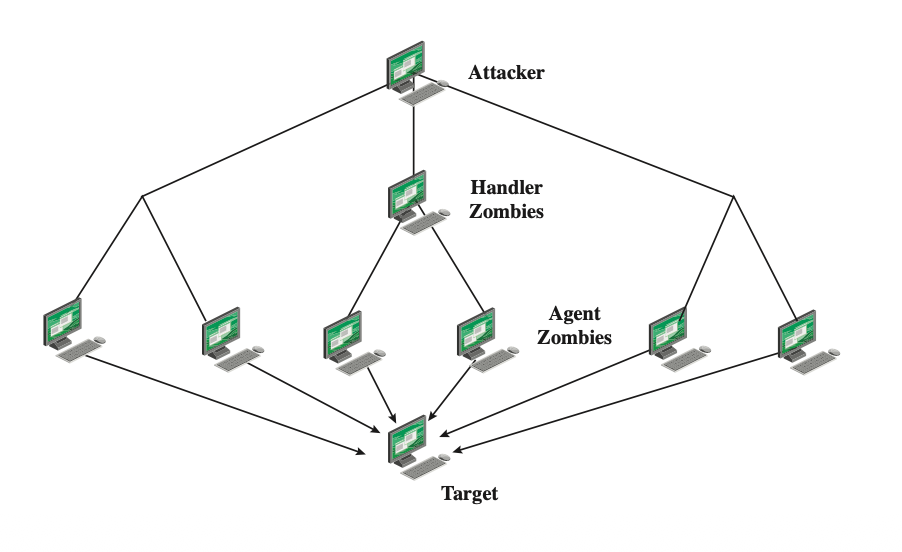
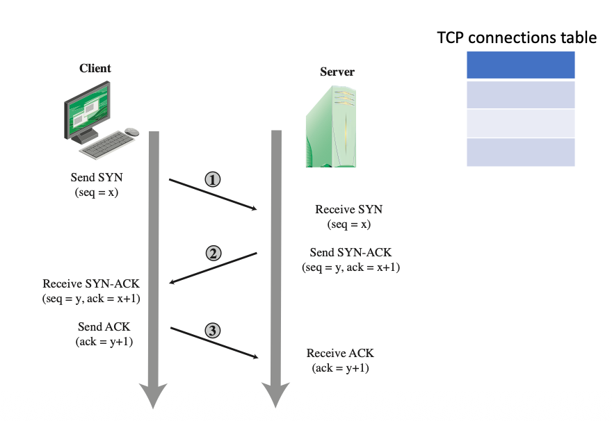
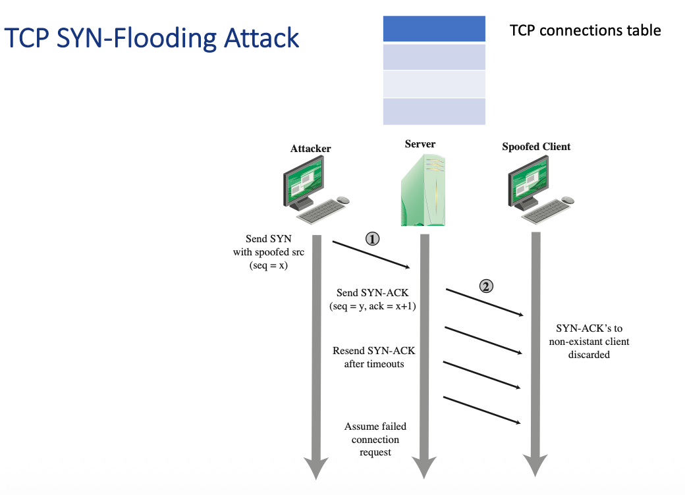
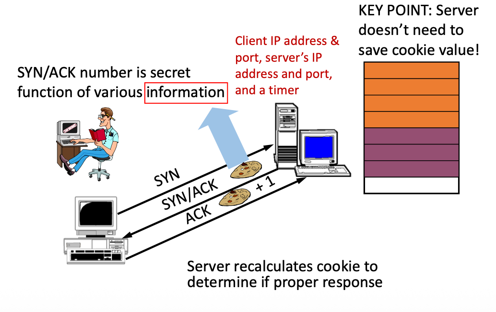
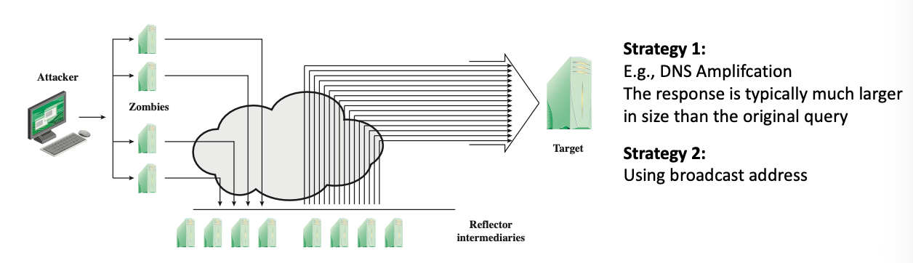

# 9 DoS Attacks

## Learning objectives

- Explain the basic concept of a DoS attack and how to defense it.
- Explain SYN-flooding attacks and detecting & preventing methods.
- Learn about the nature of flooding attacks, reflector and amplifier attacks

## DoS攻击概述与DDoS架构

DoS 全称：Denial-of-Service

- A form of attack on the availability of some service

- Categories of resources that could be attacked are:
  - Network bandwidth 
    - Relates to the capacity of the network links connecting a server to the Internet
  - System resources 
    - Aims to overload or crash the network handling software
  - Application resources
    - Typically involves a number of valid requests, each of which consumes significant resources, thus limiting the ability of the server to respond to requests from other users

- **核心概念**：DoS（Denial-of-Service，拒绝服务）攻击本质上是一种针对系统或服务**可用性 (Availability)** 的攻击形式。
- **三大攻击目标**：
  - **网络带宽 (Network bandwidth)**：试图过载连接服务器与互联网之间的网络链路。
  - **系统资源 (System resources)**：旨在让处理网络请求的软件过载或崩溃。
  - **应用资源 (Application resources)**：通过发送大量看似“有效”的请求，耗尽服务器处理能力，使其无法响应其他正常用户的请求。

### Distributed Denial of Service (DDoS) Attack

- **分布式拒绝服务 (DDoS)**：攻击者（Attacker）利用控制节点（Handler）操控海量的“僵尸主机（Zombies/Agents）”，同时向同一个目标（Target）发起DoS攻击，从而产生压倒性的破坏力。

### Classic DoS Attack: Flooding 基础泛洪攻击

例如使用连续的 `ping` 命令生成大量数据包，目的是压垮目标网络连接的容量。但这种直接攻击很容易暴露攻击者的真实身份，且目标服务器的响应包也会消耗攻击者自身的网络性能。

- Aim of this attack is to **overwhelm the capacity of the network connection** to the target organization
- Flooding ping command
  - Source of the attack is clearly identified
  - Response packets affect the network performance of the source system

### Source Address Spoofing 源地址欺骗 

为了隐蔽自身，攻击者会**伪造数据包的源IP地址**（通常伪装成目标系统的地址）。这不仅让防御方极难追踪攻击的真实来源，还会导致目标服务器的响应包（如ICMP echo回显）无法返回给真正的攻击者。

- Use forged source addresses

  使用伪造的源地址

- Attacker generates large volumes of packets that have the target system as the destination address

  攻击者生成大量以目标系统为目的地址的数据包

- Harder to identify the attacking system

  更难识别攻击系统

- ICMP echo response packets no longer be reflected back to the source system

  ICMP 回显响应数据包将不再被反射回源系统。

### SYN Flooding SYN泛洪攻击

这种攻击针对操作系统中管理网络连接的代码，利用了TCP协议的“三次握手”机制。攻击者发送大量带有伪造源IP的 `SYN` 请求，服务器收到后会回复 `SYN-ACK`，并在“TCP连接表”中预留资源等待最后一步确认。由于源IP是假的，服务器永远等不到最终的 `ACK` 确认，导致连接表被这些“半开连接”塞满，合法的用户请求因此被拒绝。

- Common DoS attack
- Attacks the ability of a server to respond to future connection requests by overflowing the tables used to manage them
- Thus legitimate users are denied access to the server
- Hence an attack on system resources, specifically the network handling code in the operating system

### Detecting a SYN-flooding attack

**检测方法**：可以通过监控异常数量的“半开连接”、分析网络中源自特定IP的海量 `SYN` 数据包，或者使用统计学方法识别流量分布的异常来发现此类攻击。

- Monitoring **Incomplete Connections**:
  - look for a high number of half-open connections (where a SYN has been sent but no ACK has been received).
- Traffic Analysis:
  - Analyzing network traffic for a large number of SYN packets originating **from a single or multiple IP addresses**.
  - Statistical Analysis: Use statistical methods to analyze network traffic and identify **abnormal distributions** that may indicate a SYN flood.

### Preventing a SYN-flooding attack **防范SYN泛洪的核心技术** 

- SYN Cookies

  - SYN cookies are a technique used by servers to accept incoming TCP connections **without allocating memory for the connection until the connection is completed**. This prevents the attacker from overwhelming the server’s resources with half-open connections.

  - Details in next slide.

- Rate limiting

  - Implement rate limiting on SYN requests at the network perimeter. This can be done using firewall rules or dedicated security appliances to limit the number of new connections that can be initiated from any single IP address within a certain time frame.

- **速率限制 (Rate limiting)**：在防火墙或网络边界设备上设置规则，限制特定时间内单个IP地址可以发起的新 `SYN` 连接数量。

- **SYN Cookies 技术**：这是一种非常巧妙的防御机制。当服务器收到 `SYN` 请求时，**不再像传统方式那样立即分配内存**。相反，它会将客户端IP、端口、时间戳等信息作为变量，计算出一个加密的哈希值（即Cookie），并将这个值作为 `SYN/ACK` 包的序列号发送出去。**关键点在于服务器不需要保存这个Cookie值**，只有当真实的客户端返回正确的 `ACK` （包含该Cookie+1的值）时，服务器重新计算并验证无误后，才会真正分配内存建立连接。

#### TCP SYN cookies

### Application-Based Bandwidth Attack 基于应用程序的带宽攻击

- Strategy: force the target to execute resource-consuming operations

  - HTTP: Hypertext Transfer Protocol

  - HTTP flooding attacks the web servers with requests
    - E.g., an HTTP request to download a large file

- 这种攻击的策略是**强迫目标服务器执行极其消耗资源的操作**。
- 典型的例子是 **HTTP泛洪攻击**：攻击者并非单纯用数据包堵塞网络，而是向Web服务器发送合法的HTTP请求，例如要求服务器“下载一个极其巨大的文件”，以此来榨干服务器的应用层处理能力。
- 攻击者向中间服务发送请求
2. 源 IP 伪造成受害者 IP
3. 中间服务把响应发给受害者
4. 受害者被大量响应流量淹没

### Reflection Amplication Attacks 反射攻击

- Attacker sends packets to a known service on the **intermediary** with **a spoofed source address of the actual target system**
- When intermediary responds, the response is sent to the target
- “Reflects” the attack off the intermediary (reflector)
- Goal is to generate enough volumes of packets to flood the link to the target system without alerting the intermediary
- The basic defense against these attacks is blocking spoofed-source packets

**反射攻击 (Reflection)**：攻击者向互联网上正常的服务节点（即中间人/反射器）发送请求，但**将数据包的源IP伪造成受害者的IP地址**。反射器在处理完请求后，会将响应数据直接发送给受害者。这不仅达到了隐藏攻击者的目的，还能在不惊动反射器的情况下对目标形成流量泛洪。基础防范方法是在网络层面拦截伪造源IP的数据包。

### Amplication Attack 放大攻击

这是反射攻击的恶劣变种。一般的反射攻击通常是“一个请求对应一个响应”，而放大攻击利用了某些协议的特性（如DNS放大攻击），使得**反射回去的响应包体积远远大于原始的请求包**，或者利用广播地址使得**一个请求能够引发多个响应包**，从而对受害者造成成倍的流量打击。

- A variant of reflector attacks.

- Difference

  - Reflection: usually a single request leads to a single response packets;

  - Amplication: a single request may lead to multiple response packets.

| 对比点         | Reflection Attack           | Amplification Attack                           |
| -------------- | --------------------------- | ---------------------------------------------- |
| 共同点         | 都常使用 source IP spoofing | 都常使用 source IP spoofing                    |
| 中间节点作用   | 反射器把响应发给受害者      | 反射器产生更大的响应流量                       |
| 请求与响应关系 | 通常一个请求对应一个响应    | 小请求可能产生大响应或多个响应                 |
| 典型例子       | 利用公开服务反射流量        | DNS amplification                              |
| 基础防御       | 阻止 spoofed-source packets | 阻止 spoofed-source packets + 限制可被滥用服务 |

### DoS Attack Defenses

课件最后指出，**DoS攻击是无法被彻底且完全阻止的**。其根本原因在于，在现实世界中，瞬间的“极高流量”往往是合法的——例如某个网站突然爆红，或是发生了备受公众瞩目的突发事件。服务器在面对流量洪峰时，极难完美区分哪些是正常用户的热情访问，哪些是黑客精心伪装的拒绝服务攻击。

- These attacks cannot be prevented entirely

- High traffic volumes may be legitimate

  - High publicity about a specific site

  - Activity on a very popular site

# 潜在考试题与参考答案

## Question 1：Define malware and explain two major dimensions for classifying malware.

**Answer：**
 Malware means malicious software. It is software intentionally designed to damage a computer, server, client, or network. Malware can compromise confidentiality, integrity, or availability, or simply annoy and disrupt the victim.

A useful classification method is to separate propagation from payload. Propagation means how the malware spreads to the target, such as infected content, vulnerability exploits, and social engineering. Payload means what the malware does after infection, such as system corruption, information theft, turning the system into a zombie agent, or hiding its presence with backdoors and rootkits.

------

## Question 2：What are the three components of a virus?

**Answer：**
 A virus has three main components.

First, the infection mechanism defines how the virus spreads or infects other programs. It is also called the infection vector.

Second, the trigger defines the event or condition that activates the payload. This is sometimes called a logic bomb.

Third, the payload is the actual action performed by the virus besides spreading. It may delete files, corrupt data, display messages, or perform other harmful actions.

------

## Question 3：Explain the four phases of a virus.

**Answer：**
 The four phases are dormant, propagation, triggering, and execution.

In the dormant phase, the virus is idle and waits for a certain event. Not all viruses have this phase.

In the propagation phase, the virus copies itself into other programs or system areas.

In the triggering phase, the virus is activated by a condition, such as a date, a file, or a system event.

In the execution phase, the virus performs its intended function, which may be harmless or destructive.

------

## Question 4：Compare a virus and a worm.

**Answer：**
 A virus usually depends on a host program or file. It infects existing content and often requires user action, such as running an infected executable file or opening an infected document.

A worm is a standalone malware program. It can replicate itself and spread autonomously, often through networks or software vulnerabilities. It does not need to attach itself to a host file.

So, the key difference is that a virus is parasitic and host-dependent, while a worm is independent and self-replicating.

------

## Question 5：Why can a compression virus avoid file-size based detection?

**Answer：**
 A simple virus attaches itself to a host file, so the infected file usually becomes larger. Therefore, file-size based detection may notice the change.

A compression virus first compresses the original host file and then attaches itself to the compressed file. Because the original file has been compressed, the final infected file may not obviously increase in size. Therefore, simple file-size based detection may fail.

------

## Question 6：What is a Trojan horse? How is it different from a virus?

**Answer：**
 A Trojan horse is a program that appears useful or legitimate but contains hidden malicious code. For example, it may pretend to be a game, tool, or software update.

It differs from a virus because a Trojan usually does not self-replicate or infect other files. Instead, it relies on deception and user action. A virus focuses on infecting other programs and spreading itself.

------

## Question 7：What are backdoors and rootkits?

**Answer：**
 A backdoor, also called a trapdoor, is a secret entry point into a program or system. It allows an attacker to bypass normal security procedures and regain access later.

A rootkit is software designed to maintain illicit privileged access to a computer. It is often installed after an attacker has already gained high-level access. Its goal is to hide the attacker’s presence and defend against removal.

------

## Question 8：Explain four generations of anti-virus technology.

**Answer：**
 The first generation is simple scanners. They rely on malware signatures or file length checking.

The second generation is heuristic scanners. They use heuristic rules to detect probable malware and may also use integrity checking.

The third generation is activity traps. They detect malware based on behavior rather than fixed code structure.

The fourth generation is full-featured protection. It combines multiple anti-virus techniques, such as scanning, heuristic detection, behavior monitoring, and other protection mechanisms.

------

## Question 9：Define DoS and explain which CIA property it attacks.

**Answer：**
 DoS stands for Denial-of-Service. It is an attack against the availability of a service. The attacker tries to make a system, network, or application unable to serve legitimate users.

Therefore, DoS mainly violates the Availability part of the CIA triad. It does not necessarily steal or modify data, but it prevents normal access to the service.

------

## Question 10：Explain the difference between DoS and DDoS.

**Answer：**
 A DoS attack usually comes from one attacking source, or at least a limited source, and tries to make a service unavailable.

A DDoS attack is distributed. The attacker controls many compromised machines, called zombies or agents, often through handlers. These machines attack the same target at the same time. Because the attack traffic comes from many sources, DDoS is harder to block and more powerful than a simple DoS attack.

------

## Question 11：Explain how SYN flooding works.

**Answer：**
 SYN flooding exploits the TCP three-way handshake.

Normally, a client sends SYN, the server replies with SYN-ACK, and the client sends ACK to complete the connection.

In a SYN flood, the attacker sends many SYN packets with spoofed source addresses. The server replies with SYN-ACK and waits for the final ACK. However, because the source addresses are fake, the final ACK never arrives. The server keeps many half-open connections until timeout. When the TCP connection table becomes full, legitimate users cannot connect.

------

## Question 12：How can SYN flooding be detected and prevented?

**Answer：**
 SYN flooding can be detected by monitoring incomplete connections, especially a large number of half-open connections. It can also be detected by traffic analysis, such as observing many SYN packets from one or many IP addresses. Statistical analysis can also identify abnormal traffic distributions.

It can be prevented or reduced using SYN Cookies and rate limiting. SYN Cookies allow the server to avoid allocating memory until the TCP handshake is completed. Rate limiting restricts the number of new SYN requests from a source or network within a certain time period.

------

## Question 13：What is an application-based bandwidth attack?

**Answer：**
 An application-based bandwidth attack forces the target to perform resource-consuming operations. Instead of only flooding the network with raw packets, the attacker sends requests that look valid but consume server resources.

For example, in an HTTP flooding attack, the attacker may repeatedly request a large file from a web server. The server wastes bandwidth, CPU, and application resources responding to these requests.

------

## Question 14：Explain reflection and amplification attacks.

**Answer：**
 In a reflection attack, the attacker sends packets to an intermediary service but spoofs the source IP address as the victim’s IP. The intermediary replies to the victim, so the attack traffic is reflected toward the victim.

An amplification attack is a stronger version. A small request causes a much larger response, or one request causes many responses. DNS amplification is a common example. The attacker can generate large traffic toward the victim while sending much smaller traffic themselves.

------

## Question 15：Why are DoS attacks difficult to completely prevent?

**Answer：**
 DoS attacks are difficult to completely prevent because high traffic is not always malicious. A popular website, public event, or breaking news may also cause a sudden traffic spike.

If the defense is too strict, it may block legitimate users. If it is too loose, attack traffic may pass through. Therefore, DoS defense usually combines filtering, rate limiting, traffic analysis, redundancy, traffic scrubbing, and incident response rather than relying on one single solution.