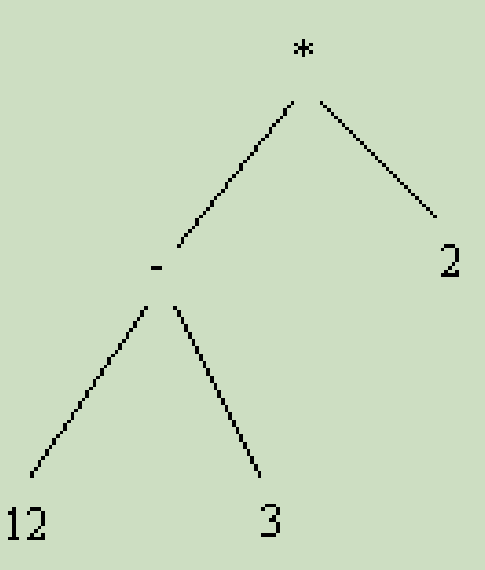
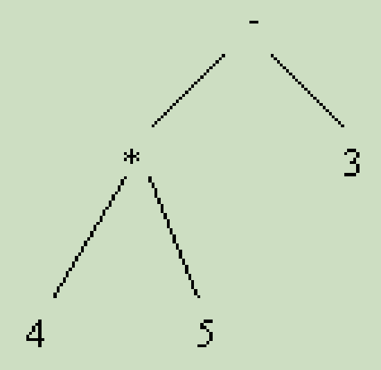
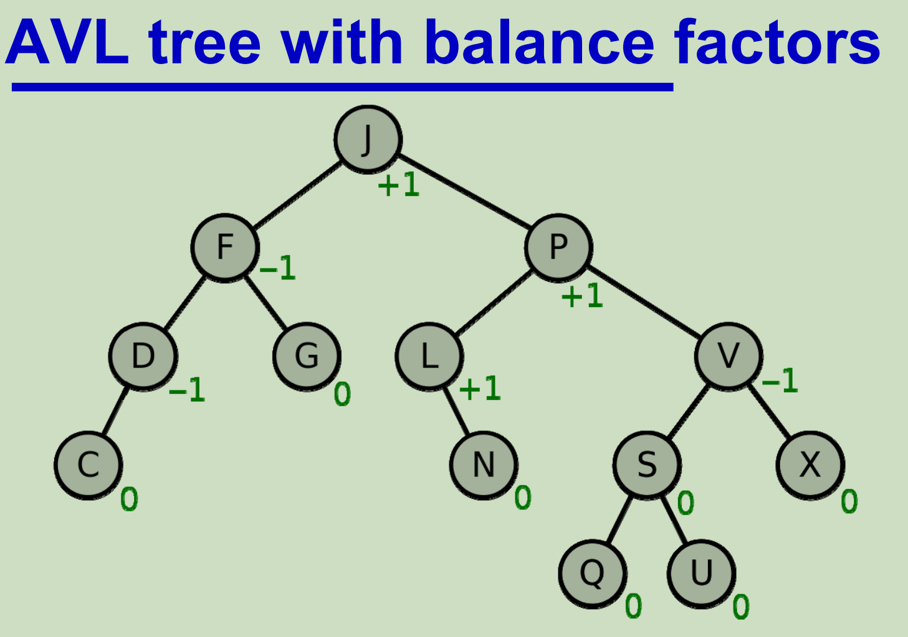
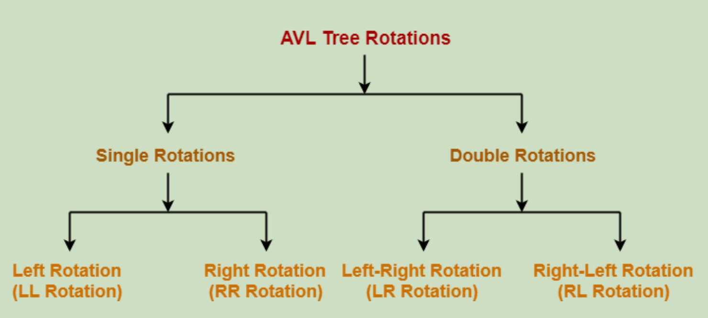
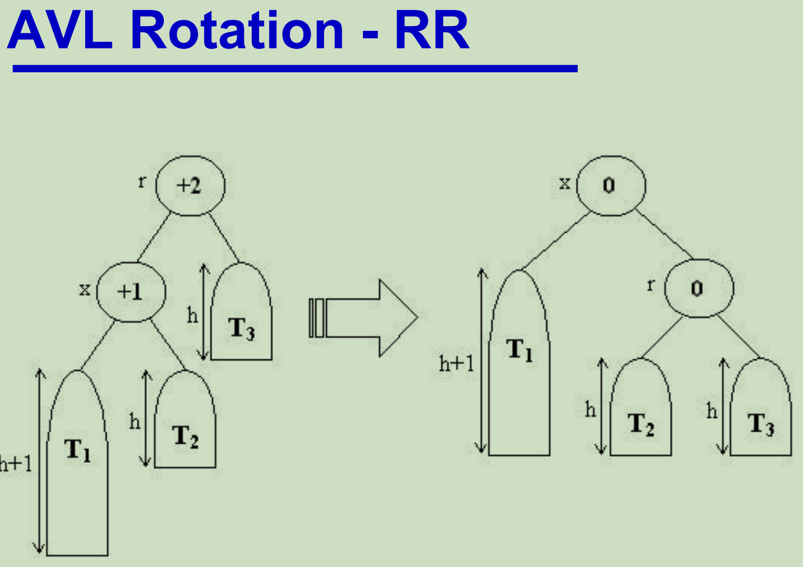
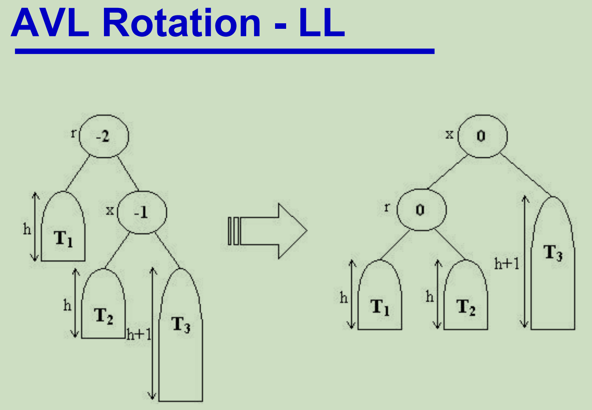
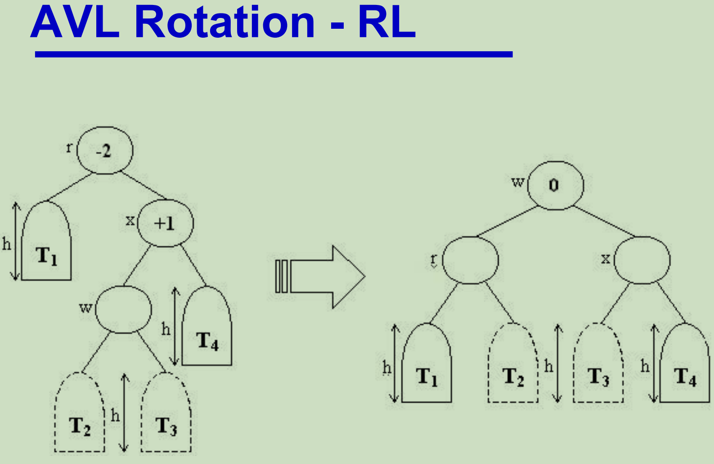
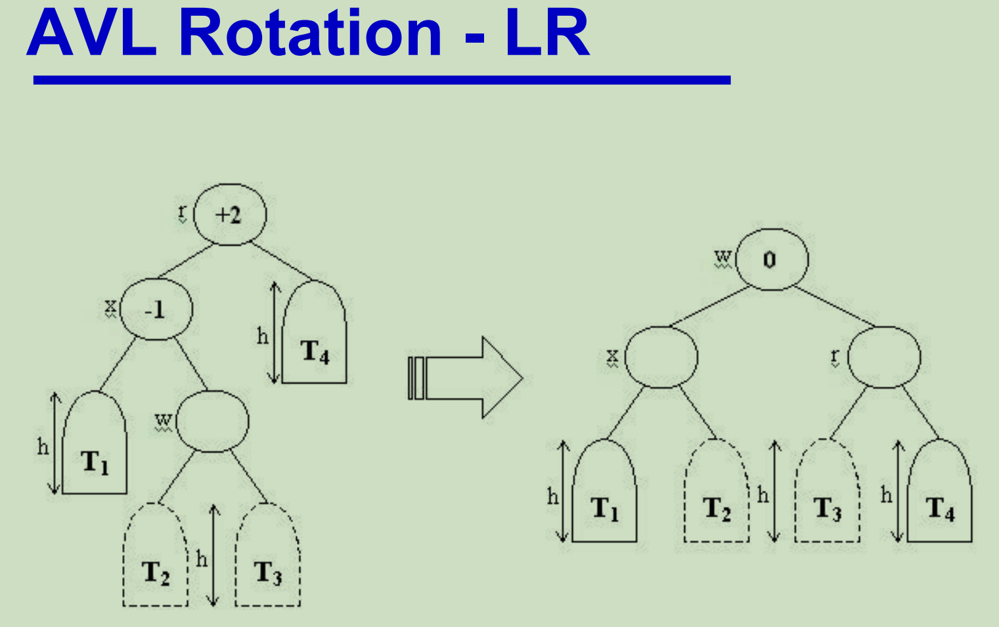
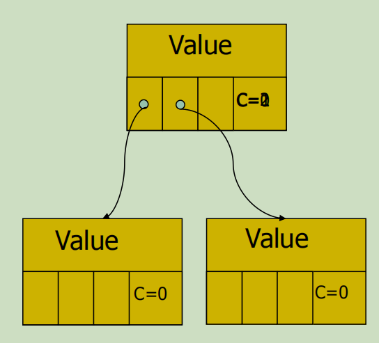
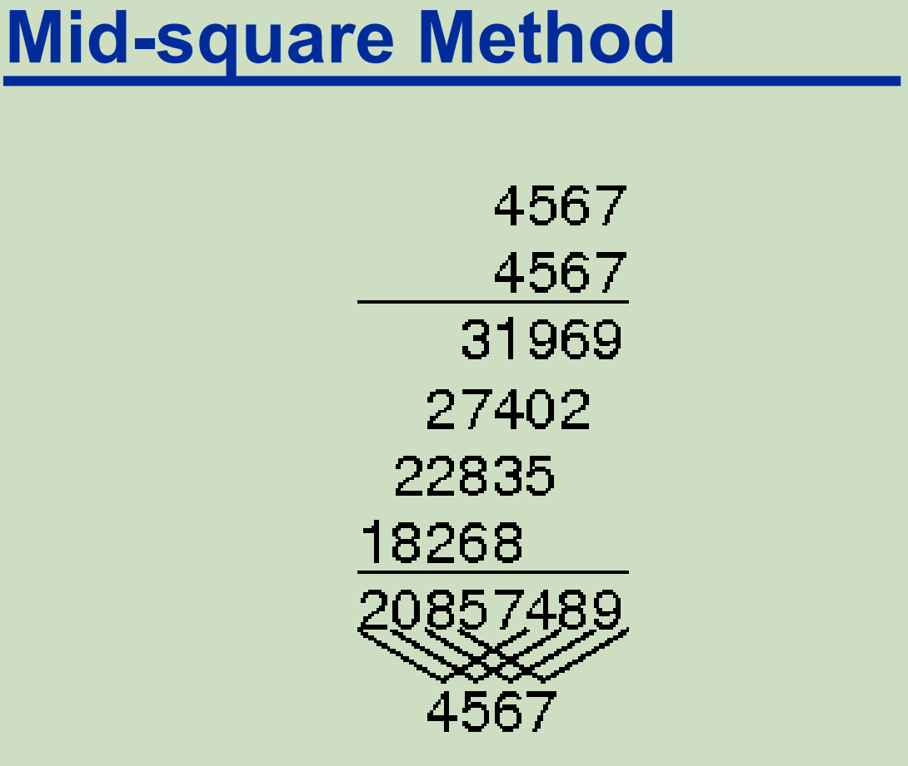

# 20 Tree

Some data are not linear (it has more structure!)

- Family trees
- Organisational charts
- ...

Linear implementations are sometimes inefficient 线性实现有时效率低下

- Linked lists don’t store such structure information 链表不存储这样的结构信息

Trees offer an alternative 树形结构提供了另一种

- Representation 表现方式
- Implementation strategy 实现策略
- Set of algorithms 集合算法

linear data structures: lists, stacks, queues

线性结构： 列表，栈，队列

non-linear data structures: trees

非线性结构：树

## Binary Tree 二叉树

- Every node in the tree has a left child (or null)

  每个树节点都包含一恶搞左节点（或null）

- Every node in the tree has a right child (or null)

  每个树节点都包含一个右子节点（或null）

- The root of the tree is just another node

  树的根就是实际上是另一组节点

A binary tree is either: 一个树只有以下两种形态

- empty or 空的

- a root node together with two binary trees - left subtree & right subtree of the root

  一个根节点和两棵二叉树--根的左子树和右子树

## What is a tree exactly 什么是严格意义上的树

- Models the parent/child relationship between different elements

  对不同元素之间的父/子关系进行建模

  - Each child only has one parent 每个孩子只有一个父母

  - Each parent has ? children 每个家长都有吗？儿童(也可以没有，可以是null)

- From mathematics: 以数学的角度来解释

  - A “directed acyclic graph” (DAG) “有向无环图”(DAG)

  - At most one path from any one node to any other node

    从任何一个节点到任何其他节点最多只有一条路径

- Different kinds of trees exist 有许多不同种类的树

- Trees can be used for different purposes 可以被用于不同的场景中

- In what order do we visit elements in a tree?  树要根据特定的访问顺序(前序，中序，后序)

## Terminology 专有名词

Level: 层

- Equivalent to the “row” that a value is in 相当于数据所在哪一"行"

Depth: 深度

- The number of levels in the tree 树的层数

Leaf Nodes 子叶

- A node with no children 作为子节点的数量

Non-leaf Nodes 无子叶树

Balanced: 平衡

- All leaf nodes are on levels n and (n+1), for some value of n (*and are grouped on the bottom level “to the left”*)

  对于某个n(*)的值，所有叶节点都位于层n和(n+1)上，并且分组在底层“向左”*上。

## How many types of trees

- Far too many: 有很多种类型
  - Red-Black Tree红黑树
  - AVL Tree  AVL树
  - …

- Different types are used for different things 不同的类型用于不同的事情

  - To improve speed  提高速度

  - To improve the use of available memory  提高可用内存的利用率
  - To suit particular problems  以适应特定的问题

- But we’ll look at three: 主流的三个
  - Binary Tree
  - General Tree (n-ary tree)
  - AVL Tree

## Trees and Recursion

- Recursively defined data structure  递归定义的数据结构

- Recursion is very natural for trees – important!  递归对于树来说是非常自然的——很重要!

- Recursion tree  递归树

- If you don’t use recursion then use iteration  如果不使用递归，则使用迭代

## What is a tree useful for?

Artificial Intelligence – planning, navigating, games

人工智能——规划、导航、游戏

Representing things: 代表

- Simple file systems 简单文件系统

- Class inheritance and composition 类继承和组合

- Classification, e.g. taxonomy (the is-a relationship)  分类，例如分类法(is-a关系)

- HTML pages  HTML页面

- Parse trees for languages  语言解析树

- Essential in compilers like Java, C# etc.  在Java、c#等编译器中必不可少。

- 3D graphics (e.g. BSP trees)  3D图形(如BSP树)

# 21 Binary Search Tree

## Search List

A linked list with key, info, and next 包含键、信息和下一步的链表

**O(N)** in average for insert, lookup, and remove

## Binary Search Tree Definition

- A binary search tree is a binary tree where each node has a key

  二叉搜索树是一种每个节点都有一个键的二叉树

- The key in the left child (if exists) of a node is less than the key in the parent

  节点的左子节点(如果存在)中的键小于父节点中的键

- The key in the right child (if exists) of a node is greater than the key in the parent

  节点的右子节点(如果存在)中的键值大于父节点中的键值

- The left & right subtrees of the root are again binary search trees

  根的左右子树也是二叉搜索树

### Binary Search Trees (BST)

- similar to a linked list, but two next pointers 

  类似于链表，但有两个next指针

- we call them *left* and *right*

- for each node n, with key k 

  - n->left contains only nodes with keys < k 

  - n->right contains only nodes with keys > k 

- **O(log N)** in average for insert, lookup, and remove 

  插入、查找和删除的平均耗时为**O(log N)**

#### Worst Case

- operations can degenerate to **O(N)** – worst case! 

  操作可以退化到**O(N)**——最坏的情况!

- degenerates to a linked list 

  退化为链表

  - when keys are inserted in ascending order 

    当键按升序插入时

- all keys are to the right 

  所有的钥匙都在右边

  - when keys are inserted in descending order 

    当键按降序插入时


- all keys are to the left 

  所有的钥匙都在左边

- ideal is mid first, then successive middles, etc. 

  理想首先是中间，然后是连续的中间，等等。

- random order also works fairly well 

  随机顺序也很有效

#### 遍历方式，详见算法的树的遍历有关内容

前序遍历

中序遍历

后序遍历

Example：

**inorder traversal of the binary expression tree for (12-3)\*2** 

对 (12-3)\*2 的二元表达式树进行**中序遍历**



遍历结果：12-3*2

Example2: 

对(4 - 5) * 3，通过前序遍历来实现


遍历结果： *-453

Example3:

对4 * 5 - 3进行后序遍历



遍历结果: 45*3-

## AVL(Adelson-Velskii and Landis) Tree 平衡二叉树 最差条件O(logN)

- use **rotations** to ensure tree is always 'full' 

  使用**旋转**确保树总是“满”

- prevents degenerative cases mentioned above 

- truely **O(log N)** worst case for insert, lookup, remove 

- insertion/removal takes more time 

  插入/删除需要花费太多的时间

- but lookup is faster 

  查询非常快

- trickier to code correctly 

  更难以正确编码

### AVL Tree Definition

- An AVL Tree is a form of binary search tree

  AVL 树是二叉搜索树的一种形式

- Unlike a binary search tree, the worst case scenario for a search is O(log n). 

  与二叉搜索树不同，最坏情况下的搜索结果为 O(log n)。

- AVL data structure achieves this property by placing restrictions on the difference in height between the sub-trees of a given node - height balanced to within 1 

  AVL 数据结构通过限制给定节点的子树之间的高度差来实现这一特性--高度平衡在 1 以内。

- and re-balancing the tree if it violates these restrictions. 

  并在违反这些限制时重新平衡树。

### AVL Tree Balance Requirement

- A node is only allowed to possess one of three possible states: 

- **Left-High (balance factor -1)**
  - The left-sub tree is one level taller than the right-sub tree 
- **Balanced (balance factor 0)**
  - The left and right sub-trees both have the same heights 

- **Right-High (balance factor +1)**
  - The right sub-tree is one level taller than the left-sub tree 

- If the balance of a node becomes -2 or +2 it will require rebalancing. 

- This is achieved by performing a **rotation** about this node

- **Rotation does not break the existing properties for a search tree** 

**旋转不会破坏搜索树的现有属性**













### AVL Tree Insertation

- AVL requires two passes for insertion: 

  AVL需要两次插入:

- one pass down tree (to determine insertion) 

  一次向下传递树(以确定插入)

- one pass back up to update heights and rebalance 

  一次返回更新高度和重新平衡

### AVL Time complexity in big O notation

**Algorithm** 	**Average** 	**Worst case**

**Search** 		O(log *n*) 	O(log *n*)

**Insert** 		  O(log *n*) 	O(log *n*)

**Delete** 	         O(log *n*) 	O(log *n*)

**Space** 		   O(*n*) 	      O(*n*)

# 22 Implementing Trees 实现树

## Binary Tree

```java
public interface BinaryTree<T> {
	BinaryTree<T> BinaryTree(T value);
    
	BinaryTree<T> getLeft();
	BinaryTree<T> getRight();
	void setLeft(BinaryTree<T> subtree);
	void setRight(BinaryTree<T> subtree);
    
	BinaryTree<T> find(T value);
	boolean contains(T value);
    
	boolean isEmpty();
	boolean isLeaf();
	int size();
}
```

- Each node contains a value

  —每个节点包含一个值

- Each node has a left child and a right child (may be null)

  每个节点有一个左子节点和一个右子节点(可能为空)

```java
public class BinaryTree<V> {
	private V value;
	private BinaryTree<V> left;
	private BinaryTree<V> right;
	/**Creates a new tree with one node (a root node) containing the specified value */
	public BinaryTree(V value) {
		this.value = value;
    }
    
    /**Get and Set**/
    public V getValue() {
		return value;
	}

    public BinaryTree<V> getLeft() {
		return left;
	}
	
    public BinaryTree<V> getRight() {
		return right;
	}

    public void setValue(V val) {
		value = val;
	}

    public void setLeft(BinaryTree<V> tree) {
		left = tree;
	}

    public void setRight(BinaryTree<V> tree) {
		right = tree;
	}
    
    /**is Leaf and find**/
    public boolean isLeaf() {
		return (right == null) && (left == null);
	}
    
    public BinaryTree<V> find(V val) {
		if (value.equals(val)) return this;
		if (left != null) {
		BinaryTree<V> ans = left.find(val);
		if (ans != null) return ans;
		}
		if (right != null) {
			BinaryTree<V> ans = right.find(val);
			if (ans != null) return ans;
		}
		return null;
	} 
    
    // PreOrder travel Scheme
    public static void printAll(BinaryTree<String> tree, String indent){
		System.out.println(indent+ tree.getValue());
		if (tree.getLeft()!=null)
			printAll(tree.getLeft(), indent+" " );
		if (tree.getRight()!=null)
			printAll(tree.getRight(), indent+" " );
	}
}
```

## General Tree

- A node in the tree can have any number of children

  树中的一个节点可以有任意数量的子节点

- We keep the children in the order that they were added.

  我们按照添加的顺序保存子元素。

```java
public class GeneralTree<V> {
	private V value;
	private List< GeneralTree<V> > children;
    
	public GeneralTree(V value) {
		this.value = value;
		this.children = new ArrayList< GeneralTree<V> >();
	}
...
    // Get
    public V getValue() {
		return value;
	}

    public List< GeneralTree<V> > getChildren() {
		return children;
	}

    public GeneralTree<V> getChild(int i) {
		if (i>=0 && i < children.size())
			return children.get(i);
		else
			return null;
	}
    
    // add and find
    public void addChild(GeneralTree<V> child) {
		children.add(child);
	}
	
    public void addChild(int i, GeneralTree<V> child) {
		children.add(i, child);
	}

    public GeneralTree<V> find(V val) {
		if (value.equals(val)) return this;
		for(GeneralTree<V> child : children){
			GeneralTree<V> ans = child.find(val);
			if (ans != null) return ans;
		}
        return null;
	}
    
    /**printAll**/
    public static void printAll(GeneralTree<String> tree, String indent){
		System.out.println(indent+ tree.getValue());
		for(GeneralTree<String> child : tree.getChildren())
			printAll(child, indent+" " );
    }
}
```



# 23 Hash Table

- another kind of Table 另一种类型的表

- **O(1)** in average for insert, lookup, and remove 

  插入、查找和删除的平均耗时为**O(1)**

- use an array named T of *capacity* N

  使用容量N的数组T

- define a hash function that returns an integer int **H(string key)**

  定义一个返回整数int **H(string key)**的哈希函数

- must return an integer between 0 and N-1 

  必须返回0到N-1之间的整数

- store the key and info at T[H(key)] 

  将键和信息存储在T[H(key)]

- H() must always return the same integer for a given key 

  对于给定的键，H()必须始终返回相同的整数

**Hash = O(1) if no collision** 如果没有数据碰撞，则代表哈希复杂度为O(1)

hash function is simply the sum of ASCII codes of characters in a name (considered all in lowercase) computed mod N=13. 

哈希函数简单地是一个名称中字符的ASCII码之和(认为都是小写的)，计算模型N=13。

## Table Size 表的大小

- Table size is usually prime to avoid bias 

  表的大小通常是初始值，以避免偏差

- overly large table size means wasted space 

  过大的表尺寸意味着浪费空间

- overly small table size means more collisions 

  过小的表大小意味着更多的冲突

- what happens as table size approaches 1?

  当表大小接近1时会发生什么?

## What is a Hash Function?

A **hash function** is any well-defined procedure or mathematical function for turning data into an index into an array. 

哈希函数是任何定义良好的过程或数学函数，用于将数据转换为数组的索引。

The values returned by a hash function are called **hash values** or simply **hashes**. 

哈希函数返回的值称为**哈希值**或简称为**哈希**。

A hash function H is a transformation that  哈希函数H是一个变换

- takes a variable-size input k and 

  取一个可变大小的输入k和

- returns a fixed-size string (or int), which is called the **hash value** h (that is, h = H(k))

  返回一个固定大小的字符串（或int），称为**哈希值**h（即h=H（k））

In general, a hash function may map several different keys to the same hash value. 

一般来说，哈希函数可以将几个不同的键映射到相同的哈希值。

### Example of a Modular Hash Function

- H(k) = **k mod m** (or **k % m**)

  H(k) = **k mod m**(或**k % m**)

- message1 = ‘723416’

  消息 1 = '723416'

- hash function = modulo 11

  哈希函数=模11

- Hash value1 = (7+2+3+4+1+6) mod 11 = 1

  哈希值e1 = (7+2+3+4+1+6) mod 11 = 1

- message2 = ‘test’ = ASCII ‘74’, ‘65’, ‘73’, ‘74’

  Message2='test'=ASCII'74'，'65'，'73'，'74'

- Hash value2 = (74+65+73+74) mod 11 = 0

  哈希值2=（74+65+73+74）mod 11=0

- another hash function example: **a\*k mod m**

  另一个哈希函数示例：**a\*k mod m**

## Hash Functions

a good hash function has the following characteristics:  一个好的哈希函数包含如下三个特征

- avoids collisions 

  避免碰撞

- spreads keys evenly in the array 

  在数组中均匀分布键

- inexpensive to compute - must be O(1)

  计算成本低——必须是O(1)

### Hash Functions for Strings

1. **必须小心覆盖从0到capacity-1的范围：**
   - 在设计哈希函数时，必须确保生成的哈希值能够均匀分布在从0到(capacity-1)的范围内。这意味着哈希函数需要能够充分利用整个可用的哈希表空间，以避免碰撞（即不同的输入产生相同的哈希值）
2. **一些不好的选择：**
   - 求和所有的ASCII码：
     - 这种方法只是将字符串中所有字符的ASCII码相加，可能会导致大量碰撞。例如，字符串"abc"和"cab"的ASCII码之和是相同的。
   - 乘以ASCII码：
     - 这种方法会导致哈希值变得非常大，并且在计算机中容易溢出，而且相似的字符串可能会产生非常不同的哈希值，不利于均匀分布。
3. **重要的见解：**
   - 字母和数字的ASCII码在八进制的0101到0172范围内：
     - 字母和数字的ASCII码在八进制表示时，范围从0101到0172。这意味着这些字符的ASCII码都在十进制的65到122之间。
   - 因此，所有有用的信息都在最低的6位中：
     - 由于这些字符的ASCII码在这个范围内，所以它们的有用信息都可以通过最低的6位（二进制）来表示。这意味着在设计哈希函数时，可以集中处理这些低位，以有效地利用字符的所有信息。

### Hash Functions for Integer Keys

1. **中平方法（Mid-square method）：**
   - 这是一个哈希函数设计方法。
2. **首先对键值进行平方，然后取出结果的中间r位：**
   - 具体步骤是：
     1. 对键值（key value）进行平方运算。
     2. 从平方结果中取出中间的r位（二进制位）。
     3. 这些中间的r位构成哈希值，该哈希值在范围0到2^r−1内
3. **这样做效果很好，因为键值的大多数或所有位都对结果有贡献：**
   - 这个方法的优点在于：
     - **充分利用了键值的所有位信息**：平方运算将键值的所有位都混合在一起，生成一个新的数，这样即使原始键值中的小变化也会对平方结果产生显著影响。
     - **均匀分布**：取中间的r位有助于避免仅依赖键值的高位或低位，降低了哈希冲突的概率。
     - **简单且有效**：该方法计算简单，且能提供较好的哈希值分布



### Hash Functions for String Keys

- This function takes a string as input. It processes the string 4 bytes at a time, and interprets each of the four-byte chunks as a single long integer value. 

  这个函数接受一个字符串作为输入。它一次处理4个字节的字符串，并将每个4字节的块解释为单个长整数值。

- The integer values for the 4-byte chunks are added together. 

  4字节块的整数值被加在一起。

- The resulting sum is converted to the range 0 to *M*−1 using the modulus operator.

  使用模数运算符将结果和转换为0到*M*−1的范围。

- There is nothing special about using 4 characters at a time. Other choices could be made.

  一次使用4个字符没有什么特别的。还有其他选择。

## Dealing with Collisions 处理碰撞

- **open addressing** - collision resolution

  **开放寻址**冲突解决

- key/value pairs are stored in array slots

  键/值对存储在数组槽中

- **linear probing** 线性探测

  - hash(k, i) = (hash1(k) + i) mod N 

  - increment hash value by a constant, 1, until free slot is found 

    将哈希值增加一个常量1，直到找到空闲槽

  - simplest to implement 

    最容易实现

  - leads to *primary clustering*

    导致“主集群”

- **quadratic probing** **二次探测**

  - hash(k, i) = (hash1(k) + c1 *i + c2 *i*i) mod N 

  - leads to *secondary clustering*

    导致二次聚类

- **double hashing**

  - hash(k, i) = (hash1(k) + i*hash2(k)) mod N 

  - avoids clustering 

    避免聚类

在哈希表中，每一个表中的空位都可以再额外延申出一组SearchList，也就是说如果有两个不同的数据得到了相同的哈希值，那么可以将相同的内容以List的形式存放在同一个array slot中。这就代表着哈希表永远都不会存在真正意义上的full

## Dealing with A Full Table

- allocate a larger hash table 

  分配更大的哈希表

- rehash each from the smaller into the larger 

  从小的重新散列到大的

- delete the smaller 

  删除较小的

## Why hash table can give us O(1) performance?

- It appears most search mechanisms have performance at **O(N)** or **O(logN)**

  似乎大多数搜索机制的性能都是**O(N)**或**O(logN)**

- So why hash table can give us best performance? 

  那么为什么哈希表能给我们最好的性能呢?
