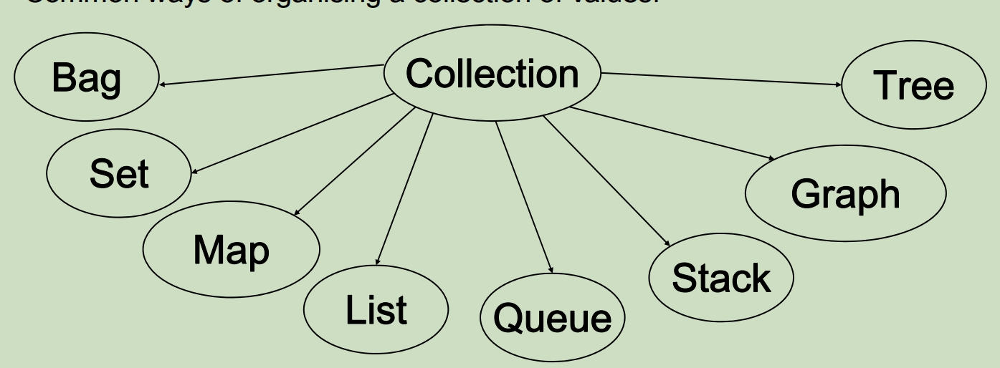
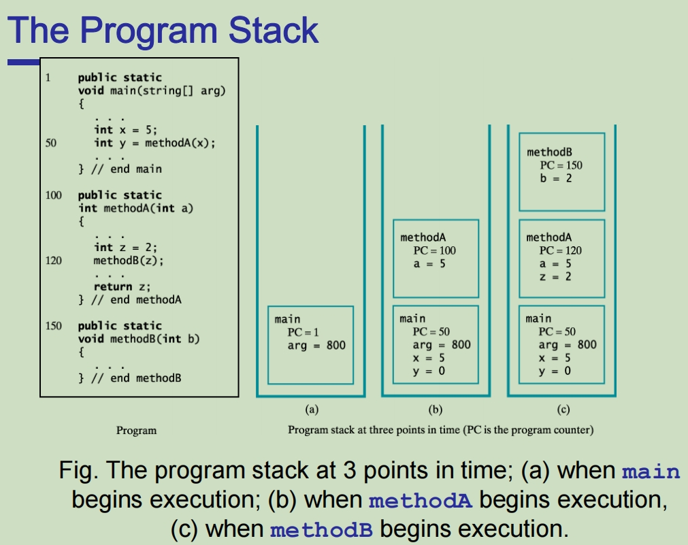
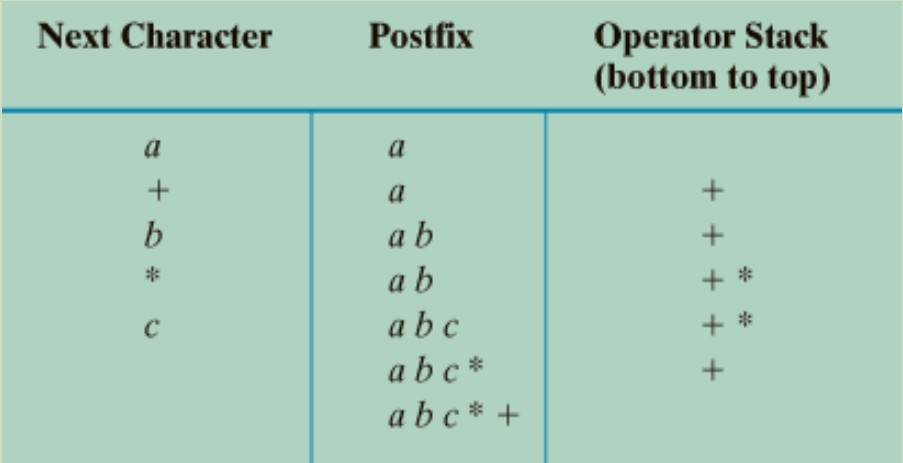
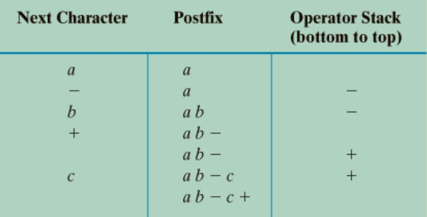
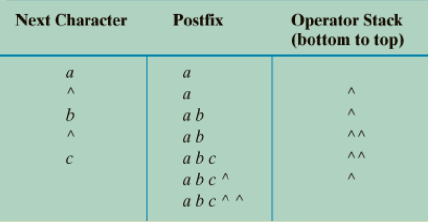
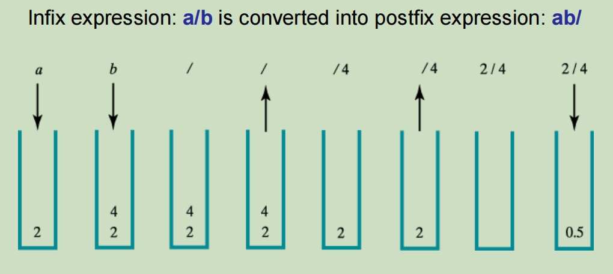
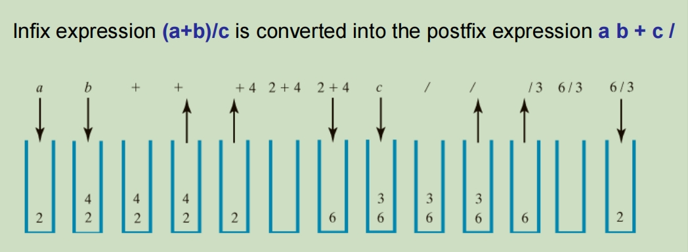
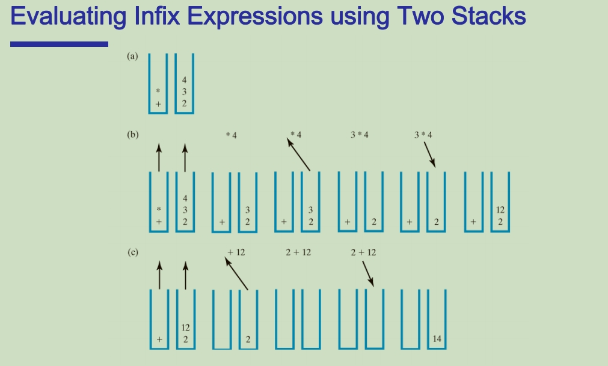
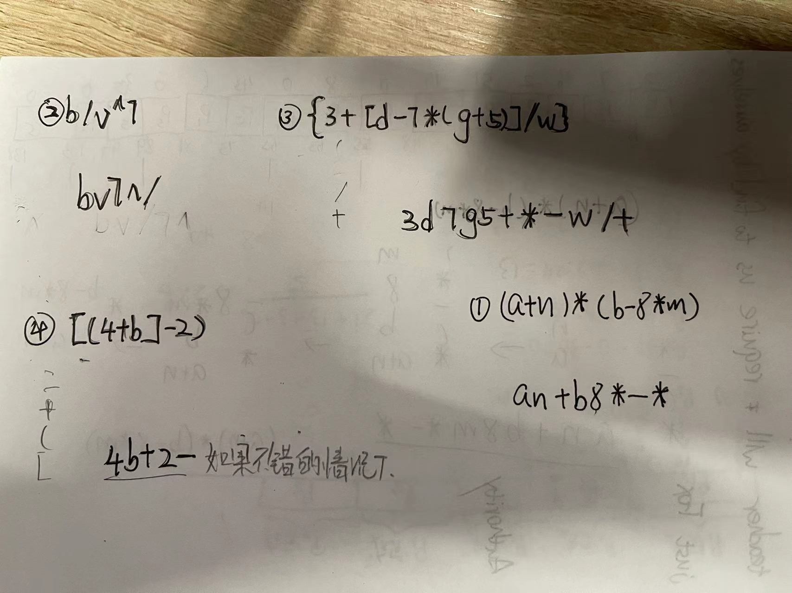

# Collections 容器



## Abstract Data Type 抽象数据类型

Set, Bag, Queue, List, Stack, Map, etc are

**Abstract Data Types** (outcome of abstraction / encapsulation)

an ADT is a type of data, described at an abstract level: ADT 是一种数据类型，在抽象级别进行描述：

• Specifies the **operations** that can be done to an object of this type

• Specifies how it will **behave**.

• 指定对此类型的对象执行的**操作**

• 指定它的行为方式。

e.g. Set (simple version)

- Operations: **add**(value), **remove(**value**)**, **contains(**value **)**→*boolean*

- Behaviors:

  - A new set conatins no values

  - A set will contain a value *iff*

    • the value has been added to the set and 

    • it has not been removed since adding it.

  - A set will not contain a value *iff*

    • the value has never been added to the set, or 

    • it has been removed from the set and has not been added since it was removed. 

### Interface 接口

A Java **Interface** corresponds to an **Abstract Data Type**

• Specifies what methods can be called on objects of this type (specifies name, parameters and types, and type of return value)

指定可以对此类型的对象调用哪些方法（指定名称、参数和类型以及返回值的类型）

• Behaviour of methods is only given in comments  (but cannot be enforced)

方法的行为仅在注释中给出（但不能强制执行）

- No constructors - can’t make an instance: **new**  Set()； 没有构造器

- No fields - doesn’t say how to store the data 没有属性变量

- No method bodies. - doesn’t say how to perform the operations 没有具体实现方法

## Parameterised Types 参数化类型 泛型

The structure and access discipline of a collection is the same, regardless of the type of value in it:

集合的结构和访问规则是相同的，无论其中的值类型如何：

(A set of Strings, a set of Persons, a set of Shapes, a set of integers all behave the same way.)

不管集合中存放的数据类型是什么，只要同属一种类型的容器，那么他们就都使用相同的方法来修改容器中的内容

但是这些使用同一种容器的集合需要实现相容类型的容器接口

The collection Interfaces (and classes) are parameterised:

集合接口（和类）是参数化的：

• Interface has a type parameter 接口有类型参数
• When declaring a variable collection, you specify 
	• the type of the collection and 声明使用的容器是什么类型的
	• the type of the elements of the collection 声明容器中存放的内容是什么类型的

例如：

public interface Set<T> {

​	public void add(T item);

}

Set<Integer> integer = new Set<>();

**Classes** in the Java Collection Library **implement** the interfaces

Java 集合库中的类**实现**接口

• Define constructors to construct new instances  Java 集合库中的类**实现**接口

• Define method bodies for performing the operations 定义用于执行操作的方法体

• Define fields to store the values 定义用于存储值的字段

## ArrayList

• Part of the Java **Collections** framework. 容器类的一个分支

​	• predefined class 

​	• stores a list of items,  存储项目列表，

​		• a collection of items **kept in a particular order**. 有序列表

​	• part of the java.util package

​		⇒ need to **import** **java.util.\*;** at head of file

不需要设置长度，但是需要指定存储类型 可以无限长 需要用指定的方法进行增删改查

- ArrayList has many methods! , including: 方法

  - size(): returns the number of items in the list

  - add(*item* ): adds an item to the *end* of the list

  - add(*index, item* ): inserts an item at *index* (relocates later items)

  - set(*index, item* ): replaces the item at *index* with *item*

  - contains(*item* ): true if the list contains an item that equals *item* 

  - get(*index* ): returns the item at position *index*

  - remove(*item* ): removes an occurrence of item (what if there are duplicates in the ArrayList?)

  - remove(*index* ): removes the item at position *index* (both relocate later items)

要使用foreach增强for循环来迭代

for (Student st : students)

​	System.out.println(st.toString());

## Collection Types 容器类型

Interfaces can **extend** other interfaces:

The **sub** interface has all the methods of the **super** interfaceplus its own methods (**sub** means? **super** means?)

**子类**接口拥有**父类**接口的所有方法加上它自己的方法（**sub**表示？**super**表示？）

以ArrayList为例，也就是ArrayList类会继承List接口所有的方法以及Collections接口所有的方法并加以实现

## Iterators 迭代器

Iterator is an interface iterator是一个接口:

**public interface** Iterator <E> {

​	**public** boolean hasNext(); // 判断接下来是否还有内容

​	**public** E next(); // 提取下一个内容的值

}

## Example

```java
public class TodoList implements ActionListener{

:

private List<Task> tasks;

: 

/* read list of tasks from a file, */

public void readTasks(String fname){

	try {

		Scanner sc = new Scanner(new File(fname));

		tasks = new ArrayList<Task>();

		while ( sc.hasNext() ) {

			tasks.add(new Task(sc.next()));

		}

		sc.close();

} catch(IOException e){…}

	displayTasks();

} 
```

**// 三种打印内容的方式**

1. 增强for循环

**public** void displayTasks(){

​	textArea.setText(tasks.size() +“ tasks to be done:\n”);

​	**for** (Task task : tasks){

​		textArea.append(task + "\n");

​	}

}

2. 索引循环

**for** (int i=0; i<tasks.**size**(); i++)

​	textArea.append(tasks.**get**(i) + "\n");

3. 迭代循环

iterator <Task> iter = tasks.iterator();

**while** (iter.hasNext()){

​	textArea.append(iter.next() + "\n");

# Collections Libraries 容器库

**Interfaces:**

• *Collection* <*E* >

​	= Bag (most general)

• *List* <*E* >

​	= ordered collection

• *Set* <*E* >

​	= unordered, no duplicates

• *Stack<E >*

​	ordered collection, limited access(add/remove at end)

• *Map* <*K, V* >

​	= key-value pairs (or mapping)

• *Queue* <*E* >

​	ordered collection, limited access (add at end, remove from front)

**Classes:** 

• List classes: 

​	ArrayList, LinkedList, 

• Set classes:

​	HashSet, TreeSet, …

• Stack classes:

​	ArrayStack, LinkedStack

• Map classes:

​	HashMap, TreeMap

## Bages

A Bag is a collection with Bag是一个系列，并具有一下的性质

​	• no structure or order maintained 没有维持结构或顺序

​	• no access constraints (access any item any time) 无访问限制（随时访问任何项目）

​	• duplicates allowed 允许重复

A Bag 是一个系列，具有

• 没有维持结构或秩序

• 无访问限制（随时访问任何项目）

• 允许重复

Minimal Operations:

​	• **add**(value) → returns true *iff* a collection was changed

​	• **remove**(value) → returns true *iff* a collection was changed

​	• **contains**(value) → returns true *iff* value is in baguses equal to test.

​	• **findElement**(value) → returns a matching item, *iff* in bag

Plus 附带List自带的一些方法：

• **size**(), **isEmpty**(), **iterator**(),**clear**(), **addAll**(collection), **removeAll**(collection), **containsAll**(collection), …

**Bag没有标准实现**

## Set 集合

Set is a collection with: 

​	• no structure or order maintained

​	• no access constraints (access any item any time)

​	• Only property 

​	• 没有维持的结构或者顺序

​	• 无访问限制（随时访问任何项目）

​	• 仅有值

Operations 运行方法:

(Same as Bag, but different behaviour)

​	• add(value) → true *iff* value *was added (ie, no duplicate)* 添加

​	• remove(value) *→ true iff value removed (was in set)*  删除

​	• contains(value)  *→ true iff value is in the set* 包含

​	• findElement(value) *→ matching item, iff value is in the set* 查找

## Stack 栈

• Organizes entries according to the order in which added 根据添加的顺序组织条目

• Additions are made to one end, the top 每次添加的内容都在最上面

• The item most recently added is always on the top  先进后出

Stacks are special kind of List: 栈是特殊的列表

• Sequence of values 插入的数据有顺序

• Constrained access: add, get, and remove only from one end. 修改有限制，必须沿着遵照先进后出的原则

• There exists a Stack interface and different implementations of it (ArrayStack, LinkedStack, etc) 

有一个Stack接口，同时有ArrayStack等Stack接口的实现类

• In Java Collections library: 

​	• Stack is a class that implements List. Stack接口继承了List接口

​	• Has extra operations: **push**(value), **pop**(), **peek**()  除了List接口的方法之后，Stack还新增了**push**，**pop**和**peek**

Addtional Operations:

​	• push(value): Put value on top of stack. 将值放在堆栈的顶部

​	• pop(): Removes and returns top of stack. 返回栈最上面的内容，也就是最后放入的内容 同时将该内容从栈中删除

​	• peek(): Returns top of stack, *without* removing.  查看栈最上方的内容，但是不移除

### The Program Stack for Execution

• When a method is called 当一个方法被调用的时候

​	• Runtime environment creates activation record 运行时环境创建激活记录

​	• Shows method's state during execution 显示方法在执行期间的状态

• Activation record pushed onto the program stack (Java stack) 将激活记录推送到进程堆栈（Java 堆栈）

​	• Top of stack belongs to currently executing method 堆栈顶部属于当前正在执行的方法

​	• Next record down the stack belongs to the one that called current method 堆栈的下一条记录属于调用当前方法的记录



• 特别注意的是递归方法(Recursive Methods)因此递归方法会调用很多次，因此会产生特别多激活记录，解释了为什么递归消耗更多内存

 ### Using a Stack to Process Algebraic Expressions 使用堆栈处理代数表达式

**Infix expressions** 中缀表达式

​	• Binary operators appear between operands 二进制运算符出现在操作数之间

​	• **a + b**

• **Prefix expressions** 前缀表达式

​	• Binary operators appear before operands 二元运算符出现在操作数之前

​	• **+ a b**

• **Postfix expressions **后缀表达式

​	• Binary operators appear after operands 二进制运算符出现在操作数之后

​	• **a b +**

### 使用Java实现判断大括号，中括号和小括号的组合是否正确

```java
import java.util.Stack;

public class BracketPriorityChecker {

public static boolean checkBracketPriority(String input) {
    Stack<Character> stack = new Stack<>();

    for (char c : input.toCharArray()) {
        if (c == '(' || c == '[' || c == '{') {
            stack.push(c);
        } else if (c == ')' && !stack.isEmpty() && stack.peek() == '(') {
            stack.pop();
        } else if (c == ']' && !stack.isEmpty() && stack.peek() == '[') {
            stack.pop();
        } else if (c == '}' && !stack.isEmpty() && stack.peek() == '{') {
            stack.pop();
        } else {
            return false; // 如果出现不匹配的情况，返回false
        }
    }

    return stack.isEmpty(); // 如果栈为空，表示所有括号都匹配成功
 }

public static void main(String[] args) {
    String input1 = "({})[]"; // 括号匹配
    String input2 = "([)]"; // 括号不匹配

    System.out.println(input1 + " 括号优先级是否匹配: " + checkBracketPriority(input1));
    System.out.println(input2 + " 括号优先级是否匹配: " + checkBracketPriority(input2));
 }
}
```
#### Transforming Infix to Postfix 将中缀表达式转换成后缀表达式

1. 创建一个空栈来存储运算符
2. 从左想用扫描Infix表达式中的每个元素（操作数，运算符）
3. 如果当前的元素是操作数，则直接输出到Postfix表达式中
4. 如果当前是运算符:
   - 如果栈为空，或这栈顶元素是左括号，则将该运算符入栈
   - 如果该运算符的优先级高于栈顶运算符的优先级，也将运算符入栈（*和/是同级，高于+和-的优先级，+和-也是同级）
   - 如果运算符的优先级低于或者等于栈顶运算符优先级，将栈顶运算符pop弹出来并添加到当前postfix表达式的后面，然后再将当前读取到的运算符入栈
   - 如果遇到右括号，则不断弹出栈顶元素并添加到postfix表达式的后面，知道栈为空，最后将左括号弹出

- Examples:

  - Converting the infix expression **a + b \* c** to postfix form **a b c \* +**

    

  - Converting infix expression **a – b + c** to postfix form: **a b – c +**

    

  - Converting infix expression **a ^ b ^ c** to postfix form: **a b c ^ ^**

    


#### Evaluating Postfix Expression 评估后缀表达式



原本的infix表达式为a/b，通过转换成postfix表达式后为ab/，然后根据prefix表达式进行运算：

- 给a赋值入栈
- 给b赋值并入栈
- 遇到操作符，准备弹出栈顶内容
- 栈顶的b被弹出从右往左放置因此放在运算符的右边
- 栈顶的a被弹出从右往左放置因此放在运算符的左边
- 这个时候计算a/b之后就得到结果



原本的infix表达式为（a+b）/ c，通过转换成postfix表达式后为ab+c/，然后根据prefix表达式进行运算： 注意有括号

- 先将最左侧的(放入栈中

- 给a赋值入栈
- +入栈
- 给b赋值入栈
- 此时b后面是)，因此需要将栈中的内容都弹出并进行计算之后再装回栈内
- 栈顶的b被弹出从右往左放置因此放在运算符+的右边
- 栈顶的a被弹出从右往左放置因此放在运算符的左边
- 计算a+b之后将结果再推入栈中
- 给c赋值入栈
- 遇到操作符/，准备弹出栈中数字
- 栈顶c被弹出从右往左放置因此放在运算符/的右边
- 栈顶a+b的值被弹出从右往左放置因此放在运算符+的左边
- 计算结果

```java
import java.util.Stack;

public class PostfixEvaluation {
    public static double evaluatePostfix(String postfixExpression) {
        Stack<Double> stack = new Stack<>();
        
        for (char c : postfixExpression.toCharArray()) {
            if (c >= '0' && c <= '9') {
                // 如果是操作数，则将其转换为double类型并入栈
                stack.push((double)(c - '0'));
            } else {
                // 如果是运算符，则从栈顶弹出两个操作数进行运算，然后将结果入栈
                double operand2 = stack.pop();
                double operand1 = stack.pop();
                switch (c) {
                    case '+':
                        stack.push(operand1 + operand2);
                        break;
                    case '-':
                        stack.push(operand1 - operand2);
                        break;
                    case '*':
                        stack.push(operand1 * operand2);
                        break;
                    case '/':
                        stack.push(operand1 / operand2);
                        break;
                    // 其他运算符可以根据需要添加
                }
            }
        }
        
        // 最终栈中剩下的元素即为计算结果
        return stack.pop();
    }

    public static void main(String[] args) {
        String postfixExpression = "24/";
        double result = evaluatePostfix(postfixExpression);
        System.out.println("Evaluation result: " + result);
    }
}
```

#### **Evaluating Infix Expressions using Two Stacks** 使用两个堆栈计算中缀表达式



infix expression is a + b * c

- 转换之后存放应该是abc*+，也就是操作符stack中弹出的先后顺序是 *+, 操作数弹出的先后顺序是cba
- 从右至左，先计算*，从运算数stack中取出最上层的两个运算数分别是c和b，然后计算a * b之后再将结果放回运算数stack，然后计算再从运算数stack中取出剩下的两个数字，进行+运算之后将结果放入运算数stack，则此时运算数stack中剩下的就是result

infix expression is a * b + c

- 转换之后应该是ab*c+
- 当已经放入a b和*之后，由于接下来+的优先级低于 * 因此先不放入+，先将ab都弹出操作数stack同时将*也从操作符stack中弹出，之后进行计算，然后将结果再传入操作数stack中，然后接下来再将+放入操作符stack中，最后将c放入操作数stack然后做最终计算

```java
public interface StackInterface
{ 
/** Task: Adds a new entry to the top of the stack.
* @param newEntry an object to be added to the stack */
public void push(Object newEntry);
/** Task: Removes and returns the top of the stack.
* @return either the object at the top of the stack or null if the stack was 
empty */
public object pop();
/** Task: Retrieves the top of the stack.
* @return either the object at the top of the stack or null if the stack is 
empty */
public object peek();
/** Task: Determines whether the stack is empty.
* @return true if the stack is empty */
public boolean isEmpty();
/** Task: Removes all entries from the stack */
public void clear();
} // end StackInterface
```

More Examples:

注意，每个括号内的运算符号单独计算。



## Map 

• Map = **Set** of pairs of keys to values map存放的都是键值对

• Constrained access: get values via keys.  访问受限，通过key来查找value

• **No duplicate keys** 不允许重复的键

• Lots of implementations, most common is **HashMap**. 由于多不同类型的实现接口

在声明Map的时候需要在<>加入key和value的属性类型

• Central operations: 主要的操作方法

​	• get(key), → returns value associated with key (or null) 通过提供的键来查找值

​	• put(key, value), → sets the value associated with key (and returns the old value, if any)  添加一组新的键值对

​	• remove(key), → removes the key *and* associated value (and returns the old value, if any) 移除给定键的键值对

​	• containsKey(key), → boolean  判断是否包含提供键的键值对

​	• size() map中有多少键值对

Example:

```java
/** Construct histogram of counts of all words in a file */
public Map<String, Integer> countWords(Scanner scan){
	Map<String, Integer> counts = new HashMap<String, Integer> ();
	for (String word : scan){
		if ( counts.containsKey(word) )
			counts.put(word, counts.get(word)+1);
		else
			counts.put(word, 1);
	return counts;
}
```

```java
private Map<String, String> movieCast; // character → actor

public void lookup(){ 
	String name = askName(“Character to look up");
	if (movieCast.containsKey(name)) {
        textArea.setText(name +" : "+movieCast.get(name));
    }else {
		textArea.setText("No entry for "+ name);
    }		
}
public void update(){
    String name = askName(“Character to update");
	String actor =askName(“Actor who played "+name);
    String old = movieCast.put(name, actor);
	if (old==null) {
        textArea.setText(" added "+name +" played by " + actor);
    }else {
		textArea.setText(" replaced "+old+" by "+actor+ " for " + name));
    }
}
    
```


### Iterating through a Map 迭代Map

• keySet() → Set of all keys  获取所有的键并放入一个set

​	• **for** (String name : phonebook.keySet()){….

• values() → Collection of all values 获取所有的值并放入一个set

​	• **for** (Integer num : phonebook.values()){….

• entrySet() → Set of all Map.Entry’s 获取所有的键值对并放入一个set

​	• **for** (Map.Entry<String, Integer> entry : phonebook.entrySet()){….

​		… entry.getKey() …

​		… entry.getValue()…

```java
/** Find word in histogram with highest count 找到出现最多次数的单词 */
/** 通过KeySet */
public String findMaxCount(Map<String, Integer> counts){
	String maxWord = null;
	int maxCount = -1;
	for (String word : counts.keySet() ){
		int count = counts.get(word);
		if (count > maxCount){
			maxCount = count;
			maxWord = word;
		}
	}
	return maxWord; 
}
```

```java
/** 通过entrySet */
public String findMaxCount(Map<String, Integer> counts){
	String maxWord = null;
	int maxCount = -1;
	for (Map.Entry<String, Integer> entry : counts.entrySet() ){
		if (entry.getValue() > maxCount){
			maxCount = entry.getValue();
			maxWord = entry.getKey();
		}
	}
	return maxWord; 
}
```

## Queue 队列

Queue像Stack的地方：

- Queue中的数据也有先后顺序
- Queue也限制访问其中存放的数据，需要按照特定的顺序

Queue和Stack不相同的地方：

- Ordinary Queue 先进先出
- Priority Queue 根据存放内容的优先级提取对应的数据

队列主要应用于Operating System，Network Application，Multi-User System。队列实际上就是现实意义中的队列形式，先到先得

Java中实现队列的有LinkedList，PriorityQueue

Queue Operation 队列的一些方法:

• **offer**(value) ⇒ boolean 向队列中添加一个元素，添加成功返回true

​	• add a value to the queue 

​	• (sometimes called “enqueue” )

• **poll**() ⇒ *value* 从队列顶部也就是最开始的位置上的元素移除，并可返回被移除的元素的值，如果队列为空则返回null

​	• remove and return value at front/head of queue or null if the queue is empty

​	• (sometimes called “dequeue”, like “pop”)

• **peek**() ⇒ *value* 返回队列顶部的数据，如果队列为空，则返回null

​	• return value at head of queue, or null if queue is empty (doesn’t remove from queue)

• **remove**() and **element**() 移除一个元素 类似poll

​	• like poll() and peek(), but throw exception if queue is empty

