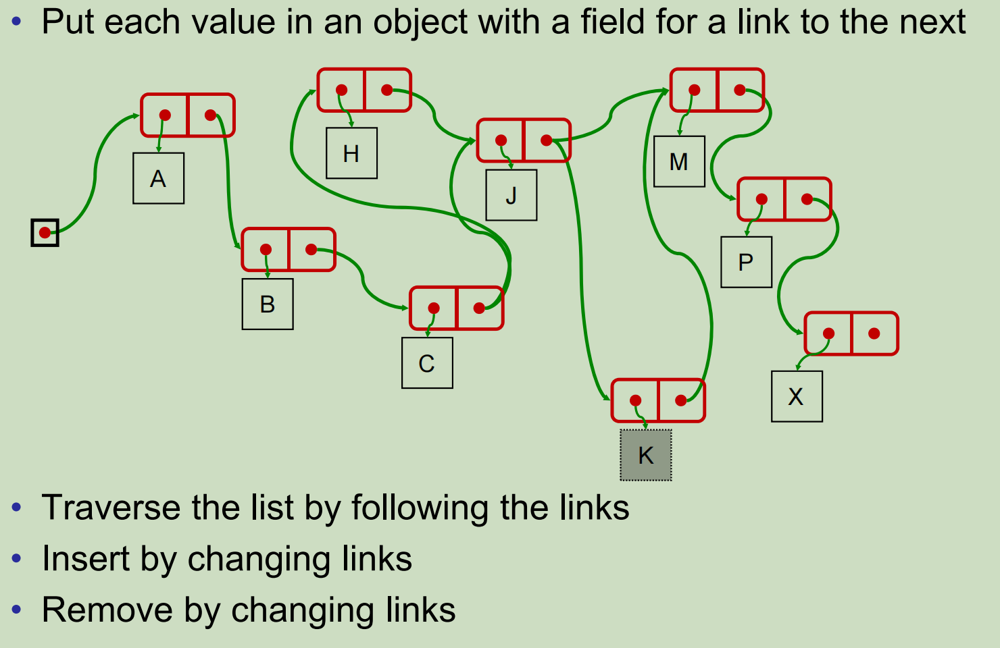

#  15 Linked Structures 链式结构

Linked structures allow fast insertion and deletion

链接结构允许快速插入和删除

Implementing Collections with arrays: 用数组实现集合:

- ArrayList: O(n) to add/remove, except at end

- Stack: O(1)

- ArraySet: O(n) (add/find/remove) ( ⇐ cost of searching)



- What are references/pointers? 什么是pointer（指针）？

  - Pointers/references are an address or a chunk of memory, where data can be stored. 

- How do you get this memory allocated? 怎么分配内存？

  - You’ve been doing it using **new**: 使用new

    - creating an object will allocate some heap memory for the object. 

      创建一个对象将为该对象分配一些堆内存。

    - **new** returns the address of the chunk of memory

      **new**返回内存块的地址

    - copying the address does not copy the chunk of memory.

      复制地址并不复制内存块。

-  Memory from the heap must be recycled after use:

  堆中的内存在使用后必须回收:

  - The **garbage collector** automatically frees up any memory chunks that no longer have anything pointing/referring to them. 

    垃圾收集器自动释放不再有任何指向/引用它们的内存块。

  -  This frees you from having to worry about explicitly freeing memory.

    这使您不必担心显式释放内存。

链表的节点类:

```java
public class LinkedNode <E>{
	private E value;
	private LinkedNode<E> next;
	public LinkedNode(E item, LinkedNode<E> nextNode){
		value = item; 
		next = nextNode;
	}
	public E get() { return value; }
	public LinkedNode<E> next() { return next; }
	public void set(E item) {
		value = item;
	}
	public void setNext(LinkedNode<E> nextNode) {
		next = nextNode;
	}
}
```

链结构例题：

```java
LinkedNode<String> colours = new LinkedNode<String> (“red”, null);
colours.next = new LinkedNode<String>(“blue”, null); 
colours = new LinkedNode<String>(“green”, colours);
colours.next.next = new LinkedNode<String>(“black”, colors.next.next);

System.out.format(“1st: %s\n”, colours.value ); // green
System.out.format(“2nd: %s\n”, colours.next.value ); // red
System.out.format(“3rd: %s\n”, colours.next.next.value ); // black
System.out.format(“4th: %s\n”, colours.next.next.next.value ); // blue
System.out.println(colours.next.next.next.next = colours); // green
```

链表删除其中的一个结点就是让他的next等于下下个:

```java
colours.next = colours.next.next;
```

链结构循环: iterator

```java
// 1
LinkedNode<Integer> squares = null;
for (int i = 1; i < 6; i++)
	squares= new LinkedNode<Integer>( i*i, squares);

// 2
LinkedNode<Integer> rest = squares;
while (rest != null){
	System.out.format("%6d \n", rest.value);
	rest = rest.next;
}

// 3
for (LinkedNode<Integer> rest=squares; rest!=null; rest=rest.next){
	System.out.format("%6d \n", rest.value);
}
```

打印链结构: print

```java
/** Prints the values in the list starting at a node */
// 1
public void printList(LinkedNode<E> list){
	if (list == null) return; 
	System.out.format("%d, ", list.value);
	printList(list.next);
}

// 2
public void printList(LinkedNode<E> list){
for (LinkedNode<Integer> rest=list; rest!=null; rest=rest.next )
	System.out.format("%d, ", rest.value);
}
```

链结构插入: Inserting

```java
/** Insert the value at position n in the list (counting from 0) 
Assumes list is not empty, n>0, and n <= length of list */
// 1
public void insert (E item, int n, LinkedNode<E>list){
	if (n == 1 )
		list.next = new LinkedNode<E>(item, list.next);
	else
		insert(item, n-1, list.next);
}

// 2
public void insert (E item, int n, LinkedNode<E>list){
	int pos =0;
	LinkedNode<E> rest=list; // rest is the pos’th node
	while (pos <n-1){
		pos++;
		rest=rest.next;
	}
	rest.next = new LinkedNode<E>(item, rest.next);
}
```

链结构移除: removing

```java
/** Remove the value from the list 
Assumes list is not empty, and value not in first node */
public void remove (E item, LinkedNode<E>list){
	if (list.next==null) return; // we are at the end of the list
	if (list.next.value.equals(item) )
		list.next = list.next.next;
	else
		remove(item, list.next);
}

public void remove (E item, LinkedNode<E>list){
LinkedNode<E> rest=list; 
while (rest.next != null && !rest.next.value.equals(item))
	rest=rest.next;
	if (rest.next != null) 
		rest.next = rest.next.next;
}
```

查询链结构的最后一个值:

```java
/** Returns the value in the last node of the list starting at a node */
// 1
public E lastValue(LinkedNode<E> list) {
    if (list == null) return null;
    if (list.next == null) return list.value;
    return lastValue(list.next);
}

// 2
public E lastValue (LinkedNode<E> list) {
    if (list == null) return null;
    LinkedNode<E> rest = list;
    while (rest.next != null)
        rest = rest.next;
    return rest.value;
}
```

## LinkedList

• LinkedList extends AbstractList 继承AbstractList

• Has fields for linked list of Nodes and count 有节点和计数的链表字段吗

• Has an inner class: Node, with public fields 有一个内部类:Node，使用public

• get(index), set(index, item), 

​	• loop to index’th node, then get or set value

• add(index, item), remove(index):

​	• deal with special case of index == 0 

​	• loop along list to node one before index’th node (Why?), then add or remove

​	• check if go past end of list

• remove(item),

​	• deal with special case of item in first node (i.e. conversion into empty set after removal)

​	• loop along list to node one before node containing item (Why?), then remove

​	• check if go past end of list

A LinkedList class:

```java
public class LinkedList <E> extends AbstractList <E> {
	private Node<E> data; 
	private int count;
  
	public LinkedList(){
		data = null;
		count = 0;
	}
  
  /** Inner class: Node */
	private class Node <E> {
		public E value;
		public Node<E> next;
		public Node(E val, Node<E> node){
			value = val;
			next = node;
	}
}
```

链表的get:

```java
public E get(int index){
	if (index < 0) throw new IndexOutOfBoundsException();
	Node<E> node=data;
	int i = 0; // position of node
	while (node!=null && i++ < index) node=node.next;
  if (node==null) throw new IndexOutOfBoundsException();
  return node.value;
}
```

链表set:

```java
public E set(int index, E value){
	if (index < 0) throw new IndexOutOfBoundsException();
	Node<E> node=data;
	int i = 0; // position of node
	while (node!=null && i++ < index) node=node.next;
  if (node==null) throw new IndexOutOfBoundsException();
  ans = node.value;
	node.value = value;
	return ans;
}
```

链表add(int index, E item):

```java
public void add(int index, E item){
	if (item == null) throw new IllegalArgumentException();
	if (index==0){ // add at the front.
		data = new Node(item, data);
		count++;
		return; 
  }
	Node<E> node=data;
	int i = 1; // position of next node
	while (node!=null && i++ < index) node=node.next;
  if (node == null) throw new IndexOutOfBoundsException();
  node.next = new Node(item, node.next);
  count++;
  return;
}
```

链表的remove(Object item)：

```java
public boolean remove (Object item){
	if (item==null || data==null) return false;
	if (item.equals(data.value)) // remove the front item.
		data = data.next;
  	else { // find the node just before a node containing the item
		Node<E> node = data;
		while (node.next!=null && !node.next.value.equals(item))
			node=node.next;
		if (node.next==null) return false; // off the end
		node.next = node.next.next; // splice the node out of the list
	}
	count--;
	return true;
}
```

