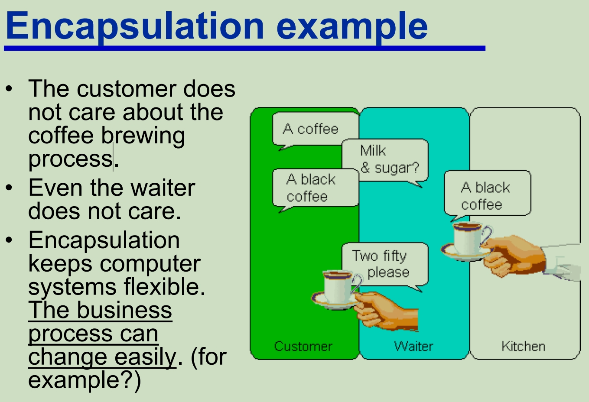

# Overview

## Data Structure 数据结构

A data structure is a systematic way of organising a collection of data for efficient access

数据结构是组织数据集合以实现有效访问的系统方式

• Every data structure needs a variety of algorithms for processing the data in it

每个数据结构都需要各种算法来处理其中的数据

• Algorithms for insertion, deletion, retrieval, etc.

插入、删除、检索等算法

• So, it is natural to study data structures in terms of 因此，很自然地从以下方面研究数据结构

​	– **properties** 属性

​	– **organisation** 组织性

​	– **operations**  操作

• This can be done in a programming language independent way. (why?)

因为受欢迎的语言无时无刻都在发生改变，但是数据结构很少发生大的概念性的变化

这可以通过独立于编程语言的方式完成, 例如Java，C，C++，Python

Some types of data structures:

• Arrays 数组

• Lists 列表

• Stacks 栈

• Queues 队列

• Maps 集合

• Trees 树

• Graphs 图像

**A careful design of the data structures used in software system helps in designing good software.**

**仔细设计软件系统中使用的数据结构有助于设计出好的软件。**

## Abstraction 抽象

We can talk about **abstraction** either as a **process** or as an **entity**.

我们可以将抽象视为一个过程或一个实体。

• As a **process**, abstraction denotes the extracting of the essential details about an item, or a group of items, while ignoring the nonessential details.

作为一个**进程**，抽象表示提取有关一个项目或一组项目的基本细节，同时忽略非必要的细节。

• As an **entity**, abstraction denotes a model, a view, or some representation for an actual item which leaves out some of the details of the item.

作为一个**实体**，抽象表示一个模型、一个视图或一个实际项目的某些表示形式，它遗漏了项目的一些细节。

抽象决定了某些信息更多比其他信息重要，但不提供处理不重要事项的具体机制信息。

• The aim of **data** **abstraction** is to identify which details of how data is stored and can be manipulated are important and which are not

**数据** **抽象**的目的是确定数据如何存储和操作的哪些细节是重要的，哪些不是

• The aim of **procedural** **abstraction** is to identify which details of how a task is accomplished are important and which are not

**进程** **抽象**的目的是确定如何完成任务的哪些细节是重要的，哪些不是

### Key of abstraction

• Extracting the **commonality** of components and hiding their details 

提取组件的**共性**并隐藏其详细信息

• Abstraction typically focuses on the **outside view** of an object/concept

抽象通常侧重于对象/概念的**外部视图**

### Examples

• Looking at a map, we draw roads and highways, forests, not individual trees 

• Looking at various bank accounts, what commonality共性 can we extract? 

– Using an O-O approach

​	• States

​		– *AccountNo*

​		– *CustomerName*

​		– *Amount*

​	• Behaviour

​		– *Credit*, *Debit*, and *GetAmount*

### Use of abstraction

Abstraction in design: break things into groups and figure out the details for each separately 

设计中的抽象：将事物分成几组，并分别找出每个组的细节 可以理解成将一个整体的事务打碎分成重要度不同的部分来完成

• Abstraction leads to a **<u>top-down</u>** approach

## Information Hiding 信息隐藏

Information hiding is the principle that users of a module need to know only the essential details of this module (as identified by abstraction)

信息隐藏原则是模块的用户只需要知道该模块的基本细节（通过抽象来标识）

So, abstraction leads us to identify details of a module which are important for a user and which are unimportant 

因此，抽象引导我们识别模块的细节，哪些对用户来说很重要，哪些不重要

• The important details of a module that a user needs to know form the specification of a module

用户需要了解的模块的重要细节构成了模块的规范

• So, information hiding means that <u>modules are used via their **specifications**, not their implementations</u>

因此，信息隐藏意味着<u>模块是通过其规范而不是实现来使用的</u>

• Information hiding hides the internal data or information from direct manipulation.

信息隐藏隐藏内部数据或信息，使其不被直接操纵。

• Information hiding is related to *privacy,* *security*

信息隐藏与*隐私、*安全有关

### Example

About driving the car

• Car presents a **standard interface**

​	– pedals, 

​	– wheel, 

​	– shifter, 

​	– signals, 

​	– switches, etc.

• on which people are trained and licensed.

Thus, people only have to learn to drive a car; they don't need to learn a completely different way of driving every time they drive a new model. 

因此，人们只需要学习驾驶汽车;他们不需要在每次驾驶新车型时都学习完全不同的驾驶方式。

汽车具体运行起来的实现是内部的细节，驾驶员不需要了解，驾驶员只需要了解驾驶汽车需要了解的内容就可以

### Information hiding in an Object-Oriented world

In a well-designed object-oriented application, an object **publicizes** **what** it can do—that is, the services it is capable of providing, or its method headers

在设计良好的面向对象的应用进程中，对象会**公开**它可以做什幺，即它能够提供的服务或其方法标头

But, **hides** the internal details both of **how** it performs these services and of the data (attributes & structures) that it maintains in order to support these services.

但是，**隐藏了**如何执行这些服务的内部细节，以及它为了支持这些服务而维护的数据（属性和结构）。

### Signature of Method in Java

The **signature** of a method is the combination of 

​	– method's name along with 

​	– number and types of the parameters (and their order)

## Encapsulation 封装

• As a process, encapsulation means the act of enclosing one or more items (data/functions) within a (physical or logical) container.

作为一个过程，封装是指将一个或多个项目（数据/功能）封装在（物理或逻辑）容器中的行为。

• As an entity, encapsulation, refers to a **package** or an enclosure that holds (contains, encloses) one or more items (data/functions).

作为一个实体，封装是指一个**包**或一个包含（包含、封闭）一个或多个项目（数据/函数）的外壳。

The separator between the inside and the outside of this enclosure is sometimes called **wall** or *barrier.*

此外壳内部和外部之间的隔板有时称为“墙”或“屏障”。

### Encapsulation in an O-O world

In object-oriented programming, encapsulation is the inclusion within an object of all the resources needed for the object to function – i.e., the methods and the data. 

在面向对象编程中，封装是将对象运行所需的所有资源（即方法和数据）包含在对象中。

• The object is said to publish its interfaces.

据说该对象发布其接口。

• Other objects adhere to these interfaces to use the object without having to worry how the object accomplishes it. 

其他对象遵循这些接口来使用该对象，而不必担心该对象如何完成它。

• The idea is: don't tell me how you do it; just let me know what you can do!

这个想法是：不要告诉我你是怎幺做到的;只要让我知道你能做什幺！

• An object can be thought of as a self-contained atom. The object interface consists of public methods and instantiated data.

一个物体可以被认为是一个独立的原子。对象接口由公共方法和实例化数据组成。

## Summary 总结

• **Abstraction** is a technique that helps us identify which specific information is important for the user of a module, and which information is unimportant

**抽象**是一种技术，可以帮助我们确定哪些特定信息对模块的用户很重要，哪些信息不重要

• **Information hiding** is the principle that all unimportant information should be hidden from a user

**信息隐藏**是所有不重要的信息都应该对用户隐藏的原则

• **Encapsulation** is then the technique for packaging the information in such a way as to hide what should be hidden, and make visible what is intended to be visible.

然后，**封装**是一种将信息打包的技术，以隐藏应该隐藏的内容，并使预期可见的内容可见。

### Advantages 好处

Using the processes of abstraction and encapsulation under the guidinglines of information hiding, we enjoy the following advantages:

在信息隐藏的指导下，使用抽象和封装的过程，我们享有以下优势：

• Simpler, **modular programs** that are easier to design & understand 

更简单的**模块化进程**，更易于设计和理解

• **Side-effects** from direct manipulation of data are **eliminated** or minimised

**消除或最小化直接操作数据的副作用**

• **Localisation of errors** (only methods defined on a class can operate on the class data), which allows localised testing

• Program modules are **easier to read, change, and** **maintain**…

**错误本地化**（只有在类上定义的方法才能对类数据进行操作），这允许本地化测试

• 进程模块更易于阅读、更改和维护......

## Efficiency 效率

### Space 空间

A well-chosen data structure should try to minimise memory usage (avoid the allocation of unnecessary space)

精心选择的数据结构应尽量减少内存使用量（避免分配不必要的空间）

### Time 时间

For our purposes the most important measure for the speed of execution will be the number of accesses to data items stored in the data structure

就我们的目的而言，衡量执行速度的最重要指标是对存储在数据结构中的数据项的访问次数

### Static versus dynamic data structures

只有structure是固定或者可变的，对里面的数据不影响

Besides time and space efficiency another important criterion for choosing a data structure is whether the number of data items it is able to store can adjust to our needs or is bounded

除了时间和空间效率之外，选择数据结构的另一个重要标准是它能够存储的数据项数量是否能够适应我们的需求或是有限制的

• **Dynamic data structures** grow or shrink during run-time to fit current requirements e.g. a structure used in modelling traffic flow

**动态数据结构**在运行时会增长或缩小，以满足当前要求，例如用于对交通流进行建模的结构

• **Static data structures** are fixed at the time of creation• e.g. a structure used to store a postcode or credit card number (which has a fixed format)

**静态数据结构**在创建时是固定的，例如用于存储邮政编码或信用卡号的结构（具有固定格式）在被创建之后，静态结构就不可被改变了

#### Static Data Structure

**Advantages**

ease of specification

• Programming languages usually provide an easy way to create static data structures of almost arbitrary size no memory allocation overhead

• Since static data structures are fixed in size, 

​	– there are no operations that can be used to extend static structures; 

​	– such operations would need to allocate additional memory for the structure (which takes time)

易于规范

• 编程语言通常提供了一种简单的方法来创建几乎任意大小的静态数据结构，没有内存分配开销

• 由于静态数据结构的大小是固定的，

– 没有可用于扩展静态结构的操作;

– 此类操作需要为结构分配额外的内存（这需要时间）

#### Disadvantages

**Disadvantages**

• must make sure there is enough capacity Since the number of data items we can store in a static data structure is fixed, once it is created, we have to make sure that this number is large enough for all our needs 

• more elements? (errors), fewer elements? (waste)– However, when our program tries to store more data items in a static data structure than it allows, this will result in an error (e.g. ArrayIndexOutOfBoundsException)

​	– On the other hand, if fewer data items are stored, then parts of the static data structure remain empty, but the memory has 	been allocated and cannot be used to store other data

• 必须确保有足够的容量 由于我们可以存储在静态数据结构中的数据项数量是固定的，因此一旦创建，我们必须确保这个数字足够大，以满足我们的所有需求

• 更多元素？（错误），元素更少？（浪费）– 但是，当我们的进程尝试在静态数据结构中存储超过其允许的数据项时，这将导致错误（例如 ArrayIndexOutOfBoundsException）

​	– 另一方面，如果存储的数据项较少，则静态数据结构的某些部分保持为空，但内存已分配，不能用于存储其他数据

### Dynamic Data Structure

**Advantages**

• There is no requirement to know the exact number of data items since dynamic data structures can shrink and grow to fit exactly the right number of data items, there is no need to know how many data items we will need to store

• Efficient use of memory space

​	– extend a dynamic data structure in size whenever we need to add data items which could otherwise not be stored in the 	 	structure and

​	– shrink a dynamic data structure whenever there is unused space in it, then the structure will always have exactly the right size 	and no memory space is wasted

• 不需要知道数据项的确切数量，因为动态数据结构可以缩小和增长以适应正确数量的数据项，因此无需知道我们需要存储多少数据项

• 有效利用内存空间

– 每当我们需要添加数据项时，都可以在大小上扩展动态数据结构，否则这些数据项将无法存储在结构中，并且

– 每当动态数据结构中有未使用的空间时，就收缩它，然后该结构将始终具有正确的大小，并且不会浪费内存空间

**Disadvantages**

• Memory allocation/de-allocation overhead

• Whenever a dynamic data structure grows or shrinks, then memory space allocated to the data structure has to be added or removed (which requires time)

• 内存分配/取消分配开销

• 每当动态数据结构增长或缩小时，就必须添加或删除分配给数据结构的内存空间（这需要时间）