# Graph 图

A **graph** *G* consist of : 图一般包含：

- a *finite* set of **vertices** *V*(*G*), which cannot be empty, 

  一个由**顶点** V*(*G)组成的有限集合，它不能为空，

- and a *finite* set of **edges** *E*(*G*), which connect pairs of vertices. 

  以及一组有限的边E (G)，它们连接着顶点对。

The number of vertices in *G* is called the **order** of *G*, denoted by |*V*|

*G*中的顶点数称为***G*的阶**，用|*V*|表示

举个例子:

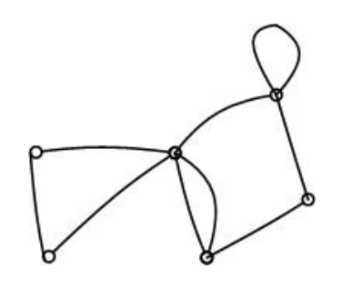

这个图像中的edges和vertexes数量

|V| = 6, |E| = 9

## Incidence, adjacency and neighbors 发生率，邻接和邻居

- Two vertices are **adjacent** if they are joined by an edge. 

  如果两个顶点由一条边连接，则它们是相邻的。

- Adjacent vertices are said to be **neighbors**.

  相邻的顶点被称为**邻居**。

- The edge which joins vertices is said to be **incident** to them.

  连接顶点的边被称为“事件边”。

## Multiple edges, loops and simple graphs 多边，循环和简单的图

- Two or more edges joining the same pair of vertices are **multiple edges**. 

  连接同一对顶点的两条或多条边称为多条边。

- An edge joining a vertex to itself is called a **loop**. 

  连接顶点和自身的边称为循环。

- A graph containing no multiple edges or loops is called a **simple graph**

  不包含多条边或环路的图称为简单图

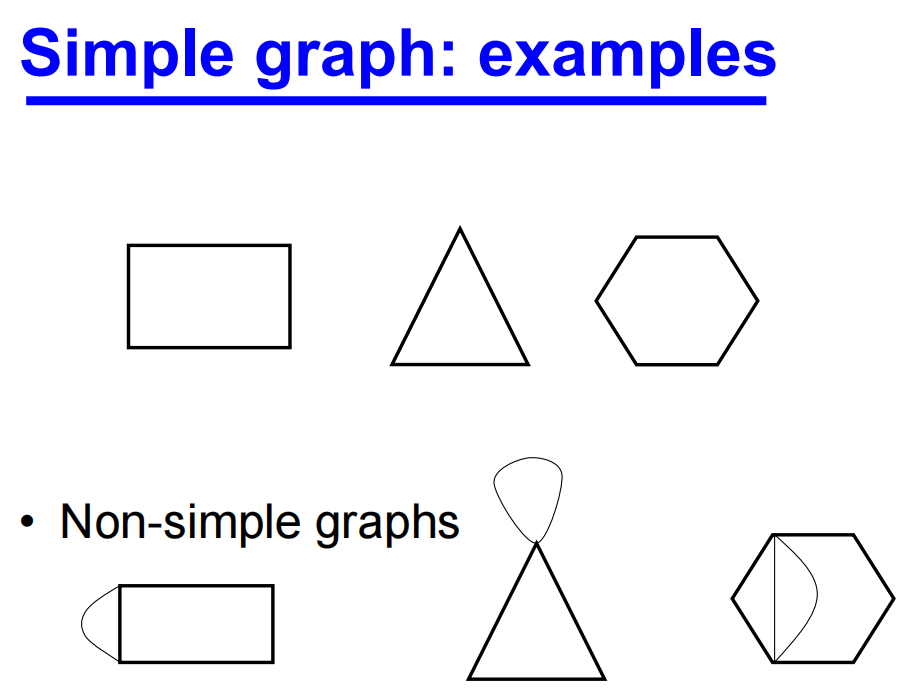

举个例子:

**In the following graph:** 

标识V4的neighbours

标识与V3和V4相关edge 

识别multiple edges

识别loop

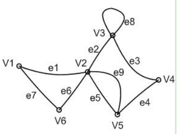

- The neighbours of *V*4 are: *V*3 and *V*5

- The edge incident to *V*3 and *V*4 is: *e*3

- *e*5 and *e*9 are multiple edges

- *e*8 is a loop

例如TSP问题就是可以用图像来解决

或者查找两地之间的最短路径和路线规划

## Weighted  graphs

A **weighted graph** has a number assigned to each of its edges, called its **weight**. 

加权图的每条边都有一个数字，称为加权图的权重。

重量可以用来表示距离、容量或成本。

举个例子:

下面的加权图是一个简单图吗?证明你的答案

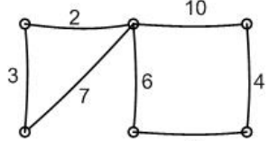

The weighted graph is a simple graph because it has no multiple edges or loops 

加权图是一个简单的图，因为它没有多条边或环路

## Diagraphs

A **digraph** is a *directed* graph, a graph where instead of edges we have directed edges with arrows (**arcs**) indicating the direction of flow. 

**数图**是一种定向图，在这种图中，我们用表示流动方向的箭头（**弧**）来代替边。

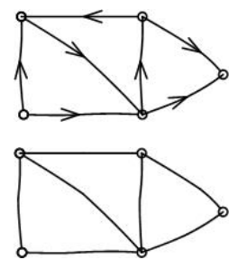

## Degree

The *number of times* edges are incident to a vertex *V* is called its **degree**, denoted by *d*(*V*). 

边与顶点关联的次数称为顶点的**度**，用d (V)表示。

The **degree sequence** of a graph consists of the degrees of the vertices written in non*increasing order*, with repeats where necessary. 

图的度数序列由以非递增顺序书写的顶点度数组成，必要时进行重复。

The sum of the values of the degrees, *d*(*V*), over all the vertices of a simple graph is twice the number of edges:

**一个简单图的所有顶点的度数的和，*d*(*V*)是边数的两倍:**
$$
\sum{d(V_{i})} = 2|E|
$$
A vertex of a digraph has an in-degree of d-(*V*) and an out-degree d+(*V*).

有向图的顶点有一个in-degree d - (*V*)和一个out-degree d+ (*V*)度。

举个例子:

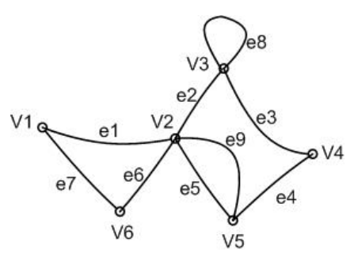

给出图的顶点V1和V3的度

*d*(*V*1) = 2 and *d*(*V*3) = 4

对于得到的Diagraph
$$
\sum{d_{-}(V_{i})} = |A|
$$

$$
\sum{d_{+}(V_{i}) = |A|}
$$

where |A| is the number of arcs

## Subgraphs

A **subgraph** of *G* is a graph, *H*, whose vertex set is a subset of *G*’s vertex set, and whose edge set is a subset of the edge set of *G*

*G*的**子图**是指顶点集是*G*顶点集子集、边集是*G*边集子集的图*H*。

If a subgraph *H* of *G* spans all of the vertices of *G*, i.e. *V*(*H*) = *V*(*G*), then *H* is called a **spanning subgraph** of *G.*

如果*G*的子图*H*跨越*G*的所有顶点，即*V*（*H*）=*V*（*G*），则*H*称为*G*的**生成子图**

举个例子:

For the graph (a) which of the subgraphs (b) and (c) is a spanning subgraph?

对于图(a)，哪个子图(b)和(c)是生成子图?

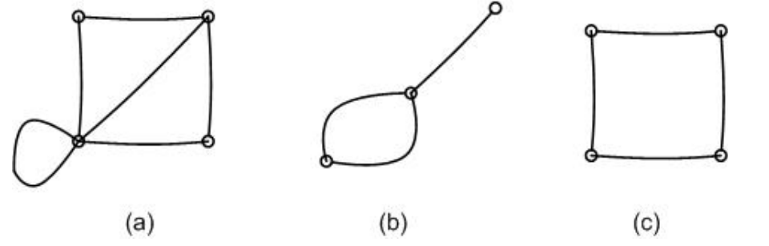

Subgraph (c) is a spanning subgraph of graph (a).

## 练习

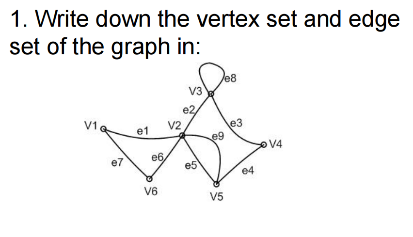

The vertex set is {V1,V2,V3,V4,V5,V6}, 

The edge set is {e1,e2,e3,e4,e5,e6,e7,e8, e9}

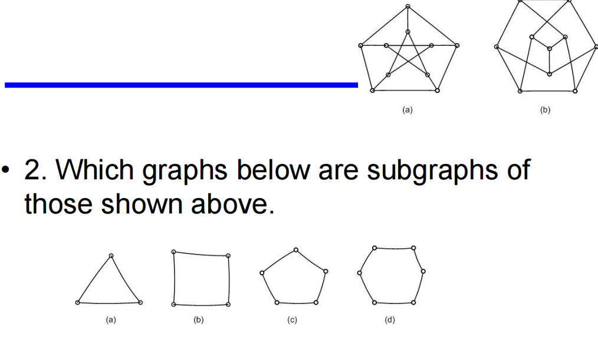

2. (c), (d)

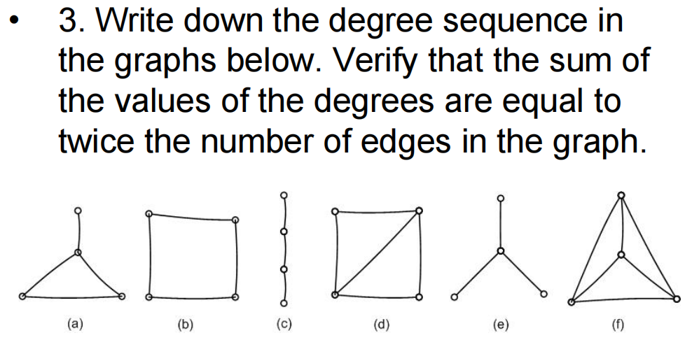

3.  (a) ( 3, 2, 2, 1); 

​	(b) ( 2, 2, 2, 2);

​	(c) ( 2, 2, 1, 1);

​	(d) ( 3, 3, 2, 2);

​	(e) ( 3, 1, 1, 1);

​	(f) ( 3, 3, 3, 3);

# Graph II: Walks, paths and circuits

- A sequence of edges of the form VsVi, ViVj, VjVk, VkVl, VlVt is a walk from Vs to Vt

- If these edges are distinct then the walk is called a **trail**, and 

  如果这些边是不同的，那么这条路就被称为“trail”，并且

- if the vertices are also distinct then the walk is called a **path**.

  如果顶点也是不同的，那么这条路径被称为“路径”。

- A walk or trail is **closed** if *Vs* = *Vt* . 

  如果 v  = *Vt*，则小径**关闭**。

- A closed walk in which all the vertices are distinct except *Vs* and *Vt* , is called a **cycle** or a **circuit**. 

  一个除v和Vt外所有顶点都不同的闭合行走称为**循环或**电路。

- The number of edges in a walk is called its **length**.

  一次行走的边数称为它的长度。

案例:

Question 1: Whether a path is marked on the graph in each case:

在每种情况下，图上是否有一条path被标记:

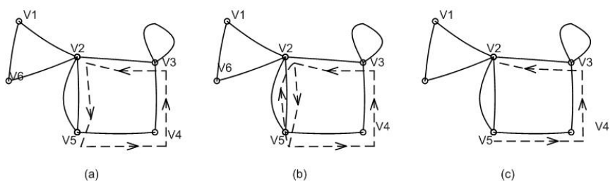

Solution: (c) is a path, length?

Question 2: Identify whether a trail, path or circuit is marked on the graph in each case:

确定在每种情况下图形上是否标记了trail, path, circuit

Solution: (a) circuit (b) trail (c) path

## Connected Graphs

A graph *G* is **connected** if there is a path from any one of its vertices to any other vertex. 

图G是连通的，如果它的任何一个顶点到任何其他顶点都有一条路径。

A **disconnected** graph is said to be made up of **components**

一个**不连通的图**被称为由**组件**组成

案例:

下面两张图中分别每个有多少个component组成

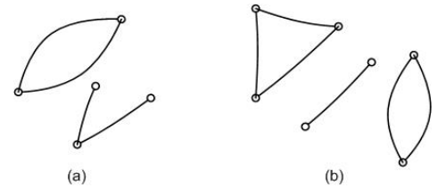

Solution:

(a) Two components (b) Three components

## Matrix representation of a graph: the incidence matrix 图的矩阵表示:关联矩阵

The **incidence matrix** of a graph *G* is a |*V*| × |*E*| matrix **A**. 

图*G*的**发生矩阵**是|*V*| × |*E*|矩阵**A**。

The element *aij* = the *number of times* that vertex *Vi* is incident with the edge *ej*

元素 *aij* = 顶点 *Vi* 与边 *ej* 相连的*次*数

举个例子:

Give the incidence matrix of the graph below:

给出下图的关联矩阵:

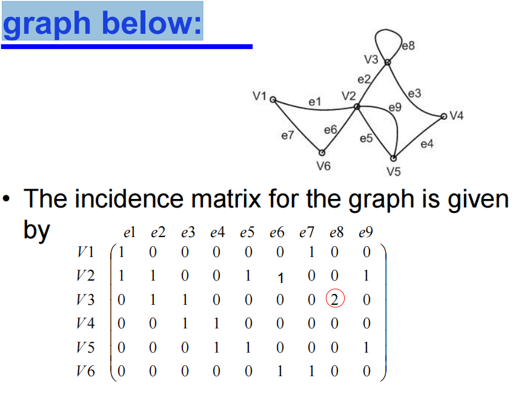

## Matrix representation of a graph: the adjacency matrix

The **adjacency matrix** of a graph *G* is a |*V*| × |*V*| matrix **A**. 

图*G*的**相加矩阵**是|*V*| × |*V*|矩阵**A**。

The element *aij* = the *number of edges* joining *Vi* and *V*j

元素*aij* = *连接的边数*Vi*和*Vj

举个例子:

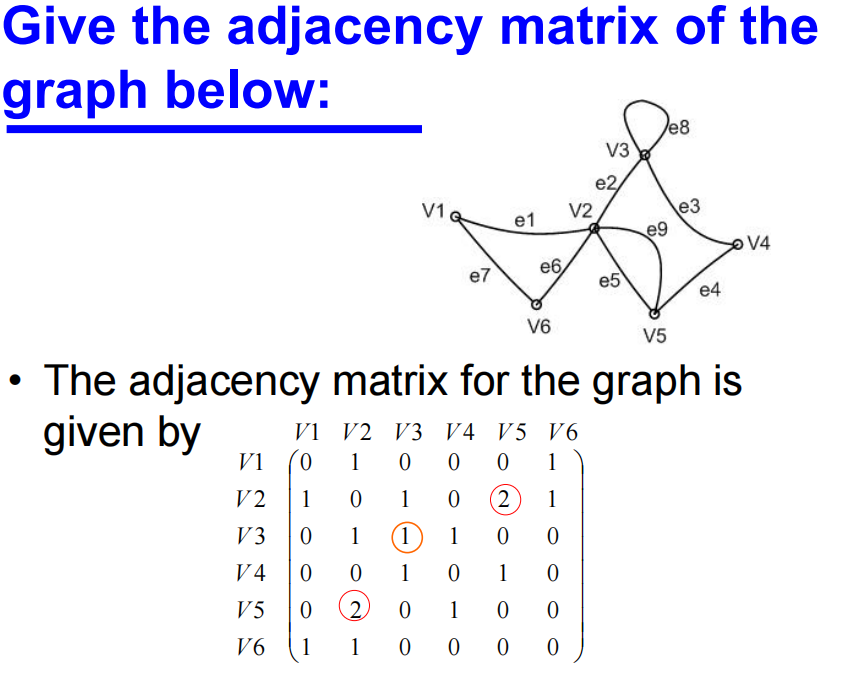

Question: How would you design data structure for graphs? What type of data structure can we use to store graphs?如何为图形设计数据结构?我们可以使用什么类型的数据结构来存储图形?

**邻接表（Adjacency List）**

邻接表是一种更节省空间的图表示方法，特别适用于稀疏图（即边数较少的图）。它使用一个列表数组，其中每个列表存储一个顶点的所有邻接顶点。

**优点：**

- 节省空间：对于稀疏图非常高效。
- 动态：容易增加或删除边和顶点。

**缺点：**

- 检查顶点之间是否有边的操作较慢（需要遍历邻接列表）。

**邻接矩阵（Adjacency Matrix）**

邻接矩阵是一种表示图的二维数组，其中矩阵的行和列表示图的顶点。如果顶点 𝑖*i* 和 𝑗*j* 之间有边，则 adjMatrix[i] [j]s的值为 1，否则为 0。

**优点：**

- 检查顶点之间是否有边的操作非常快（O(1)）。
- 简单直观。

**缺点：**

- 占用更多空间：对于稀疏图空间利用率低。
- 不方便增加或删除顶点。

## 练习

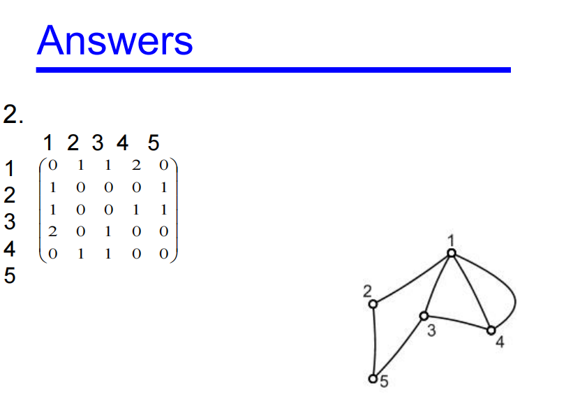

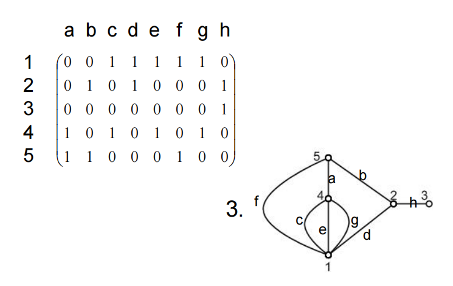

# Graph III

## Trees

A **tree** is a connected graph with no cycles

树是一个没有环的连通图

A **forest** is a graph with no cycles and it may or may not be connected

森林是一个没有循环的图，它可以连接也可以不连接

案例：

Identify which of the following graphs are trees or forests

找出下面哪个图是树还是森林

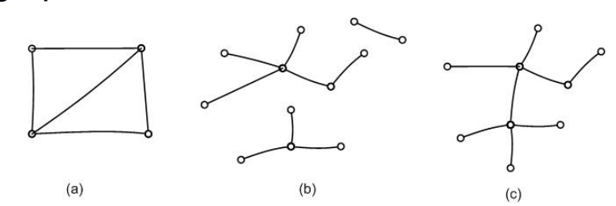

Solution: (b) A forest  (c) A tree

### Tree Properties 树的属性

If a tree *T* has at least two vertices then it has the following properties:

如果树*T*至少有两个顶点，那么它具有以下属性:

There is exactly one path from any vertex *Vi* in *T* to any other vertex *Vj*

从*T*中的任何顶点*Vi*到任何其他顶点*Vj*都有一条路径

The graph obtained from tree *T* by removing any edge has two components, each of which is a tre

从树*T*中去掉任意一条边得到的图有两个分量，每个分量都是一个树

|*E*| = |*V*| - 1

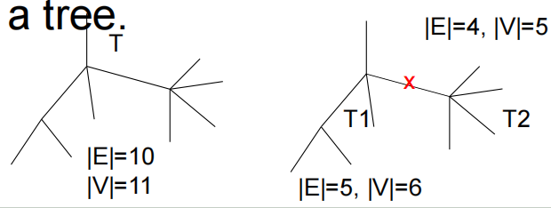

### Spanning Trees

A **spanning tree** of a graph *G* is 

图*G*的**生成树**是

- a tree *T*

- a spanning subgraph of *G*. 

- That is, *T* has the same vertex set as *G*.

案例:

Identify a spanning tree for each of the following graphs:

为以下每个图确定生成树:

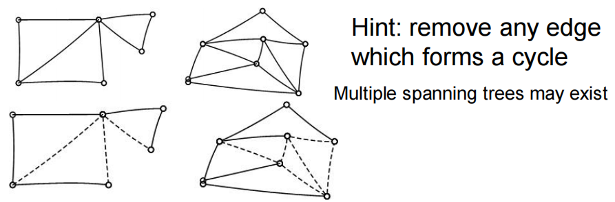

## Given a graph G: How to draw a spanning tree?

Take any vertex of *G* as an initial partial tree. 

取*G*的任意顶点作为初始偏树。

Add edges one by one so each new edge joins a new vertex to the partial tree. 

一条一条地添加边，这样每条新边都将一个新顶点连接到部分树中。

If there are *n* vertices in the graph *G* then the spanning tree will have *n* vertices and *n*-1 edges

如果图*G*中有*n*个顶点，则生成树将有*n*个顶点和*n*-1条边

## Minimum Spanning Tree 最小生成树

Suppose we have a group of offices which need to be connected by a network of communication lines. 

假设我们有一组需要通过通信线路网络连接的办公室。

The offices may communicate with each other directly or through another office.

各局之间可以直接通信，也可以通过另一局通信。

Condition: there exists one path between any two vertices.

条件:任意两个顶点之间存在一条路径。

In order to decide on which offices to build links between we firstly work out the cost of all possible connections. 

为了决定在哪些办公室之间建立连接，我们首先计算出所有可能连接的成本。

This will give us a weighted complete graph as shown next. 

这将给我们一个加权完全图，如下所示。

The **minimum spanning tree** is then the spanning tree that has the minimum cost among all spanning trees.

**最小生成树**是所有生成树中代价最小的生成树。

- A weighted complete graph. 

  加权完全图。

- The vertices represent offices and the edges possible communication links. 

  顶点代表办公室，边代表可能的通信链接。

- The weights on the edges represent the cost of construction of the link.

  边上的权重代表构建链接的成本。

### What is the use of minimum spanning tree?

**City/town planning** **城市/城镇规划**

## Greedy 贪心

Choose any start vertex to form the initial partial tree (*Vi*)

选择任意起始顶点形成初始部分树(*Vi*)

Add the **cheapest edge**, *Ei*, to a new vertex to form a new partial tree

将**最cheap的边**，*Ei*添加到一个新的顶点，形成一个新的部分树

Repeat step 2 until all vertices have been included in the tree

重复步骤2，直到所有顶点都包含在树中

案例:

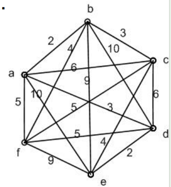

- 从任意顶点开始，在本例中选择标记为*a*的顶点。
- 加上ab边它是a的邻边中最cheap的边

- 从a或b的事件中寻找最cheap的边缘，我们发现边缘bc和ad，都要3，没有其他可用的边缘权值更低。我们可以选择bc或ad。我们任意选择bc

- 我们现在寻找最cheap的剩余边，或者那些与a、b或c相关的边，形成一个部分树。这个边是ad。

- 继续这样，我们得到最小生成树如下:

  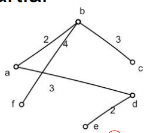

The total cost of our solution is found to be 2+3+3+2+4=14.

## The shortest path problem

- The weights on a graph may represent *delays* in a communication network or *travel times* along roads. 

  图上的权重可以表示通信网络中的*延迟*或道路沿线的*旅行时间*。

- A practical problem to consider is to find the **shortest path** between any two vertices.

  要考虑的一个实际问题是找到任意两个顶点之间的最短路径。

- **Shortest path**  -> **shortest delay**

  **最短路径** -> **最短延迟**

- The algorithm to determine this will be demonstrated through an example.

  我们将通过一个示例来演示确定这一点的算法。

案例:

Shortest path algorithm to determine the shortest path between two vertices of a weighted graph

最短路径算法来确定一个加权图的两个顶点之间的最短路径

Example1:

The weighted graph shown below represents a communication network with weights indicating the delays associated with each edge. 

下图所示的加权图表示一个通信网络，其权重表示与每条边相关的延迟。

Find the minimum delay path from *s* to *t* 找出从*s*到*t*的最小延迟路径

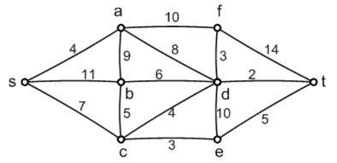

- Begin at the start vertex *s*. This is the reference vertex for stage 1. 

  从起始顶点*s*开始。这是阶段1的参考顶点。

- Label all the adjacent vertices with the lengths of the paths using only one edge. 

  将所有相邻的顶点标记为仅使用一条边的路径长度。

- Mark all other vertices with a very large number (larger than the sum of all the weights in the graph). In this case we choose 100. This is shown in the diagram. 

  用一个非常大的数字标记所有其他顶点(大于图中所有权重的总和)。在这个例子中，我们选择100。如图所示。

- At the same time, start to form a table as shown in Table 1. 

  同时，开始形成如表1所示的表格。

- The lengths of paths using only 1 edge from *s*

  从*s*中只使用一条边的路径长度

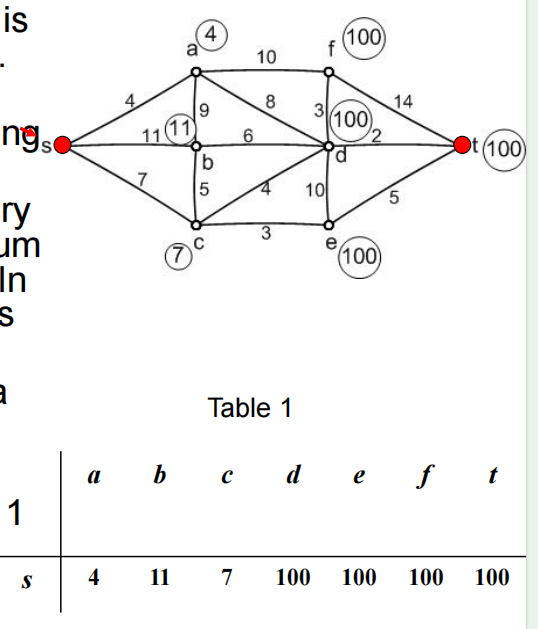

- Choose as the reference vertex for stage 2 the vertex with the **smallest label** that has not already been a reference vertex. This is vertex **a**. 

  选择具有最小标签的顶点作为第二阶段的参考顶点，这个顶点还没有成为参考顶点。这是顶点a。

- Consider any vertex adjacent to the new reference vertex and mark it with the length of the path from *s* via *a* to this vertex if this is less than the current label on the vertex. This gives the labels shown right. 

  考虑与新参考顶点相邻的任何顶点，如果它小于顶点上的当前标签，则用从*s*到*a*到该顶点的路径长度标记它。这样就得到了所示的标签。

- We also add a new line to Table 1 to give Table 2, noting that as vertex *a* has been made a reference vertex the label of *s*becomes permanent and is marked with an underline in the table. 

  我们还在表1中添加了一个新行来给出表2，注意当顶点*a*被设为参考顶点时，*s*的标签将成为永久的，并在表中用下划线标记。

- The lengths of paths using up to 2 edges from *s*

  路径的长度使用最多2条边从*s*

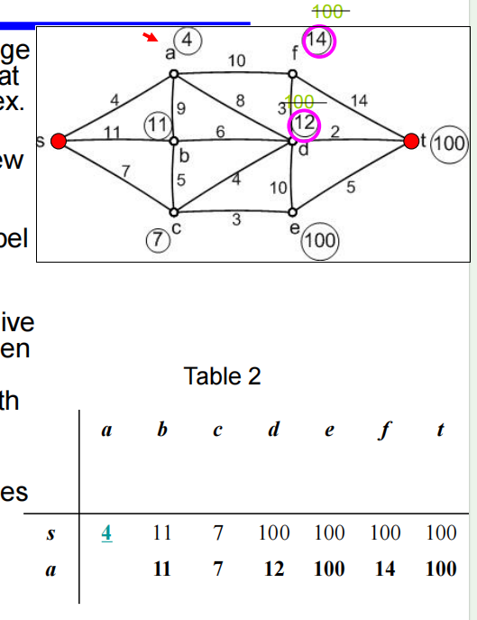

- Choose as the reference vertex the vertex with the **smallest label** that has not already been a reference vertex. From table 2 we see that **c** is the reference vertex for stage 3. 

  选择具有最小标签的顶点作为参考顶点，但该顶点尚未成为参考顶点。从表2中我们可以看到，**c**是阶段3的参考顶点。

- Consider any vertex adjacent to *c* that does not have a permanent label and calculate the length of the path from *s* via *c* to this vertex. If it is less than the current label on the vertex mark the vertex with this length. This gives us the labels shown right. 

  考虑与*c*相邻的任何没有永久标签的顶点，并计算从*s*经过*c*到该顶点的路径长度。如果它小于顶点上的当前标号，则用此长度标记顶点。这样就得到了如图所示的标签。

- We also add a new line to Table 2 to give Table 3. Note that the third line of Table 3 does not have an entry for *a* as this has already been a reference vertex.

  我们还在表2中添加了新的一行来给出表3。注意，表3的第三行没有关于*a*的条目，因为这已经是一个引用顶点。

- The lengths of paths using up to 3 edges from *s*

  路径的长度使用最多3条边从*s*

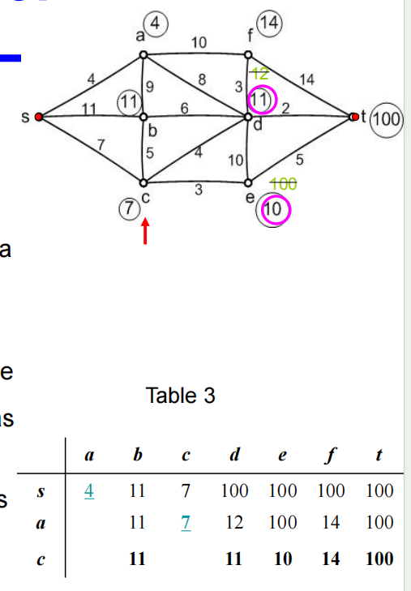

- Proceeding as before, the reference vertex for stage 4 is, by inspection of the third line of Table 3, vertex **e**. 

  如前所述，通过检查表3的第三行，阶段4的参考顶点是顶点**e**。

- Again we calculate the lengths of the paths from *s* via *e* to any vertices adjacent to *e* that do not have permanent labels and replace the labels on those vertices with the relevant path lengths if this is less than the existing label. 

  再一次，我们计算从*s*到*e*到*e*相邻的任何没有永久标签的顶点的路径长度，并将这些顶点上的标签替换为相关的路径长度，如果这小于现有的标签。

- This gives the labels shown right and Table 4.

  这给出了如表4所示的标签。

- The lengths of paths using up to 4 edges from *s*

  路径的长度使用最多4条边从*s*

- Choose **b** as the new reference vertex (we could have chosen d instead but this would make no difference to the final result).

  选择 **b** 作为新的参考顶点（我们也可以选择 d，但这对最终结果没有影响）。 

- Compare paths from *s* via *b* to the labels on any adjacent vertices with temporary labels and re-label if the paths are found to be shorter. 

  将从*s*到*b*的路径与任何相邻顶点上带有临时标签的标签进行比较，如果发现路径更短，则重新标记。

- The result of stage 5 is that the labels remain as in stage 4, but that the label on b becomes permanent giving Table 5.

  阶段5的结果是，标签仍然与阶段4一样，但是b上的标签在表5中成为永久性的。

- The lengths of paths using up to 5 edges from *s*

  路径的长度使用最多5条边从*s*

- Choose **d** as the new reference vertex. 

  选择**d**作为新的参考顶点。

- The only vertices left without permanent labels are now *f* and *t*. 

  剩下的唯一没有永久标签的顶点现在是*f*和*t*。

- The path from *s* via *d* to *t* gives *a* smaller value than the current label of 15. Hence we change the label to 11+2=13. 

  从*s*到*d*到*t*的路径给*一个*小于当前标签15的值。因此我们将标签改为11+2=13。

- The new labels are shown right together with Table 6.

  新标签与表6一起显示。

- The lengths of paths using up to 6 edges from *s*

  路径的长度使用最多6条边从*s*

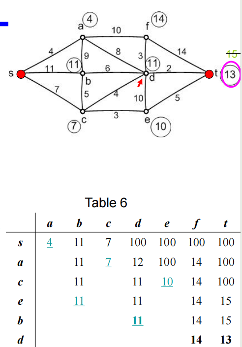

- The remaining vertex with the **smallest label** is **t**.

  剩下的带有**最小标签**的顶点是**t**。

- We therefore give *t* the permanent labelof 13.

  因此，我们给予*t*13的永久标签。

- As soon as *t* receives a permanent labelthe algorithm stops as this label is thelength of the shortest path from *s* to *t*.

  一旦*t*收到一个永久标签，算法就会停止，因为这个标签是从*s*到*t*的最短路径的长度。

- To find the actual path with this length we**move backwards** from *t* looking for*consistent* labels.

  为了找到这个长度的实际路径，我们**从*t*向后移动**寻找*一致*标签。

- This gives *t d c s*. That is, the path is *s c d t*.

  得到t d c s。也就是说，路径是*s c d t*。

## Dijkstra's

- Let the node at which we are starting be called the **initial node**. Let the **distance of node** **Y** be the distance from the **initial node** to *Y*. Dijkstra's algorithm will assign some initial distance values and will try to improve them step by step.

  让我们开始的节点称为**初始节点**，让节点Y**的**距离是**初始节点**到*Y*的距离，Dijkstra的算法会赋值一些初始距离值，会尝试逐步改进。

- Assign to every node a tentative distance value: set it to zero for our initial node and to infinity for all other nodes.

  为每个节点分配一个暂定距离值：对初始节点设置为 0，对所有其他节点设置为无穷大。

- Set the initial node as current. Mark all other nodes unvisited. Create a set of all the unvisited nodes called the *unvisited set*.

  将初始节点设置为当前节点。标记所有其他未访问的节点。创建一组所有未访问的节点，称为*未访问集*。

- For the current node, consider all of its unvisited neighbors and calculate their *tentative* distances. Compare the newly calculated *tentative* distance to the current assigned value and assign the smaller one. For example, if the current node *A* is marked with a distance of 9, and the edge connecting it with a neighbor *B* has length 4, then the distance to *B*(through *A*) will be 9 + 4 = 13. If B was previously marked with a distance greater than 13 then change it to 13. Otherwise, keep the current value.

  对于当前节点，考虑其所有未访问的邻居并计算它们的“暂定”距离。将新计算的“暂定”距离与当前指定的值进行比较，并指定较小的值。例如，如果当前节点*A*被标记为距离为9，并且与邻居*B*连接的边长度为4，则到*B*的距离(通过*A*)将为9 + 4 = 13。如果B先前标记的距离大于13，则将其更改为13。否则，保持当前值。

- When we are done considering all of the neighbors of the current node, mark the current node as visited and remove it from the *unvisited set*. A visited node will never be checked again.

  当我们考虑完当前节点的所有邻居后，将当前节点标记为已访问节点，并将其从*未访问节点集*中删除。已访问节点将不再被检查。

- If the destination node has been marked visited (when planning a route between two specific nodes) or if the smallest tentative distance among the nodes in the *unvisited set* is infinity (when planning a complete traversal; occurs when there is no connection between the initial node and remaining unvisited nodes), then stop. The algorithm has finished.

  如果目标节点已被标记为已访问(当规划两个特定节点之间的路线时)，或者如果*未访问集*中节点之间的最小暂定距离为无穷大(当规划完全遍历时);当初始节点和剩余未访问节点之间没有连接时发生，然后停止。算法完成。

- Otherwise, select the unvisited node that is marked with the smallest tentative distance, set it as the new "current node", and go back to step 3.

  否则，选择标记有最小暂定距离的未访问节点，将其设置为新的“当前节点”，返回步骤3。

- Why SPA gives us the shortest path?

  

- What is the complexity of SPA?

  

- Can SPA be generalized for related shortest path problems?

  