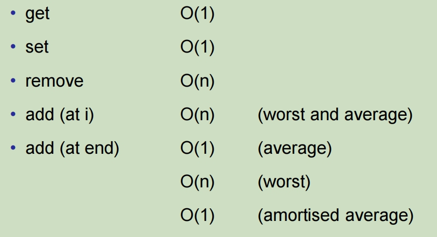

# Cost Analysis 

**Time**:

- Run the **program** and count the milliseconds/minutes/days.

  运行**进程**并计算毫秒/分钟/天。

- Count the number of steps/operations the **algorithm** will take.

  计算**算法**将采取的步骤/操作数。

**Space**:

- Measure the amount of memory the **program** occupies

  测量**进程**占用的内存量

- Count the number of elementary data items the **algorithm** stores.

  计算算法存储的基本数据项数。

Both

• programs: benchmarking 进程：基准测试

• algorithms: analysis 算法：分析

## Benchmarking: Program cost

- Measure:

  - actual programs

  - on real machines

  - on specific input

  - measure elapsed time 测量经过的时间

    - **System.currentTimeMillis**() 

    - → time from system clock in milliseconds (long) 系统时钟时间（以毫秒为单位）（长）

  - measure real memory usage

- Problems:

  - what input  ⇒ choose test sets carefully; use large data sets; don’t include user input

  - other users/processes ⇒ minimise; average over many runs

  - which computer? ⇒ specify details

## Analysis: Algorithm Complexity

- Abstract away from the details of
  - the hardware
  - the operating system
  - the programming language
  - the compiler
  - the program
  - the specific input

- Measure number of “steps” as a function of the data size.
  - worst case (easier)
  - average case (harder)
  - best case (easy, but useless)
- Construct an expression for the number of steps:
  - cost = 3.47 n2 - 67n + 53 steps
  - cost = 3n log(n) - 5n + 6 steps

​		simplified into terms of different powers/functions of  n

## Big O

| O(1)        | *“constant”*    | cost is independent of *n*                                   |
| ----------- | --------------- | ------------------------------------------------------------ |
| O(log(n))   | *“logarithmic”* | size x 10 → add a little (log(10)) to the cost               |
| O(n)        | *“linear”*      | size x 10 → 10 x the cost                                    |
| O(n log(n)) | *“en-log-en”*   | size x 10 → bit more than 10 x                               |
| O(n**2**)   | *“quadratic”*   | size x 10 → 100 * the cost                                   |
| O(n**3**)   | *“cubic”*       | size x 10 → 1000 * the cost                                  |
| O(2**n**)   | *“exponential”* | adding one to size -> doubles the cost (=> You don’t want to run this algorithm!) |
| O(n!)       | *“factorial”*   | adding one to size -> n the cost(=> You **definitely** don’t want this algorithm!) |

ArrayList Cost:

Question: what would the amortised cost be if the array size is increased by 10 each time?

如果每次数组大小增加 10，摊余成本是多少？

If the array size is increased by 10 each time, the amortized cost of an operation would depend on the specific operation being performed and the overall sequence of operations.

如果每次数组大小增加 10，则操作的摊销成本将取决于正在执行的特定操作和整个操作顺序。

Let's consider the amortized cost for appending an element to the array. When the array needs to be resized (i.e., when it is full and a new element needs to be appended), the resizing operation involves allocating a new array with a larger size and copying all elements from the old array to the new one. This resizing operation occurs infrequently because the array size increases by 10 each time.

让我们考虑将元素追加到数组的摊销成本。当数组需要调整大小时（即，当它已满并且需要附加新元素时），调整大小操作涉及分配一个具有较大大小的新数组，并将所有元素从旧数组复制到新数组。此调整大小操作很少发生，因为数组大小每次增加 10。

Suppose the current array size is \( n \). When the array is resized, \( n \) elements need to be copied to the new array. The total cost of resizing, including the allocation of the new array and the copying of elements, is proportional to \( n \). Since resizing occurs every \( n \) insertions, the amortized cost of each insertion operation, including resizing, is approximately \( O(1) \).

假设当前数组大小为 （ n ）。调整数组大小时，需要将 （ n ） 个元素复制到新数组中。调整大小的总成本（包括新数组的分配和元素的复制）与 （ n ） 成正比。由于每 （ n ） 次插入都会进行调整大小，因此每次插入操作（包括调整大小）的摊销成本约为 （ O（1） ）。

Therefore, if the array size is increased by 10 each time, the amortized cost of operations like appending elements to the array would be \( O(1) \).

## ArrayList Method Cost

什么可以被看作是Count 

- actions in the innermost loop (happen the most times)

- actions that happen every time round (not inside an “if”)

- actions involving “data values” (rather than indexes)

- representative actions (don’t need every action)

一些常见操作的复杂程度:

- Adding 2 numbers is cheap
- Raising to a power is not so cheap
- Comparing 2 strings *may* be expensive
- Reading a line from a file *may* be very expensive

### get, set, remove

Assume List contains *n* items.

Cost of get and set:

- best, worst, average: O(1) ⇒ constant number of steps, regardless of *n*

Cost of Remove:

- worst case: 删除最后一个，需要从头找到尾
- average case:

时间复杂度表：

- get O(1)

- set O(1)

- remove O(n)

- add (at i) O(n) (worst and average) 

- add (at end) O(1) (average)

​				    O(n) (worst)

​				    O(1) (amortised average)
