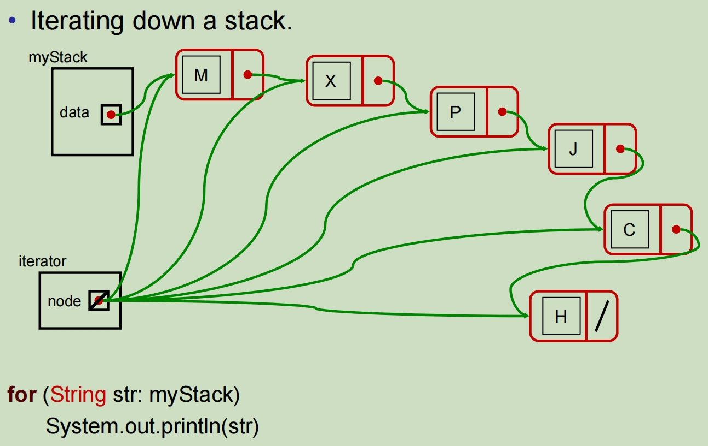
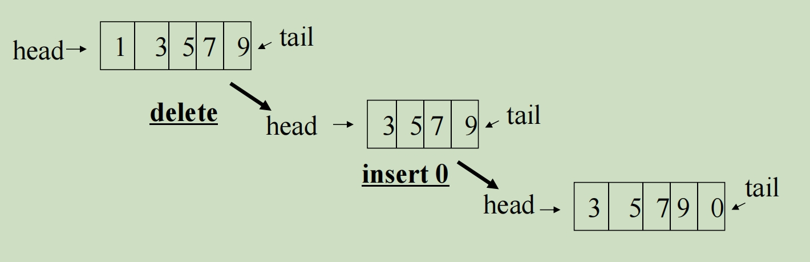
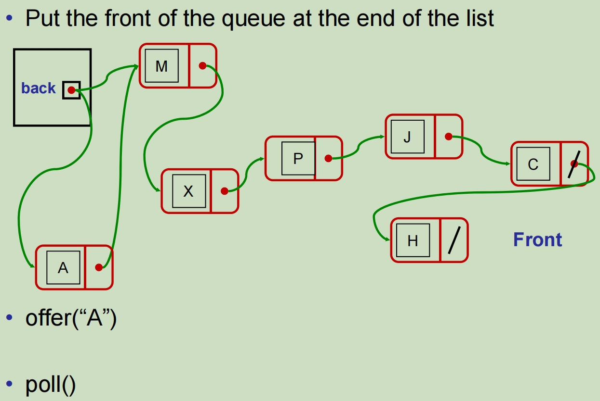
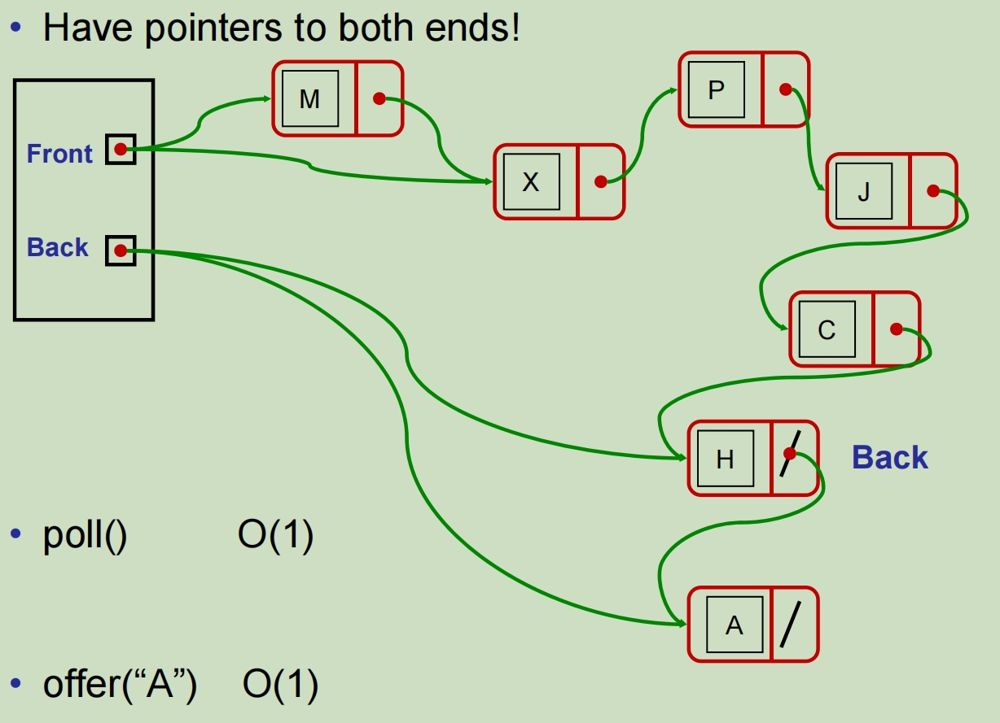

# Linked Stack 链栈

insertions (push) & deletions (pop) only at the end (top)

只在末尾(栈顶部top)插入(push)和删除(pop)

Make the top of the Stack be the front of the list


```java
public class LinkedStack <E> extends AbstractCollection <E> {
    // 初始化一个节点
    private Node<E> data = null;
    
    // 判断当前节点是否为空
    public boolean isEmpty(){
        return data==null;
    }
    
    // 判断当前栈的大小
    public int size (){
        int ans = 0;
		for (Node<E> rest = data; rest!=null; rest=rest.next)
			ans++;
		return ans;
	}
    
    // 获取最后一个放入的节点的值 （后入先出）
    public E peek(){
		if (data==null) throw new EmptyStackException();
		return data.value;
	}
    
    // 将最后一个放入的值弹出栈
	public E pop(){
		if (data==null) throw new EmptyStackException();
		E ans = data.value;
		data = data.next;
		return ans;
	}
    
    // 向栈中推入一个新数据，放在栈顶，也就是链表的开头
	public void push(
		E item){
		if (item == null) throw new IllegalArgumentException();
		data = new Node(item, data);
	} 
    
    // 迭代器
	public Iterator <E> iterator(){
		return new NodeIterator(data);
	}   
}

// 链栈的迭代器
private class NodeIterator <E> implements Iterator <E>{
	private Node<E> node; // node containing next item 
    
	public NodeIterator (Node <E> node) {
		this.node = node;
	}
    
	public boolean hasNext () {
		return (node != null);
	}
    
    public E next () {
		if (node==null) throw new NoSuchElementException();
		E ans = node.get();
		node = node.next();
		return ans;
	}
    
	public void remove(){
		throw new UnsupportedOperationException();
	}
}

```



# Linked Queue 链队列

Insertion at the end (tail), deletion from the front  (head) 

末端插入(尾部)，前端删除(头部) 先进先出



Application of queue:

- user job queue

- print spooling queue

- I/O event queue

- incoming packet queue

- outgoing packet queue

Put the front of the queue at the end of the list

将队列的开始放在列表的末尾



A better solution:

在起始点和结束点头加上一个指针，这样poll和offer的时间复杂度都是O(1)



Always three cases: 0 items, 1 item, >1 item

```java
public class LinkedQueue <E> implements AbstractQueue <E> {
    private Node<E> front = null;
	private Node<E> back = null;
    
    public boolean isEmpty(){
		return front==null;
	}
    
	public int size () {
		if (front == null) return 0;
		else return front.size();
	}
    
    public E peek(){
		if (front==null) return null;
		else return front.value;
	}
    
	public E poll(){
		if (front==null) return null;
		E ans = front.value;
		front = front.next;
		if (front==null) back = null;
		return ans;
	}
    
    
    public boolean offer(E item){
		if (item == null) return false;
		if (front == null){
			back = new Node(item, null);
			front = back;
		}
		else { 
			back.next = (new Node(item, null));
			back= back.next;
		}
		return true;
	}
    
    
}
```

• Uses a “header node”

​	• contains link to head node, and maybe last node of linked list

• Important to choose the right end.

​	• easy to add or remove from head of a linked list

​	• hard to add or remove from the last node of a linked list

​	• easy to add to last node of linked list if have pointer to tail

• Linked Stack and Queue: 

​	• **all main operations are O(1)**

• Can combine Stack and Queue 

​	• addFirst, addLast, removeFirst

​	• also need removeLast to make a “Deque” (double-ended queue) ⇒ need doubly linked list (why?)

​	• See the java “LinkedList” class.
