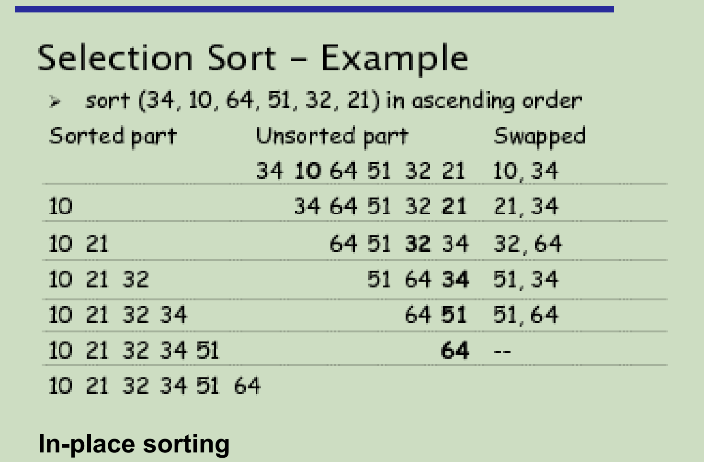
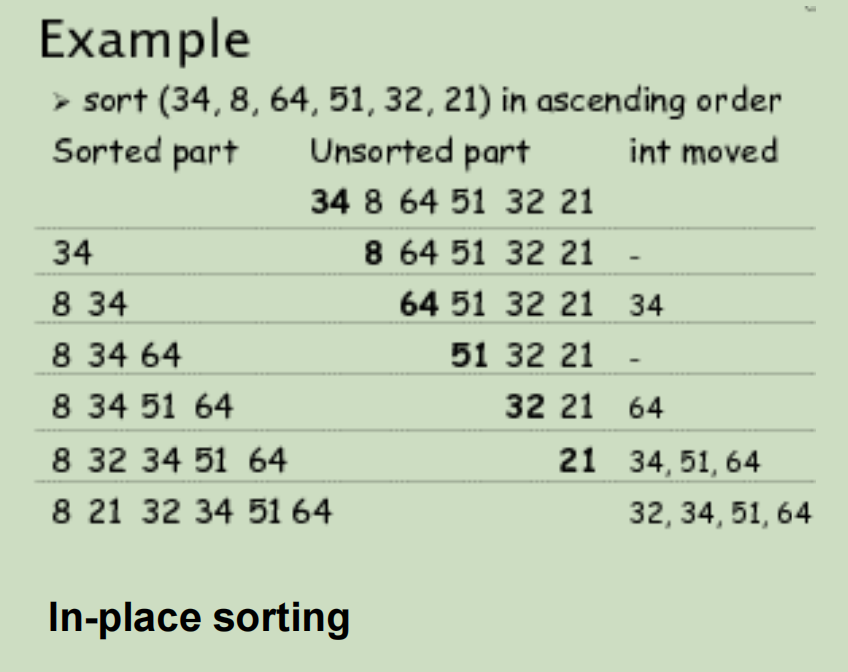
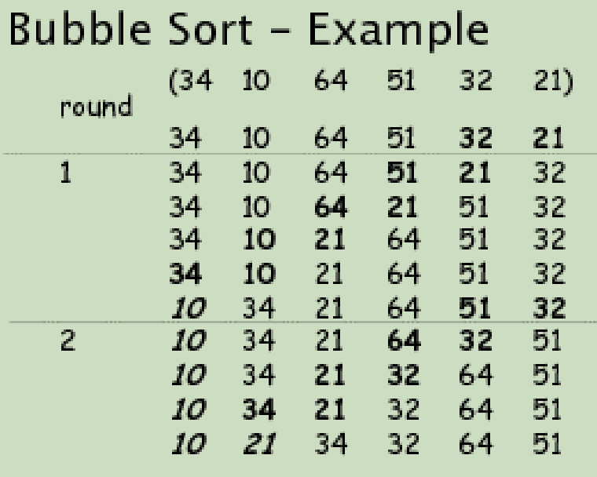
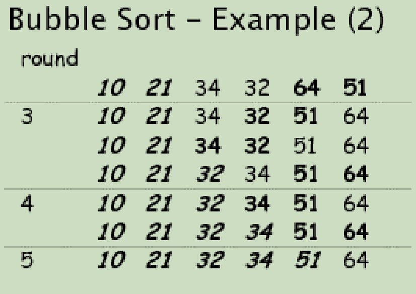
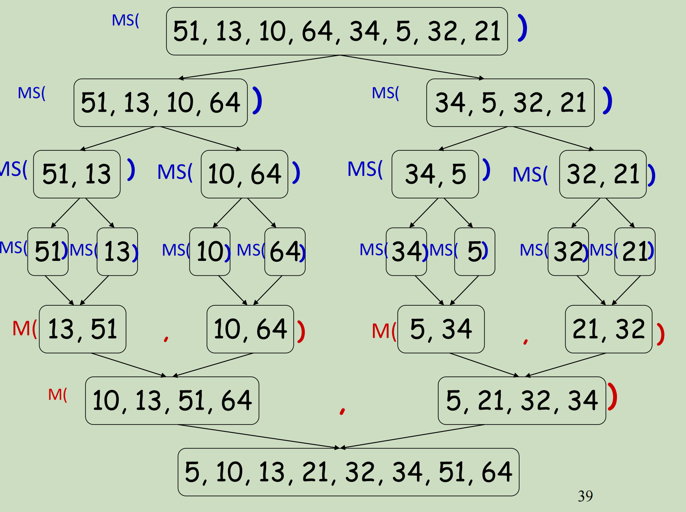

# 16 ArraySet and Binary Search

## ArraySet cost

- Order is not significant

  ⇒ add() can choose to put a new item anywhere. where? 

  ⇒ can reorder when removing an item. how?

- **Duplicates not allowed**.

  ⇒ must check if item already present before adding

## SortedArraySet algorithms

Assume data is sorted

Contains(value):

​	index = <u>findIndex</u>(value),

​	return (data[index] equals value )

<hr>
Add(value):

​	index = <u>findIndex</u>(value),

​	if index == count or data[index] not equal to value,

​		double array if necessary

​		move items up, from position count-1 down to index

​		insert value at index

​		increment count

<hr>
Remove(value):

​	index = <u>findIndex</u>(value),

​	if index < count and data[index] equal to value

​		move items down, from position index+1 to count-1

​		decrement count

### Making ArraySet Faster

将ArraySet转变为有固定顺序的SortedArraySet。在具有顺序之后，就可以使用Binary Search来快速索引到正确的目标。

Binary Search Main Principles:

- Look in the middle:

  - if item is middle item  ⇒ return

  - if item is before middle item  ⇒ look in left half

  - if item is after middle item  ⇒ look in right half

```java
private boolean contains(Object item){
	Comparable<E> value = (Comparable<E>) item;
	int low = 0; // min possible index of item
	int high = count-1; // max possible index of item
	// item in [low .. high] (if present)
	while (low <= high){
		int mid = (low + high) / 2;
		int comp = value.compareTo(data[mid]); 
		if (comp == 0) // item is present
			return true;
		if (comp < 0) // item in [low .. mid-1] 
			high = mid - 1; // item in [low .. high]
		else // item in [mid+1 .. high]
			low = mid + 1; // item in [low .. high]
    }
	return false; // item in [low .. high] and low > high,
				  // therefore item not present
}
```

### Time Complexity

Let T(n) denote the time complexity of binary search algorithm on n numbers

T(n) = 1, if n = 1

T(n)  = T(n/2) + 1, otherwise

we call this formula a **recurrences**

A recurrence is an equation or inequality that describes a function in term of **its value on smaller inputs**.

递归式是一个方程或不等式，它描述了一个**函数在较小的输入**上的值。

# 17 Slow Sort

## Log(n) or Log<sub>2</sub> (n)

The number of times you can divide a set of *n* things in half. Every time you double *n,* you add one step to the cost!

把n个东西分成两半的次数。每次n翻倍，代价就增加一步!

log(1000) =10, log(1,000,000) = 20, log(1,000,000,000) =30

**2<sup>log(x)</sup> = x**

在算法分析中随处可见尤其是“Divide and Conquer”算法

### Set with Binary Search

ArraySet: unordered

- contains: **O(*n* )** 

- add: **O(*n* )**

- remove: **O(*n* )**

⇒ All the cost is in the searching: **O(n)** 

<hr>

SortedArraySet: with Binary Search

- Binary Search is fast: **O(log(*n* ))**

- contains: **O(log(*n* ))** 

- add: **O(log(*n* ))  O(*n* )**

- remove: **O(log(*n* ))  O(*n* )**

  for add and remove, to find the target element, using binary search the time complexity will be O(log(n)), however, after add or remove the element, need to shift the following elements to new position, so the overall time complexity will be O(n).

⇒ All the cost is in keeping it sorted!!!!

### Making SortedArraySet fast

If you have to call add() and/or remove() many items, then **SortedArraySet** is **no better** than **ArraySet**!

- Both O(*n* )

- Either pay to search, Or pay to keep it in order

If you construct the set once but many calls to contains(), then **SortedArraySet** is much **better** than **ArraySet**.

- SortedArraySet contains() is O(log(*n* ))

### Alternative Constructor

```java
// Sort the items all at once
public SortedArraySet(Collection<E> colln){
	// Make space
	count=colln.size();
	data = (E[]) new Object[count];
	// Put items from collection into the data array.
	colln.toArray(data);
	// sort the data array.
	Arrays.sort(data);
}
```

## Analysing Sorting Algorithm

- Efficiency

  - What is the (worst-case) order of the algorithm?

  - Is the average case much faster than worst-case?

- Requirements on Data

  - Does the algorithm need random-access data? (*vs* streaming data)

  - Does it need anything more than “compare” and “swap”?

- Space Usage

  - Can the algorithm sort in-place? or does it need extra space? 

### Selecltion Sort O(n<sup>2</sup>)



 ```java
 public void selectionSort(E[ ] data, int size, Comparator<E> comp){
 	// for each position, from 0 up, find the next smallest item 
 	// and swap it into place
 	for (int place=0; place<size-1; place++){
 		int minIndex = place;
 		for (int sweep=place+1; sweep<size; sweep++){
 			if (comp.compare(data[sweep], data[minIndex]) < 0)
 			minIndex=sweep;
 		}
 		swap(data, place, minIndex);
 	}
 }
 ```

- Efficiency

  - worst-case: **O(n2)**
  - average case exactly the same.

- Requirements on Data

  - Needs random-access data, but easy to modify for files 

  - Needs compare and swap

- Space Usage
  - in-place

### Insertation Sort O(n<sup>2</sup>)

Look at the elements one by one

Build up sorted list by inserting the element at the correct location



### Bubble Sort O(n<sup>2</sup>)

Starting from the last element, swap adjacent items if they re not in ascending order. 

When first item is reached, the first item is the smallest

Repeat the above steps or the remaining items to find the second smallest item, and so on.





Bubble sort is also called as sinking sort

smaller values bubble their way up during the process

- need several passes through the data (how many?)

- During each pass, successive pairs of elements are compared

  - if a pair is in order, leave them as they are

  - if a pair not in order, swap

```java
public void bubbleSort(E[] data, int size, Comparator<E> comp){
	// Repeatedly scan array, swapping adjacent items if out of order
	// Builds a sorted region from the end
	for (int top=size-1; top>0; top--){
		for (int sweep=0; sweep<top; sweep++)
			if (comp.compare(data[sweep], data[sweep+1]) >0) 
      swap(data, sweep, sweep+1);
	}
}
```

- Efficiency

  - worst-case: **O(n****2** **)**

  - average case: **O(n****2****),** no better than worst

- Requirements on Data

  - Needs random-access data, but can modify for files 

  - Needs compare and swap

- Space Usage
  - in-place

## Implementing Sorting Algorithms

- 可以用List实现，general but not efficient depend on how list is implemented
- 可以用Array实现，less general, but effocient, easy to convert to an array: toArray().

- Comparing items:

  - require items to be comparable (natural order)

  - provide comparator (prescribed order)

  - handle both.

## Slow Sort

- Insertion sort, Selection Sort, Bubble Sort:

  - All slow (except Insertion sort on almost sorted lists)

  - Insertion sort is better than the others

- Problem:

  - Insertion and Bubble

  - only compare adjacent items

  - only move items one step at a time

- Selection

  - compares every pair of items –

  - ignores results of previous comparisons.

- Solution:

  - **Must be able to compare and swap items at a distance**

  - **Must not perform redundant comparisons**

# 18 Fast Sort

## Divide and Conquer Sort

将原本一整个的问题使用递归或者循环拆分成很多个小部分进行解决，并最终要小问题的结果结合为最终的结果。

A problem instance is divided into several smaller instances of the same problem, ideally of about same size. The smaller instances are solved, typically recursively. The solution for the smaller instances are combined to get a solution to original problem.

To Sort:

- Split

- Sort each part (recursive)

- Combine

Include:

- MergeSort:

  - split trivial

  - combine does all the work

- QuickSort:

  - split does all the work

  - combine trivial


## Merge Sort

- given two sorted arrays, merge them into one sorted array

- keep track of the smallest element in each array, output the smaller of the two to a third array

- Continue until both arrays are exhausted
- If any array is exhausted first, then simply output the rest of another array
- This so-called 2-way merging can be generalized to multi-way merging
- **时间复杂度固定为O(n log n)**



### Python示例

```python
# Merge sort
def merge_sort(nums):
    print(nums)
    if len(nums) > 1:
        mid = len(nums) // 2  # // 代表返回结果的整数部分
        left = nums[:mid]
        right = nums[mid:]
        merge_sort(left)
        merge_sort(right)
        merge(nums, left, right)
    print(nums)
    print("-----------")


def merge(nums, left, right):
    i = 0
    j = 0
    k = 0
    left_length = len(left)
    right_length = len(right)
    while i < left_length and j < right_length:
        if left[i] < right[j]:  # 代表left中当前指针指向的数字比right中的小
            nums[k] = left[i]
            i += 1
        else:
            nums[k] = right[j]
            j += 1
        k = k + 1

    if i == left_length:
        nums[k: left_length + right_length] = right[j:]
    else:
        nums[k: left_length + right_length] = left[i:]


if __name__ == '__main__':
    a = [13, 23, 45, 5, 65, 24, 55, 11]
    merge_sort(a)

```

### Java示例

```java
import java.util.Arrays;

public class MergeSort {

    public int[] mergeSort(int[] arr)
    {
        // 如果此时数组中有至少两个数字，则需要进行比较
        if (arr.length > 1) {
            int mid = arr.length / 2;
            int[] left = Arrays.copyOfRange(arr, 0, mid);
            int[] right = Arrays.copyOfRange(arr, mid, arr.length);
            left = mergeSort(left);
            right = mergeSort(right);
            arr = merge(left, right);
        }
        // 将当前已经排好序或者只有一个数字的数组返回
        return arr;
    }

    public int[] merge(int[] left, int[] right)
    {
        // 计数器
        int i = 0;
        int j = 0;
        int[] temp = new int[left.length + right.length];
        // 循环比较两个数组，将较小的数字放入temp中
        while (i < left.length && j < right.length) {
            // 如果左边的数字小于右边的数字，则将左边的数字放入temp中
            if (left[i] < right[j]) {
                temp[i + j] = left[i];
                i++;
            } else { // 如果左边的数字大于右边的数字，则将右边的数字放入temp中
                temp[i + j] = right[j];
                j++;
            }
        }

        // 如果左边的数组还有剩余的数字，则将剩余的数字放入temp中
        if (i == left.length) {
            while (j < right.length) {
                temp[i + j] = right[j];
                j++;
            }
        } else { // 如果右边的数组还有剩余的数字，则将剩余的数字放入temp中
            while (i < left.length) {
                temp[i + j] = left[i];
                i++;
            }
        }
        return temp;
    }

    public static void main(String[] args) {
        int[] arr = { 5, 4, 3, 2, 1 };
        MergeSort mergeSort = new MergeSort();
        System.out.println(Arrays.toString(mergeSort.mergeSort(arr)));
        // [1, 2, 3, 4, 5]
    }
}
```

## QuickSort

- works well for different types of data

- divide & conquer on sorting

- **O(N log N) on average**

- **O(N<sup>2</sup>) worst case**

Ideas:

- partition the array into two parts

  将数组划分为两部分

- partitioning involves the selection of a[i] where the following  conditions are met:

  分区涉及到a[i]的选择，并且满足以下条件:

  - a[i] is in its final place in the array for some i

    对于某个i, A [i]在数组中的最后位置

  - none in a[1], ... , a[i-1] is greater than a[i]

    a[1]，…， a[i-1]大于a[i]

  - none in a[i+1], ... , a[r] is less than a[i]

    a[i+1]，…， a[r]小于a[i]

- apply quicksort recursively to each part independently

  对每个部分独立地递归应用快速排序

```java
import java.util.Arrays;

public class CountingSort {

    public static void main(String[] args) {

        // 用来记录原本的数组
        int[] base_array = new int[]{1, 2, 5, 3, 2};
        // 用来记录原数组中每个数字出现了多少次
        int[] reflect_array;
        // 结果数组
        int[] result_array = new int[base_array.length];

        // 找到base_array里面最大的数字
        int max = Arrays.stream(base_array).max().getAsInt();

        // 让映射列表的长度等于base_array中最大的数字的长度+1
        reflect_array = new int[max+1];
        // 让映射列表全都为0
        Arrays.fill(reflect_array, 0);

        // 同级初始数组中每个数字出现的次数，并放入映射数组中
        for (int k : base_array) {
            reflect_array[k]++;
        }

        // 此时的映射数组[0, 1, 2, 1, 0, 1]

        // 对映射数组进行累加，计算出每个数字前面有多少个空格
        for (int j = 1; j < reflect_array.length; j++) {
            reflect_array[j] = reflect_array[j - 1] + reflect_array[j];
        }

        // 此时的映射数组[0, 1, 3, 4, 4, 5]

        // 结果也是从右向左填入，结果数组[映射数组[原始数组[k]] - 1] = 原始数组[k]
        // 记得将映射数组[原始数组[k]]的值在每次循环之后减1
        for (int k = base_array.length-1; k >= 0; k--) {
            result_array[reflect_array[base_array[k]] - 1] = base_array[k];
            reflect_array[base_array[k]] = reflect_array[base_array[k]] - 1;
        }

        // 此时的映射数组[0, 0, 1, 3, 4, 4]
        // 此时的结果[1, 2, 2, 3, 5]
    }

}

```

