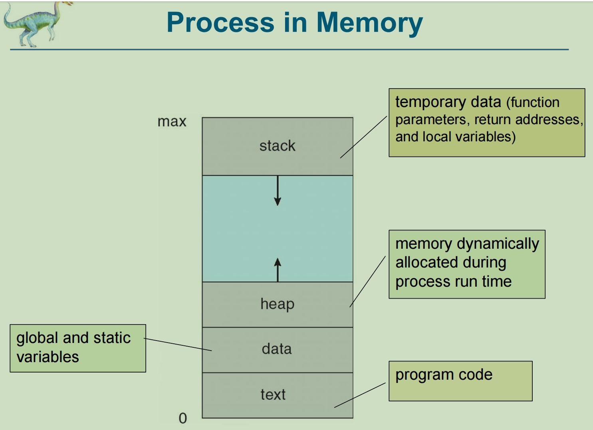
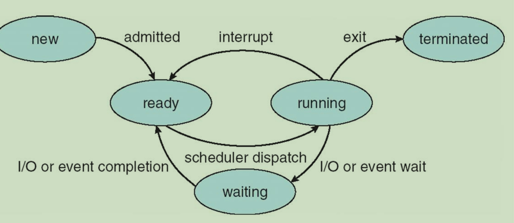
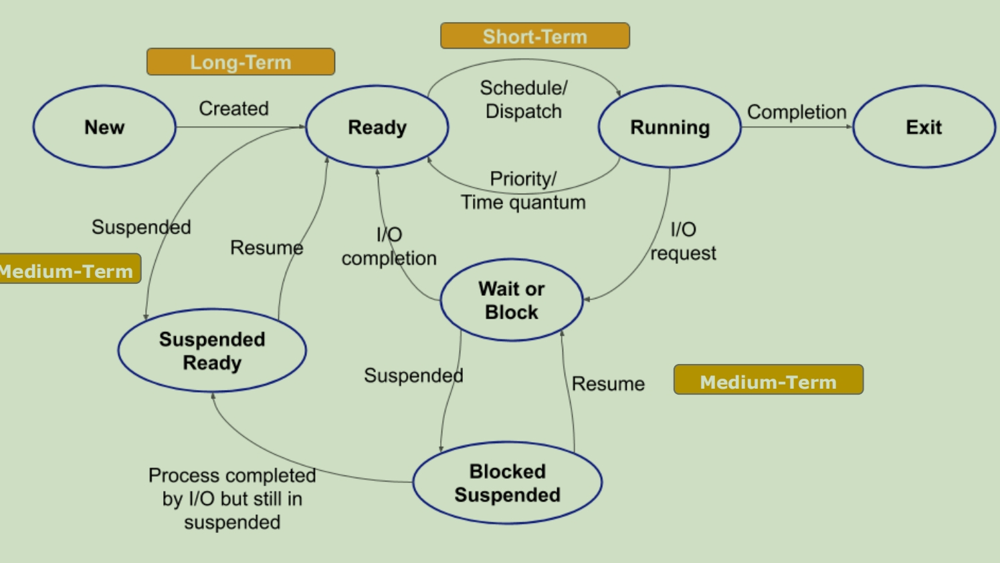
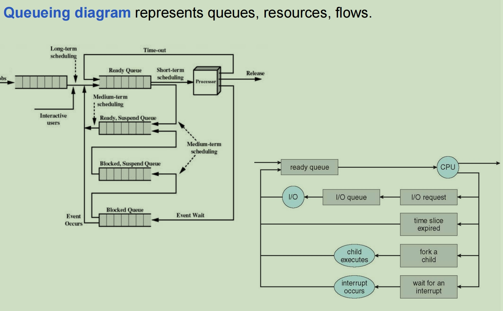
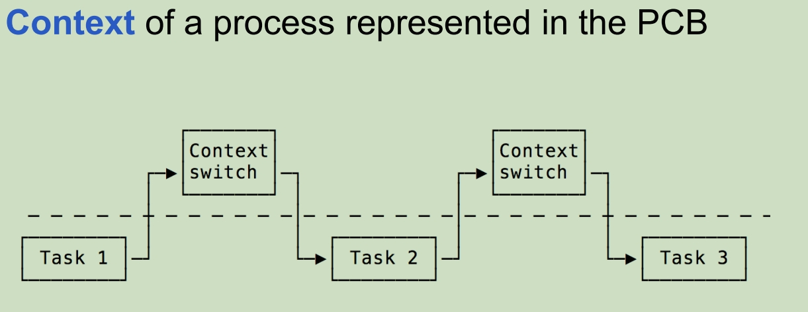
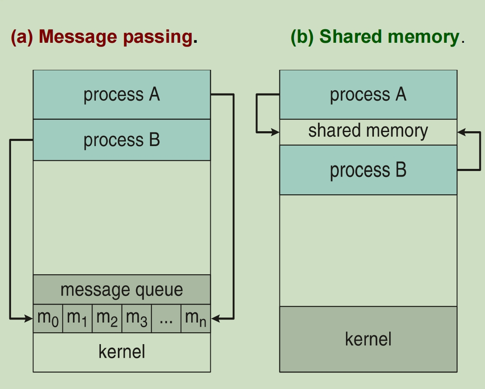

# Process 进程

# PART 1: Process Concept

### What is Operating System?

An interface between users and hardware - an environment "architecture”;

​	用户和硬件之间的接口，环境“架构”;

​	Allows convenient usage; hides the tedious stuff;

​	使用方便;隐藏乏味的东西;

​	Allows efficient usage; parallel activity, avoids wasted cycles; 

​	允许高效使用;并行活动，避免浪费周期

​	Provides information protection; 提供信息保护;

​	Gives each user a slice of the resources; 为每个用户提供资源的一部分;

​	Acts as a control program. 充当控制程序。

### **Characteristics of Operating Systems**:

1. **Time Sharing**: multiprogramming environment that's also interactive.

   **分时**: 同时也是交互式的多进程环境。

2. **Multiprocessing** - Tightly coupled systems that communicate via shared memory. Used for speed improvement by putting together a number of off-the-shelf processors.

   **多处理**: 通过共享内存进行通信的紧密耦合系统。通过将许多现成的处理器组合在一起来提高速度。

   

3. **Distributed Systems**: - Loosely coupled systems that communicate via message passing. Advantages include resource sharing, speed up, reliability, communication.

   **分布式系统**:  通过消息传递进行通信的松散耦合系统。优点包括资源共享、加速、可靠性、通信。

   

4. **Real Time Systems**: Rapid response time is main characteristic. Used in control of applications where rapid response to a stimulus is essential.

​	**实时系统**: 快速响应时间是主要特点。用于控制对刺激的快速响应至关重要的应用。

### What is doing in OS

1. Process Management, 

2. Memory management, 

3. File System Management, 

4. I/O System Management, 

5. Protection and Security

1. 过程管理，

2. 内存管理，

3. 文档系统管理，

4. I/O系统管理，

5. 保护与安全

**<u>Process Management</u>**: *Starting and stopping programs and sharing the CPU between* *them.* 

启动和停止进程并在它们之间共享 CPU。

## Concept 进程概念

+ **Process** = **a program in execution**; process execution must progress in sequential fashion 

​	**正在执行的进程**;流程执行必须按顺序进行 (进程可以理解为一个程序的一次执行过程)

- An operating system executes a variety of programs 操作系统执行各种进程

- A **process** is considered an '**active**' entity **进程**被视为“**活动**”实体

- A **program** is considered to be a **'passive'** entity (stored on disk (executable file))

  **程序**被视为**“被动”**实体（存储在磁盘上（可执行文档））

  **程序段**、**数据段**、**PCB**三部分构成了一个**进程实体（进程映像）**。一般情况下，进程实体就是进程。严格来说是不一样的，**进程实体是静态的**，**进程是动态的**。

**<u>Program becomes process when executable file loaded into memory</u>**

**<u>进程在可执行文档加载到内存中时成为进程</u>**

## Process State 进程状态

As a process executes, it changes **state** 当进程执行时，它会更改**状态**

The state of a process is defined in part by the **current activity of that process.**

进程的状态在一定程度上由该进程的**当前活动定义**。

前三个是基本状态

- **new**: The process is being created  运行态: 正在创建进程 【基本状态】
- **running**: Instructions are being executed 就绪态: 指令正在执行中 【基本状态】
- **waiting**: The process is waiting for some event to occur 阻塞态: 该进程正在等待某些事件发生, 例如等待分配打印机 【基本状态】
- **ready**: The process is waiting to be assigned to a processor 创建态 (等待态): 该进程正在等待分配给处理器 初始化PCB
- **terminated**: The process has finished execution 终止态: 该过程已完成执行

## Diagram of Process State 进程运行状态图像

## Process Control Block (PCB) 进程控制块

**Process Control block** is a **<u>data structure</u>** used for storing the information about a process.  Each & every process is identified by its own PCB. (can be also called as Context of Process)

**进程控制块**是用于存储有关进程的信息的**<u>数据结构</u>**。 是系统为每个运行的程序配置的一个数据结构。

PCB of each process resides in the main memory. 每个进程的PCB都驻留在主存储器中。

PCB of all the processes are present in a linked list. 所有进程的PCB都存在于链表中。

PCB is important in **multiprogramming** environment as it captures the information pertaining to the number of processes running simultaneously. PCB在**多编程**环境中很重要，因为它捕获与同时运行的进程数量有关的信息。

PCB：存储操作系统对进程进行管理时所需的各种信息。
　包含信息：

1. 进程描述信息：进程标识符PID（进程创建时操作系统分配的独一无二的标识符，用于区分进程）、用户标识符UID
2. 进程控制和管理信息：进程当前状态、进程优先级
3. 资源分配清单：程序段指针、数据段指针、键盘、鼠标
4. 处理机相关信息：各种寄存器（用于进程状态）

# PART II Process Scheduling

Process execution consists of alternating sequence of *CPU* *execution* and *I/O wait*.

进程执行由 *CPU* *执行* 和 *I/O 等待* 的交替串行组成。

**Process scheduler**: selects from among the processes in memory that are ready to execute, and allocates the CPU to one of them. **进程调度进程**：从内存中准备执行的进程中进行选择，并将 CPU 分配给其中一个进程。

**Scheduling queues** of processes: **调度进程队列**：

**Job queue** – set of all processes in the system 

**作业队列** – 系统中所有进程的集合

**Ready queue** – set of all processes residing in main memory, ready and waiting to execute 

**就绪队列** – 驻留在主内存中、已准备就绪并等待执行的所有进程的集合

**Device queues** – set of processes waiting for an I/O device

**设备队列** – 等待 I/O 设备的进程集

### Schedulers 调度程序

**Long-Term Scheduler** is also called Job Scheduler and is responsible for controlling the Degree of Multiprogramming. i.e. the total number of processes that are present in the ready state.

**Long-Term Scheduler** 也称为 Job Scheduler，负责控制多重编程的程度。即处于就绪状态的进程总数。

**Short-Term Scheduler** is also known as **CPU scheduler** and is responsible for selecting one process from the ready state for scheduling it on the running state

**Short-Term Scheduler** 也称为 **CPU 调度进程**，负责从就绪状态中选择一个进程，以便在运行状态下调度它

**Medium-term scheduler** is responsible for **swapping of a** **process from the Main Memory to Secondary Memory and** **vice-versa** (mid-term effect on the performance of the system).

**中期调度进程**负责**将进程从主内存交换到辅助内存**，反之亦然（对系统性能的中期影响）。

### Queueing Diagram for Scheduling 调度排队图

### Context Switch 上下文切换

When CPU switches to another process, the system must **save the state** of the old process and load the **saved** **state** for the new process via a **CONTEXT SWITCH** 

当 CPU 切换到另一个进程时，系统必须**保存旧进程的状态**，并通过**上下文开关**加载新进程的**保存状态**

# PART III Operation on Processes

System must provide mechanisms for:

- process creation, 进程创建

- process termination,  进程销毁

### Process Creation 线程创建

**Parent** process create **children** processes, which, in turn create other processes, forming a **tree** of processes

**父进程**创建**子进程**，这些进程又创建其他进程，形成进程的**树**

**Resource sharing options**

- Parent and children share all resources

- Children share subset of parent’ s resources

- Parent and child share no resources

- **资源共享选项**

  父项和子项共享所有资源

  子级共享父级资源的子集

  父项和子项不共享任何资源

**Execution options**

- Parent and children execute concurrently

- Parent waits until children terminate

- **执行选项**

  父级和子级同时执行

  父级等待子级终止

### Process Termination 进程终止

Process executes last statement and then asks the operating system to delete it using the **exit()** system call.

进程执行最后一条语句，然后要求操作系统使用 **exit（）** 系统调用将其删除。

- Returns status data from child to parent

- Process’ resources are deallocated by operating system

  将状态数据从子级返回到父级

  进程资源按操作系统解除分配

Parent may wait terminate the execution of children processes.

- Child has exceeded allocated resources

​	父进程可以等待终止子进程的执行。

​		子项已超出分配的资源

# PART IV Inter-process Communication

**INDEPENDENT** **PROCESSES** - *neither affect  other processes or be affected by other processes*.

**独立进程** *既不影响其他进程，也不受其他进程的影响*。

**COOPERATING PROCESSES** - *can affect or be affected by other processes.*

**协作进程** 可以影响或受其他进程的影响

There are several reasons why cooperating processes are allowed:

- **Information Sharing** - processes which need access to the same file for example.

- **Computation speedup** - a problem can be solved faster if the problem can be broken down into sub-tasks to be solved simultaneously

- **Modularity** - break a system down into cooperating modules. (e.g. databases with a client-server architecture.)

- **Convenience** - even a single user may be multi-tasking, such as editing, compiling, printing, and running the same code in different windows

允许合作过程有几个原因：

​	**信息共享** - 需要访问同一文档的进程。

​	**计算加速** - 如果一个问题可以分解为要同时解决的子任务，则可以更快地解决问题

​	**模块化** - 将系统分解为协作模块。（例如，具有客户端-服务器架构的数据库。）

​	**方便** - 即使是单个用户也可能同时处理多项任务，例如编辑、编译、打印和在不同的窗口中运行相同的代码

### Communication Model 沟通模型

#### Message-Passing System 信息传递系统

communication takes place by way of messages exchanged among the *cooperating processes*

通信是通过*合作进程*之间交换消息的方式进行的

A message-passing facility provides at least two operations:

- **send**(*message*)

- **receive**(*message*)

消息传递工具至少提供两个操作：

**发送**（*留言*）

**接收**（*消息*）

The *message* size is either fixed or variable *message* 大小可以是固定的，也可以是可变的

If processes *P* and *Q* want to communicate: *a communication link must exist between them*.

如果进程 *P* 和 *Q* 想要通信：它们之间必须存在 一个*通信链接*。

Are several methods for logically implementing a link and the **send()/receive()** operations:

是用于逻辑实现链接和 **send（）/receive（）** 操作的几种方法：

▪ **Direct** or **indirect communication** **直接**或**间接沟通**

▪ **Synchronous** or **asynchronous communication** **同步**或**异步通信**

#### Shared-Memory System 共享内存系统

*a region of memory is shared by cooperating processes*. *内存区域由协作进程共享*。

processes can *exchange information by reading and writing all the data to the shared region*.

进程可以通过读取和写入共享区域的所有数据来交换信息。

**Two types of buffers** can be used:  **可以使用两种类型的缓冲液**：

- **unbounded-buffer** places **no** practical **limit on the size of the buffer**

  **unbounded-buffer** 放置 不限制**限制缓冲区的大小**

- **bounded-buffer** assumes that there is a **fixed buffer size**

  **bounded-buffer** 假定存在一个固定的缓冲区大小

### Direct or Indirect Communication 直接或间接交流

exchanged messages by communicating processes reside in a **temporary queue**. 

通过通信进程交换驻留在**临时队列**中的消息。

**BUFFERING**:

**Zero capacity**. The queue has a maximum length of zero; thus, thelink cannot have any messages waiting in it.

**Bounded capacity**. The queue has finite length *n*; thus, at most *n*messages can reside in it.

**Unbounded capacity**. The queue’s length is potentially infinite.

**缓冲**：

**零容量**。队列的最大长度为零;因此，该链接中不能有任何消息等待。

**限制容量**。队列的长度有限 *n*;因此，最多 *n*消息可以驻留在其中。

**无限容量**。队列的长度可能是无限的。

#### Direct Communication

Processes must name each other explicitly: 进程必须显式命名（必须准确告知对方的信息）：

- **send** (*P, message*) – send a message to process P. 

  **send** （*P， message*） – 向进程 P 发送消息

- **receive**(*Q, message*) – receive a message from process Q.

  **receive**（*Q， message*） – 接收来自进程 Q 的消息

*Direct Communication* is implemented when *the processes use specific process identifier for the communication*, but it is hard to identify the sender ahead of time.

*直接通信*是在*进程使用特定的进程标识符进行通信*时实现的，但很难提前识别发送者

#### Indirect Communication

1. **create** a new **mailbox (port)** **创建** 新的**邮箱（端口）**

2. send and receive messages through mailbox 通过邮箱发送和接收邮件

   - **send***(A, message)* – send a message to mailbox A 

     **send***（A， message）* – 向邮箱 A 发送邮件

   - **receive** (A, message)* – receive a message from mailbox A

     **receive** （A， message）* – 从邮箱 A 接收邮件

3. **destroy** a **mailbox** 销毁用于通信的邮箱

#### **Synchronous** **and** **Asynchronous Message Passing** 同步或异步交流

Message passing may be either *blocking* or *non-blocking* 消息传递可以是*阻止*或*非阻止*

**Blocking** is considered **synchronous**

**阻塞**被认为是**同步**

- **Blocking send** -- the sender is blocked until the message is received

​	**阻止发送** - 在收到消息之前，发件人将被阻止

- **Blocking receive** -- the receiver is blocked until a message is available

​	**阻止接收** - 接收方被阻止，直到消息可用

**Non-blocking** is considered **asynchronous**

**非阻塞**被视为**异步**

- **Non-blocking send** -- the sender sends the message and continue

  **非阻塞发送** - 发送者发送消息并继续

- **Non-blocking receive** -- the receiver receives:

  **非阻塞接收** -接收者接收：

​		▪ *A valid message*, or 一个有效的信息

​		▪ *Null message* 或者空信息
