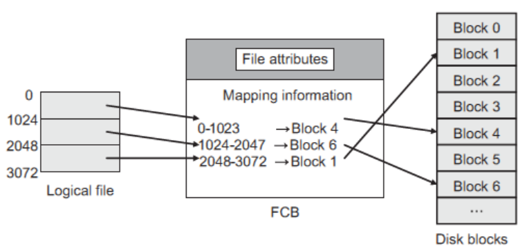
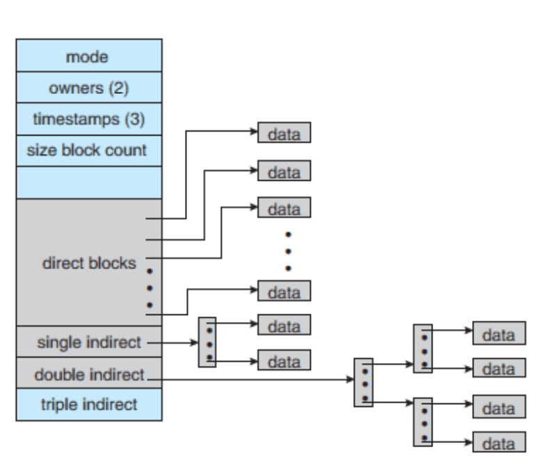

# File System

## File Concept 文件系统的概念

What are file system? 什么是文件系统

Everything is stored as files in a computer system. The files can be *data files* or *application files*

计算机系统中的一切都以文件形式存储。这些文件可以是*数据文件*，也可以是*应用文件*。

The operating system performs this management with the help of a program called **File System**.

操作系统借助一个名为 "文件系统 "的程序来进行管理。

- File System Interface: The user level (more visible) of the file system 文件系统界面：文件系统的用户级（更可视化）界面
  - Access methods 访问方式
  - Directory Structure 文件目录结构
  - Protection
  - File-System Mounting
  - File Sharing
- File System Implementation 文件系统实现
  - The OS level (Less visible) of the file system
  - Allocation and Free Space Management
  - Directory Implementation

### Attribute of a File 文件属性

A file is a named, *linear region of bytes that can grow and shrink*. 文件是一个已命名的*线性字节区域，可以增长和缩小*。

- name-人可以看懂的形式
- identifier-由文件系统特殊标识的标签
- type-需要系统支持
- location-指向文件位置
- size-文件大小
- protection-控制用户权限
- time，data and user identification-记录文件创建，最后编辑时间，最后使用时间等
- Position-当前下一次读/下一次写指针。(Only in memory)
- Usage-Open count 打开次数。 (Only in memory)

Actions that might be protected include: **read, write, execute, append, delete, list**

File systems break files down into two logical categories: 文件系统将文件分为两个逻辑类别:

- **Shareable** vs. **Unsharable** files **可共享**与**不可共享**文件

- **Variable** vs. **Static** files **可变**与**静态**文件

***Shareable files*** - can be accessed locally and by remote hosts;  可以被本地和远程主机访问;

***Unsharable files*** - only available locally.  仅本地可用。

***Variable files** -* can be changed at any time;  可随时更改;

***Static files*** - cannot be changed without an action from the system administrator (such as binaries) 如果没有系统管理员的操作(例如二进制文件)，则无法更改。

**Open File Table** - Since the open operation fetches the attributes of the file  to be opened, the OS uses a data structure known as open file table (OFT),  to keep the information of an opened file. 

**打开文件表** -由于打开操作获取要打开的文件的属性，操作系统使用称为打开文件表(OFT)的数据结构来保存打开文件的信息。

## Access Methods 访问方法

When it is used, the information must be accessed and read into computer memory. The information in the file can be accessed in several ways:

文件被使用时，信息必须被访问并读入计算机内存。文件中的信息可以通过几种方式获取：

- **Sequential access** 顺序访问

  模拟磁带操作，文件里的内容按顺序被以字节的形式访问

  - Data is accessed one record right after the last.

    访问数据时，一条记录紧接着一条记录。

  - Reads cause a pointer to be moved ahead by one.

    读取会使指针向前移动一位。

  - Writes allocate space for the record and move the pointer to the new *End Of File.*

    为记录分配空间，并将指针移至新的文件结尾。

  - Such a method is reasonable for tape.

    这种方法对于磁带是合理的。

- **Direct access** 直接访问

  直接跳转到相应记录然后读取

  - Method useful for disks.

    对磁盘有用的方法。

  - The file is viewed as a numbered sequence of blocks or records.

    文件被视为一串编号的数据块或记录。

  - There are no restrictions on which blocks are read/written in any order.

    对以任何顺序读取/写入的块没有限制。

- **Indexed access ** 下标访问

  使用多个下标，每个下标对应一个文件属性，通过这些索引筛选并搜索主文件中的记录

  - Uses multiple indexes

  - An index block says what's in each remaining block or contains pointers to blocks containing particular items.

  - Suppose a file contains many blocks of data arranged by name alphabetically

## Disk Structure - Storage Structure 磁盘结构-存储结构

A disk can be used in its **entirety** for a file system. 磁盘可以**完整地**用于文件系统。

A disk can be broken up into **multiple partitions**, **slices**, or **mini disks**, each can have its own filesystem.

磁盘可被分割成**多个分区、片**或**迷你磁盘**，每个分区都有自己的文件系统。

Disk/partition is partitioned into **Blocks** or **Sectors** 磁盘/分区划分为**块**或**扇区**

- Modern disks have 512-byte or more sectors 现代磁盘具有512 bytes或更多扇区
- File Systems usually work in block sizes of 4 KB 文件系统通常以4 KB的块大小工作

### Directory 目录结构

The directories are used to maintain the structure of a file system

目录用于维护文件系统的结构

Directories serve two purposes:

- For **User** – they provide a structured way to organize files;

  对于**用户** -他们提供了一种结构化的方式来组织文件;

- For the **File System** – they provide an *interface* that allows the implementation to separate logical file organization from physical file placement on the disk.

  对于**文件系统**，它们提供了一个*接口*，允许实现将逻辑文件组织与磁盘上的物理文件放置分开。

Operations Performed on  Directory 目录操作：

- search寻找目标文件
- create创建-OS必须能够使用空闲空间创建文件
- write写-通过写指针
- read读-通过读指针
- save保存-保存文件到磁盘上的空间空间
- reposition within file文件重定位
- delete删除
- truncate截断-删除文件内容但是保留属性
- open打开-在进程操作文件之前，文件必须被打开，以加载入内存
- close关闭-不需要的时候移出内存。

### Schemes of logical structure of a directory 目录的逻辑结构方案

#### Single-Level Directory 单级目录

root director, and all the files are stored only under it

单一目录，根目录下记录所有文件

#### Tow-Level Directory 双层目录

separate directories for each user 为每个用户单独设置目录

there are two levels: **master directory** and **user directory** 有两个级别:**主目录**和**用户目录**

为每个用户指定各自的目录，形成主目录和用户目录

#### Hierarchical / Tree-Structured Directories 分层/树状结构目录

Two types of paths:

- **absolute path** - the root and follows a path down to the specified file

  并沿着指定文件的路径向下运行

- **relative path** - defines a path from the current directory

  从当前目录定义一个路径

  分层目录，绝对路径absolute path和相对路径relative path

#### Acyclic-Graph Directories 非循环图目录

the directory structure must allow sharing of files or sub-directories.

文件目录支持对同一个文件的共享操作，既多个用户操作同一文件
文件被删除后仍然保留指向文件位置的悬挂指针

##### 依靠目录可以完成的操作：

1. 文件查找 2 文件创建 3. 删除文件 4. 建立目录 5. 重命名文件 6. 遍历文件系统。

## File-System Mounting 文件系统挂载

**Mounting** **= attaching portions of the file system into a directory structure.**

**装载**=将设备添加到用户设备上，如：插入U盘

- The directory where the device is attached, is known as a **mount point**.

  连接设备的目录称为挂载点。mounting point：附加设备的目录在原文件环境的附加位置，如：U盘在电脑文件目录的位置

- Similarly, **unmounting** is done to remove the device from the mount point.

  类似地，**unmount **是为了从挂载点移除设备。

Linux or UNIX OS - the user needs to mount all the devices or hard disk partitions explicitly

Linux或UNIX操作系统—用户需要显式挂载所有设备或硬盘分区

In **Windows**, the devices and/or partition can be accessed by opening *My Computer* on the desktop

在**Windows**中，可以通过在桌面上打开*我的电脑*来访问设备和/或分区

## File Sharing 文件分享

Sharing must be done through a **protection** scheme 共享必须通过**保护**方案进行

May use **networking** to allow file system access between systems 是否可以使用**网络**来允许系统之间的文件系统访问

- **Manually** via programs like **FTP** or **SSH**

  **手动**，通过**FTP**或**SSH**等程序

- **Automatically**, seamlessly using **distributed file systems**

  **自动**，无缝地使用**分布式文件系统**

- **Semi automatically** via the **world wide web**

  **半自动**通过**万维网**

**Client-server model** allows clients to mount *remote file systems* from servers

**客户端-服务器模式**允许客户端从服务器挂载远程文件系统

- Server can serve multiple clients

  服务器可以服务多个客户端

- Client and user-on-client identification is insecure or complicated

  客户机和用户对客户机的标识不安全或复杂

- **Network File System NFS** is standard *UNIX client-server file sharing* protocol

  **网络文件系统NFS**是标准的*UNIX客户机-服务器文件共享*协议

- **Common Internet File System CIFS** is standard *Windows* protocol

  **Common Internet File System CIFS**是标准的*Windows*协议

- Standard operating system file calls are translated into *remote calls*

  标准操作系统文件调用被转换为远程调用

**多用户分享**

在多用户系统中，使用访问权限access rights和同时访问管理the management of simultaneous access。
拥有者owner和组group的概念：其中user ID区分用户，group ID区分群组，各自有各自的权限范围。

**远程分享**

手动的FTP；半自动的world wide web；自动的分布式文件系统（distributed file systems）

**远程共享的问题**

可能会产生网络或服务器故障，导致文件系统需要应对的故障变多，复原信息时涉及到了每个远程请求的状态
无状态协议（如NFS）在每个请求中明文展示信息，安全性低，但可以轻松恢复文件

**Distributed Information Systems** implement unified access to information  needed for remote computing (LDAP, DNS, NIS, Active Directory).

**分布式信息系统**实现对远程计算所需信息的统一访问(LDAP、DNS、NIS、Active Directory)。

## Protection 保护

文件创建者应当设定**文件操作权限**和**用户访问权限**。保护机制通过限制可以进行的文件访问类型来提供受控访问。

### Access-Control List (ACL) 访问控制列表

记录了每个文件的有权限的用户名和每个用户允许的访问类型。
访问模式分为：读read, 写write, 运行execute(R, W, X)

- 写包括了打开，读取，编辑等一系列权限。

The classifications: 用户分类

a) **owner access** - the user who created the file is the owner.

**所有者访问** -创建文件的用户是文件的所有者。

b) **group access** - a set of users who are sharing the file and need similar access is a group, or work group.

**组访问** -共享文件并需要类似访问权限的一组用户是一个组，或工作组。

c) **public access / universe** - all other users in the system constitute the universe

**public access / universe**公共访问 - 系统中所有其他用户构成universe

Example 1:

The following is an access verification technique, listing several files and the access allowed for a single user. Identify the control technique used here and for each, explain the type of access allowed.

下面是一种访问验证技术，列出了几个文件和单个用户允许的访问。确定这里使用的控制技术，并解释每种技术允许的访问类型。

a. File_1 	  RX

b. File_12 	RWX

c. File_13 	RW

d. File_14 	X

solution:

This is an access control list.

a. File_1 	This user can Read and Execute File 1.

b. File_12 	This user can Read, Write, and Execute File 12 .

c. File_13 	This user can Read and Write File 13.

d. File_14 	This user can only Execute File 14 but cannot Read,  Write the file

Example 2:

A leader of a group on a project wants Alice, Bob and Eve to be able to **read** and **write**, but **not delete data** on the project directory. Peter and John may be allowed **only to read the files** under the project directory. 

Besides this, the project leader should have **all access rights**. The mapping of every type of user in the project with their access rights is as depicted as follows:

在一个项目中，一个小组的领导希望Alice, Bob和Eve能够**读**和**写**，但**不能删除项目目录上的**数据。可能只允许Peter和John读取项目目录下的文件。

除此之外，项目负责人应该有**所有的访问权限**。项目中各类用户与其访问权限的映射关系如下所示:

| Type of User       | Permission     |
| ------------------ | -------------- |
| Alice, Bob and Eve | Read and Write |
| Peter and John     | Read Only      |
| Project leader     | All            |

Example 3:

Alice can read and write to the file **X**, can read the file **Y**, and can execute  the file **Z**. 

**Bob** can read X, can read and write to **Y**, and cannot access **Z**. Write a set of *Access Control Lists* for this situation. Which list is associated  with which file?

Alice 可以读写文件 **X**，可以读取文件 **Y**，可以执行文件 **Z**。

**Bob**可以读取 X，可以读取和写入**Y**，但不能访问**Z**。针对这种情况编写一组*访问控制列表*。哪个列表与哪个文件相关？

solution:

ACL for:

X = (Alice, read/write), (Bob, read)

Y = (Alice, read), (Bob, read/write)

Z = (Alice, execute), (Bob, -----)

## File System Implementation 文件系统实现

### Layered File System 分层式文件系统

文件系统需要包含**磁盘上的存储**和**内存内**的访问

**On Disk Structure:**

在磁盘上，文件系统可能包含有关如何启动存储在其中的操作系统、块总数、空闲块的数量和位置、目录结构以及单个文件的信息。

1. Boot control block：引导控制块，位于每个卷的第一块，负责引导操作系统所需要的核心
2. File Control Block：文件控制块，包含文件的信息，如大小，所有者，访问权限，创建日期等。
3. Volume control block：卷控制块，包含卷的信息，如分区块数，块大小，空闲块数量等。
4. Free list：记录未被分配的块
5. Files and directories structure: 存储文件名和关联的文件名

File mapping through **FCB (File Control Block)**

The file system uses the **logical position** in a file **stored by the FCB** to **map** it **to a physical location on the disk**

文件系统使用FCB存储的文件**中的**逻辑位置**将**文件**映射到磁盘**上的物理位置

The FCB contains a list of blocks of a file and their corresponding disk block addresses

FCB包含一个文件的块列表和它们对应的磁盘块地址

To retrieve the data at some position in a file, the file system first translates the logical position to a physical location in the disk.

为了检索文件中某个位置的数据，文件系统首先将逻辑位置转换为磁盘中的物理位置。

**In Memory Structure**

1. mount table：安装表，包含文件系统安装指针，文件系统类型等。
2. Directory (structure cache): 保存着最近访问的目录的信息
3. system-wide open-file table **SOFT**：打开文件表，记录每个已打开文件的FCB副本
4. per-process open-file table **POFT**：打开文件表，记录被进程打开的文件信息，每个条目还指向SOFT
5. Buffers：缓存，保存访问过的目录信息

### Directory Implementation in OS

A file system uses directory to provide a way to name and organize multiple files. Directory implementation in the operating system can be done as:

文件系统使用目录来命名和组织多个文件。目录在操作系统中的实现方式有以下几种：

**Linear list** - all the files in a directory are maintained as singly lined list. Each file contains the pointers to the data blocks which are assigned to it and the next file in the directory

**线性列表** -在一个目录中的所有文件被维护为单行列表。每个文件都包含指向分配给它的数据块的指针和目录中的下一个文件 (Simple to program)

**Hash Table** – the hash table takes a value computed from the file name and returns a pointer to the file name in the linear list.

**哈希表** -哈希表从文件名计算一个值，并返回一个指向线性列表中的文件名的指针。(greatly decrease the directory search time)

## Allocation Method

### Contiguous Allocation 连续分配

文件会被分配给**连续**的块
优点：简单，可顺序，可随机
缺点：得找合适的空闲区域，浪费空间，文件不能增长，产生外部碎片external fragmentation，

解决方法:

1. compaction off-line(downtime) ：用一个额外盘转移全部文件清理碎片
2. on-line：本地移动文件清理碎片

###  Linked Allocation 链式分配

文件被分配给分散的块，块与块之间以**链表**形式相连。
优点：简单，没有碎片，文件可以轻松拓展
缺点：存放指针占空间，只针对sequential access file有更高的效率，如果针对random access则需要每次查找新地址的都是都从起始点开始

解决：

1. 将块聚合成簇（cluster）减少指针数量
2. 采用文件分配表File Allocation Table, FAT：将链表间关系存储为一维链表，放在簇的开头。
   File Allocation Table: FAT, used by MS-DOS operating system is a variation of linked allocation, where all the links are stored in a separate table at the beginning of the disk.

Example:

The **File Allocation Table**, **FAT**

\- used by MS-DOS operating system 

动态存储分配问题

\- all the links are stored in a separate table at the beginning of the disk

所有的链接都存储在磁盘开头的一个单独的表中

### Indexed Allocation 索引式分配

Each file has its own index block(s) of pointers to its data block

每个文件都有指向其数据块的指针索引块

Brings all pointers together into the **index block**.

将所有指针汇集到索引块中。

Need **index table** 需要**索引表**

**Random access** 随机访问

**Dynamic access**  动态访问

相比于FAT更灵活，把每个文件分散给分散的块，文件系统指向的索引块记录了所有这些分散块的索引和顺序
索引块index block的实现：通过链表（一个索引块连一个索引块），通过多层（第一个索引块连多个索引块）
优点：支持顺序，随机访问，文件大小可变，没有碎片
缺点：小文件也会占据一个完整的块作为索引块，小文件数量多时浪费空间

### Unix Inode (Combined Scheme)

Unix uses an indexed allocation structure.

Unix使用索引分配结构。

- An **inode** (indexed node) stores both the attributes (infos) and the pointers to disk blocks

  inode(索引节点)存储属性(信息)和指向磁盘块的指针

- The **index block** in the file’s inode contains **15 pointers** as follows:

  文件索引中的索引块包含15个指针，如下所示ç

  - 12 **direct blocks** - that point directly to blocks

    12 **直接块** -直接指向块

  - 1 **indirect block** - points to indirect blocks; each indirect block contains pointers that point directly to blocks

    1 **间接块** -指向间接块;每个间接块都包含直接指向块的指针

  - 1 **double indirect block** - that points to doubly indirect blocks, which are blocks that have pointers that point to additional indirect blocks

    1 **双间接块** -指向双间接块，这些块具有指向其他间接块的指针

  - 1 **triple indirect block** – etc.

    1 **三间接块** -等。

  

## Free-Space Management 空闲空间管理

使用空闲空间列表free-space list 记录可用块，五种方法

1. bit vector：1表示块可用，0表示块已用
2. Linked List：用链表链接所有空闲块
3. Grouping：在第一个空闲块内存储其余空闲块索引
4. Counting：记录每一个空闲块之后连续空闲块数量
5. Space Maps：建立位图，块的使用状态改变时修改位图。
