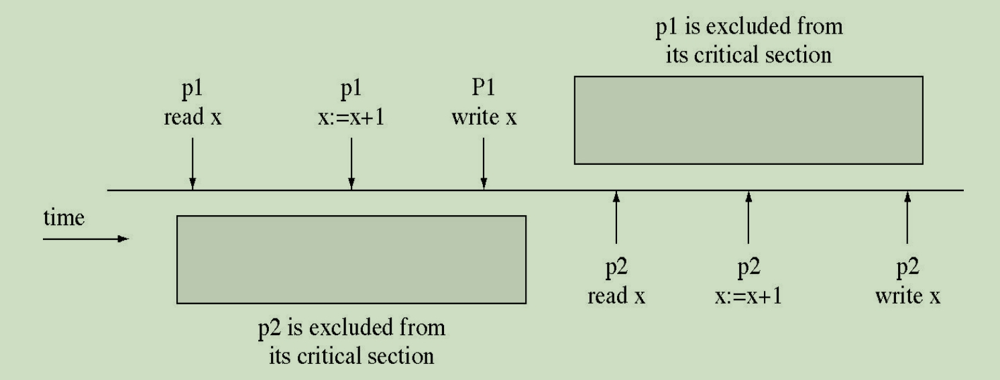
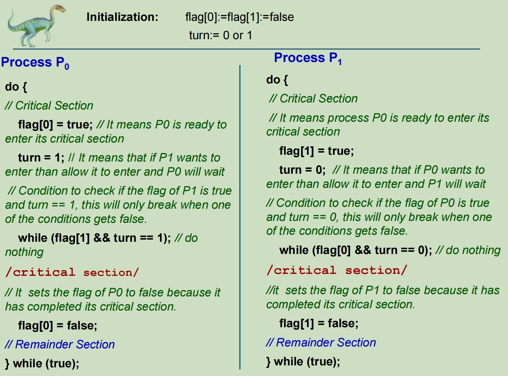
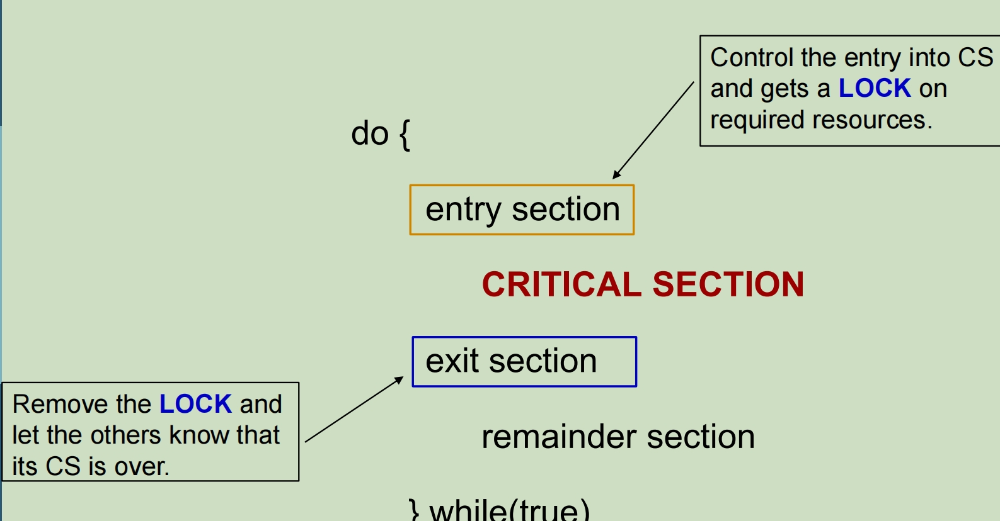
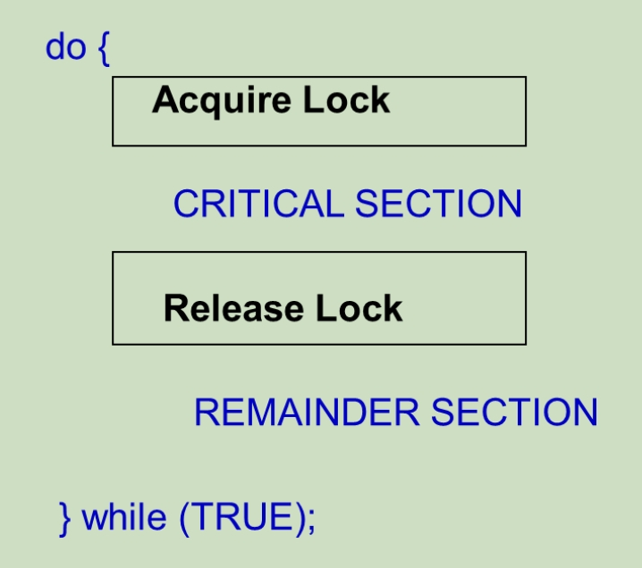
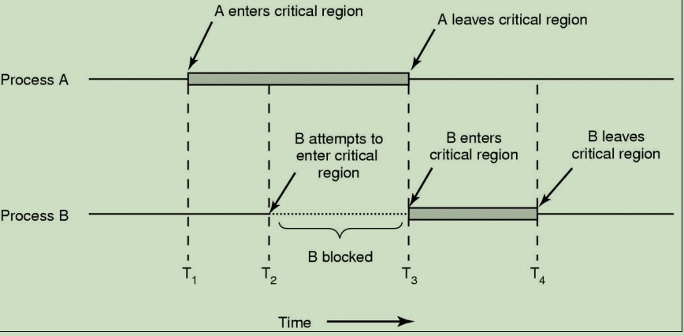
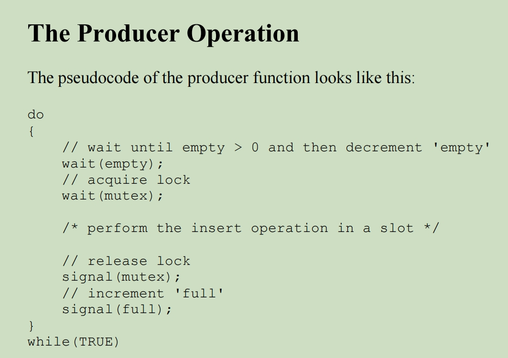
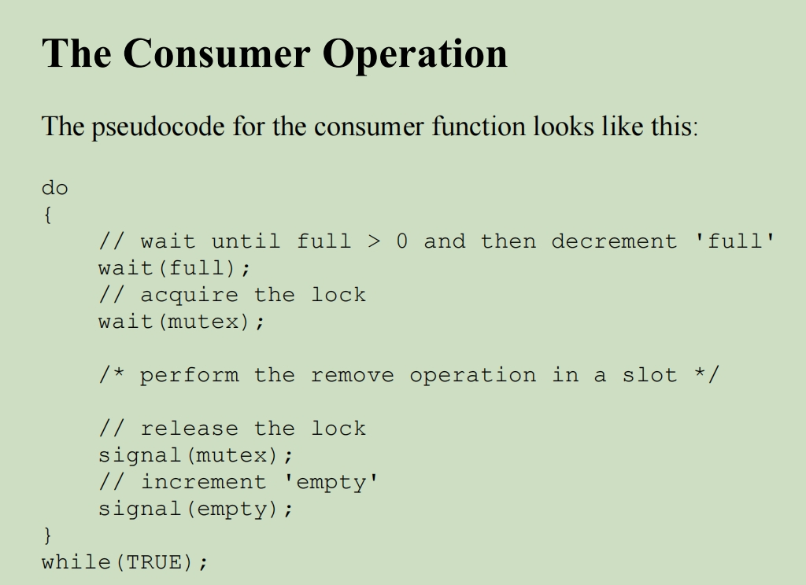
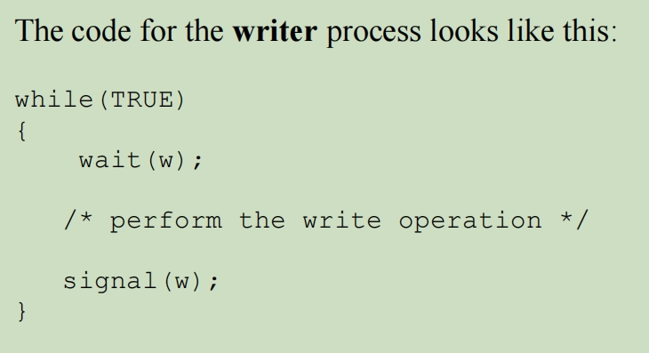
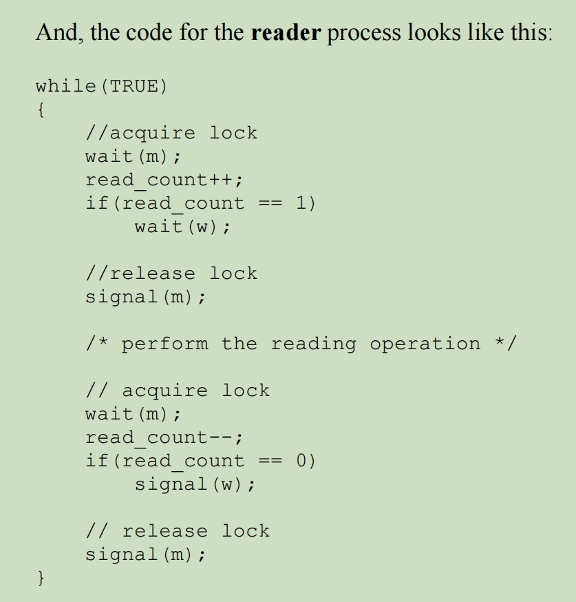
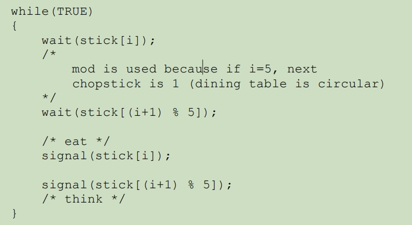

# Process Synchronization 进程同步

## Background

PS is the task of coordinating the execution of processes in a way that no two processes can have access to the same shared data and resources, at one time.

PS 的任务是协调进程的执行，使两个进程无法同时访问相同的共享数据和资源。

*n* processes all competing to use some shared resource.

*n* 个进程都争用某些共享资源。

### Concurrent Processing 并发进程

**Concurrent access** to shared data may result in data inconsistency.

**对共享数据的并发访问**可能会导致数据不一致。

Maintaining data consistency requires mechanisms to ensure the **orderly execution of cooperating processes**.

保持数据一致性需要机制来保证**合作流程的有序执行**。

**Race condition**: The situation where several processes access and manipulate shared data concurrently. 

The final value of the shared data depends upon which process finishes last.

**争用条件**：多个进程同时访问和操作共享数据的情况。共享数据的最终值取决于最后完成的进程。

To prevent **race conditions**, concurrent processes must be **synchronized**

为了防止**争用条件**，必须**同步**并发进程

## The Critical Section Problem 临界区(CS)问题

**Critical Sections are sequences of code that cannot be interleaved among multiple threads/processes.**

**临界区是不能在多个线程/进程之间交错的代码串行**。

Each (concurrent) thread/process has a code segment, called **Critical Section (CS)**, in which the shared data is accessed.

每个（并发）线程/进程都有一个代码段，称为“**关键部分 （CS）**”，用于访问共享数据。

进程冲突的案例

p1结果: 2

p2结果: 2

进程不冲突的案例

p1结果: 2

p2结果: 3

Avoid/ forbid / deny execution in parallel inside critical section, even we lose some efficiency, but we gain correctness.

避免/禁止/拒绝在关键部分内并行执行，即使我们失去了一些效率，但我们获得了正确性。

**临界区（Critical Section ）**:

临界区即是会访问共享资源的代码区（改变共同变量，读写文件等），我们需要控制程序进入这段代码的时机。
· 进入区：控制进入临界区
· 临界区：这之内的代码会访问共享资源
· 退出区：告诉其他进程该进程退出了邻接区

共享的对象：

· 可以从堆中动态分配
· 可以在全局变量中声明static而静态分配
· 当多线程访问共享对象：

如果对象是动态分配的，则每个线程都需要一个指向它的指针
如果对象是静态的，线程只需要通过全局变量名引用它，编译器会计算相应的地址

### 临界区的三个原则

1. 互斥（mutual exclusion）：如果已有进程在临界区执行，其他进程不能在其临界区执行。这里讲的都是写入进程。
2. 推进（progress）：如果没有进程在临界区，其他进程应该被允许进入临界区。
3. 有限等待（bounded waiting）：进程做出进入临界区请求后，其他进程进入临界区的次数是有上限的，进程发出请求后等待允许的时间有限

处理临界区的两种内核:

1. 抢占式（preemptive kernel）：允许进程在内核模式下运行时被抢占。
2. 非抢占式（non-preemptive kernel）：进程在内核模式运行时不会被抢占。不会产生竞争。

## 三种解决方式

1. **Software: Use algorithms**

   - **Peterson’s solution**

     

     Example:

     

     维护 int turn 和 boolean flag[2]
     turn表示下一张门票；flag表明现在谁在内

     

     这一次要进去之前把自己flag设为true表示我要进去，然后把下一次进去的机会turn留给对面，对面flag是true则自己不被允许进入临界区，只有这次机会在自己这里并且对面flag为false自己才能进去。

     具体的操作过程:

     两个函数如何做到互斥访问的呢，首先在entry_section，当进程0进入的时候，首先将flag[0]设置成true代表进程0想要进入临界区，然后再将turn设置成1代表进程0接受让进程1先进入进程，然后进行进程0的while判断，此时flag[1]为false，turn为1，不满足and判断，因此进程0进入critical section去执行，当进程0的时间片结束之后，将会跳转到进程1。此时flag[1]被设置为true，turn被设置为0表示进程1也允许进程0在自己之前执行。然后进入进程1的while判断，此时进程0还没有执行完critical section，因此flag[0]依然为true，turn为0，满足while循环的判断，因此进程1将不会进入critical section而是一直进行while循环等待直到自己的时间片结束。此时再跳转回进程0，假设在该时间片中进程0的critical section执行完毕，则会最终设置flag[0]为false，然后时间片结束再跳转回进程1。此时由于flag[0]为false，while循环已经不再满足，因此进程1跳出循环，也可以去执行critical section。然后在执行完critical section之后将flag[1]设置为false。当flag[0]和flag[1]都为false的时候，代表两者都已经执行完毕。

     
     
     自己出来临界区后把自己flag设为false表示自己出来了，这样对面就可以进入临界区。
     
     NEED BOTH the **turn** and **flag[2]** to guarantee *Mutual Exclusion, Bounded*, *waiting*, and *Progress*.
     
     Peterson算法可以确保:
     
     ​	不会让两个进程同时进入临界区
     
     ​	不会让进程进入死循环
     
     ​	不会让进程都饿死在临界区外，即保证每个进程都可以进入临界区
     
     Busy-waiting: 在这个案例中，线程进入while循环持续判断是否满足条件的过程就是忙等；
     
     忙等是一种线程或进程在无法继续执行自己的任务时，持续占用 CPU 时间片进行轮询检查某个条件是否满足的行为。在忙等期间，线程会在一个循环中不断地检查条件，直到条件满足为止，然后才继续执行后续操作。

2. **Hardware: use specific machine instructions for "locking"**

   

   - Single-processor environment 单处理器环境

     

     临界区有全局变量lock，只有lock为F时才进入，进入时检查是否为F，申请到了后置为T，退出时置为F

     initially: lock value is set to 0

     ​	Lock value = 0 means the critical section is currently vacant and no process is present inside it

     ​	锁定值 = 0 表示critical section当前为空，并且其中不存在任何进程

     ​	Lock value = 1 means the critical section is currently occupied and a process is present inside it.

     ​	锁定值 = 1 表示critical section当前被占用，并且其中存在进程。

   - Multi-processor Environment 多处理器环境

     

     全局变量lock，只有lock为0时才进入，申请成功后交换（0,1）状态，退出时置为0，适用于多处理器环境。

     \- a **global variable** **lock** is initialized to **0**.

     **全局变量** **lock** 初始化为 **0**。

     \- the only Pi that can enter CS is the one which finds **lock = 0**

     唯一可以输入 CS 的 进程i 是找到 **lock = 0** 的 进程i

     \- this Pi excludes all other Pj by setting **lock to 1**.

     这个 Pi 通过将 **lock 设置为 1** 来排除所有其他 Pj。

   **Advantages** 好处:

   Applicable to any number of processes on either a single processor or multiple processors sharing main memory

   Simple and easy to verify

   It can be used to support multiple critical sections; each critical section can be defined by its own variable

   **Disadvantages** 坏处:

   **Busy-waiting** is when a process is waiting for access to a critical section it continues to consume processor time.

   **Starvation** is possible when a process executes its critical section, and more than one process is waiting for a long time.

   **Deadlock** is the *permanent* blocking of a set of processes waiting an event (the freeing up of CS) that can only be triggered by another blocked process in the set.

   **优势**：

   适用于单个处理器或共享主内存的多个处理器上的任意数量的进程

   简单易验证

   它可用于支持多个关键部分;每个关键部分都可以由其自己的变量定义

   **劣势**：

   **繁忙等待**是指当进程等待访问关键部分时，它继续消耗处理器时间。

   **饥饿**当一个进程执行其关键部分，并且多个进程等待很长时间时，可能会出现饥饿。

   **死锁**是对等待事件（释放 CS）的一组进程的*永久*阻塞，该事件只能由集合中的另一个阻塞进程触发。

   **额外**：为什么**spinlock(自旋锁)**不适用于单处理器环境，但是更适合多处理器环境：

   在单处理器系统中，当一个线程在尝试获取自旋锁时，如果锁已经被其他线程持有，那么这个线程会进入一个忙等待（busy-waiting）的状态，即它会一直在一个循环中尝试获取锁，不断地检查锁的状态。在这种情况下，由于系统只有一个处理器核心，所以即使线程在忙等待，其他线程也无法运行，因此整个系统的性能可能会下降。此外，由于自旋锁不会引起线程的上下文切换，因此没有机会让其他线程运行；然而，在多处理器系统中，自旋锁的情况就有所不同了。当一个线程在尝试获取自旋锁时，如果锁已经被其他线程持有，这个线程会在自旋的同时，通知操作系统放弃 CPU 控制权，这样其他线程就有机会运行了。因为系统中有多个处理器核心，所以其他线程可以在另一个处理器上执行，而不会受到自旋线程的阻塞。

3. **Operating System and Programming Language solution**: provide specific functions and data structures for programming to use synchronization

   操作系统和编程语言解决方案：提供特定的函数和数据结构，以便编程使用同步

   ▪ A mutex is a **programming flag** used to grab and release an object.

   互斥锁是用于抓取和释放对象的**编程标志**。

   ▪ When **data processing** is started that **cannot be performed simultaneously** elsewhere in the system, **the mutex is set to lock** which **blocks other attempts to use it**.

   当**数据处理**启动时，**无法同时执行**在系统的其他位置**，**互斥锁**设置为锁定**，**阻止其他尝试使用它**。

   ▪ The mutex is set to **unlock** when the data are no longer needed, or the routine is finished.

   当不再需要数据或例程完成时，互斥锁设置为**解锁**。

   **· 核层面实现互斥**时，会发生中断，导致上下文切换。为了减小中断可能对数据造成的损害，尽可能做完原语再中断，原语既完成一个数据操作的最小代码。

   **· 软件层面互斥，进程处于运行状态，需要忙等或产生自旋锁busy-wait mechanism or spinlock，既一直在循环检查是否被允许。**

   进程在进入前需要申请锁，退出临界区需要释放锁。

   - Mutex Locks/Exclusion 互斥锁/排除

   - This type of 

     

     

## Semaphores 信号量

is a technique to manage concurrent processes by using a simple non-negative integer value and shared between threads / processes.

是一种通过使用简单的非负整数值并在线程/进程之间共享并发进程的技术。

Only **three** atomic **operations** may be performed on a semaphore: **initialize**, **decrement**, and **increment**.

只能对信号量执行**三个**原子操作：**初始化**、**递减**和**递增**。

➢ the decrement operation may result in the blocking of a process, and

递减操作可能会导致进程阻塞，并且

➢ the increment operation may result in the unblocking of a process.

增量操作可能会导致进程解除阻止。

信号量 S 可以是个int形非负变量，被线程间共享，与之相关两原子操作：

1. wait（）
   信号量小于等于0就忙等，大于0就减一，代表申请到了锁。
2. signal（）
   信号量加1，代表锁被释放

For **n** processes **Initialize** semaphore **S** to **1**. Then only one process is allowed into CS (mutual exclusion).To allow **k** processes into CS at a time, simply initialize mutex to **k**

对于 **n** 进程 将信号量 **S** 初始化为 **1**。然后只允许一个进程进入 CS（互斥）。要允许 **k**个进程一次进入 CS，只需将互斥锁的信号量**s**初始化为 **k**

两种信号量:

### 计数信号量 COUNTING SEMAPHORE

信号量S被初始化为可用资源的数量，函数wait（）和signal（）定义不变，S代表着当时剩余的可用资源的数量。

The **semaphore S** is initialized to **the number of available resources.**

**信号量 S** 初始化为可用资源的数量。

Each process that uses a resource, it performs a **WAIT()** operation on the semaphore (thereby **decrementing the number of available resources**).

每个使用资源的进程，它都会对信号量执行 **WAIT（）** 操作（从而减少可用资源的数量）。

When a process releases a resource, it performs a **SIGNAL()** operation (**incrementing the number of available resources**).

当进程释放资源时，它会执行 **SIGNAL（）** 操作（**递增可用资源的数量**）。

When **the count for the semaphore goes to 0**, **all resources are being used**. After that, processes that wish to use a resource will be block until the count becomes greater than 0.

当信号量计数变为 0 时，表示所有资源都在使用中。之后，希望使用资源的进程将被阻止，直到计数大于 0。

### 二进制信号量 BINARY SEMAPHORE

也被称为互斥锁Mutex，值只有1和0，初始化为1，函数wait（）和signal（）分别在值为1和0的情况下被合法调用。

A binary semaphore may be **initialized** to **1**.

二进制信号量可以 **初始化** 为 **1**。

The **WAIT()** operation (**decrementing**) checks the semaphore value.

​		▪ If the value is **0**, then the process executing the **wait()** is **blocked**.

​		▪ If the value is **1**, then the value is changed to 0 and the process **continues** execution.

​		**WAIT（）** 操作 （**递减**） 检查信号量值。

The **SIGNAL()** operation (**incrementing**) checks to see if any processes are blocked on this semaphore (semaphore value equals 0).

​		▪ If so, then a process blocked by a **signal()** operation is **unblocked**.

​		▪ If no processes are blocked, then the value of the semaphore is set to **1**.

​		**SIGNAL（）** 操作 （**递增**） 检查此信号量上是否有任何进程被阻塞（信号量值等于 0）。

### **Mutex vs. Binary semaphore** 互斥锁和二进制信号量的区别

A **key difference** between the a **mutex** and a **binary semaphore** is that the process that locks the mutex (sets the value to **zero**) must be the one to unlock it (sets the value to **1**). In contrast, it is possible for one process to lock a binary semaphore and for another to unlock it. *(example* *in the tutorial)*

**互斥锁**和**二进制信号量**之间的**主要区别**是锁定互斥锁（将值设置为**零**）的进程必须是解锁互斥锁的进程（将值设置为**1**）。相反，一个进程可以锁定二进制信号量，而另一个进程可以解锁它.

### Some issues in semaphore 信号量存在的一些问题

· **死锁Deadlock**: 既**每个**进程都持有一定的资源，又希望获得正在被其他进程占有的资源，这样每个进程都得不到完整资源。

· **饥饿Starvation**: 既进程始终得不到它想要获得的资源。 

## Classical Problems of Synchronization

### The Bounded-Buffer / Producer-Consumer Problem 有限缓冲问题

存在一个公共且有限的缓冲空间，使用这些的进程被分为生产者和消费者，生产者只有在缓冲未满时生产，消费者只有在缓冲非空时消费，解决方案：

1. 信号量mutex=1保证对缓冲池的访问是互斥的
2. empty=n 表示空闲缓冲区的信号量
3. full=0 表示已使用缓冲区的信号量

• m, a **binary semaphore** which is used to acquire and release the lock.

m是一个**二进制信号量**，用于获取和释放锁。

• empty, a **counting semaphore** whose initial value is the number of slots in the buffer, since, initially all slots are empty.

empty是一个**计数信号量**，其初始值是缓冲区中的插槽数，因为最初所有插槽都是空的。

• full, a **counting semaphore** whose initial value is 0.

full是初始值为 0 的 **计数信号量**。

### The Readers-Writers Problem 读者-写者问题

对于一个公共资源，使用资源的进程被分为读者和写者，分别只读，只写。对于这些读者没有太多限制。要避免同一时间有多名写者访问和写者和读者都在访问的情况。要求：

· 一个写者在访问时，其他写者和读者要被阻塞

· 允许多个读者在同时访问，但此时写者全部阻塞

解决方案：

readcount=0 表示读者数量。

mutex=1 保证更新readcount时互斥，修改读者数量时的互斥

wrt=1 作为写者获得请求的信号量，读者和写者共用，确保读者和写者互斥，没有读者时=0

Here, we use one **mutex** m and a **semaphore** w. An integer variable **read_count** is used to maintain the number of readers currently accessing the resource.  

在这里，我们使用一个 **mutex** m 和一个 **semaphore** w。整数变量 **read_count** 用于维护当前访问资源的读取器数。

The variable **read_count** is initialized to **0**. A value of **1** is given initially to **m** and **w**. 

变量 **read_count** 初始化为 **0**。值 **1** 最初分配给 **m** 和 **w**。

Instead of having the process to acquire lock on the shared resource, we use the mutex m to make the process to acquire and release lock whenever it is updating the **read_count** variable. 

我们没有让进程在共享资源上获取锁，而是使用互斥锁 m 使进程在更新 **read_count** 变量时获取和释放锁。

### The Dining-Philosophers Problem 哲学家进餐问题

5个人坐一圈，人与人之间放一只筷子，人要么思考要么吃饭。吃饭前需要依次拿起左手与右手的筷子，思考时放下筷子。

死锁问题：所有人都在思考，然后同一时刻吃饭，所有人拿起左手的筷子后都在请求右手的筷子，产生死锁。解决方案：

最多允许四个人坐下

一次只允许一个左右手都有筷子的哲学家拿起两只筷子。

奇数位置的人先拿左手，再拿右手；偶数位置的人先拿右手，再拿左手。

An array of five semaphores, **stick[5]**, for each of the five chopsticks.

(i+1) % 5可以得到此人旁边的筷子，例如i=1可以得到2

