# 4-CPU Schedule CPU调度

程序由CPU执行（CPU execution）和I/O等待（I/O wait）组成。从CPU执行开始在上述运行状态间进行切换。程序据此也可被分成CPU繁忙型和I/O等待型

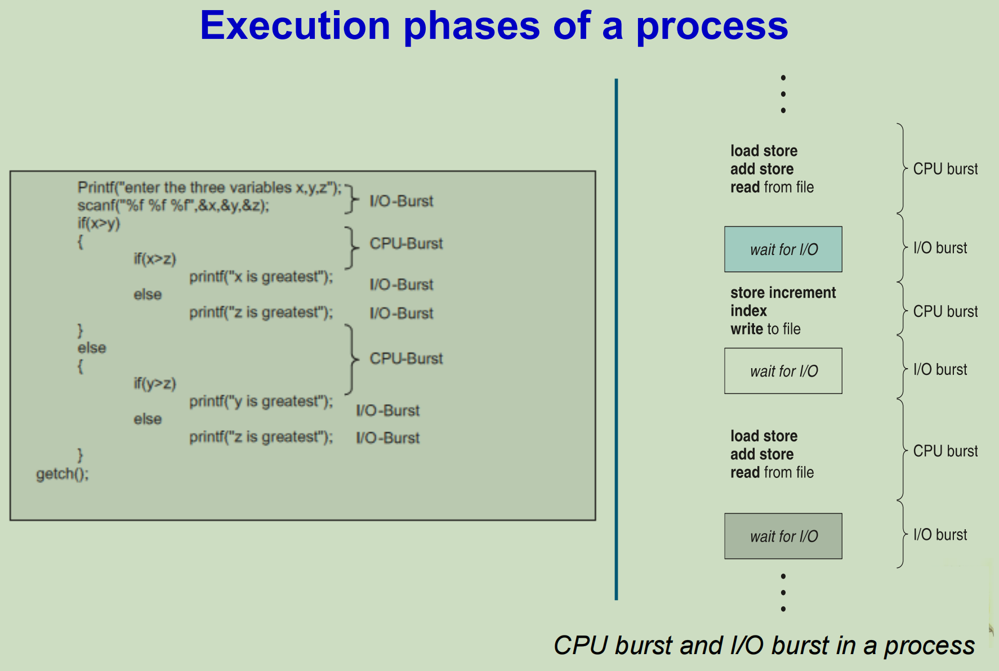

The (CPU) **scheduler** is the mechanism to select which process has to be executed next and allocates the CPU to that process. Schedulers are responsible for transferring a process from one state to the other

(CPU) 调度程序是一种机制，用于选择接下来必须执行哪个进程并将 CPU 分配给该进程。
调度程序负责将进程从一种状态转移到另一种状态。

## Basic Concept 基本概念

The aim of processor scheduling is to assign processes to be executed by the processor or processors over time

处理器调度的目的是分配处理器或处理器随时间推移要执行的进程

- **Long-Term Scheduler** is performed when a new process is created. This is a decision whether to add a new process to the set of processes that are currently active.

  **Long-Term Scheduler** 在<u>创建新进程</u>时执行。决定是否将新进程添加到当前处于活动状态的进程集。

- **Short-Term Scheduler** is the actual decision of which ready process to execute next.

  **Short-Term Scheduler** 是下一步要执行哪个就绪进程的实际决策。即转系统决定分配CPU给哪个进程

- **Medium-Term Scheduler** is a part of the swapping function. This is a decision whether to add a process to those that are at least partially in main memory and therefore available for execution.

  **Medium-Term Scheduler** 是交换功能的一部分。这决定是否将进程添加到位于主内存中的最后部分并因此可用于执行的进程。

  
  
  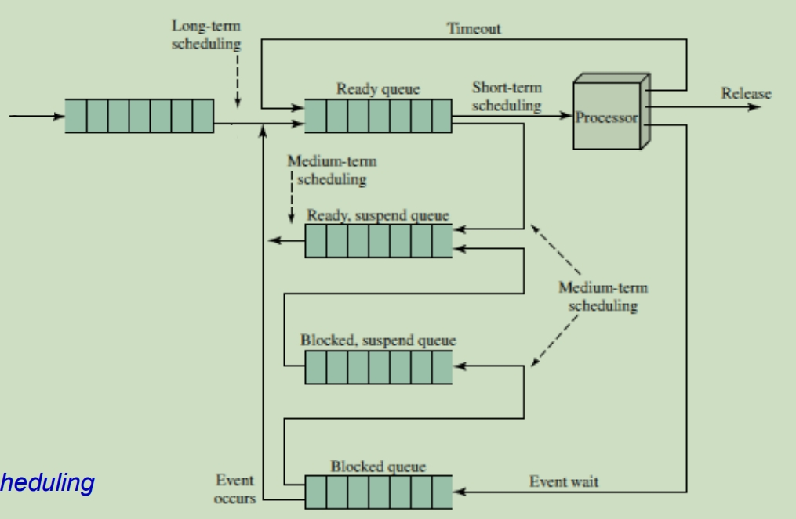

The ***ready list***, also known as a **ready queue**, in the operating system keeps a list of *all processes that are ready to run and not blocked on input/output or another blocking system request.*

操作系统中的就绪列表（也称为就绪队列）保留*所有已准备好运行且未在输入/输出或其他阻塞系统请求时被阻止的进程的列表。*

The entries in this list are pointers to a **Process Control Block**, which stores all information and state about a process.

此列表中的条目是指向**PCB**的指针，PCB存储有关进程的所有信息和状态。

## Scheduler & Dispatcher 

▪ **Schedulers** are special system software that handles process scheduling in various ways.

**调度程序**是以各种方式处理进程调度的特殊系统软件。

▪ **Dispatcher** is a module of the operating system that removes process from the ready queue and sends it to the CPU to complete.

**Dispatcher**是操作系统的一个模块，它将进程从就绪队列中移除并发送给CPU完成。

Scheduler select the next process to run; Dispatcher takes the selected process to running state(CPU running)

调度进程选择要运行的下一个进程;Dispatcher 将所选进程带入运行状态（CPU 正在运行）

### CPU Scheduling Policies CPU 调度策略

#### PREEMPTIVE SCHEDULING 抢占式

正在运行的进程会被打断，然后下一个高优先级的进程会进入。被打断的程序会返回准备队列，等待未来的重新调用

#### NON-PREEMPTIVE SCHEDULING 非抢占式

正在运行的进程不会被打断，下个进程需要等待这个进程完成CPU周期。

当前运行的进程会一直占用CPU直到它主动放弃使用。

调度发生在四种情况下：

1. 进程从运行转为就绪（因为中断）
2. 从运行转为等待（因为I/O请求或wait（）等待）
3. 从等待转为就绪（IO完成）
4. 终止进程
   其中2和4是非抢占的，1和3是抢占的。

### Dispatcher Module 分派程序模块

gives control of the CPU to the process selected by the short-term scheduler; this involves:

将 CPU 的控制权交给**短期调度程序**选择的进程;这包括：

– switching context 交换上下文

– switching to user mode 转换用户模式

– jumping to the proper location in the user program to restart that program  

跳转到用户程序中的正确位置以重新启动该程序

Dispatcher latency：分派程序会产生延迟。

### Scheduling Criteria 调度准则


Arrival Time 进程到达时间: 进程到达就绪队列的时间

Completion TIme 进程完成时间: 进程运行完毕结束的时间点

Burst Time区间时间: 进程完整运行完需要花费的时间

Turnaround Time 周转时间： 从进程提交到进程完成的时间段称为周转时间。周转时间为所有时间段之和，包括等待进入内存、在就绪队列中等待、在CPU上执行和I/O执行。周转时间 = 等待时间+执行时间 = 结束时间 - 进入队列时间。

Waiting Time 等待时间： 等待时间为在就绪队列中等待所花费时间之和。

Response Time 响应时间： 对于交互系统，周转时间并不是最佳准则。从提交请求到产生第一响应的时间，称为响应时间


期望一个合理的调度算法应该尽可能拥有：

最大CPU效率 Max CPU utilization

最大吞吐量 Max Throughput

最小周转时间 Min Turnaround time–进程提交到进程完成的时间之和

最小等待时间 Min Waiting time–在就绪队列中等待的时间，不包括运行时间

最小响应时间 Min Response time–提交请求到产生第一个响应的时间

## Estimating Future CPU Burst Time 估计未来的 CPU 区间时间

通过过去区间时间的平均长度来预估接下来的进程的区间时间

next = average of all past burst


通常a被设置为1/2；

如果a=0，则代表最近的历史都没有影响；如果a=1则代表最近的CPU事务影响很大

**Advantage**: Processes with short CPU bursts are given priority and hence run quickly (are scheduled frequently).

具有短 CPU 占用时间的进程被赋予优先级，因此运行速度很快（经常调度）。

**Disadvantages**: Long-burst (CPU-intensive) processes are hurt with a long mean waiting time. In fact, if short-burst processes are always available to run, the long-burst ones may never get scheduled. 

The situation where a process never gets scheduled to run is called **starvation**.

长时间占用（CPU 密集型）进程会因平均等待时间长而受到伤害。事实上，如果短突发进程始终可以运行，那幺长突发进程可能永远不会被安排。进程从未被安排运行的情况称为**饥饿**。

# Scheduling Algorithms CPU调度算法 !!!

## 计算公式 !!!!!!!!!!!!!!!

**Each Process's <u>Waiting Time</u> = Each Process's Turnaround time - Burst Time**

**Each Process's <u>Trunaround Time</u> = Each Process's CompletionTime - Each Process's Arrival Time**

等待时间 = 终止时间 - 到达时间 - 持续时间

## First-Come, First-Served(FCFS) Scheduling 先到先服务

FCFS属于**非抢占式**算法，当前正在运行的进程无法被其他进程随意终止

对于就绪队列，先到先服务可以利用FIFO队列简单实现

将准备好的进程从队尾放入就绪队列，CPU首先分配给就绪队列头部的进程(先进先出)


**FCFS弊端：** 采用FCFS的平均等待时间较长。当执行一个大进程时，所有的进程都要等待大进程释放CPU，称为护航效果(convoy effect)，这样会导致CPU和设备的使用率变得很低。

## Shortest Job First (SJF) 短作业优先

PPT里说该算法能够得出给定进程的**最短等待时间**

SJF将每个进程与其下一个CPU区间段相关联。当CPU空闲时，他会赋给具有最短CPU区间的进程。如果两个进程具有同样长度，那么可以使用FCFS调度来处理。

SJF是特殊的Priority Scheduling

SJF特点：

- SJF调度算法的**平均等待时间是最小的**，同时系统的吞吐量也增大了。

- **有利于短进程**，不利于长进程，长进程可能导致饥饿(又叫做无穷阻塞，指可以运行但缺乏CPU的进程)。

- SJF真正的困难在于很难知道下一个CPU区间的长度，所以它很难实现。

- 使用近似算法实现的SJF经常用于**长期调度**

### 抢占式SJF AKA Shortest-Remaining-Time-First


如果新进程到达的突发时间比当前进程的剩余时间短，则安排新进程

- P1进程先到，因为此时队列中只有P1因此先运行2秒

- 第二秒时，P2进程送达，因为P2的区间时间更短因此P1进程暂停后面5秒的操作转而运行P2进程
- 第4秒时，此时P2进程已经运行了2秒还剩2秒才能运行完，但是P3进程只需要1秒，因此P2进程暂停转而运行P3进程
- 一秒以后P3进程运行完毕，同时这个时候P4进程到，对比此时剩下的P1进程的5秒和P2进程的2秒，P2进程需要的时间最短，将P2进程从队列中取出继续运行
- 第七秒时，P2进程运行结束，此时继续运行P4进程的4秒
- 第11秒时，P4进程运行结束，此时继续运行剩下的P1进程
- 第16秒时，所有进程运行完毕

在进行上下文切换的时候，进程的信息都保存在Process Control Block中当当前进程从执行状态被移除并且下一个进程被调用

### 非抢占式SJF


只在有进程运行结束之后比较进程就绪队列中区间时间最短的进程，然后运行，此时如果有区间时间更短的进程传入也不会打断当前的进程运行

## Priority Scheduling 优先度调用

**非抢占式**

优先级调度： SJF算法可作为通用优先级调度算法的一个特例。每个进程都有一个优先级与其关联，具有最高优先级的进程会分配到CPU。具有相同优先级的进程按FCFS顺序调度。SJF算法属于简单优先级算法，其优先级为预测CPU区间的倒数。CPU区间越大，优先级越小。 (小数字表示高优先级 )

Priorities may be: 优先级可能是:

​	**Internal priorities** based on criteria within OS. *Ex: memory needs*.

​	**内部优先级**基于操作系统中的标准。 *例如：内存需求*。

​	**External priorities** based on criteria outside OS. *Ex: assigned by* administrators.

​	**外部优先级**基于操作系统外部的标准。 例如：分配者

**优先级调度的缺点及解决方法**：

主要缺点：和SJF算法一样，优先级调度也会导致**饥饿**问题，优先级低的进程可能永远也等不到CPU的分配。

解决方法：低优先级进程无穷等待问题的解决之一是**老化**(aging)：随着等待时长的增加，逐渐增加在系统中等待时间很长的进程的优先级。


## Round Robin (RR) Scheduling 循环 （RR） 调度

**抢占式**

轮转法类似于FCFS，但是增加了抢占以切换进程。抢占的机制是定义一个较小的时间单元称为时间片，当分配给一个进程的时间片结束

时，切换进程，此时被终止的进程如果没有执行完毕则会被添加到就**绪队列的末尾**等待下一轮调用。如果进程在时间片内运行结束，那么

多余的时间片回收，然后切换进程。

If there are **n** processes in the ready queue and the time quantum is **q**, then each process gets **1/n** of the CPU time in chunks of at most **q** time units at once. No process waits more than **(n-1)q** time units

如果就绪队列中有 **n** 个进程，并且时间量程为 **q**，则每个进程一次以最多 **q** 个时间单位的块形式获得 **1/n** 的 CPU 时间。任何进程等待的时间单位都不超过 **（n-1）q** 个时间单位

- **q large** -> RR scheduling = FCFS scheduling

- **q small** -> q must be large with respect to context switch, otherwise overhead is too high 

**时间片q 必须相对于上下文切换较大，否则开销过高**

**上下文切换问题:**

RR算法的性能很大程度上依赖于时间片的大小。在极端情况下，如果时间片非常大，那么RR算法与FCFS算法一样。如果时间片很小，那

么RR算法称为处理器共享。同时，还必须考虑到上下文切换对RR调度的影响


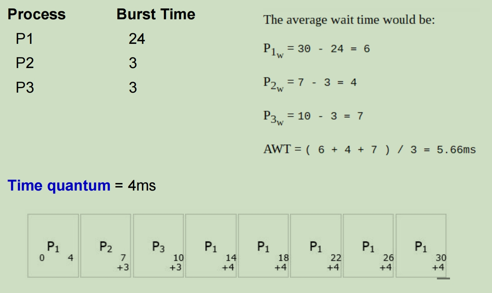

## Multilevel Queue Scheduling 多级队列调度

就绪队列被划分为单独的队列

将就绪队列分成多个独立队列。根据进程的属性，比如内存大小，优先级，进程类型，一个进程被永久地分配到一个队列。每个队列有自己的调度算法。

There are two types of scheduling in multi-level queue scheduling:

• Scheduling among the queues. 在队列之间调度。

• Scheduling between the processes of the selected queue. 在所选队列的进程之间进行调度。

Must schedule among the queues too (not just processes):

- **Fixed priority scheduling**; (i.e., serve all from foreground then from background). Possibility of starvation.

  **固定优先级调度**;（即，从前台服务，然后从背景服务）。挨饿的可能性。

- **Time slice** – each queue gets a certain amount of CPU time which it can schedule amongst its processes;

  **时间片** – 每个队列都有一定数量的 CPU 时间，它可以在其进程之间调度这些时间;

​		➢ 80% to foreground in RR, and 20% to background in FCFS

​		在 RR 中为 80%，在 FCFS 中为 20% 为背景


## MultiLevel Feedback Queue Scheduling 多级反馈队列调度

与多级队列调度算法不同的时，进程在多级反馈队列中被分配到一个队列之后，还可以转移到其它队列。在队列之中转移也是一种老化的实现方式

A **multilevel feedback queue** uses **two basic rules**:

1.  A new process gets placed in the highest priority queue.

   新进程被放置在最高优先级队列中。

2. If a process does not finish its quantum, then it will stay at the same priority level otherwise it moves to the next lower priority level

   如果一个进程没有完成其量子，那幺它将保持在同一优先级，否则它会移动到下一个较低的优先级

Multilevel-feedback-queue scheduler defined by the following **parameters**: 

由以下 **参数** 定义的 Multilevel-feedback-queue 调度进程：

– number of queues 队列的数量

– scheduling algorithms for each queue  每个队列的调度算法

– method used to determine when to upgrade a process 用于确定何时升级进程的方法

– method used to determine when to demote a process 用于确定何时降级进程的方法

– method used to determine which queue a process will enter when that process needs service 方法，用于确定当进程需要服务时该进程将进入哪个队列

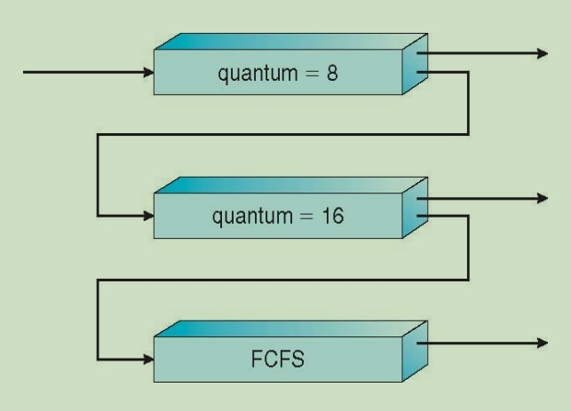

Example:

Three queue:

Q<sub>0</sub> - RR with time quantum 8 milliseconds --- High priority

Q<sub>1</sub> - RR time quantum 16 millisenconds --- Midium priority

Q<sub>2</sub> - FCFS --- Low priority

调度顺序:

1. 一个新的工作进入queue Q<sub>0</sub> ，先到先处理:
   - 当它获得 CPU 时，这个工作接收 8 毫秒的处理时间
   - 如果它在8毫秒内没有完成，这个工作会被转移到Q<sub>1</sub>
2. 在 Q<sub>1</sub> 队列中，这个工作再次提供 RR 并获得额外的 16 毫秒
   - 如果这个工作在16毫秒内还没有完成，则会新转移进来的其他进程抢占然后这个工作会被转移到Q<sub>2</sub>

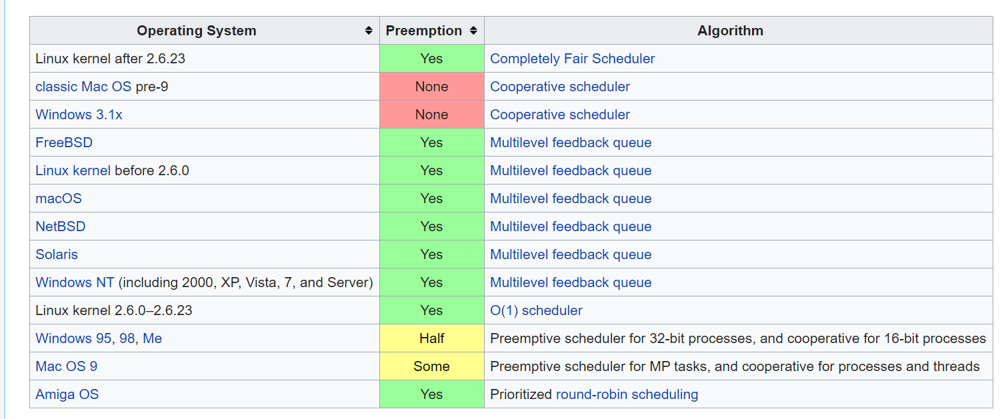

# CPU Schedule II

## Thread Scheduling 线程调度

### Lightweight Processes (LWP) 轻量级处理

Lightweight processes is a schedulable entity which exist on a layer between kernel-threads and user-threads. It is managed by the kernel.

轻量级进程是一个可调度的实体，它存在于内核线程和用户线程之间的层上。它由内核管理。

▪ One actual process may use multiple LWPs.  一个实际线程可能使用多个 LWP。

▪ Each LWP is bound to a kernel thread.  每个 LWP 都绑定到一个内核线程(KLT)。

▪ User-level threads can be flexibly mapped to LWP.  用户级线程(ULT)可以灵活地映射到 LWP。

### Contention scope 竞争范围

用户级线程和内核级线程的区别

当线程支持时,线程被调度,而不是进程

**ULT-KLT 映射由开发者决定。**（Many-to-many, Many-to-one, One-to-one）

The **contention scope** refers to the scope in which threads compete for the use of physical CPU(s).

**争用作用域**是指线程争用物理 CPU 的作用域。

两种争用情况：

• **Process Contention Scope PCS**  (unbound threads) , a.k.a *local contention scope*.

**过程争用范围PCS**,又名*本地争用范围*。

CPU 的竞争发生在属于同一进程的线程之间。线程库计划 PCS 线程通过可用的轻量级进程(LWP)（应用进程开发人员在线程创建期间指定的优先级）访问资源。

适用于many-to-many和many-to-one

• **System Contention Scope SCS**, a.k.a *global contention scope.*

**系统争夺范围SCS**,又名*全球争夺范围*。

CPU 的竞争发生在系统中的所有线程之间。内核使用此方案来决定将哪个内核级线程(KLT)调度到 CPU 上。

适用于one-to-one

## Multiple-Processeor Scheduling 多处理器调度

### Approaches 多处理器调度方法

多处理器（Multi-processor）是具有多个处理器但共享相同内存、总线和输入/输出设备的系统。

CPU scheduling more complex when multiple CPUs are available 当多处理器可行时，CPU的调度会更加的复杂

We are focused on **Homogeneous processors** (processors are identical) 专注于**同构处理器**（处理器是相同的）

### Asymmetric multiprocessing  (master/slave-AMP) 非对称多处理器结构

只有一个处理器访问系统数据结构（类型 master-slave（s））。

大哥带小弟，大哥处理器需要处理整个系统的调度，IO等，其他处理器只处理用户的代码

One processor as **master** and other processors in the system as **slaves**. The master processor runs the OS and processes while slave processors run the processes only.

一个处理器作为**主处理器**，系统中的其他处理器作为**从处理器**。主处理器运行操作系统和进程，而从处理器仅运行进程。

The **process scheduling is performed by the master processor**.

**进程调度由主处理器**执行。

The **parallel processing is possible** as a task can be broken down into sub-tasks and assigned to various processors.

**并行（Parallel）处理是可能的**，因为一个任务可以分解为子任务并分配给不同的处理器。

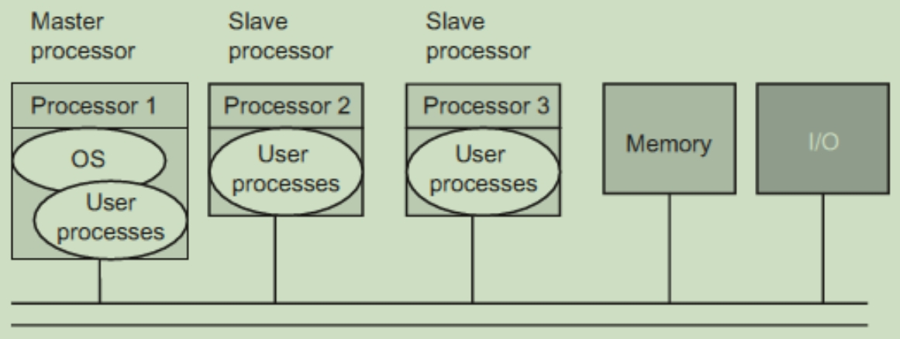

### Symmetric Configuration SMP 对称多处理器结构

任何处理器都可以访问任何设备，并可以处理在其上产生的任何中断。每个CPU都各司其职

**Mutual exclusion** must be enforced such that only one processor is allowed to execute the OS at one time.

**必须强制执行互斥**，以便一次只允许一个处理器执行操作系统。

To prevent the concurrency of the processes many parts of the OS are independent of each other such as scheduler, file system call, etc.

为了防止进程的并发性，操作系统的许多部分都是相互独立的，例如调度进程、文档系统调用等。

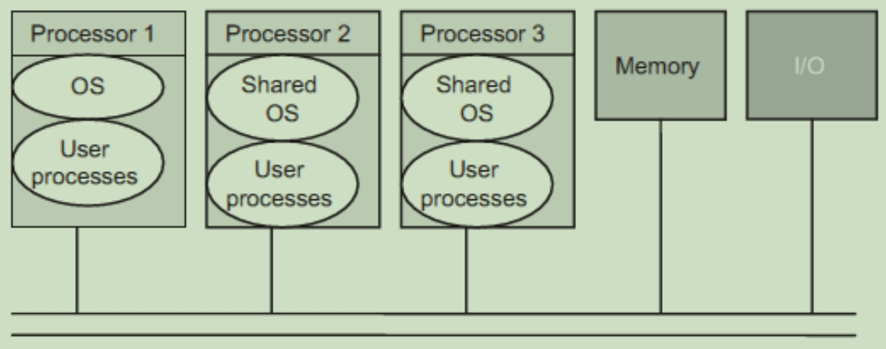

对称的配置方法:

- all processes in common *ready queue*, or 所有的处理器都共享一个就绪队列 (Share the same main memory)

- each of the processors has its own *private queue* of ready processes

  或者就是每个处理器都是一个私有的就绪队列来处理

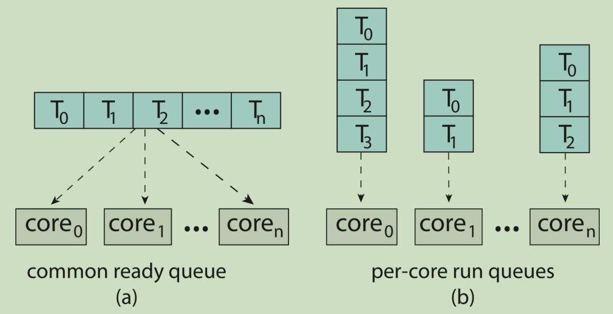

### Processor Affinity 处理器亲和力

**Processor affinity** is the ability to direct a specific task/process to use a specified core.

**处理器相关性** 是指示特定任务/进程使用指定内核的能力。

当进程在处理器上运行时，该进程最近访问的数据将填充到此处理器的缓存中。如果进程被定向为始终使用相同的内核，则由于缓存重用，进程可能会更高效地运行。

(注意: 如果进程从一个 CPU 迁移到另一个 CPU，则旧指令和地址缓存将失效，并且新 CPU 上的缓存需要一段时间才能“填充”。)

- **Soft affinity** – O.S. trying to keep a process running on the same processor but not guaranteeing it will do so. （Linux）

  **软关联** – 操作系统试图保持进程在同一处理器上运行，但不能保证它会这样做。

- **Hard affinity** – O.S. allows a process to specify a subset of processors on which it may run.

  **硬关联** – 操作系统允许进程指定它可以运行的处理器子集。

### Load Balancing 负载平衡

操作系统检查并验证（checks and validates）就绪队列中进程数

- Push migration: 任务定期检查（例如，每 200 毫秒检查一次）每个处理器上的负载。如果工作负载分布不均匀，则将进程移动（或推送push）到空闲或不太繁忙的处理器。

- Pull migration: 空闲处理器(idle processor)将从过载的处理器本身提取负载（从繁忙的处理器中拉取等待任务）

### Multicore Processors 多核处理器问题

一个内核一次执行一个线程

单核处理器花费时间等待数据可用（进程减慢或停止）= 内存停滞（Memory Stall）

Solution: 多核处理器(**Multicore processor**)：由两个或多个称为内核的 CPU 组成的单个计算组件，用于同时运行多个线程。每个内核都有一个寄存器集，因此在操作系统中显示为一个单独的物理处理器。

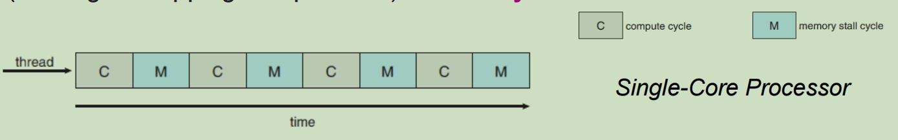

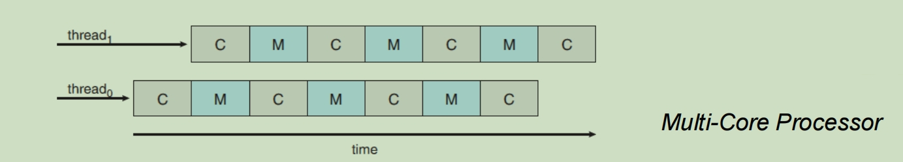

### Multithreading 多线程

#### Coarse-grained multithreading 粗粒度多线程 

只有线程阻塞时发生线程切换 (发生内存停滞等长延迟事件 long latency event as memory stall occurs)

 #### Fine-grained multithreading 细粒度多线程

线程按照时间片轮转切换 （类似实现RR调度模式）

## Real-Time CPU Scheduling 实时CPU调度

A **real-time operating system** R.T.O.S. are **deadline driven.**

实时操作系统是按照deadline（终止时间）驱动的

**Hard RTOS** – is one that **must meet its deadline**; otherwise, it will cause unacceptable damage or a fatal error to the system.

硬实时系统: 是**必须按时完成**的;否则，将对系统造成不可接受的损坏或致命错误。

**Soft RTOS** – an associated **deadline** that **is desirable but not necessary**; it still makes sense to schedule and complete the task even if it has passed its deadline.

软实时系统: 一个相关的**截止日期**，**是可取的，但不是必需的**;即使任务已经过了最后期限，安排和完成任务仍然是有意义的。

### Characteristics of a RTOS 实时系统的特征

The **period** is the amount of time between iterations of a regularly repeated task.

**周期(period)**是定期重复任务的迭代之间的时间量。

The **deadline** is a constraint of the maximum time limit within which the operation must be complete.

**截止时间(Deadline)** 是对操作必须完成的最长时间限制的约束。


**Aperiodic tasks** (*random time*) has **irregular arrival times** and either soft or hard deadlines.

**非周期性任务**（*随机时间*）具有**不规则的到达时间**以及软或硬截止日期。

**Periodic tasks** (**repeated tasks**), the requirement may be stated as “once per period T” or “exactly T units apart.”

**周期性任务**（**重复任务**），要求可以表述为“每个周期T一次”或“正好相隔T个单位”。

### Issues in Real-time Scheduling 实时调度的问题

RTOS 面临的主要挑战是安排实时任务。

- **Interrupt latency** *(*aka *interrupt response time) -* is the time elapsed between the **last instruction** executed on the current interrupted task and **start of the interrupt handler**.

  **中断延迟** *（*又名*中断响应时间） -* 中断请求到中断服务之间的时间

- **Dispatch latency** – time it takes for the dispatcher to **stop** one process and **start** another running. *To keep dispatch latency low is* *to provide preemptive kernels.*

​	**调度延迟** – 调度进程**停止**一个进程并**启动**另一个进程运行所需的时间。*保持低调度延迟是* 提供抢占式内核。

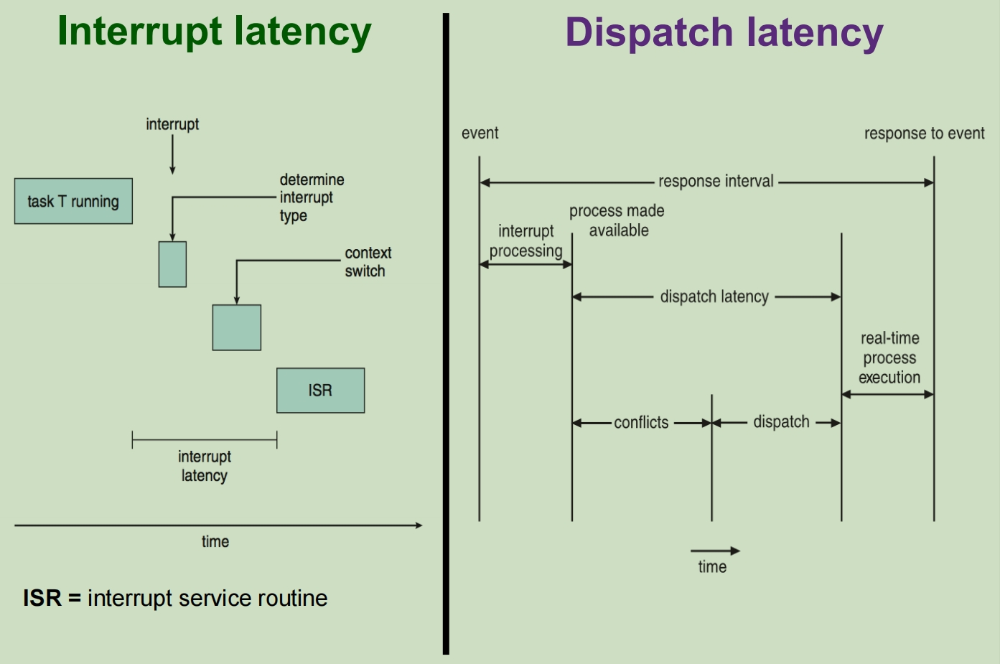

### Real-Time CPU Scheduling 实时 CPU 调度

**Static scheduling 静态调度**: 调度在程序开始前进行准备并处理相关资源，周期和Deadline

**Priority-based scheduling 优先级调度**: 分配给任务的优先级取决于任务对事件的响应速度。

**Dynamic scheduling 动态调度**: 对已经存在的任务有了解，但新来者尚不清楚。因此，计划会随着时间的推移而变化

### Characteristics of Processes 进程的特征

Processes are considered **periodic** (repeated tasks). 进程被认为是周期性的 (重复的任务)

A period process has: 一个周期性的进程包含

\- **processing time** **t**,  进程的处理时间t

\- **deadline** **d** by which it **must be serviced by the CPU** 截止时间d

\- **period** **p**. 周期p

```
0 ≤ t ≤ d ≤ p  周期速率为1/p
```

#### Rate Monotonic Scheduling (RMS) 单调速率优先调度

**static  priority-based preemptive scheduling algorithm** **静态优先级抢占式调度**

对于周期性进程的高静态优先级抢占，目前是**最优静态**调度算法

优先级：**周期period越短，静态优先级越高** (The higher the frequency (1/period) of a task, the higher is its priority)
$$
CPU \quad utilization = \frac{t_{i}}{p_{i}}
$$
**t<sub>i</sub>** = the execution time 执行时间

**p<sub>i</sub>** = the period of process 周期时间

为了满足系统中的所有截止日期，必须满足以下条件：
$$
\sum_{i} \frac{t_{i}}{p_{i}}
$$
Each process requires to complete its burst time by the start of its next period.

每个进程都需要在下一个周期开始时完成其突发时间。


仍然有错过DDL的线程组合，如果使用RMS算法超时，那么使用任何其他算法也会超时

##### 错误情况

\- 假设P2的优先级高于P1

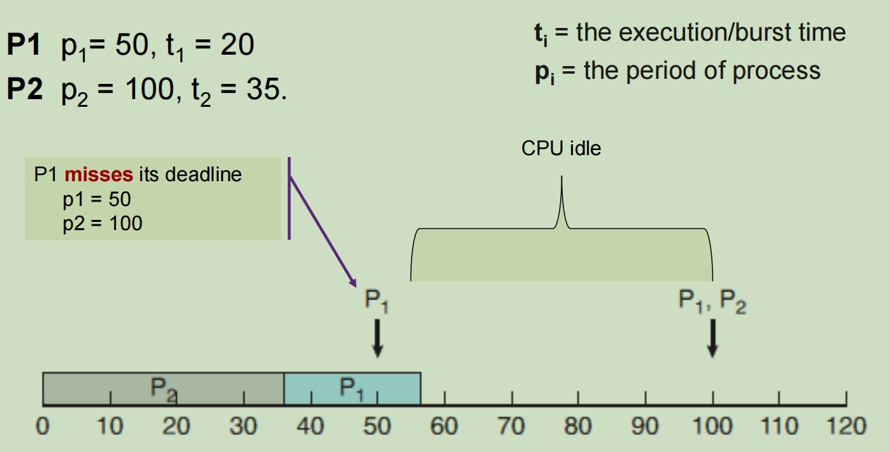

此时先执行了P2，然后紧接着执行P1，但是当P1执行完直接第一个周期的内容之后，结束时间已经是55ms了，已经超过了P1第二个周期的开始时间50ms，因此P1将会错过自己的第二个执行周期，直接等到时间到达100ms之后P2先执行，然后再去执行自己的第三个周期

##### Missing Deadlines with RMS 错过Deadline

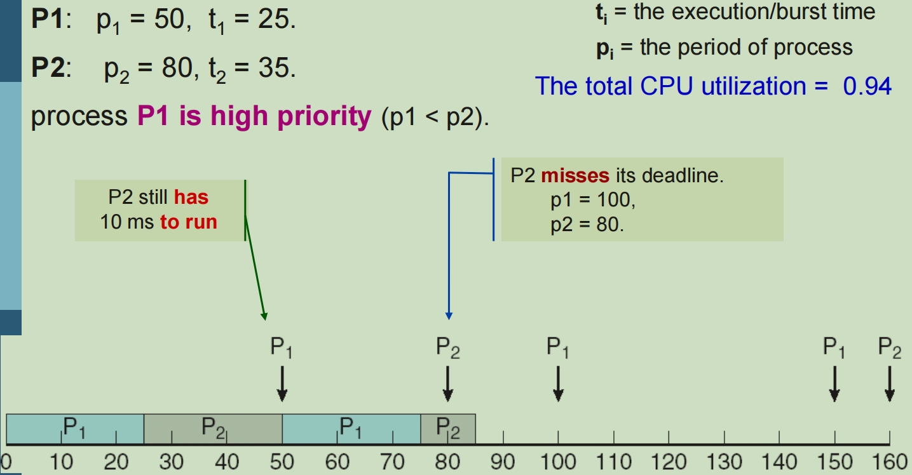

这会是P1优先级大于P2，但是当p2最后执行完自己的第一轮周期的内容的时候时间片已经来到了85ms超过了原本的自己的周期时间片80ms

#### Earliest-Deadline-First Scheduling 早截止早优先

The scheduling criterion is **based on the deadline of the processes**. 计划标准是**基于流程的截止时间**。

It can be used for both **static** and **dynamic real-time scheduling**.

它既可用于静态**，也可用于动态实时调度**。

The tasks or processes do not need to be periodic.

任务或过程不需要是定期的。

Any **executing task can be preempted** if any other periodic instance with an earlier deadline is ready (**dynamic real-time scheduling**)

如果任何其他具有较早截止日期的定期实例已准备就绪，则可以**抢占**任何**执行任务**（**动态实时调度**）

**The earlier is the deadline, the higher is the priority. 截止日期越早，优先级越高**

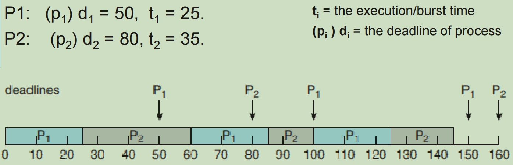

#### Proportional Share Scheduling 比例分享调度

Scheduling that pre-allocates certain amount of CPU time to each of the processes

为每个进程预先分配一定数量的 CPU 时间的计划

**Fair-share scheduler** 公平份额调度进程

- Guarantee that each process obtain a certain percentage of CPU time

  保证每个进程获得一定比例的CPU时间

- Not optimized for turnaround or response time

  未针对周转或响应时间进行优化

o **T** shares are allocated among all processes in the system

**T** 份额在系统中的所有进程之间分配

o An application receives **N** shares where **N < T**

应用进程接收 **N** 共享，其中 **N < T**

o This ensures each application will receive **N / T** of the total processor time

这确保了每个应用进程将收到 **N/T** 的总处理器时间

Example:

T = 100 股将分配给三个进程，即 A、B 和 C。A获配50股，B获配15股，C获配20股

## Scheduling Algorithm Evaluation 调度算法评估 

### Deterministic evaluation 确定性评估

算平均等待时间

### Queueing Models 排队模型

算cpu利用率，平均队列长度，平均等待时间

#### Little’s law 利特尔定律

进程离开队列和进入队列相抵

**n = λ * W**

**n** = average queue length 平均队列长度

**W** = average waiting time in queue 平均等待时间

**λ** = average arrival rate into queue 平均到达进入队列率

平均队列长度 = 到达速率 * 单个进程在队列内的平均等待时间 = 出去速率 * 单个进程在队列内的平均等待时间


