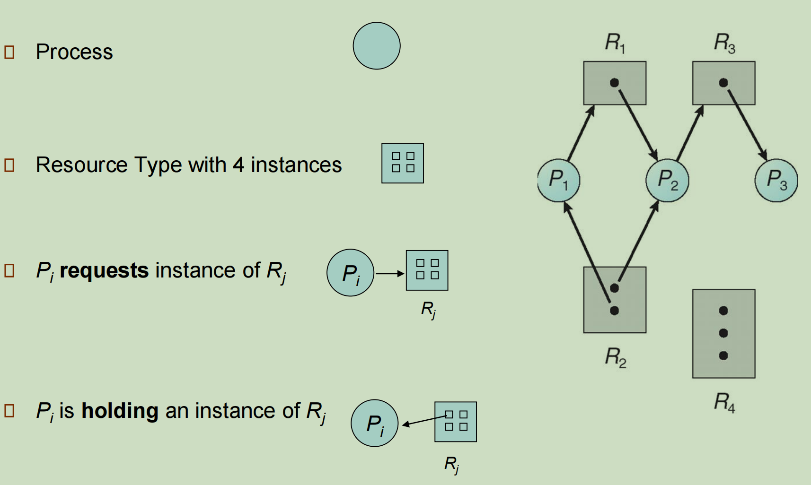
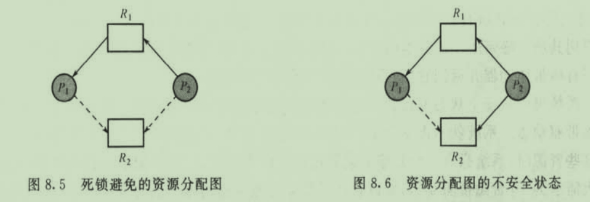
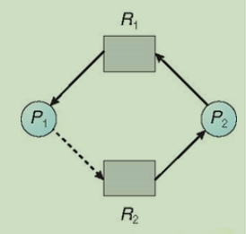
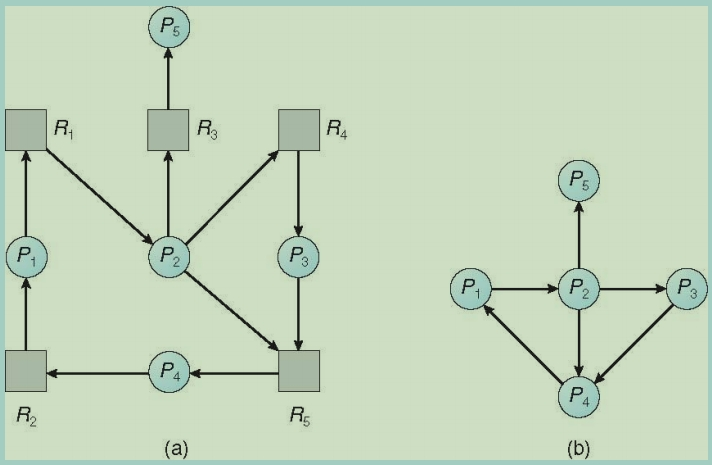

# Deadlocks 死锁

## Deadlocks Characteristics 死锁的特性

*Deadlock can be defined as the **permanent blocking** of a set of processes that compete for system resources.* 

死锁可以定义为**永久阻止**一组争用系统资源的进程。

死锁的四特征:

1. 互斥 MUTUAL EXCLUSION
   资源同一时刻只能被一个进程访问
2. 占有并等待 HOLD AND WAIT
   进程持有一些资源，又等待获取一些资源
3. 非抢占 NO PREEMPTION
   进程不能抢占那些持有部分资源的进程
4. 循环等待 CIRCULAR WAIT
   a等b，b等c，c等a。一个死循环存在于进程之间，例如两个进程之间互相掌握着至少一个另一组也需要执行的资源。

### 死锁产生的必要条件

1. 互斥条件 (Mutual Exclusion)：每个资源只能被⼀个进程使⽤，如果资源被⼀个进程占⽤，其他进程必须等待释放才能使⽤。争抢资源的⽅式会导致死锁。

2. 不可抢占条件 (No Preemption )：进程已经持有⾄少⼀个资源，并且在等待获取新的资源时不释放已经持有的资源。这意味着即使有资源可以满⾜某个进程的需求，也有可能⽆法满⾜，因为其他进程正在持有所需的资源。

3. 持有和等待条件 (Hold and Wait)：进程已经持有⾄少⼀个资源，但⼜对新请求的资源提出等待，⽽该资源被其他进程占⽤。在等待新的资源时，进程不释放已经持有的资源，导致资源⽆法被其他进程利⽤。

4. 循环等待条件 (Circular Wait)：存在⼀个进程资源的循环等待链，链中的每个进程都在等待下⼀个进程所持有的资源。这意味着存在⼀个资源循环链，每个进程都在等待下⼀个进程所持有的资源，最终导致死锁。

值得注意的是，死锁发⽣时⼀定存在循环等待链，但循环等待链并不⼀定会导致死锁。例如，在哲学家就餐问题中，如果每个哲学家都按照⼀定的规则拿起餐具，那么就不会发⽣死锁，即使存在循环等待链。因此，循环等待是死锁发⽣的必要条件，但不是充分条件。如果系统中每个资源都按照⼀定的规则分配给进程，那么循环等待就不会导致死锁。

### System Model 系统模型

System consists of resources 系统包含资源

System Resources types R<sub>1</sub>, R<sub>2</sub>, R<sub>3</sub>...., R<sub>m</sub>

Each resource type *R*<sub>i</sub> has *W*<sub>i</sub> instances.

Each process utilizes a resource as follows: **Request -> Use -> Release**

### Resource-Allocation Graph (RAG) 资源分配图

A set of vertices **V** and a set of edges **E**

V is partitioned into two types:

- P={P<sub>1</sub>, P<sub>2</sub>, ..., P<sub>n</sub>}, the set consisting of all the processes in the system 由系统中所有进程组成的集合
- R = {R<sub>1</sub>, R<sub>2</sub>, ..., R<sub>m</sub>} the set consisting of all resource types in the system. 由系统中所有资源类型组成的集合

**request edge**申请边 – directed edge *P<sub>i</sub> →R<sub>j</sub>* 线程请求资源

**assignment edge**分配边 - directed egde *R<sub>j</sub> → P<sub>i</sub>* 将资源分配给线程



圆P代表进程

块R代表资源，里面的点代表资源实例

P->R箭头（request edge）：P申请R的实例instance，request

Ri->P箭头（assignment edge）：R的实例 i 被分配给P，granted或者allocated


上面三张图中一和三不存在死锁，图二中的P2,R3,P3,R2形成死锁

```
个人感觉主要是因为第二幅图中R2的资源被P1和P2占用，并且P3还在请求R2的资源，P1，P2，P3形成了一个回路,没有谁能先被释放出来
```

- If a graph contains no cycles ==> no deadlocks 当图中没有环代表不存在死锁，

- If a graph contains a cycle ==>
  - if only one instance per resource type, then deadlock
  - if several instances per resource type, possibility of deadlock

- 如果存在环：
  - 一个资源只有1个实例，形成死锁
  - 一个资源有多个实例，可能死锁

## Handling Deadlocks 解决死锁

### Deadlock Prevntion 死锁预防

1. 破坏互斥条件：即对于某些资源，使之不再需要进程互斥地访问。例如，将原本只能独占使⽤的资源改造成可以共享使⽤，从⽽避免了死锁的发⽣。

2. 破坏不可抢占条件：进程在占有资源时，不允许被其他进程抢占，只能由进程⾃主释放。这意味着当某个进程请求新资源⽽得不到满⾜时，需要主动释放已占有的资源，待以后再重新申请。

3. 破坏持有和等待条件：进程在请求新资源时不阻塞，⽽是在开始执⾏之前⼀次性获取所需的全部资源。这样，就避免了因持有部分资源⽽等待其他资源导致的死锁。

4. 破坏循环等待条件：通过规定资源的申请顺序，使得所有进程对资源的申请都按照同⼀个顺序进⾏，从⽽避免形成资源的循环等待链。例如，当一个进程已经请求到标记为14的资源时，不能再请求标记为14之前的资源，只能接着请求15或之后的资源。

### Deadlock Avoidance 避免死锁

避免死锁的两种方法：

1. Do not start a process if its demands might lead to deadlock

   如果进程的资源需求可能会导致死锁，那就不启动它

2. Do not grant an incremental resource request to a process if this allocation might lead to deadlock.

   如果进程新的资源请求可能导致死锁，拒绝该请求

A **safe state** is one in which there is at least one sequence of resource allocations to processes that does not result in a deadlock (i.e., all of the processes can be run to completion)

当确保资源安全不会产生死锁后再释放资源需要存在一个资源的安全状态（safe states），也就是至少存在一个已知的不会发生死锁的资源分配顺序

避免死锁的相关知识:

1. max needs：一个进程最大可能需求的资源数量
2. available resources：现未被分配的资源
3. need：进程需要的资源数量
4. allocation：已被分配给进程的资源

例题 Example:

假设一个系统有12个资源，3个线程

|      | 最大需求 Max Needs | 当前已经满足的需求 Current Needs | 仍然需要的需求Needs to Complete | 系统可用的需求 Avaliable resoures |
| ---- | ------------------ | -------------------------------- | ------------------------------- | --------------------------------- |
| P0   | 10                 | 5                                | 5                               | 3                                 |
| P1   | 4                  | 2                                | 2                               |                                   |
| P2   | 9                  | 2                                | 7                               |                                   |

The safe state is <P1, P0, P2>

原因:

首先执行进程P1，此时空闲的资源有3个，P1需要2两个，则可以直接划拨给P1使用，然后当P1执行完毕之后，连带自己原本占用的2个资源，一共返回4个，此时系统的可用资源变为5个，然后P0此时需要5个资源，系统可以将自己剩余的5个资源都划拨给P0，然后P0执行完毕之后，连带自己一开始占用的5个资源一起返回，此时系统还剩10个资源。最终将总共的10个资源中的7个划拨给P2，P2执行完毕后连带自己原本占用的2个资源，一共返回9个，9+3等于12个。

一个unsafe state案例:

|      | 最大需求 Max Needs | 当前已经满足的需求 Current Needs | 仍然需要的需求Needs to Complete | 系统可用的需求 Avaliable resoures |
| ---- | ------------------ | -------------------------------- | ------------------------------- | --------------------------------- |
| P0   | 10                 | 5                                | 5                               | 3                                 |
| P1   | 4                  | 2                                | 2                               |                                   |
| P2   | 9                  | 2                                | 7                               |                                   |
| P3   | 1                  | 0                                | 1                               |                                   |

假如此时加入一个P3，最大需求为0，等待1个资源地传入，并先请求了系统1个资源，然后此时系统还剩下2个资源，那么将会产生死锁。因为等P1处理结束之后只能返回4个资源，但是此时P0需要5个资源才能继续，所有P0继续等待，类似地，P2也需要6个资源才能继续，因此也必须等待。

避免死锁的两种方法：

- 资源的单个实例
- 资源地多个实例

### Deadlock Avoidance in Single Instance of Resources 在单个资源实例中避免死锁

如果每个资源类型都有一个资源实例，则可以使用 RAG（资源分配图）。除了申请便和分配便外，可引入一个新类型地边"需求边(Claim Edge)"。

**Claim edge** *P<sub>i</sub> → R<sub>j</sub>*: 表示进程P<sub>i</sub>可能在将来的某个时候申请使用资源R<sub>j</sub>，使用虚线表示

检测资源分配图是否含有环地算法需要n<sup>2</sup>级操作，其中n是系统的进程数量



上面的是不安全，因为P2和P1同时请求R2资源，并且P2此时还在请求R1，而P1此时却占据着R1。



### Deadlock Avoidance in Multiple Instances of Resources 在多个资源实例中避免死锁

#### Banker Algorithm 银行家算法

- **Safety Test algorithm** that checks the current state of the system for its safe state.

  **安全测试算法**，用于检查系统的当前状态是否安全。

- **Resource request algorithm** that verifies whether the requested resources, when allocated to the process, affect the safe state. If it does, the request is denied.

  **资源请求算法**，用于验证所请求的资源在分配给进程时是否会影响安全状态。如果是这样，则请求将被拒绝。

Let **n = number of processes** n是进程的数量, and **m = number of resources types**.  m是资源的类型数量

**Avaliable**: 长度为m的向量表示每种资源的现有实例的数量。如果Avaliable[j]=k,那么资源类型R<sub>j</sub>现有k个实例

**Max**: n x m 矩阵定义每个进程的最大需求。如果Max[i, j] = k, 那么进程P<sub>i</sub>最多可申请k个资源类型R<sub>j</sub>的实例

**Allocation**: n x m矩阵定义每个进程现在所分析的各种资源类型的实例数量。如果Allocation[i, j]=k，那么进程P<sub>i</sub>现在已经分配了k个资源类型R<sub>j</sub>的实例

**Need**: n x m矩阵表示每个进程还需要的升序的资源。如果Need[i, j]=k，那么进程P<sub>i</sub>还可能申请k个资源类型R<sub>j</sub>的实例。注意**Need[i, j] = Max[i, j]-Allocation[i, j]**。这些数据结构的大小和值会随着时间而改变。

##### Banker’s algorithm: Safety Test algorithm 安全性算法

1. 设 Work 和 Finish 分别是长度为 m 和 n 的向量。

   initialize: 

   ​	Work = Avaliable

   ​	Finish[i] = false for i = 0, 1, ...., n-1

2. Find an i such that both:

   ​    (a) Finish [i] = false

   ​    (b) Need<sub>i</sub> <= Work

   ​    if no such i exists, go to step 4

3. Work = Work + Allocation<sub>i</sub>

   Finish [i] = true

   go to step **2**

4. If **Finish** [i] == true for all **i**, then the system is in a safe state

##### **Banker’s algorithm:** **Resource request algorithm** 资源请求算法

设Request<sub>i</sub>为进程P<sub>i</sub>[j] = k(Request也就是发出请求的资源数量), 那么进程P<sub>i</sub>需要资源类型的R<sub>j</sub>的实力数量为k，当进程P<sub>i</sub>做出资源请求，会采取如下动作。

1. 如果Request<sub>i</sub> <= Need<sub>i</sub>， 那么转到第2步，否则产生出错条件，这是因为进程P<sub>i</sub>已经超过了其请求。

2. 如果Request<sub>i</sub> <= Available，那么转到第3步，否则P<sub>i</sub>必须等待，这是因为没有可用资源

3. 假定系数可以分配给进程P<sub>i</sub>所请求的资源，并按如下方式修改状态：

   Avaliable = Avaliable - Request<sub>i</sub>

   Allocation<sub>i</sub> = Allocation<sub>i</sub>  + Request<sub>i</sub>

   Need<sub>i</sub> = Need<sub>i</sub>  - Request<sub>i</sub>

如果所产生的资源分配状态是安全的，那么交易完成且进程P<sub>i</sub>可分配到其所需要资源；

如果新状态不安全，那么进程P<sub>i</sub>必须等待Request<sub>i</sub>并恢复到原来资源分配的状态


<P1， P3， P4， P2， P0>

### Deadlock Detection  死锁检测

Resource-Allocation Graph / Wait-for Graph



#### Detection of single instance of resource 检测资源的单个实例

节点都是进程，

P<sub>i</sub> → P<sub>j</sub> i发P<sub>i</sub> is waiting for P<sub>j</sub>

an **edge** exists between the processes, only if one process waits for another. 仅当一个进程等待另一个进程时，进程之间才存在**边**。

#### Detection for multiple instances of resources  检测多个资源实例

Avaliable: 长度为m的适量，表示各种资源的可用实例

Application: n x m 矩阵，表示当前各进程的资源分配情况

Request: n x m 矩阵，表示当前个进程的资源请求情况，如果Request[i, j]=k,那么P<sub>i</sub>现在需要k个资源的R<sub>j</sub>


## Recovery from Deadlock

修复死锁问题：

终止（abort）一个或多个发生死锁的进程以终止循环等待

一次全部终止（环上的进程全部终止），或挨个终止直到循环等待(资源分配图里的环）消失。

从一个或多个死锁进程抢占（preempt）资源

- 选择受害者victim–根据拥有资源数量和运行时间
- 回滚Rollback–返回安全状态，重启进程
- 饥饿starvation–需要避免同个进程一直被选为受害者
