# Main Memory

## Memory Management Unit (MMU) 内存管理单元 （MMU）

The **memory** is where the programs are kept when they are running; it also contains the data needed by the running programs.

**内存**是进程运行时保存的位置;它还包含正在运行的进程所需的数据。

**Random Access Memory RAM** consists of a number of integrated circuits mounted on one or more circuit boards (*memory modules*) that plug into specialised slots on the mainboard.

**随机访问存储器RAM**由安装在一个或多个电路板（*内存模块*）上的多个集成电路组成，这些电路板插入主板上的专用插槽。

CPU 在访问正在运行的代码和数据时生成的内存地址进程称为虚拟/逻辑地址。进程的虚拟地址空间范围从 0 到最大值，具体取决于 CPU 体系结构（32 位地址为 4GB）。

实际内存硬件用于查找信息的地址称为物理地址。系统的物理地址空间从 0 到最大值（由计算机的 RAM 大小决定）。

Processes access memory using a **virtual address** 进程使用**虚拟地址**访问内存

- The OS (hardware MMU) translates the virtual address into the physical RAM address

  操作系统（硬件 MMU）将虚拟地址转换为物理 RAM 地址

- Each memory reference is passed through the MMU

  每个内存参考都通过 MMU

- Translate a virtual address to a physical address

  将虚拟地址转换为物理地址

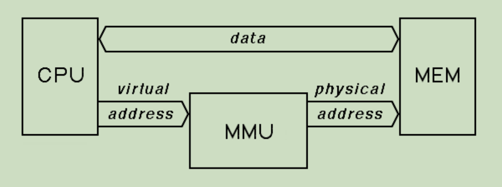

### Memory Management Requirements 内存管理要求

Protection 保护- 从用户进程中保护OS；用户进程之间的保护，通常是由硬件支持的

Relocation 重定位- 在内存中移动而不影响其运行

Sharing 分享 - 既要保护，又要分享

Logical Organization of memory 逻辑内存空间 - 逻辑上地址被认为是一个一维的线性的由比特组成的序列

Physical Organization of memory 物理内存空间 - 物理上地址有：主存访问速度快但是贵；二级存储慢但是便宜；大容量存储放的东西多，时间长。

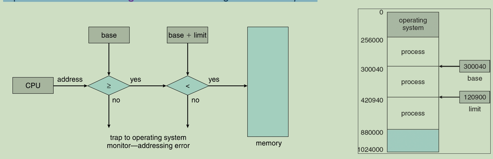

Addition: 

判断CPU处理的地址是否大于基地址和基地址+限制地址则正确，如果超过这个范围则不对

A pair of **base** and **limit registers** define the *logical address space*

一对 **base基寄存器** 和 **limit 限制寄存器**定义 *逻辑地址空间*

- **逻辑地址Logical address**：又叫虚拟地址virtual address，是CPU执行时处理的地址。逻辑地址空间由基地址寄存器（**base registers**）和限制寄存器（**limit registers**）组成。逻辑地址由CPU生成, 通过内存管理单元（MMU, memory management unit ） 转换成物理地址

- **物理地址Physical address**：由物理内存条介质认为的地址，可以定位到物理内存中的地址。

- **Segment Offset must always lie in the range [0, limit-1].**

虚拟存储器：这不是任何实际的物理存储器，而是借助磁盘等辅助存储器来扩大主存容量，使之为更大或更多的程序所使用。虚拟地址：用于指示虚拟存储器的地址

### Binding of Instruction and Data to Memory 指令和数据与存储器的绑定

Address binding of instructions and data to memory addresses can happen at three different stages:

指令和数据到内存地址的地址绑定可能发生在三个不同的阶段：

1. 编译（compile time）时期：将绝对地址编译进程序，但首地址改变时就会出错
2. 加载（load time）时期：加载程序时将逻辑地址与物理地址绑定，但不支持虚拟内存
3. 运行时期（execution time）时期：执行时映射逻辑地址到物理地址，这种绑定方式需要硬件支持，支持虚拟内存。(e.g., *base* and *limit registers*)

**Memory protection** (to prevent memory overlaps) is usually supported by the hardware (**limit registers**), because most languages allow memory addresses to be computed at run-time

硬件（**限制寄存器**）通常支持内存保护（**以防止内存重叠**），因为大多数语言都允许在运行时计算内存地址

**CPU registers** = high speed memory area inside the processor and used during the program execution

**CPU 寄存器** = 处理器内部的高速内存区域，并在进程执行期间使用

### Dynamic Relocation using a Relocation Register 使用重定位寄存器进行动态重定位

**Relocation:** the process of moving a program from one area of memory to another area. In MMU scheme, the value in the **relocation register** is **added to every address generated by a user process** at the time it is sent to memory.

**重新定位：** 将进程从一个内存区域移动到另一个区域的过程。在 MMU 方案中，**重定位寄存器**中的值在发送到内存时被**添加到用户进程**生成的每个地址。

The *base register* is now termed a **relocation register**, whose value is added to every memory request at the hardware level.

*基寄存器*现在称为**重定位寄存器**，其值将添加到硬件级别的每个内存请求中。

重定位relocation是把一个逻辑地址映射成物理存储地址。可以理解成当主内存中的内容要被转移到二级存储的时候，就通过MMU添加上重定向寄存器中的偏移值将数据转移到二级地址中对应的物理地址的位置上。

用户程序不会看到真实的物理地址，用户程序看到的地址都是逻辑地址（0 ~ M），当这些地址被使用时经过重定位即可映射到物理地址（R ~ R+M)。R就是relocation register.

加入基地址为14000，那么用户对位置0的访问将动态地重定位为位置14000；对地址346的访问将映射为位置14346.

内存管理单元(memory-management unit , MMU)方案中，映射时所用的重定位寄存器（relocation register）就是基地址寄存器（base register），将CPU逻辑地址加上重定位寄存器内地址完成对数据的重定位。

## Memory Allocation 内存分配

The memory allocation can be classified into two methods:

**contiguous memory allocation** - assigns consecutive memory blocks to a process.

**连续内存分配** 将连续的内存块分配给进程。

**non-contiguous memory allocation** - assigns different blocks of memory in a nonconsecutive manner to a process.

**非连续内存分配** 以非连续的方式将不同的内存块分配给进程。

逻辑地址空间可以看成书店，资源可以看成书。
**分段**可以看成把相同类型的书的分到一个集合，段表是记录了这些集合在店里哪个地方的清单。
**分页**可以看成把店里划分为许多等大的区域，书的清单上也被划分了同样大小的等大表格，每个表格记录一个区域的位置，通过查找清单可以查找到相应的区域，再通过偏移地址可以知道在该区域内具体什么位置。

### Contiguous Memory Allocation 连续内存分配

进程获得的内存块是连续的，主要应用于早起的计算机。

#### Fixed/Static Partitioning  固定/静态分区

固定分区的大小可以相等，也可以不相等。 将每个进程分配给其自己的分区。

为进程分配大小够用的内存块

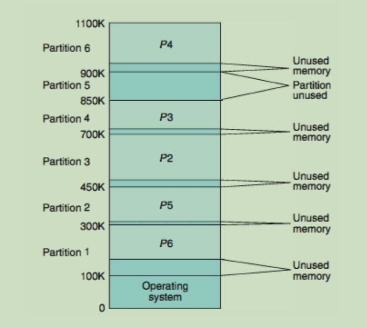

1. 内存块之间大小不要求相同（例如：大小为40MB的内存块和另一个大小为100MB的内存块）
2. 每个进程被分配到各自的一个内存块

- 产生内部碎片**Internal fragmentation** ：
  - 进程没有完全填充被分配的内存块（如：一个只有36MB的进程被分了40MB内存块）
- 解决：
  - 改用可变大小的内存块而不是固定大小

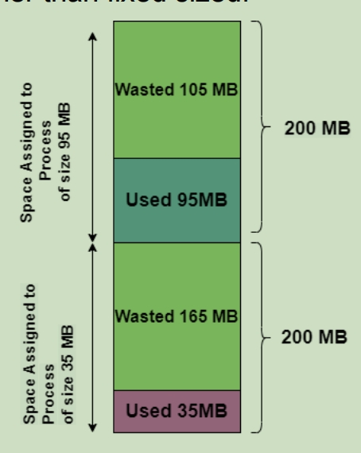

#### Variable/Dynamic Partitioning 动态分区

操作系统保留一个表table，指示内存的哪些部分可用，哪些部分被占用。内存块blocks（孔 holes）可以试着去找到一个列表中空闲的位置，以便在需要时将进程加载到内存中。

OS保留一个可用内存表list of free memory blocks，记录未被使用的内存块，每次根据需求选择大小够用的内存块分配。

- first-fit 选择第一个够用的块
- best-fit 选择最小且够用的块
- worst-fit 选择最大且够用的块

- 产生外部碎片**External fragmentation**：
  - 总有过小的内存块没法被分配，变成了碎片（如：有个300kb的内存块，但是压根没有小于300kb的进程）
- 解决：
  - 紧缩Compaction：将已分配的块向一侧集体移动
  - 使用非连续分配Non-contiguous memory allocation：分段和分页（**Segmentation** and **Paging**）

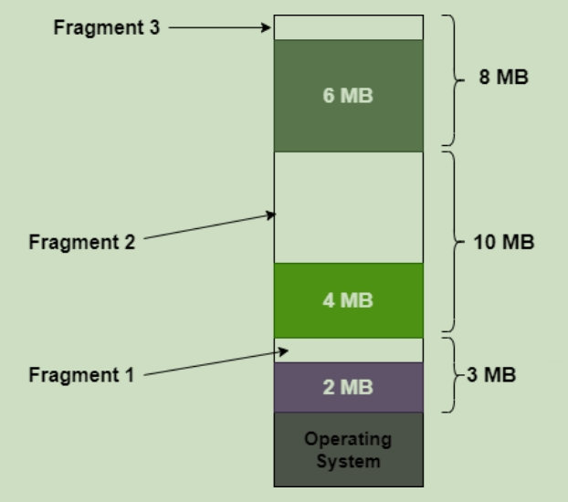

### Non Contiguous Memory Allocation 非连续内存分配

#### Segmentation 分块

这些段是进程的逻辑划分，它们可能具有不同的大小。

按照程序的逻辑给程序分段，每段由段名与段长构成。

逻辑地址由两个元组组成：

逻辑地址由段地址 Segment和偏移地址offset组成，逻辑地址空间看成是由段组成的集合。

**<segment-number, offset> = <s, d>** <段号，偏移（segment的长度）>

#### Segment Table 段表

maps two-dimensional logical address to one-dimensional physical address;

将二维逻辑地址映射到一维物理地址;

每个段表元素包含基地址base和段界限limit

**base** – contains the starting physical address where the segments reside in memory

包含段驻留在内存中的起始物理地址

**limit** – the length of the segment

段的长度指定该段的长度

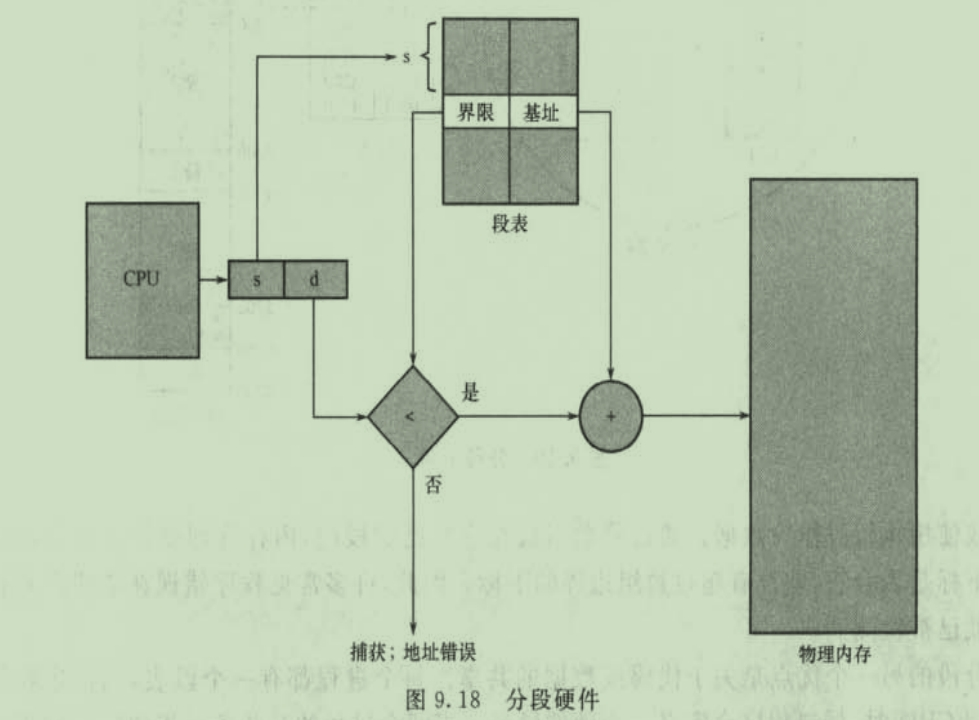

段表的使用：一个逻辑地址由两部分组成：段号s和段内的偏移d。段号用作段表的索引。逻辑地址的偏移d应该位于0和界限之间。如果不是这样，则会陷入到操作系统中（逻辑地址是试图访问段的外面）。如果偏移d合法判断方式就是根据判断offset是否大于limit，如果小于等于则代表合法，如果大于则不合法。如果合法，那么offset就与该基地址base相加而得到所需自己在物理内存的地址。段表是一组基址和界限寄存器对。

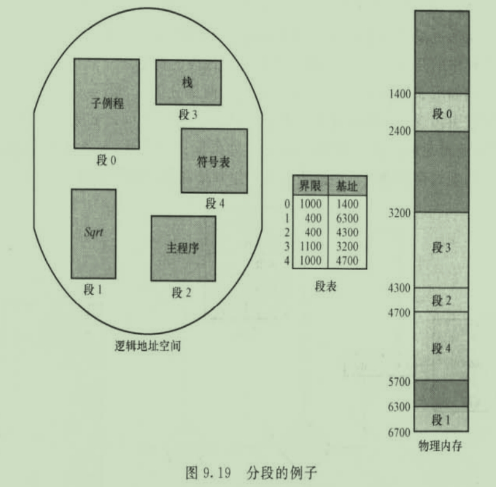

分段的优点：

- 将段与对其的保护相关联。因为段表示一个有一定语义的程序部分，所以段内的所有内容可能会按照同样的方式使用。因此，有的段是指令，而有的是段数据。对于现在的体系结构，指令不可以自我修改，故指令段可定义为只读或只执行。
- 代码和数据的共享。每个进程都有一个段表，当该进程被允许使用CPU时，派遣程序会定义一个硬件段表。当两个进程的某些条目指向同一物理位置的时候，就可以组成共享段。

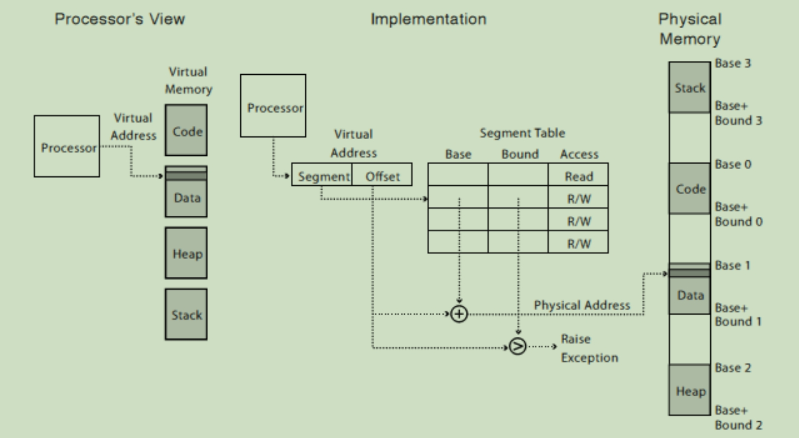

Example:

假设一个进程的逻辑地址为0001001011110000, 然后segment number（段号）是1，offset （偏移）是752(001011110000)。根据段表找到这一段段号为1的内存信息，这一段是的物理地址是从主内存的0010000000100000开始。那么最终这段的实际物理地址开始于0010000000100000 + 001011110000(752) = 0010001100010000

#### Paging 分页

分页允许进程的物理地址空间可以是非连续的。分也避免了将不同大小的内存块被分到交换空间上这样麻烦的问题。

帧frames：将物理内存分为固定大小的块。当进程运行时，将其调入可用的帧中。

页page：逻辑内存也分为同样大小的块。包含页号和页偏移

页号page number：页在页表里的下标

页大小page size：一页的大小为2的幂。（e.g., 512MB, 1024MB....）

分页可以映射连续虚拟页到不连续物理帧，通过分页可以减少内存的外部碎片external fragmentation（对于一个页而言），但是其页内部internal会产生碎片，因为页是分配的最小单位，最后一页的页内会有剩余部分。

由CPU生成的每个地址分为两部分：页码(p)和页偏移(d)，页号作为页表中的索引。页表包含每页所在物理内存的基地址。通过页号在页表里查找物理地址的基地址，乘上基大小（既左移偏移地址位数）加上偏移地址，得到物理地址。

▪ **Page number** (**p**) – is extracted from the logical address and is used as an index in the **page table**

页码 （p） – 从逻辑地址中提取，并用作页表中的索引

▪ The **base address** **f**, corresponding to the page number, is retrieved.

检索到与页码相对应的基址 f。

▪ The base address f is added to the **page offset (d)** to get the corresponding physical address.

将基址 f 添加到“页面偏移量 （d）”中，以获取相应的物理地址。

页表的地址存储在存储器中，也存储在进程的PCB中。

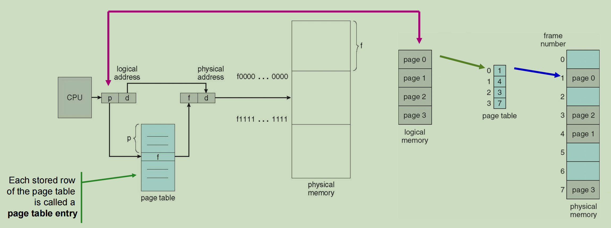

Example:

paging example for a 32-bytes memory with 4-byte pages

假设逻辑地址的空间是2m = the process size

页的大小为 2n bytes

**<page number, offset> = <m-n, n>**

这里的m-n和n代表的是页号和偏移量分别需要多少bits来存放

假设：

m = 4, n = 2

m - n = page number = 2

每一页大小为2的n次方个地址单元，所以页内位移号(offset)占用n个单位，剩下m-n个位表示页号(page number)

页的数量：no. of pages = 24 / 22 = 22 = 4 pages ---- 0, 1, 2, 3

**Number of pages the process is divided = Process size / Page size**

**page size = frame size** = 4 bytes

32-bytes physical memory 在32位物理地址中:

physical memory / frame size = 32 / 4 = 8frame ---- 0, 1, 2, ..., 7

Page size = 4 bytes

Logical address space = 4 pages

Physical address space = 8 frames

Logical address 7: <1, 3> = 0111 → Physical address 27: <6, 3> = 11011

解释：

**Physical memory address is : (Frame * Page size) + Offset**

Logical address 7 (page 1 offset 3)

\- according to the page table, **page 1** is mapped to **frame 6 (6 =** **110)**. 

\- Physical memory address for logical address 7 is : (6 x 4 *bytes*) + 3 offset = **27**

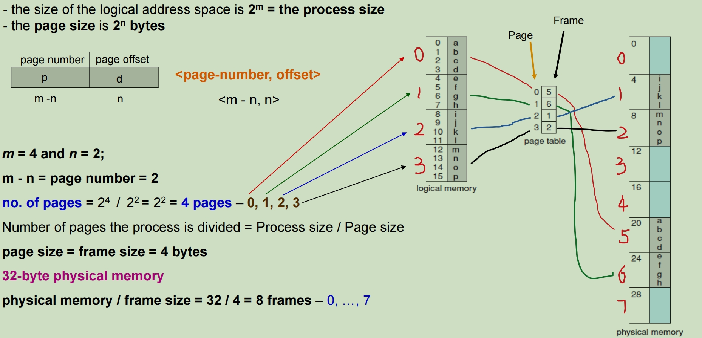

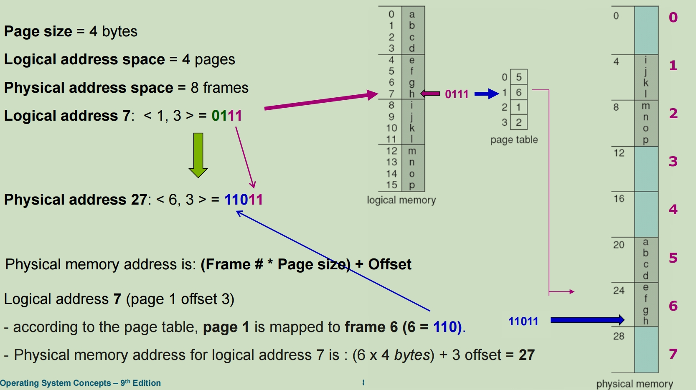

Example 2:

假设逻辑地址是0000010111011110，代表逻辑地址的page number是1，offset是478

通过页表查找页码为1的索引，页面在主内存中，页表中显示在帧6的位置 = binary 000110

那么最终的物理地址就是在Frame number 6, offset 478 = 0001100111011110

#### Implementation of Page Table 页表的硬件实现

1. 使用正在执行的进程的页表放入内存，使用寄存器指向列表。
   - 页表基地址寄存器 Page-table base register (PTBR)：页表被记录在内存里，PTBR记录了页表在内存内的位置。
   - 页表长度寄存器 Page-table length register (PTLR) i：记录了页表长度。
   - 内存访问时间=访问列表条目+内存地址：Total memory access time = Time to access page table + Time to access memory location
2. 使用转换表缓冲区(translation look-aside buffers,TLB)：高速缓冲区(**fast-lookup hardware cache**)，专门放页表。

#### Paging Hardware With TLB 带 TLB 的分页硬件

转换后备缓冲区 （TLB, **translation look-aside buffer**） 是一种缓存存储器，用于存储（临时）最近的将虚拟内存转换为物理内存。

The percentage of times that the page number of interest is found in the TLB is called the **hit ratio** A.

在 TLB 中找到感兴趣的页码的次数百分比称为“**命中率**A”。

使用高速缓存尝试映射物理地址时，首先

1. E: 访问高速缓冲TLB里查找页号，找到页号得到基地址后就转到第3步
2. 如果没有，M: 就访问内存用页表基寄存器寻找页表。
3. 找到页号对应的物理基地址后，M：访问内存的物理地址。

有效访问时间 the effective memory-access time (EAT)：**EAT=A(E+M)+(1-A)(E+2 * M)**

Average Access Time = (访问缓存成功获取内容的概率 * 访问缓存的速度) + ((1-访问缓存成功获取内容的概率) * 访问后台完整页表的速度)

1 - A = TLB **miss ratio**

### Memory Protection 内存保护

#### Valid (v) or Invalid (i) Bit In A Page Table 有效无效位 

通过将保护位与每个帧相关联来实现内存保护

每个进程间都有独立的内存空间和内存空间保护。
在页表上对每个帧设置有效或无效
有效位代表相关页在进程的逻辑空间内
无效位代表相关页不在进程逻辑空间内

Example:

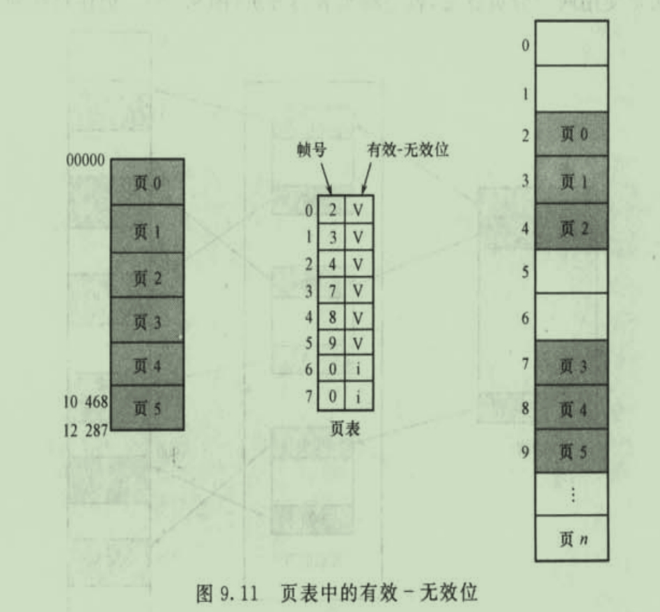

假设有一个程序，其地址空间为0到10468，页的大小为2KB，那么得到页0、1、2、3、4、5的地址可以通过页表征程映射。然而，如果使用产生页表6或者7中的地址时，就会发现有效位为无效，这样操作系统就会捕捉到这一非法操作(无效地址引用)。由于程序的地址知道10468，所以任何超过该地址的引用都是非法的。不过由于有对页面5的访问是有效的，因此到12287的地址也是有效的。只有再次之后的才会无效

#### Share Pages 共享页

不仅要保护，还要共享一些资源以节约运算。

- Efficient communication：进程通过写入共享页达到交流
- Memory efficiency：在进程间共享一份只读（read only）数据

▪ 只需在物理内存中保留一个编辑器副本。
▪ 每个用户的页表映射到编辑器的同一物理副本上，
▪ 但是数据页映射到不同的帧上。

以下进程的页表间共享了3， 4， 6帧

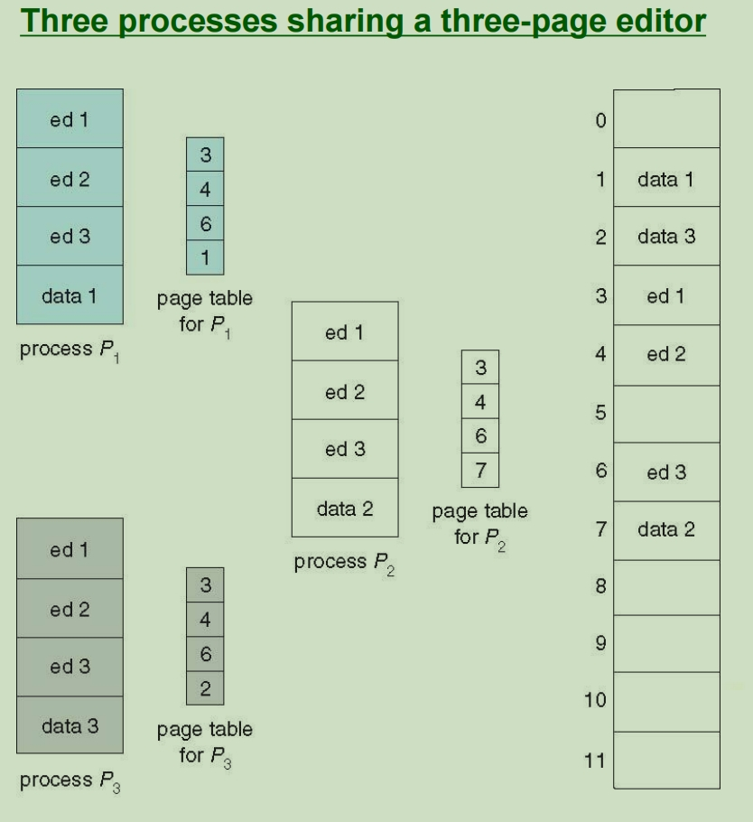

## Structure of the Page Table 页表的结构

Technical for large page table:

• **Hierarchical Paging -** break up virtual address space into multiple page tables at different levels. *Two-Level Paging* Example

分层分页将虚拟地址空间分解为不同级别的多个页表。两级分页示例

• **Hashed Page Tables** - the virtual page number is hashed into a page table. This page table contains a chain of elements hashing to the same location

哈希页表 虚拟页码被哈希处理成页表。此页表包含哈希到同一位置的元素链

• **Inverted Page Tables** - stores a process ID of each process to identify its address space uniquely.

反转页表存储每个进程的进程 ID，以便唯一标识其地址空间。

### Hierarchical Paging 层次页表

页表再分页

层次页表（向前映射页表）：如果内存空间过大，那么页表也会很大，一整个页表不方便连续存储，层次页表用来解决这个问题。在使用分页逻辑地址的基础上，将页号分成多个。也就是说，一个逻辑地址的两部分页号和页偏移，页号部分包含多个页号，而不是一个。这样，页表也对应有若干个（和页号个数相同），使用页号1通过页表1找到下一个页表（页表2）的地址，然后使用页号2（P2）在页表2中找到下一个页表（页表3）的地址…………直到找到最终的帧地址，结合逻辑地址的页偏移得到物理地址。注意，这其中，多个页表是通过指针联系在一起的，也就说，页表可以离散存放。

假如：
一页的页面大小为4kB（212B）
页表项(**entry size,也就是页表一行的大小**)大小为4B(22B)。
操作系统32位（2的32方B），也就是虚拟地址空间为2的32方B，
则可有以下计算结果：

Number of Virtual pages: 232 / 212 = 220

- a page number consists of 20bits
- a page offset consists of 12 bits

Since the table is paged, the page number is further divided into:

- a 10-bit page number
- a 10-bit page offset

页表需要占220/210=210页去存放

因此，将页表分为外层页号和内层页号
p1指向一个小页表，通过小页表偏移p2找到页元素所在小页表位置，这样的页表叫做二级页表

例题：

首先逻辑地址分为三个部分(p1, p2, offset)下题中，p1十进制为0，则在最左侧的一号页表中找到0对应的内存块号是3，然后再看内存块号是3的地方存放的p2的十进制值为1，则从二号页表中查找到1对应的内存块号是4，则最终确定物理地址为帧为4的地区，然后偏移量的十进制为1023，一个内存块号的大小为4KB也就是4096，然后内存块号为4的起始内存是16384，加上偏移量1023结果为17407.

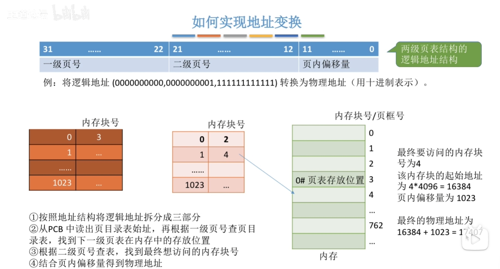

### 二级页表

那么有没有可能页表项总数过多，导致一个页表不够索引这些存放了页表的页的情况(一张书目清单不够用）？
有的，这个时候就要使用多个书目清单，然后再建立一个总的记录了书目清单的目录，这样子就叫做**三级页表**。就需要p1,p2,p3三个值

## Hashed Page Tables 哈希页表

建立物理内存地址到逻辑内存地址的映射，页表长度为物理帧数量。

对于超出32位的地址空间，常使用哈希页表，哈希页表使用链表法（哈希后产生相同值的项放到一个链表中），对于CPU产生的地址，还是先找页号，页号通过哈希函数在哈希页表中找到条目的一个链表，然后遍历链表，比较页号是否与链表中的项的第一个域匹配，匹配的话，用第二个域代表帧号，CPU产生地址的页偏移还作为物理地址的偏移量

### Inverted Page Table 反向页表

由于每一个进程都有一个页表，每一个页表可能有很多项，传统的页表可能会占用很多空间。反向页表用于解决这个问题，反向页表的思路是为物理内存的每一个帧维护一个表，这样操作系统只需要维护一个页表即可。为了区分是哪个进程使用了哪一帧，CPU产生的逻辑地址会分成三部分——进程标识符、页号、页偏移。使用进程标识符和页号，搜索整个页表，计算帧号，结合页偏移得到物理地址。
	

### 分页与分段的对比

1. 分⻚和分段管理的对⽐：
   - ⻚是信息的物理单位，主要⽬的是为了将离散的信息划分为固定⼤⼩的块，以提⾼内存的利⽤率。 ⻚的⼤⼩是由系统决定的，⽤⼾⽆法改变。⽤⼾程序中只需给出逻辑地址，物理地址的转换由系统完成。
   - 段是信息的逻辑单位，主要是为了满⾜⽤⼾需求，⼀个段通常包含⼀个逻辑模块的信息。 ⽤⼾在编程时需要显式地给出段名，并且要定义段内地址。⽤⼾通过定义段名和段内地址来告诉系统如何进⾏地址转换。段的⻓度是由⽤⼾定义的。

2. 分段⽐分⻚更容易实现信息的共享和保护：
   - 段管理更容易实现信息的共享和保护。 两个进程可以同时访问同⼀个段，只需修改进程的段表即可实现共享。但对于⻚，没有逻辑关系，很难确定哪些⻚可以共享，哪些⻚不能。段的功能是由⽤⼾定义的，因此可以明确地控制哪些段可以共享，哪些段不可以。

3. 分⻚管理和分段管理的性能⽐较：
   - 分⻚管理需要两次内存访问（查询⻚表和访问物理地址），⽽分段管理需要⼀⾄两次内存访问（查询段表和访问物理地址）。 因此，分段管理在性能上略优于分⻚管理。
   - 分段管理利⽤率⾼，不会产⽣外部碎⽚，但可能会有少量的内部碎⽚。 分⻚管理虽然不容易产⽣内部碎⽚，但可能会有外部碎⽚。分⻚管理对内存的分配更加灵活，但不太容易实现信息共享和保护。分段管理虽然容易实现信息共享和保护，但如果段很⼤，连续的内存分配可能会产⽣外部碎⽚。
   - 通过“紧凑”技术可以解决外部碎⽚的问题，但会增加时间代价。
