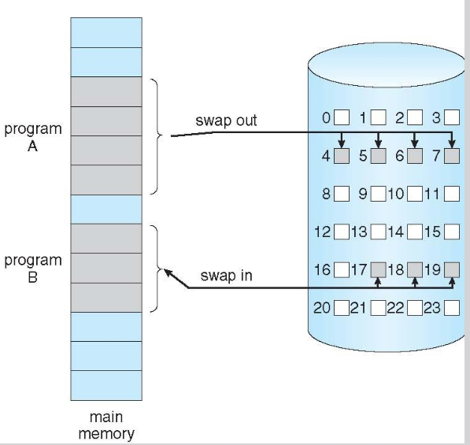
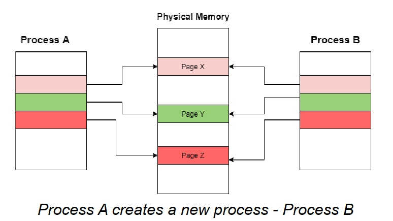
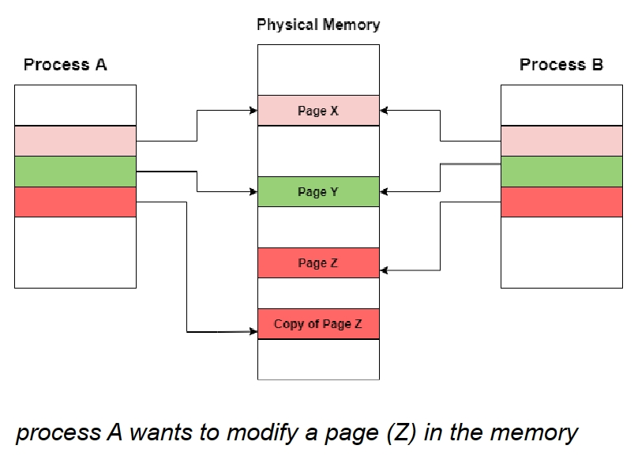
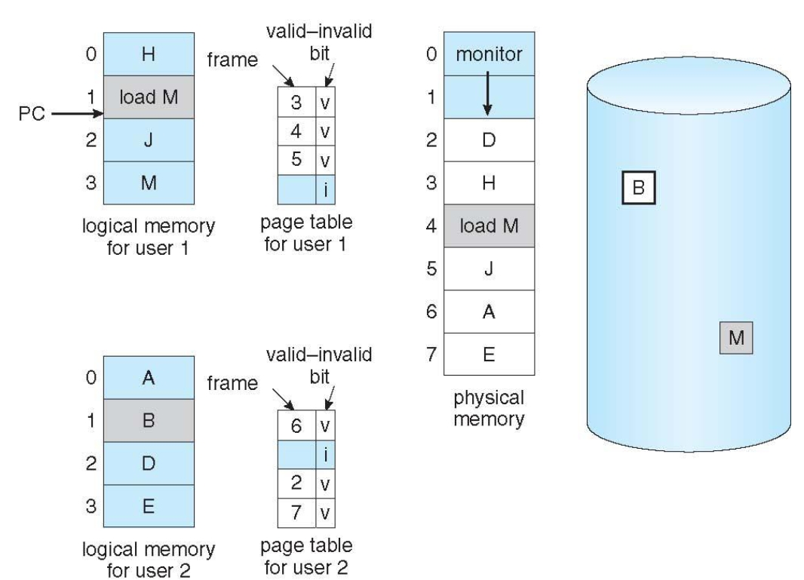
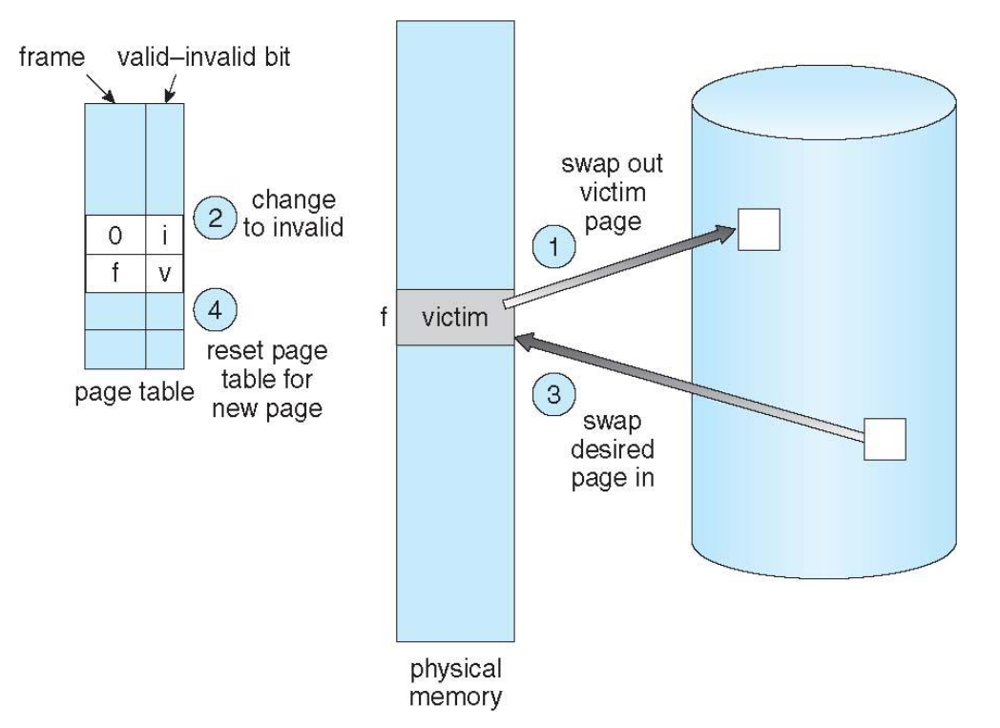
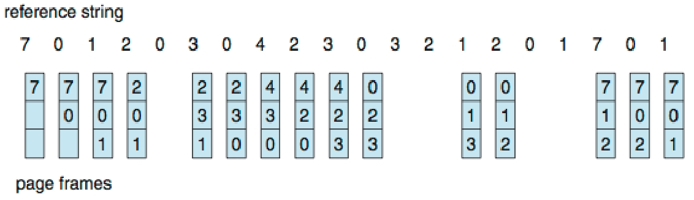
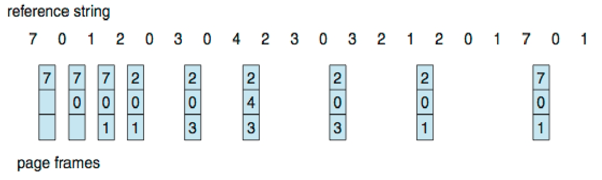
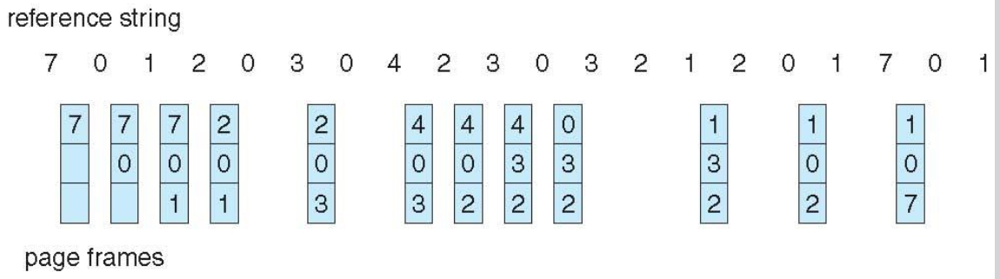

# Virtual Memory 虚拟内存

## Background 背景

Virtual memory (VM) is a method that manages the exceeded size of larger processes as compared to the available space in the memory.

虚拟内存（VM）是一种管理较大进程超出内存可用空间大小的方法。

Virtual memory - separation of user logical memory from physical memory.

虚拟内存 - 将用户逻辑内存与物理内存分离。

- Only part of the program needs to be in memory for execution

  进程在运行的时候，只需要一部分程序中的数据而不是全部

- The components of a process that are present in the memory are known as **resident set** of the process

  因为，程序的某一部分只有在被需要的时候才会被加载到内存中，那些在内存中的部分被称为**驻留集**

- Need to allow pages/segments to be swapped in and out.

  需要允许页面/段落互换。

The implementation of a VM system requires both hardware and software components.

虚拟机系统的实施需要硬件和软件组件。

- Software: VM handler

- Hardware: The memory management unit built into the CPU

### Swap space / Swap partition 交换空间/交换分区

Virtual memory targets the organization of the memory when the process size is too large to fit in the real memory.

虚拟内存的目标是充当，当进程太大，而无法容纳在实际内存中时的内存组织

With the help of the **hard disk**, the VM system is able to manage larger-size processes or multiple processes in the memory.

在**硬盘**的帮助下，虚拟机系统能够管理内存中更大的进程或多个进程。

For this purpose, a separate space known as **swap space** is reserved in the disk. Swap space requires a lot of management so that the VM system woks smoothly.

为此，磁盘中保留了一个独立的空间，称为**交换空间**。交换空间需要大量管理，以便虚拟机系统顺利运行。

## Demand Paging 按需调页

The concept of loading only a part of the program (page) into memory for processing

只将程序的一部分（页面）载入内存进行处理的概念

被调用的条件: when a logical address generated by a process points to a page that is not in memory.

当进程生成的逻辑地址指向一个不在内存中的页面时。

**Lazy swapper**：除非页被需要，否则页不会被调入内存

**pager**：一个控制程序，控制换页

如何确定页是页否在内存里：

1. valid：代表页合法且已进驻内存

2. invalid：代表页不合法或未进驻内存

如果进程试图访问内存内没有的页：

1. 页不在逻辑地址空间内中→ page fault页无效
2. 当发现无效页→ a trap抛出页错误陷阱，让系统注意page fault然后把页换进来

### 按需调页的有效访问时间The Effective Access Time (EAT)

如果没有无效页（p=0），有效访问时间=访问内存的时间

如果页错误概率是p：(0 <= p <= 1)

- 如果概率p是0，则没有faulty page
- 如果p=1，则页表中所有的页表项（entry size）都是错误的

**The Effective Access Time (EAT)=（1-p）* 访问内存时间+ p * 页错误处理时间**

额外：

1. In a multilevel paging scheme using TLB **without any possibility of page fault**, effective access time is given by:

   在不存在页面故障的TLB多层分页方案中，有效访问时间为:

   Hit ratio of TLB * {Access time of TLB + Access time of main memory} + Miss ratio of TLB * {Access time of TLB + (L + 1) * Access time of TLB + (L + 1) * Access time of main memory }  (L = Number of levels of page table 多层页表的层数)

2. In a multilevel paging scheme using TLB **with a possibility of page fault**, effective access time is given by: 

   在使用TLB的多级分页方案中，存在页面故障的可能性，有效访问时间为:

   Page fault rate * {Effective Access time without page fault + Page fault service time} + (1 - Page fault rate ) * {Effective Access time without page fault}

页面故障的主要组成部分:

1. Service the page-fault interrupt. 页面中断服务
2. Read in the page 读取页面
3. Restart the process. 重启进程

VM 系统还使用 TLB 来减少内存访问并提高系统性能。

## Copy-on-Write(COW) 写时复制

Only pages that are written need to be copied. 只有写入的页面需要复制

**Process Creation**: using the fork() system call may (initially) bypass the need for demand paging by using a technique similar to page sharing.

使用 fork() 系统调用时，（最初）可以通过使用类似于页面共享的技术，绕过按需分页的需求。

COW: 创建一些共享页，创建一个空的页缓冲池，当共享页指向的内容遭到**写**操作，利用缓冲池内的空白页复制这些共享页内容形成一个副本。

常发生于父子进程之间：

父进程和子进程最初共享内存的同一页

最初父子级共享页表内容：

如果任何进程（父进程或子进程）修改了共享页面，则仅复制该页面

如果进程A要修改page Z，那么将会对原本的Page Z进行复制并对复制过的page Z来进行修改

## Page Replacement 页置换

When a page fault occurs during the execution of a process, a page needs to be paged into the memory from the disk.

当进程执行过程中发生页面故障时，需要从磁盘将页面分页到内存中。

Two major problems to implement demand paging: 实施需求分页有两个主要问题：

1. What happens if there is no free frame => **Page Replacement**

   如果没有空闲帧会发生什么情况 => 页面替换

   - When a page is to be replaced, which frame shall be the "victim"?

     在更换页面时，哪个页帧应成为 "受害者"？解答：尽可能选择不会发生页无效的那些页

   - How do we select a replacement algorithm? we want the one with the lowest page-fault rate

     如何选择替换算法？

2. How many frames shall be allocated to each process => **Frame allocation**

   每个进程应分配多少帧 => 帧分配

   - When page replacement is required, we must select the frames that are to be replaced.

     发生页置换时，考虑更改帧分配。

The degree of multiprogramming increases => **over-allocating memory** => NO free frames on the free-frame list, all memory is in use.

多重并发程度增加 => 过度分配内存 => 自由帧列表中没有可用帧，则所有内存都在使用中。

页置换的目的 -> 将重度需要的页保存，将一段时间内不怎么需要的页换出去

页置换的第二个目的 -> 减少因为页错误导致的延迟

A good replacement algorithm achieves:

- a low page fault rate 页面故障率低

  - ensure that heavily used pages stay in memory 确保大量使用的页面留在内存中
  - the replaced page should not be needed for some time 在一段时间内不需要替换的页面

- a low latency of a page fault 页面错误的低延迟

  - efficient code 高效代码

  - replace pages that do not need to be written out 替换不需要写出的页面

  - a special bit called the modify (dirty) bit can be associated with each page 

    每个页面都可以关联一个特殊位，称为修改（脏）位
    
    设置了脏位的页面会被写回磁盘。当操作系统需要释放物理内存空间时（例如，由于内存压力），它会选择要写回磁盘的页，以便为新数据腾出空间。设置了脏位的页面表示其内容在上次与磁盘同步后已被修改，因此需要写回磁盘以确保数据的一致性。未设置脏位的页面是指自加载到内存后未被修改的页面，因此无需将其写回磁盘--如果需要回收内存，可以直接将其丢弃。

### 操作步骤

1. 在磁盘上找到需要的页
2. 找到空闲帧:
   - 如果有空闲的页 -> 直接使用
   - 如果没有空闲的页 -> 使用页面置换算法去选择一个受害者帧
     - 查每个页面或帧的修改（脏）位（modify/dirty bit）
     - 如果设置了bit -> 这一页液晶被修改了
     - 如果没有设置bit -> 说明这一页没有被修改，它不需要分页替换，并且可以被另一页覆盖，因为它的副本已经在磁盘上。这种机制减少了页面错误服务时间
3. 把页带到空闲帧里，更新页表
4. 继续运行引起trap的进程

## Page Replacement Algorithm 页面替换算法

- First-In First-Out (FIFO) Algorithm
- Optimal Algorithm
- Least Recently Used (LRU) Algorithm
- Second-Chance (Clock) Algorithm
- Counting Algorithms

By running it on a particular **string of memory references** and computing the number of **page faults**

通过在特定的内存引用字符串上运行它，并计算页面错误的数量

**Reference string** - is the sequence of pages being referenced 是要引用的页面的顺序

**Hit ratio**: Total number of page hits = Total number of references - Total number of page misses or page fault (page fault就是需要从内存中进行交换)

### First-In First-Out Algorithm (FIFO) 先进先出

When a page must be replaced, the **oldest page is chosen**.

当必须替换页面时，将选择**最先进入的页面**。

Example:

Reference string: 7,0,1,2,0,3,0,4,2,3,0,3,0,3,2,1,2,0,1,7,0,1

3 frames (3 pages can be in memory at a time per process 每个进程一次可以有 3 页在内存中)

15 page faults

### Optimal Algorithm 最优算法

Replace page that will not be used for **longest period of time**

替换未来长期不使用的页面

9 page faults

Optimal algorithm guarantees the lowest possible page fault rate for a fixed number of frames.

最优算法保证了固定帧数的最低可能页面故障率。

The idea is to predict future references based on the past data

这个想法是根据过去的数据预测未来的参考。

**它无法实现** - 操作系统中没有提供知道未来内存引用的规定。

### Least Recently Used Algorithm (LRU) 最近使用最少

when a page fault occurs, throw out the page that has been unused for the longest time.

当发生页面错误时，丢弃过去未使用时间最长的页面。

- counter implementation
  给每个页记录一个最新的被使用时刻，当需要选受害者时，选择时间最小的。
- stack implementation
  用一个栈记录每个页，每当页被使用，将其移动到栈顶，当选择受害者时，选择栈底的。

12 page faults

普遍很好用的算法，经常使用

### Second-Chance (Clock) Page-Replacement Algorithm

keeps a circular list of pages in memory, with the "hand" (iterator) pointing to the last examined page frame in the list

在内存中保存一个循环页面列表，"指针"（迭代器）指向列表中最后检查的页面帧

RB = Reference bit or Use bit give information regarding whether the page has been used

RB = 参考位或使用位，提供页面是否被使用的信息

页表中加一个reference bit=0，表明该页是否被使用过。每当页被进程访问，bit位被置为1。经常使用的页面不会被替换 （因为RB一直为1）

维护一个页的换入循环队列c-queue，每次从旧到新遍历队列，如果bit为1，将其置为0，跳过；如果bit=0，将其移出。

### Counting-Based Page Replacement 基于计数的页面替换

- Keep a counter of the number of references that have been made to each page.

  保留对每个页面的引用次数的计数器。

- Least Frequently Used (LFU) Algorithm （最近最不常用算法）：
  选访问次数最少的页移除

- Most Frequently Used (MFU) Algorithm （最常使用算法）：
  移除访问次数最多的页

## Frame Allocation 帧分配

- Fixed allocation 固定分配 

  在具有 x 帧和 y 个进程的系统中，每个进程获得相同数量的帧

  例如，如果有 100 个帧（在为 OS 分配帧后）和 5 个进程，则为每个进程提供 20 个帧

- Proportional allocation 比例分配

  随着多重编程程度的增加，进程大小会发生变化

  si = size of process pi

  S = 求和si

  m = total number of frames

  ai = allocation for pi = (si / S) * m

  Example:

  A system with 62 frames
  P1 = 10KB
  P2 = 127KB
  Then: 
  for P1 will be allocated (10 / 137) * 62 = 4 frames
  P2 will get (127 / 137) * 62 = 57 frames.

## Thrashing 系统颠簸

由于分配帧不够，进程频繁地换页导致换页时间多于执行时间。
