# Mass Storage 大容量存储

## Overview 概述

Secondary Storage: 二级存储

- Save data permanently. 永久存放数据

- Slower than memory. 比内存要慢

- Cheaper and greater than memory. 比内存更便宜并且容量更大

**Types of Secondary Storages 二级存储类型**: 

- 顺序访问设备 Sequential access devices - store records sequentially, one afterthe other

  - Relatively permanent and holds large quantities of data 相对永久且保存大量数据
  - Access time slow 访问非常慢

- 直接访问设备 Direct access devices - store data in discrete and separate location with a unique address.

  - Nonvolatile memory used like a hard drive

    像硬盘一样使用的非易失性存储器

  - Less capacity but much faster than HDDs

    容量较小，但比hdd(Hrard Disk Drive机械硬盘)快得多

  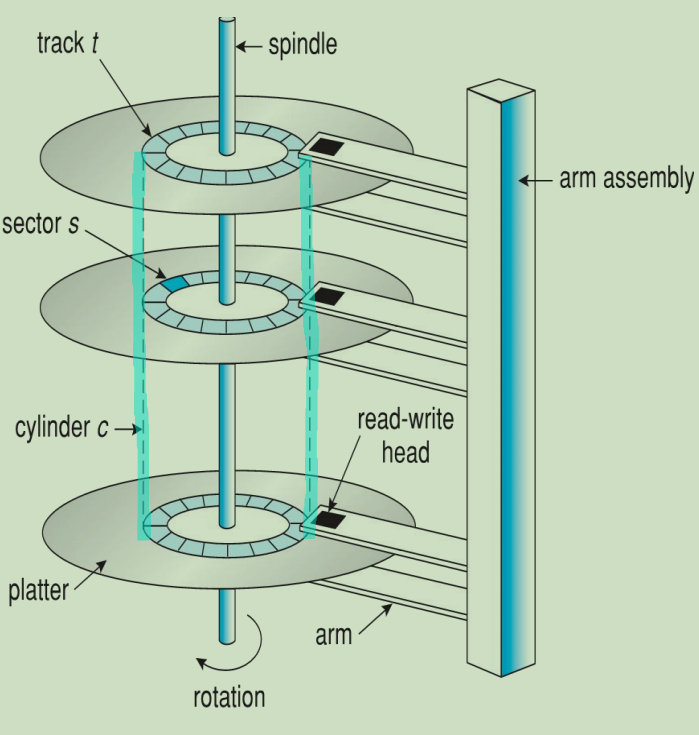

  

- Group of tracks is called a **cylinder 柱面.** 一块硬盘驱动器的圆柱数（或每个盘面的磁道数）既取决于每条磁道的宽窄（同样，也与磁头的大小有关），也取决于定位机构所决定的磁道间步距的大小。数据 的读/写按柱面进行，而不按盘面进行。也就是说，一个磁道写满数据后，就在同一柱面的下一个盘面来写，一个柱面写满后，才移到下一个扇区开始写数据。读数据也按照这种方式进行，这样就提高了硬盘的读/写效率。

- Aluminum  **platters 磁盘面**  with magnetic coating.

- A stack of **16 platters** is about the maximum will find in modern drives.

- A track is logically divided into **sectors 扇区**. The **sectors** are the smallest unit of data that a disk drive will transfer. Each sector can hold a fixed amount of data, typically 512 bytes.

- **Disk address 硬盘地址** can be specified by the **cylinder 柱面, head磁头** and **sector numbers扇区编号**,  or  **CHS addressing**.

- **heads** are attached to a disk **arm** that moves all the heads as a unit.

- 0磁道位于最外圈，数据的存放就是从最外圈开始的

**CHS寻址：**

A disk with **C** cylinders, **H** heads, and **S** sectors per track has **C x H x S** sectors in all

硬盘容量=磁头数×柱面数×扇区数×512字节

CHS是一个三元组：

1. 一共24 bits
2. 其中前10位表示cylinder，中间8位表示head，后面6位表示sector
3. 最大寻址空间

### Disk Speed 硬盘速度

**Transfer time** = the time for data transfer / the time between the start of the transfer and the completion of the transfer. ( if it needs to read some data from the disk, then the transfer time is the time taken to transfer the data from the disk to the application.)

数据传输的时间/从开始传输到完成传输之间的时间。（如果它需要从磁盘读取一些数据，那么传输时间就是将数据从磁盘传输到应用程序所花费的时间。)

**Seek time** = the time taken by the disk head to move from one cylinder to another / the time it will take to reach a track.

**Rotational latency** = the time taken to rotate the platter and bring the required disk sector under the read-write head.

**Positioning time / Random access time** = seek time + rotational latency

**Disk Access Time** = the time to perform any operation on the disk. 

**seek time + rotational latency + transfer time**.

传输速率Transfer rate：驱动器和计算机之间的数据传输速率
寻道时间Seek time：磁头移动到相应的道所需时间
寻转延迟时间Rotational latency：磁盘旋转到相应扇区所需时间
定位时间Random access time：包括寻道时间和旋转等待时间
磁盘访问时间disk access time：包括寻道，旋转，传输的时间。

## Disk Structure 硬盘结构

可将磁盘看成卷饼，由相连的逻辑块号卷起来

磁盘驱动器Disk controller将逻辑块号映射为柱面surface，磁道track，扇区sector

Disk is addressed as a **one-dimension array of logical sectors.**

磁盘是一个由逻辑扇区组成的**一维数组**

- Logical sector 0: the first sector of the first track of the first surface.

  逻辑扇区 0：第一个表面的第一个轨道的第一个扇区。

**Disk controller** maps *logical sector* to *physical sector.*

**磁盘控制器**将*逻辑扇区*映射到*物理扇区*

- The physical sector is what the hard drive actually reads and writes in;

  物理扇区是硬盘驱动器实际读取和写入的地方;

- The logical sector is what you can ask it to read or write in.

  逻辑扇区是您可以要求它读取或写入的扇区。

- The physical sector/block size is always equal to or larger than the logical one.

  物理扇区/块大小总是等于或大于逻辑扇区/块大小。

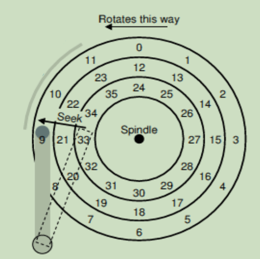

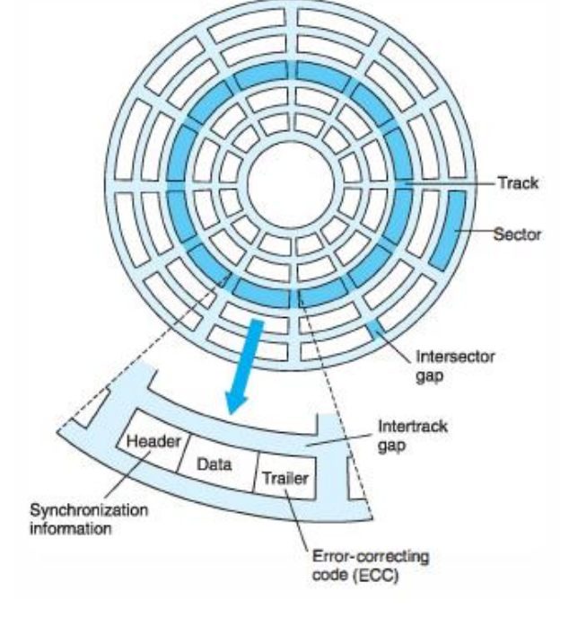

## Disk Attachment 磁盘附件

1. 通过IO接口
   - Host-attached storage，直接插在IO接口上，本地访问。(最常见的接口是集成驱动电子IDE，先进技术附件ATA, USB每个允许最多两个驱动器每个主机控制器)
2. 通过网络
   - Network-Attached Storage，NAS，通过网络远程访问。(fibre channels the most common interconnect, and InfiniBand (high speed connection) 光纤通道是最常见的互连，InfiniBand(高速连接))
   - Storage Area Network，SAN，常见的存储协议，高速访问 (通过TCP/IP, UDP/IP或主机附加协议(如ISCSI)连接))

## Disk Scheduling 磁盘调度

Goal: minimize the *positioning time* *最小化*定位时间

- scheduling is performed by both O.S. and disk itself

  - **O.S. can control**: – Sequence of workload requests 工作负载请求的顺序

  - **Disk knows**: – Geometry, accurate positioning times (the time to move the hard disk arm to desired cylinder (seek time) and time for desired sector to rotate under the disk head (rotational latency))

    几何形状、精确定位时间（硬盘臂移动到所需圆柱的时间（寻道时间）和所需扇区在磁头下旋转的时间（旋转延迟））

假设：

Consider a disk queue with I/O requests on the following cylinders in their arriving order:

考虑一个磁盘队列，其中I/O请求按到达顺序排列在以下柱面上: **98, 183, 37, 122, 14, 124, 65, 67**

The disk **head** is assumed to be at cylinder **53.**

The disk consists of total **200 cylinders** (0-199) .

Every scheduling algorithm should do the following: 每种调度算法都应做到以下几点：

- Minimize arm movement 最小化臂运动

- Minimize mean response time 最小化平均响应时间

### First-Come First-Served FCFS

**total head movement of 640 cylinders**

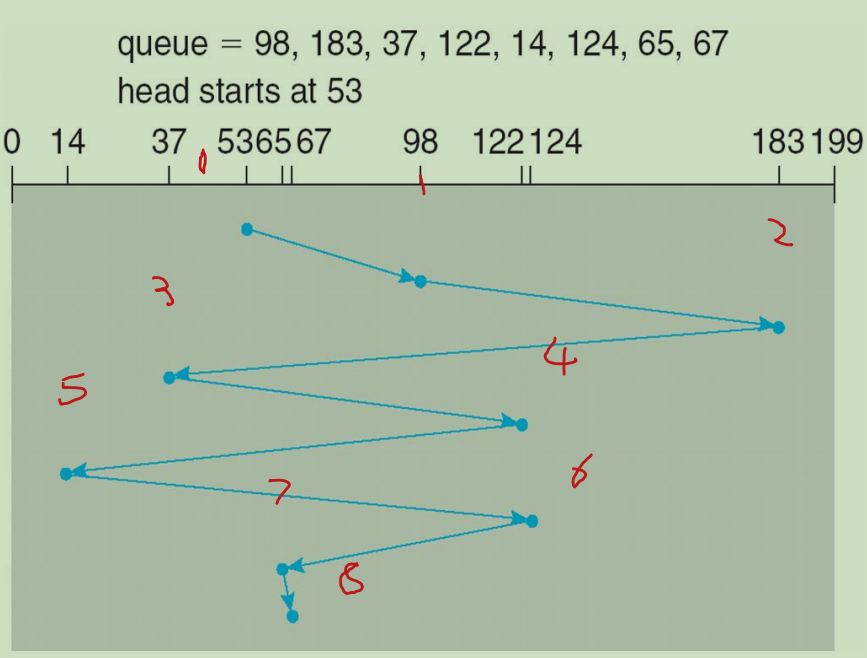

**Head movement**: = |53 – 98|  \+ |98 – 183|  \+ |183 – 37|  \+ |37 – 122|  \+ |122 – 14| \+ |14 – 124|  \+ |124 – 65| \+ |65 – 67| = 640

### Shortest Seek Time First SSFT

selects the request with the minimum seek time (**the next shortest distance**) from the current head position.

选择距当前磁头位置具有最小寻道时间（**下一个最短距离**）的请求。

**total head movement of 236 cylinders**

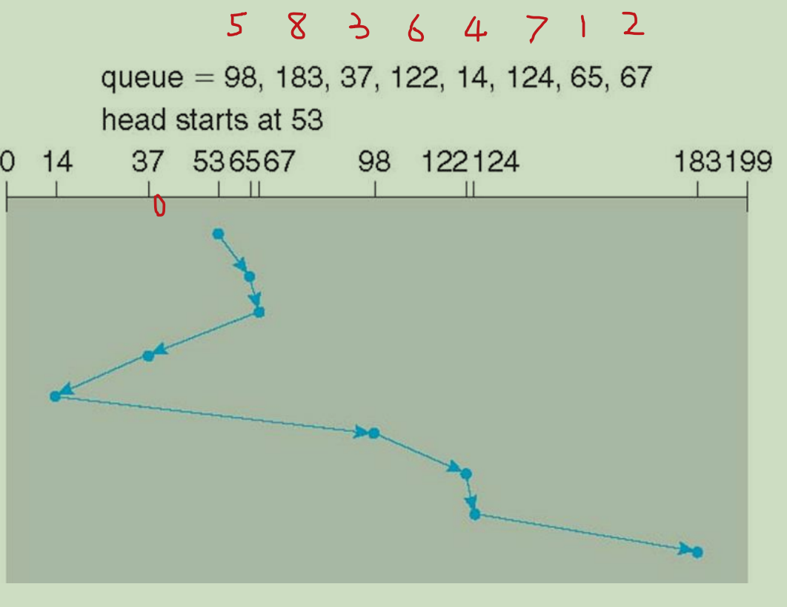

优点：

1. **最小化平均寻道时间：** SSTF 算法通过选择最接近当前磁头位置的请求来最小化寻道时间。这种策略使得平均寻道时间通常比其他算法（如 FCFS 或 SCAN）更低。
2. **相对简单：** SSTF 算法相对于其他高级调度算法来说相对简单，实现起来较为容易。它只需要比较当前磁头位置与请求队列中各个请求的磁道号，然后选择最近的一个。
3. **低延迟：** 由于 SSTF 算法能够快速响应最接近磁头位置的请求，因此可以降低磁盘 I/O 的延迟，提高系统响应速度。

缺点：

1. **可能导致饥饿现象：** 如果有一些请求一直比其他请求更接近当前磁头位置，那么这些请求可能会一直被服务，导致其他请求长时间等待，这种现象称为饥饿现象。
2. **不公平：** SSTF 算法不考虑请求的等待时间或大小，只选择最接近的请求。因此，如果某些请求一直比其他请求更接近当前磁头位置，它们可能会连续被服务，而其他请求则需要等待更长时间。
3. **容易受到噪声干扰：** SSTF 算法容易受到随机性的请求干扰，如果请求队列中的请求分布不均匀或者有突发的请求到达，可能会导致磁头频繁改变位置，增加寻道时间。

### Circular-SCAN / C-SCAN

The head moves from one end of the disk to the  other,  servicing requests as it goes.

磁头从磁盘的一端移动到另一端，一边移动一边处理请求。

When it reaches the other end, however, it immediately returns to the beginning of the disk, without servicing any requests on the return trip.

但是，当它到达另一端时，它立即返回到磁盘的起点，在返回过程中不处理任何请求。

**SCAN (Elevator)**

磁盘头从一侧顶部移动到另一侧顶部，沿途处理请求，到顶后再反向移动到顶，沿途处理请求，

（SCAN和CSCAN具体是从什么方向开始都可以，但是从左走和从右走的具体消耗会不一样，因此要找其中最短的路径）

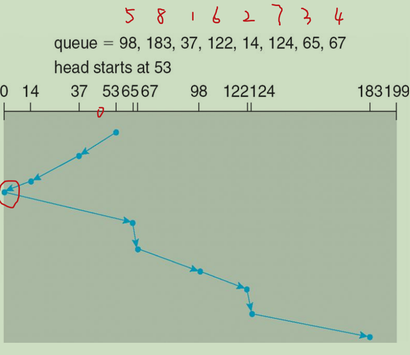

优点：

1. **公平性：** SCAN 算法保证了所有请求都能够被处理，因此相对公平。
2. **磁盘臂移动较短：** SCAN 算法在处理请求时会按照一个方向移动磁头，直到遇到最外层或最内层的磁道，然后再反向移动，这样可以减少磁盘臂的长距离移动。

缺点：

1. **中间磁道请求等待时间较长：** 如果请求分布比较稀疏，磁头在某个方向上移动时可能会跳过一些磁道，导致在某些磁道上的请求等待时间较长。
2. **请求延迟：** 如果有新的请求到达时，SCAN 算法会暂停当前移动方向，改变方向处理新的请求，这可能会增加请求的等待时间。

**Circular-SCAN C-SCAN**

磁盘头从一侧顶部移动到另一侧顶部，沿途处理请求，到顶后反向移动回来到顶，沿途不处理请求，

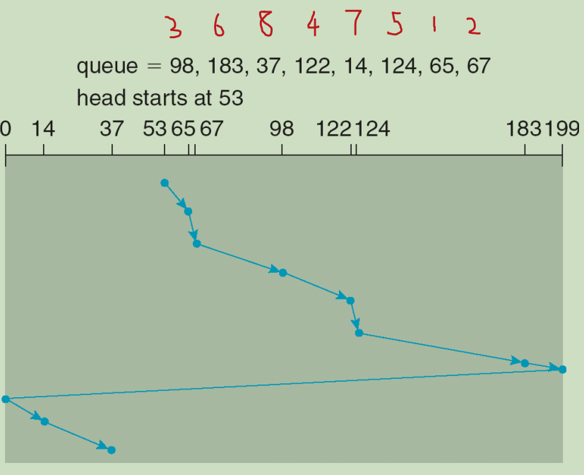

优点：

1. **减少平均等待时间：** CSCAN 算法可以减少平均等待时间，因为它在一个方向上处理所有请求，然后再回到最外层或最内层的磁道处理剩余请求，避免了 SCAN 算法中中间磁道请求等待时间较长的问题。
2. **简单高效：** CSCAN 算法相对于其他算法来说，实现较为简单且效率较高。

缺点：

1. **非公平性：** CSCAN 算法可能导致一些请求长时间等待，特别是在磁头经过某个请求后，直到回到磁道的起点之前，新的请求可能一直得不到处理。
2. **磁盘利用率低：** CSCAN 算法会导致磁头在一个方向上移动到达最外层或最内层的磁道后，直接返回到起点，这样会造成部分磁道可能长时间不被访问，降低了磁盘利用率。

### LOOK

It is a variation of SCAN. The disk head goes as far as the last request and reverses its direction.

它是SCAN的一种变体。磁头移动到最后一个请求的位置并反转其方向。

SCAN的变种，磁盘头向一个方向移动，同时处理请求，直到移动方向没有请求，再反向移动，同时处理请求。

**更好的服务贡献**

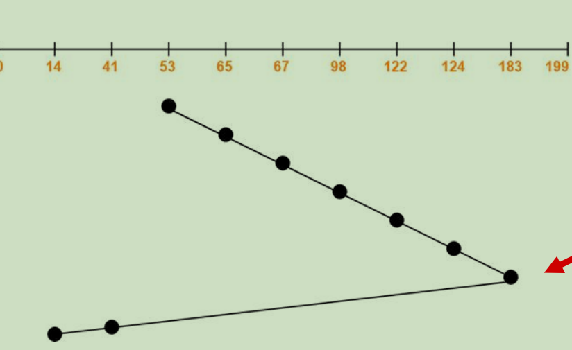

### C-Look

a version of C-SCAN 

Arm only goes as far as the last request in each direction, then reverses direction  immediately, without first going all the way to the end of the disk

Arm只执行每个方向上的最后一个请求，然后立即反转方向，而不首先执行到磁盘的末端 

the head moves till the last request instead of last cylinder. 头部移动到最后一个请求，而不是最后一个圆柱体。

C-SCAN的变种，磁盘头向一个方向移动，直到移动方向没有请求，再反向移动回初始侧的第一个请求，沿途不处理请求。

**灵活性较低**

## Disk Management 硬盘管理

**Low-level formatting**, or **physical formatting** — create sectors on a blank platter

**低级格式化**，或**物理格式化**--在空白盘上创建扇区，分成扇区以便磁盘控制器读写

- Each sector can hold **header** information, plus **data**, plus **error correction code** (**ECC**)

  每个扇区可以保存**报头**信息，加上**数据**，加上**纠错码** (**ECC**)

- Usually, 512 bytes of data but can be selectable

  通常为 512 字节数据，但也可进行选择

**Partition** organize disk in one or more groups of cylinders

**分区** 磁盘分成由一个或多个柱面组成（即分为我们熟悉的C, D, E等盘）

**High level formating** or **Logical formatting** write file system data structures

**高级格式化**，或**逻辑格式化**，创建文件系统。包括撞见文件系统的根目录，对空闲磁盘块进行管理的数据进行初始化。

**Boot block** initializes system

**引导块**初始化系统

自举（bootstrap）存储在ROM中，负责在开机时找到磁盘上的系统引导区，系统引导区中有引导加载程序（Bootstrap loader program），它会找到磁盘上的操作系统内核，装入内存，开始执行系统。

- The **bootstrap** is stored in ROM (Read Only Memory)

  **引导程序**存储在ROM（只读存储器）中

- **Bootstrap loader** program stored in boot blocks of boot partition

  **引导加载程序**程序存储在引导分区的引导块中

Importance:

- A **sector** is a unit of data storage on a hard disk or other storage device(512 byte).

  扇区是硬盘或其他存储设备上的一个数据存储单位(512字节)。

- A **block** is a group of sectors on a hard disk or other storage device that are treated as a unit for data storage and retrieval purposes (1,024 bytes).

  块是硬盘或其他存储设备上的一组扇区，它们被视为数据存储和检索的一个单位(1024字节)。

## Swap-Space Management 交换空间管理

**Swap-space** — Virtual memory uses disk space as an extension of main memory

**交换空间**--虚拟内存使用磁盘空间作为主内存的扩展

Configure **Swap-space**: 配置**交换空间**:

- on a **swap file** in a file system

  在文件系统中的**交换文件**上

  交换文件（swap file）是一种在计算机系统中用于扩展虚拟内存的文件。其作用类似于交换空间（swap space），用于暂存内存中暂时不需要的数据或进程，以便释放内存供其他进程使用。

  - changing the size of a swap file is easier.

    更改交换文件的大小更容易。

- on a separate **swap partition**

  在单独的**交换分区**上

  是专门用于交换空间的硬盘分区。是实现交换空间的一种方式，通过在磁盘上换份一个特定的分区作为交换空间。

  - swap partition is faster but difficult to set it up (how much swap space your system requires?)
  
    交换分区速度更快，但难以设置（你的系统需要多少交换空间？）

**Solution**: start with a swap file and create a swap partition when it knows what the system requires.

**解决方案**:从交换文件开始，在知道系统需要的情况下创建交换分区。（先使用交换空间，随后建立交换分区）

**Swap-space management**

**交换空间管理**

- Kernel uses **swap maps** to track swap-space use

  内核使用**交换映射**来跟踪交换空间的使用情况

## RAID Structure

**RAID**: **R**edundant **A**rrays of **I**ndependent **D**isks

RAID is a system of data storage that uses multiple hard disk drives to store data.

RAID是一种使用多个硬盘驱动器来存储数据的数据存储系统。

RAID is a set of physical drives viewed by the operating system as a single logical drive. There are several different **storage methods**, named **levels**. **RAID controller** is used for controlling a RAID array. It may be hardware- or software-based.

将多个磁盘组合在一起的磁盘存储系统，操作系统将它们看成一个盘，有不同的**存储方式**，叫做级别**levels**，还有个**RAID控制器**来控制这些磁盘（基于硬件层面或软件层面）

3 Main Techniques：

Mirroring镜像，将完整数据写入两个以上盘

如果一个磁盘发生故障，镜像会保留故障磁盘的数据。

Striping分散，将数据拆分成块chunks，连续写入不同的盘。提高了数据传递速率（**high data-transfer rates**），因为可以从多个盘同时读不同部分的数据。

Error correction 纠错， 存储冗余数据，允许错误的检测和可能的修复

### RAID 0

- Level 0 does **not provide redundancy**. 

  级别0**不提供冗余**。

- Raid 0 treats multiple disks as a single partition

  Raid 0将多个磁盘视为一个分区

- **Files are Striped across disks, no redundant info**.

  **文件是条纹跨磁盘，没有多余的信息**。

- High read throughput.

  读取吞吐量高。

- Any disk failure results in data loss.

  任何磁盘故障都会导致数据丢失。

  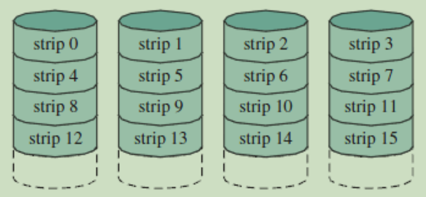

### RAID 1

- **disk mirroring**

- **uses striping**

- is called a *mirrored* configuration because it provides redundancy by having a duplicate set of all data in a mirror array of disks, which acts as a backup system in the event of hardware failure.

  之所以称为*镜像*配置，是因为它通过在磁盘镜像阵列中复制一套所有数据来提供冗余，在硬件发生故障时作为备份系统。

### RAID 2

- **memory-style error-correcting-code organization** **内存式纠错代码组织**

- an error-correcting code is calculated across corresponding bits on each data disk, and the bits of the code are stored in the corresponding bit positions on *multiple parity disks*.

  在每个数据盘上的对应比特上计算纠错码，并且该码的比特被存储在*多个奇偶校验盘*上的对应的比特位置中。

- uses *very small strips* (often the size of a word or a byte)  使用*非常小的条带*（通常是单词或字节的大小）

前面四个盘是数据盘，后面三个盘是纠错码
RAID2读数据时，能同时使用多个数据盘的带宽；
RAID2写数据时，除了写数据盘，还需要写校验盘，写性能会有下降
因为存在数据纠错，所以在坏盘的情况下可以实现数据拯救

### RAID 3

- **bit-interleaved parity organization** is a modification of Level 2 and requires only a single redundant disk, no matter how large the disk array.

  使用*非常小的条带*（通常是一个字或一个字节的大小）

- single parity bit can be used for error correction / detection for *each strip*, and it is stored in the **<u>dedicated parity disk</u>**.

  单个奇偶校验位可以用于*每个条带*的纠错/检测，并且它被存储在**专用奇偶校验盘**中。

由于按照字节切分数据，读数据时，一定会同时从多个盘读数据，可以利用所有数据盘的带宽；写数据时，也会利用所有磁盘的带宽，但所有的写校验数据都会在一个盘，因此，写性能主要受限于校验盘

假设:

Suppose, strip X = {1010}, **the parity bit is 0 as there are even number of 1s.** 

Suppose strip X = {1110}, **the parity bit here is 1 as there are odd number of 1s.**

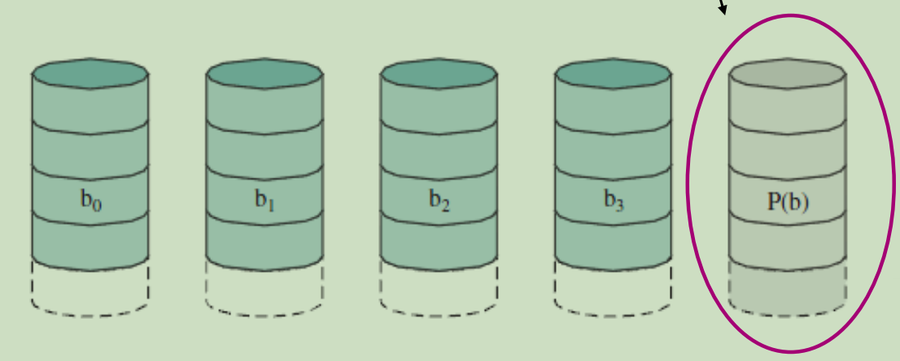

### RAID 4

- **block-interleaved parity organization** **uses large-sized strips**, and the data is striped as **fixed-sized blocks**;

  **块交错奇偶校验组织使用大条带**，数据以**固定大小的块**分条;

- one block in size is 512 bytes by default but can be specified otherwise.

  一个块的大小默认为512字节，但可以另行指定。

- provides **block-level striping** (the same strip scheme found in Levels 0 and 1) and stores a parity block on a **<u>dedicated disk</u>**.

  提供**块级条带**(在级别0和1中发现的相同条带方案)并在**专用磁盘**上存储奇偶校验块。

把数据按照分块分别存在不同的磁盘中，并且最后一个磁盘提供纠错冗余

读数据时，当数据分布在多块盘时，能够利用多块数据盘的带宽；
写数据时，如果数据分布在多快盘时，能利用所有磁盘带宽，但写校验数据只能在一块盘上，因此，写性能主要受限于校验盘

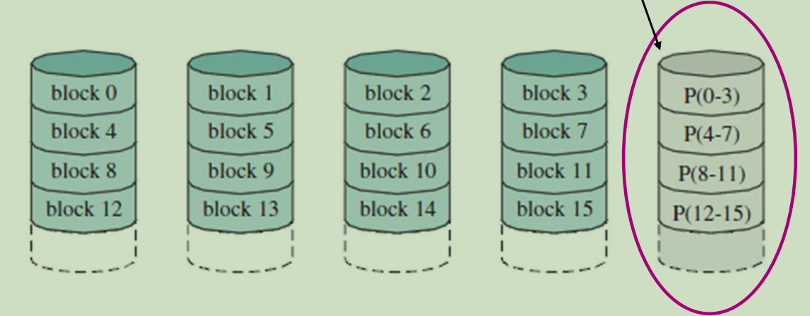

### RAID 5

- **block-interleaved distributed parity** is a modification of Level 4

  **块交错分布奇偶校验**是级别4的修改

- the parity bits are not stored in a single disk,

  奇偶校验位不存储在单个磁盘中，

- **distributes the parity strips <u>across</u> the disks**.

  **在磁盘**上分配奇偶校验条。

  acorss:

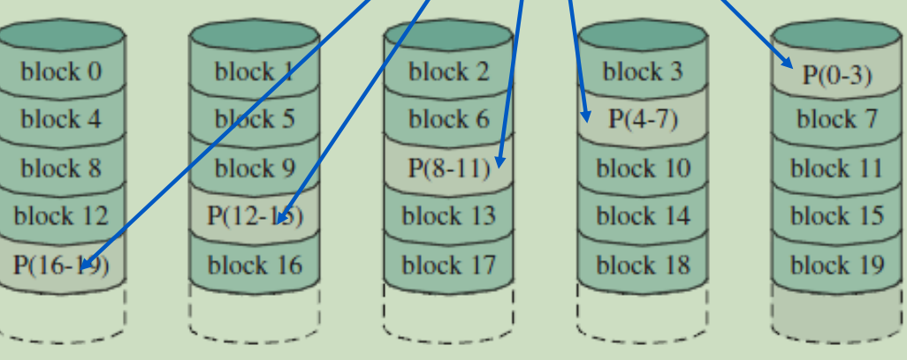

最多只允许一个硬盘损坏

### RAID 6

P + Q redundancy scheme P+Q冗余方案: 具有双(双)奇偶校验的独立数据磁盘额外的错误检测和纠正程度(奇偶校验和里德-所罗门码)

- **one calculation** is the same as that used in *Levels 4* and *5*
- the other is an **independent data-check algorithm**

Both parities (P and Q) are distributed on separate disks across the array. The double parity allows for data restoration even if two disks fail.

两个奇偶(P和Q)分布在整个阵列的单独磁盘上。双奇偶校验允许在两个磁盘故障的情况下恢复数据。

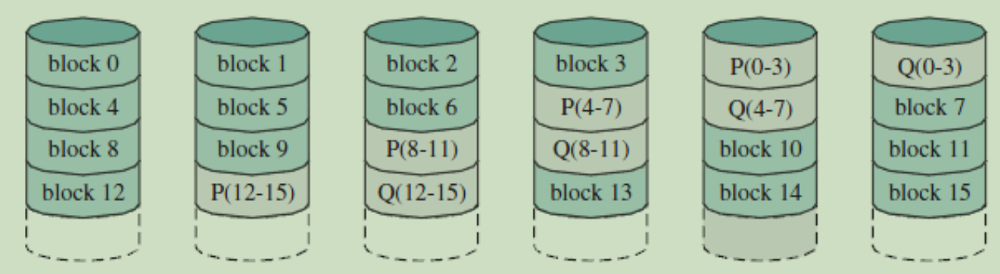

RAID level 6 may suffer in performance due to two parity disks. RAID级别6存在两个校验盘，可能导致性能下降。

最好使用RAID级别组合

通过将数据校验位增加以为，所以允许损坏的硬盘数量位2个

### RAID 0 + 1

数据先是被块分散，然后对这些已经被分散了的raid0创建数据镜像

a set of *n* disks are striped, and then the stripe is mirrored on *n* redundant disks.

将一组*n*个磁盘分条，然后将分条镜像到*n*个冗余磁盘上。

**“Mirror of stripes”** 

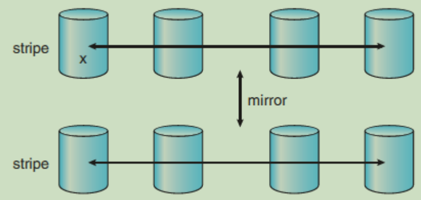

### RAID 1+ 0

数据先被挨个镜像，然后这些raid1互相被块分散

The advantage in 1 + 0 is that in case of failure of a single disk, the mirror copy of the whole disk is available.

1 + 0的优点是，在单个磁盘出现故障的情况下，可以使用整个磁盘的镜像副本

is ideal for highly utilized database servers or any server that's performing many write operations.

非常适合高利用率的数据库服务器或执行许多写操作的任何服务器。

gives the best performance, but it is also costly (requires twice as many disks as other RAID levels).

提供最好的性能，但它也很昂贵(需要的磁盘数量是其他RAID级别的两倍)。

**“Stripes of Mirror”** 

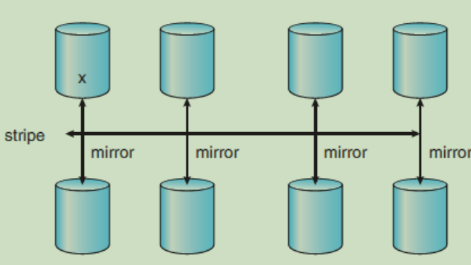

### Conclusion

RAID is secure because mirroring duplicates all your data
RAID is fast because the data is striped across multiple disks; chunks of data can be read and written to different disks simultaneously.
RAID is not a backup. A backup is a copy of data, which
is stored somewhere else and is detached from the original
data both in space and time.

安全，镜像保存了数据
快速，多个磁盘共读写
冗余不是备份，备份的数据空间时间与原始数据分离，冗余的数据必须与原始数据放一起

